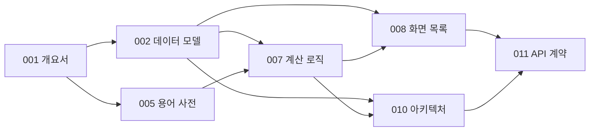

# 문서 인덱스

**언제들어오나** — ELS 통합관리 시스템

| 항목 | 내용 |
|---|---|
| 문서 ID | DOC-000 |
| 버전 | 1.0 |
| 최종 갱신 | 2026-07-28 |

---

## 1. 문서 목록

| ID | 문서 | 파일 | 버전 | 상태 |
|---|---|---|---|---|
| DOC-000 | 문서 인덱스 | `00_문서_인덱스.md` | 1.0 | 작성 |
| DOC-001 | 프로젝트 개요서 | `01_프로젝트_개요서.md` | 0.6 | 작성 |
| DOC-002 | 데이터 모델 | `02_데이터_모델.md` | 0.6 | 작성 |
| DOC-003 | 유스케이스 · 사용자 스토리 | — | — | 미작성 |
| DOC-004 | 요구사항 정의서(SRS) | — | — | 미작성 |
| DOC-005 | 용어 사전 | `05_용어_사전.md` | 0.3 | 작성 |
| DOC-006 | 데이터 사전 | — | — | 미작성 (구현 후 역작성) |
| DOC-007 | 계산 로직 명세 | `07_계산_로직_명세.md` | 0.5 | 작성 |
| DOC-008 | 정보구조 및 화면 목록 | `08_정보구조_및_화면목록.md` | 0.3 | 작성 |
| DOC-009 | 화면설계서 | — | — | 미작성 (구현 후 역작성) |
| DOC-010 | 아키텍처 및 기술 결정 | `10_아키텍처_및_기술결정.md` | 1.0 | 작성 |
| DOC-011 | API · 계약 명세 | `11_API_계약_명세.md` | 1.2 | 작성 |
| DOC-012 | 테스트 계획 | — | — | 미작성 |
| DOC-013 | 배포 · 운영 | — | — | 미작성 |

> DOC-003·004는 선행 문서에 내용이 흡수되어 있어 후순위로 둔다. DOC-006·009는 구현 결과 기준으로 역작성한다(DOC-001 §10).

> **v0.5에서 버전 표의 드리프트를 정정했다.** 표는 DOC-005를 `0.1`로 적고 있었으나 실제 파일은 이미 `0.2`였다. 이 표가 유일한 교차 확인 지점이므로 갱신을 빠뜨리면 하류 문서가 어느 버전을 전제로 쓰였는지 알 수 없게 된다. 문서 버전을 올릴 때 이 표를 함께 고친다.

---

## 2. 문서 간 의존 관계

**변경 파급.** 상류 문서를 바꾸면 하류 문서를 함께 검토한다. 특히 DOC-002(데이터 모델) 변경은 DOC-007·008·010·011 전부에 영향을 준다.

---

## 3. 구현 단계

각 단계는 독립적으로 동작하는 상태에서 종료한다(R-05 대응).

> 각 단계 종료 후 별도 컨텍스트에서 산출물을 명세와 대조 검증하고, 발견된 갭은 x.5 단계로 닫는다.

| 단계 | 내용 | 참조 문서 | 완료 기준 |
|---|---|---|---|
| **P0** | 스캐폴드 | DOC-010 §5 | 프로젝트 생성, `docs/` 커밋, 린트 규칙(DEP-04) 동작 |
| **P1** | 순수 도메인 모듈 | **DOC-007** | `lib/tax`·`lib/domain` 구현, **TC-01~22 전체 통과** |
| **P2** | 스키마 | DOC-002, DOC-010 §7 | 마이그레이션·RLS·세율 시드 적용, RLS 테스트 통과 |
| **P3a** | 데이터 접근 · 조회 계약 | DOC-011 §4 | **완료.** DB 클라이언트, 조회 함수 8개(§4.1~§4.6·§4.8·§4.9), PostgREST 읽기 경로 실측. 공개 가입 차단(SEC-03) 실이행, `total_rounds` 삭제(DQ-05), `users` 조회 열 단위 축소, 스위트 3분할(237 + 130 + 115) |
| **P3a.5** | 조회 계약 대조 검증 · 정정 | DOC-011 §4 | **완료.** §4.2에 D1의 억제 범위 확정(입력 기준 — 결함은 그것이 파괴한 입력을 쓰는 파생값에만 미친다). §4.3 `projection`·`isWorst`, §4.1 `attentionItems` 정정, §4.0 Q-07 시세 분류 신설, §4.6 결함 표식. 항진명제였던 N+1 테스트를 성장 불변 + 요청 경로 다중집합으로 교체, Q-07 형식 적합성 검사 신설. 스위트 **252 + 130 + 134** (P3a 대비 +15 / ±0 / +19) |
| **P3b** | 변경 계약 | DOC-011 §5, §6 | **완료.** 변경 계약 **11개**(§5.5가 두 개다), 검증 규칙 V-01~V-20, 순수 모듈 예외 → `ErrorCode` 변환(AQ-17 종결), DB 오류 → `ErrorCode` 매핑(§3.2.1). **쓰기 함수 2개**로 §5.1·§5.2의 원자성을 성립시키고 I-07에 DB 층 방어를 부여했다 — **대조군과 함께 실측**했다(요청 3개로 나누면 기초자산 0건 상품이 실제로 남는다). 값 범위 CHECK 4개(DQ-06 부분 해결), 함수 권한 축 방어(AQ-28), **`InsertPayload<T>`로 Q-08의 쓰기 방향 폐쇄(AQ-30)**. 서버 액션 결선(`app/actions.ts`). 스위트 **383 + 166 + 189** (P3a.5 대비 +131 / +36 / +55) |
| **P3b.5** | 변경 계약 대조 검증 · 정정 | DOC-011 §5, §6 | **완료.** 감사 8건을 닫았다. **문서가 정본인 4건** — §3.2.1 제약 이름 표에 누락 9행 추가(대조가 `arrayContaining`이라 뒤처짐이 조용했다), V-18의 `fields` 키를 `kiTouchedAt`으로 통일(층마다 다른 칸을 가리키고 있었다), `RULE_IDS`·`BY_CONSTRAINT`를 **문서 파싱으로 양방향 대조**(`tests/db/docs-contract.test.ts` 신설), AQ-30에 W-04의 적용 범위 11개 중 9개 명시. **측정이 없던 4건** — W-05 둘째 겹을 **어긋난 컨텍스트로 RLS 0행을 결정적으로 만들어** 5경로 전부 확인(종전 호출 지점 9곳에 0건), 원천징수의 절사·귀속연도를 구분 가능하게(검증값이 요율의 정확한 배수였고 상환일·기준일이 같은 해였다), `update_els_product`의 I-07 두 블록에 대칭 케이스, 함수 축의 네 번째 속성 `proconfig`. `Problems.add`를 `RuleId`로 좁혔다. **신규 테스트 전부를 음성 대조로 확인**했다(대상 코드를 깨뜨려 빨간불을 보고 되돌렸다 — 9건, 그중 1건은 대조 자체가 무효여서 다시 했다). 스위트 **394 + 169 + 199** (P3b 대비 +11 / +3 / +10) |
| **P4** | 화면 | DOC-008 | SCR-001·901·902(선행 조건 ②③④와 함께) → **302** → 201 → 202 → 204 → 203 → 301 → 401 → 101 → 502. SCR-501은 만들지 않는다(SQ-01). **선행 조건은 아래 표를 따른다** — ②③④는 화면 전에, ①은 P4b에서 SCR-402와 함께 |
| **P4b** | 다년도 전망 | DOC-007 §7.5, DOC-011 §4.7 | 선행 조건 ① — RD-02 결정 → §7.5 신설 → `getForecast` 구현 → **SCR-402**. 화면이 아니라 **계약 신설**이므로 분리한다 |
| **P5** | 시세 연동 | DOC-010 ADR-004 | 스텁 어댑터 → 실제 공급자, Cron |
| **P6** | 문서 역작성 | — | DOC-006·009·012·013 |

### P1을 먼저 하는 이유

1. **인프라 없이 완결된다.** DB·인증·배포 없이 구현과 검증이 끝난다
2. **즉시 검증 가능하다.** TC-01~22가 이미 정답을 갖고 있다
3. **최대 리스크를 먼저 제거한다.** R-01(세금 계산 정확성 결함)이 가장 높은 영향도를 갖는다
4. **이후 작업의 기준이 된다.** 화면·계약이 이 모듈의 출력 형태에 맞춰진다

### P4 선행 조건 (v0.8에서 4건으로 확정, v1.0에서 ①의 위치를 좁혔다)

P3a·P3b가 남긴 것들이다. 공통점은 화면이 붙는 순간 결함이 사용자에게 보이거나(①③) 조용히 나가는(②④) 종류라는 것이다.

> **v0.8의 「넷 다 화면을 세우기 전에 닫는다」를 좁힌다 (v1.0, U-03).** 철회가 아니라 **범위 축소**이며 사유는 그 규칙이 스스로 밝힌 근거에 있다 — 넷을 앞에 둔 까닭은 "화면이 붙는 순간" 결함이 드러나기 때문인데, **①의 결함 형태는 아래 표에 「SCR-402가 빈 열을 렌더링한다」 하나로 적혀 있다.** 즉 ①의 위험은 SCR-402가 존재할 때만 발생한다. ②③④는 어느 화면이 서든 즉시 노출되지만(②는 조회만 하는 모든 화면에서 토큰이 영원히 저장되지 않고, ③은 아무 예외나 Next 기본 화면으로 나가고, ④는 인증 쿠키를 실은 응답이 캐시될 수 있다) ①은 그렇지 않다. **①을 앞에 두고 SCR-402를 뒤에 두면 그 사이 §7.5가 소비자 없이 방치되고, 그 상태에서 정한 산식이 맞는지는 화면이 설 때에야 안다.** 따라서 **②③④는 화면 전에, ①은 P4b에서 SCR-402와 함께** 닫는다. ①은 코드 0줄의 문서·결정 작업이므로 ②③④와 자원이 겹치지도 않는다.

| # | 항목 | 무엇이 없는가 | 닫지 않고 P4를 시작하면 |
|---|---|---|---|
| ① | **DOC-007 §7.5 신설 + RD-02 결정** (**P4b**) | 문서에 `§7.5`가 없다. DOC-011 §4.7 `getForecast`의 `totalAssets`·`remainingPrincipal`은 **어느 문서에도 산식이 없어** 조회 계약 8개에서 의도적으로 빠져 있다 | SCR-402가 **빈 열을 렌더링**한다. 두 값은 "그 연도 말 미상환 상품" 집합에 의존하고 그 집합은 적용 차수(RD-02)가 정한다. **RD-02는 P4 계획 시점에 닫혔다** — 「다음 도래 평가일의 차수」 유지 + `getForecast` 전용 비영속 `scenario` 인자(§4 RD-02 행) |
| ② | **`src/proxy.ts` 세션 갱신** | 파일이 없다. `jwt_expiry = 3600`(`supabase/config.toml`)이므로 토큰은 **1시간 뒤 처음 갱신된다** | 서버 컴포넌트의 쿠키 어댑터는 무연산이라(`readOnlyCookieAdapter`) 갱신 토큰을 저장하지 못하고, 매 요청이 다시 갱신한다. **개발 중 1시간 안에는 보이지 않다가 운영에서 드러난다** — 서버 액션 경로만 쓰기 가능 어댑터를 가지므로(P3b 8단계) 조회만 하는 화면에서는 영원히 저장되지 않는다 |
| ③ | **에러 경계** | `app/error.tsx`·`app/not-found.tsx`가 없다 | 조회 계약은 미존재에 `null`, 시스템 오류에 **예외**를 쓴다(§3.1·Q-04). 받을 경계가 없으면 그 예외가 Next 기본 화면으로 나가고, `getQueries()`의 미인증 예외도 SCR-001 유도가 아니라 오류 화면이 된다. **변경 계약은 이 문제가 없다** — W-03이 결과 객체를 쓰므로 입력값이 보존된다 |
| ④ | **`setAll`의 응답 헤더 처리** | 어댑터가 두 번째 인자(캐시 금지 헤더)를 받아 두고 **아무도 쓰지 않는다** | 인증 쿠키를 싣는 응답이 CDN·리버스 프록시에 캐시되면 **한 사용자의 세션 토큰이 다른 사용자에게 나간다.** 지금 안전한 이유는 서버 액션 응답이 POST라 Next가 캐시하지 않기 때문이지 헤더가 불필요해서가 아니다 — ②의 미들웨어와 §7.1 배치 Route Handler는 **반드시 실어야 한다** |

> **④의 출처.** 무연산 어댑터는 P3a부터 이 인자를 삼키고 있었고(그쪽은 헤더를 실을 자리 자체가 없다), 위험의 성격이 드러난 것은 **P3b 8단계**에 쓰기 가능 어댑터를 결선하면서다. 그래서 `writableCookieAdapter`는 인자를 삼키지 않고 주입하는 쪽에 그대로 넘긴다 — 어댑터가 결정을 대신하면 ②를 붙이는 사람이 그 인자의 존재를 모른다.

> **②와 ④는 같은 파일에서 닫힌다.** 프록시는 응답 객체를 들고 있으므로 쿠키와 헤더를 함께 실을 수 있는 **유일한 자리**다. 둘을 따로 계획하면 프록시를 붙이면서 헤더를 빠뜨리고, 그때는 ④가 "이미 처리된 것"으로 보인다.

> **②의 이름을 `middleware.ts`에서 `src/proxy.ts`로 고쳤다 (v1.0). 프레임워크가 강제한 정정이며 설계 변경이 아니다.** 실측(`node_modules/next` 16.2.12) — `PROXY_FILENAME = 'proxy'`(`next/dist/lib/constants.js:289`), `"middleware" file convention is deprecated. Please use "proxy" instead.`(`next/dist/build/index.js:651`), 두 파일이 함께 있으면 **빌드 에러**(`:645`).
>
> 네 번째 사실이 이 항목의 위험 하나를 없앴다 — `Route segment config is not allowed in Proxy file. **Proxy always runs on Node.js runtime.**`(`next/dist/build/analysis/get-page-static-info.js:587`). 구 Edge 미들웨어 런타임이었다면 `src/lib/db/env.ts`의 `process.env[name]`이 **계산된 멤버 접근이라 define 플러그인이 인라인하지 못해** 요청 시점에 던졌을 것이고, 프록시는 전 경로에 걸리므로 **앱 전체가 죽었을 것이다.** 런타임이 Node로 고정되면서 그 함정이 사라졌다.

### P4 화면 순서의 근거 (v1.0에서 교체)

> **종전 근거를 철회한다 (U-03).** v0.8까지의 근거는 「목록·상세로 데이터를 볼 수 있게 만든 뒤 등록·상환으로 데이터를 넣고, 그 데이터로 세금·전망을 계산한다」였다. **그것은 데이터가 있을 때의 근거다.** `supabase/seed/`에는 사용자뿐이고(`00_rls_test_users.sql`·`01_integration_users.sql`) `refreshPrices`는 P5까지 항상 `PROVIDER_UNAVAILABLE`이다(§5.8, 공급자 0개). SCR-201을 먼저 지으면 `worstOf`·`kiStatus`·`conditionResult`·`dDay`가 전부 `null`인 화면을 만들고, 그 카드가 맞는지는 네 컷 뒤에나 안다. 홈을 마지막에 두는 판단은 유지한다.

**첫 화면은 자급 가능한 것이어야 한다.** SCR-302(시세 관리)가 유일하게 자기 변경 계약만으로 자기 화면에 실데이터를 채운다 — 자산 등록 → 행 생김 → 시세 입력 → 값·`isStale`·출처 표시. SCR-201·202·301은 SCR-204에 의존하고 204는 자산에 의존하므로, 자산 → 시세 → 상품은 선택이 아니라 **위상 정렬 결과**다.

**그리고 302가 가장 싼 폼인데 오류 표면이 가장 넓다.** 배열이 없고 인덱스 붙은 `fields` 키도 없는데 V-15·V-17·V-19·`CONFLICT`(`nulls not distinct` 중복)·`PROVIDER_UNAVAILABLE`이 나온다 — **`ErrorCode` 7개 중 5개가 이 한 화면에서 실물로 나온다.** 특히 ST-03(자동 조회 실패는 오류가 아니라 폴백 안내)을 나중에 만나면 이미 만들어 둔 "오류 = 빨간 박스"를 되돌려야 한다.

**SCR-402를 P4b로 분리하는 이유는 그것이 화면이 아니기 때문이다.** RD-02 결정 + DOC-007 §7.5 신설 + `getForecast` 계약 구현 + 세 스위트 갱신이며, 화면은 그 위에 얹히는 마지막 조각이다. SCR-101 앞에 두면 앱이 미완성인 채로 학기 경계를 넘는다(R-05).

**SCR-001·901·902는 선행 조건 ②③④와 같은 작업에서 선다.** 셋 다 그 셋이 붙는 바로 그 코드이며, 로그인이 없으면 `getQueries()`가 던지므로 어떤 화면도 렌더링되지 않는다.

### P3을 조회와 변경으로 쪼갠 이유

종전 완료 기준("검증 규칙 V-01~16")은 V-17·V-18이 신설되면서 이미 낡아 있었다. 더 실질적인 이유는 두 절의 성질이 다르다는 것이다 — 조회는 예외를 전파하고(§3.1) 변경은 결과 객체를 반환하므로, 순수 모듈의 예외를 어떻게 다룰지가 정반대다(AQ-17). 조회를 먼저 닫으면 DB 접근 계층과 PostgREST 경로가 실측으로 검증된 상태에서 변경 계약이 그 위에 얹힌다. 각 단계가 동작하는 상태로 끝난다는 원칙(R-05)도 유지된다.

---

## 4. 미결정 사항 통합

각 문서에 흩어진 미결 항목이다. 이슈 트래커로 옮겨 관리한다.

| ID | 항목 | 문서 | 결정 시점 |
|---|---|---|---|
| Q-04 | 리자드 변형 수용 범위 | DOC-001 | **해결 (P1)** — 차수별 3속성으로 확정 |
| DQ-01 | 소프트 삭제 도입 | DOC-002 | **해결 (P2)** — 하드 삭제. 단 상환 완료 상품은 삭제 불가. AQ-07 동일 |
| DQ-02 | 시세 결측일 처리 | DOC-002 | P5 |
| DQ-03 | 원금 분할 매수 지원 | DOC-002 | 보류 |
| DQ-04 | 감사 로그 범위 | DOC-002 | 보류 |
| RD-01 | 세액 절사 단위 | DOC-007 | 미결 — P1에서 주입 인자로 격리 완료(기본 원 단위). **단위 확정만 잔여**, 실제 거래내역 대조 시점 |
| RD-02 | 기본 적용 차수 | DOC-007 | **해결 (P4 계획)** — 기본값은 **「다음 도래 평가일의 차수」로 확정 유지**하고, 사용자 조정은 **`getForecast` 전용 비영속 `scenario` 인자**로 둔다(저장하지 않는다). 근거 셋 — ① 기본값을 바꾸면 §4.1·§4.3·§4.6·§4.8이 전부 값이 달라지는데 그것들은 이미 실측·검증된 상태다 ② §4.6의 `override`(비영속 시뮬레이션)라는 **동형의 선례**가 같은 문서에 있다 ③ 영속 컬럼은 DQ-05(유도값 저장 금지)·RD-06(재산출로 충분)과 정면으로 어긋나고 AQ-29의 우회면을 넓힌다. **스키마 변경 0, 호출부 변경 0.** 산식은 P4b의 DOC-007 §7.5 |
| RD-03 | 평가일 영업일 조정 | DOC-007 | 보류 |
| SQ-01 | SCR-501 유지 여부 | DOC-008 | **해결 (P4)** — **만들지 않는다.** DOC-008 §5 SCR-201이 스스로 "소유자 필터가 사용자 현황 화면을 대체한다"고 적었다. `listUserSummaries`는 계약으로 남긴다(삭제하지 않는다). 화면이 없으면 **AQ-18(타인 `isComprehensive`를 `security definer`로 제공할지)도 열린 채로 정상**이다 — 그 값이 화면 문제가 되려면 501이 있어야 한다 |
| SQ-03 | 홈 기본 표시 범위 | DOC-008 | **해결 (P4)** — **본인(MINE)**. 전체 보기 전환은 유지한다(계약이 이미 두 값을 받는다). `scope = 'ALL'`이어도 `currentYearTax`는 본인 기준이므로(D-02, 절대 규칙 #7) 전체 보기는 **상단이 전원이고 세금이 본인인 화면** — 한 화면에 주어가 둘이 된다. 두 경우 모두 "올해 금융소득(**본인**)"으로 명시한다 |
| AQ-01 | 시세 공급자 선정 | DOC-010 | P5 (ADR-007) |
| AQ-05 | 세율 마이그레이션 검증 절차 | DOC-010 | **해결 (P2)** — SQL 파싱(상시)과 DB 조회(RLS 스위트) 이중 게이트 |
| AQ-06 | 자동값의 수동값 덮어쓰기 | DOC-011 | P5 |
| AQ-07 | 상품 삭제 시 소프트 삭제 | DOC-011 | **해결 (P2)** — DQ-01과 동일 |
| AQ-10 | 입력 검증 라이브러리 | DOC-011 | **해결 (P3b)** — 도구를 도입하지 않는다. 손으로 쓴 조합기 + 규칙 ID 전수 열거 단언. 스키마 라이브러리의 `coerce`가 Q-08의 구문 수준 강제 변환 금지를 우회하는 벡터가 되는 것이 첫 근거다 |
| DQ-05 | `total_rounds` 유지 여부 | DOC-002 | **해결 (P3a)** — 컬럼 삭제. 총 차수·만기일의 정본은 모두 `redemption_schedules`이며 총 차수는 **행 수**다(`max(round_no)` 아님). 입력 계층에는 남는다 |
| AQ-17 | 순수 모듈 예외의 계약 변환 | DOC-011 | **해결 (P3b)** — 조회는 행 단위 격리(`integrityIssue`), 변경은 **호출 지점이 코드를 부여**한다(§3.2.2). 예외 클래스가 전부 `RangeError`이므로 클래스로는 입력 오류와 상태 결함을 구분할 수 없다. `CONFLICT`는 이 경로에서 나오지 않으며 기본값은 `INTERNAL`이다 |
| AQ-27 | 귀속연도 파생 지점의 이원화 | DOC-011 | **해결 (P3b)** — `today.ts`의 `currentYear()` 하나로 합쳤다. 교체가 형식 검사도 함께 들여왔다 — 종전 자리(문자열 자르기)에는 그것이 없어 깨진 기준일이 `NaN`으로 세율 조회에 흘렀다 |
| AQ-30 | 생성 타입의 쓰기 방향이 Q-08과 어긋난다 | DOC-011 | **해결 (P3b)** — **실측이 결정했다.** 생성 타입이 요구하는 대로 JSON 수치로 실으면 `99999999999.999999`가 `100000000000.000000`으로 저장된다(오류도 경고도 없다). `InsertPayload<T>`가 열 사양에서 금액 열을 파생해 `string`으로 바꾸고, 린트가 `.insert()`·`.upsert()`·`.update()`의 리터럴 인자를 금지해 우회를 막는다. 읽기·쓰기가 `CountingColumn` 하나를 공유하므로 두 방향이 갈릴 수 없다 |
| — | D1 억제 범위 (결함 상품의 파생값) | DOC-011 §4.2 | **해결 (P3a.5)** — 입력 기준. 억제는 그 결함이 파괴한 입력을 쓰는 값에만 미친다. AQ-17이 조회에서 정한 "멈추는 범위가 원인의 범위를 넘지 않는다"의 두 번째 적용이다. `integrityIssue` 축과 E-05 축은 별개이며 겹치면 둘 다 걸린다 |

> Q-01(프로젝트 명칭)은 「언제들어오나」로 확정되어 목록에서 제외했다. P0 착수 제약 없음.

> **본 표에 롤업되지 않은 미결 항목이 있다 (v0.5에서 발견).** P2·P2.5에서 신설된 **DQ-06·DQ-07**(DOC-002), **AQ-11·AQ-12·AQ-13·AQ-14·AQ-15·AQ-16**(DOC-010), P3a에서 신설된 **AQ-18**(DOC-011)·**AQ-19·AQ-20·AQ-21**(DOC-010), 그리고 P3a.5에서 신설된 **AQ-22·AQ-24·AQ-25·AQ-26·AQ-27**(DOC-011)·**AQ-23**(DOC-010)이 여기에 없다. 각 원본 문서의 미결 표에는 모두 있으므로 정보가 사라진 것은 아니지만, **본 표가 유일한 통합 조망**이므로 누락된 항목은 단계 계획에서 빠진다. P3a·P3a.5는 자기가 닫은 것만 등재하고 나머지는 이 목록으로 남긴다 — 구현하지 않는 것과 분류하지 않는 것은 다르다. 롤업 일괄 정리는 P6(문서 역작성)에서 수행한다.
>
> **AQ 번호는 DOC-010과 DOC-011이 공유하는 단일 네임스페이스다.** 주제로 나뉠 뿐 번호는 문서별로 매기지 않는다 — 새 항목은 두 문서의 마지막 번호 다음을 쓴다. **P4 컷 0c 기준 다음은 AQ-33이다** (컷 0c가 AQ-32를 소비했다).
>
> **P3b가 닫은 것과 신설한 것 (v0.7).** 닫힌 것은 AQ-10·AQ-17·AQ-26·AQ-27이고 DQ-06은 부분 해결, AQ-14는 부분 해소다. 신설은 셋이다 — **AQ-28**(`public` 함수의 권한·실행 컨텍스트: 카탈로그 단언이 `relkind = 'r'`만 열거하므로 함수는 전 검사 밖이었다), **AQ-29**(쓰기 함수를 직접 부르면 계약 계층 검증 V-04·V-07·V-09를 우회한다), **AQ-30**(생성 타입의 `Insert`·`Update`가 금액·비율을 `number`로 요구한다 — 읽기 방향의 `::text` 방어에 대응하는 쓰기 방향 방어가 없었다. P3b 2단계 실측). **셋 다 P3b의 결정·측정이 만든 축이므로 그것과 같은 커밋에 등재한다** — 위 각주가 지적한 "롤업되지 않은 미결"이 다시 생기지 않게 한다.
>
> **P4 선행 조건을 4건으로 확정했다 (v0.8).** §3에 표로 옮겼다. 종전 P4 행의 서술("세션 갱신 경로, 에러 경계")은 **항목 이름만 있고 무엇이 없는지·닫지 않으면 무엇이 깨지는지가 없었다.** 넷 중 ④(`setAll`의 응답 헤더)는 목록에 아예 없던 항목이며, ②와 ④가 **같은 파일에서 닫힌다**는 사실도 그 서술에서는 읽히지 않았다 — 따로 계획하면 미들웨어를 붙이면서 헤더를 빠뜨리고 그때는 ④가 이미 처리된 것으로 보인다. DOC-010 AQ-23도 이 넷과 같은 작업에서 닫힌다.
>
> **P3b 종료 시점의 정정 (v0.8).** 신설 셋 중 **AQ-30은 같은 단계에서 닫혔다.** 7단계의 두 번째 실측(생성 타입을 따르면 값이 실제로 바뀐다)이 "첫 방어를 둔다"를 "방어가 두 겹이다"로 바꿨기 때문이다 — 타입 파생과 린트가 각각 다른 우회로를 막는다. **AQ-28·AQ-29는 열린 채로 남는다.** 성격이 다르다: AQ-28은 예방 수단이 플랫폼에 **존재하지 않아** 테스트 한 겹이 전부이고, AQ-29는 우회 경로가 실재하되 그 대가가 무엇인지 9단계에서 측정되어 **판단할 근거가 생긴** 상태다. 둘 다 P4에서 재검토한다. **다음 번호는 여전히 AQ-31이다.** (P3b.5에서 소비되어 지금은 AQ-32다 — 아래 항을 본다.)
>
> **P4 컷 0a~0c가 닫은 것 (v1.0).** 선행 조건 **②③④를 닫았고 AQ-23이 종결됐다.** 그 항목이 열려 있던 이유가 "실행할 진입점이 없어서"였고 P4가 그것을 만들었다 — 다만 **소비자가 생겼다는 사실만으로 닫지 않고** 세 갈래로 나눠 각각 실행되게 했다: ① `server.ts`의 미인증 분기를 `queriesFor`·`mutationsFor`로 뽑아 상시 스위트가 전수로 본다(비대칭이 설계의 핵심인데 어느 쪽도 실행된 적이 없었다) ② 뷰의 런타임 직렬화를 화면 없이 닫았다(직렬화 가능성은 값의 성질이지 화면의 성질이 아니다) ③ 쿠키 어댑터·프록시를 상시 스위트와 실 HTTP 양쪽에서 본다. **스위트가 넷이 되었다**(`tests/e2e/` 신설 — 리다이렉트·응답 헤더는 Next를 지나야 존재한다).
>
> **신설은 AQ-32 하나다** — 화면의 DOM 성질(ST-04의 숨김, 입력값 보존의 UI 확인, 무효화 관측)은 브라우저 없이 증명할 수 없다. 애매한 "부분 해결"을 남기지 않고 구체적 잔여에 번호를 준다. 종결 수단은 Playwright뿐이며 판단 시점은 SCR-203·204가 서는 컷 4b~6이다.
>
> **P4 계획이 닫은 것 (v1.0).** 화면을 세우기 전에 결정이 필요한 미결을 먼저 닫았다. **RD-02**(기본 적용 차수 — 확정 유지 + 비영속 `scenario`), **SQ-01**(SCR-501 — 만들지 않는다), **SQ-03**(홈 기본 = MINE), **SQ-05**(다크 모드 — v1 라이트 고정, DOC-008 §9). 각 행에 사유를 적었다. **선행 조건 ①의 위치를 P4b로 좁혔다**(§3, U-03) — 철회가 아니라 범위 축소다. **②의 이름을 `src/proxy.ts`로 정정했다** — 프레임워크가 강제한 것이며 설계 변경이 아니다(§3 각주에 실측 4건).
>
> 함께 **문서 결함 셋**을 고쳤다. ① DOC-011 §8이 `createAsset`을 SCR-204에만 배정하는데 SCR-302의 빈 상태는 "등록된 기초자산 없음"이고 ST-02는 다음 행동을 요구한다 — 그 행동이 302에 없어 **"자산을 등록하려면 상품을 등록하세요"로 순환**했다. ② 같은 매트릭스에 **SCR-001 행이 아예 없었다**(SCR-101부터 시작한다). ③ DOC-008 SCR-502의 「표시명 변경」은 DB(`grant update (display_name)` + `users_update_self`)는 되지만 DOC-011 §5에 **계약이 없다** — v1에서 보류한다(U-03).
>
> **다음 AQ 번호는 AQ-32다** (P4 컷 0c에서 ST-04 검증 공백에 소비될 예정).

> **P3b.5가 닫은 것과 신설한 것 (v0.9).** 대조 검증이 8건을 냈고 전부 닫았다. **문서가 정본인 4건** — §3.2.1 제약 이름 표가 코드보다 9행 뒤처져 있었고(대조 단언이 `arrayContaining`이라 조용했다), V-18의 `fields` 키가 계약 계층에서만 `touchedAt`이었으며, `RULE_IDS`가 §6의 손으로 옮긴 사본이었고, AQ-30이 W-04의 적용 범위(11개 중 9개)를 적지 않았다. **측정이 없던 4건** — W-05 둘째 겹(`staleState`·`requireAffected`)이 호출 지점 9곳에 테스트 0건, 원천징수의 절사·귀속연도가 검증값 때문에 구분 불가, `update_els_product`의 I-07 두 블록이 커버리지 0, 함수 축의 `proconfig`가 단언 밖. 신설은 **AQ-31** 하나다(`refreshPrices` 성공 경로 — 공급자 0개인 동안 한 줄도 실행되지 않으며 ADR-007이 닫히는 순간 처음 실행된다). **AQ-19·AQ-28은 범위를 넓혀 보완했고 AQ-23은 재확인만 했다** — 등재 내용이 실제와 일치하며 새 공백은 없다.

---

## 5. 문서 갱신 규칙

| 규칙 | 내용 |
|---|---|
| U-01 | 설계 변경 시 코드보다 문서를 먼저 고친다 |
| U-02 | 모든 변경은 해당 문서의 변경 이력에 사유와 함께 남긴다 |
| U-03 | 결정을 뒤집는 경우 이전 결정을 삭제하지 않고 철회 사실을 기록한다 |
| U-04 | ADR은 대체되어도 삭제하지 않고 상태만 변경한다 |
| U-05 | 미결 항목이 해결되면 삭제하지 않고 상태를 갱신한다 |
| U-06 | 문서는 코드와 동일 저장소에서 버전 관리한다 |

---

*본 인덱스는 문서 추가·상태 변경 시 갱신한다.*
