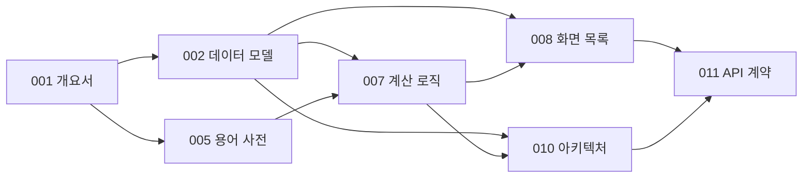

# 문서 인덱스

**언제들어오나** — ELS 통합관리 시스템

| 항목 | 내용 |
|---|---|
| 문서 ID | DOC-000 |
| 버전 | 1.8 |
| 최종 갱신 | 2026-07-30 |

---

## 1. 문서 목록

| ID | 문서 | 파일 | 버전 | 상태 |
|---|---|---|---|---|
| DOC-000 | 문서 인덱스 | `00_문서_인덱스.md` | 1.8 | 작성 |
| DOC-001 | 프로젝트 개요서 | `01_프로젝트_개요서.md` | 0.8 | 작성 |
| DOC-002 | 데이터 모델 | `02_데이터_모델.md` | 0.8 | 작성 |
| DOC-003 | 유스케이스 · 사용자 스토리 | — | — | 미작성 |
| DOC-004 | 요구사항 정의서(SRS) | — | — | 미작성 |
| DOC-005 | 용어 사전 | `05_용어_사전.md` | 0.8 | 작성 |
| DOC-006 | 데이터 사전 | — | — | 미작성 (구현 후 역작성) |
| DOC-007 | 계산 로직 명세 | `07_계산_로직_명세.md` | 0.8 | 작성 |
| DOC-008 | 정보구조 및 화면 목록 | `08_정보구조_및_화면목록.md` | 1.6 | 작성 |
| DOC-009 | 화면설계서 | — | — | 미작성 (구현 후 역작성) |
| DOC-010 | 아키텍처 및 기술 결정 | `10_아키텍처_및_기술결정.md` | 2.4 | 작성 |
| DOC-011 | API · 계약 명세 | `11_API_계약_명세.md` | 2.7 | 작성 |
| DOC-012 | 테스트 계획 | — | — | 미작성 |
| DOC-013 | 배포 · 운영 | `13_배포_및_운영.md` | 0.7 | 작성 |

> DOC-003·004는 선행 문서에 내용이 흡수되어 있어 후순위로 둔다. DOC-006·009는 구현 결과 기준으로 역작성한다(DOC-001 §10).

> **DOC-013은 역작성 대상에서 P5b의 선행 문서로 옮겼다 (v1.4).** 종전 배정은 P6(문서 역작성)이었으나 그것은 「배포한 뒤 무엇을 했는지 적는다」는 전제였다. 실제로는 반대다 — 배포는 **되돌리기 어려운 결정 여럿**(운영 DB 리전 · 초대 경로 · 클라우드 설정의 정본 · 백업 수단)을 한 번에 고정하고, 그 결정을 코드보다 먼저 적지 않으면 절대 규칙 #10을 스스로 깬다. 그래서 DOC-013은 **P5b 컷 0의 산출물**이며 P6에서는 실측 결과로 갱신만 한다. AQ-04(백업 주기)가 이미 「DOC-013 운영 문서에서 확정」을 가리키고 있었다는 사실이 그 방향의 방증이다.

> **v1.4에서 드리프트를 두 곳 정정했다.** ① **DOC-010의 헤더 표가 `1.8`이었는데 그 문서의 변경 이력 최신 행은 이미 `2.1`이었다** — 이 표는 `2.1`로 맞아 있었으므로 **교차 확인 지점이 옳았고 원본 문서만 두 곳이 갈려 있었다.** ② **DOC-011의 헤더 표가 `2.4`였고 변경 이력 최신은 `2.6`, 이 표도 `2.6`이었다** — 같은 형태다. 즉 **버전을 올릴 때 원본의 헤더를 빠뜨리는 것이 반복되는 실수**이며, 이 표만 보면 드리프트가 보이지 않는다(둘 다 이쪽이 옳았기 때문이다). 아래 v0.5의 서술은 반대 방향의 사례였다.

> **v1.5에서 셋째 사례를 정정했고, 그것이 컷 9(P5b.5)의 후보를 만들었다.** DOC-008의 헤더 표가 `1.3`인데 그 문서의 변경 이력 최신 행은 `1.4`이고 이 표도 `1.4`였다 — **v1.4가 정정한 둘과 정확히 같은 형태이며, 그 둘을 고칠 때 이 문서는 보이지 않았다.** 원인은 v1.4의 정정 범위가 「그 컷이 편집한 문서」였다는 것이다: 교차 확인 지점이 옳은 값을 갖고 있어도 **어느 원본이 갈렸는지는 전수로 훑지 않으면 모른다.** 셋 중 셋 다 헤더가 뒤처진 쪽이었다.
>
> **★ 컷 9 후보 — 삼자 일치를 `tests/db/docs-contract.test.ts`가 단언할 수 있는지 판단한다.** 대상은 **① 각 문서의 헤더 `| 버전 |` ② 그 문서 변경 이력의 최신 행 ③ 이 표의 해당 행**이며, 셋이 같아야 한다. 판단해야 할 것 셋: ⓐ **「최신 행」의 정의** — DOC-008의 변경 이력은 행 순서가 내림차순이 아니다(`0.1`이 `1.2` 위에 있다). 「첫 행」으로 정의하면 그 문서에서 틀리므로 **최대값**이어야 하고, 그러려면 버전 문자열의 비교 규칙(`1.10` vs `1.9`)을 정해야 한다 ⓑ 미작성 문서(DOC-003·004·006·009·012)는 파일이 없고 이 표에 `—`이므로 **제외 규칙**이 필요하다 ⓒ 헤더 표의 앵커 — `| 버전 | x |`는 문서마다 있으나 변경 이력 표의 헤더도 `| 버전 |`로 시작하므로 **행 형태로 구분**해야 한다. 그리고 이 검사가 **네 번째 축**을 함께 볼지도 그때 정한다: DOC-013의 `선행 문서` 행이 `DOC-010 v1.8 · DOC-011 v2.6`을 가리키는데 컷 0이 같은 커밋에서 그 둘을 `2.2`·`2.7`로 올렸다 — **의도(그 시점에 읽은 버전)일 수도 있으므로 자동 대조 대상인지가 판단 사항이다.** 컷 0에서 드리프트 둘이 나왔고 이 셋째가 그것을 반복 실수로 확정했으므로, 후보의 근거는 「있으면 좋다」가 아니라 **세 번 일어났다**다.

> **★ 넷째가 P5b 컷 3에서 났고, 그것을 잡은 방식이 이 후보의 설계를 확정한다.** 컷 3은 문서 넷
> (DOC-000·001·008·013)의 버전을 올린 뒤 위 삼자 대조를 **손으로 짠 스크립트로** 돌렸다.
> 결과는 **9건 중 1건 어긋남**이었고 **어긋난 것이 이 문서 자신**이었다 — 헤더는 `1.6`인데
> 위 표의 `DOC-000` 행이 `1.5`에 남아 있었다. **직전에 「그 둘을 고칠 때 이 문서는 보이지
> 않았다」고 적은 바로 그 형태를 같은 컷에서 재발시켰다.** 즉 이 실수는 주의로 막히지 않는다.
>
> **그래서 판단 사항 ⓐ·ⓑ·ⓒ에 답이 하나 붙는다: 검사는 구현 가능하고 비용이 작다.** 컷 3의
> 스크립트는 20줄이며 ⓑ의 제외 규칙이 저절로 확인됐다 — **DOC-000에는 변경 이력 표가 없어
> 「이력 최신」이 `-`가 된다.** 즉 제외 규칙은 「미작성 문서」만이 아니라 **「이력 표가 없는
> 문서」**도 덮어야 하고, 그 대상이 정확히 **삼자 중 둘만 가진 이 문서**다. 축을 **셋 다 요구**로
> 쓰면 이 문서가 영구히 빨간불이고, **둘만 요구**로 쓰면 넷째 사례를 잡는다.

> **★★ 컷 9 후보 둘째 — 「판단 시점 = P5」로 적힌 미결을 다시 배정한다 *(P5b 컷 3에서 신설, 전수 확인 완료)*.**
>
> 컷 3이 DOC-008 SQ-06을 갱신하다 발견했고, **하나가 아니라 무리다.** `docs/`의 맨 `P5`
> (뒤에 `a`·`b`가 붙지 않은 것)를 전수로 세니 **24건**이고 **부류가 둘로 갈린다.**
>
> | 부류 | 「P5」가 뜻하는 것 | 해당 | 판정 |
> |---|---|---|---|
> | **A** | 「시세 연동을 하는 단계」 | `00:145`(`refreshPrices`) · `10:701`(시세 수집 배치) · `11:1525`(새 계약) | **문제 없다** — P5a로 읽힌다 |
> | **B** | **「디자인 시스템 역작성」** | 미결 **다섯** — DOC-008 **SQ-06** · DOC-010 **AQ-36 · AQ-37 · AQ-38 · AQ-41**. 그리고 DOC-008 §6의 「로딩」·「에러」 열 각주 **셋**(`08:605`·`609`·`615`) | **갈 곳이 없다** |
>
> **부류 B가 이름으로 부르는 내용이 P5a(시세 연동)도 P5b(배포·운영)도 아니고, 역작성은 P6**
> (DOC-006 데이터 사전 · DOC-009 화면설계서 · DOC-012 테스트 계획)**이다.** 즉 다섯은
> **아무 단계도 자기 것으로 여기지 않는 상태**이고 그대로 두면 조용히 만료된다.
>
> **★ 이 파급은 이미 보였다 — 결함은 관측이 아니라 분류다.** 아래 §「실행 순서를 P5b → P5a로
> 바꿨다」의 「번호를 다시 매기지 않는다」가 **「두 문서에 걸쳐 스무 곳 남짓이 「판단 시점 P5」로
> 적혀 있다」고 이미 세었다.** 그런데 **A와 B를 갈라 세지 않고 한 결정을 둘 다에 적용했다.**
> 그 결정의 논거(「`P5a`·`P5b`는 **내용의 이름**이고 실행 순서만 바뀌었다」)는 **A에는 성립하고
> B에는 성립하지 않는다** — B가 부르는 이름에 대응하는 내용이 어느 갈래에도 없기 때문이다.
> **세는 것과 가르는 것이 다르다:** 개수는 대체로 옳았고 결론이 틀렸다(SEC-03의 롤 진입,
> `phase/*`의 팁 커밋, `information_schema`의 `MAINTAIN`, DOC-013 §4.1의 번들 문자열과 같은
> 형태이며 **이 저장소가 다섯 번째로 만난 자리**다).
>
> **선례가 이미 있어서 이것이 새 규약이 아니다:** DOC-010 **AQ-11**은 `~~P5~~ → P5b 컷 0에서
> 결정하고 컷 2에서 적용한다`로 **이미 다시 배정돼 있다.** 즉 실무는 건별 재배정을 하고 있었고
> §「번호를 다시 매기지 않는다」의 일괄 결정만 그것을 반영하지 않았다.
>
> **컷 9가 판단할 것 셋:** ⓐ 부류 B 다섯을 **P6에 배정할지, P5b 안에 컷을 하나 더 둘지, 아니면
> 「디자인 시스템 역작성」을 별도 단계로 세울지** — 다섯이 「같은 컷에서 함께 닫는다」로 서로를
> 참조하므로(AQ-36·37·38이 명시적으로 그렇다) **쪼개면 그 묶음이 깨진다** ⓑ 각주 셋을 항목과
> 함께 옮길지 ⓒ **「번호를 다시 매기지 않는다」의 문언에 부류 구분을 넣을지** — 넣지 않으면
> 다음 사람이 같은 일괄 결정을 다시 적용한다.

> **v0.5에서 버전 표의 드리프트를 정정했다.** 표는 DOC-005를 `0.1`로 적고 있었으나 실제 파일은 이미 `0.2`였다. 이 표가 유일한 교차 확인 지점이므로 갱신을 빠뜨리면 하류 문서가 어느 버전을 전제로 쓰였는지 알 수 없게 된다. 문서 버전을 올릴 때 이 표를 함께 고친다.

---

## 2. 문서 간 의존 관계

**변경 파급.** 상류 문서를 바꾸면 하류 문서를 함께 검토한다. 특히 DOC-002(데이터 모델) 변경은 DOC-007·008·010·011 전부에 영향을 준다.

---

## 3. 구현 단계

각 단계는 독립적으로 동작하는 상태에서 종료한다(R-05 대응).

> 각 단계 종료 후 별도 컨텍스트에서 산출물을 명세와 대조 검증하고, 발견된 갭은 x.5 단계로 닫는다.

| 단계 | 내용 | 참조 문서 | 완료 기준 |
|---|---|---|---|
| **P0** | 스캐폴드 | DOC-010 §5 | 프로젝트 생성, `docs/` 커밋, 린트 규칙(DEP-04) 동작 |
| **P1** | 순수 도메인 모듈 | **DOC-007** | `lib/tax`·`lib/domain` 구현, **TC-01~22 전체 통과** |
| **P2** | 스키마 | DOC-002, DOC-010 §7 | 마이그레이션·RLS·세율 시드 적용, RLS 테스트 통과 |
| **P3a** | 데이터 접근 · 조회 계약 | DOC-011 §4 | **완료.** DB 클라이언트, 조회 함수 8개(§4.1~§4.6·§4.8·§4.9), PostgREST 읽기 경로 실측. 공개 가입 차단(SEC-03) 실이행, `total_rounds` 삭제(DQ-05), `users` 조회 열 단위 축소, 스위트 3분할(237 + 130 + 115) |
| **P3a.5** | 조회 계약 대조 검증 · 정정 | DOC-011 §4 | **완료.** §4.2에 D1의 억제 범위 확정(입력 기준 — 결함은 그것이 파괴한 입력을 쓰는 파생값에만 미친다). §4.3 `projection`·`isWorst`, §4.1 `attentionItems` 정정, §4.0 Q-07 시세 분류 신설, §4.6 결함 표식. 항진명제였던 N+1 테스트를 성장 불변 + 요청 경로 다중집합으로 교체, Q-07 형식 적합성 검사 신설. 스위트 **252 + 130 + 134** (P3a 대비 +15 / ±0 / +19) |
| **P3b** | 변경 계약 | DOC-011 §5, §6 | **완료.** 변경 계약 **11개**(§5.5가 두 개다), 검증 규칙 V-01~V-20, 순수 모듈 예외 → `ErrorCode` 변환(AQ-17 종결), DB 오류 → `ErrorCode` 매핑(§3.2.1). **쓰기 함수 2개**로 §5.1·§5.2의 원자성을 성립시키고 I-07에 DB 층 방어를 부여했다 — **대조군과 함께 실측**했다(요청 3개로 나누면 기초자산 0건 상품이 실제로 남는다). 값 범위 CHECK 4개(DQ-06 부분 해결), 함수 권한 축 방어(AQ-28), **`InsertPayload<T>`로 Q-08의 쓰기 방향 폐쇄(AQ-30)**. 서버 액션 결선(`app/actions.ts`). 스위트 **383 + 166 + 189** (P3a.5 대비 +131 / +36 / +55) |
| **P3b.5** | 변경 계약 대조 검증 · 정정 | DOC-011 §5, §6 | **완료.** 감사 8건을 닫았다. **문서가 정본인 4건** — §3.2.1 제약 이름 표에 누락 9행 추가(대조가 `arrayContaining`이라 뒤처짐이 조용했다), V-18의 `fields` 키를 `kiTouchedAt`으로 통일(층마다 다른 칸을 가리키고 있었다), `RULE_IDS`·`BY_CONSTRAINT`를 **문서 파싱으로 양방향 대조**(`tests/db/docs-contract.test.ts` 신설), AQ-30에 W-04의 적용 범위 11개 중 9개 명시. **측정이 없던 4건** — W-05 둘째 겹을 **어긋난 컨텍스트로 RLS 0행을 결정적으로 만들어** 5경로 전부 확인(종전 호출 지점 9곳에 0건), 원천징수의 절사·귀속연도를 구분 가능하게(검증값이 요율의 정확한 배수였고 상환일·기준일이 같은 해였다), `update_els_product`의 I-07 두 블록에 대칭 케이스, 함수 축의 네 번째 속성 `proconfig`. `Problems.add`를 `RuleId`로 좁혔다. **신규 테스트 전부를 음성 대조로 확인**했다(대상 코드를 깨뜨려 빨간불을 보고 되돌렸다 — 9건, 그중 1건은 대조 자체가 무효여서 다시 했다). 스위트 **394 + 169 + 199** (P3b 대비 +11 / +3 / +10) |
| **P4** | 화면 | DOC-008 | **완료 (컷 0a~10).** 화면 **12개** — SCR-001·901·902(선행 조건 ②③④와 함께) → 302 → 201 → 202 → 204 → 203 → 301 → 401 → 101 → 502. SCR-501은 만들지 않고(SQ-01) SCR-402는 P4b다. **미결 다섯을 닫았다**: SQ-01·SQ-02(캘린더 뷰 — 만들지 않는다)·SQ-03·SQ-04·SQ-05, 그리고 AQ-02(무효화 — 실측이 설계를 바꿨다)·AQ-23·AQ-24·AQ-29·AQ-30 잔여·AQ-34. **신설 셋**: AQ-32(화면의 DOM 성질, 잔여 둘)·AQ-33(`supabase/dev/`의 계약 우회)·AQ-35(요소 ↔ 뷰 필드 대조가 한 화면에만 있다). **계약의 결함이 여섯 번 드러났고 넷이 두 부류에 몰린다** — DOC-011 §8.1이 부류와 재발 방지를 적었다. 스위트 **697 + 169 + 219 + 108** (P3b.5 대비 +303 / ±0 / +20 / 신설) |
| **P4b** | 다년도 전망 | DOC-007 §7.5, DOC-011 §4.7 | **완료 (컷 1~8).** 선행 조건 ①이 닫혔다 — **RD-02 해결 + DOC-007 §7.5 신설**(컷 4). 함께 닫은 것: **Q-06 사문화**(컷 1·2 — 임계를 설정 사본에서 파생시키고 `config.toml`을 파싱해 부등호 사슬을 단언한다) · **AQ-25**(컷 3 — 적용 차수를 `queries/attribution.ts` 하나로 모아 죽은 분기를 표현 불가로 만들었다) · **AQ-08 = 6 확정** · **AQ-22 잔여 ② 종결**. **AQ-39**(컷 6 — 조회 축을 파생으로 닫았고 `listUserSummaries`의 미등재가 결함으로 판별되어 일곱 자리에 등재됐다) · **아홉째 조회 계약 `getForecast`**(컷 7 — 왕복 3 실측, `FORECAST_MAX_YEARS = 20` 배정, AQ-35의 두 번째 대조 축). **SCR-402가 섰고 원장 셋이 비었다**(컷 8 — `PENDING_ROUTES` = `{}` · `PENDING_PARTS` = `{}` · `placeholderRoutes()` = `[]`. 뒤의 둘은 같은 사실의 두 관측이므로 그 일치 자체를 단언한다). `PendingScreen`을 삭제했다 — `git grep`의 히트가 스캐너 자신과 그 독블록뿐이다. **신설 AQ-41** — SCR-402의 빈 상태 갈래 둘을 어느 층도 렌더하지 않는다(판정은 순수 함수로 관측되고 마크업으로 이어지는 한 줄이 남는다. 원인은 e2e 픽스처가 공유 사용자에 있어야 한다는 것이며, **초안이 전용 사용자를 빌려 쓰려다 실행 순서가 데이터인 초록색을 실측으로 잡았다** — 전체 스위트 8/8 초록 → `db:reset` 뒤 단독 실행 5건 빨간불). 스위트 **786 + 169 + 220 + 116**. **`scenario`(적용 차수 조정)는 P4c로 배정했다** — DOC-008 §9 SQ-07 |
| **P5b** | 배포 · 운영 | **DOC-013**, DOC-010 ADR-006·§7 | 첫 배포(Vercel + Supabase 운영 인스턴스), Cron 엔드포인트, `service_role` 권한 축소, 백업, CI. **실행 순서상 P5a보다 먼저다** — 아래 U-03. **진행 중 (컷 0~3).** 컷 0 = DOC-013 신설(코드 0줄). **컷 1 — 저장소의 첫 Route Handler가 섰다**: `GET /api/cron/prices`가 로컬에서 401·503을 내고 캐시 금지 헤더 3종을 **무조건** 싣는다(그 세 헤더를 HTTP에서 조건 없이 단언하는 자리가 저장소에 처음 생겼다). 판정은 순수 모듈(`lib/cron/decide.ts`)이며 CR-01·06·07·08 넷을 상시 스위트가 전수로 본다 — 라우트에 두면 어느 스위트도 실행하지 않고 「비밀 미설정」 갈래를 결정적으로 만들 수 없다. **B5를 닫았다**: `ROUTE_HANDLERS` 원장 + 양방향 단언 + 프록시 매처 파생 대조(절대 규칙 #6의 **네 번째** fail-open 사례이며 CLAUDE.md 열거에 추가했다). 실측 둘이 서술을 바꿨다 — ⓐ **`force-dynamic`은 행동으로 관측되지 않는다**(지워도 e2e 10건 전부 초록 — 핸들러가 `request.headers`를 읽으면 Next가 그것만으로 동적으로 판정한다) → 소스 단언으로 옮겼다 ⓑ **헤더 값은 ByteString이라 비ASCII 비밀은 401이 아니라 호출자 예외로 죽는다**(DOC-013 §6.3 각주). 스위트 **829 + 126**(상시 +43 / e2e +10). **컷 2 — `service_role`이 0 DML이 됐고 권한 매트릭스에 롤 차원이 들어왔다**: 12테이블 × 8종 = **96행 → 0행**, 증명 단언 `has_table_privilege('service_role','public.users','SELECT')`가 **`t → f`**. 단언을 먼저 써서 **13건 빨간불**을 보고 마이그레이션으로 초록을 만들었다(반대 순서로는 「회수됐다」와 「단언이 항진명제다」가 구별되지 않는다). 대조 질의를 전부 **`aclexplode`**로 바꿨다 — `information_schema`가 **`MAINTAIN`을 숨긴다**(음성 대조: `MAINTAIN`만 부여하면 뷰는 **0행**). 실측 셋이 계획을 정정했다 — ⓐ 신규 테이블 `relacl`이 회수 후 **`(null)`**이 되므로 `functions.test.ts`의 「non-null」 단언을 **뒤집었다**(종전 형태는 *회수가 덜 됐다는 증거*를 초록으로 읽었다. 계획은 「항목 1개가 남아 non-null」로 예측했다) ⓑ **양성 대조에 `users`를 쓸 수 없다**(열 단위 권한이라 `has_table_privilege`가 `f`) ⓒ 시퀀스 축은 기본 ACL만으로 부족해 **신규 시퀀스 프로브**를 신설했다. 스위트 **829 + 181 + 220 + 126**(RLS +12). **컷 3 — 운영이 섰다. 게이트 셋을 순서대로 지났고 계기 넷이 문서를 반증했다**: `els-manager.vercel.app` + Supabase `evhmqmkqvbvpqcbuuink`(`ap-northeast-2`). 게이트 ① `server_version` 클라우드·로컬 **둘 다 `17.6`(`170006`)** — 메이저가 아니라 패치까지 같다. `MAINTAIN`은 버전 문자열이 아니라 **능력으로** 쟀고(`has_table_privilege(…,'MAINTAIN')`가 값을 내고 `'NOTAPRIV'`는 `22023`으로 죽는다) 그래서 B3의 발견이 클라우드에서 거짓이 아니다. 게이트 ② `config push` 대화형(`--yes` 없이) — **애드온 비용 프롬프트는 나오지 않았다.** 게이트 ③ `db push` **13개 전부** — `schema_migrations` 13행 · 테이블 12, `rls_off = 0` · `auth.users` 트리거 2개 활성 · `service_role` ACL **0행**(양성 대조 `authenticated` **30행**). **반증된 넷** — ⓐ **`config push`가 `[auth.rate_limit]`을 보내지 않는다**(DOC-013 §4.1 철회). 오버라이드를 두고 두 번 밀어도 값이 그대로였고 **두 회차 모두 `up to date`였다.** 근거였던 번들 문자열 추출은 그 필드를 **실제로 밀리는 것들과 똑같이 3회** 보여 준다 — 「구조체가 아는가」에 답할 뿐 「이 명령이 보내는가」에 답하지 않는다 ⓑ **§4.4의 「부수 효과 여덟」이 전수가 아니었다**(예측 못 한 변경 넷이 실제로 밀렸다) ⓒ **§8이 전제한 백업 경로가 이 기계에서 닫혀 있다** — `pooler:5432`가 네트워크 차단이고 직결은 IPv6 전용인데 IPv6 도달이 없다. 살아 있는 것은 트랜잭션 모드 **6543**뿐이고 `pg_dump`는 그것을 쓸 수 없다(DOC-013 §8.1.1 신설 — **컷 6의 선행 조건**) ⓓ **Ignored Build Step의 위치가 Settings → Git에서 Build and Deployment로 옮겨졌다**(§3.1.1 신설. 종료 코드가 뒤집혀 있어 반대로 넣으면 *Failed*가 아니라 **Canceled**라 조용하다). **SEC-03의 클라우드 절반이 닫혔다** — `disable_signup` `False → True`, 운영 프로브가 `422 signup_disabled`. ★ **HTTP 상태는 두 상태에서 같고 판별자는 `error_code`뿐이다**(가입이 열린 다른 프로젝트를 음성 대조로 썼더니 같은 `422`에 `weak_password`였다) — 로컬은 이미 차단이라 대조가 되지 못했다. **운영 계정은 3이 아니라 1이다**(DOC-013 §10.3): 절차는 남기고 실행하지 않으며 **구조는 걷지 않는다**(A-05·D-02·S-10·RLS 32개 유지). 따라오는 것으로 **K-07이 측정 불가**가 되고 DOC-001 §5.2가 그것을 「0%」가 아니라 **「분모 부재」**로 적는다. 부수: Dashboard 생성 사용자는 **토큰 열 8개가 전부 non-null**이라 시드의 500 함정이 그 경로엔 없다 · **anon 키는 배포 번들에 없다**(`createBrowserClient` 0건) · CLI는 **비-TTY에서 JSON**을 낸다. **Ignored Build Step 검증 ①②가 통과했다** — `dev` 푸시는 항목이 생성조차 되지 않았고 `main` 푸시는 Ready + Production(빌드 35s). ★ **판별의 무게는 ②가 진다**(①의 「항목이 없다」는 「조건식이 건너뛰었다」와 「Vercel이 `dev`를 추적하지 않는다」 둘과 양립한다). 부수로 **뷰포트가 계기 오류를 만들었다** — 한 행의 「빌드 소요 시간」과 「나이」가 다른 열인데 창이 좁아 `Ready 48s … 7h ago`를 「48초 전」으로 읽어 존재하지 않는 이상 징후를 만들었다. **SQ-06을 운영에서 처음 관측했고 그것이 컷 9 후보 둘째를 만들었다** — 「판단 시점 P5」가 **가리키는 단계가 없는** 미결이 다섯이다(§2의 ★★). **컷 8 — ADR-007 채택, AQ-01 종결 (컷 4의 하루 대기 중에 실행, S-G 배치)**: 국내 `data.go.kr` 자동 · 해외는 **증권사 통지를 설계된 정상 경로로** 둔다. **★ ADR-004의 기준 넷이 실격을 하나도 설명하지 못했다** — 탈락은 넷에 **없던** ⑤ 저장·공유 · ⑥ 정본성에 몰렸다. 「개인 프로젝트 허용 여부」에는 대부분이 「예」라고 답하고 **걸리는 것은 저장과 표시인데 그 둘이 목록에 없었다**(기준 목록이 명제를 판별하지 못한 자리). **상업 공급자 6곳 중 5곳이 구독 종료 시 삭제를 요구**하므로 「지울 수 없는 이력」인 `asset_prices`와 정면 충돌한다 — **구독 해지 = 과세 근거의 소멸.** KIS는 게이트에서 실격(약관을 **키 없는 공개 JSON**으로 받아 원문 확인, 제5조 ③). 추종 ETF 대체를 **2년치 일별 종가로 배제**했다 — 가장 유리한 조건에서도 **KI 배리어 0.81에서 판정이 뒤집히고**(2025-04-09) **KI는 한 번 터치로 영구히 성격이 바뀌므로 그 하루가 원장을 오염시킨다.** 부산물로 **`adjclose` 금지**가 나왔다(어댑터 구현의 첫 단언). 지수 구멍은 **돈으로 안 된다**(Tiingo 107,677행에 Index 0건 · Twelve Data Pro에서도 count 0). 신설·정정 셋 — **DOC-008 SQ-08**(해외 자산의 KI 「후보 표시」가 서지 않는다. 확정 경로는 살아 있다) · **K-02**(「자동 수집 가능 자산에 대해 0회」로 좁히고 분모를 적었다. **오늘 그 분모가 0이다**) · **ADR-004 기준 넷 → 여섯**. ★ 원자료의 **「14종」과 「13종」을 14로 확정**했다 — 13은 6축 대조 *이전에* 게이트에서 떨어진 KIS를 뺀 수이며 **「검토한 후보」와 「대조한 후보」가 같은 이름으로 세어져 있었다** |
| **P5a** | 시세 연동 | DOC-010 ADR-004·**ADR-007** | 공급자 선정 → 어댑터 → 매핑 화면 → 수집기. **P5b 뒤에 실행한다** |
| **P6** | 문서 역작성 | — | DOC-006·009·012 (DOC-013은 P5b가 신설하고 여기서 갱신만 한다) |

### P5를 P5a·P5b로 가른 이유

기준은 하나다 — **로컬에서 그 명제를 관측할 수 있는가.**

| | **P5a** (시세 연동) | **P5b** (배포 · 운영) |
|---|---|---|
| 증명 대상 | 「어댑터가 미조정 종가를 읽는다」·「부분 실패가 배치를 멈추지 않는다」·「`AUTO` 쓰기가 기존 `MANUAL`을 건드리지 않는다」 | 「Vercel Cron이 **실제로** 하루 한 번 이 경로를 부른다」·「클라우드 설정이 저장소의 파일에서 온다」 |
| 관측 수단 | 상시 스위트 + `test:integration` + `test:rls` | Vercel 실행 로그 · 운영 DB · `config push`의 diff |
| 실패 시 | 빨간불 | **아무 일도 일어나지 않는다** — 그것이 이 분할의 이유다 |

P5b의 실제 범위는 「Cron 붙이기」가 아니라 **「배포 + Cron」**이다. ADR-006이 Vercel을 정했으나 `vercel.json`도 배포 기록도 없었고, 계정·비용·부수 결정(운영 DB 리전 · 초대 경로 · 백업 수단 · 브랜치 전략)이 얽힌 별개의 일이다.

### 실행 순서를 P5b → P5a로 바꿨다 (v1.4, U-03)

**종전 판단을 철회하지 않는다.** P5a → P5b가 원래 순서였고 근거는 둘이었다 — ① 배포는 계정·비용·부수 결정이 얽힌 별개의 일이다 ② **P5a가 끝나면 「SCR-302의 버튼으로 시세가 들어오는 상태」로 이미 동작하므로**(R-05) Cron은 그 동작의 자동화이지 전제가 아니다. **그 근거는 지금도 참이다.**

**바뀐 것은 착수 시점 하나이고 원인은 설계가 아니라 외부 사정이다.** 공공데이터포털이 **2026-07-29 19:00 ~ 08-02 18:00** 개편 작업으로 오픈API 신규 활용신청과 인증키 신규 발급을 제한한다. P5a 컷 0의 첫 작업(`getStockPriceInfo`·`getDerivationProductMarketIndex`의 실응답과 **미조정 종가 여부** 실측)이 키를 요구하므로 나흘간 착수가 불가능하다.

그 나흘을 P5b에 쓰는 근거 셋:

1. **P5b는 원래 배포와 묶기로 한 작업이다.** 배포 인프라 위에서만 의미가 있어 P5 계획에서 이미 분리해 두었다. 배포가 앞으로 오면 그 묶음이 자연히 성립한다
2. **K-06(배포 3개월 후 지속 사용)이 시간에 의존한다.** DOC-001 §5.2가 「가장 정직한 성공 지표」로 적은 것인데 로컬에서만 도는 동안은 **측정이 시작되지 않는다.** 착수를 미루면 지표의 시계도 함께 미뤄진다
3. **실제 데이터가 P5a의 우선순위 근거를 만든다.** 현 포트폴리오의 기초자산이 전부 해외여서 P5a가 서더라도 **지금 쓰는 사람에게 돌아가는 값은 0이다**(K-02 정정이 그 사실이다). 한 달 써 보면 수동 입력이 실제로 얼마나 아픈지가 추정이 아니라 관측이 된다

> **번호를 다시 매기지 않는다.** `P5a`·`P5b`는 **내용의 이름**이고 실행 순서는 위 표의 배열과 이 항목이 말한다. 두 문서에 걸쳐 스무 곳 남짓이 「판단 시점 P5」·「P5에서 재검토」로 적혀 있어서, 번호를 옮기면 그 서술이 전부 낡는데 그 비용이 얻는 명료함보다 크다.
>
> > **★ 이 결정은 절반만 옳다 — 부류를 가르지 않았다 *(P5b 컷 3에서 실측)*.** 위 「스무 곳
> > 남짓」을 전수로 세니 맨 `P5`가 **24건**이고 둘로 갈린다. **「시세 연동을 하는 단계」를
> > 뜻하는 것**(셋)은 P5a로 읽혀 위 논거가 그대로 성립한다. 그러나 **「디자인 시스템 역작성」을
> > 뜻하는 것**(미결 다섯 — SQ-06·AQ-36·AQ-37·AQ-38·AQ-41 + 각주 셋)은 **P5a도 P5b도 아니고
> > 역작성은 P6**이므로 **가리키는 단계가 없다.** 「내용의 이름」이라는 논거가 바로 그 지점에서
> > 깨진다 — 그 이름에 대응하는 내용이 어느 갈래에도 없다. **개수는 옳았고 결론이 틀렸다.**
> > 재배정은 **컷 9(P5b.5)**가 한다(§ 위쪽 「컷 9 후보 둘째」에 판단 사항 셋을 적었다).
> > 선례: DOC-010 AQ-11은 `~~P5~~ → P5b 컷 0`으로 이미 옮겨져 있었다.

> **★ P5b 안의 순서도 한 번 갈렸다 — 컷 4의 대기를 컷 8로 채운다 *(결정, 컷 3 이후)*.**
> **컷 4는 물리적으로 하루를 요구한다**(사람이 빨리 할 수 있는 종류가 아니다). 그 대기를 비워
> 두는 대신 **컷 8(ADR-007 신설)을 앞당겨 그 안에서 실행한다** — 원래 계획의 S-G 배치다.
> 컷 8이 이 자리에 들어갈 수 있는 이유는 **의존이 없기 때문이다:** ADR-007의 문서 몫은 아래
> 각주가 적은 대로 인증키를 요구하지 않으며(요구하는 것은 8월 2일 이후의 실응답 실측 하나다)
> 컷 4·5·6·7 어느 것의 산출물도 입력으로 쓰지 않는다. **P5b는 컷 9까지 마친다.**

> **순서 교체가 P5a에서 걷어 간 것과 남긴 것.** 키가 필요 없는 P5a 컷 0의 **문서 몫**(ADR-007 신설 · ADR-004 기준 넷 → 여섯 · KIS 실격 기록 · ETF 대체 배제 실측 · `adjclose` 금지 규칙 · ~~AQ-06·DQ-02 종결~~ · K-02 정정) **★ 목록이 일곱이 아니라 다섯(+K-02 정정)이다 *(컷 3 이후 정정)*** — **AQ-06·DQ-02는 컷 0이 이미 닫았다**(각각 「`MANUAL`이 이긴다 — CR-05 뒤집음」·「공백으로 둔다」). v1.4가 이 목록을 쓸 때는 둘 다 열려 있었고 같은 컷이 닫는 바람에 목록만 남았다. **갱신하지 않은 예정 목록은 「아직 할 일이 있다」로 읽히므로 실제보다 크게 보인다** — 컷 8이 착수 직전에 대조해 잡았다은 **P5b가 선행 처리한다.** 8월 2일 이후 P5a 컷 0에 남는 것은 **인증키 발급과 실응답 실측 하나**다.

### P1을 먼저 하는 이유

1. **인프라 없이 완결된다.** DB·인증·배포 없이 구현과 검증이 끝난다
2. **즉시 검증 가능하다.** TC-01~22가 이미 정답을 갖고 있다
3. **최대 리스크를 먼저 제거한다.** R-01(세금 계산 정확성 결함)이 가장 높은 영향도를 갖는다
4. **이후 작업의 기준이 된다.** 화면·계약이 이 모듈의 출력 형태에 맞춰진다

### P4 선행 조건 (v0.8에서 4건으로 확정, v1.0에서 ①의 위치를 좁혔다)

P3a·P3b가 남긴 것들이다. 공통점은 화면이 붙는 순간 결함이 사용자에게 보이거나(①③) 조용히 나가는(②④) 종류라는 것이다.

> **v0.8의 「넷 다 화면을 세우기 전에 닫는다」를 좁힌다 (v1.0, U-03).** 철회가 아니라 **범위 축소**이며 사유는 그 규칙이 스스로 밝힌 근거에 있다 — 넷을 앞에 둔 까닭은 "화면이 붙는 순간" 결함이 드러나기 때문인데, **①의 결함 형태는 아래 표에 「SCR-402가 빈 열을 렌더링한다」 하나로 적혀 있다.** 즉 ①의 위험은 SCR-402가 존재할 때만 발생한다. ②③④는 어느 화면이 서든 즉시 노출되지만(②는 조회만 하는 모든 화면에서 토큰이 영원히 저장되지 않고, ③은 아무 예외나 Next 기본 화면으로 나가고, ④는 인증 쿠키를 실은 응답이 캐시될 수 있다) ①은 그렇지 않다. **①을 앞에 두고 SCR-402를 뒤에 두면 그 사이 §7.5가 소비자 없이 방치되고, 그 상태에서 정한 산식이 맞는지는 화면이 설 때에야 안다.** 따라서 **②③④는 화면 전에, ①은 P4b에서 SCR-402와 함께** 닫는다. ①은 코드 0줄의 문서·결정 작업이므로 ②③④와 자원이 겹치지도 않는다.

| # | 항목 | 무엇이 없는가 | 닫지 않고 P4를 시작하면 |
|---|---|---|---|
| ① | **DOC-007 §7.5 신설 + RD-02 결정** (**P4b**) | 문서에 `§7.5`가 없다. DOC-011 §4.7 `getForecast`의 `totalAssets`·`remainingPrincipal`은 **어느 문서에도 산식이 없어** 조회 계약 8개에서 의도적으로 빠져 있었다 (**해소됨** — 컷 4가 §7.5를 신설하고 컷 7이 아홉째 계약을 세웠다. `totalAssets`는 그 미구현 기간에 `cumulativeAssets`로 개명됐다) | SCR-402가 **빈 열을 렌더링**한다. 두 값은 "그 연도 말 미상환 상품" 집합에 의존하고 그 집합은 적용 차수(RD-02)가 정한다. **RD-02는 P4 계획 시점에 닫혔다** — 「다음 도래 평가일의 차수」 유지 + `getForecast` 전용 비영속 `scenario` 인자(§4 RD-02 행) |
| ② | **`src/proxy.ts` 세션 갱신** | 파일이 없다. `jwt_expiry = 3600`(`supabase/config.toml`)이므로 토큰은 **1시간 뒤 처음 갱신된다** | 서버 컴포넌트의 쿠키 어댑터는 무연산이라(`readOnlyCookieAdapter`) 갱신 토큰을 저장하지 못하고, 매 요청이 다시 갱신한다. **개발 중 1시간 안에는 보이지 않다가 운영에서 드러난다** — 서버 액션 경로만 쓰기 가능 어댑터를 가지므로(P3b 8단계) 조회만 하는 화면에서는 영원히 저장되지 않는다 |
| ③ | **에러 경계** | `app/error.tsx`·`app/not-found.tsx`가 없다 | 조회 계약은 미존재에 `null`, 시스템 오류에 **예외**를 쓴다(§3.1·Q-04). 받을 경계가 없으면 그 예외가 Next 기본 화면으로 나가고, `getQueries()`의 미인증 예외도 SCR-001 유도가 아니라 오류 화면이 된다. **변경 계약은 이 문제가 없다** — W-03이 결과 객체를 쓰므로 입력값이 보존된다 |
| ④ | **`setAll`의 응답 헤더 처리** | 어댑터가 두 번째 인자(캐시 금지 헤더)를 받아 두고 **아무도 쓰지 않는다** | 인증 쿠키를 싣는 응답이 CDN·리버스 프록시에 캐시되면 **한 사용자의 세션 토큰이 다른 사용자에게 나간다.** 지금 안전한 이유는 서버 액션 응답이 POST라 Next가 캐시하지 않기 때문이지 헤더가 불필요해서가 아니다 — ②의 미들웨어와 §7.1 배치 Route Handler는 **반드시 실어야 한다** |

> **④의 출처.** 무연산 어댑터는 P3a부터 이 인자를 삼키고 있었고(그쪽은 헤더를 실을 자리 자체가 없다), 위험의 성격이 드러난 것은 **P3b 8단계**에 쓰기 가능 어댑터를 결선하면서다. 그래서 `writableCookieAdapter`는 인자를 삼키지 않고 주입하는 쪽에 그대로 넘긴다 — 어댑터가 결정을 대신하면 ②를 붙이는 사람이 그 인자의 존재를 모른다.

> **②와 ④는 같은 파일에서 닫힌다.** 프록시는 응답 객체를 들고 있으므로 쿠키와 헤더를 함께 실을 수 있는 **유일한 자리**다. 둘을 따로 계획하면 프록시를 붙이면서 헤더를 빠뜨리고, 그때는 ④가 "이미 처리된 것"으로 보인다.

> **②의 이름을 `middleware.ts`에서 `src/proxy.ts`로 고쳤다 (v1.0). 프레임워크가 강제한 정정이며 설계 변경이 아니다.** 실측(`node_modules/next` 16.2.12) — `PROXY_FILENAME = 'proxy'`(`next/dist/lib/constants.js:289`), `"middleware" file convention is deprecated. Please use "proxy" instead.`(`next/dist/build/index.js:651`), 두 파일이 함께 있으면 **빌드 에러**(`:645`).
>
> 네 번째 사실이 이 항목의 위험 하나를 없앴다 — `Route segment config is not allowed in Proxy file. **Proxy always runs on Node.js runtime.**`(`next/dist/build/analysis/get-page-static-info.js:587`). 구 Edge 미들웨어 런타임이었다면 `src/lib/db/env.ts`의 `process.env[name]`이 **계산된 멤버 접근이라 define 플러그인이 인라인하지 못해** 요청 시점에 던졌을 것이고, 프록시는 전 경로에 걸리므로 **앱 전체가 죽었을 것이다.** 런타임이 Node로 고정되면서 그 함정이 사라졌다.

### P4 화면 순서의 근거 (v1.0에서 교체)

> **종전 근거를 철회한다 (U-03).** v0.8까지의 근거는 「목록·상세로 데이터를 볼 수 있게 만든 뒤 등록·상환으로 데이터를 넣고, 그 데이터로 세금·전망을 계산한다」였다. **그것은 데이터가 있을 때의 근거다.** `supabase/seed/`에는 사용자뿐이고(`00_rls_test_users.sql`·`01_integration_users.sql`) `refreshPrices`는 P5까지 항상 `PROVIDER_UNAVAILABLE`이다(§5.8, 공급자 0개). SCR-201을 먼저 지으면 `worstOf`·`kiStatus`·`conditionResult`·`dDay`가 전부 `null`인 화면을 만들고, 그 카드가 맞는지는 네 컷 뒤에나 안다. 홈을 마지막에 두는 판단은 유지한다.

**첫 화면은 자급 가능한 것이어야 한다.** SCR-302(시세 관리)가 유일하게 자기 변경 계약만으로 자기 화면에 실데이터를 채운다 — 자산 등록 → 행 생김 → 시세 입력 → 값·`isStale`·출처 표시. SCR-201·202·301은 SCR-204에 의존하고 204는 자산에 의존하므로, 자산 → 시세 → 상품은 선택이 아니라 **위상 정렬 결과**다.

**그리고 302가 가장 싼 폼인데 오류 표면이 가장 넓다.** 배열이 없고 인덱스 붙은 `fields` 키도 없는데 V-15·V-17·V-19·`CONFLICT`(`nulls not distinct` 중복)·`PROVIDER_UNAVAILABLE`이 나온다 — **`ErrorCode` 7개 중 5개가 이 한 화면에서 실물로 나온다.** 특히 ST-03(자동 조회 실패는 오류가 아니라 폴백 안내)을 나중에 만나면 이미 만들어 둔 "오류 = 빨간 박스"를 되돌려야 한다.

**SCR-402를 P4b로 분리하는 이유는 그것이 화면이 아니기 때문이다.** RD-02 결정 + DOC-007 §7.5 신설 + `getForecast` 계약 구현 + 세 스위트 갱신이며, 화면은 그 위에 얹히는 마지막 조각이다. SCR-101 앞에 두면 앱이 미완성인 채로 학기 경계를 넘는다(R-05).

**SCR-001·901·902는 선행 조건 ②③④와 같은 작업에서 선다.** 셋 다 그 셋이 붙는 바로 그 코드이며, 로그인이 없으면 `getQueries()`가 던지므로 어떤 화면도 렌더링되지 않는다.

### P3을 조회와 변경으로 쪼갠 이유

종전 완료 기준("검증 규칙 V-01~16")은 V-17·V-18이 신설되면서 이미 낡아 있었다. 더 실질적인 이유는 두 절의 성질이 다르다는 것이다 — 조회는 예외를 전파하고(§3.1) 변경은 결과 객체를 반환하므로, 순수 모듈의 예외를 어떻게 다룰지가 정반대다(AQ-17). 조회를 먼저 닫으면 DB 접근 계층과 PostgREST 경로가 실측으로 검증된 상태에서 변경 계약이 그 위에 얹힌다. 각 단계가 동작하는 상태로 끝난다는 원칙(R-05)도 유지된다.

---

## 4. 미결정 사항 통합

각 문서에 흩어진 미결 항목이다. 이슈 트래커로 옮겨 관리한다.

| ID | 항목 | 문서 | 결정 시점 |
|---|---|---|---|
| Q-04 | 리자드 변형 수용 범위 | DOC-001 | **해결 (P1)** — 차수별 3속성으로 확정 |
| DQ-01 | 소프트 삭제 도입 | DOC-002 | **해결 (P2)** — 하드 삭제. 단 상환 완료 상품은 삭제 불가. AQ-07 동일 |
| DQ-02 | 시세 결측일 처리 | DOC-002 | **해결 (P5b 컷 0)** — **공백.** 직전값을 새 `as_of_date`로 복제하면 그 행은 「관측하지 않은 관측」이 되고 **형식은 정상이며 값만 거짓**이다. 게다가 `as_of_date`가 오늘이므로 `isStale`(5일)도 발동하지 않아 화면 어디에도 드러나지 않는다 — ADR-004 v0.7이 스텁 어댑터를 경계한 것과 같은 위험이다. 읽기 층에 결측을 표현할 어휘가 이미 둘 있다(`isStale` · E-01 시세 없음). **함께 정한 것: `failed[].reason`을 두 부류로 가른다** — 「데이터 없음」(휴장·상장폐지·심볼 오류 → **매핑을 고친다**)과 「호출 실패」(네트워크·인증·한도 → **기다린다**). 사용자의 조치가 다르기 때문이며, 이 분류는 **어댑터가 구분해서 알려주지 않으면 만들 수 없으므로** ADR-004 보정(`failure: 'NO_DATA' \| 'CALL_FAILED'`)이 그 전제다. DOC-002 §8·DOC-011 §7.1 |
| DQ-03 | 원금 분할 매수 지원 | DOC-002 | 보류 |
| DQ-04 | 감사 로그 범위 | DOC-002 | 보류 |
| RD-01 | 세액 절사 단위 | DOC-007 | 미결 — P1에서 주입 인자로 격리 완료(기본 원 단위). **단위 확정만 잔여**, 실제 거래내역 대조 시점 |
| RD-02 | 기본 적용 차수 | DOC-007 | **해결 (P4 계획)** — 기본값은 **「다음 도래 평가일의 차수」로 확정 유지**하고, 사용자 조정은 **`getForecast` 전용 비영속 `scenario` 인자**로 둔다(저장하지 않는다). 근거 셋 — ① 기본값을 바꾸면 §4.1·§4.3·§4.6·§4.8이 전부 값이 달라지는데 그것들은 이미 실측·검증된 상태다 ② §4.6의 `override`(비영속 시뮬레이션)라는 **동형의 선례**가 같은 문서에 있다 ③ 영속 컬럼은 DQ-05(유도값 저장 금지)·RD-06(재산출로 충분)과 정면으로 어긋나고 AQ-29의 우회면을 넓힌다. **스키마 변경 0, 호출부 변경 0.** 산식은 P4b의 DOC-007 §7.5 |
| RD-03 | 평가일 영업일 조정 | DOC-007 | 보류 |
| AQ-08 | 전망 기본 연수 | DOC-011 | **해결 (P4b) — 6.** 코드에 기본값을 박는 순간 사실상 닫히므로 구현 전에 확정했다. 근거는 만기(통상 3년)와 발행일 분산이다 |
| AQ-22 | Q-06 절단 방어 | DOC-011 | **부분 해결 (P4b 컷 2)** — 사문화를 닫았다(임계를 설정 사본에서 파생 + `config.toml` 파싱 대조). **잔여 넷**: 클라우드 `max_rows`가 저장소에 없어 **운영에서는 여전히 사문화될 수 있다** · 파일 ≠ 컨테이너 · 임베드 축 미측정 · 새 오탐(수락). 종결 후보는 `count: 'exact'`이며 AQ-09를 다룰 때 채택한다. **P5b 컷 0 — 잔여 R1(클라우드 `max_rows`)을 닫았다. 방향을 뒤집는 방식이다.** `supabase config push`가 `[api].max_rows`를 클라우드에 **쓴다**(CLI 2.109.1 번들 실측 — `PATCH /v1/projects/{ref}/postgrest`의 `requestBody.fields`에 `max_rows`가 있다). 즉 클라우드 값이 `supabase/config.toml`**에서 오므로** `tests/db/select.test.ts`의 두 단언(`POSTGREST_MAX_ROWS === configMaxRows()`와 부등호 사슬)이 **운영 값에 대한 진술**이 된다 — P4b 컷 1·2가 고른 형태(값을 맞추는 것이 아니라 관계를 파생시킨다)의 연장이다. **★ 그래서 `[remotes.*]`에 `max_rows`를 쓰지 않는다**: 써야 할 이유가 없고(클라우드와 로컬이 같아야 한다), 쓰면 같은 파일의 「`max_rows` 대입이 정확히 하나」 전제가 빨간불이다. **종결의 성격을 정직하게 적는다 — 이것은 절차적 종결이다.** push 사이의 드리프트(대시보드 수정)를 상시 스위트가 보지 못하며, 그 축은 **새 잔여로 따로 등재한다**(DOC-013 §11). 상세는 DOC-013 §4.2 |
| AQ-25 | `projection`의 4번째 `null` 분기 | DOC-011 | **해결 (P4b 컷 3)** — 제거가 아니라 **표현 불가**로 닫았다. 원인은 함수가 아니라 `attributionYear`의 **서명**이었다(두 근거가 모두 없을 때만 `null`인데 타입이 그 조건을 말하지 않았다). 오버로드 셋 + 적용 차수 단일 원천. 같은 부류의 둘째 죽은 분기(`mutations/redemptions.ts`)도 함께 닫혔다 |
| AQ-39 | `affects`의 조회 축이 전수가 아니다 | DOC-010 | **해결 — P4b 컷 6.** v1.8이 정한 방식대로 닫았다: 손으로 적은 역 인덱스가 아니라 **`INVALIDATION`에서 파생하는 타입 수준 witness**(`as const satisfies` + `Exclude`, 오류 메시지에 빠진 계약명이 나온다). 예고대로 `listUserSummaries`가 즉시 빨간불이 되었고 **등재가 답이었다** — `getTaxSummary`와 **같은 일곱 자리**이며 그 집합 동일성이 컷 8의 근거다. 음성 대조의 탐지력을 실측하고 **양성 대조**(`Without<never>`)를 함께 두었다 |
| SQ-07 | SCR-402의 적용 차수 조정(`scenario`) | DOC-008 | **미결 (P4b 신설) — P4c 배정.** RD-02가 **형태**(비영속 인자)를 닫았으나 규칙 셋(선택 범위·경과 차수·없는 차수)이 열려 있다. 기본값만으로 §7.5가 완결되는 것이 분리의 근거다 |
| SQ-01 | SCR-501 유지 여부 | DOC-008 | **해결 (P4)** — **만들지 않는다.** DOC-008 §5 SCR-201이 스스로 "소유자 필터가 사용자 현황 화면을 대체한다"고 적었다. `listUserSummaries`는 계약으로 남긴다(삭제하지 않는다). 화면이 없으면 **AQ-18(타인 `isComprehensive`를 `security definer`로 제공할지)도 열린 채로 정상**이다 — 그 값이 화면 문제가 되려면 501이 있어야 한다 |
| SQ-03 | 홈 기본 표시 범위 | DOC-008 | **해결 (P4)** — **본인(MINE)**. 전체 보기 전환은 유지한다(계약이 이미 두 값을 받는다). `scope = 'ALL'`이어도 `currentYearTax`는 본인 기준이므로(D-02, 절대 규칙 #7) 전체 보기는 **상단이 전원이고 세금이 본인인 화면** — 한 화면에 주어가 둘이 된다. 두 경우 모두 "올해 금융소득(**본인**)"으로 명시한다 |
| AQ-01 | 시세 공급자 선정 | DOC-010 | **해결 (P5b 컷 8) — ADR-007 채택.** **국내는 `data.go.kr` 자동, 해외는 「증권사 통지 → 수동 입력」을 *설계된 정상 경로*로 둔다**(폴백이 아니다 — ELS 약관이 평가가격을 거래소 공식 종가로 정의하고 증권사가 그 값을 통지하므로 **통지가 어느 API보다 정본에 가깝다**). 후보 **14종** 중 **⑤ 저장·공유**를 통과한 것이 하나뿐이며, 실격은 ADR-004의 기준 넷에 **없던 두 축**(⑤·⑥ 종가의 정본성)에 몰렸다 — **무료 티어가 부족한 것이 아니라 용도가 다르다**(평가·개발용 대 「영구 저장 + 다중 사용자 표시」). 핵심은 **(b) 「구독보다 오래 살아도 되는가」** — 상업 공급자 6곳 중 5곳이 종료 시 삭제를 요구하므로 **구독 해지가 과세 근거의 소멸을 뜻한다.** 추종 ETF 대체는 **2년치 실측으로 배제**(KI 배리어 0.81에서 판정이 실제로 뒤집힌다). 부산물로 **`adjclose` 금지 규칙**이 나왔다. 남은 것 둘은 별항 — **KI 감시 공백**(DOC-008 **SQ-08** 신설) · **현 포트폴리오의 자동 수집 대상 0건**(K-02 정정) |
| AQ-04 | 데이터 백업 주기 | DOC-010 | **해결 (P5b 컷 0) — 주 1회, 로컬 스케줄 덤프.** 등재문이 「DOC-013 운영 문서에서 확정」을 가리켰고 그 문서가 생기면서 닫혔다. **답이 「주기」보다 「수단」에서 먼저 갈렸다** — 실측 셋이 선택지를 좁혔다: ⓐ Supabase Free는 **자동 백업이 없다**(다운로드 자체가 Pro 이상) ⓑ 직결이 **IPv6 전용**이라 `pg_dump`는 Supavisor **세션 모드**(pooler:5432)를 지나야 한다(트랜잭션 모드는 prepared statement 미지원) ⓒ **저장소가 공개다** — 덤프를 저장소에도, 공개 저장소의 Actions 아티팩트에도 둘 수 없다(Supabase 공식 워크플로가 저장소에 커밋하므로 그대로 쓸 수 없고, 그 문서 자체가 「Never backup your data to a public repository」라고 적는다). **주 1회의 근거**는 A-01 규모에서 데이터 변경이 월 단위이고(등록은 연 수 회 · 상환은 분기 · 시세 입력은 통지 시점) 손실 상한이 「지난 덤프 이후의 손 입력」이며 그 값의 정본이 증권사 통지에 있어(A-04) 재입력이 가능하다는 것이다. **종결 조건은 복구 실측이다** — 복구해 보지 않은 백업은 백업이 아니므로 컷 6이 로컬 스택을 비우고 3종을 되살려 **테이블별 행 수를 대조한다.** **덮지 못하는 것을 함께 적었다:** 기계가 꺼져 있으면 안 돌고 오프사이트 사본이 없다 — 즉 **재해 복구가 아니라 실수 복구**다(DOC-013 §8.4에 잔여로 등재). DOC-013 §8 |
| AQ-05 | 세율 마이그레이션 검증 절차 | DOC-010 | **해결 (P2)** — SQL 파싱(상시)과 DB 조회(RLS 스위트) 이중 게이트 |
| AQ-06 | 자동값의 수동값 덮어쓰기 | DOC-011 | **해결 (P5b 컷 0) — `MANUAL`이 이긴다. CR-05를 뒤집었다(U-03).** 종전 표는 규칙과 반환 필드가 **양립하지 않았다** — CR-05가 「기존 `MANUAL`을 자동값으로 덮어쓴다」인데 같은 표의 `CronResult.skipped`가 「당일 데이터 이미 존재」다. **AUTO가 항상 덮어쓰면 `skipped`는 영원히 0이고**, 반대로 건너뛰면 CR-05가 실행되는 경로가 없다. 둘 중 하나가 죽은 명세였다(DOC-011 §8.1이 분류한 부류의 재발). **정정된 규칙:** 같은 `(asset_id, as_of_date)`에 행이 있으면 **쓰지 않는다 — `source`와 무관하다.** 근거는 충돌이 **날짜 스코프라 영속하지 않는다**는 것이다(07-29의 수동 정정이 남아도 07-30은 `AUTO`가 정상적으로 채운다). 반대로 AUTO가 이기면 정정이 **하루만 살고** 단일 자산 재수집 경로가 없어 되돌릴 수단도 없다. 부수 이득 셋: `skipped`가 실재하는 값이 되고 · 사전 확인으로 공급자 호출을 건너뛰어 C-03에 유리하며 · **배치에 `asset_prices` UPDATE가 불필요해져 AQ-11의 권한 한 칸이 함께 닫힌다.** ★ **「잘못된 `AUTO`의 정정 경로는 재수집이 아니라 SCR-302의 수동 입력이다」**를 함께 명시했다 — 적지 않으면 다음 사람이 skip 로직을 뚫는다 |
| AQ-07 | 상품 삭제 시 소프트 삭제 | DOC-011 | **해결 (P2)** — DQ-01과 동일 |
| AQ-10 | 입력 검증 라이브러리 | DOC-011 | **해결 (P3b)** — 도구를 도입하지 않는다. 손으로 쓴 조합기 + 규칙 ID 전수 열거 단언. 스키마 라이브러리의 `coerce`가 Q-08의 구문 수준 강제 변환 금지를 우회하는 벡터가 되는 것이 첫 근거다 |
| DQ-05 | `total_rounds` 유지 여부 | DOC-002 | **해결 (P3a)** — 컬럼 삭제. 총 차수·만기일의 정본은 모두 `redemption_schedules`이며 총 차수는 **행 수**다(`max(round_no)` 아님). 입력 계층에는 남는다 |
| AQ-11 | `service_role` 권한 축소 | DOC-010 | **부분 해결 (P5b 컷 0 결정 · 컷 2 적용) — 과다 방향을 닫고 필요분 명시는 P5a로 남긴다.** 배포하면 `grant all on all tables/sequences … to service_role`이 **운영에 살아 있는 채로** 시크릿 키가 생긴다. 한편 수집기가 없으므로(공급자 0개) 배치가 실제로 요구하는 권한 목록은 P5a 컷 3이 끝나야 정확해진다 — 먼저 정하면 **「필요할 것 같은 권한」**을 주게 되고 그것이 이 항목이 지적한 상태 그 자체다. **그래서 추측이 아니라 최소를 고른다: 지금 배치가 없으므로 필요 권한은 정말로 0이다.** 회수 + `authz-matrix`에 **롤 차원**을 넣어 양방향 단언이 과다·과소를 한 기전으로 막는다(이 항목이 「반대 방향 문제도 함께 있다」고 적은 둘이다). **실측이 회수 범위를 넓혔다** — `pg_default_acl`에 `postgres/r = {…, service_role=Dxtm/postgres}`·`postgres/S = {…, service_role=w/postgres}`가 있어 **신규 테이블은 `service_role`에 DELETE·TRUNCATE 등을 자동으로 준다.** 즉 「0 DML」이 미래 테이블에는 거짓이므로 **기본 권한도 함께 회수하고 그 축을 단언한다**(현재 `service_role`의 기본 ACL을 보는 테스트가 0건이다). **등재문 정정 셋:** ⓐ 「필요한 것은 `asset_prices` **UPSERT**」는 CR-05를 전제한 서술이며 **AQ-06 결정으로 UPDATE가 불필요해졌다** ⓑ 닫히는 절반(과다)과 남는 절반(필요분 명시 = P5a 컷 4)을 구분한다 ⓒ **「필요분」의 주체 자체가 미결이다** — `service_role`인가 전용 서비스 계정 사용자인가(DOC-013 §11의 별항, 권고는 후자). **★ 컷 2에서 적용했다** — 96행(12테이블 × 8종) → **0행**, 증명 단언이 `t → f`. 음성 대조 여섯으로 항진명제 여부를 확인했고 그중 둘이 서술을 바꿨다: ① **양성 대조에 `users`를 쓸 수 없다**(`authenticated`의 `users` 권한이 열 단위라 `has_table_privilege`가 `f`다 — 대조가 무효가 된다) ② **`functions.test.ts`의 종전 단언을 뒤집어야 했다**(신규 테이블 `relacl`이 회수 후 **`(null)`**이 되므로 「non-null」 요구는 *회수가 덜 됐다는 증거*를 초록으로 읽는 형태였다). DOC-010 v2.3 |
| AQ-17 | 순수 모듈 예외의 계약 변환 | DOC-011 | **해결 (P3b)** — 조회는 행 단위 격리(`integrityIssue`), 변경은 **호출 지점이 코드를 부여**한다(§3.2.2). 예외 클래스가 전부 `RangeError`이므로 클래스로는 입력 오류와 상태 결함을 구분할 수 없다. `CONFLICT`는 이 경로에서 나오지 않으며 기본값은 `INTERNAL`이다 |
| AQ-27 | 귀속연도 파생 지점의 이원화 | DOC-011 | **해결 (P3b)** — `today.ts`의 `currentYear()` 하나로 합쳤다. 교체가 형식 검사도 함께 들여왔다 — 종전 자리(문자열 자르기)에는 그것이 없어 깨진 기준일이 `NaN`으로 세율 조회에 흘렀다 |
| AQ-30 | 생성 타입의 쓰기 방향이 Q-08과 어긋난다 | DOC-011 | **해결 (P3b)** — **실측이 결정했다.** 생성 타입이 요구하는 대로 JSON 수치로 실으면 `99999999999.999999`가 `100000000000.000000`으로 저장된다(오류도 경고도 없다). `InsertPayload<T>`가 열 사양에서 금액 열을 파생해 `string`으로 바꾸고, 린트가 `.insert()`·`.upsert()`·`.update()`의 리터럴 인자를 금지해 우회를 막는다. 읽기·쓰기가 `CountingColumn` 하나를 공유하므로 두 방향이 갈릴 수 없다. **P4 컷 4b — 잔여 ③(`.rpc()` payload)까지 닫았다**: `MoneyFieldsOf<T>`로 세 테이블에서 payload의 금액 필드를 **파생**시켜 새 금액 열이 컴파일 오류가 되게 했고(단언이 아니라 파생이므로 고칠 곳이 하나다), 기준가 18자리가 화면 왕복에서 보존됨을 실측했다. SQL 함수 쪽 절반이 남지만 조용하지 않다 |
| — | D1 억제 범위 (결함 상품의 파생값) | DOC-011 §4.2 | **해결 (P3a.5)** — 입력 기준. 억제는 그 결함이 파괴한 입력을 쓰는 값에만 미친다. AQ-17이 조회에서 정한 "멈추는 범위가 원인의 범위를 넘지 않는다"의 두 번째 적용이다. `integrityIssue` 축과 E-05 축은 별개이며 겹치면 둘 다 걸린다 |

> Q-01(프로젝트 명칭)은 「언제들어오나」로 확정되어 목록에서 제외했다. P0 착수 제약 없음.

> **본 표에 롤업되지 않은 미결 항목이 있다 (v0.5에서 발견).** P2·P2.5에서 신설된 **DQ-06·DQ-07**(DOC-002), **AQ-11·AQ-12·AQ-13·AQ-14·AQ-15·AQ-16**(DOC-010), P3a에서 신설된 **AQ-18**(DOC-011)·**AQ-19·AQ-20·AQ-21**(DOC-010), 그리고 P3a.5에서 신설된 **AQ-22·AQ-24·AQ-25·AQ-26·AQ-27**(DOC-011)·**AQ-23**(DOC-010)이 여기에 없다. 각 원본 문서의 미결 표에는 모두 있으므로 정보가 사라진 것은 아니지만, **본 표가 유일한 통합 조망**이므로 누락된 항목은 단계 계획에서 빠진다. P3a·P3a.5는 자기가 닫은 것만 등재하고 나머지는 이 목록으로 남긴다 — 구현하지 않는 것과 분류하지 않는 것은 다르다. 롤업 일괄 정리는 P6(문서 역작성)에서 수행한다.
>
> **AQ 번호는 DOC-010과 DOC-011이 공유하는 단일 네임스페이스다.** 주제로 나뉠 뿐 번호는 문서별로 매기지 않는다 — 새 항목은 두 문서의 마지막 번호 다음을 쓴다. **P4.5 종료 기준 다음은 AQ-41이다** (컷 0c가 AQ-32, 컷 6이 AQ-33, 컷 7이 AQ-34, 컷 10이 AQ-35를 소비했고, **P4.5가 AQ-36~40 다섯을 소비했다** — 로딩 열 미구현 · 에러 열 접힘 · 에러 경계 검증 공백 · `affects` 조회 축 비전수 · 단언의 이름이 본문보다 넓은 열. 전부 DOC-010 §9). AQ-01~40에 결번·중복이 없음을 확인했다.
>
> **P4가 신설한 셋도 이 표에 롤업되지 않았다** — AQ-32·AQ-33·AQ-35는 DOC-010 §9에, SQ-02·SQ-04는 DOC-008 §9에 있다. 위 문단의 규칙(자기가 닫은 것만 등재하고 나머지는 원본 문서에 남긴다)을 그대로 따랐으며, 일괄 정리는 P6이다.
>
> **P3b가 닫은 것과 신설한 것 (v0.7).** 닫힌 것은 AQ-10·AQ-17·AQ-26·AQ-27이고 DQ-06은 부분 해결, AQ-14는 부분 해소다. 신설은 셋이다 — **AQ-28**(`public` 함수의 권한·실행 컨텍스트: 카탈로그 단언이 `relkind = 'r'`만 열거하므로 함수는 전 검사 밖이었다), **AQ-29**(쓰기 함수를 직접 부르면 계약 계층 검증 V-04·V-07·V-09를 우회한다), **AQ-30**(생성 타입의 `Insert`·`Update`가 금액·비율을 `number`로 요구한다 — 읽기 방향의 `::text` 방어에 대응하는 쓰기 방향 방어가 없었다. P3b 2단계 실측). **셋 다 P3b의 결정·측정이 만든 축이므로 그것과 같은 커밋에 등재한다** — 위 각주가 지적한 "롤업되지 않은 미결"이 다시 생기지 않게 한다.
>
> **P4 선행 조건을 4건으로 확정했다 (v0.8).** §3에 표로 옮겼다. 종전 P4 행의 서술("세션 갱신 경로, 에러 경계")은 **항목 이름만 있고 무엇이 없는지·닫지 않으면 무엇이 깨지는지가 없었다.** 넷 중 ④(`setAll`의 응답 헤더)는 목록에 아예 없던 항목이며, ②와 ④가 **같은 파일에서 닫힌다**는 사실도 그 서술에서는 읽히지 않았다 — 따로 계획하면 미들웨어를 붙이면서 헤더를 빠뜨리고 그때는 ④가 이미 처리된 것으로 보인다. DOC-010 AQ-23도 이 넷과 같은 작업에서 닫힌다.
>
> **P3b 종료 시점의 정정 (v0.8).** 신설 셋 중 **AQ-30은 같은 단계에서 닫혔다.** 7단계의 두 번째 실측(생성 타입을 따르면 값이 실제로 바뀐다)이 "첫 방어를 둔다"를 "방어가 두 겹이다"로 바꿨기 때문이다 — 타입 파생과 린트가 각각 다른 우회로를 막는다. **AQ-28·AQ-29는 열린 채로 남는다.** 성격이 다르다: AQ-28은 예방 수단이 플랫폼에 **존재하지 않아** 테스트 한 겹이 전부이고, AQ-29는 우회 경로가 실재하되 그 대가가 무엇인지 9단계에서 측정되어 **판단할 근거가 생긴** 상태다. 둘 다 P4에서 재검토한다. **다음 번호는 여전히 AQ-31이다.** (P3b.5에서 소비되어 지금은 AQ-32다 — 아래 항을 본다.)
>
> **P4 컷 0a~0c가 닫은 것 (v1.0).** 선행 조건 **②③④를 닫았고 AQ-23이 종결됐다.** 그 항목이 열려 있던 이유가 "실행할 진입점이 없어서"였고 P4가 그것을 만들었다 — 다만 **소비자가 생겼다는 사실만으로 닫지 않고** 세 갈래로 나눠 각각 실행되게 했다: ① `server.ts`의 미인증 분기를 `queriesFor`·`mutationsFor`로 뽑아 상시 스위트가 전수로 본다(비대칭이 설계의 핵심인데 어느 쪽도 실행된 적이 없었다) ② 뷰의 런타임 직렬화를 화면 없이 닫았다(직렬화 가능성은 값의 성질이지 화면의 성질이 아니다) ③ 쿠키 어댑터·프록시를 상시 스위트와 실 HTTP 양쪽에서 본다. **스위트가 넷이 되었다**(`tests/e2e/` 신설 — 리다이렉트·응답 헤더는 Next를 지나야 존재한다).
>
> **신설은 AQ-32 하나다** — 화면의 DOM 성질(ST-04의 숨김, 입력값 보존의 UI 확인, 무효화 관측)은 브라우저 없이 증명할 수 없다. 애매한 "부분 해결"을 남기지 않고 구체적 잔여에 번호를 준다. 종결 수단은 Playwright뿐이며 판단 시점은 SCR-203·204가 서는 컷 4b~6이다.
>
> **P4 계획이 닫은 것 (v1.0).** 화면을 세우기 전에 결정이 필요한 미결을 먼저 닫았다. **RD-02**(기본 적용 차수 — 확정 유지 + 비영속 `scenario`), **SQ-01**(SCR-501 — 만들지 않는다), **SQ-03**(홈 기본 = MINE), **SQ-05**(다크 모드 — v1 라이트 고정, DOC-008 §9). 각 행에 사유를 적었다. **선행 조건 ①의 위치를 P4b로 좁혔다**(§3, U-03) — 철회가 아니라 범위 축소다. **②의 이름을 `src/proxy.ts`로 정정했다** — 프레임워크가 강제한 것이며 설계 변경이 아니다(§3 각주에 실측 4건).
>
> 함께 **문서 결함 셋**을 고쳤다. ① DOC-011 §8이 `createAsset`을 SCR-204에만 배정하는데 SCR-302의 빈 상태는 "등록된 기초자산 없음"이고 ST-02는 다음 행동을 요구한다 — 그 행동이 302에 없어 **"자산을 등록하려면 상품을 등록하세요"로 순환**했다. ② 같은 매트릭스에 **SCR-001 행이 아예 없었다**(SCR-101부터 시작한다). ③ DOC-008 SCR-502의 「표시명 변경」은 DB(`grant update (display_name)` + `users_update_self`)는 되지만 DOC-011 §5에 **계약이 없다** — v1에서 보류한다(U-03).
>
> **다음 AQ 번호는 AQ-32다** (P4 컷 0c에서 ST-04 검증 공백에 소비될 예정).

> **P4 컷 4a·4b가 닫은 것 (v1.2).** SCR-204가 서면서 **「화면이 붙은 뒤 정한다」로 미뤄 둔 것 셋이 전부 닫혔다.**
>
> - **SQ-04**(배리어 일괄 입력, DOC-008 §9) — 구분자를 **열거하지 않고** 「숫자·점이 아닌 모든 연속」으로 정의한다. 열거하면 목록 밖의 글자가 숫자에 붙어 토큰이 되고 그 결과가 고칠 수 없는 오류 문구가 된다. 해석은 **목록 단위**이며 경계는 V-08의 비율 상한과 같은 2다 — 값마다 판정하면 혼합 입력이 **우연히** 맞아떨어지고 그 우연은 다음 입력에서 틀린다. 혼합 입력은 `0.85%`를 만들어 V-08을 통과하므로 화면이 해석 모드와 함께 경고한다.
> - **AQ-29**(쓰기 함수의 검증 우회, DOC-011 §9) — **(a) 그대로 두고 계약 밖 호출을 신뢰하지 않는다.** 소비자가 하나이고 우회는 RLS 안에서의 자해이며, (b)는 서버 전용 비밀이나 §6의 이중 구현을 부른다. **결정을 케이스로 박았다** — 차수 `1, 2, 99`가 함수 직접 호출에서 성공함을 고정하고 같은 입력이 계약에서 거부됨을 나란히 둔다(SQL에 검증이 더해지면 빨간불이 되고 그것이 좋은 소식이다).
> - **AQ-30 잔여 ③**(`.rpc()` payload가 열 사양에서 파생되지 않는다) — 형태는 「합성의 각 조각을 각 테이블에서 파생」이다. **단언이 아니라 파생**이므로 새 금액 열이 컴파일 오류가 된다.
>
> 함께 좁힌 것 하나: **DOC-011 §4.9의 빈 질의가 「전량」이 되었다**(U-03). 종전 `[]`는 §1.2가 금지한 세계(타이핑마다 서버에 묻는다)를 전제한 값이었고, 실제로는 **자산이 있어도 등록 화면에서 하나도 고를 수 없게** 만들었다. 컷 2의 AQ-24, 컷 3의 판정 삼종에 이어 **화면이 계약의 결함을 드러낸 세 번째 사례**다.
>
> **AQ-32는 그대로 열려 있다.** 컷 4b가 그 판단 시점("SCR-203·204가 서는 컷 4b~6")에 닿았으므로 재확인한다 — 브라우저 없이 확인할 수 없는 것이 무엇인지가 더 좁혀졌다: 단계 전이·값 이송·행 연산·배리어 해석은 전부 순수 모듈로 나와 상시 스위트가 보고, 그 결과가 DOM에 닿는지는 `tests/e2e/`가 본다. 남는 것은 **클라이언트 상태의 성질**뿐이다(자동완성의 선택 유지는 순수 함수로 뽑아 닫았으나 `useState`의 재마운트 규칙 자체는 브라우저 안에 있다). Playwright 도입 판단은 컷 6으로 미룬다.
>
> **다음 AQ 번호는 AQ-33이다** (변동 없음 — 컷 4a·4b는 신설 없이 셋을 닫았다).

> **P5b 컷 0이 닫은 것 (v1.4). 코드 0줄이며 문서 선행이다.** **DOC-013을 신설했고**(M6의 다섯 — 배포 파이프라인·환경 분리·로깅·백업·보안) 그 문서가 **미결 넷을 닫았다: AQ-04**(백업 → 주 1회 로컬 덤프, 종결 조건은 복구 실측) · **AQ-22 잔여 R1**(클라우드 `max_rows` → `config push`로 저장소가 정본이 된다. **절차적 종결이며 새 잔여를 함께 등재했다**) · **AQ-06**(CR-05 뒤집기 — `MANUAL`이 이긴다) · **DQ-02**(공백 + `reason` 두 부류). **AQ-11은 결정만 하고 적용은 컷 2다**(과다 방향만 닫는다). **함께 정정한 것 넷** — ① **DOC-011 §7.1의 `POST`가 성립하지 않는다**: Vercel Cron은 `GET`으로 호출하고 타임존이 항상 UTC이며 **production 배포만** 부른다(실측). 플랫폼 강제이므로 설계 변경이 아니다 ② **CR-04를 재정의했다**: Hobby 런타임 로그 보존이 **1시간**이고 Cron 정밀도가 **±59분**이라 「결과를 로깅한다」로는 무음 실패를 막지 못한다 — **감지**(SCR-302의 `isStale`·`as_of_date`·`source`, 영속적이고 이미 구현돼 있다)와 **진단**(멱등성을 이용한 재호출이 `CronResult`를 응답 본문으로 준다, 보존과 무관)으로 갈랐다 ③ **ADR-006의 환경 분리 표에서 `preview`를 「미구성」으로 정정했다** — 붙일 DB가 없고, 두 번째 무료 프로젝트는 7일 저활동으로 계속 정지되며, **Cron이 production만 부르므로 preview 패리티는 애초에 없었다** ④ **브랜치 전략을 문서화하면서 `phase/*` 여섯이 단계 완료 지점을 가리키지 않는다는 것을 실측했다**(여섯 중 둘만 그렇다 — `phase/p2-schema`의 팁은 **도메인 커밋**이고 `phase/p4-screens`는 P4 컷 2·3이다). 「단계별 스냅샷으로 보존한다」고 적으면 문서가 거짓을 서술하므로 **태그로 옮기고 브랜치를 정리한다**(컷 2). **신설 AQ는 컷 9(P5b.5)에서 AQ-42부터 부여하며 후보 여덟을 DOC-013 §11에 열거해 두었다** — 그중 하나(**배치의 정체성**)는 P5a를 막는 결정이므로 이 컷이 결정하지 않고 근거만 기록했다: `src/app/**`가 `@supabase/*`를 import할 수 없고 `src/lib/db/**`가 `service_role` 문자열을 담을 수 없어 **문서화된 배치 설계에서 두 가드가 상호배타적이다.**
>
> **P3b.5가 닫은 것과 신설한 것 (v0.9).** 대조 검증이 8건을 냈고 전부 닫았다. **문서가 정본인 4건** — §3.2.1 제약 이름 표가 코드보다 9행 뒤처져 있었고(대조 단언이 `arrayContaining`이라 조용했다), V-18의 `fields` 키가 계약 계층에서만 `touchedAt`이었으며, `RULE_IDS`가 §6의 손으로 옮긴 사본이었고, AQ-30이 W-04의 적용 범위(11개 중 9개)를 적지 않았다. **측정이 없던 4건** — W-05 둘째 겹(`staleState`·`requireAffected`)이 호출 지점 9곳에 테스트 0건, 원천징수의 절사·귀속연도가 검증값 때문에 구분 불가, `update_els_product`의 I-07 두 블록이 커버리지 0, 함수 축의 `proconfig`가 단언 밖. 신설은 **AQ-31** 하나다(`refreshPrices` 성공 경로 — 공급자 0개인 동안 한 줄도 실행되지 않으며 ADR-007이 닫히는 순간 처음 실행된다). **AQ-19·AQ-28은 범위를 넓혀 보완했고 AQ-23은 재확인만 했다** — 등재 내용이 실제와 일치하며 새 공백은 없다.

---

## 5. 문서 갱신 규칙

| 규칙 | 내용 |
|---|---|
| U-01 | 설계 변경 시 코드보다 문서를 먼저 고친다 |
| U-02 | 모든 변경은 해당 문서의 변경 이력에 사유와 함께 남긴다 |
| U-03 | 결정을 뒤집는 경우 이전 결정을 삭제하지 않고 철회 사실을 기록한다 |
| U-04 | ADR은 대체되어도 삭제하지 않고 상태만 변경한다 |
| U-05 | 미결 항목이 해결되면 삭제하지 않고 상태를 갱신한다 |
| U-06 | 문서는 코드와 동일 저장소에서 버전 관리한다 |

---

*본 인덱스는 문서 추가·상태 변경 시 갱신한다.*
