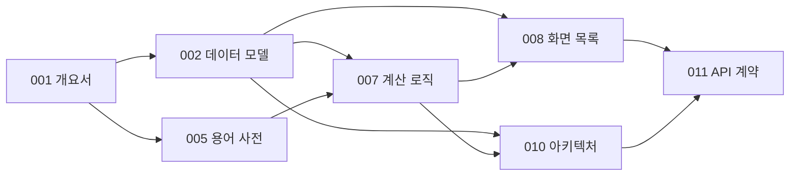

# 문서 인덱스

**언제들어오나** — ELS 통합관리 시스템

| 항목 | 내용 |
|---|---|
| 문서 ID | DOC-000 |
| 버전 | 0.4 |
| 최종 갱신 | 2026-07-27 |

---

## 1. 문서 목록

| ID | 문서 | 파일 | 버전 | 상태 |
|---|---|---|---|---|
| DOC-000 | 문서 인덱스 | `00_문서_인덱스.md` | 0.4 | 작성 |
| DOC-001 | 프로젝트 개요서 | `01_프로젝트_개요서.md` | 0.6 | 작성 |
| DOC-002 | 데이터 모델 | `02_데이터_모델.md` | 0.4 | 작성 |
| DOC-003 | 유스케이스 · 사용자 스토리 | — | — | 미작성 |
| DOC-004 | 요구사항 정의서(SRS) | — | — | 미작성 |
| DOC-005 | 용어 사전 | `05_용어_사전.md` | 0.1 | 작성 |
| DOC-006 | 데이터 사전 | — | — | 미작성 (구현 후 역작성) |
| DOC-007 | 계산 로직 명세 | `07_계산_로직_명세.md` | 0.4 | 작성 |
| DOC-008 | 정보구조 및 화면 목록 | `08_정보구조_및_화면목록.md` | 0.1 | 작성 |
| DOC-009 | 화면설계서 | — | — | 미작성 (구현 후 역작성) |
| DOC-010 | 아키텍처 및 기술 결정 | `10_아키텍처_및_기술결정.md` | 0.3 | 작성 |
| DOC-011 | API · 계약 명세 | `11_API_계약_명세.md` | 0.5 | 작성 |
| DOC-012 | 테스트 계획 | — | — | 미작성 |
| DOC-013 | 배포 · 운영 | — | — | 미작성 |

> DOC-003·004는 선행 문서에 내용이 흡수되어 있어 후순위로 둔다. DOC-006·009는 구현 결과 기준으로 역작성한다(DOC-001 §10).

---

## 2. 문서 간 의존 관계

**변경 파급.** 상류 문서를 바꾸면 하류 문서를 함께 검토한다. 특히 DOC-002(데이터 모델) 변경은 DOC-007·008·010·011 전부에 영향을 준다.

---

## 3. 구현 단계

각 단계는 독립적으로 동작하는 상태에서 종료한다(R-05 대응).

> 각 단계 종료 후 별도 컨텍스트에서 산출물을 명세와 대조 검증하고, 발견된 갭은 x.5 단계로 닫는다.

| 단계 | 내용 | 참조 문서 | 완료 기준 |
|---|---|---|---|
| **P0** | 스캐폴드 | DOC-010 §5 | 프로젝트 생성, `docs/` 커밋, 린트 규칙(DEP-04) 동작 |
| **P1** | 순수 도메인 모듈 | **DOC-007** | `lib/tax`·`lib/domain` 구현, **TC-01~22 전체 통과** |
| **P2** | 스키마 | DOC-002, DOC-010 §7 | 마이그레이션·RLS·세율 시드 적용, RLS 테스트 통과 |
| **P3** | 데이터 접근 · 계약 | DOC-011 | 조회 함수·서버 액션 구현, 검증 규칙 V-01~16 |
| **P4** | 화면 | DOC-008 | SCR-201 → 202 → 204 → 203 → 401 → 402 → 101 순 |
| **P5** | 시세 연동 | DOC-010 ADR-004 | 스텁 어댑터 → 실제 공급자, Cron |
| **P6** | 문서 역작성 | — | DOC-006·009·012·013 |

### P1을 먼저 하는 이유

1. **인프라 없이 완결된다.** DB·인증·배포 없이 구현과 검증이 끝난다
2. **즉시 검증 가능하다.** TC-01~22가 이미 정답을 갖고 있다
3. **최대 리스크를 먼저 제거한다.** R-01(세금 계산 정확성 결함)이 가장 높은 영향도를 갖는다
4. **이후 작업의 기준이 된다.** 화면·계약이 이 모듈의 출력 형태에 맞춰진다

### P4 화면 순서의 근거

목록·상세로 데이터를 볼 수 있게 만든 뒤 등록·상환으로 데이터를 넣고, 그 데이터로 세금·전망을 계산한다. 홈(SCR-101)은 모든 집계에 의존하므로 마지막에 만든다.

---

## 4. 미결정 사항 통합

각 문서에 흩어진 미결 항목이다. 이슈 트래커로 옮겨 관리한다.

| ID | 항목 | 문서 | 결정 시점 |
|---|---|---|---|
| Q-04 | 리자드 변형 수용 범위 | DOC-001 | **해결 (P1)** — 차수별 3속성으로 확정 |
| DQ-01 | 소프트 삭제 도입 | DOC-002 | **해결 (P2)** — 하드 삭제. 단 상환 완료 상품은 삭제 불가. AQ-07 동일 |
| DQ-02 | 시세 결측일 처리 | DOC-002 | P5 |
| DQ-03 | 원금 분할 매수 지원 | DOC-002 | 보류 |
| DQ-04 | 감사 로그 범위 | DOC-002 | 보류 |
| RD-01 | 세액 절사 단위 | DOC-007 | 미결 — P1에서 주입 인자로 격리 완료(기본 원 단위). **단위 확정만 잔여**, 실제 거래내역 대조 시점 |
| RD-02 | 기본 적용 차수 | DOC-007 | P4 |
| RD-03 | 평가일 영업일 조정 | DOC-007 | 보류 |
| SQ-01 | SCR-501 유지 여부 | DOC-008 | P4 이후 |
| SQ-03 | 홈 기본 표시 범위 | DOC-008 | P4 |
| AQ-01 | 시세 공급자 선정 | DOC-010 | P5 (ADR-007) |
| AQ-05 | 세율 마이그레이션 검증 절차 | DOC-010 | **해결 (P2)** — SQL 파싱(상시)과 DB 조회(RLS 스위트) 이중 게이트 |
| AQ-06 | 자동값의 수동값 덮어쓰기 | DOC-011 | P5 |
| AQ-07 | 상품 삭제 시 소프트 삭제 | DOC-011 | **해결 (P2)** — DQ-01과 동일 |
| AQ-10 | 입력 검증 라이브러리 | DOC-011 | P3 |

> Q-01(프로젝트 명칭)은 「언제들어오나」로 확정되어 목록에서 제외했다. P0 착수 제약 없음.

---

## 5. 문서 갱신 규칙

| 규칙 | 내용 |
|---|---|
| U-01 | 설계 변경 시 코드보다 문서를 먼저 고친다 |
| U-02 | 모든 변경은 해당 문서의 변경 이력에 사유와 함께 남긴다 |
| U-03 | 결정을 뒤집는 경우 이전 결정을 삭제하지 않고 철회 사실을 기록한다 |
| U-04 | ADR은 대체되어도 삭제하지 않고 상태만 변경한다 |
| U-05 | 미결 항목이 해결되면 삭제하지 않고 상태를 갱신한다 |
| U-06 | 문서는 코드와 동일 저장소에서 버전 관리한다 |

---

*본 인덱스는 문서 추가·상태 변경 시 갱신한다.*
