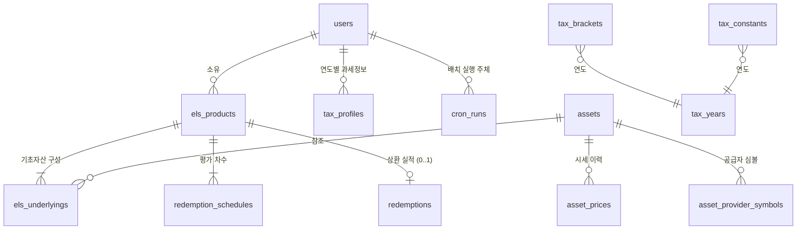

# 데이터 모델

**언제들어오나** — ELS 통합관리 시스템

| 항목 | 내용 |
|---|---|
| 문서 ID | DOC-002 |
| 버전 | 1.4 |
| 작성일 | 2026-07-26 |
| 작성자 | 민서 |
| 선행 문서 | DOC-001 프로젝트 개요서 v0.6 |
| 상태 | 검토 중 |

### 변경 이력

| 버전 | 일자 | 작성자 | 변경 내용 |
|---|---|---|---|
| 0.1 | 2026-07-26 | 민서 | 최초 작성 |
| 1.4 | 2026-08-07 | 민서 | **P5a 컷 5 — §4.11의 「`actor_id`가 근거 ②를 닫는다」를 철회한다(U-03). 스키마 0줄이다.** 운영이 **ⓐ′**(배치가 민서 자신의 계정을 재사용)로 정해졌으므로 `actor_id`가 모든 행에서 같고, 「Cron이 썼는가 버튼이 썼는가」에 답하는 것은 `caller`뿐인데 **그것은 요청이 스스로 주장하는 값**이다(INSERT 정책이 검사하는 것은 `actor_id = auth.uid()` 하나이므로 사람 세션에서 `caller = 'BATCH'` 행을 그대로 쓸 수 있다). **★ 위조 불가성이 사라진 것이 아니라 «가리키는 것»이 바뀌었다** — `actor_id`는 여전히 「누가」를 위조 불가로 말하지만 그 답이 언제나 한 사람이라 **판별하지 못한다.** 「관측 도구가 명제를 판별하는지 먼저 본다」가 그대로 적용되는 자리다. **★★ 그래도 이 테이블은 정당하다 — 근거 셋 중 «둘»이 온전하다**(① 지나간 중간 실패의 사후 진단 · ③ 전면 실패의 관측은 배치의 정체성과 무관하다). 즉 잃은 것은 근거 하나이며 `cron_runs`를 만든 판단이 무효가 되지 않는다. **★★★ 위협 모델이 악의가 아니라 «버그»임을 함께 적었다** — 사용자가 하나인 폐쇄 서비스에서 위조의 주체는 사람이 아니라 **미래의 코드 경로**이고, 오늘의 방어는 `collectAndRecord`가 `caller`를 **기본값 없는 필수 인자**로 두는 것뿐이다. 잔여는 DOC-013 **AQ-69**에 등재했다. **`CHECK`·정책·GRANT는 하나도 바뀌지 않는다** — 바뀐 것은 그 열이 답하는 «질문»이다 |
| 1.3 | 2026-08-05 | 민서 | **P5a 컷 2a — 마이그레이션 둘이 적용됐다. §4.11이 «예정»에서 «실재»가 됐다.** `20260805092917_asset_provider_symbols_writable` · `20260805092918_cron_runs`. `db:types` 재생성 완료. **(1) 원장이 «다섯»이 아니라 «여섯»이었다.** 계획은 `RLS_TABLES`·`catalog.test`·`authz-matrix`·`assets-prices` 반전·신규 `cron-runs.test` 다섯을 셌는데 **`constraint-names.test.ts`의 CHECK 역방향 단언이 함께 빨간불**이 됐다. **★ 그리고 그것을 «만족시키는» 것이 틀린 대응이었다** — `BY_CONSTRAINT`에 넣으면 DOC-011 §3.2.1 표에도 두 행이 생기는데 그 표는 「계약 계층이 사용자에게 **필드 오류로** 보여주는 제약」의 목록이고, `cron_runs`는 배치만 쓰므로 **가리킬 필드가 없다.** 넣으면 그 표가 거짓을 서술한다. 그래서 `NOT_USER_REACHABLE`로 사유와 함께 제외하고 **제외가 조용해지지 않게 두 방향을 더 봤다**(이름이 카탈로그에 실재하는가 · 사상 목록과 겹치지 않는가). **부류: 원장이 옳게 발동했고 옳은 대응은 전제를 좁히는 것이었다.** **(2) `readOnly` 목록에서 `asset_provider_symbols`를 빼고 `cron_runs`는 «넣지 않았다»** — 후자에는 INSERT 정책이 있으므로 「변경 정책이 없는 테이블」이라는 명제가 거짓이 된다. 그 테이블의 「UPDATE·DELETE 없음」은 권한 매트릭스와 `cron-runs.test.ts`가 본다. **(3) `asset_provider_symbols`가 전 DML이 됐고 DELETE를 «부여했다»** — `assets`·`asset_prices`와 비대칭이며 사유는 **매핑이 관측이 아니라는 것**이다(지워도 잃는 것이 없고, 「자동 수집하지 않는다」로 되돌릴 유일한 수단이며 `UNIQUE(asset_id, provider)` 아래에서 UPDATE로는 없앨 수 없다). 그 비대칭이 의도임을 **음성 대조로 같은 파일에서 증명했다** — `assets`·`asset_prices`의 DELETE는 여전히 42501이다. **(4) ★ 종전 케이스를 지우지 않고 «뒤집었다»** — 「인증 사용자는 매핑을 추가·수정·삭제할 수 없다」가 「할 수 있다」가 됐다. 지우면 「그 제약이 있었다」와 「없었다」가 구별되지 않고 **DELETE가 열린 것이 판단이었다는 기록이 사라진다.** **(5) ★★ 내 실수 하나가 계기의 값을 증명했다** — `actor_id` 위조 케이스에 `expectPermissionDenied`를 썼는데 그것이 빨간불이 났다. 두 거부는 **SQLSTATE가 같고(42501) 메시지로만 갈린다**(GRANT 회수 = 「permission denied」 · 정책 `WITH CHECK` 실패 = 「row-level security」). `helpers/expect.ts`가 그 표를 적어 두고 「형태를 틀리면 통과해도 아무것도 증명하지 못한다」고 경고하는데 **정확히 그 경고가 작동했다.** 실측 스위트 **205**(+17) · integration **230** · e2e **149** · 상시 **1068** 전부 초록 |
| 1.2 | 2026-08-05 | 민서 | **P5a 컷 0 — §4.11 `cron_runs` 신설(테이블 12 → 13), I-19·I-20 등재, DQ-08 신설. 문서 선행이며 마이그레이션·`src/` 0줄이다.** **(1) `cron_runs`는 근거가 «셋»이고 서로 독립이다** — ⓐ 지나간 중간 실패의 사후 진단(재호출은 「지금」만 안다) ⓑ 호출자 판별(`asset_prices`에 호출자 열이 없어 Cron·진단 `curl`·SCR-302 버튼이 갈리지 않는다) ⓒ **P5a 착지 후 CR-04 ⓒ의 실행 경로가 0이 된다**(CR-07의 503이 도달 불가가 되고 CR-02가 부분 실패를 200으로 답한다). **ⓒ가 시한을 만들었다** — 수집기보다 늦으면 **잃는 것이 미래의 관측이 아니라 그 구간의 과거**다(DOC-013 §7.1 ★★★). **(2) ★ `actor_id`가 ⓑ를 «사용자» 열로 닫는다.** AQ-57 ⓐ에서 배치가 자기 GoTrue 정체성을 가지므로 정책 `with check (actor_id = auth.uid())`가 귀속을 **위조 불가**로 만든다 — `caller`는 편의 분류이고 **위조 불가한 것은 `actor_id`**다. 두 결정이 서로를 강화하는 자리이며 그것이 AQ-57에서 ⓐ를 고르는 네 번째 논거다. **남는 공백을 적었다**: Cron과 손으로 쏜 진단 `curl`은 여전히 구별되지 않는다(같은 토큰·같은 정체성). `x-vercel-cron`은 **미실측**이라 설계가 아니라 잔여다. **(3) UPDATE·DELETE를 부여하지 않고 정책도 두지 않는다** — 「변경 없음」 두 겹 규약. **고칠 수 있는 관측 기록은 기록이 아니다.** **(4) 분류에 「관측」을 새로 만들었다** — 기존 넷 중 「트랜잭션」이 가장 가깝지만 그것은 사용자의 거래를 뜻하고, 이 행은 **지워도 도메인이 온전하다**(반대로 `asset_prices`는 지울 수 없다). 그 차이가 백업·보존에서 갈리므로 이름을 따로 준다. **(5) ★ I-19를 등식이 아니라 «부등식»으로 썼다.** DOC-011의 불변식은 `target_count = succeeded + skipped + unmapped + failed.length`인데 `failed`가 JSONB라 그 길이를 단일 행 `CHECK`에서 세면 **제약이 JSON 구조에 의존**한다 — 형태가 바뀌면 조용히 뜻을 잃거나 시끄럽게 깨진다. **DB는 바닥만 잡고 등식은 순수 모듈이 지킨다**(I-07과 같은 부류 — 표현 가능한 절반만 DB에 둔다). **(6) `failed`를 14번째 테이블로 만들지 않은 이유**와 **이것이 DQ-04(감사 로그)가 아니라는 것**을 함께 적었다 — 둘을 같게 읽으면 DQ-04가 닫힌 것으로 오해된다. **(7) ★★ DQ-08 신설 — 분할이 `base_price`와 수집 시세의 기준을 갈라 놓는다.** `base_price`는 약관에서 옮겨 적은 고정값이고 조정 경로가 없는데 공급자 계열은 **분할 조정된 값**을 준다(분할 조정은 옳다 — 금지 대상은 **배당** 조정이다). 3:1 분할이면 비율이 **1/3로 읽히고 67% 폭락과 구별되지 않으며 KI는 한 번 터치로 영구히 바뀐다.** **P5a가 만드는 것이 아니라 활성화하는 것**이라는 분류가 핵심이다 — 수동 입력에서도 이미 참이지만 사람은 이상함을 알아챌 표면이 있고 **배치는 매일 조용히 넣는다.** 그리고 이것은 **어떤 `CHECK`도 걸리지 않는다**(값이 유한하고 부호가 맞고 자릿수도 그럴싸하다) |
| 1.1 | 2026-08-01 | 민서 | **P6 컷 6 — §6 파생 값 표에 두 행. 스키마 변경은 «없다».** DOC-007 v1.0 §4.5가 「세후 예상 수령액」·「예상 손익」을 정의한 데 따르는 등재이며, **테이블·컬럼·제약·마이그레이션이 하나도 늘지 않는다**(따라서 `db:types`도 `tests/rls/`도 무변경이다). **M-02의 판단을 기록으로 남기는 것이 이 판의 전부다** — 그 표는 「이 값을 컬럼으로 만들어야 하나」의 기준이고, 새 값 둘에 그 답이 적혀 있지 않으면 다음 사람이 화면을 빠르게 만들려고 컬럼을 더할 근거를 갖는다. ★ **거절의 이유가 다른 파생값들과 다르다**: 대부분은 「유도 가능하므로 저장하지 않는다」인데 이 둘은 **세율을 곱한 결과**이고 세율 자체가 이 표의 아래쪽에서 **연도별 저장값**으로 판정되어 있다. 즉 컬럼으로 굳히면 **두 저장값의 정합을 사람이 지켜야 하고, 세율이 개정되는 날 과거 표시가 조용히 틀린다** — M-05가 세율을 연도별로 저장하기로 한 근거(재현성)가 여기서는 반대 방향으로 작용한다. **`REALIZED_ONLY` 상품이 이 값들을 갖지 않는다는 사실도 §4.6에 적었다** — 일정이 0건이라 `listSchedule`에 행 자체가 생기지 않으며, 그것이 DOC-011 §4.4가 이 값들의 널 규약을 세울 수 있는 근거다 |
| 1.0 | 2026-08-01 | 민서 | **P6 컷 5 — §4.6 `entry_mode` 신설. 「계약 조건을 모르는 기실현 상품」을 모델이 표현한다.** 실보유 ELS 중 **이미 상환이 끝난 것들**을 등재해야 하는데 현재 모델은 그것을 받을 수 없었다 — 증권사 거래내역이 주는 것은 상품명·상환일·실수령액·과표·원천징수세액·투자원금·계좌유형 **일곱**이고, 발행일·연쿠폰율·기초자산·기준가·차수·배리어는 **그 문서에 없다.** **(1) ★ 지어내지 않고 「모른다」를 저장한다.** 없는 값을 채워 넣는 대안(기초자산 1종·차수 1건을 합성)은 DQ-02가 거부한 **「관측하지 않은 관측」**과 같은 부류다 — 형식이 정상이고 값만 거짓이며, 그 거짓이 워스트오브·조건 판정에 그대로 들어간다. 그래서 `issue_date`·`annual_coupon_rate`를 **널 허용**으로 내리고 하위 행 0건을 허용한다. **(2) ★★ 판별 열을 둔 것이 이 결정의 핵심이다 — 「0건」의 뜻이 갈린다.** `entry_mode` 없이 I-07만 상환 존재로 조건화하면 **의도된 0건과 결함인 0건이 구별되지 않는다**: 계약을 우회해 기초자산이 지워진 상품(AQ-14의 잔여 경로)이 상환만 있으면 정상으로 읽히고, `integrityIssue`가 그 상태를 **더 이상 드러내지 못한다.** 절대 규칙 #6이 열거하는 fail-open과 같은 형태이며 **위반자가 0인 동안 보이지 않는다.** 열 하나가 그 둘을 가른다. **(3) 절대 규칙 #4를 어기지 않는다.** `entry_mode`는 **상태가 아니라 입력 완전성의 종류**다 — 상태(보유중·상환완료)는 여전히 `redemptions` 존재로만 유도되며(D-01) 이 열은 그 유도에 참여하지 않는다. 판별하는 것은 「이 상품이 계약 조건을 갖기로 되어 있는가」이고, 그 값은 등재 시점에 정해져 이후 변하지 않는다. **(4) I-14를 `CHECK`에서 트리거로 옮겼다** — 기실현 등재는 차수가 없으므로 조기·리자드 상환에 `round_no`를 실을 수 없다. 면제 조건이 **부모 행의 `entry_mode`**라 단일 행 `CHECK`로 표현할 수 없고(DQ-07과 같은 부류) I-16이 이미 같은 형태의 선례다. **유형을 만기 둘로 한정하는 대안을 택하지 않았다** — 조기상환된 상품이 DB에 `MATURITY_GAIN`으로 남으면 세액은 맞지만 **저장값이 사실과 어긋나고**, 그 거짓은 어느 화면에서도 반증되지 않는다. **(5) 그래서 I-07의 문구가 좁아진다** — 「상품은」이 아니라 「`FULL` 상품은」이다. 넓은 문구를 유지하면 규칙의 진술이 적용 범위보다 넓어지고, 그것이 v0.4에서 I-07을 정정한 것과 정확히 같은 결함이다. **(6) 신설 I-18 — `FULL`은 두 계약 조건 열을 갖는다**(`els_products_full_terms_check`). 널 허용으로 내린 두 열이 `FULL`에서도 비워질 수 있으면 조건 판정의 입력이 조용히 사라진다. **뒤집힐 조건**: 기실현 등재에 계약 조건을 사후 보충하는 경로가 필요해지면 `REALIZED_ONLY → FULL` 전이가 생기고, 그때 I-07·I-18을 함께 만족시키는 순서(하위 행을 먼저 넣고 모드를 올린다)를 정해야 한다 — 지금은 그 전이가 없다(§5 D-07) |
| 0.9 | 2026-07-31 | 민서 | **P6 컷 1 — §4.8 `evaluation_date`의 생성 산식에 −1일 규약을 넣는다. 스키마 변경 0, 마이그레이션 0.** **(1) 산식이 `발행일 + n × 평가주기 − 1일`이 됐다.** 증권사 통지서의 평가일이 산식보다 하루 앞이었고 실보유 **11건 65차수 전부에서 일정하게** −1일이었다 — 즉 휴장일 조정이 아니라 **기산 규약의 차이**다(영업일 조정이면 일부 차수만, 통상 +방향으로 움직인다). **(2) ★ 월말 클램프와 일 이동의 순서를 정본으로 못박았다** — 이 둘은 월말에서 갈린다(`2026-08-31` + 6개월: 클램프 먼저면 `2027-02-27`, 일 이동 먼저면 `2027-02-28`). **월 이동 → 클램프 → 일 이동**을 채택했고 근거가 둘이다: 「n개월 후의 전일」의 자연스러운 읽기이고, **클램프가 먼저인 것이 `addMonths`의 기존 성질을 보존한다**(항상 발행일 기준으로 가산해 클램프 전파를 막는 것 — 일 이동을 먼저 하면 기준 자체가 바뀌어 그 성질이 깨진다). **(3) ★★ v0.7이 예고한 §5.2 충돌이 해소됐다.** v0.7은 「RD-03이 조정 경로를 만들면 전체 교체와 충돌한다(조정한 날짜가 다음 수정 저장에서 되돌아간다)」고 적었다. **규약이 전역이므로 재생성이 «멱등»이다** — 저장된 날짜가 이미 새 산식의 결과이므로 수정 저장이 같은 값을 다시 넣는다. 그래서 **차수별 입력 칸을 만들지 않는다**(만들면 §5.2에 예외를 두어야 하고 그것이 v0.7이 경고한 자리다). 부수로 **운영 11건의 정정이 한 줄이 된다**(`evaluation_date - 1`) — 기존 저장값이 옛 산식의 결과이므로 하루 빼면 새 산식과 일치한다. **뒤집힐 조건을 함께 적었다**: 상품별로 규약이 다른 것이 나오면 차수별 칸 또는 상품별 필드가 필요해지고 그때 §5.2 충돌을 다시 결정한다(DOC-007 RD-03에 등재). **(4) 히든 이송 각주의 전제를 정정했다** — 「발행일을 고친 뒤 ③ 단계를 지나지 않고 저장하는 경로」는 DOC-008 v1.8(단계 철회)에서 **존재할 수 없게 됐다.** 생성값으로 두는 판단은 유지된다 | **P5b 컷 0 — DQ-02 종결. 스키마 변경 0, 코드 0줄.** **결측일은 공백이며 직전값을 복제하지 않는다.** 복제한 행은 **「관측하지 않은 관측」**이 되어 `asset_prices`의 좌표 의미(I-16 — 좌표는 `(asset_id, as_of_date)`, 관측값은 `price`·`source`·`provider`)를 깨뜨린다. **결정적인 것은 그 거짓이 화면 어디에도 드러나지 않는다는 점이다** — `as_of_date`가 오늘이므로 `isStale`(5일)이 발동하지 않는다. 반대로 공백은 읽기 층에 **이미 어휘가 둘 있다**(`isStale` · DOC-007 E-01). 즉 결측을 표현할 수단을 새로 만들 필요가 없고, 만들면 거짓말할 수 있는 표면이 하나 늘어난다. **행을 넣지 않는 것이 결정의 전부이므로 마이그레이션도 없다.** 함께 `failed[].reason`을 「데이터 없음」/「호출 실패」 두 부류로 갈랐다 — 사용자의 조치가 다르며(매핑을 고친다 / 기다린다) **어댑터가 구분해 주지 않으면 만들 수 없으므로** ADR-004 보정의 판별 가능한 `failure` 값이 전제다. 계약 쪽은 DOC-011 §7.1(v2.7) |
| 0.7 | 2026-07-29 | 민서 | **P4.5 — §4.8의 각주가 평가일에 대해 구현과 어긋났다(U-01).** 「생성 시 자동 채우고 **사용자가 수정할 수 있게 한다**」가 두 열(`evaluation_date`·`barrier`)을 함께 적었으나 **평가일에는 화면에 입력 칸이 없다** — SCR-204는 `발행일 + n × 평가주기`로 생성하며 저장마다 재생성한다(`SCHEDULE_SUBS`에 `evaluationDate`가 없고 차수 행에서 평가일은 `<span>`이다). 구현이 문서를 어긴 것이 아니라 **DOC-008 §5가 더 늦게 더 정확하게 정한 것**이며 본 문서의 각주만 낡았다. **정정의 실질은 각주 (1)의 근거가 지금 뒷받침되지 않는다는 것이다** — 「평가일은 영업일 기준으로 조정된다」가 저장의 근거인데 **조정할 수단이 없고**, DOC-007 RD-03의 비고가 「현재는 사용자 수정에 의존」이라 적으면서 그 의존 대상이 실재하지 않았다(DOC-007도 함께 정정했다). 저장 자체는 여전히 옳다(조정된 날짜를 담을 자리가 이미 있다). 부수로 적어 둔 것: DOC-011 §5.2가 전체 교체이므로 RD-03이 조정 경로를 만들면 **그 경로와 전체 교체가 충돌한다**(조정한 날짜가 다음 수정 저장에서 되돌아간다) — RD-03의 결정에 그 항목이 포함된다 **★ 이 버전은 적대적 반증을 지났다** — 5축 반증이 이 커밋의 주장에서 결함을 냈고 전부 정정했다(BLOCKER 2종: 「실측 1,028개」가 계산값 1,027이고 그 주소는 `<option>`을 0개 렌더한다 · 음성 대조 표 두 줄의 건수. WRONG: V-19 인용이 거짓이었다(§6의 V-19는 문자열 길이 규칙이며 `/^\d+$/`는 구현이 ID 재사용 규약으로 빌린 것 — **내가 닫으려던 부류를 내가 만들었다**) · 「추가납부가 양수」가 0이다 · AQ-36의 「여덟 칸 중 여섯」이 다섯이다 · `worstOf`를 담는 뷰가 셋이 아니라 넷이다 · 문서 접두사 없는 § 참조 다섯 · 항진명제 케이스 둘 · 퇴화 픽스처 하나 · DOC-000 버전 표 드리프트 다섯 행). |
| 0.6 | 2026-07-27 | 민서 | P3b 변경 계약 착수에 따른 정정. **본 버전은 선행 명세다 — 마이그레이션은 P3b 5·6단계다.** (1) **§9 DQ-06 부분 해결 + §8 I-17 신설** — 표현 가능한 4개(`principal > 0`·`evaluation_period_months >= 1`·`barrier > 0`·`gross_amount >= 0`)를 `CHECK`로 승격해 I-08과 같은 2층 구조를 만든다. **DQ-06 서술의 오류도 함께 정정한다** — 목록에 있던 `redemption_date >= issue_date`는 `redemptions`와 `els_products`를 함께 봐야 하므로 단일 행 `CHECK`로 표현할 수 없다(DQ-07과 같은 부류였다). 비율 상한은 DOC-011 V-08 세분이 반영된 뒤로 미룬다. (2) **§8에 제약 명명 규약 신설** — `*_redeemed_immutable` 접미사가 계약 계층에서 `23514`를 `CONFLICT`로 올리는 **의미론적 역할**을 갖는다. 규약을 적지 않으면 다음에 추가되는 상태 충돌 제약이 조용히 `VALIDATION_FAILED`로 떨어져, 사용자에게 고칠 입력이 없는 오류를 필드 오류로 보여준다. (3) **§8 I-07의 적용 수단 갱신** — 쓰기 함수(DOC-011 §5.1·§5.2)가 하위 행 수를 검사하므로 계약 경로에 DB 층 방어가 생긴다. 계약 밖 경로는 여전히 예방이 없다(DOC-010 AQ-14 부분 해소) |
| 0.5 | 2026-07-27 | 민서 | P3a 조회 계약 착수에 따른 정정. **본 버전은 선행 명세다 — 마이그레이션은 P3a 2단계에서 적용된다.** (1) **§9 DQ-05 해결(P3a) + §4.6에서 `total_rounds` 삭제** — 조회 계약에서 이 값을 읽는 곳은 DOC-011 §4.3 `product.totalRounds` 한 곳뿐이고 상세 조회는 이미 일정 전체를 로드하므로 `count(redemption_schedules)`로 정확히 유도된다. §4.6이 만기일 정본을 이미 일정 마지막 차수로 정했으므로 **차수의 정본도 같은 곳으로 통일**한다(M-02). 유지하면 "일정 0건인데 `total_rounds = 99`"가 계속 저장 가능하고 그 정합성을 강제하는 층이 어디에도 없다. (2) **§9 DQ-06 개정** — 미결 CHECK 목록의 `total_rounds >= 1` 항목을 제거한다. 컬럼이 사라지므로 조용히 무효화하지 않고 명시적으로 지운다. (3) **§4.6 만기일 각주 정정** — 유도식이 삭제된 컬럼을 참조하고 있었다. (4) **§3.1 최신가 정의는 DOC-007 v0.5가 담당** — `as_of_date <= asOf` 상한이 없으면 미래 일자 시세로 조건을 판정한다(V-17이 계약 계층에만 있어 도달 가능) |
| 0.2 | 2026-07-27 | 민서 | P1 구현 착수에 따른 정정. §4.10 `tax_constants` 키 목록을 예시에서 **확정 목록**으로 승격하고 3개 키 추가(분리과세 소득세율, 직장가입자 보수외소득 기준, 피부양자 소득 기준). DOC-007 §5.2·§6.1이 요구하는 상수가 목록에 없어 구현 시 하드코딩을 강요하는 상태였음. 상세 근거는 DOC-007 v0.2 §2 |
| 0.4 | 2026-07-27 | 민서 | P2 산출물 대조 검증(P2.5)에 따른 정정. (0) **§8 I-07의 적용 범위를 "등록 트랜잭션"에서 "모든 변경 경로"로 확대(철회 기록, U-03)** — I-07은 상태 불변식인데 생성 시점만 규율하고 있었고, 실제로 소유자가 자기 상품의 마지막 기초자산·차수를 삭제해 0건 상태에 도달할 수 있었다. 그 상태에서 DOC-007 §3.1 워스트오브가 빈 집합의 `min()`이 된다. (1) **§8 I-09의 문구 정정** — "소유자 변경은 상품 단위로만"이 상품 단위 소유권 이전은 가능한 것처럼 읽혔으나, `els_products` UPDATE 정책의 `with check`가 그것까지 차단하므로 실제 상태는 "소유자 변경 경로 없음"이다. (2) **§8 I-11·I-15 신설 + §4.6 제약 신설** — `ki_barrier`·`ki_observation`·`ki_touched_at`이 독립적으로 nullable이라 I-10과 같은 짝 결함이 있었다. 특히 `ki_barrier IS NULL`인데 `ki_touched_at`이 있는 행은 §3.4·E-06에 따라 판정이 터치 이력을 아예 보지 않으므로, 리자드의 KI 미터치 요구가 충족으로 판정되어 **수령액이 틀린다.** (3) **§8 I-12 신설 + §4.9 제약 추가** — I-08이 `MATURITY_LOSS`만 덮어 `MATURITY_GAIN`에 음수 과세소득을 넣는 경로가 열려 있었고, 그 값이 DOC-007 §7.3 합계를 오염시킨다. 절대 규칙 #8의 "음수가 될 수 없다"는 유형 무관 진술이다. (4) **§8 I-13·I-14 신설 + §8.1 FK 행 추가** — `redemptions.round_no`가 아무것도 참조하지 않아 실재하지 않는 차수가 저장되고, `EARLY`인데 `NULL`인 행도 저장됐다. §7.2 귀속연도가 그 차수의 평가일에 의존한다. (5) **§8 I-16 신설 + §4.5 제약 신설** — `asset_prices` UPDATE가 좌표(`asset_id`·`as_of_date`) 변경을 허용해 타인 상품의 워스트오브를 조용히 바꿀 수 있었다. (6) **§9 DQ-05~DQ-07 신설** |
| 0.3 | 2026-07-27 | 민서 | P2 스키마 착수에 따른 정정. (0) **§8 I-08의 적용 수단을 애플리케이션 레벨 검증에서 `CHECK` + 애플리케이션 검증으로 변경(철회 기록, U-03)** — 절대 규칙 #8에 해당하는 단일 행 불변식을 규율에만 맡기고 있었음. §4.9에 제약 추가. (1) **§4.8에 리자드 쿠폰율 CHECK 추가, §8에 I-10 등재** — `lizard_barrier`와 `lizard_coupon_rate`가 독립적으로 nullable이라 배리어만 있고 쿠폰율이 없는 행이 저장 가능했고, 그 차수의 워스트오브가 리자드 배리어를 넘는 순간 `applicableCouponRate`(DOC-007 §4.1)가 런타임에 거부한다. DOC-011 V-06이 이미 계약 계층에 규정한 규칙이나 DB가 그 데이터를 허용하는 상태였음. (2) **§5에 D-06(Supabase Auth 연계) 신설** — `users`와 Supabase `auth.users`의 관계가 어느 문서에도 없어 구현이 임의 결정을 강요받는 상태였음. (3) **§8에 FK `ON DELETE` 정책표 신설** — 삭제 전파 규칙이 정의되지 않았음. (4) **§9 DQ-01 해결(P2)** — 하드 삭제 + CASCADE. 단 상환 완료 상품은 삭제 불가 |

---

## 1. 목적 및 범위

본 문서는 시스템의 논리 데이터 모델을 정의한다. 엔티티, 속성, 관계, 무결성 규칙, 그리고 각 설계 결정의 근거를 다룬다.

물리 스키마 수준의 상세(인덱스 전략, 제약조건 명명 규칙, 기본값, 파티셔닝)는 **DOC-006 데이터 사전**에서 확장한다. DBMS 선정은 **ADR**에서 다루며, 본 문서는 관계형 DBMS를 전제하되 특정 제품에 의존하지 않는 수준으로 기술한다.

---

## 2. 모델링 원칙

| ID | 원칙 | 근거 |
|---|---|---|
| M-01 | 상품 구조의 가변 요소는 **컬럼이 아닌 행**으로 표현한다 | P-01. 기초자산 수·차수를 컬럼으로 고정하면 구조가 다른 상품을 수용할 수 없음 |
| M-02 | 계산으로 유도 가능한 값은 저장하지 않는다. 단, **유도 불가능하거나 외부에서 확정된 값은 저장한다** | 중복 저장은 정합성 위험. 6장에서 항목별로 판정 |
| M-03 | 금액·비율은 **고정소수점(DECIMAL)** 을 사용하며 부동소수점을 금지한다 | 금융 계산에서 부동소수점 오차는 누적되어 검증 실패를 유발 |
| M-04 | 비율은 **소수 형태로 정규화**하여 저장한다 (90% → `0.9000`) | 입력 단위 혼용은 계산 오류의 주원인. 정규화는 입력 계층에서 수행 |
| M-05 | 세율·요율 등 **법령 기반 상수는 연도별 데이터로 관리**한다 | A-02. 코드 하드코딩 시 연도 변경마다 배포 필요 |
| M-06 | 상태는 **독립 컬럼이 아니라 관련 레코드의 존재로 유도**한다 | P-05. 상태와 실제 데이터가 어긋날 여지를 제거 |
| M-07 | 외부 서비스 종속 정보는 **핵심 엔티티에서 분리**한다 | R-02. 시세 공급자 교체 시 도메인 스키마가 영향받지 않도록 |

---

## 3. 개념 모델 (ERD)



### 엔티티 목록

| # | 엔티티 | 역할 | 분류 |
|---|---|---|---|
| 1 | `users` | 사용자. 소유·과세 단위 | 마스터 |
| 2 | `tax_profiles` | 사용자의 연도별 과세 기초정보 | 마스터 |
| 3 | `assets` | 기초자산 (종목·지수) | 마스터 |
| 4 | `asset_provider_symbols` | 시세 공급자별 심볼 매핑 | 연결 |
| 5 | `asset_prices` | 기초자산 시세 이력 | 트랜잭션 |
| 6 | `els_products` | ELS 상품 | 마스터 |
| 7 | `els_underlyings` | 상품–기초자산 연결 + 기준가 | 연결 |
| 8 | `redemption_schedules` | 차수별 평가일·배리어·리자드 조건 | 상세 |
| 9 | `redemptions` | 상환 실적 | 트랜잭션 |
| 10 | `tax_years` / `tax_brackets` / `tax_constants` | 연도별 세율·요율 설정 | 참조 |
| 11 | `cron_runs` | 시세 배치 실행 기록 (v1.2 신설) | 관측 |

> **★ 테이블이 12 → 13이 됐다 *(v1.2, P5a 컷 0)*.** 위 표는 행이 11개지만 10행이 세 테이블을
> 묶으므로 실제 테이블 수는 **13**이다. 이 수가 `tests/rls/helpers/fixtures.ts`의 `RLS_TABLES`와
> `tests/rls/catalog.test.ts`의 양방향 로스터 단언에 **값으로** 박혀 있으므로, 여기서 하나가
> 늘면 그쪽도 같은 커밋에서 늘어야 한다(늘리지 않으면 카탈로그 대조가 빨간불이 되고,
> 그것이 이 원장이 작동하는 방식이다).
>
> **분류를 「관측」으로 새로 만든 이유** — 이 테이블은 도메인 사실이 아니라 **시스템이 자기
> 실행에 대해 남기는 기록**이다. 기존 넷(마스터·연결·트랜잭션·상세·참조)에 넣으면
> 「트랜잭션」이 가장 가깝지만 그것은 사용자의 거래를 뜻하고, 이 행은 **지워도 도메인이
> 온전하다**(반대로 `asset_prices`는 지울 수 없다). 그 차이가 백업·보존 정책에서 갈리므로
> 이름을 따로 준다.

---

## 4. 엔티티 정의

### 4.1 `users` — 사용자

| 속성 | 타입 | Null | 설명 |
|---|---|---|---|
| `id` | UUID | N | PK |
| `email` | VARCHAR(255) | N | 로그인 식별자, UNIQUE |
| `display_name` | VARCHAR(50) | N | 화면 표시명 |
| `created_at` | TIMESTAMPTZ | N | |
| `updated_at` | TIMESTAMPTZ | N | |

> 건강보험 가입유형과 금융소득 외 종합소득은 **연도별로 변동**하므로 본 엔티티가 아니라 `tax_profiles`에 둔다.

### 4.2 `tax_profiles` — 연도별 과세 기초정보

| 속성 | 타입 | Null | 설명 |
|---|---|---|---|
| `id` | UUID | N | PK |
| `user_id` | UUID | N | FK → `users` |
| `tax_year` | SMALLINT | N | 귀속 연도 |
| `other_income_base` | DECIMAL(15,0) | N | 금융소득 외 종합소득 과세표준. 기본값 0 |
| `other_financial_income` | DECIMAL(15,0) | N | ELS 외 금융소득(이자·배당). 기본값 0 |
| `health_insurance_type` | ENUM | N | `EMPLOYEE`(직장) / `REGIONAL`(지역) / `DEPENDENT`(피부양자) / `NONE` |

**제약:** `UNIQUE(user_id, tax_year)`

> 종합과세 판정에는 ELS 외 금융소득이 함께 합산되어야 하므로 별도 입력값으로 관리한다.

### 4.3 `assets` — 기초자산

| 속성 | 타입 | Null | 설명 |
|---|---|---|---|
| `id` | UUID | N | PK |
| `name` | VARCHAR(100) | N | 표시명 (예: 테슬라) |
| `asset_type` | ENUM | N | `STOCK` / `INDEX` / `ETF` |
| `market` | VARCHAR(20) | Y | 거래소 코드 (예: NASDAQ, KRX) |
| `currency` | CHAR(3) | N | ISO 4217 (예: USD, KRW) |
| `created_at` | TIMESTAMPTZ | N | |

**제약:** `UNIQUE(name, market)`

> 동일 기초자산이 여러 상품에 중복 포함되는 문제(P-04)는 이 엔티티로 자연 해소된다. 시세는 자산 단위로 1회만 관리된다.

### 4.4 `asset_provider_symbols` — 공급자 심볼 매핑

| 속성 | 타입 | Null | 설명 |
|---|---|---|---|
| `id` | UUID | N | PK |
| `asset_id` | UUID | N | FK → `assets` |
| `provider` | VARCHAR(30) | N | 시세 공급자 식별자 |
| `provider_symbol` | VARCHAR(50) | N | 해당 공급자에서의 심볼 |

**제약:** `UNIQUE(asset_id, provider)`

> M-07의 구현. 공급자를 교체하거나 병행하더라도 `assets`와 도메인 로직은 영향받지 않는다. Q-03(공급자 선정)이 미결인 상태에서도 모델을 확정할 수 있는 근거다.

### 4.5 `asset_prices` — 시세 이력

| 속성 | 타입 | Null | 설명 |
|---|---|---|---|
| `id` | UUID | N | PK |
| `asset_id` | UUID | N | FK → `assets` |
| `as_of_date` | DATE | N | 시세 기준일 |
| `price` | DECIMAL(18,6) | N | 종가 |
| `source` | ENUM | N | `AUTO`(자동 조회) / `MANUAL`(수동 입력) |
| `provider` | VARCHAR(30) | Y | `AUTO`인 경우 공급자 |
| `created_at` | TIMESTAMPTZ | N | |

**제약:** `UNIQUE(asset_id, as_of_date)` — I-05, `BEFORE UPDATE` 트리거로 `asset_id`·`as_of_date` 불변 — I-16

> **관측의 좌표와 관측값을 구분한다.** `(asset_id, as_of_date)`는 "어느 자산의 어느 날 종가인가"를 정하는 **좌표**이고, `price`·`source`·`provider`가 그 좌표에서 관측된 **값**이다. 값의 정정은 열어 두고 좌표의 변경은 막는다 — 좌표를 바꾸는 UPDATE는 정정이 아니라 다른 행을 만드는 조작이다. 상세는 I-16(§8).

> 최신가는 `as_of_date`가 가장 큰 행이다. 이력을 남기는 이유는 (1) 수동 폴백 값과 자동 조회 값의 출처 구분, (2) 조건 판정 시점의 근거 보존, (3) 추이 표시 때문이다.

### 4.6 `els_products` — ELS 상품

| 속성 | 타입 | Null | 설명 |
|---|---|---|---|
| `id` | UUID | N | PK |
| `owner_id` | UUID | N | FK → `users`. 소유·과세 단위 |
| `name` | VARCHAR(200) | N | 상품명 (예: OO증권 ELS 제1234회) |
| `issuer` | VARCHAR(50) | Y | 발행사 |
| `issue_date` | DATE | **Y** | 발행일. **`entry_mode = 'FULL'`이면 필수**(I-18) |
| `principal` | DECIMAL(15,0) | N | 투자원금 (KRW) |
| `evaluation_period_months` | SMALLINT | N | 평가주기(개월). 기본값 6 |
| `annual_coupon_rate` | DECIMAL(6,4) | **Y** | 연쿠폰율 (소수 정규화). **`FULL`이면 필수**(I-18) |
| `entry_mode` | ENUM | N | `FULL`(계약 조건을 갖는다) / `REALIZED_ONLY`(기실현 등재). 기본값 `FULL` |
| `ki_barrier` | DECIMAL(6,4) | Y | KI 배리어. **NULL이면 노낙인 상품** |
| `ki_observation` | ENUM | Y | `CONTINUOUS`(장중 터치) / `CLOSING`(종가 기준) |
| `ki_touched_at` | DATE | Y | KI 최초 터치일. NULL이면 미터치 |
| `account_type` | ENUM | N | `GENERAL`(일반) / `TAX_FREE`(ISA·연금·비과세) |
| `note` | TEXT | Y | 비고 |
| `created_at` / `updated_at` | TIMESTAMPTZ | N | |

**제약:** `CHECK((ki_barrier IS NULL) = (ki_observation IS NULL))` — I-11, `CHECK(ki_touched_at IS NULL OR ki_barrier IS NOT NULL)` — I-15, `CHECK(entry_mode <> 'FULL' OR (issue_date IS NOT NULL AND annual_coupon_rate IS NOT NULL))` — I-18

> **`entry_mode`는 상태가 아니라 「무엇을 입력받기로 했는가」다 (v1.0).** 절대 규칙 #4는 `status` 열을 금지하고 D-01이 상태를 `redemptions` 존재로 유도하는데, **이 열은 그 유도에 참여하지 않는다.** 두 축은 직교한다.

> **`REALIZED_ONLY` 상품은 차수 단위 조회에 «행 자체가 생기지 않는다» (v1.1).** 일정이 0건이고 DOC-011 §4.4의 질의 루트가 `redemption_schedules`이기 때문이다. 그래서 그 계약은 차수별 금액(§6의 신설 두 행)에 대해 **널 규약을 세울 수 있다** — `FULL`에는 I-18이 `annual_coupon_rate`를 보장하므로 도달 가능한 조합은 사실상 하나다. 그럼에도 그쪽 타입이 널을 허용하는 것은 **I-18이 「일정이 있으면 쿠폰율이 있다」를 말하지 않기 때문**이다(모드 열에 걸린 제약이지 하위 행에 걸린 제약이 아니다) — 손으로 넣은 일정 행 하나가 그 조합을 만든다. AQ-14·AQ-65와 같은 「계약 밖 경로」의 부류다.
>
> | | `redemptions` 없음 | `redemptions` 있음 |
> |---|---|---|
> | `FULL` | 보유중 — 판정이 돌아간다 | 상환완료 — 계약 조건이 이력으로 남는다 |
> | `REALIZED_ONLY` | **만들 수 없다** — 등재가 상환을 함께 만든다(§5 D-07) | 기실현 등재 |
>
> **왼쪽 아래 칸이 비어 있는 것이 원자성의 근거다.** 상품과 상환을 두 요청으로 만들면 그 칸에 도달할 수 있고, 그 상태는 「계약 조건도 없고 상환도 없는 보유중 상품」 — 판정의 모든 입력이 없는데 결함으로도 표시되지 않는다. 그래서 기실현 등재는 쓰기 함수 하나로 두 행을 함께 만든다(DOC-011 §5.11).
>
> **이 열이 없으면 `integrityIssue`가 눈을 잃는다.** I-07을 「상환이 없는 상품만」으로 조건화하는 대안은 열을 늘리지 않지만 **의도된 0건과 결함인 0건을 같은 모양으로 만든다** — 계약을 우회해 기초자산이 지워진 상품(AQ-14의 잔여 경로)이 상환만 있으면 정상으로 읽힌다. 즉 이 열은 표현력을 위한 것이 아니라 **거짓을 표현 불가로 만들기 위한 것**이다.

> **KI 세 컬럼은 하나의 조건을 나눠 담는다.** `ki_barrier`가 조건의 존재를, `ki_observation`이 관측 방식을, `ki_touched_at`이 관측 결과를 담는다. 세 컬럼이 독립적으로 nullable이면 "조건은 없는데 관측 방식이 있는" 행이나 "조건은 없는데 터치 이력이 있는" 행이 저장된다. 후자가 특히 위험하다 — 상세는 I-15(§8).

**총 평가 차수와 만기일의 정본은 모두 `redemption_schedules`다.**

| 파생값 | 정본 |
|---|---|
| 총 평가 차수 | `count(redemption_schedules)` — **행 수이며 `max(round_no)`가 아니다.** 차수 번호의 연속성(DOC-011 V-04)은 계약 계층에만 있어 DB는 `1, 2, 99`를 허용하므로 두 값이 갈릴 수 있다 |
| 만기일 | `redemption_schedules`의 마지막 차수 평가일 |

만기일은 `issue_date + evaluation_period_months × 차수`로도 유도 가능하나 실제 만기일이 영업일 기준으로 조정될 수 있으므로 일정 행을 정본으로 삼는다.

**기실현 등재는 둘 다 없다** — 일정 행이 0건이므로 총 차수는 0이고 만기일은 정의되지 않는다. 대체 산식을 두지 않는다: `issue_date`가 `NULL`이라 유도식의 입력 자체가 없고, **없는 것을 「0차·만기 미상」으로 표시하는 것이 그 상품에 대한 정확한 답이다**(그 상품은 이미 상환이 끝났으므로 앞으로 도래할 차수가 없다).

> **`total_rounds` 컬럼을 삭제한 이유 (v0.5, DQ-05 해결).** 유도 가능한 값을 저장하면서 일정 행 수와의 정합성을 강제하는 층이 없었다(M-02 위반). 총 차수는 **입력 계층에는 남는다** — DOC-011 §5.1 `ProductInput.totalRounds`가 `generateEvaluationDates`의 인자이고 V-03이 `schedules.length`와 대조하는 대상이다. 저장되지 않을 뿐이다.
>
> 정합성을 트리거로 강제하는 대안은 택하지 않았다. I-07(기초자산·차수 최소 1건)조차 DB 층 방어가 없는 상태(DOC-010 AQ-14)에서 유도값을 지키기 위해 트리거를 먼저 늘리는 것은 방어의 우선순위가 뒤바뀐다.

### 4.7 `els_underlyings` — 기초자산 구성

| 속성 | 타입 | Null | 설명 |
|---|---|---|---|
| `id` | UUID | N | PK |
| `els_id` | UUID | N | FK → `els_products` |
| `asset_id` | UUID | N | FK → `assets` |
| `base_price` | DECIMAL(18,6) | N | 기준가격 (발행 시점 확정) |
| `sequence` | SMALLINT | N | 표시 순서 |

**제약:** `UNIQUE(els_id, asset_id)`

> M-01의 핵심 적용. 기초자산 1종이든 4종이든 행 수만 달라지며 스키마는 동일하다. P-01 해소.

### 4.8 `redemption_schedules` — 차수별 평가 조건

| 속성 | 타입 | Null | 설명 |
|---|---|---|---|
| `id` | UUID | N | PK |
| `els_id` | UUID | N | FK → `els_products` |
| `round_no` | SMALLINT | N | 차수 (1부터) |
| `evaluation_date` | DATE | N | 평가일 |
| `barrier` | DECIMAL(6,4) | N | 조기상환 배리어 |
| `lizard_barrier` | DECIMAL(6,4) | Y | 리자드 배리어. NULL이면 해당 차수에 리자드 없음 |
| `lizard_coupon_rate` | DECIMAL(6,4) | Y | 리자드 상환 시 지급 쿠폰율 |
| `lizard_requires_no_ki` | BOOLEAN | Y | 리자드 조건이 KI 미터치를 함께 요구하는지 |

**제약:** `UNIQUE(els_id, round_no)`, `CHECK(lizard_barrier IS NULL OR lizard_barrier <= barrier)`, `CHECK(lizard_barrier IS NULL OR lizard_coupon_rate IS NOT NULL)`

> **두 리자드 컬럼이 짝을 이루어야 하는 이유.** `lizard_barrier`만 있고 `lizard_coupon_rate`가 NULL인 행은 저장 시점에는 무해해 보이지만, 해당 차수의 워스트오브가 리자드 배리어를 넘는 순간 지급액을 산출할 수 없다. **원금만 상환되는 리자드 변형은 `0`으로 표기하며 NULL로 표기하지 않는다**(Q-04). NULL을 0이나 연쿠폰율로 대체하면 수령액이 실제와 어긋나므로(DOC-007 §4.1) 계산 계층은 거부할 수밖에 없고, 그 거부는 화면 렌더링 중에 발생한다. 저장 시점에 막는다.

> **리자드를 별도 테이블이 아닌 차수 속성으로 둔 이유:** 리자드 조건은 본질적으로 특정 평가일에 귀속되며, 한 차수에 두 개 이상 존재할 수 없다. 차수 속성으로 두면 상품 전체로는 0개·1개·N개가 자연스럽게 표현되면서 조인이 늘지 않는다. Q-04(변형 수용 범위)가 미결이어도 `lizard_requires_no_ki` 플래그로 주요 변형이 흡수된다.

> **평가일과 배리어를 저장하는 이유:** 발행일과 평가주기로 유도할 수 있으나 (1) 평가일은 영업일 기준으로 조정되고 (2) 배리어 스케줄이 불규칙한 상품(예: 90-90-85-85-80-75)이 존재하므로, 유도값이 아니라 상품 계약 조건으로 취급한다. **저장한다는 판단은 유지되며 두 열의 사정이 갈린다** — 아래.

> **두 열의 입력 경로가 다르다 — 「사용자가 수정할 수 있게 한다」는 배리어에만 참이다 (v0.7 정정, P4.5).** v0.6까지 위 각주는 「생성 시 자동 채우고 사용자가 수정할 수 있게 한다」로 두 열을 함께 적었고, **평가일에 대해서는 구현과 어긋난다.**
>
> | 열 | 입력 경로 | 정본 |
> |---|---|---|
> | `barrier` | 차수별 칸이 정본이고 「일괄 적용」이 그 칸을 채운다(DOC-008 §5 SQ-04) | 사용자 입력 |
> | `evaluation_date` | **화면에 입력 칸이 없다.** `발행일 + n × 평가주기 − 1일`로 생성하며 저장마다 재생성한다 *(−1일은 v0.9)* | 생성값 |
>
> **평가일이 생성값인 근거는 DOC-008 §5 SCR-204에 있고 그것이 정본이다** — 화면과 파서가 `lib/domain`의 `generateEvaluationDates` **하나**를 같은 입력에 부른다. 즉 이것은 구현이 문서를 어긴 것이 아니라 **DOC-008이 더 늦게 더 정확하게 정한 것**이며, 본 문서의 각주만 낡았다. *(히든으로 나르지 않는 이유였던 「발행일을 고친 뒤 ③ 단계를 지나지 않고 저장하는 경로」는 DOC-008 v1.8에서 **존재할 수 없게 됐다** — 단계가 없으므로 지나지 않을 단계도 없다. 생성값으로 두는 판단은 유지된다.)*
>
> **−1일 규약을 넣었다 (v0.9).** 증권사 통지서의 평가일이 산식보다 하루 앞이었고, 실보유 ELS **11건 65차수 전부에서 일정하게** −1일이었다. 즉 휴장일 조정이 아니라 **기산 규약의 차이**다(영업일 조정이면 일부 차수만, 통상 +방향으로 움직인다). 상수는 `lib/domain`에 있고 호출부가 **필수 인자로 명시**한다.
>
> **월말 클램프와 일 이동의 순서를 정한다 — 이 둘은 월말에서 갈린다.** `발행일 2026-08-31`, 주기 6개월:
>
> | 순서 | 결과 |
> |---|---|
> | **월 이동 → 클램프 → 일 이동** *(채택)* | `+6개월 → 2027-02-28`(클램프) `→ −1일 → **2027-02-27**` |
> | 일 이동 → 월 이동 | `−1일 → 2026-08-30 → +6개월 → **2027-02-28**` |
>
> 「n개월 후의 전일」의 자연스러운 읽기가 앞쪽이므로 그것으로 한다. **클램프가 먼저인 것이 `addMonths`의 기존 성질을 보존한다** — 그 함수는 항상 발행일을 기준으로 가산해 클램프 전파를 막는데(위 각주), 일 이동을 먼저 하면 기준 자체가 바뀌어 그 성질이 깨진다.
>
> **그래서 위 (1)의 근거가 부분적으로 뒷받침된다 (v0.9 갱신).** 「평가일은 영업일 기준으로 조정된다」가 저장의 근거인데, v0.7 시점에는 조정을 **할 수단이 전혀 없었다.** 이제 **기산 규약의 조정은 산식이 수행하고**(전역 −1일) **휴장일 단위의 조정은 여전히 수단이 없다.** 저장하는 것 자체는 여전히 옳다(조정된 날짜를 담을 자리가 이미 있고, 유도값이면 그 자리가 없다). 남는 것은 DOC-007 RD-03의 잔여 둘이다.
>
> **DOC-011 §5.2의 전체 교체와 충돌하지 않는다 (v0.9 — v0.7이 예고한 충돌이 해소됐다).** v0.7은 「RD-03이 조정 경로를 만들면 그 경로와 전체 교체가 충돌한다(조정한 날짜가 다음 수정 저장에서 되돌아간다)」고 적었다. **규약이 전역이므로 그 충돌이 발생하지 않는다** — 재생성이 **멱등**이다: 저장된 날짜가 이미 `발행일 + n×주기 − 1일`이므로 수정 저장이 같은 값을 다시 넣는다. 그래서 v0.9는 **차수별 입력 칸을 만들지 않는다**(만들면 §5.2에 예외를 두어야 하고, 그것이 v0.7이 경고한 자리다). **뒤집힐 조건**: 상품별로 규약이 다른 것이 실제로 나오면 그때 차수별 칸 또는 상품별 필드가 필요해지고, 그 시점에 §5.2와의 충돌을 다시 결정해야 한다 — DOC-007 RD-03에 등재했다.

### 4.9 `redemptions` — 상환 실적

| 속성 | 타입 | Null | 설명 |
|---|---|---|---|
| `id` | UUID | N | PK |
| `els_id` | UUID | N | FK → `els_products`. **UNIQUE** |
| `redemption_type` | ENUM | N | `EARLY`(조기상환) / `LIZARD`(리자드상환) / `MATURITY_GAIN`(만기·이익) / `MATURITY_LOSS`(만기·손실) |
| `round_no` | SMALLINT | Y | 상환이 발생한 차수 |
| `redemption_date` | DATE | N | 상환일 |
| `gross_amount` | DECIMAL(15,0) | N | 실수령액(세전) |
| `taxable_income` | DECIMAL(15,0) | N | 과세 금융소득(배당소득). 손실 상환 시 0 |
| `withholding_tax` | DECIMAL(15,0) | Y | 원천징수세액. 미입력 시 `taxable_income × 분리과세율`로 유도 |
| `is_confirmed` | BOOLEAN | N | 증권사 확정값 여부. `false`면 시스템 추정값 |
| `note` | TEXT | Y | |

**제약:** `UNIQUE(els_id)` — 상품은 1회만 상환된다(I-01), `CHECK(redemption_type <> 'MATURITY_LOSS' OR taxable_income = 0)` — I-08, `CHECK(taxable_income >= 0)` — I-12, `CHECK(redemption_type NOT IN ('EARLY','LIZARD') OR round_no IS NOT NULL)` — I-14, `FK(els_id, round_no) → redemption_schedules(els_id, round_no)` — I-13

> **`round_no`가 nullable인 이유와 그 범위.** 조기·리자드 상환은 정의상 특정 평가일에 발생하므로 차수가 없을 수 없다(I-14). 만기 상환은 최종 차수에 귀속되나 차수 개념을 쓰지 않고 기록할 수 있으므로 `NULL`을 허용한다. 값이 있으면 그 차수는 해당 상품에 실재해야 한다(I-13).
>
> **셋째 경우가 생겼다 — 기실현 등재 (v1.0).** `REALIZED_ONLY` 상품은 일정 행이 0건이므로 **어떤 `round_no`도 실재하지 않는다**(I-13의 복합 FK가 전부 거부한다). 그래서 그 상품의 상환은 유형이 무엇이든 `round_no IS NULL`이며, **조기·리자드 상환도 그렇다** — I-14가 트리거로 내려가 이 경우를 면제하는 이유다(§8). 잃는 것은 「몇 차에서 상환되었는가」이고, 그것은 애초에 입력에 없다.

> **`taxable_income`을 저장하는 이유:** 증권사가 확정한 과세표준은 시스템이 유도할 수 없는 외부 확정값이다(A-04). 예상 손익(세전수령액 − 원금)과 실제 과세표준은 일치하지 않을 수 있으며, 세금 계산의 정확도는 이 값에 직접 의존한다. M-02의 예외 조항에 해당한다.

> **손실 상환:** `MATURITY_LOSS`인 경우 `gross_amount < principal`이며 `taxable_income = 0`이다. **ELS 손실은 다른 금융소득과 통산되지 않으므로**, 손실액을 과세 금융소득에서 차감해서는 안 된다. 포트폴리오 손익과 과세 금융소득이 분기하는 지점이며, 상세 규칙은 DOC-007 계산 로직 명세에서 정의한다.

### 4.10 세율·요율 설정

#### `tax_years`

| 속성 | 타입 | Null | 설명 |
|---|---|---|---|
| `tax_year` | SMALLINT | N | PK |
| `note` | TEXT | Y | 개정 근거 |

#### `tax_brackets` — 종합소득세 누진세율

| 속성 | 타입 | Null | 설명 |
|---|---|---|---|
| `tax_year` | SMALLINT | N | FK, 복합 PK |
| `lower_bound` | DECIMAL(15,0) | N | 과세표준 하한, 복합 PK |
| `rate` | DECIMAL(6,4) | N | 세율 |
| `progressive_deduction` | DECIMAL(15,0) | N | 누진공제액 |

#### `tax_constants` — 연도별 상수

| 속성 | 타입 | Null | 설명 |
|---|---|---|---|
| `tax_year` | SMALLINT | N | FK, 복합 PK |
| `key` | VARCHAR(50) | N | 상수 키, 복합 PK |
| `value` | DECIMAL(18,6) | N | 값 |

**키 목록** — DOC-007 §2의 주입 상수와 1:1 대응한다. 계산 로직이 요구하는 상수는 전부 여기에 있어야 한다.

| `key` | 표준 용어 | 사용처 |
|---|---|---|
| `separate_taxation_rate` | 분리과세율 | 원천징수액, 추가납부 (DOC-007 §5.5) |
| `separate_taxation_income_tax_rate` | 분리과세 소득세율 | 비교과세 방식①·② (§5.2) |
| `comprehensive_taxation_threshold` | 종합과세 기준금액 | 종합과세 판정, 방식② (§5.2) |
| `local_income_tax_rate` | 지방소득세 부가율 | 지방소득세, 실질 한계율 (§5.3, §5.6) |
| `health_insurance_rate` | 건강보험료율 | 건강보험료 (§6.2) |
| `long_term_care_rate` | 장기요양보험 비율 | 장기요양보험료 (§6.2) |
| `regional_income_threshold` | 지역가입자 금융소득 반영 기준 | 지역가입자 산정 소득 (§6.1) |
| `employee_non_wage_income_threshold` | 직장가입자 보수외소득 기준 | 직장가입자 산정 소득 (§6.1) |
| `dependent_income_threshold` | 피부양자 소득 기준 | 피부양자 산정 소득 (§6.1) |

> **분리과세율과 분리과세 소득세율은 별개 키다.** 전자는 지방세를 포함한 원천징수 총 부담(2026년 15.4%), 후자는 소득세분(14%)이다. 비교과세는 소득세만 산출한 뒤 지방소득세를 별도로 가산하므로 두 값이 모두 필요하다.

> **건보 문턱 3개는 종합과세 기준금액과 별개 키다.** 2026년 기준 직장가입자·피부양자 문턱이 종합과세 기준금액과 같은 2,000만원이나, 근거 법령이 국민건강보험법과 소득세법으로 나뉘어 함께 개정된다는 보장이 없다. 키를 공유하면 한쪽만 개정될 때 조용히 틀린다.

> M-05의 구현. 세법 개정 시 데이터만 추가하면 과거 연도 계산은 그대로 재현된다. 이는 회귀 테스트(K-08) 성립의 전제이기도 하다.

---

### 4.11 `cron_runs` — 시세 배치 실행 기록 *(v1.2 신설, P5a 컷 0)*

| 속성 | 타입 | Null | 설명 |
|---|---|---|---|
| `id` | UUID | N | PK |
| `actor_id` | UUID | N | FK → `users.id`. **누가 실행했는가** — 아래 ★ |
| `caller` | ENUM | N | `BATCH`(Cron) / `MANUAL_REFRESH`(SCR-302 버튼) |
| `outcome` | ENUM | N | `OK` / `PROVIDER_UNAVAILABLE` / `INTERNAL` — DOC-011 §3.2의 어휘만 쓴다 |
| `started_at` | TIMESTAMPTZ | N | 실행 시작 |
| `finished_at` | TIMESTAMPTZ | N | 실행 종료 |
| `target_count` | INTEGER | N | 대상 자산 수 (미상환 상품이 참조하는 기초자산) |
| `succeeded` | INTEGER | N | 시세 행을 쓴 자산 수 |
| `skipped` | INTEGER | N | 기준일 행이 이미 있어 건너뛴 수 (CR-05) |
| `unmapped` | INTEGER | N | 공급자 매핑이 없는 수 — **실패가 아니다** |
| `failed` | JSONB | N | 실패 목록. 기본값 `'[]'`. 형태는 DOC-011 §7.1이 소유한다 |
| `created_at` | TIMESTAMPTZ | N | 기본값 `now()` |

**제약:** `succeeded + skipped + unmapped <= target_count` 이고 넷 다 음수 불가 (I-19) ·
`finished_at >= started_at` (I-20)

**권한:** `authenticated`에 `SELECT`·`INSERT`만. **UPDATE·DELETE는 부여하지 않고 정책도 두지
않는다**(§7의 「변경 없음」 두 겹 규약). 고칠 수 있는 관측 기록은 기록이 아니다.

> **★ 이 테이블이 세 가지를 «각각» 못 하던 것에 답한다 — 근거가 하나가 아니라 셋이고 서로
> 독립이다** (DOC-013 §7.2가 그 셋을 열거한다):
>
> | # | 무엇을 못 했는가 |
> |---|---|
> | 1 | **지나간 중간 실패의 사후 진단** — 재호출은 「지금」만 알려 주고 「그때」를 모른다 |
> | 2 | **호출자 판별** — `asset_prices`에 호출자 열이 없어 Cron·진단 `curl`·SCR-302 버튼이 갈리지 않는다 |
> | 3 | **「전면 실패」의 관측** — P5a 착지 후 CR-04 ⓒ의 실행 경로가 0이 된다 |
>
> **3번이 시한을 만들었다** — DOC-013 §7.1 ★★★이 판단 시점을 **P5a 컷 0**으로 못박은 이유가
> 그것이며, 수집기(컷 3)보다 늦으면 **잃는 것이 미래의 관측이 아니라 그 구간의 과거**다.
>
> ~~**`actor_id`가 2번을 «사용자» 열로 닫는다.** AQ-57 ⓐ(전용 서비스 계정)에서 배치가 자기
> GoTrue 정체성을 가지므로 「Cron이 썼는가 버튼이 썼는가」가 이 열로 답해지고, RLS 정책
> `with check (actor_id = auth.uid())`가 그 귀속을 **위조 불가**로 만든다 — 즉 `caller`는
> 편의상의 분류이고 **위조 불가한 것은 `actor_id`**다. 두 결정(테이블 신설 · 배치 정체성)이
> 서로를 강화하는 자리다.~~
>
> **★ 철회한다 — 2번은 «닫히지 않았다» *(v1.4, P5a 컷 5. U-03)*.** 운영이 **ⓐ′**(민서 자신의
> 계정을 배치가 재사용)로 정해졌기 때문이다. 그러면 `actor_id`는 모든 행에서 같은 값이고,
> 「Cron이 썼는가 버튼이 썼는가」에 답하는 것은 **`caller`뿐인데 그것은 요청이 스스로 주장하는
> 값**이다(정책이 검사하는 것은 `actor_id = auth.uid()` 하나이므로, 사람 세션에서 PostgREST로
> `caller = 'BATCH'` 행을 그대로 쓸 수 있다).
>
> **위조 불가성이 사라진 것이 아니라 «가리키는 것»이 바뀌었다.** `actor_id`는 여전히
> 「**누가**」를 위조 불가로 말한다 — 다만 그 답이 언제나 한 사람이라 **판별하지 못한다.**
> 관측 도구가 명제를 판별하는지를 먼저 보는 이 저장소의 규율이 여기 그대로 적용된다.
>
> **★★ 그래도 이 테이블은 정당하다 — 근거 셋 중 «둘»이 온전하다.** 1번(지나간 중간 실패의
> 사후 진단)과 3번(전면 실패의 관측)은 배치의 정체성과 **무관**하다. 즉 잃은 것은 근거 하나이며
> `cron_runs`를 만든 판단이 무효가 되지 않는다. **위협 모델이 악의가 아니라 «버그»라는 것도
> 함께 적는다** — 사용자가 하나인 폐쇄 서비스에서 위조의 주체는 사람이 아니라 **미래의
> 코드 경로**다(어떤 화면이 실수로 `caller = 'BATCH'`를 쓰는 것).
>
> **남는 공백을 적어 둔다:** Cron과 **손으로 쏜 진단 `curl`**은 여전히 구별되지 않는다 —
> 둘 다 같은 토큰·같은 정체성이다. `caller`를 요청이 스스로 주장하게 두면 그것은 위조 가능한
> 값이므로 판별자가 아니다. `x-vercel-cron` 헤더가 후보이나 **미실측**이라 설계가 아니라
> 잔여로 등재한다(DOC-013 §11).
>
> **`failed`를 14번째 테이블로 만들지 않는다.** 그것은 DOC-011 §7.1이 형태를 소유한 **보고**이고
> 질의 대상 도메인 엔티티가 아니다(`create_els_product(jsonb)`가 같은 형태의 선례다).
> 그리고 **이것은 DQ-04(감사 로그)가 아니다** — 그쪽은 도메인 데이터의 변경 이력이며 여전히
> 미결이다. 둘을 같은 것으로 읽으면 DQ-04가 닫힌 것으로 오해된다.

---

## 5. 핵심 설계 결정

### D-01. 상태를 컬럼이 아닌 관계로 표현 (P-05, K-04 해소)

`els_products`에 `status` 컬럼을 두지 않는다. 상품의 상태는 다음과 같이 유도한다.

```
보유중(active)   ⟺ 해당 els_id의 redemptions 레코드 없음
상환완료(redeemed) ⟺ 해당 els_id의 redemptions 레코드 존재
```

`redemptions.els_id`에 UNIQUE 제약이 있으므로 한 상품이 동시에 두 상태일 수 없고, 두 번 상환될 수도 없다. **이중 집계가 애플리케이션 로직이 아니라 스키마 수준에서 불가능하다.** K-04("구조적으로 발생 불가")의 근거다.

### D-02. 소유자는 상품에, 과세는 소유자별로

`els_products.owner_id`가 소유·과세 단위를 결정한다(DOC-001 §1 과세·부과 단위). 세금 계산의 집계 키는 항상 `(owner_id, 귀속연도)`이며, 사용자 간 합산은 어떤 경우에도 수행하지 않는다.

조회 권한은 전체 사용자에게 열려 있으나(S-10), 이는 **표시 범위의 문제이지 집계 범위의 문제가 아니다.** 대시보드에서 타인의 현황을 볼 수 있더라도 세금 계산은 소유자별로 독립 수행된다.

### D-03. 환율을 모델링하지 않음

조기상환 조건 판정은 **기준가 대비 현재가의 비율**로 이루어진다. 기준가와 현재가가 동일 통화로 표시되므로 비율 계산에서 통화 단위가 상쇄된다. 따라서 해외 기초자산이라도 조건 판정에 환율이 필요 없다.

투자원금과 수령액은 원화로 확정되므로 환산도 불필요하다. 이는 v1에서 환율 엔티티를 두지 않는 근거이며, 환율 기반 상품(퀀토가 아닌 구조 등)을 도입할 경우 재검토가 필요하다.

### D-04. KI 터치는 저장값

KI 터치 여부는 원칙적으로 발행일부터의 전체 가격 이력에서 유도할 수 있다. 그러나 본 시스템은 도입 시점 이후의 시세만 수집하므로 **과거 터치 이력을 유도할 수 없다.** 또한 `CONTINUOUS` 관찰 방식은 장중 저가 데이터를 요구하는데, 일 배치 종가 수집(O-04)으로는 확인할 수 없다.

따라서 `ki_touched_at`을 저장값으로 두고, 자동 판정은 **보조 수단**으로만 사용한다(수집된 시세로 터치가 감지되면 사용자에게 확인을 요청).

### D-05. 시세 공급자 종속성 격리

`assets`는 공급자 중립적 속성만 갖고, 공급자별 심볼은 `asset_provider_symbols`로 분리한다(M-07). 공급자 교체 시 영향 범위는 매핑 테이블과 수집 어댑터에 한정되며, 도메인 스키마와 계산 로직은 변경되지 않는다.

### D-06. Supabase Auth 연계

ADR-002가 인증을 Supabase Auth로 정했으나(SEC-01), §4.1의 `users`와 Supabase가 관리하는 `auth.users`의 관계는 어느 문서에도 정의되지 않았다. P2 구현이 임의 결정을 강요받으므로 여기서 확정한다.

**`users.id`는 `auth.users.id`와 같은 값이다.** 별도 대리키를 두지 않고 `users.id`가 `auth.users.id`를 참조한다.

```
users.id  ──FK(ON DELETE CASCADE)──▶  auth.users.id
```

대리키를 따로 두면 `owner_id = auth.uid()` 비교마다 조인이 하나 붙는다. ADR-002의 RLS 정책 예시가 `owner_id`를 `auth.uid()`와 직접 비교하는데, 이는 두 id가 같을 때만 성립한다. `auth.users`를 직접 쓰지 않는 이유는 그 테이블이 자격증명을 담고 있어 `authenticated` 롤에 노출되지 않으며, 화면이 요구하는 `display_name`이 없기 때문이다.

**행 생성은 `auth.users` 트리거만 담당한다.** 초대 기반 폐쇄형이므로(SEC-03, A-05) 가입 화면이 없고, 사용자가 직접 프로필 행을 만들 경로도 필요 없다. 클라이언트에는 `users`의 INSERT 권한을 부여하지 않는다.

**`display_name` 확보 순서.**

| 순위 | 출처 | 비고 |
|---|---|---|
| 1 | 초대 시 지정한 `user_metadata.display_name` | 의도된 경로 |
| 2 | 이메일 로컬파트 | `NOT NULL`을 항상 만족시키기 위한 폴백. `VARCHAR(50)` 초과 시 절단 |
| 3 | SCR-502 설정에서 본인이 수정 | 정정 경로 |

**계정 삭제는 보유 상품이 없을 때만 가능하다.** `els_products.owner_id`가 `RESTRICT`이므로(§8.1) 상품을 가진 계정의 삭제는 실패한다. 계정 하나를 지우는 조작이 상환 실적까지 연쇄 삭제하는 경로를 만들지 않는다.

### D-07. 기실현 등재는 상품과 상환을 함께 만든다 (v1.0)

이미 상환이 끝난 ELS를 등재할 때 증권사 거래내역이 주는 것은 일곱이다 — 상품명 · 상환일 · 실수령액(거래금액) · 과세 금융소득(과표) · 원천징수세액(제세금) · 투자원금 · 계좌유형. **발행일·연쿠폰율·기초자산·기준가·차수·배리어는 그 문서에 없다.**

**그 여섯을 지어내지 않는다.** 기초자산 1종과 차수 1건을 합성해 I-07을 만족시키는 대안은 값이 거짓인 행을 만들고, 그 거짓은 형식상 정상이라 어디에도 드러나지 않는다 — DQ-02가 시세 결측에 대해 거부한 것과 같은 부류다. 대신 `entry_mode = 'REALIZED_ONLY'`로 **모른다는 사실 자체를 저장한다.**

**두 행이 한 트랜잭션이다.** §4.6의 표에서 「`REALIZED_ONLY` + 상환 없음」 칸이 비어 있는 것이 이 결정이며, 그 칸은 **판정의 모든 입력이 없는데 결함으로도 표시되지 않는 상태**다. 요청 둘로 나누면 부분 실패가 정확히 그 칸을 만든다 — §5.1이 쓰기 함수를 도입한 근거(기초자산 0건 상품이 남는다)와 같은 형태이고, 여기서는 남는 것이 **과세 이력 없는 유령 상품**이라 더 무겁다.

**계약 조건을 사후 보충하는 경로는 두지 않는다.** `REALIZED_ONLY → FULL` 전이를 열면 I-07(하위 행 ≥1)과 I-18(두 열 필수)을 **동시에** 만족시켜야 하고, 그 순서(하위 행을 먼저 넣고 모드를 올린다)를 강제할 층이 없다. 그리고 그 전이의 수요가 실재하지 않는다 — 이미 상환된 상품에 배리어를 채워 넣어도 판정할 것이 없다(§5.2가 상환 완료 상품의 수정을 이미 `CONFLICT`로 막는다). **필요해지면 그때 순서를 정한다.**

---

## 6. 파생 값 vs 저장 값

M-02의 항목별 판정 결과다. 이 표는 구현 시 "이 값을 컬럼으로 만들어야 하나"의 판단 기준이 된다.

| 값 | 구분 | 근거 |
|---|---|---|
| 다음 평가일, D-Day | 파생 | `redemption_schedules` + 기준일 |
| 워스트오브 | 파생 | `min(현재가 / 기준가)` |
| 조기상환·리자드 조건 충족 여부 | 파생 | 워스트오브 vs 배리어 |
| 예상 수령액 | 파생 | 원금 × (1 + 쿠폰율 × 경과월/12) |
| 예상 과세 금융소득 | 파생 | 예상 수령액 − 원금 |
| 예상 원천징수, 세후 예상 수령액 | 파생 | 예상 과세 금융소득 × 분리과세율 (DOC-007 §4.5). **컬럼으로 굳히면 세율 개정이 과거 표시를 조용히 틀리게 한다** — 세율은 아래 「세율·요율」대로 **연도별 저장값**이므로, 그 값을 곱한 결과를 저장하면 두 저장값의 정합을 사람이 지켜야 한다 |
| 예상 손익 | 파생 | 예상 수령액 − 원금. 「실현손익」(실수령액 − 원금)과 다르며 그쪽도 파생이다 |
| 연도별 금융소득 합계 | 파생 | 소유자·연도별 집계 |
| 세액, 건강보험료 | 파생 | 계산 로직 명세에 따름 |
| **실제 과세표준** | **저장** | 외부(증권사) 확정값. 유도 불가 |
| **실제 수령액** | **저장** | 동일. 손실 상환 시 특히 중요 |
| **KI 터치 이력** | **저장** | D-04 참조 |
| **평가일·배리어** | **저장** | 계약 조건. 영업일 조정·불규칙 스케줄 존재 |
| **세율·요율** | **저장** | 연도별 법령값 (M-05) |

---

## 7. 상태 전이

```
[등록]                          [기실현 등재]  ← entry_mode = REALIZED_ONLY
   │                                  │        상품 + 상환을 한 트랜잭션에 (D-07)
   ▼                                  │
보유중 (redemptions 없음)              │
   │
   ├─ 평가일 도래 → 조건 미충족 → 다음 차수로 이월 (상태 불변)
   │
   └─ 상환 발생 → redemptions 레코드 생성
                     │
                     ├─ EARLY          조기상환 배리어 충족
                     ├─ LIZARD         리자드 조건 충족
                     ├─ MATURITY_GAIN  만기 · 원금 이상
                     └─ MATURITY_LOSS  만기 · 원금 손실
                                          │       ┌──────────────┘
                                          ▼       ▼
                                     상환완료
```

상환 처리는 **단일 트랜잭션에서 `redemptions` 레코드 1건을 생성**하는 것으로 완결된다. 원본 삭제나 별도 이관이 없으므로 K-03(상환 처리 1단계)을 만족한다.

**기실현 등재는 「보유중」을 지나지 않는다 (v1.0).** 상품 행과 상환 행이 같은 트랜잭션에서 만들어지므로 그 상품이 보유중이었던 순간이 없다(D-07). 유형 넷은 그대로 쓰이며 **차수만 항상 `NULL`이다**(§4.9).

**그 상품의 상환을 취소하면 다시 결함이다.** `deleteRedemption`은 상품을 보유중으로 되돌리는데(§5.5) `REALIZED_ONLY` 상품에서 그 상태는 **계약 조건도 상환도 없는 보유중** — §4.6 표의 빈 칸이다. 등재는 그 칸을 만들 수 없고 상환 취소만이 만들 수 있으므로, 조회 계층은 그 상태를 **결함으로 표시한다**(`entry_mode`만 보고 면제하면 판정 입력이 하나도 없는 상품이 정상으로 읽힌다). 다음 행동은 상품 삭제이며 그 경로는 열려 있다 — §8.1이 상환 없는 상품의 삭제를 허용한다.

---

## 8. 무결성 규칙

| ID | 규칙 | 적용 |
|---|---|---|
| I-01 | 상품당 상환 레코드는 최대 1건 | `UNIQUE(redemptions.els_id)` |
| I-02 | 상품당 기초자산은 중복 불가 | `UNIQUE(els_underlyings.els_id, asset_id)` |
| I-03 | 상품당 차수 번호는 중복 불가 | `UNIQUE(redemption_schedules.els_id, round_no)` |
| I-04 | 리자드 배리어는 해당 차수 조기상환 배리어 이하 | `CHECK` |
| I-05 | 자산·일자당 시세는 1건 | `UNIQUE(asset_prices.asset_id, as_of_date)` |
| I-06 | 사용자·연도당 과세 프로필은 1건 | `UNIQUE(tax_profiles.user_id, tax_year)` |
| I-07 | **`entry_mode = 'FULL'`인** 상품은 최소 1개의 기초자산과 1개의 차수를 가진다 | 애플리케이션 레벨 검증(DOC-011 V-02·V-03, §5.3) **+ 쓰기 함수 말미 검사** — 등록·수정·삭제 전 경로. v0.6에서 DB 층이 추가되었으나 **계약을 경유하는 경로에만** 걸린다. v1.0에서 적용 대상이 `FULL`로 좁아졌다 |
| I-08 | `MATURITY_LOSS`인 경우 `taxable_income = 0` | `CHECK` (§4.9) + 애플리케이션 검증 |
| I-09 | 상환 레코드의 소유자 변경 불가 | **소유자 변경 경로 없음.** 소유자는 `els_products.owner_id` 하나뿐이며 그 열의 변경도 정책이 차단한다 |
| I-10 | 리자드 배리어가 있으면 리자드 쿠폰율은 필수 | `CHECK` (§4.8) |
| I-11 | `ki_barrier`와 `ki_observation`은 함께 존재하거나 함께 부재한다 | `CHECK` (§4.6) |
| I-12 | `taxable_income`은 0 이상이다 | `CHECK` (§4.9) |
| I-13 | 상환의 `round_no`는 해당 상품에 실재하는 차수를 가리킨다 | 복합 FK (§4.9, §8.1) |
| I-14 | `EARLY`·`LIZARD` 상환은 `round_no`를 갖는다 — **부모가 `FULL`일 때** | **`BEFORE INSERT OR UPDATE` 트리거** (v1.0. 종전 `CHECK`) |
| I-15 | `ki_touched_at`은 `ki_barrier`가 있을 때만 존재한다 | `CHECK` (§4.6) |
| I-16 | 시세 관측의 좌표(`asset_id`·`as_of_date`)는 불변이다 | `BEFORE UPDATE` 트리거 (§4.5) |
| I-17 | 값 범위 — `principal > 0`, `evaluation_period_months >= 1`, `barrier > 0`, `gross_amount >= 0` | `CHECK` (v0.6, DQ-06 부분 해결) |
| I-18 | `entry_mode = 'FULL'`이면 `issue_date`·`annual_coupon_rate`가 있다 | `CHECK` (§4.6, v1.0) |
| I-19 | `cron_runs`의 집계가 정합한다 — 넷 다 음수 불가이고 `succeeded + skipped + unmapped <= target_count` | `CHECK` (§4.11, v1.2) |
| I-20 | `cron_runs.finished_at >= started_at` | `CHECK` (§4.11, v1.2) |

> **I-19를 `=`가 아니라 `<=`로 쓴 이유 *(v1.2)*.** DOC-011 §7.1의 불변식은
> `target_count === succeeded + skipped + unmapped + failed.length`이고 등식이다. 그런데
> `failed`는 **JSONB**이므로 그 길이를 단일 행 `CHECK`에서 세면 제약이 JSON 구조에 의존하게
> 된다 — 형태가 바뀌면 제약이 조용히 뜻을 잃거나 시끄럽게 깨진다. 그래서 **DB는 부등식으로
> 바닥만 잡고**(넷의 합이 대상 수를 넘을 수 없다) **등식은 수집기와 계약 계층이 지킨다.**
> 즉 이 항목은 I-07과 같은 부류다 — 표현 가능한 절반만 DB에 둔다. 등식을 단언하는 자리는
> **수집기가 순수 모듈이라는 성질**에 기대며(그래야 분기표를 전수로 볼 수 있다) 그 스위트는
> **P5a 컷 3에서 선다** — 지금은 없다. **그 사실을 적어 두는 것이 이 각주의 절반이다:**
> 부등식만 있는 동안 등식은 **어느 층도 강제하지 않으므로**, 컷 3이 그 단언을 세우지 않으면
> 이 불변식은 문서에만 있는 상태로 남는다.
> **그 공백을 `tests/rls/cron-runs.test.ts`가 케이스로 고정했다** — 「합이 대상 수보다 작고
> `failed`가 빈」 행이 **DB를 통과한다**는 것을 통과 케이스로 적었다(적지 않으면 다음 사람이
> DB가 등식을 지킨다고 읽는다).

> **★ I-19·I-20은 계약 계층에 «사상하지 않는다» — 그리고 그것이 판단이다 *(P5a 컷 2a)*.**
>
> `tests/rls/constraint-names.test.ts`의 역방향 단언이 **`public`의 모든 `CHECK`가
> `errors.ts`의 `BY_CONSTRAINT`에 있어야 한다**고 요구하며, 그 근거는 「`CHECK`는 전부
> 사용자 입력에서 도달 가능하다」였다. **이 둘에서 그 전제가 거짓이 됐다** — `cron_runs`는
> 배치만 쓰고 화면에도 계약 입력에도 그 값을 넣는 자리가 없다.
>
> **단언을 «만족시키는» 것이 틀린 대응이다.** `BY_CONSTRAINT`에 넣으면 `tests/db/docs-contract.test.ts`가
> DOC-011 §3.2.1 표와 양방향으로 대조하므로 **그 표에도 두 행이 생기는데**, 그 표는
> 「계약 계층이 사용자에게 **필드 오류로** 보여주는 제약」의 목록이다. 가리킬 필드가 없는
> 제약을 거기 넣으면 **그 표가 거짓을 서술한다.** 배치의 집계 위반은 사용자 오류가 아니라
> **수집기 결함**이며 진단은 로그와 `cron_runs` 자신이다.
>
> 그래서 `NOT_USER_REACHABLE`로 **사유와 함께 제외**하고, 그 제외가 조용해지지 않게
> **두 방향을 더 본다** — ⓐ 제외 목록의 이름이 카탈로그에 실재하는가(오타로 제외가 넓어지는
> 것을 막는다) ⓑ 제외 목록과 사상 목록이 겹치지 않는가. **부류를 적어 둔다: 원장이 옳게
> 발동했고 옳은 대응은 그것을 만족시키는 것이 아니라 «전제를 좁히는» 것이었다.**

I-01 ~ I-06, I-08, I-10 ~ I-18은 DB 제약으로 강제한다(DOC-010 §8 K-04). I-07은 교차 행 규칙이라 단일 행 제약으로 표현할 수 없으므로 애플리케이션이 담당하며 DOC-011 §6의 V-02·V-03에 대응한다 — **생성 시점만이 아니라 값을 줄이는 모든 경로에 적용된다.** v0.6부터 쓰기 함수가 계약 경로에서 이를 함께 강제한다. I-09는 `redemptions`에 소유자 컬럼을 두지 않는 것으로 구조적으로 성립한다.

**제약 이름은 계약 계층이 읽는 값이다 (v0.6 신설).** DOC-011 §3.2.1이 제약 이름으로 `fields`를 결정하고, **접미사 하나는 `ErrorCode` 자체를 바꾼다.**

| 접미사 | 뜻 | 계약 계층의 처리 |
|---|---|---|
| `*_check` (기본) | 단일 행 값 불변식 | `23514` → `VALIDATION_FAILED` + 해당 필드 |
| `*_key` · `*_fkey` | 다른 행과의 관계 | `23505`·`23503` → `CONFLICT` |
| **`*_redeemed_immutable`** | **상태 충돌** — 상환 완료가 그 조작을 금지한다 | `23514`여도 **`CONFLICT`로 올린다** |
| `*_required` | 교차 행 최소 개수 (I-07) | `23514` → `VALIDATION_FAILED` + 해당 배열 |

**plpgsql `RAISE`는 이름을 `detail` 첫 줄에도 싣는다** — `constraint = '…'`만 지정하면 그 이름이 PostgREST를 지나며 사라진다(I-16 각주의 실측). 형식은 `detail = 'constraint=<이름>'`이며 둘째 줄 이후는 사람이 읽는 설명이다.

> **왜 이름에 의미를 싣는가.** SQLSTATE는 **거부의 형태**만 말한다 — `CHECK`와 `RAISE … errcode '23514'`는 형태가 같고, 그 형태만 보면 "값을 고치면 되는 일"과 "상태가 충돌해 다른 조작이 먼저 필요한 일"이 구분되지 않는다. 후자를 `VALIDATION_FAILED`로 내면 화면은 필드별 오류를 표시하려 하는데 **고칠 필드가 없다**(상환 완료 상품의 수정은 어떤 값을 바꿔도 실패한다). 사용자는 같은 입력을 반복하고 화면은 매번 같은 오류를 낸다.
>
> **규약이 없으면 다음 제약에서 조용히 재발한다.** 이름을 판정에 쓰는 결정은 이 표에 적히지 않으면 `errors.ts`의 사상 목록 안에만 존재하고, 다음 사람은 새 상태 충돌 제약에 `*_check`를 붙인다. 그 순간 매핑은 기본값으로 떨어지고 아무것도 실패하지 않는다 — I-15가 "저장된 사실이 계산에서 사라진다"였던 것과 같은 부류로, **표현된 의도가 처리에서 사라진다.**

> **I-08의 적용 수단 변경 (v0.3에서 철회, U-03).** v0.2까지 I-08은 "애플리케이션 레벨 검증"이었다. 이를 철회하고 DB `CHECK`를 **추가**한다. 애플리케이션 검증(DOC-011 V-12)을 없애는 것이 아니라 역할을 나눈다 — DOC-010 §3.3이 RLS와 계약 계층에 이미 적용한 구조와 같다.
>
> | 계층 | 역할 |
> |---|---|
> | 계약 계층 (V-12) | 필드별 `VALIDATION_FAILED` 반환. UX 목적 |
> | DB `CHECK` | 최종 보장. 우회 불가 |
>
> **철회 사유.** I-08은 단일 행 불변식이라 제약으로 표현 가능하다. 그런데 이것은 CLAUDE.md 절대 규칙 #8("손실 상환의 과세 금융소득은 0이다")이며 세액에 직결된다. 프로젝트의 핵심 전제를 애플리케이션 규율에만 맡기는 것은 ADR-002가 선언한 "정합성을 규율이 아니라 구조로 보장한다"와 어긋난다. v0.2의 분류는 교차 행 규칙인 I-07과 함께 묶으면서 표현 가능성을 따로 검토하지 않은 결과로 판단한다.
>
> **이 제약에 걸리는 상환이 나오면 제약을 풀지 않는다.** 손실 상환에 과세소득이 붙는 구조(예: 기중 쿠폰을 지급하는 월지급식)가 등장하면, 그것은 제약이 틀렸다는 신호가 아니라 **모델의 전제가 그 상품에 맞지 않는다는 신호다.** 현재 모델은 상품당 상환 1건(I-01)에 과세소득 1개를 전제한다. 기중 지급이 있는 구조는 지급 이벤트가 여러 개이므로 `redemptions` 1건으로 표현할 수 없고, 상환과 별개의 지급 엔티티가 필요하다. 그때는 DQ-03(원금 분할 매수)과 같은 수준의 모델 변경으로 다룬다.

> **I-07의 적용 범위 정정 (v0.4에서 철회, U-03).** v0.3까지 I-07의 적용 수단은 "애플리케이션 레벨 검증 (등록 트랜잭션)"이었다. 이를 철회하고 **모든 변경 경로**로 넓힌다.
>
> **철회 사유.** I-07은 생성 시점 규칙이 아니라 **상태 불변식**이다. 등록 시점만 검증하면 등록 직후에 하위 행을 삭제해 기초자산 0건·차수 0건 상태에 도달할 수 있고, 실제로 그 경로가 열려 있었다 — 소유자가 자기 상품의 마지막 기초자산을 삭제하는 것을 막는 층이 없었다. 그 상태에서 DOC-007 §3.1의 워스트오브는 빈 집합의 `min()`이 되고, 규칙 문구("상품은 최소 1개를 가진다")가 규칙의 실제 적용 범위보다 넓어진다. v0.3의 분류는 교차 행 규칙이라는 성질에만 주목하고 **언제** 검사하는지를 따로 검토하지 않은 결과로 판단한다.
>
> DOC-007 §3.1이 0건을 전제조건 위반으로 거부하도록 함께 바뀌었으므로, 이 상태는 조용히 잘못된 값을 내지 않고 즉시 드러난다. 단 **DB 층에는 아직 방어가 없다** — DOC-010 AQ-14로 남긴다.

> **I-11.** I-10과 같은 논거다(§4.8 "두 리자드 컬럼이 짝을 이루어야 하는 이유"). `ki_barrier`만 있고 `ki_observation`이 `NULL`이면 DOC-007 §3.4의 보조 판정이 `CONTINUOUS`(장중 터치)와 `CLOSING`(종가 기준) 중 무엇으로 관측할지 결정할 수 없다. 두 방식은 요구하는 데이터가 다르므로(D-04) 임의로 하나를 가정할 수 없다. 역방향 — `ki_barrier`가 `NULL`인데 관찰 방식이 있는 행 — 은 노낙인 상품에 의미 없는 값이 붙은 상태다.

> **I-15는 I-11보다 무겁다.** `ki_barrier`가 `NULL`인데 `ki_touched_at`이 있는 행은 **저장된 사실이 계산에서 사라진다.** DOC-007 §3.4는 `ki_barrier IS NULL`을 노낙인으로 정의하고 E-06이 "노낙인 상품은 리자드의 KI 요구 조건을 항상 충족으로 처리"한다고 규정하므로, 판정은 `ki_touched_at`을 아예 보지 않는다. 그 결과 `lizard_requires_no_ki = true`인 차수가 **KI가 터치됐는데도 리자드 충족으로 판정되고**, 적용 쿠폰율이 리자드 쿠폰율로 선택되어(§4.1) 수령액이 실제와 어긋난다.
>
> **고칠 곳은 판정 로직이 아니라 DB다.** 판정은 명세대로 동작하고 있다. 문제는 명세가 존재를 전제하지 않은 행을 스키마가 허용하는 것이다 — I-08과 같은 성질이다.

> **I-12와 I-08의 역할 분담.** I-08은 `MATURITY_LOSS`에만 걸린다. 그래서 `MATURITY_GAIN`에 음수 과세소득을 넣는 경로가 열려 있었고, 그 값은 §7.3의 연도별 금융소득 합계를 그대로 오염시켜 세액을 낮춘다. CLAUDE.md 절대 규칙 #8("손실 상환의 과세 금융소득은 0이다. 음수가 될 수 없다")의 뒷문장은 **상환 유형과 무관한 진술**이므로 유형 무관 제약이 필요하다. 두 제약은 대체가 아니라 포함 관계다 — I-08은 손실 상환에서 정확히 `0`을, I-12는 전 유형에서 하한을 보장한다.

> **I-13과 `round_no`의 nullable 유지.** 복합 FK는 `MATCH SIMPLE`(PostgreSQL 기본)이므로 참조 열 중 하나라도 `NULL`이면 검사하지 않는다. `els_id`가 `NOT NULL`이므로 검사를 건너뛰는 경우는 `round_no IS NULL`뿐이고, 이는 §4.9가 만기 상환을 위해 의도한 상태다. **`MATCH FULL`을 쓰면 안 된다** — 그 순간 `round_no`가 필수가 되어 만기 상환을 표현할 수 없다.

> **I-14는 I-13의 빈틈을 메운다.** `MATCH SIMPLE` 때문에 `round_no IS NULL`인 `EARLY` 상환은 복합 FK를 그대로 통과한다 — 거부하려던 바로 그 불량 행이다. 조기·리자드 상환은 정의상 특정 평가일에서 발생하므로(DOC-007 §3.3) 차수가 없을 수 없다. **단방향으로 쓴다** — 쌍조건(`(유형 ∈ {EARLY,LIZARD}) = (round_no IS NOT NULL)`)으로 쓰면 만기 상환에 최종 차수를 기록하는 것까지 금지하는데, 본 문서가 그것을 금지한 적은 없다. DOC-011 V-13과 같은 진술이며 계약 계층과 DB가 역할을 나눈다.
>
> **`CHECK`에서 트리거로 옮겼다 (v1.0). 규칙은 그대로이고 적용 범위에 예외가 하나 생긴다.** 기실현 등재는 일정 행이 0건이라 **실재하는 차수가 없으므로**(§4.9) 조기·리자드 상환도 `round_no IS NULL`이어야 하는데, I-14는 그것을 거부한다. 면제 조건이 **부모 행의 `entry_mode`**라 단일 행 `CHECK`로는 표현할 수 없다 — `redemption_date >= issue_date`가 승격되지 못한 이유(I-17 각주)와 같은 부류이고, 수단은 I-16이 이미 쓴 `BEFORE` 트리거다.
>
> **거부의 형태를 바꾸지 않는다.** `errcode = '23514'`를 유지하고 `constraint`·`detail` 두 채널에 이름을 싣는다(§8 명명 규약). **이름은 `_check`를 떼고 `redemptions_round_no_required`로 바꿨다** — 접미사가 계약 계층의 판정 입력이고, 이 규칙은 이제 다른 행(부모 상품)을 보므로 `*_required`(교차 행)가 정확한 부류다. 계약 계층의 처리(`VALIDATION_FAILED` + `roundNo`)는 두 접미사에서 같으므로 화면 동작은 불변이다.
>
> **대안 — 유형을 만기 둘로 한정하는 것 — 을 택하지 않았다.** 기실현 등재의 유형을 `MATURITY_GAIN`·`MATURITY_LOSS`로 좁히면 트리거가 필요 없다(차수를 요구하는 유형이 입력에서 사라진다). 그러나 실제로 조기상환된 상품이 DB에 `MATURITY_GAIN`으로 남고, **세액은 옳은데 저장값이 사실과 어긋난다.** 그 어긋남은 세금 계산이 유형을 보지 않으므로(§7.3은 `taxable_income`만 읽는다) 어떤 화면에서도 반증되지 않는다 — I-15가 「저장된 사실이 계산에서 사라진다」였던 것의 거울상으로, **계산에 쓰이지 않는 값이라서 거짓이 살아남는다.**

> **I-18은 널 허용의 대가를 되받는다.** `issue_date`·`annual_coupon_rate`를 널 허용으로 내린 것은 기실현 등재 때문인데, 그 완화가 `FULL` 상품에도 그대로 적용되면 **조건 판정의 입력이 조용히 사라진다** — `annual_coupon_rate`가 없으면 예상 수령액(DOC-007 §4.1)을 낼 수 없고 `issue_date`가 없으면 평가일 생성(§4.8)의 기준이 없다. 두 값은 `FULL`에서 **언제나 있었고** 그 성질을 잃지 않는 것이 이 제약이다. I-11·I-15와 같은 짝 규칙이며, 다른 점은 짝의 한쪽이 값이 아니라 **모드**라는 것이다.

> **I-16을 권한이 아니라 무결성으로 두는 이유.** 좌표를 바꾸는 UPDATE는 정정이 아니라 다른 행을 만드는 조작이다. `asset_id` 변경은 시세를 타인 자산으로 재부모화하고, `as_of_date` 변경은 DOC-007 §3.1의 "최신가"를 이동시킨다. 둘 다 **타인 상품의 워스트오브를 조용히 바꾸며**, 시세 삭제와 달리 E-01(시세 없음)로 드러나지도 않는다.
>
> **거부가 제약 이름을 두 채널로 싣는다 (v0.6, P3b 실측).** `errcode = '23514'`와 함께 `constraint`를 지정했으나, **그 옵션은 HTTP 경계를 넘지 못한다** — `pg` 직결에서는 `error.constraint`로 오는데 PostgREST를 지나면 `message`(한글 문구)만 남고 `details`·`hint`가 `null`이다(`PostgrestError`에 `constraint` 필드가 없다). 표준 `CHECK`·`UNIQUE`는 이름이 `message`에 문자열로 들어오지만 커스텀 `RAISE`는 그 문구를 쓰지 않으므로 파싱할 대상이 없다.
>
> 그대로 두면 이 규칙의 위반이 계약 계층에서 **필드를 잃는다** — DOC-011 §5.7이 요구한 `assetId`·`asOfDate` 표시가 불가능해지고, `saveManualPrice`가 낼 수 있는 유일한 `23514`가 그것이다. 그래서 `detail`의 **첫 줄**을 `constraint=<이름>`으로 고정해 함께 싣는다. `constraint` 옵션은 `pg` 경로(`tests/rls`)를 위해 유지한다 — 두 채널을 다 채우는 것이 어느 한쪽 검증도 깨지 않는 유일한 형태다. **이후 추가되는 모든 plpgsql `RAISE`는 같은 규약을 따른다**(§8 명명 규약).
>
> 수단 선택의 근거는 다음과 같다. RLS `WITH CHECK`로는 표현할 수 없다 — 정책 표현식은 변경 후 행만 보고 변경 전 행을 참조할 수 없다. 열 단위 GRANT로 강제하면 `supabase-js`의 `.upsert()`가 payload 전역을 `DO UPDATE SET`에 실으므로 **정상적인 정정 UPSERT가 권한 오류로 실패한다**(DOC-011 §5.7). `BEFORE UPDATE` 트리거는 동일값 재대입을 통과시켜 UPSERT를 온전히 남기면서 실제 변경만 거부한다. 오류 코드는 `23514`로 내어 거부 형태를 `CHECK`와 일치시킨다 — 이 규칙은 권한 규칙이 아니라 I-11·I-12와 같은 층의 무결성 규칙이다.

> **I-17 — 값 범위를 2층으로 올린 근거 (v0.6).** 네 규칙은 전부 **단일 행 불변식**이고 DOC-011 V-01·V-08·V-20이 이미 계약 계층에 같은 내용을 두고 있으므로, I-08이 만든 구조(계약 계층은 필드별 오류, DB는 최종 보장)를 그대로 적용한다. 승격하지 않으면 음수 원금·음수 배리어가 마이그레이션·수동 SQL로 들어올 수 있고, **음수 배리어는 워스트오브가 어떤 값이어도 조건이 충족되어** 존재하지 않는 조기상환을 표시한다 — I-15와 같은 부류의 조용한 결함이다.
>
> **`redemption_date >= issue_date`는 승격하지 않는다.** DQ-06이 이 항목을 "단일 행 불변식이라 `CHECK`로 표현 가능"에 넣은 것은 **오류였다** — 상환일은 `redemptions`에 있고 발행일은 `els_products`에 있으므로 두 행을 함께 봐야 한다. DQ-07(교차 테이블 정합성)과 같은 부류이며 계약 계층(V-10)에 남는다. **V-17이 DB에 못 가는 이유와는 다르다** — V-17은 표현식이 `IMMUTABLE`이 아니어서 못 가고(오늘 유효한 행이 내일 위반이 된다), 이것은 참조 범위 때문에 못 간다. 둘을 같은 이유로 묶으면 나중에 트리거로 옮길 수 있는지 판단할 근거가 사라진다.
>
> **비율 상한(`x <= 2`)도 지금은 승격하지 않는다.** DOC-011 V-08의 하한이 필드별로 다르다는 사실이 v0.9에서야 드러났으므로(`lizard_coupon_rate = 0`은 정상 입력이다), 그 세분이 계약 계층에서 검증된 뒤에 DB로 올린다. 지금 올리면 원금상환형 리자드를 DB가 거부하게 된다.

> **I-16이 `created_at`·`id`를 덮지 않는 이유.** 좌표는 `(asset_id, as_of_date)`뿐이다. `created_at`은 감사 메타데이터이고 DOC-007의 어떤 계산도, DOC-011 §4.5 `AssetPriceView`도 읽지 않는다. 게다가 `timestamptz`는 마이크로초, JavaScript `Date`는 밀리초까지만 표현하므로 **조회한 행을 그대로 되싣는 UPSERT가 절단된 값 때문에 거부된다.** `id`는 대리키이고 조인·판정이 좌표로만 이루어진다. 판정 입력이 아닌 열을 규칙에 끼워 넣으면 근거가 흐려지고 실패 모드만 늘어난다.

### 8.1 삭제 전파 (`ON DELETE`)

| FK | 동작 | 근거 |
|---|---|---|
| `users.id` → `auth.users.id` | `CASCADE` | 계정이 사라지면 프로필도 사라진다 (D-06) |
| `tax_profiles.user_id` → `users.id` | `CASCADE` | 사용자 없는 과세 프로필은 의미가 없다 |
| `els_products.owner_id` → `users.id` | `RESTRICT` | 계정 삭제가 상품과 상환 실적을 조용히 지우지 못하게 한다. 상품이 없는 계정만 삭제된다 |
| `els_underlyings.els_id` → `els_products.id` | `CASCADE` | 상품의 구성 요소다 |
| `redemption_schedules.els_id` → `els_products.id` | `CASCADE` | 상품의 계약 조건이다 |
| **`redemptions.els_id` → `els_products.id`** | **`RESTRICT`** | **상환 실적은 실현된 과세 이력이다.** 아래 참조 |
| **`redemptions (els_id, round_no)` → `redemption_schedules (els_id, round_no)`** | **`RESTRICT`** | 상환이 가리키는 차수는 사라질 수 없다 (I-13). `round_no`가 `NULL`이면 `MATCH SIMPLE`이 검사하지 않는다 |
| `els_underlyings.asset_id` → `assets.id` | `RESTRICT` | 사용 중인 기초자산은 사라질 수 없다 |
| `asset_prices.asset_id` → `assets.id` | `CASCADE` | 시세 이력은 자산에 귀속된다 |
| `asset_provider_symbols.asset_id` → `assets.id` | `CASCADE` | 동일 |
| `tax_brackets.tax_year` · `tax_constants.tax_year` → `tax_years` | `RESTRICT` | 과거 연도는 삭제하지 않는다 (ADR-005) |

> **상환 완료 상품은 삭제할 수 없다.** `redemptions.els_id`가 `RESTRICT`이므로 상환 레코드가 있는 상품의 삭제는 실패한다. 상환 실적은 증권사가 확정한 외부 값이고 시스템이 유도할 수 없으며(A-04), 사라지면 해당 귀속연도의 금융소득 합계와 세액이 **조용히** 바뀐다. 상품을 지우려면 `deleteRedemption`으로 상환을 먼저 취소해야 하는 2단계이며, 그 과정에서 사용자는 과세 이력을 지운다는 사실을 명시적으로 확인하게 된다. 계약 계층의 동작은 DOC-011 §5.3.

> **상환이 있는 상품의 평가일정 행도 함께 고정된다.** I-13의 복합 FK가 `RESTRICT`이므로, 상환이 가리키는 차수의 일정 행은 삭제되지 않고 그 `round_no`도 변경되지 않는다. 상환 완료 상품의 수정을 DOC-011 §5.2가 이미 `CONFLICT`로 막으므로 계약과 모순되지 않으며, 상환의 귀속 차수가 사후에 사라지거나 다른 차수를 가리키게 되는 경로를 없앤다 — 그 차수의 평가일이 §7.2의 귀속연도를 결정하기 때문이다.

---

## 9. 미결정 사항

| ID | 항목 | 상태 | 비고 |
|---|---|---|---|
| DQ-01 | 소프트 삭제 도입 여부 | **해결 (P2)** | **하드 삭제 + CASCADE.** 소프트 삭제를 도입하면 `UNIQUE(redemptions.els_id)`가 부분 인덱스로 바뀌어 I-01의 보장이 조건부가 되고, 모든 조회가 `deleted_at` 필터를 기억해야 한다. 필터 하나가 빠지면 삭제된 상환이 집계에 들어가며 조용히 틀린다. 대신 **상환 완료 상품의 삭제를 막아**(§8.1) 오삭제로 과세 이력을 잃는 경로를 없앤다. DOC-011 AQ-07도 함께 해결 |
| DQ-02 | 시세 수집 실패 시 보관 정책 | **해결 (P5b 컷 0)** | **공백. 직전값을 복제하지 않는다.** 직전값을 새 `as_of_date`로 복제하면 그 행은 **「관측하지 않은 관측」**이 되고 `asset_prices`의 좌표 의미(`(asset_id, as_of_date)`가 관측의 좌표, `price`·`source`·`provider`가 관측값 — I-16)가 깨진다. **형식은 정상이고 값만 거짓인 상태**이며 ADR-004 v0.7이 스텁 어댑터를 테스트 안으로 밀어넣은 것과 정확히 같은 위험이다. **결정적인 것은 그것이 화면 어디에도 드러나지 않는다는 것이다** — `as_of_date`가 오늘이므로 `isStale`(5일)이 발동하지 않는다. 반대로 공백은 읽기 층에 **이미 어휘가 둘 있다**(`isStale` · DOC-007 E-01 「시세 없음」). 즉 결측을 표현할 수단을 새로 만들 필요가 없고, 만들면 그것이 거짓말할 수 있는 표면을 하나 늘린다. **스키마 변경은 없다** — 행을 넣지 않는 것이 결정의 전부다. **함께 정한 것: `failed[].reason`을 두 부류로 가른다** — 「데이터 없음」(휴장·상장폐지·**심볼 오류** → 사용자는 **매핑을 고친다**)과 「호출 실패」(네트워크·인증·한도 → **기다린다. 고칠 것이 없다**). 사용자의 조치가 다르기 때문이며, **어댑터가 구분해 주지 않으면 만들 수 없으므로** ADR-004 보정의 `failure: 'NO_DATA' \| 'CALL_FAILED'`가 이 결정의 전제다(문자열이 아니라 **판별 가능한 값**이어야 두 부류가 층을 넘어 살아남는다 — DOC-011 V-18이 층마다 다른 칸을 가리켰던 함정과 같은 형태). 계약 쪽은 DOC-011 §7.1 |
| DQ-03 | 원금 분할 매수 상품 지원 | 미결 | 현재 모델은 단일 원금 전제 |
| DQ-04 | 감사 로그(변경 이력) 범위 | 미결 | 금액 필드 수정 이력 보존 여부 |
| DQ-05 | `total_rounds`를 유지할지 `count(redemption_schedules)`로 대체할지 | **해결 (P3a)** | **컬럼 삭제.** 조회 계약에서 읽는 곳은 DOC-011 §4.3 `product.totalRounds` 한 곳이고 상세 조회는 이미 일정 전체를 로드하므로 행 수로 정확히 유도된다. §4.6이 만기일 정본을 일정 마지막 차수로 정했으므로 차수 정본도 같은 곳으로 통일한다. 정본은 **행 수**이며 `max(round_no)`가 아니다 — 연속성(V-04)이 계약 계층에만 있어 두 값이 갈릴 수 있다. 총 차수는 입력 계층(`ProductInput.totalRounds`)에만 남는다. 상세는 §4.6 |
| DQ-06 | 값 범위 제약 도입 여부 | **부분 해결 (P3b)** | **네 개를 I-17로 승격했다** — `principal > 0`, `evaluation_period_months >= 1`, `barrier > 0`, `gross_amount >= 0`. 남는 것은 둘이다. ① `redemption_date >= issue_date`는 **교차 행이라 단일 행 `CHECK`로 표현할 수 없다**(아래 v0.5 서술의 오류를 정정한다) → 계약 계층 V-10에 남기며 DQ-07과 함께 다룬다. ② 비율 상한 `x <= 2`는 DOC-011 V-08의 필드별 하한이 확정된 뒤로 미룬다 — 지금 올리면 원금상환형 리자드(`lizard_coupon_rate = 0`)를 DB가 거부한다. 근거는 §8 I-17 각주. **v0.5까지의 서술:** `principal > 0`, `evaluation_period_months >= 1`, `barrier > 0`, `gross_amount >= 0`, `redemption_date >= issue_date`가 전부 무제약이다 — 음수 원금·음수 배리어·발행일 이전 상환일이 모두 저장된다. 단일 행 불변식이라 `CHECK`로 표현 가능하며, DOC-011 V-01·V-07·V-08·V-10이 계약 계층에 이미 있으므로 I-08과 같은 2층 구조로 승격할지의 문제다. **v0.5에서 `total_rounds >= 1` 항목을 제거했다** — DQ-05로 컬럼이 사라졌으므로 조용히 무효화하지 않고 명시적으로 지운다. 차수 0건은 이제 값 범위 문제가 아니라 I-07(교차 행)의 문제이고, 조회 계층은 DOC-011 §4의 `integrityIssue`로 그 상태를 드러낸다 |
| DQ-08 | **주식 분할·병합이 `base_price`와 수집 시세의 기준을 갈라 놓는다** | **미결 (v1.2 신설, P5a 컷 0)** | **자동 수집이 시작되는 순간 실재하는 위험이 된다.** `els_underlyings.base_price`는 등록 시점에 ELS 약관에서 옮겨 적은 **고정값**이고 조정 경로가 없다. 그런데 시세 공급자의 일별 계열은 **분할 조정된 값**을 준다(실측: 어느 공급자든 그렇다 — 분할 조정은 옳고 **배당** 조정이 금지 대상이다. ADR-007 ★). 즉 분할 전에 등록한 상품은 **기준가가 조정 전, 현재가가 조정 후**가 되어 비율이 무의미해진다. 3:1 분할이면 `현재가/기준가`가 **1/3로 읽히고**, 그것은 **67% 폭락과 구별되지 않는다** — 조기상환·리자드·**KI가 전부 오작동하며 KI는 한 번 터치로 영구히 성격이 바뀐다.** ★ **이 항목이 P5a가 «만드는» 것이 아니라 «활성화»하는 것이라는 분류가 중요하다** — 수동 입력에서도 이미 참이지만(사용자가 조정 후 가격을 손으로 넣으면 같은 일이 난다) 수동은 사람이 이상함을 알아챌 표면이 있고 **배치는 매일 조용히 넣는다.** ★★ **그리고 이것은 「형식은 정상이고 값만 거짓」의 가장 나쁜 형태다** — 값이 유한하고 부호가 맞고 자릿수도 그럴싸해서 어떤 `CHECK`도 걸리지 않으며, `isStale`도 발동하지 않는다(날짜는 최신이다). **최소 방어의 후보:** 수집값과 `base_price`의 비율이 임계(예: `[0.2, 5]`) 밖이면 **그 자산을 판정에서 빼고 표식을 낸다** — DOC-008 ST-06의 형태(결함을 조용히 넘기지 않는다)이며 「시세 없음」(E-01) 어휘를 재사용할 수 있다. **정면 해소**는 분할 이벤트를 모델링해 `base_price`를 조정하는 것이고 그것은 새 테이블과 이벤트 원천을 요구한다(KIS의 `period-rights`류가 후보). **지금 정하지 않는 이유는 실제 발생 여부가 관측되지 않았기 때문**이며, 보유 4종이 미국 대형주라 분할 가능성이 낮지 않다는 점을 함께 적는다 |
| DQ-07 | 교차 테이블 정합성을 어느 계층에서 강제할지 | 미결 | `TAX_FREE` 계좌인데 `taxable_income > 0`인 상환(DOC-007 §4.3이 계좌유형을 먼저 분기하므로 계산은 틀리지 않으나 DB에 모순 행이 남는다), `MATURITY_LOSS`인데 `gross_amount > principal`인 상환(§4.9 본문이 `gross_amount < principal`이라고 서술하나 강제하지 않는다). 둘 다 `redemptions`와 `els_products`를 함께 봐야 하므로 단일 행 `CHECK`로 표현할 수 없다 |

---

*본 문서는 프로젝트 진행에 따라 갱신되며, 주요 변경은 변경 이력에 기록한다.*
