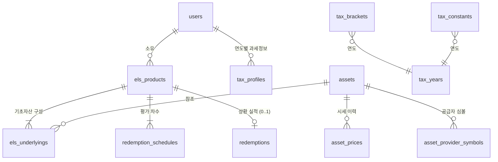

# 데이터 모델

**언제들어오나** — ELS 통합관리 시스템

| 항목 | 내용 |
|---|---|
| 문서 ID | DOC-002 |
| 버전 | 0.2 |
| 작성일 | 2026-07-26 |
| 작성자 | 민서 |
| 선행 문서 | DOC-001 프로젝트 개요서 v0.6 |
| 상태 | 검토 중 |

### 변경 이력

| 버전 | 일자 | 작성자 | 변경 내용 |
|---|---|---|---|
| 0.1 | 2026-07-26 | 민서 | 최초 작성 |
| 0.2 | 2026-07-27 | 민서 | P1 구현 착수에 따른 정정. §4.10 `tax_constants` 키 목록을 예시에서 **확정 목록**으로 승격하고 3개 키 추가(분리과세 소득세율, 직장가입자 보수외소득 기준, 피부양자 소득 기준). DOC-007 §5.2·§6.1이 요구하는 상수가 목록에 없어 구현 시 하드코딩을 강요하는 상태였음. 상세 근거는 DOC-007 v0.2 §2 |

---

## 1. 목적 및 범위

본 문서는 시스템의 논리 데이터 모델을 정의한다. 엔티티, 속성, 관계, 무결성 규칙, 그리고 각 설계 결정의 근거를 다룬다.

물리 스키마 수준의 상세(인덱스 전략, 제약조건 명명 규칙, 기본값, 파티셔닝)는 **DOC-006 데이터 사전**에서 확장한다. DBMS 선정은 **ADR**에서 다루며, 본 문서는 관계형 DBMS를 전제하되 특정 제품에 의존하지 않는 수준으로 기술한다.

---

## 2. 모델링 원칙

| ID | 원칙 | 근거 |
|---|---|---|
| M-01 | 상품 구조의 가변 요소는 **컬럼이 아닌 행**으로 표현한다 | P-01. 기초자산 수·차수를 컬럼으로 고정하면 구조가 다른 상품을 수용할 수 없음 |
| M-02 | 계산으로 유도 가능한 값은 저장하지 않는다. 단, **유도 불가능하거나 외부에서 확정된 값은 저장한다** | 중복 저장은 정합성 위험. 6장에서 항목별로 판정 |
| M-03 | 금액·비율은 **고정소수점(DECIMAL)** 을 사용하며 부동소수점을 금지한다 | 금융 계산에서 부동소수점 오차는 누적되어 검증 실패를 유발 |
| M-04 | 비율은 **소수 형태로 정규화**하여 저장한다 (90% → `0.9000`) | 입력 단위 혼용은 계산 오류의 주원인. 정규화는 입력 계층에서 수행 |
| M-05 | 세율·요율 등 **법령 기반 상수는 연도별 데이터로 관리**한다 | A-02. 코드 하드코딩 시 연도 변경마다 배포 필요 |
| M-06 | 상태는 **독립 컬럼이 아니라 관련 레코드의 존재로 유도**한다 | P-05. 상태와 실제 데이터가 어긋날 여지를 제거 |
| M-07 | 외부 서비스 종속 정보는 **핵심 엔티티에서 분리**한다 | R-02. 시세 공급자 교체 시 도메인 스키마가 영향받지 않도록 |

---

## 3. 개념 모델 (ERD)



### 엔티티 목록

| # | 엔티티 | 역할 | 분류 |
|---|---|---|---|
| 1 | `users` | 사용자. 소유·과세 단위 | 마스터 |
| 2 | `tax_profiles` | 사용자의 연도별 과세 기초정보 | 마스터 |
| 3 | `assets` | 기초자산 (종목·지수) | 마스터 |
| 4 | `asset_provider_symbols` | 시세 공급자별 심볼 매핑 | 연결 |
| 5 | `asset_prices` | 기초자산 시세 이력 | 트랜잭션 |
| 6 | `els_products` | ELS 상품 | 마스터 |
| 7 | `els_underlyings` | 상품–기초자산 연결 + 기준가 | 연결 |
| 8 | `redemption_schedules` | 차수별 평가일·배리어·리자드 조건 | 상세 |
| 9 | `redemptions` | 상환 실적 | 트랜잭션 |
| 10 | `tax_years` / `tax_brackets` / `tax_constants` | 연도별 세율·요율 설정 | 참조 |

---

## 4. 엔티티 정의

### 4.1 `users` — 사용자

| 속성 | 타입 | Null | 설명 |
|---|---|---|---|
| `id` | UUID | N | PK |
| `email` | VARCHAR(255) | N | 로그인 식별자, UNIQUE |
| `display_name` | VARCHAR(50) | N | 화면 표시명 |
| `created_at` | TIMESTAMPTZ | N | |
| `updated_at` | TIMESTAMPTZ | N | |

> 건강보험 가입유형과 금융소득 외 종합소득은 **연도별로 변동**하므로 본 엔티티가 아니라 `tax_profiles`에 둔다.

### 4.2 `tax_profiles` — 연도별 과세 기초정보

| 속성 | 타입 | Null | 설명 |
|---|---|---|---|
| `id` | UUID | N | PK |
| `user_id` | UUID | N | FK → `users` |
| `tax_year` | SMALLINT | N | 귀속 연도 |
| `other_income_base` | DECIMAL(15,0) | N | 금융소득 외 종합소득 과세표준. 기본값 0 |
| `other_financial_income` | DECIMAL(15,0) | N | ELS 외 금융소득(이자·배당). 기본값 0 |
| `health_insurance_type` | ENUM | N | `EMPLOYEE`(직장) / `REGIONAL`(지역) / `DEPENDENT`(피부양자) / `NONE` |

**제약:** `UNIQUE(user_id, tax_year)`

> 종합과세 판정에는 ELS 외 금융소득이 함께 합산되어야 하므로 별도 입력값으로 관리한다.

### 4.3 `assets` — 기초자산

| 속성 | 타입 | Null | 설명 |
|---|---|---|---|
| `id` | UUID | N | PK |
| `name` | VARCHAR(100) | N | 표시명 (예: 테슬라) |
| `asset_type` | ENUM | N | `STOCK` / `INDEX` / `ETF` |
| `market` | VARCHAR(20) | Y | 거래소 코드 (예: NASDAQ, KRX) |
| `currency` | CHAR(3) | N | ISO 4217 (예: USD, KRW) |
| `created_at` | TIMESTAMPTZ | N | |

**제약:** `UNIQUE(name, market)`

> 동일 기초자산이 여러 상품에 중복 포함되는 문제(P-04)는 이 엔티티로 자연 해소된다. 시세는 자산 단위로 1회만 관리된다.

### 4.4 `asset_provider_symbols` — 공급자 심볼 매핑

| 속성 | 타입 | Null | 설명 |
|---|---|---|---|
| `id` | UUID | N | PK |
| `asset_id` | UUID | N | FK → `assets` |
| `provider` | VARCHAR(30) | N | 시세 공급자 식별자 |
| `provider_symbol` | VARCHAR(50) | N | 해당 공급자에서의 심볼 |

**제약:** `UNIQUE(asset_id, provider)`

> M-07의 구현. 공급자를 교체하거나 병행하더라도 `assets`와 도메인 로직은 영향받지 않는다. Q-03(공급자 선정)이 미결인 상태에서도 모델을 확정할 수 있는 근거다.

### 4.5 `asset_prices` — 시세 이력

| 속성 | 타입 | Null | 설명 |
|---|---|---|---|
| `id` | UUID | N | PK |
| `asset_id` | UUID | N | FK → `assets` |
| `as_of_date` | DATE | N | 시세 기준일 |
| `price` | DECIMAL(18,6) | N | 종가 |
| `source` | ENUM | N | `AUTO`(자동 조회) / `MANUAL`(수동 입력) |
| `provider` | VARCHAR(30) | Y | `AUTO`인 경우 공급자 |
| `created_at` | TIMESTAMPTZ | N | |

**제약:** `UNIQUE(asset_id, as_of_date)`

> 최신가는 `as_of_date`가 가장 큰 행이다. 이력을 남기는 이유는 (1) 수동 폴백 값과 자동 조회 값의 출처 구분, (2) 조건 판정 시점의 근거 보존, (3) 추이 표시 때문이다.

### 4.6 `els_products` — ELS 상품

| 속성 | 타입 | Null | 설명 |
|---|---|---|---|
| `id` | UUID | N | PK |
| `owner_id` | UUID | N | FK → `users`. 소유·과세 단위 |
| `name` | VARCHAR(200) | N | 상품명 (예: OO증권 ELS 제1234회) |
| `issuer` | VARCHAR(50) | Y | 발행사 |
| `issue_date` | DATE | N | 발행일 |
| `principal` | DECIMAL(15,0) | N | 투자원금 (KRW) |
| `evaluation_period_months` | SMALLINT | N | 평가주기(개월). 기본값 6 |
| `total_rounds` | SMALLINT | N | 총 평가 차수 |
| `annual_coupon_rate` | DECIMAL(6,4) | N | 연쿠폰율 (소수 정규화) |
| `ki_barrier` | DECIMAL(6,4) | Y | KI 배리어. **NULL이면 노낙인 상품** |
| `ki_observation` | ENUM | Y | `CONTINUOUS`(장중 터치) / `CLOSING`(종가 기준) |
| `ki_touched_at` | DATE | Y | KI 최초 터치일. NULL이면 미터치 |
| `account_type` | ENUM | N | `GENERAL`(일반) / `TAX_FREE`(ISA·연금·비과세) |
| `note` | TEXT | Y | 비고 |
| `created_at` / `updated_at` | TIMESTAMPTZ | N | |

**만기일**은 `issue_date + evaluation_period_months × total_rounds`로 유도 가능하나, 실제 만기일이 영업일 기준으로 조정될 수 있으므로 `redemption_schedules`의 마지막 차수 평가일을 정본으로 삼는다.

### 4.7 `els_underlyings` — 기초자산 구성

| 속성 | 타입 | Null | 설명 |
|---|---|---|---|
| `id` | UUID | N | PK |
| `els_id` | UUID | N | FK → `els_products` |
| `asset_id` | UUID | N | FK → `assets` |
| `base_price` | DECIMAL(18,6) | N | 기준가격 (발행 시점 확정) |
| `sequence` | SMALLINT | N | 표시 순서 |

**제약:** `UNIQUE(els_id, asset_id)`

> M-01의 핵심 적용. 기초자산 1종이든 4종이든 행 수만 달라지며 스키마는 동일하다. P-01 해소.

### 4.8 `redemption_schedules` — 차수별 평가 조건

| 속성 | 타입 | Null | 설명 |
|---|---|---|---|
| `id` | UUID | N | PK |
| `els_id` | UUID | N | FK → `els_products` |
| `round_no` | SMALLINT | N | 차수 (1부터) |
| `evaluation_date` | DATE | N | 평가일 |
| `barrier` | DECIMAL(6,4) | N | 조기상환 배리어 |
| `lizard_barrier` | DECIMAL(6,4) | Y | 리자드 배리어. NULL이면 해당 차수에 리자드 없음 |
| `lizard_coupon_rate` | DECIMAL(6,4) | Y | 리자드 상환 시 지급 쿠폰율 |
| `lizard_requires_no_ki` | BOOLEAN | Y | 리자드 조건이 KI 미터치를 함께 요구하는지 |

**제약:** `UNIQUE(els_id, round_no)`, `CHECK(lizard_barrier IS NULL OR lizard_barrier <= barrier)`

> **리자드를 별도 테이블이 아닌 차수 속성으로 둔 이유:** 리자드 조건은 본질적으로 특정 평가일에 귀속되며, 한 차수에 두 개 이상 존재할 수 없다. 차수 속성으로 두면 상품 전체로는 0개·1개·N개가 자연스럽게 표현되면서 조인이 늘지 않는다. Q-04(변형 수용 범위)가 미결이어도 `lizard_requires_no_ki` 플래그로 주요 변형이 흡수된다.

> **평가일과 배리어를 저장하는 이유:** 발행일과 평가주기로 유도할 수 있으나 (1) 평가일은 영업일 기준으로 조정되고 (2) 배리어 스케줄이 불규칙한 상품(예: 90-90-85-85-80-75)이 존재하므로, 유도값이 아니라 상품 계약 조건으로 취급한다. 생성 시 자동 채우고 사용자가 수정할 수 있게 한다.

### 4.9 `redemptions` — 상환 실적

| 속성 | 타입 | Null | 설명 |
|---|---|---|---|
| `id` | UUID | N | PK |
| `els_id` | UUID | N | FK → `els_products`. **UNIQUE** |
| `redemption_type` | ENUM | N | `EARLY`(조기상환) / `LIZARD`(리자드상환) / `MATURITY_GAIN`(만기·이익) / `MATURITY_LOSS`(만기·손실) |
| `round_no` | SMALLINT | Y | 상환이 발생한 차수 |
| `redemption_date` | DATE | N | 상환일 |
| `gross_amount` | DECIMAL(15,0) | N | 실수령액(세전) |
| `taxable_income` | DECIMAL(15,0) | N | 과세 금융소득(배당소득). 손실 상환 시 0 |
| `withholding_tax` | DECIMAL(15,0) | Y | 원천징수세액. 미입력 시 `taxable_income × 분리과세율`로 유도 |
| `is_confirmed` | BOOLEAN | N | 증권사 확정값 여부. `false`면 시스템 추정값 |
| `note` | TEXT | Y | |

**제약:** `UNIQUE(els_id)` — 상품은 1회만 상환된다

> **`taxable_income`을 저장하는 이유:** 증권사가 확정한 과세표준은 시스템이 유도할 수 없는 외부 확정값이다(A-04). 예상 손익(세전수령액 − 원금)과 실제 과세표준은 일치하지 않을 수 있으며, 세금 계산의 정확도는 이 값에 직접 의존한다. M-02의 예외 조항에 해당한다.

> **손실 상환:** `MATURITY_LOSS`인 경우 `gross_amount < principal`이며 `taxable_income = 0`이다. **ELS 손실은 다른 금융소득과 통산되지 않으므로**, 손실액을 과세 금융소득에서 차감해서는 안 된다. 포트폴리오 손익과 과세 금융소득이 분기하는 지점이며, 상세 규칙은 DOC-007 계산 로직 명세에서 정의한다.

### 4.10 세율·요율 설정

#### `tax_years`

| 속성 | 타입 | Null | 설명 |
|---|---|---|---|
| `tax_year` | SMALLINT | N | PK |
| `note` | TEXT | Y | 개정 근거 |

#### `tax_brackets` — 종합소득세 누진세율

| 속성 | 타입 | Null | 설명 |
|---|---|---|---|
| `tax_year` | SMALLINT | N | FK, 복합 PK |
| `lower_bound` | DECIMAL(15,0) | N | 과세표준 하한, 복합 PK |
| `rate` | DECIMAL(6,4) | N | 세율 |
| `progressive_deduction` | DECIMAL(15,0) | N | 누진공제액 |

#### `tax_constants` — 연도별 상수

| 속성 | 타입 | Null | 설명 |
|---|---|---|---|
| `tax_year` | SMALLINT | N | FK, 복합 PK |
| `key` | VARCHAR(50) | N | 상수 키, 복합 PK |
| `value` | DECIMAL(18,6) | N | 값 |

**키 목록** — DOC-007 §2의 주입 상수와 1:1 대응한다. 계산 로직이 요구하는 상수는 전부 여기에 있어야 한다.

| `key` | 표준 용어 | 사용처 |
|---|---|---|
| `separate_taxation_rate` | 분리과세율 | 원천징수액, 추가납부 (DOC-007 §5.5) |
| `separate_taxation_income_tax_rate` | 분리과세 소득세율 | 비교과세 방식①·② (§5.2) |
| `comprehensive_taxation_threshold` | 종합과세 기준금액 | 종합과세 판정, 방식② (§5.2) |
| `local_income_tax_rate` | 지방소득세 부가율 | 지방소득세, 실질 한계율 (§5.3, §5.6) |
| `health_insurance_rate` | 건강보험료율 | 건강보험료 (§6.2) |
| `long_term_care_rate` | 장기요양보험 비율 | 장기요양보험료 (§6.2) |
| `regional_income_threshold` | 지역가입자 금융소득 반영 기준 | 지역가입자 산정 소득 (§6.1) |
| `employee_non_wage_income_threshold` | 직장가입자 보수외소득 기준 | 직장가입자 산정 소득 (§6.1) |
| `dependent_income_threshold` | 피부양자 소득 기준 | 피부양자 산정 소득 (§6.1) |

> **분리과세율과 분리과세 소득세율은 별개 키다.** 전자는 지방세를 포함한 원천징수 총 부담(2026년 15.4%), 후자는 소득세분(14%)이다. 비교과세는 소득세만 산출한 뒤 지방소득세를 별도로 가산하므로 두 값이 모두 필요하다.

> **건보 문턱 3개는 종합과세 기준금액과 별개 키다.** 2026년 기준 직장가입자·피부양자 문턱이 종합과세 기준금액과 같은 2,000만원이나, 근거 법령이 국민건강보험법과 소득세법으로 나뉘어 함께 개정된다는 보장이 없다. 키를 공유하면 한쪽만 개정될 때 조용히 틀린다.

> M-05의 구현. 세법 개정 시 데이터만 추가하면 과거 연도 계산은 그대로 재현된다. 이는 회귀 테스트(K-08) 성립의 전제이기도 하다.

---

## 5. 핵심 설계 결정

### D-01. 상태를 컬럼이 아닌 관계로 표현 (P-05, K-04 해소)

`els_products`에 `status` 컬럼을 두지 않는다. 상품의 상태는 다음과 같이 유도한다.

```
보유중(active)   ⟺ 해당 els_id의 redemptions 레코드 없음
상환완료(redeemed) ⟺ 해당 els_id의 redemptions 레코드 존재
```

`redemptions.els_id`에 UNIQUE 제약이 있으므로 한 상품이 동시에 두 상태일 수 없고, 두 번 상환될 수도 없다. **이중 집계가 애플리케이션 로직이 아니라 스키마 수준에서 불가능하다.** K-04("구조적으로 발생 불가")의 근거다.

### D-02. 소유자는 상품에, 과세는 소유자별로

`els_products.owner_id`가 소유·과세 단위를 결정한다(DOC-001 §1 과세·부과 단위). 세금 계산의 집계 키는 항상 `(owner_id, 귀속연도)`이며, 사용자 간 합산은 어떤 경우에도 수행하지 않는다.

조회 권한은 전체 사용자에게 열려 있으나(S-10), 이는 **표시 범위의 문제이지 집계 범위의 문제가 아니다.** 대시보드에서 타인의 현황을 볼 수 있더라도 세금 계산은 소유자별로 독립 수행된다.

### D-03. 환율을 모델링하지 않음

조기상환 조건 판정은 **기준가 대비 현재가의 비율**로 이루어진다. 기준가와 현재가가 동일 통화로 표시되므로 비율 계산에서 통화 단위가 상쇄된다. 따라서 해외 기초자산이라도 조건 판정에 환율이 필요 없다.

투자원금과 수령액은 원화로 확정되므로 환산도 불필요하다. 이는 v1에서 환율 엔티티를 두지 않는 근거이며, 환율 기반 상품(퀀토가 아닌 구조 등)을 도입할 경우 재검토가 필요하다.

### D-04. KI 터치는 저장값

KI 터치 여부는 원칙적으로 발행일부터의 전체 가격 이력에서 유도할 수 있다. 그러나 본 시스템은 도입 시점 이후의 시세만 수집하므로 **과거 터치 이력을 유도할 수 없다.** 또한 `CONTINUOUS` 관찰 방식은 장중 저가 데이터를 요구하는데, 일 배치 종가 수집(O-04)으로는 확인할 수 없다.

따라서 `ki_touched_at`을 저장값으로 두고, 자동 판정은 **보조 수단**으로만 사용한다(수집된 시세로 터치가 감지되면 사용자에게 확인을 요청).

### D-05. 시세 공급자 종속성 격리

`assets`는 공급자 중립적 속성만 갖고, 공급자별 심볼은 `asset_provider_symbols`로 분리한다(M-07). 공급자 교체 시 영향 범위는 매핑 테이블과 수집 어댑터에 한정되며, 도메인 스키마와 계산 로직은 변경되지 않는다.

---

## 6. 파생 값 vs 저장 값

M-02의 항목별 판정 결과다. 이 표는 구현 시 "이 값을 컬럼으로 만들어야 하나"의 판단 기준이 된다.

| 값 | 구분 | 근거 |
|---|---|---|
| 다음 평가일, D-Day | 파생 | `redemption_schedules` + 기준일 |
| 워스트오브 | 파생 | `min(현재가 / 기준가)` |
| 조기상환·리자드 조건 충족 여부 | 파생 | 워스트오브 vs 배리어 |
| 예상 수령액 | 파생 | 원금 × (1 + 쿠폰율 × 경과월/12) |
| 예상 과세 금융소득 | 파생 | 예상 수령액 − 원금 |
| 연도별 금융소득 합계 | 파생 | 소유자·연도별 집계 |
| 세액, 건강보험료 | 파생 | 계산 로직 명세에 따름 |
| **실제 과세표준** | **저장** | 외부(증권사) 확정값. 유도 불가 |
| **실제 수령액** | **저장** | 동일. 손실 상환 시 특히 중요 |
| **KI 터치 이력** | **저장** | D-04 참조 |
| **평가일·배리어** | **저장** | 계약 조건. 영업일 조정·불규칙 스케줄 존재 |
| **세율·요율** | **저장** | 연도별 법령값 (M-05) |

---

## 7. 상태 전이

```
[등록]
   │
   ▼
보유중 (redemptions 없음)
   │
   ├─ 평가일 도래 → 조건 미충족 → 다음 차수로 이월 (상태 불변)
   │
   └─ 상환 발생 → redemptions 레코드 생성
                     │
                     ├─ EARLY          조기상환 배리어 충족
                     ├─ LIZARD         리자드 조건 충족
                     ├─ MATURITY_GAIN  만기 · 원금 이상
                     └─ MATURITY_LOSS  만기 · 원금 손실
                                          │
                                          ▼
                                     상환완료
```

상환 처리는 **단일 트랜잭션에서 `redemptions` 레코드 1건을 생성**하는 것으로 완결된다. 원본 삭제나 별도 이관이 없으므로 K-03(상환 처리 1단계)을 만족한다.

---

## 8. 무결성 규칙

| ID | 규칙 | 적용 |
|---|---|---|
| I-01 | 상품당 상환 레코드는 최대 1건 | `UNIQUE(redemptions.els_id)` |
| I-02 | 상품당 기초자산은 중복 불가 | `UNIQUE(els_underlyings.els_id, asset_id)` |
| I-03 | 상품당 차수 번호는 중복 불가 | `UNIQUE(redemption_schedules.els_id, round_no)` |
| I-04 | 리자드 배리어는 해당 차수 조기상환 배리어 이하 | `CHECK` |
| I-05 | 자산·일자당 시세는 1건 | `UNIQUE(asset_prices.asset_id, as_of_date)` |
| I-06 | 사용자·연도당 과세 프로필은 1건 | `UNIQUE(tax_profiles.user_id, tax_year)` |
| I-07 | 상품은 최소 1개의 기초자산과 1개의 차수를 가진다 | 애플리케이션 레벨 검증 (등록 트랜잭션) |
| I-08 | `MATURITY_LOSS`인 경우 `taxable_income = 0` | 애플리케이션 레벨 검증 |
| I-09 | 상환 레코드의 소유자 변경 불가 | 소유자 변경은 상품 단위로만 |

---

## 9. 미결정 사항

| ID | 항목 | 상태 | 비고 |
|---|---|---|---|
| DQ-01 | 소프트 삭제 도입 여부 | 미결 | 상환 실적의 실수 삭제 복구 필요성 검토 |
| DQ-02 | 시세 수집 실패 시 보관 정책 | 미결 | 결측일 처리 방식 (직전값 유지 / 공백) |
| DQ-03 | 원금 분할 매수 상품 지원 | 미결 | 현재 모델은 단일 원금 전제 |
| DQ-04 | 감사 로그(변경 이력) 범위 | 미결 | 금액 필드 수정 이력 보존 여부 |

---

*본 문서는 프로젝트 진행에 따라 갱신되며, 주요 변경은 변경 이력에 기록한다.*
