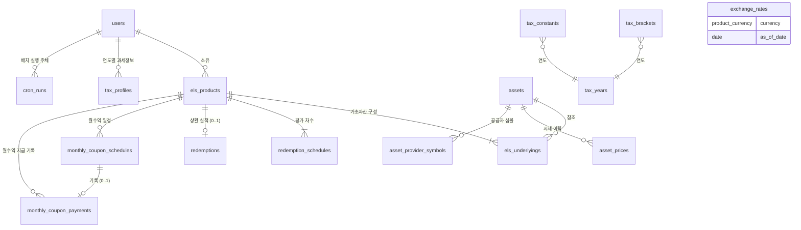

# 데이터 모델

**언제들어오나** — ELS 통합관리 시스템

| 항목 | 내용 |
|---|---|
| 문서 ID | DOC-002 |
| 버전 | 1.14 |
| 작성일 | 2026-07-26 |
| 작성자 | 민서 |
| 선행 문서 | DOC-001 프로젝트 개요서 v0.6 |
| 상태 | 검토 중 |

### 변경 이력

| 버전 | 일자 | 작성자 | 변경 내용 |
|---|---|---|---|
| 0.1 | 2026-07-26 | 민서 | 최초 작성 |
| 1.14 | 2026-10-02 | 민서 | **P8 컷 b1 — 월지급식 ELS(DOC-001 S-14)의 모델을 명세한다. 본 판은 선행 명세다 — 스키마 변경 0, 마이그레이션 0, `src/` 0줄, 테스트 0줄. 문서가 스키마보다 앞서며 구현은 컷 b2(스키마 · 계약, M-b2 · W4) · b3(화면) · b4(세금 · 전망 · 월지급식 선택 개방 · M-b2c, W6) · b5(키움 월지급 불러오기)다.** v1.10이 남긴 월지급식 절반(D-09 · DQ-11 · DQ-14 · I-23~I-27 · 월수익 두 테이블)을 이행한다. **★ 코드가 한 컷 앞섰다(P8 컷 b0, `d675efb`).** 소득 사건 모델이 이 문서보다 먼저 코드에 섰다 — `incomeEventsOf(row, asOf, rates, only?)` · `contributionOf`가 사건을 접는다(사건 ≤1을 별칭 없는 튜플로 단언) · `forecastItemOf` → `forecastItemsOf`(사건마다 항목 하나, 원금을 돌려주는 사건이 없으면 원금 항목 하나) · `excludedForeignCountOf`(상품 단위) · `withholdingFor(ctx, {date, taxableIncome, withholdingTax?}, dateField)` + `withholdingInputOf`(`WithholdingDateField = 'redemptionDate'`). **동작 불변**(HEAD 대 작업 트리 차분 0). D-09 본문에 적었다. **(1) D-09 신설 — 월수익은 상환과 별개의 사건 엔티티다.** §8 I-08 각주의 「상품당 상환 1건에 과세소득 1개」가 「상환 1건 + 월수익 지급 기록 0..K건」이 된다. **I-01 · I-08 · D-01은 불변이다** — 월지급식의 상환은 원금만이고(세전 ≤ 원금 · 과세 0, V-29) 수익은 전부 월수익 사건이다. D-08의 세 축을 월수익도 따른다. D-01의 「이중 집계가 스키마 수준에서 불가능하다」는 **상환끼리의 진술**로 한정했다 — 상환과 월수익 사이는 과세 축만 DB가 닫는다(DOC-010 AQ-87). **(2) §4.6 — `coupon_payout`(열거형 `coupon_payout`, 기본값 없음)과 `monthly_coupon_annual_rate`(`DECIMAL(6,4)`), I-23 짝 제약 `els_products_monthly_terms_check`.** 기본값은 W4(b2 expand)에서 `'AT_REDEMPTION'`으로 백필하고 W6(b4 contract, M-b2c)에서 뗀다 — `currency`의 W1/W2와 같은 두 단계이고 `update`의 `coalesce`는 저장값으로 떨어진다. **지급방식의 짝은 `FULL`일 때만 본다** — 기실현 월지급식은 율이 없다(D-07 — 기실현 행의 월수익 연쿠폰율 NULL은 같은 제약이 강제한다, 아래 개정 ②). DQ-11 v1.9의 「`MONTHLY`면 `annual_coupon_rate = 0`」을 그 범위로 한정했다. **(3) §4.13 `monthly_coupon_schedules`(상세 — `CASCADE`) · §4.14 `monthly_coupon_payments`(트랜잭션 — `RESTRICT`).** 같은 월수익인데 삭제 규칙이 반대라 두 테이블이다. 두 테이블 모두 `coupon_no >= 1`을 `CHECK`로 둔다 — b0 반박 검토가 찾은 부류(`redemption_schedules.round_no ≤ 0`, DOC-010 AQ-92)를 새 테이블에서 되풀이하지 않는 싼 방어다. 기록은 형태 `CHECK` `monthly_coupon_payments_outcome_check`(**미지급은 순번이 있어야 한다** — 순번 없는 미지급은 두 `UNIQUE`가 모두 무력하다) · `UNIQUE` 둘 · 복합 FK `MATCH SIMPLE` · 자릿수 두 층(`monthly_coupon_payments_gross_amount_digits_check` + 라벨 `monthly_coupon_payments_gross_amount_scale` — `UNPAID`의 NULL 금액은 통과) · 값 범위(과세 · 원천징수 ≥ 0, 적용 환율 > 0) · 부모 트리거 셋. **추정 사건은 저장하지 않는다**(DQ-02 「관측하지 않은 관측」). **(4) DQ-07 ②③⑤의 수단 — 셋 다 트리거.** ② 양방향(`monthly_coupon_payments_after_redemption` · `redemptions_before_coupon_payment`) · ③ `monthly_coupon_payments_monthly_required` · ⑤ `redemptions_monthly_principal_only`(DOC-010 AQ-87 ⓑ — DB 쪽 강제로 정했다). 기준은 v1.10과 같다 — 계산에 들어가는 값은 DB가 지킨다. 데이터 전용 복원이 재검증하지 않는 범위가 넓어진다(AQ-80). **(5) 기록 뒤 동결을 DB 트리거로도 강제한다 — 민서 결정(2026-10-02) ④(DOC-010 AQ-79).** `els_products_coupon_recorded_immutable`(`BEFORE UPDATE OF currency, coupon_payout`) · `monthly_coupon_schedules_recorded_immutable`(`BEFORE UPDATE OF evaluation_date, payment_date, coupon_no`), 둘 다 값이 바뀔 때만 → `CONFLICT`. 수정 저장의 월수익 일정은 입력에 없는 순번의 행을 delete하고 입력의 행은 `coupon_no` upsert다(기록된 달을 빼면 계약의 사전 조회가 `CONFLICT`) — §4.6 「상태가 아니다」의 「전체 교체」를 이 예외로 한정했다. 기록의 좌표(`els_id` · `coupon_no`) 재부모화는 동결하지 않는다(`redemptions.els_id`와 같은 수용 — 등재만). **(6) §8 — I-23~I-27 · I-12 · I-21 · I-22 행 확장 · 강제 분류 문단, 접미사 표에 `*_recorded_immutable`(→ `CONFLICT`)과 `*_forbidden` 두 행.** `*_required`의 뜻을 「교차 행의 필수」로 넓혔다 — I-14(`redemptions_round_no_required`) 이후 실제 사용보다 좁았다. `*_immutable`로 일반화하지 않는다. **(7) §8.1 FK 세 행 · 삭제 최대 3단계 각주 · 기록된 달의 일정 고정 각주.** **(8) §3 ERD 세 관계 · 엔티티 13·14행 · 테이블 14 → 16 각주**(b2가 같은 커밋에서 고칠 원장 목록), **§6 파생 여섯 · 저장 셋**, **§7 「월수익 지급 기록은 상태를 바꾸지 않는다」.** **(9) §9 DQ-11 · DQ-14 → 해결(명세 완료), DQ-17 신설** — b1의 명세가 답하지 않은 넷(이름이 정해지지 않은 제약 · `monthly_coupon_payments_after_redemption`의 계약 처리와 접미사 행 · 기실현 율 NULL의 DB 강제 · 상환 `withholding_tax >= 0` 부재)을 지어내지 않고 「b2 전에 정한다」로 등재했다. D-08 「건 단위로 뺀다」에 월지급식이 「건」을 **사건(빠지는 단위)과 상품(세는 단위)**으로 가른다는 각주를 달았다(DOC-007 §7.3). 낡은 문장은 지우지 않고 취소선으로 남겼고(§3 「실제 테이블 수는 13」 — v1.10 이후 낡아 있었다 · 「컷 b1」 예고 일곱 · `*_required`의 종전 뜻) 예고 넷(§4.9 트리거 항목 · §8 I-08 각주 둘 · 명명 규약 각주)에 「→ 이행」을 달았다. **파서에 묶인 다른 문서의 표에는 행을 더하지 않았다** — DOC-011 §3.2.1(제약 이름) · §6(V-25~V-29 · V-08′ · V-20′) · §8(`COUPON_RECORD_WIDE`) · DOC-010 §7(권한)의 행은 **각 구현 컷의 코드 커밋에 함께** 간다. **선행 명세 — 이 판이 앞선 항목:** D-09의 두 테이블(§4.13 · §4.14) · §4.6 `coupon_payout`(W4 기본값 포함) · `monthly_coupon_annual_rate` · I-23~I-27 · 트리거 라벨 여덟과 꼬리 검사 셋 · 명명 규약 `*_recorded_immutable` · `*_forbidden` · §8.1 세 행 · §6 저장 셋 · 테이블 14 → 16 · 정책 40 → 48 = **컷 b2**(M-b2, W4) / 월수익의 표시(상태 · 받은 월수익 · 다음 한 행의 예상) = **컷 b3** / `coupon_payout` 기본값 제거 · 월수익 사건의 세금 · 전망(§6 파생의 추정 과세 · 흐름 끝) = **컷 b4**(M-b2c, W6). **개정 반영 (같은 판 — b1 개정, 2026-10-02).** ① **상환 뒤 지급 금지(DQ-07 ②)의 비교 키를 지급일에서 그 달의 월수익 평가일로 바꿨다**(DOC-007 RD-18 해결). `monthly_coupon_payments_after_redemption`은 그 달 일정의 `evaluation_date > redemption_date`면, `redemptions_before_coupon_payment`는 상환일 < 기록된(`PAID` · `UNPAID`) 달들의 월수익 평가일 최댓값이면 거부한다 — 흐름 끝 `t_k ≤ T_end`와 같은 키다. 지급일로 비교하면 상환 대금이 그 달 월수익보다 먼저 지급되는 상품에서 같은 날 평가된 마지막 월수익을 기록할 수 없다. 순번 없는 기실현 기록은 평가일이 없어 검사 밖이다(등재만). 고친 자리: §4.9 제약 · 각주(계약 쪽 짝 = V-27의 양방향 문언) · §4.13 동결 각주(평가일 동결이 이 키를 지킨다) · §4.14 I-27 항목과 트리거가 읽는 테이블(`monthly_coupon_schedules` 추가) · §6 「월수익 흐름 끝」 · §8 I-27 행 · 각주 · DQ-07 ②(v1.9 문언은 취소선). ② **I-23 보강(DQ-17 ③ 해결).** 같은 `CHECK`에 `REALIZED_ONLY ⇒ monthly_coupon_annual_rate IS NULL`을 더하고 식을 `coalesce(CASE entry_mode …, false)`로 다시 썼다 — **종전 식은 `FULL` ∧ `MONTHLY` ∧ 월수익 연쿠폰율 NULL을 통과시켰다**(`CHECK`는 NULL을 통과로 본다 — 개정을 쓰며 찾은 구멍이다). `annual_coupon_rate`의 기실현 NULL은 종전대로다(I-18 한 방향). ③ **DB 오류의 필드 키는 색인 없는 이름이다**(§8 문단 신설, DQ-17 ②의 필드 키 부분 해결. `after_redemption`의 `ErrorCode` · 필드와 접미사 행은 미결 그대로). ④ 순번 없는 기실현 기록도 상품당 60건 이하(V-27, 계약 계층만 · §4.14 · D-09) · 월수익 연쿠폰율 상한 = V-08의 상한(DB는 `> 0`만 · §4.6 · I-23 각주) · 기록 삭제는 한 문장(DOC-011 §5.15). ⑤ 예정 월수익 금액 = `P × r_m / 12`를 상품 통화 보조단위로 절사한 값(§6) · 받은 월수익과 포트폴리오 손익은 한 월수익을 동시에 담지 않는다(§6) · 엔티티 용어는 「월수익 지급 기록」이다(「월수익 기록」은 SCR-206의 화면 · 동작 이름이라 이 판의 v1.14 문장에서 엔티티를 뜻하던 것을 고쳤다. 앞 판의 문장은 두었다) · D-09에 「소득 사건」. 조회 경로(상품 루트 로더만 임베드)는 이 문서에 적힌 자리가 없어 고칠 것이 없었다 **반박 검토 반영 (같은 판).** 일정 동결 트리거는 값이 바뀔 때만(`IS DISTINCT FROM`) 거부하고 · 수정 저장은 입력에 없는 순번의 행을 지우며 기록된 달을 빼면 계약 사전 조회가 `CONFLICT` · 상환 쪽 트리거도 지급 · 미지급 기록을 모두 본다(대칭 — I-27) · 교차 테이블 트리거의 보장을 「단일 요청 순서에서」로 좁혀 DOC-010 AQ-93을 인용했고 · 「쿠폰 지급」 선택 상자와 수정 초기값은 V-25와 같은 b2 커밋(§4.6 ★) · 「무해」의 근거를 DOC-011 §4.12의 지급방식 조건으로 · §6에 「잔여 월수익」 행과 흐름 끝 축의 전제(DOC-007 RD-20) · V-28 지급일 중복(§4.14) · §3 v1.2 각주의 테이블 수를 지금 14(b2에서 16)로 되돌렸고 · 저장소 밖 결정 ID를 「b1 개정」 · 「민서 결정(2026-10-02) ④」로 정리했다 |
| 1.13 | 2026-10-01 | 민서 | **P8 컷 a3-2 — a3-1 뒤에 낡은 채 남은 본문 셋을 고쳤다(모델 변경 0).** ① §4.12 각주 「같은 좌표에 두 출처가 다투면 먼저 쓴 행이 남는다」 — 수집기는 덮어쓰지 않고(CR-12) 사람은 덮어쓴다(DOC-011 §5.13 UPSERT). 수집기 → 수동 순서에서 종전 문장이 거짓이었다 ② §4.12 권한 — 「기본 권한이 이미 회수되어 있으므로」를 지우고 마이그레이션이 실제로 하는 「세 롤에서 회수 후 부여」로, 트리거 함수의 회수 대상을 네 롤로 ③ §4.6 ★ 「직접 INSERT 여덟 곳」에 과소 계수였다는 각주 — **열일곱**(diff로 다시 셌다. v1.12 이력의 「`functions.test.ts` 넷」은 **셋**이었다 — 이력 행은 고치지 않고 여기 적는다). 셋 다 v1.12 이력에는 적혀 있었고 **본문만** 낡았다 — 이력이 정정을 말해도 본문을 읽는 사람은 이력을 읽지 않는다(반박 검토 지적) |
| 1.12 | 2026-10-01 | 민서 | **P8 컷 a3-1 — §4.12 `exchange_rates`와 M-a2c(상품 통화 contract)가 마이그레이션으로 섰다.** `20261001102445_exchange_rates`(§4.12 그대로 — 열 일곱 · 제약 넷 · 좌표 동결 트리거 `exchange_rates_freeze_coordinates` · RLS · SELECT/INSERT/UPDATE만 · DELETE는 권한도 정책도 없음 · 정책 셋) · `20261001102448_currency_contract`(§4.6 ★ 표의 W2 — `currency` 기본값 제거 · RPC 셋의 `coalesce` 제거. 본문은 W1 파일에서 출발했고 바뀐 줄은 셋이다). **권한은 회수 후 명시 부여로 썼다** — 「기본 권한이 이미 회수되어 있으므로 테이블은 권한 없이 태어난다」(§4.12 문언)는 **로컬의** 사실이고 운영의 테이블 기본 권한은 실측된 적이 없다(DOC-010 AQ-90은 함수만 쟀다). 그래서 기본 권한에 기대지 않고 세 롤에서 먼저 회수한다 — 결과 권한은 문언과 같다. 트리거 함수의 EXECUTE도 `from public, anon, authenticated, service_role`로 회수했다(AQ-90 이후의 규약). **SB-12 — 「직접 INSERT 여덟 곳」은 과소 계수였다.** 실제로 통화 없이 쓰던 자리는 그 여덟(`tests/rls`)에 더해 RPC payload(`tests/rls/functions.test.ts` 넷 · `tests/integration/mutations.test.ts` 셋 · `toInsert` 하나)와 개발 표본(`supabase/dev/02_broken_fixtures.sql` 둘)이었다 — 전부 같은 커밋에서 고쳤다. 「통화 누락 → 23502」 영구 단언은 카탈로그(기본값 부재) · RPC 셋 · 직접 INSERT 다섯이다(`tests/rls/currency.test.ts`). 실측: 로컬 테이블 14 · 정책 40 |
| 1.11 | 2026-09-30 | 민서 | **P8 컷 a2-1 — §4.6·§4.9·I-21의 마이그레이션이 섰다(`20260930040321_product_currency`, W1 expand). 명세는 그대로이고 실측 하나가 트리거의 경계를 정했다.** **★ BEFORE 행 트리거는 `CHECK`보다 먼저 돈다**(실측 — 달러 부모 아래 `10600.505`가 `redemptions_gross_amount_digits_check`가 아니라 트리거 라벨로 보고됐다). 그래서 트리거가 「원화 부모 ⇒ scale 0」을 `scale > 보조단위`로만 쓰면 **전역 한도(소수 2자리 초과)까지 가로채** 복원에서도 재검사되는 `CHECK`의 몫을 먹는다. 트리거는 `scale ≤ 2`인 값에서만 통화 보조단위를 본다 — 두 방어의 책임이 겹치지 않는다(§4.9 각주의 「통화에 따라 갈리는 부분만」이 이제 코드로도 참이다). **실측 증거:** 원화 센트 원금 → `23514 els_products_principal_scale_check` · 원화 부모 센트 실수령액 → `23514 redemptions_gross_amount_scale` · 소수 3자리 → `23514 redemptions_gross_amount_digits_check` · 환율 0 → `23514 redemptions_exchange_rate_check` · `EUR` → `22P02` · 명시적 `NULL` 통화 → `23502 null value in column "currency"`(RPC가 열 목록을 명시하므로 default를 건너뛴다 — W1의 `coalesce`가 필요한 이유의 실측) · 기존 행 `principal::text` = `'100000000'` 불변 |
| 1.10 | 2026-09-30 | 민서 | **P8 컷 a1 — 달러 ELS(DOC-001 S-13)의 모델을 명세한다. 본 판은 선행 명세다 — 스키마 변경 0, 마이그레이션 0, `src/` 0줄. 문서가 스키마보다 앞서며 구현은 컷 a2(W1) · a3(W2)다.** 월지급식 절반(D-09 · DQ-11 · DQ-14 · I-23~I-27 · 월수익 두 테이블)은 컷 b1이다. **(1) D-03 제목을 한정하고 ¶2를 대체한다.** 「환율을 모델링하지 않음」 → **「판정에 환율을 쓰지 않음」** — ¶2가 그 제목의 근거였고 §4.12가 환율을 모델링하므로 종전 제목은 거짓이 된다. ¶1(판정은 비율)은 달러 상품에서도 참이다. ¶2는 지우지 않고 취소선 + 「대체됨 — D-08」(U-04의 형태). **(2) D-08 신설 — 판정은 비율 · 금액은 상품 통화 · 과세 축은 원화(확정 = 거래내역, 추정 = 추정 환율).** 근거는 EM2048 투자설명서 원문 넷(원리금 전액 USD · 센트 미만 절사 · 과세표준은 지급일 매매기준율 환산 원화 · 세금은 원화 징수·외화수익금에서 자동 환전)이며 인용을 대조했다. **확신도를 나눠 적었다** — 과세표준의 통화·환율·기준일은 원문 확인이고 **원금 환차익 비과세는 추론**이다(명시한 1차 출처 미확인 — DOC-007 RD-13). 그것이 틀려도 확정 경로는 영향이 없다(증권사의 원화 값). 차수별 세후 참고값은 **달러 기준 참고**(U8 — 환율을 쓰지 않는다)이고, 세금 화면과 금융소득 합계에는 언제나 원화 과세표준이 들어간다. **(3) M-08 신설 — 금액 열은 두 부류다.** 상품 통화 금액(`principal`·모든 `gross_amount`)은 정밀도 없는 DECIMAL + 이름 있는 자릿수 제약, 과세 축 금액은 원화 `DECIMAL(15,0)` 그대로. **(4) §4.6 — `currency`(열거형 `product_currency`, 기본값 없음)와 `principal`의 정밀도 해제.** `numeric(17,2)`는 배포 중인 구 코드가 `'100000000.00'`을 읽어 V-01이 깨지므로 기각했다. **기본값은 expand(W1)에서만 두고 contract(W2)에서 뗀다** — 조용한 원화 기본값은 달러 상품의 금액을 약 1,400배 틀리게 하고 정수 달러는 어떤 제약에도 걸리지 않는다. W1의 `update_els_product`는 `coalesce(…, 저장값)`이어야 한다(`'KRW'`로 떨어지면 통화를 싣지 않은 수정 한 번이 달러 상품을 원화로 뒤집는다). **(5) §4.9 — `gross_amount`의 정밀도 해제 · 자릿수 트리거 · `exchange_rate`(적용 환율, 참고).** 적용 환율은 `exchange_rates`를 참조하지 않는다 — 뜻이 다르다(증권사가 적용한 값 vs 추정의 원천). **(6) §4.12 `exchange_rates` 신설 — 공용 관측(`asset_prices`와 같은 부류), 좌표 동결, DELETE 없음.** 지우면 추정이 빈칸이 아니라 **직전 행으로 조용히 물러나고**, 그 물러남이 다른 사용자의 세금 추정을 움직인다 — `asset_prices`와 같이 GRANT·정책 두 겹으로 막는다. 원천은 ADR-010이며 표는 게이트 분기와 무관하다. 테이블 13 → 14(a3). **(7) §8 I-21·I-22.** ★ **I-21이 `coalesce(CASE …, -1)`인 이유는 `CHECK`가 NULL을 통과시키기 때문이다** — 열거형에 새 통화가 생기면 `CASE`가 NULL을 내고, `coalesce` 없이는 그 통화의 금액이 자릿수 제한 없이 저장된다(fail-open). 트리거 라벨은 **리터럴**이어야 한다 — `constraint-names.test.ts`가 마이그레이션 텍스트에서 `constraint = '…'`를 찾는다. 정수부 15자리 한계가 typmod에서 이름 있는 제약으로 옮겨가며 `22003`(열 없음)이 필드 오류가 된다. **명명 규약에 두 행** — `*_coordinates_immutable`(`VALIDATION_FAILED`. I-16의 라벨이 이미 있었는데 표에 없었다)과 `*_scale`. **`*_immutable`로 일반화하지 않는다**(b1의 `*_recorded_immutable`은 `CONFLICT`다). **(8) §6 — 파생 셋(추정 환율 · 원화 환산 · 통화별 합계)과 저장 셋(상품 통화 · 환율 · 적용 환율).** 추정 환율을 상품별로 저장하지 않는다. 적용 환율은 계산에 쓰이지 않는데도 저장한다 — RD-13의 TC 승격 대조가 그 값을 읽는다. **(9) §9 DQ-12·DQ-13 → 해결(명세 완료), DQ-07 ①·④의 수단 결정** — ① 자식 금액 자릿수는 트리거, ④ 적용 환율의 통화 제한은 계약 계층만(어떤 계산도 읽지 않는다). 기준은 「틀린 행이 무엇을 망가뜨리는가」다. **파서에 묶인 다른 문서의 표에는 행을 더하지 않았다** — DOC-011 §3.2.1(제약 이름) · §6(V-22~24) · §8(무효화 `EXCHANGE_RATE_WIDE`) · DOC-010 §7(권한)의 행은 **각 구현 컷의 코드 커밋에 함께** 간다. **선행 명세 — 이 판이 앞선 항목:** M-08 · §4.6 `currency`(기본값 포함)·`principal` · §4.9 `gross_amount`·`exchange_rate`·자릿수 트리거 · I-21 · `redemptions_exchange_rate_check` · 명명 규약 `*_scale` · §6 상품 통화·적용 환율·통화별 합계 = **컷 a2**(M-a2, W1) / `currency` 기본값 제거 · §4.12 `exchange_rates` · I-22 · 명명 규약 `*_coordinates_immutable`의 새 사례 · §6 추정 환율·원화 환산·환율 · 테이블 13 → 14 · 정책 37 → 40 = **컷 a3**(M-a3 · M-a2c, W2) / D-08의 불러오기 쪽(상품 통화 채움) = **컷 a4**. **반박 검토 반영:** ⓐ **I-21의 상환 쪽을 둘로 갈랐다** — 통화와 무관한 한계(정수부 15자리 · scale ≤ 2)는 단일 행 `CHECK` `redemptions_gross_amount_digits_check`로 두어 데이터 전용 복원에서도 재검증되고, 트리거 `check_amount_scale_by_currency()`(라벨 `redemptions_gross_amount_scale`)는 통화에 따라 갈리는 부분(원화 부모 ⇒ scale 0 · 모르는 통화 거부)만 본다 — 복원이 놓치는 것이 「원화 부모 아래의 센트」 하나로 좁아진다(§4.9 · §8 I-21 행·각주 · DQ-07 · DQ-12, 구현 컷 a2) ⓑ DB는 달러 소수 2자리 **«이내»**만 보장하고 읽기 형식은 `moneyString`이 출력에서 두 자리로 고정한다 — Q-07의 고정 형식은 저장된 scale과 무관하게 성립한다(§4.6 `principal` 각주) ⓒ 트리거 라벨은 테이블마다 리터럴이다 — 컷 b2는 `TG_TABLE_NAME`으로 조립하지 않고 테이블마다 분기한다(§4.9) ⓓ U8 참고값의 자리를 SCR-301 상품별 카드 ⑬ 하나로 고쳤다 — SCR-202 차수표에는 세후 열이 없고 원천징수는 따로 표시하지 않는다(D-08, DOC-008 v2.15) ⓔ 환율 표시는 «자른다»가 아니라 **반올림**이다(DOC-008 §5 머리 표 — §4.12) ⓕ AQ-88의 카탈로그 단언은 「먼저 선다」가 아니라 **컷 a3의 선행 조건 — 미결**이다(§4.12) ⓖ 컷 a3의 원장 목록에 V-19 길이 대조의 분류(`tests/db/validate.test.ts` `NOT_CONTRACT_INPUT`의 `exchange_rates.provider`)를 더했다(§3 엔티티 목록 각주) |
| 1.9 | 2026-09-30 | 민서 | **P8 컷 0b — 달러 ELS·월지급식 ELS(DOC-001 v1.7 S-13·S-14)가 모델에 만드는 미결을 먼저 등재한다. 스키마 변경 0, `src/` 0줄. 이 판은 등재이고 명세는 컷 a1·b1이 쓴다.** 지금 모델은 두 상품을 **명시적으로 거부**한다 — D-03 ¶2(「투자원금과 수령액은 원화로 확정」)와 §8 I-08 각주(「상품당 상환 1건에 과세소득 1개 … 상환과 별개의 지급 엔티티가 필요」). 그래서 P8은 범위 변경이자 **모델 변경**이고, 결정을 명세보다 먼저 분류해 둔다 — 구현하지 않는 것과 분류하지 않는 것은 다르다. **(1) 결정 넷 — 명세는 뒤 컷.** DQ-11 월지급 표현(판별자 `coupon_payout`, `MONTHLY`면 `annual_coupon_rate = 0` — 분기를 빠뜨린 소비자가 이중 계상이 아니라 쿠폰 누락으로 틀린다) · DQ-12 금액 저장 형식(상품 통화 금액은 정밀도 없는 `numeric` + 이름 있는 scale 제약, 과세 축은 `numeric(15,0)` 원화 그대로. `numeric(17,2)`는 배포 중인 구 코드의 V-01을 깨므로 기각했다. 과세 축이 원화인 근거는 EM2048 투자설명서 원문이다) · DQ-13 `exchange_rates`(공용 관측 데이터로 `asset_prices`와 같은 부류. DOC-010 ADR-010 게이트 결과와 무관하게 표가 같다) · DQ-14 월수익 기록 뒤의 수정·삭제(`els_products_coupon_recorded_immutable` → `CONFLICT`, 삭제는 최대 3단계). **(2) 보류 둘 — v2(DOC-001 §6.3).** DQ-15 환차손익을 포함한 원화 손익(청약 시점 환율이 모델에 없다) · DQ-16 월지급 변형. ★ **KI 중단형을 들이면 `setKiTouched`가 세금 축이 된다** — 무효화 원장의 「KI 터치·`PRICE_WIDE`에 세금이 없다」 전제가 깨지며, 이것이 기본형만 받는 근거의 하나다. **(3) DQ-07에 사례 다섯.** 교차 테이블 정합성을 어느 계층에서 강제하는가는 그대로 미결이고, P8이 부모의 `currency`·`coupon_payout`을 보는 자식 규칙을 더한다. 그중 트리거로 가는 것은 **데이터 전용 복원(`SET session_replication_role = replica`)에서 재검증되지 않는다**(DOC-010 AQ-80). **(4) 예고 둘.** D-03 ¶2는 컷 a1에서 D-08로 대체된다(지우지 않는다 — U-04의 형태). §8 I-08 각주가 예고한 지급 엔티티를 D-09로 둔다(컷 b1). **I-01·I-08·D-01은 불변이다.** **선행 명세**: D-08·M-08·I-21·DQ-12 = 컷 a1(구현 a2) · DQ-13·I-22 = 컷 a1(구현 a3) · D-09·DQ-11·DQ-14·I-23~I-27·§8 접미사 표 `*_recorded_immutable` 행 = 컷 b1(구현 b2) |
| 1.8 | 2026-09-24 | 민서 | **§4.8 평가일 기준의 전진 조건을 적는다 — 「산식을 계산할 수 있는 저장에서만」. 스키마 변경 0.** v1.6이 「폼이 날짜의 기준(발행일·주기)을 나른다」고 적었고 그 기준을 **언제 올리는가**를 적지 않았다. 구현은 매 저장마다 올렸고, 반박 검토가 그 틈으로 가는 경로를 재현했다: 수정 화면에서 발행일을 비우고 저장(계약이 거부) → 발행일을 새로 적고 저장 → 기준이 `'|6'`(해석 불가)이므로 현재 산식과 대조하여 **산식대로이던 날짜를 실제 날짜로 오판** → 보류 → 재제출하면 **옛 발행일 기준 날짜가 저장된다.** 형식은 정상이고 값만 거짓이다 — v1.6 (4)가 막으려던 바로 그 부류다. 기준은 **그 제출이 산식으로 칸을 재생성하거나 대조할 수 있었을 때만** 올라간다 |
| 1.7 | 2026-09-24 | 민서 | **§9 DQ-09·DQ-10 신설, DQ-08 보충 — 키움 상품 조건 불러오기(DOC-001 S-12)가 드러낸 모델의 틈 셋. 스키마 변경 0.** 셋 다 **불러오기 전부터 있던 틈**이다 — 수동 입력도 같은 값을 같은 칸에 넣었다. 불러오기는 약관 원문을 옆에 놓아 그 틈을 보이게 했을 뿐이다. **(1) DQ-09 경로 의존 리자드** — 키움 약관은 「k차까지 한 번이라도 L% 미만으로 떨어진 적이 없으면」이고 DOC-007 §3.3은 k차 평가일 하루를 본다. 불러오기의 `lizard_requires_no_ki`는 **true**로 정했다(민서, 2026-09-23 — 근거는 행의 포함 관계). 판정 모델은 미결로 남긴다. **(2) DQ-10 만기 사흘 평균** — 마지막 차수는 날짜 하나다. 불러오기는 **마지막 평균일**을 저장한다(민서, 2026-09-23). 판정은 미결. **(3) DQ-08 보충** — 팝업 기준가가 분할 조정값이고, ADR-008이 적은 「es040은 분할 조정」이 NVDA에서 반증됐다. **이 셋을 「구현하지 않음」이 아니라 「분류함」으로 남긴다** — 판정의 틈(RD-07·RD-08)과 입력의 결정(이 문서)을 가른다 |
| 1.6 | 2026-09-24 | 민서 | **§4.8 `evaluation_date`의 입력 경로를 바꾼다 — 생성값에서 «차수별 입력값»으로. 스키마 변경 0, 마이그레이션 0. 본 버전은 선행 명세다.** **(1) ★ v0.9가 적은 「뒤집힐 조건」이 관측됐다.** 그 조건은 「상품별로 규약이 다른 것이 실제로 나오면」이었고, 키움 공개 상품 페이지(`fndElsDetailPopup`, 2026-09-23 실측·재현)에서 두 부류가 나왔다 — **E04000**(발행일 2026-05-29, 6개월)의 실제 평가일 1~5차는 `11-30 · 05-31 · 11-29 · 05-29 · 11-29`인데 산식은 `11-28 · 05-28 · 11-28 · 05-28 · 11-28`이다. **5/5가 다르며** 규약이 「0일 + 휴일이면 다음 영업일」이다(전역 −1일이 아니다). **EM1740**(뉴글로벌, 4개월)은 −1일 규약을 따르되 4차가 토요일(`2027-05-29`)에 걸려 실제는 금요일 `2027-05-28`이다 — 휴장일 조정의 방향도 상품마다 다르다. 즉 **전역 규약 하나로는 이 두 상품을 동시에 맞출 수 없고**, 그것이 v0.9가 「그때 차수별 칸 또는 상품별 필드가 필요해진다」고 적은 자리다. **(2) 차수별 칸을 택했다.** 상품별 필드(offset)는 E04000의 +2일(일요일→월요일)과 EM1740의 −1일(토요일→금요일)을 표현하지 못한다 — 휴장일 조정은 규약이 아니라 **날짜별 사건**이다. 산식은 **빈 칸의 기본값**으로 남는다(수동 입력의 편의이며 운영 11건이 그 산식대로다). **(3) ★★ v0.9가 해소했다고 적은 §5.2 충돌은 되돌아오지 않는다 — 근거가 바뀔 뿐이다.** v0.9의 근거는 「재생성이 멱등」이었고 차수별 칸이 생기면 그 근거는 사라진다. 대신 **폼이 저장값을 싣는다**(`productValuesOf`가 평가일을 담는다) — 수정 저장의 전체 교체가 같은 날짜를 다시 넣으므로 조정한 날짜가 되돌아가지 않는다. **(4) ★ 산식이 움직이는 조건을 좁혔다 — 「그 상품의 날짜가 산식과 일치할 때만」.** 칸이 입력값이 되면 새 함정이 생긴다: 수정 화면에서 발행일을 고치고 바로 저장하면 **옛 발행일 기준의 날짜가 경고 없이 저장된다**(형식은 정상이고 값만 거짓 — DQ-02가 거부한 부류). 그래서 폼이 **그 날짜들이 어떤 기준(발행일·주기)으로 만들어졌는지**를 계약 밖의 히든 값으로 나르고(DOC-008 §5 SCR-204), 날짜가 전부 옛 기준의 산식과 같으면 새 기준으로 재생성하며(오늘의 동작 — 운영 11건이 이 경로다) 실제 날짜가 섞여 있으면 **옮기지 않고 저장을 한 번 보류해 알린다.** 빈 칸도 같은 조건에서만 채운다 — 실제 날짜가 있는 상품의 빈 칸을 전역 산식으로 채우면 한 상품 안에 규약이 섞인다. **(5) 저장한다는 판단(v0.1 각주 (1))이 처음으로 온전히 뒷받침된다** — 「평가일은 영업일 기준으로 조정된다」가 근거였는데 v0.7·v0.9 동안 조정한 날짜를 **넣을 경로**가 없었다. 휴장일 자료에 의한 **자동** 조정은 여전히 없다(DOC-007 RD-03 ⓐ) |
| 1.5 | 2026-08-07 | 민서 | **P5a 컷 5 후속 — §8 I-19 각주의 「지금은 없다」를 정정한다. 스키마 0줄.** 그 각주는 「등식을 단언하는 스위트는 P5a 컷 3에서 선다 — 지금은 없다」로 끝났는데 **컷 3이 이미 착지했다.** `tests/cron/collect.test.ts`가 `reportIsBalanced()`로 등식을 직접 단언하고 한 실행의 일곱 갈래를 값으로 고정한다. **★ 각주의 «절반»이 그 사실을 적어 두는 것이었으므로 그것이 실현된 것도 적어야 한다** — 안 적으면 「부등식만 있고 등식은 아무도 안 본다」가 영구히 참인 것처럼 남는다. 이제 두 층이 함께 지킨다(DB가 부등식을, 순수 모듈이 등식을). **3차 적대적 스윕이 찾았다** — ⓐ′와 무관한 «컷 3 이후 낡은 서술»이며, 스윕의 범위를 「결정 변경의 파급」에서 「현재도 참인가」로 넓히자 이 부류가 드러났다 |
| 1.4 | 2026-08-07 | 민서 | **P5a 컷 5 — §4.11의 「`actor_id`가 근거 ②를 닫는다」를 철회한다(U-03). 스키마 0줄이다.** 운영이 **ⓐ′**(배치가 민서 자신의 계정을 재사용)로 정해졌으므로 `actor_id`가 모든 행에서 같고, 「Cron이 썼는가 버튼이 썼는가」에 답하는 것은 `caller`뿐인데 **그것은 요청이 스스로 주장하는 값**이다(INSERT 정책이 검사하는 것은 `actor_id = auth.uid()` 하나이므로 사람 세션에서 `caller = 'BATCH'` 행을 그대로 쓸 수 있다). **★ 위조 불가성이 사라진 것이 아니라 «가리키는 것»이 바뀌었다** — `actor_id`는 여전히 「누가」를 위조 불가로 말하지만 그 답이 언제나 한 사람이라 **판별하지 못한다.** 「관측 도구가 명제를 판별하는지 먼저 본다」가 그대로 적용되는 자리다. **★★ 그래도 이 테이블은 정당하다 — 근거 셋 중 «둘»이 온전하다**(① 지나간 중간 실패의 사후 진단 · ③ 전면 실패의 관측은 배치의 정체성과 무관하다). 즉 잃은 것은 근거 하나이며 `cron_runs`를 만든 판단이 무효가 되지 않는다. **★★★ 위협 모델이 악의가 아니라 «버그»임을 함께 적었다** — 사용자가 하나인 폐쇄 서비스에서 위조의 주체는 사람이 아니라 **미래의 코드 경로**이고, 오늘의 방어는 `collectAndRecord`가 `caller`를 **기본값 없는 필수 인자**로 두는 것뿐이다. 잔여는 DOC-013 **AQ-69**에 등재했다. **`CHECK`·정책·GRANT는 하나도 바뀌지 않는다** — 바뀐 것은 그 열이 답하는 «질문»이다 |
| 1.3 | 2026-08-05 | 민서 | **P5a 컷 2a — 마이그레이션 둘이 적용됐다. §4.11이 «예정»에서 «실재»가 됐다.** `20260805092917_asset_provider_symbols_writable` · `20260805092918_cron_runs`. `db:types` 재생성 완료. **(1) 원장이 «다섯»이 아니라 «여섯»이었다.** 계획은 `RLS_TABLES`·`catalog.test`·`authz-matrix`·`assets-prices` 반전·신규 `cron-runs.test` 다섯을 셌는데 **`constraint-names.test.ts`의 CHECK 역방향 단언이 함께 빨간불**이 됐다. **★ 그리고 그것을 «만족시키는» 것이 틀린 대응이었다** — `BY_CONSTRAINT`에 넣으면 DOC-011 §3.2.1 표에도 두 행이 생기는데 그 표는 「계약 계층이 사용자에게 **필드 오류로** 보여주는 제약」의 목록이고, `cron_runs`는 배치만 쓰므로 **가리킬 필드가 없다.** 넣으면 그 표가 거짓을 서술한다. 그래서 `NOT_USER_REACHABLE`로 사유와 함께 제외하고 **제외가 조용해지지 않게 두 방향을 더 봤다**(이름이 카탈로그에 실재하는가 · 사상 목록과 겹치지 않는가). **부류: 원장이 옳게 발동했고 옳은 대응은 전제를 좁히는 것이었다.** **(2) `readOnly` 목록에서 `asset_provider_symbols`를 빼고 `cron_runs`는 «넣지 않았다»** — 후자에는 INSERT 정책이 있으므로 「변경 정책이 없는 테이블」이라는 명제가 거짓이 된다. 그 테이블의 「UPDATE·DELETE 없음」은 권한 매트릭스와 `cron-runs.test.ts`가 본다. **(3) `asset_provider_symbols`가 전 DML이 됐고 DELETE를 «부여했다»** — `assets`·`asset_prices`와 비대칭이며 사유는 **매핑이 관측이 아니라는 것**이다(지워도 잃는 것이 없고, 「자동 수집하지 않는다」로 되돌릴 유일한 수단이며 `UNIQUE(asset_id, provider)` 아래에서 UPDATE로는 없앨 수 없다). 그 비대칭이 의도임을 **음성 대조로 같은 파일에서 증명했다** — `assets`·`asset_prices`의 DELETE는 여전히 42501이다. **(4) ★ 종전 케이스를 지우지 않고 «뒤집었다»** — 「인증 사용자는 매핑을 추가·수정·삭제할 수 없다」가 「할 수 있다」가 됐다. 지우면 「그 제약이 있었다」와 「없었다」가 구별되지 않고 **DELETE가 열린 것이 판단이었다는 기록이 사라진다.** **(5) ★★ 내 실수 하나가 계기의 값을 증명했다** — `actor_id` 위조 케이스에 `expectPermissionDenied`를 썼는데 그것이 빨간불이 났다. 두 거부는 **SQLSTATE가 같고(42501) 메시지로만 갈린다**(GRANT 회수 = 「permission denied」 · 정책 `WITH CHECK` 실패 = 「row-level security」). `helpers/expect.ts`가 그 표를 적어 두고 「형태를 틀리면 통과해도 아무것도 증명하지 못한다」고 경고하는데 **정확히 그 경고가 작동했다.** 실측 스위트 **205**(+17) · integration **230** · e2e **149** · 상시 **1068** 전부 초록 |
| 1.2 | 2026-08-05 | 민서 | **P5a 컷 0 — §4.11 `cron_runs` 신설(테이블 12 → 13), I-19·I-20 등재, DQ-08 신설. 문서 선행이며 마이그레이션·`src/` 0줄이다.** **(1) `cron_runs`는 근거가 «셋»이고 서로 독립이다** — ⓐ 지나간 중간 실패의 사후 진단(재호출은 「지금」만 안다) ⓑ 호출자 판별(`asset_prices`에 호출자 열이 없어 Cron·진단 `curl`·SCR-302 버튼이 갈리지 않는다) ⓒ **P5a 착지 후 CR-04 ⓒ의 실행 경로가 0이 된다**(CR-07의 503이 도달 불가가 되고 CR-02가 부분 실패를 200으로 답한다). **ⓒ가 시한을 만들었다** — 수집기보다 늦으면 **잃는 것이 미래의 관측이 아니라 그 구간의 과거**다(DOC-013 §7.1 ★★★). **(2) ★ `actor_id`가 ⓑ를 «사용자» 열로 닫는다.** AQ-57 ⓐ에서 배치가 자기 GoTrue 정체성을 가지므로 정책 `with check (actor_id = auth.uid())`가 귀속을 **위조 불가**로 만든다 — `caller`는 편의 분류이고 **위조 불가한 것은 `actor_id`**다. 두 결정이 서로를 강화하는 자리이며 그것이 AQ-57에서 ⓐ를 고르는 네 번째 논거다. **남는 공백을 적었다**: Cron과 손으로 쏜 진단 `curl`은 여전히 구별되지 않는다(같은 토큰·같은 정체성). `x-vercel-cron`은 **미실측**이라 설계가 아니라 잔여다. **(3) UPDATE·DELETE를 부여하지 않고 정책도 두지 않는다** — 「변경 없음」 두 겹 규약. **고칠 수 있는 관측 기록은 기록이 아니다.** **(4) 분류에 「관측」을 새로 만들었다** — 기존 넷 중 「트랜잭션」이 가장 가깝지만 그것은 사용자의 거래를 뜻하고, 이 행은 **지워도 도메인이 온전하다**(반대로 `asset_prices`는 지울 수 없다). 그 차이가 백업·보존에서 갈리므로 이름을 따로 준다. **(5) ★ I-19를 등식이 아니라 «부등식»으로 썼다.** DOC-011의 불변식은 `target_count = succeeded + skipped + unmapped + failed.length`인데 `failed`가 JSONB라 그 길이를 단일 행 `CHECK`에서 세면 **제약이 JSON 구조에 의존**한다 — 형태가 바뀌면 조용히 뜻을 잃거나 시끄럽게 깨진다. **DB는 바닥만 잡고 등식은 순수 모듈이 지킨다**(I-07과 같은 부류 — 표현 가능한 절반만 DB에 둔다). **(6) `failed`를 14번째 테이블로 만들지 않은 이유**와 **이것이 DQ-04(감사 로그)가 아니라는 것**을 함께 적었다 — 둘을 같게 읽으면 DQ-04가 닫힌 것으로 오해된다. **(7) ★★ DQ-08 신설 — 분할이 `base_price`와 수집 시세의 기준을 갈라 놓는다.** `base_price`는 약관에서 옮겨 적은 고정값이고 조정 경로가 없는데 공급자 계열은 **분할 조정된 값**을 준다(분할 조정은 옳다 — 금지 대상은 **배당** 조정이다). 3:1 분할이면 비율이 **1/3로 읽히고 67% 폭락과 구별되지 않으며 KI는 한 번 터치로 영구히 바뀐다.** **P5a가 만드는 것이 아니라 활성화하는 것**이라는 분류가 핵심이다 — 수동 입력에서도 이미 참이지만 사람은 이상함을 알아챌 표면이 있고 **배치는 매일 조용히 넣는다.** 그리고 이것은 **어떤 `CHECK`도 걸리지 않는다**(값이 유한하고 부호가 맞고 자릿수도 그럴싸하다) |
| 1.1 | 2026-08-01 | 민서 | **P6 컷 6 — §6 파생 값 표에 두 행. 스키마 변경은 «없다».** DOC-007 v1.0 §4.5가 「세후 예상 수령액」·「예상 손익」을 정의한 데 따르는 등재이며, **테이블·컬럼·제약·마이그레이션이 하나도 늘지 않는다**(따라서 `db:types`도 `tests/rls/`도 무변경이다). **M-02의 판단을 기록으로 남기는 것이 이 판의 전부다** — 그 표는 「이 값을 컬럼으로 만들어야 하나」의 기준이고, 새 값 둘에 그 답이 적혀 있지 않으면 다음 사람이 화면을 빠르게 만들려고 컬럼을 더할 근거를 갖는다. ★ **거절의 이유가 다른 파생값들과 다르다**: 대부분은 「유도 가능하므로 저장하지 않는다」인데 이 둘은 **세율을 곱한 결과**이고 세율 자체가 이 표의 아래쪽에서 **연도별 저장값**으로 판정되어 있다. 즉 컬럼으로 굳히면 **두 저장값의 정합을 사람이 지켜야 하고, 세율이 개정되는 날 과거 표시가 조용히 틀린다** — M-05가 세율을 연도별로 저장하기로 한 근거(재현성)가 여기서는 반대 방향으로 작용한다. **`REALIZED_ONLY` 상품이 이 값들을 갖지 않는다는 사실도 §4.6에 적었다** — 일정이 0건이라 `listSchedule`에 행 자체가 생기지 않으며, 그것이 DOC-011 §4.4가 이 값들의 널 규약을 세울 수 있는 근거다 |
| 1.0 | 2026-08-01 | 민서 | **P6 컷 5 — §4.6 `entry_mode` 신설. 「계약 조건을 모르는 기실현 상품」을 모델이 표현한다.** 실보유 ELS 중 **이미 상환이 끝난 것들**을 등재해야 하는데 현재 모델은 그것을 받을 수 없었다 — 증권사 거래내역이 주는 것은 상품명·상환일·실수령액·과표·원천징수세액·투자원금·계좌유형 **일곱**이고, 발행일·연쿠폰율·기초자산·기준가·차수·배리어는 **그 문서에 없다.** **(1) ★ 지어내지 않고 「모른다」를 저장한다.** 없는 값을 채워 넣는 대안(기초자산 1종·차수 1건을 합성)은 DQ-02가 거부한 **「관측하지 않은 관측」**과 같은 부류다 — 형식이 정상이고 값만 거짓이며, 그 거짓이 워스트오브·조건 판정에 그대로 들어간다. 그래서 `issue_date`·`annual_coupon_rate`를 **널 허용**으로 내리고 하위 행 0건을 허용한다. **(2) ★★ 판별 열을 둔 것이 이 결정의 핵심이다 — 「0건」의 뜻이 갈린다.** `entry_mode` 없이 I-07만 상환 존재로 조건화하면 **의도된 0건과 결함인 0건이 구별되지 않는다**: 계약을 우회해 기초자산이 지워진 상품(AQ-14의 잔여 경로)이 상환만 있으면 정상으로 읽히고, `integrityIssue`가 그 상태를 **더 이상 드러내지 못한다.** 절대 규칙 #6이 열거하는 fail-open과 같은 형태이며 **위반자가 0인 동안 보이지 않는다.** 열 하나가 그 둘을 가른다. **(3) 절대 규칙 #4를 어기지 않는다.** `entry_mode`는 **상태가 아니라 입력 완전성의 종류**다 — 상태(보유중·상환완료)는 여전히 `redemptions` 존재로만 유도되며(D-01) 이 열은 그 유도에 참여하지 않는다. 판별하는 것은 「이 상품이 계약 조건을 갖기로 되어 있는가」이고, 그 값은 등재 시점에 정해져 이후 변하지 않는다. **(4) I-14를 `CHECK`에서 트리거로 옮겼다** — 기실현 등재는 차수가 없으므로 조기·리자드 상환에 `round_no`를 실을 수 없다. 면제 조건이 **부모 행의 `entry_mode`**라 단일 행 `CHECK`로 표현할 수 없고(DQ-07과 같은 부류) I-16이 이미 같은 형태의 선례다. **유형을 만기 둘로 한정하는 대안을 택하지 않았다** — 조기상환된 상품이 DB에 `MATURITY_GAIN`으로 남으면 세액은 맞지만 **저장값이 사실과 어긋나고**, 그 거짓은 어느 화면에서도 반증되지 않는다. **(5) 그래서 I-07의 문구가 좁아진다** — 「상품은」이 아니라 「`FULL` 상품은」이다. 넓은 문구를 유지하면 규칙의 진술이 적용 범위보다 넓어지고, 그것이 v0.4에서 I-07을 정정한 것과 정확히 같은 결함이다. **(6) 신설 I-18 — `FULL`은 두 계약 조건 열을 갖는다**(`els_products_full_terms_check`). 널 허용으로 내린 두 열이 `FULL`에서도 비워질 수 있으면 조건 판정의 입력이 조용히 사라진다. **뒤집힐 조건**: 기실현 등재에 계약 조건을 사후 보충하는 경로가 필요해지면 `REALIZED_ONLY → FULL` 전이가 생기고, 그때 I-07·I-18을 함께 만족시키는 순서(하위 행을 먼저 넣고 모드를 올린다)를 정해야 한다 — 지금은 그 전이가 없다(§5 D-07) |
| 0.9 | 2026-07-31 | 민서 | **P6 컷 1 — §4.8 `evaluation_date`의 생성 산식에 −1일 규약을 넣는다. 스키마 변경 0, 마이그레이션 0.** **(1) 산식이 `발행일 + n × 평가주기 − 1일`이 됐다.** 증권사 통지서의 평가일이 산식보다 하루 앞이었고 실보유 **11건 65차수 전부에서 일정하게** −1일이었다 — 즉 휴장일 조정이 아니라 **기산 규약의 차이**다(영업일 조정이면 일부 차수만, 통상 +방향으로 움직인다). **(2) ★ 월말 클램프와 일 이동의 순서를 정본으로 못박았다** — 이 둘은 월말에서 갈린다(`2026-08-31` + 6개월: 클램프 먼저면 `2027-02-27`, 일 이동 먼저면 `2027-02-28`). **월 이동 → 클램프 → 일 이동**을 채택했고 근거가 둘이다: 「n개월 후의 전일」의 자연스러운 읽기이고, **클램프가 먼저인 것이 `addMonths`의 기존 성질을 보존한다**(항상 발행일 기준으로 가산해 클램프 전파를 막는 것 — 일 이동을 먼저 하면 기준 자체가 바뀌어 그 성질이 깨진다). **(3) ★★ v0.7이 예고한 §5.2 충돌이 해소됐다.** v0.7은 「RD-03이 조정 경로를 만들면 전체 교체와 충돌한다(조정한 날짜가 다음 수정 저장에서 되돌아간다)」고 적었다. **규약이 전역이므로 재생성이 «멱등»이다** — 저장된 날짜가 이미 새 산식의 결과이므로 수정 저장이 같은 값을 다시 넣는다. 그래서 **차수별 입력 칸을 만들지 않는다**(만들면 §5.2에 예외를 두어야 하고 그것이 v0.7이 경고한 자리다). 부수로 **운영 11건의 정정이 한 줄이 된다**(`evaluation_date - 1`) — 기존 저장값이 옛 산식의 결과이므로 하루 빼면 새 산식과 일치한다. **뒤집힐 조건을 함께 적었다**: 상품별로 규약이 다른 것이 나오면 차수별 칸 또는 상품별 필드가 필요해지고 그때 §5.2 충돌을 다시 결정한다(DOC-007 RD-03에 등재). **(4) 히든 이송 각주의 전제를 정정했다** — 「발행일을 고친 뒤 ③ 단계를 지나지 않고 저장하는 경로」는 DOC-008 v1.8(단계 철회)에서 **존재할 수 없게 됐다.** 생성값으로 두는 판단은 유지된다 | **P5b 컷 0 — DQ-02 종결. 스키마 변경 0, 코드 0줄.** **결측일은 공백이며 직전값을 복제하지 않는다.** 복제한 행은 **「관측하지 않은 관측」**이 되어 `asset_prices`의 좌표 의미(I-16 — 좌표는 `(asset_id, as_of_date)`, 관측값은 `price`·`source`·`provider`)를 깨뜨린다. **결정적인 것은 그 거짓이 화면 어디에도 드러나지 않는다는 점이다** — `as_of_date`가 오늘이므로 `isStale`(5일)이 발동하지 않는다. 반대로 공백은 읽기 층에 **이미 어휘가 둘 있다**(`isStale` · DOC-007 E-01). 즉 결측을 표현할 수단을 새로 만들 필요가 없고, 만들면 거짓말할 수 있는 표면이 하나 늘어난다. **행을 넣지 않는 것이 결정의 전부이므로 마이그레이션도 없다.** 함께 `failed[].reason`을 「데이터 없음」/「호출 실패」 두 부류로 갈랐다 — 사용자의 조치가 다르며(매핑을 고친다 / 기다린다) **어댑터가 구분해 주지 않으면 만들 수 없으므로** ADR-004 보정의 판별 가능한 `failure` 값이 전제다. 계약 쪽은 DOC-011 §7.1(v2.7) |
| 0.7 | 2026-07-29 | 민서 | **P4.5 — §4.8의 각주가 평가일에 대해 구현과 어긋났다(U-01).** 「생성 시 자동 채우고 **사용자가 수정할 수 있게 한다**」가 두 열(`evaluation_date`·`barrier`)을 함께 적었으나 **평가일에는 화면에 입력 칸이 없다** — SCR-204는 `발행일 + n × 평가주기`로 생성하며 저장마다 재생성한다(`SCHEDULE_SUBS`에 `evaluationDate`가 없고 차수 행에서 평가일은 `<span>`이다). 구현이 문서를 어긴 것이 아니라 **DOC-008 §5가 더 늦게 더 정확하게 정한 것**이며 본 문서의 각주만 낡았다. **정정의 실질은 각주 (1)의 근거가 지금 뒷받침되지 않는다는 것이다** — 「평가일은 영업일 기준으로 조정된다」가 저장의 근거인데 **조정할 수단이 없고**, DOC-007 RD-03의 비고가 「현재는 사용자 수정에 의존」이라 적으면서 그 의존 대상이 실재하지 않았다(DOC-007도 함께 정정했다). 저장 자체는 여전히 옳다(조정된 날짜를 담을 자리가 이미 있다). 부수로 적어 둔 것: DOC-011 §5.2가 전체 교체이므로 RD-03이 조정 경로를 만들면 **그 경로와 전체 교체가 충돌한다**(조정한 날짜가 다음 수정 저장에서 되돌아간다) — RD-03의 결정에 그 항목이 포함된다 **★ 이 버전은 적대적 반증을 지났다** — 5축 반증이 이 커밋의 주장에서 결함을 냈고 전부 정정했다(BLOCKER 2종: 「실측 1,028개」가 계산값 1,027이고 그 주소는 `<option>`을 0개 렌더한다 · 음성 대조 표 두 줄의 건수. WRONG: V-19 인용이 거짓이었다(§6의 V-19는 문자열 길이 규칙이며 `/^\d+$/`는 구현이 ID 재사용 규약으로 빌린 것 — **내가 닫으려던 부류를 내가 만들었다**) · 「추가납부가 양수」가 0이다 · AQ-36의 「여덟 칸 중 여섯」이 다섯이다 · `worstOf`를 담는 뷰가 셋이 아니라 넷이다 · 문서 접두사 없는 § 참조 다섯 · 항진명제 케이스 둘 · 퇴화 픽스처 하나 · DOC-000 버전 표 드리프트 다섯 행). |
| 0.6 | 2026-07-27 | 민서 | P3b 변경 계약 착수에 따른 정정. **본 버전은 선행 명세다 — 마이그레이션은 P3b 5·6단계다.** (1) **§9 DQ-06 부분 해결 + §8 I-17 신설** — 표현 가능한 4개(`principal > 0`·`evaluation_period_months >= 1`·`barrier > 0`·`gross_amount >= 0`)를 `CHECK`로 승격해 I-08과 같은 2층 구조를 만든다. **DQ-06 서술의 오류도 함께 정정한다** — 목록에 있던 `redemption_date >= issue_date`는 `redemptions`와 `els_products`를 함께 봐야 하므로 단일 행 `CHECK`로 표현할 수 없다(DQ-07과 같은 부류였다). 비율 상한은 DOC-011 V-08 세분이 반영된 뒤로 미룬다. (2) **§8에 제약 명명 규약 신설** — `*_redeemed_immutable` 접미사가 계약 계층에서 `23514`를 `CONFLICT`로 올리는 **의미론적 역할**을 갖는다. 규약을 적지 않으면 다음에 추가되는 상태 충돌 제약이 조용히 `VALIDATION_FAILED`로 떨어져, 사용자에게 고칠 입력이 없는 오류를 필드 오류로 보여준다. (3) **§8 I-07의 적용 수단 갱신** — 쓰기 함수(DOC-011 §5.1·§5.2)가 하위 행 수를 검사하므로 계약 경로에 DB 층 방어가 생긴다. 계약 밖 경로는 여전히 예방이 없다(DOC-010 AQ-14 부분 해소) |
| 0.5 | 2026-07-27 | 민서 | P3a 조회 계약 착수에 따른 정정. **본 버전은 선행 명세다 — 마이그레이션은 P3a 2단계에서 적용된다.** (1) **§9 DQ-05 해결(P3a) + §4.6에서 `total_rounds` 삭제** — 조회 계약에서 이 값을 읽는 곳은 DOC-011 §4.3 `product.totalRounds` 한 곳뿐이고 상세 조회는 이미 일정 전체를 로드하므로 `count(redemption_schedules)`로 정확히 유도된다. §4.6이 만기일 정본을 이미 일정 마지막 차수로 정했으므로 **차수의 정본도 같은 곳으로 통일**한다(M-02). 유지하면 "일정 0건인데 `total_rounds = 99`"가 계속 저장 가능하고 그 정합성을 강제하는 층이 어디에도 없다. (2) **§9 DQ-06 개정** — 미결 CHECK 목록의 `total_rounds >= 1` 항목을 제거한다. 컬럼이 사라지므로 조용히 무효화하지 않고 명시적으로 지운다. (3) **§4.6 만기일 각주 정정** — 유도식이 삭제된 컬럼을 참조하고 있었다. (4) **§3.1 최신가 정의는 DOC-007 v0.5가 담당** — `as_of_date <= asOf` 상한이 없으면 미래 일자 시세로 조건을 판정한다(V-17이 계약 계층에만 있어 도달 가능) |
| 0.2 | 2026-07-27 | 민서 | P1 구현 착수에 따른 정정. §4.10 `tax_constants` 키 목록을 예시에서 **확정 목록**으로 승격하고 3개 키 추가(분리과세 소득세율, 직장가입자 보수외소득 기준, 피부양자 소득 기준). DOC-007 §5.2·§6.1이 요구하는 상수가 목록에 없어 구현 시 하드코딩을 강요하는 상태였음. 상세 근거는 DOC-007 v0.2 §2 |
| 0.4 | 2026-07-27 | 민서 | P2 산출물 대조 검증(P2.5)에 따른 정정. (0) **§8 I-07의 적용 범위를 "등록 트랜잭션"에서 "모든 변경 경로"로 확대(철회 기록, U-03)** — I-07은 상태 불변식인데 생성 시점만 규율하고 있었고, 실제로 소유자가 자기 상품의 마지막 기초자산·차수를 삭제해 0건 상태에 도달할 수 있었다. 그 상태에서 DOC-007 §3.1 워스트오브가 빈 집합의 `min()`이 된다. (1) **§8 I-09의 문구 정정** — "소유자 변경은 상품 단위로만"이 상품 단위 소유권 이전은 가능한 것처럼 읽혔으나, `els_products` UPDATE 정책의 `with check`가 그것까지 차단하므로 실제 상태는 "소유자 변경 경로 없음"이다. (2) **§8 I-11·I-15 신설 + §4.6 제약 신설** — `ki_barrier`·`ki_observation`·`ki_touched_at`이 독립적으로 nullable이라 I-10과 같은 짝 결함이 있었다. 특히 `ki_barrier IS NULL`인데 `ki_touched_at`이 있는 행은 §3.4·E-06에 따라 판정이 터치 이력을 아예 보지 않으므로, 리자드의 KI 미터치 요구가 충족으로 판정되어 **수령액이 틀린다.** (3) **§8 I-12 신설 + §4.9 제약 추가** — I-08이 `MATURITY_LOSS`만 덮어 `MATURITY_GAIN`에 음수 과세소득을 넣는 경로가 열려 있었고, 그 값이 DOC-007 §7.3 합계를 오염시킨다. 절대 규칙 #8의 "음수가 될 수 없다"는 유형 무관 진술이다. (4) **§8 I-13·I-14 신설 + §8.1 FK 행 추가** — `redemptions.round_no`가 아무것도 참조하지 않아 실재하지 않는 차수가 저장되고, `EARLY`인데 `NULL`인 행도 저장됐다. §7.2 귀속연도가 그 차수의 평가일에 의존한다. (5) **§8 I-16 신설 + §4.5 제약 신설** — `asset_prices` UPDATE가 좌표(`asset_id`·`as_of_date`) 변경을 허용해 타인 상품의 워스트오브를 조용히 바꿀 수 있었다. (6) **§9 DQ-05~DQ-07 신설** |
| 0.3 | 2026-07-27 | 민서 | P2 스키마 착수에 따른 정정. (0) **§8 I-08의 적용 수단을 애플리케이션 레벨 검증에서 `CHECK` + 애플리케이션 검증으로 변경(철회 기록, U-03)** — 절대 규칙 #8에 해당하는 단일 행 불변식을 규율에만 맡기고 있었음. §4.9에 제약 추가. (1) **§4.8에 리자드 쿠폰율 CHECK 추가, §8에 I-10 등재** — `lizard_barrier`와 `lizard_coupon_rate`가 독립적으로 nullable이라 배리어만 있고 쿠폰율이 없는 행이 저장 가능했고, 그 차수의 워스트오브가 리자드 배리어를 넘는 순간 `applicableCouponRate`(DOC-007 §4.1)가 런타임에 거부한다. DOC-011 V-06이 이미 계약 계층에 규정한 규칙이나 DB가 그 데이터를 허용하는 상태였음. (2) **§5에 D-06(Supabase Auth 연계) 신설** — `users`와 Supabase `auth.users`의 관계가 어느 문서에도 없어 구현이 임의 결정을 강요받는 상태였음. (3) **§8에 FK `ON DELETE` 정책표 신설** — 삭제 전파 규칙이 정의되지 않았음. (4) **§9 DQ-01 해결(P2)** — 하드 삭제 + CASCADE. 단 상환 완료 상품은 삭제 불가 |

---

## 1. 목적 및 범위

본 문서는 시스템의 논리 데이터 모델을 정의한다. 엔티티, 속성, 관계, 무결성 규칙, 그리고 각 설계 결정의 근거를 다룬다.

물리 스키마 수준의 상세(인덱스 전략, 제약조건 명명 규칙, 기본값, 파티셔닝)는 **DOC-006 데이터 사전**에서 확장한다. DBMS 선정은 **ADR**에서 다루며, 본 문서는 관계형 DBMS를 전제하되 특정 제품에 의존하지 않는 수준으로 기술한다.

---

## 2. 모델링 원칙

| ID | 원칙 | 근거 |
|---|---|---|
| M-01 | 상품 구조의 가변 요소는 **컬럼이 아닌 행**으로 표현한다 | P-01. 기초자산 수·차수를 컬럼으로 고정하면 구조가 다른 상품을 수용할 수 없음 |
| M-02 | 계산으로 유도 가능한 값은 저장하지 않는다. 단, **유도 불가능하거나 외부에서 확정된 값은 저장한다** | 중복 저장은 정합성 위험. 6장에서 항목별로 판정 |
| M-03 | 금액·비율은 **고정소수점(DECIMAL)** 을 사용하며 부동소수점을 금지한다 | 금융 계산에서 부동소수점 오차는 누적되어 검증 실패를 유발 |
| M-04 | 비율은 **소수 형태로 정규화**하여 저장한다 (90% → `0.9000`) | 입력 단위 혼용은 계산 오류의 주원인. 정규화는 입력 계층에서 수행 |
| M-05 | 세율·요율 등 **법령 기반 상수는 연도별 데이터로 관리**한다 | A-02. 코드 하드코딩 시 연도 변경마다 배포 필요 |
| M-06 | 상태는 **독립 컬럼이 아니라 관련 레코드의 존재로 유도**한다 | P-05. 상태와 실제 데이터가 어긋날 여지를 제거 |
| M-07 | 외부 서비스 종속 정보는 **핵심 엔티티에서 분리**한다 | R-02. 시세 공급자 교체 시 도메인 스키마가 영향받지 않도록 |
| M-08 | **금액 열은 두 부류다** *(v1.10 — 선행 명세, 구현 P8 컷 a2)*. ⓐ **상품 통화 금액**(`els_products.principal`, 모든 `gross_amount`)은 **정밀도 없는 DECIMAL + 이름 있는 자릿수 제약**이다 — 소수 자릿수는 상품 통화의 보조단위 이내(`KRW` 0 · `USD` 2), 정수부는 15자리 이내(I-21). ⓑ **과세 축 금액**(`taxable_income`, `withholding_tax`, `tax_profiles`·`tax_brackets`의 금액)은 **상품 통화와 무관하게 언제나 원화 `DECIMAL(15,0)`**이다. *(v1.14 명세 · 구현 P8 컷 b2 — 월수익 지급 기록(§4.14)도 같다: `gross_amount`는 ⓐ, `taxable_income`·`withholding_tax`는 ⓑ, `exchange_rate`(적용 환율)는 아래 「원칙 밖」이다. 새 비율 열 `monthly_coupon_annual_rate`·`coupon_barrier`는 M-04의 `DECIMAL(6,4)`다)* | M-03의 귀결이다 — 고정소수점만으로는 부족하고 **자릿수가 통화를 따라야** 한다. typmod는 열마다 scale 하나를 고정하므로 행마다 다른 상품 통화를 표현하지 못한다(`numeric(15,0)`은 `10000.50`을 **오류 없이** `10001`로 저장한다). 과세 축이 원화인 근거는 투자설명서 원문이다(D-08). **환율은 이 원칙 밖이다** — 금액도 비율(M-04)도 아니고 1단위 외화당 원이며, 시세와 같은 `DECIMAL(18,6)`로 둔다(§4.12) |

---

## 3. 개념 모델 (ERD)


```mermaid
erDiagram
    users ||--o{ els_products : "소유"
    users ||--o{ tax_profiles : "연도별 과세정보"
    users ||--o{ cron_runs : "배치 실행 주체"
    els_products ||--|{ els_underlyings : "기초자산 구성"
    els_products ||--|{ redemption_schedules : "평가 차수"
    els_products ||--o| redemptions : "상환 실적 (0..1)"
    %% v1.14 명세 · 구현 P8 컷 b2 — 월지급식(D-09). 일정 ↔ 기록은 FULL 상품에서만 이어진다(REALIZED_ONLY의 기록은 순번이 NULL)
    els_products ||--o{ monthly_coupon_schedules : "월수익 일정"
    els_products ||--o{ monthly_coupon_payments : "월수익 지급 기록"
    monthly_coupon_schedules ||--o| monthly_coupon_payments : "기록 (0..1)"
    assets ||--o{ els_underlyings : "참조"
    assets ||--o{ asset_prices : "시세 이력"
    assets ||--o{ asset_provider_symbols : "공급자 심볼"
    tax_brackets }o--|| tax_years : "연도"
    tax_constants }o--|| tax_years : "연도"
    %% v1.10 명세 · 구현 P8 컷 a3 — 관계 없음(공용 관측, 소유자·FK 없음)
    exchange_rates {
        product_currency currency
        date as_of_date
    }
```

### 엔티티 목록

| # | 엔티티 | 역할 | 분류 |
|---|---|---|---|
| 1 | `users` | 사용자. 소유·과세 단위 | 마스터 |
| 2 | `tax_profiles` | 사용자의 연도별 과세 기초정보 | 마스터 |
| 3 | `assets` | 기초자산 (종목·지수) | 마스터 |
| 4 | `asset_provider_symbols` | 시세 공급자별 심볼 매핑 | 연결 |
| 5 | `asset_prices` | 기초자산 시세 이력 | 트랜잭션 |
| 6 | `els_products` | ELS 상품 | 마스터 |
| 7 | `els_underlyings` | 상품–기초자산 연결 + 기준가 | 연결 |
| 8 | `redemption_schedules` | 차수별 평가일·배리어·리자드 조건 | 상세 |
| 9 | `redemptions` | 상환 실적 | 트랜잭션 |
| 10 | `tax_years` / `tax_brackets` / `tax_constants` | 연도별 세율·요율 설정 | 참조 |
| 11 | `cron_runs` | 시세 배치 실행 기록 (v1.2 신설) | 관측 |
| 12 | `exchange_rates` | 원/달러 기준환율의 일자별 값 — 추정 환율의 원천 *(v1.10 명세 · 구현 P8 컷 a3)* | 트랜잭션 |
| 13 | `monthly_coupon_schedules` | 월수익 일정 — 월수익 순번마다의 월수익 평가일·월수익 지급일·월수익 배리어 *(v1.14 명세 · 구현 P8 컷 b2)* | 상세 |
| 14 | `monthly_coupon_payments` | 월수익 지급 기록 — 한 달의 지급·미지급 *(v1.14 명세 · 구현 P8 컷 b2)* | 트랜잭션 |

> **★ 테이블이 12 → 13이 됐다 *(v1.2, P5a 컷 0)*.** ~~위 표는 행이 11개지만 10행이 세 테이블을
> 묶으므로 실제 테이블 수는 **13**이다.~~ → v1.14: 지금 실제 테이블 수는 **14**다 — 1~12행이 서 있고 10행이 세
> 테이블을 묶는다. 13·14행은 컷 b2의 마이그레이션(M-b2)이 만들고 그때 **16**이 된다(아래 v1.14 각주 — 16은 b2의 코드
> 커밋이 `RLS_TABLES`와 함께 고친다) *(v1.14 — 종전 문장은 v1.10 이후 낡아 있었다)*. 이 수가 `tests/rls/helpers/fixtures.ts`의 `RLS_TABLES`와
> `tests/rls/catalog.test.ts`의 양방향 로스터 단언에 **값으로** 박혀 있으므로, 여기서 하나가
> 늘면 그쪽도 같은 커밋에서 늘어야 한다(늘리지 않으면 카탈로그 대조가 빨간불이 되고,
> 그것이 이 원장이 작동하는 방식이다).
>
> **분류를 「관측」으로 새로 만든 이유** — 이 테이블은 도메인 사실이 아니라 **시스템이 자기
> 실행에 대해 남기는 기록**이다. 기존 넷(마스터·연결·트랜잭션·상세·참조)에 넣으면
> 「트랜잭션」이 가장 가깝지만 그것은 사용자의 거래를 뜻하고, 이 행은 **지워도 도메인이
> 온전하다**(반대로 `asset_prices`는 지울 수 없다). 그 차이가 백업·보존 정책에서 갈리므로
> 이름을 따로 준다.

> **★ 테이블이 13 → 14가 된다 *(v1.10 명세 · 구현 P8 컷 a3)*.** 12행 `exchange_rates`다(§4.12).
> ~~이 판에서는 수가 바뀌지 않는다~~ → **v1.12에서 섰다**(`20261001102445_exchange_rates` — 로컬 실측
> 테이블 14 · 정책 40. 운영은 W2의 `db push` 뒤). 아래 원장은 전부 그 코드 커밋에서 고쳤다. a3의 같은 커밋이 따라 고칠 원장은 위 v1.2 각주의 둘(`RLS_TABLES` · 카탈로그
> 로스터 「13개」)에 더해 `TABLE_PRIVILEGES`와 DOC-010 §7 권한 표 · types-drift 사양 · numeric
> 정밀도 원장(`exchange_rates.rate`) · 제약 이름 원장(`BY_CONSTRAINT`·`RAISE_ONLY`·`NOT_USER_REACHABLE`) ·
> V-19 길이 대조의 분류(`tests/db/validate.test.ts`의 `NOT_CONTRACT_INPUT`에 `exchange_rates.provider` —
> `VARCHAR(30)`이지만 수집기만 쓰고 수동 입력 계약은 NULL을 박으므로 계약 입력이 아니다. `asset_prices.provider`와
> 같은 사유다)과 DOC-011 §3.2.1이다. **표 행은 컷 a3의 코드 커밋에 함께** 간다 — 파서에 묶인 표에 테이블보다
> 먼저 행을 두면 대조가 빨간불이 된다. 분류는 「트랜잭션」이다 — `asset_prices`와 같은 이유로
> **지울 수 없는** 관측이며(§4.12), 지워도 도메인이 온전한 「관측」(`cron_runs`)과 다르다.
> ~~*(월지급식의 두 테이블은 컷 b1이 명세하고 b2가 만든다 — 14 → 16.)*~~ → 명세했다 — 아래 각주 *(v1.14)*.

> **★ 테이블이 14 → 16이 된다 *(v1.14 명세 · 구현 P8 컷 b2)*.** 13행 `monthly_coupon_schedules`(§4.13)와
> 14행 `monthly_coupon_payments`(§4.14)다 — 월수익을 상환과 별개의 사건으로 두는 결정(§5 D-09)의 그릇이다.
> **이 판에서는 수가 바뀌지 않는다** — 테이블은 b2의 마이그레이션(M-b2, W4)이 만들고, 그때까지 로컬·운영의 실제
> 수는 14 · 정책 40이다. 정책은 **40 → 48**이 된다(새 테이블마다 넷 — §4.13 · §4.14 권한).
> b2의 같은 커밋이 따라 고칠 원장: `RLS_TABLES`(`tests/rls/helpers/fixtures.ts`) · 카탈로그 로스터
> (`tests/rls/catalog.test.ts`의 「DOC-002 §3의 14개 엔티티가 모두 존재한다」 → 16) · `TABLE_PRIVILEGES`와 DOC-010 §7
> 권한 표 · types-drift 사양 · numeric 정밀도 원장(`tests/rls/numeric-typmod.test.ts` — `monthly_coupon_payments.gross_amount`
> `{ precision: null, scale: null }` · `taxable_income`·`withholding_tax` `{ 15, 0 }` · `exchange_rate` `{ 18, 6 }` ·
> `coupon_barrier`·`monthly_coupon_annual_rate` `{ 6, 4 }`) · 제약 이름 원장(`BY_CONSTRAINT`·`RAISE_ONLY`·`NOT_USER_REACHABLE`)과
> DOC-011 §3.2.1 · 쓰기 경계의 `CountingColumn`(`coupon_no`) · 통합 스위트의 `resetFixtures` 삭제 순서
> (`monthly_coupon_payments.els_id`가 `RESTRICT`이므로 `redemptions`처럼 기록을 상품보다 먼저 지운다 — §8.1). **표 행은 컷 b2의
> 코드 커밋에 함께** 간다 — 파서에 묶인 표에 테이블보다 먼저 행을 두면 대조가 빨간불이 된다.
>
> **분류가 둘로 갈린다 — 같은 월수익인데 지우는 규칙이 반대다.** 일정은 **계약 조건**이다 — `redemption_schedules`와
> 같은 「상세」이고 상품이 지워지면 함께 사라진다(`CASCADE`). 기록은 **실현된 과세 이력**이다 — `redemptions`와 같은
> 「트랜잭션」이고 지우는 경로가 좁다(`RESTRICT` — DQ-01 · §8.1). 그래서 두 테이블을 하나로 합치지 않는다 — 한 행이
> 두 삭제 규칙을 함께 가질 수 없다.

---

## 4. 엔티티 정의

### 4.1 `users` — 사용자

| 속성 | 타입 | Null | 설명 |
|---|---|---|---|
| `id` | UUID | N | PK |
| `email` | VARCHAR(255) | N | 로그인 식별자, UNIQUE |
| `display_name` | VARCHAR(50) | N | 화면 표시명 |
| `created_at` | TIMESTAMPTZ | N | |
| `updated_at` | TIMESTAMPTZ | N | |

> 건강보험 가입유형과 금융소득 외 종합소득은 **연도별로 변동**하므로 본 엔티티가 아니라 `tax_profiles`에 둔다.

### 4.2 `tax_profiles` — 연도별 과세 기초정보

| 속성 | 타입 | Null | 설명 |
|---|---|---|---|
| `id` | UUID | N | PK |
| `user_id` | UUID | N | FK → `users` |
| `tax_year` | SMALLINT | N | 귀속 연도 |
| `other_income_base` | DECIMAL(15,0) | N | 금융소득 외 종합소득 과세표준. 기본값 0 |
| `other_financial_income` | DECIMAL(15,0) | N | ELS 외 금융소득(이자·배당). 기본값 0 |
| `health_insurance_type` | ENUM | N | `EMPLOYEE`(직장) / `REGIONAL`(지역) / `DEPENDENT`(피부양자) / `NONE` |

**제약:** `UNIQUE(user_id, tax_year)`

> 종합과세 판정에는 ELS 외 금융소득이 함께 합산되어야 하므로 별도 입력값으로 관리한다.

### 4.3 `assets` — 기초자산

| 속성 | 타입 | Null | 설명 |
|---|---|---|---|
| `id` | UUID | N | PK |
| `name` | VARCHAR(100) | N | 표시명 (예: 테슬라) |
| `asset_type` | ENUM | N | `STOCK` / `INDEX` / `ETF` |
| `market` | VARCHAR(20) | Y | 거래소 코드 (예: NASDAQ, KRX) |
| `currency` | CHAR(3) | N | ISO 4217 (예: USD, KRW) |
| `created_at` | TIMESTAMPTZ | N | |

**제약:** `UNIQUE(name, market)`

> 동일 기초자산이 여러 상품에 중복 포함되는 문제(P-04)는 이 엔티티로 자연 해소된다. 시세는 자산 단위로 1회만 관리된다.

### 4.4 `asset_provider_symbols` — 공급자 심볼 매핑

| 속성 | 타입 | Null | 설명 |
|---|---|---|---|
| `id` | UUID | N | PK |
| `asset_id` | UUID | N | FK → `assets` |
| `provider` | VARCHAR(30) | N | 시세 공급자 식별자 |
| `provider_symbol` | VARCHAR(50) | N | 해당 공급자에서의 심볼 |

**제약:** `UNIQUE(asset_id, provider)`

> M-07의 구현. 공급자를 교체하거나 병행하더라도 `assets`와 도메인 로직은 영향받지 않는다. Q-03(공급자 선정)이 미결인 상태에서도 모델을 확정할 수 있는 근거다.

### 4.5 `asset_prices` — 시세 이력

| 속성 | 타입 | Null | 설명 |
|---|---|---|---|
| `id` | UUID | N | PK |
| `asset_id` | UUID | N | FK → `assets` |
| `as_of_date` | DATE | N | 시세 기준일 |
| `price` | DECIMAL(18,6) | N | 종가 |
| `source` | ENUM | N | `AUTO`(자동 조회) / `MANUAL`(수동 입력) |
| `provider` | VARCHAR(30) | Y | `AUTO`인 경우 공급자 |
| `created_at` | TIMESTAMPTZ | N | |

**제약:** `UNIQUE(asset_id, as_of_date)` — I-05, `BEFORE UPDATE` 트리거로 `asset_id`·`as_of_date` 불변 — I-16

> **관측의 좌표와 관측값을 구분한다.** `(asset_id, as_of_date)`는 "어느 자산의 어느 날 종가인가"를 정하는 **좌표**이고, `price`·`source`·`provider`가 그 좌표에서 관측된 **값**이다. 값의 정정은 열어 두고 좌표의 변경은 막는다 — 좌표를 바꾸는 UPDATE는 정정이 아니라 다른 행을 만드는 조작이다. 상세는 I-16(§8).

> 최신가는 `as_of_date`가 가장 큰 행이다. 이력을 남기는 이유는 (1) 수동 폴백 값과 자동 조회 값의 출처 구분, (2) 조건 판정 시점의 근거 보존, (3) 추이 표시 때문이다.

### 4.6 `els_products` — ELS 상품

| 속성 | 타입 | Null | 설명 |
|---|---|---|---|
| `id` | UUID | N | PK |
| `owner_id` | UUID | N | FK → `users`. 소유·과세 단위 |
| `name` | VARCHAR(200) | N | 상품명 (예: OO증권 ELS 제1234회) |
| `issuer` | VARCHAR(50) | Y | 발행사 |
| `issue_date` | DATE | **Y** | 발행일. **`entry_mode = 'FULL'`이면 필수**(I-18) |
| `principal` | DECIMAL *(정밀도 없음 — v1.10, 종전 `DECIMAL(15,0)`)* | N | 투자원금. **상품 통화** 단위다 — 원화는 원, 달러는 센트까지(M-08). 자릿수는 I-21 *(구현 P8 컷 a2)* |
| `currency` | ENUM `product_currency` | N | **상품 통화** `KRW`(원화) / `USD`(달러). **기본값 없음** — 아래 ★ *(v1.10 명세 · 구현 P8 컷 a2, 기본값 제거는 a3)* |
| `evaluation_period_months` | SMALLINT | N | 평가주기(개월). 기본값 6 |
| `annual_coupon_rate` | DECIMAL(6,4) | **Y** | 연쿠폰율 (소수 정규화). **`FULL`이면 필수**(I-18). **`FULL` ∧ `MONTHLY`면 `0`**(I-23 · DQ-11) *(v1.14 명세 · 구현 P8 컷 b2)* |
| `coupon_payout` | ENUM `coupon_payout` | N | **쿠폰 지급방식** `AT_REDEMPTION`(상환 시 지급) / `MONTHLY`(월지급식). **기본값 없음** — 아래 ★ *(v1.14 명세 · 구현 P8 컷 b2, 기본값 제거는 b4)* |
| `monthly_coupon_annual_rate` | DECIMAL(6,4) | Y | **월수익 연쿠폰율**(연 환산율 — 소수 정규화, M-04). `FULL` ∧ `MONTHLY`면 필수이고 0보다 크다. 그 밖에는 NULL이다 — 기실현(`REALIZED_ONLY`) 행도 DB가 NULL을 강제한다(I-23). 상한은 연쿠폰율과 같은 계약 범위(DOC-011 V-08의 상한)이고 DB는 `> 0`만 본다 *(v1.14 명세 · 구현 P8 컷 b2)* |
| `entry_mode` | ENUM | N | `FULL`(계약 조건을 갖는다) / `REALIZED_ONLY`(기실현 등재). 기본값 `FULL` |
| `ki_barrier` | DECIMAL(6,4) | Y | KI 배리어. **NULL이면 노낙인 상품** |
| `ki_observation` | ENUM | Y | `CONTINUOUS`(장중 터치) / `CLOSING`(종가 기준) |
| `ki_touched_at` | DATE | Y | KI 최초 터치일. NULL이면 미터치 |
| `account_type` | ENUM | N | `GENERAL`(일반) / `TAX_FREE`(ISA·연금·비과세) |
| `note` | TEXT | Y | 비고 |
| `created_at` / `updated_at` | TIMESTAMPTZ | N | |

**제약:** `CHECK((ki_barrier IS NULL) = (ki_observation IS NULL))` — I-11, `CHECK(ki_touched_at IS NULL OR ki_barrier IS NOT NULL)` — I-15, `CHECK(entry_mode <> 'FULL' OR (issue_date IS NOT NULL AND annual_coupon_rate IS NOT NULL))` — I-18, `els_products_principal_scale_check`: `CHECK(scale(principal) <= coalesce(CASE currency WHEN 'KRW' THEN 0 WHEN 'USD' THEN 2 END, -1) AND principal < 1000000000000000)` — I-21 *(v1.10 명세 · 구현 P8 컷 a2)*, `els_products_monthly_terms_check`: `CHECK(coalesce(CASE entry_mode WHEN 'FULL' THEN (coupon_payout = 'MONTHLY' AND annual_coupon_rate = 0 AND monthly_coupon_annual_rate > 0) OR (coupon_payout = 'AT_REDEMPTION' AND monthly_coupon_annual_rate IS NULL) WHEN 'REALIZED_ONLY' THEN monthly_coupon_annual_rate IS NULL END, false))` — I-23(기실현 분기와 `coalesce(…, false)`는 b1 개정 — §8 I-23 각주), `BEFORE UPDATE OF currency, coupon_payout` 트리거(라벨 `els_products_coupon_recorded_immutable`) — DQ-14 *(뒤의 둘은 v1.14 명세 · 구현 P8 컷 b2)*

> **★ 상품 통화 — 상품에 하나, 기본값 없음 *(v1.10 — 선행 명세, D-08)*.**
>
> **상품에 둔다 — 금액 행마다 두지 않는다.** 한 상품의 돈은 한 통화로 오간다(EM2048 투자설명서
> 「투자대금 및 상환 시 원리금이 전액 미국달러(USD)로 지급」). 자식 금액(상환의 `gross_amount`,
> ~~컷 b1의 월수익 금액~~ 월수익 지급 기록의 `gross_amount` — §4.14 *(v1.14)*)은 부모의 `currency`를 따르고 **자기 통화 열을 갖지 않는다** — 행마다 두면 한
> 상품 안에서 원과 달러가 섞일 수 있고, 그 모순을 막는 제약이 다시 필요해진다. 대가는 자식의 자릿수
> 검사 중 **통화에 따라 갈리는 부분**이 부모를 봐야 한다는 것이며 그것이 I-21의 트리거 절반이다(DQ-07 ① ·
> §4.9 — 통화와 무관한 한계는 자식의 단일 행 `CHECK`에 남는다).
>
> **금액의 scale로 통화를 유도할 수 없다.** 달러 원금 $10,000은 `10000`으로도 저장될 수 있고 원화
> 1만 원과 모양이 같다. 그래서 통화는 **저장값**이다(§6) — DOC-001 v1.7 변경 이력 (1) ⓑ가 적은 「달러
> 원금 10,000을 적으면 V-01을 통과해 10,000원으로 저장된다」가 이 열이 없는 모델의 모습이다.
>
> **열거형으로 둔다 — `assets.currency`의 `CHAR(3)`과 다르다.** 기초자산 통화는 표시용 ISO 코드이고
> 판정에 들어가지 않는다(DOC-005 §8.11). 상품 통화는 **자릿수 제약·직렬화·표시 형식의 분기 키**이므로
> 코드가 모르는 값이 **표현 불가**여야 한다. 열거형이면 생성 타입이 `'KRW' | 'USD'`가 되어
> `Record<ProductCurrency, …>`가 값이 늘어나는 날 컴파일되지 않는다(절대 규칙 #6 「열거가 따라온다」).
> 길이 규칙(V-19)의 대상도 아니다 — 값의 소속은 DOC-011 V-22가 본다. 원·달러 밖의 통화는 v2다
> (DOC-001 §6.3) — 열거값을 더하는 것은 I-21의 `CASE`가 fail-closed이므로 **의도된 마이그레이션**이
> 된다(§8 I-21 각주).
>
> **상태가 아니다.** `entry_mode`와 같다 — 절대 규칙 #4의 상태(`redemptions` 존재로 유도)에 참여하지
> 않는 계약 조건이다. 등록 뒤 수정은 DOC-011 §5.2 전체 교체로 가능하다~~(월수익 기록 뒤의 동결은 컷 b1 — DQ-14)~~.
> → **예외 둘 *(v1.14 명세 · 구현 P8 컷 b2)*.** ⓐ **월수익 지급 기록이 하나라도 있으면 `currency`와 `coupon_payout`은
> 바뀌지 않는다** — `BEFORE UPDATE OF currency, coupon_payout` 트리거가 값이 바뀌고 그 상품에 `monthly_coupon_payments`
> 행이 있으면 거부한다(라벨 `els_products_coupon_recorded_immutable` → `CONFLICT`, DQ-14). **DB 트리거라 쓰기 경로와
> 무관하다**(민서 결정(2026-10-02) ④ — DOC-010 AQ-79). 단일 요청 순서에서의 보장이다 — 이 트리거와 첫 기록 INSERT가
> 동시 트랜잭션으로 도는 write skew는 막지 못한다(DOC-010 AQ-93). ⓑ **월수익 일정은 전체 교체가 아니다** —
> `update_els_product`는 **입력에 없는 순번의 행을 delete하고 입력의 행은 `coupon_no` 기준으로 upsert**한다
> *(b1 개정)*. 전체 교체(전부 지우고 다시 넣기)면 기록이 가리키는 일정 행을 지우려다 복합 FK(§8.1)에 걸린다. 입력이 기록된 달을 빠뜨리면 계약이 사전 조회로 `CONFLICT`를 내고(DOC-011
> §5.2), 그 검사를 지난 delete는 복합 FK가 마지막 그물로 막는다(`23503` → `CONFLICT`). 입력에 있는 기록된 달은 날짜 ·
> 순번이 같으면 §4.13의 동결 트리거(값이 바뀔 때만 거부)를 지나고 배리어만 바뀐다. 투자원금 · 월수익 연쿠폰율 · 월수익 배리어는
> 기록이 있어도 고칠 수 있다(기록은 거래내역에서 옮긴 확정값이라 계약 조건을 고쳐도 바뀌지 않는다). `coupon_payout`도
> 이 각주의 「상태가 아니다」에 든다 — 상태 유도(D-01)에 참여하지 않는 계약 조건이다.
>
> **기본값 없음 — expand에서만 두고 contract에서 뗀다.** 두 단계다(DOC-013 §10.2.1 웨이브 절차):
>
> | 웨이브 | 마이그레이션 | `currency` | 쓰기 함수 3종 |
> |---|---|---|---|
> | **W1** (컷 a2, expand) | M-a2 | `NOT NULL DEFAULT 'KRW'`로 추가 — 기존 행이 전부 `KRW`가 된다 | `create`·`create_realized`는 `coalesce(payload->>'currency', 'KRW')`, **`update`는 `coalesce(payload->>'currency', 저장값)`** |
> | **W2** (컷 a3, contract) | M-a2c | `DROP DEFAULT` — 기존 행의 값은 그대로 남는다 | `coalesce`를 뗀다. 키가 없으면 `23502` → `VALIDATION_FAILED` + `currency`(`NOT_NULL_FIELD`) |
>
> - **W1에 기본값이 필요한 이유는 둘이다.** 비어 있지 않은 테이블에 `NOT NULL` 열을 한 문장으로
>   더하려면 기본값이 있어야 하고, `db push`와 코드 병합 사이에 **배포 중인 구 코드**가 통화 없이
>   쓴다. 그 기본값은 구 코드를 위한 것이며 **화면·계약의 기본값이 아니다** — a2의 코드는 처음부터
>   통화를 필수로 받는다(DOC-011 V-22, 빈칸 오류).
> - **`update`의 `coalesce`가 저장값으로 떨어지는 것이 요점이다.** `'KRW'`로 떨어지면 통화를 싣지
>   않은 수정 한 번이 달러 상품을 원화로 **조용히** 뒤집는다.
> - **W2에서 떼는 이유 — 조용한 원화 기본값은 달러 상품의 금액을 약 1,400배 틀리게 한다.** 달러
>   상품을 통화 없이 저장하면 $10,000이 **10,000원**이 되고, 그 값은 원화 자릿수(정수)를 만족하므로
>   **어떤 제약도 걸리지 않는다** — 센트가 있을 때만 I-21이 시끄럽게 거부한다. 합계·과세 추정·표시가
>   그 행을 원화로 읽는다. 형식은 정상이고 값만 거짓인 부류(DQ-02)이며, 기본값을 떼면 그 경로가
>   `23502`로 시끄러워진다.
> - **W2는 W1 코드가 운영에서 하루 이상 돈 뒤에 적용한다**(`buildId`로 확인). 그 뒤로는 코드를 W1
>   이전으로 되돌리면 통화를 보내지 않는 쓰기가 `23502`로 실패한다 — **되돌릴 수 없는 지점**이다
>   (DOC-010 AQ-78).
> - **`tests/rls`의 직접 INSERT 여덟 곳이 기본값에 기댄다**(SB-12) — W2 마이그레이션과 같은 커밋에서
>   `currency`를 명시하도록 고친다 *(v1.13 — 「여덟」은 과소 계수였다. 실제로는 **열일곱**이었고 전부 a3-1에서 고쳤다 —
>   `tests/rls` 직접 INSERT 여덟 · `tests/rls/functions.test.ts`의 RPC payload 셋 · `tests/integration/mutations.test.ts`
>   넷(payload 셋 · `toInsert` 하나) · `supabase/dev/02_broken_fixtures.sql` 둘. 커밋 `e8a5d86`의 diff로 셌다)*. 그리고 「통화 없는 payload → `23502`」를 **영구 단언**으로 둔다.
>   쓰기 함수는 a2 · a3(M-a2c) · b2 · b4(M-b2c)에서 네 번 `create or replace`되며, 뒤의 교체가 `coalesce`가
>   남은 옛 본문에서 출발하면 기본값이 **조용히 되살아난다** — 그 단언이 교체마다 초록이어야 한다.
>   교체마다 `security invoker`와 `set search_path = ''`를 다시 적는다(절대 규칙 #6).

> **★ 쿠폰 지급방식 — 상품에 하나, 기본값 없음 *(v1.14 — 선행 명세, 구현 P8 컷 b2 · 기본값 제거는 b4)*.**
>
> 판별자 `coupon_payout`이 월지급식을 가른다(DQ-11 — `FULL` ∧ `MONTHLY`면 `annual_coupon_rate = 0`이고 수익은 월수익
> 연쿠폰율로 나온다. I-23). `currency`와 같은 두 단계다 — 웨이브만 다르다(W4 = 컷 b2의 expand, W6 = 컷 b4의 contract):
>
> | 웨이브 | 마이그레이션 | `coupon_payout` | 쓰기 함수 3종 |
> |---|---|---|---|
> | **W4** (컷 b2, expand) | M-b2 | `NOT NULL DEFAULT 'AT_REDEMPTION'`로 추가 — 기존 행이 전부 `AT_REDEMPTION`이 된다 | `create`·`create_realized`는 `coalesce(payload->>'coupon_payout', 'AT_REDEMPTION')`, **`update`는 `coalesce(payload->>'coupon_payout', 저장값)`** |
> | **W6** (컷 b4, contract) | M-b2c | `DROP DEFAULT` — 기존 행의 값은 그대로 남는다 | `coalesce`를 뗀다. 키가 없으면 `23502` → `VALIDATION_FAILED` + `couponPayout`(통화의 SB-12 선례) |
>
> - **W4의 기본값은 구 코드를 위한 것이며 계약의 기본값이 아니다** — 계약은 b2부터 `couponPayout`을 **필수 · 기본값
>   없음**으로 받는다(빈칸이면 그 칸 오류 — V-22와 같은 형태, DOC-011 §5.1). 계약은 b2부터 `MONTHLY`를 받지만(통합 테스트 ·
>   개발 표본) **폼은 b4까지 「월지급식」을 고를 수 없다**(SB-13 — P8 계획 결정) — W6의 축소와 폼의 개방이 같은 컷(b4)이다.
> - **그 값을 싣는 폼 칸도 b2에 함께 선다** *(b1 개정)* — SCR-204 · SCR-205의 「쿠폰 지급」 선택 상자(선택지 「선택」 ·
>   「상환 시 지급」 — 「월지급식」은 b4)와 수정 화면의 초기값(DOC-011 §4.3 `product.couponPayout`)은 V-25와 **같은 b2 코드
>   커밋**이다. 통화의 선례다 — a2-3a에서 V-22와 통화 선택 상자가 한 커밋에 섰다. 갈라 세우면 W4(b2)와 W5(b3) 사이에 운영
>   폼의 등록 · 수정 · 기실현 등재가 전부 V-25로 거부된다(필수 · 기본값 없음인데 보낼 칸이 없다). 저장값이 `MONTHLY`인
>   상품(개발 표본 · 통합 픽스처)을 b2~b3 폼이 열면 선택지에 그 값을 더한다(`currencyOptionsOf` 선례) — 그래야 그 상품의
>   수정이 막히지도, 지급방식이 바뀌지도 않는다.
> - **`update`의 `coalesce`가 저장값으로 떨어지는 것은 `currency`와 같은 이유다** — `'AT_REDEMPTION'`으로 떨어지면 지급방식을
>   싣지 않은 수정이 월지급 상품을 상환 시 지급으로 뒤집는 경로가 생긴다.
> - **b2의 `create or replace`가 위 SB-12 항목의 교체 하나다** — `coupon_payout`의 `coalesce`를 더하면서 `currency`의
>   `coalesce`를 되살리지 않는다. 「통화 누락 → `23502`」 단언은 b2 · b4의 교체에서도 초록이어야 한다.

> **`principal`의 정밀도를 뗀다 — `numeric(17,2)`로 넓히지 않는다 *(v1.10 — 선행 명세, 구현 P8 컷 a2)*.**
>
> | 대안 | 기존 행의 `principal::text` | 결과 |
> |---|---|---|
> | `numeric(15,0)` 유지 | `'100000000'` | 센트가 **오류 없이** 반올림된다(`10000.50` → `10001`) — 달러 상품을 담지 못한다 |
> | `numeric(17,2)` | **`'100000000.00'`** | 배포 중인 구 코드가 그 값을 읽어 수정 폼의 V-01(「정수」)이 깨진다 — 기각 |
> | **정밀도 없는 `numeric` + 자릿수 제약** *(채택)* | `'100000000'` — **불변** | 저장된 scale을 그대로 보존하므로 기존 행의 읽기가 바이트 단위로 같다. 테이블 재작성도 없다 |
>
> 읽기 경계(`select.ts`의 `::text`)도 쓰기 경계(`InsertPayload<T>`)도 바뀌지 않는다 — 금액은 여전히
> 문자열로 건너간다(절대 규칙 #2). **DB가 보장하는 것은 «이내»다** — 달러 행은 `10000.5`처럼 보조단위보다
> 짧은 scale로도 저장될 수 있다(정밀도 없는 `numeric`은 값을 정규화하지 않는다). 정규 scale(달러는 소수
> 2자리)은 계약 계층이 **양방향에서** 만든다 — 쓰기는 V-23을 지난 뒤 `moneyString`으로 정규화해 싣고
> (DOC-011 §5.1), 읽기는 `moneyString`이 **출력에서** 자릿수를 고정한다(DOC-011 Q-07). 그래서 계약 밖
> 경로로 `10000.5`가 저장되어도 응답은 `'10000.50'`이다 — Q-07의 고정 두 자리 형식은 저장된 scale과
> 무관하게 성립하고, DB는 «이내»만 지키면 된다. 읽는 쪽은 **scale로 통화를 추론하지 않고** 언제나
> `currency`를 함께 읽는다. 원장 둘이 같은 커밋에서 바뀐다 —
> `tests/rls/numeric-typmod.test.ts`의 두 줄(`{ precision: null, scale: null }`)과
> `tests/db/validate.test.ts`의 「`alter column … type` 없음」 전제(문자열형으로 좁힌다 — DQ-12).

> **`entry_mode`는 상태가 아니라 「무엇을 입력받기로 했는가」다 (v1.0).** 절대 규칙 #4는 `status` 열을 금지하고 D-01이 상태를 `redemptions` 존재로 유도하는데, **이 열은 그 유도에 참여하지 않는다.** 두 축은 직교한다.

> **`REALIZED_ONLY` 상품은 차수 단위 조회에 «행 자체가 생기지 않는다» (v1.1).** 일정이 0건이고 DOC-011 §4.4의 질의 루트가 `redemption_schedules`이기 때문이다. 그래서 그 계약은 차수별 금액(§6의 신설 두 행)에 대해 **널 규약을 세울 수 있다** — `FULL`에는 I-18이 `annual_coupon_rate`를 보장하므로 도달 가능한 조합은 사실상 하나다. 그럼에도 그쪽 타입이 널을 허용하는 것은 **I-18이 「일정이 있으면 쿠폰율이 있다」를 말하지 않기 때문**이다(모드 열에 걸린 제약이지 하위 행에 걸린 제약이 아니다) — 손으로 넣은 일정 행 하나가 그 조합을 만든다. AQ-14·AQ-65와 같은 「계약 밖 경로」의 부류다.
>
> | | `redemptions` 없음 | `redemptions` 있음 |
> |---|---|---|
> | `FULL` | 보유중 — 판정이 돌아간다 | 상환완료 — 계약 조건이 이력으로 남는다 |
> | `REALIZED_ONLY` | **만들 수 없다** — 등재가 상환을 함께 만든다(§5 D-07) | 기실현 등재 |
>
> **왼쪽 아래 칸이 비어 있는 것이 원자성의 근거다.** 상품과 상환을 두 요청으로 만들면 그 칸에 도달할 수 있고, 그 상태는 「계약 조건도 없고 상환도 없는 보유중 상품」 — 판정의 모든 입력이 없는데 결함으로도 표시되지 않는다. 그래서 기실현 등재는 쓰기 함수 하나로 두 행을 함께 만든다(DOC-011 §5.11).
>
> **이 열이 없으면 `integrityIssue`가 눈을 잃는다.** I-07을 「상환이 없는 상품만」으로 조건화하는 대안은 열을 늘리지 않지만 **의도된 0건과 결함인 0건을 같은 모양으로 만든다** — 계약을 우회해 기초자산이 지워진 상품(AQ-14의 잔여 경로)이 상환만 있으면 정상으로 읽힌다. 즉 이 열은 표현력을 위한 것이 아니라 **거짓을 표현 불가로 만들기 위한 것**이다.

> **KI 세 컬럼은 하나의 조건을 나눠 담는다.** `ki_barrier`가 조건의 존재를, `ki_observation`이 관측 방식을, `ki_touched_at`이 관측 결과를 담는다. 세 컬럼이 독립적으로 nullable이면 "조건은 없는데 관측 방식이 있는" 행이나 "조건은 없는데 터치 이력이 있는" 행이 저장된다. 후자가 특히 위험하다 — 상세는 I-15(§8).

**총 평가 차수와 만기일의 정본은 모두 `redemption_schedules`다.**

| 파생값 | 정본 |
|---|---|
| 총 평가 차수 | `count(redemption_schedules)` — **행 수이며 `max(round_no)`가 아니다.** 차수 번호의 연속성(DOC-011 V-04)은 계약 계층에만 있어 DB는 `1, 2, 99`를 허용하므로 두 값이 갈릴 수 있다 |
| 만기일 | `redemption_schedules`의 마지막 차수 평가일 |

만기일은 `issue_date + evaluation_period_months × 차수`로도 유도 가능하나 실제 만기일이 영업일 기준으로 조정될 수 있으므로 일정 행을 정본으로 삼는다.

**기실현 등재는 둘 다 없다** — 일정 행이 0건이므로 총 차수는 0이고 만기일은 정의되지 않는다. 대체 산식을 두지 않는다: `issue_date`가 `NULL`이라 유도식의 입력 자체가 없고, **없는 것을 「0차·만기 미상」으로 표시하는 것이 그 상품에 대한 정확한 답이다**(그 상품은 이미 상환이 끝났으므로 앞으로 도래할 차수가 없다).

> **`total_rounds` 컬럼을 삭제한 이유 (v0.5, DQ-05 해결).** 유도 가능한 값을 저장하면서 일정 행 수와의 정합성을 강제하는 층이 없었다(M-02 위반). 총 차수는 **입력 계층에는 남는다** — DOC-011 §5.1 `ProductInput.totalRounds`가 차수표의 행 수와 **빈 평가일을 채우는 산식**(`generateEvaluationDates`)의 인자이고 V-03이 `schedules.length`와 대조하는 대상이다. 저장되지 않을 뿐이다.
>
> 정합성을 트리거로 강제하는 대안은 택하지 않았다. I-07(기초자산·차수 최소 1건)조차 DB 층 방어가 없는 상태(DOC-010 AQ-14)에서 유도값을 지키기 위해 트리거를 먼저 늘리는 것은 방어의 우선순위가 뒤바뀐다.

### 4.7 `els_underlyings` — 기초자산 구성

| 속성 | 타입 | Null | 설명 |
|---|---|---|---|
| `id` | UUID | N | PK |
| `els_id` | UUID | N | FK → `els_products` |
| `asset_id` | UUID | N | FK → `assets` |
| `base_price` | DECIMAL(18,6) | N | 기준가격 (발행 시점 확정) |
| `sequence` | SMALLINT | N | 표시 순서 |

**제약:** `UNIQUE(els_id, asset_id)`

> M-01의 핵심 적용. 기초자산 1종이든 4종이든 행 수만 달라지며 스키마는 동일하다. P-01 해소.

### 4.8 `redemption_schedules` — 차수별 평가 조건

| 속성 | 타입 | Null | 설명 |
|---|---|---|---|
| `id` | UUID | N | PK |
| `els_id` | UUID | N | FK → `els_products` |
| `round_no` | SMALLINT | N | 차수 (1부터) |
| `evaluation_date` | DATE | N | 평가일. **차수별 입력값이 정본이다**(v1.6) — 빈 칸의 기본값이 산식이다 |
| `barrier` | DECIMAL(6,4) | N | 조기상환 배리어 |
| `lizard_barrier` | DECIMAL(6,4) | Y | 리자드 배리어. NULL이면 해당 차수에 리자드 없음 |
| `lizard_coupon_rate` | DECIMAL(6,4) | Y | 리자드 상환 시 지급 쿠폰율 |
| `lizard_requires_no_ki` | BOOLEAN | Y | 리자드 조건이 KI 미터치를 함께 요구하는지 |

**제약:** `UNIQUE(els_id, round_no)`, `CHECK(lizard_barrier IS NULL OR lizard_barrier <= barrier)`, `CHECK(lizard_barrier IS NULL OR lizard_coupon_rate IS NOT NULL)`

> **두 리자드 컬럼이 짝을 이루어야 하는 이유.** `lizard_barrier`만 있고 `lizard_coupon_rate`가 NULL인 행은 저장 시점에는 무해해 보이지만, 해당 차수의 워스트오브가 리자드 배리어를 넘는 순간 지급액을 산출할 수 없다. **원금만 상환되는 리자드 변형은 `0`으로 표기하며 NULL로 표기하지 않는다**(Q-04). NULL을 0이나 연쿠폰율로 대체하면 수령액이 실제와 어긋나므로(DOC-007 §4.1) 계산 계층은 거부할 수밖에 없고, 그 거부는 화면 렌더링 중에 발생한다. 저장 시점에 막는다.

> **리자드를 별도 테이블이 아닌 차수 속성으로 둔 이유:** 리자드 조건은 본질적으로 특정 평가일에 귀속되며, 한 차수에 두 개 이상 존재할 수 없다. 차수 속성으로 두면 상품 전체로는 0개·1개·N개가 자연스럽게 표현되면서 조인이 늘지 않는다. Q-04(변형 수용 범위)가 미결이어도 `lizard_requires_no_ki` 플래그로 주요 변형이 흡수된다.

> **평가일과 배리어를 저장하는 이유:** 발행일과 평가주기로 유도할 수 있으나 (1) 평가일은 영업일 기준으로 조정되고 (2) 배리어 스케줄이 불규칙한 상품(예: 90-90-85-85-80-75)이 존재하므로, 유도값이 아니라 상품 계약 조건으로 취급한다. **저장한다는 판단은 유지되며 두 열의 사정이 갈린다** — 아래.

> **★ 두 열의 입력 경로가 다시 같아졌다 (v1.6).** 아래 v0.7의 표는 `evaluation_date`를 「화면에 입력 칸이 없다 · 생성값」으로 적었고 그것이 v1.5까지의 사실이었다. v1.6부터 **두 열 모두 차수별 칸이 정본**이다:
>
> | 열 | 입력 경로 | 정본 |
> |---|---|---|
> | `barrier` | 차수별 칸. 「일괄 적용」이 채운다(DOC-008 §5 SQ-04) | 사용자 입력 |
> | `evaluation_date` | 차수별 칸. **빈 칸은 저장 시 산식으로 채우고**, 「산식으로 다시 채우기」가 전 차수를 덮는다. 키움 불러오기(S-12)는 실제 날짜를 채운다 | 사용자·불러온 값 입력 |
>
> **기준은 산식을 계산할 수 있는 저장에서만 올라간다 (v1.8).** 발행일을 비운 저장이 기준을 해석 불가 값으로 올리면 다음 저장이 산식대로이던 날짜를 실제 날짜로 오판한다(변경 이력 v1.8).
>
> 두 열이 **같은 짝의 도구**를 갖는다는 것이 요점이다 — 일괄 입력과 산식은 둘 다 **채우는 도구**이고 정본은 칸이다(SQ-04가 배리어에 대해 내린 판단을 평가일에 그대로 옮긴다). 산식이 움직이는 조건은 변경 이력 v1.6 (4)와 DOC-008 §5 SCR-204가 정한다.
>
> *(아래는 v0.7~v1.5의 기록이다.)*
>
> ~~**두 열의 입력 경로가 다르다 — 「사용자가 수정할 수 있게 한다」는 배리어에만 참이다 (v0.7 정정, P4.5).**~~ v0.6까지 위 각주는 「생성 시 자동 채우고 사용자가 수정할 수 있게 한다」로 두 열을 함께 적었고, **평가일에 대해서는 구현과 어긋난다.**
>
> | 열 | 입력 경로 | 정본 |
> |---|---|---|
> | `barrier` | 차수별 칸이 정본이고 「일괄 적용」이 그 칸을 채운다(DOC-008 §5 SQ-04) | 사용자 입력 |
> | `evaluation_date` | **화면에 입력 칸이 없다.** `발행일 + n × 평가주기 − 1일`로 생성하며 저장마다 재생성한다 *(−1일은 v0.9)* | 생성값 |
>
> **평가일이 생성값인 근거는 DOC-008 §5 SCR-204에 있고 그것이 정본이다** — 화면과 파서가 `lib/domain`의 `generateEvaluationDates` **하나**를 같은 입력에 부른다. 즉 이것은 구현이 문서를 어긴 것이 아니라 **DOC-008이 더 늦게 더 정확하게 정한 것**이며, 본 문서의 각주만 낡았다. *(히든으로 나르지 않는 이유였던 「발행일을 고친 뒤 ③ 단계를 지나지 않고 저장하는 경로」는 DOC-008 v1.8에서 **존재할 수 없게 됐다** — 단계가 없으므로 지나지 않을 단계도 없다. 생성값으로 두는 판단은 유지된다.)*
>
> **−1일 규약을 넣었다 (v0.9).** 증권사 통지서의 평가일이 산식보다 하루 앞이었고, 실보유 ELS **11건 65차수 전부에서 일정하게** −1일이었다. 즉 휴장일 조정이 아니라 **기산 규약의 차이**다(영업일 조정이면 일부 차수만, 통상 +방향으로 움직인다). 상수는 `lib/domain`에 있고 호출부가 **필수 인자로 명시**한다.
>
> **월말 클램프와 일 이동의 순서를 정한다 — 이 둘은 월말에서 갈린다.** `발행일 2026-08-31`, 주기 6개월:
>
> | 순서 | 결과 |
> |---|---|
> | **월 이동 → 클램프 → 일 이동** *(채택)* | `+6개월 → 2027-02-28`(클램프) `→ −1일 → **2027-02-27**` |
> | 일 이동 → 월 이동 | `−1일 → 2026-08-30 → +6개월 → **2027-02-28**` |
>
> 「n개월 후의 전일」의 자연스러운 읽기가 앞쪽이므로 그것으로 한다. **클램프가 먼저인 것이 `addMonths`의 기존 성질을 보존한다** — 그 함수는 항상 발행일을 기준으로 가산해 클램프 전파를 막는데(위 각주), 일 이동을 먼저 하면 기준 자체가 바뀌어 그 성질이 깨진다.
>
> **그래서 위 (1)의 근거가 부분적으로 뒷받침된다 (v0.9 갱신).** 「평가일은 영업일 기준으로 조정된다」가 저장의 근거인데, v0.7 시점에는 조정을 **할 수단이 전혀 없었다.** 이제 **기산 규약의 조정은 산식이 수행하고**(전역 −1일) **휴장일 단위의 조정은 여전히 수단이 없다.** 저장하는 것 자체는 여전히 옳다(조정된 날짜를 담을 자리가 이미 있고, 유도값이면 그 자리가 없다). 남는 것은 DOC-007 RD-03의 잔여 둘이다.
>
> **★ 뒤집힐 조건이 충족됐다 (v1.6).** 아래 v0.9 각주의 마지막 문장이 적은 「상품별로 규약이 다른 것」이 키움 공개 페이지에서 관측됐다(변경 이력 v1.6 (1)의 대조표 — E04000 5/5 불일치, EM1740 4차 휴장일 역방향). 그래서 차수별 칸을 만들었고, **§5.2 전체 교체와의 충돌은 「폼이 저장값을 싣는다」로 닫힌다** — v0.9의 「재생성이 멱등」 근거는 더 이상 쓰이지 않는다(차수별 값은 재생성되지 않으므로 멱등일 필요가 없다).
>
> ~~**DOC-011 §5.2의 전체 교체와 충돌하지 않는다 (v0.9 — v0.7이 예고한 충돌이 해소됐다).**~~ v0.7은 「RD-03이 조정 경로를 만들면 그 경로와 전체 교체가 충돌한다(조정한 날짜가 다음 수정 저장에서 되돌아간다)」고 적었다. **규약이 전역이므로 그 충돌이 발생하지 않는다** — 재생성이 **멱등**이다: 저장된 날짜가 이미 `발행일 + n×주기 − 1일`이므로 수정 저장이 같은 값을 다시 넣는다. 그래서 v0.9는 **차수별 입력 칸을 만들지 않는다**(만들면 §5.2에 예외를 두어야 하고, 그것이 v0.7이 경고한 자리다). **뒤집힐 조건**: 상품별로 규약이 다른 것이 실제로 나오면 그때 차수별 칸 또는 상품별 필드가 필요해지고, 그 시점에 §5.2와의 충돌을 다시 결정해야 한다 — DOC-007 RD-03에 등재했다.

### 4.9 `redemptions` — 상환 실적

| 속성 | 타입 | Null | 설명 |
|---|---|---|---|
| `id` | UUID | N | PK |
| `els_id` | UUID | N | FK → `els_products`. **UNIQUE** |
| `redemption_type` | ENUM | N | `EARLY`(조기상환) / `LIZARD`(리자드상환) / `MATURITY_GAIN`(만기·이익) / `MATURITY_LOSS`(만기·손실) |
| `round_no` | SMALLINT | Y | 상환이 발생한 차수 |
| `redemption_date` | DATE | N | 상환일 |
| `gross_amount` | DECIMAL *(정밀도 없음 — v1.10, 종전 `DECIMAL(15,0)`)* | N | 실수령액(세전). **상품 통화**다 — 부모 상품의 `currency`를 따른다. 자릿수는 I-21 *(구현 P8 컷 a2)* |
| `taxable_income` | DECIMAL(15,0) | N | 과세 금융소득(배당소득). 손실 상환 시 0. **상품 통화와 무관하게 원화**다 — 달러 상품은 거래내역의 원화 값(A-04, M-08 ⓑ). **월지급식 상품의 상환은 언제나 0이다** — 월수익의 과세는 월수익 지급 기록에 실린다(V-29 · D-09 · 아래 각주) *(v1.14 명세 · 구현 P8 컷 b2)* |
| `withholding_tax` | DECIMAL(15,0) | Y | 원천징수세액. 미입력 시 `taxable_income × 분리과세율`로 유도. **언제나 원화**다 |
| `exchange_rate` | DECIMAL(18,6) | Y | **적용 환율** — 거래내역에 적힌 지급일 환율(원/달러). **참고값이며 어떤 계산에도 쓰지 않는다**(DOC-005). 달러 상품에만 적는다(DOC-011 V-24) *(v1.10 명세 · 구현 P8 컷 a2)* |
| `is_confirmed` | BOOLEAN | N | 증권사 확정값 여부. `false`면 시스템 추정값 |
| `note` | TEXT | Y | |

**제약:** `UNIQUE(els_id)` — 상품은 1회만 상환된다(I-01), `CHECK(redemption_type <> 'MATURITY_LOSS' OR taxable_income = 0)` — I-08, `CHECK(taxable_income >= 0)` — I-12, `CHECK(redemption_type NOT IN ('EARLY','LIZARD') OR round_no IS NOT NULL)` — I-14, `FK(els_id, round_no) → redemption_schedules(els_id, round_no)` — I-13, `redemptions_gross_amount_digits_check`: `CHECK(gross_amount < 1000000000000000 AND scale(gross_amount) <= 2)` — I-21(통화와 무관한 한계), `BEFORE INSERT OR UPDATE` 트리거 `check_amount_scale_by_currency()`(라벨 `redemptions_gross_amount_scale`) — I-21(통화에 따라 갈리는 부분), `redemptions_exchange_rate_check`: `CHECK(exchange_rate IS NULL OR exchange_rate > 0)` — I-22 *(뒤의 셋은 v1.10 명세 · 구현 P8 컷 a2)*, `BEFORE INSERT OR UPDATE` 트리거 라벨 `redemptions_before_coupon_payment`(상환일 < 그 상품에서 기록된(`PAID` · `UNPAID`) 달들의 월수익 평가일 최댓값이면 거부 — DQ-07 ②, 비교 키는 평가일 · 기록 쪽과 대칭 — b1 개정) · `redemptions_monthly_principal_only`(부모가 `MONTHLY`면 `gross_amount <= principal ∧ taxable_income = 0` — DQ-07 ⑤ · V-29) — I-27 *(v1.14 명세 · 구현 P8 컷 b2)*

> **`round_no`가 nullable인 이유와 그 범위.** 조기·리자드 상환은 정의상 특정 평가일에 발생하므로 차수가 없을 수 없다(I-14). 만기 상환은 최종 차수에 귀속되나 차수 개념을 쓰지 않고 기록할 수 있으므로 `NULL`을 허용한다. 값이 있으면 그 차수는 해당 상품에 실재해야 한다(I-13).
>
> **셋째 경우가 생겼다 — 기실현 등재 (v1.0).** `REALIZED_ONLY` 상품은 일정 행이 0건이므로 **어떤 `round_no`도 실재하지 않는다**(I-13의 복합 FK가 전부 거부한다). 그래서 그 상품의 상환은 유형이 무엇이든 `round_no IS NULL`이며, **조기·리자드 상환도 그렇다** — I-14가 트리거로 내려가 이 경우를 면제하는 이유다(§8). 잃는 것은 「몇 차에서 상환되었는가」이고, 그것은 애초에 입력에 없다.

> **`taxable_income`을 저장하는 이유:** 증권사가 확정한 과세표준은 시스템이 유도할 수 없는 외부 확정값이다(A-04). 예상 손익(세전수령액 − 원금)과 실제 과세표준은 일치하지 않을 수 있으며, 세금 계산의 정확도는 이 값에 직접 의존한다. M-02의 예외 조항에 해당한다.

> **손실 상환:** `MATURITY_LOSS`인 경우 `gross_amount < principal`이며 `taxable_income = 0`이다. **ELS 손실은 다른 금융소득과 통산되지 않으므로**, 손실액을 과세 금융소득에서 차감해서는 안 된다. 포트폴리오 손익과 과세 금융소득이 분기하는 지점이며, 상세 규칙은 DOC-007 계산 로직 명세에서 정의한다.

> **`gross_amount`와 `principal`은 같은 통화이고 `taxable_income`은 아닐 수 있다 *(v1.10)*.** 앞의 둘은
> 상품 통화이므로 비교(`MATURITY_LOSS`면 `gross_amount < principal` — 위 「손실 상환」)와 차(포트폴리오
> 손익)가 뜻을 갖는다. 과세 금융소득은 원화이므로 달러 상품에서 **`gross_amount − principal`과 직접
> 대조하지 않는다** — 둘의 관계는 지급일 환율을 지나야 성립한다(D-08). 그래서 달러 상품의 상환 입력은
> 과세 금융소득을 세전 − 원금으로 미리 채우지 않는다(DOC-008 SCR-203).

> **월지급식 상품의 상환은 원금만이다 *(v1.14 — 선행 명세, 구현 P8 컷 b2)*.** 월지급식의 조기상환·만기 수익률은
> 0이고(DQ-11) 수익은 전부 월수익 사건이다(D-09). 그래서 그 상환은 `gross_amount <= principal`이고 `taxable_income = 0`이다
> (V-29). **조기상환·만기와 같은 날 나온 그 달 월수익은 이 행에 합치지 않고 월수익 지급 기록에 따로 적는다**(DOC-007
> RD-12 · DOC-010 AQ-87). 계약 계층(V-29)에 더해 **DB도 지킨다** — 상환 쪽 트리거 둘이다(DQ-07 ②⑤ · AQ-87 ⓑ 해결):
>
> - `redemptions_monthly_principal_only` — 부모가 `MONTHLY`면 `gross_amount <= principal ∧ taxable_income = 0`. 과세 축의
>   이중 계상이 DB에서 닫힌다. 금액 축은 「세전 ≤ 원금」까지만 닫힌다 — 손실 만기에 그 달 월수익을 합쳐 적어도 원금
>   이하이면 통과하고 포트폴리오 손익만 부푼다(AQ-87 ⓐ — 수용된 잔여)
> - `redemptions_before_coupon_payment` — 상환 INSERT · UPDATE 시 상환일이 그 상품에서 **기록된(`PAID` · `UNPAID`)
>   달들의 월수익 평가일** 최댓값보다 앞이면 거부한다. `monthly_coupon_payments_after_redemption`(§4.14)의 반대쪽이다 —
>   한쪽만 두면 쓰는 순서에 따라 「상환일 뒤에 평가된 달의 기록」이 들어온다. **두 쪽은 같은 기록 집합을 본다**(b1 개정) —
>   기록 쪽이 결과를 가리지 않으므로 상환 쪽도 지급 · 미지급을 함께 본다. 이 판의 첫 문언(상환 쪽은 `PAID`만)은
>   비대칭이었다 — 상환일을 앞당기는 상환 수정이 흐름 끝 뒤에 `UNPAID`를 남기고, 그 행은 비고만 고쳐도 기록 쪽 트리거에
>   걸려 지우기만 할 수 있었다. **비교 키는 지급일이 아니라 그 달의 월수익 평가일이다**(b1 개정 — 흐름 끝 `t_k ≤ T_end`와 같은 키,
>   DOC-007 RD-18 해결. 이유는 §4.14 I-27 항목). 순번 없는 기실현 기록은 평가일이 없어 최댓값에 들지 않는다(검사 밖 —
>   등재만). 계약 계층의 짝은 새 규칙이 아니라 **V-27의 양방향 문언**이다 — DOC-011 §5.4 · §5.5 · §5.11이 사전 검사로
>   「상환일 ≥ 기록된 달들의 월수익 평가일 최댓값」을 본다(구현 b2). 이 트리거는 그 검증을 지난 뒤의 마지막 그물이다.
>   양방향의 보장은 **단일 요청 순서에서의 것이다** — 기록 INSERT와 상환 INSERT · UPDATE가 동시 트랜잭션으로 돌면 두
>   트리거가 READ COMMITTED에서 서로의 미커밋 행을 보지 못한다(write skew — DOC-010 AQ-93)
>
> 둘 다 `23514`이고 계약 계층에서 `VALIDATION_FAILED`다(필드 `redemptionDate` · `grossAmount`/`taxableIncome`). 부모·형제
> 테이블을 읽는 트리거이므로 **데이터 전용 복원에서 재검증되지 않는다**(DOC-010 AQ-80 — 범위가 넓어진다). 두 트리거가
> 읽는 `els_products`·`monthly_coupon_payments`·`monthly_coupon_schedules`(기록된 달의 평가일)는 SELECT 정책이
> `using (true)`라 invoker로 읽힌다.

> **`gross_amount`의 자릿수는 두 층이 나눠 본다 — 통화와 무관한 한계는 `CHECK`, 부모의 통화가 필요한 부분만 트리거 *(v1.10 — 선행 명세, 구현 P8 컷 a2)*.**
> `principal`은 같은 행에 `currency`가 있어 `CHECK` 하나로 되지만(§4.6) 상환 행에는 통화가 없다(§4.6 ★
> 「상품에 두고 금액 행마다 두지 않는다」). 그래서 규칙을 둘로 가른다 — **부모를 보지 않고 말할 수 있는
> 절반은 단일 행 `CHECK`로 두고**, 통화에 따라 갈리는 절반만 I-14와 같은 형태의 `BEFORE` 트리거다:
>
> - **`CHECK` `redemptions_gross_amount_digits_check`** — `gross_amount < 10^15`(정수부 15자리) **그리고**
>   `scale(gross_amount) <= 2`(보조단위가 가장 긴 통화의 자릿수 — `KRW` 0 · `USD` 2). 같은 행만 보므로
>   **데이터 전용 복원에서도 재검증된다**(트리거는 꺼져도 `CHECK`는 남는다 — DOC-010 AQ-80). 그래서 복원이
>   통과시킬 수 있는 것은 「원화 부모 아래의 센트」 하나로 좁아진다. 접미사가 `*_check`이므로 `23514` →
>   `VALIDATION_FAILED` + `grossAmount`이고, `BY_CONSTRAINT`와 DOC-011 §3.2.1의 행은 컷 a2의 코드 커밋에
>   함께 간다. 보조단위가 2자리를 넘는 통화를 더하는 날 이 상한도 그 마이그레이션에서 고친다(§8 I-21
>   각주 — 의도된 마이그레이션)
> - 함수 `public.check_amount_scale_by_currency()` — `security invoker`(기본값 유지), `set search_path = ''`,
>   `revoke execute … from public`(절대 규칙 #6). 부모 상품 행 하나만 읽는다(`els_products` SELECT 정책이
>   `using (true)`이므로 invoker로 읽힌다)
> - 판정: `scale(gross_amount) <=` 부모 통화의 보조단위(`KRW` 0 · `USD` 2). **트리거가 맡는 것은 통화에 따라
>   갈리는 부분뿐이다** — 실효는 「원화 부모 ⇒ scale 0」 하나이고(달러의 2자리는 위 `CHECK`의 상한과 같다)
>   정수부 한계는 보지 않는다. 부모 통화가 `CASE`에 없는 값이면 **거부한다**(fail-closed — §4.6 `CHECK`의
>   `coalesce(…, -1)`과 같은 뜻)
> - 거부: `errcode = '23514'`, 이름을 두 채널에 싣는다 — `constraint = 'redemptions_gross_amount_scale'` ·
>   `detail     = 'constraint=redemptions_gross_amount_scale'`(§8 명명 규약). **라벨은 테이블마다 리터럴로 쓴다** —
>   `tests/rls/constraint-names.test.ts`가 그 두 문자열을 마이그레이션 텍스트에서 찾으므로 `TG_TABLE_NAME`으로
>   조립하면 대조가 빨간불이다. **컷 b2가 같은 함수를 월수익 지급 기록에 걸 때도 라벨을 조립하지 않고
>   테이블마다 분기해 각 라벨을 리터럴로 낸다**(컷 b1 명세) — 함수 하나를 두 테이블이 공유하는 대가가
>   이 분기다. → **명세했다 *(v1.14)*** — 라벨 `monthly_coupon_payments_gross_amount_scale`, `gross_amount`가 NULL인 행
>   (`UNPAID`)은 통과한다(§4.14)
> - **원화 부모의 자식도 막는다** — 원화 상품 상환에 `1000.5`가 들어오는 것도 거부한다. 종전에는
>   `numeric(15,0)`이 **오류 없이** `1001`로 반올림했다(DOC-010 AQ-16의 금액 쪽 사례). 즉 이 트리거는
>   달러를 위해 서지만 원화의 조용한 반올림도 함께 닫는다
> - **트리거 절반은 데이터 전용 복원에서 돌지 않는다** — 복원이 `SET session_replication_role = replica`로
>   시작해 트리거가 꺼진다(DOC-010 AQ-80). 그래서 복원을 깨지도 않지만 원화 부모 아래의 센트를 재검증하지도
>   않는다. `principal`의 `CHECK`와 위 `redemptions_gross_amount_digits_check`는 복원에서도 적용된다 —
>   통화와 무관한 한계를 트리거에서 떼어 `CHECK`로 둔 이유가 이것이다
>
> **`exchange_rate`는 `exchange_rates`를 참조하지 않는다(FK 없음).** 뜻이 다르다 — 이 값은 증권사가 그
> 지급에 **적용한** 환율(매매기준율일 수도 재정환율일 수도 있다)이고, `exchange_rates`는 **추정 환율의
> 원천**인 기준환율 계열이다(§4.12). 적용 환율을 공용 계열에 넣으면 한 사용자의 거래내역이 다른 사용자의
> 추정을 움직이고, 그 날짜의 기준환율 행이 없을 수도 있다. 반대 방향도 없다 — 공용 계열로 확정값을
> 만들지 않는다(A-04). 저장하는 이유는 §6이다. **달러 상품에만** 적는다는 규칙은 계약 계층(DOC-011
> V-24)이 맡고 DB로 올리지 않는다(DQ-07 ④) — 원화 상품에 적힌 적용 환율은 어떤 계산도 읽지 않으므로
> 거짓이 세액으로 번지지 않는다. `exchange_rate` 열은 numeric 원장(`tests/rls/numeric-typmod.test.ts`)에
> `{ precision: 18, scale: 6 }`으로 들어간다.

### 4.10 세율·요율 설정

#### `tax_years`

| 속성 | 타입 | Null | 설명 |
|---|---|---|---|
| `tax_year` | SMALLINT | N | PK |
| `note` | TEXT | Y | 개정 근거 |

#### `tax_brackets` — 종합소득세 누진세율

| 속성 | 타입 | Null | 설명 |
|---|---|---|---|
| `tax_year` | SMALLINT | N | FK, 복합 PK |
| `lower_bound` | DECIMAL(15,0) | N | 과세표준 하한, 복합 PK |
| `rate` | DECIMAL(6,4) | N | 세율 |
| `progressive_deduction` | DECIMAL(15,0) | N | 누진공제액 |

#### `tax_constants` — 연도별 상수

| 속성 | 타입 | Null | 설명 |
|---|---|---|---|
| `tax_year` | SMALLINT | N | FK, 복합 PK |
| `key` | VARCHAR(50) | N | 상수 키, 복합 PK |
| `value` | DECIMAL(18,6) | N | 값 |

**키 목록** — DOC-007 §2의 주입 상수와 1:1 대응한다. 계산 로직이 요구하는 상수는 전부 여기에 있어야 한다.

| `key` | 표준 용어 | 사용처 |
|---|---|---|
| `separate_taxation_rate` | 분리과세율 | 원천징수액, 추가납부 (DOC-007 §5.5) |
| `separate_taxation_income_tax_rate` | 분리과세 소득세율 | 비교과세 방식①·② (§5.2) |
| `comprehensive_taxation_threshold` | 종합과세 기준금액 | 종합과세 판정, 방식② (§5.2) |
| `local_income_tax_rate` | 지방소득세 부가율 | 지방소득세, 실질 한계율 (§5.3, §5.6) |
| `health_insurance_rate` | 건강보험료율 | 건강보험료 (§6.2) |
| `long_term_care_rate` | 장기요양보험 비율 | 장기요양보험료 (§6.2) |
| `regional_income_threshold` | 지역가입자 금융소득 반영 기준 | 지역가입자 산정 소득 (§6.1) |
| `employee_non_wage_income_threshold` | 직장가입자 보수외소득 기준 | 직장가입자 산정 소득 (§6.1) |
| `dependent_income_threshold` | 피부양자 소득 기준 | 피부양자 산정 소득 (§6.1) |

> **분리과세율과 분리과세 소득세율은 별개 키다.** 전자는 지방세를 포함한 원천징수 총 부담(2026년 15.4%), 후자는 소득세분(14%)이다. 비교과세는 소득세만 산출한 뒤 지방소득세를 별도로 가산하므로 두 값이 모두 필요하다.

> **건보 문턱 3개는 종합과세 기준금액과 별개 키다.** 2026년 기준 직장가입자·피부양자 문턱이 종합과세 기준금액과 같은 2,000만원이나, 근거 법령이 국민건강보험법과 소득세법으로 나뉘어 함께 개정된다는 보장이 없다. 키를 공유하면 한쪽만 개정될 때 조용히 틀린다.

> M-05의 구현. 세법 개정 시 데이터만 추가하면 과거 연도 계산은 그대로 재현된다. 이는 회귀 테스트(K-08) 성립의 전제이기도 하다.

---

### 4.11 `cron_runs` — 시세 배치 실행 기록 *(v1.2 신설, P5a 컷 0)*

| 속성 | 타입 | Null | 설명 |
|---|---|---|---|
| `id` | UUID | N | PK |
| `actor_id` | UUID | N | FK → `users.id`. **누가 실행했는가** — 아래 ★ |
| `caller` | ENUM | N | `BATCH`(Cron) / `MANUAL_REFRESH`(SCR-302 버튼) |
| `outcome` | ENUM | N | `OK` / `PROVIDER_UNAVAILABLE` / `INTERNAL` — DOC-011 §3.2의 어휘만 쓴다 |
| `started_at` | TIMESTAMPTZ | N | 실행 시작 |
| `finished_at` | TIMESTAMPTZ | N | 실행 종료 |
| `target_count` | INTEGER | N | 대상 자산 수 (미상환 상품이 참조하는 기초자산) |
| `succeeded` | INTEGER | N | 시세 행을 쓴 자산 수 |
| `skipped` | INTEGER | N | 기준일 행이 이미 있어 건너뛴 수 (CR-05) |
| `unmapped` | INTEGER | N | 공급자 매핑이 없는 수 — **실패가 아니다** |
| `failed` | JSONB | N | 실패 목록. 기본값 `'[]'`. 형태는 DOC-011 §7.1이 소유한다 |
| `created_at` | TIMESTAMPTZ | N | 기본값 `now()` |

**제약:** `succeeded + skipped + unmapped <= target_count` 이고 넷 다 음수 불가 (I-19) ·
`finished_at >= started_at` (I-20)

**권한:** `authenticated`에 `SELECT`·`INSERT`만. **UPDATE·DELETE는 부여하지 않고 정책도 두지
않는다**(§7의 「변경 없음」 두 겹 규약). 고칠 수 있는 관측 기록은 기록이 아니다.

> **★ 이 테이블이 세 가지를 «각각» 못 하던 것에 답한다 — 근거가 하나가 아니라 셋이고 서로
> 독립이다** (DOC-013 §7.2가 그 셋을 열거한다):
>
> | # | 무엇을 못 했는가 |
> |---|---|
> | 1 | **지나간 중간 실패의 사후 진단** — 재호출은 「지금」만 알려 주고 「그때」를 모른다 |
> | 2 | **호출자 판별** — `asset_prices`에 호출자 열이 없어 Cron·진단 `curl`·SCR-302 버튼이 갈리지 않는다 |
> | 3 | **「전면 실패」의 관측** — P5a 착지 후 CR-04 ⓒ의 실행 경로가 0이 된다 |
>
> **3번이 시한을 만들었다** — DOC-013 §7.1 ★★★이 판단 시점을 **P5a 컷 0**으로 못박은 이유가
> 그것이며, 수집기(컷 3)보다 늦으면 **잃는 것이 미래의 관측이 아니라 그 구간의 과거**다.
>
> ~~**`actor_id`가 2번을 «사용자» 열로 닫는다.** AQ-57 ⓐ(전용 서비스 계정)에서 배치가 자기
> GoTrue 정체성을 가지므로 「Cron이 썼는가 버튼이 썼는가」가 이 열로 답해지고, RLS 정책
> `with check (actor_id = auth.uid())`가 그 귀속을 **위조 불가**로 만든다 — 즉 `caller`는
> 편의상의 분류이고 **위조 불가한 것은 `actor_id`**다. 두 결정(테이블 신설 · 배치 정체성)이
> 서로를 강화하는 자리다.~~
>
> **★ 철회한다 — 2번은 «닫히지 않았다» *(v1.4, P5a 컷 5. U-03)*.** 운영이 **ⓐ′**(민서 자신의
> 계정을 배치가 재사용)로 정해졌기 때문이다. 그러면 `actor_id`는 모든 행에서 같은 값이고,
> 「Cron이 썼는가 버튼이 썼는가」에 답하는 것은 **`caller`뿐인데 그것은 요청이 스스로 주장하는
> 값**이다(정책이 검사하는 것은 `actor_id = auth.uid()` 하나이므로, 사람 세션에서 PostgREST로
> `caller = 'BATCH'` 행을 그대로 쓸 수 있다).
>
> **위조 불가성이 사라진 것이 아니라 «가리키는 것»이 바뀌었다.** `actor_id`는 여전히
> 「**누가**」를 위조 불가로 말한다 — 다만 그 답이 언제나 한 사람이라 **판별하지 못한다.**
> 관측 도구가 명제를 판별하는지를 먼저 보는 이 저장소의 규율이 여기 그대로 적용된다.
>
> **★★ 그래도 이 테이블은 정당하다 — 근거 셋 중 «둘»이 온전하다.** 1번(지나간 중간 실패의
> 사후 진단)과 3번(전면 실패의 관측)은 배치의 정체성과 **무관**하다. 즉 잃은 것은 근거 하나이며
> `cron_runs`를 만든 판단이 무효가 되지 않는다. **위협 모델이 악의가 아니라 «버그»라는 것도
> 함께 적는다** — 사용자가 하나인 폐쇄 서비스에서 위조의 주체는 사람이 아니라 **미래의
> 코드 경로**다(어떤 화면이 실수로 `caller = 'BATCH'`를 쓰는 것).
>
> **남는 공백을 적어 둔다:** Cron과 **손으로 쏜 진단 `curl`**은 여전히 구별되지 않는다 —
> 둘 다 같은 토큰·같은 정체성이다. `caller`를 요청이 스스로 주장하게 두면 그것은 위조 가능한
> 값이므로 판별자가 아니다. `x-vercel-cron` 헤더가 후보이나 **미실측**이라 설계가 아니라
> 잔여로 등재한다(DOC-013 §11).
>
> **`failed`를 14번째 테이블로 만들지 않는다.** 그것은 DOC-011 §7.1이 형태를 소유한 **보고**이고
> 질의 대상 도메인 엔티티가 아니다(`create_els_product(jsonb)`가 같은 형태의 선례다).
> 그리고 **이것은 DQ-04(감사 로그)가 아니다** — 그쪽은 도메인 데이터의 변경 이력이며 여전히
> 미결이다. 둘을 같은 것으로 읽으면 DQ-04가 닫힌 것으로 오해된다.

### 4.12 `exchange_rates` — 환율 이력 *(v1.10 명세 · **구현 v1.12 — P8 컷 a3-1**. DQ-13)*

| 속성 | 타입 | Null | 설명 |
|---|---|---|---|
| `id` | UUID | N | PK |
| `currency` | ENUM `product_currency` | N | 외화. **`KRW`는 둘 수 없다**(I-22) — 상품 통화와 같은 열거형이므로 통화가 늘면 행도 함께 허용된다 |
| `as_of_date` | DATE | N | 기준일 — **원천이 준 날짜**다. 수집한 날로 옮기지 않는다(DOC-010 ADR-010 분기 A′) |
| `rate` | DECIMAL(18,6) | N | 1단위 외화당 원(원/달러). **양수**(I-22) |
| `source` | ENUM `price_source` | N | `AUTO`(자동 수집) / `MANUAL`(수동 입력) — `asset_prices`와 같은 열거형 |
| `provider` | VARCHAR(30) | Y | `AUTO`인 경우 수집 원천의 식별자. **`MANUAL`이면 NULL** |
| `created_at` | TIMESTAMPTZ | N | 기본값 `now()` |

**제약:** `exchange_rates_currency_as_of_date_key` `UNIQUE(currency, as_of_date)` · `exchange_rates_currency_check` `CHECK(currency <> 'KRW')` · `exchange_rates_rate_check` `CHECK(rate > 0)` · `exchange_rates_provider_check` `CHECK((source = 'AUTO') = (provider IS NOT NULL))` · `BEFORE UPDATE` 트리거로 `currency`·`as_of_date` 불변(라벨 `exchange_rates_coordinates_immutable`) — 전부 I-22

**권한:** RLS를 켠다(`enable row level security` — 빠뜨리면 정책·GRANT와 무관하게 전면 개방된다, 절대 규칙 #6). ~~기본 권한이 이미 회수되어 있으므로(20260726193115) 테이블은 `authenticated`에 아무 권한 없이 태어나고,~~ **세 롤(`anon`·`authenticated`·`service_role`)에서 먼저 전부 회수한 뒤** **`SELECT`·`INSERT`·`UPDATE`만** `authenticated`에 명시 부여한다 *(v1.13 정정 — 기본 권한 회수는 **로컬의** 사실이고 운영의 테이블 기본 권한은 실측된 적이 없다. 마이그레이션은 그것에 기대지 않는다 — v1.12 이력)*. 정책은 셋이며 전부 `true`다 — `exchange_rates_select_all` · `exchange_rates_insert_all` · `exchange_rates_update_all`(`using`·`with check` 둘 다). **DELETE는 GRANT도 정책도 두지 않는다**(두 겹 — `asset_prices`와 같다). 정책 수 37 → 40. `service_role`에는 부여하지 않는다(0 DML 유지). 좌표 동결 함수 `public.freeze_exchange_rate_coordinates()`는 `security invoker`·`set search_path = ''`·`revoke execute … from public, anon, authenticated, service_role`이다(v1.13 — 네 롤. DOC-010 AQ-90 이후의 규약)(I-16의 `freeze_asset_price_coordinates()`와 같은 형태). DOC-010 §7 권한 표의 행과 `TABLE_PRIVILEGES`는 **컷 a3의 코드 커밋에 함께** 간다.

> **공용 관측 데이터다 — `asset_prices`와 같은 부류 *(DQ-13)*.** 소유자 열이 없다. 환율은 사용자의
> 사실이 아니라 **시장의 관측**이고 3인이 같은 행을 읽는다. 관측의 **좌표**는 `(currency, as_of_date)`이고
> `rate`·`source`·`provider`가 그 좌표의 **값**이다 — 값의 정정은 열고 좌표의 변경은 막는다(I-16과 같은
> 논거: 좌표를 바꾸는 UPDATE는 정정이 아니라 다른 행을 만드는 조작이며, `as_of_date`를 옮기면 「기준일
> 이전 최신 1건」이 조용히 바뀐다). `UNIQUE`의 선행 열이 `currency`이고 둘째가 `as_of_date`이므로 「기준일
> 이전 최신 1건」 조회를 그대로 지원한다 — 별도 인덱스를 두지 않는다(`asset_prices`와 같다).
>
> **절대 규칙 #7과 충돌하지 않는다.** 입력이 공용일 뿐 합산의 키는 여전히 `(owner_id, year)`다. 그러나
> 이 테이블은 **세금을 움직이는 첫 공용 입력**이다 — `asset_prices`는 판정만 움직였고, 환율은 달러
> 상품의 추정 과세 금융소득·잔여 원금·원화 환산 합계에 들어간다(DOC-010 AQ-76). 한 사용자가 SCR-302에서
> 넣은 환율이 다른 사용자의 SCR-401·402 추정을 바꾸므로 무효화 축 `EXCHANGE_RATE_WIDE`가 따라온다
> (DOC-011 §8 — 행렬의 행은 컷 a3의 코드 커밋).

> **확정값을 만들지 않는다 — 추정 환율의 원천일 뿐이다.** 달러 상품의 확정 과세 금융소득·원천징수세액은
> 거래내역의 원화 값이다(A-04 · D-08). 상환의 `exchange_rate`(적용 환율)는 이 테이블을 참조하지 않는다
> (§4.9). 이 테이블이 쓰이는 곳은 **추정 하나**다 — 기준일 이전 최신 1건이 모든 미래 지급의 환산에
> 쓰인다(DOC-001 A-07 · DOC-007 §4.8 · RD-09). 행이 없으면 추정하지 않는다(E-09) — **기본 환율을
> 두지 않는다.** 1을 넣으면 달러 이익이 그대로 원으로 읽혀 그 건의 기여가 약 1/1,400이 되고 그 숫자가
> 그럴싸하게 지나간다.

> **DELETE를 두지 않는 이유 — 지우면 남의 세금 추정이 «조용히» 바뀐다.** 계약에 삭제가 없고(DOC-011
> §5.13 `saveExchangeRate`는 쓰기뿐이다), 공용 데이터의 삭제는 공용 피해다. **최신 환율 행을 지우면 추정이
> 빈칸이 되지 않고 직전 행으로 물러난다** — 표시되는 것은 기준일 하나가 바뀐 것뿐이고, 전부 지워야 E-09로
> 드러난다. 시세의 최신 행을 지울 때와 같은 형태인데 **무게가 다르다** — 시세는 판정을 움직이고 환율은
> 다른 사용자의 추정 과세 금융소득을 움직인다(DOC-010 AQ-76). 틀린 값은 UPDATE로 고친다(값의 정정은 열려 있다). **잘못된 날짜로 적은 행은 지울 수 없다** —
> 좌표가 동결되기 때문이며 `asset_prices`와 같은 한계다. 그 행에 그날의 실제 값(휴일이면 직전 영업일
> 값)을 적으면 추정이 영향을 받지 않는다 — 추정은 「기준일 이전 최신 1건」이므로 휴일 행이 직전
> 영업일 값을 들고 있는 것은 그 행이 없는 것과 같은 결과를 낸다.

> **원천은 DOC-010 ADR-010이며 표는 게이트 결과와 무관하게 같다.** 분기 A·A′(자동 수집 통과)면 수집기
> (컷 c2)가 `source = 'AUTO'` + `provider`로 쓰고, 분기 C(통과 없음)·D(운영 이그레스 실패)면 수동 입력만
> 쓴다 — **수동 입력은 설계된 정상 경로이며 폴백이 아니다**(DOC-001 C-03). 수동 입력은 SCR-302 · DOC-011
> §5.13 `saveExchangeRate`이고 늘 `source = 'MANUAL'`, `provider = NULL`로 쓴다. 조회는 DOC-011 §4.11
> `listExchangeRates`다. 같은 좌표에 두 출처가 다투면 **수집기는 기존 좌표를 덮어쓰지 않고**(DOC-011 CR-12)
> **사람은 덮어쓴다**(§5.13 UPSERT) — 수동 행이 먼저 있으면 수집기가 그 좌표를 건너뛰고, 자동 행은 수동
> 정정이 이긴다. `source`가 어느 쪽인지 말한다 *(v1.13 정정 — 종전 「먼저 쓴 행이 남는다」는 수집기 →
> 수동 순서에서 거짓이었다)*.
>
> **`exchange_rates_provider_check`는 계약 계층에 사상하지 않는다(`NOT_USER_REACHABLE`).** `AUTO` 행은
> 수집기만 쓰고 수동 입력 계약은 `MANUAL` + NULL을 박으므로, 이 제약이 가리킬 사용자 입력 필드가 없다 —
> §8 I-19·I-20 각주와 같은 판단이다. `MANUAL` 행에 공급자가 붙거나 `AUTO` 행에 공급자가 없으면
> 「이 값은 어디서 왔는가」가 거짓이 되므로 DB가 막는다 — ADR-010이 원천을 바꾸는 날 어느 행이 어느 원천의 것인지가 이 열로 갈린다.

> **이름 — `fx_*`를 쓰지 않는다.** 테스트의 `FX_NAME_PREFIX`는 「fixture」를 뜻한다(`tests/integration`).
> 테이블·열·식별자 전부 `exchange_rate(s)`로 쓴다(DOC-005 「환율」).

> **자릿수 — `DECIMAL(18,6)`은 필요가 아니라 부류다.** 원/달러 매매기준율은 통상 소수 2자리로 고시된다(원천별
> 응답 형태는 게이트가 잰다 — ADR-010 측정 설계 4). 6자리를
> 두는 이유는 `asset_prices.price`와 같은 형식이라 읽기 형식 부류(`PRICE`, 소수 6자리)를 그대로 쓰기
> 때문이다(DOC-011 Q-07). 7자리째는 `numeric(18,6)`이 **오류 없이** 반올림하므로 계약 계층이 막는다
> (DOC-011 V-24 — 소수 6자리 이내). 표시는 소수 2자리로 반올림한다(DOC-008 §5 머리 표 · DOC-005 §9
> `1,392.40원/달러`) — 저장은 여섯 자리 그대로이고 표시만 반올림한다. **부동소수를 쓰지 않는다** —
> `public`에 부동소수·money 열이 없다는 카탈로그 단언(DOC-010 AQ-88)은 **컷 a3의 선행 조건이며 아직
> 미결이다** — 이 테이블의 마이그레이션보다 먼저 서야 한다(AQ-88 종결 수단).

### 4.13 `monthly_coupon_schedules` — 월수익 일정 *(v1.14 명세 · 구현 P8 컷 b2. D-09)*

| 속성 | 타입 | Null | 설명 |
|---|---|---|---|
| `id` | UUID | N | PK |
| `els_id` | UUID | N | FK → `els_products`. **`ON DELETE CASCADE`**(§8.1) |
| `coupon_no` | SMALLINT | N | 월수익 순번(1부터). **차수가 아니다**(DOC-005 §8.3) |
| `evaluation_date` | DATE | N | 월수익 평가일. **입력값이 정본이다** — 아래 |
| `payment_date` | DATE | N | 월수익 지급일(일정상의 예정일). **입력값이 정본이다.** 월수익 평가일 이상 |
| `coupon_barrier` | DECIMAL(6,4) | N | 월수익 배리어(소수 정규화, M-04) |

**제약:** `UNIQUE(els_id, coupon_no)` · `CHECK(coupon_no >= 1)` · `CHECK(payment_date >= evaluation_date)` · `CHECK(coupon_barrier > 0)`(`redemption_schedules_barrier_check`와 같은 범위 — 비율 상한은 DB에 두지 않는다, I-17 각주) — 전부 I-24. `BEFORE UPDATE OF evaluation_date, payment_date, coupon_no` 트리거 — 세 열 중 하나라도 **OLD와 NEW가 다르고(`IS DISTINCT FROM`)** 그 달에 월수익 지급 기록이 있으면 거부(라벨 `monthly_coupon_schedules_recorded_immutable` → `CONFLICT`, DQ-14). **동일값 재대입은 통과한다** — 아래 「기록된 달은 고정된다」 각주. **인덱스:** `evaluation_date` — `redemption_schedules_evaluation_date_idx`와 같은 이유다(전 상품을 대상으로 기간을 조회하는 `els_id` 접두 없는 반복 조회 — DOC-011 §4.12 `listMonthlyCouponSchedule`, 컷 b3)

**권한:** RLS를 켠다(`enable row level security` — 절대 규칙 #6). 세 롤(`anon`·`authenticated`·`service_role`)에서 먼저 전부 회수한 뒤 `authenticated`에 `SELECT`·`INSERT`·`UPDATE`·`DELETE`를 명시 부여한다(쓰기 함수가 invoker로 delete · upsert한다). 정책 넷 — `redemption_schedules` 블록과 같은 형태다: SELECT `using (true)`, INSERT·UPDATE·DELETE는 부모 상품의 소유자(`exists (… p.owner_id = auth.uid())`). `service_role`에는 부여하지 않는다(0 DML 유지). 동결 트리거 함수는 `security invoker`·`set search_path = ''`·`revoke execute … from public, anon, authenticated, service_role`이다(v1.13 규약 · DOC-010 AQ-90). DOC-010 §7 권한 표의 행과 `TABLE_PRIVILEGES`는 **컷 b2의 코드 커밋에 함께** 간다.

> **계약 조건이다 — `redemption_schedules`와 같은 부류.** 월지급식의 월수익 순번 K개마다 평가일·지급일·배리어를 갖는다.
> 상품이 지워지면 함께 사라진다(`CASCADE`). 조기상환 차수와 **별도 일정**이다 — 평가주기 6개월 상품(EM2048)에서
> 월수익 순번 6과 조기상환 1차가 같은 날이다(DOC-005 §8.3). 차수 행에 월수익 열을 더하지 않는 이유가 이것이다 —
> 월수익은 매월, 조기상환은 평가주기마다라 행의 개수가 다르다(M-01).
>
> **월수익 횟수의 정본은 행 수다** — `count(monthly_coupon_schedules)`. 총 평가 차수(§4.6)와 같은 판단이고 같은 한계를
> 갖는다: 순번의 연속(1..K) · 평가일의 엄격 증가 · 발행일 이상 · 만기(마지막 차수 평가일) 이하 · 1..60행은 **계약 계층만
> 본다**(DOC-011 V-26). DB는 `1, 2, 99`를 허용한다. **`coupon_no >= 1`만은 DB가 본다** — b0 반박 검토가 찾은 부류
> (`redemption_schedules.round_no ≤ 0`이 DB `CHECK` 없이 계약 밖에서 들어와 다른 해의 세금 조회까지 죽이던 경로 —
> DOC-011 AQ-29 부류, DOC-010 AQ-92)를 새 테이블에서 되풀이하지 않는 싼 방어다. 기존 행이 0이라 비용이 없다.
>
> **날짜를 저장한다 — 입력값이 정본이고 산식은 채우는 도구다.** §4.8 `evaluation_date`(v1.6)와 같은 판단이다. 화면의
> 「평가일 산식으로 채우기」(평가일 = 발행일 + k개월 − 1일, 지급일 = 평가일 + 3영업일 — 주말만 건너뛴다)는 빈 칸의
> 기본값이며(DOC-008 SCR-204), 휴장일 조정은 날짜별 사건이라 산식이 표현하지 못한다. **지급일을 저장하는 이유가
> 하나 더 있다** — 기록이 없는 달의 추정은 이 지급일의 연도에 귀속된다(D-09 — 12월 평가 · 1월 지급이면 다음 해).
>
> **기록된 달은 고정된다 — 두 겹.** 기록은 그 달(순번 · 평가일 · 지급일)을 가리키는 확정된 사실이다. 일정을 고치면 이미
> 확정된 지급이 다른 달의 것이 된다. ⓐ 행의 **삭제**는 기록의 복합 FK가 `RESTRICT`로 막는다(`23503` → `CONFLICT` — 기존 사상, §8.1)
> ⓑ 순번·평가일·지급일의 **수정**은 위 동결 트리거가 막는다(`23514` → `CONFLICT` — 고칠 필드가 없는 상태 충돌, §8 명명
> 규약). **ⓑ는 값이 바뀔 때만 거부한다**(세 열 중 하나라도 `OLD`와 `NEW`가 `IS DISTINCT FROM` — b1 개정, DOC-011 §3.2.1).
> PostgreSQL의 `BEFORE UPDATE OF 열` 트리거는 값이 같아도 그 열이 `SET` 목록에 있으면 발화하는데, 아래 upsert가 기록된
> 달에 같은 평가일 · 지급일 · 순번을 다시 대입한다 — 「`UPDATE OF` 열」만으로 거부하면 기록이 있는 상품은 배리어만 고쳐도
> 수정이 전부 `CONFLICT`가 된다. I-16 · I-22의 좌표 동결 트리거가 동일값 재대입을 통과시키는 것과 같은 형태이고(§8 I-16
> 각주), b2의 테스트가 「기록된 달의 동일값 재대입은 통과한다」를 단언한다. **DB 트리거라 쓰기 경로와 무관하다**(민서
> 결정(2026-10-02) ④ — DOC-010 AQ-79). 다만 **단일 요청 순서에서의 보장이다** — 동결 트리거와 그 달의 첫 기록 INSERT가
> 동시 트랜잭션으로 돌면 READ COMMITTED에서 서로의 미커밋 행을 보지 못한다(write skew — DOC-010 AQ-93). 평가일의 동결은
> **I-27 ②의 비교 키도 지킨다** — 「기록된 달의 월수익 평가일 ≤ 상환일」(b1 개정)을 움직이는 쓰기는 기록 · 상환 · 일정
> 셋인데, 일정 쪽은 기록된 달에서 동결되고 나머지 둘은 I-27의 양방향 트리거가 본다. 월수익 배리어는 기록이 있어도 고칠 수
> 있다. 그래서 `update_els_product`는 이 테이블을 전체 교체하지 않는다 — **입력에 없는 순번의 행을 delete하고 입력의 행은
> `coupon_no` 기준으로 upsert**한다(§4.6 「상태가 아니다」 예외 ⓑ · DQ-14) *(b1 개정)*. 입력에서 빠진 달이 기록된
> 달이면 그 delete가 ⓐ의 복합 FK에 걸린다(`23503` → `CONFLICT` — 마지막 그물). 그 앞에서 **계약이 사전 조회로 먼저 거부한다** — 기록된 순번 집합이 입력의 순번 집합에 들지 않으면
> `CONFLICT`다(「기록된 달은 지울 수 없다 — 5번째 · 2027-02-16」, DOC-011 §5.2). 그래서 V-26(1..K 연속 · 만기 이하 · 60행
> 이하)은 입력에 적용하면 된다 — 입력이 곧 저장 결과다. 이 판의 첫 문언(「기록 없는 달만 delete」)대로면 입력에서 빠진
> 기록된 달이 오류 없이 남아, 제출한 일정과 저장된 일정이 갈린다(총 차수를 줄이면 `1..K′` 뒤에 기록된 달이 붙는다 —
> 「월수익 횟수의 정본은 행 수」가 그 값을 그대로 읽는다).
>
> **지급방식과 일정의 짝은 쓰기 함수가 본다(I-25 — 계약 경로만).** `FULL` ∧ `MONTHLY`인데 일정 0행이면
> `els_products_monthly_schedules_required`, `AT_REDEMPTION`인데 일정 행이 있으면 `els_products_monthly_schedules_forbidden`,
> `MONTHLY`인데 리자드 차수가 있으면 `els_products_monthly_lizard_forbidden`(월지급 + 리자드는 v2). 셋 다 쓰기 함수 셋의
> 꼬리 검사이고(I-07과 같은 부류) 계약 계층에서 `VALIDATION_FAILED`다(필드 `couponSchedules` · `schedules`). 직접
> INSERT·DELETE로 우회하는 경로는 DOC-011 AQ-29 부류로 남는다 — `MONTHLY` 0행은 조회 계층이 결함
> `COUPON_SCHEDULE_MISSING`으로 드러내고, `AT_REDEMPTION` 아래의 일정 행은 **계산과
> DOC-011 §4.12가 지급방식으로 거르므로 무해하다**(등재만 — §8 I-25 각주) *(b1 개정)*. 평가일정의 월수익 행
> (DOC-011 §4.12 `listMonthlyCouponSchedule` — 이 테이블이 루트다)은 부모 `coupon_payout = 'MONTHLY'`인 행만 읽는다. 그 조건이 없으면
> 그 행이 월수익 행으로 나오고, 예상 금액(`P × r_m / 12`)은 `r_m`이 NULL이라(I-23) 정의되지 않는다 — 기록 없는 상품의
> 지급방식을 직접 UPDATE로 `AT_REDEMPTION`으로 바꾸면 동결 트리거가 발화하지 않으므로 도달 가능한 상태다.

### 4.14 `monthly_coupon_payments` — 월수익 지급 기록 *(v1.14 명세 · 구현 P8 컷 b2. D-09)*

| 속성 | 타입 | Null | 설명 |
|---|---|---|---|
| `id` | UUID | N | PK |
| `els_id` | UUID | N | FK → `els_products`. **`ON DELETE RESTRICT`**(§8.1) |
| `coupon_no` | SMALLINT | **Y** | 월수익 순번. **`FULL` 부모면 필수**이고 그 상품의 일정에 실재한다(복합 FK — I-27). **`REALIZED_ONLY` 부모면 NULL**(일정이 없다 — D-07) |
| `outcome` | ENUM `coupon_outcome` | N | `PAID`(지급) / `UNPAID`(미지급 — 그 달 조건 미충족) |
| `payment_date` | DATE | Y | 월수익 지급일 — 거래내역의 지급일. `PAID`면 필수, `UNPAID`면 NULL. **귀속연도의 기준이다**(D-09) |
| `gross_amount` | DECIMAL *(정밀도 없음)* | Y | 월수익(세전). **상품 통화**다 — 부모의 `currency`를 따른다(M-08 ⓐ). `PAID`면 필수이고 0보다 크다. 자릿수는 I-21 |
| `taxable_income` | DECIMAL(15,0) | Y | 과세 금융소득(배당소득). **원화**다 — 달러 상품은 거래내역의 원화 값(A-04 · M-08 ⓑ). `PAID`면 필수. 0 이상 |
| `withholding_tax` | DECIMAL(15,0) | Y | 원천징수세액. **원화**. 0 이상. NULL 허용은 `redemptions`의 그 열과 같다 — 아래 |
| `exchange_rate` | DECIMAL(18,6) | Y | **적용 환율** — 거래내역에 적힌 지급일 환율(원/달러). **참고값이며 어떤 계산에도 쓰지 않는다.** 있으면 양수 |
| `is_confirmed` | BOOLEAN | N | 증권사 확정값 여부 — `redemptions`와 같은 정의 |
| `note` | TEXT | Y | |

생성·수정 시각 열은 두지 않는다 — `redemptions`의 선례를 따른다(그 테이블에 시각 열이 없다).

**제약:** `UNIQUE(els_id, coupon_no)` · `UNIQUE(els_id, payment_date)` — I-26, `monthly_coupon_payments_outcome_check`: `CHECK((outcome = 'PAID' AND payment_date IS NOT NULL AND gross_amount IS NOT NULL AND taxable_income IS NOT NULL AND gross_amount > 0) OR (outcome = 'UNPAID' AND payment_date IS NULL AND gross_amount IS NULL AND taxable_income IS NULL AND withholding_tax IS NULL AND exchange_rate IS NULL AND coupon_no IS NOT NULL))` — I-26, `CHECK(coupon_no >= 1)` — I-26(§4.13과 같은 방어), `CHECK(taxable_income >= 0)` · `CHECK(withholding_tax >= 0)` · `CHECK(exchange_rate > 0)` — I-26(값 범위 — I-08 · I-12 · I-22의 확장), `monthly_coupon_payments_gross_amount_digits_check`: `CHECK(gross_amount < 1000000000000000 AND scale(gross_amount) <= 2)` — I-21, `BEFORE INSERT OR UPDATE` 트리거 `check_amount_scale_by_currency()`(라벨 `monthly_coupon_payments_gross_amount_scale`) — I-21, 복합 FK `(els_id, coupon_no) → monthly_coupon_schedules(els_id, coupon_no)` `ON DELETE RESTRICT` `MATCH SIMPLE` — I-27, `BEFORE INSERT OR UPDATE` 트리거 라벨 `monthly_coupon_payments_monthly_required` · `monthly_coupon_payments_coupon_no_required` · `monthly_coupon_payments_after_redemption` — I-27

**권한:** RLS를 켠다(`enable row level security` — 절대 규칙 #6). 세 롤에서 먼저 전부 회수한 뒤 `authenticated`에 `SELECT`·`INSERT`·`UPDATE`·`DELETE`를 명시 부여한다. 정책 넷 — `redemptions` 블록과 같은 형태다: SELECT `using (true)`, INSERT·UPDATE·DELETE는 부모 상품의 소유자. **DELETE는 소유자에게 열린다** — 기록을 지우는 계약(DOC-011 §5.15 `deleteCouponPayments`)이 그 경로이고 `redemptions`와 같다(과세 이력이지만 사용자가 틀린 기록을 고칠 길이 있어야 한다). `exchange_rates`처럼 DELETE를 닫지 않는 이유는 공용 데이터가 아니라 소유자의 거래이기 때문이다. `service_role`에는 부여하지 않는다. 트리거 함수는 §4.13과 같이 `security invoker`·`set search_path = ''`·네 롤에서 `revoke execute`다. DOC-010 §7 권한 표의 행과 `TABLE_PRIVILEGES`는 **컷 b2의 코드 커밋에 함께** 간다.

> **★ 관측된 결과만 저장한다 — 미기록은 미지급이 아니다.** 기록이 없는 달은 세금 추정에 **지급된 것으로** 들어가고
> 주의에 뜬다(DOC-005 「월수익 미기록」 · DOC-007 E-10) — 빼면 기록하기 전까지 금융소득이 실제보다 낮게 보인다. 그래서
> **미지급도 기록한다**(`UNPAID`) — 그것이 그 달을 추정에서 빼는 유일한 길이다. 반대로 **추정 사건은 저장하지 않는다** —
> 기록이 없는 달의 추정은 일정과 기준일에서 매번 유도되고(D-09 · DOC-007 §7.6), 저장하면 DQ-02가 거부한 「관측하지 않은
> 관측」이 된다(형식은 정상이고 값만 거짓인 행).
>
> **기록의 형태(I-26).** `PAID`는 지급일 · 세전 · 과세가 있고 세전은 0보다 크다. `UNPAID`는 금액 · 지급일 · 과세 · 원천징수 ·
> 환율이 **전부 없고 순번은 있다** — 미지급은 그 달을 가리켜야 의미가 있다. **기실현 상품의 순번 없는 미지급은 받지
> 않는다** — 순번도 지급일도 없으면 두 `UNIQUE`가 모두 무력해 같은 행이 몇 번이고 들어가고, 그 행이 어느 달의
> 미지급인지도 말하지 못한다. 기실현 상품은 일정이 없으므로 「미지급」을 적을 달 자체가 없다.
>
> **`UNIQUE`가 둘인 이유.** `(els_id, coupon_no)`는 **달 1 : 기록 1**이다(DQ-16이 메모리형을 표현하지 못한다고 적은 그
> 제약이다). 그런데 기실현 상품의 기록은 순번이 NULL이고 `UNIQUE`는 NULL끼리 같다고 보지 않는다 — 그래서
> `(els_id, payment_date)`가 같은 지급의 중복을 막는다. 한 상품의 두 달이 같은 날 지급되는 일은 없다. **지급일 중복은
> 계약 계층이 먼저 본다** *(b1 개정)* — `PAID`의 지급일이 그 상품의 다른 `PAID` 기록이나 같은 입력의 다른 행과 겹치면
> `entries[i].paymentDate`의 `VALIDATION_FAILED`다(DOC-011 V-28 — 수정 §5.15는 자기 자신을 뺀다). 이 `UNIQUE`는 그 뒤의
> 마지막 그물이다(`23505` → `CONFLICT`). 그 검사가 없으면 입력 실수 — 특히 순번이 없어 이 `UNIQUE`가 유일한 중복 방어인
> 기실현 기록 — 가 행 키 없는 상태 충돌로 돌아온다.
>
> **기록의 부모(I-27) — 트리거 셋과 복합 FK.** 셋 다 I-14와 같은 형태의 `BEFORE INSERT OR UPDATE` 트리거이고 라벨은
> 리터럴이다(§4.9 · §8 명명 규약 — `constraint`와 `detail` 두 채널).
>
> - `monthly_coupon_payments_monthly_required` — 부모의 `coupon_payout = 'MONTHLY'`(DQ-07 ③). 상환 시 지급 상품에 붙은
>   월수익 지급 기록은 금융소득 합계에 들어가므로 DB가 막는다(DQ-07의 기준 — 계산에 들어가는 값은 DB가)
> - `monthly_coupon_payments_coupon_no_required` — 부모가 `FULL`이면 `coupon_no IS NOT NULL`, `REALIZED_ONLY`면
>   `coupon_no IS NULL ∧ outcome = 'PAID'`. 순번이 부모의 `entry_mode`에 따라 갈리므로 단일 행 `CHECK`로 쓸 수 없다
>   (I-14가 트리거로 내려간 것과 같은 이유)
> - `monthly_coupon_payments_after_redemption` — 부모에 상환이 있고 **그 달 일정의 `evaluation_date > redemption_date`**면
>   거부한다(DQ-07 ② — 기록 INSERT · UPDATE). 상환일 뒤에 평가된 달의 지급은 금융소득을 부풀린다. 반대쪽 — 기록이 먼저
>   있고 상환이 뒤에 오는 순서 — 은 `redemptions_before_coupon_payment`가 막는다(§4.9). **비교 키는 지급일이 아니라 그 달의
>   월수익 평가일이다**(b1 개정 — DOC-007 RD-18 해결). 흐름 끝(`t_k ≤ T_end`, DOC-007 §7.6)과 같은 키이고 경계를 포함한다 —
>   상환일과 같은 날 평가된 그 달 월수익은 기록할 수 있고(U6 — P8 계획 결정) **그 지급일은 상환일 뒤여도 된다.** 지급일로 비교하면 상환
>   대금이 그 달 월수익보다 하루라도 먼저 지급되는 상품에서 같은 날 평가된 마지막 월수익을 기록할 수 없다 — 흐름 안이라
>   추정 · 「미기록」으로 남는데 기록할 길이 없는 달이 생긴다. **순번 없는 기실현 기록(`coupon_no IS NULL`)은 평가일이 없어
>   이 검사 밖이다**(거래내역의 사실을 옮긴 것 — 등재만). **기록 쪽도 상환 쪽(§4.9)도 결과(`PAID` · `UNPAID`)를 가리지
>   않는다**(b1 개정 — 대칭). 그래서 상환이 있으면 그 상환일 뒤에 평가된 달의 기록은 지급이든 미지급이든 어느 쓰기
>   순서로도 생기지 않는다 — 상환일을 앞당기는 상환 수정도 기록된 미지급 달에 걸린다. 이 판의 첫 문언은 상환 쪽을
>   `PAID`로 좁혔고, 그러면 흐름 끝 뒤에 남은 `UNPAID`가 비고만 고쳐도 이 트리거에 걸려 지우기만 할 수 있었다.
>   보장은 단일 요청 순서에서의 것이다(동시 트랜잭션의 write skew — DOC-010 AQ-93)
> - 복합 FK `(els_id, coupon_no) → monthly_coupon_schedules` — 순번이 그 상품의 일정에 실재한다. **`MATCH SIMPLE`**이라
>   `coupon_no IS NULL`인 기실현 기록은 검사하지 않는다 — I-13과 같은 판단이고 `MATCH FULL`이면 기실현 기록을 표현할 수
>   없다. `ON DELETE RESTRICT`라 기록된 달의 일정 행은 지울 수 없다(§4.13)
>
> 트리거들이 읽는 `els_products`·`redemptions`·`monthly_coupon_schedules`(그 달의 평가일)는 SELECT 정책이 `using (true)`라 invoker로 읽힌다. 셋 다 부모·형제를 보는
> 규칙이라 **데이터 전용 복원에서 재검증되지 않는다**(DOC-010 AQ-80 — 범위가 넓어진다). 복합 FK도 복원에서 꺼진다.
>
> **자릿수는 상환과 같은 두 층이다(I-21).** 통화와 무관한 한계(정수부 15자리 · scale ≤ 2)는 단일 행 `CHECK`
> `monthly_coupon_payments_gross_amount_digits_check`로 두어 복원에서도 재검증되고, 통화에 따라 갈리는 부분(원화 부모 ⇒
> scale 0 · 모르는 통화 거부)은 공유 함수 `check_amount_scale_by_currency()`가 본다 — **라벨은 테이블마다 분기해
> 리터럴로 낸다**(`monthly_coupon_payments_gross_amount_scale`, `TG_TABLE_NAME`으로 조립하지 않는다 — §4.9). `UNPAID` 행은
> `gross_amount`가 NULL이므로 두 층 모두 **통과해야 한다** — `CHECK`는 NULL을 통과시키고, 트리거는 값이 있을 때만 본다.
>
> **원천징수세액이 NULL을 허용하는 것은 `redemptions`와 같다 — 계약이 채운다.** `PAID`이고 원천징수가 비어 있으면 계약
> 계층이 **지급일 연도의** 분리과세율(`tax_constants` — 절대 규칙 #5)로 채운다(DOC-011 §5.14 — b0의 `withholdingFor`의
> 날짜 칸에 `'paymentDate'`를 더한다). 세율 시드가 없는 해(2026 이전)의 지급은 원천징수를 직접 입력해야 한다(DOC-007
> RD-16 — 시드를 더하지 않는다).
>
> **`is_confirmed`는 표시의 축이고 계산의 축이 아니다** — `redemptions`와 같다. 확정과 추정을 가르는 것은 **기록의
> 유무**다(A-04 · DOC-007 §7.6). 기록된 `PAID`는 `is_confirmed`가 `false`여도 그 값으로 계산되고, 확정 여부는 표시(ST-05)에서
> 따로 보인다.
>
> **쓰기 경로.** 일괄 기록은 **다행 INSERT 한 번**이다 — 한 트랜잭션이라 전부 들어가거나 전부 빠진다(DOC-011 §5.14
> `recordCouponPayments`, 1..60건). 수정은 한 기록의 전체 교체이고 순번과 상품은 바꾸지 않는다(§5.15 `updateCouponPayment` —
> 입력에 두 값이 없다). 삭제는 1..60건을 **한 문장**으로(§5.15 `deleteCouponPayments` — `DELETE … WHERE els_id = $1 AND id =
> ANY($2)`, 한 문장은 원자적이다. b1 개정).
>
> **상품당 기록 수의 상한 — 계약 계층만 본다.** `FULL` 상품의 기록은 `UNIQUE(els_id, coupon_no)`와 일정 행 수(V-26 — 60행
> 이하)가 함께 묶는다. **순번 없는 기실현 기록은 그 묶음 밖이므로 V-27이 상품당 60건 이하로 따로 묶는다**(b1 개정 —
> 일괄 기록 · 전부 지우기의 1..60과 맞춘다). 행 수를 세는 교차 행 규칙이라 DB는 보지 않는다 — 계약 밖 쓰기는 DOC-011 AQ-29
> 부류다(등재만).
>
> **좌표(`els_id` · `coupon_no`)의 재부모화는 동결하지 않는다 — 등재만 한다.** 직접 UPDATE로 기록을 다른 달이나 다른
> 상품으로 옮길 수 있다. I-16의 논거(좌표를 바꾸는 UPDATE는 정정이 아니라 다른 행을 만드는 조작이다)가 여기에도
> 성립하지만, `redemptions.els_id`도 동결하지 않으므로 **같은 수용**이다 — 계약 경로(§5.15)는 두 값을 싣지 않는다. 새
> 좌표에서도 복합 FK · 부모 트리거 · `UPDATE` 정책의 `with check`(새 부모의 소유자)가 다시 돌므로, 남는 것은 「자기 다른
> 월지급 상품의 실재하는 달로 옮기기」다(DOC-011 AQ-29와 같은 「계약 밖 쓰기」 부류).

---

## 5. 핵심 설계 결정

### D-01. 상태를 컬럼이 아닌 관계로 표현 (P-05, K-04 해소)

`els_products`에 `status` 컬럼을 두지 않는다. 상품의 상태는 다음과 같이 유도한다.

```
보유중(active)   ⟺ 해당 els_id의 redemptions 레코드 없음
상환완료(redeemed) ⟺ 해당 els_id의 redemptions 레코드 존재
```

`redemptions.els_id`에 UNIQUE 제약이 있으므로 한 상품이 동시에 두 상태일 수 없고, 두 번 상환될 수도 없다. **이중 집계가 애플리케이션 로직이 아니라 스키마 수준에서 불가능하다.** K-04("구조적으로 발생 불가")의 근거다.

### D-02. 소유자는 상품에, 과세는 소유자별로

`els_products.owner_id`가 소유·과세 단위를 결정한다(DOC-001 §1 과세·부과 단위). 세금 계산의 집계 키는 항상 `(owner_id, 귀속연도)`이며, 사용자 간 합산은 어떤 경우에도 수행하지 않는다.

조회 권한은 전체 사용자에게 열려 있으나(S-10), 이는 **표시 범위의 문제이지 집계 범위의 문제가 아니다.** 대시보드에서 타인의 현황을 볼 수 있더라도 세금 계산은 소유자별로 독립 수행된다.

### D-03. 판정에 환율을 쓰지 않음

*(v1.10 — 종전 제목 「환율을 모델링하지 않음」. 아래 각주)*

조기상환 조건 판정은 **기준가 대비 현재가의 비율**로 이루어진다. 기준가와 현재가가 동일 통화로 표시되므로 비율 계산에서 통화 단위가 상쇄된다. 따라서 해외 기초자산이라도 조건 판정에 환율이 필요 없다.

~~투자원금과 수령액은 원화로 확정되므로 환산도 불필요하다. 이는 v1에서 환율 엔티티를 두지 않는 근거이며, 환율 기반 상품(퀀토가 아닌 구조 등)을 도입할 경우 재검토가 필요하다.~~ **대체됨 — D-08** *(v1.10, P8 컷 a1)*. 이 문단이 적은 「재검토가 필요하다」의 조건이 DOC-001 S-13(달러 ELS)으로 충족됐다 — 달러 ELS는 투자원금과 수령액이 **달러로** 확정된다.

> **예고 *(v1.9, P8 컷 0b)*.** P8 컷 a1에서 ¶2를 D-08로 대체한다(달러 상품 — 금액은 상품 통화, 과세 축은 원화) — **선행 명세.** ¶2는 지우지 않고 「대체됨」으로 표시한다(U-04의 형태). ¶1은 불변이다 — 달러 상품도 판정은 비율이라 환율이 필요 없다. 환율 저장은 DQ-13. 제목 「환율을 모델링하지 않음」도 a1에서 한정한다 — DQ-13이 `exchange_rates`를 둔다. → **이행했다 *(v1.10)*.**

> **제목을 한정한 이유 *(v1.10)*.** 종전 제목 「환율을 모델링하지 않음」의 근거는 ¶2였고, ¶2가 대체되면서
> 제목도 거짓이 됐다 — `exchange_rates`(§4.12)가 환율을 모델링한다. **참으로 남는 것은 ¶1 하나, 판정에
> 환율이 들어가지 않는다는 것이다.** 제목을 그대로 두면 「환율 엔티티가 없다」로 읽혀 §4.12와 모순된다.
> ¶1은 달러 ELS에서도 그대로 참이다 — 판정은 **기초자산 통화** 안에서 끝나고 상품 통화를 보지 않는다
> (DOC-005 §8.11 · DOC-007 §3.1). 그래서 달러 ELS의 조건 판정·평가일정·KI는 코드 한 줄도 바뀌지 않는다.

### D-04. KI 터치는 저장값

KI 터치 여부는 원칙적으로 발행일부터의 전체 가격 이력에서 유도할 수 있다. 그러나 본 시스템은 도입 시점 이후의 시세만 수집하므로 **과거 터치 이력을 유도할 수 없다.** 또한 `CONTINUOUS` 관찰 방식은 장중 저가 데이터를 요구하는데, 일 배치 종가 수집(O-04)으로는 확인할 수 없다.

따라서 `ki_touched_at`을 저장값으로 두고, 자동 판정은 **보조 수단**으로만 사용한다(수집된 시세로 터치가 감지되면 사용자에게 확인을 요청).

### D-05. 시세 공급자 종속성 격리

`assets`는 공급자 중립적 속성만 갖고, 공급자별 심볼은 `asset_provider_symbols`로 분리한다(M-07). 공급자 교체 시 영향 범위는 매핑 테이블과 수집 어댑터에 한정되며, 도메인 스키마와 계산 로직은 변경되지 않는다.

### D-06. Supabase Auth 연계

ADR-002가 인증을 Supabase Auth로 정했으나(SEC-01), §4.1의 `users`와 Supabase가 관리하는 `auth.users`의 관계는 어느 문서에도 정의되지 않았다. P2 구현이 임의 결정을 강요받으므로 여기서 확정한다.

**`users.id`는 `auth.users.id`와 같은 값이다.** 별도 대리키를 두지 않고 `users.id`가 `auth.users.id`를 참조한다.

```
users.id  ──FK(ON DELETE CASCADE)──▶  auth.users.id
```

대리키를 따로 두면 `owner_id = auth.uid()` 비교마다 조인이 하나 붙는다. ADR-002의 RLS 정책 예시가 `owner_id`를 `auth.uid()`와 직접 비교하는데, 이는 두 id가 같을 때만 성립한다. `auth.users`를 직접 쓰지 않는 이유는 그 테이블이 자격증명을 담고 있어 `authenticated` 롤에 노출되지 않으며, 화면이 요구하는 `display_name`이 없기 때문이다.

**행 생성은 `auth.users` 트리거만 담당한다.** 초대 기반 폐쇄형이므로(SEC-03, A-05) 가입 화면이 없고, 사용자가 직접 프로필 행을 만들 경로도 필요 없다. 클라이언트에는 `users`의 INSERT 권한을 부여하지 않는다.

**`display_name` 확보 순서.**

| 순위 | 출처 | 비고 |
|---|---|---|
| 1 | 초대 시 지정한 `user_metadata.display_name` | 의도된 경로 |
| 2 | 이메일 로컬파트 | `NOT NULL`을 항상 만족시키기 위한 폴백. `VARCHAR(50)` 초과 시 절단 |
| 3 | SCR-502 설정에서 본인이 수정 | 정정 경로 |

**계정 삭제는 보유 상품이 없을 때만 가능하다.** `els_products.owner_id`가 `RESTRICT`이므로(§8.1) 상품을 가진 계정의 삭제는 실패한다. 계정 하나를 지우는 조작이 상환 실적까지 연쇄 삭제하는 경로를 만들지 않는다.

### D-07. 기실현 등재는 상품과 상환을 함께 만든다 (v1.0)

이미 상환이 끝난 ELS를 등재할 때 증권사 거래내역이 주는 것은 일곱이다 — 상품명 · 상환일 · 실수령액(거래금액) · 과세 금융소득(과표) · 원천징수세액(제세금) · 투자원금 · 계좌유형. **발행일·연쿠폰율·기초자산·기준가·차수·배리어는 그 문서에 없다.**

**그 여섯을 지어내지 않는다.** 기초자산 1종과 차수 1건을 합성해 I-07을 만족시키는 대안은 값이 거짓인 행을 만들고, 그 거짓은 형식상 정상이라 어디에도 드러나지 않는다 — DQ-02가 시세 결측에 대해 거부한 것과 같은 부류다. 대신 `entry_mode = 'REALIZED_ONLY'`로 **모른다는 사실 자체를 저장한다.**

**두 행이 한 트랜잭션이다.** §4.6의 표에서 「`REALIZED_ONLY` + 상환 없음」 칸이 비어 있는 것이 이 결정이며, 그 칸은 **판정의 모든 입력이 없는데 결함으로도 표시되지 않는 상태**다. 요청 둘로 나누면 부분 실패가 정확히 그 칸을 만든다 — §5.1이 쓰기 함수를 도입한 근거(기초자산 0건 상품이 남는다)와 같은 형태이고, 여기서는 남는 것이 **과세 이력 없는 유령 상품**이라 더 무겁다.

**계약 조건을 사후 보충하는 경로는 두지 않는다.** `REALIZED_ONLY → FULL` 전이를 열면 I-07(하위 행 ≥1)과 I-18(두 열 필수)을 **동시에** 만족시켜야 하고, 그 순서(하위 행을 먼저 넣고 모드를 올린다)를 강제할 층이 없다. 그리고 그 전이의 수요가 실재하지 않는다 — 이미 상환된 상품에 배리어를 채워 넣어도 판정할 것이 없다(§5.2가 상환 완료 상품의 수정을 이미 `CONFLICT`로 막는다). **필요해지면 그때 순서를 정한다.**

### D-08. 달러 ELS — 판정은 비율, 금액은 상품 통화, 과세 축은 원화 (v1.10)

*(P8 컷 a1 — 선행 명세. 구현은 컷 a2(상품 통화·자릿수·통화별 합계) · a3(환율·원화 환산 추정) · a4(키움 불러오기). D-03 ¶2를 대체한다)*

달러 ELS(DOC-001 S-13)는 **세 축이 서로 다른 통화 규칙을 따른다.** 한 축으로 뭉치면 어느 쪽이든 틀린다 — 전부 원화로 두면 달러 원금이 약 1/1,400로 읽히고(§4.6 ★), 전부 달러로 두면 세금이 원화로 걷힌다는 사실이 사라진다.

| 축 | 규칙 | 모델 |
|---|---|---|
| **판정** | 비율이다 — 통화가 상쇄된다 | **불변.** D-03 ¶1. 기초자산 통화 안에서 끝나며 상품 통화를 보지 않는다 |
| **금액** | **상품 통화**다 — 투자원금·실수령액(과 월수익 금액 — ~~컷 b1~~ §4.14 *(v1.14)*) | `els_products.currency` 하나가 그 상품의 모든 금액 열의 통화다(§4.6 ★). 자릿수는 보조단위까지(M-08 · I-21) |
| **과세** | **원화**다 — 과세 금융소득·원천징수세액 | **확정 = 거래내역의 원화 값**(A-04). **추정 = 달러 이익 × 추정 환율**(`exchange_rates`의 기준일 이전 최신 1건, §4.12) |

**근거 — EM2048 투자설명서 원문**(투자설명서 `BEM2048.pdf` · 간이투자설명서 `CEM2048.pdf`, 2026-09-30 확인):

| 항목 | 원문 | 이 결정에서 |
|---|---|---|
| 통화 | 「투자대금 및 상환 시 원리금이 전액 미국달러(USD)로 지급」 | 금액 축 = 상품 통화 |
| 끝수 | 「상환금액 계산시 센트미만은 절사」 | 달러 금액의 보조단위 = 0.01 (I-21의 2자리) |
| 과세표준 | 「외화표시 이자배당소득에 대해서는 그 지급일의 외국환거래법에 의한 매매기준환율 또는 재정환율에 의하여 환산한 금액을 과세표준금액으로 하여 원천징수」 · 「발행가액 대비 초과소득은 관련세법에 따라 배당소득으로 간주」 | 과세 축 = 원화. 과세 금융소득 열이 `DECIMAL(15,0)` 원화로 남는다(M-08 ⓑ) |
| 징수 | 「외화수익금에 대해 원천징수되는 세금은 원화로 징수됩니다. 세금은 전액 외화수익금에서 자동으로 환전되어 원천징수」 · 「세후 이자배당소득 및 원금은 모두 미국달러(USD)로 지급」 | 원천징수세액도 원화. 실수령액(세전)은 달러 |

**확정과 추정이 다른 경로를 탄다.**

- **확정 — 거래내역을 옮긴다.** 상환 행의 `taxable_income`·`withholding_tax`는 증권사가 준 원화 값이며 시스템이 달러 × 환율로 **만들지 않는다.** 적용 환율(`redemptions.exchange_rate`)은 옆에 적는 참고값이고 계산에 쓰지 않는다(§4.9). 그래서 확정 경로는 환율 원천(ADR-010)의 성패와 **무관하다.**
- **추정 — 아직 오지 않은 지급만.** 과세 금융소득(원) = `max(0, 세전 − 원금)`(달러) × 추정 환율(DOC-007 §4.8 · RD-09 · DOC-001 A-07). **원화로 바꾼 두 금액의 차(`세전 × x₁ − 원금 × x₀`)가 아니다.** 추정 환율은 상품별로 저장하지 않는다(§6).
- **환율이 없으면 추정하지 않는다 — 건 단위로 뺀다**(DOC-007 E-09). 기본 환율은 결코 쓰지 않는다. 빠지는 것은 **추정이 필요한 달러 건**뿐이고(비과세 계좌와 이익이 0인 건은 환율 없이 0이다) 거래내역에서 옮긴 확정 원화 과세는 늘 들어간다 — 상품 단위로 빼면 이미 확정된 원화 과세까지 금융소득 합계에서 사라진다. 화면은 뺀 건수를 보인다(DOC-008 ST-07). 컷 a2는 환율 테이블 전이라 달러 추정이 **전부** 이 경로를 탄다 — 설계된 중간 상태다. *(v1.14 — 월지급식이 「건」을 둘로 가른다. **빠지는 단위는 사건**이고(한 월지급 상품이 상환 사건과 월수익 사건 여럿을 낸다 — D-09), **화면이 세는 단위는 상품**이다 — 그 해 추정 달러 사건 중 환율이 없어 빠진 것이 하나라도 있는 상품 수(DOC-007 §7.3). 월지급식 전에는 상품당 사건이 하나라 둘이 같았다)*

**사실은 통화별로 합하고 환산하지 않는다.** 투자원금·포트폴리오 손익 같은 **확정** 금액은 원과 달러를 더하지 않는다(DOC-007 §7.7 · DOC-005 §8.8 · DOC-011 §4.1 `totals`의 통화별 줄). 원화로 합친 값은 「원화 환산」이며 **추정**이다 — 환율과 기준일을 함께 보이고, 환율이 없으면 그 줄을 생략한다(DOC-008 ST-05의 「추정과 확정을 구분한다」). 확정값을 환산해 한 줄로 합치면 그 줄이 추정이 되는데 표시는 확정처럼 보인다.

**차수별 세후 참고값은 달러 기준이다 (민서 결정 U8, 2026-09-29).** SCR-301 상품별 카드의 세후 예상 수령액(⑬)은 달러 상품에서 **달러로** 보인다 — 그 입력인 예상 원천징수 ≈ `trunc₀.₀₁(max(0, 세전 − 원금) × 분리과세율)`이며 분리과세율은 `tax_constants`에서 조회한다(절대 규칙 #5 · DOC-007 §4.5). 원천징수 자체는 따로 표시하지 않고(⑬의 입력이다), SCR-202의 차수표에는 세후 열이 없다(DOC-008 SCR-202 ③ · SCR-301 ⑬). **환율을 쓰지 않으므로** 그 값은 환율 저장으로 바뀌지 않는다. 투자설명서 원문이 이 표시를 뒷받침한다 — 세금이 달러 수령액에서 환전되어 빠지므로 「세후 달러」가 이 상품에 실재한다. 형식은 맞고 금액은 근사다 — 실제 세액은 지급일 환율로 원화 계산한 뒤 달러에서 환전해 빼므로 끝수 처리와 환전 환율(미확인)에 따라 몇 센트 어긋날 수 있다(DOC-007 §4.5). **세금 화면과 금융소득 합계에는 언제나 원화 과세표준이 들어간다** — 참고값은 그쪽으로 흐르지 않는다. 저장하지 않는다(§6).

**확신도를 나눠 적는다.**

| 서술 | 확신도 |
|---|---|
| 달러 상품의 원리금·세후 수령액은 달러, 세금은 원화 | **원문 확인** (EM2048) |
| 과세표준은 지급일 매매기준율(또는 재정환율)로 환산한 원화 | **원문 확인** — 미래에셋·NH·교보 투자설명서와 국세청 예규(원천세과-222 · 법인46013-342)가 같은 방향 |
| **원금의 환차익은 과세표준에 들어가지 않는다** — 그래서 추정이 `max(0, 세전 − 원금)`(달러) × 환율이다 | **추론** — 「발행가액 대비 초과소득」(달러로 잰 초과분)과 「지급일 … 환산」 문언에서 읽은 것이다. **명시한 1차 출처는 미확인이다**(DOC-007 RD-13) |

**셋째 줄이 틀려도 확정 경로는 영향이 없다** — 확정값은 증권사가 계산해 준 원화다. 영향을 받는 것은 추정 하나이며, 그때의 대안(원금 환차익까지 과세)은 **청약 시점 환율**을 요구하는데 모델에 그 값이 없다(DQ-15). 그래서 RD-13이 풀리기 전까지 달러 상품의 새 수치는 TC가 아니라 검산 블록이다(DOC-007 — TC-01~22 불변, 절대 규칙 #1).

**하지 않는 것.**
- **환차손익** — 「원화로 얼마를 벌었나」는 v2다(DQ-15, DOC-001 §6.3). 포트폴리오 손익은 상품 통화(달러)로만 보인다
- **원·달러 밖의 통화** — v2. 열거형 + fail-closed 자릿수 제약이 그 추가를 **의도된 마이그레이션**으로 만든다(§8 I-21 각주)
- **지급일마다의 환율로 추정** — 추정은 최신 1건 하나다(A-07). 실제 과세와의 차이는 화면이 환율·기준일로 밝힌다
- **확정값을 환율로 보정** — 거래내역의 원화가 정본이다. 적용 환율과 과세 금융소득이 산식으로 맞지 않아도 고치지 않는다(대조는 RD-13의 몫이다 — §6 「적용 환율」)

> **월수익도 같은 세 축을 따른다** — 금액은 상품 통화, 과세는 원화(확정 = 거래내역). ~~월수익을 상환과 별개의 사건으로 두는 결정(D-09)은 컷 b1이 쓴다.~~ → 썼다 — 아래 D-09 *(v1.14)*.

### D-09. 월수익은 상환과 별개의 사건 엔티티다 (v1.14)

*(P8 컷 b1 — 선행 명세. 구현은 컷 b2(스키마 · 계약, M-b2 · W4) · b3(화면) · b4(세금 · 전망 · 월지급식 선택 개방 · M-b2c, W6) · b5(키움 월지급 불러오기). §8 I-08 각주가 예고한 지급 엔티티다)*

월지급식 ELS(DOC-001 S-14)는 조기상환·만기와 별개로 **매월** 월수익을 지급한다. 지급은 여러 번이고 달마다 지급·미지급이 갈리며, 각 지급이 그 지급일의 연도에 귀속된다. 종전 모델은 **상품당 상환 1건(I-01)과 과세소득 1개**를 전제했고(§8 I-08 각주) 그 전제로는 이 상품을 표현할 수 없다. 그래서 월수익을 **상환과 별개의 사건**으로 둔다.

```
els_products 1 ── 0..1 redemptions                  (I-01 불변)
             1 ── 0..K monthly_coupon_payments     (K = 월수익 일정 행 수 · 기실현은 순번 없는 지급 행, 상품당 60건 이하 — V-27)
             1 ── 0..K monthly_coupon_schedules    (FULL ∧ MONTHLY만 ≥ 1 — I-25)
```

**상품당 상환 1건(I-01)과 과세소득 1개의 전제가 월지급식에서 「상환 1건 + 월수익 지급 기록 0..K건」으로 바뀐다.** 그 해의 과세 금융소득은 **소득 사건**(DOC-005 — 상환 사건 0..1 · 월수익 사건 0..K, 코드 `IncomeEvent` · `incomeEventsOf`)의 합이다 — 상환 · 기록된 `PAID` 월수익 · 기록이 없는 달의 추정(흐름 끝 이내 — DOC-007 §7.6). 귀속은 상환이 종전과 같고, 기록된 `PAID`는 `year(payment_date)`, 기록이 없는 달의 추정은 `year(일정의 payment_date)`다(평가일이 아니다 — 12월 평가 · 1월 지급이면 다음 해, DOC-005 「월수익 지급일」). `UNPAID`는 사건이 아니다. 집계 키는 여전히 `(owner_id, year)`다(절대 규칙 #7 · D-02). 추정 사건은 저장하지 않는다(§4.14).

**I-01 · I-08 · D-01은 불변이다.**

- **I-01** — 상품당 상환은 여전히 최대 1건이다. 월수익은 상환 행이 아니므로 `UNIQUE(redemptions.els_id)`와 무관하다
- **I-08** — 월지급식의 상환은 **원금만**이다 — 세전 ≤ 원금이고 과세 0(V-29, DB는 `redemptions_monthly_principal_only` — §4.9). 수익은 전부 월수익 사건에 실린다. 그래서 손실 만기 상환에 과세소득이 붙는 일이 생기지 않는다 — §8 I-08 각주가 「제약을 풀지 않고 모델을 고친다」고 적은 경로가 이것이다
- **D-01** — 월수익 지급 기록은 상태 유도에 참여하지 않는다. 보유중·상환완료는 여전히 `redemptions` 존재로만 갈린다(절대 규칙 #4)

**D-08의 세 축을 월수익도 따른다.** 판정은 비율이다(월수익 평가일의 워스트오브 vs 월수익 배리어 — 표시 전용, DOC-007 §3.5). 금액은 상품 통화다(`gross_amount` — M-08 ⓐ). 과세는 원화다 — 확정은 거래내역의 원화 값(`taxable_income`·`withholding_tax`, A-04)이고 추정은 월수익 × 추정 환율이다(DOC-007 §4.8).

**D-01의 「이중 집계가 스키마 수준에서 불가능하다」는 상환끼리의 진술이다.** 같은 날 나온 그 달 월수익을 상환 실수령액에 합쳐 적고 월수익도 기록하면 같은 돈이 두 번 들어가는데, 두 행이 다른 테이블이라 `UNIQUE`로 막을 수 없다(DOC-010 AQ-87). 그 경로를 **과세 축에서는 DB가 닫는다** — 월지급 상품의 상환은 과세 0이 강제된다(`redemptions_monthly_principal_only`, AQ-87 ⓑ 해결). 금액 축은 「세전 ≤ 원금」까지만 닫힌다 — 손실 만기에서 합친 금액이 원금 이하이면 포트폴리오 손익만 부푼다(AQ-87 ⓐ — 수용, 입력 화면이 「그 달 월수익은 여기 넣지 않는다」를 말한다).

**기각한 대안 둘.**
- **`redemptions`에 여러 행** — I-01이 무너진다. 「상환 행이 하나」에 기대는 자리 — 두 상태가 동시에 성립하지 않는다는 것(D-01)과 이중 집계의 구조적 불가(K-04) — 가 함께 흔들린다
- **일정과 기록을 한 테이블로** — 일정은 계약 조건이라 상품과 함께 지워지고(`CASCADE`) 기록은 과세 이력이라 상품 삭제를 막아야 한다(`RESTRICT`). 한 행이 두 삭제 규칙을 함께 가질 수 없다(§3 v1.14 각주)

**수정 동결은 DB가 지킨다 (민서 결정(2026-10-02) ④ — DOC-010 AQ-79 결정).** 월수익 지급 기록이 하나라도 있으면 상품 통화 · 쿠폰 지급방식을 바꿀 수 없다는 동결을 **DB 트리거로도** 강제한다 — 어떤 쓰기 경로든(`els_products_coupon_recorded_immutable`, §4.6 · DQ-14). 기록된 달의 일정도 같다(`monthly_coupon_schedules_recorded_immutable`, §4.13). 두 트리거 모두 **값이 바뀔 때만** 거부한다 — 동일값 재대입은 통과한다(b1 개정 — 수정 저장의 upsert가 기록된 달에 같은 값을 다시 대입한다). 보장은 단일 요청 순서에서의 것이다 — 동시 트랜잭션의 write skew는 교차 테이블 트리거가 막지 못한다(DOC-010 AQ-93). 근거는 DQ-07의 기준 「계산에 들어가는 값은 DB가」다 — 통화가 뒤집히면 이미 저장된 자식 금액의 단위가 바뀌고, 지급방식이 뒤집히면 기록된 월수익이 금융소득에서 빠지거나 다른 규칙으로 읽힌다. 종전 문언(DQ-14 v1.9)은 그 검사를 `update_els_product` 안에만 두었고, 그러면 직접 UPDATE가 동결을 지난다(AQ-79의 지적).

**코드가 한 컷 앞섰다 (P8 컷 b0, 커밋 `d675efb`).** 소득 사건 모델이 이 문서보다 먼저 코드에 섰다 — **동작 불변**(HEAD 대 작업 트리 차분 0)이며 사건은 아직 상품당 최대 하나(상환)다.
- `src/lib/db/queries/income.ts` `incomeEventsOf(row, asOf, rates, only?)` — 상품 → 사건 사상(상환 확정 · 추정 · 적용 차수 없음 · 계약 조건 없음의 분기)
- `src/lib/db/queries/tax.ts` `contributionOf` — 그 해의 사건을 접는다. 사건 ≤ 1을 **별칭 없는 튜플로 단언**하므로 사건이 여럿으로 넓어지는 날(b4) 그 자리에서 컴파일이 멈춘다
- `src/lib/db/queries/forecast.ts` `forecastItemOf` → `forecastItemsOf` — 사건마다 항목 하나, 원금을 돌려주는 사건이 없으면 원금 항목 하나. `excludedForeignCountOf`는 외화 **상품** 수를 센다
- `src/lib/db/mutations/redemptions.ts` `withholdingFor(ctx, {date, taxableIncome, withholdingTax?}, dateField)` + `withholdingInputOf` — 상환에 묶였던 날짜를 일반화했다(`WithholdingDateField = 'redemptionDate'`). b2가 `'paymentDate'`를 더한다(§4.14)

이 판은 그 코드가 담을 **모델**을 쓴다 — 코드 쪽 그릇이 먼저 있고 그릇에 담길 엔티티(§4.13 · §4.14)가 뒤따른다.

---

## 6. 파생 값 vs 저장 값

M-02의 항목별 판정 결과다. 이 표는 구현 시 "이 값을 컬럼으로 만들어야 하나"의 판단 기준이 된다.

| 값 | 구분 | 근거 |
|---|---|---|
| 다음 평가일, D-Day | 파생 | `redemption_schedules` + 기준일 |
| 워스트오브 | 파생 | `min(현재가 / 기준가)` |
| 조기상환·리자드 조건 충족 여부 | 파생 | 워스트오브 vs 배리어 |
| 예상 수령액 | 파생 | 원금 × (1 + 쿠폰율 × 경과월/12). **월지급식은 연쿠폰율이 0이라 원금이다** — 수익은 월수익으로 따로 나온다(DQ-11 · D-09) *(v1.14)* |
| 예상 과세 금융소득 | 파생 | 예상 수령액 − 원금. **달러 상품은 원화로 환산한 추정이다** — `max(0, 예상 수령액 − 원금)`(달러) × 추정 환율(D-08 · DOC-007 §4.8). 환율이 없으면 값이 없다(E-09) *(v1.10)* |
| 예상 원천징수, 세후 예상 수령액 | 파생 | 예상 과세 금융소득 × 분리과세율 (DOC-007 §4.5). **컬럼으로 굳히면 세율 개정이 과거 표시를 조용히 틀리게 한다** — 세율은 아래 「세율·요율」대로 **연도별 저장값**이므로, 그 값을 곱한 결과를 저장하면 두 저장값의 정합을 사람이 지켜야 한다. **달러 상품은 달러 기준 참고값이다**(U8 — 환율 없이 `max(0, 세전 − 원금)`(달러) × 분리과세율, 센트 미만 절사. D-08) *(v1.10)* |
| 추정 환율 | 파생 | `exchange_rates`에서 기준일 이전 최신 1건(DOC-001 A-07 · DOC-007 RD-09). **상품별로 저장하지 않는다** — 저장하면 새 환율이 들어와도 그 상품의 추정이 옛 환율에 묶이고, 같은 날 두 상품의 추정이 서로 다른 환율을 쓴다. 기본값도 없다(E-09) *(v1.10 명세 · 구현 P8 컷 a3)* |
| 원화 환산 (추정 과세 금융소득 · 잔여 원금 · 원화 환산 합계) | 파생 | 달러 금액 × 추정 환율(DOC-005 「원화 환산」). **추정값이다** — 저장하면 환율이 들어올 때마다 낡고, 화면이 그 값을 확정처럼 보이게 된다(DOC-008 ST-05) *(v1.10)* |
| 통화별 합계 (투자원금 · 포트폴리오 손익) | 파생 | 상품 통화별로 따로 합한다. 원과 달러를 더하지 않는다(D-08 · DOC-007 §7.7 · DOC-005 §8.8) *(v1.10 명세 · 구현 P8 컷 a2)* |
| 예상 손익 | 파생 | 예상 수령액 − 원금. 「실현손익」(실수령액 − 원금)과 다르며 그쪽도 파생이다. *(v1.14 — 상환된 월지급 상품의 포트폴리오 손익은 상환 세전 + Σ 지급(`PAID`) 월수익 − 원금이다. 보유중 월지급 상품의 지급 월수익은 「받은 월수익」으로 따로 보인다 — DOC-007 §7.7)* |
| 예정 월수익 금액 | 파생 | `투자원금 × 월수익 연쿠폰율 / 12`를 **상품 통화 보조단위로 절사한 값**(DOC-007 §4.7 — 달러는 센트 미만 절사(투자설명서 원문), 원화는 원 미만 절사(잠정 — DOC-007 RD-10 ①)). 절사는 집계의 반올림이 아니라 **지급 금액의 정의**다 — 세금 추정 · 표시 · 기록 화면 기본값이 같은 값이다(b1 개정). 일정과 계약 조건에서 매번 유도한다 *(v1.14 명세 · 구현 P8 컷 b2~b4)* |
| 기록 없는 달의 추정 과세 금융소득 | 파생 | 원화 일반계좌는 예정 월수익 금액, 비과세 계좌는 0, 달러 상품은 예정 월수익 금액 × 추정 환율 — 곱한 값은 반올림하지 않는다(DOC-007 §4.7 · §4.8 · 검산 C). **저장하지 않는다** — 저장하면 관측하지 않은 지급이 기록처럼 남는다(§4.14) *(v1.14)* |
| 잔여 월수익 | 파생 | 흐름 끝 안의 추정 월수익 — 기록이 없고 월수익 평가일이 월수익 흐름 끝 이내인 달 — 을 귀속연도(월수익 지급일의 연도)별로 묶은 것. 해마다 건수 · 세전(상품 통화) · 과세 금융소득(원화 — 달러면 추정 환율로 환산하고, 환율이 없으면 값이 없다)이다. 지급일이 지난 미기록 달도 든다(추정 사건이다). 「잔여 원금」과 짝이다(DOC-005). 코드 `remainingCoupons`(DOC-011 §4.3 — 구현 b4). **저장하지 않는다** — 기준일 · 기록 · 환율이 바뀔 때마다 낡는다 *(v1.14 — b1 개정)* |
| 월수익 상태 (지급 · 미지급 · 미기록 · 예정 · 「예정 · 조기상환 가정 밖」 · 상환 후 없음) | 파생 | 기록 · 일정 · 기준일 · 월수익 흐름 끝에서 유도한다(DOC-011 §4.3 `CouponState` · DOC-007 E-10). 저장하면 기준일이 지날 때마다 낡는다 *(v1.14)* |
| 월수익 흐름 끝 | 파생 | 상환일(상환된 상품) · 적용 차수의 평가일(보유중) · 없음(적용 차수 없음) — DOC-007 §7.6. **비교 키는 월수익 평가일이고 경계를 포함한다**(`t_k ≤ T_end`) — I-27 ②의 「기록된 달의 월수익 평가일 ≤ 상환일」과 같은 키다(b1 개정). **축의 전제** — 상환된 상품의 끝은 상환일(거래일자)이고 보유중은 적용 차수의 평가일이라, 그 둘 사이에 평가된 달이 있으면 상환을 기록하는 순간 그 달의 판정이 바뀐다. 월수익 평가일이 조기상환 평가일과 겹치는 상품(EM2048 — 6개월마다, §4.13)에서는 그런 달이 없다. 겹치지 않는 상품의 처리는 b4 전에 정한다(DOC-007 RD-20) *(v1.14)* |
| 받은 월수익 | 파생 | **보유중** 월지급 상품의 지급(`PAID`) 월수익 합. **통화별**이고 환산하지 않는다(DOC-007 §7.7). 상환된 상품의 지급 월수익은 포트폴리오 손익에 든다 — 둘이 한 월수익을 동시에 담지 않는다(DOC-005 · b1 개정) *(v1.14)* |
| 월수익 횟수 | 파생 | `count(monthly_coupon_schedules)` — 행 수(§4.13) *(v1.14)* |
| 연도별 금융소득 합계 | 파생 | 소유자·연도별 집계 |
| 세액, 건강보험료 | 파생 | 계산 로직 명세에 따름 |
| **실제 과세표준** | **저장** | 외부(증권사) 확정값. 유도 불가. **달러 상품도 원화다** — 거래내역의 원화 값이며 달러 × 적용 환율로 만들지 않는다(D-08) |
| **실제 수령액** | **저장** | 동일. 손실 상환 시 특히 중요. 상품 통화다 |
| **상품 통화** | **저장** | 계약 조건. **금액에서 유도할 수 없다** — `10000`은 1만 원일 수도 $10,000일 수도 있다(§4.6 ★) *(v1.10)* |
| **환율** | **저장** | 시장의 외부 관측값(`exchange_rates`). 시세와 같은 이유로 유도 불가 — 추정 환율의 원천이다(§4.12) *(v1.10 명세 · 구현 P8 컷 a3)* |
| **적용 환율** | **저장** | 거래내역의 참고값(`redemptions.exchange_rate`). **어떤 계산에도 쓰지 않는데 저장하는 이유**: 확정 원화 과세 금융소득이 달러 이익에서 어떻게 나왔는지를 보여 주는 유일한 기록이고, 달러 상품의 검산 블록을 TC로 올리는 조건(실제 지급명세서와 원 단위 대조 — DOC-007 RD-13)이 이 값을 읽는다 *(v1.10 명세 · 구현 P8 컷 a2)* |
| **KI 터치 이력** | **저장** | D-04 참조 |
| **평가일·배리어** | **저장** | 계약 조건. 영업일 조정·불규칙 스케줄 존재 |
| **쿠폰 지급방식 · 월수익 연쿠폰율** | **저장** | 계약 조건(§4.6 · I-23) *(v1.14 명세 · 구현 P8 컷 b2)* |
| **월수익 일정** (월수익 평가일 · 월수익 지급일 · 월수익 배리어) | **저장** | 계약 조건. 휴장일 조정은 날짜별 사건이라 산식으로 유도할 수 없다(§4.13) *(v1.14 명세 · 구현 P8 컷 b2)* |
| **월수익 지급 기록** | **저장** | 외부(증권사) 확정값(A-04). **미지급도 저장한다** — 관측된 결과이고, 기록이 없는 달은 추정에 지급으로 들어가기 때문이다(§4.14) *(v1.14 명세 · 구현 P8 컷 b2)* |
| **세율·요율** | **저장** | 연도별 법령값 (M-05) |

---

## 7. 상태 전이

```
[등록]                          [기실현 등재]  ← entry_mode = REALIZED_ONLY
   │                                  │        상품 + 상환을 한 트랜잭션에 (D-07)
   ▼                                  │
보유중 (redemptions 없음)              │
   │
   ├─ 평가일 도래 → 조건 미충족 → 다음 차수로 이월 (상태 불변)
   │
   └─ 상환 발생 → redemptions 레코드 생성
                     │
                     ├─ EARLY          조기상환 배리어 충족
                     ├─ LIZARD         리자드 조건 충족
                     ├─ MATURITY_GAIN  만기 · 원금 이상
                     └─ MATURITY_LOSS  만기 · 원금 손실
                                          │       ┌──────────────┘
                                          ▼       ▼
                                     상환완료
```

상환 처리는 **단일 트랜잭션에서 `redemptions` 레코드 1건을 생성**하는 것으로 완결된다. 원본 삭제나 별도 이관이 없으므로 K-03(상환 처리 1단계)을 만족한다.

**기실현 등재는 「보유중」을 지나지 않는다 (v1.0).** 상품 행과 상환 행이 같은 트랜잭션에서 만들어지므로 그 상품이 보유중이었던 순간이 없다(D-07). 유형 넷은 그대로 쓰이며 **차수만 항상 `NULL`이다**(§4.9).

**그 상품의 상환을 취소하면 다시 결함이다.** `deleteRedemption`은 상품을 보유중으로 되돌리는데(§5.5) `REALIZED_ONLY` 상품에서 그 상태는 **계약 조건도 상환도 없는 보유중** — §4.6 표의 빈 칸이다. 등재는 그 칸을 만들 수 없고 상환 취소만이 만들 수 있으므로, 조회 계층은 그 상태를 **결함으로 표시한다**(`entry_mode`만 보고 면제하면 판정 입력이 하나도 없는 상품이 정상으로 읽힌다). 다음 행동은 상품 삭제이며 그 경로는 열려 있다 — §8.1이 상환 없는 상품의 삭제를 허용한다.

**월수익 지급 기록은 상태를 바꾸지 않는다 *(v1.14 — D-09)*.** 보유중 월지급 상품에 지급·미지급 기록이 쌓여도 상품은 보유중이고, 상환 처리는 여전히 `redemptions` 1건으로 완결된다. 조기상환·만기와 같은 날 나온 그 달 월수익은 상환 행에 합치지 않고 월수익 지급 기록에 따로 적는다(§4.9 각주 · V-29). 월수익 지급 기록이 있는 상품의 삭제는 **최대 3단계**가 된다 — 월수익 기록 전부 지우기 → 상환 취소 → 삭제(§8.1). 기실현 월지급 상품에 월수익 지급 기록이 있으면 상환 취소 뒤의 결함 상태(위 문단)에서도 기록이 남아 있으므로 삭제 전에 기록을 먼저 지운다.

---

## 8. 무결성 규칙

| ID | 규칙 | 적용 |
|---|---|---|
| I-01 | 상품당 상환 레코드는 최대 1건 | `UNIQUE(redemptions.els_id)` |
| I-02 | 상품당 기초자산은 중복 불가 | `UNIQUE(els_underlyings.els_id, asset_id)` |
| I-03 | 상품당 차수 번호는 중복 불가 | `UNIQUE(redemption_schedules.els_id, round_no)` |
| I-04 | 리자드 배리어는 해당 차수 조기상환 배리어 이하 | `CHECK` |
| I-05 | 자산·일자당 시세는 1건 | `UNIQUE(asset_prices.asset_id, as_of_date)` |
| I-06 | 사용자·연도당 과세 프로필은 1건 | `UNIQUE(tax_profiles.user_id, tax_year)` |
| I-07 | **`entry_mode = 'FULL'`인** 상품은 최소 1개의 기초자산과 1개의 차수를 가진다 | 애플리케이션 레벨 검증(DOC-011 V-02·V-03, §5.3) **+ 쓰기 함수 말미 검사** — 등록·수정·삭제 전 경로. v0.6에서 DB 층이 추가되었으나 **계약을 경유하는 경로에만** 걸린다. v1.0에서 적용 대상이 `FULL`로 좁아졌다 |
| I-08 | `MATURITY_LOSS`인 경우 `taxable_income = 0` | `CHECK` (§4.9) + 애플리케이션 검증 |
| I-09 | 상환 레코드의 소유자 변경 불가 | **소유자 변경 경로 없음.** 소유자는 `els_products.owner_id` 하나뿐이며 그 열의 변경도 정책이 차단한다 |
| I-10 | 리자드 배리어가 있으면 리자드 쿠폰율은 필수 | `CHECK` (§4.8) |
| I-11 | `ki_barrier`와 `ki_observation`은 함께 존재하거나 함께 부재한다 | `CHECK` (§4.6) |
| I-12 | `taxable_income`은 0 이상이다 *(v1.14 — 월수익 지급 기록의 `taxable_income`·`withholding_tax`도 0 이상이다. I-26의 값 범위)* | `CHECK` (§4.9 · §4.14) |
| I-13 | 상환의 `round_no`는 해당 상품에 실재하는 차수를 가리킨다 | 복합 FK (§4.9, §8.1) |
| I-14 | `EARLY`·`LIZARD` 상환은 `round_no`를 갖는다 — **부모가 `FULL`일 때** | **`BEFORE INSERT OR UPDATE` 트리거** (v1.0. 종전 `CHECK`) |
| I-15 | `ki_touched_at`은 `ki_barrier`가 있을 때만 존재한다 | `CHECK` (§4.6) |
| I-16 | 시세 관측의 좌표(`asset_id`·`as_of_date`)는 불변이다 | `BEFORE UPDATE` 트리거 (§4.5) |
| I-17 | 값 범위 — `principal > 0`, `evaluation_period_months >= 1`, `barrier > 0`, `gross_amount >= 0` | `CHECK` (v0.6, DQ-06 부분 해결) |
| I-18 | `entry_mode = 'FULL'`이면 `issue_date`·`annual_coupon_rate`가 있다 | `CHECK` (§4.6, v1.0) |
| I-19 | `cron_runs`의 집계가 정합한다 — 넷 다 음수 불가이고 `succeeded + skipped + unmapped <= target_count` | `CHECK` (§4.11, v1.2) |
| I-20 | `cron_runs.finished_at >= started_at` | `CHECK` (§4.11, v1.2) |
| I-21 | **상품 통화 금액의 자릿수** — 소수 자릿수는 상품 통화의 보조단위 이내(`KRW` 0 · `USD` 2), 정수부는 15자리 이내. 모르는 통화는 거부한다(fail-closed) | `principal`: `CHECK` `els_products_principal_scale_check`(§4.6). 상환 `gross_amount`: 통화와 무관한 한계(정수부 15자리 · scale ≤ 2)는 `CHECK` `redemptions_gross_amount_digits_check`, 통화에 따라 갈리는 부분(원화 부모 ⇒ scale 0 · 모르는 통화 거부)은 `BEFORE INSERT OR UPDATE` 트리거 `check_amount_scale_by_currency()` → 라벨 `redemptions_gross_amount_scale`(§4.9) *(v1.10 명세 · 구현 P8 컷 a2)*. 월수익 지급 기록 `gross_amount`: 같은 두 층 — `CHECK` `monthly_coupon_payments_gross_amount_digits_check` + 같은 트리거 함수 → 라벨 `monthly_coupon_payments_gross_amount_scale`(§4.14, NULL 금액은 통과) *(v1.14 명세 · 구현 P8 컷 b2)* |
| I-22 | **환율** — `exchange_rates`의 좌표(`currency`·`as_of_date`)는 유일하고 불변이며, 원화 행이 없고, 값은 양수다. `AUTO` 행만 공급자를 갖는다. 적용 환율(`redemptions.exchange_rate`)도 있으면 양수다. *(v1.14 — 월수익 지급 기록의 적용 환율(`monthly_coupon_payments.exchange_rate`)도 있으면 양수다. I-26의 값 범위)* | `exchange_rates_currency_as_of_date_key` · `exchange_rates_currency_check` · `exchange_rates_rate_check` · `exchange_rates_provider_check` · `BEFORE UPDATE` 트리거 → 라벨 `exchange_rates_coordinates_immutable`(§4.12) *(v1.10 명세 · 구현 P8 컷 a3)* · `redemptions_exchange_rate_check`(§4.9) *(구현 P8 컷 a2)* · `CHECK(exchange_rate > 0)`(§4.14) *(v1.14 명세 · 구현 P8 컷 b2)* |
| I-23 | **월지급 조건의 짝** — `FULL` 상품에서 `MONTHLY`면 연쿠폰율이 0이고 월수익 연쿠폰율이 0보다 크며, `AT_REDEMPTION`이면 월수익 연쿠폰율이 없다. `REALIZED_ONLY`는 두 율 모두 NULL이다(계약 조건이 없다 — D-07) | `CHECK` `els_products_monthly_terms_check`(§4.6) *(v1.14 명세 · 구현 P8 컷 b2)*. **지급방식의 짝은 `FULL`만 보고, `REALIZED_ONLY`는 월수익 연쿠폰율 NULL을 같은 `CHECK`가 강제한다**(b1 개정 — DQ-17 ③ 해결). 연쿠폰율(`annual_coupon_rate`)의 기실현 NULL은 종전대로 강제하지 않는다(I-18이 `FULL` 쪽 한 방향이다) |
| I-24 | **월수익 일정 행** — 상품당 월수익 순번은 중복 불가이고 1 이상이며, 월수익 지급일은 월수익 평가일 이상이고, 월수익 배리어는 0보다 크다 | `UNIQUE(monthly_coupon_schedules.els_id, coupon_no)` · `CHECK` 셋(§4.13) *(v1.14 명세 · 구현 P8 컷 b2)* |
| I-25 | **지급방식 ⇔ 월수익 일정** — `FULL` ∧ `MONTHLY` 상품은 월수익 일정을 1행 이상 갖고, `AT_REDEMPTION` 상품은 갖지 않으며, `MONTHLY` 상품은 리자드 차수를 갖지 않는다 | **쓰기 함수 말미 검사** — `els_products_monthly_schedules_required` · `els_products_monthly_schedules_forbidden` · `els_products_monthly_lizard_forbidden`(§4.13). I-07과 같은 부류 — **계약을 경유하는 경로에만** 걸린다 *(v1.14 명세 · 구현 P8 컷 b2)* |
| I-26 | **월수익 지급 기록의 형태** — 상품당 순번과 지급일은 각각 중복 불가이고, 지급은 지급일·세전(> 0)·과세가 있으며, 미지급은 금액·지급일·과세·원천징수·환율이 없고 순번이 있다. 값 범위 — 순번 ≥ 1, 과세·원천징수 ≥ 0, 적용 환율 > 0 | `UNIQUE` 둘 · `CHECK` `monthly_coupon_payments_outcome_check` · 값 범위 `CHECK` 넷(§4.14). 자릿수는 I-21 *(v1.14 명세 · 구현 P8 컷 b2)* |
| I-27 | **월수익 지급 기록의 부모** — 기록은 `MONTHLY` 부모에만 있다. `FULL` 부모의 기록은 순번을 갖고 그 순번은 일정에 실재하며, `REALIZED_ONLY` 부모의 기록은 순번 없는 지급뿐이다. 상환이 있으면 기록된 달(지급 · 미지급 모두)의 월수익 평가일은 상환일 이하다(양방향 · 대칭 — 기록 쪽도 상환 쪽도 결과를 가리지 않는다. 비교 키는 지급일이 아니라 평가일 — b1 개정. 순번 없는 기실현 기록은 평가일이 없어 검사 밖. 보장은 단일 요청 순서에서의 것이다 — 동시 트랜잭션의 write skew는 DOC-010 AQ-93). 그리고 `MONTHLY` 상품의 상환은 원금만이다(세전 ≤ 원금 ∧ 과세 0) | `BEFORE INSERT OR UPDATE` 트리거 — 기록 쪽 `monthly_coupon_payments_monthly_required` · `monthly_coupon_payments_coupon_no_required` · `monthly_coupon_payments_after_redemption`(§4.14), 상환 쪽 `redemptions_before_coupon_payment` · `redemptions_monthly_principal_only`(§4.9) + 복합 FK `(els_id, coupon_no) → monthly_coupon_schedules` `MATCH SIMPLE`(§8.1) *(v1.14 명세 · 구현 P8 컷 b2)* |

> **I-19를 `=`가 아니라 `<=`로 쓴 이유 *(v1.2)*.** DOC-011 §7.1의 불변식은
> `target_count === succeeded + skipped + unmapped + failed.length`이고 등식이다. 그런데
> `failed`는 **JSONB**이므로 그 길이를 단일 행 `CHECK`에서 세면 제약이 JSON 구조에 의존하게
> 된다 — 형태가 바뀌면 제약이 조용히 뜻을 잃거나 시끄럽게 깨진다. 그래서 **DB는 부등식으로
> 바닥만 잡고**(넷의 합이 대상 수를 넘을 수 없다) **등식은 수집기와 계약 계층이 지킨다.**
> 즉 이 항목은 I-07과 같은 부류다 — 표현 가능한 절반만 DB에 둔다. 등식을 단언하는 자리는
> **수집기가 순수 모듈이라는 성질**에 기대며(그래야 분기표를 전수로 볼 수 있다) 그 스위트는
> ~~**P5a 컷 3에서 선다** — 지금은 없다.~~ → **★ 섰다** *(v1.5, P5a 컷 3)*.
> `tests/cron/collect.test.ts`가 `reportIsBalanced(report)`로 **등식을 직접 단언**하고
> 한 실행의 일곱 갈래를 값으로 고정한다(`targetCount 7 = 성공 2 + skip 2 + 미매핑 1 + 실패 2`).
> **그 사실을 적어 두는 것이 이 각주의 절반이었다:** 부등식만 있는 동안 등식은 **어느 층도
> 강제하지 않으므로**, 컷 3이 그 단언을 세우지 않으면 이 불변식은 문서에만 있는 상태로
> 남았을 것이다. **세워졌으므로 이제 두 층이 함께 지킨다** — DB가 부등식을, 순수 모듈이 등식을.
> **그 공백을 `tests/rls/cron-runs.test.ts`가 케이스로 고정했다** — 「합이 대상 수보다 작고
> `failed`가 빈」 행이 **DB를 통과한다**는 것을 통과 케이스로 적었다(적지 않으면 다음 사람이
> DB가 등식을 지킨다고 읽는다).

> **★ I-19·I-20은 계약 계층에 «사상하지 않는다» — 그리고 그것이 판단이다 *(P5a 컷 2a)*.**
>
> `tests/rls/constraint-names.test.ts`의 역방향 단언이 **`public`의 모든 `CHECK`가
> `errors.ts`의 `BY_CONSTRAINT`에 있어야 한다**고 요구하며, 그 근거는 「`CHECK`는 전부
> 사용자 입력에서 도달 가능하다」였다. **이 둘에서 그 전제가 거짓이 됐다** — `cron_runs`는
> 배치만 쓰고 화면에도 계약 입력에도 그 값을 넣는 자리가 없다.
>
> **단언을 «만족시키는» 것이 틀린 대응이다.** `BY_CONSTRAINT`에 넣으면 `tests/db/docs-contract.test.ts`가
> DOC-011 §3.2.1 표와 양방향으로 대조하므로 **그 표에도 두 행이 생기는데**, 그 표는
> 「계약 계층이 사용자에게 **필드 오류로** 보여주는 제약」의 목록이다. 가리킬 필드가 없는
> 제약을 거기 넣으면 **그 표가 거짓을 서술한다.** 배치의 집계 위반은 사용자 오류가 아니라
> **수집기 결함**이며 진단은 로그와 `cron_runs` 자신이다.
>
> 그래서 `NOT_USER_REACHABLE`로 **사유와 함께 제외**하고, 그 제외가 조용해지지 않게
> **두 방향을 더 본다** — ⓐ 제외 목록의 이름이 카탈로그에 실재하는가(오타로 제외가 넓어지는
> 것을 막는다) ⓑ 제외 목록과 사상 목록이 겹치지 않는가. **부류를 적어 둔다: 원장이 옳게
> 발동했고 옳은 대응은 그것을 만족시키는 것이 아니라 «전제를 좁히는» 것이었다.**

> **I-21 — `CHECK`의 NULL은 통과다. 그래서 `coalesce(…, -1)`이다 *(v1.10)*.** `CASE currency WHEN 'KRW'
> THEN 0 WHEN 'USD' THEN 2 END`는 열거형에 새 값(예: `JPY`)이 생기는 날 그 값에 **NULL**을 낸다. `scale(…)
> <= NULL`은 NULL이고 **`CHECK`는 NULL을 위반으로 보지 않는다** — `coalesce` 없이 쓰면 새 통화의 금액이
> 자릿수 제한 없이 저장된다. `-1`로 떨어뜨리면 `scale`이 음수가 될 수 없으므로(`scale(x) >= 0`) 그
> 통화의 행이 **전부 거부된다.** `ELSE 2`로 쓰는 대안도 기각했다 — 새 통화가 아무 판단 없이 소수 2자리를
> 얻는다(엔화는 보조단위가 없다). 즉 **통화를 더하는 일은 이 `CASE`를 고치는 마이그레이션을 반드시
> 동반한다** — 열거형에 값만 더하면 그 통화로 등록이 되지 않는 것으로 드러난다. 트리거 절반도 같은
> 규칙이다(§4.9). 보조단위가 2자리를 넘는 통화라면 상환 쪽 `redemptions_gross_amount_digits_check`의
> `scale <= 2` 상한도 같은 마이그레이션에서 고친다 — 고치지 않으면 그 통화의 셋째 자리가 거부되므로
> 이쪽도 시끄럽게 드러난다.
>
> **I-21 — 정수부 15자리도 이 제약이 맡는다.** 종전에는 typmod `numeric(15,0)`이 암묵적으로 막았고
> 넘치면 `22003`(자릿수 초과 — 열을 말하지 않는다)이었다. 정밀도를 떼면 그 한계가 사라지므로
> `< 10^15`를 명시하고, 이름이 생긴 덕에 계약 계층이 **필드**(`principal`·`grossAmount`)를 말할 수 있게
> 된다(DOC-011 §3.2.1 — 행은 컷 a2의 코드 커밋). 상환 쪽 한계는 트리거가 아니라 단일 행 `CHECK`
> `redemptions_gross_amount_digits_check`가 맡는다 — 부모를 볼 필요가 없는 규칙이므로 복원에서 꺼지는
> 층에 두지 않는다(아래 각주). 원화 한계는 종전과 같다(999조 원대). I-17의
> `principal > 0`·`gross_amount >= 0`은 그대로다 — 부호와 자릿수는 다른 규칙이다.
>
> **I-21 — 두 절반이 복원에서 다르게 행동한다.** `principal`의 `CHECK`는 같은 행의 `currency`만 보므로
> 데이터 전용 복원에서도 적용되고, 상환 쪽 트리거는 부모를 봐야 하므로 복원에서 꺼진다(DOC-010 AQ-80).
> **그래서 상환 쪽을 다시 갈랐다** — 정수부 15자리와 scale ≤ 2는 같은 행만 보면 되므로
> `redemptions_gross_amount_digits_check`(`CHECK`)로 두어 복원에서도 재검증되고, 트리거에는 통화에 따라
> 갈리는 부분(원화 부모 ⇒ scale 0)만 남는다. 복원이 재검증하지 못하는 것은 「원화 부모 아래의 센트」
> 하나다.
> **부모의 통화를 직접 UPDATE로 바꾸는 경로**에서도 갈린다 — `principal`의 `CHECK`는 그 UPDATE에서
> 다시 평가되어 센트가 든 달러 원금을 원화로 뒤집지 못하게 막지만, 이미 저장된 상환의 `gross_amount`는
> 자식 쓰기에서만 도는 트리거를 다시 지나지 않는다(DOC-010 AQ-79 — 계약 밖 쓰기). 계약 경로에서는
> 상환 완료 상품의 수정이 이미 `CONFLICT`다(DOC-011 §5.2).
>
> **I-22 — `asset_prices`의 I-05·I-16을 그대로 옮긴 것이다.** 좌표 유일(I-05) · 좌표 동결(I-16)의 논거가
> 같고, 동결 거부의 형태(`23514` + 이름 두 채널 · 동일값 재대입 통과 · UPSERT 보존)도 같다. 더한 것은
> 셋이다 — ⓐ **원화 행 금지**: 원/원 환율은 정의상 1이므로 그 행은 중복이거나 틀린 값뿐이다(원/달러
> 값을 `KRW`로 잘못 적은 행을 통화로 찾는 소비자가 원화 금액에 곱하면 원화 상품의 추정이 약 1,400배가
> 된다). 원화 금액은 환산 경로를 타지 않는다(D-08) — 그 사실을 행의 부재로 못박는다. ⓑ **양수**: 0이나 음수 환율은 원화 환산을 0이나 음수로 만들고 그 값이 금융소득
> 합계에 그대로 들어간다(음수 금융소득 — 절대 규칙 #8이 과세 금융소득에 대해 막은 것과 같은 결함이
> 추정 쪽으로 들어온다). ⓒ **출처와 공급자의 짝**: 수동 행이 공급자를 주장하거나 자동 행이 공급자를
> 잃으면 「이 값은 어디서 왔는가」가 거짓이 된다 — 이 제약만 `NOT_USER_REACHABLE`이다(§4.12).

> **I-23 — 판별자와 율이 짝을 이뤄야 DQ-11의 선택이 성립한다 *(v1.14)*.** DQ-11은 `MONTHLY`의 연쿠폰율을 0으로 두어
> **분기를 빠뜨린 소비자가 이중 계상이 아니라 쿠폰 누락으로 틀리게** 했다. 그 성질은 「`MONTHLY`면 연쿠폰율이 0」이
> 언제나 참일 때만 성립한다 — 월지급 상품에 연쿠폰율 0.2424가 저장되면 예상 수령액(DOC-007 §4.1)이 월수익만큼 이중
> 계상된다. 반대로 `AT_REDEMPTION`에 월수익 연쿠폰율이 남으면 읽는 쪽이 지급방식 대신 율의 존재로 분기할 근거를 갖는다.
> I-11·I-18과 같은 짝 규칙이고 단일 행이라 `CHECK`다. **지급방식의 짝은 `entry_mode = 'FULL'`일 때만 본다** — 기실현
> 월지급식은 `coupon_payout = 'MONTHLY'`이고 율이 없다(D-07 — 거래내역에 율이 없다). 무조건 「`MONTHLY`면 0」으로 쓰면
> 그 행이 거부된다. **기실현 행은 대신 월수익 연쿠폰율이 NULL이어야 한다**(b1 개정 — DQ-17 ③ 해결). 비용이 없고(M-b2가
> 열을 NULL로 더하므로 기존 기실현 행은 이미 만족한다) 기실현 행에 월수익 조건이 남지 않는다 — 계약 밖 쓰기가 율을
> 남기면 읽는 쪽이 지급방식 대신 율의 존재로 분기할 근거를 갖는다(위 `AT_REDEMPTION`과 같은 논거). 연쿠폰율의 기실현
> NULL은 이 판이 바꾸지 않는다 — I-18이 `FULL` 쪽 한 방향이고 그 사정은 v1.0부터 같다.
>
> **`coalesce(…, false)`로 감싸 NULL을 거부로 읽는다 *(같은 b1 개정)*.** `CHECK`는 식이 NULL이면 **통과**시킨다. 종전 식
> (`entry_mode <> 'FULL' OR (… AND monthly_coupon_annual_rate > 0) OR (…)`)은 `FULL` ∧ `MONTHLY` ∧ 월수익 연쿠폰율 NULL에서
> `NULL > 0`이 NULL이라 통과했다 — §4.6 열 정의가 적은 「`FULL` ∧ `MONTHLY`면 필수」가 DB에 없었다. `CASE entry_mode`의 두 분기를
> `coalesce(…, false)`로 감싸면 NULL이 거부가 되고, 모르는 `entry_mode`도 `CASE`가 NULL을 내어 거부된다 — I-21
> `els_products_principal_scale_check`의 fail-closed `coalesce(…, -1)`과 같은 처리다.
>
> 비율 상한은 연쿠폰율과 같이 DB에 두지 않는다(I-17 각주 — 상한은 계약 계층이 본다). **월수익 연쿠폰율의 상한은 연쿠폰율과
> 같은 계약 범위다**(DOC-011 V-08의 상한 — b1 개정). DB는 `> 0`만 본다 — 율의 범위 `CHECK`가 없으므로 「같은 범위」의
> DB 쪽은 하한뿐이다.
>
> **I-24 — 일정 행의 값.** `coupon_no >= 1`은 §4.13 각주(b0 반박 검토가 찾은 부류 — DOC-010 AQ-92). 지급일 ≥ 평가일은
> 단일 행이라 DB에 둔다 — 거꾸로 된 행은 귀속연도(지급일 연도)를 평가보다 앞당긴다. 배리어 `> 0`은 I-17의
> `barrier > 0`과 같은 논거다(음수 배리어는 어떤 워스트오브에서도 충족된다).
>
> **I-25 — 「의도된 0행」과 「결함인 0행」을 지급방식이 가른다.** `entry_mode`가 기초자산·차수 0건의 뜻을 가른 것(§4.6
> 「이 열이 없으면 `integrityIssue`가 눈을 잃는다」)과 같은 형태다 — `AT_REDEMPTION`의 일정 0행은 정상이고 `FULL` ∧
> `MONTHLY`의 0행은 결함이다. 교차 행 규칙이라 I-07처럼 쓰기 함수의 꼬리에 두고 **계약 경로에서만** 강제한다. 계약 밖
> 경로는 DOC-011 AQ-29 부류다 — `MONTHLY` 0행은 조회 계층이 결함 `COUPON_SCHEDULE_MISSING`으로 드러내고(DOC-008
> ST-06 — 구현 b3. b2의 꼬리 검사 `els_products_monthly_schedules_required`와 다른 것이다), `AT_REDEMPTION` 아래 남은 일정 행은 **계산과 DOC-011 §4.12(`listMonthlyCouponSchedule` — 부모
> `coupon_payout = 'MONTHLY'`인 행만)가 지급방식으로 거르므로 무해하다**(등재만 — b1 개정). 리자드 금지는
> 범위의 결정이다 — 월지급 + 리자드는 v2다(DQ-16과 같은 「변형은 v1 구조로 흡수되지 않는다」).
>
> **I-26 — 기록의 형태는 단일 행이라 전부 `CHECK`다.** 그래서 데이터 전용 복원에서도 재검증된다. `UNPAID ⇒ coupon_no
> IS NOT NULL`은 §4.14 각주(순번 없는 미지급은 두 `UNIQUE`가 모두 무력하다). 값 범위 셋은 **I-08 · I-12 · I-22의
> 확장**이다 — 과세 금융소득은 음수가 될 수 없고(절대 규칙 #8 · I-12) 원천징수세액도 같으며, 적용 환율은 양수다(I-22).
> *(상환의 `withholding_tax`에는 `>= 0` `CHECK`가 없다 — 이 판이 찾은 비대칭이며 DQ-17 ④에 등재한다.)*
>
> **I-27 — 부모·형제를 보는 규칙이라 트리거다.** I-14 · I-21 트리거 절반과 같은 부류이고, 셋 다 DQ-07의 기준(「계산에
> 들어가는 값은 DB가」)으로 DB에 왔다 — 상환 시 지급 상품에 붙은 기록(③), 상환일 뒤에 평가된 달의 지급(②), 월지급 상품의
> 상환에 실린 과세(⑤)는 모두 금융소득 합계를 움직인다. **②는 양방향이어야 한다** — 기록 쪽만 두면 「기록 먼저 · 상환
> 나중」 순서로 상환 뒤의 달이 들어온다. 두 쪽은 **같은 기록 집합(지급 · 미지급)**을 본다(b1 개정 — §4.9 · §4.14). **②의
> 비교 키는 그 달의 월수익 평가일이다**(b1 개정 — 흐름 끝 `t_k ≤ T_end`와 같은 키, DOC-007 RD-18 해결). 지급일로 비교하면
> 상환일과 같은 날 평가되고 상환 대금보다 늦게 지급되는 마지막 월수익을 기록할 수 없다(§4.14 I-27 항목). **이 「양방향」은
> 단일 요청 순서에서의 보장이다** — 각 트리거는 상대 테이블에서 커밋된 행만 본다(READ COMMITTED). 기록 INSERT와 그 달
> 평가일보다 이른 상환일의 상환 쓰기가 동시 트랜잭션으로 돌면 둘 다 통과할 수 있다 — 두 FK가 부모 상품 행에 거는
> `FOR KEY SHARE`는 서로 충돌하지 않는다(추론 — 실측하지 않았다). 동결 트리거 둘(§4.6 · §4.13)과 첫 기록 INSERT의 경합도
> 같은 부류다. 종결 후보는 부모 행 `SELECT … FOR UPDATE`로 직렬화하는 것이고 b2 전에 판단한다(DOC-010 AQ-93 — write skew).
> 복합 FK는 I-13과 같은 `MATCH SIMPLE`이다(NULL 순번 = 기실현 기록은 검사 밖). **트리거와 복합
> FK는 데이터 전용 복원에서 꺼진다**(DOC-010 AQ-80) — 복원이 놓치는 것이 이 판으로 늘어난다: 기록의 부모 규칙 셋 ·
> 상환 쪽 둘 · 동결 둘(§4.6 · §4.13) · 월수익 금액의 원화 scale.

I-01 ~ I-06, I-08, I-10 ~ I-18은 DB 제약으로 강제한다(DOC-010 §8 K-04). I-07은 교차 행 규칙이라 단일 행 제약으로 표현할 수 없으므로 애플리케이션이 담당하며 DOC-011 §6의 V-02·V-03에 대응한다 — **생성 시점만이 아니라 값을 줄이는 모든 경로에 적용된다.** v0.6부터 쓰기 함수가 계약 경로에서 이를 함께 강제한다. I-09는 `redemptions`에 소유자 컬럼을 두지 않는 것으로 구조적으로 성립한다. **I-21·I-22는 DB가 강제한다**(v1.10 명세 — 구현 컷 a2·a3). 계약 계층이 같은 규칙을 필드별 오류로 먼저 낸다 — I-21은 DOC-011 V-01′·V-23, I-22는 V-24다(I-08 · V-12와 같은 2층 구조). **I-21의 상환 절반 중 통화에 따라 갈리는 부분(원화 부모 ⇒ scale 0)은 부모를 보는 트리거**이므로 I-14와 같은 부류이며 데이터 전용 복원에서 재검증되지 않는다(DOC-010 AQ-80). 통화와 무관한 한계(정수부 15자리 · scale ≤ 2)는 단일 행 `CHECK` `redemptions_gross_amount_digits_check`이므로 복원에서도 재검증된다.

**I-23 · I-24 · I-26은 DB 제약(`CHECK` · `UNIQUE`)으로 강제하고 데이터 전용 복원에서도 재검증된다** *(v1.14 명세 — 구현 컷 b2)*. 계약 계층이 같은 규칙을 필드별 오류로 먼저 낸다(DOC-011 V-08′ · V-25 · V-26 · V-28 — I-08 · V-12와 같은 2층 구조). **I-25는 I-07과 같은 부류** — 교차 행 규칙이라 쓰기 함수 꼬리 검사로 **계약 경로에서만** 걸린다. **I-27은 부모·형제를 보는 트리거와 복합 FK**이고(I-14와 같은 부류) 월수익 쪽 I-21 트리거 절반 · 동결 트리거 둘(`els_products_coupon_recorded_immutable` · `monthly_coupon_schedules_recorded_immutable`)과 함께 **데이터 전용 복원에서 재검증되지 않는다**(DOC-010 AQ-80). 계약 계층의 짝은 V-27 · V-29다.

**DB 오류의 필드 키는 색인 없는 이름이다** *(b1 개정)*. 월수익 지급 기록의 제약은 `paymentDate` · `grossAmount` · `taxableIncome` · `withholdingTax` · `outcome` · `couponNo`, 월수익 일정의 제약은 `couponSchedules`, 지급방식 짝(I-23)은 `couponPayout`으로 사상한다 — DOC-011 §3.2.1의 「배열 인덱스 없음」 선례 그대로다. **행 단위 키(`entries[i].…` · `couponSchedules[i].…`)는 계약 계층의 사전 검증(V-25~V-28)만 낸다** — DB 오류는 그 검증을 지난 뒤의 마지막 그물이고, 그물에 걸린 오류가 어느 행의 것인지는 말하지 못한다. 제약마다의 사상 행은 결속 표(DOC-011 §3.2.1 · `BY_CONSTRAINT`)라 컷 b2의 코드 커밋에 함께 간다.

**제약 이름은 계약 계층이 읽는 값이다 (v0.6 신설).** DOC-011 §3.2.1이 제약 이름으로 `fields`를 결정하고, **접미사 하나는 `ErrorCode` 자체를 바꾼다.**

| 접미사 | 뜻 | 계약 계층의 처리 |
|---|---|---|
| `*_check` (기본) | 단일 행 값 불변식 | `23514` → `VALIDATION_FAILED` + 해당 필드 |
| `*_key` · `*_fkey` | 다른 행과의 관계 | `23505`·`23503` → `CONFLICT` |
| **`*_redeemed_immutable`** | **상태 충돌** — 상환 완료가 그 조작을 금지한다 | `23514`여도 **`CONFLICT`로 올린다** |
| `*_required` | ~~교차 행 최소 개수 (I-07)~~ → **교차 행의 필수** — 최소 개수(I-07 · I-25 `els_products_monthly_schedules_required`)와 부모를 보는 필수(I-14 `redemptions_round_no_required` · I-27 `monthly_coupon_payments_monthly_required` · `monthly_coupon_payments_coupon_no_required`) *(v1.14 — 종전 문구는 I-14 이후 실제 사용보다 좁았다)* | `23514` → `VALIDATION_FAILED` + 해당 배열(또는 필드) |
| `*_forbidden` *(v1.14 명세 · 구현 P8 컷 b2)* | **교차 행의 금지** — 있어서는 안 되는 하위 행 (I-25 `els_products_monthly_schedules_forbidden` · `els_products_monthly_lizard_forbidden`). `*_required`와 같은 부류다 | `23514` → `VALIDATION_FAILED` + 해당 배열(`couponSchedules` · `schedules`) |
| **`*_recorded_immutable`** *(v1.14 명세 · 구현 P8 컷 b2)* | **상태 충돌** — 월수익 지급 기록이 그 조작을 금지한다 (DQ-14 `els_products_coupon_recorded_immutable` · `monthly_coupon_schedules_recorded_immutable`) | `23514`여도 **`CONFLICT`로 올린다** — 고칠 필드가 없다(기록을 먼저 지워야 한다) |
| `*_coordinates_immutable` *(v1.10 등재)* | **관측 좌표 동결** — 좌표가 다른 값은 정정이 아니라 새 관측이다 (I-16 `asset_prices` · I-22 `exchange_rates`) | `23514` → **`VALIDATION_FAILED`** + 좌표 필드. `CONFLICT`가 아니다 — 고칠 입력이 있다(좌표를 바르게 적으면 새 행이 된다) |
| `*_scale` *(v1.10 명세 · 구현 P8 컷 a2)* | 부모의 상품 통화를 보는 금액 자릿수 (I-21 트리거 절반 — `redemptions_gross_amount_scale` · `monthly_coupon_payments_gross_amount_scale` *(v1.14 명세 · 구현 P8 컷 b2)*) | `23514` → `VALIDATION_FAILED` + 해당 금액 필드 |

> **`*_immutable`을 한 부류로 묶지 않는다 *(v1.10)*.** 접미사 `immutable`이 붙은 이름이 둘이 되며 처리가
> 다르다 — `*_redeemed_immutable`은 상태 충돌(`CONFLICT`)이고 `*_coordinates_immutable`은 값의 문제
> (`VALIDATION_FAILED`)다. 「`*_immutable`이면 `CONFLICT`」로 일반화하면 시세·환율의 좌표 오류가 고칠
> 필드 없는 오류로 올라간다. 그래서 행을 **완전한 접미사**로 적는다. `*_coordinates_immutable` 행은
> `asset_prices_coordinates_immutable`(v0.4)이 이미 있었는데 이 표에 없었다 — `exchange_rates`가 같은
> 라벨을 더하므로 이번에 적는다. 월수익 기록 뒤 동결의 `*_recorded_immutable → CONFLICT` 행은 컷 b1이
> 더한다(DQ-14). → **더했다** *(v1.14)*. `*_scale`은 `*_check`와 처리가 같다 — 행을 따로 두는 이유는 **`_check`가 없는 RAISE
> 라벨도 필드 오류**라는 것을 적어 두기 위해서다(I-14의 `*_required`와 같은 형태).
>
> **v1.14 — 접미사 표에 행이 없는 라벨 셋.** I-27의 `monthly_coupon_payments_after_redemption` ·
> `redemptions_before_coupon_payment` · `redemptions_monthly_principal_only`는 `_check`도 표의 접미사도 아니다. 뒤의 둘은
> 계약 계층에서 `VALIDATION_FAILED`다(필드 `redemptionDate` · `grossAmount`/`taxableIncome` — 고칠 입력이 있다). 첫째의
> 처리(`ErrorCode` · 필드)와, 셋에 접미사 행을 둘지는 **이 판이 정하지 않는다** — 위 `*_scale` 행의 근거(「`_check`가 없는
> RAISE 라벨도 필드 오류라는 것을 적어 둔다」)를 따르면 행이 필요하고, 그 결정은 DOC-011 §3.2.1의 사상 행과 함께
> 간다(DQ-17 ②). → **필드 키의 형태는 정했다**(b1 개정 — 위 「DB 오류의 필드 키」 문단: 색인 없는 이름이고 기록의 제약은 여섯 필드
> 중 하나로 사상한다). 남는 것은 첫째의 `ErrorCode`와 정확한 필드, 셋에 접미사 행을 둘지다 — 그대로 DQ-17 ②(b2 전에
> 정한다). 첫째의 비교 키는 b1 개정으로 지급일에서 그 달의 월수익 평가일로 바뀌었다(§4.14) *(v1.14 개정)*.

**plpgsql `RAISE`는 이름을 `detail` 첫 줄에도 싣는다** — `constraint = '…'`만 지정하면 그 이름이 PostgREST를 지나며 사라진다(I-16 각주의 실측). 형식은 `detail = 'constraint=<이름>'`이며 둘째 줄 이후는 사람이 읽는 설명이다.

> **왜 이름에 의미를 싣는가.** SQLSTATE는 **거부의 형태**만 말한다 — `CHECK`와 `RAISE … errcode '23514'`는 형태가 같고, 그 형태만 보면 "값을 고치면 되는 일"과 "상태가 충돌해 다른 조작이 먼저 필요한 일"이 구분되지 않는다. 후자를 `VALIDATION_FAILED`로 내면 화면은 필드별 오류를 표시하려 하는데 **고칠 필드가 없다**(상환 완료 상품의 수정은 어떤 값을 바꿔도 실패한다). 사용자는 같은 입력을 반복하고 화면은 매번 같은 오류를 낸다.
>
> **규약이 없으면 다음 제약에서 조용히 재발한다.** 이름을 판정에 쓰는 결정은 이 표에 적히지 않으면 `errors.ts`의 사상 목록 안에만 존재하고, 다음 사람은 새 상태 충돌 제약에 `*_check`를 붙인다. 그 순간 매핑은 기본값으로 떨어지고 아무것도 실패하지 않는다 — I-15가 "저장된 사실이 계산에서 사라진다"였던 것과 같은 부류로, **표현된 의도가 처리에서 사라진다.**

> **I-08의 적용 수단 변경 (v0.3에서 철회, U-03).** v0.2까지 I-08은 "애플리케이션 레벨 검증"이었다. 이를 철회하고 DB `CHECK`를 **추가**한다. 애플리케이션 검증(DOC-011 V-12)을 없애는 것이 아니라 역할을 나눈다 — DOC-010 §3.3이 RLS와 계약 계층에 이미 적용한 구조와 같다.
>
> | 계층 | 역할 |
> |---|---|
> | 계약 계층 (V-12) | 필드별 `VALIDATION_FAILED` 반환. UX 목적 |
> | DB `CHECK` | 최종 보장. 우회 불가 |
>
> **철회 사유.** I-08은 단일 행 불변식이라 제약으로 표현 가능하다. 그런데 이것은 CLAUDE.md 절대 규칙 #8("손실 상환의 과세 금융소득은 0이다")이며 세액에 직결된다. 프로젝트의 핵심 전제를 애플리케이션 규율에만 맡기는 것은 ADR-002가 선언한 "정합성을 규율이 아니라 구조로 보장한다"와 어긋난다. v0.2의 분류는 교차 행 규칙인 I-07과 함께 묶으면서 표현 가능성을 따로 검토하지 않은 결과로 판단한다.
>
> **이 제약에 걸리는 상환이 나오면 제약을 풀지 않는다.** 손실 상환에 과세소득이 붙는 구조(예: 기중 쿠폰을 지급하는 월지급식)가 등장하면, 그것은 제약이 틀렸다는 신호가 아니라 **모델의 전제가 그 상품에 맞지 않는다는 신호다.** 현재 모델은 상품당 상환 1건(I-01)에 과세소득 1개를 전제한다. 기중 지급이 있는 구조는 지급 이벤트가 여러 개이므로 `redemptions` 1건으로 표현할 수 없고, 상환과 별개의 지급 엔티티가 필요하다. 그때는 DQ-03(원금 분할 매수)과 같은 수준의 모델 변경으로 다룬다. → **이행했다 *(v1.14)* — D-09.** 「상품당 상환 1건에 과세소득 1개」의 전제가 「상환 1건 + 월수익 지급 기록 0..K건」으로 바뀌었다. 기중 쿠폰을 지급하는 월지급식이 **이 제약을 풀지 않고** 표현된다 — 수익은 월수익 지급 기록(§4.14)에 실리고 월지급 상품의 상환은 과세 0이다.
>
> **→ 예고 *(v1.9, P8 컷 0b)*.** P8에서 이 주석이 예고한 지급 엔티티(`monthly_coupon_payments`)를 둔다 — D-09, 컷 b1. **I-08은 불변이다** — 월수익의 과세 금융소득은 월수익 지급 기록에 실리고, 월지급식 상품의 상환은 `taxable_income = 0`이다(V-29 예정). 제약을 푸는 것이 아니라 모델을 고치는 경로다(DQ-11·DQ-14). → **이행했다 *(v1.14)*** — D-09 · §4.13 · §4.14. V-29는 계약 계층에 더해 DB 트리거 `redemptions_monthly_principal_only`로도 강제한다(§4.9 · DOC-010 AQ-87 ⓑ). I-08의 `CHECK`는 한 글자도 바뀌지 않는다.

> **I-07의 적용 범위 정정 (v0.4에서 철회, U-03).** v0.3까지 I-07의 적용 수단은 "애플리케이션 레벨 검증 (등록 트랜잭션)"이었다. 이를 철회하고 **모든 변경 경로**로 넓힌다.
>
> **철회 사유.** I-07은 생성 시점 규칙이 아니라 **상태 불변식**이다. 등록 시점만 검증하면 등록 직후에 하위 행을 삭제해 기초자산 0건·차수 0건 상태에 도달할 수 있고, 실제로 그 경로가 열려 있었다 — 소유자가 자기 상품의 마지막 기초자산을 삭제하는 것을 막는 층이 없었다. 그 상태에서 DOC-007 §3.1의 워스트오브는 빈 집합의 `min()`이 되고, 규칙 문구("상품은 최소 1개를 가진다")가 규칙의 실제 적용 범위보다 넓어진다. v0.3의 분류는 교차 행 규칙이라는 성질에만 주목하고 **언제** 검사하는지를 따로 검토하지 않은 결과로 판단한다.
>
> DOC-007 §3.1이 0건을 전제조건 위반으로 거부하도록 함께 바뀌었으므로, 이 상태는 조용히 잘못된 값을 내지 않고 즉시 드러난다. 단 **DB 층에는 아직 방어가 없다** — DOC-010 AQ-14로 남긴다.

> **I-11.** I-10과 같은 논거다(§4.8 "두 리자드 컬럼이 짝을 이루어야 하는 이유"). `ki_barrier`만 있고 `ki_observation`이 `NULL`이면 DOC-007 §3.4의 보조 판정이 `CONTINUOUS`(장중 터치)와 `CLOSING`(종가 기준) 중 무엇으로 관측할지 결정할 수 없다. 두 방식은 요구하는 데이터가 다르므로(D-04) 임의로 하나를 가정할 수 없다. 역방향 — `ki_barrier`가 `NULL`인데 관찰 방식이 있는 행 — 은 노낙인 상품에 의미 없는 값이 붙은 상태다.

> **I-15는 I-11보다 무겁다.** `ki_barrier`가 `NULL`인데 `ki_touched_at`이 있는 행은 **저장된 사실이 계산에서 사라진다.** DOC-007 §3.4는 `ki_barrier IS NULL`을 노낙인으로 정의하고 E-06이 "노낙인 상품은 리자드의 KI 요구 조건을 항상 충족으로 처리"한다고 규정하므로, 판정은 `ki_touched_at`을 아예 보지 않는다. 그 결과 `lizard_requires_no_ki = true`인 차수가 **KI가 터치됐는데도 리자드 충족으로 판정되고**, 적용 쿠폰율이 리자드 쿠폰율로 선택되어(§4.1) 수령액이 실제와 어긋난다.
>
> **고칠 곳은 판정 로직이 아니라 DB다.** 판정은 명세대로 동작하고 있다. 문제는 명세가 존재를 전제하지 않은 행을 스키마가 허용하는 것이다 — I-08과 같은 성질이다.

> **I-12와 I-08의 역할 분담.** I-08은 `MATURITY_LOSS`에만 걸린다. 그래서 `MATURITY_GAIN`에 음수 과세소득을 넣는 경로가 열려 있었고, 그 값은 §7.3의 연도별 금융소득 합계를 그대로 오염시켜 세액을 낮춘다. CLAUDE.md 절대 규칙 #8("손실 상환의 과세 금융소득은 0이다. 음수가 될 수 없다")의 뒷문장은 **상환 유형과 무관한 진술**이므로 유형 무관 제약이 필요하다. 두 제약은 대체가 아니라 포함 관계다 — I-08은 손실 상환에서 정확히 `0`을, I-12는 전 유형에서 하한을 보장한다.

> **I-13과 `round_no`의 nullable 유지.** 복합 FK는 `MATCH SIMPLE`(PostgreSQL 기본)이므로 참조 열 중 하나라도 `NULL`이면 검사하지 않는다. `els_id`가 `NOT NULL`이므로 검사를 건너뛰는 경우는 `round_no IS NULL`뿐이고, 이는 §4.9가 만기 상환을 위해 의도한 상태다. **`MATCH FULL`을 쓰면 안 된다** — 그 순간 `round_no`가 필수가 되어 만기 상환을 표현할 수 없다.

> **I-14는 I-13의 빈틈을 메운다.** `MATCH SIMPLE` 때문에 `round_no IS NULL`인 `EARLY` 상환은 복합 FK를 그대로 통과한다 — 거부하려던 바로 그 불량 행이다. 조기·리자드 상환은 정의상 특정 평가일에서 발생하므로(DOC-007 §3.3) 차수가 없을 수 없다. **단방향으로 쓴다** — 쌍조건(`(유형 ∈ {EARLY,LIZARD}) = (round_no IS NOT NULL)`)으로 쓰면 만기 상환에 최종 차수를 기록하는 것까지 금지하는데, 본 문서가 그것을 금지한 적은 없다. DOC-011 V-13과 같은 진술이며 계약 계층과 DB가 역할을 나눈다.
>
> **`CHECK`에서 트리거로 옮겼다 (v1.0). 규칙은 그대로이고 적용 범위에 예외가 하나 생긴다.** 기실현 등재는 일정 행이 0건이라 **실재하는 차수가 없으므로**(§4.9) 조기·리자드 상환도 `round_no IS NULL`이어야 하는데, I-14는 그것을 거부한다. 면제 조건이 **부모 행의 `entry_mode`**라 단일 행 `CHECK`로는 표현할 수 없다 — `redemption_date >= issue_date`가 승격되지 못한 이유(I-17 각주)와 같은 부류이고, 수단은 I-16이 이미 쓴 `BEFORE` 트리거다.
>
> **거부의 형태를 바꾸지 않는다.** `errcode = '23514'`를 유지하고 `constraint`·`detail` 두 채널에 이름을 싣는다(§8 명명 규약). **이름은 `_check`를 떼고 `redemptions_round_no_required`로 바꿨다** — 접미사가 계약 계층의 판정 입력이고, 이 규칙은 이제 다른 행(부모 상품)을 보므로 `*_required`(교차 행)가 정확한 부류다. 계약 계층의 처리(`VALIDATION_FAILED` + `roundNo`)는 두 접미사에서 같으므로 화면 동작은 불변이다.
>
> **대안 — 유형을 만기 둘로 한정하는 것 — 을 택하지 않았다.** 기실현 등재의 유형을 `MATURITY_GAIN`·`MATURITY_LOSS`로 좁히면 트리거가 필요 없다(차수를 요구하는 유형이 입력에서 사라진다). 그러나 실제로 조기상환된 상품이 DB에 `MATURITY_GAIN`으로 남고, **세액은 옳은데 저장값이 사실과 어긋난다.** 그 어긋남은 세금 계산이 유형을 보지 않으므로(§7.3은 `taxable_income`만 읽는다) 어떤 화면에서도 반증되지 않는다 — I-15가 「저장된 사실이 계산에서 사라진다」였던 것의 거울상으로, **계산에 쓰이지 않는 값이라서 거짓이 살아남는다.**

> **I-18은 널 허용의 대가를 되받는다.** `issue_date`·`annual_coupon_rate`를 널 허용으로 내린 것은 기실현 등재 때문인데, 그 완화가 `FULL` 상품에도 그대로 적용되면 **조건 판정의 입력이 조용히 사라진다** — `annual_coupon_rate`가 없으면 예상 수령액(DOC-007 §4.1)을 낼 수 없고 `issue_date`가 없으면 평가일 생성(§4.8)의 기준이 없다. 두 값은 `FULL`에서 **언제나 있었고** 그 성질을 잃지 않는 것이 이 제약이다. I-11·I-15와 같은 짝 규칙이며, 다른 점은 짝의 한쪽이 값이 아니라 **모드**라는 것이다.

> **I-16을 권한이 아니라 무결성으로 두는 이유.** 좌표를 바꾸는 UPDATE는 정정이 아니라 다른 행을 만드는 조작이다. `asset_id` 변경은 시세를 타인 자산으로 재부모화하고, `as_of_date` 변경은 DOC-007 §3.1의 "최신가"를 이동시킨다. 둘 다 **타인 상품의 워스트오브를 조용히 바꾸며**, 시세 삭제와 달리 E-01(시세 없음)로 드러나지도 않는다.
>
> **거부가 제약 이름을 두 채널로 싣는다 (v0.6, P3b 실측).** `errcode = '23514'`와 함께 `constraint`를 지정했으나, **그 옵션은 HTTP 경계를 넘지 못한다** — `pg` 직결에서는 `error.constraint`로 오는데 PostgREST를 지나면 `message`(한글 문구)만 남고 `details`·`hint`가 `null`이다(`PostgrestError`에 `constraint` 필드가 없다). 표준 `CHECK`·`UNIQUE`는 이름이 `message`에 문자열로 들어오지만 커스텀 `RAISE`는 그 문구를 쓰지 않으므로 파싱할 대상이 없다.
>
> 그대로 두면 이 규칙의 위반이 계약 계층에서 **필드를 잃는다** — DOC-011 §5.7이 요구한 `assetId`·`asOfDate` 표시가 불가능해지고, `saveManualPrice`가 낼 수 있는 유일한 `23514`가 그것이다. 그래서 `detail`의 **첫 줄**을 `constraint=<이름>`으로 고정해 함께 싣는다. `constraint` 옵션은 `pg` 경로(`tests/rls`)를 위해 유지한다 — 두 채널을 다 채우는 것이 어느 한쪽 검증도 깨지 않는 유일한 형태다. **이후 추가되는 모든 plpgsql `RAISE`는 같은 규약을 따른다**(§8 명명 규약).
>
> 수단 선택의 근거는 다음과 같다. RLS `WITH CHECK`로는 표현할 수 없다 — 정책 표현식은 변경 후 행만 보고 변경 전 행을 참조할 수 없다. 열 단위 GRANT로 강제하면 `supabase-js`의 `.upsert()`가 payload 전역을 `DO UPDATE SET`에 실으므로 **정상적인 정정 UPSERT가 권한 오류로 실패한다**(DOC-011 §5.7). `BEFORE UPDATE` 트리거는 동일값 재대입을 통과시켜 UPSERT를 온전히 남기면서 실제 변경만 거부한다. 오류 코드는 `23514`로 내어 거부 형태를 `CHECK`와 일치시킨다 — 이 규칙은 권한 규칙이 아니라 I-11·I-12와 같은 층의 무결성 규칙이다.

> **I-17 — 값 범위를 2층으로 올린 근거 (v0.6).** 네 규칙은 전부 **단일 행 불변식**이고 DOC-011 V-01·V-08·V-20이 이미 계약 계층에 같은 내용을 두고 있으므로, I-08이 만든 구조(계약 계층은 필드별 오류, DB는 최종 보장)를 그대로 적용한다. 승격하지 않으면 음수 원금·음수 배리어가 마이그레이션·수동 SQL로 들어올 수 있고, **음수 배리어는 워스트오브가 어떤 값이어도 조건이 충족되어** 존재하지 않는 조기상환을 표시한다 — I-15와 같은 부류의 조용한 결함이다.
>
> **`redemption_date >= issue_date`는 승격하지 않는다.** DQ-06이 이 항목을 "단일 행 불변식이라 `CHECK`로 표현 가능"에 넣은 것은 **오류였다** — 상환일은 `redemptions`에 있고 발행일은 `els_products`에 있으므로 두 행을 함께 봐야 한다. DQ-07(교차 테이블 정합성)과 같은 부류이며 계약 계층(V-10)에 남는다. **V-17이 DB에 못 가는 이유와는 다르다** — V-17은 표현식이 `IMMUTABLE`이 아니어서 못 가고(오늘 유효한 행이 내일 위반이 된다), 이것은 참조 범위 때문에 못 간다. 둘을 같은 이유로 묶으면 나중에 트리거로 옮길 수 있는지 판단할 근거가 사라진다.
>
> **비율 상한(`x <= 2`)도 지금은 승격하지 않는다.** DOC-011 V-08의 하한이 필드별로 다르다는 사실이 v0.9에서야 드러났으므로(`lizard_coupon_rate = 0`은 정상 입력이다), 그 세분이 계약 계층에서 검증된 뒤에 DB로 올린다. 지금 올리면 원금상환형 리자드를 DB가 거부하게 된다.

> **I-16이 `created_at`·`id`를 덮지 않는 이유.** 좌표는 `(asset_id, as_of_date)`뿐이다. `created_at`은 감사 메타데이터이고 DOC-007의 어떤 계산도, DOC-011 §4.5 `AssetPriceView`도 읽지 않는다. 게다가 `timestamptz`는 마이크로초, JavaScript `Date`는 밀리초까지만 표현하므로 **조회한 행을 그대로 되싣는 UPSERT가 절단된 값 때문에 거부된다.** `id`는 대리키이고 조인·판정이 좌표로만 이루어진다. 판정 입력이 아닌 열을 규칙에 끼워 넣으면 근거가 흐려지고 실패 모드만 늘어난다.

### 8.1 삭제 전파 (`ON DELETE`)

| FK | 동작 | 근거 |
|---|---|---|
| `users.id` → `auth.users.id` | `CASCADE` | 계정이 사라지면 프로필도 사라진다 (D-06) |
| `tax_profiles.user_id` → `users.id` | `CASCADE` | 사용자 없는 과세 프로필은 의미가 없다 |
| `els_products.owner_id` → `users.id` | `RESTRICT` | 계정 삭제가 상품과 상환 실적을 조용히 지우지 못하게 한다. 상품이 없는 계정만 삭제된다 |
| `els_underlyings.els_id` → `els_products.id` | `CASCADE` | 상품의 구성 요소다 |
| `redemption_schedules.els_id` → `els_products.id` | `CASCADE` | 상품의 계약 조건이다 |
| **`redemptions.els_id` → `els_products.id`** | **`RESTRICT`** | **상환 실적은 실현된 과세 이력이다.** 아래 참조 |
| **`redemptions (els_id, round_no)` → `redemption_schedules (els_id, round_no)`** | **`RESTRICT`** | 상환이 가리키는 차수는 사라질 수 없다 (I-13). `round_no`가 `NULL`이면 `MATCH SIMPLE`이 검사하지 않는다 |
| `monthly_coupon_schedules.els_id` → `els_products.id` | `CASCADE` | 상품의 계약 조건이다 — `redemption_schedules`와 같다 *(v1.14 명세 · 구현 P8 컷 b2)* |
| **`monthly_coupon_payments.els_id` → `els_products.id`** | **`RESTRICT`** | **월수익 지급 기록은 실현된 과세 이력이다** — `redemptions.els_id`와 같은 근거(DQ-01). 아래 참조 *(v1.14 명세 · 구현 P8 컷 b2)* |
| **`monthly_coupon_payments (els_id, coupon_no)` → `monthly_coupon_schedules (els_id, coupon_no)`** | **`RESTRICT`** | 기록이 가리키는 달은 사라질 수 없다 (I-27). `coupon_no`가 `NULL`(기실현 기록)이면 `MATCH SIMPLE`이 검사하지 않는다 *(v1.14 명세 · 구현 P8 컷 b2)* |
| `els_underlyings.asset_id` → `assets.id` | `RESTRICT` | 사용 중인 기초자산은 사라질 수 없다 |
| `asset_prices.asset_id` → `assets.id` | `CASCADE` | 시세 이력은 자산에 귀속된다 |
| `asset_provider_symbols.asset_id` → `assets.id` | `CASCADE` | 동일 |
| `tax_brackets.tax_year` · `tax_constants.tax_year` → `tax_years` | `RESTRICT` | 과거 연도는 삭제하지 않는다 (ADR-005) |

> **상환 완료 상품은 삭제할 수 없다.** `redemptions.els_id`가 `RESTRICT`이므로 상환 레코드가 있는 상품의 삭제는 실패한다. 상환 실적은 증권사가 확정한 외부 값이고 시스템이 유도할 수 없으며(A-04), 사라지면 해당 귀속연도의 금융소득 합계와 세액이 **조용히** 바뀐다. 상품을 지우려면 `deleteRedemption`으로 상환을 먼저 취소해야 하는 2단계이며, 그 과정에서 사용자는 과세 이력을 지운다는 사실을 명시적으로 확인하게 된다. 계약 계층의 동작은 DOC-011 §5.3.

> **상환이 있는 상품의 평가일정 행도 함께 고정된다.** I-13의 복합 FK가 `RESTRICT`이므로, 상환이 가리키는 차수의 일정 행은 삭제되지 않고 그 `round_no`도 변경되지 않는다. 상환 완료 상품의 수정을 DOC-011 §5.2가 이미 `CONFLICT`로 막으므로 계약과 모순되지 않으며, 상환의 귀속 차수가 사후에 사라지거나 다른 차수를 가리키게 되는 경로를 없앤다 — 그 차수의 평가일이 §7.2의 귀속연도를 결정하기 때문이다.

> **`exchange_rates`는 이 표에 행이 없다 *(v1.10)*.** FK가 하나도 없다 — 소유자가 없는 공용 관측이고
> (§4.12), 상환의 적용 환율도 그 테이블을 참조하지 않는다(§4.9). 삭제 전파의 대상이 될 부모가 없고,
> 행 자체의 삭제 경로도 없다(DELETE의 GRANT·정책 둘 다 없음). 즉 달러 상품을 지워도 환율 이력은
> 남는다 — 다른 상품의 추정이 쓰는 공용 데이터이기 때문이다. ~~*(월수익 테이블의 FK 행은 컷 b1.)*~~ → 위 표의 세 행 *(v1.14)*.

> **월수익 지급 기록이 있는 상품의 삭제는 최대 3단계다 *(v1.14 명세 · 구현 P8 컷 b2, DQ-14)*.** `monthly_coupon_payments.els_id`가
> `RESTRICT`이므로 기록이 하나라도 있으면 상품 삭제가 실패한다 — 상환과 같은 이유다(기록이 사라지면 그 귀속연도의
> 금융소득 합계가 **조용히** 바뀐다). 그래서 **월수익 기록 전부 지우기 → 상환 취소 → 상품 삭제**다(DOC-011 §5.15
> `deleteCouponPayments` → §5.5 `deleteRedemption` → §5.3). 종전의 2단계(위 각주)는 상환 시 지급 상품에 그대로다. 단계마다
> 사용자는 과세 이력을 지운다는 사실을 따로 확인한다.

> **기록이 있는 달의 월수익 일정 행도 고정된다 *(v1.14)*.** 복합 FK가 `RESTRICT`이므로 기록이 가리키는 달의 일정 행은
> 삭제되지 않는다(`23503` — 기존 사상). 그 달의 순번 · 평가일 · 지급일의 **수정**은 FK가 아니라 동결 트리거
> `monthly_coupon_schedules_recorded_immutable`이 막는다(§4.13 — DB 트리거라 쓰기 경로와 무관하다, 민서 결정(2026-10-02) ④).
> 그 트리거는 **`OLD`와 `NEW`가 다를 때만(`IS DISTINCT FROM`)** 거부한다 — 수정 저장의 upsert가 기록된 달에 같은 값을
> 다시 대입하므로, 동일값 재대입은 통과해야 배리어를 고칠 수 있다(b1 개정 — I-16 · I-22와 같은 형태). 입력에서 기록된
> 달을 빼는 수정은 계약이 사전 조회로 `CONFLICT`를 내고, 그 검사를 지난 delete는 이 FK가 마지막 그물로 막는다(§4.13).
> 상환의 차수 행이 I-13으로 고정되는 것(위 각주)과 같은 형태이며, 차이는 하나다 — 상환 완료 상품은 수정 자체가
> `CONFLICT`지만 월지급 상품은 기록이 있어도 **기록 없는 달과 배리어는 고칠 수 있다**(§4.6 「상태가 아니다」 예외 ⓑ).

---

## 9. 미결정 사항

| ID | 항목 | 상태 | 비고 |
|---|---|---|---|
| DQ-01 | 소프트 삭제 도입 여부 | **해결 (P2)** | **하드 삭제 + CASCADE.** 소프트 삭제를 도입하면 `UNIQUE(redemptions.els_id)`가 부분 인덱스로 바뀌어 I-01의 보장이 조건부가 되고, 모든 조회가 `deleted_at` 필터를 기억해야 한다. 필터 하나가 빠지면 삭제된 상환이 집계에 들어가며 조용히 틀린다. 대신 **상환 완료 상품의 삭제를 막아**(§8.1) 오삭제로 과세 이력을 잃는 경로를 없앤다. DOC-011 AQ-07도 함께 해결 |
| DQ-02 | 시세 수집 실패 시 보관 정책 | **해결 (P5b 컷 0)** | **공백. 직전값을 복제하지 않는다.** 직전값을 새 `as_of_date`로 복제하면 그 행은 **「관측하지 않은 관측」**이 되고 `asset_prices`의 좌표 의미(`(asset_id, as_of_date)`가 관측의 좌표, `price`·`source`·`provider`가 관측값 — I-16)가 깨진다. **형식은 정상이고 값만 거짓인 상태**이며 ADR-004 v0.7이 스텁 어댑터를 테스트 안으로 밀어넣은 것과 정확히 같은 위험이다. **결정적인 것은 그것이 화면 어디에도 드러나지 않는다는 것이다** — `as_of_date`가 오늘이므로 `isStale`(5일)이 발동하지 않는다. 반대로 공백은 읽기 층에 **이미 어휘가 둘 있다**(`isStale` · DOC-007 E-01 「시세 없음」). 즉 결측을 표현할 수단을 새로 만들 필요가 없고, 만들면 그것이 거짓말할 수 있는 표면을 하나 늘린다. **스키마 변경은 없다** — 행을 넣지 않는 것이 결정의 전부다. **함께 정한 것: `failed[].reason`을 두 부류로 가른다** — 「데이터 없음」(휴장·상장폐지·**심볼 오류** → 사용자는 **매핑을 고친다**)과 「호출 실패」(네트워크·인증·한도 → **기다린다. 고칠 것이 없다**). 사용자의 조치가 다르기 때문이며, **어댑터가 구분해 주지 않으면 만들 수 없으므로** ADR-004 보정의 `failure: 'NO_DATA' \| 'CALL_FAILED'`가 이 결정의 전제다(문자열이 아니라 **판별 가능한 값**이어야 두 부류가 층을 넘어 살아남는다 — DOC-011 V-18이 층마다 다른 칸을 가리켰던 함정과 같은 형태). 계약 쪽은 DOC-011 §7.1 |
| DQ-03 | 원금 분할 매수 상품 지원 | 미결 | 현재 모델은 단일 원금 전제 |
| DQ-04 | 감사 로그(변경 이력) 범위 | 미결 | 금액 필드 수정 이력 보존 여부 |
| DQ-05 | `total_rounds`를 유지할지 `count(redemption_schedules)`로 대체할지 | **해결 (P3a)** | **컬럼 삭제.** 조회 계약에서 읽는 곳은 DOC-011 §4.3 `product.totalRounds` 한 곳이고 상세 조회는 이미 일정 전체를 로드하므로 행 수로 정확히 유도된다. §4.6이 만기일 정본을 일정 마지막 차수로 정했으므로 차수 정본도 같은 곳으로 통일한다. 정본은 **행 수**이며 `max(round_no)`가 아니다 — 연속성(V-04)이 계약 계층에만 있어 두 값이 갈릴 수 있다. 총 차수는 입력 계층(`ProductInput.totalRounds`)에만 남는다. 상세는 §4.6 |
| DQ-06 | 값 범위 제약 도입 여부 | **부분 해결 (P3b)** | **네 개를 I-17로 승격했다** — `principal > 0`, `evaluation_period_months >= 1`, `barrier > 0`, `gross_amount >= 0`. 남는 것은 둘이다. ① `redemption_date >= issue_date`는 **교차 행이라 단일 행 `CHECK`로 표현할 수 없다**(아래 v0.5 서술의 오류를 정정한다) → 계약 계층 V-10에 남기며 DQ-07과 함께 다룬다. ② 비율 상한 `x <= 2`는 DOC-011 V-08의 필드별 하한이 확정된 뒤로 미룬다 — 지금 올리면 원금상환형 리자드(`lizard_coupon_rate = 0`)를 DB가 거부한다. 근거는 §8 I-17 각주. **v0.5까지의 서술:** `principal > 0`, `evaluation_period_months >= 1`, `barrier > 0`, `gross_amount >= 0`, `redemption_date >= issue_date`가 전부 무제약이다 — 음수 원금·음수 배리어·발행일 이전 상환일이 모두 저장된다. 단일 행 불변식이라 `CHECK`로 표현 가능하며, DOC-011 V-01·V-07·V-08·V-10이 계약 계층에 이미 있으므로 I-08과 같은 2층 구조로 승격할지의 문제다. **v0.5에서 `total_rounds >= 1` 항목을 제거했다** — DQ-05로 컬럼이 사라졌으므로 조용히 무효화하지 않고 명시적으로 지운다. 차수 0건은 이제 값 범위 문제가 아니라 I-07(교차 행)의 문제이고, 조회 계층은 DOC-011 §4의 `integrityIssue`로 그 상태를 드러낸다 |
| DQ-08 | **주식 분할·병합이 `base_price`와 수집 시세의 기준을 갈라 놓는다** | **미결 (v1.2 신설, P5a 컷 0)** | **자동 수집이 시작되는 순간 실재하는 위험이 된다.** `els_underlyings.base_price`는 등록 시점에 ELS 약관에서 옮겨 적은 **고정값**이고 조정 경로가 없다. 그런데 시세 공급자의 일별 계열은 **분할 조정된 값**을 준다(실측: 어느 공급자든 그렇다 — 분할 조정은 옳고 **배당** 조정이 금지 대상이다. ADR-007 ★). 즉 분할 전에 등록한 상품은 **기준가가 조정 전, 현재가가 조정 후**가 되어 비율이 무의미해진다. 3:1 분할이면 `현재가/기준가`가 **1/3로 읽히고**, 그것은 **67% 폭락과 구별되지 않는다** — 조기상환·리자드·**KI가 전부 오작동하며 KI는 한 번 터치로 영구히 성격이 바뀐다.** ★ **이 항목이 P5a가 «만드는» 것이 아니라 «활성화»하는 것이라는 분류가 중요하다** — 수동 입력에서도 이미 참이지만(사용자가 조정 후 가격을 손으로 넣으면 같은 일이 난다) 수동은 사람이 이상함을 알아챌 표면이 있고 **배치는 매일 조용히 넣는다.** ★★ **그리고 이것은 「형식은 정상이고 값만 거짓」의 가장 나쁜 형태다** — 값이 유한하고 부호가 맞고 자릿수도 그럴싸해서 어떤 `CHECK`도 걸리지 않으며, `isStale`도 발동하지 않는다(날짜는 최신이다). **최소 방어의 후보:** 수집값과 `base_price`의 비율이 임계(예: `[0.2, 5]`) 밖이면 **그 자산을 판정에서 빼고 표식을 낸다** — DOC-008 ST-06의 형태(결함을 조용히 넘기지 않는다)이며 「시세 없음」(E-01) 어휘를 재사용할 수 있다. **정면 해소**는 분할 이벤트를 모델링해 `base_price`를 조정하는 것이고 그것은 새 테이블과 이벤트 원천을 요구한다(KIS의 `period-rights`류가 후보). **지금 정하지 않는 이유는 실제 발생 여부가 관측되지 않았기 때문**이며, 보유 4종이 미국 대형주라 분할 가능성이 낮지 않다는 점을 함께 적는다 **v1.7 보충 — 관측 둘이 이 항목에 들어온다.** ① 키움 상품 팝업의 최초기준가격은 **분할 조정값**이다 — EM1039의 NVIDIA가 85.905이고 발행 당시 `[기준가 안내]` 공지는 859.05다. 불러오기(DOC-001 S-12)는 팝업값을 저장하므로 불러온 상품의 `base_price`는 **조정 후** 기준이다. ② ADR-008은 es040 계열을 「분할 조정됨」으로 적었는데(TSLA 실측) **NVDA 2024-04-04가 859.0500으로 조회됐다**(2026-09-23 실측) — 두 관측이 어긋난다. 어느 쪽이 참이든 **기준가와 수집 시세가 같은 기준 위에 있는가**가 이 항목의 질문이며, 재측정 전까지 불러오기는 기준가를 es040 종가와 대조하지 않는다(DOC-010 ADR-009) |
| DQ-09 | **키움 리자드는 경로 의존이다 — 판정은 평가일 하루를 본다** | **부분 결정 (v1.7) — 불러오기의 플래그만 정했다. 판정 모델은 미결** | 키움 약관(EM2046 간이투자설명서 ③-2 · EM1740 투자설명서가 같은 문형)은 「최초기준가격평가일 익일부터 k차 평가일까지 모든 기초자산 중 어느 하나라도 **단 1회라도** L% 미만으로 하락한 적이 **없는** 경우(종가 기준)」다. DOC-007 §3.3은 `W(k차 평가일) ≥ L(k) ∧ (lizard_requires_no_ki = false ∨ KI 미터치)`이고 **하루를 본다.** **불러오기는 `lizard_requires_no_ki = true`로 채운다 (민서 결정, 2026-09-23).** 근거는 포함 관계다 — 실제 조건 T, 앱의 true 판정 A_t, false 판정 A_f에 대해 **K < L이면 T ⊆ A_t ⊆ A_f**다(경로가 L 이상을 지켰으면 K 미만으로 간 적도 없다). true가 진실에 더 가깝고 **진짜 리자드를 놓치지 않는다**(두 집합 모두 T를 포함한다). 그래서 불러오기는 **K ≥ L인 상품을 거부한다** — 그때는 포함 관계가 성립하지 않는다. **잔여 셋:** ⓐ [K, L)로 빠졌다가 회복한 경로는 여전히 리자드로 **과대** 판정된다 ⓑ `kiStatus`에 날짜 한계가 없어, k차 이후의 KI 터치가 이미 일어난 리자드를 부정할 수 있다(사후 등재에서만 생긴다) ⓒ 노낙인 리자드는 E-06이 플래그를 무시하므로 날짜 판정만 남는다(불러오기가 차수별 안내를 붙인다). **정면 해소는 경로 판정이며 계산 쪽 짝이 DOC-007 RD-07이다.** 판정은 예측이고 상환 실적은 증권사 확정값이므로(A-04) **세액을 바꾸지 않는다** — 틀리는 것은 전망·표시다 |
| DQ-10 | **키움 만기는 사흘 종가 평균이다 — 마지막 차수는 날짜 하나다** | **부분 결정 (v1.7) — 저장할 날짜만 정했다. 판정은 미결** | E04000의 만기 평가일은 2029-05-25 · 05-28 · 05-29이고 판정은 셋의 종가 평균이다(`[기준가 안내]` 공지의 「3일 종가평균」). `redemption_schedules`는 차수당 `evaluation_date` 하나다. **불러오기는 마지막 날을 저장한다 (민서 결정, 2026-09-23)** — 결과가 확정되는 날이며 D-Day·E-07(평가일 경과 미상환)·귀속연도(DOC-007 §7.2의 `year(평가일)`)가 그 날을 따라가야 **연말에 걸친 창에서도 해가 맞는다.** 첫날을 저장하면 결과가 나오기 이틀 전에 「경과 미상환」이 뜬다. 명목 만기일에도 가장 가깝다(E04000 0일 · EM1740 2일). **잔여:** 판정이 평균이 아니라 **그 하루의 종가**를 쓴다 — 계산 쪽 짝이 DOC-007 RD-08이다 |
| DQ-07 | 교차 테이블 정합성을 어느 계층에서 강제할지 | 미결 | `TAX_FREE` 계좌인데 `taxable_income > 0`인 상환(DOC-007 §4.3이 계좌유형을 먼저 분기하므로 계산은 틀리지 않으나 DB에 모순 행이 남는다), `MATURITY_LOSS`인데 `gross_amount > principal`인 상환(§4.9 본문이 `gross_amount < principal`이라고 서술하나 강제하지 않는다). 둘 다 `redemptions`와 `els_products`를 함께 봐야 하므로 단일 행 `CHECK`로 표현할 수 없다. **v1.9 보충 — P8이 새 교차 테이블 사례 다섯을 더한다.** 전부 부모의 `currency`·`coupon_payout`을 봐야 하는 자식 규칙이다. ① 달러 부모의 자식 금액 scale — `redemptions.gross_amount`·`monthly_coupon_payments.gross_amount`의 소수 자릿수가 부모의 상품 통화를 따른다(DQ-12). ② ~~월수익 지급일 ≤ 상환일~~ → 그 달의 월수익 평가일 ≤ 상환일 *(v1.14 — b1 개정, 비교 키 정정, DOC-007 RD-18 해결)*. ③ 월수익 지급 기록은 `MONTHLY` 부모에만 있다. ④ `exchange_rate`(적용 환율)는 달러 상품의 기록에만 있다. ⑤ `MONTHLY` 상품의 상환은 `gross_amount ≤ principal` ∧ `taxable_income = 0`이다(V-29 — 같은 날 나온 월수익은 상환이 아니라 월수익 기록에 적는다). **이 항목의 질문(어느 계층인가)은 그대로 미결이다.** 사례별 수단(부모 행을 보는 `BEFORE` 트리거 — I-14의 선례 — 또는 계약 계층)은 컷 a1·b1이 정한다. 트리거로 가는 것은 **데이터 전용 복원에서 재검증되지 않는다** — 복원이 `SET session_replication_role = replica`로 시작해 트리거·FK가 꺼지고 `CHECK`만 남기 때문이다(DOC-010 AQ-80). **v1.10 — 달러 쪽 두 사례의 수단을 정했다(컷 a1).** ① → **트리거**(I-21 `redemptions_gross_amount_scale`, §4.9 — 통화에 따라 갈리는 부분만. 통화와 무관한 한계인 정수부 15자리 · scale ≤ 2는 단일 행 `CHECK` `redemptions_gross_amount_digits_check`로 떼어 데이터 전용 복원에서도 재검증된다). 틀린 행은 금액을 망가뜨린다 — 원화 상품 아래 센트가 남거나 달러 금액이 셋째 자리를 가지며, 종전처럼 조용히 반올림되던 경로도 함께 닫힌다. ④ → **계약 계층만**(DOC-011 V-24). 원화 상품에 적힌 적용 환율은 **어떤 계산도 읽지 않으므로** 거짓이 세액·합계로 번지지 않는다. **기준은 「틀린 행이 무엇을 망가뜨리는가」다** — 계산에 들어가는 값은 DB가, 들어가지 않는 참고값은 계약 계층이 지킨다. ~~②·③·⑤(월수익)는 컷 b1~~ **v1.14 — 월수익 쪽 세 사례의 수단을 정했다(컷 b1, 구현 b2). 셋 다 트리거다** — 셋 다 금융소득 합계에 들어가는 값을 움직이므로 위 기준이 그대로 DB를 가리킨다. ② → **양방향 트리거** — 기록 쪽 `monthly_coupon_payments_after_redemption`(부모에 상환이 있고 그 달 일정의 `evaluation_date > redemption_date`면 거부)과 상환 쪽 `redemptions_before_coupon_payment`(상환일 < 기록된(`PAID` · `UNPAID`) 달들의 월수익 평가일 최댓값이면 거부 — 기록 쪽과 같은 기록 집합을 보는 대칭, b1 개정). 한쪽만 두면 쓰는 순서에 따라 상환일 뒤에 평가된 달이 들어온다. 보장은 단일 요청 순서에서의 것이다 — 동시 트랜잭션의 write skew는 막지 못한다(DOC-010 AQ-93). **비교 키는 지급일이 아니라 그 달의 월수익 평가일이다**(b1 개정 — 흐름 끝 `t_k ≤ T_end`와 같은 키) — 지급일로 비교하면 상환 대금이 그 달 월수익보다 먼저 지급되는 상품에서 같은 날 평가된 마지막 월수익을 기록할 수 없다. 순번 없는 기실현 기록은 평가일이 없어 검사 밖이다(등재만). 계약 계층의 짝은 V-27의 양방향 문언이다(b1 개정). ③ → **트리거** `monthly_coupon_payments_monthly_required`(부모 `coupon_payout = 'MONTHLY'`). ⑤ → **트리거** `redemptions_monthly_principal_only`(부모 `MONTHLY` ⇒ `gross_amount <= principal ∧ taxable_income = 0`) — DOC-010 AQ-87 ⓑ의 「DB 쪽 강제 여부」를 DB 쪽으로 정했다. 셋 다 I-27(§8)이고 **데이터 전용 복원에서 재검증되지 않는다**(AQ-80의 범위가 넓어진다). **P8이 더한 사례 다섯의 수단은 이로써 전부 정해졌다** — 이 항목의 본래 두 사례(`TAX_FREE`인데 과세 > 0 · `MATURITY_LOSS`인데 세전 > 원금)는 그대로 미결이다 |
| DQ-11 | **월지급식의 쿠폰을 어느 열로 표현하는가** | **해결 (v1.14 — 명세 완료 · 구현 P8 컷 b2)** | **v1.14 — 명세가 섰다.** §4.6 `coupon_payout`(열거형 `coupon_payout` — `AT_REDEMPTION` · `MONTHLY`, 기본값 없음 — W4 expand에서 `'AT_REDEMPTION'`로 백필 → W6 contract M-b2c(컷 b4)에서 default 제거)과 `monthly_coupon_annual_rate`(`DECIMAL(6,4)`) · 그 ★ 각주 · I-23(§8 — 짝 제약 `els_products_monthly_terms_check`). **v1.9 문언 하나를 한정했다** — 「`MONTHLY`면 `annual_coupon_rate = 0`」은 **`FULL`일 때만**이다. 기실현 월지급식(`REALIZED_ONLY` ∧ `MONTHLY`)은 두 율이 모두 NULL이다 — 거래내역에 율이 없고(D-07), 무조건 0을 요구하면 그 등재가 막힌다(월수익 연쿠폰율의 기실현 NULL은 I-23이 DB에서 강제한다 — b1 개정). V-08′(`MONTHLY` `FULL`은 연쿠폰율 0)은 DOC-011이 산문으로 쓰고 §6 표 행은 b2 코드 커밋에 간다. 아래는 v1.9의 결정 기록이다. **판별자 `coupon_payout`(`AT_REDEMPTION` · `MONTHLY`)를 `els_products`에 둔다. `MONTHLY`면 `annual_coupon_rate = 0`이고 `monthly_coupon_annual_rate`가 월수익 연쿠폰율(연 환산율 — EM2048은 `0.2424`)이다.** 근거는 셋이다. ① 기존 소비자(약 17곳 — 예상 수령액 `P × (1 + r·m·n/12)`, 세후 참고값, 전망)가 **분기 없이** 상환 = P로 맞게 계산한다. ② 분기를 빠뜨린 새 소비자는 **이중 계상이 아니라 쿠폰 누락으로 틀린다** — 과대는 세액을 부풀리고 과소는 월수익 행이 따로 보이므로 드러난다. ③ 원천과 일치한다 — 키움 팝업·목록의 조기상환 수익률이 전부 0이다(DOC-010 ADR-009 ⑨). **기각한 대안**: `annual_coupon_rate`에 헤드라인 연율을 싣고 판별자로 분기하는 것. 분기를 빠뜨린 소비자 하나가 연 24.24%를 상환 시 일괄 쿠폰으로 읽는다(DOC-005 v1.6 「월수익 연쿠폰율」이 「연쿠폰율」과 따로 선 이유다). I-18은 불변이다 — 0도 값이다. 단 계약의 V-08은 `annualCouponRate > 0`을 요구하므로 `MONTHLY`의 0을 받도록 V-08′로 고친다(DOC-011, 컷 b1). 기존 행은 expand 단계에서 `AT_REDEMPTION`으로 백필하고 contract 단계에서 default를 뗀다. 짝 제약(`els_products_monthly_terms_check`)과 열 정의는 컷 b1 |
| DQ-12 | **달러 금액을 담을 열 형식 — `numeric(15,0)`은 센트를 조용히 반올림한다** | **해결 (v1.10 — 명세 완료 · 구현 P8 컷 a2)** | **v1.10 — 명세가 섰다.** M-08(§2) · §4.6 `currency`·`principal`과 그 ★ 각주(기본값 없음 — expand/contract) · §4.9 `gross_amount`·`exchange_rate` · I-21(§8 — `els_products_principal_scale_check`의 fail-closed `coalesce(…, -1)` + 상환 쪽 단일 행 `CHECK` `redemptions_gross_amount_digits_check`(정수부 15자리 · scale ≤ 2) + 트리거 `check_amount_scale_by_currency()`의 라벨 `redemptions_gross_amount_scale`(원화 부모 ⇒ scale 0)). 과세 축(`taxable_income`·`withholding_tax`)은 `numeric(15,0)` 원화 그대로다. 마이그레이션 M-a2는 W1, 기본값 제거 M-a2c는 W2(컷 a3)다. 아래는 v1.9의 결정 기록이다. **금액 열을 두 부류로 가른다(M-08 예정).** ⓐ **상품 통화 금액**(`principal`, 모든 `gross_amount`)은 **정밀도 없는 `numeric` + 이름 있는 scale `CHECK`/트리거**다 — `KRW` 0자리 · `USD` 2자리 · 정수부 15자리 이내. 같은 행에 통화가 있는 `principal`은 `CHECK`, 부모의 통화를 봐야 하는 자식의 `gross_amount`는 트리거다(DQ-07 ①). ⓑ **과세 축 금액**(`taxable_income`, `withholding_tax`, `tax_profiles.*`)은 **`numeric(15,0)` 원화 그대로**다. 근거는 EM2048 투자설명서 원문이다 — 과세표준은 「지급일의 … 매매기준환율 또는 재정환율에 의하여 환산한 금액」이고 원천징수는 「원화로 징수 … 외화수익금에서 자동으로 환전되어」 빠진다(2026-09-30 확인). **왜 그대로 둘 수 없는가**: PG가 `10000.50`을 **오류 없이** `10001`로 반올림한다 — 형식은 정상이고 값만 거짓이다(DOC-011 AQ-30과 같은 부류). **왜 `numeric(17,2)`가 아닌가**: 기존 행이 `'100000000.00'`으로 읽혀 **배포 중인 구 코드**의 V-01(「정수」)이 깨진다. 정밀도를 떼는 것은 재작성이 없고 기존 행의 `::text`가 불변이다. 기존 행은 전부 `KRW`로 백필되므로 scale 0을 이미 만족한다(운영 26건, 2026-09-20 덤프 — 웨이브 직전에 다시 잰다). **파급을 먼저 적는다**: `tests/db/validate.test.ts:663`의 「마이그레이션에 `alter column … type`이 없다」 전제(V-19 길이 파서)를 **문자열형(`varchar`·`char`)으로 좁힌다** — 정밀도 해제가 바로 그 문장을 쓴다. 지우면 길이 파서의 전제가 조용히 사라진다. scale 불변식(I-21)과 제약 이름은 컷 a1, 마이그레이션은 컷 a2 |
| DQ-13 | **환율을 어디에 저장하는가** | **해결 (v1.10 — 명세 완료 · 구현 v1.12 — P8 컷 a3-1 스키마, 계약·화면은 a3-2·a3-3)** | **v1.10 — 명세가 섰다.** §4.12(열 · 제약 · RLS·GRANT — `SELECT`·`INSERT`·`UPDATE`만, 정책 셋 `true`, DELETE 없음 · 좌표 동결 `exchange_rates_coordinates_immutable`) · I-22(§8) · §6 「추정 환율」(파생 — 상품별로 저장하지 않는다)·「환율」·「적용 환율」(저장) · §8 명명 규약의 `*_coordinates_immutable` 행. 적용 환율(`redemptions.exchange_rate`)은 이 테이블을 참조하지 않는다(§4.9). 쓰기는 DOC-011 §5.13 `saveExchangeRate`, 읽기는 DOC-011 §4.11 `listExchangeRates`다. 테이블 13 → 14는 a3의 마이그레이션에서 일어난다. 아래는 v1.9의 결정 기록이다. **`exchange_rates` 신설 — 공용 관측 데이터이며 `asset_prices`와 같은 부류다.** `UNIQUE(currency, as_of_date)`, 좌표(`currency`·`as_of_date`) 동결(I-16의 형태), **DELETE는 GRANT·정책 둘 다 두지 않는다.** 소유자 열이 없다 — 환율은 사용자의 사실이 아니라 시장의 관측이다. **확정값을 만들지 않는다** — 달러 상품의 확정 과세 금융소득은 거래내역의 원화 값이고(DOC-001 A-04) 상환·월수익 기록의 `exchange_rate`는 적용 환율(참고)이다. 이 표는 추정 환율의 원천일 뿐이다. 수집 원천은 DOC-010 ADR-010이며 **게이트 결과와 무관하게 표는 같다** — 게이트가 실패하면 수동 입력(`source = 'MANUAL'`)이 설계된 정상 경로이고 행의 형태는 바뀌지 않는다. `fx_*` 식별자는 쓰지 않는다(테스트의 `FX_NAME_PREFIX`는 fixture다). 테이블 13 → 14 |
| DQ-14 | **월수익 지급 기록이 생긴 뒤 상품을 고치거나 지울 수 있는가** | **해결 (v1.14 — 명세 완료 · 구현 P8 컷 b2)** | **v1.14 — 명세가 섰다.** ⓐ `els_products`의 `BEFORE UPDATE OF currency, coupon_payout` 트리거 — 값이 바뀌고 기록이 있으면 `els_products_coupon_recorded_immutable`(§4.6) ⓑ `monthly_coupon_schedules`의 `BEFORE UPDATE OF evaluation_date, payment_date, coupon_no` 트리거 — 세 열 중 하나라도 `OLD`와 `NEW`가 다르고(`IS DISTINCT FROM`) 그 달에 기록이 있으면 `monthly_coupon_schedules_recorded_immutable`(§4.13). **ⓑ도 ⓐ처럼 값이 바뀔 때만 거부한다** — 수정 저장의 upsert가 기록된 달에 같은 값을 다시 대입하므로 「`UPDATE OF` 열」만으로 거부하면 기록이 있는 상품의 수정이 전부 `CONFLICT`가 된다(b1 개정 — DOC-011 §3.2.1, b2 테스트가 동일값 재대입 통과를 단언한다). 둘 다 → `CONFLICT`(§8 접미사 표의 `*_recorded_immutable` 행 — 더했다). 기록된 달의 행 **삭제**는 복합 FK `RESTRICT`가 막는다(`23503` — 기존 사상). **v1.9 결정과 달라진 것 하나 — 동결을 DB 트리거로도 강제한다**(민서 결정(2026-10-02) ④ — DOC-010 AQ-79 결정). v1.9는 검사를 `update_els_product` 안에 두었고 직접 UPDATE가 그것을 지났다. 트리거의 보장은 단일 요청 순서에서의 것이다 — 첫 기록 INSERT와 동시에 도는 수정의 write skew는 막지 못한다(DOC-010 AQ-93). 기록된 달의 동결 대상은 평가일에 지급일 · 순번을 더했다. `update_els_product`는 **입력에 없는 순번의 행을 delete하고 입력의 행은 `coupon_no` 기준으로 upsert한다**(§4.6 「상태가 아니다」 예외 · §4.13, b1 개정) — 입력이 기록된 달을 빠뜨리면 계약의 사전 조회가 `CONFLICT`를 내고 복합 FK(`23503`)가 마지막 그물이다. 「기록 없는 달만 delete」(아래 v1.9 기록 · 이 판의 첫 문언)이면 빠진 기록된 달이 조용히 남아 제출한 일정과 저장된 일정이 갈린다. §8.1 표에 FK 세 행과 3단계 각주를 더했다. 아래는 v1.9의 결정 기록이다. **기록이 하나라도 있으면 상품 통화·쿠폰 지급방식·기록된 달의 존재와 월수익 평가일을 바꿀 수 없다** — `els_products_coupon_recorded_immutable`, 계약 계층에서 `CONFLICT`. §8 접미사 표에 `*_recorded_immutable` 행을 컷 b1에서 더한다. `*_immutable`로 일반화하지 않는다 — I-16의 `coordinates_immutable`은 `VALIDATION_FAILED`다. **투자원금·율·배리어는 고칠 수 있다** — 기록은 거래내역에서 옮긴 확정값이라 계약 조건을 고쳐도 바뀌지 않는다. 수정 저장은 §5.2의 전체 교체가 아니라 **기록 없는 달만 delete하고 나머지는 `coupon_no` 기준 upsert**한다 — 전체 교체면 기록이 가리키는 일정 행이 지워진다. **`monthly_coupon_payments.els_id`는 `RESTRICT`다** — DQ-01·§8.1이 `redemptions.els_id`에 적은 근거와 같다(실현된 과세 이력이 상품 삭제로 조용히 사라지지 않는다). 그래서 삭제 동선은 **「월수익 기록 전부 지우기 → 상환 취소 → 삭제」 최대 3단계**다(종전 2단계, §8.1). §8.1 표의 행은 컷 b1 |
| DQ-15 | **환차손익을 포함한 원화 손익** | **보류 (v2 — DOC-001 §6.3)** | 달러 상품이 「원화로 얼마를 벌었나」는 **청약 시점 환율**이 있어야 답할 수 있는데 모델에 그 값이 없다 — 거래내역의 적용 환율은 지급일의 것이다. **지금은 포트폴리오 손익을 상품 통화(달러)로만** 보이고 환산하지 않는다(DOC-005 v1.6 「포트폴리오 손익」). 도입하면 청약 환율 열이 필요하다. 세금과는 무관하다 — 원금 환차익은 과세표준에 들어가지 않는 것으로 읽는다(명시한 1차 출처는 미확인, DOC-007 RD-13) |
| DQ-16 | **월지급 변형 — 메모리형 · KI 터치 후 중단형 · 혼합형 · 분기 지급** | **보류 (v2 — DOC-001 §6.3)** | P8은 **기본형만** 표현한다 — 그 달 조건을 못 채우면 그 달 몫이 사라진다(EM2048 투자설명서에 미지급 누적 조항이 없다). 변형은 v1 구조로 흡수되지 않는다. ① **메모리형**은 한 지급 기록이 **여러 달을 덮는** 구조가 필요하다 — `UNIQUE(els_id, coupon_no)`의 달 1 : 기록 1이 그것을 표현하지 못한다. 혼합형(상환 시 일괄 + 월수익)은 DQ-11의 `annual_coupon_rate = 0` 전제를 깨고, 분기·반기 지급은 월 단위 일정을 깬다. ② ★ **KI 중단형을 도입하면 `setKiTouched`가 세금 축이 된다.** 오늘 KI 터치는 판정·표시만 바꾸므로 무효화 원장(`src/lib/routes/invalidation.ts` · DOC-011 §8)이 `setKiTouched`와 `PRICE_WIDE`에 **세금이 없다**를 전제한다. P8도 그 전제를 지킨다 — 월수익 추정은 시세를 보지 않는다. 중단형에서는 KI 터치가 이후 월수익 추정을 지우므로 **KI·시세 변경이 그 해 F를 움직이고**, 그 전제와 무효화 행이 함께 바뀌어야 한다. 불러오기는 변형 단어(누적·메모리·지급중단)를 보면 거부한다(DOC-010 ADR-009 `MONTHLY_VARIANT`) |
| DQ-17 | **월지급식 명세(v1.14)가 정하지 않은 넷** | **미결 (v1.14 신설) — b2 전에 정한다** · ③ → **해결** (v1.14, b1 개정) · ② → **필드 키 부분 해결** (v1.14, b1 개정 — `ErrorCode` · 접미사 행은 미결 그대로) · ① · ④ 미결 | 컷 b1의 명세가 답하지 않은 것을 지어내지 않고 등재한다(구현하지 않는 것과 분류하지 않는 것은 다르다). ① **이름이 정해지지 않은 제약·함수** — 명세가 이름을 정한 것은 `els_products_monthly_terms_check` · `monthly_coupon_payments_outcome_check` · `monthly_coupon_payments_gross_amount_digits_check`와 트리거·꼬리 검사의 라벨(scale 하나 · 기록의 부모 셋 · 상환 쪽 둘 · 동결 둘 · 꼬리 셋)뿐이다. §4.13 · §4.14의 `UNIQUE` 셋 · 단일 행 `CHECK`(순번 · 지급일 · 배리어 · 값 범위) · 복합 FK · 트리거 함수의 이름은 b2의 마이그레이션이 §8 명명 규약의 접미사로 정하고 DOC-011 §3.2.1 사상 행과 함께 간다 ② **`monthly_coupon_payments_after_redemption`의 계약 계층 처리**(`ErrorCode` · 필드)와, 접미사 표에 없는 라벨 셋(`*_after_redemption` · `*_before_coupon_payment` · `*_principal_only`)에 접미사 행을 둘지(§8 v1.14 각주). → **필드 키 부분 해결 (v1.14, b1 개정)** — DB 오류의 `fields`는 **색인 없는 이름**이다(DOC-011 §3.2.1 「배열 인덱스 없음」 선례): 월수익 지급 기록의 제약은 `paymentDate` · `grossAmount` · `taxableIncome` · `withholdingTax` · `outcome` · `couponNo`, 월수익 일정의 제약은 `couponSchedules`, I-23은 `couponPayout`. 행 단위 키(`entries[i].…` · `couponSchedules[i].…`)는 계약 계층의 사전 검증(V-25~V-28)이 낸다(§8 「DB 오류의 필드 키」 문단). **남는 것** — `monthly_coupon_payments_after_redemption`의 `ErrorCode`와 여섯 중 어느 필드인지, 셋에 접미사 행을 둘지는 미결 그대로다(b2 전에 정한다 — 사상 행은 결속 표라 b2 코드 커밋). 이 라벨의 비교 키는 b1 개정으로 그 달의 월수익 평가일이 되었다(§4.14) ③ **`REALIZED_ONLY` 행의 율 NULL을 DB가 강제하는가** — I-23은 `FULL`만 본다. `annual_coupon_rate`도 I-18이 한 방향이라 오늘도 같은 사정이다 — 계약 밖 쓰기는 기실현 행에 율을 남길 수 있다(DOC-011 AQ-29 부류). → **해결 (v1.14, b1 개정)** — 월수익 연쿠폰율은 **DB가 강제한다**: 같은 `CHECK` `els_products_monthly_terms_check`에 `entry_mode = 'REALIZED_ONLY' ⇒ monthly_coupon_annual_rate IS NULL`을 더했다(§4.6 · §8 I-23 — 비용 0, 기실현에 월수익 조건이 남지 않게). `annual_coupon_rate`의 기실현 NULL은 종전대로 강제하지 않는다 — I-18의 한 방향은 v1.0부터의 사정이고 이 판이 넓히지 않는다. 같은 개정에서 그 `CHECK`를 `coalesce(…, false)`로 감쌌다 — 종전 식은 `FULL` ∧ `MONTHLY` ∧ 월수익 연쿠폰율 NULL을 통과시켰다(`CHECK`는 NULL을 통과로 본다, §8 I-23 각주) ④ **`redemptions.withholding_tax`에 `>= 0` `CHECK`가 없다** — 월수익 지급 기록 쪽은 둔다(I-26). 상환 쪽에 더하면 운영 기존 행의 감사(`withholding_tax < 0` 건수)가 먼저다(DOC-010 AQ-92의 `round_no` 감사와 같은 순서) |

---

*본 문서는 프로젝트 진행에 따라 갱신되며, 주요 변경은 변경 이력에 기록한다.*
