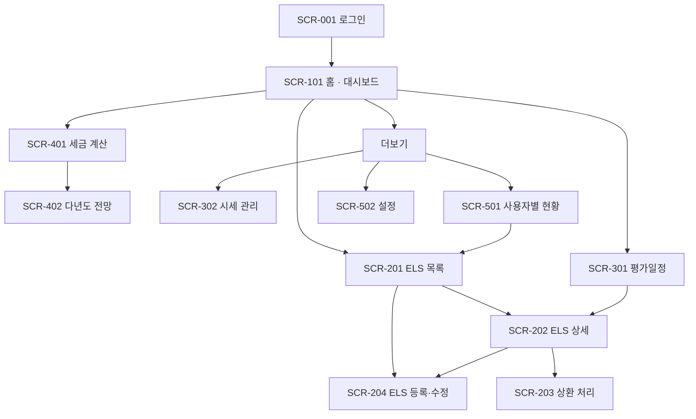

# 정보구조 및 화면 목록

**언제들어오나** — ELS 통합관리 시스템

| 항목 | 내용 |
|---|---|
| 문서 ID | DOC-008 |
| 버전 | 0.4 |
| 작성일 | 2026-07-26 |
| 작성자 | 민서 |
| 선행 문서 | DOC-001 개요서 v0.4, DOC-002 데이터 모델 v0.1, DOC-005 용어 사전 v0.1 |
| 상태 | 검토 중 |

### 변경 이력

| 버전 | 일자 | 작성자 | 변경 내용 |
|---|---|---|---|
| 0.1 | 2026-07-26 | 민서 | 최초 작성 |
| 0.5 | 2026-07-28 | 민서 | **P4 컷 4a — SCR-204 골격이 서며 정한 것 넷.** (1) **① 에 「비고」 추가** — 단계 표에 없던 항목이다. §5.2가 전체 교체이므로 등록 폼에 없는 필드는 수정 폼에도 없고, 그러면 수정 저장이 **기존 비고를 조용히 비운다.** (2) **단계는 클라이언트 상태가 아니라 폼의 값** — 전이가 제출이고 버튼의 `name`·`value`가 의도를 나른다. 근거 둘: `useState`로 두면 JS 없이 동작하지 않고(컷 1b 실측의 네 배), 화면 안의 상태 전이는 브라우저 없이 확인할 수 없다(AQ-32). 비활성 단계의 값은 히든으로 이송되며, 이송이 없으면 ④의 저장에 ①②의 값이 없는데 **증상이 저장 버튼을 누를 때까지 없다.** (3) **자산 등록은 이 폼의 형제** — 폼 중첩이 불가하므로 `<form>` 밖에 두고 ②에서만 보인다. 한 폼에 합치는 대안은 `name` 충돌(상품의 `name`)과 오류 키 재매핑을 부르고, 같은 등록이 SCR-302에도 있다. (4) **평가일은 생성값이다** — ④의 미리보기가 그 뜻이며 화면과 파서가 `generateEvaluationDates` 하나를 부른다. 히든으로 나르면 발행일을 고친 뒤 ③을 지나지 않고 저장하는 경로에서 **고치기 전 날짜**가 저장된다 |
| 0.4 | 2026-07-28 | 민서 | **P4 컷 2·3 — 화면을 세우며 좁힌 것 둘.** (1) **§5 SCR-201의 정렬 선택지를 셋에서 둘로 좁혔다(U-03).** 근거는 산술이다 — `dDay = 평가일 − 기준일`이고 기준일은 요청당 상수이므로(DOC-011 Q-02) **D-Day 정렬과 평가일 정렬이 같은 순서**이며, 다음 평가일이 없는 상품이 뒤로 가는 것도 같다. 선택지를 나란히 두면 존재하지 않는 구분을 제시하고, 눌러 아무 변화가 없으면 결함으로 읽힌다. 계약 파라미터와 주소 파서는 셋을 유지한다(`?sortBy=D_DAY` 링크가 죽지 않아야 하고, 두 값이 같은 순서라는 것은 계약이 아니라 현재 구현의 성질이다). (2) **§5 SCR-201에 `+ 등록`의 대상 화면 시점을 명기.** 이 화면은 컷 2에 서고 SCR-204는 컷 4a에 서므로 `/products/new`에 자리표시를 두었다 — §7.1이 SCR-201을 SCR-204로 가는 유일한 출발점으로 그리고 §6의 「전체 없음」 빈 상태도 같은 주소를 가리키므로, 그 사이를 404로 두면 「아직 없다」가 「주소가 틀렸다」로 읽힌다. (3) **§5 SCR-202가 컷 3에서 읽기 전용으로 섰다** — 액션 셋(`수정`·`상환 처리`·`삭제`)은 각각 컷 5·6에 붙는다. 그것이 문서의 변경은 아니지만, 「미노출」이 ST-04의 적용인지 미구현인지 구분되어야 하므로 기록한다: 지금은 **미구현**이고 ST-04의 첫 소비자는 컷 5다 |
| 0.3 | 2026-07-28 | 민서 | **P4 착수 전 선행 정정 (U-01).** (1) **§9 미결 셋을 닫았다** — SQ-01(SCR-501을 만들지 않는다), SQ-03(홈 기본 = 본인), **SQ-05(v1 라이트 고정)**. SQ-05의 근거를 표에 적었다: 색이 ST-05와 `KI_BELOW` 강조의 **의미를 나르는데** 두 모드 중 한쪽만 검증하면 다른 쪽에서 그 의미가 조용히 사라진다. SQ-02·SQ-04는 각각 P4 컷 7·4b로 시점을 명시했다. (2) **§5 SCR-302에 「자산 등록」 추가** — 없으면 §6의 빈 상태가 순환한다("자산을 등록하려면 상품을 등록하세요" → 상품 등록은 기초자산을 요구한다). DOC-011 §8에 배정을 함께 추가했다. (3) **§5 SCR-502의 「표시명 변경」 보류(U-03)** — DB는 허용하나 DOC-011 §5에 계약이 없다. 로그아웃은 P4 컷 0b에서 셸에 먼저 서며, 그 이유(쿠키 삭제 경로의 유일한 소비자)를 적었다 |
| 0.2 | 2026-07-27 | 민서 | DOC-011 v0.6(P3a)의 조회 계약 확정 반영. (1) **SCR-101 주의 상태에 KI 배리어 하회 확인 요청과 무결성 결함 추가** — 종전 열거(`KI 근접·평가일 경과`)에는 시스템이 자동 확정하지 않는(D-04) 배리어 하회 상태가 없었는데, 그것이 사용자 확인이 필요한 유일한 상태다. (2) **§6에 무결성 결함 표시 상태 신설** — 기초자산·차수 0건 상품은 "시세 없음"과 구분해 표시하고 수정 화면으로 유도해야 한다. 종전 ST-01만으로는 두 상태가 같은 문구로 표시된다. (3) **SCR-402가 P3a에서 미구현임을 명기** |

---

## 1. 목적 및 범위

본 문서는 시스템의 정보구조(IA)와 화면 목록을 정의한다. 화면 ID 체계를 확정하여 **화면설계서·API 명세·테스트 케이스를 연결하는 기준점**으로 삼는다.

화면별 상세 레이아웃, 요소 배치, 유효성 검사 규칙은 **DOC-009 화면설계서**에서 다룬다. 본 문서는 화면의 존재·목적·경로·권한·상태를 정의하는 수준까지 기술한다.

---

## 2. 화면 ID 체계

```
SCR-[분류][일련번호]
```

| 대역 | 분류 | 용도 |
|---|---|---|
| SCR-0xx | 인증 | 로그인, 계정 |
| SCR-1xx | 대시보드 | 요약·홈 |
| SCR-2xx | 상품 관리 | ELS CRUD, 상환 |
| SCR-3xx | 일정·시세 | 평가일정, 시세 |
| SCR-4xx | 세금 | 세금 계산, 전망 |
| SCR-5xx | 사용자·설정 | 사용자 현황, 환경설정 |
| SCR-9xx | 시스템 | 에러, 권한 |

**참조 규칙:** 다른 문서에서 화면을 지칭할 때 반드시 ID를 병기한다. 예: `상환 처리 화면(SCR-203)`

---

## 3. 정보구조 (사이트맵)



### 주 네비게이션

모바일 하단 탭 5개, 데스크톱 상단 메뉴 동일 구성.

| 순서 | 라벨 | 대상 화면 | 선정 근거 |
|---|---|---|---|
| 1 | 홈 | SCR-101 | 저빈도 사용 특성상 "지금 확인할 것"이 첫 화면에 필요 |
| 2 | 상품 | SCR-201 | 핵심 데이터 진입점 |
| 3 | 일정 | SCR-301 | 평가일 확인이 주요 사용 동기 |
| 4 | 세금 | SCR-401 | 두 번째 주요 사용 동기 |
| 5 | 더보기 | — | 시세·사용자·설정 |

> **시세 관리를 주 네비게이션에서 제외한 이유:** 시세는 자동 조회(S-03)가 기본이며 수동 입력은 폴백이다. 상시 노출하면 수동 입력이 정상 경로인 것처럼 오인된다.

> **「더보기」는 라우트가 아니라 메뉴다 (P4 컷 0d).** 위 표가 대상 화면을 `—`로 둔 것을 그대로 구현했다 — `/more`를 만들면 §4 화면 목록에 없는 화면이 하나 생긴다. 펼치는 항목은 **시세 관리(SCR-302)와 설정(SCR-502) 둘**이다(SCR-501은 만들지 않는다 — §9 SQ-01). `<details>`로 구현해 JS 없이 열리며, 활성 표시는 자기 경로가 없으므로 **펼친 항목 중 하나라도 활성이면** 켜진다.

---

## 4. 화면 목록

| ID | 화면명 | 경로 | 권한 | 관련 요구사항 | 주요 엔티티 |
|---|---|---|---|---|---|
| SCR-001 | 로그인 | `/login` | 비인증 | S-10 | `users` |
| SCR-101 | 홈 · 대시보드 | `/` | 인증 | S-09 | 전체 (읽기) |
| SCR-201 | ELS 목록 | `/products` | 인증 | S-01, S-04 | `els_products` |
| SCR-202 | ELS 상세 | `/products/:id` | 인증 | S-01, S-02, S-04 | `els_products`, `redemption_schedules`, `els_underlyings` |
| SCR-203 | 상환 처리 | `/products/:id/redeem` | **소유자** | S-05 | `redemptions` |
| SCR-204 | ELS 등록 · 수정 | `/products/new`, `/products/:id/edit` | **소유자** | S-01 | `els_products` 외 3종 |
| SCR-301 | 평가일정 | `/schedule` | 인증 | S-02 | `redemption_schedules` |
| SCR-302 | 시세 관리 | `/prices` | 인증 (수정은 전체 허용) | S-03 | `assets`, `asset_prices` |
| SCR-401 | 세금 계산 | `/tax` | 인증 | S-06, S-07 | `tax_profiles`, `redemptions` |
| SCR-402 | 다년도 전망 | `/forecast` | 인증 | S-08 | 파생 집계 |
| SCR-501 | 사용자별 현황 | `/users` | 인증 | S-10 | `users`, `els_products` |
| SCR-502 | 설정 | `/settings` | 인증 | — | `users` |
| SCR-901 | 페이지 없음 | `*` | — | — | — |
| SCR-902 | 권한 없음 | — | — | S-10 | — |

**권한 표기**

- `인증`: 로그인한 모든 사용자가 조회 가능 (타인의 상품 포함)
- `소유자`: 해당 상품의 `owner_id`와 일치하는 사용자만 접근 가능

---

## 5. 화면별 정의

### SCR-001 로그인

| 항목 | 내용 |
|---|---|
| 목적 | 사용자 인증 |
| 주요 요소 | 로그인 폼, 오류 메시지 |
| 진입 | 미인증 상태에서 모든 경로 접근 시 |
| 이탈 | 성공 → SCR-101 |

> 사용자 등록은 폐쇄형(초대 기반)이므로 회원가입 화면을 두지 않는다(DOC-001 A-05).

### SCR-101 홈 · 대시보드

| 항목 | 내용 |
|---|---|
| 목적 | 오랜만에 접속해도 "지금 확인할 것"이 즉시 파악되도록 함 |
| 주요 요소 | ① 임박 평가일 알림 ② 총 자산 요약 ③ 올해 금융소득 및 종합과세 여부 ④ 주의 상태 상품 ⑤ 최근 상환 실적 |
| 데이터 출처 | `els_products`, `redemption_schedules`, `asset_prices`, 파생 집계 |
| 권한 | 본인 데이터를 기본 표시. 전체 보기 전환 가능 |

**핵심 설계 의도.** 타깃 사용자는 저빈도·고중요 사용 패턴을 갖는다(DOC-001 §4). 따라서 홈은 탐색 허브가 아니라 **상태 브리핑**이어야 한다. 사용자가 스크롤이나 클릭 없이 다음 세 가지를 알 수 있어야 한다.

1. 곧 평가일이 오는 상품이 있는가
2. 올해 종합과세 대상인가
3. 조치가 필요한 상품이 있는가

**④ 주의 상태의 표시 항목** — DOC-011 §4.1 `attentionItems.reason`과 1:1 대응한다.

| 사유 | 표시 | 조치 |
|---|---|---|
| `KI_NEAR` | KI 근접 | 관찰 |
| `KI_BELOW` | **KI 배리어 하회 — 확인 필요** | 사용자가 터치 여부를 확정한다(SCR-202). 시스템이 자동 확정하지 않는다(DOC-002 D-04) |
| `KI_TOUCHED` | KI 터치 | — |
| `EVALUATION_PASSED` | 평가일 경과 | 상환 처리 또는 이월 확인 (DOC-007 §9.2) |
| `PRICE_MISSING` | 시세 없음 | 수동 입력 (SCR-302) |
| `UNDERLYING_MISSING`·`SCHEDULE_MISSING` | **무결성 결함 — 수정 필요** | SCR-204로 유도 |

> **`KI_BELOW`를 `KI_NEAR`에 접지 않는다.** 배리어 하회는 근접이 아니라 확인 요청이고, 이 화면에서 사용자가 실제로 **해야 할 일**이 있는 유일한 KI 상태다. 근접으로 표시하면 조치가 관찰로 격하된다.

**임박 평가일은 계약이 기간으로 자르지 않는다.** DOC-011 §4.1이 미상환 상품의 다음 평가일 전체를 D-Day 순으로 내려주므로, 표시 건수와 "임박"의 시각적 강조 기준은 화면이 정한다. 계약에 창을 두면 창 밖의 상품이 화면에서 사라진다.

### SCR-201 ELS 목록

| 항목 | 내용 |
|---|---|
| 목적 | 보유·상환 상품 전체 조회 |
| 주요 요소 | 필터(소유자 / 상태 / KI 상태), 정렬(평가일 / 원금 / D-Day), 상품 카드 목록 |
| 카드 표시 항목 | 상품명, 소유자, 투자원금, 다음 평가일·D-Day, 워스트오브, 조건 충족 여부, KI 상태 |
| 데이터 출처 | `els_products` + 파생 판정값 |
| 권한 | 전체 조회. `+ 등록` 버튼은 항상 노출(본인 소유로 생성) |

> **소유자 필터가 사용자 현황 화면을 대체한다.** 별도 화면 없이 필터만으로 "아버지 보유 현황"을 볼 수 있으므로 SCR-501은 요약 뷰 역할만 담당한다.

> **정렬 선택지는 셋이 아니라 둘이다 (v0.4, U-03 — P4 컷 2).** 위 표의 「평가일 / 원금 / D-Day」 중 **앞의 둘만 화면에 제시한다.** 근거는 취향이 아니라 산술이다 — `dDay = 평가일 − 기준일`이고 기준일은 요청당 상수이므로(DOC-011 §4.0 Q-02) **D-Day 오름차순은 평가일 오름차순과 같은 순서다.** 상환 완료·전 차수 경과 상품(다음 평가일 없음)이 뒤로 가는 것도 두 정렬에서 같다. 선택지를 나란히 두면 **존재하지 않는 구분**을 사용자에게 제시하게 되고, 눌러 보고 아무 변화가 없으면 그것은 결함으로 읽힌다.
>
> **계약 파라미터는 셋을 그대로 유지하고 화면의 파서도 셋을 받는다** — `?sortBy=D_DAY` 링크가 죽으면 안 되고, 두 값이 같은 순서를 만든다는 사실은 계약이 아니라 현재 구현의 성질이므로 계약에서 지우면 그 사실을 되돌릴 자리가 없어진다. 없는 것은 「고를 수 있는 항목」뿐이다.
>
> 삭제가 아니라 **좁힘의 기록**이다. 정렬 키가 셋이라는 요구가 다시 필요해지면(예: 계약이 D-Day를 다른 기준으로 재정의하면) 선택지를 되살린다.

> **`+ 등록`의 대상 화면은 컷 4a에 선다 (P4 컷 2).** 그런데 이 화면은 컷 2에 서고 §7.1은 SCR-201을 SCR-204로 가는 **유일한 출발점**으로 그린다. 그래서 `/products/new`에 자리표시를 두었다 — 버튼이 404로 가면 사용자에게 「이 화면은 아직 없다」가 아니라 「이 주소는 틀렸다」로 읽히고, 그것은 컷 0d가 다섯 탭에 대해 이미 내린 판단이다. §6의 빈 상태 「전체 없음」의 다음 행동(ST-02)도 같은 주소를 가리킨다.

### SCR-202 ELS 상세

| 항목 | 내용 |
|---|---|
| 목적 | 단일 상품의 조건·일정·현재 상태 확인 |
| 주요 요소 | ① 기본 정보 ② 기초자산별 기준가·현재가·비율 ③ 차수별 평가일·배리어·리자드 조건 표 ④ KI 상태 ⑤ 예상 수령액·과세소득 ⑥ 상환 실적(상환완료 시) |
| 액션 | `수정`, `상환 처리`, `삭제` — **소유자에게만 노출** |
| 데이터 출처 | `els_products`, `els_underlyings`, `redemption_schedules`, `redemptions`, `asset_prices` |

**권한별 노출 차이**

| 사용자 | 조회 | 수정·상환·삭제 버튼 |
|---|---|---|
| 소유자 | 전체 | 노출 |
| 타 사용자 | 전체 | **미노출** (숨김. 비활성화가 아님) |

### SCR-203 상환 처리

| 항목 | 내용 |
|---|---|
| 목적 | 상환 실적 등록. 상태를 보유중 → 상환완료로 전이 |
| 주요 요소 | 상환 유형 선택, 상환일, 실수령액, 과세 금융소득, 원천징수세액, 확정값 여부, 비고 |
| 초기값 | 조건 판정 결과에 따라 유형·차수·예상 수령액을 자동 채움. 사용자가 수정 가능 |
| 데이터 출처 | 입력 → `redemptions` |
| 권한 | 소유자 전용 |

**입력 지원**

- 증권사 거래내역 화면의 용어 대응을 인라인으로 안내한다(DOC-005 §7). 거래금액 → 실수령액, 과표 → 과세 금융소득, 제세금 → 원천징수세액
- 원천징수세액 미입력 시 `과세 금융소득 × 분리과세율`로 자동 계산
- 상환 유형이 `만기상환(손실)`이면 과세 금융소득을 `0`으로 고정하고 수정 불가 처리 (DOC-007 §4.4)

**완료 처리.** 단일 트랜잭션으로 `redemptions` 1건을 생성하며, 원본 삭제나 이관이 없다. K-03(상환 처리 1단계) 충족.

### SCR-204 ELS 등록 · 수정

| 항목 | 내용 |
|---|---|
| 목적 | 상품 정보 입력 |
| 구성 | 단계형(스텝) 폼 — ① 기본 정보 ② 기초자산 ③ 평가 조건 ④ 확인 |
| 권한 | 등록: 인증 사용자(본인 소유로 생성) / 수정: 소유자 전용 |

**단계별 입력**

| 단계 | 입력 항목 |
|---|---|
| ① 기본 정보 | 상품명, 발행사, 발행일, 투자원금, 계좌유형 |
| ② 기초자산 | 자산 선택(자동완성) + 기준가격. **행 추가로 N종 입력** |
| ③ 평가 조건 | 평가주기, 총 차수, 연쿠폰율, 배리어 스케줄, KI 배리어·관찰방식, 차수별 리자드 조건 |
| ④ 확인 | 생성될 평가일정 미리보기 후 저장 |

**설계 의도.** 입력 항목이 많아 단일 폼은 모바일에서 이탈을 유발한다. 단계 분리로 K-01(등록 90초 이내)을 목표한다. 배리어 스케줄은 `90-85-80-75-70-65` 형식의 일괄 입력을 지원하고, 파싱 결과를 차수별 표로 즉시 표시한다.

> **① 에 「비고」를 둔다 (v0.5, P4 컷 4a).** 위 단계 표에 없던 항목이며 추가하는 근거는
> **DOC-011 §5.2가 전체 교체**라는 것이다. 등록 폼에 없는 필드는 수정 폼에도 없게 되고,
> 그러면 수정 저장이 **기존 비고를 조용히 비운다**(누락이 곧 비움이다 — `productPayload`가
> 그 사실을 페이로드에 드러낸다). 계약에 있는 필드를 화면이 다루지 않기로 하려면 그 결정이
> 문서에 있어야 하므로, 빼는 대신 넣고 여기 적는다. 다른 §5 필드는 전부 단계 표에 있다.
>
> **단계는 클라이언트 상태가 아니라 폼의 값이다 (v0.5).** 현재 단계가 `step` 히든 필드에
> 있고 이전·다음·행 추가·행 삭제가 전부 **제출**이다(버튼의 `name`·`value`가 의도를 나른다).
> 근거 둘 — ① `useState`로 두면 **JS 없이 동작하지 않는다**(P4 컷 1b가 전체 갱신 버튼에서
> 실측한 함정이고, 단계 폼은 그 함정이 네 배다) ② 화면 안의 상태 전이는 브라우저 없이
> 확인할 수 없으므로(AQ-32) 규칙을 순수 모듈로 빼야 상시 스위트가 전수로 본다. 대가는
> 단계 이동마다 왕복 한 번이며 A-01 규모에서 문제가 되지 않는다.
>
> 비활성 단계의 값은 **히든으로 이송된다.** 사라진 입력은 제출되지 않으므로 이송이 없으면
> ④에서 저장할 때 ①②의 값이 없다 — 증상이 저장 버튼을 누를 때까지 나타나지 않는 형태다.
>
> **자산 등록(§5.10)은 이 폼의 형제다.** HTML이 폼 중첩을 허용하지 않으므로 `<form>` 밖에
> 두고 ② 단계에서만 보인다. 「고를 자산이 없다」의 다음 행동이 그 자리에 있어야 하기
> 때문이며(ST-02) SCR-302 v0.3이 순환을 끊은 것과 같은 판단이다. JS가 없으면 그 등록이
> 상품 폼의 입력을 지운다 — 한 폼에 합치면 보존되지만 `name`이 상품의 `name`과 충돌해
> 접두사와 오류 키 재매핑이 필요하고, 같은 등록이 SCR-302에도 있으므로 그 대가를 내지 않는다.
>
> **평가일은 입력이 아니라 생성값이다.** ④의 「생성될 평가일정 미리보기」가 그 뜻이며,
> 화면과 파서가 `lib/domain`의 `generateEvaluationDates` **하나**를 같은 입력에 부른다.
> 히든으로 나르지 않는 이유는 ①의 발행일을 고친 뒤 ③을 지나지 않고 저장하는 경로가
> 생기고, 그때 저장되는 평가일이 **고치기 전의 날짜**이기 때문이다.

### SCR-301 평가일정

| 항목 | 내용 |
|---|---|
| 목적 | 전체 상품의 평가일을 시간 순으로 조망 |
| 주요 요소 | 월별 그룹 리스트(기본), 캘린더 뷰(선택), 과거/미래 구분 |
| 항목 표시 | 평가일, 상품명, 차수, 배리어, 현재 워스트오브, 예상 충족 여부 |
| 필터 | 소유자, 미상환만 보기 |

### SCR-302 시세 관리

| 항목 | 내용 |
|---|---|
| 목적 | 기초자산 시세 확인 및 자동 조회 실패 시 수동 입력 |
| 주요 요소 | 자산별 최신 시세, 갱신 시각, 출처(자동/수동), 수동 입력 필드, 전체 갱신 버튼, **자산 등록** |
| 데이터 출처 | `assets`, `asset_prices` |
| 권한 | 조회·수정 모두 전체 사용자 허용 (시세는 공용 데이터) |

> **자산 등록을 본 화면에 둔다 (v0.3).** 종전에는 `createAsset`이 SCR-204(상품 등록)의 자동완성에만 있었는데, 그러면 **본 화면의 빈 상태가 순환한다** — §6의 빈 상태는 "등록된 기초자산 없음"이고 ST-02는 다음 행동을 요구하는데, 그 행동이 "상품을 등록하세요"가 되고 상품 등록은 다시 기초자산 선택을 요구한다. DOC-011 §8에 배정을 추가했다.

> **본 화면이 P4의 첫 화면이다 (DOC-000 §3, v1.0).** 자기 변경 계약만으로 자기 화면에 실데이터를 채우는 유일한 화면이며, 시세가 없으면 SCR-101·201·202·301의 파생값(`worstOf`·`kiStatus`·`conditionResult`)이 전부 `null`이다.

> **시세는 개인 소유 데이터가 아니다.** 동일 자산을 여러 사용자가 참조하므로 자산·시세는 공용으로 관리한다. 이는 소유권 모델(D-02)의 예외이며 의도된 설계다.

### SCR-401 세금 계산

| 항목 | 내용 |
|---|---|
| 목적 | 연도별 종합과세·건강보험료 산출 및 시뮬레이션 |
| 주요 요소 | ① 연도 선택 ② 과세 프로필 입력(금융소득 외 종합소득, ELS 외 금융소득, 건보 가입유형) ③ 금융소득 집계 ④ 세액 상세 ⑤ 건강보험료 ⑥ 구간별 실질 한계 부담률 표 |
| 데이터 출처 | `tax_profiles`, `redemptions`, 파생 집계 |
| 계산 근거 | DOC-007 §5, §6 |

**설계 의도.** 과세 프로필을 별도 설정 화면으로 분리하지 않고 본 화면에 포함한다. 입력값 변경이 즉시 결과에 반영되어야 시뮬레이션 도구로 기능하기 때문이다. 입력값은 `tax_profiles`에 연도별로 저장된다.

**표시 주의**

- 추가납부액이 `0`인 경우가 정상임을 안내한다(DOC-007 §5.5)
- 건강보험료는 개인 금융소득 기준 추정치임을 고지한다(DOC-001 A-06)
- 세무 신고 자료가 아님을 고지한다(C-04)

### SCR-402 다년도 전망

| 항목 | 내용 |
|---|---|
| 목적 | 향후 수년간의 회수·세금·자산 추이 조망 |
| 주요 요소 | 연도별 행: 세전 회수, 그 해 금융소득, 종합과세 기준 대비, 최종 부담률, 추가납부, 건보료, 세후 회수, 누적, 잔여 원금 |
| 강조 | 종합과세 기준금액 초과 연도 시각 강조 |
| 데이터 출처 | 파생 집계 (미상환 상품은 적용 차수 가정) |

> 미상환 상품은 추정 기반이므로 화면 전체에 추정값임을 명시한다. 적용 차수를 사용자가 조정하면 전망이 재계산된다.

> **P3a에서 조회 계약이 구현되지 않았다.** 열 목록의 `잔여 원금`·`총자산`에 산식이 없고(DOC-007 §7에도 없다), 두 값은 적용 차수에 의존하므로 RD-02가 열려 있는 동안 확정할 수 없다. DOC-007 §7.5 신설과 RD-02 결정이 본 화면의 선행 조건이다 — DOC-011 §4.7.

### SCR-501 사용자별 현황

| 항목 | 내용 |
|---|---|
| 목적 | 사용자별 요약 비교 |
| 주요 요소 | 사용자 카드(보유 상품 수, 총 투자원금, 올해 금융소득, 종합과세 여부) |
| 이탈 | 카드 선택 → SCR-201 (해당 소유자 필터 적용) |

> **세금 수치는 사용자별로 독립 표시하며 합계를 제공하지 않는다.** 금융소득종합과세는 개인 단위이므로 합산 표시는 오해를 유발한다(DOC-002 D-02).

### SCR-502 설정

| 항목 | 내용 |
|---|---|
| 목적 | 계정 정보, 로그아웃 |
| 주요 요소 | 로그아웃, 앱 정보·면책 고지 |

> **표시명 변경을 v1에서 보류한다 (v0.3, U-03).** DB는 이미 허용한다 — `grant update (display_name) on public.users to authenticated`와 정책 `users_update_self`가 있다. 그런데 **DOC-011 §5에 그 계약이 없다.** 신설하면 §5.11 + V-19(길이) + 세 스위트가 따라오는데, 사용자가 3명이고 표시명은 초대 시 들어온다. 삭제가 아니라 보류이며, 필요해지면 §5.11로 되살린다.

> **로그아웃은 P4 컷 0b에서 먼저 선다.** DOC-008이 그것을 본 화면에 둔 것은 **버튼의 위치**에 대한 것이지 기능의 시점이 아니다. 로그아웃이 없으면 미인증 상태로 가는 방법이 브라우저에서 쿠키를 지우는 것뿐이라 SCR-001과 프록시 리다이렉트를 P4 내내 확인할 수 없고, **쿠키 삭제 경로의 유일한 소비자**이기도 하다.
>
> 컷 0b는 셸이 없어 임시 랜딩(`/`)에 두었고, **컷 0d에서 본 화면(`/settings`)으로 옮겼다** — 셸에 「더보기 → 설정」이 생겨 문서가 정한 자리에 놓을 수 있게 되었기 때문이다. 컷 10이 더하는 것은 앱 정보·면책 고지뿐이다.

---

## 6. 화면 상태 정의

각 화면이 반드시 정의해야 하는 상태다. 화면설계서(DOC-009)에서 화면별 실제 문구와 레이아웃을 확정한다.

| 화면 | 빈 상태 | 로딩 | 에러 | 권한 제한 |
|---|---|---|---|---|
| SCR-101 | 등록된 상품 없음 → 등록 유도 | 스켈레톤 | 집계 실패 안내 | — |
| SCR-201 | 조건에 맞는 상품 없음 / 전체 없음(구분) | 스켈레톤 | 목록 조회 실패 | — |
| SCR-202 | — | 스켈레톤 | 미존재 → SCR-901 | 액션 버튼 미노출 |
| SCR-203 | — | 저장 중 | 저장 실패(입력값 보존) | 비소유자 → SCR-902 |
| SCR-204 | — | 저장 중 | 검증 실패(필드별 표시) | 비소유자 → SCR-902 |
| SCR-301 | 예정 평가일 없음 | 스켈레톤 | 조회 실패 | — |
| SCR-302 | 등록된 기초자산 없음 | 갱신 중 | **자동 조회 실패 → 수동 입력 유도** | — |
| SCR-401 | 해당 연도 금융소득 없음 | 계산 중 | 계산 실패 | — |
| SCR-402 | 전망할 데이터 없음 | 계산 중 | 계산 실패 | — |
| SCR-501 | 본인만 존재 | 스켈레톤 | 조회 실패 | — |

**공통 규칙**

| ID | 규칙 |
|---|---|
| ST-01 | 시세 누락으로 워스트오브를 산출할 수 없으면 "시세 없음"을 표시하고 임의 기본값을 대입하지 않는다 (DOC-007 E-01) |
| ST-06 | **무결성 결함(기초자산·차수 0건)은 "시세 없음"과 다른 문구로 표시하고 수정 화면으로 유도한다** (DOC-011 §4.2 `integrityIssue`). 두 상태는 화면에 같은 모습으로 도달한다 — 둘 다 `보유중`이고 워스트오브가 없다. 같은 문구로 표시하면 사용자가 **영원히 오지 않을 시세를 기다린다**. 판정 순서는 결함이 먼저다 |
| ST-02 | 빈 상태는 "데이터 없음"에 그치지 않고 다음 행동을 제시한다 |
| ST-03 | 자동 조회 실패는 오류가 아니라 **폴백 경로 안내**로 표현한다 (DOC-001 R-02) |
| ST-04 | 권한 부족 시 버튼을 비활성화하지 않고 **숨긴다.** 비활성화는 타인 데이터에 대한 조작 가능성을 암시함 |
| ST-05 | 추정값과 확정값은 시각적으로 구분한다 |

---

## 7. 주요 화면 전이

### 7.1 상품 등록

```
SCR-201 목록 ─[+ 등록]→ SCR-204 (신규)
   ① 기본 → ② 기초자산 → ③ 평가 조건 → ④ 확인
                                            │
                                    [저장] ─┴→ SCR-202 상세
```

### 7.2 상환 처리

```
SCR-101 홈 ─[평가일 알림]→ SCR-202 상세
SCR-301 일정 ─[항목 선택]→ SCR-202 상세
                              │
                    [상환 처리]├→ SCR-203
                              │      │
                              │  [저장] → SCR-202 (상환완료 상태)
```

### 7.3 시세 갱신 실패

```
SCR-101 / SCR-201 ─[시세 없음 표시]→ SCR-302 시세 관리
                                        │
                                  [수동 입력] → 원 화면 복귀
```

### 7.4 타 사용자 조회

```
SCR-501 사용자별 현황 ─[사용자 선택]→ SCR-201 (소유자 필터)
                                        │
                                        └→ SCR-202 상세 (액션 버튼 미노출)
```

---

## 8. 반응형 대응

| 브레이크포인트 | 네비게이션 | 목록 | 표 |
|---|---|---|---|
| 모바일 (~767px) | 하단 탭 | 카드 1열 | 가로 스크롤 또는 항목 접기 |
| 태블릿 (768~1023px) | 하단 탭 | 카드 2열 | 가로 스크롤 |
| 데스크톱 (1024px~) | 상단 메뉴 | 테이블 | 전체 표시 |

> 차수별 조건표(SCR-202)와 다년도 전망(SCR-402)은 열이 많아 모바일 대응이 필요하다. 우선순위 낮은 열을 접고 상세 펼치기로 제공한다. 구체적 열 우선순위는 DOC-009에서 확정한다.

---

## 9. 미결정 사항

| ID | 항목 | 상태 | 비고 |
|---|---|---|---|
| SQ-01 | SCR-501 유지 여부 | **해결 (P4)** | **만들지 않는다.** §5 SCR-201이 스스로 "소유자 필터가 사용자 현황 화면을 대체한다"고 적었다. `listUserSummaries`는 계약으로 남긴다 — 삭제가 아니라 화면 미구현이다. 화면이 없으면 **DOC-011 AQ-18(타인 `isComprehensive`를 `security definer`로 제공할지)도 열린 채로 정상**이며, 그 미결이 "버려질 수 있는 인프라"라고 적은 전제가 그대로 유지된다 |
| SQ-02 | 평가일정 캘린더 뷰 필요성 | 미결 | 리스트만으로 충분한지 v1 사용 후 판단. **P4 컷 7(SCR-301)에서 리스트만 만들고 결과를 기록한다** |
| SQ-03 | 홈 기본 표시 범위 | **해결 (P4)** | **본인(MINE).** 전환은 유지한다(DOC-011 §4.1이 이미 두 값을 받는다). `scope = 'ALL'`이어도 `currentYearTax`는 본인 기준이므로(D-02, 절대 규칙 #7) 전체 보기는 **상단이 전원이고 세금이 본인인 화면**이 된다 — 한 화면에 주어가 둘이다. 두 경우 모두 "올해 금융소득(**본인**)"으로 명시한다 |
| SQ-04 | 배리어 일괄 입력 형식 | 미결 | 구분자 허용 범위 (`-`, `/`, 공백). **P4 컷 4b(SCR-204)에서 닫는다** |
| SQ-05 | 다크 모드 지원 | **해결 (P4) — v1 라이트 고정** | 스캐폴드가 `globals.css`에 남긴 `@media (prefers-color-scheme: dark)` 블록을 **제거한다.** **근거는 색이 이 시스템에서 의미를 나른다는 것이다** — ST-05는 추정값과 확정값을 **시각적으로** 구분하라고 요구하고, §5 SCR-101은 `KI_BELOW`("확인 필요")를 `KI_NEAR`("관찰")와 구분해 강조하라고 요구한다. 그 구분이 색으로 실려 있는데 두 모드 중 **한쪽에서만 검증하면** 다른 쪽에서 대비가 무너져도 아무도 보지 않는다. 조치가 관찰로 격하되는 것은 §5가 이미 거부한 결과이며, 검증되지 않은 모드는 그 거부를 우회하는 경로다. 다크 모드는 **디자인 시스템에서 두 모드를 함께 설계하고 함께 검증할 때** 도입한다(DOC-001 §10 — 디자인 시스템은 구현 후 역작성) |

---

*본 문서는 프로젝트 진행에 따라 갱신되며, 주요 변경은 변경 이력에 기록한다.*
