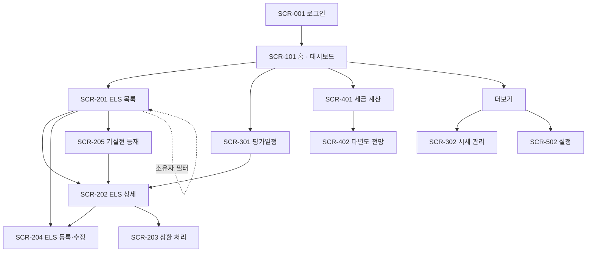

# 정보구조 및 화면 목록

**언제들어오나** — ELS 통합관리 시스템

| 항목 | 내용 |
|---|---|
| 문서 ID | DOC-008 |
| 버전 | 2.9 |
| 작성일 | 2026-07-26 |
| 작성자 | 민서 |
| 선행 문서 | DOC-001 개요서 v0.4, DOC-002 데이터 모델 v0.1, DOC-005 용어 사전 v0.1 |
| 상태 | 검토 중 |

### 변경 이력

| 버전 | 일자 | 작성자 | 변경 내용 |
|---|---|---|---|
| 2.9 | 2026-09-24 | 민서 | **SCR-204에 불러오기 구획 신설 — DOC-001 S-12. §4 화면 목록 15행 불변(요구사항 칸만 `S-01, S-12`). 본 버전은 선행 명세다.** 선행은 DOC-001 v1.4·DOC-010 ADR-009·DOC-011 v4.3이다. **(1) ★ 주소가 상태다** — 검색은 GET 폼, 선택은 링크, 불러온 값은 서버 컴포넌트가 초기값에 섞는다. 서버 액션을 쓰지 않는 근거는 DOC-011 §1.2 그대로이며 **JS 없이 동작한다**(v0.5·v1.8이 지킨 것). **(2) 폼은 키로 다시 마운트된다** — `initialValues`가 마운트 때 한 번 읽히기 때문이다. 대가는 불러오기 전에 적은 투자원금·계좌유형이 사라지는 것이며, 구획이 「불러온 뒤 적는다」를 말하는 것으로 받는다. **(3) ★ 기초자산은 정확 일치로만 해결한다** — 해외는 티커, 그 외는 정규화한 이름과 **실측 별칭**. 퍼지 매칭(「삼성전자」 → 「삼성전자우」)은 틀린 매핑을 만들고 그 매핑은 **자동 시세가 되어 판정에 들어간다**(형식은 정상이고 값만 거짓). **(4) 미해결 기초자산은 그 자리에서 해결한다** — 형제 폼 둘(기존 자산에 연결 / 자산 추가). 같은 유형·통화의 미매핑 자산이 있으면 **연결을 먼저** 보인다 — 이름이 다른 같은 자산을 두 번 만들면 시세가 새 행에 쌓이고 기존 상품은 옛 행을 본다. **(5) 거부는 폼을 비운다** — 부분만 믿을 수 있는 값을 채우면 사용자가 나머지도 믿는다. 거부 사유 목록과 부분 채움 목록을 가른 표가 §5에 있다. **(6) SQ-09~13 신설** — KI 관찰방식 · 수정 화면 재불러오기 · 청약 중 상품 · 이미 등록한 상품 경고 · 기존 상품 평가일 대조 |
| 2.8 | 2026-09-24 | 민서 | **SCR-204 — 평가일이 차수별 입력 칸이 된다. §4 화면 목록·§6 상태 표는 불변이다. 본 버전은 선행 명세다.** 선행은 DOC-002 v1.6(§4.8)·DOC-007 v1.1(RD-03 ⓑ)이다. **(1) 차수표의 평가일이 `<span>`에서 날짜 칸이 된다.** 근거는 DOC-002 v1.6 (1) — 키움 공개 페이지의 실제 평가일이 전역 산식과 상품마다 다르게 어긋난다(E04000 5/5, EM1740 4차). **(2) ★ 산식은 「채우는 도구」다 — 배리어 일괄 입력과 같은 짝이다.** 저장 제출이 빈 칸을 채우고(일괄 배리어의 `FILL_EMPTY`와 같은 자리, 그 **뒤**에 돈다 — 일괄 칸이 총 차수를 정할 수 있다) 새 버튼 「산식으로 다시 채우기」가 전 차수를 덮는다(`OVERWRITE`). 그래서 **페이지 안의 조작이 셋에서 넷이 된다.** **(3) ★★ 산식은 그 상품의 날짜가 산식과 일치할 때만 움직인다.** 칸이 입력값이 되면 수정 화면에서 발행일을 고치고 곧바로 저장하는 경로가 **옛 발행일 기준의 날짜를 경고 없이 저장한다** — 운영 11건이 전부 산식대로이므로 가장 흔한 수정 경로다. 폼이 **「지금 칸의 날짜가 어떤 발행일·주기로 만들어졌는가」**를 히든 값(`evaluationDateBasis`, 계약 필드가 아니다 — `barriers`와 같은 자리)으로 나르고, 저장 시 ⓐ 비어 있지 않은 칸이 **전부** 그 기준의 산식과 같으면 새 기준으로 전 차수를 재생성한다(오늘의 동작) ⓑ 실제 날짜가 하나라도 섞여 있으면 **옮기지 않는다** — 빈 칸도 채우지 않고(한 상품 안에 규약이 섞인다) 기준이 바뀌었으면 **저장을 한 번 보류하고 알린다**(재제출하면 그대로 저장된다). 히든 기준을 두지 않는 대안(발행일을 고쳐도 날짜는 안 따라간다)은 가장 흔한 경로에서 조용한 거짓을 만들어 기각했다. **(4) 칸 옆 힌트** — 산식과 다르면 「산식은 {날짜}」, 31일을 넘게 다르면 연·월 오타 경고. 힌트는 **마지막으로 제출된 값**에서 나오며 정확성이 그것에 의존하지 않는다. **(5) 날짜 칸의 표시 재동기화는 폼 자동 초기화에 의존한다** — 「산식으로 다시 채우기」 뒤 칸의 표시는 「일괄 적용」과 같은 경로(같은 폼에 머무는 제출 + 자동 초기화)로 갱신된다. `<select>`와 달리 `<input>`은 속성 갱신이 표시를 따라가지만 **사용자가 한 번 타이핑한 칸은 dirty 플래그 때문에 그렇지 않다**(AQ-70). 그 층의 증명은 AQ-64·AQ-70과 같은 자리에 남는다 |
| 2.7 | 2026-09-14 | 민서 | **SCR-203의 자동 채움을 「첫 렌더 한 번」에서 「차수를 고를 때마다」로 넓힌다. 본 버전은 선행 명세다.** **(1) ★ 이 변경은 편의가 아니라 «모순된 행을 만들기 가장 쉬운 경로»를 막는 것이다.** 적용 차수는 정의상 **다음 도래 차수**이므로(DOC-007 RD-02 · `nextEvaluation`) **미래 차수**다 — 9월 10일에 평가가 일어나고 9월 14일에 기록하러 오면 폼이 가리키는 것은 이듬해 차수다. 사용자가 차수를 옳게 고쳐도 **금액이 따라오지 않아** 「차수 2 / 1차의 금액」이 저장되고, 그 행은 §4.6 집계의 입력이다. v0.7의 표가 스스로 적은 「틀린 기본값 하나가 그 해의 세액을 바꾼다」가 **선택 이후에는 지켜지지 않고 있었다.** **(2) ★★ 넓히는 변경이므로 «덮지 않는 것»을 함께 규정하는 것이 이 버전의 본체다** — 첫 렌더(초기값 표는 그대로 참이다) · 서버 왕복 뒤의 재렌더(§6 입력값 보존) · 만기손실의 과세소득 고정 칸(V-12) · 값이 없는 차수(쿠폰율 부재·리자드 미정의). **채우지 못하는 유형에서는 이전 차수의 값을 남기지 않고 «비운다»** — 남기면 다른 차수의 금액이 이 차수에 붙는다. **(3) 상환일은 그 차수의 평가일 + 5일이다.** 평가일은 조건을 **판정**하는 날이고 지급은 그 뒤다. **초기값은 기준일 그대로 둔다** — 적용 차수가 미래이므로 첫 렌더에 넣으면 「아직 일어나지 않은 상환」이 기본값이 되고 V-10은 그것을 막지 않는다(발행일 이후만 본다). 즉 **초기값과 선택값이 다른 것을 말하는 것이 의도다.** **(4) 금액의 입력은 «차수 + 상환 유형»이다** — 리자드는 그 차수의 `lizard_coupon_rate` 기준이며(DOC-007 §4.1) 조기상환 가정으로 채우면 과대 추정이 저장된다. 리자드 조건이 없는 차수에서는 채우지 않는다(V-14가 거부하는 조합이므로 그 사실을 미리 말한다). 만기손실은 `P × W`라 시세가 정하므로 **채우지 않는다** — 마지막 차수에서 상환 유형을 비우기로 한 v1.2와 **같은 논거**다(화면이 미리 알 수 없으므로 비우는 것이 차선이 아니라 정확한 답이다). **(5) ★ 채움이 값을 실제로 바꾸면 확정값 체크를 끈다** — ST-05는 **기본값만** 끄고 이후 상호작용을 보지 않았다. 켜 둔 뒤 차수를 바꾸면 **추정값이 확정 표식을 달고** 저장된다. **(6) 안내 문구가 선택을 따라간다** — 종전 「{n}차 평가 기준의 추정값을 채웠다」는 **서버 렌더 문단**이라 차수를 바꾸면 그대로 남아 **화면이 거짓말을 했다.** **(7) JS 없으면 일어나지 않는다** — 만기손실 고정과 같은 「표시의 향상」이고, 저장되는 값은 어느 쪽에서도 사용자가 화면에서 본 값이다. 배선은 하이드레이션 이후에만 존재하므로 `tests/e2e/`에 케이스를 더하지 않는다(서버 HTML이 불변이라 **아무것도 증명하지 않는 초록**이 된다 — AQ-64와 같은 근거). 미검증 축은 DOC-010 **AQ-70**으로 등재했다. **(8) DOC-011은 고치지 않는다** — 조회·변경 계약이 하나도 바뀌지 않는다(`ProductDetailView` 불변). `RoundOption`은 폼 계층의 타입이다. **부재가 판단이므로 적어 둔다.** |
| 2.6 | 2026-08-07 | 민서 | **소유자 필터의 기본값을 «본인»으로 정한다 — SCR-201·301. SQ-03의 적용 범위 확장이며 새 결정이 아니다. 본 버전은 선행 명세다.** **(1) ★ 이 결함은 계정이 둘이 되기 전까지 관측될 수 없었다.** 종전 `ownerId`는 「지정 / 미지정(= 전체)」 둘이었고 **운영 계정이 하나인 동안 두 값이 같은 화면을 낸다.** Secondary 계정이 서면서(DOC-013 §10.3, 2026-08-07) 처음 갈렸고, 갈리자 **같은 앱 안에서 화면마다 주어가 다른 상태**가 드러났다 — 홈은 「내 것」(SQ-03), 목록·평가일정은 「전원 것」. **부류로 적어 둔다: 「기본값이 두 뜻을 갖는데 데이터가 그 둘을 가르지 못하는」 상태는 데이터가 늘 때까지 초록인 채로 잠복한다.** **(2) 축이 둘에서 «셋»이 된다** — 미지정이 본인을 뜻하게 되면 전체를 가리킬 값이 사라지므로 명시적으로 만든다: **부재 = 본인 · `ALL` = 전체 · UUID = 그 사람.** 자기 UUID는 부재로 정규화한다(같은 화면에 주소가 둘이면 공유된 링크가 달라 보인다 — `dashboardQuery`의 기존 규약). **(3) ★★ 대가 둘을 조용히 두지 않는다.** ⓐ **기본 화면의 왕복이 2 → 4다.** 소유자 선택지는 좁히지 않은 목록에서만 나오고(아니면 「전체」로 돌아갈 길이 선택지 자신에 의해 지워진다) 빈 상태 구분도 그 목록을 요구하는데, 기본 화면이 이제 «좁혀진» 상태다. **「기본이 전체 기간이라 좁히지 않는다」로 기록돼 있던 SCR-301의 왕복 근거가 이 컷에서 거짓이 된다.** 받아들이는 근거는 A-01 규모(상품 12건·사용자 셋)이고 되돌리기가 싸다(기본값 한 줄). ⓑ **빈 상태가 화면마다 하나씩 는다** — SCR-201은 둘 → 셋, SCR-301은 셋 → 넷. **늘리지 않으면 막다른 골목이 된다**: 본인 것이 0건일 때 「조건에 맞는 …이 없다 → 필터 초기화」로 떨어지는데 **초기화된 주소가 곧 본인 보기라 눌러도 같은 화면**이고, 다음 행동이 아무 일도 하지 않는 빈 상태는 **ST-02 위반**이다. 문구·행동은 SCR-101의 `MINE`을 그대로 쓴다(한 사실을 화면마다 다르게 부르지 않는다). **판정 순서는 「내 것 없음」 → 「조건에 안 맞음」이다** — 뒤집으면 앞의 것이 영원히 나타나지 않는다(뒤의 판정이 앞을 포함한다). **(4) ★★★ 접근이 아니라 표시의 변경이다 — RLS는 한 줄도 바뀌지 않는다.** SELECT 정책 13개 중 12개가 `qual = true`이고 그대로이며(DOC-013 §11 AQ-56 실측) 「전체」를 고르면 남의 상품이 전부 보인다. **그것이 S-10·D-02가 정한 모델이다.** 그리고 SQ-01의 근거(「소유자 필터가 사용자 현황 화면을 대체한다」)는 **약해지지 않고 강해진다** — 그 필터가 이제 화면의 기본 축이다. **이 구분을 적어 두지 않으면 다음 사람이 「남의 것이 안 보인다」를 근거로 RLS를 걷으러 간다** |
| 2.3 | 2026-08-01 | 민서 | **P6 컷 7 — 목록과 평가일정이 기초자산의 «지금»을 보여준다. 화면 목록은 «불변»이다(15행 그대로). 본 버전은 선행 명세다.** 선행은 DOC-011 v3.4(§4.2·§4.4)다. **(1) SCR-201에 ⑧ 기초자산별 현재가·비율을 더했다 — 항목이 12에서 13이 된다.** v1.9가 계약 조건을 목록에 올린 근거(「비교는 목록에서 일어난다」)가 **시세 축에는 미치지 않고 있었다**: ⑤ 워스트오브는 상품 하나에 숫자 하나여서 그 값이 **어느 자산에서 나왔는지**를 말하지 않고, 답은 SCR-202를 열어야 나왔다. **(2) ★ 새 항목을 «판정» 행에 두었다 — 화면에서는 ⑨와 같은 칸에 나란히 렌더된다.** 기준가는 발행 시점에 확정된 계약이고 현재가·비율은 기준일마다 달라지는 관측이므로, 한 칸에 보이더라도 **성질이 둘**이다. DOC-011 §4.2가 그 둘을 다른 필드로 두는 것(`terms`는 시세를 읽지 않는다)과 같은 구분이며, 마커가 두 행으로 갈리는 것이 그 사실의 표시다. 그래서 계약 조건 다섯이 ⑨~⑬으로 밀린다 — **번호는 위치 라벨이고 두 행에 걸쳐 겹치지 않는 것이 대조의 조건**이므로(v1.9) 순서를 유지하려면 재번호가 따라온다. **(3) 워스트오브 표식은 계약의 `isWorst`다** — 화면이 최솟값을 다시 고르지 않는다(동률이면 전부 붙는 것이 그 필드의 정의다). 표기도 SCR-202와 같은 말을 쓴다(DOC-005 §9가 「최저 기초자산」을 비권장으로 둔다). **(4) ★ 시세가 하나만 빠지는 상태가 이 항목에서 처음 «자산 단위»로 드러난다** — 워스트오브는 하나라도 없으면 `null`이라 ⑤가 「시세 없음」이 되는데 값이 있는 자산의 비율은 그때도 참이다. 빠진 줄만 그렇게 적으면 고칠 대상이 드러난다(ST-01 · SCR-202 ②의 같은 근거). **(5) SCR-301 상품별 카드 머리에 ⑨ 기초자산·기준가·현재가·비율 ⑩ KI를 더했다 — 항목이 12에서 14가 된다.** 이 화면은 「언제 오는가」에는 답하면서 **「무엇에 걸려 있는가」에는 답하지 않았다.** 차수 행이 아니라 카드 머리인 것은 ⑦⑧과 같은 근거이고(상품 단위 값이라 차수 행에 두면 여섯 번 반복된다) **시간순 보기에 없는 것도 같은 근거다**(E 부류 — 결정이지 누락이 아니다). 차수 행 넷이 ⑪~⑭로 밀린다. **(6) 두 화면의 표기가 바이트 동일하다** — 같은 렌더러가 낸다. 한 사실을 두 화면이 다르게 부르면 사용자가 두 값으로 읽는다(셋째 빈 상태의 문구를 보기마다 다르게 두지 않는 규율과 같다). **(7) 왕복은 늘지 않는다** — 두 계약 모두 최신 시세를 **이미** 읽고 판정에 쓰고 있었고 매퍼가 그것을 버렸다(DOC-011 §4.2 v3.1이 `terms`에 대해 쓴 근거와 같은 형태) |
| 2.2 | 2026-08-01 | 민서 | **P6 컷 6 — SCR-301에 상품별 보기를 더한다. §4 화면 목록은 «불변»이다(15행 그대로). 본 버전은 선행 명세다.** 선행은 DOC-007 v1.0(§4.5)·DOC-005 v1.0(용어 넷)·DOC-011 v3.3(§4.4)이다. **(1) 새 화면을 만들지 않았다 — 한 화면의 «표현 축»이다.** §7.4가 소유자 필터에 대해 정한 형태(「화면 사이의 이동이 아니라 한 화면 안의 좁힘」)와 같고, 「더보기」 각주가 「§4 화면 목록에 없는 화면이 하나 생긴다」로 거부한 것과 같은 이유다. 라우트도 계약도 하나 그대로다. **(2) ★★ 정렬 각주를 «고치지 않고» 화해시켰다.** P4 컷 7의 「정렬은 계약이 준 평가일 오름차순 하나다 — 절마다 정렬을 뒤집으면 「시간 순으로 조망」이 절 경계에서 끊긴다」는 두 보기 모두에서 **그대로 성립한다**. 상품별은 **날짜를 비교하지 않고** 계약이 준 **입력 순서의 위치**로만 정렬하기 때문이다. **그룹핑이 정렬이 아니라는 것은 이 화면에 이미 있었다**(월별 그룹이 그것이며, 그 각주가 두 개념을 한 문장에 나란히 둔 것이 구분이다) — 상품별은 그 자리에 다른 키를 넣을 뿐이다. ★★ **카드 순서는 «표본으로 재고 고쳤다».** 처음에는 그냥 첫 등장 순(= 가장 이른 평가일 순)이었는데 `dev/01_sample_portfolio.sql` 12건을 넣자 **전 차수가 경과한 상품 셋이 맨 위로 올라왔다**(그것들의 1차가 2023년이다) — 화면의 물음이 「다음이 언제 오는가」인데 답이 세 칸 아래에 있으면 그 순서가 목적을 거스른다. 그래서 **가장 이른 «다가오는» 차수 순**이고 다가오는 차수가 없는 상품은 꼬리에 최근에 지난 것부터다. **정렬 각주는 여전히 유지된다** — 두 부류 모두 입력 위치로만 정렬하므로 계약의 전순서를 **다시 매기는 것이 아니라 두 부분수열로 가르는 것**이고, 그것은 `splitByPast`가 절을 가르는 것과 같은 형태다. ★ **깨지는 조건을 명시했다: 카드 순서를 상품명·원금·수익률로 두는 순간이다**(그 축들은 시간과 무관하다). 「견준다」는 목적은 **카드 안에서** 달성되며 카드 사이의 순서를 요구하지 않는다. **(3) ★ 표시 항목을 두 행으로 갈랐다 — SCR-201 v1.9와 같은 형태·같은 이유.** ①~⑥ 공통 / ⑦~⑫ 상품별. 마커가 겹치지 않으므로 `keyof ScheduleItem`과 전수 대조된다 — **DOC-010 AQ-35가 등재한 공백의 네 번째 자리이고, DOC-011 §8.1의 일곱째 사례가 정확히 그 공백에서 났다**(SCR-301에 그 대조가 없어 다섯 값이 계약에 없는 채로 남았다). ⑦~⑫가 시간순에 없는 것은 **결정이며 결함이 아니다**(§8.1의 E 부류) — 행 단위가 여러 상품이 섞인 차수이고, 원금이 저마다 다른 목록에서 금액을 세로로 쌓으면 **합계처럼 읽힌다.** **(4) 지난 차수는 접되 «제거하지 않는다»** — `<summary>`가 건수를 적으므로 신호 없는 자름(AQ-22의 형태)이 아니고, **접힌 것은 한 번의 조작으로 같은 화면에서 돌아온다.** 그래서 컷 7의 「구분은 필터가 아니라 구획이다」가 유지된다. 다가오는 차수가 없으면 **열린 채** 렌더한다 — 접으면 카드가 비어 보여 그 상품이 사라진 것처럼 읽힌다. **펼침이 데이터에 의존하고 폭에 의존하지 않는 것이 조건이다.** **(5) ★ 두 보기가 «동시에» 렌더되지 않는다 — SQ-02의 근거가 여기 겨눠진다.** 캘린더를 버린 이유가 「리스트를 대체하지 못하고 그 위에 얹히는 두 번째 목록이 된다」였고, 상품별은 리스트를 **대체하며** 같은 계약·같은 필드·같은 순수 함수(`splitByPast`)를 읽는다 — 그것이 유일한 차이이고 그 성질이 무너지면 SQ-02가 이 보기를 겨눈다. 실측 근거도 적었다(e2e의 행 세기가 페이지 전체 `<li>`를 잡으므로 동시 렌더는 두 파일의 모든 건수 단언을 두 배로 만든다). **(6) 보기는 좁히는 축이 «아니다»** — 「좁혀졌는가」 판정이 이 축을 세면 아무 필터도 안 건 화면이 빈 상태 둘째(「필터 초기화」)를 내고 두 번째 조회가 항상 돈다. 그래서 필터 타입 **밖**에 둔다(SCR-201의 페이지 축과 같은 형태 — 타입을 가르면 판정의 사정거리에 들어올 수 없다). 반대로 **필터 폼은 보기를 히든으로 나른다**(없으면 제출할 때 보기가 조용히 되돌아간다) — 페이지 축과 정반대 방향이고, 필터를 바꿔도 «표현»은 무효가 되지 않기 때문이다. **(7) 빈 상태는 셋 그대로이고 넷째는 «카드»의 것이다.** 셋째는 자리만 옮기고 **문구는 바이트 동일**하다(한 상태에 두 문구를 두면 보기를 바꿀 때 상태가 바뀐 것으로 읽힌다). 넷째(「이 상품만 다가오는 차수가 없다」)는 카드 안이며 셋째와 구조적으로 배타다. §6 표의 행은 늘지 않는다 — 그 표는 화면 단위다. **(8) §8에 세 번째 반응형 형태를 등재했다 — 접지도 스크롤하지도 않고 «재배치»한다.** 금액 셋은 이 보기가 존재하는 이유라 접을 수 없고(SCR-402가 「④를 절대값으로 적으면 구분이 ⑤ 하나에 떠넘겨진다」로 거부한 형태), **펼침을 폭에 의존시키면 JS가 필요하고 인쇄가 창 크기에 좌우된다** — 이미 지난 차수 접기가 그 장치를 데이터 의존으로 쓰고 있으므로 축을 섞을 수 없다. 태블릿 2열도 하지 않는다(몸통이 표인 카드를 반 폭으로 접으면 표가 죽는다) |
| 2.1 | 2026-08-01 | 민서 | **P6 컷 5 — SCR-205 기실현 등재 신설. 화면 목록이 14행에서 15행이 된다.** 선행은 DOC-002 v1.0(`entry_mode`)·DOC-011 v3.2(§5.11)다. **(1) 목적이 다른 화면이다** — 이미 상환이 끝난 ELS를 **과거 이력으로** 등재한다. 계약 조건(발행일·연쿠폰율·기초자산·기준가·배리어·KI)을 **입력받지 않는다**: 증권사 거래내역에 없기 때문이고, 지어내면 판정에 거짓 입력이 들어간다. **(2) ★ SCR-204와 합치지 않았다.** 입력 집합이 거의 겹치지 않는다 — 세 구획 중 둘(기초자산·평가 조건)이 통째로 없고 대신 SCR-203의 상환 실적이 들어온다. 모드 토글로 두면 **칸 절반이 조건부로 사라지는 폼**이 되고, 그 조건은 JS 없이 동작해야 하므로(v1.8이 단계 기계를 철회한 이유) 서버 왕복이 하나 붙는다. **등재 후 수정 경로도 다르다** — SCR-204는 저장이 막히고(상환 완료) 고칠 것은 상환 값뿐이다. **(3) ★★ 표시만 하는 값 셋을 칸에서 뺐다** — 귀속연도(`year(상환일)`) · 실현손익(`실수령액 − 투자원금`) · 원천징수세액(비우면 계약이 산출). **귀속연도를 칸으로 두지 않는 것이 결정의 핵심이다**: 사용자의 스프레드시트에는 열로 있지만 DOC-007 §7.2가 그것을 상환일로 정하므로 칸을 두면 두 값이 갈릴 수 있고 **그때 세액이 조용히 틀린다.** 원천징수세액을 미리 채우지 않는 것은 SCR-203과 같은 판단이다(채우면 산출이 영원히 실행되지 않는다). **(4) 차수 칸이 없다** — 일정 0건이라 실재하는 차수가 없다(I-13). **상환 유형은 넷 다 고른다**: 조기상환된 상품을 「만기」로 기록하지 않기 위해서다. **(5) 진입은 SCR-201의 링크 하나이고 네비게이션 탭은 넷 그대로다** — 과거 이력을 옮길 때 한 번씩 쓰는 화면이다. §6 상태 표에 한 행, §7에 전이 하나(저장 → SCR-202)를 더했다. §3 사이트맵에 노드·간선 둘 |
| 2.0 | 2026-08-01 | 민서 | **P6 컷 4 — SCR-201의 카드 경계와 페이지 이동. 계약 변경은 없다(DOC-011 불변).** **(1) ★ 카드 경계를 모든 폭에서 테두리로 만든다 — v1.9가 만든 결함의 정정이다.** 데스크톱은 카드 테두리를 지우고(`lg:border-0`) 목록의 `divide-y`에 경계를 맡겨 왔다. 한 줄 카드에서는 성립했으나 **계약 조건 줄이 붙으며 깨졌다** — 한 상품 «안»의 구분선과 상품 «사이»의 구분선이 둘 다 얇은 수평선이 되어 「이 기초자산이 위 상품인가 아래 상품인가」를 보면서 헷갈리게 됐다(실사용 보고). ★ **선을 굵게 하는 것으로 고치지 않았다** — 굵기를 다르게 두면 「어느 쪽이 더 굵은가」를 매번 비교해야 하고 그 비교는 두 선을 동시에 볼 때만 성립한다. **경계는 비교가 아니라 «둘러싸기»로 표현한다**: 카드마다 테두리 + 사이에 여백이면 소속이 **선의 해석 없이** 결정된다. 따라오는 것 둘 — `divide-y` 제거, 머리글 외곽 테두리 제거(이중선이 된다). **열 정렬은 유지된다**(같은 그리드 템플릿 공유가 §8의 근거였고 그 성질은 그대로다). 계약 조건 줄의 구분선도 배경 색으로 바꿨다 — 배경은 「위와 한 덩어리」를, 선은 「여기서 갈린다」를 말한다. **(2) 페이지 이동 — 10건 초과 시.** ★ **자르는 자리가 계약이 아니라 화면인 것이 이 결정의 핵심이다**: `status`·`kiStatus`가 파생값이라 계약이 조회 «후에» 거르므로(Q-05) DB의 `LIMIT/OFFSET`은 **거르기 전 집합을 자르게 되고** 페이지마다 건수가 달라진다. 거른 뒤의 목록을 자르는 것이 유일하게 옳은 순서이고 그 목록은 이미 메모리에 있다 — 즉 조회의 문제가 아니라 표시의 문제이며 **DOC-011 §4.2는 변하지 않는다.** **(3) ★★ 페이지 초기화가 규율이 아니라 구조다** — 필터·정렬 폼은 `<form method="GET">`이고 그 안에 `page` 칸이 **없다.** 제출하면 주소에 `page`가 실리지 않아 자동으로 1페이지가 된다(「필터를 바꿀 때 페이지를 지운다」를 코드로 기억할 필요가 없다). 반대로 페이지 링크는 현재 필터를 그대로 싣는다. **(4) 범위 밖 페이지는 마지막 페이지로 clamp한다** — 자르면 빈 목록이 되고 화면이 「조건에 맞는 상품이 없다」를 말하는데 **상품은 있으므로** §6의 빈 상태 두 갈래가 오염된다 |
| 1.9 | 2026-08-01 | 민서 | **P6 컷 2 — SCR-201의 카드가 계약 조건을 함께 보여준다. 본 버전은 선행 명세다.** **(1) ★ 「카드 표시 항목」을 두 행으로 갈랐다** — ①~⑦(판정의 결과)과 ⑧~⑫(사용자가 입력한 계약 조건). 한 행에 두면 억제 규칙(DOC-011 §4.2 D1)이 어디까지 미치는지가 표에서 사라진다: 결함 상품은 ⑤⑥⑦이 비지만 ⑧~⑫는 그대로 있고 **오히려 그때 화면이 보여줄 것이 계약 조건뿐이다.** 계약이 그 구분을 타입으로 갖는다(`ProductListItem.terms`). **(2) 신설 항목 다섯** — ⑧ 기초자산·기준가격 ⑨ 연쿠폰율 ⑩ KI 배리어·관찰방식 ⑪ 조기상환 배리어(스텝다운) ⑫ 리자드 조건. **근거는 실사용이다**: 11건을 넣고 「지금 어떤 상태인가」는 답이 됐지만 「이 상품이 어떤 조건이었나」는 상세로 들어가야 답이 됐다 — 스텝다운·리자드·KI는 상품을 **비교할 때** 필요한 값이고 비교는 목록에서 일어난다. 11건을 서로 견주려면 상세를 열한 번 왕복해야 했다. **(3) 카드가 두 줄이 된다** — ①~⑦은 데스크톱 5열 표의 열로 남고 ⑧~⑫는 그 아래 전 폭을 지나는 한 줄이다. 열로 더하면 11열이 되어 어느 폭에서도 읽히지 않는다(§8). **(4) 스텝다운은 입력 형식과 같은 표기다**(`90-85-80-75-70-65`) — SQ-04의 일괄 입력이 그 형식이므로 사용자가 적은 것과 같은 모양으로 되돌려 받는다. 다음 차수를 강조하고 **자르지 않는다**(신호 없는 자름은 AQ-22의 형태이며 차수 수는 사용자의 데이터다). 리자드는 붙은 차수만 적는다 — 전 차수를 나열하면 대부분이 「없음」이 되어 신호가 사라진다. **(5) ★ 마커를 붙여 문서↔뷰 대조를 만들었다** — `tests/app/productList.test.ts`가 이 셀을 파싱해 `ProductListItem`의 필드와 전수 대조한다. **DOC-010 AQ-35가 「그 대조가 SCR-101 한 화면에만 있다」고 등재한 공백의 두 번째 자리다.** §4 화면 목록은 불변이다 |
| 1.8 | 2026-07-31 | 민서 | **P6 컷 1 — SCR-204의 단계 분리를 철회하고 평가일 산식에 −1일 규약을 넣는다. 본 버전은 선행 명세다 — 구현은 같은 컷의 뒤 커밋이다.** **(1) ★ 단계형 폼을 단일 페이지로 되돌린다.** v0.5의 결정 ②(「단계는 클라이언트 상태가 아니라 폼의 값이다」)와 그 부수 규약 둘(히든 이송 · 오류 단계 되돌리기)을 **취소선으로 남기고 철회한다**(U-03). **판정 근거는 실사용이다** — 실보유 ELS 11건을 입력하며 §5.1 K-01(1건 90초)이 어긋났고 반복이 측정값으로 있다(기초자산 조합 5회 · 발행일 3회 · 배리어 세트 4회 재입력). 단계형은 **1건을 겨냥한 설계**였고 11건에서는 「어느 칸이 어느 단계에 있는가」를 기억하게 만들어 왕복을 늘렸다. ★ **철회되지 않는 것을 함께 적었다** — v0.5가 든 근거 둘 중 **첫째(JS 없이 동작한다)는 단일 페이지에서 더 강하게 성립하고**(폼 하나·제출 하나) 둘째(전이를 순수 모듈로 뺀다)는 **애초에 단계를 가진 비용**이었다. 즉 이 철회는 그 결정의 근거를 부정하는 것이 아니라 **그 근거가 지키려던 것을 더 싸게 얻는 것**이다. 남는 조작 셋(행 추가·행 삭제·일괄 적용)은 제출로 남으며 그 규약은 불변이다. **(2) 평가일 생성 산식이 `발행일 + n × 평가주기 − 1일`이 됐다.** 증권사 통지서가 그 형태였고(11건 전 차수에서 **일정하게** −1일) 종전 산식은 전 건에서 하루 뒤를 냈다. 상수는 `lib/domain`에 두고 **호출부가 필수 인자로 명시한다** — 기본값을 주면 새 호출부가 조용히 규약을 안 따를 수 있다. 잔여는 DOC-007 RD-03(휴장일 자동 조정 · 상품별 규약 차이). **(3) ★ 드롭다운 각주 신설 — 단일 페이지가 기존 결함을 증폭한다.** React가 `<form action>` 제출마다 폼을 자동 초기화하는데 **`<select>`만 갱신 시 속성이 재동기화되지 않아**(소스 대조: `react-dom-client`의 갱신 경로가 `multiple` 토글에서만 옵션을 다시 쓴다) 초기화가 표시를 「선택」으로 되돌린다. **값에 묶는 것은 악화다** — 그 경로에서는 어떤 옵션도 `selected` 속성을 받지 못한다. 종전에는 단계를 넘길 때 패널이 remount되어 가려졌고 **단일 페이지에서는 모든 제출이 폼을 마운트된 채로 두므로 전부 드러난다.** 값과 같은 식의 `key`로 고치며 표시 상태의 증명 층 부재는 AQ-64. **(4) ★ SQ-04 각주의 한 문장이 거짓이었다** — 「V-03이 저장 시점에 같은 사실을 오류로 말한다」. 파서가 V-03의 **양쪽을 같은 칸에서 파생**시키므로 1~60 전 구간에서 항등이고 발화하지 않는다. 즉 **개수 불일치의 backstop이 실재하지 않았다.** 고치지 않고 AQ-63으로 등재하며, 단일 페이지가 만드는 새 함정(강제되는 제출이 없어 차수표 없이 저장하면 DOM에 없는 칸에 오류 N개) 하나는 **저장 제출이 일괄 칸을 먼저 펼치는 것**으로 닫았다. **(5) §7.1 전이에서 단계 화살표를 제거했다. §4 화면 목록·§6 상태 표는 불변이다**(§4는 `screenRoutes()`가 14행으로 단언한다) |
| 1.7 | 2026-07-31 | 민서 | **P5b 컷 9(P5b.5) — 「판단 시점 P5」 재배정과 표식 정정. 설계 변경은 없다.** **SQ-06의 판단 시점을 `~~P5~~ → P6`으로** 옮겼다 — 남은 것이 구현이 아니라 **결정 둘**(세션 값 노출 대 계약 신설 · 표시명 변경까지 가는가)이고 그 정본이 **셸을 역작성하는 DOC-009**이다. 이 항목이 원래 P5에 붙은 이유(「셸의 사용자 표시 자리가 함께 정해진다」)의 **실재하는 계승자가 정확히 그것**이라 논거를 새로 만들 필요가 없었다. §6의 각주 **셋**도 배정을 따라갔다 — †1(SCR-402 행)과 「로딩」 열은 단순 치환이지만 ★ **「에러」 열 각주는 갈라야 했다**: 한 문단이 이제 **두 단계**를 말한다(**관측은 P5b가 세우고**(AQ-38) **화면별 분기와 셸 유지 여부는 P6가 그 위에 얹는다**(AQ-37)). **일괄 치환하면 본문과 각주가 갈리고 그것이 이 컷이 감사하는 형태의 재발이다.** 「로딩」 열 각주는 **정정이지 결정이 아니다** — 바로 다음 문단이 §6 머리글의 DOC-009 유예를 이미 인용하고 있었고, **같은 각주가 근거로는 DOC-009를 시점으로는 P5를 부르고 있었던 것**이 이 결함의 축소판이다. 「P5」는 지우지 않고 취소선으로 남겼다(AQ-11의 선례) |
| 2.5 | 2026-08-05 | 민서 | **P5a 컷 2b — SCR-302에 공급자 매핑 편집과 「자동 수집 안 함」 표식을 넣었다. §4의 화면 목록은 늘지 않는다.** **(1) 새 화면을 만들지 않는 근거는 ADR-007이 이미 적었다**(「매핑 화면을 SCR-302에 두는 결정」) — 매핑과 시세는 같은 자산의 두 측면이고, 매핑이 없으면 시세가 자동으로 오지 않으므로 **그 인과가 한 화면에 보여야 한다.** **(2) ★ 5번째 열을 만들지 «않고» 행 아래 `<details>`로 뒀다.** 4열 그리드의 비율이 실측 조정값이고(민서의 미커밋 작업이 그 값이다) 열을 늘리면 **머리글과 행의 템플릿 리터럴을 글자 단위로 맞춰야** 한다(Tailwind가 템플릿 리터럴 클래스를 생성하지 않는다). `lg:col-span-full`이 그 판단을 다시 하지 않게 한다. 그리고 **빈도가 다르다** — 매핑은 자산당 한 번, 시세는 자주다. 펼침을 `useState`로 두지 «않으므로» JS 없이 열린다(`AssetForm`이 같은 형태). **(3) ★★ 「자동 수집 안 함」 표식이 SQ-08의 자리를 채운다. 등급은 `neutral`이다** — ADR-007이 수동 입력을 「폴백이 아니라 설계된 정상 경로」로 못박았으므로 `attention`(사용자가 조치한다)·`defect`(데이터를 고친다)를 쓰면 **화면이 정상 상태를 결함으로 말한다.** 그리고 **표식이 «있는» 것이 요점이다**: 없으면 「자동 수집되지 않는 것」과 「자동 수집되는데 값이 아직 없는 것」이 같게 보이고 사용자가 감시되고 있다고 오해한다(ST-06의 형태). **(4) 한 칸이 저장과 «해제»를 둘 다 한다** — 비우고 제출하면 매핑이 삭제된다(§5.12). 「지우기」 버튼을 두지 않는 이유는 조작이 하나이기 때문이며 §5.9가 같은 형태다. 문구는 갈랐다(「공급자 매핑을 저장했다」/「자동 수집을 해제했다」) — 사용자가 한 조작이 다르다. **(5) §6.1 축을 늘리지 않았다** — 표식과 안내는 열거값이 아니라 boolean·부재를 말하는 문구이므로 `isStale`(「시세 오래됨」)·「임박」과 같은 자리다. `priceFailure`(「데이터 없음」/「호출 실패」) 축은 그 문구를 렌더하는 컷(P5a 컷 3)에서 등재한다 — 지금 넣으면 `labels.test.ts`의 정확 일치 대조가 **렌더하는 코드보다 앞서** 빨간불이 된다. **(6) 매핑 왕복은 e2e에만 있다**(AQ-23 — 어댑터는 어느 상시·PostgREST 스위트의 import 그래프에도 없다). 다섯 케이스를 넣었고 그중 **둘이 내 결함을 잡았다** — 행 전체로 심볼을 물으면 `placeholder`가 그 단언을 항상 참으로 만들고(요약 줄로 좁혔다), 히든을 «덧붙여» 덮으려 하면 `FormData`가 **첫 값**을 주므로 덮이지 않는다(걸러내고 넣는다) |
| 2.4 | 2026-08-05 | 민서 | **P5a 컷 0 — SQ-08을 «소멸»로 닫았다. 화면 설계 변경은 없고 `src/` 0줄이다.** ADR-008이 발행사 기초자산 페이지를 주 원천으로 세우면서 **6종 전부가 자동 수집되므로** 「자동 감시되지 않는다」를 말할 대상이 없어졌다. **★ 「해결」이 아니라 「소멸」로 적는 것이 이 판의 요점이다** — 표식을 어디에 둘지 정한 것이 **아니고** 그 표식이 가리킬 상태가 사라진 것이다. 「해결」로 적으면 다음 사람이 **표식이 구현되어 있다고 읽는다.** **★★ 되살아나는 조건을 함께 적었다** — es040의 42종 목록에 없는 기초자산을 가진 상품을 등재하면 그 자산은 다시 미매핑이 되고 **이 요구가 그대로 돌아온다.** 그때 필요한 데이터는 **이미 서 있다**(DOC-011 §7.1의 `unmapped`가 그 수를 센다) — 즉 **원천은 있고 표시만 없다**는 상태가 되며, 그것이 「지금 만들지 않는다」를 정당화하는 근거이자 그때 싸게 만들 수 있는 이유다. **ST-06의 형태는 폐기되지 않는다** — 「후보가 표시되지 않는 것」과 「하회가 없는 것」이 같게 보이는 위험은 미매핑 자산이 하나라도 생기는 순간 되살아난다. 종전 등재문은 취소선으로 남긴다(U-05 — 미결 항목이 해결되면 삭제하지 않고 상태를 갱신한다) |
| 1.6 | 2026-07-30 | 민서 | **P5b 컷 8 — ADR-007 채택. AQ-01을 닫았다.** **§9에 SQ-08을 신설했다. 화면 설계 변경은 없다 — 요구를 등재한다.** ADR-007이 「국내 자동 · 해외 수동」을 확정하면서 공백이 하나 생겼다: **KI는 기간 중 상시 관찰인데 증권사 통지는 평가일에만 온다.** DOC-011 §5.9의 「수집 시세로 하회가 관측되면 후보로 표시」가 해외 자산에는 **입력 자체가 없어** 서지 않는다 — **확정 경로(`setKiTouched`)는 살아 있고 후보 표시만 없다**(그 구분이 중요하다). ★ **ST-06의 형태가 그대로 적용되며 더 조용하다** — 「후보가 표시되지 않는 것」과 「하회가 없는 것」이 같게 보이면 **사용자는 감시되고 있다고 오해한다.** 여기서는 **부재 자체가 오해의 원인**이다. 판단 시점은 **P5a**(매핑 화면이 서는 컷 — 「매핑 없는 자산」의 표시와 **같은 정보의 두 표현**이므로 함께 정한다). **★ 이 항목은 「판단 시점 P5」 부류 B에 넣지 않는다** — 실재하는 단계를 가리키므로 컷 9의 재배정 대상이 아니다 |
| 1.5 | 2026-07-30 | 민서 | **P5b 컷 3 — §9 SQ-06을 운영 실측으로 갱신했다. 화면 설계 변경은 없다.** (1) **부재를 배포된 인스턴스에서 처음 관측했다** — 표시명·이메일을 렌더하는 요소가 헤더에도 설정의 「계정」에도 없다. 종전 서술은 코드에서 추론한 것이었고 이제 실측이다. (2) **`display_name`의 렌더 표면이 현재 0임을 확정했다** — 읽는 자리가 `ownerName`(남의 상품 전용)과 `listUserSummaries`(SCR-501, 미구현) 둘뿐인데 운영 계정이 1개라 남의 상품이 없다(DOC-013 §10.3). **이 미결의 실제 무게는 계정이 둘 이상이 되는 날 생긴다** — 지금 닫으면 관측할 수 없는 것을 만드는 셈이다. (3) **★ 「판단 시점 = P5(디자인 시스템 역작성)」이 실재하지 않는 단계를 가리킨다** — P5는 P5a(시세 연동)·P5b(배포·운영)로 갈렸고 역작성은 P6다. **아무 단계도 자기 것으로 여기지 않으므로 그대로 두면 조용히 만료된다.** **전수 확인 결과 SQ-06 혼자가 아니다** — 맨 `P5` 24건 중 「시세 연동」을 뜻하는 셋은 P5a로 읽혀 문제가 없고, 「디자인 시스템 역작성」을 뜻하는 **미결 다섯(SQ-06·AQ-36·AQ-37·AQ-38·AQ-41) + §6 각주 셋**이 갈 곳이 없다. **DOC-000이 이 파급을 이미 보았고(「스무 곳 남짓」) 「번호를 다시 매기지 않는다」고 정했다** — 그러므로 결함은 「못 봤다」가 아니라 **두 부류를 갈라 세지 않고 한 결정을 둘 다에 적용했다**는 것이다. 그 논거는 부류 A에만 성립한다. 재배정은 계획 결정이라 여기서 하지 않고 **컷 9(P5b.5)**에 올린다 |
| 1.4 | 2026-07-29 | 민서 | **P4b 컷 8 — SCR-402가 섰다. §5·§6의 SCR-402 각주를 구현 대조본으로 갱신했다.** v1.3이 선행 명세였고 이 버전이 그 결과를 적는다. (1) **§5 각주에 구현 형태 셋** — ①~⑫가 표의 열이고 「표 밖 표식」 셋이 마지막 칸에 모인 이유(셋 다 **행 단위**이며 세율 연도는 한 표 안에서 갈린다) · ④를 `signedWon`으로 렌더하는 이유(부호가 뜻을 나른다) · 모바일이 가로 스크롤인 이유(§8 :674의 열 우선순위가 DOC-009 유예이므로 정본 없이 접으면 컴포넌트가 그 결정을 갖는다). (2) **빈 상태 판정이 화면 층의 순수 함수라는 것과 그것이 세 축인 것을 적었다** — 셋째 축(그 해 금융소득)이 없으면 상품 0건 + ELS 외 금융소득인 사용자에게서 **계약의 결정이 화면에서 그대로 무효화된다.** (3) **§6 †1** — 네 칸 중 셋이 섰고 「계산 중」은 예고대로 AQ-36으로 남으며, **에러 칸의 접힘이 AQ-37의 다섯 번째 자리**임을 적었다. (4) **§3 사이트맵의 실선이 실제 링크를 얻었다** — v1.3의 각주가 조건을 「SCR-401에 진입 링크가 서는 것」으로 명문화해 두었고 컷 8이 그 링크를 세웠다. 네비게이션 탭은 넷으로 불변이다 |
| 1.3 | 2026-07-29 | 민서 | **P4b 컷 4 — SCR-402의 정본화와 선행 조건 종료. 본 버전은 선행 명세다 — 화면은 컷 8이다.** (1) **§5 SCR-402의 「주요 요소」를 ①~⑫ 마커로 정본화했다.** v1.2까지 마커 없는 아홉 개 나열이었고 **「총자산」은 각주에만 있었다** — 열 목록과 계약 필드가 갈려 있었고 그것을 보는 층이 없었다. 마커를 붙여 `tests/app/forecast.test.ts`가 셀을 파싱해 `keyof ForecastRow`와 전수 대조할 수 있게 한다 — **DOC-010 AQ-35가 「그 대조가 SCR-101 한 화면에만 있다」고 등재한 공백의 두 번째 자리**다. (2) **정본 셀 셋을 고쳤다.** ④ 「종합과세 기준 대비」는 **차액**이므로 `isComprehensive`(참·거짓)로 만족할 수 없다 → DOC-011 §4.7에 `thresholdGap`을 담는다(§4.6이 이미 같은 값을 갖고 같은 경로에서 나오므로 왕복 증가 0). ⑧ 「건보료」 → **「보험료 합계」** — DOC-005 §5에서 「건강보험료」는 장기요양을 포함하지 않으므로 합계를 그 이름으로 부르면 용어가 두 가지를 가리킨다(**절대 규칙 #9**). ⑪ 「총자산」 → **「누적 자산」** — 「총자산」은 어느 문서에도 정의가 없는 말이고(DOC-011 §4.7 v0.6이 그 사실을 명시했다) SCR-101 ②의 「총 자산 요약」(투자원금 + 실현손익)과 **전혀 다른 값**이다. DOC-001 S-08이 실제로 쓰는 표현이 「**누적** 자산 추이」다. 건보료 차감 전임을 함께 표시한다 — ⑧이 옆 칸이므로 적지 않으면 같은 행의 두 숫자가 서로를 부정하는 것으로 보인다. (3) **§9 SQ-07 신설 — 적용 차수 조정을 P4c로 배정했다.** 이 절이 v0.1부터 「적용 차수를 사용자가 조정하면 전망이 재계산된다」를 요구했고 **그것을 만드는 계약도 코드도 없었다.** RD-02가 형태(비영속 `scenario`)를 닫았으나 **형태가 규칙은 아니다** — 선택 범위·경과 차수·없는 차수 셋이 열려 있고 그것은 DOC-007 §7.2에 신설할 판정이다. 문장을 지우지 않고 배정으로 옮긴다(구현하지 않는 것과 분류하지 않는 것은 다르다). 근거는 기본값만으로 §7.5가 완결된다는 것이며, `attributionOf`에 셋째 인자 자리를 예고해 두었다. (4) **§3 사이트맵의 `SCR-401 → SCR-402`를 실선으로 바꿨다** — v1.2의 각주가 조건을 명문화해 두었고(「SCR-401에 진입 링크가 서는 것」) P4b가 그 링크를 세운다. **네비게이션 탭은 늘리지 않는다**(주 네비게이션 표가 넷을 정본으로 두고 코드 원장이 그 수를 단언한다) — 진입은 SCR-401 본문의 링크 하나이며 그것이 「세금을 본 다음에 여러 해를 본다」는 순서를 뜻한다. (5) **§6 †1 각주** — 선행 조건 둘(§7.5 신설 · RD-02)이 닫혔음을 적고, 「계산 중」 칸은 AQ-36의 대상(P5)임을 명시했다 |
| 0.1 | 2026-07-26 | 민서 | 최초 작성 |
| 1.2 | 2026-07-29 | 민서 | **P4.5 — P4 종료 대조의 문서 정정. §5가 「구현 대조본」이라는 v1.0의 선언이 아직 미치지 않은 셀들을 고쳤다.** (1) **정본 셀 넷** — SCR-202의 「액션」을 셋에서 **여섯**으로(상환 실적 수정·상환 취소·KI 터치 확정이 v0.7의 변경 이력에는 있고 정본 셀에만 없었다), 권한 표의 머리도 함께 · SCR-203의 「주요 요소」에 **차수** 추가(같은 절의 초기값 표는 차수를 열거해 **한 절 안에서 두 목록이 갈려 있었다**) · SCR-502의 「목적」에서 **「계정 정보」를 뺐다**(요소도 자료원도 없었다 — §8이 이 화면에 조회 계약을 하나도 배정하지 않는다). **넷째의 잔여는 §9 SQ-06으로 등재했다** — 목적을 좁히는 것이 부재를 해소하지 않는다: 로그인한 사용자가 자기를 확인할 수단이 앱 어디에도 없고, `scope=ALL`의 홈이 남의 상품에 `ownerName`을 붙이면서 ③에 「(본인)」을 붙이는데 그 「본인」이 자기인지 알 방법이 없다(A-01은 한 기기 공유를 배제하지 않는다). (2) **SQ-01의 정정을 문서 전체에 반영했다** — §3 사이트맵에서 SCR-501 노드와 간선 둘을 지웠고(같은 절의 각주가 이미 그것을 부정하고 있었다), §7.4의 전이를 **SCR-201의 소유자 필터**로 다시 썼으며(v1.1까지 출발점이 SCR-501이라 **도달 불가**였고 대체 경로가 어디에도 적혀 있지 않았다), §5 SCR-501 절과 §6 표의 행에 각주를 달았다. **§4 화면 목록의 행은 그대로 둔다** — `screenRoutes()`가 그 표를 **14행**으로 단언하고 `NOT_YET_BUILT['/users']`가 그 행의 존재를 전제한다(코드 원장이 문서 상태를 받아 적는 자리다). §6의 SCR-402 행에도 각주를 달았다(P4b 배정임이 §5 각주에만 있었다). (3) **§6의 두 열에 실제 상태를 적었다** — 「로딩」 열은 스켈레톤 넷과 「계산 중」이 **저장소에 0건**이고(구현된 폼 로딩 둘조차 `useFormStatus`에만 있어 JS 없는 경로에서 사라진다), 「에러」 열은 네 화면이 한 문구로 접혀 있다. 둘 다 DOC-010 AQ-36·AQ-37로 등재하고 좁힘의 근거를 §6에 적었다 — `error.tsx`가 오류의 **종류**를 판별하지 않는 것은 옳지만 §6이 요구하는 것은 「어느 **화면**에서 났는가」이므로 **기록된 논거가 이 좁힘을 덮지 못한다.** (4) **화면이 정하는 값 둘을 규정했다(구현 선행 상태의 정정)** — SCR-203 초기값 표에 「**적용 차수가 마지막 차수면 상환 유형을 비운다**」를 더했다(판정 축 3값과 실적 축 4값의 집합이 다른데 v0.7이 확정 판정 둘을 항등으로 옮겨, 마지막 차수의 만기상환이 `EARLY`로 기록됐다. DOC-007은 건드리지 않았다) · SCR-401 연도 선택기의 상한을 「연속 구간 + 보고 있는 연도 낱개」로 정했다(v1.1의 세 항 `max`가 `?year=9999`에서 `<option>` 7,974개를 렌더했다. **자르는 대안은 버렸다** — `<select defaultValue>`가 맞지 않으면 첫 항목이 선택된 것처럼 보이므로 셋째 항이 애초에 추가된 이유가 되살아난다). 조정 폼의 금액 두 칸이 저장 축과 **같은 형식**(`/^\d+$/`)을 받는다는 것도 명기했다 — 인식 실패는 그 축을 조정하지 않은 것으로 **버린다.** (5) 부수: AQ-22의 상호참조를 DOC-010 → **DOC-011**로 정정 **★ 이 버전은 적대적 반증을 지났다** — 5축 반증이 이 커밋의 주장에서 결함을 냈고 전부 정정했다(BLOCKER 2종: 「실측 1,028개」가 계산값 1,027이고 그 주소는 `<option>`을 0개 렌더한다 · 음성 대조 표 두 줄의 건수. WRONG: V-19 인용이 거짓이었다(§6의 V-19는 문자열 길이 규칙이며 `/^\d+$/`는 구현이 ID 재사용 규약으로 빌린 것 — **내가 닫으려던 부류를 내가 만들었다**) · 「추가납부가 양수」가 0이다 · AQ-36의 「여덟 칸 중 여섯」이 다섯이다 · `worstOf`를 담는 뷰가 셋이 아니라 넷이다 · 문서 접두사 없는 § 참조 다섯 · 항진명제 케이스 둘 · 퇴화 픽스처 하나 · DOC-000 버전 표 드리프트 다섯 행). |
| 1.1 | 2026-07-29 | 민서 | **P4 컷 10 — SCR-502가 서며 정한 것 둘. 본 문서가 정의한 화면 12개가 전부 섰다(P4 종료).** (1) **면책 고지가 SCR-401과 SCR-502 둘에 있고 중복이 아니다** — 저쪽은 그 화면의 숫자에 대한 경고(C-04)이고 이쪽은 앱 전체에 대한 것이다. 세금 화면을 한 번도 열지 않는 사용자도 조건 판정·예상 수령액을 보며 그 값들도 추정이므로, 하나로 합치면 그 사용자에게 고지가 도달하지 않는다. (2) **앱 정보에 버전 문자열도 기준일도 두지 않는다.** 버전은 배포 절차가 없는 상태에서 「늘 `0.1.0`」이 되어 정보가 아니라 틀린 정보다. 기준일은 **실측으로 뺐다** — 이 화면은 조회 계약을 부르지 않으므로 `next build`가 정적으로 프리렌더하고(`○ (Static)`), 그러면 `today()`가 빌드 시각에 한 번 실행되어 **그럴싸한 날짜가 응답에 굳는다.** 「기준일을 요청당 한 번 해석한다」는 규약이 지켜져도 요청이 없으면 그 한 번이 빌드 때이며, 데이터를 읽지 않는 화면이 날짜를 표시하려 할 때마다 같은 함정에 걸린다 |
| 1.0 | 2026-07-29 | 민서 | **P4 컷 9 — SCR-101이 서며 정한 것 넷. 본 문서가 정의한 화면 12개가 전부 섰으므로 이 버전부터 §5는 선행 명세가 아니라 구현 대조본이다.** (1) **⑤ 최근 상환 실적에 자료원이 없었다** — v0.9까지 이 요소는 본 문서에만 존재했고 DOC-011 §4.1의 뷰는 넷만 담았다(§8이 배정한 조회 계약은 `getDashboard` 하나다). v2.0의 `recentRedemptions`가 채웠으며, 원인이 「요소마다 그것을 읽는 필드가 있는가」를 묻는 축의 부재였으므로 그 대조를 테스트로 만들었다(주요 요소 셀 파싱 ↔ 요소 → 뷰 필드 대응표). (2) **계약이 화면에 넘긴 판단 셋을 값으로 확정했다** — 「임박」 = 30일, ① 5건, ⑤ 3건. 근거는 저빈도 사용(다음 접속이 한 달 뒤일 수 있다)과 「스크롤 없이 파악」이며, **경계가 틀려도 정보가 사라지지 않는 형태**로 두었다: 임박 표식은 D-Day 값을 대신하지 않고 덧붙이며 이 화면에서 강조는 조치를 만들지 않는다. **자름은 화면이 표시한다**(총 N건 중 …+ 전체 링크) — 신호 없는 자름은 DOC-010 AQ-22가 등재한 형태다. (3) **④는 상품 단위로 접고 사유 순서는 계약이 준 그대로 둔다.** 계약은 `(상품 × 사유)` 평면 배열이므로 접지 않으면 한 상품이 두 줄이 되어 두 상품으로 읽힌다. 순서를 화면이 다시 정하면 §4.2 우선순위표가 화면마다 갈리는 함정이 이 요소에서 재발한다. **`scope = 'ALL'`에서 소유자를 함께 적는다**(v2.0 `ownerName`) — 표의 「조치」가 전부 소유자만 할 수 있는 일이므로(ST-04) 소유자가 없으면 사용자는 자기가 할 수 없는 일이 목록에 있는 이유를 상세로 들어가서야 안다. (4) **§6의 빈 상태가 범위에 따라 둘이다** — 기본 범위가 본인(SQ-03)이므로 한 문구로 두면 「본인 것만 없음」에 「등록된 상품이 없다」고 말하게 된다(SCR-201이 필터에 대해 거부한 형태). ①의 절 단위 문구(「임박한 평가일이 없다」)는 이 표의 빈 상태가 아니라 SCR-301 셋째 빈 상태와 같은 부류의 조건부 문구이며 AQ-34가 둘을 함께 다룬다 |
| 0.9 | 2026-07-29 | 민서 | **P4 컷 8 — SCR-401이 서며 정한 것 셋.** (1) **시뮬레이션과 저장을 두 폼으로 가른다** — 조정은 `<form method="GET">`(주소에 실어 다시 조회), 저장은 서버 액션이다. 「설계 의도」는 즉시 반영을 요구하고 DOC-011 §4.6은 저장되지 않음을 요구하므로 한 폼으로는 하나가 깨진다. **조정 폼이 GET인 것이 그 보장의 구조적 형태다** — 서버 액션이 아니므로 변경 계약으로 가는 경로가 없고, 실수로 저장되는 코드를 쓸 수 없다. 저장 폼은 **적용된 값**을 히든으로 들고 버튼 문구가 그 사실을 말한다. (2) **연도 선택의 범위는 시드가 정한다** — 하한은 `seededYears[0]`(그보다 과거는 계약이 거부하므로 제시하면 오류 화면으로 가는 선택지가 된다), 상한은 `max(현재 연도, 마지막 시드 연도)`이며 그 이후는 SCR-402의 일이다. (3) **「미입력」과 「0원」을 가른다** — 프로필 폴백의 `NONE`은 건강보험료를 0으로 만드는데 금액으로 렌더하면 **부과액이 0이라는 계산 결과로 읽힌다.** 세 상태(프로필 없음 / 가입 유형 미입력 / 조정 중)의 문구를 각각 다르게 두고, 프로필 없음에는 **세액도 하한임**을 함께 적는다(금융소득 외 종합소득이 0이면 종합과세 세액이 실제보다 낮다) |
| 0.8 | 2026-07-28 | 민서 | **P4 컷 7 — SCR-301이 서며 정한 것 넷.** (1) **§9 SQ-02 해결 — 캘린더 뷰를 만들지 않는다.** 근거는 밀도다(평가주기가 3·6개월이므로 월당 0~2건이고 30칸 격자에 1칸이 찬다) + 「항목 표시」 여섯 중 넷이 날짜 칸에 들어가지 않아 리스트를 대체하지 못하고 **두 번째 목록**이 된다 + 격자는 요일·휴장일을 그리므로 RD-03(영업일 조정) 미결을 화면에 그리게 된다. 원래 조건(「v1 사용 후 판단」)을 다 지키지 못했음과 뒤집힐 조건을 함께 적었다. (2) **과거/미래 구분은 필터가 아니라 구획이다** — 기본 기간을 「전체」로 두고 목록을 두 절로 나눈다. 기본을 「다가오는」으로 두면 §5가 주요 요소로 규정한 구분이 기본 화면에서 사라진다. 구획은 계약이 준 `isPast`로 나누며(목록이 오름차순이라 그 값은 단조다) 화면이 날짜를 비교하지 않으므로 당일 경계의 해석이 계약과 갈릴 수 없다. (3) **「미상환만 보기」는 숨기는 수단이고 상환 표식은 구분하는 수단이다** — 둘을 같은 것으로 두면 「숨김」과 「상환됨」이 구분되지 않는다. DOC-011 §4.4 v1.8이 `status`를 신설한 근거이며 §4.2 우선순위표의 E-05 단이 이 화면에서 처음 적용된다. (4) **빈 상태가 셋이고 다음 행동이 셋 다 다르다** — 아예 없음(등록) / 조건에 안 맞음(초기화) / **다가오는 것만 없음**(상환 처리·이월 확인). 셋째가 §6의 「예정 평가일 없음」이며 E-07 상태다. 첫째와 뭉치면 이미 있는 상품을 하나 더 만들라고 안내하게 된다 |
| 0.7 | 2026-07-28 | 민서 | **P4 컷 6 — SCR-203이 서고 SCR-202의 액션이 완결되며 정한 것 넷.** (1) **초기값은 판정이 «확정적일 때만» 유형을 채운다** — `EARLY`·`LIZARD`는 채우고 `CARRY_OVER`·`null`은 비운다. 「조건 판정 결과에 따라 유형을 자동 채움」의 실제 경계이며, 이월은 「상환이 아니다」이므로 채우면 없는 판단을 지어낸다. **원천징수세액은 비운다** — DOC-011 §5.4가 미입력일 때만 산출하므로 채우면 그 산출이 영원히 실행되지 않고 사용자가 우리 추정을 실제 징수액으로 저장한다. **확정값 체크도 꺼 둔다**(ST-05). (2) **만기손실의 과세소득 0 고정은 «JS가 있을 때의 향상»이다** — 선택에 반응해야 하므로 클라이언트 상태이고, JS가 없으면 칸이 열려 있으며 V-12가 저장을 거부하고 그 문구가 그 칸에 붙는다. 단계 전이를 상태로 두지 않은 것과 모순이 아니다: 그쪽은 규칙이고 이쪽은 표시다. (3) **상환 수정·취소는 상세 화면 안이고 둘 다 `<details>`로 확인을 받는다.** §5.5는 확인을 취소에만 요구했으나 같은 절이 수정에도 「같은 수준의 확인」을 요구한다(과세소득·상환일을 고치면 그 해의 집계가 바뀐다). **두 확인 문구가 다른 것을 말한다** — 상환 취소는 「이 해의 금융소득이 바뀐다」, 상품 삭제는 「상품이 사라진다」. (4) **조건부 노출 셋은 권한이 아니라 «상태»다** — `상환 처리`는 상환된 상품에 없고(I-01), 상환 수정·취소는 미상환에 없고, KI 터치 확정은 노낙인에 없다(V-18이 거부하므로 누를 수 있는데 항상 실패하는 칸을 두지 않는다). `OwnerOnly` 안쪽에서 한 겹 더 가른다 |
| 0.6 | 2026-07-28 | 민서 | **P4 컷 5 — SCR-202의 액션 둘과 SCR-204 수정 모드가 서며 정한 것 셋.** (1) **수정 모드의 초기값은 상세 뷰에서 나온다** — `getProduct`의 `ProductDetailView`를 폼 값 맵으로 옮기는 순수 함수 하나(`productValuesOf`)이고 그 역이 `parseProductForm`이다. 왕복을 테스트가 대조하는 이유는 §5.2가 **전체 교체**라는 것이다: 폼이 다루지 않는 필드는 저장 시 비워지므로 **한 칸을 빠뜨리면 수정이 그 값을 조용히 지운다.** 목록을 손으로 적지 않고 `productFieldNames()`에서 파생시켜 빠짐을 컴파일·테스트가 잡게 한다. (2) **삭제의 확인은 JS 없는 2단 공개(`<details>`)다** — `confirm()`은 JS를 요구하고 별 라우트는 문서에 없는 화면을 만든다. DOC-011 §5.5가 요구한 「두 단계가 서로 다른 것을 말한다」는 문구로 지킨다. (3) **삭제 `CONFLICT`의 다음 행동 버튼은 컷 6에 선다** — 「상환을 먼저 취소한다」의 그 취소가 컷 6의 계약이므로, 지금은 문구만 있고 버튼이 없다. 미구현을 화면 안의 원장(`PENDING_PARTS`)에 등재해 컷 6이 그것을 비운다 |
| 0.5 | 2026-07-28 | 민서 | **P4 컷 4b — SQ-04 해결.** 구분자를 열거하지 않고 **「숫자·점이 아닌 모든 연속」**으로 정의한다(열거하면 목록 밖의 글자가 숫자에 붙어 토큰이 되고, 그 결과는 고칠 수 없는 오류 문구가 된다. 부수 효과로 **음수 부호가 흡수**되어 문서의 예시가 그대로 동작한다). 해석은 **목록 단위**이며 경계는 V-08의 비율 상한과 같은 2다 — 값마다 판정하면 혼합 입력이 우연히 맞아떨어지고 그 우연은 다음 입력에서 틀린다. 혼합 입력은 `0.85%`를 만들어 **V-08을 통과하므로** 화면이 해석 모드와 함께 경고한다. 일괄 입력은 정본이 아니라 **차수별 칸을 채우는 도구**다(정본이면 배열 오류가 어느 칸과도 짝지어지지 않는다). 상세는 §9 SQ-04와 §5 SCR-204 각주 |
| 0.5 | 2026-07-28 | 민서 | **P4 컷 4a — SCR-204 골격이 서며 정한 것 넷.** (1) **① 에 「비고」 추가** — 단계 표에 없던 항목이다. §5.2가 전체 교체이므로 등록 폼에 없는 필드는 수정 폼에도 없고, 그러면 수정 저장이 **기존 비고를 조용히 비운다.** (2) **단계는 클라이언트 상태가 아니라 폼의 값** — 전이가 제출이고 버튼의 `name`·`value`가 의도를 나른다. 근거 둘: `useState`로 두면 JS 없이 동작하지 않고(컷 1b 실측의 네 배), 화면 안의 상태 전이는 브라우저 없이 확인할 수 없다(AQ-32). 비활성 단계의 값은 히든으로 이송되며, 이송이 없으면 ④의 저장에 ①②의 값이 없는데 **증상이 저장 버튼을 누를 때까지 없다.** (3) **자산 등록은 이 폼의 형제** — 폼 중첩이 불가하므로 `<form>` 밖에 두고 ②에서만 보인다. 한 폼에 합치는 대안은 `name` 충돌(상품의 `name`)과 오류 키 재매핑을 부르고, 같은 등록이 SCR-302에도 있다. (4) **평가일은 생성값이다** — ④의 미리보기가 그 뜻이며 화면과 파서가 `generateEvaluationDates` 하나를 부른다. 히든으로 나르면 발행일을 고친 뒤 ③을 지나지 않고 저장하는 경로에서 **고치기 전 날짜**가 저장된다 |
| 0.4 | 2026-07-28 | 민서 | **P4 컷 2·3 — 화면을 세우며 좁힌 것 둘.** (1) **§5 SCR-201의 정렬 선택지를 셋에서 둘로 좁혔다(U-03).** 근거는 산술이다 — `dDay = 평가일 − 기준일`이고 기준일은 요청당 상수이므로(DOC-011 Q-02) **D-Day 정렬과 평가일 정렬이 같은 순서**이며, 다음 평가일이 없는 상품이 뒤로 가는 것도 같다. 선택지를 나란히 두면 존재하지 않는 구분을 제시하고, 눌러 아무 변화가 없으면 결함으로 읽힌다. 계약 파라미터와 주소 파서는 셋을 유지한다(`?sortBy=D_DAY` 링크가 죽지 않아야 하고, 두 값이 같은 순서라는 것은 계약이 아니라 현재 구현의 성질이다). (2) **§5 SCR-201에 `+ 등록`의 대상 화면 시점을 명기.** 이 화면은 컷 2에 서고 SCR-204는 컷 4a에 서므로 `/products/new`에 자리표시를 두었다 — §7.1이 SCR-201을 SCR-204로 가는 유일한 출발점으로 그리고 §6의 「전체 없음」 빈 상태도 같은 주소를 가리키므로, 그 사이를 404로 두면 「아직 없다」가 「주소가 틀렸다」로 읽힌다. (3) **§5 SCR-202가 컷 3에서 읽기 전용으로 섰다** — 액션 셋(`수정`·`상환 처리`·`삭제`)은 각각 컷 5·6에 붙는다. 그것이 문서의 변경은 아니지만, 「미노출」이 ST-04의 적용인지 미구현인지 구분되어야 하므로 기록한다: 지금은 **미구현**이고 ST-04의 첫 소비자는 컷 5다 |
| 0.3 | 2026-07-28 | 민서 | **P4 착수 전 선행 정정 (U-01).** (1) **§9 미결 셋을 닫았다** — SQ-01(SCR-501을 만들지 않는다), SQ-03(홈 기본 = 본인), **SQ-05(v1 라이트 고정)**. SQ-05의 근거를 표에 적었다: 색이 ST-05와 `KI_BELOW` 강조의 **의미를 나르는데** 두 모드 중 한쪽만 검증하면 다른 쪽에서 그 의미가 조용히 사라진다. SQ-02·SQ-04는 각각 P4 컷 7·4b로 시점을 명시했다. (2) **§5 SCR-302에 「자산 등록」 추가** — 없으면 §6의 빈 상태가 순환한다("자산을 등록하려면 상품을 등록하세요" → 상품 등록은 기초자산을 요구한다). DOC-011 §8에 배정을 함께 추가했다. (3) **§5 SCR-502의 「표시명 변경」 보류(U-03)** — DB는 허용하나 DOC-011 §5에 계약이 없다. 로그아웃은 P4 컷 0b에서 셸에 먼저 서며, 그 이유(쿠키 삭제 경로의 유일한 소비자)를 적었다 |
| 0.2 | 2026-07-27 | 민서 | DOC-011 v0.6(P3a)의 조회 계약 확정 반영. (1) **SCR-101 주의 상태에 KI 배리어 하회 확인 요청과 무결성 결함 추가** — 종전 열거(`KI 근접·평가일 경과`)에는 시스템이 자동 확정하지 않는(D-04) 배리어 하회 상태가 없었는데, 그것이 사용자 확인이 필요한 유일한 상태다. (2) **§6에 무결성 결함 표시 상태 신설** — 기초자산·차수 0건 상품은 "시세 없음"과 구분해 표시하고 수정 화면으로 유도해야 한다. 종전 ST-01만으로는 두 상태가 같은 문구로 표시된다. (3) **SCR-402가 P3a에서 미구현임을 명기** |

---

## 1. 목적 및 범위

본 문서는 시스템의 정보구조(IA)와 화면 목록을 정의한다. 화면 ID 체계를 확정하여 **화면설계서·API 명세·테스트 케이스를 연결하는 기준점**으로 삼는다.

화면별 상세 레이아웃, 요소 배치, 유효성 검사 규칙은 **DOC-009 화면설계서**에서 다룬다. 본 문서는 화면의 존재·목적·경로·권한·상태를 정의하는 수준까지 기술한다.

---

## 2. 화면 ID 체계

```
SCR-[분류][일련번호]
```

| 대역 | 분류 | 용도 |
|---|---|---|
| SCR-0xx | 인증 | 로그인, 계정 |
| SCR-1xx | 대시보드 | 요약·홈 |
| SCR-2xx | 상품 관리 | ELS CRUD, 상환 |
| SCR-3xx | 일정·시세 | 평가일정, 시세 |
| SCR-4xx | 세금 | 세금 계산, 전망 |
| SCR-5xx | 사용자·설정 | 사용자 현황, 환경설정 |
| SCR-9xx | 시스템 | 에러, 권한 |

**참조 규칙:** 다른 문서에서 화면을 지칭할 때 반드시 ID를 병기한다. 예: `상환 처리 화면(SCR-203)`

---

## 3. 정보구조 (사이트맵)



> **SCR-501이 이 사이트맵에 없다 (v1.2, P4.5).** SQ-01이 만들지 않기로 했으므로 노드와 간선 둘(`더보기 → SCR-501`, `SCR-501 → SCR-201`)을 지웠다. v1.1까지 그 둘이 남아 있었고 **같은 절의 각주(「펼치는 항목은 시세 관리와 설정 둘이다」)가 그것을 부정하고 있었다** — 한 절 안에서 그림과 글이 갈렸다. 그 자리를 대신하는 것은 **SCR-201 자기 자신으로 돌아오는 점선**이다(§7.4의 정정과 같은 형태 — 화면 사이의 이동이 아니라 한 화면 안의 좁힘이다).
>
> **`SCR-401 → SCR-402`가 실선이 되었다 (v1.3, P4b).** v1.2까지 점선이었고 그 각주가 조건을 **명문화해 두었다** — 「점선을 실선으로 바꾸는 조건은 SCR-401에 진입 링크가 서는 것이다」. P4b가 그 링크를 세우므로 조건이 충족되었다. 점선이었던 이유는 계약이 미구현이고(DOC-011 §4.7) **UI 링크가 하나도 없어** `/forecast`가 주소를 직접 적을 때만 도달했다는 것이며, 그 상태에서 실선으로 두면 사용자 경로가 있다는 거짓을 말하게 된다. **네비게이션 탭은 늘리지 않는다** — 아래 주 네비게이션 표가 넷을 정본으로 두고 코드 원장이 그 수를 단언한다. 진입은 SCR-401 본문의 링크 하나이며, 그것이 이 전이가 「세금을 본 다음에 여러 해를 본다」는 순서를 갖는다는 뜻이다.

### 주 네비게이션

모바일 하단 탭 5개, 데스크톱 상단 메뉴 동일 구성.

| 순서 | 라벨 | 대상 화면 | 선정 근거 |
|---|---|---|---|
| 1 | 홈 | SCR-101 | 저빈도 사용 특성상 "지금 확인할 것"이 첫 화면에 필요 |
| 2 | 상품 | SCR-201 | 핵심 데이터 진입점 |
| 3 | 일정 | SCR-301 | 평가일 확인이 주요 사용 동기 |
| 4 | 세금 | SCR-401 | 두 번째 주요 사용 동기 |
| 5 | 더보기 | — | 시세·설정 |

> **시세 관리를 주 네비게이션에서 제외한 이유:** 시세는 자동 조회(S-03)가 기본이며 수동 입력은 폴백이다. 상시 노출하면 수동 입력이 정상 경로인 것처럼 오인된다.

> **「더보기」는 라우트가 아니라 메뉴다 (P4 컷 0d).** 위 표가 대상 화면을 `—`로 둔 것을 그대로 구현했다 — `/more`를 만들면 §4 화면 목록에 없는 화면이 하나 생긴다. 펼치는 항목은 **시세 관리(SCR-302)와 설정(SCR-502) 둘**이다(SCR-501은 만들지 않는다 — §9 SQ-01). `<details>`로 구현해 JS 없이 열리며, 활성 표시는 자기 경로가 없으므로 **펼친 항목 중 하나라도 활성이면** 켜진다.

---

## 4. 화면 목록

| ID | 화면명 | 경로 | 권한 | 관련 요구사항 | 주요 엔티티 |
|---|---|---|---|---|---|
| SCR-001 | 로그인 | `/login` | 비인증 | S-10 | `users` |
| SCR-101 | 홈 · 대시보드 | `/` | 인증 | S-09 | 전체 (읽기) |
| SCR-201 | ELS 목록 | `/products` | 인증 | S-01, S-04 | `els_products` |
| SCR-202 | ELS 상세 | `/products/:id` | 인증 | S-01, S-02, S-04 | `els_products`, `redemption_schedules`, `els_underlyings` |
| SCR-203 | 상환 처리 | `/products/:id/redeem` | **소유자** | S-05 | `redemptions` |
| SCR-204 | ELS 등록 · 수정 | `/products/new`, `/products/:id/edit` | **소유자** | S-01, S-12 | `els_products` 외 3종 |
| SCR-205 | 기실현 등재 | `/products/realized/new` | 인증 (본인 소유로 생성) | S-01, S-05 | `els_products`, `redemptions` |
| SCR-301 | 평가일정 | `/schedule` | 인증 | S-02 | `redemption_schedules` |
| SCR-302 | 시세 관리 | `/prices` | 인증 (수정은 전체 허용) | S-03 | `assets`, `asset_prices` |
| SCR-401 | 세금 계산 | `/tax` | 인증 | S-06, S-07 | `tax_profiles`, `redemptions` |
| SCR-402 | 다년도 전망 | `/forecast` | 인증 | S-08 | 파생 집계 |
| SCR-501 | 사용자별 현황 | `/users` | 인증 | S-10 | `users`, `els_products` |
| SCR-502 | 설정 | `/settings` | 인증 | — | `users` |
| SCR-901 | 페이지 없음 | `*` | — | — | — |
| SCR-902 | 권한 없음 | — | — | S-10 | — |

**권한 표기**

- `인증`: 로그인한 모든 사용자가 조회 가능 (타인의 상품 포함)
- `소유자`: 해당 상품의 `owner_id`와 일치하는 사용자만 접근 가능

---

## 5. 화면별 정의

### SCR-001 로그인

| 항목 | 내용 |
|---|---|
| 목적 | 사용자 인증 |
| 주요 요소 | 로그인 폼, 오류 메시지 |
| 진입 | 미인증 상태에서 모든 경로 접근 시 |
| 이탈 | 성공 → SCR-101 |

> 사용자 등록은 폐쇄형(초대 기반)이므로 회원가입 화면을 두지 않는다(DOC-001 A-05).

### SCR-101 홈 · 대시보드

| 항목 | 내용 |
|---|---|
| 목적 | 오랜만에 접속해도 "지금 확인할 것"이 즉시 파악되도록 함 |
| 주요 요소 | ① 임박 평가일 알림 ② 총 자산 요약 ③ 올해 금융소득 및 종합과세 여부 ④ 주의 상태 상품 ⑤ 최근 상환 실적 |
| 데이터 출처 | `els_products`, `redemption_schedules`, `asset_prices`, 파생 집계 |
| 권한 | 본인 데이터를 기본 표시. 전체 보기 전환 가능 |

**핵심 설계 의도.** 타깃 사용자는 저빈도·고중요 사용 패턴을 갖는다(DOC-001 §4). 따라서 홈은 탐색 허브가 아니라 **상태 브리핑**이어야 한다. 사용자가 스크롤이나 클릭 없이 다음 세 가지를 알 수 있어야 한다.

1. 곧 평가일이 오는 상품이 있는가
2. 올해 종합과세 대상인가
3. 조치가 필요한 상품이 있는가

> **⑤ 최근 상환 실적이 자료원을 얻었다 (v1.0, P4 컷 9).** DOC-011 v1.9까지 §4.1의 `DashboardView`는 요소 넷만 담았고 ⑤에 해당하는 데이터가 **어느 계약에도 없었다** — §8이 이 화면에 배정한 조회 계약은 `getDashboard` 하나이므로 그 요소는 본 문서에만 존재했다. v2.0의 `recentRedemptions`가 그 자리를 채운다(왕복 증가 0 — 같은 행의 다른 투영이다). 요소 목록과 계약을 대조하는 축이 없었던 것이 원인이므로, 이제 `tests/app/dashboard.test.ts`가 위 「주요 요소」 셀을 파싱해 **요소 → 뷰 필드** 대응표와 대조한다 — 여섯째 요소를 이 표에 적으면 그 단언이 「무엇이 그것을 읽는가」를 묻는다.

**④ 주의 상태의 표시 항목** — DOC-011 §4.1 `attentionItems.reason`과 1:1 대응한다.

| 사유 | 표시 | 조치 |
|---|---|---|
| `KI_NEAR` | KI 근접 | 관찰 |
| `KI_BELOW` | **KI 배리어 하회 — 확인 필요** | 사용자가 터치 여부를 확정한다(SCR-202). 시스템이 자동 확정하지 않는다(DOC-002 D-04) |
| `KI_TOUCHED` | KI 터치 | — |
| `EVALUATION_PASSED` | 평가일 경과 | 상환 처리 또는 이월 확인 (DOC-007 §9.2) |
| `PRICE_MISSING` | 시세 없음 | 수동 입력 (SCR-302) |
| `UNDERLYING_MISSING`·`SCHEDULE_MISSING` | **무결성 결함 — 수정 필요** | SCR-204로 유도 |

> **`KI_BELOW`를 `KI_NEAR`에 접지 않는다.** 배리어 하회는 근접이 아니라 확인 요청이고, 이 화면에서 사용자가 실제로 **해야 할 일**이 있는 유일한 KI 상태다. 근접으로 표시하면 조치가 관찰로 격하된다.

> **한 상품이 여러 줄이 아니라 한 줄이다 (v1.0, P4 컷 9).** 계약은 `(상품 × 사유)`를 평면 배열로 주지만(DOC-011 §4.1) 이 요소의 단위는 위 제목대로 **상품**이다. 접지 않으면 결함 + KI 하회 상품이 목록에 두 번 나타나고 사용자는 그것을 두 개의 상품으로 읽는다. **사유의 순서는 계약이 준 그대로 둔다** — §4.1이 「결함 우선」으로 고정했고 화면이 다시 정하면 다섯 화면 중 하나가 뒤집는 §4.2의 함정이 이 요소에서 재발한다.
>
> **결함이 KI 하회를 가리지 않는다는 것이 이 화면에서만 관측된다** (DOC-011 §4.1 v0.8). 평가일정이 0건인 상품은 SCR-301에 **행이 아예 없고** ①의 임박 목록에서도 빠지므로(다음 평가일이 없다) 그 상품의 KI 하회는 **이 목록에만** 나타난다. 두 사유가 함께 보이는 것이 곧 그 결정의 관측 지점이다.
>
> **`scope = 'ALL'`에서는 소유자를 함께 적는다** (v2.0의 `ownerName`). 위 표의 「조치」가 전부 소유자만 할 수 있는 일이므로(ST-04), 소유자를 적지 않으면 사용자가 할 수 없는 일이 목록에 있는 이유를 상세로 들어가서야 안다.

**임박 평가일은 계약이 기간으로 자르지 않는다.** DOC-011 §4.1이 미상환 상품의 다음 평가일 전체를 D-Day 순으로 내려주므로, 표시 건수와 "임박"의 시각적 강조 기준은 화면이 정한다. 계약에 창을 두면 창 밖의 상품이 화면에서 사라진다.

> **화면이 정한 값 셋 (v1.0, P4 컷 9).** 계약이 화면에 넘긴 판단이므로 여기가 정본이다.
>
> | 값 | 결정 | 근거 |
> |---|---|---|
> | 「임박」 경계 | **기준일로부터 30일 이내** | 타깃 사용자가 저빈도 사용(§1의 설계 의도·DOC-001 §4)이므로 **다음 접속이 한 달 뒤일 수 있다** — 그보다 가까운 것이 「지금 확인할 것」이다 |
> | ① 표시 건수 | **가까운 5건** | 「스크롤이나 클릭 없이 세 가지를 안다」가 이 화면의 요구이므로 목록이 화면을 넘기면 안 된다 |
> | ⑤ 표시 건수 | **최근 3건** | 같은 이유. ⑤는 세 물음 중 어디에도 없는 **회고**이므로 ①보다 짧다 |
>
> **경계가 틀려도 정보가 사라지지 않는 형태로 둔다.** 「임박」 표식은 D-Day 값을 **대신하지 않고 덧붙인다** — 모든 행이 언제나 `D-{n}`을 함께 표시하므로, 30일이 나중에 틀린 값으로 판명되어도 사용자가 잃는 것은 강조뿐이다. 이 화면에서 강조 자체는 조치를 만들지 않는다(평가일이 임박했을 때 사용자가 앱에서 할 일은 없다. 경과한 뒤에 ④의 `EVALUATION_PASSED`가 조치를 만든다). 그래서 이 셋은 **의미를 나르지 않는 판단**이며, 근거가 약한 상수를 계약에 박지 않은 DOC-011 §4.1의 결정이 여기서 값을 갖는다.
>
> **자름을 화면이 표시한다.** 두 목록 모두 「총 N건 중 …」을 적고 전체를 보는 링크를 함께 둔다(① → SCR-301, ⑤ → SCR-201의 상환완료 필터). 자름에 신호가 없으면 6번째 항목이 어떤 방법으로도 보이지 않는데 화면에 그 사실이 없다 — **DOC-011** AQ-22가 `searchAssets`에서 등재한 것과 같은 형태다(v1.2에서 참조 정정 — 그 항목은 DOC-010이 아니라 DOC-011 §9에 있다. AQ 번호는 두 문서가 공유하는 단일 네임스페이스이므로 번호만으로는 어느 문서인지 알 수 없다).

**③은 두 범위에서 모두 「올해 금융소득(본인)」이다 (§9 SQ-03).** `scope = 'ALL'`이어도 세금은 합산하지 않으므로(DOC-002 D-02, 절대 규칙 #7) 전체 보기는 **상단이 전원이고 세금이 본인인 화면**이 된다 — 한 화면에 주어가 둘이다. 그 사실을 제목이 말하지 않으면 사용자는 전체 보기의 금융소득을 가족 합계로 읽는다.

**범위 전환은 두 링크다 (v1.0, P4 컷 9).** SCR-201·301의 필터가 `<select>` + 「적용」인 것과 다르다 — 축이 하나이고 값이 둘이므로 선택 상자는 클릭을 하나 더 요구하고 「적용」 버튼은 두 값 사이의 이동을 제출로 만든다. 링크로 두면 JS 없이 동작하고 주소가 공유 가능하다는 성질은 같다(같은 근거의 같은 결론이며 표현만 다르다).

### SCR-201 ELS 목록

| 항목 | 내용 |
|---|---|
| 목적 | 보유·상환 상품 전체 조회 |
| 주요 요소 | 필터(**소유자 — 기본이 본인이다. 아래 ★** / 상태 / KI 상태), 정렬(평가일 / 원금 / D-Day), 상품 카드 목록, **페이지 이동(10건 초과 시)** |
| 카드 표시 항목 — 판정 | ① 상품명 ② 소유자 ③ 투자원금 ④ 다음 평가일·D-Day ⑤ 워스트오브 ⑥ 조건 충족 여부 ⑦ KI 상태 ⑧ 기초자산별 현재가·기준가 대비 비율 |
| 카드 표시 항목 — 계약 조건 | ⑨ 기초자산·기준가격 ⑩ 연쿠폰율 ⑪ KI 배리어·관찰방식 ⑫ 조기상환 배리어(스텝다운) ⑬ 리자드 조건 |
| 데이터 출처 | `els_products` + 하위(기초자산·평가일정) + 파생 판정값 |
| 권한 | 전체 조회(**기본 표시는 본인이다 — 권한이 아니라 기본값이다. 아래 ★**). `+ 등록` 버튼은 항상 노출(본인 소유로 생성) |

> **★ 소유자 필터의 기본값은 «본인»이다 — SQ-03을 이 화면으로 넓힌다 *(v2.6, 2026-08-07)*.**
>
> 종전에는 **아무것도 고르지 않은 상태가 「전체」**였다. 운영 계정이 하나인 동안에는 두 값이
> 같은 화면이라 차이가 관측되지 않았고, **Secondary 계정이 서면서 처음 갈렸다**(DOC-013 §10.3).
> 갈리자마자 기본 화면이 남의 상품을 섞어 보여 주는데, **이 화면의 목적이 「보유·상환 상품 전체
> 조회」이고 그 「보유」의 주어는 보는 사람이다.**
>
> **판단의 정본은 새로 만들지 않는다 — SQ-03이 홈에 대해 이미 같은 답을 냈다.** 그쪽 근거
> (「기본 범위가 본인」)가 이 화면에서 약해질 이유가 없고, **오히려 홈만 본인이고 목록이 전체이면
> 같은 앱 안에서 주어가 화면마다 바뀐다.** SQ-03의 적용 범위를 넓히는 것이지 새 결정이 아니다.
>
> **★ 축이 «둘»에서 «셋»이 된다.** 종전 `ownerId`는 「지정 / 미지정(= 전체)」 둘이었다.
> 미지정이 본인을 뜻하게 되면 **전체를 가리킬 값이 사라지므로** 그것을 명시적으로 만든다 —
> 주소에서 `ownerId=ALL`이다. 값 셋의 뜻: **부재 = 본인 · `ALL` = 전체 · UUID = 그 사람.**
>
> | 주소 | 보이는 것 | 비고 |
> |---|---|---|
> | 키 없음 | **본인** | 기본값은 주소에 싣지 않는다(`filterQuery`의 기존 규약) |
> | `ownerId=ALL` | 전체 | 사용자가 선택지에서 「전체」를 고른 상태 |
> | `ownerId=<uuid>` | 그 사람 | §7.4가 그린 전이. 자기 UUID는 부재로 정규화한다 |
>
> **★★ 따라오는 것 둘을 대가로 적는다 — 둘 다 「기본 화면이 좁혀진 상태가 된다」에서 나온다.**
>
> **ⓐ 두 번째 조회가 항상 돈다(왕복 2 → 4).** 소유자 선택지는 **좁히지 않은 목록**에서만 나오고
> (그러지 않으면 「전체」로 돌아갈 길이 선택지에서 사라진다) 빈 상태 구분도 그 목록을 요구한다.
> 종전에는 기본 화면이 좁혀지지 않아 첫 조회가 곧 전체였고 **그 성질이 「기본 화면의 왕복은 2다」로
> 기록되어 있었다** — 그 문장이 이 컷에서 거짓이 된다. **깨지는 것을 조용히 두지 않고 등재한다.**
> 받아들이는 근거는 A-01 규모다(상품 12건 · 사용자 셋). 되돌리는 수단도 싸다 — 기본값을 되돌리면
> 그대로 복구된다.
>
> **ⓑ 빈 상태가 하나 늘어야 한다 — 늘리지 않으면 «막다른 골목»이 된다.** 본인 상품이 0건일 때
> 종전 둘 중 「조건에 맞는 상품이 없다 → 필터 초기화」로 떨어지는데, **초기화한 주소가 곧 본인
> 보기이므로 눌러도 같은 화면이다.** 다음 행동이 아무 일도 하지 않는 빈 상태는 ST-02 위반이다.
> §6의 표가 이 화면에 셋째 상태를 갖는 이유이며 **문구·행동은 SCR-101의 `MINE`과 같다**(「내 상품이
> 없다」 + 전체 보기). 한 상태에 두 문구를 두지 않는 규율이 여기서도 그대로다.
>
> **★★★ 이것은 «접근»이 아니라 «표시»의 변경이다.** RLS 정책은 하나도 바뀌지 않는다 —
> SELECT 정책 13개 중 12개가 `qual = true`이고 그대로다(DOC-013 §11 AQ-56의 실측). 「전체」를
> 고르면 남의 상품이 전부 보이며 **그것이 S-10·D-02가 정한 모델이다**(조회는 전체 허용, 수정은
> 소유자 한정). 그래서 SQ-01의 근거(「소유자 필터가 사용자 현황 화면을 대체한다」)도 **더 강해진다** —
> 그 필터가 이제 화면의 기본 축이다. **기본값 변경을 접근 제어로 읽으면 다음 사람이 RLS를 걷으러 간다.**

> **표시 항목을 두 행으로 갈랐다 (v1.9).** ①~⑧은 **판정의 결과**이고 ⑨~⑬은 사용자가
> 입력한 **계약 조건 그대로**다. 한 행에 두면 억제 규칙(DOC-011 §4.2 D1)이 어디까지
> 미치는지가 표에서 사라진다 — 결함 상품은 ⑤⑥⑦⑧이 비지만 ⑨~⑬은 그대로 있고,
> **오히려 그때 화면이 보여줄 것이 계약 조건뿐이다.**
>
> `DOC-011 §4.2`의 `ProductListItem`이 그 구분을 타입으로 갖는다(`terms`). 마커를
> 붙인 이유는 SCR-101과 같다 — `tests/app/productList.test.ts`가 이 셀을 파싱해
> 뷰 필드와 전수 대조하므로, 항목이 늘고 뷰가 따라오지 않으면(또는 반대로) 빨간불이
> 된다. **DOC-010 AQ-35가 「그 대조가 SCR-101 한 화면에만 있다」고 등재한 공백의
> 두 번째 자리다.**

> **왜 계약 조건을 목록에 두는가 (v1.9, 실사용이 정했다).** 실보유 11건을 넣고 나서
> 「지금 어떤 상태인가」는 답이 됐지만 **「이 상품이 어떤 조건이었나」는 상세로 들어가야
> 답이 됐다.** 스텝다운·리자드·KI는 상품을 **고를 때가 아니라 비교할 때** 필요한
> 값이고, 비교는 목록에서 일어난다 — 11건을 서로 견주려면 상세를 열한 번 왕복해야
> 했다. 그 왕복이 이 확장의 근거이며, 계약이 이미 그 데이터를 싣고 있었으므로(§4.2의
> 각주) 비용은 렌더뿐이다.
>
> **카드가 두 줄이 된다.** ①~⑦은 데스크톱에서 5열 표의 열로 남고(§8의 「데스크톱
> 테이블」) ⑧~⑬은 그 아래 **전 폭을 지나는 한 줄**이다. 열로 더하면 11열이 되어
> 어느 폭에서도 읽히지 않는다. 모바일에서는 둘 다 쌓이므로 차이가 없다.
>
> **스텝다운은 입력 형식과 같은 표기다** — `90-85-80-75-70-65`. SQ-04의 일괄 입력이
> 그 형식이므로 사용자가 **적은 것과 같은 모양으로** 되돌려 받는다. 다음 차수의
> 배리어를 강조한다(④가 그 차수를 말하고 있으므로 둘이 같은 것을 가리킨다).
> 자르지 않는다 — 신호 없는 자름은 DOC-010 AQ-22가 등재한 형태이고, 차수 수는
> 사용자의 데이터이므로 긴 것이 정상이다.
>
> **리자드는 붙은 차수만 적는다.** 전 차수를 나열하면 대부분이 「없음」이 되어 신호가
> 사라진다. 원금상환형(`lizard_coupon_rate = 0`, Q-04)은 쿠폰율 대신 그 말을 쓴다 —
> SCR-202의 차수표와 같은 규약이다.

> **⑧ 기초자산별 현재가 — 한 «칸»에 두 성질이 나란히 온다 (v2.3, 실사용이 정했다).**
> ⑨가 적는 기준가만으로는 「지금 어디쯤인가」가 자산 단위로 보이지 않았다. ⑤ 워스트오브는
> 상품 하나에 숫자 하나이므로 **그 값이 어느 자산에서 나왔는지**를 말하지 않고, 답을
> 얻으려면 SCR-202를 열어야 했다 — v1.9가 계약 조건을 목록에 올린 근거(「비교는 목록에서
> 일어난다」)가 시세 축에 그대로 남아 있었다.
>
> **그래서 항목을 «판정» 행에 둔다.** 화면에서는 ⑨와 같은 칸에 `기준가 → 현재가 비율`로
> 나란히 렌더되지만 성질이 다르다: 기준가는 발행 시점에 확정된 계약이고 현재가·비율은
> 기준일마다 달라지는 관측이다. DOC-011 §4.2가 그 둘을 다른 필드로 두는 이유이며
> (`terms`는 시세를 읽지 않는다), 마커가 두 행으로 갈리는 것이 그 사실의 표시다.
>
> **어느 자산이 워스트오브인가를 함께 적는다.** 값은 계약의 `isWorst`이고 화면이 최솟값을
> 다시 고르지 않는다 — 동률이면 전부 붙는 것이 그 필드의 정의이며, 화면이 하나로 줄이면
> 어느 하나인지가 렌더 순서에 의존하는 임의값이 된다(SCR-202의 같은 규약). 표기도 그쪽과
> **같은 말**을 쓴다(「워스트오브」 — DOC-005 §9가 「최저 기초자산」을 비권장 표기로 둔다).
>
> **단 자산이 한 종이면 표식을 붙이지 않는다.** ST-05가 요구하는 것은 **차이**의
> 시각화이고, 비교 대상이 없으면 그 자산이 워스트오브인 것은 자명하다 — 그때의 표식은
> 아무것도 구분하지 않은 채 줄만 길게 한다. 「보유중」 뱃지를 달지 않는 것과 **같은
> 판단**이며(목록의 기본값에 붙인 라벨은 신호가 아니다) 실보유 상품 대부분이 여기
> 해당한다. **억제되는 것은 표식이지 판정이 아니다** — 계약의 `isWorst`는 그대로다.
>
> **시세가 하나만 빠져도 ⑤는 비고 이 칸은 남는다.** 워스트오브는 하나라도 없으면
> `null`이므로(E-01) ⑤가 「시세 없음」이 되는데, 값이 있는 자산의 비율은 그때도 참이다 —
> 빠진 줄만 「시세 없음」으로 적으면 **사용자가 고칠 대상이 자산 단위로 드러난다**(ST-01 ·
> SCR-202의 ② 각주와 같은 근거). 그 상태에서는 워스트오브를 정할 수 없으므로 표식은
> 어느 줄에도 붙지 않는다.

> **카드 경계를 모든 폭에서 테두리로 만든다 (v2.0, 실사용이 정했다).** v1.9까지 데스크톱은
> 카드의 테두리를 **지우고**(`lg:border-0`) 목록의 구분선(`divide-y`)에 경계를 맡겼다. 한 줄
> 카드에서는 성립했으나 **계약 조건 줄이 붙으면서 깨졌다** — 한 상품 안의 구분선과 상품
> 사이의 구분선이 **둘 다 얇은 수평선**이 되어 「이 기초자산이 위 상품인가 아래 상품인가」를
> 보면서 헷갈리게 됐다. 실사용 보고가 그것이다.
>
> **선을 굵게 하는 것으로 고치지 않는다.** 두 선의 굵기를 다르게 두면 「어느 쪽이 더
> 굵은가」를 매번 비교해야 하고, 그 비교는 시선이 두 선을 동시에 볼 때만 성립한다. **경계는
> 비교가 아니라 «둘러싸기»로 표현한다** — 카드마다 테두리를 두고 사이에 여백을 두면
> 어느 값이 어느 상품에 속하는지가 **선의 해석 없이** 결정된다.
>
> 따라오는 것 둘 — ⓐ 목록의 `divide-y`를 없애고 **여백**으로 바꾼다 ⓑ 표 머리글을 감싸던
> 외곽 테두리를 없앤다(카드마다 테두리가 있으므로 이중선이 된다). **열 정렬은 유지된다** —
> 머리글과 카드가 같은 그리드 템플릿을 공유하는 것이 §8의 「한 마크업이 카드와 행 둘 다」의
> 근거였고 그 성질은 그대로다.
>
> 그리고 **계약 조건 줄의 구분선을 없애고 배경 색으로 바꾼다.** 그 줄에 선이 있으면 카드
> 테두리와 같은 부류의 신호가 카드 안에 하나 더 생긴다 — 배경은 「이 블록은 위와 한 덩어리」를
> 말하고 선은 「여기서 갈린다」를 말한다.

> **페이지 이동 — 10건을 넘으면 나눈다 (v2.0)**
>
> **자르는 자리가 계약이 아니라 화면이다.** `status`·`kiStatus`는 파생값이므로 계약이 조회
> **후에** 거른다(§8의 Q-05). 그래서 DB의 `LIMIT/OFFSET`으로 나누면 **거르기 전의 집합을
> 자르게 되고** 페이지마다 건수가 달라진다(마지막 페이지가 0건일 수도 있다). 거른 뒤의
> 목록을 자르는 것이 유일하게 옳은 순서이며, 그 목록은 이미 메모리에 있다.
>
> A-01 규모(사용자 10명 이하)에서 전량 조회는 이미 이 계약의 전제이고 잘림 탐침이 상한을
> 지킨다(DOC-011 §4.0). **즉 페이지 나눔은 조회의 문제가 아니라 표시의 문제다** — 그래서
> `DOC-011 §4.2`는 변하지 않는다.
>
> | 결정 | 값 | 근거 |
> |---|---|---|
> | 페이지 크기 | **10** | 실사용 요구 |
> | 주소의 키 | `?page=2` | 필터·정렬과 같은 축(주소가 상태다). 1페이지는 싣지 않는다 |
> | 범위 밖 페이지 | **마지막 페이지로 clamp** | 자르면 빈 목록이 되고 화면이 「조건에 맞는 상품이 없다」를 말한다 — **상품은 있는데** 그렇게 보이므로 §6의 빈 상태 두 갈래를 오염시킨다 |
> | 필터를 바꾸면 | **1페이지로 돌아간다** | 아래 |
>
> **★ 페이지 초기화가 규율이 아니라 구조다.** 필터·정렬 폼은 `<form method="GET">`이고 그
> 안에 `page` 칸이 **없다.** 그래서 제출하면 주소에 `page`가 실리지 않고 자동으로 1페이지가
> 된다 — 「필터를 바꿀 때 페이지를 지운다」를 코드로 기억할 필요가 없다. 반대로 페이지 링크는
> 현재 필터를 그대로 싣는다(`filterQuery`가 이미 그 일을 한다).
>
> 이것이 필요한 이유: 3페이지를 보다가 필터를 좁히면 결과가 1페이지뿐일 수 있고, 그때 3페이지에
> 머물면 **상품이 있는데 빈 화면**을 본다. clamp가 그것도 막지만, 애초에 발생하지 않는 것이 낫다.

> **소유자 필터가 사용자 현황 화면을 대체한다.** 별도 화면 없이 필터만으로 "아버지 보유 현황"을 볼 수 있다 — **그래서 SCR-501을 만들지 않는다**(§9 SQ-01. v1.1까지 이 줄은 「SCR-501은 요약 뷰 역할만 담당한다」로 끝나 만들지 않는 화면에 역할을 배정한 채였다). §7.4의 전이가 이 필터를 출발점으로 다시 쓰였다.

> **정렬 선택지는 셋이 아니라 둘이다 (v0.4, U-03 — P4 컷 2).** 위 표의 「평가일 / 원금 / D-Day」 중 **앞의 둘만 화면에 제시한다.** 근거는 취향이 아니라 산술이다 — `dDay = 평가일 − 기준일`이고 기준일은 요청당 상수이므로(DOC-011 §4.0 Q-02) **D-Day 오름차순은 평가일 오름차순과 같은 순서다.** 상환 완료·전 차수 경과 상품(다음 평가일 없음)이 뒤로 가는 것도 두 정렬에서 같다. 선택지를 나란히 두면 **존재하지 않는 구분**을 사용자에게 제시하게 되고, 눌러 보고 아무 변화가 없으면 그것은 결함으로 읽힌다.
>
> **계약 파라미터는 셋을 그대로 유지하고 화면의 파서도 셋을 받는다** — `?sortBy=D_DAY` 링크가 죽으면 안 되고, 두 값이 같은 순서를 만든다는 사실은 계약이 아니라 현재 구현의 성질이므로 계약에서 지우면 그 사실을 되돌릴 자리가 없어진다. 없는 것은 「고를 수 있는 항목」뿐이다.
>
> 삭제가 아니라 **좁힘의 기록**이다. 정렬 키가 셋이라는 요구가 다시 필요해지면(예: 계약이 D-Day를 다른 기준으로 재정의하면) 선택지를 되살린다.

> **`+ 등록`의 대상 화면은 컷 4a에 선다 (P4 컷 2).** 그런데 이 화면은 컷 2에 서고 §7.1은 SCR-201을 SCR-204로 가는 **유일한 출발점**으로 그린다. 그래서 `/products/new`에 자리표시를 두었다 — 버튼이 404로 가면 사용자에게 「이 화면은 아직 없다」가 아니라 「이 주소는 틀렸다」로 읽히고, 그것은 컷 0d가 다섯 탭에 대해 이미 내린 판단이다. §6의 빈 상태 「전체 없음」의 다음 행동(ST-02)도 같은 주소를 가리킨다.

### SCR-202 ELS 상세

| 항목 | 내용 |
|---|---|
| 목적 | 단일 상품의 조건·일정·현재 상태 확인 |
| 주요 요소 | ① 기본 정보 ② 기초자산별 기준가·현재가·비율 ③ 차수별 평가일·배리어·리자드 조건 표 ④ KI 상태 ⑤ 예상 수령액·과세소득 ⑥ 상환 실적(상환완료 시) |
| 액션 | **여섯 — 전부 소유자에게만 노출.** 상품 축 셋: `수정`, `상환 처리`, `삭제` / KI 축 하나: `터치 확정`(KI 배리어가 있는 상품만) / 상환 축 둘: `상환 실적 수정`, `상환을 취소한다`(상환 완료 상품만) |
| 데이터 출처 | `els_products`, `els_underlyings`, `redemption_schedules`, `redemptions`, `asset_prices` |

**권한별 노출 차이**

| 사용자 | 조회 | 액션 여섯 |
|---|---|---|
| 소유자 | 전체 | 노출 |
| 타 사용자 | 전체 | **미노출** (숨김. 비활성화가 아님) |

> **「액션」 셀이 v1.1까지 셋만 적었다 (v1.2 정정, P4.5).** 실제로는 여섯이며 나머지 셋은 변경 이력에 판단으로 남아 있었다(v0.7이 상환 실적 수정·상환 취소·KI 터치 확정을 적었다) — **정본 셀만 낡았다.** v1.0이 §5를 「선행 명세가 아니라 구현 대조본」으로 선언했으므로 이 셀은 그 선언이 아직 미치지 않은 자리였다. 셋 다 `OwnerOnly`가 감싸므로 위 표의 「미노출」은 여섯 전부에 적용된다. 조건부 셋(KI 배리어 유무·상환 유무)은 **부재**로 구현하며 비활성화가 아니다 — ST-04와 같은 근거다.

> **삭제의 확인은 JS 없는 2단 공개다 (v0.6, P4 컷 5).** DOC-011 §5.5는 상품 삭제를
> 2단계로 두는 이유를 「사용자가 과세 이력을 지운다는 사실을 명시적으로 확인한다」로
> 적고 **두 단계가 서로 다른 것을 말해야 한다**고 규정한다. 그 확인을 `confirm()`으로
> 하면 JS 없는 경로에서 확인 없이 지워지고, 별 라우트(`/products/:id/delete`)로 하면
> §4에 없는 화면이 하나 생긴다. `<details>`는 둘 다 피한다 — 접힌 내용이 DOM에 있으므로
> 제출이 되고, 펼치는 행위 자체가 첫 단계가 된다.
>
> 두 문구는 계약이 만든 순서를 그대로 쓴다. 상환이 있는 상품에서 삭제를 누르면
> `CONFLICT`이고 문구가 「상환을 먼저 취소한다」이며, **그 취소는 컷 6의 계약이다** —
> 컷 5에서는 문구만 있고 누를 것이 없다. 미구현을 화면 안의 원장에 등재해 컷 6이
> 비우게 한다(`PENDING_PARTS`. 컷 4a·4b가 같은 원장을 쓴 것과 같은 형태다).

> **`수정`은 링크이고 `삭제`는 폼이다 (v0.6).** 수정은 다른 라우트로 가는 이동이므로
> GET이고, 삭제는 상태를 바꾸므로 POST여야 한다 — 링크로 두면 크롤러·프리페치가
> 상품을 지운다. 둘 다 `OwnerOnly`가 감싸며 그 컴포넌트에는 `disabled`가 없다(ST-04).

### SCR-203 상환 처리

| 항목 | 내용 |
|---|---|
| 목적 | 상환 실적 등록. 상태를 보유중 → 상환완료로 전이 |
| 주요 요소 | 상환 유형 선택, **차수**, 상환일, 실수령액, 과세 금융소득, 원천징수세액, 확정값 여부, 비고 |
| 초기값 | 조건 판정 결과에 따라 유형·차수·예상 수령액을 자동 채움. 사용자가 수정 가능. **그리고 사용자가 차수를 고칠 때마다 상환일·실수령액·과세 금융소득을 그 차수 기준으로 다시 채운다**(아래 「차수를 고치면 다시 채운다」 각주) |
| 데이터 출처 | 입력 → `redemptions` |
| 권한 | 소유자 전용 |

**입력 지원**

- 증권사 거래내역 화면의 용어 대응을 인라인으로 안내한다(DOC-005 §7). 거래금액 → 실수령액, 과표 → 과세 금융소득, 제세금 → 원천징수세액
- 원천징수세액 미입력 시 `과세 금융소득 × 분리과세율`로 자동 계산
- 상환 유형이 `만기상환(손실)`이면 과세 금융소득을 `0`으로 고정하고 수정 불가 처리 (DOC-007 §4.4)
- 차수를 고르면 상환일을 **그 차수의 평가일 + 5일**로 채우고, 「실제 지급일은 연휴에 걸리면 하루이틀 밀릴 수 있으니 거래내역의 날짜로 고친다」를 그 칸에 적는다

**완료 처리.** 단일 트랜잭션으로 `redemptions` 1건을 생성하며, 원본 삭제나 이관이 없다. K-03(상환 처리 1단계) 충족.

> **초기값이 채우는 것과 비우는 것 (v0.7, P4 컷 6).** 위 「초기값」 항목의 「조건 판정
> 결과에 따라」에는 경계가 있다.
>
> **★ 이 표는 «첫 렌더»다 (v2.7).** 사용자가 차수를 고른 뒤의 값은 아래 「차수를 고치면 다시 채운다」 각주가
> 정한다 — 두 축이 다른 것을 말하며, 특히 상환일이 그렇다.
>
> | 칸 | 채우는가 | 근거 |
> |---|---|---|
> | 상환 유형 | 판정이 **확정적일 때만**(`EARLY`·`LIZARD`) **그리고 적용 차수가 마지막 차수가 아닐 때만** | `CARRY_OVER`는 「상환이 아니다」이므로 채우면 없는 판단을 지어낸다. 마지막 차수는 아래 별 각주 |
> | 차수·실수령액·과세소득 | 적용 차수의 추정값 | DOC-011 §4.3 `projection`. 적용 차수가 없으면(E-07·일정 0건) 비운다 |
> | 상환일 | 기준일 | **적용 차수가 미래이므로 그 평가일을 넣으면 「아직 일어나지 않은 상환」이 기본값이 된다**(RD-02). 계약이 미래 일자를 거부하지 않으므로(V-10은 발행일 이후만 본다) `max`도 두지 않는다 — 즉 막아 주는 층이 없다. 차수를 **고르면** 그때 평가일 + 5일로 바뀐다(v2.7) |
> | 원천징수세액 | **비운다** | §5.4가 **미입력일 때만** 산출한다 — 채우면 그 산출이 영원히 실행되지 않고 사용자가 우리 추정을 실제 징수액으로 저장한다 |
> | 확정값 여부 | **끈다** | 「증권사가 제공한 실제 값」이므로 기본 참이면 추정값이 확정값으로 저장된다(ST-05) |
>
> 상환 실적은 §4.6 연도별 집계의 입력이므로 **틀린 기본값 하나가 그 해의 세액을
> 바꾼다.** 그래서 산출이 화면 안이 아니라 순수 모듈에 있고 상시 스위트가 전수로 본다.

> **차수를 고치면 다시 채운다 (v2.7 신설).** 위 표는 첫 렌더의 값이고, 사용자가 차수
> `<select>`를 **실제로 바꾸면** 상환일·실수령액·과세 금융소득 셋을 그 차수 기준으로 다시
> 채운다.
>
> **왜 필요한가 — 적용 차수는 «미래» 차수다.** DOC-007 RD-02가 적용 차수를 「다음 도래
> 평가일의 차수」로 정하므로, 평가가 일어난 뒤 상환을 기록하러 온 사용자에게 폼은 **이미
> 다음 차수**를 가리킨다. 차수를 옳게 고쳐도 금액이 따라오지 않으면 **「차수 2 / 1차의
> 금액」**이 저장되고 그 행은 §4.6 집계의 입력이다. 즉 이 각주는 편의가 아니라 위 표가
> 스스로 적은 문장(「틀린 기본값 하나가 그 해의 세액을 바꾼다」)을 **선택 이후까지** 미치게
> 하는 것이다.
>
> | 칸 | 무엇으로 | 근거 |
> |---|---|---|
> | 상환일 | 그 차수의 **평가일 + 5일** | 평가일은 조건을 **판정**하는 날이고 지급은 그 뒤다. 실측이 아니라 통상값이므로 「연휴면 하루이틀 밀릴 수 있다」를 함께 말한다 |
> | 실수령액 | 그 차수·그 **상환 유형**의 예상 수령액 | DOC-007 §4.1. 유형이 리자드면 그 차수의 `lizard_coupon_rate`다 — 연쿠폰율로 채우면 **과대 추정**이 저장된다 |
> | 과세 금융소득 | 그 값의 §4.3 | `TAX_FREE`는 `0`. 음수가 될 수 없다(절대 규칙 #8) |
>
> **덮지 않는 것 넷이 이 각주의 본체다.** 자동 채움을 넓히는 변경이므로 경계를 함께 적지
> 않으면 다음 사람이 더 넓힐 때 같은 함정에 빠진다.
>
> | 언제 | 왜 덮지 않는가 |
> |---|---|
> | **첫 렌더** | SCR-202(상환 수정)가 같은 폼이고 그 초기값은 **증권사 확정값**이다(A-04). 덮으면 `redemptionValuesOf`가 `withholdingTax`를 비우지 않기로 한 것과 같은 부류의 **조용한 변경**이며, 그쪽은 파생값이고 이쪽은 원본이라 더 나쁘다 |
> | **서버 왕복 뒤의 재렌더** | 실패 응답이 나르는 값은 **사용자가 실제로 보낸 값**이다. 그 위에 추정값을 덮으면 §6의 「저장 실패(입력값 보존)」가 깨지고, 사라지는 것은 사용자가 거래내역을 보고 적은 금액이다 |
> | **만기손실의 과세 금융소득 칸** | `0` 고정이 채움보다 세다(V-12·I-08·절대 규칙 #8) |
> | **값이 없는 차수·유형** | 연쿠폰율이 없거나(기실현 등재) 그 차수에 리자드 조건이 없거나 만기손실이면 채울 값이 없다. 이때 **이전 차수의 값을 남기지 않고 «비운다»** — 남기면 다른 차수의 금액이 이 차수에 붙는다 |
>
> **만기손실의 실수령액을 채우지 않는 이유**는 마지막 차수에서 상환 유형을 비우는 것과
> 같다: `P × W`이므로 **시세가 정하고 화면이 알 수 없다.** 그리고 `r ≥ 0`이라 예상 수령액은
> 언제나 `≥ P`이므로 손실 상환에 채우는 것은 **항상 틀린 방향**이다.
>
> **채움이 값을 실제로 바꾸면 확정값 체크를 끈다.** ST-05는 기본값만 끄고 이후 상호작용을
> 보지 않았다 — 켜 둔 뒤 차수를 바꾸면 **추정값이 확정 표식을 달고** 저장된다.
>
> **안내 문구가 선택을 따라간다.** 종전 「{n}차 평가 기준의 추정값을 채웠다」는 서버 렌더
> 문단이라 차수를 바꾸면 그대로 남았다 — **화면이 거짓말을 하는 상태**였다.
>
> **JS가 없으면 일어나지 않는다** — 만기손실 고정과 같은 「표시의 향상」이며, 저장되는 값은
> 어느 쪽에서도 **사용자가 화면에서 본 값**이다. 그래서 이 각주의 동작은 어느 스위트도
> 실행하지 않는다(DOC-010 **AQ-70**). `tests/e2e/`에 케이스를 더하지 않는다 — 서버 HTML이
> 불변이므로 **아무것도 증명하지 않는 초록**이 된다(AQ-64가 같은 이유로 거부한 형태).

> **적용 차수가 마지막 차수면 상환 유형을 비운다 (v1.2 신설, P4.5).** 두 축의 값 집합이
> 다르다 — 판정 축 `conditionResult`는 `EARLY`·`LIZARD`·`CARRY_OVER` 셋(+`null`)이고
> 실적 축 `redemptionType`은 `EARLY`·`LIZARD`·`MATURITY_GAIN`·`MATURITY_LOSS` **넷**이다.
> DOC-005 §2는 두 축이 같은 코드 값을 갖는 것이 **의도**라고 적지만(전자는 추정, 후자는
> 확정) **값 집합이 같다고는 적지 않는다.** v0.7의 위 표는 그 차이를 보지 않고 확정 판정
> 둘을 항등으로 옮겼다.
>
> 그래서 **마지막 차수에서 조기상환 조건이 충족되면 폼이 `EARLY`를 채운다.** DOC-005는
> `EARLY`를 「만기 **전** 평가일에 …」로, 만기상환을 「조기상환 없이 만기까지 보유한 후의
> 상환」으로 정의하므로 그 상환은 정의상 `MATURITY_GAIN`이다. 기본값을 그대로 저장하면
> **만기상환이 조기상환으로 기록된다** — 그 기록은 §4.6 집계의 입력이다.
>
> **채우지 않고 비운다.** 「없는 판단을 지어내지 않는다」가 이미 이 표의 원칙이며
> (`CARRY_OVER` 행이 그것이다) 마지막 차수에서 `MATURITY_GAIN`·`MATURITY_LOSS`를
> 가르는 것은 **손익 판정**이므로 실수령액을 알아야 한다. 그 값은 사용자가 입력할 칸에
> 있으므로 화면이 미리 알 수 없다 — 즉 비우는 것은 차선이 아니라 정확한 답이다.
>
> **뿌리는 판정 명세의 공백이며 그것은 고치지 않는다.** `evaluateCondition`(DOC-007 §3.2)은
> 차수가 마지막인지 보지 않고 `W ≥ B(n)`이면 `EARLY`를 낸다. 판정 축에 만기 개념을 넣는
> 것은 DOC-007의 변경이고 **TC-01~22가 정본이므로**(절대 규칙 #1) 건드리지 않는다. 화면이
> 실적 축으로 옮길 때 그 차이를 흡수한다 — 두 축의 값 집합이 다르다는 사실이 여기서
> 처음으로 화면에 드러났고, 그 흡수 지점이 이 표다.

> **만기손실의 과세소득 고정은 「JS가 있을 때의 향상」이다 (v0.7).** 위 「입력 지원」의
> 「수정 불가 처리」는 선택에 반응해야 하므로 클라이언트 상태다. JS가 없으면 칸이 열려
> 있고 V-12가 저장을 거부하며 그 문구가 **그 칸에** 붙는다 — 즉 JS 없는 경로에서 잃는
> 것은 「미리 알려 주는 것」이고 잘못된 저장은 계약과 DB `CHECK`(I-08)가 막는다.
>
> 단계 전이를 상태로 두지 않은 것과 모순이 아니다: 그쪽은 **규칙**이고(순수 모듈이
> 소유해야 상시 스위트가 본다) 이쪽은 **표시**다.

> **이미 상환된 상품에서는 폼을 그리지 않는다 (v0.7).** 계약이 `CONFLICT`를 주지만
> (I-01) 그것을 저장 시점에 처음 알려 주면 사용자가 채운 입력이 버려진다. 그리고 이
> 경우의 다음 행동은 「고쳐서 다시 저장」이 아니라 **상세에서 수정하거나 취소하는
> 것**이므로 링크가 답이다. 같은 이유로 SCR-202가 상환된 상품에 이 화면의 링크를 두지
> 않는다 — 왕복이 늘 뿐이다.

### SCR-204 ELS 등록 · 수정

| 항목 | 내용 |
|---|---|
| 목적 | 상품 정보 입력 |
| 구성 | ~~단계형(스텝) 폼 — ① 기본 정보 ② 기초자산 ③ 평가 조건 ④ 확인~~ → **단일 페이지 폼 — 기본 정보 · 기초자산 · 평가 조건 구획 (v1.8)** |
| 권한 | 등록: 인증 사용자(본인 소유로 생성) / 수정: 소유자 전용 |

**구획별 입력**

| 구획 | 입력 항목 |
|---|---|
| 기본 정보 | 상품명, 발행사, 발행일, 투자원금, 계좌유형, 비고 |
| 기초자산 | 자산 선택 + 기준가격. **행 추가로 N종 입력** |
| 평가 조건 | 평가주기, 총 차수, 연쿠폰율, 배리어 스케줄, KI 배리어·관찰방식, **차수별 평가일**(v2.8), 차수별 리자드 조건 |

**설계 의도 (v1.8 재작성).** ~~입력 항목이 많아 단일 폼은 모바일에서 이탈을 유발한다. 단계 분리로 K-01(등록 90초 이내)을 목표한다.~~ **한 페이지에 전부 보이고 전부 입력된다.** 구획은 `<section>`으로 남지만 순서를 강제하지 않으므로 번호(①②③④)를 붙이지 않는다 — 번호는 「이 순서로 지나야 한다」를 뜻하고 그것이 철회된 것이다. 배리어 스케줄은 `90-85-80-75-70-65` 형식의 일괄 입력을 지원하고, 파싱 결과를 차수별 표로 표시한다.

**불러오기 (S-12, v2.9).** 등록 화면(`/products/new`)의 폼 **위**에 구획 하나. 주소가 상태이며 JS 없이 동작한다. 수정 화면에는 없다(SQ-10).

| 주소 | 서버가 부르는 것 | 화면 |
|---|---|---|
| `/products/new` | `searchAssets('')` | 검색 칸 + 빈 폼 (종전과 같다) |
| `?q=4000` | + `searchKiwoomProducts('4000')` | **후보 목록.** 폼은 비어 있고 그대로 쓸 수 있다 |
| `?q=4000&code=E04000` | + `getKiwoomProductTerms('E04000')` · `listKiwoomAssets()` → `importFillOf` | 요약 · 안내 · 투자설명서 링크 · 미해결 기초자산 폼 · **채워진 폼** |

> **규칙**
>
> - 검색은 GET 폼(버튼 「찾기」 — 「저장」이 아니다), 선택은 링크다. **서버 액션이 아니다**(DOC-011 §1.2·§4.10).
> - **후보**: 상품명 · 상품 코드 · 발행일 · 만기일 · 기초자산 · 사다리 · 상환여부. 이름이 정확히 「{q}회」·「{q}호」로 끝나는 것을 위로 올린다(검색이 부분 일치라 「795」가 「3795회」도 낸다). 월지급식·외화는 **사유만 보이고 링크가 없다.** 결과가 더 있으면(`100001`) 「검색어를 더 적는다」 — 조용히 자르지 않는다.
> - 후보 링크는 `prefetch={false}`다 — **방어적 선택이며 근거는 추정이다**(보이는 후보마다 상세 조회가 날 수 있다는 것은 측정하지 않았다).
> - **채우는 것**: 상품명 · 발행사(키움증권) · 발행일 · 평가주기 · 총 차수 · 차수별 **실제** 평가일(만기는 마지막 평균일 — DOC-002 DQ-10) · 배리어 · 연쿠폰율(누적 수익률에서 환산) · KI 배리어 · 리자드 셋(`lizard_requires_no_ki`는 켠다 — DQ-09) · 해결된 기초자산 · 기준가. **채우지 않는 것**: 투자원금 · 계좌유형 · 비고(원천에 없다 — 계좌 정보다) · **관찰방식**(페이지에 없다 — SQ-09. V-16이 KI 상품의 저장 전에 선택을 요구한다).
> - 폼은 **키로 다시 마운트된다**(상품 코드 + 해결된 자산 id) — `initialValues`는 마운트 때 한 번 읽힌다. 그래서 **불러오기 전에 적은 투자원금·계좌유형은 사라진다.** 구획이 「불러온 뒤 적는다」를 말한다. JS가 없으면 어차피 새 페이지다.
> - **기초자산 해결은 정확 일치로만 한다.** 해외 종목은 상세 페이지의 티커로, 그 외는 정규화한 이름이 키움 기초자산 목록(es040)과 정확히 같을 때와 **실측한 별칭**(홍콩H지수 ↔ HSCEI 등)만. 0건·2건 이상은 미해결이다. **퍼지 매칭을 하지 않는 이유**: 틀린 매핑(삼성전자 → 삼성전자우)은 **자동 시세가 되어 판정에 들어가고** 화면 어디에도 드러나지 않는다.
> - **미해결 기초자산마다 형제 폼**(폼 중첩 불가 — 자산 등록과 같은 자리): **기존 자산에 연결**(§5.12) / **자산 추가**(§5.10 → §5.12). 같은 유형·통화의 **미매핑 자산이 있으면 연결을 먼저** 보이고 추가는 「새 자산이 맞는가」를 한 번 묻는다 — 이름이 다른 같은 자산을 두 번 만들면 시세가 새 행에 쌓이고 기존 상품은 옛 행을 본다. 앱 자산이 **다른 키움 심볼에 이미 매핑**되어 있으면 SCR-302로 보낸다(덮지 않는다). 성공하면 **같은 주소로 돌아와 다시 불러온다.**
> - **불러온 값은 확인 대상이다** — 구획이 투자설명서 링크와 「안내 화면의 값이며 투자설명서가 정본이다」를 항상 말한다. 리자드가 있으면 「약관은 경로 조건 — 앱은 평가일 하루로 판정한다」(DQ-09), 만기 평균이 있으면 「만기는 사흘 평균 — 앱은 마지막 날 하루로 판정한다」(DQ-10)를 그 상품에 붙인다.
> - 이미 상환된 상품이면 「과거 이력이면 기실현 등재(SCR-205)」를 함께 안내한다 — 채움은 그대로 한다.
>
> **상태 일곱** (§6의 SCR-204 행이 이 표를 가리킨다)
>
> | 상태 | 조건 | 화면 |
> |---|---|---|
> | 검색 전 | `q`·`code` 없음 | 검색 칸 |
> | 결과 없음 | 0건 — `505065`는 **실패가 아니다** | 「청약 중인 상품은 청약이 끝난 뒤 검색된다」(SQ-11) |
> | 후보 목록 | 1건 이상 | 목록. 더 있으면 알린다 |
> | 불러옴 | 채울 수 있는 것을 전부 채웠다 | 요약 + 채워진 폼 |
> | 일부 채움 | 청약 중(기준가·조기 차수 없음 — 조기 차수 평가일은 저장 시 산식 추정이 들어가며 1~3일 이를 수 있다) · 미해결 기초자산 · 관찰방식 미정 · 중복 자산 | 채운 것 + **무엇이 비었는지** |
> | 거부 | 월지급식 · 외화 · ELS 아님 · 빈 안내 화면 · 사다리를 못 읽음 · 만기 구획 없음 · **표 ≠ 사다리**(E03060) · 가격 ≠ 기준가 × 배리어 · 누적 수익률이 연율과 선형이 아님 · KI 비율 불일치 · 날짜 이상 · K ≥ L(리자드) | **폼은 비운다.** 사유 + 투자설명서 링크 — 부분만 믿을 수 있는 값을 채우면 사용자가 나머지도 믿는다 |
> | 조회 실패 | `CALL_FAILED` | **ST-03의 폴백 안내**(오류가 아니다): 「키움 조회에 실패했다 — 잠시 뒤 다시 찾거나 직접 입력한다」 |
>
> 「조회 중」은 로딩 경계가 없으므로 AQ-36의 자리다. **JS 없는 제출의 비용**: 행 추가 같은 페이지 안의 조작이 페이지를 다시 그리며 키움을 다시 부른다 — JS가 있으면 같은 폼에 머무는 제출이라 다시 부르지 않는다(자산 추가 뒤의 재검증만 다시 부른다).

> **단계 분리를 철회한다 (v1.8, 실사용 11건이 정했다).** 종전 근거는 「입력 항목이 많아 단일 폼은 모바일에서 이탈을 유발한다」였고 목표가 K-01(등록 90초)이었다. **실보유 ELS 11건을 입력하며 그 목표가 어긋났다** — 반복이 측정값으로 있다(기초자산 조합 5회 · 발행일 3회 · 배리어 세트 4회 재입력). 즉 단계형은 **1건을 겨냥한 설계**였고 11건에서는 「어느 칸이 어느 단계에 있는가」를 기억하게 만들어 왕복을 늘렸다.
>
> **철회되지 않는 것을 먼저 적는다.** v0.5의 결정 ②가 든 근거 둘 중 **첫째는 한 페이지에서 더 강하게 성립한다** — 「`useState`로 두면 JS 없이 동작하지 않는다」는 여전히 참이고, 단일 페이지는 폼 하나·제출 하나이므로 그 요구를 **더 쉽게** 만족한다(단계 기계가 사라지면서 JS 없는 경로가 지나야 하는 상태 전이도 사라진다). 둘째 근거(「화면 안의 상태 전이는 브라우저 없이 확인할 수 없으므로 규칙을 순수 모듈로 뺀다」)는 **단계를 가진 비용이었다** — 전이가 없으면 순수 모듈로 뺄 전이도 없다.
>
> 남는 조작 ~~셋~~ **넷**(v2.8)은 여전히 **제출**이다: 행 추가 · 행 삭제 · 배리어 일괄 적용 · **산식으로 다시 채우기**. 이것은 단계 이동이 아니라 **페이지 안의 조작**이며 같은 이유(JS 없이 동작한다)로 제출로 둔다.

> **① 에 「비고」를 둔다 (v0.5, P4 컷 4a).** 위 단계 표에 없던 항목이며 추가하는 근거는
> **DOC-011 §5.2가 전체 교체**라는 것이다. 등록 폼에 없는 필드는 수정 폼에도 없게 되고,
> 그러면 수정 저장이 **기존 비고를 조용히 비운다**(누락이 곧 비움이다 — `productPayload`가
> 그 사실을 페이로드에 드러낸다). 계약에 있는 필드를 화면이 다루지 않기로 하려면 그 결정이
> 문서에 있어야 하므로, 빼는 대신 넣고 여기 적는다. 다른 §5 필드는 전부 단계 표에 있다.
>
> ~~**단계는 클라이언트 상태가 아니라 폼의 값이다 (v0.5).** 현재 단계가 `step` 히든 필드에
> 있고 이전·다음·행 추가·행 삭제가 전부 **제출**이다(버튼의 `name`·`value`가 의도를 나른다).~~
> → **철회 (v1.8).** 단계가 없으므로 `step` 필드도 없다. **제출로 두는 규약은 남는다** —
> 행 추가·행 삭제·배리어 일괄 적용(v2.8부터 「산식으로 다시 채우기」까지 넷)이 그것이며 근거(`useState`는 JS 없이 동작하지 않는다,
> P4 컷 1b 실측)는 그대로다. 대가였던 「단계 이동마다 왕복 한 번」은 **사라진다.**
>
> ~~비활성 단계의 값은 **히든으로 이송된다.** 사라진 입력은 제출되지 않으므로 이송이 없으면
> ④에서 저장할 때 ①②의 값이 없다~~ → **철회 (v1.8) — 이송할 것이 없다.** 모든 칸이 동시에
> 렌더되므로 전부 진짜 컨트롤이고 전부 제출된다. 이 설계에서 가장 미묘했던 부분(`carryNames`가
> 「전체 이름 − 활성 단계의 이름」을 파생시켜야 했고, 빠뜨리면 **증상이 저장 버튼을 누를
> 때까지 나타나지 않았다**)이 통째로 없어진다.
>
> **자산 등록(§5.10)은 이 폼의 형제다.** HTML이 폼 중첩을 허용하지 않으므로 `<form>` 밖에
> 두고 **기초자산 구획 아래에 항상 보인다**(v1.8 — 종전에는 ② 단계에서만 보였다). 「고를
> 자산이 없다」의 다음 행동이 그 자리에 있어야 하기
> 때문이며(ST-02) SCR-302 v0.3이 순환을 끊은 것과 같은 판단이다. JS가 없으면 그 등록이
> 상품 폼의 입력을 지운다 — 한 폼에 합치면 보존되지만 `name`이 상품의 `name`과 충돌해
> 접두사와 오류 키 재매핑이 필요하고, 같은 등록이 SCR-302에도 있으므로 그 대가를 내지 않는다.
>
> **★ 평가일은 차수별 입력 칸이다 (v2.8).** 산식은 **빈 칸의 기본값**이고 칸이 정본이다 — 근거와 규칙은 변경 이력 v2.8과 DOC-002 §4.8 v1.6. 규칙을 한 표로 둔다:
>
> | 제출 | 평가일 칸 |
> |---|---|
> | 저장 — 칸이 전부 비었거나 **전부 기준(`evaluationDateBasis`)의 산식과 같다** | 현재 발행일·주기의 산식으로 **전 차수 재생성** (운영 11건·수동 입력의 경로) |
> | 저장 — 실제 날짜가 섞여 있고 기준이 **그대로** | 그대로 저장. 빈 칸은 채우지 않으며 V-07이 그 칸에 붙는다 |
> | 저장 — 실제 날짜가 섞여 있고 발행일·주기가 **바뀌었다** | **저장 보류** + 안내 「발행일·평가주기가 바뀌었지만 평가일은 옮기지 않았다」. 기준을 새 값으로 올려 두므로 재제출하면 저장된다 |
> | 「산식으로 다시 채우기」 | 전 차수를 산식으로 덮는다. 산식과 다른 날짜를 덮었으면 그 건수를 알린다 |
> | 행 추가·삭제 · 일괄 적용 | 건드리지 않는다(기준도 그대로) |
>
> **저장 보류가 「경고만」이 아닌 이유:** 저장이 성공하면 리다이렉트로 화면이 바뀌므로 안내가 남을 자리가 없다. 한 번 멈추지 않으면 안내는 존재하지 않는 것과 같다.
>
> ~~**평가일은 입력이 아니라 생성값이다.**~~ *(v0.5~v2.7의 기록)* 차수표가 그 값을 보여주며, 화면과 파서가
> `lib/domain`의 `generateEvaluationDates` **하나**를 같은 입력에 부른다. ~~히든으로 나르지
> 않는 이유는 ①의 발행일을 고친 뒤 ③을 지나지 않고 저장하는 경로가 생기고, 그때 저장되는
> 평가일이 **고치기 전의 날짜**이기 때문이다.~~ → **그 경로가 v1.8에서 존재할 수 없게 됐다**
> (구획이 동시에 렌더되므로 「발행일을 고친 뒤 평가 조건을 지나지 않는」 상태가 없다). 생성값으로
> 두는 판단은 유지한다 — 파서와 화면이 같은 함수를 같은 입력에 부르는 성질이 정본이다.
>
> **생성 산식에 −1일 규약이 있다 (v1.8).** `발행일 + n × 평가주기 − 1일`이다. 증권사 통지서의
> 평가일이 그 형태였고(실보유 11건 전 차수에서 일정하게 −1일), 종전 산식은 전 건에서 하루 뒤를
> 냈다. **상수는 `lib/domain`에 있고 호출부가 명시적으로 넘긴다** — 기본값을 주면 새 호출부가
> 조용히 규약을 안 따를 수 있어서 **필수 인자**로 두었다. 잔여는 DOC-007 §11 RD-03에 있다
> (휴장일 자동 조정 · 상품별 규약 차이).
>
> **드롭다운은 값과 같은 식의 `key`를 갖는다 (v1.8, 실측이 정했다).** React는 `<form action>`
> 제출마다 폼을 자동 초기화하는데(`requestFormReset`), 글자 칸은 갱신마다 `defaultValue` 속성이
> 재동기화되는 반면 **`<select>`는 마운트 때 한 번만 정해진다**(`react-dom-client`의 갱신 경로는
> `multiple`이 토글될 때만 옵션을 다시 쓴다). 그래서 제출 뒤 초기화가 사용자의 선택을 지우고
> **stale한 속성으로 되돌린다** — 표시가 「선택」이 되고 내부 값만 남는다. **값에 묶는(controlled)
> 것은 해결이 아니라 악화다**: 그 경로에서는 어떤 옵션도 `selected` 속성을 받지 못해 초기화가
> 무조건 첫 옵션으로 떨어진다. `key`가 바뀌면 remount가 일어나 마운트 경로가 속성을 다시 쓰므로
> 초기화가 무연산이 된다. **단일 페이지에서 이 결함이 훨씬 자주 드러난다** — 모든 제출이 폼
> 전체를 마운트된 채로 두기 때문이다(종전에는 단계를 넘길 때 패널이 remount되어 가려졌다).
> 이 표시 상태를 증명할 층은 없다 — DOC-010 §9 AQ-64.

> **일괄 배리어는 채우는 도구이고 정본은 차수별 칸이다 (v0.5, SQ-04 해결).** 「일괄
> 적용」이 파싱 결과를 차수표의 칸에 **펼친다.** 일괄 칸을 정본으로 두면 계약이 돌려주는
> `schedules[2].barrier` 오류가 어느 칸과도 짝지어지지 않아 상단 요약으로 밀리고, 가장
> 흔한 오류가 가장 먼 자리에 표시된다. 펼치면 그 차수에 붙고 **차수별 수정**(스텝다운이
> 아닌 구조)도 같은 칸에서 된다.
>
> 총 차수가 **비어 있을 때만** 토큰 개수로 채운다 — 사용자가 적은 숫자를 바꾸지 않고,
> 다르면 안내로 알린다. ~~(V-03이 저장 시점에 같은 사실을 오류로 말한다)~~ → **그 문장은
> 거짓이다 (v1.8 정정, 소스 대조).** V-03은 `schedules.length`와 `totalRounds`를 비교하는데
> 파서가 **양쪽을 같은 칸에서 파생시킨다** — 차수 행의 반복 횟수가 `totalRounds`이므로 1~60
> 전 구간에서 항등이고, V-03은 60 초과·0·비수치에서만 발화한다. 즉 **개수 불일치의 저장
> 시점 backstop은 실재하지 않는다.** 실제로 저장을 막는 것은 빈 차수 칸의 배리어 필수 오류다.
> 이 항목과 auto-fill의 침묵(6차 상품에 배리어 5개 → 경고 없이 5차 상품)은 **고치지 않고
> 등재했다** — DOC-011 §9 AQ-63.
>
> **저장 제출도 일괄 칸을 먼저 펼친다 (v1.8).** 차수표는 「마지막으로 제출된」 총 차수를 보고
> 그려지므로 타이핑만으로는 생기지 않는다. 단계형에서는 ③→④ 이동이 제출이라 저장 전에 표가
> 반드시 한 번 그려졌고 **그 함정이 가려져 있었다.** 단일 페이지에는 강제되는 제출이 없어서,
> 총 차수와 일괄 칸을 채운 뒤 곧바로 저장하면 **DOM에 없는 칸에 배리어 필수 오류 N개**가
> 뜬다(값을 다 맞게 넣었는데도). 그래서 저장 제출이 펼침을 먼저 수행한다 — **빈 칸에만**
> 채우므로 차수별로 직접 적은 값은 건드리지 않는다.
>
> 모든 비율 칸이 **퍼센트**다(연쿠폰율·KI 배리어·배리어·리자드). 한 칸만 소수로 두면
> 사용자가 단위를 바꿔 생각해야 하고 `percentToRatio`가 그 칸에서 100으로 한 번 더
> 나눈다. 소수 변환은 파싱 계층에서 한 번만 한다(CLAUDE.md 코딩 규약).
>
> 구분자·해석 규칙과 혼합 입력의 위험은 §9 SQ-04에 있다.

> **수정 모드는 같은 화면이고 다른 것은 셋뿐이다 (v0.6, P4 컷 5).** ~~단계 기계·~~칸·
> 오류 표시가 전부 등록과 같다. 다른 것은 ① 초기값이 비어 있지 않다
> ② 대상 상품 id를 히든으로 나른다 ③ 저장이 `updateProduct`다.
> **v1.8에서 「같다」가 더 강해졌다** — 단계 기계가 사라져 두 모드가 구조적으로 동일하다.
>
> **초기값은 `getProduct`의 상세 뷰에서 나온다.** 폼 값 맵으로 옮기는 함수 하나
> (`productValuesOf`)를 두고 그 역이 파서(`parseProductForm`)이므로, 두 방향을 한
> 테스트가 왕복으로 대조한다. 대조가 필요한 이유는 §5.2가 **전체 교체**라는 것이다 —
> 폼이 다루지 않는 필드는 저장 시 비워지고, 초기값에서 한 칸을 빠뜨리면 **수정이 그
> 값을 조용히 지운다.** 비고를 ①에 넣은 v0.5의 판단과 같은 위험이며, 이번에는 목록을
> 손으로 적지 않고 `productFieldNames()`에서 파생시켜 빠짐이 테스트로 드러나게 한다.
>
> **상품 id는 히든 필드다.** `useActionState`의 서명은 `(prev, formData)`이므로 라우트
> 파라미터가 액션에 자동으로 오지 않는다. 히든으로 실으면 조작이 가능하지만 계약이
> 소유를 다시 확인하고(§5.2 사전 조회 + RLS) 결과는 `FORBIDDEN`·`NOT_FOUND`다 —
> SCR-302의 줄마다 `assetId`를 히든으로 싣는 것과 같은 자리이며, 그쪽도 같은 이유로
> 안전하다. `bind`로 감추는 대안은 렌더된 폼에서 값이 보이지 않아 실 HTTP 검증이
> 자기 인코딩을 재구현하게 만든다.
>
> ~~**수정은 어느 단계에서도 저장된다 (v0.6, 실측이 정했다).** 등록은 ④에서만 저장한다 —
> 폼이 비어 있는 상태에서 시작하므로 ①에서 저장하면 거의 전부가 검증 오류가 되고
> 사용자가 단계 사이를 튕겨 다닌다. 수정은 반대다: 폼이 **처음부터 완전하고** 히든
> 이송이 전 단계의 값을 싣고 있으므로 어느 단계에서 눌러도 저장되는 것은 「보이는 것 +
> 나머지 그대로」다.~~ → **철회 (v1.8) — 물음 자체가 사라졌다.** 저장 버튼이 하나이고
> 페이지 하나에 있으므로 「어느 단계에서 저장되는가」가 성립하지 않는다. 이 각주가 막으려던
> 결함(「한 칸을 고치는 데 `다음`을 세 번 눌러야 한다」)은 **원인이 제거되어** 닫힌다.
>
> **검증 오류는 그 칸에 붙는다.** 종전에는 오류가 있는 단계로 되돌렸는데(보이지 않는 칸의
> 오류를 화면에 가져오기 위한 장치였다) 되돌릴 단계가 없으므로 그 장치도 없다. 모든 칸이
> 동시에 렌더되므로 계약이 돌려주는 필드 오류는 전부 자기 칸에서 보인다 — 어느 칸과도
> 짝지어지지 않은 오류만 상단 요약에 남는 규약은 그대로다.

> **상환 완료 상품은 이 화면을 열 수 있다.** 막는 것은 저장이고(§5.2 `CONFLICT`)
> 조회는 허용이므로 폼은 채워진다 — 열지 못하게 하면 「왜 못 고치는가」를 화면이
> 말할 자리가 없다. 대신 상단에 사유와 다음 행동(상환 취소)을 적는다.

### SCR-205 기실현 등재 (v2.1 신설)

| 항목 | 내용 |
|---|---|
| 목적 | **이미 상환이 끝난 ELS**를 과거 이력으로 등재한다. 계약 조건은 입력받지 않는다 |
| 구성 | 단일 페이지 폼 — 상품 정보 · 상환 실적 두 구획 |
| 권한 | 인증 사용자 (본인 소유로 생성) |
| 계약 | `createRealizedProduct` (DOC-011 §5.11) |

**입력 항목** — 증권사 거래내역의 한 줄을 그대로 옮긴다.

| 구획 | 입력 항목 | 거래내역의 말 |
|---|---|---|
| 상품 정보 | 상품명 · 발행사 · 투자원금 · 계좌유형 · 비고 | 종목명 · — · 투자원금 · 계좌유형 |
| 상환 실적 | 상환 유형 · 상환일 · 실수령액 · 과세 금융소득 · 원천징수세액 · 확정값 여부 | — · 상환일 · **거래금액** · **과표** · **제세금** · — |

**표시만 하는 값 셋** — 입력 칸이 아니다.

| 값 | 산출 | 왜 칸이 아닌가 |
|---|---|---|
| 귀속연도 | `year(상환일)` | DOC-007 §7.2가 상환일로 정한다. 칸을 두면 두 값이 갈릴 수 있고 그때 세액이 조용히 틀린다 |
| 실현손익 | `실수령액 − 투자원금` | 두 입력의 차이다. 저장하지 않는다(DOC-002 §6 M-02) |
| 원천징수세액 | 비우면 `과세 금융소득 × 분리과세율` | **채워 두지 않는다** — 채우면 계약의 산출이 영원히 실행되지 않는다(SCR-203과 같은 판단) |

**입력받지 않는 것과 그 이유.** 발행일 · 연쿠폰율 · 기초자산 · 기준가 · 평가주기 · 총 차수 · 배리어 · KI 조건. **증권사 거래내역에 없다.** 지어내면 워스트오브·조건 판정에 거짓 입력이 들어가므로 「모른다」를 그대로 저장한다 — DOC-002 D-07.

> **차수 칸이 없다.** 기실현 등재는 평가일정이 0건이므로 실재하는 차수가 없다(I-13). 상환 유형은 **넷 다 고를 수 있고** 차수만 항상 비어 있다 — 조기상환된 상품을 「만기」로 기록하지 않기 위해서다(DOC-002 §8 I-14 각주).

> **SCR-204와 한 화면으로 합치지 않는다.** 두 화면의 입력 집합이 거의 겹치지 않는다 — SCR-204의 세 구획 중 「기초자산」·「평가 조건」이 통째로 없고, 대신 SCR-203의 상환 실적이 들어온다. 한 폼에 모드 토글로 두면 **칸 절반이 조건부로 사라지는 폼**이 되고, 그 조건은 JS 없이도 동작해야 하므로(v1.8이 단계 기계를 철회한 이유) 서버 왕복이 하나 더 붙는다. 그리고 등재 후 **수정 경로가 다르다** — SCR-204는 저장이 막히고(상환 완료) 고칠 것은 상환 값뿐이다.

> **진입은 SCR-201 목록의 「기실현 등재」 링크 하나다.** 네비게이션 탭을 늘리지 않는다 — 자주 쓰는 화면이 아니라 **과거 이력을 옮길 때 한 번씩** 쓰는 화면이고, 탭 넷은 코드 원장이 수를 단언한다(§3 주 네비게이션).

### SCR-301 평가일정

| 항목 | 내용 |
|---|---|
| 목적 | 전체 상품의 평가일을 시간 순으로 조망하고, **상품 하나의 차수를 서로 견준다** |
| 주요 요소 | **보기 전환(상품별 / 시간순)**, 월별 그룹 리스트(시간순의 기본), ~~캘린더 뷰(선택)~~ **만들지 않는다 — §9 SQ-02**, 과거/미래 구분 |
| 항목 표시 — 공통 | ① 평가일 ② 상품명 ③ 차수 ④ 배리어 ⑤ 현재 워스트오브 ⑥ 예상 충족 여부 |
| 항목 표시 — 상품별 보기 | 카드 머리 ⑦ 투자원금 ⑧ 연쿠폰율 ⑨ 기초자산·기준가·현재가·비율 ⑩ KI 배리어·관찰방식 / 차수 행 ⑪ D-Day ⑫ 예상 수령액 ⑬ 세후 예상 수령액 ⑭ 예상 손익 |
| 필터 | 소유자(**기본이 본인이다 — SCR-201의 ★와 같은 결정·같은 형태**), 미상환만 보기, **기간(지난 / 다가오는 / 전체)**. **보기는 필터가 아니다 — 아래 각주** |

> **표시 항목을 두 행으로 갈랐다 (v2.2).** SCR-201 v1.9와 **같은 형태이고 같은 이유**다 — 한 행에 두면 「어느 보기에서 무엇이 보이는가」가 표에서 사라진다. 마커 ①~⑭는 두 행에 걸쳐 **겹치지 않으며**, 그것이 `keyof ScheduleItem`과의 전수 대조를 가능하게 한다(DOC-010 AQ-35의 네 번째 자리 · DOC-011 §8.1의 일곱째 사례가 정확히 이 대조가 없어서 났다).
>
> ⑦~⑭가 상품별에만 있는 것은 **결정이지 누락이 아니다.** 시간순의 행 단위는 여러 상품이 섞인 **차수**이고, ⑦⑧⑨⑩은 카드 머리에 있어야 뜻이 서는 **상품 단위** 값이다. 원금이 저마다 다른 목록에서 ⑫⑬⑭를 세로로 쌓으면 **합계처럼 읽힌다.** 이것을 적어 두는 이유는 DOC-011 §8.1의 **E 부류**다 — 「계약에 있고 화면이 분기에서 버린다」가 결함이 아니라 결정임을 기록해야 다음 사람이 결함으로 고치지 않는다.

> **⑨⑩ 계약 조건 둘을 카드 머리에 더한다 (v2.3, 실사용이 정했다).** 이 화면은 「언제 오는가」에는 답하는데 **「무엇에 걸려 있는가」에는 답하지 않았다** — ⑤가 워스트오브 하나를 적을 뿐이어서 그 숫자를 만든 자산도, 그 아래 어디에 KI가 있는지도 보이지 않았고 답은 SCR-202에 있었다. SCR-201 v1.9·v2.3이 같은 물음에 같은 답을 냈으므로(「비교는 목록에서 일어난다」) **두 화면이 같은 것을 같은 모양으로 보여준다.**
>
> **차수 행이 아니라 카드 머리다 — ⑦⑧과 같은 근거다.** 기초자산도 KI도 상품 단위 값이므로 차수 행에 두면 한 상품이 여섯 차수일 때 같은 문자열이 여섯 번 나온다. **그래서 시간순 보기에는 없다**(위 각주의 E 부류가 그대로 적용된다 — 행 단위가 여러 상품이 섞인 차수다).
>
> **표기는 SCR-201과 바이트 동일하다.** 「기준가 → 현재가 비율」과 「워스트오브」 표식, 「시세 없음」의 자리까지 같은 렌더러가 낸다 — 한 사실을 두 화면이 다르게 부르면 사용자가 두 개의 다른 값으로 읽는다(셋째 빈 상태의 문구를 보기마다 다르게 두지 않는 것과 같은 규율).

**과거/미래 구분은 필터가 아니라 «구획»이다 (P4 컷 7).** 기본 기간이 「전체」이고 목록이 **두 절**로 나뉜다 — `지난 평가일` · `다가오는 평가일`. 기간 선택은 그 구획을 하나로 좁히는 수단일 뿐이며, 기본값을 「다가오는」으로 두면 §5가 주요 요소로 규정한 **구분 자체가 기본 화면에서 사라진다**(보이는 것이 한 종류면 구분할 것이 없다). 절 안에서는 월별 그룹이고 정렬은 계약이 준 평가일 오름차순 하나다 — 절마다 정렬을 뒤집으면 「시간 순으로 조망」이 절 경계에서 끊긴다.

> 구획을 화면이 합성하지 않는다. DOC-011 §4.4가 차수마다 `isPast`를 주고 그 값은 계약의 기준일 하나에서 나온다(Q-02). 절 나누기는 **그 값으로 거르는 일**이고 화면은 날짜를 비교하지 않으므로, 경계(당일은 경과가 아니다)의 해석이 계약과 갈릴 수 없다. 절 안의 순서는 계약이 준 순서 그대로다.

**보기 전환은 필터도 정렬도 아니다 — «묶는 키»만 다르다 (v2.2, P6 컷 6).** 바로 위 각주가 못 박은 「정렬은 계약이 준 평가일 오름차순 하나다」는 **두 보기 모두에서 그대로 성립한다.** 상품별 보기는 **날짜를 비교하지 않는다** — 카드 안의 차수도, 카드 사이의 순서도 계약이 준 **입력 순서의 위치**에서만 나온다. 즉 두 보기는 같은 전순서 위에서 묶는 키만 다르다: 시간순은 「달」로 묶고 상품별은 「상품」으로 묶는다.

> **그룹핑이 정렬이 아니라는 것은 이 화면에 이미 있었다** — 월별 그룹이 그것이다. 위 각주가 「절 안에서는 월별 그룹이고 정렬은 … 하나다」로 두 개념을 한 문장에 나란히 둔 것이 그 구분이며, 상품별 보기는 그 자리에 다른 키를 넣을 뿐이다.
>
> ★★ **카드 순서는 「가장 이른 «다가오는» 차수」다 — 「가장 이른 평가일」이 아니다. 표본 12건으로 재고 고쳤다.** 처음에는 그냥 첫 등장 순으로 두었는데(계약이 평가일 오름차순이므로 그것이 「가장 이른 평가일 순」이 된다) `supabase/dev/01_sample_portfolio.sql`을 넣자 **전 차수가 경과한 상품 셋이 맨 위로 올라왔다** — 그것들의 1차가 2023년이기 때문이다. **화면의 물음이 「다음이 언제 오는가」인데 답이 세 칸 아래에 있으면 그 순서는 목적을 거스른다.** 그래서 다가오는 차수를 가진 상품이 먼저이고, 다가오는 차수가 없는 상품(E-07·상환 완료)은 **꼬리에, 최근에 지난 것부터** 온다 — 그쪽에서 시급한 것은 방금 놓친 차수이지 3년 전 것이 아니다(그 상태의 다음 행동이 「상환 처리 또는 이월 확인」이다).
>
> **그럼에도 위 정렬 각주가 유지되는 이유**: 두 부류 **모두 입력 순서의 위치로만** 정렬하며 그 순서를 평가일 오름차순으로 만든 것은 계약이다. 즉 계약이 준 전순서를 **다시 매기는 것이 아니라 두 부분수열로 가르는 것**이고, 각 부분수열 안에서는 계약의 순서가 그대로다 — `splitByPast`가 절을 가르는 것과 **같은 형태**다. 위에서 아래로 읽는 것이 여전히 시간 순이다.
>
> ★ **카드 순서를 상품명·원금·수익률 같은 다른 축으로 두면 그때 이 각주가 깨진다 — 그 축들은 시간과 무관하다.** 「상품별로 견준다」는 목적은 **카드 안에서** 달성되며 카드 사이의 순서를 요구하지 않는다.
>
> **과거/미래는 상품별에서도 구획이다.** 카드 안에서 지난 차수는 접히지만 **제거되지 않으며** `<summary>`가 건수를 적는다 — **접힌 것과 필터로 빠진 것은 다르다**(접힌 것은 한 번의 조작으로 같은 화면에서 돌아온다). 신호 없는 자름을 금지한 규약과 같은 자리다. 그러므로 P4 컷 7의 「구분은 필터가 아니라 구획이다」가 그대로 유지된다.
>
> ★ **두 보기가 «동시에» 렌더되지 않는다 — §9 SQ-02가 캘린더를 버린 근거가 여기 그대로 적용된다.** 그 판정은 「캘린더는 리스트를 대체하지 못하고 그 위에 얹히는 **두 번째 목록**이 된다」였다. 상품별 보기는 리스트를 **대체하며**(한 번에 하나만 렌더된다) 같은 계약·같은 필드·같은 순수 함수(`splitByPast`)를 읽는다 — **그것이 캘린더와 다른 유일한 점이고, 그 성질이 무너지면 SQ-02의 근거가 이 보기를 겨눈다.** 실측 근거도 있다: `tests/e2e/schedule.test.ts`의 행 세기가 **페이지 전체의 `<li>`**를 잡으므로 동시 렌더는 그 파일과 `home.test.ts`의 모든 건수 단언을 두 배로 만든다.
>
> **보기는 좁히는 축이 아니다.** 「좁혀졌는가」의 판정(`isScheduleNarrowed`)이 이 축을 세지 않는다 — 세면 아무 필터도 걸지 않은 화면이 「좁혀짐」으로 판정되어 빈 상태가 첫째에서 **둘째로 바뀌고**(사용자가 걸지도 않은 필터를 해제하려 한다), 소유자 선택지를 위한 두 번째 조회가 **항상** 돈다. 이 화면의 왕복 근거가 「기본이 전체 기간이라 좁히지 않는다」이므로 그 전제가 함께 무너진다. 그래서 `view`는 필터 타입 **밖**에 둔다 — 타입을 가르면 그 필드가 판정의 사정거리에 들어올 수 없다(SCR-201의 페이지 축과 같은 형태).

**상품별 카드가 지는 규약 넷 (v2.2).**

1. **지난 차수는 접는다** — 「지난 차수 N건」. 단, **다가오는 차수가 없으면 «열린 채»** 렌더한다(상환 완료·E-07·기간을 「지난」으로 좁힌 경우가 전부 여기 해당한다). 접으면 카드가 비어 보이고 그 상품이 화면에서 사라진 것처럼 읽힌다. 펼침 여부가 **데이터에 의존하고 폭에 의존하지 않는 것**이 조건이다 — §8 참조.
2. **세후 고지를 목록에 한 번 적는다** — 「세후는 15.4% 분리과세 기준 · 참고용」. 비율은 화면이 적지 않고 계약이 준 값을 렌더한다(절대 규칙 #5). 적용 세율의 연도가 기준일의 연도와 다르면 SCR-401·SCR-402와 **같은 문구**로 근사를 덧붙인다 — 세 화면이 한 사실을 세 가지로 말하지 않는다. **비교과세 반영값은 SCR-401**로 링크한다(DOC-005 §8.9 — 차수별 세후를 더해도 연도 세후가 되지 않는다).
3. **ST-05가 여기서 두 번 적용된다.** ⑫⑬⑭는 전부 「그 차수에 조기상환된다고 가정한」 추정이다. 셀마다 「예상」을 붙이면 3 × N번이라 읽히지 않으므로 **표식을 열 머리글과 모바일 라벨에 태운다**(둘이 같은 문자열이라 폭과 무관하게 표식이 값을 따라다닌다). 리자드가 붙은 차수는 실제 상환 시 금액이 **이보다 작으므로**(DOC-007 §4.5) 그 차수에 표식을 함께 낸다.
4. **상환 완료 상품의 남은 차수는 금액을 «표시하지 않는다».** 계약은 값을 주지만(억제는 화면의 일이다 — DOC-011 §4.4) 그 값은 **도래하지 않을 날짜의 반사실**이고, 이 화면에는 SCR-202와 달리 확정 실적이 옆에 없어 맥락 없는 금액이 **받은 돈으로 읽힌다.** ⑫⑬⑭를 「—」로 두고 「확정 실적 보기」로 SCR-202에 넘긴다. 회색 배경으로 흐리는 대안은 쓰지 않는다 — 그 색은 이 화면에서 이미 「경과」를 뜻한다.

**기간 필터가 한 상품의 차수를 자를 수 있고, 카드는 그 사실을 말한다.** `from`·`to`가 6차수 중 둘만 남기면 카드는 「3차부터 시작하는 상품」으로 읽힌다. 카드 머리에 「전체 6차수 중 2차수」를 적는다 — 값은 DOC-011 §4.4의 `totalRounds`이며 화면이 합성하지 않는다. **「미상환만 보기」는 이 상태를 만들 수 없다**(부모 조건이라 상품을 통째로 뺀다).

**「미상환만 보기」로 상환된 차수를 «숨기는» 것과 상환을 «표시하는» 것은 다른 일이다.** 상환 완료 상품의 남은 차수 행은 지워지지 않으므로(I-01은 일정을 지우지 않는다) 그 필터가 꺼진 상태에서는 **도래하지 않을 날짜**가 목록에 섞인다. 그것을 필터로만 다루면 「숨김」과 「상환됨」이 구분되지 않으므로, 행에 `상환완료` 표식을 붙인다 — DOC-011 §4.4 v1.8이 `status`를 신설한 근거이며 ST-05(추정·확정의 시각적 구분)와 §4.2 우선순위표의 E-05 단이 여기서 처음 이 화면에 적용된다.

~~**빈 상태가 셋이다.**~~ → **넷이다** *(v2.6)*. ST-02가 다음 행동을 요구하므로 넷이 서로 다른 행동을 가리킨다.

| 상태 | 판정 | 다음 행동 |
|---|---|---|
| 평가일정이 아예 없다 | 좁히지 않은 조회가 0건 | 상품 등록 (SCR-204) |
| **내 평가일정이 없다** *(v2.6 신설)* | 소유자만 기본값(본인)이고 그 결과가 0건 · 전체는 있다 | **전체 보기** (`ownerId=ALL`) |
| 조건에 맞는 평가일이 없다 | 좁힌 조회만 0건 | 필터 초기화 |
| **다가오는 평가일이 없다** | 지난 절은 있고 미래 절만 0건 | 상환 처리 · 이월 확인 (SCR-202) |

> **★ 둘째가 v2.6에서 «필연»으로 생겼다 — 없으면 셋째가 막다른 골목이 된다.** 소유자 기본값이
> 본인이 되면(위 필터 행) 아무것도 고르지 않은 화면이 이미 좁혀진 상태다. 그때 본인 일정이
> 0건이면 종전 셋 중 셋째로 떨어지는데 **「필터 초기화」가 가리키는 주소가 곧 본인 보기이므로
> 눌러도 같은 화면**이다. 다음 행동이 아무 일도 하지 않는 빈 상태는 **ST-02 위반**이다.
>
> **판정 순서가 둘째 → 셋째다.** 소유자 «외»의 축(기간·미상환만)이 하나라도 걸려 있으면
> 셋째이고, 소유자만 기본값인 채로 0건일 때만 둘째다. 순서를 뒤집으면 둘째가 영원히 나타나지
> 않는다(셋째의 판정이 둘째를 포함한다).
>
> **문구·행동은 SCR-101의 `MINE`과 같은 부류다** — 「없다」로 끝내지 않고 **전체 보기를 다음
> 행동으로 함께 준다.** 한 사실을 두 화면이 다르게 부르지 않는 규율(셋째의 각주)이 여기서도
> 그대로다. SCR-201도 같은 상태를 갖는다(그쪽은 둘 → **셋**).

> 셋째가 §6의 「예정 평가일 없음」이다. 전 차수가 경과한 미상환 상품만 남은 상태이며(E-07 · DOC-007 §9.2) 그때 사용자가 할 일은 등록도 필터 해제도 아니라 **상환 처리 또는 이월 확인**이다. 첫째와 같은 문구로 뭉치면 이미 있는 상품을 하나 더 만들라고 안내하게 된다.

> **셋째의 «자리»가 보기마다 다르다 — 문구는 같다 (v2.2, P6 컷 6).** 시간순에는 「다가오는 평가일」 절이 실재하므로 그 자리에 문구가 남는다. 상품별에는 그 절이 없으므로 같은 문구가 **카드 목록 위**에 온다. 판정 입력도 다음 행동도 같다. **문구를 보기마다 다르게 두지 않는다** — 한 상태에 두 문구를 두면 사용자가 보기를 바꿀 때 **상태가 바뀐 것으로 읽는다.** 게이트도 같다: 기간을 「지난」으로 좁힌 경우에는 렌더하지 않는다(사용자가 미래를 뺐는데 「없다」고 말하면 필터가 결함으로 읽힌다).
>
> **넷째가 생겼고 그것은 화면이 아니라 «카드»의 빈 상태다.** 상품별 보기에서 **한 상품만** 다가오는 차수가 없는 경우이며, 카드 안 다가오는 차수 자리에 「다가오는 차수가 없다」 + 「상환 처리 · 이월 확인」(그 상품의 SCR-202)이 온다. 셋째와 **구조적으로 배타다** — 모든 상품이 이 상태이면 셋째가 뜬다. 상환 완료 상품에는 내지 않는다(정상 상태이고 카드 머리의 표식이 이미 그 이유를 말한다). **§6 표의 행은 늘지 않는다** — 그 표는 **화면 단위**이고 이것은 한 화면 안의 자리 문제다.
>
> **다섯째는 없다.** 카드는 차수가 있어야 존재하므로 「지난 0건 + 다가오는 0건」은 도달 불가다.

### SCR-302 시세 관리

| 항목 | 내용 |
|---|---|
| 목적 | 기초자산 시세 확인 및 자동 조회 실패 시 수동 입력 |
| 주요 요소 | 자산별 최신 시세, 갱신 시각, 출처(자동/수동), 수동 입력 필드, 전체 갱신 버튼, **자산 등록**, **공급자 매핑 편집** · **「자동 수집 안 함」 표식** (P5a 컷 2b) |
| 데이터 출처 | `assets`, `asset_prices` |
| 권한 | 조회·수정 모두 전체 사용자 허용 (시세는 공용 데이터) |

> **자산 등록을 본 화면에 둔다 (v0.3).** 종전에는 `createAsset`이 SCR-204(상품 등록)의 자동완성에만 있었는데, 그러면 **본 화면의 빈 상태가 순환한다** — §6의 빈 상태는 "등록된 기초자산 없음"이고 ST-02는 다음 행동을 요구하는데, 그 행동이 "상품을 등록하세요"가 되고 상품 등록은 다시 기초자산 선택을 요구한다. DOC-011 §8에 배정을 추가했다.

> **본 화면이 P4의 첫 화면이다 (DOC-000 §3, v1.0).** 자기 변경 계약만으로 자기 화면에 실데이터를 채우는 유일한 화면이며, 시세가 없으면 SCR-101·201·202·301의 파생값(`worstOf`·`kiStatus`·`conditionResult`)이 전부 `null`이다.

> **★ 공급자 매핑을 이 화면에 둔다 (P5a 컷 2b — ADR-008).** 새 화면을 만들지 않는 근거는
> ADR-007이 이미 적었다(「매핑 화면을 SCR-302에 두는 결정」) — 매핑과 시세는 **같은 자산의
> 두 측면**이고, 매핑이 없으면 시세가 자동으로 오지 않으므로 그 인과가 한 화면에 보여야 한다.
> §4의 화면 목록이 **늘지 않는다.**
>
> 배치는 행 아래의 접힌 `<details>`다 — 4열 그리드의 비율이 실측으로 조정된 값이라
> 5번째 열을 만들면 머리글과 행의 템플릿을 글자 단위로 맞춰야 하고(Tailwind가 템플릿
> 리터럴 클래스를 만들지 않는다) 그 판단을 다시 해야 한다. 그리고 빈도가 다르다 —
> 매핑은 자산당 한 번, 시세는 자주다. 펼침을 `useState`로 두지 «않으므로» **JS 없이 열린다**
> (`AssetForm`이 같은 형태다).
>
> **★★ 「자동 수집 안 함」 표식이 SQ-08의 자리를 채운다.** 등급은 **`neutral`**이며
> `attention`·`defect`가 아니다 — ADR-007이 수동 입력을 「폴백이 아니라 설계된 정상 경로」로
> 못박았으므로 그 둘을 쓰면 화면이 정상 상태를 결함으로 말한다. 그리고 **표식이 있는 것이
> 요점이다**: 없으면 「자동 수집되지 않는 것」과 「자동 수집되는데 값이 아직 없는 것」이 같게
> 보이고 사용자가 감시되고 있다고 오해한다(ST-06의 형태).
>
> **한 칸이 저장과 «해제»를 둘 다 한다** — 비우고 제출하면 매핑이 삭제된다(DOC-011 §5.12).
> 「지우기」 버튼을 따로 두지 않는 이유는 조작이 하나이기 때문이며 §5.9가 같은 형태다.

> **시세는 개인 소유 데이터가 아니다.** 동일 자산을 여러 사용자가 참조하므로 자산·시세는 공용으로 관리한다. 이는 소유권 모델(D-02)의 예외이며 의도된 설계다.

### SCR-401 세금 계산

| 항목 | 내용 |
|---|---|
| 목적 | 연도별 종합과세·건강보험료 산출 및 시뮬레이션 |
| 주요 요소 | ① 연도 선택 ② 과세 프로필 입력(금융소득 외 종합소득, ELS 외 금융소득, 건보 가입유형) ③ 금융소득 집계 ④ 세액 상세 ⑤ 건강보험료 ⑥ 구간별 실질 한계 부담률 표 |
| 데이터 출처 | `tax_profiles`, `redemptions`, 파생 집계 |
| 계산 근거 | DOC-007 §5, §6 |

**설계 의도.** 과세 프로필을 별도 설정 화면으로 분리하지 않고 본 화면에 포함한다. 입력값 변경이 즉시 결과에 반영되어야 시뮬레이션 도구로 기능하기 때문이다. 입력값은 `tax_profiles`에 연도별로 저장된다.

**표시 주의**

- 추가납부액이 `0`인 경우가 정상임을 안내한다(DOC-007 §5.5)
- 건강보험료는 개인 금융소득 기준 추정치임을 고지한다(DOC-001 A-06)
- 세무 신고 자료가 아님을 고지한다(C-04)

**시뮬레이션과 저장을 «두 폼»으로 가른다 (P4 컷 8).** 위 「설계 의도」가 요구하는 것은 **입력값 변경이 즉시 결과에 반영되는 것**이고, DOC-011 §4.6이 요구하는 것은 **그 조정이 저장되지 않는 것**이다. 둘을 한 폼으로 두면 어느 쪽이든 하나가 깨진다 — 그래서 폼이 둘이다.

| 폼 | 방법 | 무엇을 |
|---|---|---|
| 조정 | **`<form method="GET">`** | 연도 + 프로필 세 값을 주소에 실어 다시 조회한다. `override`가 그 질의에서 나온다 |
| 저장 | 서버 액션 (POST) | **적용된 값**을 히든으로 들고 `saveTaxProfile`(§5.6)을 부른다 |

> **조정 폼이 GET인 것이 「저장되지 않는다」의 구조적 보장이다.** 서버 액션이 아니므로 그 폼에는 변경 계약으로 가는 경로가 **없다** — 실수로 저장되는 코드를 쓸 수 없다. 부수 효과로 시뮬레이션 상태가 주소로 공유되고 JS 없이 동작하며, SCR-201·301의 필터와 같은 어휘가 된다.
>
> **저장 폼은 「지금 화면의 값」을 저장한다.** 보이는 입력란을 두 벌 만들지 않기 위해 히든으로 복제하며, 버튼 문구가 그 사실을 말한다(「적용된 값으로 저장」). 조정하고 적용하지 않은 상태에서 저장을 누르면 **직전에 적용된 값**이 저장되는데, 그것이 화면에 보이는 숫자와 일치하므로 사용자가 본 것과 저장된 것이 어긋나지 않는다.
>
> **두 폼이 같은 형식을 받는다 (v1.2 보완, P4.5).** 조정 폼의 금액 두 칸은 `type="text" inputMode="numeric"`이므로 숫자가 아닌 글자를 적을 수 있고, GET이라 그 문자열이 **주소를 거쳐 조회 계약으로** 간다. v1.1까지 그 축에 형식 검사가 없어 **글자를 적고 「조정 적용」을 누르면 오류 화면**이었다(값이 `dec()`에 닿는다). 형식은 DOC-011 §4.6 「`override` 각 축의 형식과 범위」가 정본이며 **저장 축의 V-19와 같은 `/^\d+$/`**다 — 조정 축이 더 넓으면 화면이 저장할 수 없는 숫자를 정상 결과로 렌더한다. 인식하지 못한 값은 **그 축을 조정하지 않은 것으로 버리고** 오류로 만들지 않는다(열거 축이 이미 그 규약이다). 사용자에게는 적은 글자가 입력란에서 사라지는 것이 신호다.

**연도 선택의 범위는 시드가 정한다.** 하한은 `seededYears[0]`(DOC-011 §4.6 v1.9) — 그보다 과거는 계약이 거부하므로 **제시하면 오류 화면으로 가는 선택지**가 된다. 연속 구간의 상한은 `max(현재 연도, 마지막 시드 연도)`이며 그 이후 연도의 추정은 SCR-402가 담당한다. **보고 있는 연도가 그 구간 밖이면 낱개 선택지로 덧붙인다**(아래 각주). `year ≠ taxLawYear`이면 근사임을 표시한다(§4.6이 계약으로 요구한다).

> **상한의 세 번째 항과 그 자름 (v1.2 신설, P4.5).** v0.9는 상한을 두 항으로 적었으나 구현에는 **셋째 항(`view.year`)**이 있다. 그 항이 필요한 이유는 실재한다 — 주소로 `?year=2035`가 올 수 있고 계약은 미래 연도를 최신 시드로 근사해 정상 응답을 주므로, 상한에 그 연도가 없으면 **`<select>`가 지금 보고 있지 않은 연도를 선택된 것으로 표시한다.** 컨트롤이 화면의 내용과 다른 것을 말하는 상태다. **SCR-201의 정렬 각주를 「같은 형태」로 인용하지 않는다** — 그쪽이 거부한 것은 「눌러도 아무 변화가 없어 결함으로 읽히는 컨트롤」이고 이쪽은 「현재 선택 상태를 잘못 말하는 컨트롤」이므로 다른 형태다(초안이 그 각주에 없는 문구를 인용했고 적대적 반증이 잡았다). 두 자리의 공통점은 **컨트롤이 사용자에게 사실과 다른 것을 제시한다**는 것이며, 그 이상으로 묶지 않는다.
>
> **그런데 셋째 항을 `max`에 넣으면 목록의 길이가 주소에서 온다.** 그 항이 상한을 밀어 올리고 목록은 하한부터 **연속**이므로, `?year=9999`면 `<option>`이 7,974개 렌더된다 — 오류가 아니고 그럴싸한 화면이다. 문서는 그 경우를 다루지 않았다.
>
> **자르지 않고 셋째 항을 연속 구간에서 빼낸다.** 상한은 **`max(현재 연도, 마지막 시드 연도)`**로 되돌리고(둘 다 데이터에서 오므로 주소가 길이를 정하지 못한다), 보고 있는 연도가 그 구간 밖이면 **낱개 선택지 하나로 덧붙인다.** 목록의 크기가 `(구간) + 1`로 묶이면서 컨트롤은 여전히 실제 연도를 가리킨다.
>
> **자르는 대안을 버린 이유가 함수를 실행해 나왔다.** 「`현재 연도 + N`으로 자른다」를 검토했으나 그것은 **위 문제를 되살린다** — 선택 상자는 `defaultValue`가 어느 `<option>`과도 맞지 않으면 비어 있지 않고 **첫 항목을 고른 것처럼 보인다**(React가 `selected`를 붙이지 않고 브라우저가 첫 항목을 고른다). 즉 자르면 「컨트롤이 조용히 거짓을 말한다」가 정확히 재현되고, 게다가 `N`이 어느 문서에도 근거가 없는 상수가 된다. 낱개로 덧붙이는 형태는 상수를 도입하지 않는다.
>
> **하한도 같은 규칙이다.** 초안은 하한을 `min(seeded[0], 보고 있는 연도)`로 두어 「거부가 사라지는 날 목록에 없는 과거 연도가 거짓 표시를 만든다」를 막으려 했는데, **그 방어가 같은 결함을 반대 방향으로 만들었다** — 그 식에 `year = 1000`을 넣으면 구간이 `1000 … 2026`이 되어 항목이 **1,027개**다(시드가 2026 하나인 현재 값). 그래서 연속 구간의 두 끝을 **모두** 데이터에서 오게 하고(첫 시드 연도 … `max(현재 연도, 마지막 시드 연도)`) 보고 있는 연도는 **위아래 어느 쪽 밖이든 낱개로** 붙인다.
>
> **그 1,027은 함수를 실행한 계산값이고 화면 실측이 아니다** — `?year=1000`은 `<option>`을 **한 개도** 렌더하지 않는다(계약이 시드 이전 연도를 거부해 「범위 밖」 분기가 렌더되고 그 분기에는 `<select>`가 없다). 상한 쪽의 7,974는 사정이 달라 실제로 렌더된다(미래 연도는 근사로 허용된다). 즉 하한 밖은 **현재 도달 불가**이며, 그래도 방어를 고치는 이유는 **방어가 자기가 막으려는 결함을 만들지 않아야** 한다는 것이다.
>
> 목록에 구간과 떨어진 연도 하나가 보이는 것은 **의도된 모습**이다 — 그 상태는 사용자가 주소를 손으로 고쳤을 때만 생기고, 그때 화면은 그 연도를 계산하고 있으므로(계약이 최신 시드로 근사한다) 선택지가 그 사실과 일치해야 한다. 「적용 세율 연도」 표시가 근사임을 함께 말한다.
>
> **판정을 순수 모듈에 둔다.** 상·하한 산출은 화면의 조건 분기가 아니라 값의 계산이므로 `src/app/**` 밖에 있어야 상시 스위트가 본다(DOC-010 AQ-23이 같은 이유로 `queriesFor`·`mutationsFor`를 뽑았다). 기준일 연도는 **인자로 주입한다** — 그 모듈이 `lib/db/today`를 끌어오면 순수 모듈의 의존 방향이 뒤집힌다.

**「미입력」과 「0원」을 가른다.** 저장된 프로필이 없으면 계약이 `NONE` + `0`을 폴백으로 주고(DOC-011 §4.6) 그 상태의 건강보험료는 `0`이다. 그것을 금액으로 렌더하면 **부과액이 0이라는 계산 결과로 읽힌다.** 그래서 셋을 함께 표시한다.

| 상태 | 표시 |
|---|---|
| 저장된 프로필 없음 (`isSaved = false`, 조정 없음) | 상단에 「저장된 과세 프로필이 없다 — 아래는 전부 미입력(0) 기준이다」. **세액도 하한임을 함께 적는다**(금융소득 외 종합소득이 0이면 종합과세 세액이 실제보다 낮다) |
| 가입 유형이 `NONE` | 건강보험료 절에 금액을 적지 않고 「가입 유형 미입력 — 산출하지 않는다」. DOC-005 §6.1이 라벨을 「미입력」으로 정한 것과 같은 근거다 |
| 조정 적용 중 (`override`) | 「시뮬레이션 중 — 저장되지 않았다」 + 저장 버튼. 저장된 프로필이 없는 상태와 **다른 문구**여야 한다(원인이 다르고 다음 행동이 다르다) |

### SCR-402 다년도 전망

| 항목 | 내용 |
|---|---|
| 목적 | 향후 수년간의 회수·세금·자산 추이 조망 |
| 주요 요소 | ① 연도 ② 세전 회수 ③ 그 해 금융소득 ④ 종합과세 기준 대비 ⑤ 종합과세 여부 ⑥ 최종 부담률 ⑦ 추가납부 ⑧ 보험료 합계 ⑨ 세후 회수 ⑩ 누적 세후 회수 ⑪ 누적 자산 ⑫ 잔여 원금 |
| 표 밖 표식 | 적용 세율 연도(근사 여부) · 프로필 출처 연도 · 행별 추정 표식 |
| 강조 | 종합과세 기준금액 초과 연도 시각 강조 |
| 데이터 출처 | 파생 집계 (미상환 상품은 적용 차수 가정) |
| 계산 근거 | DOC-007 §7.5, §5, §6 |

> 미상환 상품은 추정 기반이므로 화면 전체에 추정값임을 명시한다.

**요소를 마커로 열거하는 이유 (v1.3, P4b).** 이 셀은 v1.2까지 마커 없는 아홉 개 나열이었고 **「총자산」은 아래 각주에만 있었다** — 즉 열 목록과 계약 필드가 갈려 있었고 그것을 보는 층이 없었다. 마커를 붙이면 `tests/app/forecast.test.ts`가 이 셀을 파싱해 `keyof ForecastRow`와 전수 대조할 수 있다(SCR-101이 `tests/app/dashboard.test.ts`에서 하는 것과 같은 형태이며, **DOC-010 AQ-35가 「그 대조가 한 화면에만 있다」고 등재한 공백의 두 번째 자리**다).

**④ 「종합과세 기준 대비」는 차액이다.** `isComprehensive`(참·거짓)로는 이 셀을 만족할 수 없으므로 DOC-011 §4.7이 `thresholdGap`을 함께 담는다 — §4.6이 이미 같은 이름의 값을 갖고 같은 집계 경로에서 나오므로 왕복도 계산도 늘지 않는다. ⑤가 그 값의 부호를 요약하고 「강조」가 그것을 색으로 나른다.

**⑧이 「건보료」가 아니라 「보험료 합계」다.** DOC-005 §5에서 「건강보험료」는 장기요양보험료를 **포함하지 않는다.** 표의 한 칸에 넣을 값은 둘의 합이므로 그 이름을 쓰면 용어가 두 가지를 가리킨다(v1.3에서 정정, DOC-005 §5에 `totalInsurance`를 등재했다).

**⑪이 「총자산」이 아니라 「누적 자산」이다.** v1.2까지 각주가 「총자산」이라 적었으나 그 말은 **어느 문서에도 정의가 없고**(DOC-011 §4.7 v0.6이 그 사실을 명시했다) SCR-101 ②의 「총 자산 요약」과 충돌한다 — 그쪽은 「투자원금 + 실현손익」으로 **전혀 다른 값**이다. DOC-001 S-08이 실제로 쓰는 표현은 「**누적** 자산 추이」이며 DOC-007 §7.5가 그 이름으로 산식을 정했다. **건보료 차감 전이라는 것도 함께 표시한다** — ⑧이 옆 칸에 있으므로 적지 않으면 같은 행의 두 숫자가 서로를 부정하는 것으로 보인다.

> **선행 조건 둘이 닫혔다 (v1.3, P4b).** v1.2까지 이 절은 「열 목록의 `잔여 원금`·`총자산`에 산식이 없다」로 미구현을 적었다. **DOC-007 §7.5가 그 산식을 신설했고 RD-02가 해결되었다.** 남은 것은 계약(`getForecast`)과 화면이다.
>
> **── 둘 다 섰다 (v1.4, P4b 컷 7·8).** 계약이 컷 7, 화면이 컷 8이다. 이 절의 결정 셋이 구현에서 다음 형태를 얻었다. ① **①~⑫가 표의 열이고 「표 밖 표식」 셋은 마지막 칸에 모였다** — 그 셋이 전부 **행 단위**이기 때문이다(세율 연도는 2027이 시드되는 날 한 표 안에서 갈린다). 「표 밖」을 「표 아래 한 줄」로 읽으면 그 갈림을 표현할 수 없고 화면이 「이 표 전체가 근사」라는 거짓을 말한다. ② **④는 `signedWon`으로 렌더한다** — 차액의 부호가 뜻을 나르므로 절대값으로 적으면 「초과」와 「여유」가 같은 숫자로 보이고 ⑤ 하나에 그 구분이 전부 떠넘겨진다. ③ **모바일은 가로 스크롤이다** — §8 :674의 「열 접기」는 열 우선순위를 DOC-009로 유예했고, 정본 없이 접으면 어느 열을 감추는지가 컴포넌트의 결정이 된다.
>
> **빈 상태는 계약이 아니라 화면 층의 순수 함수가 판정한다** — 계약이 상품 0건에서도 `years`개 행을 반환하기 때문이다(DOC-011 §4.7이 §8.1 E 부류를 근거로 그렇게 정했다). `isForecastEmpty`가 **세 축을 전부** 본다: 세전 회수 · 잔여 원금 · 그 해 금융소득. 셋째가 요점이다 — 앞의 둘만 보면 상품 0건 + ELS 외 금융소득인 사용자가 「전망할 데이터 없음」으로 판정되어 **계약의 결정이 화면에서 그대로 무효화된다.**
>
> **적용 차수의 사용자 조정은 P4c로 배정했다 — §9 SQ-07.** v1.2까지 이 절이 「적용 차수를 사용자가 조정하면 전망이 재계산된다」를 화면 요구로 적었는데 **그것을 만드는 계약도 코드도 없었다.** RD-02가 그 조정의 **형태**(비영속 `scenario` 인자)를 정했으나 규칙(선택 가능한 차수 범위 · 경과한 차수를 지정했을 때 · 없는 차수를 지정했을 때)은 열려 있으므로, 문장을 지우지 않고 **배정으로 옮긴다** — 구현하지 않는 것과 분류하지 않는 것은 다르다. 기본값(다음 도래 평가일)만으로 §7.5가 완결되는 것이 분리의 근거다.

### SCR-501 사용자별 현황

> **★ 이 화면은 만들지 않는다 — §9 SQ-01 (P4에서 해결, v1.2에서 이 절에 명기).** 절을 지우지 않는 이유는 **계약이 남기 때문이다**(`listUserSummaries`는 DOC-011 §4.8에 있고 삭제가 아니라 화면 미구현이다). 아래 표는 그 계약이 무엇을 위해 설계되었는지의 기록이며 **구현 대조본이 아니다.**
>
> **아래 「이탈」 줄은 도달 불가 경로다.** 이 화면이 없으므로 출발점이 존재하지 않는다 — 실제 대체 경로는 **SCR-201의 소유자 필터**이며 그것이 SQ-01의 판정 근거다(「소유자 필터가 사용자 현황 화면을 대체한다」). §7.4가 같은 정정을 받았다.

| 항목 | 내용 |
|---|---|
| 목적 | 사용자별 요약 비교 |
| 주요 요소 | 사용자 카드(보유 상품 수, 총 투자원금, 올해 금융소득, 종합과세 여부) |
| 이탈 | 카드 선택 → SCR-201 (해당 소유자 필터 적용) — **도달 불가**(위 각주) |

> **세금 수치는 사용자별로 독립 표시하며 합계를 제공하지 않는다.** 금융소득종합과세는 개인 단위이므로 합산 표시는 오해를 유발한다(DOC-002 D-02).

### SCR-502 설정

| 항목 | 내용 |
|---|---|
| 목적 | 로그아웃, 앱 정보·면책 고지 |
| 주요 요소 | 로그아웃, 앱 정보·면책 고지 |

> **「목적」에서 「계정 정보」를 뺀다 (v1.2, P4.5).** v1.1까지 「계정 정보, 로그아웃」이었고 **계정 정보에 해당하는 요소가 이 화면에 하나도 없다.** 「주요 요소」 셀은 처음부터 로그아웃과 앱 정보뿐이었으므로 한 절 안에서 두 셀이 갈려 있었다 — 목적이 요소보다 넓었다.
>
> **자료원이 없어서 넓었다.** DOC-011 §8 추적 매트릭스는 이 화면에 조회 계약을 **하나도** 배정하지 않으며, 표시명을 담는 계약은 `listUserSummaries`(DOC-011 §4.8) 하나이고 **이메일은 어느 조회 계약에도 없다**(세션에만 있다). 그 하나도 그것은 SCR-501용이고 왕복 4에 전 사용자의 세금을 계산한다. 표시명 **변경**은 v0.3이 U-03으로 보류했고(DOC-011 §5에 계약이 없다) 그 판단은 유지한다. 즉 이 셀은 **요소·계약이 함께 없는 상태에서 목적만 남아 있던 자리**이며, 정본은 구현 대조본이므로(v1.0 선언) 목적을 요소에 맞춘다.
>
> **다만 잔여가 실재하고 그것을 §9 SQ-06으로 등재한다** — 로그인한 사용자가 **자기가 누구인지 확인할 수단이 앱 어디에도 없다.** 목적을 좁히는 것은 이 화면의 셀을 정확하게 만들지만 그 부재를 해소하지 않는다. 구현하지 않는 것과 분류하지 않는 것은 다르다.

> **표시명 변경을 v1에서 보류한다 (v0.3, U-03).** DB는 이미 허용한다 — `grant update (display_name) on public.users to authenticated`와 정책 `users_update_self`가 있다. 그런데 **DOC-011 §5에 그 계약이 없다.** 신설하면 §5.11 + V-19(길이) + 세 스위트가 따라오는데, 사용자가 3명이고 표시명은 초대 시 들어온다. 삭제가 아니라 보류이며, 필요해지면 §5.11로 되살린다.

> **로그아웃은 P4 컷 0b에서 먼저 선다.** DOC-008이 그것을 본 화면에 둔 것은 **버튼의 위치**에 대한 것이지 기능의 시점이 아니다. 로그아웃이 없으면 미인증 상태로 가는 방법이 브라우저에서 쿠키를 지우는 것뿐이라 SCR-001과 프록시 리다이렉트를 P4 내내 확인할 수 없고, **쿠키 삭제 경로의 유일한 소비자**이기도 하다.
>
> 컷 0b는 셸이 없어 임시 랜딩(`/`)에 두었고, **컷 0d에서 본 화면(`/settings`)으로 옮겼다** — 셸에 「더보기 → 설정」이 생겨 문서가 정한 자리에 놓을 수 있게 되었기 때문이다. 컷 10이 더하는 것은 앱 정보·면책 고지뿐이다.

> **면책 고지가 SCR-401과 이 화면 둘에 있다 — 중복이 아니다 (v1.1, P4 컷 10).** SCR-401의 것은 **그 화면의 숫자**에 대한 경고이고(§5의 「표시 주의」 셋째 줄 — C-04), 여기의 것은 **앱 전체**에 대한 것이다. 세금 화면을 한 번도 열지 않는 사용자도 조건 판정·예상 수령액·워스트오브를 보며 그 값들도 전부 추정이다. 하나로 합치면 세금 화면을 열지 않는 사용자에게는 그 고지가 도달하지 않는다.

> **앱 정보에 버전 문자열도 기준일도 두지 않는다 (v1.1, P4 컷 10).** 버전은 배포와 함께 올라간다는 약속인데 이 프로젝트에 그 절차가 없다 — 늘 `0.1.0`인 숫자는 정보가 아니라 **틀린 정보**다. 기준일은 다른 이유로 뺐고 그쪽이 실측이다: **이 화면은 조회 계약을 부르지 않으므로 `next build`가 정적으로 프리렌더한다**(`○ (Static)`). 다른 데이터 화면이 동적인 이유는 `getQueries()`가 `cookies()`를 지나기 때문이고, 여기서는 `today()`가 **빌드 시각에 한 번 실행되어 그 문자열이 응답에 굳는다** — 오류도 빈 값도 아닌 **그럴싸한 날짜**이며 배포하지 않는 동안 매일 조용히 틀려진다. 즉 「기준일을 요청당 한 번 해석한다」(DOC-011 Q-02)는 규약이 지켜져도 **요청이 없으면 그 한 번이 빌드 때**다. 날짜·시각을 표시하려는 화면이 데이터를 읽지 않으면 같은 함정에 걸린다.

---

## 6. 화면 상태 정의

각 화면이 반드시 정의해야 하는 상태다. 화면설계서(DOC-009)에서 화면별 실제 문구와 레이아웃을 확정한다.

| 화면 | 빈 상태 | 로딩 | 에러 | 권한 제한 |
|---|---|---|---|---|
| SCR-101 | 등록된 상품 없음 → 등록 유도 (**범위별로 문구가 갈린다** — 아래 각주) | 스켈레톤 | 집계 실패 안내 | — |
| SCR-201 | ~~조건에 맞는 상품 없음 / 전체 없음(구분)~~ → **셋이다** — 조건에 맞는 상품 없음 / **내 상품 없음** / 전체 없음 *(v2.6, 아래 각주)* | 스켈레톤 | 목록 조회 실패 | — |
| SCR-202 | — | 스켈레톤 | 미존재 → SCR-901 | 액션 버튼 미노출 |
| SCR-203 | — | 저장 중 | 저장 실패(입력값 보존) | 비소유자 → SCR-902 |
| SCR-204 | — | 저장 중 · 불러오기 조회 중(AQ-36) | 검증 실패(필드별 표시) · **불러오기 실패는 오류가 아니다** — 직접 입력 유도(ST-03). 불러오기의 상태 일곱은 §5 SCR-204 (v2.9) | 비소유자 → SCR-902 |
| SCR-205 | — | 저장 중 | 검증 실패(필드별 표시, **입력값 보존**) | — (누구나 본인 소유로 등재한다) |
| SCR-301 | 예정 평가일 없음 (§5는 **넷**으로 가른다 — **내 평가일정 없음**이 v2.6에서 늘었다) | 스켈레톤 | 조회 실패 | — |
| SCR-302 | 등록된 기초자산 없음 | 갱신 중 | **자동 조회 실패 → 수동 입력 유도** | — |
| SCR-401 | 해당 연도 금융소득 없음 | 계산 중 | 계산 실패 | — |
| SCR-402 †1 | 전망할 데이터 없음 | 계산 중 | 계산 실패 | — |
| ~~SCR-501~~ †2 | ~~본인만 존재~~ | ~~스켈레톤~~ | ~~조회 실패~~ | — |

> **SCR-101의 빈 상태가 범위에 따라 둘이다 (v1.0, P4 컷 9).** 기본 범위가 본인(§9 SQ-03)이므로 「등록된 상품 없음」을 한 문구로 두면 **본인 것만 없는 상태**에 「등록된 상품이 없다」고 말하게 된다 — SCR-201이 필터에 대해 거부한 것과 같은 형태다(사용자는 좁혀진 것을 모른 채 상품을 하나 더 만든다). `MINE`은 「내 상품이 없다」 + 전체 보기가 다음 행동에 함께 있고, `ALL`은 「등록된 상품이 없다」다. **범위 전환이 항상 목록 위에 렌더되므로** 좁혀져 있다는 사실 자체는 빈 상태가 아니라 그 컨트롤이 말한다.
>
> **★ SCR-201·301의 빈 상태가 하나씩 늘었다 — 소유자 기본값이 본인이 되면서다 *(v2.6, 2026-08-07)*.**
> 결정과 대가는 §5 SCR-201의 ★가 적는다. 이 표에 남길 것은 **부류**다: 기본값이 좁히는 값이면
> 「좁혀서 0건」과 「내 것이 0건」이 갈리고, **가르지 않으면 다음 행동이 자기 자신을 가리킨다**
> (「필터 초기화」 → 초기화된 주소가 곧 본인 보기 → 같은 화면). SCR-101이 SQ-03에서 이미 같은
> 자리를 지났고 그때 쓴 문구·행동을 두 화면이 그대로 쓴다 — **한 사실을 화면마다 다르게 부르지
> 않는다.**

> **①의 절 단위 빈 상태는 이 표의 빈 상태가 아니다.** 상품은 있는데 미상환 상품의 다음 평가일이 하나도 없는 상태(전 차수 경과 = E-07, 또는 전부 상환완료)에서는 ①의 자리에 「임박한 평가일이 없다」가 남고 나머지 요소는 그대로 렌더된다 — SCR-301의 셋째 빈 상태(「예정 평가일 없음」)와 **같은 형태의 조건부 문구**이며 DOC-010 AQ-34가 그 둘을 함께 다룬다.

**†1 SCR-402 — 선행 조건이 닫혔다 (v1.3, P4b).** v1.2는 이 행을 「P4b에 배정」으로 적었고 선행 조건을 「DOC-007 §7.5 신설 + RD-02 결정」으로 두었다. **둘 다 닫혔다** — §7.5가 신설되었고 RD-02가 「기본값 확정 유지 + 비영속 `scenario`」로 해결되었다. 남은 것은 계약(`getForecast`)과 화면이며 네 상태는 그 화면과 함께 구현된다. **「계산 중」은 AQ-36의 대상이다** — 같은 열의 다른 다섯 칸과 같은 이유로 저장소에 로딩 경계를 만드는 기전이 없으므로, 이 칸을 채우는 것은 ~~P5~~ **P6**의 일이고 그 사실이 아래 「로딩」 열 각주에 이미 적혀 있다. **── 컷 8에서 네 칸 중 셋이 섰다 (v1.4).** 빈 상태는 `EmptyState`(다음 행동 = 상품 등록)이고 에러는 세그먼트 경계가 없으므로 `app/error.tsx`의 「화면을 불러오지 못했다」로 접힌다 — **그 접힘이 AQ-37이며 이 화면이 그 항목의 다섯 번째 자리다**(§6이 여기 「계산 실패」를 규정했는데 화면별 문구가 아니다). 「계산 중」은 예고대로 **AQ-36**으로 남는다. 권한 제한은 「—」가 정본이며 계약이 본인 전용이라 타인 전망에 도달하는 주소가 없다(화면이 `searchParams`를 읽지 않는다).

**†2 SCR-501 — 이 행은 무효다 (v1.2 명기, P4.5).** SQ-01이 이 화면을 만들지 않기로 했으므로 네 상태를 요구할 대상이 없다. v1.1까지 각주 없이 살아 있어 **만들지 않는 화면에 상태 넷을 요구한 채**였다. 행을 지우지 않고 취소선으로 두는 이유는 §5 SCR-501 절과 같다 — 계약(`listUserSummaries`)이 남으므로 그 계약이 무엇을 위해 설계되었는지의 기록이 필요하다. **§4 화면 목록의 행은 그대로 둔다**(그쪽은 라우트 대조 테스트가 14행을 단언하고 `NOT_YET_BUILT['/users']`가 그 행의 존재를 전제한다 — 코드 원장이 문서 상태를 받아 적는 자리다).

> **「로딩」 열은 P4에서 구현되지 않았고 그 사실이 DOC-010 AQ-36으로 등재되어 있다 (v1.2, P4.5).** 위 표가 요구하는 스켈레톤 넷(SCR-101·201·202·301)과 「계산 중」(SCR-401)이 **저장소에 0건**이다. 구현된 것은 폼 로딩 둘(「저장 중」·「갱신 중」)뿐이고 **그 둘조차 JS 없는 경로에서는 사라진다**(`useFormStatus`에만 있다) — 즉 이 프로젝트가 설계 전제로 삼은 JS 없는 경로에서 이 열은 한 칸도 남지 않는다. 판단 시점은 ~~P5~~ **P6**다 *(컷 9 재배정)*. ★ 이 각주는 **정정이지 결정이 아니다** — 바로 다음 문단이 §6 머리글의 유예(「DOC-009에서 화면별 실제 문구와 레이아웃을 확정한다」)를 이미 인용하고 있었다. **같은 각주가 근거로는 DOC-009를 시점으로는 P5를 부르고 있었던 것**이 이 결함의 축소판이다.
>
> 이 절의 머리글이 「DOC-009에서 화면별 실제 **문구와 레이아웃**을 확정한다」로 유예를 걸었으나, 유예된 것은 문구·레이아웃이고 **상태의 존재 자체**는 아니다 — 같은 표의 폼 로딩이 이미 구현된 것이 그 해석의 근거다.

> **「에러」 열은 화면별로 갈리지 않고 한 문구로 접혀 있다 — 그 좁힘의 근거를 여기 적는다 (v1.2, P4.5).** 위 표는 네 화면에 각각 다른 문구를 규정하지만(집계 실패 / 목록 조회 실패 / 조회 실패 / 계산 실패) 구현에는 세그먼트별 `error.tsx`가 없고 루트 하나가 「화면을 불러오지 못했다」를 낸다. **`error.tsx`가 오류의 종류를 판별하지 않는 것은 옳고 그 근거는 기록되어 있다** — 프로덕션에서 `Error`가 redact되어 `digest`만 남는다(CLAUDE.md). 그러나 **이 표가 요구하는 것은 종류가 아니라 「어느 화면에서 났는가」이며 라우트별 `error.tsx`는 종류를 판별하지 않고도 그것을 준다.** 즉 기록된 논거가 이 좁힘을 덮지 못한다.
>
> **그래서 P4에서는 좁힘을 유지하되 그것이 명시적 선택임을 적는다.** 근거는 비용 대비다 — 화면 넷에 `error.tsx`를 두면 파일 넷이 늘고, 그 넷의 동작을 관측하는 층은 지금 **하나도 없다**(어느 스위트도 에러 경계를 실행하지 않는다). 관측 수단 없이 파일을 늘리면 검증되지 않은 표면이 넷 늘어난다. **순서는 관측이 먼저다** — DOC-010 AQ-38이 그 관측 방법을 적었고, 그것이 서면 화면별 분기를 그 위에 얹는다. 부수로 정해 둘 것 하나: 현재 `src/app/error.tsx`는 `(app)/layout.tsx`보다 위이므로 **오류 화면에서 셸이 사라진다**(다섯 탭이 없다). 이 표는 그 점을 정하지 않았다. ★ **여기는 두 단계다** *(컷 9)* — **관측은 P5b가 세우고**(DOC-010 **AQ-38**) **화면별 분기와 셸 유지 여부는 P6가 그 위에 얹는다**(**AQ-37**). 한 낱말로 일괄 치환하면 본문과 각주가 갈린다.

**공통 규칙**

| ID | 규칙 |
|---|---|
| ST-01 | 시세 누락으로 워스트오브를 산출할 수 없으면 "시세 없음"을 표시하고 임의 기본값을 대입하지 않는다 (DOC-007 E-01) |
| ST-06 | **무결성 결함(기초자산·차수 0건)은 "시세 없음"과 다른 문구로 표시하고 수정 화면으로 유도한다** (DOC-011 §4.2 `integrityIssue`). 두 상태는 화면에 같은 모습으로 도달한다 — 둘 다 `보유중`이고 워스트오브가 없다. 같은 문구로 표시하면 사용자가 **영원히 오지 않을 시세를 기다린다**. 판정 순서는 결함이 먼저다 |
| ST-02 | 빈 상태는 "데이터 없음"에 그치지 않고 다음 행동을 제시한다 |
| ST-03 | 자동 조회 실패는 오류가 아니라 **폴백 경로 안내**로 표현한다 (DOC-001 R-02) |
| ST-04 | 권한 부족 시 버튼을 비활성화하지 않고 **숨긴다.** 비활성화는 타인 데이터에 대한 조작 가능성을 암시함 |
| ST-05 | 추정값과 확정값은 시각적으로 구분한다 |

---

## 7. 주요 화면 전이

### 7.1 상품 등록

```
SCR-201 목록 ─[+ 등록]→ SCR-204 (신규)
   불러오기 (v2.9): ─[찾기]→ ?q=회차 (후보 목록)
                     └─[후보 선택]→ ?q&code (폼이 채워진다)
                          └─[기존 자산에 연결 / 자산 추가]→ ?q&code (다시 불러온다)
   한 페이지: 기본 정보 · 기초자산 · 평가 조건
      ├─[행 추가 / 행 삭제 / 일괄 적용 / 산식으로 다시 채우기]→ SCR-204 (같은 페이지)
      └─[저장]────────────────────────→ SCR-202 상세
```

> **v1.7까지 단계 화살표 넷이었다 (v1.8 정정).** 단계 분리를 철회했으므로 전이도 없다 —
> 남는 것은 **페이지 안의 조작 ~~셋~~ 넷**(제출이지만 화면을 옮기지 않는다 — 넷째 「산식으로 다시 채우기」는 v2.8)과 저장 하나다. 저장이 **보류**되는 경우(평가일 기준 변경, §5 SCR-204)도 같은 페이지에 머문다.

**기실현 등재 (v2.1).**

```
SCR-201 목록 ─[기실현 등재]→ SCR-205
   한 페이지: 상품 정보 · 상환 실적
      └─[저장]──────────────→ SCR-202 상세 (상환완료 상태)
```

> **저장 한 번이 상품과 상환을 함께 만든다** — 그래서 SCR-203을 지나지 않는다. §7.2의
> 두 단계(등록 → 상환 처리)를 한 번으로 접는 것이 이 화면의 존재 이유이며, 그 접힘은
> 계약 쪽에서 **한 트랜잭션**으로 성립한다(DOC-011 §5.11).

### 7.2 상환 처리

```
SCR-101 홈 ─[평가일 알림]→ SCR-202 상세
SCR-301 일정 ─[항목 선택]→ SCR-202 상세
                              │
                    [상환 처리]├→ SCR-203
                              │      │
                              │  [저장] → SCR-202 (상환완료 상태)
```

> **SCR-301의 보기 전환은 전이가 아니다 (v2.2, P6 컷 6).** §7.4가 소유자 필터에 대해 정한 것과 **같은 형태**다 — 화면 사이의 이동이 아니라 **한 화면 안의 표현 전환**이며 주소의 축 하나로 표현된다. 그래서 여기에 화살표를 두지 않는다. 위 「항목 선택」은 두 보기 모두에서 성립한다(시간순은 행의 상품명이, 상품별은 카드 머리가 그 링크다).
>
> 전환 컨트롤은 **현재 필터를 그대로 싣는 링크 둘**이다 — SCR-101의 범위 전환과 같은 근거이고(축이 하나이고 값이 둘이면 선택 상자는 클릭을 하나 더 요구하고 「적용」 버튼은 두 값 사이의 이동을 제출로 만든다) 다른 점은 **나머지 축 셋을 함께 실어야 한다**는 것이다. 반대 방향도 필요하다: 필터 폼이 보기를 히든으로 나른다 — 없으면 필터를 제출할 때 보기가 **조용히 기본값으로 되돌아간다.** 「필터 초기화」도 보기를 보존한다(초기화가 표현까지 되돌리면 사용자가 말없이 다른 보기로 던져진다).

### 7.3 시세 갱신 실패

```
SCR-101 / SCR-201 ─[시세 없음 표시]→ SCR-302 시세 관리
                                        │
                                  [수동 입력] → 원 화면 복귀
```

### 7.4 타 사용자 조회

```
SCR-201 ELS 목록 ─[소유자 필터 선택]→ SCR-201 (그 소유자로 좁힌 목록)
                                        │
                                        └→ SCR-202 상세 (액션 버튼 미노출)
```

> **v1.1까지 출발점이 SCR-501이었고 그 전이는 도달 불가였다 (v1.2 정정, P4.5).** SQ-01이 그 화면을 만들지 않기로 했으므로 「사용자 선택」을 할 자리가 없다. **대체 경로가 어디에도 적혀 있지 않았던 것이 문제다** — SQ-01은 「소유자 필터가 대체한다」고 판정하면서 그 필터가 **어느 화면의 무엇인지**를 전이로 옮기지 않았다. 실제 수단은 SCR-201의 소유자 필터이며 §5 SCR-201이 그것을 요소로 규정한다(선택지 값은 DOC-011 §4.2 `ProductListItem.ownerId`·`ownerName`에서 나온다). 즉 이 전이는 **화면 사이의 이동이 아니라 한 화면 안의 좁힘**이 되었고, 그것이 SQ-01이 별 화면을 없앨 수 있었던 이유다.

---

## 8. 반응형 대응

| 브레이크포인트 | 네비게이션 | 목록 | 표 |
|---|---|---|---|
| 모바일 (~767px) | 하단 탭 | 카드 1열 | 가로 스크롤 또는 항목 접기 |
| 태블릿 (768~1023px) | 하단 탭 | 카드 2열 | 가로 스크롤 |
| 데스크톱 (1024px~) | 상단 메뉴 | 테이블 | 전체 표시 |

> 차수별 조건표(SCR-202), 다년도 전망(SCR-402), **평가일정 상품별 보기의 차수표(SCR-301)** 는 열이 많아 모바일 대응이 필요하다. 우선순위 낮은 열을 접고 상세 펼치기로 제공한다. 구체적 열 우선순위는 DOC-009에서 확정한다.

> **셋의 대응이 같지 않다 (v2.2, P6 컷 6).** SCR-202는 위 문장 그대로 열 접기이고, **SCR-402는 가로 스크롤**이다(열 우선순위 정본이 DOC-009로 유예된 상태에서 접으면 「어느 열을 감추는가」가 컴포넌트의 결정이 된다). **SCR-301 상품별은 셋째 형태 — 접지도 스크롤하지도 않고 «재배치»한다.**
>
> 근거 둘. **①** 이 표의 일곱 열에는 「우선순위 낮은 열」이 없다. 금액 셋(⑫⑬⑭)은 **이 보기가 존재하는 이유**이므로 하나를 클릭 뒤로 접으면 데스크톱에서 풀려던 문제를 모바일에서 그대로 재현한다 — SCR-402가 「④를 절대값으로 적으면 구분이 ⑤ 하나에 떠넘겨진다」로 거부한 것과 같은 형태다. **②** ★ **펼침 상태를 폭에 의존시킬 수 없다.** 카드는 이미 지난 차수를 접는 데 그 장치를 쓰고 있고, 그 열림 여부는 **데이터**가 정한다(다가오는 차수가 없으면 열린다). 거기에 「lg 미만에서는 열도 접는다」를 얹으면 같은 장치가 폭에도 의존하게 되는데, 그것은 JS를 요구하고 **인쇄 결과가 창 크기에 좌우된다** — SCR-202의 차수표가 이미 명시적으로 거부한 규약이다.
>
> **그래서 폭이 줄면 금액 셋을 «라벨과 함께 한 줄로 내린다».** 마크업은 하나이고 값이 두 번 렌더되지 않는다(중복 렌더는 페이지 내 문자열 검색과 e2e 단언을 둘 다 깨뜨린다). 데스크톱에서는 같은 세 요소가 열에 앉는다. **접기는 포기한 것이 아니라 축을 바꿨다** — 열이 아니라 **차수**를 접으며, 표본상 지난 차수가 30~50%이므로 실제 절감이 열 접기보다 크다.
>
> **태블릿에서 카드 2열로 가지 않는다.** 위 표의 「카드 2열」은 카드 몸통이 한 줄일 때의 규칙이고, 몸통이 표인 카드를 반 폭으로 접으면 그 표가 죽는다. SCR-201의 카드와 다른 점이 이것이며 **§8 표의 셋째 예외로 등재한다.**

---

## 9. 미결정 사항

| ID | 항목 | 상태 | 비고 |
|---|---|---|---|
| SQ-01 | SCR-501 유지 여부 | **해결 (P4)** | **만들지 않는다.** §5 SCR-201이 스스로 "소유자 필터가 사용자 현황 화면을 대체한다"고 적었다. `listUserSummaries`는 계약으로 남긴다 — 삭제가 아니라 화면 미구현이다. 화면이 없으면 **DOC-011 AQ-18(타인 `isComprehensive`를 `security definer`로 제공할지)도 열린 채로 정상**이며, 그 미결이 "버려질 수 있는 인프라"라고 적은 전제가 그대로 유지된다 |
| SQ-02 | 평가일정 캘린더 뷰 필요성 | **해결 (P4 컷 7) — 만들지 않는다. 리스트로 충분했다** | **판정 근거는 밀도다.** 평가주기가 3·6개월이므로(DOC-002) 한 상품이 한 달에 내는 평가일은 **최대 1건**이고, A-01(사용자 10명 이하) 규모의 표본 12건에서 월당 0~2건이다. 30칸 격자에 1칸이 차는 화면은 리스트보다 **정보 밀도가 낮으면서 자리를 더 쓴다.** 그리고 §5의 「항목 표시」 여섯 중 넷(상품명·배리어·워스트오브·예상 충족 여부)이 날짜 칸에 들어가지 않으므로, 캘린더는 리스트를 **대체하지 못하고 그 위에 얹히는 두 번째 목록**이 된다 — 같은 값을 두 곳에서 렌더하면 한쪽에만 필드가 추가되는 날이 온다(§8의 카드/표를 한 마크업으로 둔 것과 같은 판단). **월별 그룹 + 과거/미래 구획 + D-Day 표기가 「시간 순 조망」의 목적을 이미 충족한다** — 캘린더가 더 주는 것은 「그 달의 어느 주에 몰렸는가」 하나이고, 월당 2건 이하에서 그 질문은 발생하지 않는다. **선행 미결이 하나 있다는 것도 함께 적는다**: 격자는 요일과 휴장일을 그리므로 주말에 놓인 평가일을 **정상으로 보이게** 하거나 반대로 결함처럼 보이게 하는데, 평가일의 영업일 조정은 DOC-007 RD-03이 미결이다. 캘린더는 그 미결을 화면에 그리는 일이므로 순서가 뒤집힌다. **원래 조건(「v1 사용 후 판단」)을 다 지키지는 못했다** — 사용 이력이 없으므로 위 근거는 전부 구조·규모에서 나온 것이다. 뒤집힐 조건을 적어 둔다: **월당 평가일이 상시 5건을 넘거나**(상품 30건 이상) **RD-03이 결정되어 휴장일 데이터가 들어오면** 재검토한다. 그때 캘린더는 리스트의 대체가 아니라 **보조 뷰**로 설계한다(§5의 「선택」이 뜻한 바). **★ P6 컷 6의 「상품별 보기」는 이 판정을 뒤집지 않는다** — 이 항목의 근거 셋(밀도 · 항목 넷이 날짜 칸에 안 들어감 · RD-03을 화면에 그림) 중 **어느 것도 상품별 보기에 성립하지 않고**, 결정적으로 그것은 리스트를 **대체하며**(한 번에 하나만 렌더된다) 같은 계약·같은 필드·같은 순수 함수를 읽으므로 「두 번째 목록」이 아니다. 뒤집힐 조건 둘은 그대로다 |
| SQ-03 | ~~홈~~ **앱 전체의** 기본 표시 범위 *(v2.6에서 넓혔다)* | **해결 (P4) · 적용 범위 확장 (2026-08-07)** | ★ **v2.6 — 같은 답을 SCR-201·301에도 적용한다.** 종전에는 홈만 본인 기본이고 목록·평가일정은 「미지정 = 전체」였다. 운영 계정이 하나인 동안 두 값이 같은 화면이라 차이가 보이지 않았고 **Secondary 계정이 서면서 처음 갈렸다**(DOC-013 §10.3). 갈리자 **같은 앱 안에서 화면마다 주어가 바뀌는 상태**가 드러났다 — 홈은 「내 것」, 목록은 「전원 것」. 새 결정이 아니라 **이 판단의 적용 범위가 좁았던 것**이며, 그래서 SQ 번호를 새로 만들지 않고 이 행을 넓힌다. 대가 둘(왕복 2→4 · 빈 상태 신설)은 §5 SCR-201의 ★가 적는다. **접근이 아니라 표시의 변경이다 — RLS는 한 줄도 바뀌지 않는다.** 아래는 P4의 원 결정이며 그대로 유효하다. **본인(MINE).** 전환은 유지한다(DOC-011 §4.1이 이미 두 값을 받는다). `scope = 'ALL'`이어도 `currentYearTax`는 본인 기준이므로(D-02, 절대 규칙 #7) 전체 보기는 **상단이 전원이고 세금이 본인인 화면**이 된다 — 한 화면에 주어가 둘이다. 두 경우 모두 "올해 금융소득(**본인**)"으로 명시한다 |
| SQ-04 | 배리어 일괄 입력 형식 | **해결 (P4 컷 4b)** | **구분자를 열거하지 않는다 — 「숫자·점이 아닌 모든 연속」이 구분자다.** 열거하면 목록 밖의 글자가 **숫자에 붙어 토큰이 되고**(`90 / 85`에서 슬래시만 허용하면 `90 `·` 85` 또는 한 토큰) 그 결과는 「배리어는 2 이하여야 한다」 같은 고칠 수 없는 오류로 나타난다. 반대로 정의하면 붙일 수 있는 구분자가 전부 동작하고 남는 실패 형태가 하나로 줄어든다. 부수 효과가 정의를 확정한다 — **음수 부호가 구분자로 흡수되므로** 문서의 예시(`90-85-80`)가 그대로 동작한다. 대가는 **숫자를 품지 않은 오타가 사라진다**는 것이며(`90-팔십오-80` → 2건) 값이 밀리지는 않고 개수가 신호가 된다(안내 문구·차수표의 빈 칸·V-03). **해석은 목록 단위다** — 토큰 하나라도 2를 넘으면 전부 퍼센트, 전부 2 이하면 전부 소수로 읽는다. 경계 2는 V-08의 비율 상한과 같은 값이다(그 위는 비율일 수 없고 그 이하는 둘 다 가능하다). 값마다 따로 판정하면 `90-0.85-80`이 우연히 의도와 맞아떨어지고 **우연히 맞는 해석은 다음 입력에서 틀린다.** 혼합 입력(`90-0.85-80`)은 `0.85%`가 되어 **V-08을 통과하므로 계약이 잡지 못한다** — 화면이 해석 모드와 함께 경고한다. 일괄 입력은 **정본이 아니라 채우는 도구**다: 「일괄 적용」이 차수별 칸을 채우고 그 칸이 정본이므로 `schedules[2].barrier` 오류가 그 차수에 붙는다(일괄 칸만 두면 가장 흔한 오류가 상단 요약으로 밀린다) |
| SQ-05 | 다크 모드 지원 | **해결 (P4) — v1 라이트 고정** | 스캐폴드가 `globals.css`에 남긴 `@media (prefers-color-scheme: dark)` 블록을 **제거한다.** **근거는 색이 이 시스템에서 의미를 나른다는 것이다** — ST-05는 추정값과 확정값을 **시각적으로** 구분하라고 요구하고, §5 SCR-101은 `KI_BELOW`("확인 필요")를 `KI_NEAR`("관찰")와 구분해 강조하라고 요구한다. 그 구분이 색으로 실려 있는데 두 모드 중 **한쪽에서만 검증하면** 다른 쪽에서 대비가 무너져도 아무도 보지 않는다. 조치가 관찰로 격하되는 것은 §5가 이미 거부한 결과이며, 검증되지 않은 모드는 그 거부를 우회하는 경로다. 다크 모드는 **디자인 시스템에서 두 모드를 함께 설계하고 함께 검증할 때** 도입한다(DOC-001 §10 — 디자인 시스템은 구현 후 역작성) |
| SQ-06 | 로그인한 사용자가 자기를 확인할 수단이 없다 | **미결 (P4.5 신설)** | **표시명·이메일이 앱 어디에도 렌더되지 않는다.** SCR-502의 「목적」이 「계정 정보」를 적고 있었으나 요소도 자료원도 없었고(§5 SCR-502 각주), 목적을 좁힌 뒤에도 **부재는 남는다.** 실제로 걸리는 자리가 실재한다 — `scope = 'ALL'`의 SCR-101은 남의 상품에 `ownerName`을 붙이고 ③의 제목에 「(본인)」을 붙이는데, **사용자가 그 「본인」이 자기인지 확인할 방법이 화면에 없다.** 사용자가 3명 내외이고(CLAUDE.md · DOC-010 §7의 「초대받은 3명」) 한 기기 공유를 A-01이 배제하지 않으므로 가정이 아니다. **A-01 자체는 「동시 사용자 10명 이하」이며 인원수나 기기 공유를 규정하지 않는다** — 초안이 그것을 근거로 인용했고 적대적 반증이 잡았다. **닫는 값이 두 갈래로 갈린다:** (a) 표시만 필요하면 값이 이미 세션에 있다 — `getQueries()`가 지나는 `getUser()`의 결과에 이메일이 있고 왕복이 늘지 않는다. 그러나 그 값을 화면까지 나르는 경로가 DOC-011 §4에 없으므로 **조회 계약을 하나 신설하거나 세션 값을 화면에 직접 노출하는 판단**이 필요하다. (b) 표시명 **변경**까지 필요하면 U-03의 보류를 되살리는 일이며 DOC-011 §5.11 + V-19 + 세 스위트가 따라온다. ~~판단 시점은 **P5**(디자인 시스템 역작성)로 둔다~~ → **판단 시점은 P6다** *(컷 9 재배정 — 근거는 DOC-000 §2의 부류 B 표)* — 그때 셸의 사용자 표시 자리가 함께 정해진다. 그때까지 이 부재는 **등재된 상태**이며 SCR-502의 좁힌 목적이 그것을 가리지 않는다. **★ P5b 컷 3(첫 배포)에서 운영 인스턴스로 처음 관측했다** — 헤더에 로고와 홈·상품·일정·세금·더보기뿐이고 설정의 「계정」에도 로그아웃만 있다. **추론이 아니라 실측이 되었다.** 그리고 같은 컷이 두 가지를 더 확정했다 — ⓐ **`display_name`은 지금 렌더 표면이 0이다.** 읽는 자리가 `queries/map.ts`의 `ownerName`(**남의** 상품에만 붙는다)과 `listUserSummaries`(SCR-501 — 만들지 않는다) 둘뿐인데, 운영 계정이 **1개**이므로(DOC-013 §10.3) 남의 상품이 존재하지 않는다. 즉 이 미결의 실제 무게는 **계정이 둘 이상이 되는 날 처음 생긴다.** ⓑ **★★ 이 항목의 「판단 시점」이 실재하지 않는 단계를 가리킨다** — 「P5(디자인 시스템 역작성)」라고 적었으나 P5는 **P5a(시세 연동)·P5b(배포·운영)**로 갈렸고 둘 중 어느 쪽도 디자인 시스템이 아니며, 역작성은 **P6**(DOC-006·009·012)이다. 즉 이 미결은 **아무 단계도 자기 것으로 여기지 않는 상태**이고 그대로 두면 조용히 만료된다. **★★★ 그리고 이것은 SQ-06 혼자가 아니다** — 컷 3의 전수 확인에서 맨 `P5` 24건을 셌고 **부류가 둘로 갈렸다.** ⓐ 「시세 연동을 하는 단계」를 뜻하는 것 셋(`00:145`·`10:701`·`11:1525`)은 P5a로 읽히므로 **문제가 없다.** ⓑ 「디자인 시스템 역작성」을 뜻하는 것은 **미결 다섯(SQ-06 · AQ-36 · AQ-37 · AQ-38 · AQ-41) + DOC-008 §6의 「로딩」·「에러」 열 각주 셋**이며 이쪽이 갈 곳이 없다. **DOC-000 §「실행 순서를 P5b → P5a로 바꿨다」의 「번호를 다시 매기지 않는다」가 이 파급을 이미 보았다** — 「스무 곳 남짓」이라고 적었다. **그러므로 결함은 「못 봤다」가 아니라 「부류 A와 B를 갈라 세지 않고 한 결정을 둘 다에 적용했다」이다.** 그 결정의 논거(「`P5a`·`P5b`는 내용의 이름이고 실행 순서만 바뀌었다」)는 부류 A에는 성립하고 **부류 B에는 성립하지 않는다** — B가 이름으로 부르는 내용이 두 갈래 어디에도 없기 때문이다. **선례도 있다:** DOC-010 AQ-11은 `~~P5~~ → P5b 컷 0`으로 **이미 다시 배정돼 있다**(즉 실무는 건별 재배정을 하고 있었고 §111의 일괄 결정만 그것을 반영하지 않았다). **재배정은 계획 결정이므로 여기서 하지 않고 컷 9(P5b.5)에 올린다 — 대상은 SQ-06 하나가 아니라 부류 B 전체다** |
| SQ-08 | ~~**해외 자산이 「자동 감시되지 않는다」를 말하는 자리가 없다**~~ | **소멸 (P5a 컷 0, ADR-008)** | ★ **「해결」이 아니라 「소멸」이며 그 구별이 이 행의 값이다.** 표식을 어디에 둘지 정한 것이 **아니고**, ADR-008이 발행사 기초자산 페이지를 주 원천으로 세우면서 **6종 전부가 자동 수집되므로 그 표식이 가리킬 상태가 없어졌다** — 즉 화면 요구가 충족된 것이 아니라 **요구를 만든 조건이 사라졌다.** 지우지 않고 남기는 이유 둘 — ⓐ 「그런 공백이 있었다」와 「없었다」가 구별되어야 한다 ⓑ **되살아나는 조건이 명확하다:** es040의 42종 목록에 없는 기초자산을 가진 상품을 등재하면 그 자산은 다시 미매핑이 되고 **이 요구가 그대로 돌아온다.** DOC-011 §7.1의 `unmapped`가 그때 그 수를 세므로 **데이터 원천은 이미 서 있고 표시만 없다.** ★★ 그리고 **ST-06의 형태는 여전히 유효하다** — 「후보가 표시되지 않는 것」과 「하회가 없는 것」이 같게 보이는 위험은 미매핑 자산이 하나라도 생기는 순간 되살아난다. 판단 시점은 **그때**이며 지금 만들지 않는다. **종전 등재문(P5b 컷 8):** ~~**ADR-007이 만든 공백이다.** 국내는 `data.go.kr`로 자동 수집되고 **해외는 증권사 통지 → 수동 입력**이 설계된 정상 경로가 됐다. 그런데 **KI는 기간 중 상시 관찰이고 통지는 평가일에만 온다.** DOC-011 §5.9가 「수집 시세로 하회가 관측되면 화면에 **후보로 표시**하고 확정은 사용자가 한다」고 정했는데 해외 자산에는 그 **수집 시세가 없다** — 즉 **확정 경로(`setKiTouched`)는 살아 있고 후보 표시만 서지 않는다.** ★ **ST-06의 형태가 그대로 적용된다:** 「후보가 표시되지 않는 것」과 「하회가 없는 것」이 화면에서 같게 보이면 **사용자는 감시되고 있다고 오해한다** — 그것이 ST-06(무결성 결함을 표식으로 드러낸다)이 막으려던 부류이며, 여기서는 **부재 자체가 오해의 원인**이라 더 조용하다. 필요한 것은 자산 단위의 표식이며 자리 후보는 SCR-302(자산 행)와 SCR-102·201(그 자산을 쓰는 상품)이다. **판단 시점은 P5a** — 매핑 화면이 서는 컷에서 「매핑이 없는 자산」의 표시와 함께 정한다(둘이 같은 정보의 두 표현이다)~~ |
| SQ-07 | SCR-402의 적용 차수 조정(`scenario`) | **미결 (P4b 신설) — P4c 배정** | **§5 SCR-402가 v0.1부터 「적용 차수를 사용자가 조정하면 전망이 재계산된다」를 요구했고 그것을 만드는 계약도 코드도 없었다.** DOC-007 §11 RD-02가 그 조정의 **형태**를 닫았다 — `getForecast` 전용 **비영속 `scenario` 인자**이며 저장하지 않는다(영속 컬럼은 DOC-002 DQ-05와 어긋난다). **그러나 형태가 규칙은 아니다.** 열린 것 셋: ① 선택 가능한 차수의 범위(경과하지 않은 차수만인가, 전 차수인가) ② **경과한 차수를 지정했을 때** — E-07 상품에 조정으로 차수를 줄 수 있는가, 준다면 그 해에 상환이 가정되는가 ③ **없는 차수를 지정했을 때** — 주소가 조작될 수 있으므로 「인식하지 못한 값은 버린다」(DOC-011 §4.6의 `override` 규약)를 그대로 쓰는가. 셋 다 DOC-007 §7.2에 신설해야 하는 판정 규칙이며 화면 하나가 아니라 산식의 입력을 넓히는 일이다. **P4b에서 하지 않는 근거는 기본값만으로 §7.5가 완결된다는 것이다** — `redeemedBy`가 적용 차수를 인자로 받으므로 `scenario`는 그 인자를 바꾸기만 하고 산식·계약 형태·화면 골격은 그대로다. 즉 나중에 얹는 것이 다시 손대는 일이 아니다. **`attributionOf(row, asOf)`에 셋째 인자 자리를 예고해 두었다**(`queries/attribution.ts`의 독블록) — 그 판정을 한 함수로 모은 이유가 그것이며, 세 곳에 흩어진 채로 그 인자를 받으면 세 곳이 각자 다른 차수를 고를 수 있다. **판단 시점은 P4c**이며, 그때까지 이 요구는 **등재된 미구현**이고 §5의 문장이 그것을 배정으로 가리킨다 |
| SQ-09 | KI 관찰방식이 키움 안내 화면에 없다 | **미결 (v2.9 신설)** | 불러오기는 `kiObservation`을 **비운다**(지어내지 않는다) — V-16이 KI 상품의 저장 전에 선택을 요구하므로 조용히 틀린 값이 들어가지 않는다. 원천 후보는 투자설명서 PDF 텍스트(「종가 기준 … 하락한 적이 있는 경우」 문형이 실측됐다)와 `[기준가 안내]` 공지다. 채우려면 PDF 파싱이 들어오며 ADR-009 §5가 그것을 「하지 않은 것」으로 적었다 |
| SQ-10 | 수정 화면에서 다시 불러오기 | **미결 (v2.9 신설)** | **청약 중에 등록한 상품**은 기준가와 조기 차수 평가일이 없다(발행 전이다). 발행 뒤 그 둘을 채울 경로가 수정 화면의 수동 입력뿐이다. 재불러오기는 사용자가 이미 고친 값과 불러온 값의 병합 규칙을 요구한다(무엇이 이기는가) — 등록 화면의 「폼을 새로 채운다」와 성질이 다르다 |
| SQ-11 | 청약 중 상품을 검색하지 않는다 | **미결 (v2.9 신설)** | 검색 원천(es020)이 청약이 끝난 상품만 준다. 청약 중 목록(es010)은 따로 있으나 그 상품의 상세는 기준가·차수가 비어 있어 채울 것이 적고, 원천이 하나 는다. 결과 없음 상태가 「청약이 끝난 뒤 검색된다」를 말한다 |
| SQ-12 | 이미 등록한 상품을 다시 불러오면 경고하는가 | **미결 (v2.9 신설)** | 같은 상품을 두 번 등록하면 투자원금·세액이 두 번 잡힌다. 경고하려면 이 라우트에 `listProducts`가 붙고 무효화 축이 넓어진다 — 상품명은 사용자가 고칠 수 있어 키가 약하고 상품 코드는 저장하지 않는다 |
| SQ-13 | 기존 상품의 평가일을 키움 실제 날짜와 대조하는가 | **미결 (v2.9 신설)** | 운영 11건은 산식(−1일)대로 저장되어 있다. 휴장일에 걸린 미래 차수가 있으면 그 날짜는 하루 이상 틀린다(EM1740 4차 실측 — 토요일). 대조는 읽기이고 고치는 것은 수정 저장이지만, **한 번 돌리는 SQL로 끝날지 화면이 필요한지**가 정해지지 않았다 |

---

*본 문서는 프로젝트 진행에 따라 갱신되며, 주요 변경은 변경 이력에 기록한다.*
