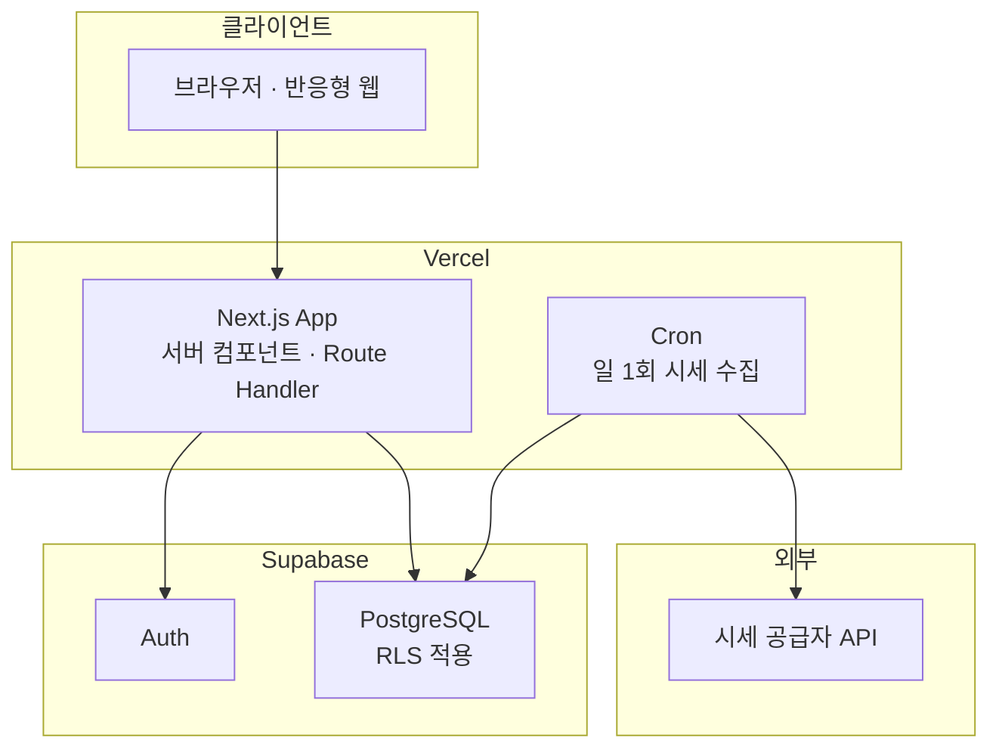

# 아키텍처 및 기술 결정 (ADR)

**언제들어오나** — ELS 통합관리 시스템

| 항목 | 내용 |
|---|---|
| 문서 ID | DOC-010 |
| 버전 | 2.9 |
| 작성일 | 2026-07-26 |
| 작성자 | 민서 |
| 선행 문서 | DOC-001 개요서 v0.4, DOC-002 데이터 모델 v0.5, DOC-007 계산 로직 명세 v0.5, DOC-008 화면 목록 v0.3 |
| 상태 | 검토 중 |

### 변경 이력

| 버전 | 일자 | 작성자 | 변경 내용 |
|---|---|---|---|
| 0.1 | 2026-07-26 | 민서 | 최초 작성. ADR-001 ~ ADR-006 등재 |
| 2.9 | 2026-08-01 | 민서 | **P6 컷 6 — §9에 AQ-66·67 신설, AQ-35 갱신, §5 트리 두 줄. ADR 변경 없고 §7의 권한 설계도 그대로다.** DOC-011 v3.3(§4.4)·DOC-007 v1.0(§4.5)에 따르는 등재다. **(1) AQ-66 — 세율 연도를 차수별로 풀면 «지난 차수 하나»가 화면 전체를 죽인다.** `resolveTaxYear`가 시드 이전 연도를 던지는데 SCR-301은 지난 차수를 구획으로 반드시 렌더하고, 2025년 평가일을 가진 상품은 지금 만들 수 있다(SCR-205는 과거 이력을 옮기는 화면이다). SELECT 정책이 전부 `using (true)`이므로 **남의 상품 하나가 전원에게 500**이 되는 §8.2의 부류다. ★ **처리는 값이 아니라 «호출 인자»를 바꾸는 것이다** — `year(asOf)`로 못박으면 `asOf`가 과거가 될 수 없어 그 분기가 **구조적으로 도달 불가**가 된다. **`resolveTaxYear`를 고치지 «않는» 것이 처리의 절반이며** 그 거부는 §4.6·§5.4가 의존하는 성질이다. 지금은 시드가 2026뿐이라 숫자도 바뀌지 않는다 — 차수별 해석이 사는 것은 크래시뿐이다. 잔여 둘(2027 시드 후 한 목록의 두 세율 · 소유자 필터 시 `tax_years` 두 번 읽기)을 적었다. **(2) AQ-67 — 원천징수 식이 세 자리에 인라인되어 있었다.** 비교과세의 `withheld(F)`와 상환 실적의 §5.4 산출이 같은 곱셈을 각자 적고 있었고 §4.5가 세 번째를 만들 참이었다. **모으지 않으면 이 컷이 저장소를 «더 나쁘게» 만든다** — 사본 셋에 정본을 자칭하는 것이 가장 안 돌아본 것이 된다(`taxConstants.ts`의 머리글이 적은 교훈 그대로). `lib/tax/withholding.ts`로 모으고 **요율이 아니라 `TaxConstants` 묶음을 받게** 했다 — 15.4%와 14%가 둘 다 있고 차이가 지방소득세분이라 요율을 열면 호출부가 고르게 되며 **잘못 고른 결과가 그럴싸한 숫자다.** 값 보존이 조건이고 **TC-01~22가 회귀망이다.** **(3) ★ AQ-35 — 네 번째 자리가 생겼는데 「값이 실증됐다」가 아니라 «이 공백에서 결함이 났다».** DOC-011 §8.1의 일곱째 사례(SCR-301에 다섯 값이 없다)가 여섯째와 **같은 D 부류**이고, 여섯째 뒤에 만든 대조가 SCR-101에만 있다는 사실을 **이 항목이 등재해 두었는데 바로 그 공백에서 났다.** 즉 이 항목은 이제 가설이 아니라 **재발 기록**이며, 나머지 화면 중 하나에서 여덟째가 날 때까지 열려 있다. **(4) §5 트리 두 줄** — `format/schedule.ts`에 상품 그룹, `lib/tax/`에 `withholding.ts`. **(5) DQ 없음** — 스키마·마이그레이션·`db:types`·`tests/rls/`가 전부 무변경이므로 모델 설계 판단이 없다. **부재가 판단임을 적어 둔다**(절대 규칙 #6의 다섯 함정 중 어느 것도 발동하지 않는다: 테이블·뷰·함수·Route Handler·`src/` 디렉터리가 하나도 늘지 않았다 — `withholding.ts`는 기존 `lib/tax/` 안이라 `tests/app/lint-coverage.test.ts`의 글롭에 이미 덮인다) |
| 2.8 | 2026-08-01 | 민서 | **P6 컷 5 — §9에 AQ-65 신설. ADR 변경은 없고 §7의 권한 설계도 그대로다.** DOC-002 v1.0이 `els_products.entry_mode`를 신설한 데 따르는 등재다. **AQ-65 — `entry_mode`를 계약 밖에서 뒤집으면 결함이 숨는다.** AQ-14가 「계약 밖에서 하위 행을 0건으로 만들 수 있다」이고 조회 계층이 그것을 `integrityIssue`로 탐지하는데, 이 열을 `REALIZED_ONLY`로 바꾸면 **그 탐지가 꺼진다.** ★ **새 위험이 아니라 기존 위험의 탐지면에 생긴 구멍이라는 것이 분류의 요점이다** — 결함을 만드는 경로는 이미 열려 있고 이 조작은 그 표시를 지운다. **계약 경로는 구조로 막혀 있다**(`update_els_product`의 payload에 `entryMode`가 없어 함수가 그 열을 쓰지 않는다) **역방향은 DB가 막는다**(I-18의 `CHECK`가 `23514`를 낸다 — 부수로 절반이 닫혔다). 종결 후보 둘 중 **`BEFORE UPDATE` 트리거(ⓑ)가 싸고 확실하다** — I-16이 같은 형태의 선례이고 동일값 재대입을 통과시키므로 열 단위 GRANT(ⓐ)가 `.update()`의 payload 전역 실림과 충돌하는 문제가 없다. 지금 하지 않은 것은 범위 판단이다 |
| 2.7 | 2026-07-31 | 민서 | **P6 컷 1 — §9에 AQ-62·AQ-64를 신설하고 AQ-32 ②의 종결 논거를 정정했다. ADR 변경은 없다.** **(1) AQ-62 — DB 요청에 시간 제한이 없다.** 초크 포인트가 하나인데(`noStoreFetch`가 두 클라이언트 모두에 주입되어 REST·RPC·GoTrue 전부를 지난다) 거기에 `signal`이 없고 Node `fetch`에 기본 타임아웃이 없고 `vercel.json`에 `maxDuration`도 없다. 실사용에서 관측됐다(11건 중 마지막 등록이 몇 분간 pending). ★ **분류가 중요하다** — 네트워크 실패 **자체는 이미 화면에 렌더된다**(postgrest-js가 fetch 거부를 오류 객체로 바꾸므로 액션이 reject되지 않는다). 즉 이 항목은 「실패가 안 보인다」가 아니라 **「실패로 끝나지 않는다」**이며 그 구분이 종결 수단을 정한다. 재시도 버튼은 **멱등 키가 없어 상품을 중복 생성할 수 있다**는 사실을 함께 등재했다. **(2) ★★ AQ-64 — `<select>`의 표시 상태를 증명할 층이 없고, 그것이 AQ-32 ②의 정정을 부른다.** React의 자동 폼 초기화가 요소마다 다르게 동작한다 *(소스 대조)*: `<input>`·`<textarea>`·체크박스는 갱신마다 속성이 재동기화되어 초기화가 **최신값**으로 복원되지만 **`<select>`의 갱신 경로는 `multiple` 토글에서만 옵션을 다시 쓴다** → `defaultSelected`가 마운트 시점에 얼어붙고 초기화가 표시를 「선택」으로 되돌린다. **값에 묶는 것은 악화다**(그 경로는 어떤 옵션에도 `selected`를 찍지 않는다). ★ **어느 스위트도 볼 수 없는 이유가 이 항목의 핵심이다** — SSR은 정상적으로 `selected`를 찍으므로 **`tests/e2e/`가 읽는 서버 HTML은 이미 올바르고** 결함은 하이드레이션 이후에만 존재한다. 여기에 e2e를 더하면 **아무것도 증명하지 않는 초록색**이 된다. **★★★ 그래서 AQ-32 ②의 종결 논거를 정정했다** — 「JS 없는 경로에서 사용자가 보는 것이 정확히 그 속성이므로 근사가 아니다」는 **JS 없는 경로에만 참**이고, 이 결함은 정확히 그 문장이 배제한 갈림이다. 즉 **그 항목이 근사가 아니라고 판정한 대조가 select에 대해서는 결함을 통과시킨다.** 닫힌 행을 다시 쓰지 않고 정정만 남겼다(U-03) — 판정이 JS 없는 경로에 대해서는 여전히 참이므로 「닫혔다」를 뒤집지 않는다. 종결 후보는 **jsdom 컴포넌트 층**이며 AQ-32의 종결 수단(Playwright)보다 훨씬 싸므로 **이 축은 별도로 닫을 수 있다** |
| 2.6 | 2026-07-31 | 민서 | **P5b 컷 10 — AQ-41 해결 · AQ-38 부분 해결.** **(1) AQ-38 — (b)의 전수 확인 결과가 «음성»이다.** URL로 도달하면서 잡히지 않는 던짐이 **0**이다(세 라우트가 `isUuid` 가드 · `searchParams`는 순수 파서 · 페이지 렌더 경로의 `catch`는 `tax/page.tsx` 하나). 그래서 **(c)를 적용**했다 — 판단을 `lib/format/errorNotice.ts`로 옮기고 상시 스위트가 전수로 본다. ★ **옮기다 결함을 찾았다: `error.digest != null`이 빈 문자열을 통과시켜 «내용 없는 회색 칩»을 렌더했다** — 「코드와 함께 알린다」고 적어 놓고 빈 칩을 보여 주므로 **화면은 정상으로 보이고 신고만 성립하지 않는다.** ★★ **`global-error.tsx`에 같은 분기가 중복돼 있었다** — 한 모듈로 모았다. 나눠 두면 한쪽만 고쳐진 상태가 다시 생긴다. 그리고 「경계에서 오류의 종류를 판별하지 않는다」를 **소스 단언으로 고정**했다(행동으로 관측할 수 없으므로 `force-dynamic`과 같은 자리). **닫지 «못한» 것을 명시한다 — 프로덕션 redact 동작 자체는 여전히 미검증이고 그래서 부분 해결이다.** **(2) AQ-41 해결** — 전용 시드 사용자 **둘**(하나로는 안 된다. 두 갈래가 서로 배타적이다). 상품은 시드가 아니라 `beforeAll`이 만든다(글롭이 전역 건수 단언을 깬다). ★ **AQ-41이 경고한 「전체는 초록인데 단독은 빨간불」을 대조로 확인했다** — `db:reset` 뒤 단독 실행 **10건 전부 초록**(전체 128건). 실행 순서가 데이터가 되지 않는다 |
| 2.5 | 2026-07-31 | 민서 | **P5b 컷 9(P5b.5) — 「판단 시점 P5」 재배정과 표식 정정. 설계 변경은 없다.** **(1) AQ-36·37 → P6 · AQ-38·41 → P5b.** 가르는 축은 **「정할 것이 남았는가, 만들 것만 남았는가」**다. 36·37은 문구·레이아웃·셸 유지가 남아 DOC-009에 의존하고, **38·41은 정할 것이 없고 수단이 이미 골라져 있다**(38 — `test:e2e`가 프로덕션 빌드를 띄우며 케이스만 0건 / 41 — 전용 시드 사용자 하나). ★ **P5a = 0이고 그것도 판단이다** — 다섯 중 어느 것도 시세·매핑에 의존하지 않는다(대조군: SQ-08은 P5a가 맞다). P5a는 「닫는 단계」가 아니라 **「분모가 확정되는 시점」**이라 AQ-36에 「오늘의 수를 옮겨 적지 말고 착지 후 다시 세라」를 달았다(AQ-37이 이미 넷→다섯을 겪었다). ★ **묶음을 깨는 대가를 갚았다** — AQ-37에 「선행 = AQ-38」을 남기고 **AQ-38을 닫는 커밋이 「AQ-37이 이 층을 어떻게 쓰는가」를 적는다**(안 하면 P5b가 세운 관측이 아무도 쓰지 않는 층이 된다). **(2) ADR-006의 「플랫폼 실측」을 「플랫폼 인용」으로 고쳤다** — 다섯 행의 출처가 전부 `vercel.com/docs`이고 **운영 인스턴스에서 재보지 않았다.** 값과 출처는 그대로다. ★ **「ADR-006 실측 ①」류 참조 넷이 낱말을 바꾸면 존재하지 않는 이름을 가리켜** 번호 참조로 바꿨다 — **표식은 신뢰도이지 식별자가 아니다** |
| 2.4 | 2026-07-30 | 민서 | **P5b 컷 8 — ADR-007 채택. AQ-01을 닫았다.** **국내는 `data.go.kr` 자동, 해외는 「증권사 통지 → 수동 입력」을 *설계된 정상 경로*로 둔다** — 폴백이 아니다(ELS 약관이 평가가격을 거래소 공식 종가로 정의하고 증권사가 그 값을 통지하므로 **통지가 어느 API보다 정본에 가깝다**. A-04와 일관). **(1) ★ ADR-004의 기준 넷이 불충분했음을 먼저 적었다** — 후보 14종을 그 넷에 대조하니 **넷 중 어느 것도 실제 실격 사유가 아니었다.** 탈락은 거의 전부 **⑤ 저장·공유 약관**과 **⑥ 종가의 정본성**에서 났다. 「개인 프로젝트 허용 여부」를 물으면 대부분이 「예」라고 답하고 **걸리는 것은 저장과 표시인데 그 둘이 목록에 없었다** — 기준 목록이 명제를 판별하지 못한 자리다. **(2) ⑤가 셋으로 갈리고 실격을 낸 것은 (a)가 아니라 (b)다** — 「구독보다 오래 살아도 되는가」에서 **상업 공급자 6곳 중 5곳이 아니다**(Twelve Data 30일 · EODHD 1개월 · FMP 「including data cached」 · Tiingo 「permanently delete」 …). `asset_prices`는 「지울 수 없는 이력」이므로 **상업 공급자를 쓰면 구독 해지가 과세 근거의 소멸을 뜻한다.** (c)는 「무료·폐쇄형·3명뿐」이 **문언에서 선제적으로 배제**돼 해석의 여지가 없다. **(3) KIS는 게이트에서 실격했다** — 약관이 JS 팝업이라 못 읽는다던 보고를 뒤집고 **키 없는 공개 JSON**(28,856B)으로 원문을 받았다. 제5조 ③ 「**개인의 업무에 한하여** … **제3자에게 제공해서는 아니 된다**」가 SCR-302의 「시세는 공용 데이터」와 **구조로 충돌한다.** **(4) 추종 ETF 대체를 2년치 일별 종가로 배제했다 — 논증이 아니라 실측이다.** 가장 유리한 조건(동일 통화·국내 상장·최대 규모)에서도 **KI 배리어 0.81에서 판정이 뒤집힌다**(2025-04-09 지수 0.8041 터치 vs ETF 0.8143 미터치). **KI는 한 번 터치로 상품 성격이 영구히 바뀌므로 그 하루가 원장 전체를 오염시킨다.** 오차가 세 계층인데 **②배당 처리 차이가 연 1.2~2.2%p 단방향 누적**이라 3년 만기면 **배리어 계단 간격 5%p를 한 칸 이상 삼킨다.** **(5) 그 실측이 새 규칙을 하나 낳았다 — `adjclose`를 쓰지 않는다.** 조정종가는 시계열 수익률용이고 배리어 판정은 **미조정 종가**다. **어댑터가 조용히 `adjclose`를 읽으면 형식은 정상이고 값만 거짓이다** — 어댑터 구현의 첫 단언이 이것이어야 한다. **(6) 지수 커버리지의 구멍은 돈으로 안 된다** — 라이선스가 깨끗한 공급자들은 지수를 유료로 빼는 것이 아니라 **데이터셋에 아예 없다**(Tiingo 107,677행에 `assetType=Index` **0건** · Twelve Data는 **Pro에서도** `count 0`). **남은 것 둘을 별항으로 남겼다** — **KI 감시 공백**(해외 자산은 「후보 표시」가 서지 않는다. 확정 경로는 살아 있다 → DOC-008 **SQ-08** 신설)과 **현 포트폴리오의 자동 수집 대상이 0건**(K-02 정정 → DOC-001 §5.1). **★ 「14종」과 「13종」이 원자료에 둘 다 있었고 14로 확정했다** — 대조표의 행이 14개이며 13은 게이트에서 6축 대조 *이전에* 떨어진 KIS를 뺀 수다. 「검토한 후보」와 「6축에 대조한 후보」가 다른데 같은 이름으로 세어져 있었다 |
| 2.3 | 2026-07-30 | 민서 | **P5b 컷 2 — v2.2가 정한 `service_role` 0 DML을 구현했고, 그 구현이 §7.1의 실측 인용 둘을 낡게 만들었다.** 문서가 먼저 있었으므로(v2.2) 이 판은 **구현이 반증한 것을 되받는 정정**이다. (1) **§7.1 케이스 표의 테이블 ACL 인용 둘에 ★ 각주를 달았다** — `{postgres=arwdDxtm/postgres,service_role=Dxtm/postgres}`는 P3b 실측이며, `service_role`의 기본 권한을 회수하자 신규 테이블·시퀀스의 `relacl`이 **`(null)`**이 된다(실측). non-null이었던 **이유가 `service_role=Dxtm` 항목의 존재**였다. `pg_default_acl` 행은 `{postgres=arwdDxtm/postgres}`로 남으므로 행 삭제가 원인이 아니다. **★ 이 변화가 §7.1의 결론을 날카롭게 만든다** — 이제 케이스 A(함수)와 E(테이블)의 ACL이 **둘 다 `(null)`인데 결과가 정반대**이므로, 갈리는 지점이 우리 설정이 아니라 **내장 기본값의 `PUBLIC` 유무**라는 것이 *같은 값의 두 사례*로 확정된다(종전에는 문자열이 달라 값의 차이로 읽힐 여지가 있었다). (2) **`tests/rls/functions.test.ts`의 단언을 뒤집었다** — 종전은 `relacl`이 **non-null**임을 요구했고 그것은 회수가 적용됐다는 증거가 아니라 **회수가 덜 됐다는 증거를 초록으로 읽는** 형태였다. **신규 시퀀스 프로브를 신설했다** — 스키마에 시퀀스가 0개라 카탈로그 축이 항진명제이므로, 실물을 만들어야 그 축이 관측된다. (3) **권한 매트릭스에 롤 차원을 넣었다**(`Table → Role → Privs`, `ROLES` 셋이 열거 원천). 대조 질의를 **전부 `aclexplode`로** 바꿨다 — `information_schema.role_table_grants`가 **`MAINTAIN`을 숨긴다**(실측: `MAINTAIN`만 부여하면 뷰는 **0행**, `aclexplode`는 1행). 종전 질의는 `grantee = 'authenticated'`로 박혀 있어 `service_role`의 8종 권한을 **어느 단언도 보지 않았다.** (4) **음성 대조 여섯으로 항진명제 여부를 확인했다** — 매트릭스 과다·과소, 롤 셀 누락(런타임 + `typecheck` 두 겹), `MAINTAIN`만 부여, 기본 권한 테이블·시퀀스 축. 각각이 예상한 단언만 빨간불이 됐다. (5) 회수 대상 롤을 **`service_role` 하나로** 좁혔다 — `anon`·`authenticated`를 함께 적으면 열 단위 GRANT 둘(`users.id`·`users.display_name`)이 날아가 SCR-502의 표시명 수정이 `42501`이 된다. 회수 후 그 둘이 보존됨을 실측했다 |
| 2.2 | 2026-07-29 | 민서 | **P5b 컷 0 — 배포가 ADR-006의 전제 셋을 반증했다. 코드 0줄이며 문서 선행이다(절대 규칙 #10).** **★ 함께 헤더 표의 버전 드리프트를 정정했다** — 표는 `1.8`을 적고 있었으나 변경 이력의 최신 행은 이미 `2.1`이었다(DOC-000 §1도 `2.1`이다). 즉 **이 문서만 두 곳이 갈려 있었고 교차 확인 지점인 DOC-000이 옳았다.** **DOC-013(배포·운영)을 신설했고** 이 문서는 그쪽으로 넘긴 것과 여기 남는 것을 가른다 — 이 ADR은 「무엇으로 배포하는가」만 정하고 운영·백업·설정의 정본은 DOC-013이다. (1) **ADR-006에 「플랫폼 실측」 다섯을 신설했다.** 넷이 명세를 바꿨다 — ① 호출이 **`GET`**이고 **production 배포만** 부른다(DOC-011 §7.1의 `POST`가 성립하지 않는다) ② 타임존이 **항상 UTC** ③ Hobby는 일 1회 · **정밀도 ±59분**이며 더 잦은 표현식은 배포가 실패한다(O-04의 「일 1회」가 판단이 아니라 **제약**이다) ④ **재시도 없음 · 누락도 중복도 가능**(CR-03의 멱등성이 선택이 아니다) ⑤ **리다이렉트를 따라가지 않고 3xx·캐시 응답은 로그에도 남지 않는다**(`src/proxy.ts`의 `api/cron` 제외가 운영에서 하중 부담 부품이 된다). (2) **환경 분리 표의 `preview` 행을 「미구성」으로 정정했다(U-03).** v0.1의 「PR 단위 검증 · 개발 인스턴스」가 전제한 셋이 **전부 성립하지 않는다** — 붙일 개발 인스턴스가 없고, 두 번째 무료 프로젝트는 7일 저활동으로 계속 정지되며, **가장 큰 것은 Cron이 production만 부르므로 preview 패리티가 애초에 없었다는 것**이다. (3) **「수집 결과를 로깅하여 무음 실패를 방지한다」를 철회했다(U-03)** — 런타임 로그 보존이 **1시간**이고 Cron 정밀도가 ±59분이라 일 1회 배치의 로그는 다음에 볼 때 **사라져 있다.** DOC-011 CR-04를 **감지**(SCR-302의 `isStale`·`as_of_date`·`source` — 영속적이며 **이미 구현돼 있다**)와 **진단**(멱등성을 이용한 재호출)으로 갈랐다. (4) **§6.2에 Cron 시각과 그 근거를 처음 적었다.** v1.8까지 이 문서와 ADR-006은 「일 1회」만 적어 **`vercel.json`이 시각을 혼자 정하게** 되어 있었다. `0 5 * * *` UTC(= 14:00~14:59 KST)는 **어느 거래소 마감도 아니라 `data.go.kr`의 T+1 13:00 KST 게시**를 겨냥한 값이며, 따라서 배치가 넣는 것은 **직전 영업일 종가**고 **`as_of_date`는 `today()`가 아니라 공급자가 준 날짜여야 한다**(그러지 않으면 「형식은 정상이고 값만 거짓」이 된다 — ADR-004 보정의 `asOfDate`가 존재하는 이유). ★ **당일 종가 공급자를 붙이는 날 이 시각은 틀린다**는 조건을 각주로 박았다(14:00 KST는 KRX·TSE·HKEX 마감 전이다). (5) **§7 SEC-03에 클라우드 절반을 신설했다.** 종전 실측은 전부 로컬이고 검증도 로컬뿐이었다 — 클라우드에서 가입이 열려 있으면 정책 32개의 전제가 통째로 무너진다. `supabase config push`가 **`disable_signup = !enable_signup`**을 보내므로(CLI 2.109.1 번들 실측) **저장소의 `config.toml`이 클라우드 값의 정본이 된다**(같은 기전이 DOC-011 AQ-22의 잔여 R1도 닫는다). **반영 시점이 다르다는 것을 함께 적었다** — 「`db reset`으로 반영되지 않는다」는 **로컬 경로에만 참**이고 `config push`는 즉시 반영된다. (6) **§7.1 규약 표에 `service_role` 행을 추가하고 종전 판단을 철회했다** — 「기본 권한 규약을 `service_role`에는 적용하지 않는다」가 *부여*를 걱정한 서술이었고 필요한 것은 *회수*다. 실측: `pg_default_acl`에 `service_role=Dxtm`(테이블)·`w`(시퀀스)가 있어 **신규 테이블이 DELETE·TRUNCATE를 자동으로 받는다** — 즉 「0 DML」이 미래 테이블에는 거짓이고 AQ-11의 CASCADE 위험이 그쪽에 살아 있다. (7) **§7.2에 `CRON_SECRET`을 등재했다.** 「빈 문자열 = 부재」가 여기서 특히 중요한 이유(빈 값이면 `Bearer `로 시작하는 **모든** 헤더가 일치한다)와, 오류 메시지에 `process.env`라는 **문구**를 쓰면 `no-service-role.test.ts`의 정확 일치 단언이 깨진다는 함정을 함께 적었다. **`SUPABASE_SECRET_KEY`는 등재하지 않았다 — 필요한지가 미결이기 때문이다**: 실측으로 두 가드가 상호배타적임이 드러났고(`src/app/**`는 `@supabase/*`를 import할 수 없고 `src/lib/db/**`는 `service_role` 문자열을 담을 수 없다) **대안(전용 GoTrue 서비스 계정)이 새로 만들 것 없이 이미 존재한다.** (8) **AQ-04 종결**(주 1회 로컬 덤프 — 실측 셋이 수단을 정했다: Free는 자동 백업 없음 · 직결이 IPv6 전용 · **저장소가 공개**) · **AQ-11 정정**(과다 방향은 P5b 컷 2, 필요분 명시는 P5a 컷 4. 등재문의 「`asset_prices` UPSERT」는 CR-05를 전제한 서술이며 AQ-06이 뒤집히면서 UPDATE가 불필요해졌다). (9) **§5 모듈 트리에 `app/api/cron/prices/`의 성질과 `lib/cron/`을 추가했다** — 판정을 라우트 안에 두면 **어느 상시 스위트도 실행하지 않고** 「`CRON_SECRET` 미설정」 갈래를 결정적으로 만들 수 없다 |
| 2.1 | 2026-07-29 | 민서 | **P4b 컷 8 — AQ-41 신설, §6의 SCR-402 칸 셋이 섰다.** **AQ-41 — SCR-402의 빈 상태 갈래 둘을 어느 층도 렌더하지 않는다.** 판정은 순수 함수로 떼어져 상시 스위트가 세 축을 전부 보므로(잔여 원금 축이 E-07 케이스다) 남는 미검증은 **「그 판정이 그 마크업으로 이어진다」** 한 줄이다. 원인은 픽스처의 구조다 — 두 갈래 모두 「그 소유자의 **모든** 상품이 …이다」를 요구하는데 e2e 픽스처를 **공유 사용자**에 등록해야 했다(전용 둘에 상품을 더하면 `home.test.ts`의 값 단언이 깨지고, 그 정확한 단언이 AQ-34가 전용 사용자를 만든 이유다). **★ 초안이 전용 사용자를 빌려 쓰려다 함정을 실측으로 만났고 그것을 등재의 본문으로 남겼다** — `E2E_PAST`의 상품은 시드가 아니라 `home.test.ts`의 `beforeAll`이 만들므로 전체 스위트에서는 8건 전부 초록이었는데 `db:reset` 뒤 그 파일만 돌리자 **5건이 빨간불**이 되었다. **실행 순서가 데이터인 초록색**이었고, 고친 결과가 「자기 픽스처를 자기 `beforeAll`에서 만든다」다. 닫는 수단은 전용 시드 사용자 하나이며(AQ-34가 쓴 수단 그대로) **판단 시점은 P5** — 같은 부류(§6 빈 상태의 「아예 없다」 갈래 넷)를 한 번에 닫는 것이 화면마다 사용자를 늘리는 것보다 싸다. 함께 갱신: **AQ-37에 다섯 번째 자리**(SCR-402의 에러 칸도 `app/error.tsx`로 접힌다) · **AQ-36은 예고대로 「계산 중」을 남긴다** · **AQ-35의 두 번째 자리는 컷 7에 이미 섰다** |
| 2.0 | 2026-07-29 | 민서 | **P4b 컷 7 — AQ-35의 두 번째 대조 축이 섰고 P4.5가 그 항목에 적은 정정이 함께 닫혔다.** `tests/app/forecast.test.ts`가 DOC-008 §5 SCR-402의 ①~⑫를 파싱해 `keyof ForecastRow`와 대조한다. **SCR-101의 자리를 그대로 베끼지 않았다** — P4.5가 이 항목에 적은 「SCR-101도 짝짓기는 기억에 있다(마커 집합과 대응표의 **키**만 비교하므로 문구를 맞바꿔도 통과한다)」가 여기서 닫혔다: 대응표가 라벨을 함께 들고 **마커 ↔ 라벨의 짝짓기**를 대조한다. 실측 — ⑧·⑪의 라벨을 맞바꾸면 그 케이스만 빨간불이 되고 마커 집합 대조는 초록으로 남는다. **그 자리를 만든 방법도 규율이다**: 「파서가 열둘을 찾았다」를 두지 **않았다** — 위 `toEqual`에 완전히 함축되어 탐지력이 0이므로(AQ-40이 등재한 부류를 새로 만들지 않는다) 그 자리를 짝짓기에 썼다. **SCR-101의 짝짓기는 여전히 기억에 있고** 그것을 옮기는 것은 P6의 권고 (a)에 포함한다 |
| 1.9 | 2026-07-29 | 민서 | **P4b 컷 6 — AQ-39를 닫았다.** v1.8이 정한 채택 방식(손으로 적은 역 인덱스가 아니라 기존 표에서 파생하는 타입 수준 witness)을 그대로 구현했고, **그 행이 예고한 세 가지가 전부 그대로 일어났다** — witness가 `listUserSummaries`를 즉시 빨간불로 만들었고 답은 화이트리스트가 아니라 **등재**였으며(`getTaxSummary`와 같은 일곱 자리), `staleRoutesFor`는 달라지지 않았고(`STALE_ROUTES` 불변), `as const`가 `.includes`의 파라미터를 `never`로 좁히는 것이 두 자리에서 발화했다. 등재는 **개수가 아니라 `getTaxSummary`와의 집합 동일성**으로 박았다 — 컷 8이 `/forecast`를 대리 기준에서 실명 계약으로 옮길 때 결과가 같다는 근거가 그것이므로, 일곱이라는 수만 적으면 어느 일곱인지 갈려도 통과한다. **음성 대조의 탐지력을 실측했다**(지시자를 떼고 `TS2322` 메시지에 빠진 계약명이 나오는 것을 확인) **그리고 양성 대조를 함께 두었다** — `Without<never>`가 조용해야 그 발화가 변환이 만든 거짓 양성이 아니다. 그 줄이 없으면 탐지력 0인 음성 대조가 초록으로 보인다. 실측: `npm run test` 757 → **759** · `typecheck`·`lint` 오류 0 |
| 1.8 | 2026-07-29 | 민서 | **P4b 컷 4 — AQ-39의 채택 방식을 정하고 AQ-35에 두 번째 대조 축을 예고했다. 본 버전은 선행 명세다 — 구현은 컷 6이다. 둘 다 닫지 않는다.** **AQ-39** — 권고 (b)의 역 인덱스(`AFFECTED_BY`)를 **그대로 쓰지 않기로 했고 그 사유를 그 행에 적었다**(기록된 권고를 코드로 조용히 뒤집지 않는다 — 절대 규칙 #10). 손으로 적은 `Record<QueryName, …>`는 **항목의 존재만 강제하고 `[]`가 합법이므로** 「어느 `affects`에도 없는 조회」를 잡는 대신 **「빈 항목」으로 옮겨 놓을 뿐**이고, 같은 지식이 두 표에 손으로 적혀 **「단언이 아니라 파생」이라는 이 항목 자신의 근거를 위반한다.** 대신 기존 표 하나에서 파생하는 **타입 수준 witness**를 쓴다 — `Exclude`가 비어 있지 않으면 컴파일이 깨지고 **오류 메시지에 빠진 계약 이름이 나온다.** 같은 관용구가 `tests/app/dashboard.test.ts`(컷 9)에 이미 있으므로 새 어휘를 들이지 않는다. 부수로 확인: witness를 세우면 **`listUserSummaries`가 즉시 빨간불**이고 **화이트리스트가 아니라 등재가 정답**이다(그 계약은 실제로 상품·프로필을 읽으므로 비어 있던 것이 결정이 아니라 결함이었다). 그 등재가 `staleRoutesFor`를 바꾸지 않음을 확인했으므로 손으로 적은 `STALE_ROUTES`는 불변이다. **AQ-35 보완** — DOC-008 §5 SCR-402의 요소 셀을 ①~⑫로 정본화해 이 항목의 권고 (a)를 **두 번째 화면에 대해 실행한다.** 그 셀이 v1.2까지 마커 없는 아홉 개였고 「총자산」은 각주에만 있어 **열 목록과 계약 필드가 이미 갈려 있었다** — 이 공백의 값이 P4.5의 다섯 자리에 이어 여섯 번째로 실증되었다. **나머지 열 화면과 판단 시점 P6은 그대로다** |
| 1.7 | 2026-07-29 | 민서 | **P4b 컷 1 — Q-06 사문화를 닫는 커밋의 문서 선행. AQ-38 ③이 역사가 되고 AQ-40 ③의 사실 오류를 정정했다. 둘 다 닫지 않는다.** **AQ-38** — ①의 상수 이름을 갱신하고(`SERVER_MAX_ROWS` → `APP_MAX_ROWS`) **③을 역사로 옮겼다**: DOC-011 AQ-22가 임계를 서버 상한보다 하나 작게 파생시켰으므로 「그 예외는 지금 발화할 수 없다」는 더 이상 참이 아니다. **그런데 레버로는 여전히 못 쓴다** — 발화에 999행을 넘겨야 하고, 그것은 P4.5가 손으로 만들고 삭제한 1,201행 픽스처를 스위트에 상주시키는 일이다. ①②(틀린 상수 · 린트가 환경 변수 경로를 구조로 금지)는 이름만 바뀌었을 뿐 그대로이므로 **후보 (b) → (c)와 판단 시점 P5를 유지한다** — 세 겹 중 하나가 풀렸다고 항목이 닫히지 않는다. **AQ-40 ③** — 이름을 좁히고(수단 (a)) 임베드로 바꾸는 (b)는 **하지 않았다.** 제목을 「요청 상한이 거부되지 않는다」로 본문에 맞췄고, 같은 자리의 주석이 적고 있던 「설정과 상수가 **일치해야 한다**」도 고쳤다 — v2.2에서는 참이었고 이제 **일치가 곧 결함**이다(관계는 `<`다). (b)를 하지 않은 이유가 이 항목의 취지와 같다: 임베드 축을 참으로 만들려면 부모 하나에 1,000행 넘는 자식 픽스처가 필요한데, **약한 임베드 질의로 제목만 참으로 만드는 것은 같은 죄를 새 자리에서 짓는 것**이다. 그래서 그 축은 이름 안에 숨기지 않고 DOC-011 AQ-22의 잔여 ④로 **따로 등재했다.** **그리고 이 행의 사실 오류 하나를 정정했다** — 「대상 테이블은 0행」이 틀렸다(`asset_prices`는 그 파일의 `beforeAll`이 시드한 **6행**이다). 항진명제라는 판정 자체는 행수에 의존하지 않으므로 유지된다 — **근거로 든 숫자만 거짓이었고, 그것을 고치지 않으면 다음 사람이 재확인했을 때 항목 전체를 의심한다.** ①②④는 그대로 미결이다 |
| 1.6 | 2026-07-29 | 민서 | **P4.5 — §9에 AQ-36~40 다섯 신설, AQ-35 보완.** 등재의 기준은 「구현하지 않는 것과 분류하지 않는 것은 다르다」이며, 다섯 중 넷은 P4 종료 대조가 **어느 원장에도 없다**고 판정한 자리다. **AQ-36 §6 「로딩」 열의 미구현** — 여덟 칸 중 **다섯**이 0건이고(부재를 4변형으로 확인) 같은 표의 폼 로딩 **두 종이 세 칸을** 채워 **비대칭**이며, 그 셋조차 `useFormStatus`에만 있어 **JS 없는 경로에서 한 칸도 남지 않는다.** AQ-32와 다른 항목이다(저쪽은 관측 수단의 부재, 이쪽은 구현의 부재 — 수단이 생겨도 볼 것이 없다). **AQ-37 §6 「에러」 열의 접힘** — 네 화면이 한 문구로 수렴하고, `error.tsx`가 종류를 판별하지 않는 기록된 논거가 「어느 **화면**인가」를 덮지 못한다. **AQ-38 에러 경계의 검증 공백 — 그리고 그 관측을 세우려던 레버가 사문화되어 있다.** 후보(`TRUNCATION_PROBE_LIMIT`를 낮춰 Q-06 예외를 유발)가 세 겹으로 틀렸다: 레버가 틀린 상수이고(예외는 `SERVER_MAX_ROWS`와 비교한다), 린트가 `src/lib/db/**`에서 `process.env`를 구조로 금지하며, **무엇보다 그 예외는 지금 발화할 수 없다.** 실측으로 확정했다 — `asset_prices`에 1,201행을 넣고 `limit=1001`·`limit=1200`을 요청했더니 **둘 다 1000행**이 돌아왔다(`Content-Range: 0-999/*`, 상태 **200**). `PGRST_DB_MAX_ROWS=1000`과 감지 임계 1000이 같은 값이므로 `rows.length > 1000`은 영원히 거짓이다(픽스처는 삭제했고 잔여 0). 그 정정을 DOC-011 AQ-22에 적었다 — 잔여의 성격이 「실측 부재」에서 **「가드가 사문화되어 있다」**로 바뀌었고 고치는 방향 둘을 함께 적었다. **AQ-39 `affects`의 조회 축 비전수** — 변경 축은 `Record<MutationName, …>`이 컴파일로 강제하는데 조회 축에 그 대칭이 없어 **어느 `affects`에도 없는 조회 계약**이 아무 단언도 깨뜨리지 않는다. 지금 `listUserSummaries`가 그 구멍에 있고(무해하지만 그것이 **기록된 결정이 아니라 우연**이다) P4b의 `getForecast`가 같은 자리에 들어온다. 절대 규칙 #6이 열거하는 fail-open과 같은 형태이므로 권고는 **단언이 아니라 파생**이다(AQ-30 잔여 ③을 닫을 때와 같은 근거). **AQ-40 단언의 이름이 본문보다 넓은 열** — 지목된 넷(항목 표시 「여섯」이 다섯만 · 「조정값」이 안전한 두 축만 · 「임베드 배열에도」가 평면 select · 홈 빈 상태가 구성상 참) 모두 **이름을 좁히는 것이 코드보다 싸다.** 음성 결과도 남겼다: 스킵·`todo`는 이 저장소에 0건이다. **AQ-35 보완 — 이 공백의 값이 실증됐다**(정본 셀 넷 + E 부류 하나가 P4.5 대조에서 나왔다). 한 가지가 좁혀졌다: SCR-101도 **짝짓기는 기억에 있다**(단언이 마커 집합과 대응표의 **키**를 비교하므로 문구를 맞바꿔도 통과한다) — 기계적으로 대조되는 것은 요소의 증감이다 **★ 이 버전은 적대적 반증을 지났다** — 5축 반증이 이 커밋의 주장에서 결함을 냈고 전부 정정했다(BLOCKER 2종: 「실측 1,028개」가 계산값 1,027이고 그 주소는 `<option>`을 0개 렌더한다 · 음성 대조 표 두 줄의 건수. WRONG: V-19 인용이 거짓이었다(§6의 V-19는 문자열 길이 규칙이며 `/^\d+$/`는 구현이 ID 재사용 규약으로 빌린 것 — **내가 닫으려던 부류를 내가 만들었다**) · 「추가납부가 양수」가 0이다 · AQ-36의 「여덟 칸 중 여섯」이 다섯이다 · `worstOf`를 담는 뷰가 셋이 아니라 넷이다 · 문서 접두사 없는 § 참조 다섯 · 항진명제 케이스 둘 · 퇴화 픽스처 하나 · DOC-000 버전 표 드리프트 다섯 행). |
| 1.5 | 2026-07-29 | 민서 | **P4 컷 10 — §9에 AQ-35 신설, AQ-33 보완, P4 종료 반영.** (1) **AQ-35 — DOC-008 §5의 「주요 요소」 ↔ 뷰 필드 대조가 SCR-101에만 있다.** 컷 9가 드러낸 결함(⑤에 자료원이 없었다)이 그 대조의 부재였고, 그것은 DOC-011 §8.1이 분류한 넷 중 **계약 문서 안에서는 보이지 않는 유일한 부류**다. 지금 SCR-101만 기계적으로 대조되며 나머지 아홉 화면이 옳다고 볼 근거는 사람의 기억뿐이다 — 권고는 화면별 대응표이고 판단 시점은 P6(DOC-009를 쓰며 요소를 다시 열거하는 단계)이다. (2) **AQ-33 보완 — `supabase/dev/`의 존재 이유가 한 번 더 좁아졌다.** 컷 6이 「유일한 경로」를 ergonomics로 바꿨고, 컷 9의 `tests/e2e/helpers/defects.ts`가 같은 기법으로 결함 둘을 스위트 안에서 만들면서 「ST-06 검증의 유일한 방법」도 참이 아니게 되었다. 남는 이유는 **브라우저로 눈으로 보는 편의 하나**이며 실측으로 두 파일이 그대로 적용됨을 확인했다(12행 + 2행, 오류 0). **닫지 않는다** — 편의가 계약 우회(V-10·원천징수 산출)를 정당화하지 않는다. (3) **P4 종료.** 화면 12개가 전부 섰고 자리표시는 `/forecast` 하나(P4b — 화면이 아니라 계약 신설)다. 스위트 **697 + 169 + 219 + 108** |
| 1.4 | 2026-07-29 | 민서 | **P4 컷 9 — AQ-34 종결 + §5 트리에 컷 7·8·9 산출물 등재.** (1) **AQ-34를 권고 (a)로 닫았다** — `supabase/seed/04_e2e_user.sql`의 e2e 전용 사용자이며 **둘이다.** 하나로는 안 되는 이유가 그 항목의 조건에 있다: 상태의 정의가 「다가오는 차수가 하나도 없다」인데 SCR-101 ①의 내용은 그 반대를 요구하므로, 한 사용자로 둘을 만들면 「먼저 빈 상태를 보고 나중에 상품을 만든다」가 단언의 전제가 된다 — **순서가 데이터인 초록색**이다. 그 항목이 「확인이 필요하다」고 적어 둔 RLS·`listUserSummaries` 단언과의 충돌을 실측으로 배제했다(전부 id 필터 또는 `.find()`이므로 고정 건수 단언이 없다). **부수 효과가 항목보다 크다** — 전용 사용자의 `scope='MINE'` 집계를 **값으로** 단언할 수 있게 되었다(다른 스위트의 커밋된 픽스처가 섞이지 않는다). (2) **§5 트리에 `components/schedule|tax|home`·`lib/format/schedule.ts`·`lib/format/dashboard.ts`·`seed/04` 등재.** 후자에 근거를 적었다 — 「임박」의 경계와 표시 건수는 **계약이 화면에 넘긴 판단**이고(DOC-011 §4.1이 기간 창을 두지 않는다) 화면 안에 두면 AQ-23의 공백에 들어가므로 순수 모듈에 둔다. (3) 스위트 재측정: **695 + 169 + 219 + 104** |
| 1.3 | 2026-07-29 | 민서 | **P4 컷 7 — §9에 AQ-34 신설.** SCR-301의 셋째 빈 상태(§6 「예정 평가일 없음」 = 전 차수 경과 상태)를 **어느 스위트도 렌더하지 않는다.** 조건이 「한 소유자의 전 상품이 전 차수 경과」인데 e2e의 두 사용자가 integration의 커밋된 픽스처를 공유하고 그중 하나가 미래 평가일을 갖는다 — **다른 스위트의 데이터가 이 상태의 성립을 막는다.** AQ-32와 부류가 다르다(저쪽은 관찰 수단이 없고 이쪽은 데이터 상태를 만들 수 없다). 그 분기의 **입력**은 검증된다(`splitByPast`가 지난 것만 있는 목록에 `upcoming = []`를 낸다) — 남는 것은 문구가 그 자리에 렌더된다는 것 하나다. 권고 수단은 e2e 전용 사용자이고 판단 시점은 컷 9다(SCR-101의 「임박 평가일 없음」이 같은 형태이므로 함께 닫힌다) |
| 1.2 | 2026-07-28 | 민서 | **P4 컷 5·6 — §9의 판단 시점 하나에 도달했고 항목 하나가 새로 열렸다.** (1) **AQ-32의 잔여 셋이 둘로 줄었다.** 이 항목이 「판단 시점은 SCR-203·204가 서는 컷 4b~6」이라고 스스로 지정했고 그 컷이 끝났다. **②(입력값 보존의 UI 수준 확인)는 닫는다** — 사용자가 JS 없이 보는 것은 서버가 렌더한 문서의 `value` 속성이고 `tests/e2e/`가 그것을 직접 본다(쉼표까지 원문 그대로 살아 있음을 확인했다). **①(ST-04 숨김 vs 비활성화)은 좁아졌다** — 비활성화라는 표현 수단이 코드에 없고 소유자/타인 대조가 음성 대조로 갈린다. 남는 잔여는 「요소가 있으면서 CSS로 숨겨졌을 가능성」이며 그것을 만드는 코드 경로가 없다. **③(라우터 캐시)은 그대로**이고 Playwright는 도입하지 않는다. (2) **AQ-33 신설 — `supabase/dev/` 표본의 상환·KI가 계약을 우회한다.** 상품은 `create_els_product`를 부르지만 상환은 SQL 함수가 아니라 PostgREST `.insert()`이므로 psql에서 부를 대상이 없고, 그래서 표본이 **계약으로 도달할 수 없는 상태를 담을 수 있다**(V-10과 원천징수 산출은 계약 계층에만 있다). 컷 6이 네 상태(④⑦⑧⑫)의 **앱 도달 가능성을 실측했으므로** 대체 수단은 실재하며, 남는 것은 한 명령으로 12상태를 재현하는 편의와 그 대가다 |
| 1.1 | 2026-07-28 | 민서 | **P4 컷 2·3 — §5 트리에 산출물 등재 + `supabase/dev/` 신설.** (1) **`supabase/dev/`가 트리에 들어왔다** — `seed/`의 `sql_paths`가 글롭이므로 표본 상품을 그쪽에 두면 `tests/integration/`의 **필터 없는 전역 건수 단언**이 잘못된 이유로 깨진다. 글롭 밖에 두고 `db:reset`이 지우게 하면 격리가 규율이 아니라 구조다. **사용자만 예외로 `seed/`에 둔다** — 그쪽 단언은 전부 id로 필터하고, 매 리셋에 살아 있어야 로그인할 수 있다. 표본은 손으로 INSERT하지 않고 `create_els_product`를 부른다(계약과 같은 함수 → I-07·CHECK 강제, `owner_id`는 `auth.uid()`). **실측한 함정 하나를 CLAUDE.md에 적었다**: `set local role`은 트랜잭션 안에서만 동작하고 밖에서는 경고만 남기며 `postgres`가 `rolbypassrls`이므로 **빠뜨림이 실패가 아니라 조용한 성공**이 된다. 그래서 dev 스크립트가 `current_user`와 `auth.uid()`를 스스로 단언한다. (2) **§5 트리에 `components/products`·`components/display|state|form`·`lib/forms/query.ts`·`tests/app`·`tests/e2e` 등재.** (3) `tests/app/invalidation.test.ts`의 원장이 **둘로 갈렸다** — `NOT_YET_BUILT`(파일 없음)와 `placeholderRoutes()`(자리표시). 자리표시를 세우고 앞의 표에서 지우면 숫자만 줄어들어 「화면이 섰다」로 읽히므로 **합계를 단언한다**. 계획 §4의 `grep PendingScreen` 절차가 테스트가 되었다 |
| 1.0 | 2026-07-28 | 민서 | **P4 착수 전 선행 정정 (U-01).** (1) **§5 트리에 `src/proxy.ts` 등재 — `middleware.ts`가 아니다.** Next 16.2.12 실측: `PROXY_FILENAME = 'proxy'`(`next/dist/lib/constants.js:289`), `middleware` 규약은 deprecated이며 두 파일이 함께 있으면 빌드 에러(`build/index.js:645,651`), `Route segment config is not allowed in Proxy file — Proxy always runs on Node.js runtime`(`build/analysis/get-page-static-info.js:587`). **마지막 사실이 위험 하나를 없앴다** — 구 Edge 런타임이었다면 `env.ts`의 `process.env[name]`이 계산된 멤버 접근이라 인라인되지 않아 요청 시점에 던졌을 것이고, 프록시는 전 경로에 걸리므로 앱 전체가 죽었을 것이다. (2) **"`next`를 import하는 유일한 파일"이 거짓이 되었다** — 둘이다. 린트 경계(`DB_NEXT_BOUNDARY`)는 넓히지 않고 **위치로 유지한다**: 프록시는 `src/lib/db/**` 밖이며 `@/lib/db/client`의 어댑터만 가져다 쓴다. 대가로 AQ-23의 공백이 한 파일 넓어지고 그것을 `tests/e2e/`가 받는다. (3) **스위트가 넷이 되었다** — `tests/e2e/`(`next build` + `next start`) 신설. 앞의 셋이 구조적으로 볼 수 없는 것(리다이렉트·응답 헤더·`NextResponse.redirect()`의 쿠키 유실)을 브라우저 없이 실 HTTP로 본다. (4) §5 트리에 `lib/format`·`lib/forms`·`lib/routes`·`lib/auth`·`app/error.tsx` 등 P4 산출물 등재, `api/cron`이 프록시 매처 예외임을 명기 |
| 0.9 | 2026-07-28 | 민서 | P3b 산출물 대조 검증(P3b.5)에 따른 정정. (1) **§9 AQ-19 보완 — 드리프트 대조의 축이 열 *이름*뿐임을 명시.** `types-drift.test.ts`가 비교하는 것은 테이블별 열 이름 집합이고 **널 허용은 보지 않는다.** `numeric` 열 목록은 정확 배열로 고정되어 타입 축이 부분적으로 막혀 있으나, **함수의 `Returns`는 대조 대상이 아예 아니다**(파서가 `Tables:` 블록만 읽는다) — 그 값이 DOC-011 §5.2 각주가 말한 `update_els_product`의 `string` vs `string \| null`이며 복원은 여전히 사람이 기억하는 규율이다. (2) **§7·§9 AQ-28에 `search_path` 축 추가** — 함수 축을 전 열거하면서 `prosecdef`·`PUBLIC`의 `EXECUTE`·롤별 실행 가능 목록 셋만 보고 `proconfig`를 보지 않았다. `set search_path = ''` 없이 추가된 함수가 조용히 통과하는 상태였다. P3b.5가 전 함수 열거 단언을 추가했다. (3) **AQ-23 재확인** — P3b.5 감사가 `src/app/actions.ts`·`src/lib/db/server.ts`가 세 스위트 전부의 밖에 있음을 독립적으로 확인했다. **등재 내용이 실제와 일치하며 새로 발견된 공백은 없다.** 상태·닫히는 조건 모두 변경 없음 |
| 0.8 | 2026-07-28 | 민서 | P3b 구현 완료 반영. (0) **§7.1에 AQ-28의 *이유*를 등재 — 네 케이스 실측.** 종전 서술은 "`alter default privileges`가 함수에 적용되지 않는다"까지만 적어 설정 실수로 오해될 수 있었다. 원인은 그런 종류가 아니다: `pg_default_acl` 항목은 내장 기본값을 **대체하지 않고 그 위에 얹히고**, 함수의 내장 기본값에는 `EXECUTE TO PUBLIC`이 있다 — 저장 목록에서 `PUBLIC`을 빼도 **뺄 것이 없으며**(케이스 B) 내장 기본값이 다시 부여한다(케이스 D에서 저장 목록에 `PUBLIC`이 없는데도 객체 ACL에 `=X/`가 나타난다). 케이스 A의 `proacl = null`은 "권한 없음"이 아니라 "내장 기본값 그대로"이며 함수에서 그것은 전면 개방이다. 테이블 대조(케이스 E)로 **차이가 우리 설정이 아니라 내장 기본값에 있음**을 확정했다 — 설정으로는 닫을 수 없고 함수마다 개별 `revoke`가 유일한 수단이다. (0-1) **AQ-23의 닫히는 조건을 명시** — 방어를 고르지 못해 열린 것이 아니라 **실행할 진입점이 없어** 열려 있으며, P4 선행 조건 ②③④와 같은 작업에서 함께 닫힌다(DOC-000 §3). (1) **§9 AQ-23 보완 — 공백이 넓어졌다.** `server.ts`에 `getMutations()`가 생겼고, 그 안의 **미인증 분기(W-03)**와 **쓰기 가능 쿠키 어댑터**는 조회에 없던 경로인데 같은 이유로 테스트 그래프 밖이다. `src/app/actions.ts`에 위임 외의 로직을 두지 않은 것이 그 공백의 크기를 제한하는 유일한 수단이다. (2) §5 트리에서 `integration/`의 범위를 조회·변경으로 넓히고 **쓰기 함수의 원자성이 그 스위트에서만 측정된다**는 사실을 명기. (3) ADR-004 — 인터페이스를 `src/lib/providers/types.ts`에 코드로 확정하고 레지스트리를 **빈 배열로** 두었다(§5.8이 `PROVIDER_UNAVAILABLE`을 반환하는 근거) |
| 0.7 | 2026-07-27 | 민서 | P3b 변경 계약 착수에 따른 정정. **본 버전은 선행 명세다 — 구현은 P3b 3단계 이후.** (0) **§7에 함수 권한 축 신설 + §7.1 규약에 함수 행 추가.** DOC-011 §5.1·§5.2가 쓰기 함수 2개를 도입하는데, 함수는 `EXECUTE`가 **기본으로 `PUBLIC`에 부여**되고 `SECURITY DEFINER`로 쓰면 RLS가 통째로 우회된다 — 뷰의 `security_invoker`(AQ-20)·신규 테이블의 TRUNCATE와 같은 fail-open 부류다. **카탈로그 테스트의 모든 질의가 `relkind = 'r'`이므로 함수는 현재 전 단언 밖에 있다.** §9 **AQ-28 신설**. (1) **§9 AQ-14를 부분 해소로 갱신** — 쓰기 함수가 하위 행 수를 검사하므로 I-07의 예방이 계약 경로에서 두 층이 된다. 계약 밖(수동 SQL·직접 호출)은 여전히 한 층도 없다. (2) **§6.3 상환 처리 흐름의 "`lib/domain` 재계산 검증"을 정정(U-03)** — A-04와 DOC-011 §4.3은 증권사 확정값을 시스템 추정값으로 대체하지 않는다고 규정하고 §5.4에는 그런 반환 필드도 없다. 실제로 순수 모듈이 하는 일은 **원천징수 기본값 산출**이다. (3) **§5 모듈 구조에 `db/mutations/`·`db/validate/`·`providers/`·`app/actions.ts` 등재.** (4) **ADR-004에 인터페이스 확정과 공급자 0개 동작 기록** — 등록 공급자가 없으면 `refreshPrices`는 `PROVIDER_UNAVAILABLE`이며 스텁 값을 `asset_prices`에 넣지 않는다 |
| 0.6 | 2026-07-27 | 민서 | P3a 산출물 대조 검증(P3a.5)에 따른 정정. (1) **§9 AQ-23 신설** — 조회 계층 **바깥 경계**가 검증되지 않는다. `src/lib/db/server.ts`는 `next/headers`를 import하므로 테스트 그래프에서 의도적으로 제외되어 있고, 그 결과 `cache()`가 기준일·`getUser()`를 요청당 한 번으로 접는지, `viewerId`가 실제로 `getUser()`에서 오는지를 **아무 테스트도 실행하지 않는다.** DOC-011 Q-02를 "구조로 보장한다"고 적었으나 그 구조의 유일한 프로덕션 진입점이 검증 밖이다. 반대편 경계(뷰 → 클라이언트 직렬화)도 소비자가 없어(P4) 미검증이다. AQ-21과 같은 형태의 구멍이다. (2) **AQ-19 보완** — 타입 게이트를 우회하는 손수 작성 select 문자열 2곳을 등재 |
| 0.5 | 2026-07-27 | 민서 | P3a 2단계 **적용 + 실측 정정**. v0.4가 선행 명세로 예고한 설정 변경을 실제로 적용하고, 실측이 명세와 갈린 두 곳을 고쳤다. (0) **§7 SEC-03에 가입 차단의 실측 증거(전 `200` + 토큰 발급 + `users` 3행 전량 / 후 `422 signup_disabled`)를 표로 등재.** (1) **`[auth.email].enable_signup`은 끄지 않는다 — 계획 D10의 정정.** 그 값은 GoTrue의 `EXTERNAL_EMAIL_ENABLED`로 매핑되어 이메일 **로그인**까지 막는다(`422 email_provider_disabled`). 가입 차단은 `[auth].enable_signup` 하나로 성립한다. (2) **SEC-03을 검증하려다 로그인 자체가 `500`으로 죽어 있었음을 발견** — 시드의 `auth.users` 토큰 열 4개가 `NULL`. 시드를 고치고 **§9 AQ-21 신설**(인증 경로는 RLS 스위트가 구조적으로 지나지 않는다) |
| 0.4 | 2026-07-27 | 민서 | P3a 조회 계약 착수에 따른 정정. **본 버전은 선행 명세다 — 설정·마이그레이션 적용은 P3a 2단계 이후.** (0) **§7 SEC-03에 공개 가입이 실제로 열려 있었음을 기록하고 닫는다** — 로컬 설정의 `enable_signup`이 `true`이고 이메일 확인도 꺼져 있었다. P3a가 공개 키를 브라우저에 처음 싣는 단계이므로, **정책 32개가 전제하는 "아무나 `authenticated`가 될 수 없다"가 설정에서 깨진 상태**였다. RLS·GRANT·권한 매트릭스 테스트는 모두 그 롤 **안에서의** 분리만 검증하므로 누가 롤에 들어오는지는 어느 테스트도 보지 않는다. (1) **§7 권한 표의 `users` 조회를 열 단위로 축소** — 조회 계약 어디도 `email`을 쓰지 않는다(P2 이월 판단). (2) **§5 모듈 구조에 `lib/db` 하위와 테스트 스위트 3분할 반영.** (3) **§7에 환경변수 규약 추가** — 공개 키만 클라이언트 경로에 두고 `service_role`은 조회 경로에서 사용하지 않는다. (4) **§9 AQ-19·AQ-20 신설**(타입 생성 드리프트, 뷰의 `security_invoker`), AQ-14에 조회 계층의 대응 각주 |
| 0.3 | 2026-07-27 | 민서 | P2 산출물 대조 검증(P2.5)에 따른 정정. (0) **§7.1의 "GRANT 있음 + RLS 켜짐 + 정책 없음 → 기본 거부"에 TRUNCATE 예외 명기** — RLS는 TRUNCATE에 적용되지 않으므로, 규약(`enable row level security`)을 지킨 신규 테이블에서도 `authenticated`가 전 행을 삭제할 수 있었다. v0.2는 기본 권한을 `anon`에만 회수했고 `authenticated`의 기본 권한에는 TRUNCATE가 포함된다. 규약 표에 "기본 권한도 양쪽에서, 테이블·시퀀스 모두 회수" 행을 추가하고, **권한 표를 데이터로 박아 실제 GRANT와 대조하는 테스트를 방어의 정본으로 삼는다** — 플랫폼이 기본값을 재시딩하면 마이그레이션 쪽 회수는 신호 없이 무효가 된다. (1) **§7 권한 표에서 `assets`와 `asset_prices` 행 분리** — `asset_prices`의 수정 범위가 관측값으로 좁혀졌다(DOC-002 I-16). (2) **삭제 제외 근거 교체** — v0.2의 근거("타인 상품의 조건 판정이 깨진다")는 UPDATE에 더 강하게 적용되어 삭제만 막는 논거가 되지 못했다. 새 근거는 "정정은 UPSERT로 수행하므로 삭제 경로가 불필요하다"이며, 좌표 변경은 권한이 아니라 무결성 규칙(I-16)으로 막는다. (3) **§9 AQ-11~AQ-16 신설** |
| 0.2 | 2026-07-27 | 민서 | P2 스키마 착수에 따른 정정. (0) **§7.1 신설 — RLS는 GRANT 위에 얹히는 필터다.** 정책만 작성하고 Supabase의 암묵적 기본 권한을 전제했다가 `authenticated`에 DML이 없어 전 조회가 실패하는 상태를 실제로 만들었음. 신규 테이블에 자동 부여되는 권한은 플랫폼 버전에 따라 달라 보장되지 않는다. 테이블 추가 시 `enable row level security` 누락이 fail-open이 되는 함정을 규약으로 고정하고 테스트로 강제한다. (1) **§5 디렉터리 트리에서 세율·요율의 위치를 `seed/`에서 `migrations/`로 정정** — ADR-005 본문은 "버전 관리되는 마이그레이션"이라고 명시하는데 트리 주석만 `seed/`를 가리켜 자기모순이었고, `supabase db push`는 `migrations/`만 적용하므로 트리를 따르면 운영 DB에 세율이 영원히 들어가지 않는다. (2) **§7 권한 표에 `users`·`asset_provider_symbols`·`tax_years` 행 추가** — 세 테이블의 정책이 정의되지 않아 구현이 임의 결정을 강요받았음. (3) §7의 `assets`·`asset_prices` "변경 전체"에서 **DELETE 제외** 명시. (4) **§9 AQ-05 해결(P2)** |

---

## 1. 목적

본 문서는 시스템 아키텍처와 주요 기술 결정을 기록한다. 각 결정은 **ADR(Architecture Decision Record)** 형식으로 맥락·선택지·근거·결과를 함께 남긴다.

ADR을 사용하는 이유는 결론뿐 아니라 **왜 다른 선택지를 배제했는지**를 보존하기 위해서다. 시간이 지나 제약이 바뀌면 결정을 뒤집어야 하는데, 근거가 없으면 재검토가 불가능하다.

**ADR 상태 값:** `제안` / `채택` / `대체됨` / `폐기`

---

## 2. 아키텍처 제약 요약

결정의 전제가 되는 제약이다. 상세는 DOC-001 §7 참조.

| ID | 제약 | 아키텍처 함의 |
|---|---|---|
| C-01 | 무료 티어 내 운영 | 상시 구동 서버 비용 발생 구조 회피 |
| C-02 | 1인 개발, 학업 병행 | 운영 부담이 큰 구성 회피 |
| C-03 | 시세 API 무료 한도 | 배치 수집 + 폴백 필수 |
| A-01 | 동시 사용자 10명 이하 | 확장성 최적화 불필요 |
| A-05 | 폐쇄형(초대 기반) 등록 | 공개 회원가입 흐름 불필요 |
| R-05 | 학기 중 중단 가능성 | 기능 단위로 배포 가능한 구조 |
| S-10 | 전체 조회 / 소유자만 수정 | 권한 모델이 단순하고 규칙적 |

---

## 3. 시스템 구성



**구성 요소별 책임**

| 구성 요소 | 책임 |
|---|---|
| Next.js App | 화면 렌더링, 도메인 계산, 데이터 접근 |
| Supabase Auth | 인증, 세션 관리 |
| PostgreSQL + RLS | 데이터 저장, **권한 강제** |
| Cron | 시세 배치 수집 |
| 시세 공급자 | 기초자산 종가 제공 |

---

## 4. 아키텍처 결정 기록

### ADR-001. 애플리케이션 아키텍처 — Next.js 풀스택

**상태:** 채택

**맥락**

화면 12개 규모, 사용자 10명 이하, 1인 개발. 인증·데이터 저장·주기 실행 작업이 필요하다. 계산 로직 비중이 높고 정확성이 중요하다.

**검토한 선택지**

| 선택지 | 장점 | 단점 |
|---|---|---|
| A. Next.js 풀스택 | 단일 언어·레포·배포. 서버 컴포넌트로 계산을 서버에서 수행 가능 | 플랫폼 종속 |
| B. SPA + 별도 API 서버 | 프론트/백 분리, 서버 기술 독립 | 배포 2곳, 무료 티어에서 상시 구동 서버 확보 어려움(C-01), 운영 부담 증가(C-02) |
| C. SPA + BaaS 직접 호출 | 서버 코드 최소 | 계산 로직이 클라이언트에 노출·중복. 배치 작업 별도 수단 필요 |

**결정** — A를 채택한다.

**근거**

C-01·C-02가 결정적이다. 별도 API 서버는 무료 티어에서 상시 구동을 보장받기 어렵고(콜드 스타트·슬립), 1인 학업 병행 조건에서 배포 대상이 둘로 늘어나는 비용이 크다. 프론트/백 분리의 이점(독립 배포, 팀 분업)은 본 프로젝트 규모에서 실현되지 않는다.

**결과**

- 단일 저장소·단일 배포로 R-05(중단 리스크) 대응이 쉬워진다
- 플랫폼 종속이 발생하나, 도메인 로직을 프레임워크 비종속 모듈로 분리하여(ADR-003) 이전 비용을 낮춘다

---

### ADR-002. 데이터베이스 및 인증 — Supabase (PostgreSQL + Auth + RLS)

**상태:** 채택

**맥락**

권한 모델이 명확하고 규칙적이다 — **모든 사용자가 전체 조회 가능, 생성·수정·삭제는 소유자만**(S-10). 등록은 초대 기반 폐쇄형이다(A-05).

**검토한 선택지**

| 선택지 | 장점 | 단점 |
|---|---|---|
| A. Supabase | PostgreSQL + Auth + RLS 통합. 무료 티어 | 플랫폼 종속 |
| B. 관리형 Postgres + 자체 인증 | 구성 자유도 | 인증 직접 구현, 권한을 애플리케이션 코드로 강제 |
| C. 자체 호스팅 | 완전한 통제 | 운영 부담이 C-02와 충돌 |

**결정** — A를 채택한다.

**근거**

**권한 모델이 RLS 정책과 정확히 대응한다는 점이 핵심이다.**

```sql
-- 조회: 인증된 모든 사용자
create policy "read_all" on els_products
  for select to authenticated using (true);

-- 변경: 소유자만
create policy "write_own" on els_products
  for all to authenticated
  using (owner_id = auth.uid())
  with check (owner_id = auth.uid());
```

권한을 애플리케이션 코드가 아니라 **데이터베이스가 강제**하므로, 쿼리 작성 실수로 타인 데이터를 수정하는 경로가 원천 차단된다. 이는 DOC-002 D-01("이중 집계를 스키마 수준에서 불가능하게 만든다")과 동일한 설계 철학이며, **정합성을 규율이 아니라 구조로 보장한다**는 원칙의 일관된 적용이다.

**결과**

- 권한 검증 코드가 화면·API마다 흩어지지 않는다
- RLS 정책 자체가 테스트 대상이 된다 (DOC-012 테스트 계획에 포함)
- 시세·자산 테이블은 공용 데이터이므로 별도 정책을 적용한다(DOC-008 SCR-302 참조)

---

### ADR-003. 계산 로직 배치 — 순수 모듈 분리

**상태:** 채택

**맥락**

DOC-007이 정의한 22개 검증 케이스는 회귀 테스트로 고정되어야 한다(K-08). 동시에 세금 화면(SCR-401)은 입력 변경이 즉시 반영되는 시뮬레이터로 동작해야 한다.

**검토한 선택지**

| 선택지 | 장점 | 단점 |
|---|---|---|
| A. 서버에서만 계산 | 로직 단일 지점 | 시뮬레이터 조작마다 왕복 발생 |
| B. 클라이언트에서만 계산 | 즉시 반응 | 로직이 클라이언트에 종속. 저장값 신뢰 불가 |
| C. 순수 모듈로 분리 후 양쪽에서 실행 | 즉시 반응 + 단일 구현 | 모듈 경계 규율 필요 |

**결정** — C를 채택한다.

**설계**

계산 로직을 **입출력이 없는 순수 함수 모듈**로 분리한다.

- 입력은 원시값(숫자·열거형)만 받는다. DB 레코드나 요청 객체를 직접 받지 않는다
- 데이터베이스·네트워크·환경변수에 접근하지 않는다
- 세율 등 상수는 **인자로 주입**한다. 모듈이 직접 조회하지 않는다

```
lib/tax/       비교과세, 건강보험료, 부담률
lib/domain/    워스트오브, 조건 판정, 평가일 생성, 수령액
```

**근거**

순수성을 유지하면 (1) 테스트가 DB·네트워크 없이 실행되고, (2) 서버·클라이언트 어디서든 동일 결과를 보장하며, (3) 프레임워크를 교체해도 도메인 자산이 보존된다.

**결과**

- DOC-007 §10의 검증 케이스가 그대로 단위 테스트가 된다
- 시뮬레이션은 클라이언트에서 즉시 계산하고, **저장 시점에는 서버에서 재계산하여 검증**한다
- 상수 주입 구조가 ADR-005(연도별 상수 관리)와 맞물린다
- 순수성은 규율에 의존하므로, `lib/tax`·`lib/domain`이 `lib/db`·`app`을 import하지 못하도록 **린트 규칙으로 강제**한다

---

### ADR-004. 시세 공급자 — 어댑터 추상화 도입, 공급자 선정은 분리

**상태:** 채택 (공급자 선정은 **ADR-007**로 분리 — **채택 완료, P5b 컷 8**)

**맥락**

기초자산은 해외 상장 주식 중심이며 국내 종목·지수도 지원해야 한다(A-03). 무료 API는 한도·정책이 자주 변경되며, 이는 R-02로 이미 식별된 리스크다.

**결정**

공급자 선정에 앞서 **어댑터 인터페이스를 확정**하고, 구체 공급자는 별도 ADR로 분리한다.

```ts
interface PriceProvider {
  readonly id: string;
  fetchDailyClose(
    symbols: string[],
    date: Date
  ): Promise<Array<{ symbol: string; price: Decimal }>>;
}
```

- 도메인 코드는 `assets`만 참조하며 공급자 심볼을 알지 못한다
- 공급자별 심볼은 `asset_provider_symbols`에서 조회한다(DOC-002 §4.4)
- 수집 실패는 예외가 아니라 **결과 누락**으로 처리하고, 해당 자산은 수동 입력 폴백 경로로 유도한다(DOC-008 ST-03)

**근거**

DOC-002 M-07·D-05에서 이미 스키마 수준의 격리를 마쳤다. 공급자를 먼저 고르고 그에 맞춰 설계하는 것은 순서가 반대다. **어댑터가 확정되면 공급자 선정은 교체 가능한 결정으로 격하된다.**

**결과**

- Q-03이 미결인 상태에서 구현을 시작할 수 있다
- 개발 중에는 고정값을 반환하는 스텁 어댑터로 진행 가능하다
- ~~공급자 선정 시 검토 기준: 해외·국내 종목 커버리지, 무료 한도, 이용 약관상 개인 프로젝트 허용 여부, 종가 제공 시점~~ → **★ 넷은 불충분했다. ADR-007이 여섯으로 넓힌다 (v2.4, P5b 컷 8).** 후보 14종을 이 넷에 대조하니 **넷 중 어느 것도 실제 실격 사유가 아니었다** — 탈락은 거의 전부 **⑤ 저장·공유 약관**과 **⑥ 종가의 정본성**에서 났다. 「개인 프로젝트 허용 여부」를 물으면 대부분이 「예」라고 답하고, **걸리는 것은 저장과 표시인데 그 둘이 이 목록에 없었다.** 기준 목록이 명제를 판별하지 못한 자리다

> **인터페이스를 코드로 확정하고, 공급자 0개 상태의 동작을 정한다 (v0.7, P3b).** `src/lib/providers/`에 위 인터페이스와 **빈 레지스트리**를 둔다. 등록된 공급자가 없는 동안 DOC-011 §5.8 `refreshPrices`는 `PROVIDER_UNAVAILABLE`을 반환한다 — `ok: true` + `succeeded: 0`이 아니다. 전자는 ST-03(수동 입력 폴백)으로 유도되고 후자는 "갱신했으나 대상이 없었다"로 읽히므로, 화면이 사용자에게 하는 말이 달라진다.
>
> **"스텁 어댑터로 진행 가능하다"의 범위를 좁힌다.** 스텁은 **테스트 안에서만** 쓴다. 고정값이 `asset_prices`에 `source = 'AUTO'`로 저장되면 그 값으로 워스트오브와 조건 판정이 이루어지고, **형식은 정상이며 값만 거짓**이므로 화면에 드러나지 않는다 — 시세가 없는 상태(E-01)는 드러나지만 시세가 틀린 상태는 드러나지 않는다. 공용 데이터이므로 피해도 타인 상품까지 간다.

---

### ADR-005. 연도별 상수 관리 — 마이그레이션 시드

**상태:** 채택

**맥락**

세율·보험요율은 연도별로 변경된다(A-02). 회귀 테스트(K-08)는 과거 연도 계산이 동일하게 재현되는 것을 전제한다.

**결정**

`tax_brackets`·`tax_constants`를 **버전 관리되는 마이그레이션**으로 관리한다. 연도 추가는 데이터 마이그레이션 파일로 수행하며, **기존 연도 레코드는 수정하지 않는다.**

**근거**

상수를 코드에 두면 연도 변경마다 배포가 필요하고 과거 계산의 재현성이 깨진다. 관리자 UI로 편집 가능하게 하면 값 변경 이력이 남지 않아 "왜 작년 계산 결과가 달라졌는가"에 답할 수 없다.

**결과**

- 세법 개정 시 마이그레이션 파일 추가만으로 대응한다
- 과거 연도 계산이 영구히 재현된다
- 오류 정정이 필요한 경우에도 신규 마이그레이션으로 처리하여 이력을 보존한다

---

### ADR-006. 배포 및 스케줄링 — Vercel + Cron

**상태:** 채택

**맥락**

일 1회 시세 수집이 필요하다(O-04). 상시 구동 워커는 C-01과 충돌한다.

**결정**

Vercel에 배포하고, 시세 수집은 Cron으로 호출되는 Route Handler로 구현한다.

**환경 분리 (v2.2에서 정정, U-03)**

| 환경 | 용도 | 애플리케이션 | 데이터베이스 |
|---|---|---|---|
| `production` | 실사용 | Vercel, production branch = `main` | 운영 인스턴스 (서울 리전) |
| `preview` | — | **자동 배포 비활성** | **없음 — 미구성(의도된 부재)** |
| `local` | 개발·검증 | `next dev` / `next start`(e2e) | **로컬 Docker 스택** |

> **`preview` 행을 「미구성」으로 정정했다 (v2.2, U-03). v0.1의 「PR 단위 검증 · 개발 인스턴스」를 철회한다.** 그 행은 세 가지를 전제했고 **셋 다 성립하지 않는다.** ① preview에 붙일 개발 인스턴스가 **없다** — 개발 환경은 로컬 Docker 스택이고 Vercel에서 접근할 수 없다 ② 두 번째 무료 Supabase 프로젝트를 만들면 된다? **7일 저활동 시 일시정지**되므로 preview 프로젝트는 정의상 간헐적으로 죽고 **그 상태가 결함처럼 보인다** ③ **가장 큰 것 — Vercel Cron은 production 배포만 호출한다**(실측, 아래 「플랫폼 인용」 ①). 즉 이 표가 암시한 preview 패리티는 **애초에 존재하지 않았다.** 운영 DB에 붙이는 안은 preview URL이 공개이고 쓰기가 운영에 도달하므로 배제한다. **PR 단위 검증의 실체는 네 스위트이며**, 그중 `test:e2e`는 이미 프로덕션 빌드를 띄운다 — 없는 것은 **플랫폼 자체의 검증**이고 그것은 preview로도 production 없이는 안 된다. 표의 한 행이 비는 것을 DOC-013 §11에 등재했다.

**플랫폼 실측 (v2.2 신설) — 다섯이 명세를 바꿨다**

| # | 실측 | 출처 | 파급 |
|---|---|---|---|
| ① | **호출은 `GET`이다** — 「To trigger a cron job, Vercel makes an HTTP **GET** request to your project's **production deployment** URL」 | vercel.com/docs/cron-jobs | **DOC-011 §7.1의 `POST`가 성립하지 않는다** → `GET`으로 정정(U-03). 그리고 위 환경 분리 표의 `preview` 행이 무너진다 |
| ② | **타임존은 항상 UTC** | 같음 | 스케줄 값을 KST로 적을 수 없다 — §6.2가 환산을 남긴다 |
| ③ | **Hobby는 일 1회 · 정밀도 ±59분.** 더 잦은 표현식은 **배포가 실패한다** | cron-jobs/usage-and-pricing | O-04의 「일 1회」가 판단이 아니라 **제약**이다. 그리고 §6.2의 시각에 한 시간 여유가 필요하다 |
| ④ | **재시도 없음. 배달은 best-effort로 누락도 중복도 가능** | cron-jobs/manage-cron-jobs | **CR-03의 멱등성이 선택이 아니다.** 「하루 빠졌다」가 정상 범위이므로 감지가 실행 기록이 아니라 **데이터**여야 한다 |
| ⑤ | **리다이렉트를 따라가지 않는다. 3xx·캐시 응답은 로그에도 남지 않는다** | 같음 | `src/proxy.ts`의 `api/cron` 매처 제외가 **운영에서 하중 부담 부품**이 된다 — 307이면 잡이 조용히 끝나고 흔적도 없다 |

부수 인용 — UA는 `vercel-cron/1.0`, 헤더 `x-vercel-cron-schedule`에 발화한 표현식이 담긴다. Hobby 함수는 `maxDuration`이 **300초 기본이자 최대**이고 2GB/1vCPU이며 **리전은 단일 변경만 가능**하다(다중은 유료). 런타임 로그 보존은 **1시간**이다.

**결과**

- 배치 전용 인프라가 불필요하다
- Cron 엔드포인트는 인증이 필요하다(비밀 토큰 검증). 미보호 시 외부에서 API 한도를 소진시킬 수 있다
- **함수 리전을 `icn1`(서울)로 둔다** — 운영 DB와 같은 리전이어야 왕복이 짧다(K-09). Hobby에서 단일 리전 변경은 허용된다
- ~~수집 결과는 성공·실패 건수를 로깅하여 무음 실패를 방지한다~~ → **로깅만으로는 성립하지 않는다 (v2.2, U-03).** 런타임 로그 보존이 **1시간**이고 Cron 정밀도가 ±59분이므로 일 1회 배치의 로그는 다음에 볼 때 사라져 있다. DOC-011 §7.1 CR-04를 **감지**(SCR-302의 `isStale`·`as_of_date`·`source` — 영속적이며 이미 구현돼 있다)와 **진단**(멱등성을 이용한 재호출이 `CronResult`를 응답 본문으로 준다)으로 갈라 재정의했다. 상세는 DOC-013 §7
- **운영·백업·설정의 정본은 DOC-013이다** — 이 ADR은 「무엇으로 배포하는가」만 정한다

---

### ADR-007. 시세 공급자 선정 — 국내는 `data.go.kr` 자동, 해외는 증권사 통지

**상태:** 채택 *(P5b 컷 8. AQ-01 종결)*

**맥락**

ADR-004가 어댑터를 확정하고 공급자 선정을 이 ADR로 분리했다. 후보 **14종**을 대조했고,
**ADR-004가 정한 기준 넷으로는 실격이 한 건도 설명되지 않았다.**

> **★ 「14종」과 「13종」이 둘 다 쓰인다 — 14가 맞다.** 아래 대조표의 행이 14개다. 13은
> **KIS Developers를 뺀 수**이며, 그것은 사용자가 세운 게이트(§아래 2)에서 6축 대조 **이전에**
> 실격했기 때문이다. 「6축에 실제로 대조한 것」은 13, **「후보로 검토한 것」은 14**다.
> 이 문서는 후자를 쓴다 — 실격 사유의 기록이 목적이므로 게이트에서 떨어진 것도 후보였다.

#### 1. 기준을 넷에서 여섯으로 넓힌다 *(이 ADR의 첫 산출물)*

ADR-004의 넷 — 커버리지 · 무료 한도 · 개인 프로젝트 허용 · 종가 제공 시점.
**탈락은 거의 전부 넷에 없는 두 축에서 났다.**

| 추가 축 | 무엇인가 | 왜 이 프로젝트에 치명적인가 |
|---|---|---|
| **⑤ 저장·공유 약관** | 아래 세 질문으로 갈린다 | `asset_prices`에 **영구 저장**하고 3인이 같은 행을 읽는다. **「개인 프로젝트 허용」과 다른 명제다** |
| **⑥ 종가의 정본성** | 공식 거래소 종가인가, 집계·추정·조정값인가 | 이 프로젝트에서 종가는 표시값이 아니라 **판정 입력**이다(DOC-007 §3 — 워스트오브·배리어·리자드·KI). 집계값이면 **배리어 터치 판정이 증권사 판정과 갈린다.** 하위 축으로 **배당 조정 여부**가 있다(§3) |

**⑤가 셋으로 갈리고, 실격을 낸 것은 흔히 예상하는 (a)가 아니라 (b)다.**

| | 질문 | 실측 |
|---|---|---|
| **(a)** | 내구성 저장에 써도 되는가 | 대개 침묵하거나 허용. Tiingo 무료만 축자적으로 금지 |
| **(b)** | 그 데이터가 **구독보다 오래 살아도** 되는가 | **상업 공급자 6곳 중 5곳이 아니다.** Twelve Data §16.2 「All Data must be deleted within **30 days**」 · Finnhub 「must be deleted should your subscription … ends」 · FMP §6.3 「must delete all Data … **including data cached**」 · Massive §8 · EODHD 「within **one (1) month**」 · Tiingo 「Upon the expiration … **permanently delete all Tiingo Data**」. **유료로 올라가도 사라지지 않는 조항이다** |
| **(c)** | 소유자 외 2명이 같은 행을 읽어도 되는가 | 넷이 **「다수 이용자용 앱」 자체를 형태로 지목**한다 — 재배포 해석을 따질 여지가 없다. FMP §2.2.2 「applications designed for utilization by **multiple individuals**, irrespective of whether such usage is **complimentary** or paid」 · Massive §1 「end users other than you」 · Finnhub 「data or **derived results**」 · KIS 제5조 ③ |

**(b)가 이 프로젝트의 핵심을 친다.** `asset_prices`는 「지울 수 없는 이력」으로 설계돼 있다 —
과거 종가로 조건 판정을 재현해야 하므로 지운다는 선택지가 없다. 즉 **상업 공급자를 쓰면
구독 해지가 과세 근거의 소멸을 뜻한다.** (c)는 「무료다 · 폐쇄형이다 · 3명뿐이다」가
**문언에서 선제적으로 배제**돼 해석으로 빠져나갈 수 없다.

#### 2. 게이트 — KIS Developers는 실격이다 *(원문 실측)*

사용자가 「KIS 약관 확인」을 게이트로 세웠다. 약관은 JS 팝업이라 페이지로는 읽히지 않으나
**키 없이 공개 JSON으로 받힌다:**

```
curl 'https://apiportal.koreainvestment.com/api/terms/public?termsType=MARKET'
→ 200 · application/json;charset=UTF-8 · 28,856B · 본문 6,910자 · 제1조~제17조
```

> **제5조(고객의 의무) ③** 고객은 회사에서 제공하는 시세(국내주식, **해외주식**, 국내선물/옵션 등)정보를
> 고객이 직접 개발한 프로그램 등 **개인의 업무에 한하여** 이용해야 하며, **제3자에게 제공해서는 아니 된다.**

이 프로젝트는 한 소유자의 키로 수집한 종가를 `asset_prices`에 넣고 **3인이 함께 읽는다.**
그것은 우연이 아니라 설계다 — DOC-008 §5 SCR-302가 「시세는 개인 소유 데이터가 아니다 …
소유권 모델(D-02)의 **예외이며 의도된 설계**」라고 못박았다. **구조가 충돌하며 우회할 여지가 없다.**

도입 장벽도 함께 확인됐다: 제2조 2·제7조 ①(**실계좌 필수**) · 제11조 ①(「수수료를 부과한다.
단, 수수료가 0원인 경우는 해당하지 않는다」 → **무료는 약관상 보장이 아니다**) · 제10조 ① 4
(1년 미사용 시 해지).

#### 3. 대조표 — 실격 사유는 거의 전부 ⑤에서 났다

| 후보 | 판정 | 결정적 사유 |
|---|---|---|
| **KIS Developers** | **실격** | 위 §2 — 제5조 ③ |
| Twelve Data | 실격 | 무료 Basic이 **비표시 티어** — 「**The data cannot be displayed to users**」. 무료 Markets = 3 |
| Finnhub | 실격 | 「not redistribute or share access to data or **derived results**」 — **조건 판정 결과까지** 범위 안. 무료는 미국 주식만 |
| FMP | 실격 | §2.2.2 — 「**applications designed for utilization by multiple individuals**」 명시 금지 |
| Marketstack | 실격 | 무료 **월 100요청**(일 1회 × 6종 = 월 180 초과) · 지수 전부 유료 · Restrictions에 `store information` 금지 |
| Alpha Vantage | 실격 | 일 **25요청** · 지수 유료 + 별도 엔타이틀먼트 · 국내 부재 |
| **Tiingo** | **실격 — 가장 축자적** | §1.6(a) 「**you may not write, save, archive, back up, or otherwise retain Tiingo Data in any persistent or durable storage.** … only **transiently in volatile memory**」 → `asset_prices` 설계를 직결로 무효화 |
| Polygon.io (현 Massive) | 실격 | §5(c) 「Redistribute, **display** … or **derived from** the Market Data(**Derived Works**)」 · 무료 분당 5회 · 아시아·유럽 부재 |
| Yahoo Finance (비공식) | 실격 | **기술적으로는 유일하게 7종 전부 200**(실측). 그러나 공식 API가 아니고 ToS가 자동접근을 금지하며 ⑥ 정본성 보장이 없다 |
| Stooq | 실격 | curl 5개 **전부 실패**(404 / 봇 챌린지). **한도·약관을 읽지 못했다** |
| 네이버 · 다음 (비공식) | 실격 | `robots.txt`가 `Disallow: /`. **이용을 허락하는 라이선스가 존재하지 않는다** |
| **EODHD** | **한계적** | ⑤에서 **유일하게 저장을 원문으로 허용**(「Non-Professional Users are permitted to store, manipulate, and analyze」). 그러나 같은 문단이 「**Sharing access to their account with others, including within groups**」와 「displaying」을 금지 → 3인 공유가 사정거리. 무료는 일 20콜·과거 1년(3년 만기 백필 불가). **⑥에서도 걸린다** — 「**not using exchanges data feeds** … **VWAP method**」 + 「**not appropriate for trading purposes**」 |
| **공공데이터포털** (금융위 주식시세·지수시세) | **채택 (국내 한정)** | 개발계정 **일 10,000회** · 자동승인 · 「이용허락범위 **제한 없음**」 · 약관 전수 7,444자에 저장·재배포·캐시 제한 **0건** · **종료 후 이용 금지 조항 없음**. 결정적으로 **계정 공유만 금지하고 데이터 공유를 금지하지 않아** 「시세는 공용 데이터」라는 RLS 전제가 유지된다 |
| KRX Data Marketplace | 한계적 (국내 한정) | 일 10,000회 무료. **제11조 ②**(「제3자에게 제공할 수 없다」) · **제11조 ③**(「이용계약이 **종료된 이후에는** … 이용할 수 없다」) → 영구 보존과 정면 충돌. **제8조 ⑤**(인증키 12개월 미사용 시 삭제)가 그 방아쇠다 |

**실격이 한 축에 몰린 것은 우연이 아니다** — 상업 시세 API의 무료 티어는 **평가·개발용**으로
설계돼 있고 이 프로젝트는 「영구 저장 + 다중 사용자 표시」라는 **운영 형태**다.
**무료 티어가 부족한 것이 아니라 용도가 다르다.**

#### 4. 추종 ETF 대체는 성립하지 않는다 *(2년치 일별 종가 실측)*

「지수를 못 받으면 추종 ETF로 대체한다」는 우회를 **논증이 아니라 측정으로** 배제했다.

| 페어 | 가격기준 최대괴리 | 배당재투자 최종괴리 | **B=0.90 판정 불일치** |
|---|---|---|---|
| ^KS200 / 069500.KS (KODEX 200) | +1.35% | +4.05% | **11일** |
| ^GSPC / SPY | +0.83% | +2.39% | 8일 |
| ^N225 / 1329.T | −2.77% | +3.82% | 20일 |
| ^N225 / **EWJ** (USD 미헤지) | **−27.89%** | −14.05% | **123일** |
| ^HSCE / 2828.HK | −1.38% | +4.49% | 25일 |
| ^STOXX50E / **FEZ** (USD 미헤지) | +10.73% | +10.51% | **135일** |

**판정이 뒤집히는 날을 특정할 수 있다** (기준가일 2024-07-29, ^KS200 378.73 / 069500.KS 38,080):

- **KI 배리어 0.81** — 2025-04-09: 지수 **0.8041(터치)** vs ETF **0.8143(미터치)**. **가장 유리한
  조건**(동일 통화·국내 상장·최대 규모)에서도 뒤집힌다. **KI는 한 번 터치로 상품 성격이 영구히
  바뀌므로 이 하루가 원장 전체를 오염시킨다**
- **배리어 0.90** — 2년간 11일이 갈리고 **양방향이다**
- **배리어 0.85** — 2024-12-06(0.8504 vs 0.8491) · 2024-12-19(0.8512 vs 0.8490)

오차는 「연 수십 bp」가 아니라 **세 계층**이다: ① 추적오차 0.1~1.4%(일시적) ② **배당 처리 차이
연 1.2~2.2%p 단방향 누적** — 3년 만기면 3.6~6.7%p로 **배리어 계단 간격 5%p를 한 칸 이상
삼킨다** ③ 환헤지 미적용 해외상장 ETF 10~28%. **②는 되돌아오지 않으므로 만기가 길수록 반드시
커진다.**

**ETF 프록시를 「급할 때의 예외 경로」로도 코드에 남기지 않는다.** ELS 약관이 평가가격을
**거래소 공식 지수 종가**로 정의하므로 ETF 판정은 값이 우연히 맞아도 **증권사 판정과 대조할
감사 근거가 없다.**

> **★ 조정종가(`adjclose`)를 쓰지 않는다 — 어댑터 구현의 첫 단언이 이것이어야 한다.**
> 배당 재투자 조정가는 **시계열 수익률용 필드**이고 배리어 판정에는 **미조정 종가**를 쓴다.
> 어느 공급자든 adjusted/unadjusted 선택이 있고, **어댑터가 조용히 `adjclose`를 읽으면 형식은
> 정상이고 값만 거짓이다.** 위 표의 「배당재투자 최종괴리」 열이 그 오차의 크기다.

#### 5. 지수 커버리지의 실제 상태 *(5종 전수 실측)*

| 지수 | 무료 + 합법 + 저장가능 경로 |
|---|---|
| **코스피200** | **있다 — `data.go.kr` `getDerivationProductMarketIndex`.** 오늘 기준 유일하다 |
| S&P500 | 없다 (FMP 무료가 `^GSPC`를 주지만 §2.2.2가 3인 공유를 선제 배제) |
| HSCEI · 니케이225 · EuroStoxx50 | **없다** — 라이선스가 깨끗한 공급자들은 지수를 **유료로 빼는 것이 아니라 데이터셋에 아예 없다**. Alpha Vantage 317행에 미국·CBOE 외 0건 · Tiingo 107,677행에 `assetType=Index` **0건** · Finnhub 117 path에 지수 가격 엔드포인트 부재 · **Twelve Data는 Pro에서도 `count 0`** — **돈으로 안 되는 구멍이다** |

**★ 코스피200은 `getStockMarketIndex`가 아니라 `getDerivationProductMarketIndex`(파생상품지수시세)다**
(공식 활용가이드 실측). 그리고 **당일 종가를 주지 않는다** — 「기준일자로부터 **영업일 하루 뒤
오후 1시 이후**」이며 그것이 DOC-013 §6.2의 스케줄(14:00 KST)이 나온 근거다.

**심볼 표기법이 공급자마다 다르다** — 같은 삼성전자가 `005930.KS`가 아니라 `005930.KO`이고
S&P500이 `^GSPC`가 아니라 `GSPC.INDX`인 후보가 있다. `asset_provider_symbols`가 **공급자별로**
필요하다는 전제가 실측으로 확인됐다.

**결정**

**국내 레그는 `data.go.kr`로 자동화하고, 해외는 「증권사 통지 → SCR-302 수동 입력」을
*설계된 정상 경로*로 둔다 — 「폴백」이 아니다.**

근거: ELS 약관이 평가가격을 **거래소 공식 종가**로 정의하고 증권사가 그 값을 통지하므로
**증권사 통지가 어느 API보다 정본에 가깝고**, 이는 A-04(증권사 확정값을 시스템 추정값으로
대체하지 않는다)와 일관된다.

**EODHD 유료안은 배제한다** — C-01 완화의 대가로 「Sharing access … including within groups」와
VWAP의 「not appropriate for trading purposes」가 남아 **모호함을 유료로 사는 것**이 된다.

**공급자에 별도 서면 문의는 하지 않는다** — 실사용이 사실상 1인이므로 서면 확인의 대상이
아니다. **다만 D-02·S-10과 RLS 32개는 그대로 유지한다**(가족이 조회하는 경로가 실재하고,
구조를 걷는 비용이 얻는 것보다 크다. DOC-013 §10.3과 같은 판단이다).

**결과**

- **질문의 형태가 바뀐다.** 「어느 공급자를 쓸까」가 아니라 **「자산→공급자 매핑과 미수집
  자산의 처리를 어떻게 모델링할까」**다. 수동 입력은 비상 수단이 아니라 **1급 시민**이며,
  그것이 매핑 화면을 SCR-302에 두는 결정과 같은 방향이다
- **A-03과 어긋나는 것을 그대로 적는다.** A-03은 「해외 상장 주식 **중심**이나 국내도 입력
  가능해야 한다」다. 자동 수집이 국내만 덮으면 **부수적으로 지원하려던 쪽만 자동화되고
  중심이 수동으로 남는다.** 「부분 달성」으로 뭉개지 않는다
- **★ KI 감시 공백 — 해외 자산에서 D-04의 「후보 표시」가 서지 않는다.** 통지는 **평가일에만**
  오고 KI는 **기간 중 상시 관찰**이다. DOC-011 §5.9는 「수집 시세로 하회가 관측되면 화면에
  후보로 표시하고 확정은 사용자가 한다」인데 해외 자산에는 그 **수집 시세가 없다.**
  **확정 경로(`setKiTouched`)는 살아 있고 후보 표시만 없다.** 그리고 **ST-06의 형태가 그대로
  적용된다** — 「후보가 표시되지 않는 것」과 「하회가 없는 것」이 같게 보이면 **사용자는
  감시되고 있다고 오해한다.** 화면이 그 자산에 대해 「자동 감시되지 않는다」를 말해야 하며,
  **그 화면 요구는 DOC-008에 아직 없다(§9에 등재한다)**
- **K-02를 정정한다** — DOC-001 §5.1. 「수동 입력 0회」를 「**자동 수집 가능 자산에 대해** 0회」로
  좁히고 **분모를 함께 적는다.** 그리고 **현 포트폴리오에서 자동 수집 대상이 0이다**
- AQ-01(시세 공급자 선정)을 **종결한다**

> **★ 오늘의 사용자에게 돌아가는 값이 0이라는 것을 적어 둔다.** 현 포트폴리오의 기초자산이
> 전부 해외이므로 P5a가 서도 자동 수집 대상이 **0건**이다. 그럼에도 만드는 근거 셋 —
> ⓐ **포트폴리오 프로젝트이므로 산출물 자체가 목적이다**(CLAUDE.md) ⓑ 국내 기초자산 ELS는
> 실재하므로 분모가 0으로 남지 않는다 ⓒ 어댑터·매핑·라우팅이 서 있으면 **공급자 지형이
> 바뀌는 날 교체가 싸다**(ADR-004가 어댑터를 먼저 확정한 이유 그대로).
> **이 사실을 적지 않으면 나중에 「자동 수집이 동작하는데 왜 화면에 아무것도 없나」로 읽힌다.**
> (`supabase/dev/` 표본에는 코스피200과 삼성전자가 있으므로 **로컬 검증은 영향받지 않는다.**)

---

## 5. 모듈 구조

```
src/
├── proxy.ts               ★ 세션 갱신 + 캐시 금지 헤더 (P4 ②④). Next 16의 파일 규약
│                            — middleware.ts가 아니다. 항상 Node.js 런타임
├── app/                   라우트 (SCR-xxx 대응)
│   ├── (auth)/login/      SCR-001 — **셸 밖**
│   ├── (app)/             셸 안 (layout.tsx = AppShell). 그룹이므로 URL에 없다
│   │   ├── page.tsx       SCR-101 `/`
│   │   ├── products/ schedule/ tax/ forecast/ prices/ settings/
│   │   └── …
│   ├── api/cron/prices/   route.ts — 저장소의 첫 Route Handler. **`GET`**(플랫폼 강제,
│   │                        ADR-006 ①) + `dynamic = 'force-dynamic'`.
│   │                        ← proxy 매처에서 제외한다 (CR-01이 401을 내야 한다)
│   │                        판정은 여기 두지 않는다 → lib/cron/
│   ├── error.tsx          시스템 오류 경계 / global-error.tsx / not-found.tsx (SCR-901)
│   └── actions.ts         'use server' — 변경 계약의 노출면 (DOC-011 §5). 위임만
├── components/            UI 컴포넌트
│   ├── layout/            앱 셸·네비게이션 (P4 컷 0d)
│   ├── display/ state/ form/   뱃지 · 빈 상태·소유자 게이트 · 입력 한 칸 (P4 컷 1a)
│   ├── prices/            SCR-302 조각 (P4 컷 1b)
│   ├── products/          SCR-201·202 조각 (P4 컷 2·3) — 카드와 표가 한 마크업이다
│   │                        + SCR-204 단계 폼 (P4 컷 4a). 단계는 상태가 아니라 폼의
│   │                        값이며 전이가 제출이다 — 규칙은 lib/forms/steps.ts에 있다
│   ├── schedule/ tax/     SCR-301·401 조각 (P4 컷 7·8)
│   ├── home/              SCR-101 다섯 요소 + 범위 전환 (P4 컷 9). 전환은 폼이 아니라
│   │                        **링크 둘**이다 — 축이 하나이고 값이 둘이다
│   └── system/            SCR-902 AccessDenied · 자리표시(P4 진행 중에만 존재)
├── lib/
│   ├── tax/               ★ 순수 — 세금 계산 (DOC-007 §5, §6)
│   │                        withholding.ts 분리과세 원천징수 (P6 컷 6) — 같은 곱셈이
│   │                        세 자리에 인라인되어 있던 것을 모았다 (AQ-67)
│   ├── domain/            ★ 순수 — 조건 판정·일정·수령액 (DOC-007 §3, §4)
│   ├── db/                데이터 접근 (DOC-011 §4, §5)
│   │   ├── env.ts             URL·공개 키 해석 — process.env를 읽는 유일한 파일
│   │   ├── client.ts          세션·토큰 클라이언트 + 쿠키 어댑터 3종 (프레임워크 비의존)
│   │   ├── server.ts          next/headers 결선 — app/ 안에서 next를 쓰는 유일한 자리
│   │   ├── today.ts           기준일 (Asia/Seoul)
│   │   ├── select.ts          열 목록·문자열 캐스팅·절단 감지
│   │   ├── queries/           조회 계약 + 행→뷰 매핑(순수)
│   │   ├── mutations/         변경 계약 + 결과 타입·오류 매핑 (DOC-011 §5, §3.2)
│   │   └── validate/          입력 검증 V-01~V-20 (DOC-011 §6) — 규칙 ID가 함수 이름
│   ├── cron/              ★ 순수 — 배치의 응답 판정 (DOC-011 §7.1 CR-01·06·07·08).
│   │                        `app/api/cron/**`에 두면 어느 상시 스위트도 실행하지 않고
│   │                        「`CRON_SECRET` 미설정」 갈래를 결정적으로 만들 수 없다
│   │                        (환경변수 없는 두 번째 `next start`가 필요해진다)
│   ├── providers/         시세 어댑터 (ADR-004) — 인터페이스만. 공급자는 AQ-01
│   ├── format/            ★ 순수 — 표시 형식·라벨·뱃지 (P4 컷 1a). 오늘을 계산하지 않는다
│   │                        schedule.ts 월 그룹·과거/미래 구획 (컷 7, 제네릭)
│   │                                    + 상품 그룹 (P6 컷 6) — 두 보기가 같은
│   │                                    전순서 위에서 «묶는 키»만 바꾼다
│   │                        dashboard.ts 임박 경계·표시 건수·조치 접기 (컷 9) —
│   │                        **계약이 화면에 넘긴 판단**이 순수 모듈에 있다(AQ-23)
│   ├── forms/             ★ 순수 — FormData·searchParams ↔ 계약 입력 (P4 컷 1a·2·4a)
│   │                        query.ts가 URL 질의를 다룬다 — GET 폼의 제출값이 곧 그것이다
│   │                        steps.ts    SCR-204 단계 전이·행 연산·히든 이송 (컷 4a)
│   │                        schedules.ts 평가일 생성 가드 — 폼은 덜 채워진 채 렌더된다
│   │                        assets.ts   자동완성 좁힘 — 선택된 항목은 항상 남는다
│   ├── routes/            ★ 순수 데이터 — 경로·무효화 맵 (P4 컷 1a)
│   └── auth/              signIn·signOut (DOC-011 §8). §5의 11계약이 아니다
└── types/
    └── database.types.ts  생성물 (supabase gen types)

supabase/
├── migrations/            스키마 + RLS 정책 + 연도별 세율·요율 (ADR-005)
├── seed/                  로컬 개발·테스트 전용 **사용자** (glob이므로 db:reset에 자동 실림)
│                          00 RLS · 01 integration · 03 개발(브라우저) · 04 e2e 전용 둘
│                          — 04는 AQ-34의 종결 수단이다(P4 컷 9). 한 소유자의 데이터를
│                          전부 통제해야 관측되는 빈 상태가 둘 있고, 앞의 두 사용자는
│                          integration의 **커밋된** 픽스처를 공유해 그 상태를 만들 수 없다
└── dev/                   ★ glob **밖** — 표본 포트폴리오·결함 픽스처 (P4 컷 2).
                           psql로 수동 적용하고 db:reset이 지운다. 상품·시세를 seed/에
                           두면 integration의 전역 건수 단언이 잘못된 이유로 깨진다

tests/
├── tax/                   TC-01 ~ TC-18
├── domain/                TC-19 ~ TC-22
├── seed/                  세율 시드 ↔ 픽스처 대조 (AQ-05)
├── db/                    행→뷰 매핑·기준일·타입 수준 검사 — DB 없이 실행
├── app/                   표시·폼·라우트 순수 모듈 + 문서 파싱 대조 (P4 컷 1a·2)
├── rls/                   권한 정책 검증 — pg 직결, 트랜잭션 롤백
├── integration/           조회·변경 계약 ↔ PostgREST — supabase-js, HTTP 경유
│                          (쓰기 함수의 원자성도 여기서만 측정된다)
└── e2e/                   next build + next start — 리다이렉트·응답 헤더·404·렌더된 HTML
```

> **`next`를 import하는 파일이 둘이 되었다 (v1.0, P4 ②).** v0.9까지 `src/lib/db/server.ts` 하나였고, AQ-23이 "테스트 그래프에서 의도적으로 제외된다"고 적은 근거가 그 사실이었다. `src/proxy.ts`가 둘째다 — 프록시는 `NextRequest`·`NextResponse`를 받아야 하므로 프레임워크 비의존일 수 없다.
>
> 린트는 그대로 둔다. `els/db-layer`의 `next` 금지는 `src/lib/db/**`에만 걸리고 `DB_NEXT_BOUNDARY`가 `server.ts` 하나인 것도 그대로다 — `src/proxy.ts`는 그 글롭 밖이다. **경계를 넓히는 대신 위치로 유지한다:** 프레임워크에 묶인 코드는 `src/lib/db/`에 들어오지 못하고, 프록시는 `@/lib/db/client`의 어댑터만 가져다 쓴다.
>
> 대가는 AQ-23의 공백이 한 파일 넓어진다는 것이며, **그것을 `tests/e2e/`가 받는다**(아래 표 4행).

> **`src/proxy.ts`는 `process.env`를 담을 수 없다.** `tests/db/no-service-role.test.ts`가 `src/` 전체를 훑어 그 문자열을 읽는 파일이 정확히 `['src/lib/db/env.ts']` 하나임을 단언한다. 쿠키의 `secure`를 `NODE_ENV`로 정하려다 여기에 걸린다 — `@supabase/ssr`의 기본값을 쓰거나 `env.ts`를 지난다.

**테스트 스위트가 네 갈래인 이유.** "어느 스위트가 무엇에 접속하는가"를 디렉터리 경계로 고정한다.

| 스위트 | 접속 대상 | 실행 |
|---|---|---|
| `tests/**`(`db`·`tax`·`domain`·`seed`·`auth`·`app`) | 없음 | 상시 (`npm run test`). ADR-003의 전제 |
| `tests/rls/**` | DB 직결(`pg`), 슈퍼유저 + 롤 가장 | 수동 (`npm run test:rls`) |
| `tests/integration/**` | PostgREST(HTTP) + 실제 JWT | 수동 (`npm run test:integration`) |
| `tests/e2e/**` | **Next 서버(`next build` + `next start`)** + Supabase | 수동 (`npm run test:e2e`). P4 컷 0c 신설 |

> **네 번째 스위트가 필요한 이유는 앞의 셋이 구조적으로 볼 수 없는 것이 있기 때문이다.** `src/proxy.ts`와 `src/lib/db/server.ts`는 프레임워크 런타임 안에서만 실행되므로 상시 스위트가 import할 수 없고(AQ-23), PostgREST 스위트는 Next를 거치지 않으므로 리다이렉트도 응답 헤더도 보지 못한다. **`NextResponse.redirect()`가 쿠키를 떨어뜨리는지**는 실제 HTTP 응답에서만 드러난다. 브라우저는 쓰지 않는다 — `fetch(…, { redirect: 'manual' })`와 손으로 만든 쿠키 jar로 충분하며, 그것으로 증명할 수 없는 것(ST-04의 숨김 여부)은 **증명하지 않고 등재한다**(AQ-32).

`tests/rls`는 트랜잭션 롤백 전제이므로 **커밋 경로가 없고**, 그 안에서 준비한 데이터는 HTTP 클라이언트에 보이지 않는다. 두 스위트를 한 설정에 합칠 수 없는 이유이며, integration 픽스처는 커밋하므로 **자기 사용자·자기 이름 대역**을 써서 RLS 스위트의 단언과 충돌하지 않게 한다.

> **세율·요율은 `seed/`가 아니라 `migrations/`에 둔다.** `supabase db push`는 `migrations/`만 적용하고 시드 파일은 로컬 `db reset`에서만 실행된다. 세율을 `seed/`에 두면 운영 데이터베이스에 세율이 영원히 들어가지 않아 모든 세금 화면이 실패한다. ADR-005 본문("버전 관리되는 마이그레이션으로 관리한다")이 정본이며, v0.1의 트리 주석이 그와 어긋나 있었다.

**★ 표시 모듈의 의존 규칙**

| 규칙 | 내용 |
|---|---|
| DEP-01 | `lib/tax`·`lib/domain`은 `lib/db`, `lib/providers`, `app`을 import할 수 없다 |
| DEP-02 | 두 모듈은 프레임워크 API를 사용하지 않는다 |
| DEP-03 | 세율 등 상수는 인자로 주입받는다 |
| DEP-04 | 위 규칙은 린트 설정으로 강제하며, CI에서 검사한다 |

---

## 6. 데이터 흐름

### 6.1 화면 조회

```
요청 → 인증 확인 → DB 조회(RLS 적용)
     → lib/domain 조건 판정 → lib/tax 세액 산출 → 렌더링
```

계산은 서버 컴포넌트에서 수행하는 것을 기본으로 한다. 클라이언트 계산은 시뮬레이션 등 즉시 반응이 필요한 경우로 한정한다.

### 6.2 시세 수집 (일 1회)

```
Cron → 토큰 검증 → 대상 자산 조회(미상환 상품의 기초자산)
     → asset_provider_symbols 매핑 → 공급자 호출
     → asset_prices UPSERT → 수집 결과 로깅
```

**설계 주의**

- 대상은 **미상환 상품의 기초자산으로 한정**한다. 상환 완료 상품의 자산까지 조회하면 API 한도를 낭비한다
- 중복 실행은 **두 겹**으로 흡수된다 — 기준일 행 **사전 확인**(DOC-011 CR-05)과 `UNIQUE(asset_id, as_of_date)` 제약. 사전 확인은 **콜 절약**이고 최종 보장은 제약이다. **중복 호출은 선택이 아니라 플랫폼 성질이다**(ADR-006 ADR-006 ④)
- 일부 자산 실패가 전체 배치를 중단시키지 않는다
- **기존 행은 덮어쓰지 않는다** — `source`와 무관하다(AQ-06 → CR-05 뒤집기). 잘못된 `AUTO`의 정정 경로는 재수집이 아니라 SCR-302의 수동 입력이다

**스케줄 — 값과 근거 (v2.2 신설)**

| 항목 | 값 |
|---|---|
| 표현식 | `0 5 * * *` (**UTC** — ADR-006 ②) |
| 실제 발화 구간 | 05:00~05:59 UTC = **14:00~14:59 KST** (±59분, ADR-006 ③) |
| 함수 리전 | `icn1`(서울) |

**이 시각은 어느 거래소 마감도 겨냥하지 않는다. 공급자의 게시 시각을 겨냥한다.**

채택 공급자(`data.go.kr`, **ADR-007 — P5b 컷 8에서 채택**)는 종가를 **「기준일자로부터 영업일 하루 뒤 오후 1시 이후」**에 게시한다. 즉 배치가 넣는 것은 오늘 종가가 아니라 **직전 영업일 종가**다. 13:00 KST + 한 시간 여유(±59분) = 14:00 KST가 그래서 나온 값이다.

따라오는 셋:

1. **`as_of_date`는 `today()`가 아니라 공급자가 준 날짜다.** 배치가 `today()`를 쓰면 전일 종가가 오늘 날짜로 저장되고 그것이 **형식은 정상이고 값만 거짓**인 상태다 — ADR-004 v0.7이 스텁 어댑터에 대해 경고한 것과 같은 부류다. ADR-004 보정이 반환에 `asOfDate`를 넣는 이유가 정확히 이것이다
2. **`isStale`(5일)이 상시 1~3일 뒤처진 상태로 돈다.** 정상이며 결함이 아니다
3. **V-17(미래 일자 거부)은 자동으로 만족된다**

> **★ 당일 종가를 주는 공급자를 붙이는 날 이 시각은 틀린다.** 14:00 KST는 KRX(15:30 KST)·TSE(15:00 JST)·HKEX(16:00 HKT) 마감 **전**이고 미국 세션은 전날 것이다. 그런 공급자를 추가하면 **스케줄과 `as_of_date` 규칙을 함께** 다시 정해야 한다. 이 각주가 그때의 신호다.

> **주말·휴장일에도 발화한다.** 표현식에 요일 가드가 없다. 그날은 공급자가 데이터를 주지 않으므로 `failed[].reason = 데이터 없음`이 되고(DOC-011 §7.1) 원장은 오염되지 않는다. 대가는 무료 한도의 소비뿐이며 일 10,000회 한도에서 무의미하다. **요일 가드를 넣지 않는 이유는 그것이 영업일 달력을 코드에 들이는 일이기 때문이다**(RD-03이 보류한 사안과 같은 축이다).

> **시각을 이 문서에 적는 것이 절대 규칙 #10이다.** v1.8까지 이 절과 ADR-006은 「일 1회」만 적었고 `vercel.json`이 시각을 혼자 정하게 되어 있었다. 그러면 「왜 05:00 UTC인가」가 어디에도 없고, 위 ★ 각주의 조건이 발생했을 때 그것이 조건이었다는 사실을 아무도 모른다.

### 6.3 상환 처리

```
입력 → 클라이언트 검증 → 서버 액션
     → 계약 계층 검증(V-11~V-14) → 소유자 확인(사전 조회 + RLS)
     → 원천징수 기본값 산출(미입력 시) → redemptions INSERT (단일 트랜잭션)
```

`UNIQUE(els_id)` 제약으로 중복 상환이 차단된다(DOC-002 I-01).

> **"`lib/domain` 재계산 검증"을 정정했다 (v0.7, U-03).** v0.6까지 이 흐름은 순수 모듈이 상환 값을 **재계산해 검증**한다고 적었다. 그 서술은 두 곳과 어긋난다 — A-04와 DOC-011 §4.3은 상환 확정값을 "증권사가 확정한 외부 값이며 시스템 추정값으로 대체하지 않는다"고 규정하고, DOC-011 §5.4의 반환에는 불일치를 보고할 필드가 없다. 즉 재계산해서 값이 다르면 **계약이 할 수 있는 일이 없다.** 실제로 순수 모듈이 이 경로에서 하는 일은 `withholdingTax` 미입력 시의 기본값 산출 하나이며, 그것은 검증이 아니라 산출이다.
>
> 재계산 대조를 두려면 §5.4에 경고 반환을 신설해야 하고, 그것은 "확정값을 의심하는 화면"이라는 별개의 설계 결정이다 — 지금 하지 않는다. 흐름도가 하지 않는 일을 적고 있으면 구현이 그것을 하려다 A-04와 충돌한다.

---

## 7. 보안 및 권한

| ID | 항목 | 방식 |
|---|---|---|
| SEC-01 | 인증 | Supabase Auth 세션 |
| SEC-02 | 인가 | PostgreSQL RLS (ADR-002) |
| SEC-03 | 계정 생성 | 초대 기반. 공개 가입 비활성화 (A-05). **`[auth].enable_signup = false` 하나만 끈다 — `[auth.email]`은 건드리지 않는다, 아래 참조.** **클라우드 절반은 `supabase config push`가 나른다** (v2.2 신설 — 아래 「SEC-03의 클라우드 절반」) |
| SEC-04 | Cron 엔드포인트 | 비밀 토큰 검증 |
| SEC-05 | 비밀값 관리 | 환경변수. 저장소에 커밋 금지. 변수명만 담은 예시 파일을 두고 값은 로컬·배포 환경에서 주입 |
| SEC-06 | 클라이언트 노출 | 공개 키 외 서버 전용 키를 클라이언트 번들에 포함하지 않음. **조회 경로는 `service_role`을 아예 쓰지 않는다**(DOC-011 §4.0 Q-01) — `process.env`를 읽는 파일을 `lib/db/env.ts` 하나로 제한해 감사 가능하게 한다 |

> **SEC-03이 설정에서 꺼져 있었다 (v0.4에서 발견·수정).** 로컬 Auth 설정의 `enable_signup`이 `true`이고 이메일 확인(`enable_confirmations`)도 꺼져 있었다. **P3a는 공개 키를 브라우저 번들에 처음 싣는 단계**이므로, 그 상태로 진행하면 키를 가진 누구나 가입 엔드포인트로 즉시 `authenticated` 세션을 얻고, 트리거가 프로필 행까지 만들어 준 뒤 §7 표의 조회 권한을 전부 획득한다 — `tax_profiles`를 제외한 11개 테이블 전체다.
>
> **이것은 정책의 결함이 아니라 전제의 붕괴다.** 정책 32개는 모두 "인증된 사용자는 초대받은 3명뿐"을 전제로 조회를 `using (true)`로 열었다. RLS·GRANT·권한 매트릭스 테스트는 `authenticated` 롤 **안에서의** 분리만 검증하므로, **누가 그 롤에 들어올 수 있는지는 어떤 테스트도 보지 않는다.** 방어의 층을 아무리 쌓아도 입구가 열려 있으면 의미가 없다.
>
> 설정 변경은 마이그레이션이 아니므로 `db reset`으로 반영되지 않는다 — 로컬 스택을 재시작해야 한다. 호스팅 프로젝트에서도 같은 설정을 확인한다.
>
> **실측 (P3a 2단계, 로컬 스택).** 닫기 전에 실제로 뚫었고, 닫은 뒤 다시 막혔음을 확인했다.
>
> | 시점 | `POST /auth/v1/signup` (anon 키만) | 결과 |
> |---|---|---|
> | 전 | `HTTP 200` | `access_token` 발급, `user.role = "authenticated"`. 트리거가 `public.users` 행 생성 → 그 세션으로 `GET /rest/v1/users?select=*`가 **3행 전체(이메일 포함)** 반환 |
> | 후 | `HTTP 422 signup_disabled` | 발급 없음 |
>
> 같은 세션의 `els_products` 등이 0행이었던 것은 **정책이 막은 것이 아니라 그 시점 DB에 상품 데이터가 없었기 때문이다** — 조회 정책은 `using (true)`이므로 데이터가 있으면 전량 반환된다. 익명 로그인(`enable_anonymous_sign_ins = false`)은 `422 anonymous_provider_disabled`로 함께 닫혀 있다.
>
> **SEC-03의 클라우드 절반 (v2.2 신설).** 위 실측은 전부 **로컬 스택**의 것이고 검증도 로컬뿐이다 — `tests/integration/global-setup.ts`가 로컬 API에 `POST /auth/v1/signup`을 던져 열려 있으면 실패한다. **클라우드에서 열려 있으면 정책 32개의 전제가 통째로 무너지므로 그 절반을 절차로 닫는다.**
>
> 나르는 수단은 **`supabase config push`**다 — CLI 2.109.1 번들 실측으로 `PATCH /v1/projects/{ref}/config/auth`에 **`disable_signup = !enable_signup`**을 보내는 것을 확인했다(부호가 반전되는 유일한 필드다). 즉 **저장소의 `config.toml`이 클라우드 값의 정본이 된다.** 그 기전이 AQ-22 잔여 R1도 함께 닫는다(DOC-011 AQ-22 · DOC-013 §4).
>
> 절차 셋 — ① `config push`(**`--yes` 없이**. 그 플래그는 유료 애드온 프롬프트에 예로 답한다) ② **배포 후 운영 API에 같은 프로브를 던져 `422 signup_disabled`를 실측 증거로 남긴다** ③ 사용자 추가는 Dashboard → Authentication → Add user로만 한다.
>
> **반영 시점이 로컬과 클라우드에서 다르다.** 위 문단의 「설정 변경은 `db reset`으로 반영되지 않는다 — 로컬 스택을 재시작해야 한다」는 **로컬 경로에만 참이다.** `config push`는 클라우드에 즉시 반영된다. 두 절반을 구분해 기억한다. 운영 절차 전체는 DOC-013 §4.3·§10.3.
>
> **`[auth.email].enable_signup`은 끄지 않는다 (실측으로 정정).** 계획 단계에서는 `[auth]`·`[auth.email]` 양쪽을 끄기로 했으나, `[auth.email].enable_signup = false`는 GoTrue의 `EXTERNAL_EMAIL_ENABLED`로 매핑되어 **이메일 로그인 자체를 막는다** — `POST /auth/v1/token?grant_type=password`가 `422 email_provider_disabled`("Email logins are disabled")를 낸다. 가입 차단은 `[auth].enable_signup` 하나로 충분하고 그쪽은 로그인을 살려 두므로, 초대 기반 가입(이메일/비밀번호 로그인을 전제한다)에는 이 값이 `true`여야 한다. **"양쪽 다 끄면 더 안전하다"는 직관이 틀린 지점이다.**
>
> **SEC-03을 검증하려면 시드가 먼저 고쳐져야 했다.** 로그인 경로를 처음 실행해 보니 시드 사용자가 `500 unexpected_failure`("Database error querying schema")로 죽었다 — `auth.users`의 `confirmation_token`·`recovery_token`·`email_change_token_new`·`email_change` 4개 열만 컬럼 기본값이 없어 `NULL`이었고, GoTrue v2.192.0은 이들을 널 불가 `string`으로 스캔한다. 사용자가 없으면 `400 invalid_credentials`이므로 **행이 존재할 때만 나는 오류**다. `supabase/seed/00_rls_test_users.sql`에서 8개 토큰 열을 모두 `''`로 명시하고 `auth.identities` 행을 함께 만들어 해소했다(`identities: 1`). **P2의 RLS 스위트 128개가 전부 초록색인 동안에도 로그인은 한 번도 성공한 적이 없었다** — 그 스위트는 `pg` 직결 + `set local role` 가장이라 GoTrue를 지나지 않는다. AQ-21로 등재한다.

**권한 정책 요약**

| 테이블 | 조회 | 변경 |
|---|---|---|
| `users` | 전체 인증 사용자 — **`id`·`display_name` 열만** | 본인 (`display_name`만) |
| `els_products` 및 하위 | 전체 인증 사용자 | 소유자 |
| `redemptions` | 전체 인증 사용자 | 상품 소유자 |
| `tax_profiles` | **본인만** | 본인 |
| `assets` | 전체 | 전체 (공용 데이터). **삭제 제외** |
| `asset_prices` | 전체 | 등록·수정 전체. **단 관측 좌표(`asset_id`·`as_of_date`)는 불변** (DOC-002 I-16). 삭제 제외 |
| `asset_provider_symbols` | 전체 | 없음 (마이그레이션 전용). **「수집 배치 전용」이라는 종전 서술을 뺐다 (v2.2)** — 배치는 이 테이블을 **읽기만** 하고, `service_role`은 v2.2부터 아무 권한도 갖지 않는다(§7.1) |
| `tax_years`, `tax_brackets`, `tax_constants` | 전체 | 없음 (마이그레이션 전용) |

**함수 권한 (v0.7 신설)**

| 함수 | `EXECUTE` | `SECURITY` |
|---|---|---|
| `create_els_product(jsonb)` · `update_els_product(uuid, jsonb)` | `authenticated` | **`INVOKER`** — 함수 안의 INSERT·DELETE에도 RLS가 적용된다 |
| `set_updated_at()` · `freeze_asset_price_coordinates()` | **없음** (트리거 전용) | `INVOKER` |
| `handle_new_auth_user()` · `handle_auth_user_email_change()` | **없음** (트리거 전용) | `DEFINER` — `auth.users` 트리거이며 호출자에게 `public.users` 쓰기 권한이 없다 |

트리거 함수에 `EXECUTE`를 부여하지 않는다 — **트리거 실행은 함수의 `EXECUTE` 권한을 검사하지 않으므로** 회수해도 동작하고, 회수하면 `SECURITY DEFINER` 함수를 사용자가 직접 부르는 경로가 사라진다.

모든 정책의 대상은 `authenticated` 롤이다. `anon`에게는 어떤 테이블 권한도 부여하지 않는다 — 공개 가입이 없고(SEC-03), `anon` 키는 클라이언트 번들에 실리므로(SEC-06) 정책 하나만 열려 있어도 키를 가진 누구나 전체 데이터를 조회한다.

### 7.1 RLS는 GRANT 위에 얹히는 필터다

**권한 부여와 정책은 별개의 두 층이며, 둘 다 있어야 접근이 성립한다.**

```
GRANT 없음        → 정책과 무관하게 42501 permission denied
GRANT 있음 + RLS 켜짐 + 정책 없음  → 기본 거부 (조회는 0행, INSERT는 42501)
                                     ※ TRUNCATE는 예외 — RLS 적용 대상이 아니다
GRANT 있음 + RLS 꺼짐             → 정책과 무관하게 전면 허용  ← fail-open
```

P2 구현에서 이 층을 실제로 밟았다. 정책만 작성하고 Supabase가 신규 테이블에 권한을 자동 부여할 것으로 전제했더니 `authenticated`에 DML이 하나도 없어 모든 조회가 `permission denied`로 실패했다. 신규 테이블에 어떤 권한이 자동 부여되는지는 **플랫폼·CLI 버전에 따라 달라지며 보장되지 않는다.**

따라서 다음을 규약으로 고정한다.

| 규칙 | 이유 |
|---|---|
| 테이블을 추가하면 `enable row level security`를 **반드시** 함께 쓴다 | 빠뜨리면 위 표의 마지막 줄, 즉 fail-open이 된다. 정책·GRANT를 아무리 잘 써도 무의미해진다 |
| 권한은 **전부 회수한 뒤 필요한 것만 명시 부여**한다 | 암묵적 기본값에 의존하면 정책 파일만 읽어서 최종 권한을 알 수 없고, 플랫폼이 기본값을 바꾸면 조용히 깨지거나 조용히 열린다 |
| 위 표의 "변경 없음"은 정책 부재와 GRANT 미부여를 **함께** 쓴다 | 정책 부재만으로는 UPDATE·DELETE가 오류 없이 0행으로 끝나 애플리케이션 버그가 은폐된다 |
| 기본 권한(`alter default privileges`)도 `anon`·`authenticated` **양쪽에서**, 테이블과 시퀀스 **모두** 회수한다 | `revoke all on all tables`는 **이미 만들어진** 테이블만 다룬다. 신규 테이블은 기본 권한을 받으며 이 스택에서 `authenticated`가 받는 권한에는 TRUNCATE가 포함된다. 위 표의 둘째 줄이 TRUNCATE에 대해 성립하지 않으므로, 첫 줄의 규약(`enable row level security`)을 지켜도 막히지 않는다 |
| **함수를 추가하면 `revoke execute … from public`을 함께 쓴다** (v0.7) | `EXECUTE`는 테이블 권한과 달리 **기본으로 `PUBLIC`에 부여**된다. `revoke all on all tables from anon, authenticated`는 함수를 다루지 않으므로, 새 함수는 `anon`을 포함한 누구나 호출할 수 있다 — `anon` 키가 클라이언트 번들에 실리는 이 시스템에서(SEC-06) 그것은 키를 가진 누구나 호출할 수 있다는 뜻이다. **그리고 함수에는 기본 권한 회수라는 예방 수단이 없다** — 아래 실측 |
| **함수는 `SECURITY INVOKER`(기본값)로 둔다.** `DEFINER`가 필요하면 그 이유를 §7 표에 적는다 (v0.7) | `DEFINER`는 소유자 권한으로 실행되므로 `BYPASSRLS`를 가진 `postgres` 아래에서 **정책 32개가 통째로 우회된다.** 뷰의 `security_invoker`가 꺼진 상태(AQ-20)와 정확히 같은 형태이며, 함수 쪽은 기본값이 안전한 방향이라는 점만 다르다 — 그래서 위험은 "빠뜨림"이 아니라 "편의로 붙임"이다 |
| **`service_role`에는 아무 권한도 부여하지 않는다. 기본 권한도 회수한다** (v2.2) | 배치가 없는 동안 필요 권한은 **정말로 0이다** — 추측이 아니라 최소다. 그리고 **실측이 회수 범위를 넓혔다:** `pg_default_acl`에 `postgres/r = {…, service_role=Dxtm/postgres}`·`postgres/S = {…, service_role=w/postgres}`가 있어 **신규 테이블이 `service_role`에 DELETE·TRUNCATE·REFERENCES·TRIGGER를 자동으로 준다.** 즉 기존 테이블만 회수하면 「0 DML」이 **미래 테이블에는 거짓**이고, AQ-11이 명시한 위험(DELETE → `asset_prices` CASCADE로 시세 이력 전체 소실)이 그쪽에 살아 있다. **함수에는 두지 않는다** — 그 방향은 작동하지 않는다(아래 케이스 A~E) |
| **함수를 추가하면 `set search_path = ''`를 함께 쓴다** (v0.9) | 비우지 않으면 함수 안의 미수식 참조가 **호출자의 검색 경로**를 탄다. `security invoker`라도 위험은 남는다 — 검색 경로 앞쪽에 동명 객체를 만들 수 있는 롤이 있으면 함수가 의도하지 않은 테이블을 읽는다. 비운 뒤에는 모든 참조를 스키마 수식해야 하므로(`public.els_products`·`auth.uid()`) 무엇을 건드리는 함수인지가 본문에서 읽힌다. 앞의 두 줄과 마찬가지로 규율이며 **`proconfig` 열거 단언이 정본이다**(v0.8까지 이 축만 단언 밖이었다) |

`force row level security`는 쓰지 않는다. 테이블 소유자에게만 효과가 있고 `BYPASSRLS`를 가진 롤(Supabase의 `postgres`)에는 무력하며, 순정 Postgres로 옮기면 참조 데이터에 INSERT 정책이 없어 연도별 시드 마이그레이션이 실패한다. **첫 줄의 규칙은 규율로 지켜지지 않으므로 테스트로 강제한다** — `tests/rls/catalog.test.ts`가 `public`의 모든 실테이블에 RLS가 켜져 있는지, 그리고 테이블 목록이 DOC-002 §3의 12개와 정확히 일치하는지 확인한다. 새 테이블을 추가하면 후자가 먼저 실패하므로 전자의 검사 범위에서 빠질 수 없다.

> **함수 규약도 같은 이유로 테스트가 정본이다 (v0.7).** 위 두 줄(`revoke execute`·`SECURITY INVOKER`)은 규율이며, 카탈로그 테스트의 **모든 질의가 `relkind = 'r'`로 실테이블만 열거하므로 함수는 지금 전 단언 밖에 있다.** AQ-20이 뷰에 대해 지적한 것과 같은 구멍이다 — 객체 종류가 늘어날 때 기존 단언이 자동으로 따라오지 않는다. 그래서 함수 축을 열거하는 단언을 둔다: `pg_proc`에서 `public`의 전 함수를 뽑아 (a) `prosecdef`가 화이트리스트와 일치하는지 (b) `PUBLIC`의 `EXECUTE`가 없는지 (c) `anon`·`authenticated`의 실행 가능 목록이 정확히 무엇인지 (d) **`proconfig`가 `search_path=""`로 고정되어 있는지**(v0.9 추가)를 **양방향으로** 본다. (d)가 v0.8까지 빠져 있었다 — 세 축을 지키고 `search_path`만 빠뜨린 함수는 그때까지 조용히 통과했다.
>
> **함수에서는 테스트가 백스톱이 아니라 방어의 전부다 (P3b 실측).** 테이블에서는 (a) 기본 권한 회수와 (b) 대조 테스트가 두 겹이었다. 함수에는 (a)가 **작동하지 않으며, 작동할 수 없다.**
>
> | 신규 객체 | ACL | 결과 |
> |---|---|---|
> | 테이블 | `{postgres=arwdDxtm/postgres,service_role=Dxtm/postgres}` ★ | `authenticated`에 TRUNCATE 없음 — 회수가 적용됐다 |
> | 함수 | **`(null)`** | **`anon`이 `EXECUTE` 가능** — 내장 기본값이 그대로다 |
>
> **왜 작동하지 않는가 — 네 케이스로 분리해 측정했다 (P3b 10단계).** 종전 서술은 "적용되지 않는다"까지만 적었고 이유가 없어, 다음 사람이 설정 실수나 롤 불일치로 오해할 수 있었다. 원인은 그런 종류가 아니다.
>
> | 케이스 | `pg_default_acl`의 저장된 기본 ACL | 생성된 객체의 ACL | `anon` |
> |---|---|---|---|
> | A 기본 상태 | `{postgres=X/postgres}` | `(null)` | **실행 가능** |
> | B `revoke execute … from public` 후 | `{postgres=X/postgres}` — **변화 없음** | `(null)` | **실행 가능** |
> | C `grant execute … to service_role` 후 | `{postgres=X/postgres,service_role=X/postgres}` | `{`**`=X/postgres`**`,postgres=X/postgres,service_role=X/postgres}` | **실행 가능** |
> | D 위 둘을 **함께** | `{postgres=X/postgres,service_role=X/postgres}` — PUBLIC 없음 | `{`**`=X/postgres`**`,postgres=X/postgres,service_role=X/postgres}` | **실행 가능** |
> | E 대조: 같은 조건의 **테이블** | — | `{postgres=arwdDxtm/postgres,service_role=Dxtm/postgres}` ★ — PUBLIC 없음 | SELECT 불가 |
>
> **D가 답이다.** 저장된 기본 ACL에 `PUBLIC`이 **없는데도** 생성된 함수의 ACL에는 `=X/postgres`(= `PUBLIC`에게 `EXECUTE`)가 있다. 즉 `pg_default_acl` 항목은 내장 기본값을 **대체하지 않고 그 위에 얹힌다.** 함수의 내장 기본값은 `EXECUTE TO PUBLIC`을 포함하므로, `ALTER DEFAULT PRIVILEGES … REVOKE`가 저장 목록에서 `PUBLIC`을 빼도 **뺄 것이 애초에 없고**(B에서 목록이 그대로다) 내장 기본값이 다시 부여한다. 음의 부여(negative grant)를 기록할 수단이 없으므로 이 방향으로는 닫히지 않는다.
>
> **A의 `null`도 같은 이유다.** 병합 결과가 내장 기본값(`owner` + `PUBLIC`)과 같아 Postgres가 `null`로 저장한 것이지, 기본 ACL이 무시된 것이 아니다. C·D에서 `service_role`이 더해져 기본값과 달라지자 그동안 보이지 않던 `=X/`가 드러났다 — **`null`은 "권한 없음"이 아니라 "내장 기본값 그대로"이며, 함수에서 그것은 전면 개방이다.**
>
> ★ **위 두 표의 테이블 ACL 인용은 P3b 실측이며 v2.2 구현이 그것을 낡게 만들었다 (P5b 컷 2).** `service_role`의 기본 권한까지 회수하자 신규 테이블·시퀀스의 ACL이 **`(null)`**이 된다(실측). non-null이었던 **이유가 `service_role=Dxtm` 항목의 존재**였으므로, 그 항목이 사라지면 병합 결과가 내장 기본값과 같아지고 Postgres가 `null`로 저장한다. `pg_default_acl` 행 자체는 `{postgres=arwdDxtm/postgres}`로 **남는다** — 행이 삭제되어 `null`이 된 것이 아니다.
>
> **그리고 이 변화가 §7.1의 결론을 오히려 날카롭게 만든다.** 이제 A(함수)와 E(테이블)의 생성된 ACL이 **둘 다 `(null)`인데 결과가 정반대다** — 함수는 `anon`이 실행 가능하고 테이블은 소유자 외 아무도 접근하지 못한다. 즉 갈리는 지점이 우리 설정이 아니라 **내장 기본값에 `PUBLIC`이 있는지**라는 것이 같은 값의 두 사례로 확정된다. 종전에는 ACL 문자열이 서로 달라 그 대비가 값의 차이로 읽힐 여지가 있었다.
>
> 두 사실을 단언으로 고정했다 — `tests/rls/functions.test.ts`가 신규 테이블과 **신규 시퀀스**를 실물로 만들어 `relacl`이 `null`이고 `service_role`에 DELETE·TRUNCATE·UPDATE(setval)가 없음을 확인한다. **종전 단언은 `relacl`이 non-null임을 요구했고**, 그것은 회수가 적용됐다는 증거가 아니라 **회수가 덜 됐다는 증거를 초록으로 읽는** 형태였다(v2.2에서 뒤집었다).
>
> **E가 테이블과의 차이를 확정한다.** 테이블의 내장 기본값에는 `PUBLIC` 부여가 **없다.** 그래서 같은 기계장치가 테이블에서는 그대로 먹히고(§7.1의 TRUNCATE 회수가 실제로 적용된다) 함수에서만 무력하다. 두 객체 종류의 차이는 우리 설정이 아니라 **내장 기본값**에 있다.
>
> 그래서 마이그레이션에 `alter default privileges … revoke execute on functions from public`을 **넣지 않는다** — 작동하지 않는 방어를 남기면 다음 사람이 그것이 지켜 준다고 믿는다. 함수마다 `revoke execute … from public`을 **개별로** 쓰는 것만이 실제로 닫는 수단이고, 그것을 빠뜨렸는지는 테스트만 안다.
>
> **적용 전 상태도 함께 측정했다.** `anon`이 `set_updated_at`·`handle_new_auth_user`를 포함한 `public`의 전 함수를 `EXECUTE`할 수 있었다 — `SECURITY DEFINER` 두 개까지다. 트리거 함수는 직접 호출 시 실패하므로 실제 피해는 없었으나, 그것은 방어가 아니라 우연이며 `anon`이 테이블 권한을 못 가진 것과 같은 부류의 우연이다.
>
> `tests/rls/functions.test.ts`는 이 사실 자체를 케이스로 박는다(신규 함수가 `PUBLIC` 실행 가능임을 단언한다). **그 케이스가 실패하면 좋은 소식이다** — 플랫폼이 동작을 고쳤다는 뜻이고, 그때 이 절과 AQ-28을 갱신한다.

> **위 표의 둘째 줄이 TRUNCATE에 대해 거짓이었다.** RLS 정책은 SELECT·INSERT·UPDATE·DELETE에만 적용되고 TRUNCATE에는 적용되지 않는다. `public`에 새 테이블을 만들고 `enable row level security`까지 켠 뒤(즉 규약을 **지킨** 상태) `authenticated`로 시도한 결과, SELECT·INSERT·DELETE는 `42501`이었으나 **TRUNCATE는 성공하여 전 행이 삭제됐다.**
>
> 원인은 기본 권한이다. v0.2의 마이그레이션은 `revoke all on all tables ... from anon, authenticated`로 **이미 만들어진** 테이블을 정리했고, `alter default privileges ... revoke all`은 `anon`에만 적용했다. 그래서 신규 테이블에는 `authenticated`가 TRUNCATE·REFERENCES·TRIGGER를 자동으로 받았다. 기존 12개 테이블은 회수가 생성 이후 1회 돌았으므로 안전하다 — 문제는 **그 회수가 일회성**이라는 구조다.
>
> `catalog.test.ts`가 확인하던 것은 "RLS가 켜져 있는가"이므로 이 경로를 잡지 못했다. 따라서 방어를 두 겹으로 만든다. (a) `authenticated`에 대해서도 기본 권한을 회수한다. (b) **§7 권한 표를 데이터로 박고 실제 GRANT와 대조하는 테스트를 둔다** — 카탈로그(`pg_class`)에서 테이블을 열거하고, 표에 없는 테이블이 있으면 실패하며, 각 테이블의 `authenticated` 권한이 `{SELECT, INSERT, UPDATE, DELETE}`의 부분집합인지 함께 본다.
>
> **(b)가 (a)보다 중요하다.** `pg_default_acl`에는 `defaclrole = supabase_admin` 행이 따로 있고 거기에는 `anon`·`authenticated`가 여전히 전 권한으로 남아 있다. 플랫폼이 기본값을 재시딩하면 (a)의 회수는 신호 없이 무효가 된다. **지속적인 방어 수단은 마이그레이션이 아니라 테스트다.**

> **`tax_profiles`만 조회를 본인으로 제한한다.** 금융소득 외 종합소득 과세표준은 ELS와 무관한 개인 소득 정보이므로, 전체 공개 대상인 보유 현황과 성격이 다르다.

> **`users`의 조회를 전체에 여는 이유.** DOC-011 §4.2·§4.3·§4.4가 모든 상품·일정 행에 `ownerName`을 요구한다. 소유자 표시명을 읽을 수 없으면 "전체 조회"(S-10) 화면이 성립하지 않는다. 변경은 본인의 `display_name`으로 한정하며, 행 생성·삭제 권한은 부여하지 않는다 — 계정은 초대(`auth.users`) 경로로만 생기고(SEC-03, DOC-002 D-06), 프로필 행은 트리거가 만든다.
>
> **조회를 열 단위로 좁힌다 (v0.4, P2 이월 판단 종결).** 계약이 요구하는 것은 표시명뿐이고 **DOC-011 §4의 어떤 뷰도 `email`을 담지 않는다.** 표 단위 SELECT를 유지하면 인증 사용자 전원이 서로의 로그인 식별자를 읽을 수 있는데, 그 권한을 쓰는 계약이 하나도 없다. §7.1의 "전부 회수한 뒤 필요한 것만 명시 부여"를 열 수준까지 적용한다.
>
> P2가 이 판단을 미룬 이유는 "열 단위로 좁히면 `select *`가 `42501`이 된다"였다. 조회 계층이 생성 타입에서 파생된 **명시 열 목록**만 사용하므로 그 부작용은 정상 경로에 나타나지 않으며, `select *`를 쓰는 코드가 조용히 늘어나는 것을 막는 장치로 오히려 유용하다. 열 단위 GRANT 인프라는 이미 `display_name`의 UPDATE로 갖춰져 있다.
>
> **권한 매트릭스 테스트의 형태를 함께 바꿨다 (v0.5, 실측 후).** 종전 열 단위 단언은 권한 종류를 `UPDATE`로 고정해 두었으므로 SELECT가 열 단위로 들어오면 표현되지 않았다. 적용 전에 롤백 트랜잭션으로 저장 형태를 먼저 측정했다.
>
> | 측정 대상 | 결과 |
> |---|---|
> | `pg_attribute.attacl` — `id` | `{authenticated=r/postgres}` (`r` = SELECT) |
> | `pg_attribute.attacl` — `display_name` | `{authenticated=rw/postgres}` — **한 항목에 SELECT와 UPDATE가 함께** |
> | `pg_attribute.attacl` — `email`·`created_at`·`updated_at` | `null` |
> | `information_schema.role_table_grants` | **`users` 행이 사라진다** — 표 단위 GRANT가 없기 때문이다 |
> | `has_column_privilege(…, 'email', 'SELECT')` | `false` (`id`·`display_name`은 `true`) |
>
> 그래서 매트릭스를 `열 → 권한 종류 목록`(`COLUMN_PRIVILEGES`)으로 바꾸고, 표 단위 매트릭스의 `users`를 **빈 배열**로 두었다. 표 단위 단언은 카탈로그에서 테이블을 열거해 빈 배열로 초기화하므로 행이 사라져도 키가 남아 검사된다 — 그 구조가 아니었다면 `users`가 조용히 검사 밖으로 빠졌을 것이다.
>
> **적용 후 API 실측** — `GET /rest/v1/users?select=*` → `403 42501`, `select=email` → `403 42501`, `select=id,display_name` → `200`. 조회 계층이 명시 열 목록만 쓰므로 계약 8개는 영향을 받지 않는다(`test:integration` 115건 통과).

> **공용 데이터의 삭제는 열지 않는다 — 정정은 UPSERT로 수행하므로 삭제 경로가 불필요하다.** DOC-011 §5.7 `saveManualPrice`가 `UNIQUE(asset_id, as_of_date)` 기준 UPSERT이므로 틀린 시세는 **덮어써서** 고친다. 지우고 다시 넣어야 하는 상황이 없다. 계약에 삭제 함수가 없는 것은 누락이 아니라 설계다. `assets`는 `els_underlyings`의 FK `RESTRICT`가 참조 중인 자산의 삭제를 이미 막고 있다(DOC-002 §8.1).
>
> v0.2는 삭제를 막는 근거를 "한 사용자가 시세를 지우면 타인 상품의 조건 판정이 깨진다"로 적었다. **그 근거는 UPDATE에도 동일하게, 오히려 더 강하게 적용되므로 삭제만 막는 논거가 될 수 없었다** — 삭제는 DOC-007 E-01(시세 없음)로 화면에 드러나지만, 잘못된 UPDATE는 드러나지 않고 워스트오브만 조용히 바뀐다.

> **관측값의 수정은 열어 두고 좌표만 잠근다.** `asset_prices`의 `(asset_id, as_of_date)`는 관측의 좌표이고 `price`·`source`·`provider`가 관측값이다. 좌표를 바꾸는 UPDATE는 정정이 아니라 다른 행을 만드는 조작이므로 막고, 값의 정정은 공용 데이터 원칙대로 전체에 연다.
>
> **이것은 권한 규칙이 아니라 무결성 규칙이므로 DOC-002 I-16에서 다룬다.** 열 단위 GRANT로 강제하면 `supabase-js`의 `.upsert()`가 payload 전역을 `DO UPDATE SET`에 실으므로 정상적인 정정 UPSERT가 권한 오류로 실패한다. 그렇게 되면 계약이 클라이언트에 도구 우회를 강요한다. `BEFORE UPDATE` 트리거로 두면 동일값 재대입이 통과하여 `.upsert()`가 온전히 남고, 이 표의 GRANT는 "전부 회수한 뒤 필요한 것만 명시 부여"(§7.1) 형태를 그대로 유지한다 — 정책 파일만 읽어서 최종 권한을 아는 성질이 깨지지 않는다.

> **"변경 없음"은 정책 부재만으로 표현하지 않는다.** RLS는 정책이 없으면 기본 거부하지만, UPDATE·DELETE의 거부는 오류가 아니라 **영향 행 0건**으로 나타나 애플리케이션 버그가 은폐된다. 참조 데이터에는 `authenticated`의 쓰기 권한을 함께 회수하여 시도 자체가 오류로 드러나게 한다.

### 7.2 환경변수 (P3a 2단계에서 확정)

| 변수 | 계층 | 내용 |
|---|---|---|
| `NEXT_PUBLIC_SUPABASE_URL` | 클라이언트·서버 | 프로젝트 API URL |
| `NEXT_PUBLIC_SUPABASE_ANON_KEY` | 클라이언트·서버 | 공개(anon) 키 |
| **`CRON_SECRET`** (v2.2) | **서버 전용** | 배치 엔드포인트의 비밀 토큰 (SEC-04). **Vercel이 cron 호출에 `Authorization: Bearer <값>`으로 자동 첨부한다.** 부재·**빈 문자열**은 `env.ts`가 즉시 던지고 라우트는 그것을 **500**으로 답한다(DOC-011 CR-06 — 401이 아니다). 16자 이상 난수 |

앞의 두 변수는 브라우저 번들에 실린다 — **비밀이 아니다.** 이 키만으로 얻는 것은 `anon` 롤이고 `anon`에는 어떤 테이블 권한도 없다(§7 권한 표). `authenticated`가 되려면 세션이 필요하고, 세션은 초대된 사용자의 로그인으로만 생긴다(SEC-03). **그 마지막 전제가 P3a 2단계 전까지 깨져 있었다** — §7 SEC-03 각주.

`service_role`(신형 `SECRET_KEY`) 키는 **`.env.example`에도, `.env.local`에도, 어떤 커밋에도 넣지 않는다.** 조회 경로가 한 번이라도 쓰면 그 뒤의 모든 초록색이 무엇을 증명하는지 알 수 없게 된다. P5의 시세 수집 배치(§6.2)가 처음으로 요구하는 시점에 서버 전용 변수로 별도 등재한다. 그 시점에 등재를 빠뜨리지 않도록 `src/`에 `service_role` 문자열이 없음을 검사하는 테스트를 두었고, `src/app/api/cron/**`만 **미리** 예외로 뚫어 두었다 — 나중에 예외를 뚫으면 통과시키려고 검사 자체를 없애는 쪽으로 기운다.

부재 시 `src/lib/db/env.ts`가 즉시 던진다. **빈 문자열도 부재로 취급한다** — 미설정 변수가 `""`로 들어와 "URL이 빈 클라이언트"가 만들어지면 실패가 조회 시점까지 미뤄지고 오류가 원인을 가리키지 않는다.

> **`CRON_SECRET`에서 「빈 문자열 = 부재」가 특히 중요하다 (v2.2).** 빈 값이면 `Bearer `로 시작하는 **모든** 헤더가 일치한다 — 즉 인증이 조용히 사라진다. 그것이 CR-06을 401이 아니라 500으로 둔 이유의 절반이다(나머지 절반은 「비밀이 없다」와 「토큰이 틀리다」를 구분해야 한다는 것).

> **`CRON_SECRET`도 `env.ts`에서 읽는다 — 새 리더를 만들지 않는다 (v2.2).** 그 파일이 `process.env`를 읽는 유일한 자리라는 성질이 두 겹으로 고정돼 있다(린트 `els/db-layer-values-and-env` + `tests/db/no-service-role.test.ts`의 **정확 일치** 단언).
>
> **함정 하나 — 오류 메시지에 `process.env`라는 문구를 쓰면 그 단언이 깨진다.** 위 테스트는 주석을 제거하되 **문자열 리터럴은 보존**하며 그 케이스에는 예외 경로 필터가 없다. 기존 메시지가 그 표현을 피하는 것은 우연이 아니다.

> **`SUPABASE_SECRET_KEY`는 여기 등재하지 않는다 (v2.2).** 등재를 미루는 것이 아니라 **필요한지가 미결이다** — 실측으로 두 가드가 상호배타적임이 드러났다: `src/app/**`는 `@supabase/*`를 import할 수 없고(`eslint.config.mjs`의 `els/no-supabase-in-ui`) `src/lib/db/**`는 `service_role` 문자열을 담을 수 없으며, `SUPABASE_SECRET_KEY`라는 **이름**은 `src/app/api/cron/**` 밖에서 금지되는데 `process.env`는 `env.ts`에서만 읽을 수 있다. **그 두 단언의 교집합이 비어 있다.**
>
> 그리고 **대안이 이미 존재하고 새로 만들 것이 없다** — `asset_prices`는 `authenticated`에 `arw`, `asset_provider_symbols`는 `r`이고 정책이 `using (true)`이며 `createTokenClient(token)`이 이미 있다. **전용 GoTrue 서비스 계정 사용자** 하나면 배치가 RLS 안에서, 우회 없이, 이 키 없이, cron 예외 없이 필요한 권한만 갖는다. 갈래 셋과 권고는 DOC-013 §11의 별항이며 **판단 시점은 P5a 컷 3**이다.

---

## 8. 품질 목표 대응

| 지표 | 목표 | 아키텍처 대응 |
|---|---|---|
| K-08 세금 계산 검증 | 100% | ADR-003 순수 모듈 + 단위 테스트 |
| K-09 LCP | 2.5초 이내 | 서버 컴포넌트 렌더링, 계산 결과 캐싱 |
| K-04 정합성 오류 | 0건 | DB 제약(I-01~I-06) + RLS |
| K-02 수동 입력 | 0회 | ADR-004 배치 수집 + 폴백 |

---

## 9. 미결정 사항

| ID | 항목 | 상태 | 비고 |
|---|---|---|---|
| AQ-01 | 시세 공급자 선정 | **해결 (P5b 컷 8) — ADR-007 채택** | **국내는 `data.go.kr` 자동, 해외는 증권사 통지를 *설계된 정상 경로*로 둔다**(폴백이 아니다). 후보 14종 중 ⑤(저장·공유)를 통과한 것이 하나뿐이고, 상업 공급자 6곳 중 5곳이 **구독 종료 시 데이터 삭제**를 요구해 「지울 수 없는 이력」인 `asset_prices`와 정면 충돌한다. 추종 ETF 대체는 **2년치 실측으로 배제**했다(KI 배리어에서 판정이 실제로 뒤집힌다). 남은 것 둘은 별항이다 — **KI 감시 공백**(DOC-008 SQ-08)과 **자동 수집 대상이 현재 0건**(K-02) |
| AQ-02 | 계산 결과 캐싱 전략 | **해결 (P4 컷 1b) — 실측** | **무효화의 세분화가 관측 가능한 층에서 차이를 만들지 않는다.** `next build` + `next start`에 실제 서버 액션을 HTTP로 호출해(브라우저 없이 — 서버가 렌더한 `$ACTION_*` 히든 필드를 복제하면 JS 없는 폼 제출과 같은 요청이 된다) 세 설정을 관측했다: ① 무효화 없음 ② 정확한 경로(세분화) ③ **무관한 경로만**(`/tax`, 대조군). 관측 지점 셋 — 액션 응답 문서 / 새 문서 GET / RSC 페이로드(`RSC: 1`) — 이 **아홉 칸 전부 최신**이었다. ④ `router.refresh()`는 클라이언트가 RSC를 재요청하는 방식이므로 셋째 관측 지점과 같고, 그것이 이미 최신이므로 추가 효과가 없다. **대조군이 초록인 것이 실험 실패가 아님을 따로 확인했다** — `revalidatePath` 호출을 로그로 관측해 ②가 일곱 경로를, ③이 `/tax` 하나를 실제로 부른 것을 보았다(기전은 살아 있고 인자도 달랐는데 관측이 같았다). 이유는 서버에 지울 것이 없다는 것이다: 모든 데이터 화면이 `cookies()`를 지나 동적이고(`GET /prices` → `private, no-cache, no-store, max-age=0, must-revalidate`) `createSessionClient`가 모든 Supabase 요청에 `cache: 'no-store'`를 건다. 정적으로 프리렌더된 응답은 자리표시 화면뿐이며(`GET /products` → `s-maxage=31536000`) 그것들은 데이터를 읽지 않는다. **그래서 효과는 `revalidatePath('/', 'layout')` 한 줄이다** — 남는 소비자는 클라이언트 라우터 캐시이고 그것은 브라우저 안이라 볼 수 없으므로(AQ-32 ③), 세분화의 유일한 위험인 «부족하게 지움»을 손으로 적은 목록에 의존해 막는 대신 구조적으로 부족할 수 없는 형태를 고른다. **판정 기준은 데이터로 남는다** — `lib/routes/invalidation.ts`의 `affects`(어느 변경이 어느 조회를 바꾸는가)와 `ROUTE_QUERIES`(어느 라우트가 무엇을 읽는가)를 `tests/app/invalidation.test.ts`가 DOC-011 §8·DOC-008 §4와 대조한다. 어느 라우트가 캐시 가능해지는 날(`'use cache'`·정적 렌더) `staleRoutesFor()`가 그때의 입력이 된다 |
| AQ-03 | 오류 추적 도구 도입 | 미결 | 무료 티어 범위 내 검토 |
| AQ-04 | 데이터 백업 주기 | **해결 (P5b 컷 0) — 주 1회, 로컬 스케줄 덤프** | 등재문이 「DOC-013 운영 문서에서 확정」을 가리켰고 그 문서가 신설되면서 닫혔다. **답이 「주기」보다 「수단」에서 먼저 갈렸다** — 실측 셋이 선택지를 좁혔다: ⓐ **Supabase Free는 자동 백업이 없다**(「Database backups are not available for download for Free Plan projects」. 일 백업은 Pro 이상) ⓑ **직결(`db.<ref>.supabase.co:5432`)이 IPv6 전용**이라 `pg_dump`는 Supavisor **세션 모드**(pooler:5432)를 지나야 한다(트랜잭션 모드 6543은 prepared statement 미지원) ⓒ **저장소가 공개다**(`api.github.com/repos/hellinii/els-manager` → `"private": false`) — 덤프를 저장소에도, **공개 저장소의 Actions 아티팩트에도** 둘 수 없다. Supabase 공식 GitHub Actions 워크플로는 덤프를 저장소에 커밋하므로 그대로 쓸 수 없고, 그 문서 자체가 「**Never backup your data to a public repository**」라고 적는다. **주 1회의 근거**: A-01 규모에서 데이터 변경이 월 단위이고(등록은 연 수 회·상환은 분기·시세 입력은 통지 시점) 손실 상한이 「지난 덤프 이후의 손 입력」이며 그 값의 정본이 증권사 통지에 있어(A-04) 재입력이 가능하다. **종결 조건은 복구 실측이다** — 복구해 보지 않은 백업은 백업이 아니므로 로컬 스택을 비우고 3종(roles/schema/data)을 되살려 **테이블별 행 수를 대조한다.** **덮지 못하는 것**: 기계가 꺼져 있으면 안 돌고 오프사이트 사본이 없다 — 즉 **재해 복구가 아니라 실수 복구**다. 오프사이트의 값은 「비공개 저장소 + DB 접속 문자열을 GitHub Secrets에」이며 이 규모에서는 **비밀이 기계를 떠나지 않는 것**을 택했다. 그 잔여를 DOC-013 §8.4에 등재했다. 상세는 DOC-013 §8 |
| AQ-05 | 세율 마이그레이션 검증 절차 | **해결 (P2)** | **이중 게이트.** ① `tests/seed/`가 마이그레이션 `.sql`을 파싱해 `tests/fixtures/tax-2026.ts`와 대조한다 — DB가 없어도 `npm run test`에서 상시 실행되므로 드리프트가 즉시 잡힌다. ② `tests/rls/tax-seed.test.ts`가 적용된 DB를 조회해 같은 단언을 반복한다 — 마이그레이션 미적용, 후속 마이그레이션의 과거 연도 수정(ADR-005 위반), `DECIMAL` 자릿수에 의한 조용한 반올림은 ①이 잡을 수 없다. 신규 연도 추가 시 해당 연도의 픽스처와 대조 케이스를 함께 추가한다 |
| AQ-11 | `service_role` 권한 축소 | **부분 해결 (P5b 컷 2)** | 현재 `grant all on all tables`. §6.2 배치가 실제로 필요한 것은 `asset_prices` UPSERT·`asset_provider_symbols` 조회·미상환 상품 자산 조회다. 미사용 자산을 삭제하면 `asset_prices` CASCADE로 시세 이력 전체가 사라진다. **반대 방향 문제도 함께 있다** — `grant all`도 일회성이므로 신규 테이블에는 `service_role`에 DML이 없어 배치가 `42501`로 막힌다. §7.1의 기본 권한 규약을 `service_role`에는 적용하지 않기로 한 결정과 짝을 이루므로 함께 정한다. ~~**P5**~~ **P5b 컷 0에서 결정하고 컷 2에서 적용한다 — 과다 방향을 닫고 필요분 명시는 P5a 컷 4로 남긴다.** 배포하면 `grant all`이 **운영에 살아 있는 채로** 시크릿 키가 생긴다. 한편 수집기가 없으므로(공급자 0개) 배치가 실제로 요구하는 권한 목록은 P5a 컷 3이 끝나야 정확해진다 — 먼저 정하면 **「필요할 것 같은 권한」**을 주게 되고 **그것이 이 항목이 지적한 상태 그 자체다.** **그래서 추측이 아니라 최소를 고른다: 지금 배치가 없으므로 필요 권한은 정말로 0이다.** 회수 + `authz-matrix`에 **롤 차원**(`Record<Table, Privs>` → `Record<Role, Record<Table, Privs>>`)을 넣어 카탈로그의 양방향 단언이 **과다 권한과 과소 권한을 한 기전으로** 막는다 — 이 항목이 「반대 방향 문제도 함께 있다」고 적은 그 둘이다. **실측 셋이 그 설계를 좁혔다:** ⓐ **기본 권한도 회수한다** — `pg_default_acl`에 `postgres/r = {…, service_role=Dxtm/postgres}`·`postgres/S = {…, service_role=w/postgres}`가 있어 신규 테이블이 `service_role`에 **DELETE·TRUNCATE**를 자동으로 준다. 즉 「0 DML」이 미래 테이블에는 거짓이고 이 항목의 CASCADE 위험이 그쪽에 남는다. **종전 판단(「§7.1의 기본 권한 규약을 `service_role`에는 적용하지 않는다」)을 이 항목에서 철회한다** — 그 판단은 *부여*를 걱정한 것이고 필요한 것은 *회수*다(§7.1의 새 행) ⓑ **`service_role` 행은 `information_schema.role_table_grants`가 아니라 `aclexplode`로 짜야 한다** — 실측으로 전자가 **`MAINTAIN`을 숨긴다**(같은 롤이 7종 대 8종). 전자로 짜면 잔여 `MAINTAIN`이 「0」으로 통과한다 ⓒ **「비었다」는 두 이유로 초록이다**(권한이 없어서, 또는 질의 형태가 틀려서). 실제 증명은 `has_table_privilege('service_role','public.users','SELECT')`가 `t → f`로 바뀌는 것이고, **시퀀스 축은 스키마에 시퀀스가 0개라 항진명제**이므로 카탈로그가 아니라 **기본 ACL**을 단언한다. **등재문 정정 둘:** ① 「배치가 실제로 필요한 것은 `asset_prices` **UPSERT**」는 CR-05(자동값 우선)를 전제한 서술이며 **AQ-06이 뒤집히면서 UPDATE가 불필요해졌다** ② **「필요분」의 주체 자체가 미결이다** — `service_role`인가 전용 서비스 계정 사용자인가(§7.2의 마지막 각주 · DOC-013 §11의 별항. **권고는 후자**이며 그러면 이 0 DML이 영구 상태가 된다) — **★ 적용 완료 (컷 2, `20260729155440`).** 회수 전 실측은 **12개 테이블 × 8종 = 96행**이었고 회수 후 `aclexplode` 잔여가 **0행**이다. 증명 단언 `has_table_privilege('service_role','public.users','SELECT')`가 **`t → f`**로 바뀌었고, 양성 대조는 같은 질의 안의 `has_table_privilege('authenticated','public.assets','SELECT') = t`다 — ★ **양성 대조에 `users`를 쓰면 안 된다**는 것이 실측으로 드러났다: `authenticated`의 `users` 권한은 **열 단위**이고 `has_table_privilege`는 테이블 전체를 물으므로 그 값이 **`f`**이며, 그것을 대조로 쓰면 대조 자체가 무효가 된다. ⓑ가 예고한 `MAINTAIN` 은폐를 **음성 대조로 확인했다** — `MAINTAIN`만 부여하면 `information_schema`는 **0행**, `aclexplode`는 1행이고 후자로 짠 단언 3개가 빨간불이 된다. ⓒ의 시퀀스 축은 기본 ACL 단언에 더해 **신규 시퀀스를 실물로 만드는 프로브**를 두어 닫았다(기본 ACL은 저장된 목록의 *내용*을 보는 것이고 프로브는 신규 객체가 *실제로 받는 것*을 본다 — 음성 대조에서 둘이 서로 다른 단언을 빨간불로 만든다). **회수 대상 롤을 `service_role` 하나로 좁혔고** 열 단위 GRANT 둘(`users.id`·`users.display_name`)이 보존됨을 실측했다. 남는 절반은 그대로다 — 필요분 명시는 P5a 컷 4이며 **주체가 미결이다** |
| AQ-12 | DB 제약·트리거의 개별 회귀 검증 범위 | 미결 | I-02·I-03·I-05는 제약이 동작하나 개별 테스트가 없다. Auth 트리거의 세 분기(`user_metadata.display_name` / 이메일 로컬파트 폴백 / `varchar(50)` 절단), 이메일 변경 동기화, D-06 계정 삭제 `RESTRICT`, `service_role` 배치 경로도 동작 확인만 되어 있다. DOC-012 작성 시 함께 정한다 |
| AQ-13 | 하위 정책의 부모 SELECT 정책 의존성 감지 수단 | 미결 | `els_underlyings`·`redemption_schedules`·`redemptions`의 정책이 `exists (select 1 from els_products …)`로 소유권을 판정하므로, `els_products`의 SELECT를 좁히면 **소유자조차 자기 하위 행을 넣을 수 없다.** 마이그레이션 주석이 이를 경고하나 감지 테스트가 없다. `security definer` 헬퍼로 전환할지도 함께 결정한다 |
| AQ-14 | 하위 테이블의 행 단위 DELETE 권한을 계약 범위로 좁힐지 | **부분 해소 (P3b)** | **P3b 보완 — 예방이 계약 경로에서 두 층이 되었다.** DOC-011 §5.1·§5.2가 쓰기 함수를 경유하고 그 함수가 말미에 하위 행 수를 검사하므로, 계약을 통과하는 어떤 조작도 0건 상태를 만들 수 없다는 §5.3의 단언이 **규율이 아니라 구조로** 성립한다. 그러나 **계약 밖 경로는 그대로다** — RLS는 여전히 소유자의 행 단위 DELETE를 허용하고, 함수는 `authenticated`에게 `EXECUTE`가 열려 있어 계약을 우회해 직접 부를 수도 있다(AQ-29). 즉 예방은 "계약 경유 시 두 층, 그 밖은 0층"이고 탐지·복구는 전 경로에 있다. 완전 해소는 RESTRICTIVE 정책이나 GRANT 회수로 행 단위 DELETE 자체를 막을 때다. **이하 v0.4까지의 서술:** DOC-011 §5에 하위 행 단위 삭제 계약이 없는데 RLS는 `delete`를 허용한다. DOC-002 I-07(v0.4에서 모든 변경 경로로 확대)을 DB 층에서도 강제하려면 RESTRICTIVE 정책이나 GRANT 회수가 필요하다. P2.5는 계약 계층에만 규칙을 두었으므로 **방어가 한 층뿐이다.** **P3a 보완(v0.4)** — 조회 계층이 이 경로로 만들어진 0건 상태를 `integrityIssue`로 표시하므로(DOC-011 §4.2) 도달했을 때 조용히 틀리지도, 화면이 멈추지도 않는다. **탐지와 복구는 갖췄고 예방은 여전히 한 층뿐이다** |
| AQ-19 | 생성 타입의 드리프트 방어 | 미결 | 스키마 타입을 생성물로 커밋하므로 마이그레이션 후 재생성을 빠뜨리면 타입만 낡는다. 그 상태에서 `typecheck`는 통과하고 **DOC-011 §4.0 Q-08(금액을 문자열로 받는다)의 타입 방어가 조용히 멈춘다.** 대조 검사를 두었으나 수동 스위트(`test:integration`)에만 있어 상시 실행되지 않는다 — AQ-05의 이중 게이트처럼 상시 검사를 함께 둘지 정한다. 우선은 CLAUDE.md 마이그레이션 절차에 재생성을 명시했다. **P3a.5 보완 — 타입 게이트에 우회로가 둘 있다.** 캐스팅 누락을 막는 장치(`defineColumns`)는 **열 사양을 거친 select에만** 걸리는데, `src/lib/db/queries/load.ts`는 손으로 쓴 select 문자열 2곳(`asset_provider_symbols`의 `'id'`, `tax_years`의 `'tax_year'`)을 그 밖에 두고 있다. 두 테이블에 현재 수치 열이 없어 안전하지만, 나중에 생긴 수치 열을 그 문자열에 추가하면 **`typecheck`가 침묵한다** — 이 항목이 막으려는 바로 그 침묵이다. 예외가 둘 있다는 사실이 코드에도 문서에도 적혀 있지 않았다. **P3b.5 보완 — 대조의 축이 열 *이름*뿐이다.** `types-drift.test.ts`가 비교하는 것은 테이블별 **열 이름 집합**이며 널 허용·기본값은 보지 않는다. 타입 축은 절반만 막혀 있다 — `numeric` 열 목록을 정확 배열로 고정하므로 금액 열이 다른 타입으로 바뀌면 걸리지만, `text`↔`varchar`나 `NOT NULL` 추가·해제는 조용하다. 그리고 **함수의 `Returns`는 대조 대상이 아예 아니다**: 파서가 `Tables: {` ~ `Views: {` 구간만 읽으므로 `Functions` 블록을 지나친다. 그 자리가 DOC-011 §5.2 각주의 `update_els_product` — 생성 타입이 `Returns: string`이라 함수의 `NULL`(영향 행 0)이 타입에서 사라지고, 계약 계층이 `string \| null`로 **손으로 복원**한다. 복원을 빠뜨리면 0행이 성공으로 읽히는데 `typecheck`도 이 검사도 침묵한다 |
| AQ-20 | `public` 뷰의 RLS 적용 보장 | 미결 | 아직 뷰가 없으나 도입되면 즉시 문제가 된다. 뷰는 기본적으로 **소유자 권한으로 실행**되므로(`security_invoker`가 꺼진 상태) `BYPASSRLS`를 가진 소유자 아래에서 RLS 전면 우회가 되고, `catalog.test.ts`의 모든 카탈로그 질의가 실테이블만 열거하므로 **어떤 기존 단언도 이를 잡지 못한다.** §7.1이 규약으로 고정한 사고(신규 객체에 RLS 켜기를 빠뜨림)와 정확히 같은 형태다. 뷰를 도입하려면 (a) 전 뷰의 `security_invoker` 단언, (b) 권한 매트릭스 확장, (c) §7 표 등재, (d) CLAUDE.md 절대 규칙 #6의 뷰 대응을 **함께** 갖춘다 |
| AQ-15 | 이메일 없는 계정(전화 가입 등) 지원 여부 | 미결 | `users.email`이 `NOT NULL`이고 `handle_new_auth_user`가 `NULL`을 처리하지 않아 `23502`로 **초대 자체가 실패한다.** 같은 마이그레이션의 백필은 `where u.email is not null`로 이 경우를 명시적으로 방어하므로 두 경로가 비대칭이다. 지원하지 않기로 정하면 그 사실을 명기하고, 지원하면 트리거와 `NOT NULL`을 함께 고친다 |
| AQ-21 | 인증 경로 자체의 상시 회귀 검증 | 미결 | **P3a 2단계에서 시드 사용자의 로그인이 `500`으로 죽어 있었음을 발견했다** — `auth.users`의 토큰 열 4개가 `NULL`이어서 GoTrue가 스캔에 실패했다(§7 SEC-03 각주). 그런데도 RLS 스위트 128개는 전부 초록색이었다. **`pg` 직결 + `set local role` 가장은 인증을 흉내내지 않고 건너뛴다.** P3a는 `tests/integration/`의 global setup에서 시드 사용자 로그인과 가입 차단을 함께 단언해 이 구멍을 메웠으나, 그 스위트는 수동이다(AQ-19와 같은 형태). CLI 업그레이드로 `auth` 스키마가 바뀌면 다시 조용히 깨질 수 있으므로, CI 도입 시 이 스위트를 필수 게이트로 둘지 함께 정한다 |
| AQ-23 | 조회 계층 바깥 경계의 검증 공백 | **해결 (P4 컷 0a~0c)** | **닫히는 조건이 "소비자가 생기는 것"이었고 P4가 그것을 만들었다.** 다만 소비자가 생겼다는 사실만으로 닫지 않고 세 갈래로 나눠 각각 실행되게 했다. **① `server.ts`의 두 분기 → 상시 스위트로 옮겼다.** 미인증 시 조회는 던지고(Q-04) 변경은 결과 객체를 준다(W-03)는 **비대칭이 설계의 핵심인데 어느 쪽도 한 번도 실행되지 않았다** — `tests/db/mutations.test.ts`가 미인증 묶음의 *키 집합*은 보았으나 그 묶음이 실제로 선택되는지는 보지 못했다(둘은 다른 명제다). 판단을 `queriesFor`·`mutationsFor`로 뽑고 결선(쿠키 해석·`getUser()` 왕복)만 남겨, `tests/db/context-branches.test.ts`가 DB·Next 없이 두 갈래를 전수로 본다(음성 대조 3건). **② 뷰의 런타임 직렬화 → `tests/integration/serialization.test.ts`.** 화면을 기다릴 필요가 없었다 — 직렬화 가능성은 값의 성질이지 화면의 성질이 아니고, `structuredClone`과 JSON 왕복이 RSC 직렬화보다 엄격하거나 같다. 계약 9개 전부에 대해 복제 가능성·왕복 동일성·함수/`Symbol`/`undefined` 부재·`Active<T>` 브랜드의 런타임 부재를 본다(심볼 키는 `Object.entries` 순회에 잡히지 않으므로 축을 따로 두었다). **③ 쿠키 어댑터와 프록시 → `tests/auth/responseCookies.test.ts`(상시) + `tests/e2e/`(실 HTTP).** 갱신 저장·캐시 금지 헤더 3개·리다이렉트 4갈래·매처 예외를 본다. **남는 것은 `src/app/**`의 DOM 성질뿐이며 그것은 AQ-32로 분리해 등재한다** — 애매한 "부분 해결"을 남기지 않고 구체적 잔여에 번호를 준다(AQ-30이 잔여를 적시하고 P3b.5가 AQ-31을 분리한 것과 같은 방식) |
| AQ-28 | `public` 함수의 권한·실행 컨텍스트 보장 | 미결 (P3b가 첫 방어를 둔다) | **함수는 `EXECUTE`가 기본으로 `PUBLIC`에 부여되고 `SECURITY DEFINER`면 RLS가 통째로 우회된다.** AQ-20(뷰)과 같은 부류이며, 두 위험의 방향이 반대다 — 뷰는 안전한 설정(`security_invoker`)을 **빠뜨리는** 것이 위험이고 함수는 위험한 설정(`DEFINER`)을 **편의로 붙이는** 것이 위험이다. 공통점은 **카탈로그 테스트가 `relkind = 'r'`만 열거해 어느 단언도 이를 보지 않는다**는 것이다. P3b 6단계가 (a) 전 함수의 `prosecdef` 화이트리스트 (b) `PUBLIC`의 `EXECUTE` 부재 (c) `anon`·`authenticated`의 실행 가능 목록을 양방향으로 단언해 첫 방어를 둔다. **실측이 이 항목의 성격을 바꿨다** — 함수에는 `alter default privileges`가 **작동하지 않는다**(신규 함수의 `proacl`이 `null`로 남아 `anon`이 실행 가능하다. 같은 메커니즘이 테이블에는 적용된다). 즉 테이블에서 두 겹이던 방어가 함수에서는 **테스트 한 겹뿐**이고, 예방 수단은 존재하지 않는다. `revoke execute`를 빠뜨린 함수는 태어나는 순간 열려 있다. **P3b 10단계에서 그 '작동하지 않음'의 이유를 네 케이스로 분리해 측정했다**(§7.1 표) — `pg_default_acl` 항목은 내장 기본값을 **대체하지 않고 그 위에 얹히며**, 함수의 내장 기본값에는 `EXECUTE TO PUBLIC`이 있다. 저장된 기본 ACL에서 `PUBLIC`을 빼도 뺄 것이 없고 내장 기본값이 다시 부여한다. 테이블의 내장 기본값에는 `PUBLIC` 부여가 없어 같은 기계장치가 그쪽에서는 먹힌다 — **차이는 우리 설정이 아니라 내장 기본값에 있으므로 설정으로 닫을 수 없다.** **남는 것은 셋이다.** ① 예방 수단의 부재 자체 — 플랫폼이 동작을 고치면 `functions.test.ts`의 마지막 케이스가 실패하고 그때 규약을 갱신한다. ② 확장(extension)이 `public`에 함수를 만들면 화이트리스트가 매번 깨진다 — 현재 확장은 전부 `extensions` 스키마에 있으나 보장은 아니다. ③ `security definer` 트리거 함수 2개에서 `EXECUTE`를 회수해도 트리거가 도는 것은 **실측으로만** 안다(그 케이스를 함께 두었다). P4에서 뷰 도입(AQ-20)과 함께 객체 종류 축을 일반화한다. **P3b.5 보완 — 속성 축이 하나 빠져 있었다.** 함수 축을 전 열거하면서 `prosecdef`·`PUBLIC`의 `EXECUTE`·롤별 실행 가능 목록 셋만 보고 **`proconfig`(`set search_path`)를 보지 않았다.** 여섯 함수 전부가 `search_path=""`로 고정되어 있으나 그것을 강제하는 단언이 없어, 그 줄을 빠뜨린 새 함수는 **`revoke`를 제대로 해도 통과**한다. `search_path`가 비어 있지 않으면 함수 안의 미수식 참조가 호출자의 검색 경로를 타므로 `security invoker`에서도 위험하다. P3b.5가 전 함수 열거 단언을 추가했다 — 네 축이 같은 형태(열거 + 양방향)가 되었다 |
| AQ-32 | 화면의 DOM 성질을 증명할 층이 없다 | 미결 (P4 컷 0c 신설) | **브라우저 없이 증명할 수 없는 주장이 셋 남는다.** ① **ST-04 — 권한 부족 시 버튼을 "숨긴다(비활성화가 아니다)".** 확인하려면 DOM에 그 요소가 **없음**을 봐야 하는데, 상시 스위트는 렌더하지 않고 `tests/e2e/`는 HTML 문자열만 본다 — 문자열 검사는 근사일 뿐 `hidden` 클래스·`display:none`과 구분하지 못한다. ② **입력값 보존의 UI 수준 확인**(DOC-008 §6이 SCR-203·204에 요구한다). 계약이 값을 돌려준다는 것은 `tests/integration/auth.test.ts`·변경 스위트가 보지만, 그 값이 실제로 입력란에 다시 그려지는지는 렌더러가 있어야 안다. ③ **무효화(AQ-02)의 관측** — `revalidatePath`가 실제로 지우는 것은 클라이언트 라우터 캐시이므로 "탭을 옮겼더니 예전 값"은 브라우저에서만 재현된다. **방어를 고르지 못해 열린 것이 아니라 싸고 결정적인 층에 그 관찰이 존재하지 않기 때문이다** — 이 프로젝트는 RLS를 `pg` 직결로, 계약을 PostgREST로, 프록시를 실 HTTP로 보는 식으로 각 층에서 가능한 최대를 해 왔고, 여기가 그 방식의 한계다. **종결 수단은 Playwright 도입 하나뿐이며 P4에서는 도입하지 않는다**(브라우저 다운로드 + 네 번째 테스트 어휘 + 세션당 실행시간). 판단 시점은 SCR-203·204가 서는 컷 4b~6이다 — 거기서 ①②가 처음으로 실재하는 주장이 된다. 그때까지 이 셋은 **미검증으로 등재된 상태**이며 초록색이 그것을 가리지 않는다. **P4 컷 6 판단 — 셋이 둘로 줄었다.** 이 항목이 지정한 판단 시점(SCR-203·204가 서는 컷)에 도달했고, 세 잔여를 각각 다시 보았다. **②는 닫힌다** — 「입력값이 실제로 입력란에 다시 그려지는가」는 서버가 렌더한 문서의 `value` 속성에 있고 그것을 `tests/e2e/`가 직접 본다(컷 5의 단계 폼에서 `value="90"`, 컷 6의 §5.4 거부에서 `value="104,000,000"`이 쉼표까지 원문 그대로 살아 있음을 확인했다). JS 없는 경로에서 사용자가 보는 것이 정확히 그 속성이므로 근사가 아니다. **①은 남지만 좁아졌다** — 「숨김 vs 비활성화」에서 비활성화라는 표현 수단 자체가 코드에 없고(`OwnerOnly`에 `disabled` prop이 없다) e2e가 같은 문서에서 소유자에게는 액션이 있고 타인에게는 없음을 대조하며, 음성 대조로 그 쌍이 갈리는 것을 확인했다. 남는 것은 「요소가 있으면서 CSS로 숨겨졌을 가능성」이고 그것을 만드는 코드 경로가 존재하지 않는다 — 즉 잔여는 **현재 없는 실수에 대한 방어**다. **③은 그대로다.** 그래서 Playwright는 P4에서 도입하지 않는다(계획 §7의 결정 유지) **★ P6 컷 1 정정 — ②의 종결 논거가 「JS 없는 경로」에만 참이었다.** 위 문장(「JS 없는 경로에서 사용자가 보는 것이 정확히 그 속성이므로 근사가 아니다」)으로 입력값 보존 축을 닫았는데, **JS 있는 경로에서 그 속성과 표시가 갈리는 부류가 실재한다** — React가 `<form action>` 제출마다 걸는 자동 폼 초기화가 `<select>`에서만 stale한 속성으로 되돌리고, 서버 HTML은 그때도 올바르다. 즉 **이 항목이 근사가 아니라고 판정한 그 대조가 select에 대해서는 결함을 통과시킨다.** 실사용에서 관측됐고(관찰방식·자산 선택) 등재는 **AQ-64**다. 이 행을 다시 쓰지 않고 정정만 남긴다(U-03) — 그리고 AQ-64의 종결 후보(jsdom)는 **이 항목의 종결 수단(Playwright)보다 훨씬 싸므로 별도로 닫을 수 있다.** ②를 「닫혔다」로 남겨 두는 것은 그 판정이 **JS 없는 경로에 대해서는 여전히 참**이기 때문이다 |
| AQ-33 | `supabase/dev/` 표본의 상환·KI가 계약을 우회한다 | 미결 (P4 컷 6 신설) | **표본 파일의 §3은 `redemptions`에 직접 INSERT하고 `ki_touched_at`을 직접 UPDATE한다.** 상품은 `create_els_product`를 부르는데(계약과 같은 함수) 상환은 그럴 수 없다 — §5.4는 SQL 함수가 아니라 PostgREST `.insert()`이므로 psql에서 부를 대상이 없다. 그 결과 **표본이 계약으로 도달할 수 없는 상태를 담을 수 있다.** DB `CHECK`가 막는 것(I-08 과세소득 0, I-14 차수 필수, I-13 복합 FK)은 그대로 걸리지만 **계약 계층에만 있는 것은 걸리지 않는다**: V-10(상환일 ≥ 발행일 — 두 값이 다른 테이블에 있어 단일 행 `CHECK`로 표현할 수 없다. DOC-002 DQ-06)과 §5.4의 원천징수 산출이다. 즉 표본에 「발행일보다 앞선 상환일」이나 「분리과세율과 무관한 징수액」을 적어도 아무것도 실패하지 않는다. **현재 세 상환은 전부 계약으로 도달 가능하다** — 실측으로 확인했다(⑦ 327,250 = 2,125,000 × 0.154, ⑧ 0 = 0 × 0.154, ⑫ 831,600 = 5,400,000 × 0.154이고 상환일이 모두 발행일 이후다). 그러나 **그것을 확인하는 것은 사람뿐이다.** 표본은 「계약으로 도달 가능한 데이터」여야 의미가 있다(도달 불가한 상태는 `02_broken_fixtures.sql`이 별 파일로 담는 이유가 그것이다). **컷 6이 네 상태의 앱 도달 가능성을 실측했으므로**(`tests/e2e/redeem.test.ts`의 ④⑦⑧⑫ 절) 대체 수단은 실재한다 — 남는 것은 한 명령으로 12상태를 재현하는 편의이며 그 대가가 이 우회다. 닫는 수단 둘: (a) 표본의 상환을 앱으로 만든 뒤 `pg_dump`로 받아 적는다(계획 §9가 상품에 대해 적은 방법과 같다) (b) 표본 적용 후 V-10·산출값을 검산하는 SQL 단언을 파일 말미에 둔다(§4의 결과 확인 블록이 이미 그 자리다). 판단 시점은 표본을 다시 손댈 때다. **P4 컷 10 — 파일의 존재 이유가 한 번 더 좁아졌다(항목은 열린 채 유지한다).** 컷 6이 근거를 「유일한 경로」에서 **ergonomics**로 바꿨고, 컷 9가 남은 절반까지 좁혔다: 종전 이유 중 하나였던 「ST-06 검증의 유일한 방법」이 **더 이상 참이 아니다** — `tests/e2e/helpers/defects.ts`가 같은 기법(하위 행 DELETE)으로 결함 둘을 스위트 안에서 만들고, 화면이 그것을 렌더하는 것까지 본다. 즉 두 파일이 남는 이유는 **브라우저로 눈으로 보는 편의 하나**다: `db:reset` 뒤 두 명령으로 표시 상태 12종 + 결함 2종이 서고, 그것을 손으로 만들려면 60번쯤 제출해야 한다. **컷 10에서 실측했다** — 컷 9가 시드 파일을 하나 더한 뒤에도 두 파일이 그대로 적용된다(상품 12행 + 결함 2행, 오류 0). **이 항목을 닫지 않는 이유는 그 편의가 계약 우회를 정당화하지 않는다는 것이다** — 파일이 남는 동안 V-10과 원천징수 산출은 여전히 사람만 검산한다. 판단 시점은 그대로 「표본을 다시 손댈 때」이며, 그때 (a)나 (b)를 함께 넣는다 |
| AQ-34 | SCR-301 셋째 빈 상태(「예정 평가일 없음」)를 어느 스위트도 렌더하지 않는다 | **해결 (P4 컷 9) — e2e 전용 사용자 둘** | **조건은 「좁힌 목록에 지난 차수가 있고 다가오는 차수가 하나도 없다」이며, 그 상태를 e2e에서 만들 수 없다.** 목록이 전역이므로(모든 SELECT 정책이 `using (true)`) 한 소유자로 좁혀야 하고, 그 소유자의 **전 상품이 전 차수 경과**여야 한다. 그런데 `tests/e2e/`가 쓰는 두 사용자는 `tests/integration/`의 커밋된 픽스처를 공유하며 그중 `productB`(ITG_USER_B 소유)가 미래 평가일(2026-08-03)을 갖는다 — 즉 **다른 스위트의 데이터가 이 상태의 성립을 막는다.** 기간 축으로도 만들 수 없다: `UPCOMING`은 `from = 기준일`이라 목록이 비면 빈 상태 둘 중 하나로 가고, `PAST`는 설계상 이 절을 렌더하지 않는다(사용자가 미래를 뺀 경우에 「없다」고 말하면 필터가 결함으로 읽힌다). **AQ-32와 다른 부류다** — 저쪽은 관찰 수단(브라우저)이 없어서 열렸고 이쪽은 **데이터 상태를 만들 수 없어서** 열렸다. 지금 검증된 것은 그 분기의 **입력**이다: `splitByPast`가 「지난 것만 있는 목록」에 대해 `upcoming = []`를 낸다는 것을 상시 스위트가 본다(`tests/app/schedule.test.ts`). 검증되지 않은 것은 **그 문구가 그 자리에 렌더된다**는 것 하나다. 닫는 수단 셋: (a) e2e 전용 사용자를 하나 더 두어 그 소유자의 데이터를 이 스위트가 전부 통제한다(`supabase/seed/`에 사용자를 더하는 일이며 RLS 스위트의 `toEqual([USER_A])` 부류 단언에 걸리지 않는지 확인이 필요하다) (b) URL에 `to`(기준일 이전 임의 날짜) 축을 노출해 「미래가 없는 목록」을 필터로 만들 수 있게 한다 — 화면의 축이 하나 늘고 DOC-008 §5의 필터 목록도 늘어난다 (c) Playwright 도입 후 렌더 단위로 본다(AQ-32 ③과 함께). **권고는 (a)이며 판단 시점은 SCR-101(컷 9)이다** — 그 화면의 「임박 평가일 없음」이 같은 형태의 조건부 문구이므로 같은 수단으로 함께 닫힌다. **P4 컷 9 — 해결 (a).** 판단 시점에 도달했고 권고를 채택했다. `supabase/seed/04_e2e_user.sql`이 e2e 전용 사용자를 둔다 — **둘이다.** 하나로는 안 되는 이유가 이 항목의 조건 자체에 있다: 상태의 정의가 「다가오는 차수가 **하나도** 없다」인데 SCR-101 ①의 **내용**(임박 표식·`willMeet` 세 갈래·판정 없음)은 그 반대를 요구하므로, 한 사용자로 둘을 만들려면 「먼저 빈 상태를 보고 나중에 상품을 만든다」가 단언의 전제가 된다 — **순서가 데이터인 초록색**이며 이 프로젝트가 거부하는 형태다. 그래서 `e2e-live`(임박 1 · 먼 평가일 1 · 결함 2 · 상환 2)와 `e2e-past`(전 차수 경과 1)로 갈랐고, 두 상태가 **한 실행에서 함께** 렌더된다(`tests/e2e/home.test.ts`가 홈 ①의 문구를, 같은 파일이 `/schedule?ownerId=e2e-past`로 SCR-301 셋째 빈 상태를 본다). **(a)를 고를 때 확인이 필요하다고 적어 둔 것**(RLS의 `toEqual([USER_A])` 부류 단언)**을 실측했다** — 사용자 단언은 전부 id로 필터하고(`tests/rls/users.test.ts:89`·`global-setup.ts:65`) `listUserSummaries` 단언 셋은 `.find()`로 행을 고르므로 고정 건수가 없다. 네 스위트 전부 초록으로 확인했다(169·219·104). **부수 효과가 이 항목보다 크다**: 전용 사용자의 `scope='MINE'` 집계는 이 스위트가 데이터를 전부 만들므로 **값으로** 단언된다 — `activeCount` 3, `activePrincipal` 90,000,000, `realizedPnl` +5,000,000, `financialIncome` 5,000,000이 「포함되어 있다」가 아니라 정확한 값이다. 종전에는 다른 스위트의 커밋된 픽스처가 섞여 그것이 불가능했다. **AQ-32와 부류가 다르다는 진단이 옳았다** — 저쪽은 관찰 수단이 없어 Playwright 없이는 닫히지 않고, 이쪽은 데이터 상태를 만들 수 없었을 뿐이므로 시드 한 파일로 닫혔다 |
| AQ-35 | DOC-008 §5의 「주요 요소」 ↔ 뷰 필드 대조가 SCR-101에만 있다 | 미결 (P4 컷 10 신설) | **컷 9가 드러낸 결함이 그 대조의 부재였다** — DOC-008 §5는 SCR-101의 주요 요소를 다섯으로 규정했는데 DOC-011 §4.1의 뷰는 **넷만 담았고**, §8이 이 화면에 배정한 조회 계약이 `getDashboard` 하나이므로 ⑤(최근 상환 실적)는 **자료원 없이 문서에만 존재했다.** 다른 다섯 사례(§8.1의 A·B·C 부류)는 계약 문서 안에서 보이는 형태이지만 이것은 **화면 목록과 계약을 나란히 놓아야** 보인다. **지금 그 대조는 SCR-101에만 있다** — `tests/app/dashboard.test.ts`가 §5의 요소 셀을 파싱해 「요소 → 뷰 필드」 대응표와 대조하고, 값이 `keyof DashboardView`이므로 필드 개명은 `typecheck`가 잡는다. **나머지 화면에는 없다.** 지금 그 화면들이 옳다고 볼 근거는 「구현하며 다 읽었다」는 사람의 기억뿐이며, 그것이 정확히 이 항목이 막으려는 상태다. 닫는 수단 셋: (a) `labels.test.ts`가 열거형 표에 하는 것처럼 **화면별로** 요소 셀을 파싱해 대응표와 대조한다 — 대응표는 손으로 적어야 하고(요소의 한글 이름에서 필드 이름이 나오지 않는다) 화면 아홉에 대해 그 표를 쓰는 일이다. (b) 요소 셀의 표기를 기계가 읽을 수 있게 바꾼다(요소마다 뒤에 백틱으로 필드 이름을 적는다) — 문서가 코드를 참조하게 되므로 DOC-008이 DOC-011에 의존하고, §2의 의존 그래프가 뒤집힌다. (c) 화면별 e2e가 요소마다 단언을 갖게 하고 그 개수를 세운다 — 렌더 층이라 「그 요소가 보인다」까지 확인되지만, 단언과 요소를 짝지을 기계적 수단이 없어 규율로 돌아간다. **권고는 (a)이며 판단 시점은 P6(문서 역작성)이다** — 그때 DOC-009를 쓰면서 화면별 요소를 다시 열거하므로 대응표를 그 산출물의 일부로 만들 수 있다. 그때까지 **SCR-101 하나만 기계적으로 대조되는 상태**이며 초록색이 그것을 가리지 않는다. **P4.5 보완 — 이 공백의 값이 실증됐다. P4 종료 대조에서 실제로 결함이 나왔다.** 화면 12개를 §5의 요소 셀과 손으로 대조했더니 **정본 셀이 구현보다 좁은 자리가 넷**(SCR-202의 「액션」이 셋인데 여섯 · SCR-203의 「주요 요소」에 차수 누락 · 같은 절의 초기값 표는 차수를 열거해 **한 절 안에서 두 목록이 갈렸다** · SCR-502의 「목적」이 자료원 없는 「계정 정보」를 적었다)와 **분기가 요소를 지우는 자리 하나**(SCR-101의 빈 상태가 요소 ③을 함께 지웠다 — DOC-011 §8.1의 E 부류)가 나왔다. 넷 다 v1.0이 §5를 「선행 명세가 아니라 **구현 대조본**」으로 선언한 뒤에 낡은 셀이며, **그 선언을 지키는 기계가 SCR-101 하나에만 있다는 것이 이 항목의 내용 그대로다.** P4.5가 다섯 자리를 문서에서 고쳤으나 그것은 **한 번의 손 대조**이고 다음 컷에서 같은 부류가 다시 낡는다 — 권고 (a)와 판단 시점 P6은 유지한다. **한 가지가 좁혀졌다:** 이 항목은 「나머지 아홉 화면이 옳다고 볼 근거는 사람의 기억뿐」이라 적었는데, 실제로는 **SCR-101도 요소와 필드의 짝짓기는 기억에 있다** — `dashboard.test.ts`의 단언은 마커 집합과 대응표의 **키**를 비교하므로 문서에서 ②와 ③의 문구를 맞바꿔도 통과한다(그 파일이 자기 범위를 「사람이 읽고 동의한 대응표」로 정직하게 적어 두었다). 즉 기계적으로 대조되는 것은 **요소의 증감**이고 짝짓기는 아니다. (a)를 세울 때 그 차이를 함께 닫는다. **P4b 컷 4 — 두 번째 자리가 생긴다(항목은 열린 채 유지한다).** DOC-008 §5 SCR-402의 「주요 요소」 셀을 ①~⑫ 마커로 정본화했고(v1.3) `tests/app/forecast.test.ts`가 그것을 파싱해 `keyof ForecastRow`와 전수 대조한다 — **이 항목이 권고한 (a)를 화면 하나에 대해 실행하는 것이다.** 그 셀이 v1.2까지 마커 없는 아홉 개 나열이었고 「총자산」은 각주에만 있었으므로 **열 목록과 계약 필드가 이미 갈려 있었다** — 즉 이 공백의 값이 P4.5의 다섯 자리에 이어 **여섯 번째로 실증되었다.** SCR-402가 그 대조를 처음부터 갖는 이유는 요소를 정본화하는 시점이 계약을 확정하는 시점과 같아서다(구현 대조가 아니라 선행 명세다). **나머지 열 화면은 그대로이며 권고 (a)와 판단 시점 P6도 그대로다** — 두 자리가 생긴 것은 그 열 개가 여전히 사람의 기억에 있다는 사실을 바꾸지 않는다. **── 컷 7에서 그 두 번째 자리가 실제로 섰고, 예고보다 하나 더 좁혀졌다.** `tests/app/forecast.test.ts`가 §5 SCR-402의 ①~⑫를 파싱해 `keyof ForecastRow`와 대조한다. 그런데 SCR-101의 자리를 그대로 베끼지 않았다 — **P4.5가 이 항목에 적은 정정**(「SCR-101도 짝짓기는 기억에 있다: 단언이 마커 집합과 대응표의 **키**를 비교하므로 문서에서 두 요소의 문구를 맞바꿔도 통과한다」)이 여기서 닫혔다. 대응표가 라벨을 함께 들고 **마커 ↔ 라벨의 짝짓기**를 대조하므로 그 순열이 잡힌다. 실측으로 확인했다 — 문서에서 ⑧·⑪의 라벨을 맞바꾸면 그 케이스만 빨간불이 되고(1 failed | 8 passed) 마커 집합 대조는 초록으로 남는다. **부수로 「파서가 열둘을 찾았다」를 두지 않았다**: 마커 집합 `toEqual`에 완전히 함축되어 탐지력이 0이므로(SCR-101의 같은 자리가 그 형태다) 그 자리를 짝짓기에 썼다 — AQ-40이 등재한 부류를 새로 만들지 않는 것이 같은 규율이다. **SCR-101의 짝짓기는 여전히 기억에 있다** — 그쪽에 이 형태를 옮기는 것은 P6의 권고 (a)에 포함한다. **── P6 컷 2에서 세 번째 자리(SCR-201), 컷 6에서 네 번째 자리(SCR-301)가 섰고 ★ 네 번째는 「값이 실증됐다」가 아니라 «이 공백에서 결함이 났다»**. DOC-011 §8.1의 **일곱째 사례**가 그것이다 — 여섯째(컷 9, SCR-101의 ⑤에 자료원이 없다)와 **같은 D 부류**이고, 여섯째 뒤에 만든 대조가 SCR-101에만 있다는 사실을 이 항목이 등재해 두었는데 **그 등재된 공백에서 정확히 일곱째가 나왔다.** SCR-301의 「주요 요소」에 원금·연쿠폰율·세전·세후·손익을 읽을 필드가 계약에 없었고, 「요소마다 그것을 읽는 필드가 있는가」를 이 화면에 묻는 층이 어디에도 없었다. 즉 이 항목은 이제 **가설이 아니라 재발 기록**이다 — 「나머지 화면이 옳다고 볼 근거는 사람의 기억뿐」이 두 번 반증됐다(P4.5의 다섯 자리 + 이 사례). DOC-008 §5 SCR-301의 「항목 표시」를 두 행 ①~⑫로 갈라 SCR-201·402와 같은 형태의 파싱 대조를 세운다. **남은 화면과 권고 (a)·판단 시점 P6은 그대로다** — 네 자리가 섰다는 것이 나머지가 기억에 있다는 사실을 바꾸지 않으며, **이 항목은 그 나머지 중 하나에서 여덟째가 날 때까지 열려 있다** |
| AQ-40 | 단언의 이름이 본문보다 넓은 자리가 열이다 | 미결 (P4.5 신설) | **P4 종료 대조가 「통과하는데 아무것도 증명하지 않는」 초록색 열 개를 지목했고, 그중 다수는 코드가 아니라 이름의 문제다.** 대표 셋: ① `tests/e2e/schedule.test.ts`의 「DOC-008 §5의 항목 표시 **여섯**이 한 줄에 있다」가 1차 행에서 **다섯**을 확인한 뒤 여섯째를 `rows.find(row => row.includes('예상'))`으로 **다른 줄에서** 찾는다 — 「여섯째가 첫 줄에 없다」가 이 단언의 통과 조건이므로 **이름이 주장하는 성질의 반례가 통과 조건**이다(동작은 옳고 이름이 틀렸다). ② `tests/e2e/tax.test.ts`의 「조작된 **조정값**이 오류가 되지 않는다」가 조작하는 것은 `healthInsuranceType`과 `year` — **파서가 이미 막는 두 축**이며 금액 두 축은 조작하지 않는다. P4.5가 고친 결함이 정확히 그 금액 축에 있었으므로 **이름이 덮는 범위 안에 미검증 결함이 있었다.** ③ `tests/integration/smoke.test.ts`의 「`max_rows`가 **임베드 배열에도** 적용되는가」가 임베드 없는 **평면 select**를 질의하고, 단언(`data.length <= SERVER_MAX_ROWS`)이 감지 조건의 **정확한 부정**이라 항상 통과한다(**행수와 무관하게** 그렇다 — 서버 상한의 정의상 참이다. 종전 서술의 「대상 테이블은 0행」은 **틀렸다**: `asset_prices`는 그 파일의 `beforeAll`이 시드한 **6행**이며, P4b 컷 1이 정정했다. 항진명제라는 판정은 행수에 의존하지 않으므로 그대로다). 그리고 `tests/e2e/home.test.ts`의 「빈 상태가 범위에 따라 다른 것을 말한다」는 단언이 **두 문구의 부재** 둘뿐이고 그 요청이 상품을 가진 사용자로 가므로 **어떤 구현에서도 실패할 수 없다.** **왜 별 항목인가** — 이 프로젝트는 같은 부류를 이미 방어한 적이 있다(`tests/db/map.test.ts`가 「★ 이 단언이 위의 `it.each`를 항진명제에서 구한다」를 두고, 같은 파일이 음성 대조 4건 중 **갈리지 않은 하나**를 사실로 기록한다). 즉 규율은 있고 **이 자리들에 닿지 않았을** 뿐이다. **이름을 좁히는 것이 코드보다 싸다** — ①②는 제목 한 줄이고, ③은 질의에 임베드를 넣거나 제목을 「요청이 거부되지 않는다」로 좁히는 둘 중 하나다. **음성 결과도 함께 남긴다:** 스킵·`todo`·조건부 통과는 **이 저장소에 없다**(`grep -rnE "^\\s*(it\|test\|describe)\\.(skip\|only\|todo)\\(" tests/` → 0건(**호출 지점만** 세도록 좁힌 형태다. 좁히지 않은 명령은 **2건**을 내며 둘 다 주석 산문의 `it.only` 언급이다 — 「0건」이라 적어 두면 다음 사람이 재실행했을 때 항목을 의심한다)). 즉 이 항목은 「끈 테스트」가 아니라 **「이름이 넓은 테스트」**만 다룬다. 닫는 수단 둘: (a) 지목된 넷의 이름을 본문에 맞게 좁힌다(한 줄씩) (b) ③의 질의를 임베드로 바꿔 제목을 참으로 만든다. **권고는 (a)+(b)이며 판단 시점은 다음 컷이다** — 미루면 이름이 계속 검증 범위를 과대 보고한다. 관련: AQ-22의 실측이 ③의 대상 함수가 사문화되어 있음을 함께 드러냈다(DOC-011 §9). **P4b 컷 2 — ③의 이름을 좁혔고(수단 (a)) (b)는 하지 않았다.** 제목을 「요청 상한이 거부되지 않는다」로 바꿔 본문과 일치시켰고, 그 자리의 주석이 적고 있던 「`config.toml`의 `max_rows`와 `select.ts`의 상수가 **일치해야 한다**」도 함께 고쳤다 — 그 문장은 v2.2에서 참이었고 AQ-22의 수정 이후에는 **일치가 곧 결함**이다(관계는 `<`다). **(b)를 하지 않은 이유가 이 항목의 취지와 같다** — 임베드 축을 참으로 만들려면 부모 하나에 1,000행 넘는 자식 픽스처가 필요하고 P4.5는 그 픽스처를 측정 후 삭제했다. 약한 임베드 질의를 넣어 제목만 참으로 만드는 것은 **같은 죄를 새 자리에서 짓는 것**이므로, 임베드 축은 이름 안에 숨기지 않고 **DOC-011 AQ-22의 잔여 ④로 따로 등재했다.** 상수 ↔ 설정의 관계는 그 파일에 두지 않고 `tests/db/select.test.ts`(DB 불필요)로 옮겼다 — Docker를 요구하는 스위트에 두면 조용히 건너뛰는 자리가 생긴다. ①②④(제목 셋)는 **그대로 미결**이며 판단 시점도 그대로다 |
| AQ-36 | DOC-008 §6 「로딩」 열이 통째로 미구현이다 | 미결 (P4.5 신설) | **§6이 배정한 로딩 상태 여덟 칸 중 **다섯**이 저장소에 0건이다** — SCR-101·201·202·301의 「스켈레톤」 넷과 SCR-401의 「계산 중」(SCR-402는 P4b, SCR-501은 무효 행). 부재 확인 4변형: `find src -name "loading*"` → 0 · `grep -rn "Suspense" src/ tests/` → 0 · `grep -rn "animate-pulse\|aria-busy" src/` → 0 · `grep -rni "skeleton\|스켈레톤" src/ tests/` → **0**(「스켈레톤」은 DOC-008 §6 표의 다섯 줄에만 존재한다). **원인은 하나다** — 저장소에 로딩 경계를 만드는 기전이 전무하다(라우트 단위 `loading.tsx`도, Suspense 경계도 없다). **비대칭이 이 항목의 핵심이다:** 같은 표의 폼 로딩 **두 종이 세 칸을 채운다** — SCR-203·204의 「저장 중」과 SCR-302의 「갱신 중」이 **구현되어 있다**(`SubmitButton`의 `pendingLabel` 6곳 + `RefreshButton` 1곳). 그래서 미구현은 8 − 3 = **다섯**이다 — 종전 서술이 「여섯」이었던 것은 구현된 쪽을 칸이 아니라 **라벨 수**(둘)로 세어 SCR-204 칸을 어느 쪽에도 넣지 않은 결과이며, DOC-008 §6의 짝 각주는 처음부터 다섯을 적어 **한 커밋 안에서 같은 사실이 갈려 있었다**(적대적 반증이 잡았다). 즉 표의 일부만 구현된 상태이며, 그 사실이 §6 머리글의 유예(「DOC-009에서 화면별 실제 **문구와 레이아웃**을 확정한다」)로 설명되지 않는다 — 유예된 것은 문구·레이아웃이고 **상태의 존재 자체**가 아니다. **그리고 구현된 둘조차 JS 없는 경로에서는 사라진다** — 둘 다 `useFormStatus()`에만 있으므로(`SubmitButton.tsx`) 이 프로젝트가 여러 번 설계 근거로 쓴 「JS 없는 경로」에서 §6 로딩 열은 **한 칸도 남지 않는다**(단계 폼을 `useState`로 두지 않은 이유, `<details>` 확인, GET 필터가 전부 그 전제였다). **AQ-32와 다른 항목이다** — 저쪽은 「DOM 성질을 관측할 수단이 없다」이고 이쪽은 **「그 상태가 구현되지 않았다」**다. 관측 수단이 생겨도 볼 것이 없다. 등재의 이유는 SCR-402·SCR-501의 미구현과 대조된다: 저 둘은 §5 각주·**DOC-011** §8 매트릭스·`PENDING_ROUTES`·`NOT_YET_BUILT`에 각각 기록되어 있었고 **로딩 열은 어디에도 기록이 없었다.** 닫는 수단 셋: (a) 라우트별 `loading.tsx` 넷 + SCR-401의 Suspense 경계 — GET 폼 제출도 전체 문서 로드이므로 그 경계가 폴백을 스트리밍한다(조정 폼이 GET인 것은 장애가 아니다) (b) JS 없는 경로의 폼 로딩을 포기하는 것을 명시적 결정으로 적는다(현재는 미기록 상태다) (c) §6에서 로딩 열을 화면별로 다시 정한다 — 데이터 화면이 전부 동적이고 왕복이 4 이하라(§4.0) 스켈레톤의 값이 규모에 비해 클 수 있다. **권고는 (a)+(b)이며 판단 시점은 ~~P5~~ P6다** *(컷 9 재배정 — 근거는 DOC-000 §2의 부류 B 표. **P6는 「판단 시점」이지 「구현 시점」이 아니다**)*. ★ **오늘의 수를 P6로 옮겨 적지 않는다** — P5a의 매핑 화면이 §6 표에 행을 더하므로 **착지 후 다시 센다** — 그때 문구·레이아웃이 확정되므로 §6 머리글의 유예가 실제로 닫히는 시점이다. 그때까지 이 열은 **미구현으로 등재된 상태**이며 초록색이 그것을 가리지 않는다 |
| AQ-37 | DOC-008 §6 「에러」 열이 네 화면에서 한 문구로 접혀 있다 | 미결 (P4.5 신설) | **§6은 화면마다 다른 문구를 규정한다** — 집계 실패 안내(SCR-101) / 목록 조회 실패(SCR-201) / 조회 실패(SCR-301) / 계산 실패(SCR-401·402). 구현에는 세그먼트별 `error.tsx`가 **없다**(`find src -name "error.tsx"` → `src/app/error.tsx` 하나 + `global-error.tsx`) 문구는 「화면을 불러오지 못했다」 하나다. **접히지 않은 둘은 구현되어 있다** — SCR-302의 ST-03(폴백 안내)과 SCR-202의 `notFound()`. **기록된 논거가 이 좁힘을 덮지 못한다는 것이 등재의 이유다.** `error.tsx`가 오류의 **종류**를 판별하지 않는 것은 옳고 근거도 적혀 있다(프로덕션에서 `Error`가 redact되어 `digest`만 남는다 — CLAUDE.md·그 파일의 머리글). 그러나 §6이 요구하는 것은 종류가 아니라 **「어느 화면에서 났는가」**이고, 라우트별 `error.tsx`는 종류를 판별하지 **않고도** 그것을 준다. 즉 두 주장이 다르며 앞의 논거로 뒤를 정당화할 수 없다. **P4.5는 좁힘을 유지하되 그것을 명시적 선택으로 만든다**(DOC-008 §6에 근거를 적었다). 근거는 순서다 — 화면 넷에 `error.tsx`를 두면 파일이 넷 늘고 **그 넷의 동작을 관측하는 층이 지금 하나도 없다**(AQ-38). 관측 없이 표면을 늘리면 검증되지 않은 분기가 넷 생긴다. **부수로 정해지지 않은 것 하나:** `src/app/error.tsx`가 `(app)/layout.tsx`보다 위이므로 **오류 화면에서 셸이 사라진다**(다섯 탭이 없는 화면이 된다). §6은 이 점을 정하지 않았다. 닫는 수단: AQ-38이 관측을 세운 뒤 라우트별 `error.tsx`를 얹고, 셸 유지 여부를 함께 정한다. **판단 시점은 ~~P5~~ P6**이며 AQ-36과 같은 컷이다 *(컷 9 재배정 — 근거는 DOC-000 §2의 부류 B 표. **P6는 「판단 시점」이지 「구현 시점」이 아니다**)*. ★ **선행은 AQ-38이고 그것은 P5b다** — 관측이 먼저 서고 화면별 분기가 그 위에 얹힌다. 단계가 갈렸으므로 **AQ-38을 닫는 커밋이 「AQ-37이 이 층을 어떻게 쓰는가」를 한 줄 적는다**(안 적으면 P5b가 세운 관측이 아무도 쓰지 않는 층이 된다)(같은 표의 두 열이므로 함께 정하는 편이 맞다). **── 다섯 번째 자리가 생겼다 (P4b 컷 8).** SCR-402가 서면서 §6이 그 화면에 「계산 실패」를 규정했는데, 세그먼트 경계가 없으므로 그 칸도 `app/error.tsx`의 「화면을 불러오지 못했다」로 접힌다. **네 화면이 다섯이 되었을 뿐 형태는 같다** — 화면이 늘 때마다 이 항목의 분모가 함께 늘고, 그것이 「구현하지 않기로 한 좁힘을 §6에 근거로 적지 않으면 새 화면이 조용히 그 목록에 들어온다」는 뜻이다 |
| AQ-38 | 에러 경계를 어느 스위트도 실행하지 않는다 — 그리고 그 관측을 세우려던 레버가 사문화되어 있다 | 미결 (P4.5 신설) | **`src/app/error.tsx`·`global-error.tsx`의 동작이 한 번도 관측되지 않았다.** `grep -rn "ErrorBoundary\|global-error\|error\.tsx\|digest" tests/` → **0건**이고, `tests/e2e/` 108건에서 5xx를 단언하는 케이스가 **0건**이다(`grep -rno "toBe(5[0-9][0-9])" tests/e2e/` → 히트 없음. 상태 코드 단언은 200 44건·307 5건·404 10건이 전부이며, 「500」을 적은 16건은 전부 금액 문자열·`setTimeout`·음성 대조 기록이다). **CLAUDE.md가 `tests/e2e/`를 프로덕션 빌드로 띄우는 근거로 이 관측을 든다** — 「에러 경계의 동작이 두 모드에서 다르기 때문이다 … 그래서 `app/error.tsx`에서 오류의 종류를 판별하려 하면 안 된다(운영에서는 `digest`만 남는다)」. **그 관측이 한 번도 수행되지 않았고**, `error.tsx`의 설계를 정한 전제가 미검증이다. AQ-37의 네 칸이 그 파일로 접혔으므로 그 칸들의 관측이 통째로 없다. **닫는 방법으로 제시된 레버가 실제로는 성립하지 않는다 — P4.5가 실측으로 반증했다.** 후보는 「`TRUNCATION_PROBE_LIMIT`를 낮춘 환경 변수로 Q-06 절단 예외를 유발한다」였고 세 겹으로 틀렸다. ① **레버가 틀린 상수다** — 예외를 던지는 비교는 `TRUNCATION_PROBE_LIMIT`가 아니라 **앱 임계**와 한다(`select.ts`의 `assertNotTruncated`는 `rows.length > APP_MAX_ROWS`이며 — P4b 컷 2까지의 이름은 `SERVER_MAX_ROWS`였다 — `TRUNCATION_PROBE_LIMIT`는 그 함수 본문에 등장하지 않는다). ② **환경 변수 경로를 린트가 구조로 막는다** — 두 상수는 `src/lib/db/select.ts`의 하드코딩 리터럴이고, `eslint.config.mjs`의 `els/db-layer-values-and-env`가 `src/lib/db/**`에서 `process.env` 접근을 금지한다(예외는 `src/lib/db/env.ts` 하나 — §7.2). 즉 레버를 만들려면 `env.ts`를 경유하는 설계 변경이 먼저다. ③ **가장 큰 것 — 그 예외는 지금 발화할 수 없다.** `supabase/config.toml`의 `[api].max_rows = 1000`이고 실행 중인 컨테이너에 `PGRST_DB_MAX_ROWS=1000`이 실측되며(`docker inspect`), 감지 임계도 1000이다. **실측으로 확정했다** — `asset_prices`에 1,201행을 넣고 PostgREST에 `limit=1001`·`limit=1200`을 각각 요청했더니 **둘 다 1000행**이 돌아왔다(`Content-Range: 0-999/*`, 상태 **200** — 206도 아니다). `db-max-rows`가 클라이언트 `limit`을 상한으로 깎으므로 `rows.length`는 1000을 **넘을 수 없고**, 발화 조건 `> 1000`은 영원히 거짓이다. 픽스처는 측정 후 삭제했다(1,201행 + 자산 1행, 잔여 0). **이 관측이 AQ-38보다 AQ-22에 더 큰 의미를 갖는다** — AQ-22의 잔여가 「실측 부재」였는데 실측 결과는 **「가드가 사문화되어 있다」**다. 그 정정을 DOC-011 AQ-22에 적었다. **그러므로 이 항목의 닫는 수단은 다시 골라야 한다.** 후보 셋: (a) 조회 계층에 **테스트 전용 예외 유발 경로**를 두지 않고, 대신 `getTaxSummary`의 기존 던지는 분기를 쓴다 — 그 함수는 `ownerId !== viewerId`에서 `Error`를 던지고(§4.6) 그 경로는 라우트에서 도달 가능하다면 실 응답에서 `digest`만 남는지 볼 수 있다. 다만 현재 화면은 자기 id만 넘기므로 도달 경로를 만드는 것이 곧 화면 변경이다. (b) `TaxSeedRangeError`처럼 **이미 도달 가능한 던짐**을 찾는다 — 그쪽은 `catch`로 안내 화면이 되므로 경계에 닿지 않는다. 도달 가능하면서 잡히지 않는 던짐이 현재 있는지 전수 확인이 선행 조건이다. (c) 라우트를 하나 더 두지 않고 **`error.tsx`를 순수 부분과 렌더 부분으로 갈라** 순수 부분(문구 선택·`digest` 표시 여부)을 상시 스위트로 옮긴다 — redact 동작 자체는 여전히 미검증이지만 그 파일의 판단은 검증된다. **권고는 (b) → (c) 순이며 판단 시점은 ~~P5~~ P5b다** *(컷 9 재배정)*. ★ **다섯 중 이것만 「정할 것이 없다」** — 후보가 이미 골라져 있고 수단이 실재한다(`test:e2e`가 **프로덕션 빌드**를 띄우며 케이스만 0건이다). **브라우저·실데이터·둘째 계정이 하나도 필요 없는 유일한 항목**이라 P6로 미룰 근거가 없다. **다만 「P5b」가 「컷 9가 지금 한다」는 아니다** — 실행 컷은 별도 판단이다. (a)는 화면에 도달 경로를 만드는 일이므로 배제 후보다. **P4b 컷 2 — ③이 역사가 되었다. 그러나 이 항목은 닫히지 않고 권고도 바뀌지 않는다.** DOC-011 AQ-22가 임계를 서버 상한보다 하나 작게 파생시켜 Q-06 예외가 **발화할 수 있게** 되었으므로 「그 예외는 지금 발화할 수 없다」는 더 이상 참이 아니다. 그런데 **레버로는 여전히 못 쓴다** — 발화에 여전히 999행을 넘겨야 하고 A-01 규모에서 그 상태를 만드는 것은 P4.5가 손으로 한 1,201행 픽스처를 스위트에 상주시키는 일이다(그 픽스처는 측정 후 삭제했다. 잔여 0). ①②도 그대로다 — 상수 이름이 바뀌었을 뿐 환경 변수 경로는 여전히 `els/db-layer-values-and-env`가 구조로 막고 `tests/db/no-service-role.test.ts`가 **정확 일치로** 그 사실을 고정한다. 즉 세 겹 중 하나가 풀렸으나 남은 둘이 레버를 막으므로 **후보 (b) → (c)와 판단 시점 P5를 유지한다**  **★ 부분 해결 (P5b 컷 10) — (b)가 닫혔고 (c)를 적용했다.** **(b)의 선행 조건인 전수 확인을 했고 결과가 음성이다** — URL로 도달하면서 잡히지 않는 던짐이 **0**이다. 세 라우트(`[id]`·`edit`·`redeem`)가 전부 `isUuid`로 가드해 404를 내고, `searchParams`는 `lib/forms/query.ts`의 순수 파서를 지나며, **페이지 렌더 경로의 `catch`는 `tax/page.tsx`(`TaxSeedRangeError`) 하나뿐**이라 나머지 30여 던짐은 경계로 가지만 **어느 것도 URL만으로 발화하지 않는다.** Q-06 절단 예외는 발화 가능해졌으나 999행 상주를 요구해 레버가 아니다. **그래서 (c)를 적용했다** — 판단을 `src/lib/format/errorNotice.ts`로 옮기고 `tests/app/errorNotice.test.ts`가 전수로 본다(스위트 +10). ★ **옮기다 결함 하나를 찾았다:** 종전 `error.digest != null`이 **빈 문자열을 통과시켜 내용 없는 회색 칩**을 렌더했다 — 「코드와 함께 알린다」고 적어 놓고 빈 칩을 보여 주므로 **화면은 정상으로 보이고 신고만 성립하지 않는다.** `errorNotice`가 부재와 빈 문자열을 함께 접는다(`env.ts`의 규약과 같다). ★★ **`global-error.tsx`에 같은 분기가 «중복»돼 있어 둘을 한 모듈로 모았다** — 나눠 두면 빈 문자열 갈래가 한쪽에만 고쳐진 상태가 다시 생긴다. 단언도 양쪽을 본다. 그리고 **「경계에서 오류의 종류를 판별하지 않는다」를 소스로 고정했다**(`error.message`·`instanceof`·`.stack`·`.name`·`.cause` 금지) — 행동으로 관측할 수 없으므로 `force-dynamic`과 같은 자리로 옮겼다. **남는 잔여는 하나이고 그것이 이 항목이 닫히지 않는 이유다: 프로덕션의 redact 동작 자체는 여전히 미검증이다.** 경계가 실행돼야 보이고 그 경로가 없다 |
| AQ-39 | `affects`의 조회 축이 전수가 아니고 그 비대칭이 fail-open이다 | **해결 (P4b 컷 6) — 파생 witness + 등재 일곱** | **변경 축은 컴파일이 강제하고 조회 축은 아무도 보지 않는다.** `INVALIDATION`이 `Record<MutationName, InvalidationRule>`이므로 변경 계약이 열둘째로 늘면 컴파일이 깨지고(`invalidation.ts`의 머리글이 그 사실을 자랑한다) `tests/app/invalidation.test.ts`가 계약 11개 전수를 값으로도 단언한다. **조회 축에 그 대칭이 없다** — 같은 파일이 보는 것은 `affects ⊆ QueryName`(각 항목이 실재하는 계약인가)과 `affects.length > 0`뿐이고, **`QueryName`을 순회해 `affects`의 합집합과 대조하는 케이스가 파일에 없다**(`grep -n "every\|flatMap(.*affects"` → 0건). 즉 **어느 `affects`에도 없는 조회 계약**은 아무 단언도 깨뜨리지 않는다. **지금 그 구멍에 하나가 들어 있다** — `listUserSummaries`는 `QueryName` 8개 중 하나인데 `grep -c "listUserSummaries" src/lib/routes/invalidation.ts` → **0**이다(`affects` 값의 합집합은 7개이고 차집합이 정확히 그것 하나다). 그 계약은 `activeCount`·`activePrincipal`·`currentYearFinancialIncome`·`isComprehensive`를 담으므로 **상품·상환·프로필 변경 일곱이 실제로 값을 바꾼다.** **지금은 무해하고 그것이 문제다** — 읽는 라우트가 없어(SQ-01) `staleRoutesFor()`가 달라지지 않으므로 **「무해함」이 기록된 결정이 아니라 우연**이다. P4b가 `getForecast`를 만들면 그것은 `QueryName`이 되고 어느 `affects`에도 넣지 않아도 **아무것도 실패하지 않는다.** **CLAUDE.md 절대 규칙 #6이 열거하는 fail-open과 같은 형태다** — 「객체 종류가 늘어날 때 기존 카탈로그 단언이 따라오지 않는다」(RLS를 켜지 않은 테이블 · `security_invoker`가 없는 뷰 · `revoke execute`가 없는 함수). 여기서는 「`affects`에 등재되지 않은 조회」다. 닫는 수단 둘: (a) 단언 한 줄 — `QUERY_NAMES`를 순회해 `affects` 합집합에 없는 것을 열거하고, 의도적 제외는 **사유와 함께** 화이트리스트에 둔다(`ROUTE_QUERIES`가 `'SCR-501': 'SQ-01 — …'`로 이미 그 어휘를 쓴다). (b) **파생** — 조회 축의 역 인덱스(`AFFECTED_BY: Record<QueryName, readonly MutationName[]>`)를 함께 만들어 빈 항목이 **컴파일에서** 걸리게 한다. **권고는 (b)다** — 이 프로젝트가 AQ-30 잔여 ③을 닫을 때 고른 것과 같은 형태이며(「단언이 아니라 파생이므로 새 금액 열은 컴파일 오류가 된다」) 그 근거가 여기에도 그대로 적용된다: 단언은 실패를 보고하고 파생은 고칠 곳을 하나로 정한다. **판단 시점은 P4b**다 — `getForecast`가 그 구멍에 들어오는 첫 계약이므로, 그것을 만들면서 함께 세우면 파생이 처음부터 값을 갖는다. **P4b 컷 4 — 채택 방식을 정했고 위 (b)를 그대로 쓰지 않는다. 그 사유를 여기 적는다(기록된 권고를 코드로 조용히 뒤집지 않는다 — 절대 규칙 #10).** (b)가 제시한 역 인덱스 `AFFECTED_BY: Record<QueryName, readonly MutationName[]>`를 **손으로 적으면 두 결함이 생긴다.** ① **`Record<QueryName, …>`는 항목의 존재만 강제하고 `[]`가 합법이다** — 즉 「어느 `affects`에도 없는 조회」를 잡지 못하고 **「빈 항목」으로 옮겨 놓을 뿐**이다(비어 있지 않음까지 강제하려면 `readonly [MutationName, ...MutationName[]]`가 필요하다). ② **같은 지식이 두 표에 손으로 적힌다** — 둘이 갈리는지는 다시 단언으로 봐야 하므로 「단언이 아니라 파생」이라는 이 항목 **자신의 근거를 위반한다.** 그래서 **기존 표 하나에서 파생하는 타입 수준 witness**를 쓴다: `INVALIDATION`을 `as const satisfies`로 두어 리터럴을 살리고, `Exclude<QueryName, 덮인 계약>`이 비어 있지 않으면 컴파일이 깨지게 한다 — **오류 메시지에 빠진 계약 이름이 그대로 나온다.** 중복이 없고 「어느 `affects`에도 없는 조회」를 정확히 잡는다. **같은 관용구가 이미 이 저장소에 있다** — `tests/app/dashboard.test.ts`의 `Expect`/`Equals`/`Unmapped`(컷 9가 만들었다)와 동형이므로 새 어휘를 들이지 않는다. 부수로 확인한 것 하나: 그 witness를 세우면 **`listUserSummaries`가 즉시 빨간불이 된다.** 화이트리스트로 우회하지 않고 **등재하는 것이 정답이다** — `affects`의 판정 기준은 입력 기준이고 그 계약은 실제로 상품과 본인 프로필을 읽으므로 **비어 있던 것이 결정이 아니라 결함이었다.** 그 등재가 `staleRoutesFor`의 결과를 바꾸지 않는 것(읽는 라우트가 없다)까지 확인했으므로 손으로 적은 `STALE_ROUTES` 표는 한 줄도 바뀌지 않는다. **구현은 컷 6이며 `getForecast`(컷 7)보다 먼저 세운다** — 그러면 그 계약의 등재가 컴파일로 강제된다. **── 컷 6에서 그대로 닫았다.** `INVALIDATION`을 `as const satisfies Record<MutationName, InvalidationRule>`로 옮기고(타입 표기는 리터럴을 지워 witness를 항진명제로 만들므로 `satisfies`여야 한다) `UncoveredQueries`·`QueryAxisExhaustive`를 파생시켰다. **예고한 세 가지가 전부 그대로 일어났다.** ① witness가 `listUserSummaries`를 즉시 빨간불로 만들었고 **등재가 답이었다** — 입력 기준으로 `getTaxSummary`와 같은 일곱 자리(상품 셋 · 상환 셋 · `saveTaxProfile`)이며, 개수가 아니라 **두 집합의 동일성**을 케이스로 박았다(컷 8이 `/forecast`를 대리에서 실명으로 옮길 때 결과가 같다는 근거가 그것이다). ② `staleRoutesFor`가 달라지지 않아 `STALE_ROUTES` 표는 한 줄도 바뀌지 않았다. ③ `as const`가 `.includes`의 파라미터를 교집합(= `never`)으로 좁히는 것이 두 자리에서 발화했고(`staleRoutesFor` · `invalidation.test.ts`의 대리 기준 케이스) 고침은 넓은 표기로 한 번 받는 것이다. **탐지력을 실측했다** — `@ts-expect-error`는 「오류가 났다」만 보장하므로 지시자를 떼고 메시지를 확인했다: `TS2322: Type 'boolean' is not assignable to type '["조회 축에 빠진 계약", "listUserSummaries"]'` · 같은 형태의 `"searchAssets"`. **양성 대조를 함께 두었다** — `Without<never>`가 조용해야 그 둘의 발화가 변환이 만든 거짓 양성이 아니다(그 줄이 빨간불이면 음성 대조의 탐지력이 0인데도 `@ts-expect-error`가 만족되어 초록으로 보인다). 런타임 짝도 두었다(`QUERY_NAMES` 순회 ↔ `affects` 합집합) — 타입 파생은 `keyof`가 실제 조립과 갈렸을 때를 보지 못한다 |
| AQ-41 | SCR-402의 빈 상태 갈래 둘을 어느 층도 렌더하지 않는다 | 미결 (P4b 컷 8 신설) | **판정은 순수 함수로 떼어져 있고 그 판정이 마크업으로 이어지는 한 줄만 미검증이다.** `isForecastEmpty`(`src/lib/format/forecast.ts`)가 세 축을 보고 `tests/app/forecast.test.ts`가 여섯 케이스로 그 셋을 전부 관측한다 — 특히 **잔여 원금 축**(E-07 상품만 가진 사용자: 유량이 여섯 해 내내 0이고 금융소득도 0인데 원금이 남는다)이 그 파일의 케이스다. 남는 것은 **`tests/e2e/`에서 그 두 갈래가 렌더되지 않는다**는 것이다: ① 빈 상태 분기가 `EmptyState`를 렌더한다 ② E-07 원금만으로 빈 상태가 아니다. **원인이 픽스처의 구조다.** 두 갈래 모두 「그 소유자의 **모든** 상품이 …이다」 형태를 요구하는데, `tests/e2e/forecast.test.ts`는 자기 픽스처를 **공유 사용자**(`ITG_USER_A`)에 등록한다 — 전용 둘(`E2E_LIVE`·`E2E_PAST`)에 상품을 더하면 `home.test.ts`가 그 둘의 집계를 **값으로** 단언하는 것이 깨지고, 그 정확한 단언이 **AQ-34가 전용 사용자를 만든 이유**다. **초안이 전용 사용자를 빌려 쓰려다 이 함정을 실측으로 만났다** — `E2E_PAST`의 상품은 시드가 아니라 `home.test.ts`의 `beforeAll`이 만들므로, 전체 스위트에서는 8건 전부 초록이었고 `db:reset` 뒤 그 파일만 돌리자 **5건이 빨간불**이 되었다. 즉 그 초록은 **실행 순서가 데이터**였고, 그것을 고친 결과가 위 제약이다. 닫는 수단은 명확하고 싸다 — **전용 시드 사용자를 하나 더 두는 것**이며(`supabase/seed/04_e2e_user.sql`에 셋째 항목) 그것이 AQ-34가 쓴 수단 그대로다. 그 사용자는 상품 0건·프로필 0건으로 두면 ①이 되고, E-07 상품 하나만 두면 ②가 된다(둘을 한 사용자로 만들 수 없다 — 순서가 데이터가 된다). **판단 시점은 ~~P5~~ P5b다** *(컷 9 재배정)*: 정할 것이 없고 수단이 **전용 시드 사용자 하나**로 이미 골라져 있다(AQ-34가 쓴 수단 그대로). 종전 근거였던 「그 컷이 디자인 시스템을 역작성하며 빈 상태 마크업을 전 화면에서 다시 보므로, 같은 부류(§6 빈 상태의 「아예 없다」 갈래 넷 — P4 종료 대조 §5.1 ⑧)를 한 번에 닫는 것이 사용자를 화면마다 늘리는 것보다 싸다. **절반은 이미 타입이 강제한다** — `EmptyState.action`이 물음표 없는 필수 prop이므로 「다음 행동 없는 빈 상태」는 컴파일되지 않는다(ST-02)  **★ 해결 (P5b 컷 10).** 전용 시드 사용자 **둘**을 더했다(`E2E_EMPTY` 105 · `E2E_PRINCIPAL` 106) — **하나로는 안 된다**(두 갈래가 「그 소유자의 모든 상품이 …」 형태라 하나가 참이면 다른 하나가 거짓이다). ★ **상품은 시드에 두지 않았다** — `sql_paths`가 글롭이라 시드에 상품을 넣으면 `tests/integration/`의 필터 없는 전역 건수 단언이 **잘못된 이유로** 빨간불이 된다. **사용자만 시드에 두고 상품은 `forecast.test.ts`의 `beforeAll`이 만든다.** ★★ **AQ-41이 경고한 함정을 대조로 확인했다** — 「전체 스위트는 초록인데 `db:reset` 뒤 그 파일만 돌리면 빨간불」이 되지 않는지 **실제로 단독 실행했고 10건 전부 초록**이었다(전체는 128건). **실행 순서가 데이터가 되지 않는다.** 두 갈래가 이제 렌더로 관측된다 — ① 표(`<thead>`)가 없고 「전망할 데이터가 없다」가 있다 ② E-07 원금만으로 표가 «있다» |
| AQ-16 | 비율·금액 컬럼의 자릿수 초과 입력 처리 | 미결 | `numeric(6,4)`가 오류 없이 반올림한다 — `0.90005`가 `0.9001`로, `numeric(15,0)`에서 `1234.6`이 `1235`로 저장된다. 배리어의 반올림은 조건 판정 경계를 이동시킨다. DOC-011 V-08은 범위만 보고 자릿수를 보지 않으므로, 계약 계층에서 거부할지 자릿수를 늘릴지 정한다 |
| AQ-62 | **DB 요청에 시간 제한이 없다 — 멈춘 커넥션이 영구 pending이 된다** | 미결 (P6 컷 1 신설) | **초크 포인트는 하나이고 거기에 `signal`이 없다.** `noStoreFetch`(`src/lib/db/client.ts`)가 `createTokenClient`·`createSessionClient` 둘 다에 주입되므로 REST·RPC·GoTrue 전부가 그 함수를 지나는데, `fetch(input, { ...init, cache: 'no-store' })`가 **`signal`을 넘기지 않는다.** Node `fetch`에는 기본 타임아웃이 없고 `vercel.json`에도 `maxDuration`이 없다. 따라서 응답이 오지 않는 커넥션은 **끝나지 않으며** 화면은 `useFormStatus`의 pending에 머문다 — **오류도 타임아웃도 재시도 안내도 없는 것이 당연하다**(아무 일도 일어나지 않았다). ★ **실사용에서 관측됐다** — 실보유 11건 중 마지막 상품 등록이 몇 분간 진행되지 않았고 아무 표시도 없었다. **DOC-013 AQ-52/AQ-54ⓒ가 이 사용자의 캠퍼스 네트워크가 pooler를 차단한다고 이미 기록**하고 있으므로 가정이 아니다. ★ **네트워크 실패 자체는 이미 화면에 렌더된다** — postgrest-js가 fetch 거부를 오류 **객체**로 바꾸므로(`{code: '', message: 'TypeError: fetch failed'}`) 서버 액션이 reject되지 않고 `mapDbError`의 분류 실패 경로를 지나 `INTERNAL`로 나온다. **즉 이 항목은 「실패가 안 보인다」가 아니라 「실패로 끝나지 않는다」다** — 그 구분이 종결 수단을 정한다. **종결 후보**: 단일 초크 포인트에 `AbortController` + `setTimeout`(`AbortSignal.timeout`은 vitest 가짜 타이머가 굴리지 못한다)을 걸고 들어오는 `init.signal`과 합성하며, postgrest-js가 내는 abort 오류를 `mapDbError`의 `BY_SQLSTATE` 폴백 **앞**에서 판별해 조치 가능한 문구로 바꾼다. `ErrorCode` union은 넓히지 않는다(DOC-011 §3.2와 문서로 짝지어져 있고 새 코드는 이득이 없다). **★ 재시도 버튼은 그 종결에 포함하지 않는다** — `create_els_product`에 멱등 키가 없고 타임아웃은 커밋 여부가 모호하므로 버튼을 두면 **상품이 두 개 생길 수 있다.** 문구가 사실을 말하는 것이 옳다(「목록에서 저장되었는지 확인한 뒤 다시 시도한다」). 멱등성 자체의 종결 후보는 `UNIQUE(owner_id, name)` 또는 멱등 컬럼이며 둘 다 스키마·DOC-002·DOC-011을 끌고 온다 |
| AQ-64 | **`<select>`의 표시 상태를 증명할 층이 없다 — 서버 HTML은 이미 올바르다** | 미결 (P6 컷 1 신설) | **AQ-32의 형제이며, 그 항목이 「닫혔다」고 적은 자리의 예외다.** React는 `<form action>` 제출마다 폼을 자동 초기화하는데(`requestFormReset` → 커밋 말미의 실제 `form.reset()`), **재동기화가 요소 종류마다 다르다** *(소스 대조 — `node_modules/react-dom/cjs/react-dom-client.development.js`)*: `<input>`·`<textarea>`·체크박스는 갱신마다 `defaultValue`/`defaultChecked` 속성이 다시 쓰이므로 초기화가 **최신값**으로 복원되지만, **`<select>`의 갱신 경로는 `multiple`이 토글될 때만 옵션을 다시 쓴다.** 즉 uncontrolled select의 `defaultSelected`는 **마운트 시점에 얼어붙고** 초기화가 사용자의 선택을 지워 그 stale한 속성으로 되돌린다 — 표시가 「선택」(첫 옵션)이 되고 내부 값만 남는다. ★ **값에 묶는(controlled) 것은 해결이 아니라 악화다**: 그 경로는 `setDefaultSelected = false`로 호출되어 **어떤 옵션도 `selected` 속성을 받지 못하므로** 초기화가 무조건 첫 옵션으로 떨어진다. **★ 왜 어느 스위트도 보지 못하는가** — SSR은 일치하는 옵션에 `selected`를 정상적으로 찍는다(`react-dom-server`). 따라서 `tests/e2e/`가 읽는 **서버 HTML은 이미 올바르고**, 결함은 **하이드레이션 이후 브라우저에서만** 존재한다. 여기에 e2e 케이스를 더하면 **아무것도 증명하지 않는 초록색**이 된다(CLAUDE.md가 금지하는 형태). ★ **그리고 이것이 AQ-32 ②의 종결 논거를 정정한다** — 그 항목은 「JS 없는 경로에서 사용자가 보는 것이 정확히 그 속성이므로 근사가 아니다」로 입력값 보존 축을 닫았는데, 그 문장은 **JS 없는 경로에만 참**이고 이 결함은 정확히 그 문장이 배제한 **JS 있는 경로의 갈림**이다. 닫힌 항목을 다시 쓰지 않고 여기에 정정을 남긴다. **P6 컷 1이 한 것**: 드롭다운에 `defaultValue`와 **동일한 식의 `key`**를 붙였다(값이 바뀌면 remount → 마운트 경로가 속성을 다시 씀 → 초기화가 무연산). 소스 형태는 검사할 수 있으나 **「key가 있는가」와 「표시가 맞는가」는 다른 명제**이고 후자는 미검증이다. **★ 단일 페이지화가 이 결함의 노출을 넓혔다** — 종전에는 단계를 넘길 때 패널이 remount되어 가려졌고 실제로 드러나는 것은 「같은 단계에 머무는 제출」뿐이었는데(관찰방식 × 일괄 적용, 자산 선택 × 행 추가 — **실사용에서 그 둘이 보고됐다**), 단일 페이지에서는 **모든 제출이 폼 전체를 마운트된 채로 둔다.** **종결 후보**: jsdom 컴포넌트 층(`jsdom` + `@testing-library/react` — 브라우저 다운로드 없음, DB 없음, 파일 프래그마로 기본 스위트 안에서 돈다). jsdom이 `form.reset()`의 select 알고리즘을 구현하므로 **형태 검사가 아니라 실제 검사**가 된다. Playwright(AQ-32의 종결 수단)보다 훨씬 싸므로 이 축은 그 항목과 별도로 닫을 수 있다 |
| AQ-65 | **`entry_mode`를 계약 밖에서 뒤집으면 결함이 숨는다** | 미결 (P6 컷 5 신설) | **AQ-14와 같은 부류이고 방향이 반대다.** 그 항목은 「행 단위 DELETE 권한이 열려 있어 계약 밖에서 하위 행을 0건으로 만들 수 있다」이고, 조회 계층이 그 상태를 `integrityIssue`로 **탐지한다**. 이 항목은 그 탐지를 **끄는** 경로다 — `els_products` UPDATE 정책이 소유자에게 열려 있고 `entry_mode`가 그 열에 포함되므로, 계약을 우회해(`supabase-js` 직접 호출·수동 SQL·마이그레이션) 기초자산 0건인 `FULL` 상품을 `REALIZED_ONLY`로 바꾸면 **결함이 정상으로 읽힌다.** **계약 경로는 막혀 있다** — `update_els_product`의 payload에 `entryMode`가 없으므로 그 함수는 이 열을 쓰지 않고(규율이 아니라 구조다), `create_realized_els_product`는 값을 박는다. **역방향(`REALIZED_ONLY → FULL`)은 DB가 막는다** — `els_products_full_terms_check`가 `issue_date`·`annual_coupon_rate`의 `NULL`을 거부하므로 `23514`다(I-18이 부수로 절반을 닫는다). **위험이 낮은 이유를 함께 적는다**: 그 조작이 결함을 **만드는** 것이 아니라 이미 있는 결함의 표시를 지우는 것이고, 결함을 만드는 경로 자체가 AQ-14로 이미 열려 있다. 즉 새 위험이 아니라 **기존 위험의 탐지면에 생긴 구멍**이다. **종결 후보 둘** — ⓐ 열 단위 UPDATE 권한에서 `entry_mode`를 빼되 **`.update()`가 payload 전역을 실으므로**(§7 I-16 각주의 실측) 정상 수정이 권한 오류가 되는지 먼저 재야 한다. ⓑ `BEFORE UPDATE` 트리거로 `entry_mode` 불변을 강제한다 — I-16과 같은 형태이며 값 재대입을 통과시키므로 ⓐ의 부작용이 없다. **ⓑ가 싸고 확실하다.** 지금 하지 않은 것은 범위 판단이며(이번 컷은 등재 경로를 세우는 것이다) I-16의 선례가 있으므로 착수 비용이 낮다 |
| AQ-66 | **`listSchedule`의 세율 연도 — 차수별로 풀면 지난 차수 하나가 화면 전체를 죽인다** | **부분 처리 (P6 컷 6 신설)** | **`resolveTaxYear`(`src/lib/db/queries/load.ts`)의 세 분기 중 하나가 이 화면에서만 위험하다.** 시드보다 **과거**인 연도는 근사하지 않고 `TaxSeedRangeError`를 **던진다** — ADR-005의 재현성이 근거이고 그 거부는 신고 산출값(§4.6·§5.4)에 대해 옳다. 그런데 SCR-301은 **지난 차수를 구획으로 «반드시» 렌더하고**, 시드는 2026 하나뿐이며, 2025년 평가일을 가진 상품은 **지금 만들 수 있다**(발행일에 하한이 없고 SCR-205 기실현 등재는 과거 이력을 옮기는 화면이다). 차수의 귀속연도로 세율을 풀면 **남의 상품 하나가 SCR-301을 전원에게 500으로 만든다** — 모든 SELECT 정책이 `using (true)`이므로 DOC-011 §8.2가 이미 기록한 부류다(`listProducts`·`listSchedule`·`getDashboard`). ★ **처리는 값이 아니라 «호출 인자»를 바꾸는 것이다** — DOC-011 §4.4 v3.3이 세율 연도를 **`year(asOf)` 하나**로 못박았고, `asOf`가 과거가 될 수 없으므로 그 분기가 **구조적으로 도달 불가**가 된다. 사용자 결정(「15.4% 고정 · 참고용」)과도 맞고, 지금은 2027~2029가 어차피 전부 2026으로 근사되므로 **숫자를 바꾸지도 않는다 — 차수별 해석이 사는 것은 크래시뿐이다.** **★ `resolveTaxYear`를 고쳐서 풀지 «않는» 것이 이 처리의 절반이다** — 그 거부를 무르면 §4.6·§5.4가 함께 물러지고 `tests/db/`의 음성 대조가 그 성질을 단언한다. **잔여 둘:** ⓐ **2027이 시드되는 날** 한 목록이 두 세율을 갖게 되는지 — 지금은 `taxLawYear`가 전 행에서 같지만 그날 갈릴 수 있고, 그때 화면의 고지가 목록 단위인 것이 맞는지 다시 본다(DOC-008 §5 SCR-402 v1.4 ①이 표식을 **행 단위**로 둔 것이 그 부류의 선례다). ⓑ **소유자 필터가 걸리면 이 계약이 두 번 불려 `tax_years`를 두 번 읽는다** — 값도 물결 수도 같지만 REST 요청이 6이 된다. 요청 범위 캐시(`cache()`)로 접는 길이 있으나 `react`에서 오므로 `lib/db/queries`가 React 런타임을 끌게 되고 **DB 없는 `tests/db` 스위트가 그것을 못 견딘다.** 규모상 급하지 않다(A-01) |
| AQ-67 | **분리과세 원천징수 식이 세 자리에 인라인되어 있었다** | **처리 (P6 컷 6)** | `taxableIncome × separateTaxationRate`를 절사하는 같은 식이 `src/lib/tax/comprehensive.ts`(비교과세의 `withheld(F)` — DOC-007 §5.5)와 `src/lib/db/mutations/redemptions.ts`(상환 실적의 원천징수 산출 — §5.4)에 **각자 적혀 있었고**, 컷 6의 §4.5가 세 번째를 만들 참이었다. `src/lib/db/taxConstants.ts`가 자기 머리글에 적은 교훈이 그대로 적용된다 — 「사본을 만들면 두 사본이 갈리는 순간 상수 하나가 조용히 사라진다」. **모으지 않으면 이 컷이 저장소를 «더 나쁘게» 만든다**: 사본이 셋이 되고 그중 정본을 자칭하는 것이 가장 안 돌아본 것이 된다. `src/lib/tax/withholding.ts`의 `separateTaxationWithholding`으로 모았다. ★ **요율이 아니라 `TaxConstants` 묶음을 받는 것이 설계의 요점이다** — `separateTaxationRate`(0.154)와 `separateTaxationIncomeTaxRate`(0.14)가 둘 다 있고 차이가 정확히 지방소득세분이라, `rate: DecimalInput`으로 열면 호출부가 고르게 되고 **잘못 고른 결과는 그럴싸한 숫자다**(10% 과소 징수). 고르는 일을 함수의 것으로 만든다. 절사도 함수 안에 둔다 — 밖에 두면 넷째 호출부가 잊고 원 단위 하나 차이는 어느 단언에도 안 걸린다(RD-01 미결이므로 정책은 주입받는다). **★ 값 보존이 조건이고 회귀망이 이미 있다** — 식·상수·절사가 전부 같으므로 §5.5의 값이 달라지지 않으며 **TC-01~22가 그 사실을 지킨다**(절대 규칙 #1에 걸리는 변경이면 그 스위트가 빨간불이 된다). 이 항목이 「처리」인 것은 세 자리가 하나가 되었다는 뜻이며, **네 번째 자리가 생기지 않는다는 보장은 없다** — 그 보장은 린트나 대조가 아니라 「상수 묶음을 받는 함수가 있다」는 사실뿐이다 |

---

*본 문서는 프로젝트 진행에 따라 갱신되며, ADR은 대체 시에도 삭제하지 않고 상태만 변경한다.*
