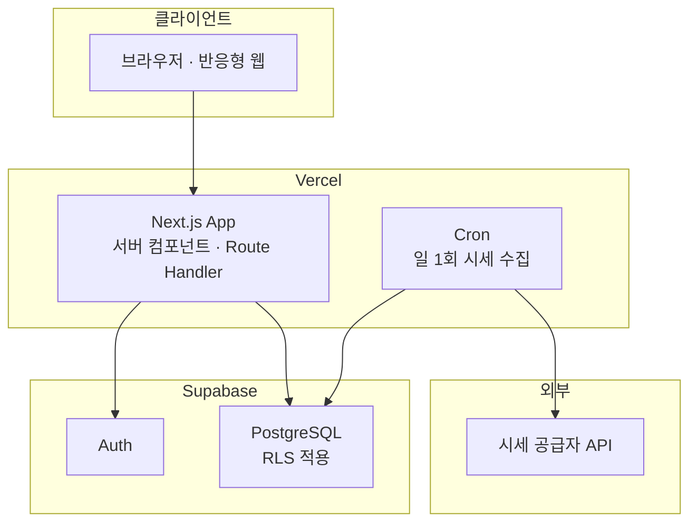

# 아키텍처 및 기술 결정 (ADR)

**언제들어오나** — ELS 통합관리 시스템

| 항목 | 내용 |
|---|---|
| 문서 ID | DOC-010 |
| 버전 | 0.5 |
| 작성일 | 2026-07-26 |
| 작성자 | 민서 |
| 선행 문서 | DOC-001 개요서 v0.4, DOC-002 데이터 모델 v0.4, DOC-007 계산 로직 명세 v0.4, DOC-008 화면 목록 v0.1 |
| 상태 | 검토 중 |

### 변경 이력

| 버전 | 일자 | 작성자 | 변경 내용 |
|---|---|---|---|
| 0.1 | 2026-07-26 | 민서 | 최초 작성. ADR-001 ~ ADR-006 등재 |
| 0.5 | 2026-07-27 | 민서 | P3a 2단계 **적용 + 실측 정정**. v0.4가 선행 명세로 예고한 설정 변경을 실제로 적용하고, 실측이 명세와 갈린 두 곳을 고쳤다. (0) **§7 SEC-03에 가입 차단의 실측 증거(전 `200` + 토큰 발급 + `users` 3행 전량 / 후 `422 signup_disabled`)를 표로 등재.** (1) **`[auth.email].enable_signup`은 끄지 않는다 — 계획 D10의 정정.** 그 값은 GoTrue의 `EXTERNAL_EMAIL_ENABLED`로 매핑되어 이메일 **로그인**까지 막는다(`422 email_provider_disabled`). 가입 차단은 `[auth].enable_signup` 하나로 성립한다. (2) **SEC-03을 검증하려다 로그인 자체가 `500`으로 죽어 있었음을 발견** — 시드의 `auth.users` 토큰 열 4개가 `NULL`. 시드를 고치고 **§9 AQ-21 신설**(인증 경로는 RLS 스위트가 구조적으로 지나지 않는다) |
| 0.4 | 2026-07-27 | 민서 | P3a 조회 계약 착수에 따른 정정. **본 버전은 선행 명세다 — 설정·마이그레이션 적용은 P3a 2단계 이후.** (0) **§7 SEC-03에 공개 가입이 실제로 열려 있었음을 기록하고 닫는다** — 로컬 설정의 `enable_signup`이 `true`이고 이메일 확인도 꺼져 있었다. P3a가 공개 키를 브라우저에 처음 싣는 단계이므로, **정책 32개가 전제하는 "아무나 `authenticated`가 될 수 없다"가 설정에서 깨진 상태**였다. RLS·GRANT·권한 매트릭스 테스트는 모두 그 롤 **안에서의** 분리만 검증하므로 누가 롤에 들어오는지는 어느 테스트도 보지 않는다. (1) **§7 권한 표의 `users` 조회를 열 단위로 축소** — 조회 계약 어디도 `email`을 쓰지 않는다(P2 이월 판단). (2) **§5 모듈 구조에 `lib/db` 하위와 테스트 스위트 3분할 반영.** (3) **§7에 환경변수 규약 추가** — 공개 키만 클라이언트 경로에 두고 `service_role`은 조회 경로에서 사용하지 않는다. (4) **§9 AQ-19·AQ-20 신설**(타입 생성 드리프트, 뷰의 `security_invoker`), AQ-14에 조회 계층의 대응 각주 |
| 0.3 | 2026-07-27 | 민서 | P2 산출물 대조 검증(P2.5)에 따른 정정. (0) **§7.1의 "GRANT 있음 + RLS 켜짐 + 정책 없음 → 기본 거부"에 TRUNCATE 예외 명기** — RLS는 TRUNCATE에 적용되지 않으므로, 규약(`enable row level security`)을 지킨 신규 테이블에서도 `authenticated`가 전 행을 삭제할 수 있었다. v0.2는 기본 권한을 `anon`에만 회수했고 `authenticated`의 기본 권한에는 TRUNCATE가 포함된다. 규약 표에 "기본 권한도 양쪽에서, 테이블·시퀀스 모두 회수" 행을 추가하고, **권한 표를 데이터로 박아 실제 GRANT와 대조하는 테스트를 방어의 정본으로 삼는다** — 플랫폼이 기본값을 재시딩하면 마이그레이션 쪽 회수는 신호 없이 무효가 된다. (1) **§7 권한 표에서 `assets`와 `asset_prices` 행 분리** — `asset_prices`의 수정 범위가 관측값으로 좁혀졌다(DOC-002 I-16). (2) **삭제 제외 근거 교체** — v0.2의 근거("타인 상품의 조건 판정이 깨진다")는 UPDATE에 더 강하게 적용되어 삭제만 막는 논거가 되지 못했다. 새 근거는 "정정은 UPSERT로 수행하므로 삭제 경로가 불필요하다"이며, 좌표 변경은 권한이 아니라 무결성 규칙(I-16)으로 막는다. (3) **§9 AQ-11~AQ-16 신설** |
| 0.2 | 2026-07-27 | 민서 | P2 스키마 착수에 따른 정정. (0) **§7.1 신설 — RLS는 GRANT 위에 얹히는 필터다.** 정책만 작성하고 Supabase의 암묵적 기본 권한을 전제했다가 `authenticated`에 DML이 없어 전 조회가 실패하는 상태를 실제로 만들었음. 신규 테이블에 자동 부여되는 권한은 플랫폼 버전에 따라 달라 보장되지 않는다. 테이블 추가 시 `enable row level security` 누락이 fail-open이 되는 함정을 규약으로 고정하고 테스트로 강제한다. (1) **§5 디렉터리 트리에서 세율·요율의 위치를 `seed/`에서 `migrations/`로 정정** — ADR-005 본문은 "버전 관리되는 마이그레이션"이라고 명시하는데 트리 주석만 `seed/`를 가리켜 자기모순이었고, `supabase db push`는 `migrations/`만 적용하므로 트리를 따르면 운영 DB에 세율이 영원히 들어가지 않는다. (2) **§7 권한 표에 `users`·`asset_provider_symbols`·`tax_years` 행 추가** — 세 테이블의 정책이 정의되지 않아 구현이 임의 결정을 강요받았음. (3) §7의 `assets`·`asset_prices` "변경 전체"에서 **DELETE 제외** 명시. (4) **§9 AQ-05 해결(P2)** |

---

## 1. 목적

본 문서는 시스템 아키텍처와 주요 기술 결정을 기록한다. 각 결정은 **ADR(Architecture Decision Record)** 형식으로 맥락·선택지·근거·결과를 함께 남긴다.

ADR을 사용하는 이유는 결론뿐 아니라 **왜 다른 선택지를 배제했는지**를 보존하기 위해서다. 시간이 지나 제약이 바뀌면 결정을 뒤집어야 하는데, 근거가 없으면 재검토가 불가능하다.

**ADR 상태 값:** `제안` / `채택` / `대체됨` / `폐기`

---

## 2. 아키텍처 제약 요약

결정의 전제가 되는 제약이다. 상세는 DOC-001 §7 참조.

| ID | 제약 | 아키텍처 함의 |
|---|---|---|
| C-01 | 무료 티어 내 운영 | 상시 구동 서버 비용 발생 구조 회피 |
| C-02 | 1인 개발, 학업 병행 | 운영 부담이 큰 구성 회피 |
| C-03 | 시세 API 무료 한도 | 배치 수집 + 폴백 필수 |
| A-01 | 동시 사용자 10명 이하 | 확장성 최적화 불필요 |
| A-05 | 폐쇄형(초대 기반) 등록 | 공개 회원가입 흐름 불필요 |
| R-05 | 학기 중 중단 가능성 | 기능 단위로 배포 가능한 구조 |
| S-10 | 전체 조회 / 소유자만 수정 | 권한 모델이 단순하고 규칙적 |

---

## 3. 시스템 구성



**구성 요소별 책임**

| 구성 요소 | 책임 |
|---|---|
| Next.js App | 화면 렌더링, 도메인 계산, 데이터 접근 |
| Supabase Auth | 인증, 세션 관리 |
| PostgreSQL + RLS | 데이터 저장, **권한 강제** |
| Cron | 시세 배치 수집 |
| 시세 공급자 | 기초자산 종가 제공 |

---

## 4. 아키텍처 결정 기록

### ADR-001. 애플리케이션 아키텍처 — Next.js 풀스택

**상태:** 채택

**맥락**

화면 12개 규모, 사용자 10명 이하, 1인 개발. 인증·데이터 저장·주기 실행 작업이 필요하다. 계산 로직 비중이 높고 정확성이 중요하다.

**검토한 선택지**

| 선택지 | 장점 | 단점 |
|---|---|---|
| A. Next.js 풀스택 | 단일 언어·레포·배포. 서버 컴포넌트로 계산을 서버에서 수행 가능 | 플랫폼 종속 |
| B. SPA + 별도 API 서버 | 프론트/백 분리, 서버 기술 독립 | 배포 2곳, 무료 티어에서 상시 구동 서버 확보 어려움(C-01), 운영 부담 증가(C-02) |
| C. SPA + BaaS 직접 호출 | 서버 코드 최소 | 계산 로직이 클라이언트에 노출·중복. 배치 작업 별도 수단 필요 |

**결정** — A를 채택한다.

**근거**

C-01·C-02가 결정적이다. 별도 API 서버는 무료 티어에서 상시 구동을 보장받기 어렵고(콜드 스타트·슬립), 1인 학업 병행 조건에서 배포 대상이 둘로 늘어나는 비용이 크다. 프론트/백 분리의 이점(독립 배포, 팀 분업)은 본 프로젝트 규모에서 실현되지 않는다.

**결과**

- 단일 저장소·단일 배포로 R-05(중단 리스크) 대응이 쉬워진다
- 플랫폼 종속이 발생하나, 도메인 로직을 프레임워크 비종속 모듈로 분리하여(ADR-003) 이전 비용을 낮춘다

---

### ADR-002. 데이터베이스 및 인증 — Supabase (PostgreSQL + Auth + RLS)

**상태:** 채택

**맥락**

권한 모델이 명확하고 규칙적이다 — **모든 사용자가 전체 조회 가능, 생성·수정·삭제는 소유자만**(S-10). 등록은 초대 기반 폐쇄형이다(A-05).

**검토한 선택지**

| 선택지 | 장점 | 단점 |
|---|---|---|
| A. Supabase | PostgreSQL + Auth + RLS 통합. 무료 티어 | 플랫폼 종속 |
| B. 관리형 Postgres + 자체 인증 | 구성 자유도 | 인증 직접 구현, 권한을 애플리케이션 코드로 강제 |
| C. 자체 호스팅 | 완전한 통제 | 운영 부담이 C-02와 충돌 |

**결정** — A를 채택한다.

**근거**

**권한 모델이 RLS 정책과 정확히 대응한다는 점이 핵심이다.**

```sql
-- 조회: 인증된 모든 사용자
create policy "read_all" on els_products
  for select to authenticated using (true);

-- 변경: 소유자만
create policy "write_own" on els_products
  for all to authenticated
  using (owner_id = auth.uid())
  with check (owner_id = auth.uid());
```

권한을 애플리케이션 코드가 아니라 **데이터베이스가 강제**하므로, 쿼리 작성 실수로 타인 데이터를 수정하는 경로가 원천 차단된다. 이는 DOC-002 D-01("이중 집계를 스키마 수준에서 불가능하게 만든다")과 동일한 설계 철학이며, **정합성을 규율이 아니라 구조로 보장한다**는 원칙의 일관된 적용이다.

**결과**

- 권한 검증 코드가 화면·API마다 흩어지지 않는다
- RLS 정책 자체가 테스트 대상이 된다 (DOC-012 테스트 계획에 포함)
- 시세·자산 테이블은 공용 데이터이므로 별도 정책을 적용한다(DOC-008 SCR-302 참조)

---

### ADR-003. 계산 로직 배치 — 순수 모듈 분리

**상태:** 채택

**맥락**

DOC-007이 정의한 22개 검증 케이스는 회귀 테스트로 고정되어야 한다(K-08). 동시에 세금 화면(SCR-401)은 입력 변경이 즉시 반영되는 시뮬레이터로 동작해야 한다.

**검토한 선택지**

| 선택지 | 장점 | 단점 |
|---|---|---|
| A. 서버에서만 계산 | 로직 단일 지점 | 시뮬레이터 조작마다 왕복 발생 |
| B. 클라이언트에서만 계산 | 즉시 반응 | 로직이 클라이언트에 종속. 저장값 신뢰 불가 |
| C. 순수 모듈로 분리 후 양쪽에서 실행 | 즉시 반응 + 단일 구현 | 모듈 경계 규율 필요 |

**결정** — C를 채택한다.

**설계**

계산 로직을 **입출력이 없는 순수 함수 모듈**로 분리한다.

- 입력은 원시값(숫자·열거형)만 받는다. DB 레코드나 요청 객체를 직접 받지 않는다
- 데이터베이스·네트워크·환경변수에 접근하지 않는다
- 세율 등 상수는 **인자로 주입**한다. 모듈이 직접 조회하지 않는다

```
lib/tax/       비교과세, 건강보험료, 부담률
lib/domain/    워스트오브, 조건 판정, 평가일 생성, 수령액
```

**근거**

순수성을 유지하면 (1) 테스트가 DB·네트워크 없이 실행되고, (2) 서버·클라이언트 어디서든 동일 결과를 보장하며, (3) 프레임워크를 교체해도 도메인 자산이 보존된다.

**결과**

- DOC-007 §10의 검증 케이스가 그대로 단위 테스트가 된다
- 시뮬레이션은 클라이언트에서 즉시 계산하고, **저장 시점에는 서버에서 재계산하여 검증**한다
- 상수 주입 구조가 ADR-005(연도별 상수 관리)와 맞물린다
- 순수성은 규율에 의존하므로, `lib/tax`·`lib/domain`이 `lib/db`·`app`을 import하지 못하도록 **린트 규칙으로 강제**한다

---

### ADR-004. 시세 공급자 — 어댑터 추상화 도입, 공급자 선정은 분리

**상태:** 채택 (공급자 선정은 ADR-007로 분리)

**맥락**

기초자산은 해외 상장 주식 중심이며 국내 종목·지수도 지원해야 한다(A-03). 무료 API는 한도·정책이 자주 변경되며, 이는 R-02로 이미 식별된 리스크다.

**결정**

공급자 선정에 앞서 **어댑터 인터페이스를 확정**하고, 구체 공급자는 별도 ADR로 분리한다.

```ts
interface PriceProvider {
  readonly id: string;
  fetchDailyClose(
    symbols: string[],
    date: Date
  ): Promise<Array<{ symbol: string; price: Decimal }>>;
}
```

- 도메인 코드는 `assets`만 참조하며 공급자 심볼을 알지 못한다
- 공급자별 심볼은 `asset_provider_symbols`에서 조회한다(DOC-002 §4.4)
- 수집 실패는 예외가 아니라 **결과 누락**으로 처리하고, 해당 자산은 수동 입력 폴백 경로로 유도한다(DOC-008 ST-03)

**근거**

DOC-002 M-07·D-05에서 이미 스키마 수준의 격리를 마쳤다. 공급자를 먼저 고르고 그에 맞춰 설계하는 것은 순서가 반대다. **어댑터가 확정되면 공급자 선정은 교체 가능한 결정으로 격하된다.**

**결과**

- Q-03이 미결인 상태에서 구현을 시작할 수 있다
- 개발 중에는 고정값을 반환하는 스텁 어댑터로 진행 가능하다
- 공급자 선정 시 검토 기준: 해외·국내 종목 커버리지, 무료 한도, 이용 약관상 개인 프로젝트 허용 여부, 종가 제공 시점

---

### ADR-005. 연도별 상수 관리 — 마이그레이션 시드

**상태:** 채택

**맥락**

세율·보험요율은 연도별로 변경된다(A-02). 회귀 테스트(K-08)는 과거 연도 계산이 동일하게 재현되는 것을 전제한다.

**결정**

`tax_brackets`·`tax_constants`를 **버전 관리되는 마이그레이션**으로 관리한다. 연도 추가는 데이터 마이그레이션 파일로 수행하며, **기존 연도 레코드는 수정하지 않는다.**

**근거**

상수를 코드에 두면 연도 변경마다 배포가 필요하고 과거 계산의 재현성이 깨진다. 관리자 UI로 편집 가능하게 하면 값 변경 이력이 남지 않아 "왜 작년 계산 결과가 달라졌는가"에 답할 수 없다.

**결과**

- 세법 개정 시 마이그레이션 파일 추가만으로 대응한다
- 과거 연도 계산이 영구히 재현된다
- 오류 정정이 필요한 경우에도 신규 마이그레이션으로 처리하여 이력을 보존한다

---

### ADR-006. 배포 및 스케줄링 — Vercel + Cron

**상태:** 채택

**맥락**

일 1회 시세 수집이 필요하다(O-04). 상시 구동 워커는 C-01과 충돌한다.

**결정**

Vercel에 배포하고, 시세 수집은 Cron으로 호출되는 Route Handler로 구현한다.

**환경 분리**

| 환경 | 용도 | 데이터베이스 |
|---|---|---|
| `production` | 실사용 | 운영 인스턴스 |
| `preview` | PR 단위 검증 | 개발 인스턴스 |
| `local` | 개발 | 로컬 또는 개발 인스턴스 |

**결과**

- 배치 전용 인프라가 불필요하다
- Cron 엔드포인트는 인증이 필요하다(비밀 토큰 검증). 미보호 시 외부에서 API 한도를 소진시킬 수 있다
- 수집 결과는 성공·실패 건수를 로깅하여 무음 실패를 방지한다

---

## 5. 모듈 구조

```
src/
├── app/                   라우트 (SCR-xxx 대응)
│   ├── (auth)/login/
│   ├── products/
│   ├── schedule/
│   ├── tax/
│   ├── forecast/
│   ├── prices/
│   └── api/cron/prices/
├── components/            UI 컴포넌트
├── lib/
│   ├── tax/               ★ 순수 — 세금 계산 (DOC-007 §5, §6)
│   ├── domain/            ★ 순수 — 조건 판정·일정·수령액 (DOC-007 §3, §4)
│   ├── db/                데이터 접근 (DOC-011 §4)
│   │   ├── env.ts             URL·공개 키 해석 — process.env를 읽는 유일한 파일
│   │   ├── client.ts          세션 클라이언트·토큰 클라이언트 (프레임워크 비의존)
│   │   ├── server.ts          next/headers 결선 — next를 import하는 유일한 파일
│   │   ├── today.ts           기준일 (Asia/Seoul)
│   │   ├── select.ts          열 목록·문자열 캐스팅·절단 감지
│   │   └── queries/           조회 계약 + 행→뷰 매핑(순수)
│   ├── providers/         시세 어댑터 (ADR-004)
│   └── auth/
└── types/
    └── database.types.ts  생성물 (supabase gen types)

supabase/
├── migrations/            스키마 + RLS 정책 + 연도별 세율·요율 (ADR-005)
└── seed/                  로컬 개발·테스트 전용 데이터 (운영에 반영되지 않음)

tests/
├── tax/                   TC-01 ~ TC-18
├── domain/                TC-19 ~ TC-22
├── seed/                  세율 시드 ↔ 픽스처 대조 (AQ-05)
├── db/                    행→뷰 매핑·기준일·타입 수준 검사 — DB 없이 실행
├── rls/                   권한 정책 검증 — pg 직결, 트랜잭션 롤백
└── integration/           조회 계약 ↔ PostgREST — supabase-js, HTTP 경유
```

**테스트 스위트가 세 갈래인 이유.** "어느 스위트가 무엇에 접속하는가"를 디렉터리 경계로 고정한다.

| 스위트 | 접속 대상 | 실행 |
|---|---|---|
| `tests/**`(`db`·`tax`·`domain`·`seed`) | 없음 | 상시 (`npm run test`). ADR-003의 전제 |
| `tests/rls/**` | DB 직결(`pg`), 슈퍼유저 + 롤 가장 | 수동 (`npm run test:rls`) |
| `tests/integration/**` | PostgREST(HTTP) + 실제 JWT | 수동 (`npm run test:integration`) |

`tests/rls`는 트랜잭션 롤백 전제이므로 **커밋 경로가 없고**, 그 안에서 준비한 데이터는 HTTP 클라이언트에 보이지 않는다. 두 스위트를 한 설정에 합칠 수 없는 이유이며, integration 픽스처는 커밋하므로 **자기 사용자·자기 이름 대역**을 써서 RLS 스위트의 단언과 충돌하지 않게 한다.

> **세율·요율은 `seed/`가 아니라 `migrations/`에 둔다.** `supabase db push`는 `migrations/`만 적용하고 시드 파일은 로컬 `db reset`에서만 실행된다. 세율을 `seed/`에 두면 운영 데이터베이스에 세율이 영원히 들어가지 않아 모든 세금 화면이 실패한다. ADR-005 본문("버전 관리되는 마이그레이션으로 관리한다")이 정본이며, v0.1의 트리 주석이 그와 어긋나 있었다.

**★ 표시 모듈의 의존 규칙**

| 규칙 | 내용 |
|---|---|
| DEP-01 | `lib/tax`·`lib/domain`은 `lib/db`, `lib/providers`, `app`을 import할 수 없다 |
| DEP-02 | 두 모듈은 프레임워크 API를 사용하지 않는다 |
| DEP-03 | 세율 등 상수는 인자로 주입받는다 |
| DEP-04 | 위 규칙은 린트 설정으로 강제하며, CI에서 검사한다 |

---

## 6. 데이터 흐름

### 6.1 화면 조회

```
요청 → 인증 확인 → DB 조회(RLS 적용)
     → lib/domain 조건 판정 → lib/tax 세액 산출 → 렌더링
```

계산은 서버 컴포넌트에서 수행하는 것을 기본으로 한다. 클라이언트 계산은 시뮬레이션 등 즉시 반응이 필요한 경우로 한정한다.

### 6.2 시세 수집 (일 1회)

```
Cron → 토큰 검증 → 대상 자산 조회(미상환 상품의 기초자산)
     → asset_provider_symbols 매핑 → 공급자 호출
     → asset_prices UPSERT → 수집 결과 로깅
```

**설계 주의**

- 대상은 **미상환 상품의 기초자산으로 한정**한다. 상환 완료 상품의 자산까지 조회하면 API 한도를 낭비한다
- `UNIQUE(asset_id, as_of_date)` 제약이 있으므로 중복 실행은 UPSERT로 흡수된다
- 일부 자산 실패가 전체 배치를 중단시키지 않는다

### 6.3 상환 처리

```
입력 → 클라이언트 검증 → 서버 액션
     → 소유자 확인(RLS) → lib/domain 재계산 검증
     → redemptions INSERT (단일 트랜잭션)
```

`UNIQUE(els_id)` 제약으로 중복 상환이 차단된다(DOC-002 I-01).

---

## 7. 보안 및 권한

| ID | 항목 | 방식 |
|---|---|---|
| SEC-01 | 인증 | Supabase Auth 세션 |
| SEC-02 | 인가 | PostgreSQL RLS (ADR-002) |
| SEC-03 | 계정 생성 | 초대 기반. 공개 가입 비활성화 (A-05). **`[auth].enable_signup = false` 하나만 끈다 — `[auth.email]`은 건드리지 않는다, 아래 참조** |
| SEC-04 | Cron 엔드포인트 | 비밀 토큰 검증 |
| SEC-05 | 비밀값 관리 | 환경변수. 저장소에 커밋 금지. 변수명만 담은 예시 파일을 두고 값은 로컬·배포 환경에서 주입 |
| SEC-06 | 클라이언트 노출 | 공개 키 외 서버 전용 키를 클라이언트 번들에 포함하지 않음. **조회 경로는 `service_role`을 아예 쓰지 않는다**(DOC-011 §4.0 Q-01) — `process.env`를 읽는 파일을 `lib/db/env.ts` 하나로 제한해 감사 가능하게 한다 |

> **SEC-03이 설정에서 꺼져 있었다 (v0.4에서 발견·수정).** 로컬 Auth 설정의 `enable_signup`이 `true`이고 이메일 확인(`enable_confirmations`)도 꺼져 있었다. **P3a는 공개 키를 브라우저 번들에 처음 싣는 단계**이므로, 그 상태로 진행하면 키를 가진 누구나 가입 엔드포인트로 즉시 `authenticated` 세션을 얻고, 트리거가 프로필 행까지 만들어 준 뒤 §7 표의 조회 권한을 전부 획득한다 — `tax_profiles`를 제외한 11개 테이블 전체다.
>
> **이것은 정책의 결함이 아니라 전제의 붕괴다.** 정책 32개는 모두 "인증된 사용자는 초대받은 3명뿐"을 전제로 조회를 `using (true)`로 열었다. RLS·GRANT·권한 매트릭스 테스트는 `authenticated` 롤 **안에서의** 분리만 검증하므로, **누가 그 롤에 들어올 수 있는지는 어떤 테스트도 보지 않는다.** 방어의 층을 아무리 쌓아도 입구가 열려 있으면 의미가 없다.
>
> 설정 변경은 마이그레이션이 아니므로 `db reset`으로 반영되지 않는다 — 로컬 스택을 재시작해야 한다. 호스팅 프로젝트에서도 같은 설정을 확인한다.
>
> **실측 (P3a 2단계, 로컬 스택).** 닫기 전에 실제로 뚫었고, 닫은 뒤 다시 막혔음을 확인했다.
>
> | 시점 | `POST /auth/v1/signup` (anon 키만) | 결과 |
> |---|---|---|
> | 전 | `HTTP 200` | `access_token` 발급, `user.role = "authenticated"`. 트리거가 `public.users` 행 생성 → 그 세션으로 `GET /rest/v1/users?select=*`가 **3행 전체(이메일 포함)** 반환 |
> | 후 | `HTTP 422 signup_disabled` | 발급 없음 |
>
> 같은 세션의 `els_products` 등이 0행이었던 것은 **정책이 막은 것이 아니라 그 시점 DB에 상품 데이터가 없었기 때문이다** — 조회 정책은 `using (true)`이므로 데이터가 있으면 전량 반환된다. 익명 로그인(`enable_anonymous_sign_ins = false`)은 `422 anonymous_provider_disabled`로 함께 닫혀 있다.
>
> **`[auth.email].enable_signup`은 끄지 않는다 (실측으로 정정).** 계획 단계에서는 `[auth]`·`[auth.email]` 양쪽을 끄기로 했으나, `[auth.email].enable_signup = false`는 GoTrue의 `EXTERNAL_EMAIL_ENABLED`로 매핑되어 **이메일 로그인 자체를 막는다** — `POST /auth/v1/token?grant_type=password`가 `422 email_provider_disabled`("Email logins are disabled")를 낸다. 가입 차단은 `[auth].enable_signup` 하나로 충분하고 그쪽은 로그인을 살려 두므로, 초대 기반 가입(이메일/비밀번호 로그인을 전제한다)에는 이 값이 `true`여야 한다. **"양쪽 다 끄면 더 안전하다"는 직관이 틀린 지점이다.**
>
> **SEC-03을 검증하려면 시드가 먼저 고쳐져야 했다.** 로그인 경로를 처음 실행해 보니 시드 사용자가 `500 unexpected_failure`("Database error querying schema")로 죽었다 — `auth.users`의 `confirmation_token`·`recovery_token`·`email_change_token_new`·`email_change` 4개 열만 컬럼 기본값이 없어 `NULL`이었고, GoTrue v2.192.0은 이들을 널 불가 `string`으로 스캔한다. 사용자가 없으면 `400 invalid_credentials`이므로 **행이 존재할 때만 나는 오류**다. `supabase/seed/00_rls_test_users.sql`에서 8개 토큰 열을 모두 `''`로 명시하고 `auth.identities` 행을 함께 만들어 해소했다(`identities: 1`). **P2의 RLS 스위트 128개가 전부 초록색인 동안에도 로그인은 한 번도 성공한 적이 없었다** — 그 스위트는 `pg` 직결 + `set local role` 가장이라 GoTrue를 지나지 않는다. AQ-21로 등재한다.

**권한 정책 요약**

| 테이블 | 조회 | 변경 |
|---|---|---|
| `users` | 전체 인증 사용자 — **`id`·`display_name` 열만** | 본인 (`display_name`만) |
| `els_products` 및 하위 | 전체 인증 사용자 | 소유자 |
| `redemptions` | 전체 인증 사용자 | 상품 소유자 |
| `tax_profiles` | **본인만** | 본인 |
| `assets` | 전체 | 전체 (공용 데이터). **삭제 제외** |
| `asset_prices` | 전체 | 등록·수정 전체. **단 관측 좌표(`asset_id`·`as_of_date`)는 불변** (DOC-002 I-16). 삭제 제외 |
| `asset_provider_symbols` | 전체 | 없음 (마이그레이션·수집 배치 전용) |
| `tax_years`, `tax_brackets`, `tax_constants` | 전체 | 없음 (마이그레이션 전용) |

모든 정책의 대상은 `authenticated` 롤이다. `anon`에게는 어떤 테이블 권한도 부여하지 않는다 — 공개 가입이 없고(SEC-03), `anon` 키는 클라이언트 번들에 실리므로(SEC-06) 정책 하나만 열려 있어도 키를 가진 누구나 전체 데이터를 조회한다.

### 7.1 RLS는 GRANT 위에 얹히는 필터다

**권한 부여와 정책은 별개의 두 층이며, 둘 다 있어야 접근이 성립한다.**

```
GRANT 없음        → 정책과 무관하게 42501 permission denied
GRANT 있음 + RLS 켜짐 + 정책 없음  → 기본 거부 (조회는 0행, INSERT는 42501)
                                     ※ TRUNCATE는 예외 — RLS 적용 대상이 아니다
GRANT 있음 + RLS 꺼짐             → 정책과 무관하게 전면 허용  ← fail-open
```

P2 구현에서 이 층을 실제로 밟았다. 정책만 작성하고 Supabase가 신규 테이블에 권한을 자동 부여할 것으로 전제했더니 `authenticated`에 DML이 하나도 없어 모든 조회가 `permission denied`로 실패했다. 신규 테이블에 어떤 권한이 자동 부여되는지는 **플랫폼·CLI 버전에 따라 달라지며 보장되지 않는다.**

따라서 다음을 규약으로 고정한다.

| 규칙 | 이유 |
|---|---|
| 테이블을 추가하면 `enable row level security`를 **반드시** 함께 쓴다 | 빠뜨리면 위 표의 마지막 줄, 즉 fail-open이 된다. 정책·GRANT를 아무리 잘 써도 무의미해진다 |
| 권한은 **전부 회수한 뒤 필요한 것만 명시 부여**한다 | 암묵적 기본값에 의존하면 정책 파일만 읽어서 최종 권한을 알 수 없고, 플랫폼이 기본값을 바꾸면 조용히 깨지거나 조용히 열린다 |
| 위 표의 "변경 없음"은 정책 부재와 GRANT 미부여를 **함께** 쓴다 | 정책 부재만으로는 UPDATE·DELETE가 오류 없이 0행으로 끝나 애플리케이션 버그가 은폐된다 |
| 기본 권한(`alter default privileges`)도 `anon`·`authenticated` **양쪽에서**, 테이블과 시퀀스 **모두** 회수한다 | `revoke all on all tables`는 **이미 만들어진** 테이블만 다룬다. 신규 테이블은 기본 권한을 받으며 이 스택에서 `authenticated`가 받는 권한에는 TRUNCATE가 포함된다. 위 표의 둘째 줄이 TRUNCATE에 대해 성립하지 않으므로, 첫 줄의 규약(`enable row level security`)을 지켜도 막히지 않는다 |

`force row level security`는 쓰지 않는다. 테이블 소유자에게만 효과가 있고 `BYPASSRLS`를 가진 롤(Supabase의 `postgres`)에는 무력하며, 순정 Postgres로 옮기면 참조 데이터에 INSERT 정책이 없어 연도별 시드 마이그레이션이 실패한다. **첫 줄의 규칙은 규율로 지켜지지 않으므로 테스트로 강제한다** — `tests/rls/catalog.test.ts`가 `public`의 모든 실테이블에 RLS가 켜져 있는지, 그리고 테이블 목록이 DOC-002 §3의 12개와 정확히 일치하는지 확인한다. 새 테이블을 추가하면 후자가 먼저 실패하므로 전자의 검사 범위에서 빠질 수 없다.

> **위 표의 둘째 줄이 TRUNCATE에 대해 거짓이었다.** RLS 정책은 SELECT·INSERT·UPDATE·DELETE에만 적용되고 TRUNCATE에는 적용되지 않는다. `public`에 새 테이블을 만들고 `enable row level security`까지 켠 뒤(즉 규약을 **지킨** 상태) `authenticated`로 시도한 결과, SELECT·INSERT·DELETE는 `42501`이었으나 **TRUNCATE는 성공하여 전 행이 삭제됐다.**
>
> 원인은 기본 권한이다. v0.2의 마이그레이션은 `revoke all on all tables ... from anon, authenticated`로 **이미 만들어진** 테이블을 정리했고, `alter default privileges ... revoke all`은 `anon`에만 적용했다. 그래서 신규 테이블에는 `authenticated`가 TRUNCATE·REFERENCES·TRIGGER를 자동으로 받았다. 기존 12개 테이블은 회수가 생성 이후 1회 돌았으므로 안전하다 — 문제는 **그 회수가 일회성**이라는 구조다.
>
> `catalog.test.ts`가 확인하던 것은 "RLS가 켜져 있는가"이므로 이 경로를 잡지 못했다. 따라서 방어를 두 겹으로 만든다. (a) `authenticated`에 대해서도 기본 권한을 회수한다. (b) **§7 권한 표를 데이터로 박고 실제 GRANT와 대조하는 테스트를 둔다** — 카탈로그(`pg_class`)에서 테이블을 열거하고, 표에 없는 테이블이 있으면 실패하며, 각 테이블의 `authenticated` 권한이 `{SELECT, INSERT, UPDATE, DELETE}`의 부분집합인지 함께 본다.
>
> **(b)가 (a)보다 중요하다.** `pg_default_acl`에는 `defaclrole = supabase_admin` 행이 따로 있고 거기에는 `anon`·`authenticated`가 여전히 전 권한으로 남아 있다. 플랫폼이 기본값을 재시딩하면 (a)의 회수는 신호 없이 무효가 된다. **지속적인 방어 수단은 마이그레이션이 아니라 테스트다.**

> **`tax_profiles`만 조회를 본인으로 제한한다.** 금융소득 외 종합소득 과세표준은 ELS와 무관한 개인 소득 정보이므로, 전체 공개 대상인 보유 현황과 성격이 다르다.

> **`users`의 조회를 전체에 여는 이유.** DOC-011 §4.2·§4.3·§4.4가 모든 상품·일정 행에 `ownerName`을 요구한다. 소유자 표시명을 읽을 수 없으면 "전체 조회"(S-10) 화면이 성립하지 않는다. 변경은 본인의 `display_name`으로 한정하며, 행 생성·삭제 권한은 부여하지 않는다 — 계정은 초대(`auth.users`) 경로로만 생기고(SEC-03, DOC-002 D-06), 프로필 행은 트리거가 만든다.
>
> **조회를 열 단위로 좁힌다 (v0.4, P2 이월 판단 종결).** 계약이 요구하는 것은 표시명뿐이고 **DOC-011 §4의 어떤 뷰도 `email`을 담지 않는다.** 표 단위 SELECT를 유지하면 인증 사용자 전원이 서로의 로그인 식별자를 읽을 수 있는데, 그 권한을 쓰는 계약이 하나도 없다. §7.1의 "전부 회수한 뒤 필요한 것만 명시 부여"를 열 수준까지 적용한다.
>
> P2가 이 판단을 미룬 이유는 "열 단위로 좁히면 `select *`가 `42501`이 된다"였다. 조회 계층이 생성 타입에서 파생된 **명시 열 목록**만 사용하므로 그 부작용은 정상 경로에 나타나지 않으며, `select *`를 쓰는 코드가 조용히 늘어나는 것을 막는 장치로 오히려 유용하다. 열 단위 GRANT 인프라는 이미 `display_name`의 UPDATE로 갖춰져 있다.
>
> **권한 매트릭스 테스트의 형태를 함께 바꿔야 한다.** 현재 열 단위 단언은 권한 종류를 `UPDATE`로 고정해 두었으므로, SELECT가 열 단위로 들어오면 그 구조로는 표현되지 않는다. 카탈로그에서 열 단위 권한을 종류까지 읽어 대조하는 형태로 확장한다 — 실제 저장 형태를 먼저 측정한 뒤 매트릭스를 고친다.

> **공용 데이터의 삭제는 열지 않는다 — 정정은 UPSERT로 수행하므로 삭제 경로가 불필요하다.** DOC-011 §5.7 `saveManualPrice`가 `UNIQUE(asset_id, as_of_date)` 기준 UPSERT이므로 틀린 시세는 **덮어써서** 고친다. 지우고 다시 넣어야 하는 상황이 없다. 계약에 삭제 함수가 없는 것은 누락이 아니라 설계다. `assets`는 `els_underlyings`의 FK `RESTRICT`가 참조 중인 자산의 삭제를 이미 막고 있다(DOC-002 §8.1).
>
> v0.2는 삭제를 막는 근거를 "한 사용자가 시세를 지우면 타인 상품의 조건 판정이 깨진다"로 적었다. **그 근거는 UPDATE에도 동일하게, 오히려 더 강하게 적용되므로 삭제만 막는 논거가 될 수 없었다** — 삭제는 DOC-007 E-01(시세 없음)로 화면에 드러나지만, 잘못된 UPDATE는 드러나지 않고 워스트오브만 조용히 바뀐다.

> **관측값의 수정은 열어 두고 좌표만 잠근다.** `asset_prices`의 `(asset_id, as_of_date)`는 관측의 좌표이고 `price`·`source`·`provider`가 관측값이다. 좌표를 바꾸는 UPDATE는 정정이 아니라 다른 행을 만드는 조작이므로 막고, 값의 정정은 공용 데이터 원칙대로 전체에 연다.
>
> **이것은 권한 규칙이 아니라 무결성 규칙이므로 DOC-002 I-16에서 다룬다.** 열 단위 GRANT로 강제하면 `supabase-js`의 `.upsert()`가 payload 전역을 `DO UPDATE SET`에 실으므로 정상적인 정정 UPSERT가 권한 오류로 실패한다. 그렇게 되면 계약이 클라이언트에 도구 우회를 강요한다. `BEFORE UPDATE` 트리거로 두면 동일값 재대입이 통과하여 `.upsert()`가 온전히 남고, 이 표의 GRANT는 "전부 회수한 뒤 필요한 것만 명시 부여"(§7.1) 형태를 그대로 유지한다 — 정책 파일만 읽어서 최종 권한을 아는 성질이 깨지지 않는다.

> **"변경 없음"은 정책 부재만으로 표현하지 않는다.** RLS는 정책이 없으면 기본 거부하지만, UPDATE·DELETE의 거부는 오류가 아니라 **영향 행 0건**으로 나타나 애플리케이션 버그가 은폐된다. 참조 데이터에는 `authenticated`의 쓰기 권한을 함께 회수하여 시도 자체가 오류로 드러나게 한다.

### 7.2 환경변수 (P3a 2단계에서 확정)

| 변수 | 계층 | 내용 |
|---|---|---|
| `NEXT_PUBLIC_SUPABASE_URL` | 클라이언트·서버 | 프로젝트 API URL |
| `NEXT_PUBLIC_SUPABASE_ANON_KEY` | 클라이언트·서버 | 공개(anon) 키 |

두 변수 모두 브라우저 번들에 실린다 — **비밀이 아니다.** 이 키만으로 얻는 것은 `anon` 롤이고 `anon`에는 어떤 테이블 권한도 없다(§7 권한 표). `authenticated`가 되려면 세션이 필요하고, 세션은 초대된 사용자의 로그인으로만 생긴다(SEC-03). **그 마지막 전제가 P3a 2단계 전까지 깨져 있었다** — §7 SEC-03 각주.

`service_role`(신형 `SECRET_KEY`) 키는 **`.env.example`에도, `.env.local`에도, 어떤 커밋에도 넣지 않는다.** 조회 경로가 한 번이라도 쓰면 그 뒤의 모든 초록색이 무엇을 증명하는지 알 수 없게 된다. P5의 시세 수집 배치(§6.2)가 처음으로 요구하는 시점에 서버 전용 변수로 별도 등재한다. 그 시점에 등재를 빠뜨리지 않도록 `src/`에 `service_role` 문자열이 없음을 검사하는 테스트를 두었고, `src/app/api/cron/**`만 **미리** 예외로 뚫어 두었다 — 나중에 예외를 뚫으면 통과시키려고 검사 자체를 없애는 쪽으로 기운다.

부재 시 `src/lib/db/env.ts`가 즉시 던진다. **빈 문자열도 부재로 취급한다** — 미설정 변수가 `""`로 들어와 "URL이 빈 클라이언트"가 만들어지면 실패가 조회 시점까지 미뤄지고 오류가 원인을 가리키지 않는다.

---

## 8. 품질 목표 대응

| 지표 | 목표 | 아키텍처 대응 |
|---|---|---|
| K-08 세금 계산 검증 | 100% | ADR-003 순수 모듈 + 단위 테스트 |
| K-09 LCP | 2.5초 이내 | 서버 컴포넌트 렌더링, 계산 결과 캐싱 |
| K-04 정합성 오류 | 0건 | DB 제약(I-01~I-06) + RLS |
| K-02 수동 입력 | 0회 | ADR-004 배치 수집 + 폴백 |

---

## 9. 미결정 사항

| ID | 항목 | 상태 | 비고 |
|---|---|---|---|
| AQ-01 | 시세 공급자 선정 | 미결 | ADR-007로 분리. 어댑터 확정으로 구현 차단은 해소됨 |
| AQ-02 | 계산 결과 캐싱 전략 | 미결 | 시세·프로필 변경 시 무효화 범위 |
| AQ-03 | 오류 추적 도구 도입 | 미결 | 무료 티어 범위 내 검토 |
| AQ-04 | 데이터 백업 주기 | 미결 | DOC-013 운영 문서에서 확정 |
| AQ-05 | 세율 마이그레이션 검증 절차 | **해결 (P2)** | **이중 게이트.** ① `tests/seed/`가 마이그레이션 `.sql`을 파싱해 `tests/fixtures/tax-2026.ts`와 대조한다 — DB가 없어도 `npm run test`에서 상시 실행되므로 드리프트가 즉시 잡힌다. ② `tests/rls/tax-seed.test.ts`가 적용된 DB를 조회해 같은 단언을 반복한다 — 마이그레이션 미적용, 후속 마이그레이션의 과거 연도 수정(ADR-005 위반), `DECIMAL` 자릿수에 의한 조용한 반올림은 ①이 잡을 수 없다. 신규 연도 추가 시 해당 연도의 픽스처와 대조 케이스를 함께 추가한다 |
| AQ-11 | `service_role` 권한 축소 | 미결 | 현재 `grant all on all tables`. §6.2 배치가 실제로 필요한 것은 `asset_prices` UPSERT·`asset_provider_symbols` 조회·미상환 상품 자산 조회다. 미사용 자산을 삭제하면 `asset_prices` CASCADE로 시세 이력 전체가 사라진다. **반대 방향 문제도 함께 있다** — `grant all`도 일회성이므로 신규 테이블에는 `service_role`에 DML이 없어 배치가 `42501`로 막힌다. §7.1의 기본 권한 규약을 `service_role`에는 적용하지 않기로 한 결정과 짝을 이루므로 함께 정한다. **P5** |
| AQ-12 | DB 제약·트리거의 개별 회귀 검증 범위 | 미결 | I-02·I-03·I-05는 제약이 동작하나 개별 테스트가 없다. Auth 트리거의 세 분기(`user_metadata.display_name` / 이메일 로컬파트 폴백 / `varchar(50)` 절단), 이메일 변경 동기화, D-06 계정 삭제 `RESTRICT`, `service_role` 배치 경로도 동작 확인만 되어 있다. DOC-012 작성 시 함께 정한다 |
| AQ-13 | 하위 정책의 부모 SELECT 정책 의존성 감지 수단 | 미결 | `els_underlyings`·`redemption_schedules`·`redemptions`의 정책이 `exists (select 1 from els_products …)`로 소유권을 판정하므로, `els_products`의 SELECT를 좁히면 **소유자조차 자기 하위 행을 넣을 수 없다.** 마이그레이션 주석이 이를 경고하나 감지 테스트가 없다. `security definer` 헬퍼로 전환할지도 함께 결정한다 |
| AQ-14 | 하위 테이블의 행 단위 DELETE 권한을 계약 범위로 좁힐지 | 미결 | DOC-011 §5에 하위 행 단위 삭제 계약이 없는데 RLS는 `delete`를 허용한다. DOC-002 I-07(v0.4에서 모든 변경 경로로 확대)을 DB 층에서도 강제하려면 RESTRICTIVE 정책이나 GRANT 회수가 필요하다. P2.5는 계약 계층에만 규칙을 두었으므로 **방어가 한 층뿐이다.** **P3a 보완(v0.4)** — 조회 계층이 이 경로로 만들어진 0건 상태를 `integrityIssue`로 표시하므로(DOC-011 §4.2) 도달했을 때 조용히 틀리지도, 화면이 멈추지도 않는다. **탐지와 복구는 갖췄고 예방은 여전히 한 층뿐이다** |
| AQ-19 | 생성 타입의 드리프트 방어 | 미결 | 스키마 타입을 생성물로 커밋하므로 마이그레이션 후 재생성을 빠뜨리면 타입만 낡는다. 그 상태에서 `typecheck`는 통과하고 **DOC-011 §4.0 Q-08(금액을 문자열로 받는다)의 타입 방어가 조용히 멈춘다.** 대조 검사를 두었으나 수동 스위트(`test:integration`)에만 있어 상시 실행되지 않는다 — AQ-05의 이중 게이트처럼 상시 검사를 함께 둘지 정한다. 우선은 CLAUDE.md 마이그레이션 절차에 재생성을 명시했다 |
| AQ-20 | `public` 뷰의 RLS 적용 보장 | 미결 | 아직 뷰가 없으나 도입되면 즉시 문제가 된다. 뷰는 기본적으로 **소유자 권한으로 실행**되므로(`security_invoker`가 꺼진 상태) `BYPASSRLS`를 가진 소유자 아래에서 RLS 전면 우회가 되고, `catalog.test.ts`의 모든 카탈로그 질의가 실테이블만 열거하므로 **어떤 기존 단언도 이를 잡지 못한다.** §7.1이 규약으로 고정한 사고(신규 객체에 RLS 켜기를 빠뜨림)와 정확히 같은 형태다. 뷰를 도입하려면 (a) 전 뷰의 `security_invoker` 단언, (b) 권한 매트릭스 확장, (c) §7 표 등재, (d) CLAUDE.md 절대 규칙 #6의 뷰 대응을 **함께** 갖춘다 |
| AQ-15 | 이메일 없는 계정(전화 가입 등) 지원 여부 | 미결 | `users.email`이 `NOT NULL`이고 `handle_new_auth_user`가 `NULL`을 처리하지 않아 `23502`로 **초대 자체가 실패한다.** 같은 마이그레이션의 백필은 `where u.email is not null`로 이 경우를 명시적으로 방어하므로 두 경로가 비대칭이다. 지원하지 않기로 정하면 그 사실을 명기하고, 지원하면 트리거와 `NOT NULL`을 함께 고친다 |
| AQ-21 | 인증 경로 자체의 상시 회귀 검증 | 미결 | **P3a 2단계에서 시드 사용자의 로그인이 `500`으로 죽어 있었음을 발견했다** — `auth.users`의 토큰 열 4개가 `NULL`이어서 GoTrue가 스캔에 실패했다(§7 SEC-03 각주). 그런데도 RLS 스위트 128개는 전부 초록색이었다. **`pg` 직결 + `set local role` 가장은 인증을 흉내내지 않고 건너뛴다.** P3a는 `tests/integration/`의 global setup에서 시드 사용자 로그인과 가입 차단을 함께 단언해 이 구멍을 메웠으나, 그 스위트는 수동이다(AQ-19와 같은 형태). CLI 업그레이드로 `auth` 스키마가 바뀌면 다시 조용히 깨질 수 있으므로, CI 도입 시 이 스위트를 필수 게이트로 둘지 함께 정한다 |
| AQ-16 | 비율·금액 컬럼의 자릿수 초과 입력 처리 | 미결 | `numeric(6,4)`가 오류 없이 반올림한다 — `0.90005`가 `0.9001`로, `numeric(15,0)`에서 `1234.6`이 `1235`로 저장된다. 배리어의 반올림은 조건 판정 경계를 이동시킨다. DOC-011 V-08은 범위만 보고 자릿수를 보지 않으므로, 계약 계층에서 거부할지 자릿수를 늘릴지 정한다 |

---

*본 문서는 프로젝트 진행에 따라 갱신되며, ADR은 대체 시에도 삭제하지 않고 상태만 변경한다.*
