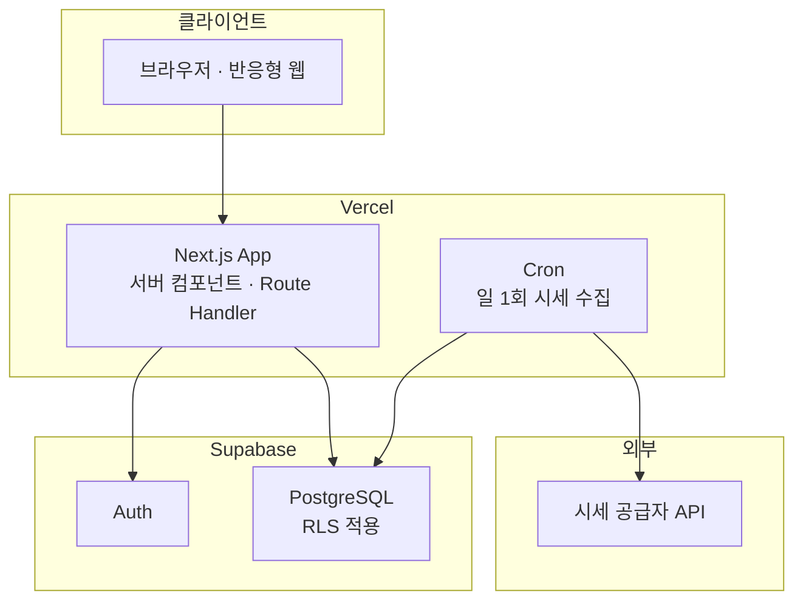

# 아키텍처 및 기술 결정 (ADR)

**언제들어오나** — ELS 통합관리 시스템

| 항목 | 내용 |
|---|---|
| 문서 ID | DOC-010 |
| 버전 | 0.1 (초안) |
| 작성일 | 2026-07-26 |
| 작성자 | 민서 |
| 선행 문서 | DOC-001 개요서 v0.4, DOC-002 데이터 모델 v0.1, DOC-007 계산 로직 명세 v0.1, DOC-008 화면 목록 v0.1 |
| 상태 | 검토 중 |

### 변경 이력

| 버전 | 일자 | 작성자 | 변경 내용 |
|---|---|---|---|
| 0.1 | 2026-07-26 | 민서 | 최초 작성. ADR-001 ~ ADR-006 등재 |

---

## 1. 목적

본 문서는 시스템 아키텍처와 주요 기술 결정을 기록한다. 각 결정은 **ADR(Architecture Decision Record)** 형식으로 맥락·선택지·근거·결과를 함께 남긴다.

ADR을 사용하는 이유는 결론뿐 아니라 **왜 다른 선택지를 배제했는지**를 보존하기 위해서다. 시간이 지나 제약이 바뀌면 결정을 뒤집어야 하는데, 근거가 없으면 재검토가 불가능하다.

**ADR 상태 값:** `제안` / `채택` / `대체됨` / `폐기`

---

## 2. 아키텍처 제약 요약

결정의 전제가 되는 제약이다. 상세는 DOC-001 §7 참조.

| ID | 제약 | 아키텍처 함의 |
|---|---|---|
| C-01 | 무료 티어 내 운영 | 상시 구동 서버 비용 발생 구조 회피 |
| C-02 | 1인 개발, 학업 병행 | 운영 부담이 큰 구성 회피 |
| C-03 | 시세 API 무료 한도 | 배치 수집 + 폴백 필수 |
| A-01 | 동시 사용자 10명 이하 | 확장성 최적화 불필요 |
| A-05 | 폐쇄형(초대 기반) 등록 | 공개 회원가입 흐름 불필요 |
| R-05 | 학기 중 중단 가능성 | 기능 단위로 배포 가능한 구조 |
| S-10 | 전체 조회 / 소유자만 수정 | 권한 모델이 단순하고 규칙적 |

---

## 3. 시스템 구성



**구성 요소별 책임**

| 구성 요소 | 책임 |
|---|---|
| Next.js App | 화면 렌더링, 도메인 계산, 데이터 접근 |
| Supabase Auth | 인증, 세션 관리 |
| PostgreSQL + RLS | 데이터 저장, **권한 강제** |
| Cron | 시세 배치 수집 |
| 시세 공급자 | 기초자산 종가 제공 |

---

## 4. 아키텍처 결정 기록

### ADR-001. 애플리케이션 아키텍처 — Next.js 풀스택

**상태:** 채택

**맥락**

화면 12개 규모, 사용자 10명 이하, 1인 개발. 인증·데이터 저장·주기 실행 작업이 필요하다. 계산 로직 비중이 높고 정확성이 중요하다.

**검토한 선택지**

| 선택지 | 장점 | 단점 |
|---|---|---|
| A. Next.js 풀스택 | 단일 언어·레포·배포. 서버 컴포넌트로 계산을 서버에서 수행 가능 | 플랫폼 종속 |
| B. SPA + 별도 API 서버 | 프론트/백 분리, 서버 기술 독립 | 배포 2곳, 무료 티어에서 상시 구동 서버 확보 어려움(C-01), 운영 부담 증가(C-02) |
| C. SPA + BaaS 직접 호출 | 서버 코드 최소 | 계산 로직이 클라이언트에 노출·중복. 배치 작업 별도 수단 필요 |

**결정** — A를 채택한다.

**근거**

C-01·C-02가 결정적이다. 별도 API 서버는 무료 티어에서 상시 구동을 보장받기 어렵고(콜드 스타트·슬립), 1인 학업 병행 조건에서 배포 대상이 둘로 늘어나는 비용이 크다. 프론트/백 분리의 이점(독립 배포, 팀 분업)은 본 프로젝트 규모에서 실현되지 않는다.

**결과**

- 단일 저장소·단일 배포로 R-05(중단 리스크) 대응이 쉬워진다
- 플랫폼 종속이 발생하나, 도메인 로직을 프레임워크 비종속 모듈로 분리하여(ADR-003) 이전 비용을 낮춘다

---

### ADR-002. 데이터베이스 및 인증 — Supabase (PostgreSQL + Auth + RLS)

**상태:** 채택

**맥락**

권한 모델이 명확하고 규칙적이다 — **모든 사용자가 전체 조회 가능, 생성·수정·삭제는 소유자만**(S-10). 등록은 초대 기반 폐쇄형이다(A-05).

**검토한 선택지**

| 선택지 | 장점 | 단점 |
|---|---|---|
| A. Supabase | PostgreSQL + Auth + RLS 통합. 무료 티어 | 플랫폼 종속 |
| B. 관리형 Postgres + 자체 인증 | 구성 자유도 | 인증 직접 구현, 권한을 애플리케이션 코드로 강제 |
| C. 자체 호스팅 | 완전한 통제 | 운영 부담이 C-02와 충돌 |

**결정** — A를 채택한다.

**근거**

**권한 모델이 RLS 정책과 정확히 대응한다는 점이 핵심이다.**

```sql
-- 조회: 인증된 모든 사용자
create policy "read_all" on els_products
  for select to authenticated using (true);

-- 변경: 소유자만
create policy "write_own" on els_products
  for all to authenticated
  using (owner_id = auth.uid())
  with check (owner_id = auth.uid());
```

권한을 애플리케이션 코드가 아니라 **데이터베이스가 강제**하므로, 쿼리 작성 실수로 타인 데이터를 수정하는 경로가 원천 차단된다. 이는 DOC-002 D-01("이중 집계를 스키마 수준에서 불가능하게 만든다")과 동일한 설계 철학이며, **정합성을 규율이 아니라 구조로 보장한다**는 원칙의 일관된 적용이다.

**결과**

- 권한 검증 코드가 화면·API마다 흩어지지 않는다
- RLS 정책 자체가 테스트 대상이 된다 (DOC-012 테스트 계획에 포함)
- 시세·자산 테이블은 공용 데이터이므로 별도 정책을 적용한다(DOC-008 SCR-302 참조)

---

### ADR-003. 계산 로직 배치 — 순수 모듈 분리

**상태:** 채택

**맥락**

DOC-007이 정의한 22개 검증 케이스는 회귀 테스트로 고정되어야 한다(K-08). 동시에 세금 화면(SCR-401)은 입력 변경이 즉시 반영되는 시뮬레이터로 동작해야 한다.

**검토한 선택지**

| 선택지 | 장점 | 단점 |
|---|---|---|
| A. 서버에서만 계산 | 로직 단일 지점 | 시뮬레이터 조작마다 왕복 발생 |
| B. 클라이언트에서만 계산 | 즉시 반응 | 로직이 클라이언트에 종속. 저장값 신뢰 불가 |
| C. 순수 모듈로 분리 후 양쪽에서 실행 | 즉시 반응 + 단일 구현 | 모듈 경계 규율 필요 |

**결정** — C를 채택한다.

**설계**

계산 로직을 **입출력이 없는 순수 함수 모듈**로 분리한다.

- 입력은 원시값(숫자·열거형)만 받는다. DB 레코드나 요청 객체를 직접 받지 않는다
- 데이터베이스·네트워크·환경변수에 접근하지 않는다
- 세율 등 상수는 **인자로 주입**한다. 모듈이 직접 조회하지 않는다

```
lib/tax/       비교과세, 건강보험료, 부담률
lib/domain/    워스트오브, 조건 판정, 평가일 생성, 수령액
```

**근거**

순수성을 유지하면 (1) 테스트가 DB·네트워크 없이 실행되고, (2) 서버·클라이언트 어디서든 동일 결과를 보장하며, (3) 프레임워크를 교체해도 도메인 자산이 보존된다.

**결과**

- DOC-007 §10의 검증 케이스가 그대로 단위 테스트가 된다
- 시뮬레이션은 클라이언트에서 즉시 계산하고, **저장 시점에는 서버에서 재계산하여 검증**한다
- 상수 주입 구조가 ADR-005(연도별 상수 관리)와 맞물린다
- 순수성은 규율에 의존하므로, `lib/tax`·`lib/domain`이 `lib/db`·`app`을 import하지 못하도록 **린트 규칙으로 강제**한다

---

### ADR-004. 시세 공급자 — 어댑터 추상화 도입, 공급자 선정은 분리

**상태:** 채택 (공급자 선정은 ADR-007로 분리)

**맥락**

기초자산은 해외 상장 주식 중심이며 국내 종목·지수도 지원해야 한다(A-03). 무료 API는 한도·정책이 자주 변경되며, 이는 R-02로 이미 식별된 리스크다.

**결정**

공급자 선정에 앞서 **어댑터 인터페이스를 확정**하고, 구체 공급자는 별도 ADR로 분리한다.

```ts
interface PriceProvider {
  readonly id: string;
  fetchDailyClose(
    symbols: string[],
    date: Date
  ): Promise<Array<{ symbol: string; price: Decimal }>>;
}
```

- 도메인 코드는 `assets`만 참조하며 공급자 심볼을 알지 못한다
- 공급자별 심볼은 `asset_provider_symbols`에서 조회한다(DOC-002 §4.4)
- 수집 실패는 예외가 아니라 **결과 누락**으로 처리하고, 해당 자산은 수동 입력 폴백 경로로 유도한다(DOC-008 ST-03)

**근거**

DOC-002 M-07·D-05에서 이미 스키마 수준의 격리를 마쳤다. 공급자를 먼저 고르고 그에 맞춰 설계하는 것은 순서가 반대다. **어댑터가 확정되면 공급자 선정은 교체 가능한 결정으로 격하된다.**

**결과**

- Q-03이 미결인 상태에서 구현을 시작할 수 있다
- 개발 중에는 고정값을 반환하는 스텁 어댑터로 진행 가능하다
- 공급자 선정 시 검토 기준: 해외·국내 종목 커버리지, 무료 한도, 이용 약관상 개인 프로젝트 허용 여부, 종가 제공 시점

---

### ADR-005. 연도별 상수 관리 — 마이그레이션 시드

**상태:** 채택

**맥락**

세율·보험요율은 연도별로 변경된다(A-02). 회귀 테스트(K-08)는 과거 연도 계산이 동일하게 재현되는 것을 전제한다.

**결정**

`tax_brackets`·`tax_constants`를 **버전 관리되는 마이그레이션**으로 관리한다. 연도 추가는 데이터 마이그레이션 파일로 수행하며, **기존 연도 레코드는 수정하지 않는다.**

**근거**

상수를 코드에 두면 연도 변경마다 배포가 필요하고 과거 계산의 재현성이 깨진다. 관리자 UI로 편집 가능하게 하면 값 변경 이력이 남지 않아 "왜 작년 계산 결과가 달라졌는가"에 답할 수 없다.

**결과**

- 세법 개정 시 마이그레이션 파일 추가만으로 대응한다
- 과거 연도 계산이 영구히 재현된다
- 오류 정정이 필요한 경우에도 신규 마이그레이션으로 처리하여 이력을 보존한다

---

### ADR-006. 배포 및 스케줄링 — Vercel + Cron

**상태:** 채택

**맥락**

일 1회 시세 수집이 필요하다(O-04). 상시 구동 워커는 C-01과 충돌한다.

**결정**

Vercel에 배포하고, 시세 수집은 Cron으로 호출되는 Route Handler로 구현한다.

**환경 분리**

| 환경 | 용도 | 데이터베이스 |
|---|---|---|
| `production` | 실사용 | 운영 인스턴스 |
| `preview` | PR 단위 검증 | 개발 인스턴스 |
| `local` | 개발 | 로컬 또는 개발 인스턴스 |

**결과**

- 배치 전용 인프라가 불필요하다
- Cron 엔드포인트는 인증이 필요하다(비밀 토큰 검증). 미보호 시 외부에서 API 한도를 소진시킬 수 있다
- 수집 결과는 성공·실패 건수를 로깅하여 무음 실패를 방지한다

---

## 5. 모듈 구조

```
src/
├── app/                   라우트 (SCR-xxx 대응)
│   ├── (auth)/login/
│   ├── products/
│   ├── schedule/
│   ├── tax/
│   ├── forecast/
│   ├── prices/
│   └── api/cron/prices/
├── components/            UI 컴포넌트
├── lib/
│   ├── tax/               ★ 순수 — 세금 계산 (DOC-007 §5, §6)
│   ├── domain/            ★ 순수 — 조건 판정·일정·수령액 (DOC-007 §3, §4)
│   ├── db/                데이터 접근
│   ├── providers/         시세 어댑터 (ADR-004)
│   └── auth/
└── types/

supabase/
├── migrations/            스키마 + RLS 정책
└── seed/                  세율·요율 (ADR-005)

tests/
├── tax/                   TC-01 ~ TC-18
├── domain/                TC-19 ~ TC-22
└── rls/                   권한 정책 검증
```

**★ 표시 모듈의 의존 규칙**

| 규칙 | 내용 |
|---|---|
| DEP-01 | `lib/tax`·`lib/domain`은 `lib/db`, `lib/providers`, `app`을 import할 수 없다 |
| DEP-02 | 두 모듈은 프레임워크 API를 사용하지 않는다 |
| DEP-03 | 세율 등 상수는 인자로 주입받는다 |
| DEP-04 | 위 규칙은 린트 설정으로 강제하며, CI에서 검사한다 |

---

## 6. 데이터 흐름

### 6.1 화면 조회

```
요청 → 인증 확인 → DB 조회(RLS 적용)
     → lib/domain 조건 판정 → lib/tax 세액 산출 → 렌더링
```

계산은 서버 컴포넌트에서 수행하는 것을 기본으로 한다. 클라이언트 계산은 시뮬레이션 등 즉시 반응이 필요한 경우로 한정한다.

### 6.2 시세 수집 (일 1회)

```
Cron → 토큰 검증 → 대상 자산 조회(미상환 상품의 기초자산)
     → asset_provider_symbols 매핑 → 공급자 호출
     → asset_prices UPSERT → 수집 결과 로깅
```

**설계 주의**

- 대상은 **미상환 상품의 기초자산으로 한정**한다. 상환 완료 상품의 자산까지 조회하면 API 한도를 낭비한다
- `UNIQUE(asset_id, as_of_date)` 제약이 있으므로 중복 실행은 UPSERT로 흡수된다
- 일부 자산 실패가 전체 배치를 중단시키지 않는다

### 6.3 상환 처리

```
입력 → 클라이언트 검증 → 서버 액션
     → 소유자 확인(RLS) → lib/domain 재계산 검증
     → redemptions INSERT (단일 트랜잭션)
```

`UNIQUE(els_id)` 제약으로 중복 상환이 차단된다(DOC-002 I-01).

---

## 7. 보안 및 권한

| ID | 항목 | 방식 |
|---|---|---|
| SEC-01 | 인증 | Supabase Auth 세션 |
| SEC-02 | 인가 | PostgreSQL RLS (ADR-002) |
| SEC-03 | 계정 생성 | 초대 기반. 공개 가입 비활성화 (A-05) |
| SEC-04 | Cron 엔드포인트 | 비밀 토큰 검증 |
| SEC-05 | 비밀값 관리 | 환경변수. 저장소에 커밋 금지 |
| SEC-06 | 클라이언트 노출 | 공개 키 외 서버 전용 키를 클라이언트 번들에 포함하지 않음 |

**권한 정책 요약**

| 테이블 | 조회 | 변경 |
|---|---|---|
| `els_products` 및 하위 | 전체 인증 사용자 | 소유자 |
| `redemptions` | 전체 인증 사용자 | 상품 소유자 |
| `tax_profiles` | **본인만** | 본인 |
| `assets`, `asset_prices` | 전체 | 전체 (공용 데이터) |
| `tax_brackets`, `tax_constants` | 전체 | 없음 (마이그레이션 전용) |

> **`tax_profiles`만 조회를 본인으로 제한한다.** 금융소득 외 종합소득 과세표준은 ELS와 무관한 개인 소득 정보이므로, 전체 공개 대상인 보유 현황과 성격이 다르다.

---

## 8. 품질 목표 대응

| 지표 | 목표 | 아키텍처 대응 |
|---|---|---|
| K-08 세금 계산 검증 | 100% | ADR-003 순수 모듈 + 단위 테스트 |
| K-09 LCP | 2.5초 이내 | 서버 컴포넌트 렌더링, 계산 결과 캐싱 |
| K-04 정합성 오류 | 0건 | DB 제약(I-01~I-06) + RLS |
| K-02 수동 입력 | 0회 | ADR-004 배치 수집 + 폴백 |

---

## 9. 미결정 사항

| ID | 항목 | 상태 | 비고 |
|---|---|---|---|
| AQ-01 | 시세 공급자 선정 | 미결 | ADR-007로 분리. 어댑터 확정으로 구현 차단은 해소됨 |
| AQ-02 | 계산 결과 캐싱 전략 | 미결 | 시세·프로필 변경 시 무효화 범위 |
| AQ-03 | 오류 추적 도구 도입 | 미결 | 무료 티어 범위 내 검토 |
| AQ-04 | 데이터 백업 주기 | 미결 | DOC-013 운영 문서에서 확정 |
| AQ-05 | 세율 마이그레이션 검증 절차 | 미결 | 신규 연도 추가 시 회귀 테스트 재실행 기준 |

---

*본 문서는 프로젝트 진행에 따라 갱신되며, ADR은 대체 시에도 삭제하지 않고 상태만 변경한다.*
