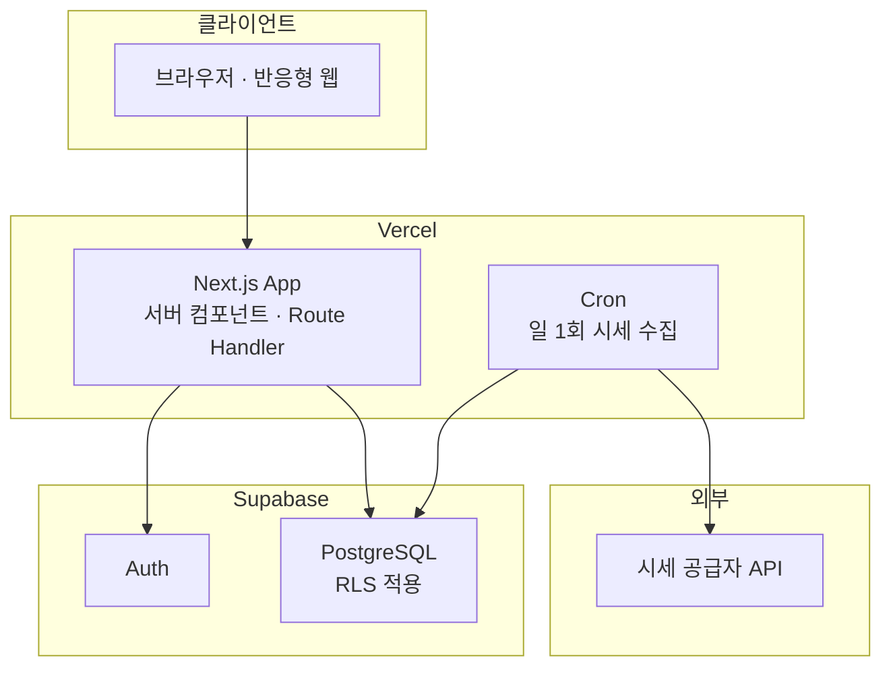

# 아키텍처 및 기술 결정 (ADR)

**언제들어오나** — ELS 통합관리 시스템

| 항목 | 내용 |
|---|---|
| 문서 ID | DOC-010 |
| 버전 | 1.5 |
| 작성일 | 2026-07-26 |
| 작성자 | 민서 |
| 선행 문서 | DOC-001 개요서 v0.4, DOC-002 데이터 모델 v0.5, DOC-007 계산 로직 명세 v0.5, DOC-008 화면 목록 v0.3 |
| 상태 | 검토 중 |

### 변경 이력

| 버전 | 일자 | 작성자 | 변경 내용 |
|---|---|---|---|
| 0.1 | 2026-07-26 | 민서 | 최초 작성. ADR-001 ~ ADR-006 등재 |
| 1.5 | 2026-07-29 | 민서 | **P4 컷 10 — §9에 AQ-35 신설, AQ-33 보완, P4 종료 반영.** (1) **AQ-35 — DOC-008 §5의 「주요 요소」 ↔ 뷰 필드 대조가 SCR-101에만 있다.** 컷 9가 드러낸 결함(⑤에 자료원이 없었다)이 그 대조의 부재였고, 그것은 DOC-011 §8.1이 분류한 넷 중 **계약 문서 안에서는 보이지 않는 유일한 부류**다. 지금 SCR-101만 기계적으로 대조되며 나머지 아홉 화면이 옳다고 볼 근거는 사람의 기억뿐이다 — 권고는 화면별 대응표이고 판단 시점은 P6(DOC-009를 쓰며 요소를 다시 열거하는 단계)이다. (2) **AQ-33 보완 — `supabase/dev/`의 존재 이유가 한 번 더 좁아졌다.** 컷 6이 「유일한 경로」를 ergonomics로 바꿨고, 컷 9의 `tests/e2e/helpers/defects.ts`가 같은 기법으로 결함 둘을 스위트 안에서 만들면서 「ST-06 검증의 유일한 방법」도 참이 아니게 되었다. 남는 이유는 **브라우저로 눈으로 보는 편의 하나**이며 실측으로 두 파일이 그대로 적용됨을 확인했다(12행 + 2행, 오류 0). **닫지 않는다** — 편의가 계약 우회(V-10·원천징수 산출)를 정당화하지 않는다. (3) **P4 종료.** 화면 12개가 전부 섰고 자리표시는 `/forecast` 하나(P4b — 화면이 아니라 계약 신설)다. 스위트 **697 + 169 + 219 + 108** |
| 1.4 | 2026-07-29 | 민서 | **P4 컷 9 — AQ-34 종결 + §5 트리에 컷 7·8·9 산출물 등재.** (1) **AQ-34를 권고 (a)로 닫았다** — `supabase/seed/04_e2e_user.sql`의 e2e 전용 사용자이며 **둘이다.** 하나로는 안 되는 이유가 그 항목의 조건에 있다: 상태의 정의가 「다가오는 차수가 하나도 없다」인데 SCR-101 ①의 내용은 그 반대를 요구하므로, 한 사용자로 둘을 만들면 「먼저 빈 상태를 보고 나중에 상품을 만든다」가 단언의 전제가 된다 — **순서가 데이터인 초록색**이다. 그 항목이 「확인이 필요하다」고 적어 둔 RLS·`listUserSummaries` 단언과의 충돌을 실측으로 배제했다(전부 id 필터 또는 `.find()`이므로 고정 건수 단언이 없다). **부수 효과가 항목보다 크다** — 전용 사용자의 `scope='MINE'` 집계를 **값으로** 단언할 수 있게 되었다(다른 스위트의 커밋된 픽스처가 섞이지 않는다). (2) **§5 트리에 `components/schedule|tax|home`·`lib/format/schedule.ts`·`lib/format/dashboard.ts`·`seed/04` 등재.** 후자에 근거를 적었다 — 「임박」의 경계와 표시 건수는 **계약이 화면에 넘긴 판단**이고(DOC-011 §4.1이 기간 창을 두지 않는다) 화면 안에 두면 AQ-23의 공백에 들어가므로 순수 모듈에 둔다. (3) 스위트 재측정: **695 + 169 + 219 + 104** |
| 1.3 | 2026-07-29 | 민서 | **P4 컷 7 — §9에 AQ-34 신설.** SCR-301의 셋째 빈 상태(§6 「예정 평가일 없음」 = 전 차수 경과 상태)를 **어느 스위트도 렌더하지 않는다.** 조건이 「한 소유자의 전 상품이 전 차수 경과」인데 e2e의 두 사용자가 integration의 커밋된 픽스처를 공유하고 그중 하나가 미래 평가일을 갖는다 — **다른 스위트의 데이터가 이 상태의 성립을 막는다.** AQ-32와 부류가 다르다(저쪽은 관찰 수단이 없고 이쪽은 데이터 상태를 만들 수 없다). 그 분기의 **입력**은 검증된다(`splitByPast`가 지난 것만 있는 목록에 `upcoming = []`를 낸다) — 남는 것은 문구가 그 자리에 렌더된다는 것 하나다. 권고 수단은 e2e 전용 사용자이고 판단 시점은 컷 9다(SCR-101의 「임박 평가일 없음」이 같은 형태이므로 함께 닫힌다) |
| 1.2 | 2026-07-28 | 민서 | **P4 컷 5·6 — §9의 판단 시점 하나에 도달했고 항목 하나가 새로 열렸다.** (1) **AQ-32의 잔여 셋이 둘로 줄었다.** 이 항목이 「판단 시점은 SCR-203·204가 서는 컷 4b~6」이라고 스스로 지정했고 그 컷이 끝났다. **②(입력값 보존의 UI 수준 확인)는 닫는다** — 사용자가 JS 없이 보는 것은 서버가 렌더한 문서의 `value` 속성이고 `tests/e2e/`가 그것을 직접 본다(쉼표까지 원문 그대로 살아 있음을 확인했다). **①(ST-04 숨김 vs 비활성화)은 좁아졌다** — 비활성화라는 표현 수단이 코드에 없고 소유자/타인 대조가 음성 대조로 갈린다. 남는 잔여는 「요소가 있으면서 CSS로 숨겨졌을 가능성」이며 그것을 만드는 코드 경로가 없다. **③(라우터 캐시)은 그대로**이고 Playwright는 도입하지 않는다. (2) **AQ-33 신설 — `supabase/dev/` 표본의 상환·KI가 계약을 우회한다.** 상품은 `create_els_product`를 부르지만 상환은 SQL 함수가 아니라 PostgREST `.insert()`이므로 psql에서 부를 대상이 없고, 그래서 표본이 **계약으로 도달할 수 없는 상태를 담을 수 있다**(V-10과 원천징수 산출은 계약 계층에만 있다). 컷 6이 네 상태(④⑦⑧⑫)의 **앱 도달 가능성을 실측했으므로** 대체 수단은 실재하며, 남는 것은 한 명령으로 12상태를 재현하는 편의와 그 대가다 |
| 1.1 | 2026-07-28 | 민서 | **P4 컷 2·3 — §5 트리에 산출물 등재 + `supabase/dev/` 신설.** (1) **`supabase/dev/`가 트리에 들어왔다** — `seed/`의 `sql_paths`가 글롭이므로 표본 상품을 그쪽에 두면 `tests/integration/`의 **필터 없는 전역 건수 단언**이 잘못된 이유로 깨진다. 글롭 밖에 두고 `db:reset`이 지우게 하면 격리가 규율이 아니라 구조다. **사용자만 예외로 `seed/`에 둔다** — 그쪽 단언은 전부 id로 필터하고, 매 리셋에 살아 있어야 로그인할 수 있다. 표본은 손으로 INSERT하지 않고 `create_els_product`를 부른다(계약과 같은 함수 → I-07·CHECK 강제, `owner_id`는 `auth.uid()`). **실측한 함정 하나를 CLAUDE.md에 적었다**: `set local role`은 트랜잭션 안에서만 동작하고 밖에서는 경고만 남기며 `postgres`가 `rolbypassrls`이므로 **빠뜨림이 실패가 아니라 조용한 성공**이 된다. 그래서 dev 스크립트가 `current_user`와 `auth.uid()`를 스스로 단언한다. (2) **§5 트리에 `components/products`·`components/display|state|form`·`lib/forms/query.ts`·`tests/app`·`tests/e2e` 등재.** (3) `tests/app/invalidation.test.ts`의 원장이 **둘로 갈렸다** — `NOT_YET_BUILT`(파일 없음)와 `placeholderRoutes()`(자리표시). 자리표시를 세우고 앞의 표에서 지우면 숫자만 줄어들어 「화면이 섰다」로 읽히므로 **합계를 단언한다**. 계획 §4의 `grep PendingScreen` 절차가 테스트가 되었다 |
| 1.0 | 2026-07-28 | 민서 | **P4 착수 전 선행 정정 (U-01).** (1) **§5 트리에 `src/proxy.ts` 등재 — `middleware.ts`가 아니다.** Next 16.2.12 실측: `PROXY_FILENAME = 'proxy'`(`next/dist/lib/constants.js:289`), `middleware` 규약은 deprecated이며 두 파일이 함께 있으면 빌드 에러(`build/index.js:645,651`), `Route segment config is not allowed in Proxy file — Proxy always runs on Node.js runtime`(`build/analysis/get-page-static-info.js:587`). **마지막 사실이 위험 하나를 없앴다** — 구 Edge 런타임이었다면 `env.ts`의 `process.env[name]`이 계산된 멤버 접근이라 인라인되지 않아 요청 시점에 던졌을 것이고, 프록시는 전 경로에 걸리므로 앱 전체가 죽었을 것이다. (2) **"`next`를 import하는 유일한 파일"이 거짓이 되었다** — 둘이다. 린트 경계(`DB_NEXT_BOUNDARY`)는 넓히지 않고 **위치로 유지한다**: 프록시는 `src/lib/db/**` 밖이며 `@/lib/db/client`의 어댑터만 가져다 쓴다. 대가로 AQ-23의 공백이 한 파일 넓어지고 그것을 `tests/e2e/`가 받는다. (3) **스위트가 넷이 되었다** — `tests/e2e/`(`next build` + `next start`) 신설. 앞의 셋이 구조적으로 볼 수 없는 것(리다이렉트·응답 헤더·`NextResponse.redirect()`의 쿠키 유실)을 브라우저 없이 실 HTTP로 본다. (4) §5 트리에 `lib/format`·`lib/forms`·`lib/routes`·`lib/auth`·`app/error.tsx` 등 P4 산출물 등재, `api/cron`이 프록시 매처 예외임을 명기 |
| 0.9 | 2026-07-28 | 민서 | P3b 산출물 대조 검증(P3b.5)에 따른 정정. (1) **§9 AQ-19 보완 — 드리프트 대조의 축이 열 *이름*뿐임을 명시.** `types-drift.test.ts`가 비교하는 것은 테이블별 열 이름 집합이고 **널 허용은 보지 않는다.** `numeric` 열 목록은 정확 배열로 고정되어 타입 축이 부분적으로 막혀 있으나, **함수의 `Returns`는 대조 대상이 아예 아니다**(파서가 `Tables:` 블록만 읽는다) — 그 값이 DOC-011 §5.2 각주가 말한 `update_els_product`의 `string` vs `string \| null`이며 복원은 여전히 사람이 기억하는 규율이다. (2) **§7·§9 AQ-28에 `search_path` 축 추가** — 함수 축을 전 열거하면서 `prosecdef`·`PUBLIC`의 `EXECUTE`·롤별 실행 가능 목록 셋만 보고 `proconfig`를 보지 않았다. `set search_path = ''` 없이 추가된 함수가 조용히 통과하는 상태였다. P3b.5가 전 함수 열거 단언을 추가했다. (3) **AQ-23 재확인** — P3b.5 감사가 `src/app/actions.ts`·`src/lib/db/server.ts`가 세 스위트 전부의 밖에 있음을 독립적으로 확인했다. **등재 내용이 실제와 일치하며 새로 발견된 공백은 없다.** 상태·닫히는 조건 모두 변경 없음 |
| 0.8 | 2026-07-28 | 민서 | P3b 구현 완료 반영. (0) **§7.1에 AQ-28의 *이유*를 등재 — 네 케이스 실측.** 종전 서술은 "`alter default privileges`가 함수에 적용되지 않는다"까지만 적어 설정 실수로 오해될 수 있었다. 원인은 그런 종류가 아니다: `pg_default_acl` 항목은 내장 기본값을 **대체하지 않고 그 위에 얹히고**, 함수의 내장 기본값에는 `EXECUTE TO PUBLIC`이 있다 — 저장 목록에서 `PUBLIC`을 빼도 **뺄 것이 없으며**(케이스 B) 내장 기본값이 다시 부여한다(케이스 D에서 저장 목록에 `PUBLIC`이 없는데도 객체 ACL에 `=X/`가 나타난다). 케이스 A의 `proacl = null`은 "권한 없음"이 아니라 "내장 기본값 그대로"이며 함수에서 그것은 전면 개방이다. 테이블 대조(케이스 E)로 **차이가 우리 설정이 아니라 내장 기본값에 있음**을 확정했다 — 설정으로는 닫을 수 없고 함수마다 개별 `revoke`가 유일한 수단이다. (0-1) **AQ-23의 닫히는 조건을 명시** — 방어를 고르지 못해 열린 것이 아니라 **실행할 진입점이 없어** 열려 있으며, P4 선행 조건 ②③④와 같은 작업에서 함께 닫힌다(DOC-000 §3). (1) **§9 AQ-23 보완 — 공백이 넓어졌다.** `server.ts`에 `getMutations()`가 생겼고, 그 안의 **미인증 분기(W-03)**와 **쓰기 가능 쿠키 어댑터**는 조회에 없던 경로인데 같은 이유로 테스트 그래프 밖이다. `src/app/actions.ts`에 위임 외의 로직을 두지 않은 것이 그 공백의 크기를 제한하는 유일한 수단이다. (2) §5 트리에서 `integration/`의 범위를 조회·변경으로 넓히고 **쓰기 함수의 원자성이 그 스위트에서만 측정된다**는 사실을 명기. (3) ADR-004 — 인터페이스를 `src/lib/providers/types.ts`에 코드로 확정하고 레지스트리를 **빈 배열로** 두었다(§5.8이 `PROVIDER_UNAVAILABLE`을 반환하는 근거) |
| 0.7 | 2026-07-27 | 민서 | P3b 변경 계약 착수에 따른 정정. **본 버전은 선행 명세다 — 구현은 P3b 3단계 이후.** (0) **§7에 함수 권한 축 신설 + §7.1 규약에 함수 행 추가.** DOC-011 §5.1·§5.2가 쓰기 함수 2개를 도입하는데, 함수는 `EXECUTE`가 **기본으로 `PUBLIC`에 부여**되고 `SECURITY DEFINER`로 쓰면 RLS가 통째로 우회된다 — 뷰의 `security_invoker`(AQ-20)·신규 테이블의 TRUNCATE와 같은 fail-open 부류다. **카탈로그 테스트의 모든 질의가 `relkind = 'r'`이므로 함수는 현재 전 단언 밖에 있다.** §9 **AQ-28 신설**. (1) **§9 AQ-14를 부분 해소로 갱신** — 쓰기 함수가 하위 행 수를 검사하므로 I-07의 예방이 계약 경로에서 두 층이 된다. 계약 밖(수동 SQL·직접 호출)은 여전히 한 층도 없다. (2) **§6.3 상환 처리 흐름의 "`lib/domain` 재계산 검증"을 정정(U-03)** — A-04와 DOC-011 §4.3은 증권사 확정값을 시스템 추정값으로 대체하지 않는다고 규정하고 §5.4에는 그런 반환 필드도 없다. 실제로 순수 모듈이 하는 일은 **원천징수 기본값 산출**이다. (3) **§5 모듈 구조에 `db/mutations/`·`db/validate/`·`providers/`·`app/actions.ts` 등재.** (4) **ADR-004에 인터페이스 확정과 공급자 0개 동작 기록** — 등록 공급자가 없으면 `refreshPrices`는 `PROVIDER_UNAVAILABLE`이며 스텁 값을 `asset_prices`에 넣지 않는다 |
| 0.6 | 2026-07-27 | 민서 | P3a 산출물 대조 검증(P3a.5)에 따른 정정. (1) **§9 AQ-23 신설** — 조회 계층 **바깥 경계**가 검증되지 않는다. `src/lib/db/server.ts`는 `next/headers`를 import하므로 테스트 그래프에서 의도적으로 제외되어 있고, 그 결과 `cache()`가 기준일·`getUser()`를 요청당 한 번으로 접는지, `viewerId`가 실제로 `getUser()`에서 오는지를 **아무 테스트도 실행하지 않는다.** DOC-011 Q-02를 "구조로 보장한다"고 적었으나 그 구조의 유일한 프로덕션 진입점이 검증 밖이다. 반대편 경계(뷰 → 클라이언트 직렬화)도 소비자가 없어(P4) 미검증이다. AQ-21과 같은 형태의 구멍이다. (2) **AQ-19 보완** — 타입 게이트를 우회하는 손수 작성 select 문자열 2곳을 등재 |
| 0.5 | 2026-07-27 | 민서 | P3a 2단계 **적용 + 실측 정정**. v0.4가 선행 명세로 예고한 설정 변경을 실제로 적용하고, 실측이 명세와 갈린 두 곳을 고쳤다. (0) **§7 SEC-03에 가입 차단의 실측 증거(전 `200` + 토큰 발급 + `users` 3행 전량 / 후 `422 signup_disabled`)를 표로 등재.** (1) **`[auth.email].enable_signup`은 끄지 않는다 — 계획 D10의 정정.** 그 값은 GoTrue의 `EXTERNAL_EMAIL_ENABLED`로 매핑되어 이메일 **로그인**까지 막는다(`422 email_provider_disabled`). 가입 차단은 `[auth].enable_signup` 하나로 성립한다. (2) **SEC-03을 검증하려다 로그인 자체가 `500`으로 죽어 있었음을 발견** — 시드의 `auth.users` 토큰 열 4개가 `NULL`. 시드를 고치고 **§9 AQ-21 신설**(인증 경로는 RLS 스위트가 구조적으로 지나지 않는다) |
| 0.4 | 2026-07-27 | 민서 | P3a 조회 계약 착수에 따른 정정. **본 버전은 선행 명세다 — 설정·마이그레이션 적용은 P3a 2단계 이후.** (0) **§7 SEC-03에 공개 가입이 실제로 열려 있었음을 기록하고 닫는다** — 로컬 설정의 `enable_signup`이 `true`이고 이메일 확인도 꺼져 있었다. P3a가 공개 키를 브라우저에 처음 싣는 단계이므로, **정책 32개가 전제하는 "아무나 `authenticated`가 될 수 없다"가 설정에서 깨진 상태**였다. RLS·GRANT·권한 매트릭스 테스트는 모두 그 롤 **안에서의** 분리만 검증하므로 누가 롤에 들어오는지는 어느 테스트도 보지 않는다. (1) **§7 권한 표의 `users` 조회를 열 단위로 축소** — 조회 계약 어디도 `email`을 쓰지 않는다(P2 이월 판단). (2) **§5 모듈 구조에 `lib/db` 하위와 테스트 스위트 3분할 반영.** (3) **§7에 환경변수 규약 추가** — 공개 키만 클라이언트 경로에 두고 `service_role`은 조회 경로에서 사용하지 않는다. (4) **§9 AQ-19·AQ-20 신설**(타입 생성 드리프트, 뷰의 `security_invoker`), AQ-14에 조회 계층의 대응 각주 |
| 0.3 | 2026-07-27 | 민서 | P2 산출물 대조 검증(P2.5)에 따른 정정. (0) **§7.1의 "GRANT 있음 + RLS 켜짐 + 정책 없음 → 기본 거부"에 TRUNCATE 예외 명기** — RLS는 TRUNCATE에 적용되지 않으므로, 규약(`enable row level security`)을 지킨 신규 테이블에서도 `authenticated`가 전 행을 삭제할 수 있었다. v0.2는 기본 권한을 `anon`에만 회수했고 `authenticated`의 기본 권한에는 TRUNCATE가 포함된다. 규약 표에 "기본 권한도 양쪽에서, 테이블·시퀀스 모두 회수" 행을 추가하고, **권한 표를 데이터로 박아 실제 GRANT와 대조하는 테스트를 방어의 정본으로 삼는다** — 플랫폼이 기본값을 재시딩하면 마이그레이션 쪽 회수는 신호 없이 무효가 된다. (1) **§7 권한 표에서 `assets`와 `asset_prices` 행 분리** — `asset_prices`의 수정 범위가 관측값으로 좁혀졌다(DOC-002 I-16). (2) **삭제 제외 근거 교체** — v0.2의 근거("타인 상품의 조건 판정이 깨진다")는 UPDATE에 더 강하게 적용되어 삭제만 막는 논거가 되지 못했다. 새 근거는 "정정은 UPSERT로 수행하므로 삭제 경로가 불필요하다"이며, 좌표 변경은 권한이 아니라 무결성 규칙(I-16)으로 막는다. (3) **§9 AQ-11~AQ-16 신설** |
| 0.2 | 2026-07-27 | 민서 | P2 스키마 착수에 따른 정정. (0) **§7.1 신설 — RLS는 GRANT 위에 얹히는 필터다.** 정책만 작성하고 Supabase의 암묵적 기본 권한을 전제했다가 `authenticated`에 DML이 없어 전 조회가 실패하는 상태를 실제로 만들었음. 신규 테이블에 자동 부여되는 권한은 플랫폼 버전에 따라 달라 보장되지 않는다. 테이블 추가 시 `enable row level security` 누락이 fail-open이 되는 함정을 규약으로 고정하고 테스트로 강제한다. (1) **§5 디렉터리 트리에서 세율·요율의 위치를 `seed/`에서 `migrations/`로 정정** — ADR-005 본문은 "버전 관리되는 마이그레이션"이라고 명시하는데 트리 주석만 `seed/`를 가리켜 자기모순이었고, `supabase db push`는 `migrations/`만 적용하므로 트리를 따르면 운영 DB에 세율이 영원히 들어가지 않는다. (2) **§7 권한 표에 `users`·`asset_provider_symbols`·`tax_years` 행 추가** — 세 테이블의 정책이 정의되지 않아 구현이 임의 결정을 강요받았음. (3) §7의 `assets`·`asset_prices` "변경 전체"에서 **DELETE 제외** 명시. (4) **§9 AQ-05 해결(P2)** |

---

## 1. 목적

본 문서는 시스템 아키텍처와 주요 기술 결정을 기록한다. 각 결정은 **ADR(Architecture Decision Record)** 형식으로 맥락·선택지·근거·결과를 함께 남긴다.

ADR을 사용하는 이유는 결론뿐 아니라 **왜 다른 선택지를 배제했는지**를 보존하기 위해서다. 시간이 지나 제약이 바뀌면 결정을 뒤집어야 하는데, 근거가 없으면 재검토가 불가능하다.

**ADR 상태 값:** `제안` / `채택` / `대체됨` / `폐기`

---

## 2. 아키텍처 제약 요약

결정의 전제가 되는 제약이다. 상세는 DOC-001 §7 참조.

| ID | 제약 | 아키텍처 함의 |
|---|---|---|
| C-01 | 무료 티어 내 운영 | 상시 구동 서버 비용 발생 구조 회피 |
| C-02 | 1인 개발, 학업 병행 | 운영 부담이 큰 구성 회피 |
| C-03 | 시세 API 무료 한도 | 배치 수집 + 폴백 필수 |
| A-01 | 동시 사용자 10명 이하 | 확장성 최적화 불필요 |
| A-05 | 폐쇄형(초대 기반) 등록 | 공개 회원가입 흐름 불필요 |
| R-05 | 학기 중 중단 가능성 | 기능 단위로 배포 가능한 구조 |
| S-10 | 전체 조회 / 소유자만 수정 | 권한 모델이 단순하고 규칙적 |

---

## 3. 시스템 구성



**구성 요소별 책임**

| 구성 요소 | 책임 |
|---|---|
| Next.js App | 화면 렌더링, 도메인 계산, 데이터 접근 |
| Supabase Auth | 인증, 세션 관리 |
| PostgreSQL + RLS | 데이터 저장, **권한 강제** |
| Cron | 시세 배치 수집 |
| 시세 공급자 | 기초자산 종가 제공 |

---

## 4. 아키텍처 결정 기록

### ADR-001. 애플리케이션 아키텍처 — Next.js 풀스택

**상태:** 채택

**맥락**

화면 12개 규모, 사용자 10명 이하, 1인 개발. 인증·데이터 저장·주기 실행 작업이 필요하다. 계산 로직 비중이 높고 정확성이 중요하다.

**검토한 선택지**

| 선택지 | 장점 | 단점 |
|---|---|---|
| A. Next.js 풀스택 | 단일 언어·레포·배포. 서버 컴포넌트로 계산을 서버에서 수행 가능 | 플랫폼 종속 |
| B. SPA + 별도 API 서버 | 프론트/백 분리, 서버 기술 독립 | 배포 2곳, 무료 티어에서 상시 구동 서버 확보 어려움(C-01), 운영 부담 증가(C-02) |
| C. SPA + BaaS 직접 호출 | 서버 코드 최소 | 계산 로직이 클라이언트에 노출·중복. 배치 작업 별도 수단 필요 |

**결정** — A를 채택한다.

**근거**

C-01·C-02가 결정적이다. 별도 API 서버는 무료 티어에서 상시 구동을 보장받기 어렵고(콜드 스타트·슬립), 1인 학업 병행 조건에서 배포 대상이 둘로 늘어나는 비용이 크다. 프론트/백 분리의 이점(독립 배포, 팀 분업)은 본 프로젝트 규모에서 실현되지 않는다.

**결과**

- 단일 저장소·단일 배포로 R-05(중단 리스크) 대응이 쉬워진다
- 플랫폼 종속이 발생하나, 도메인 로직을 프레임워크 비종속 모듈로 분리하여(ADR-003) 이전 비용을 낮춘다

---

### ADR-002. 데이터베이스 및 인증 — Supabase (PostgreSQL + Auth + RLS)

**상태:** 채택

**맥락**

권한 모델이 명확하고 규칙적이다 — **모든 사용자가 전체 조회 가능, 생성·수정·삭제는 소유자만**(S-10). 등록은 초대 기반 폐쇄형이다(A-05).

**검토한 선택지**

| 선택지 | 장점 | 단점 |
|---|---|---|
| A. Supabase | PostgreSQL + Auth + RLS 통합. 무료 티어 | 플랫폼 종속 |
| B. 관리형 Postgres + 자체 인증 | 구성 자유도 | 인증 직접 구현, 권한을 애플리케이션 코드로 강제 |
| C. 자체 호스팅 | 완전한 통제 | 운영 부담이 C-02와 충돌 |

**결정** — A를 채택한다.

**근거**

**권한 모델이 RLS 정책과 정확히 대응한다는 점이 핵심이다.**

```sql
-- 조회: 인증된 모든 사용자
create policy "read_all" on els_products
  for select to authenticated using (true);

-- 변경: 소유자만
create policy "write_own" on els_products
  for all to authenticated
  using (owner_id = auth.uid())
  with check (owner_id = auth.uid());
```

권한을 애플리케이션 코드가 아니라 **데이터베이스가 강제**하므로, 쿼리 작성 실수로 타인 데이터를 수정하는 경로가 원천 차단된다. 이는 DOC-002 D-01("이중 집계를 스키마 수준에서 불가능하게 만든다")과 동일한 설계 철학이며, **정합성을 규율이 아니라 구조로 보장한다**는 원칙의 일관된 적용이다.

**결과**

- 권한 검증 코드가 화면·API마다 흩어지지 않는다
- RLS 정책 자체가 테스트 대상이 된다 (DOC-012 테스트 계획에 포함)
- 시세·자산 테이블은 공용 데이터이므로 별도 정책을 적용한다(DOC-008 SCR-302 참조)

---

### ADR-003. 계산 로직 배치 — 순수 모듈 분리

**상태:** 채택

**맥락**

DOC-007이 정의한 22개 검증 케이스는 회귀 테스트로 고정되어야 한다(K-08). 동시에 세금 화면(SCR-401)은 입력 변경이 즉시 반영되는 시뮬레이터로 동작해야 한다.

**검토한 선택지**

| 선택지 | 장점 | 단점 |
|---|---|---|
| A. 서버에서만 계산 | 로직 단일 지점 | 시뮬레이터 조작마다 왕복 발생 |
| B. 클라이언트에서만 계산 | 즉시 반응 | 로직이 클라이언트에 종속. 저장값 신뢰 불가 |
| C. 순수 모듈로 분리 후 양쪽에서 실행 | 즉시 반응 + 단일 구현 | 모듈 경계 규율 필요 |

**결정** — C를 채택한다.

**설계**

계산 로직을 **입출력이 없는 순수 함수 모듈**로 분리한다.

- 입력은 원시값(숫자·열거형)만 받는다. DB 레코드나 요청 객체를 직접 받지 않는다
- 데이터베이스·네트워크·환경변수에 접근하지 않는다
- 세율 등 상수는 **인자로 주입**한다. 모듈이 직접 조회하지 않는다

```
lib/tax/       비교과세, 건강보험료, 부담률
lib/domain/    워스트오브, 조건 판정, 평가일 생성, 수령액
```

**근거**

순수성을 유지하면 (1) 테스트가 DB·네트워크 없이 실행되고, (2) 서버·클라이언트 어디서든 동일 결과를 보장하며, (3) 프레임워크를 교체해도 도메인 자산이 보존된다.

**결과**

- DOC-007 §10의 검증 케이스가 그대로 단위 테스트가 된다
- 시뮬레이션은 클라이언트에서 즉시 계산하고, **저장 시점에는 서버에서 재계산하여 검증**한다
- 상수 주입 구조가 ADR-005(연도별 상수 관리)와 맞물린다
- 순수성은 규율에 의존하므로, `lib/tax`·`lib/domain`이 `lib/db`·`app`을 import하지 못하도록 **린트 규칙으로 강제**한다

---

### ADR-004. 시세 공급자 — 어댑터 추상화 도입, 공급자 선정은 분리

**상태:** 채택 (공급자 선정은 ADR-007로 분리)

**맥락**

기초자산은 해외 상장 주식 중심이며 국내 종목·지수도 지원해야 한다(A-03). 무료 API는 한도·정책이 자주 변경되며, 이는 R-02로 이미 식별된 리스크다.

**결정**

공급자 선정에 앞서 **어댑터 인터페이스를 확정**하고, 구체 공급자는 별도 ADR로 분리한다.

```ts
interface PriceProvider {
  readonly id: string;
  fetchDailyClose(
    symbols: string[],
    date: Date
  ): Promise<Array<{ symbol: string; price: Decimal }>>;
}
```

- 도메인 코드는 `assets`만 참조하며 공급자 심볼을 알지 못한다
- 공급자별 심볼은 `asset_provider_symbols`에서 조회한다(DOC-002 §4.4)
- 수집 실패는 예외가 아니라 **결과 누락**으로 처리하고, 해당 자산은 수동 입력 폴백 경로로 유도한다(DOC-008 ST-03)

**근거**

DOC-002 M-07·D-05에서 이미 스키마 수준의 격리를 마쳤다. 공급자를 먼저 고르고 그에 맞춰 설계하는 것은 순서가 반대다. **어댑터가 확정되면 공급자 선정은 교체 가능한 결정으로 격하된다.**

**결과**

- Q-03이 미결인 상태에서 구현을 시작할 수 있다
- 개발 중에는 고정값을 반환하는 스텁 어댑터로 진행 가능하다
- 공급자 선정 시 검토 기준: 해외·국내 종목 커버리지, 무료 한도, 이용 약관상 개인 프로젝트 허용 여부, 종가 제공 시점

> **인터페이스를 코드로 확정하고, 공급자 0개 상태의 동작을 정한다 (v0.7, P3b).** `src/lib/providers/`에 위 인터페이스와 **빈 레지스트리**를 둔다. 등록된 공급자가 없는 동안 DOC-011 §5.8 `refreshPrices`는 `PROVIDER_UNAVAILABLE`을 반환한다 — `ok: true` + `succeeded: 0`이 아니다. 전자는 ST-03(수동 입력 폴백)으로 유도되고 후자는 "갱신했으나 대상이 없었다"로 읽히므로, 화면이 사용자에게 하는 말이 달라진다.
>
> **"스텁 어댑터로 진행 가능하다"의 범위를 좁힌다.** 스텁은 **테스트 안에서만** 쓴다. 고정값이 `asset_prices`에 `source = 'AUTO'`로 저장되면 그 값으로 워스트오브와 조건 판정이 이루어지고, **형식은 정상이며 값만 거짓**이므로 화면에 드러나지 않는다 — 시세가 없는 상태(E-01)는 드러나지만 시세가 틀린 상태는 드러나지 않는다. 공용 데이터이므로 피해도 타인 상품까지 간다.

---

### ADR-005. 연도별 상수 관리 — 마이그레이션 시드

**상태:** 채택

**맥락**

세율·보험요율은 연도별로 변경된다(A-02). 회귀 테스트(K-08)는 과거 연도 계산이 동일하게 재현되는 것을 전제한다.

**결정**

`tax_brackets`·`tax_constants`를 **버전 관리되는 마이그레이션**으로 관리한다. 연도 추가는 데이터 마이그레이션 파일로 수행하며, **기존 연도 레코드는 수정하지 않는다.**

**근거**

상수를 코드에 두면 연도 변경마다 배포가 필요하고 과거 계산의 재현성이 깨진다. 관리자 UI로 편집 가능하게 하면 값 변경 이력이 남지 않아 "왜 작년 계산 결과가 달라졌는가"에 답할 수 없다.

**결과**

- 세법 개정 시 마이그레이션 파일 추가만으로 대응한다
- 과거 연도 계산이 영구히 재현된다
- 오류 정정이 필요한 경우에도 신규 마이그레이션으로 처리하여 이력을 보존한다

---

### ADR-006. 배포 및 스케줄링 — Vercel + Cron

**상태:** 채택

**맥락**

일 1회 시세 수집이 필요하다(O-04). 상시 구동 워커는 C-01과 충돌한다.

**결정**

Vercel에 배포하고, 시세 수집은 Cron으로 호출되는 Route Handler로 구현한다.

**환경 분리**

| 환경 | 용도 | 데이터베이스 |
|---|---|---|
| `production` | 실사용 | 운영 인스턴스 |
| `preview` | PR 단위 검증 | 개발 인스턴스 |
| `local` | 개발 | 로컬 또는 개발 인스턴스 |

**결과**

- 배치 전용 인프라가 불필요하다
- Cron 엔드포인트는 인증이 필요하다(비밀 토큰 검증). 미보호 시 외부에서 API 한도를 소진시킬 수 있다
- 수집 결과는 성공·실패 건수를 로깅하여 무음 실패를 방지한다

---

## 5. 모듈 구조

```
src/
├── proxy.ts               ★ 세션 갱신 + 캐시 금지 헤더 (P4 ②④). Next 16의 파일 규약
│                            — middleware.ts가 아니다. 항상 Node.js 런타임
├── app/                   라우트 (SCR-xxx 대응)
│   ├── (auth)/login/      SCR-001 — **셸 밖**
│   ├── (app)/             셸 안 (layout.tsx = AppShell). 그룹이므로 URL에 없다
│   │   ├── page.tsx       SCR-101 `/`
│   │   ├── products/ schedule/ tax/ forecast/ prices/ settings/
│   │   └── …
│   ├── api/cron/prices/   ← proxy 매처에서 제외한다 (CR-01이 401을 내야 한다)
│   ├── error.tsx          시스템 오류 경계 / global-error.tsx / not-found.tsx (SCR-901)
│   └── actions.ts         'use server' — 변경 계약의 노출면 (DOC-011 §5). 위임만
├── components/            UI 컴포넌트
│   ├── layout/            앱 셸·네비게이션 (P4 컷 0d)
│   ├── display/ state/ form/   뱃지 · 빈 상태·소유자 게이트 · 입력 한 칸 (P4 컷 1a)
│   ├── prices/            SCR-302 조각 (P4 컷 1b)
│   ├── products/          SCR-201·202 조각 (P4 컷 2·3) — 카드와 표가 한 마크업이다
│   │                        + SCR-204 단계 폼 (P4 컷 4a). 단계는 상태가 아니라 폼의
│   │                        값이며 전이가 제출이다 — 규칙은 lib/forms/steps.ts에 있다
│   ├── schedule/ tax/     SCR-301·401 조각 (P4 컷 7·8)
│   ├── home/              SCR-101 다섯 요소 + 범위 전환 (P4 컷 9). 전환은 폼이 아니라
│   │                        **링크 둘**이다 — 축이 하나이고 값이 둘이다
│   └── system/            SCR-902 AccessDenied · 자리표시(P4 진행 중에만 존재)
├── lib/
│   ├── tax/               ★ 순수 — 세금 계산 (DOC-007 §5, §6)
│   ├── domain/            ★ 순수 — 조건 판정·일정·수령액 (DOC-007 §3, §4)
│   ├── db/                데이터 접근 (DOC-011 §4, §5)
│   │   ├── env.ts             URL·공개 키 해석 — process.env를 읽는 유일한 파일
│   │   ├── client.ts          세션·토큰 클라이언트 + 쿠키 어댑터 3종 (프레임워크 비의존)
│   │   ├── server.ts          next/headers 결선 — app/ 안에서 next를 쓰는 유일한 자리
│   │   ├── today.ts           기준일 (Asia/Seoul)
│   │   ├── select.ts          열 목록·문자열 캐스팅·절단 감지
│   │   ├── queries/           조회 계약 + 행→뷰 매핑(순수)
│   │   ├── mutations/         변경 계약 + 결과 타입·오류 매핑 (DOC-011 §5, §3.2)
│   │   └── validate/          입력 검증 V-01~V-20 (DOC-011 §6) — 규칙 ID가 함수 이름
│   ├── providers/         시세 어댑터 (ADR-004) — 인터페이스만. 공급자는 AQ-01
│   ├── format/            ★ 순수 — 표시 형식·라벨·뱃지 (P4 컷 1a). 오늘을 계산하지 않는다
│   │                        schedule.ts 월 그룹·과거/미래 구획 (컷 7, 제네릭)
│   │                        dashboard.ts 임박 경계·표시 건수·조치 접기 (컷 9) —
│   │                        **계약이 화면에 넘긴 판단**이 순수 모듈에 있다(AQ-23)
│   ├── forms/             ★ 순수 — FormData·searchParams ↔ 계약 입력 (P4 컷 1a·2·4a)
│   │                        query.ts가 URL 질의를 다룬다 — GET 폼의 제출값이 곧 그것이다
│   │                        steps.ts    SCR-204 단계 전이·행 연산·히든 이송 (컷 4a)
│   │                        schedules.ts 평가일 생성 가드 — 폼은 덜 채워진 채 렌더된다
│   │                        assets.ts   자동완성 좁힘 — 선택된 항목은 항상 남는다
│   ├── routes/            ★ 순수 데이터 — 경로·무효화 맵 (P4 컷 1a)
│   └── auth/              signIn·signOut (DOC-011 §8). §5의 11계약이 아니다
└── types/
    └── database.types.ts  생성물 (supabase gen types)

supabase/
├── migrations/            스키마 + RLS 정책 + 연도별 세율·요율 (ADR-005)
├── seed/                  로컬 개발·테스트 전용 **사용자** (glob이므로 db:reset에 자동 실림)
│                          00 RLS · 01 integration · 03 개발(브라우저) · 04 e2e 전용 둘
│                          — 04는 AQ-34의 종결 수단이다(P4 컷 9). 한 소유자의 데이터를
│                          전부 통제해야 관측되는 빈 상태가 둘 있고, 앞의 두 사용자는
│                          integration의 **커밋된** 픽스처를 공유해 그 상태를 만들 수 없다
└── dev/                   ★ glob **밖** — 표본 포트폴리오·결함 픽스처 (P4 컷 2).
                           psql로 수동 적용하고 db:reset이 지운다. 상품·시세를 seed/에
                           두면 integration의 전역 건수 단언이 잘못된 이유로 깨진다

tests/
├── tax/                   TC-01 ~ TC-18
├── domain/                TC-19 ~ TC-22
├── seed/                  세율 시드 ↔ 픽스처 대조 (AQ-05)
├── db/                    행→뷰 매핑·기준일·타입 수준 검사 — DB 없이 실행
├── app/                   표시·폼·라우트 순수 모듈 + 문서 파싱 대조 (P4 컷 1a·2)
├── rls/                   권한 정책 검증 — pg 직결, 트랜잭션 롤백
├── integration/           조회·변경 계약 ↔ PostgREST — supabase-js, HTTP 경유
│                          (쓰기 함수의 원자성도 여기서만 측정된다)
└── e2e/                   next build + next start — 리다이렉트·응답 헤더·404·렌더된 HTML
```

> **`next`를 import하는 파일이 둘이 되었다 (v1.0, P4 ②).** v0.9까지 `src/lib/db/server.ts` 하나였고, AQ-23이 "테스트 그래프에서 의도적으로 제외된다"고 적은 근거가 그 사실이었다. `src/proxy.ts`가 둘째다 — 프록시는 `NextRequest`·`NextResponse`를 받아야 하므로 프레임워크 비의존일 수 없다.
>
> 린트는 그대로 둔다. `els/db-layer`의 `next` 금지는 `src/lib/db/**`에만 걸리고 `DB_NEXT_BOUNDARY`가 `server.ts` 하나인 것도 그대로다 — `src/proxy.ts`는 그 글롭 밖이다. **경계를 넓히는 대신 위치로 유지한다:** 프레임워크에 묶인 코드는 `src/lib/db/`에 들어오지 못하고, 프록시는 `@/lib/db/client`의 어댑터만 가져다 쓴다.
>
> 대가는 AQ-23의 공백이 한 파일 넓어진다는 것이며, **그것을 `tests/e2e/`가 받는다**(아래 표 4행).

> **`src/proxy.ts`는 `process.env`를 담을 수 없다.** `tests/db/no-service-role.test.ts`가 `src/` 전체를 훑어 그 문자열을 읽는 파일이 정확히 `['src/lib/db/env.ts']` 하나임을 단언한다. 쿠키의 `secure`를 `NODE_ENV`로 정하려다 여기에 걸린다 — `@supabase/ssr`의 기본값을 쓰거나 `env.ts`를 지난다.

**테스트 스위트가 네 갈래인 이유.** "어느 스위트가 무엇에 접속하는가"를 디렉터리 경계로 고정한다.

| 스위트 | 접속 대상 | 실행 |
|---|---|---|
| `tests/**`(`db`·`tax`·`domain`·`seed`·`auth`·`app`) | 없음 | 상시 (`npm run test`). ADR-003의 전제 |
| `tests/rls/**` | DB 직결(`pg`), 슈퍼유저 + 롤 가장 | 수동 (`npm run test:rls`) |
| `tests/integration/**` | PostgREST(HTTP) + 실제 JWT | 수동 (`npm run test:integration`) |
| `tests/e2e/**` | **Next 서버(`next build` + `next start`)** + Supabase | 수동 (`npm run test:e2e`). P4 컷 0c 신설 |

> **네 번째 스위트가 필요한 이유는 앞의 셋이 구조적으로 볼 수 없는 것이 있기 때문이다.** `src/proxy.ts`와 `src/lib/db/server.ts`는 프레임워크 런타임 안에서만 실행되므로 상시 스위트가 import할 수 없고(AQ-23), PostgREST 스위트는 Next를 거치지 않으므로 리다이렉트도 응답 헤더도 보지 못한다. **`NextResponse.redirect()`가 쿠키를 떨어뜨리는지**는 실제 HTTP 응답에서만 드러난다. 브라우저는 쓰지 않는다 — `fetch(…, { redirect: 'manual' })`와 손으로 만든 쿠키 jar로 충분하며, 그것으로 증명할 수 없는 것(ST-04의 숨김 여부)은 **증명하지 않고 등재한다**(AQ-32).

`tests/rls`는 트랜잭션 롤백 전제이므로 **커밋 경로가 없고**, 그 안에서 준비한 데이터는 HTTP 클라이언트에 보이지 않는다. 두 스위트를 한 설정에 합칠 수 없는 이유이며, integration 픽스처는 커밋하므로 **자기 사용자·자기 이름 대역**을 써서 RLS 스위트의 단언과 충돌하지 않게 한다.

> **세율·요율은 `seed/`가 아니라 `migrations/`에 둔다.** `supabase db push`는 `migrations/`만 적용하고 시드 파일은 로컬 `db reset`에서만 실행된다. 세율을 `seed/`에 두면 운영 데이터베이스에 세율이 영원히 들어가지 않아 모든 세금 화면이 실패한다. ADR-005 본문("버전 관리되는 마이그레이션으로 관리한다")이 정본이며, v0.1의 트리 주석이 그와 어긋나 있었다.

**★ 표시 모듈의 의존 규칙**

| 규칙 | 내용 |
|---|---|
| DEP-01 | `lib/tax`·`lib/domain`은 `lib/db`, `lib/providers`, `app`을 import할 수 없다 |
| DEP-02 | 두 모듈은 프레임워크 API를 사용하지 않는다 |
| DEP-03 | 세율 등 상수는 인자로 주입받는다 |
| DEP-04 | 위 규칙은 린트 설정으로 강제하며, CI에서 검사한다 |

---

## 6. 데이터 흐름

### 6.1 화면 조회

```
요청 → 인증 확인 → DB 조회(RLS 적용)
     → lib/domain 조건 판정 → lib/tax 세액 산출 → 렌더링
```

계산은 서버 컴포넌트에서 수행하는 것을 기본으로 한다. 클라이언트 계산은 시뮬레이션 등 즉시 반응이 필요한 경우로 한정한다.

### 6.2 시세 수집 (일 1회)

```
Cron → 토큰 검증 → 대상 자산 조회(미상환 상품의 기초자산)
     → asset_provider_symbols 매핑 → 공급자 호출
     → asset_prices UPSERT → 수집 결과 로깅
```

**설계 주의**

- 대상은 **미상환 상품의 기초자산으로 한정**한다. 상환 완료 상품의 자산까지 조회하면 API 한도를 낭비한다
- `UNIQUE(asset_id, as_of_date)` 제약이 있으므로 중복 실행은 UPSERT로 흡수된다
- 일부 자산 실패가 전체 배치를 중단시키지 않는다

### 6.3 상환 처리

```
입력 → 클라이언트 검증 → 서버 액션
     → 계약 계층 검증(V-11~V-14) → 소유자 확인(사전 조회 + RLS)
     → 원천징수 기본값 산출(미입력 시) → redemptions INSERT (단일 트랜잭션)
```

`UNIQUE(els_id)` 제약으로 중복 상환이 차단된다(DOC-002 I-01).

> **"`lib/domain` 재계산 검증"을 정정했다 (v0.7, U-03).** v0.6까지 이 흐름은 순수 모듈이 상환 값을 **재계산해 검증**한다고 적었다. 그 서술은 두 곳과 어긋난다 — A-04와 DOC-011 §4.3은 상환 확정값을 "증권사가 확정한 외부 값이며 시스템 추정값으로 대체하지 않는다"고 규정하고, DOC-011 §5.4의 반환에는 불일치를 보고할 필드가 없다. 즉 재계산해서 값이 다르면 **계약이 할 수 있는 일이 없다.** 실제로 순수 모듈이 이 경로에서 하는 일은 `withholdingTax` 미입력 시의 기본값 산출 하나이며, 그것은 검증이 아니라 산출이다.
>
> 재계산 대조를 두려면 §5.4에 경고 반환을 신설해야 하고, 그것은 "확정값을 의심하는 화면"이라는 별개의 설계 결정이다 — 지금 하지 않는다. 흐름도가 하지 않는 일을 적고 있으면 구현이 그것을 하려다 A-04와 충돌한다.

---

## 7. 보안 및 권한

| ID | 항목 | 방식 |
|---|---|---|
| SEC-01 | 인증 | Supabase Auth 세션 |
| SEC-02 | 인가 | PostgreSQL RLS (ADR-002) |
| SEC-03 | 계정 생성 | 초대 기반. 공개 가입 비활성화 (A-05). **`[auth].enable_signup = false` 하나만 끈다 — `[auth.email]`은 건드리지 않는다, 아래 참조** |
| SEC-04 | Cron 엔드포인트 | 비밀 토큰 검증 |
| SEC-05 | 비밀값 관리 | 환경변수. 저장소에 커밋 금지. 변수명만 담은 예시 파일을 두고 값은 로컬·배포 환경에서 주입 |
| SEC-06 | 클라이언트 노출 | 공개 키 외 서버 전용 키를 클라이언트 번들에 포함하지 않음. **조회 경로는 `service_role`을 아예 쓰지 않는다**(DOC-011 §4.0 Q-01) — `process.env`를 읽는 파일을 `lib/db/env.ts` 하나로 제한해 감사 가능하게 한다 |

> **SEC-03이 설정에서 꺼져 있었다 (v0.4에서 발견·수정).** 로컬 Auth 설정의 `enable_signup`이 `true`이고 이메일 확인(`enable_confirmations`)도 꺼져 있었다. **P3a는 공개 키를 브라우저 번들에 처음 싣는 단계**이므로, 그 상태로 진행하면 키를 가진 누구나 가입 엔드포인트로 즉시 `authenticated` 세션을 얻고, 트리거가 프로필 행까지 만들어 준 뒤 §7 표의 조회 권한을 전부 획득한다 — `tax_profiles`를 제외한 11개 테이블 전체다.
>
> **이것은 정책의 결함이 아니라 전제의 붕괴다.** 정책 32개는 모두 "인증된 사용자는 초대받은 3명뿐"을 전제로 조회를 `using (true)`로 열었다. RLS·GRANT·권한 매트릭스 테스트는 `authenticated` 롤 **안에서의** 분리만 검증하므로, **누가 그 롤에 들어올 수 있는지는 어떤 테스트도 보지 않는다.** 방어의 층을 아무리 쌓아도 입구가 열려 있으면 의미가 없다.
>
> 설정 변경은 마이그레이션이 아니므로 `db reset`으로 반영되지 않는다 — 로컬 스택을 재시작해야 한다. 호스팅 프로젝트에서도 같은 설정을 확인한다.
>
> **실측 (P3a 2단계, 로컬 스택).** 닫기 전에 실제로 뚫었고, 닫은 뒤 다시 막혔음을 확인했다.
>
> | 시점 | `POST /auth/v1/signup` (anon 키만) | 결과 |
> |---|---|---|
> | 전 | `HTTP 200` | `access_token` 발급, `user.role = "authenticated"`. 트리거가 `public.users` 행 생성 → 그 세션으로 `GET /rest/v1/users?select=*`가 **3행 전체(이메일 포함)** 반환 |
> | 후 | `HTTP 422 signup_disabled` | 발급 없음 |
>
> 같은 세션의 `els_products` 등이 0행이었던 것은 **정책이 막은 것이 아니라 그 시점 DB에 상품 데이터가 없었기 때문이다** — 조회 정책은 `using (true)`이므로 데이터가 있으면 전량 반환된다. 익명 로그인(`enable_anonymous_sign_ins = false`)은 `422 anonymous_provider_disabled`로 함께 닫혀 있다.
>
> **`[auth.email].enable_signup`은 끄지 않는다 (실측으로 정정).** 계획 단계에서는 `[auth]`·`[auth.email]` 양쪽을 끄기로 했으나, `[auth.email].enable_signup = false`는 GoTrue의 `EXTERNAL_EMAIL_ENABLED`로 매핑되어 **이메일 로그인 자체를 막는다** — `POST /auth/v1/token?grant_type=password`가 `422 email_provider_disabled`("Email logins are disabled")를 낸다. 가입 차단은 `[auth].enable_signup` 하나로 충분하고 그쪽은 로그인을 살려 두므로, 초대 기반 가입(이메일/비밀번호 로그인을 전제한다)에는 이 값이 `true`여야 한다. **"양쪽 다 끄면 더 안전하다"는 직관이 틀린 지점이다.**
>
> **SEC-03을 검증하려면 시드가 먼저 고쳐져야 했다.** 로그인 경로를 처음 실행해 보니 시드 사용자가 `500 unexpected_failure`("Database error querying schema")로 죽었다 — `auth.users`의 `confirmation_token`·`recovery_token`·`email_change_token_new`·`email_change` 4개 열만 컬럼 기본값이 없어 `NULL`이었고, GoTrue v2.192.0은 이들을 널 불가 `string`으로 스캔한다. 사용자가 없으면 `400 invalid_credentials`이므로 **행이 존재할 때만 나는 오류**다. `supabase/seed/00_rls_test_users.sql`에서 8개 토큰 열을 모두 `''`로 명시하고 `auth.identities` 행을 함께 만들어 해소했다(`identities: 1`). **P2의 RLS 스위트 128개가 전부 초록색인 동안에도 로그인은 한 번도 성공한 적이 없었다** — 그 스위트는 `pg` 직결 + `set local role` 가장이라 GoTrue를 지나지 않는다. AQ-21로 등재한다.

**권한 정책 요약**

| 테이블 | 조회 | 변경 |
|---|---|---|
| `users` | 전체 인증 사용자 — **`id`·`display_name` 열만** | 본인 (`display_name`만) |
| `els_products` 및 하위 | 전체 인증 사용자 | 소유자 |
| `redemptions` | 전체 인증 사용자 | 상품 소유자 |
| `tax_profiles` | **본인만** | 본인 |
| `assets` | 전체 | 전체 (공용 데이터). **삭제 제외** |
| `asset_prices` | 전체 | 등록·수정 전체. **단 관측 좌표(`asset_id`·`as_of_date`)는 불변** (DOC-002 I-16). 삭제 제외 |
| `asset_provider_symbols` | 전체 | 없음 (마이그레이션·수집 배치 전용) |
| `tax_years`, `tax_brackets`, `tax_constants` | 전체 | 없음 (마이그레이션 전용) |

**함수 권한 (v0.7 신설)**

| 함수 | `EXECUTE` | `SECURITY` |
|---|---|---|
| `create_els_product(jsonb)` · `update_els_product(uuid, jsonb)` | `authenticated` | **`INVOKER`** — 함수 안의 INSERT·DELETE에도 RLS가 적용된다 |
| `set_updated_at()` · `freeze_asset_price_coordinates()` | **없음** (트리거 전용) | `INVOKER` |
| `handle_new_auth_user()` · `handle_auth_user_email_change()` | **없음** (트리거 전용) | `DEFINER` — `auth.users` 트리거이며 호출자에게 `public.users` 쓰기 권한이 없다 |

트리거 함수에 `EXECUTE`를 부여하지 않는다 — **트리거 실행은 함수의 `EXECUTE` 권한을 검사하지 않으므로** 회수해도 동작하고, 회수하면 `SECURITY DEFINER` 함수를 사용자가 직접 부르는 경로가 사라진다.

모든 정책의 대상은 `authenticated` 롤이다. `anon`에게는 어떤 테이블 권한도 부여하지 않는다 — 공개 가입이 없고(SEC-03), `anon` 키는 클라이언트 번들에 실리므로(SEC-06) 정책 하나만 열려 있어도 키를 가진 누구나 전체 데이터를 조회한다.

### 7.1 RLS는 GRANT 위에 얹히는 필터다

**권한 부여와 정책은 별개의 두 층이며, 둘 다 있어야 접근이 성립한다.**

```
GRANT 없음        → 정책과 무관하게 42501 permission denied
GRANT 있음 + RLS 켜짐 + 정책 없음  → 기본 거부 (조회는 0행, INSERT는 42501)
                                     ※ TRUNCATE는 예외 — RLS 적용 대상이 아니다
GRANT 있음 + RLS 꺼짐             → 정책과 무관하게 전면 허용  ← fail-open
```

P2 구현에서 이 층을 실제로 밟았다. 정책만 작성하고 Supabase가 신규 테이블에 권한을 자동 부여할 것으로 전제했더니 `authenticated`에 DML이 하나도 없어 모든 조회가 `permission denied`로 실패했다. 신규 테이블에 어떤 권한이 자동 부여되는지는 **플랫폼·CLI 버전에 따라 달라지며 보장되지 않는다.**

따라서 다음을 규약으로 고정한다.

| 규칙 | 이유 |
|---|---|
| 테이블을 추가하면 `enable row level security`를 **반드시** 함께 쓴다 | 빠뜨리면 위 표의 마지막 줄, 즉 fail-open이 된다. 정책·GRANT를 아무리 잘 써도 무의미해진다 |
| 권한은 **전부 회수한 뒤 필요한 것만 명시 부여**한다 | 암묵적 기본값에 의존하면 정책 파일만 읽어서 최종 권한을 알 수 없고, 플랫폼이 기본값을 바꾸면 조용히 깨지거나 조용히 열린다 |
| 위 표의 "변경 없음"은 정책 부재와 GRANT 미부여를 **함께** 쓴다 | 정책 부재만으로는 UPDATE·DELETE가 오류 없이 0행으로 끝나 애플리케이션 버그가 은폐된다 |
| 기본 권한(`alter default privileges`)도 `anon`·`authenticated` **양쪽에서**, 테이블과 시퀀스 **모두** 회수한다 | `revoke all on all tables`는 **이미 만들어진** 테이블만 다룬다. 신규 테이블은 기본 권한을 받으며 이 스택에서 `authenticated`가 받는 권한에는 TRUNCATE가 포함된다. 위 표의 둘째 줄이 TRUNCATE에 대해 성립하지 않으므로, 첫 줄의 규약(`enable row level security`)을 지켜도 막히지 않는다 |
| **함수를 추가하면 `revoke execute … from public`을 함께 쓴다** (v0.7) | `EXECUTE`는 테이블 권한과 달리 **기본으로 `PUBLIC`에 부여**된다. `revoke all on all tables from anon, authenticated`는 함수를 다루지 않으므로, 새 함수는 `anon`을 포함한 누구나 호출할 수 있다 — `anon` 키가 클라이언트 번들에 실리는 이 시스템에서(SEC-06) 그것은 키를 가진 누구나 호출할 수 있다는 뜻이다. **그리고 함수에는 기본 권한 회수라는 예방 수단이 없다** — 아래 실측 |
| **함수는 `SECURITY INVOKER`(기본값)로 둔다.** `DEFINER`가 필요하면 그 이유를 §7 표에 적는다 (v0.7) | `DEFINER`는 소유자 권한으로 실행되므로 `BYPASSRLS`를 가진 `postgres` 아래에서 **정책 32개가 통째로 우회된다.** 뷰의 `security_invoker`가 꺼진 상태(AQ-20)와 정확히 같은 형태이며, 함수 쪽은 기본값이 안전한 방향이라는 점만 다르다 — 그래서 위험은 "빠뜨림"이 아니라 "편의로 붙임"이다 |
| **함수를 추가하면 `set search_path = ''`를 함께 쓴다** (v0.9) | 비우지 않으면 함수 안의 미수식 참조가 **호출자의 검색 경로**를 탄다. `security invoker`라도 위험은 남는다 — 검색 경로 앞쪽에 동명 객체를 만들 수 있는 롤이 있으면 함수가 의도하지 않은 테이블을 읽는다. 비운 뒤에는 모든 참조를 스키마 수식해야 하므로(`public.els_products`·`auth.uid()`) 무엇을 건드리는 함수인지가 본문에서 읽힌다. 앞의 두 줄과 마찬가지로 규율이며 **`proconfig` 열거 단언이 정본이다**(v0.8까지 이 축만 단언 밖이었다) |

`force row level security`는 쓰지 않는다. 테이블 소유자에게만 효과가 있고 `BYPASSRLS`를 가진 롤(Supabase의 `postgres`)에는 무력하며, 순정 Postgres로 옮기면 참조 데이터에 INSERT 정책이 없어 연도별 시드 마이그레이션이 실패한다. **첫 줄의 규칙은 규율로 지켜지지 않으므로 테스트로 강제한다** — `tests/rls/catalog.test.ts`가 `public`의 모든 실테이블에 RLS가 켜져 있는지, 그리고 테이블 목록이 DOC-002 §3의 12개와 정확히 일치하는지 확인한다. 새 테이블을 추가하면 후자가 먼저 실패하므로 전자의 검사 범위에서 빠질 수 없다.

> **함수 규약도 같은 이유로 테스트가 정본이다 (v0.7).** 위 두 줄(`revoke execute`·`SECURITY INVOKER`)은 규율이며, 카탈로그 테스트의 **모든 질의가 `relkind = 'r'`로 실테이블만 열거하므로 함수는 지금 전 단언 밖에 있다.** AQ-20이 뷰에 대해 지적한 것과 같은 구멍이다 — 객체 종류가 늘어날 때 기존 단언이 자동으로 따라오지 않는다. 그래서 함수 축을 열거하는 단언을 둔다: `pg_proc`에서 `public`의 전 함수를 뽑아 (a) `prosecdef`가 화이트리스트와 일치하는지 (b) `PUBLIC`의 `EXECUTE`가 없는지 (c) `anon`·`authenticated`의 실행 가능 목록이 정확히 무엇인지 (d) **`proconfig`가 `search_path=""`로 고정되어 있는지**(v0.9 추가)를 **양방향으로** 본다. (d)가 v0.8까지 빠져 있었다 — 세 축을 지키고 `search_path`만 빠뜨린 함수는 그때까지 조용히 통과했다.
>
> **함수에서는 테스트가 백스톱이 아니라 방어의 전부다 (P3b 실측).** 테이블에서는 (a) 기본 권한 회수와 (b) 대조 테스트가 두 겹이었다. 함수에는 (a)가 **작동하지 않으며, 작동할 수 없다.**
>
> | 신규 객체 | ACL | 결과 |
> |---|---|---|
> | 테이블 | `{postgres=arwdDxtm/postgres,service_role=Dxtm/postgres}` | `authenticated`에 TRUNCATE 없음 — 회수가 적용됐다 |
> | 함수 | **`(null)`** | **`anon`이 `EXECUTE` 가능** — 내장 기본값이 그대로다 |
>
> **왜 작동하지 않는가 — 네 케이스로 분리해 측정했다 (P3b 10단계).** 종전 서술은 "적용되지 않는다"까지만 적었고 이유가 없어, 다음 사람이 설정 실수나 롤 불일치로 오해할 수 있었다. 원인은 그런 종류가 아니다.
>
> | 케이스 | `pg_default_acl`의 저장된 기본 ACL | 생성된 객체의 ACL | `anon` |
> |---|---|---|---|
> | A 기본 상태 | `{postgres=X/postgres}` | `(null)` | **실행 가능** |
> | B `revoke execute … from public` 후 | `{postgres=X/postgres}` — **변화 없음** | `(null)` | **실행 가능** |
> | C `grant execute … to service_role` 후 | `{postgres=X/postgres,service_role=X/postgres}` | `{`**`=X/postgres`**`,postgres=X/postgres,service_role=X/postgres}` | **실행 가능** |
> | D 위 둘을 **함께** | `{postgres=X/postgres,service_role=X/postgres}` — PUBLIC 없음 | `{`**`=X/postgres`**`,postgres=X/postgres,service_role=X/postgres}` | **실행 가능** |
> | E 대조: 같은 조건의 **테이블** | — | `{postgres=arwdDxtm/postgres,service_role=Dxtm/postgres}` — PUBLIC 없음 | SELECT 불가 |
>
> **D가 답이다.** 저장된 기본 ACL에 `PUBLIC`이 **없는데도** 생성된 함수의 ACL에는 `=X/postgres`(= `PUBLIC`에게 `EXECUTE`)가 있다. 즉 `pg_default_acl` 항목은 내장 기본값을 **대체하지 않고 그 위에 얹힌다.** 함수의 내장 기본값은 `EXECUTE TO PUBLIC`을 포함하므로, `ALTER DEFAULT PRIVILEGES … REVOKE`가 저장 목록에서 `PUBLIC`을 빼도 **뺄 것이 애초에 없고**(B에서 목록이 그대로다) 내장 기본값이 다시 부여한다. 음의 부여(negative grant)를 기록할 수단이 없으므로 이 방향으로는 닫히지 않는다.
>
> **A의 `null`도 같은 이유다.** 병합 결과가 내장 기본값(`owner` + `PUBLIC`)과 같아 Postgres가 `null`로 저장한 것이지, 기본 ACL이 무시된 것이 아니다. C·D에서 `service_role`이 더해져 기본값과 달라지자 그동안 보이지 않던 `=X/`가 드러났다 — **`null`은 "권한 없음"이 아니라 "내장 기본값 그대로"이며, 함수에서 그것은 전면 개방이다.**
>
> **E가 테이블과의 차이를 확정한다.** 테이블의 내장 기본값에는 `PUBLIC` 부여가 **없다.** 그래서 같은 기계장치가 테이블에서는 그대로 먹히고(§7.1의 TRUNCATE 회수가 실제로 적용된다) 함수에서만 무력하다. 두 객체 종류의 차이는 우리 설정이 아니라 **내장 기본값**에 있다.
>
> 그래서 마이그레이션에 `alter default privileges … revoke execute on functions from public`을 **넣지 않는다** — 작동하지 않는 방어를 남기면 다음 사람이 그것이 지켜 준다고 믿는다. 함수마다 `revoke execute … from public`을 **개별로** 쓰는 것만이 실제로 닫는 수단이고, 그것을 빠뜨렸는지는 테스트만 안다.
>
> **적용 전 상태도 함께 측정했다.** `anon`이 `set_updated_at`·`handle_new_auth_user`를 포함한 `public`의 전 함수를 `EXECUTE`할 수 있었다 — `SECURITY DEFINER` 두 개까지다. 트리거 함수는 직접 호출 시 실패하므로 실제 피해는 없었으나, 그것은 방어가 아니라 우연이며 `anon`이 테이블 권한을 못 가진 것과 같은 부류의 우연이다.
>
> `tests/rls/functions.test.ts`는 이 사실 자체를 케이스로 박는다(신규 함수가 `PUBLIC` 실행 가능임을 단언한다). **그 케이스가 실패하면 좋은 소식이다** — 플랫폼이 동작을 고쳤다는 뜻이고, 그때 이 절과 AQ-28을 갱신한다.

> **위 표의 둘째 줄이 TRUNCATE에 대해 거짓이었다.** RLS 정책은 SELECT·INSERT·UPDATE·DELETE에만 적용되고 TRUNCATE에는 적용되지 않는다. `public`에 새 테이블을 만들고 `enable row level security`까지 켠 뒤(즉 규약을 **지킨** 상태) `authenticated`로 시도한 결과, SELECT·INSERT·DELETE는 `42501`이었으나 **TRUNCATE는 성공하여 전 행이 삭제됐다.**
>
> 원인은 기본 권한이다. v0.2의 마이그레이션은 `revoke all on all tables ... from anon, authenticated`로 **이미 만들어진** 테이블을 정리했고, `alter default privileges ... revoke all`은 `anon`에만 적용했다. 그래서 신규 테이블에는 `authenticated`가 TRUNCATE·REFERENCES·TRIGGER를 자동으로 받았다. 기존 12개 테이블은 회수가 생성 이후 1회 돌았으므로 안전하다 — 문제는 **그 회수가 일회성**이라는 구조다.
>
> `catalog.test.ts`가 확인하던 것은 "RLS가 켜져 있는가"이므로 이 경로를 잡지 못했다. 따라서 방어를 두 겹으로 만든다. (a) `authenticated`에 대해서도 기본 권한을 회수한다. (b) **§7 권한 표를 데이터로 박고 실제 GRANT와 대조하는 테스트를 둔다** — 카탈로그(`pg_class`)에서 테이블을 열거하고, 표에 없는 테이블이 있으면 실패하며, 각 테이블의 `authenticated` 권한이 `{SELECT, INSERT, UPDATE, DELETE}`의 부분집합인지 함께 본다.
>
> **(b)가 (a)보다 중요하다.** `pg_default_acl`에는 `defaclrole = supabase_admin` 행이 따로 있고 거기에는 `anon`·`authenticated`가 여전히 전 권한으로 남아 있다. 플랫폼이 기본값을 재시딩하면 (a)의 회수는 신호 없이 무효가 된다. **지속적인 방어 수단은 마이그레이션이 아니라 테스트다.**

> **`tax_profiles`만 조회를 본인으로 제한한다.** 금융소득 외 종합소득 과세표준은 ELS와 무관한 개인 소득 정보이므로, 전체 공개 대상인 보유 현황과 성격이 다르다.

> **`users`의 조회를 전체에 여는 이유.** DOC-011 §4.2·§4.3·§4.4가 모든 상품·일정 행에 `ownerName`을 요구한다. 소유자 표시명을 읽을 수 없으면 "전체 조회"(S-10) 화면이 성립하지 않는다. 변경은 본인의 `display_name`으로 한정하며, 행 생성·삭제 권한은 부여하지 않는다 — 계정은 초대(`auth.users`) 경로로만 생기고(SEC-03, DOC-002 D-06), 프로필 행은 트리거가 만든다.
>
> **조회를 열 단위로 좁힌다 (v0.4, P2 이월 판단 종결).** 계약이 요구하는 것은 표시명뿐이고 **DOC-011 §4의 어떤 뷰도 `email`을 담지 않는다.** 표 단위 SELECT를 유지하면 인증 사용자 전원이 서로의 로그인 식별자를 읽을 수 있는데, 그 권한을 쓰는 계약이 하나도 없다. §7.1의 "전부 회수한 뒤 필요한 것만 명시 부여"를 열 수준까지 적용한다.
>
> P2가 이 판단을 미룬 이유는 "열 단위로 좁히면 `select *`가 `42501`이 된다"였다. 조회 계층이 생성 타입에서 파생된 **명시 열 목록**만 사용하므로 그 부작용은 정상 경로에 나타나지 않으며, `select *`를 쓰는 코드가 조용히 늘어나는 것을 막는 장치로 오히려 유용하다. 열 단위 GRANT 인프라는 이미 `display_name`의 UPDATE로 갖춰져 있다.
>
> **권한 매트릭스 테스트의 형태를 함께 바꿨다 (v0.5, 실측 후).** 종전 열 단위 단언은 권한 종류를 `UPDATE`로 고정해 두었으므로 SELECT가 열 단위로 들어오면 표현되지 않았다. 적용 전에 롤백 트랜잭션으로 저장 형태를 먼저 측정했다.
>
> | 측정 대상 | 결과 |
> |---|---|
> | `pg_attribute.attacl` — `id` | `{authenticated=r/postgres}` (`r` = SELECT) |
> | `pg_attribute.attacl` — `display_name` | `{authenticated=rw/postgres}` — **한 항목에 SELECT와 UPDATE가 함께** |
> | `pg_attribute.attacl` — `email`·`created_at`·`updated_at` | `null` |
> | `information_schema.role_table_grants` | **`users` 행이 사라진다** — 표 단위 GRANT가 없기 때문이다 |
> | `has_column_privilege(…, 'email', 'SELECT')` | `false` (`id`·`display_name`은 `true`) |
>
> 그래서 매트릭스를 `열 → 권한 종류 목록`(`COLUMN_PRIVILEGES`)으로 바꾸고, 표 단위 매트릭스의 `users`를 **빈 배열**로 두었다. 표 단위 단언은 카탈로그에서 테이블을 열거해 빈 배열로 초기화하므로 행이 사라져도 키가 남아 검사된다 — 그 구조가 아니었다면 `users`가 조용히 검사 밖으로 빠졌을 것이다.
>
> **적용 후 API 실측** — `GET /rest/v1/users?select=*` → `403 42501`, `select=email` → `403 42501`, `select=id,display_name` → `200`. 조회 계층이 명시 열 목록만 쓰므로 계약 8개는 영향을 받지 않는다(`test:integration` 115건 통과).

> **공용 데이터의 삭제는 열지 않는다 — 정정은 UPSERT로 수행하므로 삭제 경로가 불필요하다.** DOC-011 §5.7 `saveManualPrice`가 `UNIQUE(asset_id, as_of_date)` 기준 UPSERT이므로 틀린 시세는 **덮어써서** 고친다. 지우고 다시 넣어야 하는 상황이 없다. 계약에 삭제 함수가 없는 것은 누락이 아니라 설계다. `assets`는 `els_underlyings`의 FK `RESTRICT`가 참조 중인 자산의 삭제를 이미 막고 있다(DOC-002 §8.1).
>
> v0.2는 삭제를 막는 근거를 "한 사용자가 시세를 지우면 타인 상품의 조건 판정이 깨진다"로 적었다. **그 근거는 UPDATE에도 동일하게, 오히려 더 강하게 적용되므로 삭제만 막는 논거가 될 수 없었다** — 삭제는 DOC-007 E-01(시세 없음)로 화면에 드러나지만, 잘못된 UPDATE는 드러나지 않고 워스트오브만 조용히 바뀐다.

> **관측값의 수정은 열어 두고 좌표만 잠근다.** `asset_prices`의 `(asset_id, as_of_date)`는 관측의 좌표이고 `price`·`source`·`provider`가 관측값이다. 좌표를 바꾸는 UPDATE는 정정이 아니라 다른 행을 만드는 조작이므로 막고, 값의 정정은 공용 데이터 원칙대로 전체에 연다.
>
> **이것은 권한 규칙이 아니라 무결성 규칙이므로 DOC-002 I-16에서 다룬다.** 열 단위 GRANT로 강제하면 `supabase-js`의 `.upsert()`가 payload 전역을 `DO UPDATE SET`에 실으므로 정상적인 정정 UPSERT가 권한 오류로 실패한다. 그렇게 되면 계약이 클라이언트에 도구 우회를 강요한다. `BEFORE UPDATE` 트리거로 두면 동일값 재대입이 통과하여 `.upsert()`가 온전히 남고, 이 표의 GRANT는 "전부 회수한 뒤 필요한 것만 명시 부여"(§7.1) 형태를 그대로 유지한다 — 정책 파일만 읽어서 최종 권한을 아는 성질이 깨지지 않는다.

> **"변경 없음"은 정책 부재만으로 표현하지 않는다.** RLS는 정책이 없으면 기본 거부하지만, UPDATE·DELETE의 거부는 오류가 아니라 **영향 행 0건**으로 나타나 애플리케이션 버그가 은폐된다. 참조 데이터에는 `authenticated`의 쓰기 권한을 함께 회수하여 시도 자체가 오류로 드러나게 한다.

### 7.2 환경변수 (P3a 2단계에서 확정)

| 변수 | 계층 | 내용 |
|---|---|---|
| `NEXT_PUBLIC_SUPABASE_URL` | 클라이언트·서버 | 프로젝트 API URL |
| `NEXT_PUBLIC_SUPABASE_ANON_KEY` | 클라이언트·서버 | 공개(anon) 키 |

두 변수 모두 브라우저 번들에 실린다 — **비밀이 아니다.** 이 키만으로 얻는 것은 `anon` 롤이고 `anon`에는 어떤 테이블 권한도 없다(§7 권한 표). `authenticated`가 되려면 세션이 필요하고, 세션은 초대된 사용자의 로그인으로만 생긴다(SEC-03). **그 마지막 전제가 P3a 2단계 전까지 깨져 있었다** — §7 SEC-03 각주.

`service_role`(신형 `SECRET_KEY`) 키는 **`.env.example`에도, `.env.local`에도, 어떤 커밋에도 넣지 않는다.** 조회 경로가 한 번이라도 쓰면 그 뒤의 모든 초록색이 무엇을 증명하는지 알 수 없게 된다. P5의 시세 수집 배치(§6.2)가 처음으로 요구하는 시점에 서버 전용 변수로 별도 등재한다. 그 시점에 등재를 빠뜨리지 않도록 `src/`에 `service_role` 문자열이 없음을 검사하는 테스트를 두었고, `src/app/api/cron/**`만 **미리** 예외로 뚫어 두었다 — 나중에 예외를 뚫으면 통과시키려고 검사 자체를 없애는 쪽으로 기운다.

부재 시 `src/lib/db/env.ts`가 즉시 던진다. **빈 문자열도 부재로 취급한다** — 미설정 변수가 `""`로 들어와 "URL이 빈 클라이언트"가 만들어지면 실패가 조회 시점까지 미뤄지고 오류가 원인을 가리키지 않는다.

---

## 8. 품질 목표 대응

| 지표 | 목표 | 아키텍처 대응 |
|---|---|---|
| K-08 세금 계산 검증 | 100% | ADR-003 순수 모듈 + 단위 테스트 |
| K-09 LCP | 2.5초 이내 | 서버 컴포넌트 렌더링, 계산 결과 캐싱 |
| K-04 정합성 오류 | 0건 | DB 제약(I-01~I-06) + RLS |
| K-02 수동 입력 | 0회 | ADR-004 배치 수집 + 폴백 |

---

## 9. 미결정 사항

| ID | 항목 | 상태 | 비고 |
|---|---|---|---|
| AQ-01 | 시세 공급자 선정 | 미결 | ADR-007로 분리. 어댑터 확정으로 구현 차단은 해소됨 |
| AQ-02 | 계산 결과 캐싱 전략 | **해결 (P4 컷 1b) — 실측** | **무효화의 세분화가 관측 가능한 층에서 차이를 만들지 않는다.** `next build` + `next start`에 실제 서버 액션을 HTTP로 호출해(브라우저 없이 — 서버가 렌더한 `$ACTION_*` 히든 필드를 복제하면 JS 없는 폼 제출과 같은 요청이 된다) 세 설정을 관측했다: ① 무효화 없음 ② 정확한 경로(세분화) ③ **무관한 경로만**(`/tax`, 대조군). 관측 지점 셋 — 액션 응답 문서 / 새 문서 GET / RSC 페이로드(`RSC: 1`) — 이 **아홉 칸 전부 최신**이었다. ④ `router.refresh()`는 클라이언트가 RSC를 재요청하는 방식이므로 셋째 관측 지점과 같고, 그것이 이미 최신이므로 추가 효과가 없다. **대조군이 초록인 것이 실험 실패가 아님을 따로 확인했다** — `revalidatePath` 호출을 로그로 관측해 ②가 일곱 경로를, ③이 `/tax` 하나를 실제로 부른 것을 보았다(기전은 살아 있고 인자도 달랐는데 관측이 같았다). 이유는 서버에 지울 것이 없다는 것이다: 모든 데이터 화면이 `cookies()`를 지나 동적이고(`GET /prices` → `private, no-cache, no-store, max-age=0, must-revalidate`) `createSessionClient`가 모든 Supabase 요청에 `cache: 'no-store'`를 건다. 정적으로 프리렌더된 응답은 자리표시 화면뿐이며(`GET /products` → `s-maxage=31536000`) 그것들은 데이터를 읽지 않는다. **그래서 효과는 `revalidatePath('/', 'layout')` 한 줄이다** — 남는 소비자는 클라이언트 라우터 캐시이고 그것은 브라우저 안이라 볼 수 없으므로(AQ-32 ③), 세분화의 유일한 위험인 «부족하게 지움»을 손으로 적은 목록에 의존해 막는 대신 구조적으로 부족할 수 없는 형태를 고른다. **판정 기준은 데이터로 남는다** — `lib/routes/invalidation.ts`의 `affects`(어느 변경이 어느 조회를 바꾸는가)와 `ROUTE_QUERIES`(어느 라우트가 무엇을 읽는가)를 `tests/app/invalidation.test.ts`가 DOC-011 §8·DOC-008 §4와 대조한다. 어느 라우트가 캐시 가능해지는 날(`'use cache'`·정적 렌더) `staleRoutesFor()`가 그때의 입력이 된다 |
| AQ-03 | 오류 추적 도구 도입 | 미결 | 무료 티어 범위 내 검토 |
| AQ-04 | 데이터 백업 주기 | 미결 | DOC-013 운영 문서에서 확정 |
| AQ-05 | 세율 마이그레이션 검증 절차 | **해결 (P2)** | **이중 게이트.** ① `tests/seed/`가 마이그레이션 `.sql`을 파싱해 `tests/fixtures/tax-2026.ts`와 대조한다 — DB가 없어도 `npm run test`에서 상시 실행되므로 드리프트가 즉시 잡힌다. ② `tests/rls/tax-seed.test.ts`가 적용된 DB를 조회해 같은 단언을 반복한다 — 마이그레이션 미적용, 후속 마이그레이션의 과거 연도 수정(ADR-005 위반), `DECIMAL` 자릿수에 의한 조용한 반올림은 ①이 잡을 수 없다. 신규 연도 추가 시 해당 연도의 픽스처와 대조 케이스를 함께 추가한다 |
| AQ-11 | `service_role` 권한 축소 | 미결 | 현재 `grant all on all tables`. §6.2 배치가 실제로 필요한 것은 `asset_prices` UPSERT·`asset_provider_symbols` 조회·미상환 상품 자산 조회다. 미사용 자산을 삭제하면 `asset_prices` CASCADE로 시세 이력 전체가 사라진다. **반대 방향 문제도 함께 있다** — `grant all`도 일회성이므로 신규 테이블에는 `service_role`에 DML이 없어 배치가 `42501`로 막힌다. §7.1의 기본 권한 규약을 `service_role`에는 적용하지 않기로 한 결정과 짝을 이루므로 함께 정한다. **P5** |
| AQ-12 | DB 제약·트리거의 개별 회귀 검증 범위 | 미결 | I-02·I-03·I-05는 제약이 동작하나 개별 테스트가 없다. Auth 트리거의 세 분기(`user_metadata.display_name` / 이메일 로컬파트 폴백 / `varchar(50)` 절단), 이메일 변경 동기화, D-06 계정 삭제 `RESTRICT`, `service_role` 배치 경로도 동작 확인만 되어 있다. DOC-012 작성 시 함께 정한다 |
| AQ-13 | 하위 정책의 부모 SELECT 정책 의존성 감지 수단 | 미결 | `els_underlyings`·`redemption_schedules`·`redemptions`의 정책이 `exists (select 1 from els_products …)`로 소유권을 판정하므로, `els_products`의 SELECT를 좁히면 **소유자조차 자기 하위 행을 넣을 수 없다.** 마이그레이션 주석이 이를 경고하나 감지 테스트가 없다. `security definer` 헬퍼로 전환할지도 함께 결정한다 |
| AQ-14 | 하위 테이블의 행 단위 DELETE 권한을 계약 범위로 좁힐지 | **부분 해소 (P3b)** | **P3b 보완 — 예방이 계약 경로에서 두 층이 되었다.** DOC-011 §5.1·§5.2가 쓰기 함수를 경유하고 그 함수가 말미에 하위 행 수를 검사하므로, 계약을 통과하는 어떤 조작도 0건 상태를 만들 수 없다는 §5.3의 단언이 **규율이 아니라 구조로** 성립한다. 그러나 **계약 밖 경로는 그대로다** — RLS는 여전히 소유자의 행 단위 DELETE를 허용하고, 함수는 `authenticated`에게 `EXECUTE`가 열려 있어 계약을 우회해 직접 부를 수도 있다(AQ-29). 즉 예방은 "계약 경유 시 두 층, 그 밖은 0층"이고 탐지·복구는 전 경로에 있다. 완전 해소는 RESTRICTIVE 정책이나 GRANT 회수로 행 단위 DELETE 자체를 막을 때다. **이하 v0.4까지의 서술:** DOC-011 §5에 하위 행 단위 삭제 계약이 없는데 RLS는 `delete`를 허용한다. DOC-002 I-07(v0.4에서 모든 변경 경로로 확대)을 DB 층에서도 강제하려면 RESTRICTIVE 정책이나 GRANT 회수가 필요하다. P2.5는 계약 계층에만 규칙을 두었으므로 **방어가 한 층뿐이다.** **P3a 보완(v0.4)** — 조회 계층이 이 경로로 만들어진 0건 상태를 `integrityIssue`로 표시하므로(DOC-011 §4.2) 도달했을 때 조용히 틀리지도, 화면이 멈추지도 않는다. **탐지와 복구는 갖췄고 예방은 여전히 한 층뿐이다** |
| AQ-19 | 생성 타입의 드리프트 방어 | 미결 | 스키마 타입을 생성물로 커밋하므로 마이그레이션 후 재생성을 빠뜨리면 타입만 낡는다. 그 상태에서 `typecheck`는 통과하고 **DOC-011 §4.0 Q-08(금액을 문자열로 받는다)의 타입 방어가 조용히 멈춘다.** 대조 검사를 두었으나 수동 스위트(`test:integration`)에만 있어 상시 실행되지 않는다 — AQ-05의 이중 게이트처럼 상시 검사를 함께 둘지 정한다. 우선은 CLAUDE.md 마이그레이션 절차에 재생성을 명시했다. **P3a.5 보완 — 타입 게이트에 우회로가 둘 있다.** 캐스팅 누락을 막는 장치(`defineColumns`)는 **열 사양을 거친 select에만** 걸리는데, `src/lib/db/queries/load.ts`는 손으로 쓴 select 문자열 2곳(`asset_provider_symbols`의 `'id'`, `tax_years`의 `'tax_year'`)을 그 밖에 두고 있다. 두 테이블에 현재 수치 열이 없어 안전하지만, 나중에 생긴 수치 열을 그 문자열에 추가하면 **`typecheck`가 침묵한다** — 이 항목이 막으려는 바로 그 침묵이다. 예외가 둘 있다는 사실이 코드에도 문서에도 적혀 있지 않았다. **P3b.5 보완 — 대조의 축이 열 *이름*뿐이다.** `types-drift.test.ts`가 비교하는 것은 테이블별 **열 이름 집합**이며 널 허용·기본값은 보지 않는다. 타입 축은 절반만 막혀 있다 — `numeric` 열 목록을 정확 배열로 고정하므로 금액 열이 다른 타입으로 바뀌면 걸리지만, `text`↔`varchar`나 `NOT NULL` 추가·해제는 조용하다. 그리고 **함수의 `Returns`는 대조 대상이 아예 아니다**: 파서가 `Tables: {` ~ `Views: {` 구간만 읽으므로 `Functions` 블록을 지나친다. 그 자리가 DOC-011 §5.2 각주의 `update_els_product` — 생성 타입이 `Returns: string`이라 함수의 `NULL`(영향 행 0)이 타입에서 사라지고, 계약 계층이 `string \| null`로 **손으로 복원**한다. 복원을 빠뜨리면 0행이 성공으로 읽히는데 `typecheck`도 이 검사도 침묵한다 |
| AQ-20 | `public` 뷰의 RLS 적용 보장 | 미결 | 아직 뷰가 없으나 도입되면 즉시 문제가 된다. 뷰는 기본적으로 **소유자 권한으로 실행**되므로(`security_invoker`가 꺼진 상태) `BYPASSRLS`를 가진 소유자 아래에서 RLS 전면 우회가 되고, `catalog.test.ts`의 모든 카탈로그 질의가 실테이블만 열거하므로 **어떤 기존 단언도 이를 잡지 못한다.** §7.1이 규약으로 고정한 사고(신규 객체에 RLS 켜기를 빠뜨림)와 정확히 같은 형태다. 뷰를 도입하려면 (a) 전 뷰의 `security_invoker` 단언, (b) 권한 매트릭스 확장, (c) §7 표 등재, (d) CLAUDE.md 절대 규칙 #6의 뷰 대응을 **함께** 갖춘다 |
| AQ-15 | 이메일 없는 계정(전화 가입 등) 지원 여부 | 미결 | `users.email`이 `NOT NULL`이고 `handle_new_auth_user`가 `NULL`을 처리하지 않아 `23502`로 **초대 자체가 실패한다.** 같은 마이그레이션의 백필은 `where u.email is not null`로 이 경우를 명시적으로 방어하므로 두 경로가 비대칭이다. 지원하지 않기로 정하면 그 사실을 명기하고, 지원하면 트리거와 `NOT NULL`을 함께 고친다 |
| AQ-21 | 인증 경로 자체의 상시 회귀 검증 | 미결 | **P3a 2단계에서 시드 사용자의 로그인이 `500`으로 죽어 있었음을 발견했다** — `auth.users`의 토큰 열 4개가 `NULL`이어서 GoTrue가 스캔에 실패했다(§7 SEC-03 각주). 그런데도 RLS 스위트 128개는 전부 초록색이었다. **`pg` 직결 + `set local role` 가장은 인증을 흉내내지 않고 건너뛴다.** P3a는 `tests/integration/`의 global setup에서 시드 사용자 로그인과 가입 차단을 함께 단언해 이 구멍을 메웠으나, 그 스위트는 수동이다(AQ-19와 같은 형태). CLI 업그레이드로 `auth` 스키마가 바뀌면 다시 조용히 깨질 수 있으므로, CI 도입 시 이 스위트를 필수 게이트로 둘지 함께 정한다 |
| AQ-23 | 조회 계층 바깥 경계의 검증 공백 | **해결 (P4 컷 0a~0c)** | **닫히는 조건이 "소비자가 생기는 것"이었고 P4가 그것을 만들었다.** 다만 소비자가 생겼다는 사실만으로 닫지 않고 세 갈래로 나눠 각각 실행되게 했다. **① `server.ts`의 두 분기 → 상시 스위트로 옮겼다.** 미인증 시 조회는 던지고(Q-04) 변경은 결과 객체를 준다(W-03)는 **비대칭이 설계의 핵심인데 어느 쪽도 한 번도 실행되지 않았다** — `tests/db/mutations.test.ts`가 미인증 묶음의 *키 집합*은 보았으나 그 묶음이 실제로 선택되는지는 보지 못했다(둘은 다른 명제다). 판단을 `queriesFor`·`mutationsFor`로 뽑고 결선(쿠키 해석·`getUser()` 왕복)만 남겨, `tests/db/context-branches.test.ts`가 DB·Next 없이 두 갈래를 전수로 본다(음성 대조 3건). **② 뷰의 런타임 직렬화 → `tests/integration/serialization.test.ts`.** 화면을 기다릴 필요가 없었다 — 직렬화 가능성은 값의 성질이지 화면의 성질이 아니고, `structuredClone`과 JSON 왕복이 RSC 직렬화보다 엄격하거나 같다. 계약 8개 전부에 대해 복제 가능성·왕복 동일성·함수/`Symbol`/`undefined` 부재·`Active<T>` 브랜드의 런타임 부재를 본다(심볼 키는 `Object.entries` 순회에 잡히지 않으므로 축을 따로 두었다). **③ 쿠키 어댑터와 프록시 → `tests/auth/responseCookies.test.ts`(상시) + `tests/e2e/`(실 HTTP).** 갱신 저장·캐시 금지 헤더 3개·리다이렉트 4갈래·매처 예외를 본다. **남는 것은 `src/app/**`의 DOM 성질뿐이며 그것은 AQ-32로 분리해 등재한다** — 애매한 "부분 해결"을 남기지 않고 구체적 잔여에 번호를 준다(AQ-30이 잔여를 적시하고 P3b.5가 AQ-31을 분리한 것과 같은 방식) |
| AQ-28 | `public` 함수의 권한·실행 컨텍스트 보장 | 미결 (P3b가 첫 방어를 둔다) | **함수는 `EXECUTE`가 기본으로 `PUBLIC`에 부여되고 `SECURITY DEFINER`면 RLS가 통째로 우회된다.** AQ-20(뷰)과 같은 부류이며, 두 위험의 방향이 반대다 — 뷰는 안전한 설정(`security_invoker`)을 **빠뜨리는** 것이 위험이고 함수는 위험한 설정(`DEFINER`)을 **편의로 붙이는** 것이 위험이다. 공통점은 **카탈로그 테스트가 `relkind = 'r'`만 열거해 어느 단언도 이를 보지 않는다**는 것이다. P3b 6단계가 (a) 전 함수의 `prosecdef` 화이트리스트 (b) `PUBLIC`의 `EXECUTE` 부재 (c) `anon`·`authenticated`의 실행 가능 목록을 양방향으로 단언해 첫 방어를 둔다. **실측이 이 항목의 성격을 바꿨다** — 함수에는 `alter default privileges`가 **작동하지 않는다**(신규 함수의 `proacl`이 `null`로 남아 `anon`이 실행 가능하다. 같은 메커니즘이 테이블에는 적용된다). 즉 테이블에서 두 겹이던 방어가 함수에서는 **테스트 한 겹뿐**이고, 예방 수단은 존재하지 않는다. `revoke execute`를 빠뜨린 함수는 태어나는 순간 열려 있다. **P3b 10단계에서 그 '작동하지 않음'의 이유를 네 케이스로 분리해 측정했다**(§7.1 표) — `pg_default_acl` 항목은 내장 기본값을 **대체하지 않고 그 위에 얹히며**, 함수의 내장 기본값에는 `EXECUTE TO PUBLIC`이 있다. 저장된 기본 ACL에서 `PUBLIC`을 빼도 뺄 것이 없고 내장 기본값이 다시 부여한다. 테이블의 내장 기본값에는 `PUBLIC` 부여가 없어 같은 기계장치가 그쪽에서는 먹힌다 — **차이는 우리 설정이 아니라 내장 기본값에 있으므로 설정으로 닫을 수 없다.** **남는 것은 셋이다.** ① 예방 수단의 부재 자체 — 플랫폼이 동작을 고치면 `functions.test.ts`의 마지막 케이스가 실패하고 그때 규약을 갱신한다. ② 확장(extension)이 `public`에 함수를 만들면 화이트리스트가 매번 깨진다 — 현재 확장은 전부 `extensions` 스키마에 있으나 보장은 아니다. ③ `security definer` 트리거 함수 2개에서 `EXECUTE`를 회수해도 트리거가 도는 것은 **실측으로만** 안다(그 케이스를 함께 두었다). P4에서 뷰 도입(AQ-20)과 함께 객체 종류 축을 일반화한다. **P3b.5 보완 — 속성 축이 하나 빠져 있었다.** 함수 축을 전 열거하면서 `prosecdef`·`PUBLIC`의 `EXECUTE`·롤별 실행 가능 목록 셋만 보고 **`proconfig`(`set search_path`)를 보지 않았다.** 여섯 함수 전부가 `search_path=""`로 고정되어 있으나 그것을 강제하는 단언이 없어, 그 줄을 빠뜨린 새 함수는 **`revoke`를 제대로 해도 통과**한다. `search_path`가 비어 있지 않으면 함수 안의 미수식 참조가 호출자의 검색 경로를 타므로 `security invoker`에서도 위험하다. P3b.5가 전 함수 열거 단언을 추가했다 — 네 축이 같은 형태(열거 + 양방향)가 되었다 |
| AQ-32 | 화면의 DOM 성질을 증명할 층이 없다 | 미결 (P4 컷 0c 신설) | **브라우저 없이 증명할 수 없는 주장이 셋 남는다.** ① **ST-04 — 권한 부족 시 버튼을 "숨긴다(비활성화가 아니다)".** 확인하려면 DOM에 그 요소가 **없음**을 봐야 하는데, 상시 스위트는 렌더하지 않고 `tests/e2e/`는 HTML 문자열만 본다 — 문자열 검사는 근사일 뿐 `hidden` 클래스·`display:none`과 구분하지 못한다. ② **입력값 보존의 UI 수준 확인**(DOC-008 §6이 SCR-203·204에 요구한다). 계약이 값을 돌려준다는 것은 `tests/integration/auth.test.ts`·변경 스위트가 보지만, 그 값이 실제로 입력란에 다시 그려지는지는 렌더러가 있어야 안다. ③ **무효화(AQ-02)의 관측** — `revalidatePath`가 실제로 지우는 것은 클라이언트 라우터 캐시이므로 "탭을 옮겼더니 예전 값"은 브라우저에서만 재현된다. **방어를 고르지 못해 열린 것이 아니라 싸고 결정적인 층에 그 관찰이 존재하지 않기 때문이다** — 이 프로젝트는 RLS를 `pg` 직결로, 계약을 PostgREST로, 프록시를 실 HTTP로 보는 식으로 각 층에서 가능한 최대를 해 왔고, 여기가 그 방식의 한계다. **종결 수단은 Playwright 도입 하나뿐이며 P4에서는 도입하지 않는다**(브라우저 다운로드 + 네 번째 테스트 어휘 + 세션당 실행시간). 판단 시점은 SCR-203·204가 서는 컷 4b~6이다 — 거기서 ①②가 처음으로 실재하는 주장이 된다. 그때까지 이 셋은 **미검증으로 등재된 상태**이며 초록색이 그것을 가리지 않는다. **P4 컷 6 판단 — 셋이 둘로 줄었다.** 이 항목이 지정한 판단 시점(SCR-203·204가 서는 컷)에 도달했고, 세 잔여를 각각 다시 보았다. **②는 닫힌다** — 「입력값이 실제로 입력란에 다시 그려지는가」는 서버가 렌더한 문서의 `value` 속성에 있고 그것을 `tests/e2e/`가 직접 본다(컷 5의 단계 폼에서 `value="90"`, 컷 6의 §5.4 거부에서 `value="104,000,000"`이 쉼표까지 원문 그대로 살아 있음을 확인했다). JS 없는 경로에서 사용자가 보는 것이 정확히 그 속성이므로 근사가 아니다. **①은 남지만 좁아졌다** — 「숨김 vs 비활성화」에서 비활성화라는 표현 수단 자체가 코드에 없고(`OwnerOnly`에 `disabled` prop이 없다) e2e가 같은 문서에서 소유자에게는 액션이 있고 타인에게는 없음을 대조하며, 음성 대조로 그 쌍이 갈리는 것을 확인했다. 남는 것은 「요소가 있으면서 CSS로 숨겨졌을 가능성」이고 그것을 만드는 코드 경로가 존재하지 않는다 — 즉 잔여는 **현재 없는 실수에 대한 방어**다. **③은 그대로다.** 그래서 Playwright는 P4에서 도입하지 않는다(계획 §7의 결정 유지) |
| AQ-33 | `supabase/dev/` 표본의 상환·KI가 계약을 우회한다 | 미결 (P4 컷 6 신설) | **표본 파일의 §3은 `redemptions`에 직접 INSERT하고 `ki_touched_at`을 직접 UPDATE한다.** 상품은 `create_els_product`를 부르는데(계약과 같은 함수) 상환은 그럴 수 없다 — §5.4는 SQL 함수가 아니라 PostgREST `.insert()`이므로 psql에서 부를 대상이 없다. 그 결과 **표본이 계약으로 도달할 수 없는 상태를 담을 수 있다.** DB `CHECK`가 막는 것(I-08 과세소득 0, I-14 차수 필수, I-13 복합 FK)은 그대로 걸리지만 **계약 계층에만 있는 것은 걸리지 않는다**: V-10(상환일 ≥ 발행일 — 두 값이 다른 테이블에 있어 단일 행 `CHECK`로 표현할 수 없다. DOC-002 DQ-06)과 §5.4의 원천징수 산출이다. 즉 표본에 「발행일보다 앞선 상환일」이나 「분리과세율과 무관한 징수액」을 적어도 아무것도 실패하지 않는다. **현재 세 상환은 전부 계약으로 도달 가능하다** — 실측으로 확인했다(⑦ 327,250 = 2,125,000 × 0.154, ⑧ 0 = 0 × 0.154, ⑫ 831,600 = 5,400,000 × 0.154이고 상환일이 모두 발행일 이후다). 그러나 **그것을 확인하는 것은 사람뿐이다.** 표본은 「계약으로 도달 가능한 데이터」여야 의미가 있다(도달 불가한 상태는 `02_broken_fixtures.sql`이 별 파일로 담는 이유가 그것이다). **컷 6이 네 상태의 앱 도달 가능성을 실측했으므로**(`tests/e2e/redeem.test.ts`의 ④⑦⑧⑫ 절) 대체 수단은 실재한다 — 남는 것은 한 명령으로 12상태를 재현하는 편의이며 그 대가가 이 우회다. 닫는 수단 둘: (a) 표본의 상환을 앱으로 만든 뒤 `pg_dump`로 받아 적는다(계획 §9가 상품에 대해 적은 방법과 같다) (b) 표본 적용 후 V-10·산출값을 검산하는 SQL 단언을 파일 말미에 둔다(§4의 결과 확인 블록이 이미 그 자리다). 판단 시점은 표본을 다시 손댈 때다. **P4 컷 10 — 파일의 존재 이유가 한 번 더 좁아졌다(항목은 열린 채 유지한다).** 컷 6이 근거를 「유일한 경로」에서 **ergonomics**로 바꿨고, 컷 9가 남은 절반까지 좁혔다: 종전 이유 중 하나였던 「ST-06 검증의 유일한 방법」이 **더 이상 참이 아니다** — `tests/e2e/helpers/defects.ts`가 같은 기법(하위 행 DELETE)으로 결함 둘을 스위트 안에서 만들고, 화면이 그것을 렌더하는 것까지 본다. 즉 두 파일이 남는 이유는 **브라우저로 눈으로 보는 편의 하나**다: `db:reset` 뒤 두 명령으로 표시 상태 12종 + 결함 2종이 서고, 그것을 손으로 만들려면 60번쯤 제출해야 한다. **컷 10에서 실측했다** — 컷 9가 시드 파일을 하나 더한 뒤에도 두 파일이 그대로 적용된다(상품 12행 + 결함 2행, 오류 0). **이 항목을 닫지 않는 이유는 그 편의가 계약 우회를 정당화하지 않는다는 것이다** — 파일이 남는 동안 V-10과 원천징수 산출은 여전히 사람만 검산한다. 판단 시점은 그대로 「표본을 다시 손댈 때」이며, 그때 (a)나 (b)를 함께 넣는다 |
| AQ-34 | SCR-301 셋째 빈 상태(「예정 평가일 없음」)를 어느 스위트도 렌더하지 않는다 | **해결 (P4 컷 9) — e2e 전용 사용자 둘** | **조건은 「좁힌 목록에 지난 차수가 있고 다가오는 차수가 하나도 없다」이며, 그 상태를 e2e에서 만들 수 없다.** 목록이 전역이므로(모든 SELECT 정책이 `using (true)`) 한 소유자로 좁혀야 하고, 그 소유자의 **전 상품이 전 차수 경과**여야 한다. 그런데 `tests/e2e/`가 쓰는 두 사용자는 `tests/integration/`의 커밋된 픽스처를 공유하며 그중 `productB`(ITG_USER_B 소유)가 미래 평가일(2026-08-03)을 갖는다 — 즉 **다른 스위트의 데이터가 이 상태의 성립을 막는다.** 기간 축으로도 만들 수 없다: `UPCOMING`은 `from = 기준일`이라 목록이 비면 빈 상태 둘 중 하나로 가고, `PAST`는 설계상 이 절을 렌더하지 않는다(사용자가 미래를 뺀 경우에 「없다」고 말하면 필터가 결함으로 읽힌다). **AQ-32와 다른 부류다** — 저쪽은 관찰 수단(브라우저)이 없어서 열렸고 이쪽은 **데이터 상태를 만들 수 없어서** 열렸다. 지금 검증된 것은 그 분기의 **입력**이다: `splitByPast`가 「지난 것만 있는 목록」에 대해 `upcoming = []`를 낸다는 것을 상시 스위트가 본다(`tests/app/schedule.test.ts`). 검증되지 않은 것은 **그 문구가 그 자리에 렌더된다**는 것 하나다. 닫는 수단 셋: (a) e2e 전용 사용자를 하나 더 두어 그 소유자의 데이터를 이 스위트가 전부 통제한다(`supabase/seed/`에 사용자를 더하는 일이며 RLS 스위트의 `toEqual([USER_A])` 부류 단언에 걸리지 않는지 확인이 필요하다) (b) URL에 `to`(기준일 이전 임의 날짜) 축을 노출해 「미래가 없는 목록」을 필터로 만들 수 있게 한다 — 화면의 축이 하나 늘고 DOC-008 §5의 필터 목록도 늘어난다 (c) Playwright 도입 후 렌더 단위로 본다(AQ-32 ③과 함께). **권고는 (a)이며 판단 시점은 SCR-101(컷 9)이다** — 그 화면의 「임박 평가일 없음」이 같은 형태의 조건부 문구이므로 같은 수단으로 함께 닫힌다. **P4 컷 9 — 해결 (a).** 판단 시점에 도달했고 권고를 채택했다. `supabase/seed/04_e2e_user.sql`이 e2e 전용 사용자를 둔다 — **둘이다.** 하나로는 안 되는 이유가 이 항목의 조건 자체에 있다: 상태의 정의가 「다가오는 차수가 **하나도** 없다」인데 SCR-101 ①의 **내용**(임박 표식·`willMeet` 세 갈래·판정 없음)은 그 반대를 요구하므로, 한 사용자로 둘을 만들려면 「먼저 빈 상태를 보고 나중에 상품을 만든다」가 단언의 전제가 된다 — **순서가 데이터인 초록색**이며 이 프로젝트가 거부하는 형태다. 그래서 `e2e-live`(임박 1 · 먼 평가일 1 · 결함 2 · 상환 2)와 `e2e-past`(전 차수 경과 1)로 갈랐고, 두 상태가 **한 실행에서 함께** 렌더된다(`tests/e2e/home.test.ts`가 홈 ①의 문구를, 같은 파일이 `/schedule?ownerId=e2e-past`로 SCR-301 셋째 빈 상태를 본다). **(a)를 고를 때 확인이 필요하다고 적어 둔 것**(RLS의 `toEqual([USER_A])` 부류 단언)**을 실측했다** — 사용자 단언은 전부 id로 필터하고(`tests/rls/users.test.ts:89`·`global-setup.ts:65`) `listUserSummaries` 단언 셋은 `.find()`로 행을 고르므로 고정 건수가 없다. 네 스위트 전부 초록으로 확인했다(169·219·104). **부수 효과가 이 항목보다 크다**: 전용 사용자의 `scope='MINE'` 집계는 이 스위트가 데이터를 전부 만들므로 **값으로** 단언된다 — `activeCount` 3, `activePrincipal` 90,000,000, `realizedPnl` +5,000,000, `financialIncome` 5,000,000이 「포함되어 있다」가 아니라 정확한 값이다. 종전에는 다른 스위트의 커밋된 픽스처가 섞여 그것이 불가능했다. **AQ-32와 부류가 다르다는 진단이 옳았다** — 저쪽은 관찰 수단이 없어 Playwright 없이는 닫히지 않고, 이쪽은 데이터 상태를 만들 수 없었을 뿐이므로 시드 한 파일로 닫혔다 |
| AQ-35 | DOC-008 §5의 「주요 요소」 ↔ 뷰 필드 대조가 SCR-101에만 있다 | 미결 (P4 컷 10 신설) | **컷 9가 드러낸 결함이 그 대조의 부재였다** — DOC-008 §5는 SCR-101의 주요 요소를 다섯으로 규정했는데 DOC-011 §4.1의 뷰는 **넷만 담았고**, §8이 이 화면에 배정한 조회 계약이 `getDashboard` 하나이므로 ⑤(최근 상환 실적)는 **자료원 없이 문서에만 존재했다.** 다른 다섯 사례(§8.1의 A·B·C 부류)는 계약 문서 안에서 보이는 형태이지만 이것은 **화면 목록과 계약을 나란히 놓아야** 보인다. **지금 그 대조는 SCR-101에만 있다** — `tests/app/dashboard.test.ts`가 §5의 요소 셀을 파싱해 「요소 → 뷰 필드」 대응표와 대조하고, 값이 `keyof DashboardView`이므로 필드 개명은 `typecheck`가 잡는다. **나머지 화면에는 없다.** 지금 그 화면들이 옳다고 볼 근거는 「구현하며 다 읽었다」는 사람의 기억뿐이며, 그것이 정확히 이 항목이 막으려는 상태다. 닫는 수단 셋: (a) `labels.test.ts`가 열거형 표에 하는 것처럼 **화면별로** 요소 셀을 파싱해 대응표와 대조한다 — 대응표는 손으로 적어야 하고(요소의 한글 이름에서 필드 이름이 나오지 않는다) 화면 아홉에 대해 그 표를 쓰는 일이다. (b) 요소 셀의 표기를 기계가 읽을 수 있게 바꾼다(요소마다 뒤에 백틱으로 필드 이름을 적는다) — 문서가 코드를 참조하게 되므로 DOC-008이 DOC-011에 의존하고, §2의 의존 그래프가 뒤집힌다. (c) 화면별 e2e가 요소마다 단언을 갖게 하고 그 개수를 세운다 — 렌더 층이라 「그 요소가 보인다」까지 확인되지만, 단언과 요소를 짝지을 기계적 수단이 없어 규율로 돌아간다. **권고는 (a)이며 판단 시점은 P6(문서 역작성)이다** — 그때 DOC-009를 쓰면서 화면별 요소를 다시 열거하므로 대응표를 그 산출물의 일부로 만들 수 있다. 그때까지 **SCR-101 하나만 기계적으로 대조되는 상태**이며 초록색이 그것을 가리지 않는다 |
| AQ-16 | 비율·금액 컬럼의 자릿수 초과 입력 처리 | 미결 | `numeric(6,4)`가 오류 없이 반올림한다 — `0.90005`가 `0.9001`로, `numeric(15,0)`에서 `1234.6`이 `1235`로 저장된다. 배리어의 반올림은 조건 판정 경계를 이동시킨다. DOC-011 V-08은 범위만 보고 자릿수를 보지 않으므로, 계약 계층에서 거부할지 자릿수를 늘릴지 정한다 |

---

*본 문서는 프로젝트 진행에 따라 갱신되며, ADR은 대체 시에도 삭제하지 않고 상태만 변경한다.*
