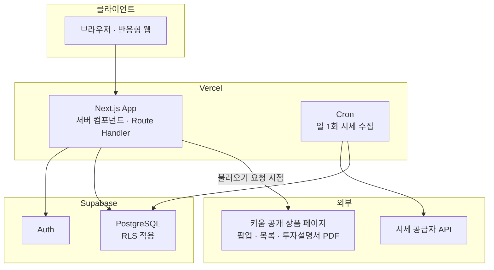

# 아키텍처 및 기술 결정 (ADR)

**언제들어오나** — ELS 통합관리 시스템

| 항목 | 내용 |
|---|---|
| 문서 ID | DOC-010 |
| 버전 | 3.45 |
| 작성일 | 2026-07-26 |
| 작성자 | 민서 |
| 선행 문서 | DOC-001 개요서 v0.4, DOC-002 데이터 모델 v0.5, DOC-007 계산 로직 명세 v0.5, DOC-008 화면 목록 v0.3 |
| 상태 | 검토 중 |

### 변경 이력

| 버전 | 일자 | 작성자 | 변경 내용 |
|---|---|---|---|
| 3.45 | 2026-10-06 | 민서 | **게이트 G 조기 확정 — 분기 A 채택(ADR-010 결정란) · ⑥·④ 측정표에 10-05·10-06 행 반영(`src/` 0줄).** **(1) ⑥** — 2026-10-05(개천절 대체공휴일)는 세 원천 모두 행을 내지 않았다(C1 행 없음 · C2 `[]` · 대조 기준 행 없음) — 추석 연휴와 같은 형태이며 `as_of_date`가 거짓이 되는 신호는 없었다. 2026-10-06(연휴 뒤 첫 영업일)은 C1 1358.5 · C2 1,358.5 · 대조 기준 1358.5로 **편차 0**. **(2) ④** — 같은 날짜를 09:16 · 11:16 · 13:05 · 14:05 KST에 네 번 조회: 대조 기준은 09:16에 이미 게시돼 있었고, C1 · C2는 09:16~11:16 사이에 게시됐다 — 발화 구간(14:00~14:59 KST)보다 한참 전이고 게시 뒤 13시 · 14시에 값이 움직이지 않았다. **(3) 결정** — 민서가 영업일 열흘(10-06~10-20)을 다 채우지 않고 오늘 데이터로 **분기 A를 조기 확정**했다(분모·미관측 표본은 ADR-010 결정란에 명시). 채택: 주 ECOS · 폴백 한국수출입은행. 이어서 c1(어댑터)·c2(배치 연결) 명세·구현·검토·W6 배포를 같은 세션에서 진행한다. **(4) ②** — 10-03~10-06 누적 호출에서 한도 응답 0건(중간 집계일 뿐 10영업일 전수는 아니다) |
| 3.44 | 2026-10-06 | 민서 | **AQ-78 — 둘째 조건(되돌리기 안전은 월지급 데이터 0건일 때만)의 길이 닫혔다.** 2026-10-06 17:01 KST 첫 실제 월지급 상품(달러 · 월수익 일정 36행) — 운영 실측 17:03. W5 뒤의 결함은 되돌리지 않고 고쳐서 앞으로 간다(DOC-013 v1.33) |
| 3.43 | 2026-10-06 | 민서 | **AQ-95 종결 · 게이트 G 수집기의 10-05 사건 기록.** **(1) AQ-95** — W5 빌드에서 민서가 운영 EM2048 불러오기를 확인했다(문제 없음 — 투자설명서 추출이 Vercel 함수 안에서 돈다). 저장하지 않았다(운영 월지급 0/0/0). **(2) ADR-010 응답 형태 · 측정 실행** — 10-05 11:06(다크 웨이크) 수출입은행이 **WAF 쿠키 챌린지 302**로 답했고 `Location`이 요청 경로를 **키째로** 되돌려 수집기 raw 헤더 파일 하나에 키가 저장됐다. 누출 검사(AQ-83 첫 겹)가 잡았다. 그 키를 가렸고(raw 0건 재검사) 수집기가 헤더 저장 직후 키를 가리게 고쳤다. 14:09 · 17:41은 오프라인 빈칸(10-05는 공휴일이라 값 대조 영향 없음). c1 명세가 물려받을 것 — 302는 `CALL_FAILED` · 헤더 · URL 원문 로그 금지. **(3) AQ-83** — 첫 겹이 실제로 동작했다는 기록 |
| 3.42 | 2026-10-04 | 민서 | **P8.5 명세 ↔ 구현 문서별 대조 — 이 문서가 코드 · 마이그레이션 · 실측과 어긋난 자리를 고쳤다(문서 전용 · `src/` · 마이그레이션 0줄).** **(1) AQ-97 신설** — 전망의 화면 전체 고지(「미상환 상품의 회수 시점은 추정이다.」)를 명세(DOC-007 §7.5 · DOC-008 SCR-402)는 미상환 상품이 하나라도 있을 때 그리는데, 구현은 전망이 비어 있지 않으면 늘 그린다(P4b `c90e563` 이래). `ForecastRow`에 그 조건을 가를 값이 없다 — P8 밖 · W5를 막지 않는다. **(2) AQ-95 — 판별자를 상태에서 안내 문구로 바꿨다.** EM2048은 KI 배리어가 있어 투자설명서를 읽어도 등록 화면에서 늘 「일부 채움」이다(`importFill.ts`의 `!ladder.noKi`) — 종전 종결 절차의 「「불러옴」/「일부 채움」의 사유」는 아무것도 가르지 않았다. 읽었는가는 `PROSPECTUS_READ_NOTE` · `COUPON_FORMULA_NOTE`와 `[prospectus]` 로그 줄로 가른다(DOC-013 v1.30과 같은 정정). **(3) ADR-009 §8.4 로그 사유 ↔ 원인** — 추출이 렌더 예산 안에 끝나지 않아도 `EXTRACT_FAILED`이고 그것은 시간 문제다. 종전 문언은 그것을 번들 · 메모리로 읽게 했다 — `detail` 「렌더 예산 초과」로 한 번 더 가른다. 사유는 여섯이다(`terms-types.ts`) — 「못 읽었다」의 괄호(넷)와 로그 대응을 여섯에 맞췄다. **(4) AQ-85에 b5 시기의 기록** — 월지급식 다섯 `listingMiss` 0/5(2026-10-04 01:10 KST · 실제 키움 · 누적 0/7). 「컷 a4·b5에서 빈도 기록」이 찼다. **(5) 낡은 상태 둘** — AQ-16 「부분 해결 예정 (P8 컷 a2)」 → **부분 해결 (a2-1 · W1)**: 해결된 절반에 M-b2의 `monthly_coupon_payments.gross_amount`, 남은 절반(조용한 반올림)에 월수익 열 넷(`numeric(6,4)` 둘 · `numeric(15,0)` 둘) · AQ-20 (a) · (d) 닫힘 — v3.14가 이미 뷰를 열거해 `security_invoker`를 단언하고 CLAUDE.md 규칙 6에 뷰 절이 있는데 상태가 「미결」이고 본문이 「어떤 기존 단언도 이를 잡지 못한다」였다(취소선). **(6) 낡은 수 둘** — §7.1 카탈로그 테스트의 테이블 수 14 → 16(M-b2 · 테스트는 이미 16) · §5 `auth/` 줄의 「§5의 11계약」 → 17. **(7) ADR-009 §8 — 선행 명세가 구현된 뒤의 사실** — 머리에 구현 커밋(b5-1 `fbff8db` · b5′-1 `c61d45a`) · §8.1 「픽스처는 b5-1 · b5′-1이 커밋한다」 → 커밋했다 · §8.8에 §6.3이 밟지 않은 것 둘(전망 단계 · 산식 폴백 경로의 종단). **(8) ADR-009 투자설명서 파일 고르기** — 코드는 링크 글자 「투자설명서」로 고르고 신원 확인의 `B<code>.pdf`와 비교하지 않는다(원천 표 · §8.4). 틀리는 방향은 안전하다 — 다른 상품의 투자설명서는 대조가 거부한다. **(9) §8.5** — DOC-013 §10.2.1 「묶음 안의 게이트 둘」 → 「하나」(DOC-013 v1.28). **(10) §3 구성도** — 외부가 Cron의 시세 API 하나뿐이었다. 앱 서버가 요청 시점에 키움(팝업 · 목록 · 투자설명서 PDF)을 부르는 화살표와 책임 표의 행을 더했다 — AQ-95의 미지가 그 호출이다. **(11) §5 모듈 트리** — providers에 `currency.ts`(a4-2 — §7의 판정 함수) · tests 트리와 스위트 표에 `tests/providers/`(AQ-95의 상시 증거가 거기 있다 — 덧붙여 같은 누락인 `auth/` · `cron/`) · `lib/forms/steps.ts`를 가리키던 SCR-204 「단계 폼」 절(P6 컷 1이 단계를 철회했다 — 코드 블록 안이라 취소선이 렌더되지 않으므로 옛 문언을 인용해 남겼다). **(12) §6.3 상환 흐름** — 「계약 계층 검증(V-11~V-14)」을 지금의 두 단계(형식 → 사전 조회 뒤 부모를 읽는 V-10 · V-14 · V-23 · V-24 · V-27 역방향 · V-29)와 트리거 라벨 둘(`redemptions_before_coupon_payment` · `redemptions_monthly_principal_only`)로. **(13) AQ-35 행 셀 안의 이스케이프하지 않은 파이프** — 그 행이 다섯 칸으로 렌더되고 있었다. **(14) 이력 행 정정(덧붙임)** — v3.16 · v3.27 · v3.34 행의 「§8 디렉터리 그림」은 §5의 잘못이다(`validate/` 줄은 §5 모듈 구조에 있다). 그 행들은 고치지 않았다 **(리드 추가)** ADR-004의 철회된 코드 블록이 `~~```ts` … ```~~`로 감싸여 닫는 펜스가 깨졌고 「★ 보정을 본문에 이행한다」 문단부터 코드로 렌더됐다 — 취소선 대신 앞에 철회 표식 문장을 두고 펜스를 바로잡았다(내용 불변) **(리드 추가)** AQ-89 해결 — ⑪ 「공통」 · 마커 없는 둘의 근거 문장(DOC-008 v2.42) · 테스트의 `UNREGISTERED` 0건 |
| 3.41 | 2026-10-04 | 민서 | **P8.5 드릴 B — AQ-80을 닫았다(DOC-013 v1.29 §8.3.5).** 종전 복원 드릴은 replica 적재 뒤 행 수만 대조해 「복원된 행이 규칙을 만족하는가」에 답하지 못했다 — **실측으로 확인**(상환 시 지급 상품의 월수익 기록을 끼운 덤프가 「✓ 통과」). 드릴 7단계(트리거 · FK를 켠 채 같은 덤프를 새 DB에 다시 적재)를 더했고 음성 대조 넷이 각각 `23514` · `23514` · `23503` · 「줄이 2개」로 멈췄다. 잔여 ⓑ(파일 뒤쪽 replica 전환)도 함께 닫혔다. 남는 것 — `ENABLE ALWAYS`(0) · I-25 함수 꼬리 검사(트리거가 아니다) |
| 3.40 | 2026-10-04 | 민서 | **W5 범위 변경(민서 결정 2026-10-04) — c1·c2가 W5 묶음에서 빠져 판정 뒤의 W6이 됐다(문서 전용 · `src/` 0줄 · DOC-013 v1.28).** **(1) AQ-78 잔여가 W6에서 다시 걸린다** — v3.30은 「b4 뒤의 P8 감사는 없다(W5가 마지막 스키마 웨이브)」로 닫았는데, W6(분기 A/A′ — `cron_runs.job` expand)이 b4 코드가 운영에 선 뒤의 스키마 웨이브다. W6 ② ⓐ의 `월지급`에 `coupon_payout = 'AT_REDEMPTION'` 한정어를 붙인다(W2의 `currency = 'KRW'` 선례 · v3.30이 「다시 쓰는 날」로 미룬 한정어). 「b4는 … · c1·c2와 한 배포」의 `c1·c2`는 취소선. **(2) ADR-010 상태 줄** — W5와 무관해졌다(판정 뒤 W6) · 측정 일정과 판정 절차는 DOC-013 §10.7 ⓐ. **(3) AQ-82 · AQ-94 · AQ-95 · AQ-96에 일정의 자리를 적었다**(DOC-013 §10.7 ⓒ · ⓔ · ⓑ · ⓕ). AQ-95에는 「불러오기만 하고 저장하지 않는다」(AQ-78 둘째 조건의 도출)를, AQ-96에는 종결 조건의 뒷절반(갱신 시점을 DOC-013 운영 일정에)이 채워졌음을 적었다 — 앞절반(키 오류 신호의 실패 코드 사상)은 c1 명세에 남는다 |
| 3.39 | 2026-10-03 | 민서 | **P8.5 반박 검토(b3~b5′ 범위) 반영 — 문서 선행(`src/` 0줄).** ADR-009: §8.7 · §7의 후보 배지 낱말 「월지급」 → **「월지급식」**(코드 · DOC-008과 맞춘다) · §5 모듈 트리에 `prospectus.ts` · `prospectus-parse.ts` · §8.4 **추출도 렌더 예산 안 · 못 읽은 사유를 서버 로그에 한 줄**(배포 · 운영 검토 — 종전에는 사유가 화면에도 로그에도 없어 AQ-95의 종결 절차(「함수 로그로 원인을 가른다」)가 실행될 수 없었다). AQ-95에 관측 수단 · 로그 보존 1시간. AQ-64에 **재발 기록**(SCR-206 결과 선택 상자)과 구조 그물(`key` 소스 대조). 컷 G 세션의 v3.38 위에 쌓았다. |
| 3.38 | 2026-10-03 | 민서 | **P8 컷 G — ② 한도 표기 없음 · ⑤ 두 원천 재확인(`src/` 0줄).** **(1) ②** — 두 원천 모두 키 발급 화면에 일 호출 한도가 **적혀 있지 않다**(민서 확인 2026-10-03). 표기가 없다는 것은 「한도 안이다」의 근거가 아니므로 칸을 통과로 적지 않고 **관측으로 판정한다**: 게이트 수집기가 하루 C1 5회 · C2 10회(그날 · 전날 × 5)를 부르며 이는 c1의 필요(일 1회 + 멱등 재호출 — CR-03)보다 크다. 10영업일 동안 한도 응답이 0건이면 **그 양에서 통과**로 적는다(한도 자체는 미상으로 남는다). **(2) ⑤** — v3.36의 「두 원천 모두 (a)(b)(c) 가능」이 두 원천 각각의 확인임을 민서가 재확인했다(2026-10-03). 칸 변경 없음 |
| 3.37 | 2026-10-03 | 민서 | **P8 컷 b5′-1 — 투자설명서 경로가 섰다 · §6.3 종단 실측.** 구현: `prospectus-parse.ts`(순수 — 네 구간 · 표 머리가 「읽었다」의 경계 · 토큰으로 줍는다) · `prospectus.ts`(I/O — GET · 5MB 스트림 상한 · `%PDF-` · `unpdf` 동적 적재 · 실패는 `UNREAD` 값) · 어댑터가 팝업 사다리 `월지급`이면 목록 행 검색과 **나란히** 부른다 · 대조 다섯(`PROSPECTUS_*`) + 변형 낱말(`PROSPECTUS` 자리) · 채움 출처 `PROSPECTUS`. 새 런타임 의존 `unpdf` 1.8.1(고정 · 캔버스 미설치 — lockfile 증가 23줄). 픽스처는 **추출 텍스트 다섯**(표본 전부 — 원본 PDF 크기 · sha256 기록, 프로젝트의 `unpdf`로 다시 뽑아 바이트 동일 확인). **§6.3** — 프로덕션 빌드 · 실제 키움으로 검색(배지) → 상세(EM2048 1,560ms · EM2014 1,116ms — 투자설명서에서 읽었다, EM2014 2번째 달이 산식과 다른 실제 날짜) → 자산 추가 → 저장(36행 · 원천 날짜) → 1번째 지급 기록(원천징수 303,380원) → 세금 화면 행. §8.5 게이트 표의 Vercel 행에 「프로덕션 빌드는 지났다」 — AQ-95는 운영 절반만 남는다. 휴장일 한계 한 건(36번째 지급일 08-16 대 실제 08-17 — RD-03 ⓐ)을 실측으로 적었다. 컷 G 세션의 v3.36 위에 쌓았다. |
| 3.36 | 2026-10-03 | 민서 | **P8 컷 G — 개인 키 둘 · ⑤ 약관 · C2 소급 8영업일(`src/` 0줄).** **(1) 키 발급** — 민서가 ECOS · 수출입은행 개인 키를 받아 `~/.els-deploy/ecos-key` · `koreaexim-key`(600)에 두었다. 민서 검증(10-02 · 키 가림): C1 09-28 ~ 10-02 다섯 값이 측정표와 같다 · C2 `n=23 result=1 deal_bas_r="1,359.6"`. **③ 두 원천 모두 개인 발급 가능 · 키 만료 2028-10-03(발급일로부터 2년 — 민서 확인)** → AQ-96 신설. **(2) ⑤ (a)(b)(c) 두 원천 모두 가능 — 확인 주체 민서(2026-10-03, 약관 원문 열람).** 원문 PDF는 보관하지 않았다 — 근거는 민서의 열람 진술이다(측정 설계 1). **(3) C2 소급 8영업일(09-21 ~ 10-02) — 대조 기준과 편차 0**(10-03 22:56 KST 조회 · 원문 `~/els-manager-gate/raw/2026-10-03/2256-*` · 누출 검사 통과). 같은 시각 C1을 개인 키로 다시 읽어 `sample` 키 값과 8/8 같다. **(4) 응답 형태 둘** — ★ C2 `deal_bas_r`이 **쉼표가 든 문자열**(`"1,359.6"` · 정수는 `"1,360"`) — 측정 설계 4가 경계한 형태가 실측됐다(`parseFloat`이면 `1`). C2의 휴일 · 미래일(09-24 ~ 26 · 10-03)은 **HTTP 200 + 빈 배열 `[]`** — 잘못된 키(`[{result: 3, …null}]`)와 **원소 개수**로 갈린다. **(5) ① 커버리지 두 원천 통과**(USD 일별). **남은 것**: ②(일 한도 — 원문 미확인) · ④(10-05부터 수집기) · ⑥(10영업일 — 10-09 · 10-12 판별일 포함) |
| 3.35 | 2026-10-03 | 민서 | **P8 컷 b5-0 — ADR-009 개정: 월지급식 불러오기(전진 검사 · 채움 · 투자설명서)를 코드보다 먼저 쓴다. 본 판은 선행 명세다 — `src/` 0줄.** 구현은 b5-1(전진 검사 · 산식 경로 · 후보 · 수정 화면) · b5′-1(투자설명서 경로)이다. **(1) 게이트를 먼저 쟀다** *(메모리 「의존하는 설계보다 실측을 앞에」)* — 월지급식 표본 다섯(`100조` 목록의 월지급식 전부 — EM2014 · EM2005 원화 · EM2048 · EM2040 · EM2032 달러)의 팝업 · 목록 · 투자설명서를 받아 ⓐ **RD-20**: 조기상환 평가일 25/25 · 만기 마지막 평균일 5/5가 월수익 평가일과 겹친다 → DOC-007 v1.9가 닫는다(키 이동 없음) ⓑ **월수익 평가일의 규약은 상품마다 다르다** — 앱 산식 101/180 · 「같은 날 → 앞 영업일」 76 · 「−1일 → 앞 영업일」 149, EM2014만 「같은 날」(6/36) ⓒ **b5′ 게이트(로컬)**: `unpdf` 1.8.1이 Node 22.12에서 36/36 × 5 · pypdf와 180/180 일치 · 150~340ms → **투자설명서 경로가 주 경로, 산식 경로는 폴백**. Vercel 함수 안의 실행은 묶음 배포 전에 잴 수 없어 **AQ-95**로 등재했다(실패해도 폴백 — 덜 채운 값이지 틀린 값이 아니다). **(2) §8 신설** — §8.1 실측 표 · §8.2 판정(증인 둘 · 충돌은 거부 · 표기 없음은 증언이 아니다 — 상환 시 지급의 증언은 누적 수익률의 선형성) · §8.3 전진 검사 일곱(`MONTHLY_PAY` 대체 — 수익률 0 · 헤드라인 ÷ 12 · 월지급 배리어 하나 · KI < C ≤ min B · 변형 낱말 · 리자드 없음 · 증인 충돌) · §8.4 투자설명서 네 구간과 「읽었다 / 못 읽었다」의 경계(읽고 어긋나면 거부, 못 읽으면 폴백) · §8.5 게이트 표 · §8.6 채움(폴백의 산식은 **앱 산식**이다 — 「산식」 표식과 원천 행이 화면에서 갈리도록) · §8.7 후보(「월지급」 배지) · 수정 화면(쿠폰 지급방식이 원천에 있는 칸이 된다 — `IMPORT_KEEPS_STORED`에서 뺀다) · §8.8 증명하지 않는 것. **(3) 실측 함정 둘** — §1 ⑳(월수익 일정은 투자설명서에만) · ㉑(「메모리」 = 마이크론 사업 설명 — 변형 낱말 검사의 범위를 좁힌 근거). **(4)** §1 결정 표에 셋째 원천 행 · §4 「하지 않은 것」의 PDF 줄 개정(월수익 구간만 읽는다 · KI 관찰방식은 여전히 안 읽는다) · §5 요청 수(월지급식 상세 6 · 동시 최대 셋) · §7 후보 목록 줄. |
| 3.34 | 2026-10-03 | 민서 | **P8 컷 b4-3a — §8 디렉터리 그림의 `validate/` 줄 V-01~V-28 → V-01~V-29** (V-29 계약 규칙 — DOC-011 v4.31) |
| 3.33 | 2026-10-03 | 민서 | **P8 컷 b3-7 — AQ-77 해결(종결 실측).** dev 표본에 월지급 셋(원화 36달 · 달러 36달 · 상환 12달)과 셋째 결함을 세우고 두 형태를 같은 표본에서 쟀다: §4.12 상품 루트 18,499 대 월수익 루트 + 부모 전체 530,167(28.7배) · 차수 루트는 존재 탐침만큼(+2,544, 1.5%)만 늘었다(월수익 임베드를 실었다면 +38%) · 상품 루트 소비자의 임베드 비용은 표본 17건에 12,786(43%) — 셀렉트를 더 가르지 않는다(근거와 다시 여는 조건은 그 항목) |
| 3.32 | 2026-10-03 | 민서 | **P8 컷 b3 착수 전 — AQ-81 결정 · AQ-77 형태 변경(문서 전용).** **(1) AQ-81 — 민서 결정(2026-10-03) ①: SCR-206 비소유자도 `AccessDenied`(200).** 당시 근거(「403을 측정할 방법이 없다」)가 거짓이 된 것을 먼저 적었다 — e2e가 상태 코드를 단언한다. 그래도 채택하지 않는 근거는 값의 크기다(3인 폐쇄형 · 실험 플래그의 표면). 두 머리글의 문장은 SCR-206 코드 커밋에서 고친다. **(2) AQ-77** — DOC-011 v4.23(b3 개정)이 §4.12의 루트를 상품으로 바꿨다(K² 복제가 좁혀지는 대신 사라진다). 종결 실측에 두 형태의 대조를 더했다(채택한 상품 루트 대 종전 명세의 월수익 루트) |
| 3.31 | 2026-10-03 | 민서 | **P8 컷 G — 환율 원천 게이트를 재개하고 첫 표본을 적는다(`src/` 0줄).** 민서 결정(2026-10-03): 게이트를 지금 시작한다(묶음 배포 W5가 c1·c2를 포함하므로 게이트가 묶음의 일정을 정한다 — DOC-013 v1.23). **(1) 멈춰 있었다는 사실** — 0b(09-30) 뒤 측정표가 전부 「실측 전」이었고, 09-30에 ECOS를 공개 `sample` 키로 찌른 탐침 한 번(그날 10:21 · 주말 0행 · 잘못된 키)이 이 절에 옮겨지지 않은 채 옛 세션 스크래치에만 남아 있었다. DOC-000은 그것을 「컷 G 개시(ECOS 첫 실측)」로 적었다(DOC-000 v4.13에서 정정). 원문을 저장소 밖 `~/els-manager-gate/raw/2026-09-30/`으로 옮겼다(sha256 `4b8f37e6…` — 당시 기록과 같다). **(2) C3 — 독립 미러 없음, C2로 합류.** `data.go.kr` 오픈 API 검색 셋에서 환율 API 셋 중 하나(데이터 3068846)가 C2의 등록 항목이고 나머지 둘은 일별 매매기준율이 아니다(관세환율 주 단위 · 월/연평균). **(3) 대조 기준의 읽기 경로** — 「API가 없다」는 맞되 차트용 XML 경로가 있다(문서화되지 않음 — 측정에만). **(4) 응답 형태 표 신설** — ★ C1의 0행(`INFO-200`)과 잘못된 키(`INFO-100`)가 **둘 다 HTTP 200**이고 `RESULT.CODE`만 다르다 · ★ C2의 잘못된 키가 **HTTP 200 + `result: 3` + 값 `null`** — `null`을 «값 없음»으로 읽으면 키 오류가 휴장으로 위장한다(ADR-008 §2.3과 같은 형태). 측정 설계 4가 「응답 안에서 찾으라」고 한 신호가 두 원천 모두 있다 · C1 `DATA_VALUE`가 문자열이고 자릿수가 일정하지 않다(`"1360"` · `"1358.4"`) · C2 옛 도메인은 2026-04-30 종료. **(5) ⑥ 소급 8영업일(09-21 ~ 10-02) — C1 = 대조 기준, 편차 0.** 추석 연휴(09-24 · 25)에 두 원천 모두 **행을 내지 않았다**(직전 값 반복 없음 — 소급이므로 휴일 당일의 응답은 10-09가 잰다). **④ 첫 표본** — 09-30 10:21에 그날 값이 이미 있었고 사흘 뒤에도 같다. **(6) 측정 실행 절 신설** — 수집기(`~/els-manager-gate/probe.sh` · launchd 09:05 · 11:05 · 13:05 · 14:05 · 17:35 — 17:35는 다음 영업일 값이 전날 저녁에 나오는가를 본다) · 키는 `~/.els-deploy/`(원문에 쓰지 않고 매 실행 끝에 누출 검사) · 키 대기 동안 C1은 `sample` 키 · 잠든 시각의 표본은 실제 조회 시각으로 적는다. **(7) AQ-94 신설** — 서울외국환중개 공지: 2027-01-01부터 매매기준율이 MAR → 「최근 영업일 오후 4시 TWAP」. 게이트 ⑥은 옛 정의만 잰다 — 분기 A/A′면 2027-01 영업일 대조로 종결. **남은 것(민서)**: ECOS · 수출입은행 개인 키 발급 · ⑤ 약관 원문 읽기 |
| 3.30 | 2026-10-03 | 민서 | **P8 묶음 배포 — AQ-78 잔여가 P8 안에서 걸리지 않음을 적는다(문서 전용).** 민서 결정(2026-10-03): 남은 컷 b3 · b4 · b5 · b5′ · c1·c2를 한 배포(DOC-013 §10.2.1 W5 — v1.23)로 낸다. AQ-78 잔여(감사 ⓐ의 `월지급`에 한정어가 없다 — b4 뒤의 감사부터 정상 월지급 상품에 걸린다)는 「b4 배포 전에 정한다」였는데, 묶음에서 b4가 나가는 웨이브의 ②는 **b4 코드가 운영에 나가기 전**에 돈다 — 그 시점의 운영(W4 빌드)은 월지급식을 고를 수 없으므로 한정어 없는 조건이 옳고, b4 뒤에 도는 P8 감사가 없다. 그래서 정할 것이 P8 안에서 사라졌다 — **해결이 아니라 「P8 안에서 걸리지 않음」**이며 P8 뒤에 절차를 다시 쓰는 날 한정어를 붙인다. AQ-78 둘째 조건(b4 코드는 M-b2c보다 먼저 나가지 않는다)은 묶음 안의 순서 — ③ `db push`가 ⑤ `main` 푸시보다 먼저 — 가 지킨다. ADR-010 게이트는 이 판에서 손대지 않는다(측정 재개는 다음 판에 기록한다) |
| 3.29 | 2026-10-03 | 민서 | **P8 W4 종결 기록 — AQ-78에 되돌릴 수 없는 지점의 둘째 조건을 등재하고 v3.28 (3)의 범위를 좁힌다.** **(1) AQ-78 둘째 조건 (W4 독립 검증 발견).** 종전 문언은 되돌릴 수 없는 지점을 contract(기본값 제거 → `23502`) 하나로만 정의했다. 그러나 expand 뒤 앞 웨이브 코드로 되돌려도 안전하다는 판정은 **스키마 성질이 아니라 데이터 조건**이다 — 월지급 상품 · 월수익 일정 · 기록이 0건일 때만 참이다. 그 행이 하나라도 생긴 뒤 W4 이전 코드(036dc87 이하)로 되돌리면, 그 상품의 수정 · 이익 상환은 구 오류 사상에 없는 이름으로 거부되어 고칠 칸 없는 일반 문구(`VALIDATION_FAILED` 「입력값을 확인한다.」)가 되고, 기록이 있는 상품의 삭제는 갱신해도 풀리지 않는 `CONFLICT`가 되며, 읽기는 월수익을 조용히 뺀다. 지금 계획(b4 = W6에서 월지급식 선택과 M-b2c contract를 함께 연다)에서는 월지급 데이터가 contract보다 먼저 생기지 않아 실해가 없다. 규칙으로 둔다 — **월지급식 선택을 여는 코드(b4)는 M-b2c보다 먼저 나가지 않는다.** 되돌리기를 결정하기 직전에는 그 셋을 운영에서 세고, 셋 다 0일 때만 W4 이전 빌드로 간다(W4 ④ 실측 0/0/0 — DOC-013 v1.22). **(2) v3.28 (3) 정정 — 「부모 부재 → FK `23503`」은 RLS를 우회하는 롤에서만 참이다.** 앱 경로(authenticated)에서는 INSERT 정책의 `WITH CHECK`가 BEFORE 트리거 뒤 · FK 앞에서 먼저 `42501`(FORBIDDEN)을 낸다(로컬 실측 — `new row violates row-level security policy for table "redemptions"`). 종전에는 그보다 앞의 자릿수 트리거가 `23514` scale 라벨로 거부했다. 둘 다 원인(상품 없음)을 틀리게 말하지만, 계약 경로는 사전 조회가 `NOT_FOUND`를 먼저 내므로 사전 조회와 INSERT 사이에 그 상품이 지워지는 경합에서만 닿는다. 테스트 주석은 처음부터 이것을 적고 있었다(`asOwner`로 넣는 이유) — 문서와 보고가 롤 한정 없이 적었다. DOC-002 v1.20에 같은 정정. **(3) W4 결과** — M-b2가 운영에 섰다(마이그레이션 21 · b2-5판 판별 · 카탈로그 전수 대조 차이 0 — DOC-013 v1.22). AQ-79 · AQ-87 ⓑ · AQ-92 · AQ-93의 DB 겹이 운영에서 유효하다 |
| 3.28 | 2026-10-02 | 민서 | **P8 컷 b2-5 — AQ-93의 정정된 종결 조건을 채우고 AQ-92를 구현했다(코드 커밋 — 운영은 W4).** **(1) AQ-93 — 경합 ⑤ · ⑥ + 줄 단위 음성 대조.** ⑤ `update_els_product`의 달러 → 원화(미커밋) ↔ 센트가 든 상환 INSERT · ⑥ 기록 INSERT(미커밋) ↔ 그 달 일정의 평가일 직접 UPDATE — 둘 다 둘째가 `pg_stat_activity.wait_event_type = 'Lock'`으로 대기한 뒤 `redemptions_gross_amount_scale` · `monthly_coupon_schedules_recorded_immutable`로 거부된다. 줄 단위 음성 대조(그 함수를 잠금 줄만 뺀 본문으로 `create or replace`한 뒤 「AQ-93」 여섯 케이스를 돌리고 실행마다 원본을 되돌렸다 — 끝에 `db:reset`): 기준 6/6 초록 · −자릿수 → ⑤만 빨강(둘째가 기다린 뒤 **커밋됐다** — `expected false to be 'redemptions_gross_amount_scale'`) · −기록 부모 → 6/6 초록 · −상환 쪽 → 6/6 초록 · −자릿수 −기록 부모 → ②③⑤ 빨강(②③은 「둘째가 잠금을 기다리지 않았다」) · −자릿수 −상환 쪽 → ①⑤ 빨강 · −일정 동결 → ⑥만 빨강(「기다리지 않았다」) · −`update_els_product` → ④만 빨강(기다린 뒤 커밋됐다 — `els_products_redeemed_immutable` 대신 성공). **v3.27의 도출이 맞았다** — 기록 · 상환 경로의 두 잠금은 자릿수 잠금이 있는 동안 관측되지 않고(단독 제거가 초록인 것이 대조의 무효가 아니라 구조의 측정이다 — 자릿수 잠금과 함께 지우면 각자의 경합이 빨개진다), 지우지 않는다(비용 없음 · 트리거 이름이 바뀌어 순서가 달라지는 날의 겹). **부수 관측 — FK 잠금도 하중을 받는다.** −자릿수 −기록 부모에서 ①이 초록이었다 — 상환 쪽 `FOR UPDATE`가 기록 INSERT의 FK가 부모에 건 `FOR KEY SHARE`와 충돌해 기다린다. 같은 이유로 −자릿수 −상환 쪽에서 ④가 초록이다. 그래서 「잠금이 없으면 둘 다 커밋된다」(v3.24)는 **양쪽 모두** 잠금이 없을 때의 명제다. **(2) AQ-92 구현** — M-b2의 `redemption_schedules_round_no_check` · `BY_CONSTRAINT`(I-17 / V-04 · `schedules`) · DOC-011 §3.2.1 행 · RLS 단언 둘(INSERT 0 · UPDATE −1) · 음성 대조(제약을 떼면 3건 빨강). 운영 선행 실측(읽기 전용, 2026-10-02): 차수 156행 · `round_no <= 0` 0건 · 최솟값 1. **(3) 자릿수 트리거의 부모 부재** — 통과시켜 FK `23503`(DOC-002 v1.18). 음성 대조: 분기를 지우면 두 테이블 모두 `23514` `*_gross_amount_scale`로 빨강(2건 — 종전 결함의 재현). 스위트 1748 + 340 + 290 + 181 |
| 3.27 | 2026-10-02 | 민서 | **P8 컷 b2-4 — AQ-92를 닫고 b2 반박 검토가 찾은 낡은 단서 · 수를 고친다. 본 판은 선행 명세다 — `src/` 0줄.** 구현은 같은 컷의 다음 커밋(b2-5)이며 아직 운영에 적용되지 않은 M-b2를 고친다(W4 `db push` 전). **(1) AQ-92 결정 — M-b2에 `redemption_schedules_round_no_check`: `CHECK(round_no >= 1)`**(민서 결정(2026-10-02)). 평가 순서에 기대던 방어(b0)를 DB 제약으로 바꾼다. 운영 감사가 `round_no <= 0` 0건을 먼저 본다 — 기존 행이 있으면 `db push`가 실패한다(DOC-013 §10.2.1 ⓖ). **(2) AQ-93 — 음성 대조의 판별력을 정정한다.** v3.25의 「잠금 줄 다섯을 지운 음성 대조에서 넷 다 빨간불」은 사실이지만 **다섯 줄 각각이 하중을 받는가에는 답하지 않는다** — 다섯을 한꺼번에 지우면 갈리지 않는다. 그리고 네 경합은 자릿수 트리거의 잠금이 막는 경합(통화 수정 중에 들어온 금액의 자릿수)과 일정 동결의 잠금이 막는 경합(기록 ↔ 일정 평가일 직접 수정)을 하나도 거치지 않는다 — 반박 검토 확인. b2-5가 경합 ⑤ · ⑥을 더하고 **줄 단위**로 음성 대조한다. 기록 · 상환 경로의 `check_coupon_payment_parent` · `check_redemption_coupon_terms` 잠금은 이름순으로 먼저 도는 자릿수 트리거의 잠금 뒤의 재잠금이므로 단독 제거는 초록일 것으로 **도출**한다 — 그 초록이 대조의 무효가 아니라 구조의 측정인지는 자릿수 잠금과 함께 지운 대조로 가른다(b2-5). **(3) 남은 「단일 요청 순서에서」 단서 둘** — AQ-79 · AQ-87 본문이 v3.24의 결정(동시 트랜잭션도 부모 행 잠금이 직렬화한다) 뒤에도 종전 단서를 갖고 있었다. 취소선으로 고쳤다. AQ-87의 상환 쪽 사전 검사 대상에서 §5.11을 뺐다(DOC-011 v4.21 — 기실현 등재는 새 상품이라 기록이 없다). **(4) 낡은 수** — RLS 정책 40 → 48(§4 ADR-005 각주 · SEC-03 각주 둘 · §7 원칙 표 — 로컬 실측 `pg_policies` 48, 테이블 16), §8 디렉터리 그림의 `validate/` 줄 V-01~V-24 → V-01~V-28(V-29는 b4). DOC-002 v1.18 · DOC-011 v4.21 · DOC-013 v1.21에 짝이 있다. |
| 3.26 | 2026-10-02 | 민서 | **P8 컷 b2-2 — AQ-77의 셀렉트 분리가 섰다(실측은 b3 그대로).** 상품 루트 `PRODUCT_SELECT` = 코어 + 월수익 두 테이블(FK 이름 힌트 — `monthly_coupon_payments`가 상품 ↔ 일정의 다대다 연결로도 읽혀 관계가 모호해지므로 직접 FK로 고정), 차수 루트 `loadScheduleRows`의 상품 임베드 = `PRODUCT_CORE_SELECT`. 행 타입도 둘이다(`ProductCoreRow` · `ProductRow`) — 차수 루트 행이 월수익을 가진 척하지 못하게 컴파일이 막는다(`AssetWithPricesAndSymbolsRow` 각주의 부류). b2의 소비자는 변경 계약의 사전 조회뿐이고 뷰로 접는 것은 b3이다. |
| 3.25 | 2026-10-02 | 민서 | **P8 컷 b2-1 — M-b2가 섰고 §7 권한 표에 두 테이블 · 트리거 함수 넷의 행을 더했다(파서에 묶인 표라 코드 커밋에).** 로컬 실측(`db:reset` 뒤 카탈로그): 테이블 16 · RLS 꺼진 테이블 0 · 정책 48 · `public` 함수 14 · 새 트리거 함수 넷의 `proacl` = `{postgres=X/postgres}`(네 롤 회수) · 쓰기 함수 셋은 `authenticated=X` 유지(서명 불변) · 두 테이블 `relacl` = `authenticated=arwd`. **AQ-93 — 잠그는 자리가 다섯이 됐다**(3.24의 넷 + 자릿수 트리거 `check_amount_scale_by_currency()`): 행 트리거는 이름순으로 발화하고 `*_check_amount_scale`이 부모를 가장 먼저 읽으므로, 그 트리거가 잠금 없이 통화를 읽으면 통화 수정과의 경합에서 낡은 통화로 판정한다(DOC-002 v1.16 (1)). **실제 스키마에서 종결 조건을 채웠다** — `tests/rls/monthly-coupons.test.ts`가 두 연결로 네 경합(기록 ↔ 이른 상환 · 기록 → 지급방식 수정 · 지급방식 수정 → 기록 · 상환 ↔ `update_els_product`)을 단언하고, 대기는 `pg_stat_activity.wait_event_type = 'Lock'`으로 확인한다. 잠금 줄 다섯을 지운 음성 대조에서 넷 다 빨간불이었다. |
| 3.24 | 2026-10-02 | 민서 | **P8 컷 b2 착수 전 결정 — AQ-93을 닫고 AQ-77의 셀렉트 분리 시점을 당긴다. 본 판은 선행 명세다 — `src/` 0줄 · 마이그레이션 0.** 구현은 같은 컷 b2(M-b2 · W4)의 코드 커밋이다. **(1) AQ-93 결정 ⓐ — 부모 행 잠금으로 직렬화한다(민서 결정(2026-10-02) ④).** 교차 테이블 트리거 셋(기록 쪽 `check_coupon_payment_parent()` · 상환 쪽 `check_redemption_coupon_terms()` · 일정 동결 `freeze_recorded_coupon_schedule()` — 이름은 DOC-002 v1.15 DQ-17 ①)이 부모 `els_products` 행을 `SELECT … FOR UPDATE`로 먼저 잠그고, `update_els_product`가 상환 검사 **앞에서** 같은 잠금을 건다 — 기존 `els_products_redeemed_immutable`의 check-then-act까지 닫는 것으로 범위를 정했다(「기존 검사까지 넓힐지」에 대한 답). 상품 동결은 UPDATE 자신의 행 잠금으로 충분하다. **추론을 실측했다(2026-10-02 — 로컬 · 임시 스키마 · 두 `pg` 연결 · READ COMMITTED):** 잠금 없이 ① 기록 INSERT(미커밋) 동안 더 이른 상환일의 상환 INSERT가 기다리지 않고 성공했고 둘 다 커밋됐다(기록 1 · 상환 1) ② 기록 INSERT ↔ 지급방식 UPDATE는 두 순서 모두 기다림 없이 둘 다 커밋됐다(최종 `AT_REDEMPTION` + 기록 1) — FK의 `FOR KEY SHARE`가 `FOR NO KEY UPDATE`와 충돌하지 않는다는 b1의 추론이 맞았다. 자식 트리거에 `perform 1 from … where id = new.els_id for update` 한 줄을 두면 세 경우 모두 둘째가 첫째의 커밋까지 대기한 뒤 거부됐다(`*_before_coupon_payment` · `*_recorded_immutable` · `*_monthly_required`, 최종 행이 불변식을 지킨다). 대가는 같은 상품의 쓰기가 줄을 서는 것뿐이다(다른 상품은 막지 않는다 · 3명 규모). 실제 스키마의 경합은 b2의 `tests/rls`가 두 연결로 단언한다 — 잠금 줄을 뺀 음성 대조가 빨간불이어야 한다. DOC-002 · DOC-007 · DOC-011의 「단일 요청 순서에서」 단서를 고쳤다(종전 문언은 취소선). **(2) AQ-77 — 셀렉트 분리를 b3에서 b2로 당긴다.** 상품 루트 로더(`loadProducts` · `loadProduct`)만 월수익 두 테이블을 임베드하고 차수 루트 `loadScheduleRows`에는 넣지 않는다는 방향은 그대로다. 당기는 이유는 b2의 변경 계약이다 — 사전 조회(`requireOwnedProduct` → `loadProduct`, DOC-011 §5.0)가 기록 · 일정을 읽어야 V-27의 양방향(§5.4 · §5.5) · §5.2의 기록된 달 검사 · §5.3의 삭제 3단계 · §5.14를 판정한다. 변경 계약만 다른 경로로 읽으면 조회와 변경이 같은 상품을 다른 열로 보게 된다(§5.0의 「같은 로더」 원칙). 페이로드 실측은 b3 그대로다 — b2~b3 동안 운영의 상품은 전부 `AT_REDEMPTION`이라 임베드가 빈 배열 둘이다. |
| 3.23 | 2026-10-02 | 민서 | **P8 컷 b1 — 월지급식 선행 명세가 이 문서에 만드는 결정 · 등재. 본 판은 선행 명세다 — `src/` 0줄 · 마이그레이션 0.** 구현은 b2(스키마 · 계약, W4)다. **(1) AQ-79 결정 — ⓐ 트리거(민서 결정(2026-10-02) ④).** 월수익 지급 기록이 하나라도 있으면 통화 · 지급방식을 바꿀 수 없다는 동결을 `update_els_product` 안의 검사만이 아니라 **DB 트리거로도** 강제한다 — 어떤 쓰기 경로든. `els_products` `BEFORE UPDATE OF currency, coupon_payout`(`els_products_coupon_recorded_immutable`) · `monthly_coupon_schedules` `BEFORE UPDATE OF evaluation_date, payment_date, coupon_no`(`monthly_coupon_schedules_recorded_immutable`) — 둘 다 값이 바뀔 때만 거부하고 둘 다 `CONFLICT`. 근거는 DOC-002 DQ-07의 기준(「계산에 들어가는 값은 DB가」)과 같다. **(2) AQ-87 ⓑ 결정 — DB 트리거.** V-29(월지급 상품의 상환은 세전 ≤ 투자원금 ∧ 과세 0)를 `redemptions` 트리거 `redemptions_monthly_principal_only`가, DQ-07 ②의 반대쪽(기록된 달(지급 · 미지급)의 **월수익 평가일**보다 앞선 상환 — 비교 키는 지급일이 아니다)을 `redemptions_before_coupon_payment`가 지킨다. 잔여 ⓐ(손실 상환에서 표시 손익만 부푸는 경로)는 종전대로 수용이다. **(3) AQ-80 범위 확대** — (1) · (2)와 기록의 부모(DOC-002 I-27)가 트리거 전용 규칙을 늘린다. 지급방식의 짝(I-23)은 단일 행 CHECK라 데이터 전용 복원이 재검사하고, 나머지는 재검증하지 않는다. 라벨을 그 항목에 대조해 적었다 — `ENABLE ALWAYS`를 쓰지 않는다는 전제는 그대로다. **(4) AQ-92 신설** — `redemption_schedules.round_no ≥ 1` CHECK가 없다. b0(`d675efb`)의 반박 검토 ①이 찾았다 — 리팩터의 초안에서 계약 밖 차수 0이 다른 해의 세금 조회까지 오류 경계로 보냈고 b0은 평가 순서로 막았다. 순서에 기대는 방어이므로 종결 후보는 M-b2의 CHECK다(운영 감사 뒤). 새 두 테이블의 `coupon_no`에는 b2가 처음부터 같은 CHECK를 둔다(DOC-002 §4.13 · §4.14). **(5) §5 모듈 트리에 `queries/income.ts`** — 상품 → `IncomeEvent`(`incomeEventsOf`)의 단일 원천. **코드가 문서보다 한 컷 앞섰다** — b0(`d675efb`, 동작 불변)이 이 명세보다 먼저 섰다. 낱말 「소득 사건」은 DOC-005 §6에 등재됐다(GQ-07 해결 — 같은 판의 개정). **(6) 방향 구체화 · 컷 정정과 등재 하나** — AQ-77의 방향(「`PRODUCT_SELECT`에 넣지 않는다」)은 그대로이고 **상품 루트 셀렉트와 차수 루트 셀렉트를 가른다**로 구체화했다: 상품이 루트인 로더(`loadProducts` · `loadProduct`)만 월수익 두 테이블을 임베드하고(왕복 불변 — DOC-011 v4.16), 차수가 루트인 `loadScheduleRows`의 상품 임베드에는 넣지 않는다. 복제의 크기를 b3에서 재는 종결은 그대로다. AQ-89의 종결 컷 b1 → b3 — 마커 열이 `tests/app/scheduleMarkers.test.ts`에 결속되어 b1은 SCR-301의 월수익 요소를 마커 없이 산문으로만 쓴다. AQ-78에 감사 조건 `월지급`의 한정어 부재를 잔여로 등재했다(b4 배포 전에 정한다). AQ-81은 그대로다(SCR-206 소유자 전용 라우트 — b3 전 판단). **파서에 묶인 표(§7 권한 표)에는 행을 더하지 않았다 — 표 행은 코드 커밋(b2 — `TABLE_PRIVILEGES`와 같은 커밋)에 함께 간다.** 테이블 수(14 → 16) · 정책 수(40 → 48) · §5의 `V-01~V-24` 같은 본문의 수도 b2에서 움직인다 — 지금 고치면 거짓이다. **선행 명세 → 구현 컷**: 동결 트리거 둘 · 상환 트리거 둘 · 새 테이블의 `coupon_no ≥ 1` CHECK · §7 권한 표 행 둘 = b2 · AQ-93(write skew) 판단 = b2 전 · `round_no ≥ 1` CHECK = AQ-92 종결 후보(M-b2, 운영 감사 뒤) · AQ-77 실측 · AQ-89 마커 = b3. **개정 반영 (같은 판 — b1 개정).** **(a) AQ-77을 바로잡았다** — 초안이 「b1 명세가 방향을 뒤집었다 — 월수익 두 테이블을 `PRODUCT_SELECT` 임베드로 읽는다」고 적었는데 그대로 두면 차수가 루트인 `loadScheduleRows`가 월수익 전부를 차수 수만큼 복제한다 — 이 항목이 막으려던 바로 그것이다. 종전 방향(「`PRODUCT_SELECT`에 넣지 않는다」)을 되살리고 **상품 루트 셀렉트와 차수 루트 셀렉트를 가른다**로 구체화했다: 상품이 루트인 로더(`loadProducts` · `loadProduct`)만 임베드한다. 그 로더를 함께 쓰는 소비자(수집기 · 시세 · 환율 화면 · 변경 계약의 사전 조회)에도 임베드가 실린다는 것을 실측 대상으로 등재했고, 계약 쪽의 같은 부류(차수 루트의 `COUPON_SCHEDULE_MISSING` 탐지 · §4.12의 K²행 — DOC-011 §9 「P8 월지급」 ⑰, b3 전)를 그 항목에 이었다. **(b) 상환 뒤 월수익의 비교 키** — AQ-87 ⓑ · AQ-80의 `redemptions_before_coupon_payment` · `monthly_coupon_payments_after_redemption`은 지급일이 아니라 **그 달의 월수익 평가일**로 상환일과 비교한다(월수익 흐름 끝과 같은 키 — DOC-007 RD-18 해결). 지급일로 비교하면 상환 대금이 먼저 지급되는 상품에서 같은 날 평가된 마지막 월수익을 기록할 수 없다. 순번 없는 기실현 기록은 평가일이 없어 검사 밖이다(등재만). 계약 쪽 사전 검사가 같은 키라는 것(DOC-011 V-27 양방향)도 AQ-87에 적었다. 위 (2)의 문장을 그 키로 고쳤다. **(c) 엔티티 용어(DOC-005 GQ-08 해결)** — 행의 존재를 말하는 「월수익 기록」을 「월수익 지급 기록」으로 고쳤다(위 (1) · AQ-79 · AQ-80 · AQ-87 — v3.13의 문장 포함, 뜻은 그대로다). 「월수익 기록」은 SCR-206의 화면 · 동작 이름이다. b1 개정의 나머지(DB 오류의 필드 키 · 뷰 필드 · 삭제의 원자성 · 무효화 축)는 DOC-011의 몫이고 이 문서의 결정을 바꾸지 않는다. **반박 검토 반영 (같은 판):** AQ-79 ②에 일정 동결 트리거가 **값이 바뀔 때만(`IS DISTINCT FROM`)** 거부한다는 조건(동일값 재대입 통과 — b2 테스트 목록에 단언)과 기록된 달을 뺀 수정 저장의 처리(계약 사전 검사 → `CONFLICT`, 복합 FK는 마지막 그물)를 넣었고, AQ-87의 상환 쪽 트리거와 V-27 반대 방향 문언이 지급 · 미지급의 모든 기록을 본다(대칭 — 상환 쪽 사전 검사는 구현 b2)고 고쳤으며, 교차 테이블 트리거의 write skew를 **AQ-93**으로 신설해(b2 전 판단) 두 항목의 보장을 「단일 요청 순서에서」로 좁혔고, 이 문서 안의 AQ-29 인용을 DOC-011 AQ-29로 밝히고 저장소 밖 결정 번호를 「b1 개정」 · 「민서 결정(2026-10-02) ④」로 바꿨다 |
| 3.22 | 2026-10-02 | 민서 | **P8 컷 a4-2 — ADR-009 §7이 코드로 섰다. §6.2 종단 실측(실제 키움 EM2047)을 기록하고 AQ-85에 첫 빈도 기록을 남겼다.** **(1) §7 구현** — `src/lib/providers/kiwoom/currency.ts` `productCurrencyOf` 하나를 후보 목록 · 대조 · 채움이 부른다. 목록 행에 `rdmp_unit`(앞의 0을 지운 문자열 — 수로 바꾸지 않는다)이 실린다. ⑲가 `terms-endpoints.ts` 실측 표와 `TERMS_NOT_READ.배너이미지`에 섰다. **음성 대조 18건이 전부 빨간불이었다** — 충돌을 첫 통화로 확정 4건 · 증인 없음을 원화로 8건 · 팝업 증인 무시 7건 · 상환 단위 원화 쪽 제거 6건 · 앞 0을 안 지움 9건 · 충돌 BLOCKING 제거 2건 등(DOC-011 v4.15 · DOC-008 v2.21의 X-07 셋 · 반박 검토 반영 넷 포함 — 전수는 커밋 메시지). **반박 검토**(4관점 · 지적 22 · 확인 14)가 노낙인 상품의 X-07 렌더가 「불러옴」으로 남는 결함을 찾았다 — DOC-008 v2.21 · DOC-011 v4.15. **(2) §6.2 — 등록 한 건과 수정 두 갈래를 실제 키움으로 밟았다.** 검색 → 상세 → 자산 둘 추가 → 저장 → 상세 → 같은 통화 재불러오기 → 원화 상품에 달러 불러오기(X-07). 전 단계 200/303, 저장 행을 psql로 대조했다. **(3) AQ-85 첫 기록** — EM2047 · E04000 둘 다 `listingMiss = null`. E04000은 목록 행의 증인 둘(코드 · 단위)로 원화가 확정됐고 **팝업만으로는 `NO_WITNESS`였다** — 목록 행 검색이 빠지면 원화 상품이 빈칸이 된다는 §7의 예측을 실응답이 확인한다. 빈도는 1회 표본이라 여전히 미지수다 |
| 3.21 | 2026-10-02 | 민서 | **P8 컷 a4-1 — ADR-009 개정(상품 통화의 증인과 판정)을 코드보다 먼저 쓴다. 본 판은 선행 명세다 — `src/` 0줄.** 구현은 a4-2다. **(1) §1 ⑲ 실측 — 계획이 적은 증인 다섯 중 하나가 증인이 아니었다.** `dollar-ELS.png`는 팝업의 웹관리자 영역에 올리는 **홍보 배너**이고 파일명이 상품마다 다르다 — 달러 상품 팝업 9건(EM2048 픽스처 + 2026-10-02 실측 8건: EM2047 · 2040 · 2039 · 2032 · 2031 · 2022 · 2015 · 2006)에서 `dollar-ELS.png` 1 · `100dollar-ELS.jpg` 4 · `newglobalels-dollar.png` 3 · `newglobalels.png` 1이다. 정확 일치는 1/9이고 `dollar` 부분 일치도 EM2015를 놓친다(그 파일명에는 그 낱말이 없다). 원화 상품의 배너도 같은 자리에 자유 파일명으로 온다(`ELS_BLUE.png` · `ELSnewglobal.png`). **읽지 않는다** — 부분 일치는 이 저장소가 기초자산 해결에서 거절한 방식이다(DOC-008 SCR-204). 같은 9건에서 팝업의 상품명 `USD_`와 사다리 `달러청약`은 9/9다. **(2) §7 신설 — `productCurrencyOf` 하나가 정본이다.** 증인 넷(상품명 `USD_` · 사다리 `달러청약` · 목록 `crnc_code` · 목록 `rdmp_unit`)이 «말하는» 통화를 모아 넷 중 하나로 판정한다 — 확정 · 증인 없음 · 충돌 · 지원 밖. **없음은 증언이 아니다** — 달러 표식이 없다는 사실은 원화를 말하지 않는다. **충돌은 다수결로 풀지 않고 거부한다.** **(3) 원화를 말하는 증인은 목록 행에만 있다**(`crnc_code` · `rdmp_unit`) — AQ-85가 「a4의 EM2047 캡처가 정한다」고 남긴 물음의 답이다. 그래서 목록 행을 놓친(`listingMiss`) 원화 상품은 상품 통화가 빈칸이다(민서 결정 — 원화로 두지 않는다). 달러 상품은 팝업에 증인 둘이 있어 목록 없이도 확정된다. **(4) `rdmp_unit = 10000` → 원화는 계획의 증인(`= 100`)을 대칭으로 넓힌 것이다** — 근거는 목록 40행(USD 9 · KRW 31)과 검색 픽스처 5행이 전부 `100` ⟺ `USD` · `10000` ⟺ `KRW`였다는 상관뿐이고 **필드의 뜻(1좌 액면 단위로 보인다)은 원문으로 확인하지 않았다.** 넓힌 효과는 충돌 검출(`crnc_code = USD`인데 `10000`)과 `crnc_code`가 형식 밖일 때의 원화 확정 둘이다. **(5) 거부 사유가 바뀐다** — `FOREIGN_CURRENCY`(달러면 거부)를 `CURRENCY_CONFLICT` · `CURRENCY_UNSUPPORTED`가 대신한다. 월지급식 거부(`MONTHLY_PAY`)는 그대로다 — 전진 검사는 컷 b5다. **(6) §4에 배너 한 줄, AQ-85 갱신.** **선행 명세 → 구현 컷**: §7 전부 · ⑲의 「읽지 않는 것」 행 · 픽스처 EM2047 → **a4-2** |
| 3.20 | 2026-10-01 | 민서 | **P8 컷 a3-2 — AQ-76 해결(구현) · AQ-91 등재.** **(1) AQ-76** — `EXCHANGE_RATE_WIDE`와 두 방향의 단언이 코드로 섰다(DOC-011 v4.13 §8). **(2) AQ-91 신설** — §5.7 `saveManualPrice`가 `provider`를 싣지 않아 자동 시세를 수동 정정하면 `MANUAL`인데 공급자가 남는다. DOC-011 v4.9가 「등재는 DOC-010의 몫」이라고 적었는데 등재되지 않은 채였다(반박 검토가 찾았다 — 「범위 밖이라 적어 둔다」가 다른 문서로 넘긴 순간 아무도 적지 않았다). 지금 영향은 0이고 잠복이다. **(3) §7.1 「13개」 → 14** — `exchange_rates`. v3.13이 `cron_runs`로 같은 낡음을 고쳤고 같은 문장이 같은 이유로 다시 낡았다: 테이블 수를 세는 단언(`tests/rls/catalog.test.ts`)은 a3-1에서 14로 움직였는데 이 산문은 아무것도 보지 않는다. **(4) 환율 자동 수집 레지스트리의 자리** — `EXCHANGE_RATE_PROVIDERS`를 `src/lib/providers/types.ts`에 두었다(ADR-010이 「별도 목록」만 정했다). 새 디렉터리가 아니므로 린트 글롭(절대 규칙 #6 다섯째)이 그대로 덮는다. 컷 a3에서는 비어 있고 그것이 값이며, `tests/providers/exchange-rate-registry.test.ts`가 「비어 있다」와 「시세 명부 셋과 겹치지 않는다」를 단언한다 — 후자는 지금 0회 순회라 **아무것도 판별하지 않는다는 사실을 그 케이스에 적었다**(전자가 그 공허함을 숨기지 않는다) |
| 3.19 | 2026-10-01 | 민서 | **P8 컷 a3-1 — `exchange_rates`가 섰다. AQ-88 해결.** **(1) §7 권한 표에 `exchange_rates` 행**(`asset_prices`와 같은 셀 — 조회 전체 · 등록·수정 전체 · 좌표 불변 I-22 · 삭제 없음, 권한도 정책도 — 두 겹 · `service_role` 0). `TABLE_PRIVILEGES`와 같은 커밋이다(`tests/app/docs-contract.test.ts`가 정확 일치로 대조한다). 마이그레이션은 **회수 후 명시 부여**로 쓴다 — 운영의 테이블 기본 권한이 로컬과 같은지는 실측된 적이 없으므로(AQ-90은 함수만 쟀다) 기본 권한 회수에 기대지 않는다. **(2) 함수 권한 표** — `freeze_exchange_rate_coordinates()`를 더하고, 낡아 있던 셋(`create_realized_els_product` · `check_redemption_round_required` · `check_amount_scale_by_currency`)을 채웠다. 이 표는 파서에 결속되어 있지 않다(카탈로그 단언이 `tests/rls/functions.test.ts`에 있다). **(3) 수** — 정책 37 → **40**(실측 `pg_policies`) · 테이블 13 → **14**. **(4) AQ-88 해결** — `tests/rls/no-float-money.test.ts`(실측 0 · 양성 대조 아홉) |
| 3.18 | 2026-10-01 | 민서 | **AQ-90 해결 — 운영에 적용하고 종결 조건을 실측했다.** `20260930105317_function_execute_hardening`을 6543으로 적용(민서, 2026-10-01 — 학교 네트워크라 5432가 닫혀 있었다). Management API 읽기 전용 확인: 마이그레이션 18 = 파일 18 · `postgres · public · f` 기본 권한 `{postgres=X/postgres}`(로컬과 같다) · `public` 함수 아홉 전부 `anon` · `service_role` · `PUBLIC`의 EXECUTE 거짓 · `authenticated`는 RPC 셋(`create_els_product` · `update_els_product` · `create_realized_els_product`)에만 참 — **운영의 함수 ACL이 로컬과 행 단위로 같다** |
| 3.17 | 2026-09-30 | 민서 | **AQ-90 신설 — 운영의 함수 실행 권한이 로컬과 달랐다 (P8 W1 ④ 확인 중 발견).** 운영 `pg_default_acl`(`postgres · public · 함수`)이 `anon` · `authenticated` · `service_role`에게 EXECUTE를 **명시적으로** 주고(로컬은 `{postgres=X}`만) 이 저장소의 규약 `revoke … from public`은 그 명시 부여를 지우지 못한다 — 운영 `public` 함수 아홉이 전부 `anon=X`였다(7월부터). **새는 경로는 없었다**(트리거 함수 여섯은 직접 호출 불가 · RPC 셋은 invoker이고 `anon`의 테이블 권한이 전부 0 — 실측). 두 겹 방어 중 앞 겹이 운영에만 없었다. 고치는 마이그레이션 `20260930105317_function_execute_hardening`(명시 회수 · RPC 셋만 `authenticated` 재부여 · `postgres`의 기본 권한에서 세 롤 제외 — 로컬에서는 무효과)과, 운영의 기본 권한을 롤백 트랜잭션 안에서 **재현하는** 전제 탐침 셋(`tests/rls/functions.test.ts`)을 같은 커밋에 둔다. 적용은 민서의 `db push`다(DOC-013 §10.2) |
| 3.16 | 2026-09-30 | 민서 | **P8 컷 a2-3a — 낡은 수 하나.** §8 디렉터리 그림의 `validate/` 줄이 「V-01~V-21」이었다 — DOC-011 v4.11에서 V-22 · V-23 · V-24가 섰으므로 「V-01~V-24」로 고쳤다. ADR · AQ의 상태는 바뀌지 않았다 |
| 3.15 | 2026-09-30 | 민서 | **P8 컷 a1 반박 검토 반영 — 인용 하나를 고치고 AQ-16의 상태를 옮긴다. `src/`·마이그레이션 0줄.** **(1) ADR-010 상태 줄의 `saveExchangeRate`를 DOC-011 §5.15로 인용하고 있었다** — DOC-011 v4.9에서 그 계약은 **§5.13**이고 §5.14·§5.15는 월수익 쪽 자리(컷 b1)다. 이 문서에 `listExchangeRates`(DOC-011 §4.11) 인용은 없다(전수 확인). **(2) AQ-16 미결 → 부분 해결 예정(컷 a2).** 상품 통화 금액 열(`principal`·`gross_amount`)은 DOC-002 v1.10 M-08·I-21이 정밀도 없는 DECIMAL + 이름 있는 자릿수 제약으로 바꾸므로 **초과 소수가 반올림되지 않고 거부된다**. 과세 축 `numeric(15,0)`과 비율 `numeric(6,4)`는 여전히 조용히 반올림한다 — 그래서 「해결」이 아니라 「부분」이고, 남은 절반의 결정은 종전 문언 그대로다 |
| 3.14 | 2026-09-30 | 민서 | **P8 컷 1 — 계기 선행. AQ-86을 닫았다(공허한 초록 여섯). 테스트만 바꿨고 `src/`·마이그레이션 0줄이다.** 각 계기를 **음성 대조로 먼저 빨간불을 보고** 세웠다(각 에이전트의 실측 + 독립 검증 — 상시 1436 · RLS 215). **① types-drift 사양 완전성** — `SPEC_TABLES`(사양 export → 테이블)를 두고 `continue`를 없앴다. 카탈로그는 `pg_catalog`로 읽는다 — **`information_schema.columns`는 물질화 뷰를 통째로 빼고 `numeric[]`을 `ARRAY`로 보고한다**(롤백 트랜잭션 실측). 종전 대조표는 사양을 테이블당 하나만 담아 `ASSET_OPTION_COLUMNS`·`PROVIDER_SYMBOL_COLUMNS`를 **한 번도 보지 않았다.** **② numeric 정밀도·scale 원장** — `tests/rls/numeric-typmod.test.ts` 신설(17열 양방향 대조). 오늘의 scale이 0·4·6뿐이라 **틀린 디코더도 초록이었다** — 경계 열(`numeric(5,-2)` 등)을 트랜잭션 안에서 만들어 판별한다. **③ 뷰 `security_invoker`** — `tests/rls/catalog.test.ts`. **우회가 실재함을 쟀다**(기본 뷰로 USER_A가 USER_B의 `tax_profiles` 1행을 읽었다). `reloptions`는 적힌 철자(`on`·`1`·`yes`)를 그대로 저장하므로 값을 boolean으로 캐스팅해 판정한다. 물질화 뷰는 두 방어 모두 불가(`22023` · `42809`)라 0개를 단언한다. AQ-20 ⓐ를 닫는다. **④ `declaredLengths`** — `add column`·`alter column … type`·`rename`·`drop`을 재생하고 전역 스캔으로 귀속 실패를 드러낸다. 종전 파서는 소문자·두 칸 들여쓰기 밖을 못 봤다. 검증이 `char varying(7)`·`nchar(7)`·`"varchar"(7)`의 사각을 찾아 **정규식을 넓혔다**(음성 대조: 옛 정규식 → 4건 빨강). **⑤ SCR-301 마커 ↔ `keyof ScheduleItem`** — `tests/app/scheduleMarkers.test.ts` 신설, AQ-35의 넷째 자리. 문서 결함 둘이 드러났다(AQ-89). **⑥ 복원 드릴의 replica 줄** — `scripts/db-restore-drill.sh`가 첫 비지 않은 줄이 `SET session_replication_role = replica;`가 아니면 0단계에서 멈춘다. 전제를 **로컬에서 쟀다**(replica: 트리거·FK 꺼짐, CHECK `23514` 적용 / origin: 둘 다 발화). AQ-80을 좁혔다. **신설 AQ-88 · AQ-89** |
| 3.13 | 2026-09-30 | 민서 | **P8 컷 0b — 달러 ELS·월지급식 ELS가 이 문서에 만드는 미결을 코드보다 먼저 등재한다. ADR-010 신설(제안 — 게이트 진행 중), §9 AQ-76~87 신설, 낡은 수 셋 정정. `src/` 0줄.** **(1) ADR-010 — 추정 환율의 자동 수집.** 민서 결정(2026-09-29): 추정용 환율은 매일 자동 수집하고 수동 입력은 모든 분기에서 동작한다(DOC-001 S-13·C-03). **확정 과세값은 거래내역의 원화이므로(A-04) 환율은 세금의 정본이 아니고 추정 전용이다** — 그런데도 **세금을 움직이는 첫 공용 입력**이다(AQ-76). 후보 셋(ECOS `731Y001` · 수출입은행 `AP01` · `data.go.kr` 미러)과 대조 기준 하나(서울외국환중개 매매기준율 — ⑥ 전용), 실격 하나(키움 es040 — ADR-008 §1의 42종에 환율이 없다). **ADR-007 ①~⑥ 표의 칸은 전부 「실측 후 확정」으로 비워 둔다** — 게이트(컷 G) 전에 판정을 적으면 확인하지 않은 것을 확인한 것으로 기록하게 된다(ADR-008의 「확인 주체」 규약). 분기 A·A′·B·C·D를 먼저 적었다 — **C(통과 없음)는 수동 입력이 설계된 정상 경로**이고, D(운영 이그레스 실패)는 코드를 지우지 않고 의미만 C로 옮긴다. **결정 칸은 비어 있다.** ★ 측정표는 **날짜를 첫 열**에 둔다 — `tests/app/docs-contract.test.ts`의 `historyMax`가 `\| 숫자.숫자 \| 일자 \|` 꼴의 행을 변경 이력 판으로 읽으므로, 환율을 첫 열에 두면 이 문서의 최신 판이 `1392.40`이 된다. **(2) AQ-76~87** — 환율 무효화 축(76) · 임베드 복제(77) · 운영 감사와 되돌릴 수 없는 지점(78) · 직접 UPDATE 우회(79) · 데이터 전용 복원의 재검증 부재(80) · 소유자 전용 라우트 셋째(81) · 환율 이그레스(82) · 공개 저장소 비밀(83) · Hobby cron 개수(84) · `listingMiss` 빈도(85) · 계기 공백 여섯(86) · 같은 날 상환·월수익(87). **결정·수용된 다섯(76·78·83·84·87)은 결정만 한두 문장으로 적고 명세는 해당 컷으로 넘긴다** — 나머지 일곱은 종결 컷과 판단 주체를 함께 적었다(79·81은 착수 전 민서에게 올린다). 파서에 묶인 표(§7 권한 표 · DOC-011 §8 무효화 행렬)에는 행을 더하지 않았다 — **표 행은 코드 커밋에 함께 간다.** **(3) 낡은 수 셋** — 「정책 32개」 → **37**(`create policy` 전수: `rls_policies` 32 + `asset_provider_symbols_writable` 3 + `cron_runs` 2. 본문 넷을 고치고, v0.4·v3.5 이력 행은 그 시점의 사실이므로 그대로 두었다) · §5 「V-01~V-20」 → **V-01~V-21**(V-21은 P5a 컷 2b — DOC-011 v3.6부터 §6에 있다) · §7.1 「DOC-002 §3의 12개」 → **13**(`cron_runs`. `catalog.test.ts`는 이미 13을 단언한다 — 문서만 낡았다). **선행 명세 — 이 판이 앞선 항목:** ADR-010 수집기(컷 c1·c2, 분기 A·A′일 때만) · AQ-76 `EXCHANGE_RATE_WIDE`(a3) · AQ-83 픽스처 가림과 누출 검사(G·c1) · AQ-86 계기 여섯(1) · AQ-87 V-29(b1·b4) |
| 3.12 | 2026-09-24 | 민서 | **배포 전 반박 검토(4관점 · 확인 5건 · 반박 0건)를 반영한다 — AQ-70 축소, §6.1 서술 정정.** **(1) AQ-70 — 키 유지의 «판단»이 순수 함수로 옮겨졌다**(`formKeyAfter`, `lib/forms/importKey.ts` — 클라이언트 컴포넌트가 import하므로 의존성 없는 파일에 둔다). 검토가 찾은 결함이 정확히 그 판단에 있었다 — 기초자산 목록만 실패한 첫 렌더에서 직전 키(빈 폼)를 유지해 **채움이 폼에 닿지 않았다**(DOC-008 v2.13 (1)). 컴포넌트 안에 있는 동안 어떤 스위트도 그 판단을 보지 못했고 AQ-70이 「판단은 `keepPreviousKey`가 상시 스위트에 있다」고 적은 것은 **절반**이었다 — `keepPreviousKey`는 입력이고 무엇을 유지할지는 컴포넌트가 정했다. 이제 네 경우(첫 채움 · 같은 코드 재렌더 · 다른 코드 · 상세 실패)를 상시 스위트가 값으로 본다. 브라우저에만 남는 것은 렌더 중 `setState` 배선 한 줄이다. **(2) AQ-75 — 상환 처리된 상품이 키움을 건너뛰는 판단도 순수 함수로**(`parseEditImportQuery`). 종전 e2e는 구획이 없는 것만 봤고 그 조건(`!redeemed &&`)은 호출을 건너뛰는 조건과 **다른 줄**이라 한쪽이 빠져도 초록이었다. **(3) §6.1의 「`0.3210`과 `32.1`이 값으로 같다고 판정됐다」를 정정한다** — 비율은 `productValuesOf`가 먼저 퍼센트로 옮기므로(`0.3210` → `32.1`) 비교는 퍼센트끼리다. 값 비교가 실제로 일한 것은 기준가(`317000.000000` ↔ `317000`)다 |
| 3.11 | 2026-09-24 | 민서 | **AQ-75·AQ-70에 수정 화면의 불러오기 자리를 더한다 — DOC-008 v2.12(SQ-10 해결). 결정은 없다.** **(1) AQ-75** — 수정 화면의 형제 폼 어댑터(`importAssetEditAction`)도 `importAssetAction`과 같이 Next를 지나는 부분이 미검증이다. 그 어댑터에만 있는 것은 **대상 상품 id의 형식 검사(쓰기 전)**와 수정 주소로의 복귀이며, 규칙(`runImportAsset`)과 주소(`importHref`)는 상시 스위트가 본다. 그 어댑터의 폼은 미해결 기초자산이 있을 때만 그려지므로(키움 상세가 필요하다) e2e가 폼을 얻을 수 없다. **(2) AQ-70** — `ImportedProductForm`이 수정 화면에도 선다. 키 유지가 클라이언트 재렌더 사이에만 있는 사정은 같다. **(3) ADR-009 §6.1 — 수정 화면의 종단 실측을 기록했다.** 수동 등록 상품 → `?q=4000&code=E04000` → 자산 둘 추가(각 303 → 수정 주소) → 저장(303) → 다시 불러오니 「저장값과 같다」. psql로 원천에 없는 넷이 저장값이고 나머지가 불러온 값임을, 저장값의 3차수·리자드·앱 자산이 남지 않았음을 대조했다 |
| 3.10 | 2026-09-24 | 민서 | **§9 AQ-70에 자리 하나를 더한다 — 불러온 폼의 키 유지(`ImportedProductForm`). 결정 0건.** 반박 검토가 낸 「조회 일시 실패가 불러온 폼을 비운다」를 고치며(`b4fcbc9`) 생긴 동작은 **클라이언트 재렌더 사이에서만 존재한다** — 서버 HTML은 한 번의 렌더이므로 「직전 키를 유지했다」를 보지 못한다. AQ-64(`<select>` 표시)·AQ-70(차수 선택 배선)과 같은 부류이고 종결 수단도 같다(jsdom). 무엇을 유지할지의 **판단**(`keepPreviousKey`)은 순수 함수가 내고 상시 스위트가 본다 |
| 3.9 | 2026-09-24 | 민서 | **ADR-009 §6 종단 실측 신설, §5 요청 수 정정, §3 리자드 쿠폰 규칙 보충. AQ-75 갱신.** **(1) §6 — 실제 키움을 상대로 등록 한 건을 끝까지 밟았다**(프로덕션 빌드 · `db:reset` 직후 · 2026-09-24). 검색 → 상세 → 자산 둘 추가 → 저장 → 상세까지 요청마다 상태·시간을 쟀고, 저장된 행을 psql로 대조했다. 실측 파일은 커밋하지 않았다 — 스위트는 네트워크를 타지 않는다(AQ-75). **(2) §5의 「상세 1」이 거짓이었다** — 상세는 팝업 1 + 같은 상품의 목록 행 검색 1(최선 노력)이고, 기초자산 목록 3과 **두 줄로 병렬**이다. 한 번의 상세 렌더가 키움에 **다섯** 요청을 보낸다(동시에 최대 둘). 반박 검토가 코드에서 셌다. **(3) §3 — 배수 표기가 없는 리자드 쿠폰은 역산하지 않고 정방향으로 찾는다.** 표의 누적 수익률은 **절사된** 값이므로 역산하면 절사 오차가 연율에 들어간다(소수 둘째 자리 검사가 그것을 통과시킨다). 정수 배수 k(1~3)마다 `헤드라인 × 경과 개월 / 12 × k`를 절사해 표와 같은 k를 찾고, 없으면 거부한다 |
| 3.8 | 2026-09-24 | 민서 | **ADR-009 신설 — 상품 조건 원천(키움 공개 상품 페이지). §5 모듈 트리 갱신, §9에 AQ-71·72·75 신설.** DOC-001 S-12의 선행 명세다. **(1) ★ ADR-008의 판정표를 그대로 적용했다** — robots(실측)·약관(민서 확인, 같은 사이트·같은 약관)·O-01(로그인 뒤 계좌 데이터만)·권위. **권위가 ADR-008보다 낮다는 것을 결정의 일부로 적었다** — 안내 화면이 스스로 「단순안내」이고 표가 틀린 사례가 실측됐다(E03060). **(2) 그래서 완화가 한 겹이 아니라 두 겹이다** — 엄격 파싱(구조가 바뀌면 없는 값이 된다)만으로는 **형식이 옳은 거짓**(E03060의 표는 표 안에서 일관된다)을 못 본다. 대조(`crossCheckTerms`)가 둘째 겹이며 어긋나면 폼을 비운다. **(3) 실패 코드를 새로 만들지 않았다** — 뜻이 「기다린다」로 같고 es040 계약을 넓힌다. **(4) §5 트리가 v3.6 뒤로 다시 낡아 있었다** — `lib/forms`의 `steps.ts`(P6 컷 1에서 사라졌다)가 남아 있었고 `providers/`가 es040뿐이었다. 함께 고쳤다. **(5) AQ 셋** — 표·사다리 동시 오류(71), 표시 자릿수 때문에 올바른 상품이 거부될 수 있음(72), 살아 있는 원천을 어떤 스위트도 보지 않음(75). 73·74는 계약 쪽이라 DOC-011 §9에 있다 |
| 3.7 | 2026-09-14 | 민서 | **§9에 AQ-70을 신설했다. ADR 변경은 없고 `src/` 0줄이다.** SCR-203이 「차수를 고를 때마다 상환일·실수령액·과세 금융소득을 다시 채운다」로 넓어지며(DOC-008 v2.7) **그 동작 전체가 하이드레이션 이후에만 존재하게 됐다.** ★ **AQ-64의 직계이고 «반대쪽 절반»이다** — 그 항목은 `<select>`가 갱신 시 옵션을 다시 쓰지 않는다는 것을 소스로 확정했는데, 이 변경은 그 대조가 확정한 다른 절반(`<input>`은 갱신마다 `defaultValue`가 다시 쓰인다)에 기댄다. **그런데 그 절반만으로는 부족하다**: 사용자가 한 번이라도 타이핑한 `<input>`은 HTML의 **dirty value flag**가 서서 속성 변경이 표시를 바꾸지 못하므로, 「덮어쓴다」는 요구는 **`key` remount에 전적으로 의존한다.** 즉 미검증 축이 하나에서 둘이 되었고 **둘 다 같은 도구(jsdom)로 닫힌다** — 그 사실이 그 도구의 값을 바꾼다. **e2e를 더하지 않는 근거는 AQ-64와 글자 그대로 같다**(서버 HTML이 불변이므로 아무것도 증명하지 않는 초록이 된다). |
| 0.1 | 2026-07-26 | 민서 | 최초 작성. ADR-001 ~ ADR-006 등재 |
| 3.6 | 2026-08-07 | 민서 | **P5a 컷 5 후속 — §5 모듈 트리와 v3.5 변경 이력의 절 참조를 정정한다. 결정 0건.** **(1) §5 트리가 `providers/`를 「인터페이스만. 공급자는 AQ-01」로 적고 있었다** — 컷 1이 키움 es040 어댑터를 세우고 컷 3이 그것으로 6종을 실제 수집했는데(ADR-008 §4) **트리만 컷 0 상태로 남았다.** AQ-01도 P5b 컷 8에서 닫혔고 그 답조차 ADR-008이 부분 대체했다. **(2) v3.5 항목이 「§5.1 표에 결합을 적었다」로 «이 문서의» 절 번호를 썼는데 그 절은 DOC-013의 것이다** — 이 문서 §5는 「모듈 구조」이고 하위 절이 없다. **★ 부류: 남의 문서 절을 자기 문서 번호로 가리키면 그 문서만 읽는 사람은 없는 절을 찾는다.** 3차 적대적 스윕이 둘 다 찾았다. **(3) 4차가 §7.2 본문의 「★ 종결했다 — ⓐ «전용» 서비스 계정 채택」을 잡았다** — 같은 절의 «표»(환경변수)는 이미 ⓐ′로 정정돼 있어 **한 절 안에서 서로 모순**이었다. ⓐ의 풀이말을 「GoTrue 사용자 계정」으로 좁히고 v3.0~3.4의 표기를 각주로 남겼다 — **하중을 지는 것은 「`service_role`이 아니다」이지 「새 계정이다」가 아니다** |
| 3.5 | 2026-08-07 | 민서 | **P5a 컷 5 — 배치의 정체성을 ⓐ′(민서 자신의 계정 재사용)로 좁혔다. 코드·마이그레이션 0줄이며 환경변수의 «값»만 달라진다.** **(1) AQ-57의 답은 «움직이지 않았다».** 그 항목이 물은 축은 `service_role`인가 GoTrue 사용자인가이고 답은 ⓐ 그대로다 — 바뀐 것은 **그 사용자가 새 계정인가 기존 계정인가**이며, 그래서 `service_role` 0 DML·`SUPABASE_SECRET_KEY` 영구 미등재·`ALLOWED_PREFIXES = []`·RLS 32개 적용이 **하나도 되돌려지지 않는다.** 그 구분을 적어 두지 않으면 다음 사람이 「AQ-57이 뒤집혔다」로 읽는다. **(2) ★ 대가는 정확히 하나 — `cron_runs` 근거 ②(호출자 판별)다.** `actor_id`가 모든 행에서 같아지므로 「Cron이 썼는가 버튼이 썼는가」에 답하는 것은 `caller`뿐인데 **그것은 요청이 스스로 주장하는 값**이다. **위조 불가성이 사라진 것이 아니라 가리키는 것이 바뀌었다** — `actor_id`는 여전히 「누가」를 위조 불가로 말하지만 그 답이 언제나 한 사람이라 **판별하지 못한다**(관측 도구가 명제를 판별하는지를 먼저 보는 규율의 적용). DOC-002 §4.11이 그 철회를 적고 **AQ-69**로 잔여를 등재했다. **근거 ①·③은 온전하므로 `cron_runs` 자체는 정당하다.** **(3) 민서의 근거가 내 가장 실질적인 논거를 «무력화했다»** — 전용 계정을 권한 이유 중 가장 강한 것이 「사람 비밀번호는 회전하고, 회전하면 배치가 `invalid_credentials` → 500인데 로그 보존이 1시간이라 그 500을 볼 기회가 없다」였다. **이 계정의 비밀번호는 기계가 생성했고 회전 계획이 없다.** 그 대신 **DOC-013** §5.1 표에 **결합**을 적었다 — 회전하게 되는 날 `CRON_SERVICE_PASSWORD`를 함께 바꿔야 하고 잊으면 조용히 죽는다. **(4) 「전용 서비스 계정」이라는 문구를 쓰는 자리를 전수로 훑어 «참인 것»과 «거짓이 된 것»을 갈랐다** — 대부분은 `service_role` 대비의 서술이라 그대로 참이고(배치가 `authenticated`로 돈다 · 배치 전용 GRANT 경로가 없다), 거짓이 된 것은 **actor_id의 판별력에 기댄 셋**뿐이다(DOC-002 §4.11 · DOC-013 §11 별항 ④ · `tests/rls/cron-runs.test.ts`의 각주). **(5) 로컬·e2e는 전용 계정을 유지한다** — 정체성은 **환경변수의 값**이지 코드 경로가 아니므로 검증 손실이 없고, 반대로 두면 e2e의 사용자별 집계 단언이 배치 행에 흔들린다(AQ-34와 같은 축). **되돌리기가 싸다는 것**(계정 생성 + 변수 둘, 코드 0줄)이 이 결정을 가볍게 만든다 |
| 3.4 | 2026-08-05 | 민서 | **P5a 컷 4 — AQ-11 종결. 권한의 최종 답은 「0」이고 예외를 비웠다.** **(1) ★ 예측이 실물로 확인됐다.** 컷 3의 수집기가 `service_role`을 **한 글자도 쓰지 않고** 돌았다(ADR-008 §4의 종단 실측). 배치가 실제로 쓴 권한 넷은 전부 `authenticated`가 이미 갖고 있던 것이고(`els_products`·`assets`·`asset_provider_symbols` SELECT + `asset_prices` **INSERT**) 새로 부여된 것은 `cron_runs` INSERT 하나다. 즉 컷 4는 **「권한을 올려 주는 컷」이 아니라 「0이 옳았음을 기록하는 컷」**이었다. **(2) ★★ §7 권한 표가 낡아 있었고 그것이 이 항목의 방어 정본이었다.** `asset_provider_symbols` 행이 「없음(마이그레이션 전용)」인 채였고(컷 2a가 전 DML을 부여했다) `cron_runs` 행은 **아예 없었다.** 카탈로그 테스트는 `authz-matrix.ts`를 보고 §7 표는 보지 않으므로 **초록인 채로 거짓**이었다 — AQ-11 자신이 「권한 표를 데이터로 박는다」를 방어의 정본으로 삼았는데 **원장이 둘이고 한쪽만 갱신된** 형태다. 두 행을 실제 GRANT에 맞췄고 비대칭의 사유(매핑은 관측이 아니다 / 고칠 수 있는 관측 기록은 기록이 아니다)를 표 안에 적었다. **(3) `ALLOWED_PREFIXES`를 `[]`로 비웠다** — v1.0이 「배치가 `service_role`을 요구할 것」이라며 미리 뚫어 둔 예외이며, **미리 뚫은 것은 옳았고 그 예상이 틀렸다**(AQ-57 = ⓐ가 「배치는 사용자 세션이 없다」를 거짓으로 만들었다). 상수는 남긴다(U-03). **(4) ★★★ 비움이 항진명제가 되지 않게 했다.** `[].some()`이 항상 `false`라 필터가 무연산이 되어 단언이 «더 강해지는데», 그것만으로는 **「예외가 안 쓰인다」**만 참이고 **「예외가 필요 없다」**는 증명되지 않는다 — 그 디렉터리에 파일이 0개여도 초록이다. 그래서 그 경로를 **명시적으로 스캔하고 스캔 대상의 실재를 먼저 단언**한다(`route.ts`가 목록에 있는지까지). **음성 대조 둘로 판별력을 확인했다** — 라우트에 리터럴을 주입하면 2건, 스캔 경로를 한 글자 틀리면 「스캔 대상이 실재한다」가 빨간불이다. 「세는 것」과 「가르는 것」이 다르며 개수가 0인 이유가 둘(없어서 / 안 걸려서)이라는 것이 이 저장소가 반복해서 만난 함정이다. **(5) `service_role` 0 DML이 «영구» 상태다** — `SUPABASE_SECRET_KEY`는 미결로 미룬 것이 아니라 **필요하지 않다는 답**이 나왔다 |
| 3.3 | 2026-08-05 | 민서 | **P5a 컷 3 — §7.2에 서비스 계정 자격증명 둘을 등재하고, AQ-11의 남은 절반이 「0이 옳았다」로 확정될 근거를 실물로 만든다.** **(1) `CRON_SERVICE_EMAIL`·`CRON_SERVICE_PASSWORD` 등재** — v3.0이 「등재 시점은 컷 3」이라 적은 그대로다. ★ **부재의 답이 `CRON_SECRET`과 «대칭이 아니고» 그것이 의도다**: 후자는 `env.ts`가 던지고(답이 하나 — 「비밀이 없다」) 전자는 **부재한 변수의 이름들을 값으로** 돌려준다(진단의 내용이 「어느 변수가 없는지」다). 예외로 만들면 그 목록이 문구 안으로 들어가고 문구를 파싱하는 소비자가 생긴다. **이름은 서버 로그로만 나가고 응답 본문에는 실리지 않는다**(SEC-05 · CR-10을 인증 «뒤»에 둔 이유). **(2) `missingProviderCredentials()`을 같은 파일에 두었다** — CR-10의 두 번째 출처이고 **오늘은 빈 배열 → 빈 배열**이다(키움 es040은 미인증 공개 엔드포인트라 자격증명이 없다). ★ 그 「없음」을 `PROVIDER_CREDENTIALS`에 **빈 배열로 적고** `KNOWN_PROVIDER_IDS`와 정확 일치를 단언한다 — 「아무 데도 안 적는 것」과 다르다: 빠뜨리면 그 공급자의 키 부재가 CR-10에 세어지지 않고 배치가 매일 `AUTH` 실패를 내며 사용자는 공급자 장애로 읽는다. **(3) AQ-11의 남은 절반이 실물로 확인됐다** — v3.0이 예측한 「진짜로 새로 부여할 것은 `cron_runs` INSERT 하나」가 참이었다(수집기가 `authenticated`로 돌아 `asset_prices` INSERT·`asset_provider_symbols` SELECT·상품 계열 SELECT를 쓰며 그 넷이 이미 있다). 확정과 `ALLOWED_PREFIXES` 비움은 컷 4다. **(4) ADR-004의 어댑터가 처음 «켜졌다»** — `PRICE_PROVIDERS = [KIWOOM_ES040]`. 컷 1이 세우고도 등재하지 않은 이유(R-05 — 등재만 하면 매일 「배포 결함」 응답이 나온다)가 이 컷에서 해소된다. **(5) ★ ADR-008 §4 신설 — 종단 실측.** 로컬 프로덕션 빌드에 개발 표본 12상품을 넣고 실제로 호출했다: 200 · 566ms · **6종 전부 저장**(지수 A·B, 국내주식 C, 해외주식 D). **`gb=B` 셋이 여기서 처음 실제로 저장됐고 §2.1의 예측값과 소수점까지 같다**(S&P500 `7736.52`) — A로 취급했다면 `77.3652`였고 **어떤 `CHECK`도 걸리지 않았다.** `as_of_date`가 전부 T-1이다(§2.2가 데이터에서 참). 2차 호출은 `succeeded 3 → 0` · `skipped 0 → 3`이고 행 수가 불변이다(CR-05·CR-03). **(6) ★★ 그 측정이 내 결함 하나를 잡았다 — DOC-005 §6.1 라벨의 조치가 «정반대»였다.** 틀린 매핑(`1:SPX`, 올바른 코드는 `1:_SPX`)을 일부러 넣었더니 화면이 「데이터 없음 — **기다린다**」를 말했는데 **고칠 것은 사용자의 매핑이었다.** DOC-011 §7.1의 표는 처음부터 반대다(「데이터 없음」이 심볼 오류를 포함하므로 「매핑을 고친다」이고, 「호출 실패」가 「기다린다」다). **부류가 아니라 라벨이 틀렸으므로 계약 변경은 0줄**이고 고친 것은 문자열 둘이다 — **타입도 전수 대조도 잡지 못하는 부류**(축 집합은 맞았고 값은 문자열이다). 부수 조치로 매핑 폼이 해외 지수 예를 명시한다(선행 밑줄) |
| 3.2 | 2026-08-05 | 민서 | **P5a 컷 1 — 어댑터가 섰다. ADR-008 §1·§2를 실측으로 넓혔다.** **(1) ★ 실측 넷이 «여섯»이 됐다.** 신설 둘 — ⑤ **행의 경로가 `tao.grid.arRow`이고 `tao.arRow`는 항상 `null`이다** ⑥ **`stexStkCode`가 필수이고 종목마다 다르다**(`AAPL → NDAAPL` · **`BAC → NYBAC`**. 지수·국내주식은 코드와 동일이므로 접두사를 규칙으로 유도하면 **NYSE 상장 종목에서만 조용히 틀린다**). **(2) ★★ `gb`가 셋이 아니라 «넷»이다 — `gb=B`(해외 지수)가 초기 조사에 없었다.** 날짜가 **14자**이고 값에 **선행 공백**이 오며 **나누지 않는다.** A로 취급하면 **S&P500 7736.52가 77.3652**가 되는데 유한·양수·그럴싸한 자릿수라 **어떤 `CHECK`도 걸리지 않는다.** 그래서 어댑터는 **모르는 `gb`를 추측하지 않고 `MALFORMED`로 멈춘다.** **(3) ★★★ 스케일 규칙을 독립 출처로 검증했다 — 추론이 아니다.** 페이지 JS는 A의 ÷100만 말하고 B에 침묵하므로, **다른 발행사(신한)가 같은 날 게시한 값과 대조해 다섯이 일치**했다(KOSPI200 1000.03 · S&P500 7736.52 · Nikkei225 63957.53 · 애플 309.38 · 테슬라 327.35). 이것이 **둘을 동시에 증명한다** — 스케일 규칙이 맞고, 그리고 **이 값들이 발행사의 판정 관측가**이지 증권사 자기 피드가 아니다(두 발행사가 소수점까지 같을 다른 이유가 없다). **⑥ 정본성의 실증이다.** **(4) 당일 행이 확정값이 아니므로 상한을 `asOf` «직전»으로 둔다**(§2.2). 당일 행은 2분 간격 재조회에 움직이고 전일 행은 바이트 동일이며 그 전일 값이 위 대조와 일치한다. **국내 자산도 균일하게 적용한다** — 배치가 14:00 KST이고 **KRX는 15:30에 닫으므로** 당일 행이 장중값이다. 부류마다 다르게 두면 **추론이 틀리는 날 조용히 장중값이 원장에 들어간다.** **(5) ★ 「0건」과 「경로가 틀렸다」를 구별한다 — 구현 중 실제로 그 실수를 했다**(§2.3). `tao.arRow`를 읽어 모든 자산이 0건으로 보였고, 그 상태의 어댑터는 `EMPTY` → 「매핑을 고친다」를 냈을 것인데 **매핑은 멀쩡했다.** 응답 안에 신호가 있었다 — `nResult: 1`·`message: ''`(성공)인데 행이 0이고 `$NROW`가 `'0004'`였다. **「성공했다면서 0건」이 경로 오류의 표식**이며, 둘을 합치면 **스키마 변경이 휴장으로 위장한다.** **(6) 목록 42종을 전수로 적었고 ADR-007 §5가 「없다」고 한 지수 넷이 «전부» 있다**(`_SPX`·`_SX5E`·`_HK#HIDX`·`_JP#NI225`). §5가 잘못 본 것이 아니라 **찾던 곳이 공급자 시장이었고 답은 발행사에 있었다** — 발행사는 그 지수로 ELS를 발행하므로 당연히 그 값을 갖는다. 이것이 SQ-08의 「소멸」을 좁게 정의해 준다(되살아나는 조건 = **42종 밖의 자산**). **(7) 어댑터를 `PRICE_PROVIDERS`에 «등재하지 않았다»** — 등재하면 `providerCount > 0`인데 수집기가 없어 §5.8이 CR-08(배포 결함)로 끝나고 그것은 503(설계된 상태)보다 **나쁘다.** R-05를 지키려면 등재는 수집기와 같은 컷(컷 3)이다. 그 결정을 테스트 케이스로 고정했다. **(8) 실호출로 종단 확인했다** — 9심볼 1,003ms에 **9/9 결과**, 성공 7 + `SYMBOL_SCHEME` 1 + `EMPTY` 1. 스위트 **1068**(+70) |
| 3.1 | 2026-08-05 | 민서 | **P5a 컷 0 — ADR-008 신설. ADR-007을 부분 대체하고 §2의 KIS 실격을 재근거화했다. 문서 선행이며 `src/` 0줄이다.** **(1) 결정: 키움 「기초자산 정보」(`/wm/edl/es040`)를 주 원천으로, `data.go.kr`을 국내 2종의 «대조»로 둔다.** 어댑터가 **하나**이고 **6종 전부**를 덮는다(지수 `201` · 국내주식 `A005930` · 해외주식 티커). K-02 분모 2/6 → **6/6**. **(2) ★ ADR-007이 «틀린» 것이 아니라 «적용 범위를 넓혀 적은» 것이다.** §5의 지수 커버리지 논증은 여전히 참인데 **현 포트폴리오의 해외 4종은 개별 NASDAQ 종목**이므로 그 논증이 적용되지 않는다. 그 옮김을 가능하게 한 것이 「전부 해외」라는 **추정값**이었다(P5b 컷 5가 반증). **부류를 적어 둔다: 참인 논증의 적용 범위를 넓혀 적었다.** **(3) 근거는 ⑥에서 최상이라는 것** — 시세 API는 어느 것이든 발행사 판정값의 **대리**인데 이 페이지는 **발행사가 판정에 쓰는 그 숫자**이고, ADR-007 ⑥이 「증권사 통지가 어느 API보다 정본에 가깝다」로 끝났으므로 **대체가 아니라 그 논리를 끝까지 따라간 것**이다. 통지와 달리 **매일** 있다. **(4) 비공식 원천 실격 기준 셋으로 대조했다** — `robots.txt`(**전면 허용**, 실측) · ToS 자동접근 금지(**없다** — **민서가 직접 확인**) · ⑥(최상). Yahoo·네이버가 실격한 것은 **비공식이라는 이름 때문이 아니라 셋에서 실제로 걸렸기 때문**이며 이 원천은 걸리지 않는다. ★ **확인의 «주체»를 적었다** — 내가 시도했을 때는 팝업이 JS 렌더라 15자만 추출됐고 그 상태를 「조항이 없다」로 적으면 **확인하지 못한 것을 확인한 것으로 기록**하는 것이 된다. **(5) 대가: 계약이 없다.** 완화는 **「엄격 검증 + 시끄러운 실패」**이며 그것이 이 원천을 받아들일 수 있게 만드는 핵심이다 — 스키마가 어긋나면 행을 **쓰지 않으므로**(DQ-02) 취약성이 **조용한 오염이 아니라 결측**으로 나타난다. **대조 원천이 두 번째 겹**이고 국내 2종에서 겹치므로 **불일치가 관측된다**(겹치지 않으면 감시 수단이 없다). **(6) ★★ 삼성의 함정이 키움에도 있고 «다른 페이지»다** — `es030`은 **채권평가사 2곳의 «상품» 공정가액 평균**이라 배리어 판정에 쓸 수 없다. **계기가 둘인데 이름이 비슷하고 하나만 옳다.** **(7) 실측 넷을 §2에 박았다 — 둘은 틀려도 조용하다:** `gb`별 스케일(**지수 ÷100**) · **해외 최신 행이 흔들린다**(T-1을 읽는다) · **쿠키를 보내면 400**(무상태여야 한다) · 분할 조정·배당 미조정. **(8) ★★★ §3 — ADR-007의 `adjclose` 금지에 답했다. 조정에 두 종류가 있고 요구가 반대다** — 분할은 조정되어야 옳고 배당은 조정되면 거짓이다. **첫 표본(TSLA)이 명제를 판별하지 못해**(무배당) 「이력을 의심하라」는 틀린 축의 오경보가 났고, **배당주(AAPL)로 다시 재서** 2022-03-28 = **175.60**(실제 무조정 종가와 정확히 일치)을 얻었다. **판별하는 표본을 고르는 것이 측정의 절반**이며 이 저장소에 같은 형태가 여럿 있다. **(9) 상업 공급자 재독 — ⑤가 여전히 대부분을 죽이고 그 사이 «더 나빠졌다»**: EODHD가 삭제 조항을 신설해 「한계적」에서 실격으로 강등, Finnhub에 ADR-007이 놓친 삭제 조항, Twelve Data §16.2 신설. **Alpha Vantage 하나가 통과**(4쪽 전수 확인 — 저장·삭제·재배포·표시 조항 **부재**)하며 **대체 1순위**로 등재한다. 방법론 둘을 적었다 — **삭제 조항으로 먼저 걸러라**(한 문장으로 다섯) · **3인 독자를 막는 조항은 공급자 약관이 아니라 거래소 가입자 서식에서 온다**(즉 「약관이 깨끗한 것」과 「종가가 정본인 것」이 같은 방향이 아닐 수 있다). **(10) 국내 증권사 전수 확인 — 전부 막힌다:** 키움 REST는 데이터가 맞는데 **IP 허용목록**이 Vercel 이그레스와 구조적으로 맞지 않고, 다섯 곳이 **거의 같은 제5조 ③**을 쓴다(**상류 제약 하나** — 증권사가 거래소 라이선시라 재실시권이 없다). LS는 약관이 더 깨끗한데 **「3개월간 주문체결 20회 이하」**에서 죽는다(읽기 전용은 주문을 0회 한다). **국내 공공기관은 미국 개별주 종가를 아무도 발행하지 않는다**(여섯 기관 전수). **(11) ★★★★ ADR-007 §2의 KIS 실격을 «재근거화»했다 — 축이 틀렸다.** 공개 문서 셋 전수 조사에서 **저장 관련 키워드가 각각 0회**이고 유일한 보존 조항은 **회사 자신의** 거래기록이다 — 즉 **KIS는 ⑤(a)·⑤(b)를 통과하며** 그 축에서 상업 벤더가 아니라 `data.go.kr` 쪽에 앉는다. 더 강한 실격 사유는 **⑥이고 KIS가 자기 문서에 적는다**(「종가는 … 다를 수 있으며」 · 「유료를 신청하시더라도 무료 시세로만 제공」 · 피드가 나스닥 마켓센터 단일). 그리고 **한국투자 자신의 ELS 기초자산 페이지는 Bloomberg 출처**다 — **같은 회사의 API와 판정 페이지가 다른 숫자다.** **(12) SQ-08은 «해결»이 아니라 «소멸»이다** — 표식을 만들지 않기로 한 것이 아니라 그 표식이 가리킬 상태가 없어졌다. DQ-08은 반대로 **활성화된다** |
| 3.0 | 2026-08-05 | 민서 | **P5a 컷 0 — ADR-004의 「보정」을 본문에 이행했다. 문서 선행이며 `src/` 0줄이다(절대 규칙 #10).** **(1) ★ 세 문서가 «존재하지 않는 조항»을 인용하고 있었다.** DOC-002 DQ-02 · DOC-011 §7.1 · DOC-013 §6.2가 모두 「ADR-004 보정」을 근거로 들며 반환에 `asOfDate`와 `failure: 'NO_DATA' \| 'CALL_FAILED'`가 있다고 적는데, **이 ADR 본문의 코드 블록에는 v2.4까지 그 둘이 없었다.** 그리고 `src/lib/providers/types.ts`가 **낡은 쪽을 베꼈다**(그 파일의 주석은 「서명은 ADR-004의 것을 그대로 옮긴다 — 문서가 정본이므로 여기서 바꾸지 않는다」라고 적고 있어서 **베낀 것이 규율의 결과**였다). 어댑터 구현이 이 블록을 읽으므로 코드보다 먼저 고친다. 종전 블록은 취소선으로 남긴다(U-04). **(2) `failure`를 판별 가능한 값으로 둔 근거를 본문에 적었다** — §7.1의 `failed[].reason`이 두 부류로 갈리고 **사용자의 조치가 다르므로**(매핑을 고친다 / 기다린다) 문구로 두면 층을 넘다가 구분이 사라진다. V-18이 층마다 다른 칸을 가리켰던 함정과 같은 형태다. `code`(진단용 세분류)와 `failure`(그 전사상)를 두 층으로 두어 **손으로 적는 자리를 없앤다.** **(3) `asOfDate`의 근거도 함께 적었다** — 배치가 `today()`를 쓰면 전일 종가가 오늘 날짜로 저장되고 `isStale`(5일)이 발동하지 않아 **화면 어디에도 드러나지 않는다.** DQ-02가 결측일 복제를 금지한 것과 같은 부류이고, 채택 공급자가 T+1 게시이므로 **이론이 아니라 상시 조건**이다. **(4) ★ `date: Date` → `asOf: string`을 정정했다 — 종전 서명의 숨은 결함이다.** 이 저장소의 모든 날짜가 `YYYY-MM-DD` 문자열이고 **`src/lib/db/today.ts`가 존재하는 이유가 `Date` + UTC의 9시간 이동**인데, 어댑터 경계만 `Date`를 쓰면 그 함정을 되살린다. 그리고 이 인자는 「그 날짜를 달라」가 아니라 **상한**임을 명시했다 — 반환이 그 값 이하여야 하므로 **V-17이 자동으로 만족된다.** **(5) 계약 의무 하나를 목록에 추가했다** — 「입력 심볼당 정확히 하나의 outcome을 내고 던지지 않는다」. 하나라도 던지면 **DOC-011 CR-02(부분 실패가 배치를 중단시키지 않는다)가 깨진다.** **(6) ADR 변경은 ADR-004 하나이며 ADR-007의 공급자 선정과 §7의 권한 설계는 그대로다** |
| 2.9 | 2026-08-01 | 민서 | **P6 컷 6 — §9에 AQ-66·67 신설, AQ-35 갱신, §5 트리 두 줄. ADR 변경 없고 §7의 권한 설계도 그대로다.** DOC-011 v3.3(§4.4)·DOC-007 v1.0(§4.5)에 따르는 등재다. **(1) AQ-66 — 세율 연도를 차수별로 풀면 «지난 차수 하나»가 화면 전체를 죽인다.** `resolveTaxYear`가 시드 이전 연도를 던지는데 SCR-301은 지난 차수를 구획으로 반드시 렌더하고, 2025년 평가일을 가진 상품은 지금 만들 수 있다(SCR-205는 과거 이력을 옮기는 화면이다). SELECT 정책이 전부 `using (true)`이므로 **남의 상품 하나가 전원에게 500**이 되는 §8.2의 부류다. ★ **처리는 값이 아니라 «호출 인자»를 바꾸는 것이다** — `year(asOf)`로 못박으면 `asOf`가 과거가 될 수 없어 그 분기가 **구조적으로 도달 불가**가 된다. **`resolveTaxYear`를 고치지 «않는» 것이 처리의 절반이며** 그 거부는 §4.6·§5.4가 의존하는 성질이다. 지금은 시드가 2026뿐이라 숫자도 바뀌지 않는다 — 차수별 해석이 사는 것은 크래시뿐이다. 잔여 둘(2027 시드 후 한 목록의 두 세율 · 소유자 필터 시 `tax_years` 두 번 읽기)을 적었다. **(2) AQ-67 — 원천징수 식이 세 자리에 인라인되어 있었다.** 비교과세의 `withheld(F)`와 상환 실적의 §5.4 산출이 같은 곱셈을 각자 적고 있었고 §4.5가 세 번째를 만들 참이었다. **모으지 않으면 이 컷이 저장소를 «더 나쁘게» 만든다** — 사본 셋에 정본을 자칭하는 것이 가장 안 돌아본 것이 된다(`taxConstants.ts`의 머리글이 적은 교훈 그대로). `lib/tax/withholding.ts`로 모으고 **요율이 아니라 `TaxConstants` 묶음을 받게** 했다 — 15.4%와 14%가 둘 다 있고 차이가 지방소득세분이라 요율을 열면 호출부가 고르게 되며 **잘못 고른 결과가 그럴싸한 숫자다.** 값 보존이 조건이고 **TC-01~22가 회귀망이다.** **(3) ★ AQ-35 — 네 번째 자리가 생겼는데 「값이 실증됐다」가 아니라 «이 공백에서 결함이 났다».** DOC-011 §8.1의 일곱째 사례(SCR-301에 다섯 값이 없다)가 여섯째와 **같은 D 부류**이고, 여섯째 뒤에 만든 대조가 SCR-101에만 있다는 사실을 **이 항목이 등재해 두었는데 바로 그 공백에서 났다.** 즉 이 항목은 이제 가설이 아니라 **재발 기록**이며, 나머지 화면 중 하나에서 여덟째가 날 때까지 열려 있다. **(4) §5 트리 두 줄** — `format/schedule.ts`에 상품 그룹, `lib/tax/`에 `withholding.ts`. **(5) DQ 없음** — 스키마·마이그레이션·`db:types`·`tests/rls/`가 전부 무변경이므로 모델 설계 판단이 없다. **부재가 판단임을 적어 둔다**(절대 규칙 #6의 다섯 함정 중 어느 것도 발동하지 않는다: 테이블·뷰·함수·Route Handler·`src/` 디렉터리가 하나도 늘지 않았다 — `withholding.ts`는 기존 `lib/tax/` 안이라 `tests/app/lint-coverage.test.ts`의 글롭에 이미 덮인다) |
| 2.8 | 2026-08-01 | 민서 | **P6 컷 5 — §9에 AQ-65 신설. ADR 변경은 없고 §7의 권한 설계도 그대로다.** DOC-002 v1.0이 `els_products.entry_mode`를 신설한 데 따르는 등재다. **AQ-65 — `entry_mode`를 계약 밖에서 뒤집으면 결함이 숨는다.** AQ-14가 「계약 밖에서 하위 행을 0건으로 만들 수 있다」이고 조회 계층이 그것을 `integrityIssue`로 탐지하는데, 이 열을 `REALIZED_ONLY`로 바꾸면 **그 탐지가 꺼진다.** ★ **새 위험이 아니라 기존 위험의 탐지면에 생긴 구멍이라는 것이 분류의 요점이다** — 결함을 만드는 경로는 이미 열려 있고 이 조작은 그 표시를 지운다. **계약 경로는 구조로 막혀 있다**(`update_els_product`의 payload에 `entryMode`가 없어 함수가 그 열을 쓰지 않는다) **역방향은 DB가 막는다**(I-18의 `CHECK`가 `23514`를 낸다 — 부수로 절반이 닫혔다). 종결 후보 둘 중 **`BEFORE UPDATE` 트리거(ⓑ)가 싸고 확실하다** — I-16이 같은 형태의 선례이고 동일값 재대입을 통과시키므로 열 단위 GRANT(ⓐ)가 `.update()`의 payload 전역 실림과 충돌하는 문제가 없다. 지금 하지 않은 것은 범위 판단이다 |
| 2.7 | 2026-07-31 | 민서 | **P6 컷 1 — §9에 AQ-62·AQ-64를 신설하고 AQ-32 ②의 종결 논거를 정정했다. ADR 변경은 없다.** **(1) AQ-62 — DB 요청에 시간 제한이 없다.** 초크 포인트가 하나인데(`noStoreFetch`가 두 클라이언트 모두에 주입되어 REST·RPC·GoTrue 전부를 지난다) 거기에 `signal`이 없고 Node `fetch`에 기본 타임아웃이 없고 `vercel.json`에 `maxDuration`도 없다. 실사용에서 관측됐다(11건 중 마지막 등록이 몇 분간 pending). ★ **분류가 중요하다** — 네트워크 실패 **자체는 이미 화면에 렌더된다**(postgrest-js가 fetch 거부를 오류 객체로 바꾸므로 액션이 reject되지 않는다). 즉 이 항목은 「실패가 안 보인다」가 아니라 **「실패로 끝나지 않는다」**이며 그 구분이 종결 수단을 정한다. 재시도 버튼은 **멱등 키가 없어 상품을 중복 생성할 수 있다**는 사실을 함께 등재했다. **(2) ★★ AQ-64 — `<select>`의 표시 상태를 증명할 층이 없고, 그것이 AQ-32 ②의 정정을 부른다.** React의 자동 폼 초기화가 요소마다 다르게 동작한다 *(소스 대조)*: `<input>`·`<textarea>`·체크박스는 갱신마다 속성이 재동기화되어 초기화가 **최신값**으로 복원되지만 **`<select>`의 갱신 경로는 `multiple` 토글에서만 옵션을 다시 쓴다** → `defaultSelected`가 마운트 시점에 얼어붙고 초기화가 표시를 「선택」으로 되돌린다. **값에 묶는 것은 악화다**(그 경로는 어떤 옵션에도 `selected`를 찍지 않는다). ★ **어느 스위트도 볼 수 없는 이유가 이 항목의 핵심이다** — SSR은 정상적으로 `selected`를 찍으므로 **`tests/e2e/`가 읽는 서버 HTML은 이미 올바르고** 결함은 하이드레이션 이후에만 존재한다. 여기에 e2e를 더하면 **아무것도 증명하지 않는 초록색**이 된다. **★★★ 그래서 AQ-32 ②의 종결 논거를 정정했다** — 「JS 없는 경로에서 사용자가 보는 것이 정확히 그 속성이므로 근사가 아니다」는 **JS 없는 경로에만 참**이고, 이 결함은 정확히 그 문장이 배제한 갈림이다. 즉 **그 항목이 근사가 아니라고 판정한 대조가 select에 대해서는 결함을 통과시킨다.** 닫힌 행을 다시 쓰지 않고 정정만 남겼다(U-03) — 판정이 JS 없는 경로에 대해서는 여전히 참이므로 「닫혔다」를 뒤집지 않는다. 종결 후보는 **jsdom 컴포넌트 층**이며 AQ-32의 종결 수단(Playwright)보다 훨씬 싸므로 **이 축은 별도로 닫을 수 있다** |
| 2.6 | 2026-07-31 | 민서 | **P5b 컷 10 — AQ-41 해결 · AQ-38 부분 해결.** **(1) AQ-38 — (b)의 전수 확인 결과가 «음성»이다.** URL로 도달하면서 잡히지 않는 던짐이 **0**이다(세 라우트가 `isUuid` 가드 · `searchParams`는 순수 파서 · 페이지 렌더 경로의 `catch`는 `tax/page.tsx` 하나). 그래서 **(c)를 적용**했다 — 판단을 `lib/format/errorNotice.ts`로 옮기고 상시 스위트가 전수로 본다. ★ **옮기다 결함을 찾았다: `error.digest != null`이 빈 문자열을 통과시켜 «내용 없는 회색 칩»을 렌더했다** — 「코드와 함께 알린다」고 적어 놓고 빈 칩을 보여 주므로 **화면은 정상으로 보이고 신고만 성립하지 않는다.** ★★ **`global-error.tsx`에 같은 분기가 중복돼 있었다** — 한 모듈로 모았다. 나눠 두면 한쪽만 고쳐진 상태가 다시 생긴다. 그리고 「경계에서 오류의 종류를 판별하지 않는다」를 **소스 단언으로 고정**했다(행동으로 관측할 수 없으므로 `force-dynamic`과 같은 자리). **닫지 «못한» 것을 명시한다 — 프로덕션 redact 동작 자체는 여전히 미검증이고 그래서 부분 해결이다.** **(2) AQ-41 해결** — 전용 시드 사용자 **둘**(하나로는 안 된다. 두 갈래가 서로 배타적이다). 상품은 시드가 아니라 `beforeAll`이 만든다(글롭이 전역 건수 단언을 깬다). ★ **AQ-41이 경고한 「전체는 초록인데 단독은 빨간불」을 대조로 확인했다** — `db:reset` 뒤 단독 실행 **10건 전부 초록**(전체 128건). 실행 순서가 데이터가 되지 않는다 |
| 2.5 | 2026-07-31 | 민서 | **P5b 컷 9(P5b.5) — 「판단 시점 P5」 재배정과 표식 정정. 설계 변경은 없다.** **(1) AQ-36·37 → P6 · AQ-38·41 → P5b.** 가르는 축은 **「정할 것이 남았는가, 만들 것만 남았는가」**다. 36·37은 문구·레이아웃·셸 유지가 남아 DOC-009에 의존하고, **38·41은 정할 것이 없고 수단이 이미 골라져 있다**(38 — `test:e2e`가 프로덕션 빌드를 띄우며 케이스만 0건 / 41 — 전용 시드 사용자 하나). ★ **P5a = 0이고 그것도 판단이다** — 다섯 중 어느 것도 시세·매핑에 의존하지 않는다(대조군: SQ-08은 P5a가 맞다). P5a는 「닫는 단계」가 아니라 **「분모가 확정되는 시점」**이라 AQ-36에 「오늘의 수를 옮겨 적지 말고 착지 후 다시 세라」를 달았다(AQ-37이 이미 넷→다섯을 겪었다). ★ **묶음을 깨는 대가를 갚았다** — AQ-37에 「선행 = AQ-38」을 남기고 **AQ-38을 닫는 커밋이 「AQ-37이 이 층을 어떻게 쓰는가」를 적는다**(안 하면 P5b가 세운 관측이 아무도 쓰지 않는 층이 된다). **(2) ADR-006의 「플랫폼 실측」을 「플랫폼 인용」으로 고쳤다** — 다섯 행의 출처가 전부 `vercel.com/docs`이고 **운영 인스턴스에서 재보지 않았다.** 값과 출처는 그대로다. ★ **「ADR-006 실측 ①」류 참조 넷이 낱말을 바꾸면 존재하지 않는 이름을 가리켜** 번호 참조로 바꿨다 — **표식은 신뢰도이지 식별자가 아니다** |
| 2.4 | 2026-07-30 | 민서 | **P5b 컷 8 — ADR-007 채택. AQ-01을 닫았다.** **국내는 `data.go.kr` 자동, 해외는 「증권사 통지 → 수동 입력」을 *설계된 정상 경로*로 둔다** — 폴백이 아니다(ELS 약관이 평가가격을 거래소 공식 종가로 정의하고 증권사가 그 값을 통지하므로 **통지가 어느 API보다 정본에 가깝다**. A-04와 일관). **(1) ★ ADR-004의 기준 넷이 불충분했음을 먼저 적었다** — 후보 14종을 그 넷에 대조하니 **넷 중 어느 것도 실제 실격 사유가 아니었다.** 탈락은 거의 전부 **⑤ 저장·공유 약관**과 **⑥ 종가의 정본성**에서 났다. 「개인 프로젝트 허용 여부」를 물으면 대부분이 「예」라고 답하고 **걸리는 것은 저장과 표시인데 그 둘이 목록에 없었다** — 기준 목록이 명제를 판별하지 못한 자리다. **(2) ⑤가 셋으로 갈리고 실격을 낸 것은 (a)가 아니라 (b)다** — 「구독보다 오래 살아도 되는가」에서 **상업 공급자 6곳 중 5곳이 아니다**(Twelve Data 30일 · EODHD 1개월 · FMP 「including data cached」 · Tiingo 「permanently delete」 …). `asset_prices`는 「지울 수 없는 이력」이므로 **상업 공급자를 쓰면 구독 해지가 과세 근거의 소멸을 뜻한다.** (c)는 「무료·폐쇄형·3명뿐」이 **문언에서 선제적으로 배제**돼 해석의 여지가 없다. **(3) KIS는 게이트에서 실격했다** — 약관이 JS 팝업이라 못 읽는다던 보고를 뒤집고 **키 없는 공개 JSON**(28,856B)으로 원문을 받았다. 제5조 ③ 「**개인의 업무에 한하여** … **제3자에게 제공해서는 아니 된다**」가 SCR-302의 「시세는 공용 데이터」와 **구조로 충돌한다.** **(4) 추종 ETF 대체를 2년치 일별 종가로 배제했다 — 논증이 아니라 실측이다.** 가장 유리한 조건(동일 통화·국내 상장·최대 규모)에서도 **KI 배리어 0.81에서 판정이 뒤집힌다**(2025-04-09 지수 0.8041 터치 vs ETF 0.8143 미터치). **KI는 한 번 터치로 상품 성격이 영구히 바뀌므로 그 하루가 원장 전체를 오염시킨다.** 오차가 세 계층인데 **②배당 처리 차이가 연 1.2~2.2%p 단방향 누적**이라 3년 만기면 **배리어 계단 간격 5%p를 한 칸 이상 삼킨다.** **(5) 그 실측이 새 규칙을 하나 낳았다 — `adjclose`를 쓰지 않는다.** 조정종가는 시계열 수익률용이고 배리어 판정은 **미조정 종가**다. **어댑터가 조용히 `adjclose`를 읽으면 형식은 정상이고 값만 거짓이다** — 어댑터 구현의 첫 단언이 이것이어야 한다. **(6) 지수 커버리지의 구멍은 돈으로 안 된다** — 라이선스가 깨끗한 공급자들은 지수를 유료로 빼는 것이 아니라 **데이터셋에 아예 없다**(Tiingo 107,677행에 `assetType=Index` **0건** · Twelve Data는 **Pro에서도** `count 0`). **남은 것 둘을 별항으로 남겼다** — **KI 감시 공백**(해외 자산은 「후보 표시」가 서지 않는다. 확정 경로는 살아 있다 → DOC-008 **SQ-08** 신설)과 **현 포트폴리오의 자동 수집 대상이 0건**(K-02 정정 → DOC-001 §5.1). **★ 「14종」과 「13종」이 원자료에 둘 다 있었고 14로 확정했다** — 대조표의 행이 14개이며 13은 게이트에서 6축 대조 *이전에* 떨어진 KIS를 뺀 수다. 「검토한 후보」와 「6축에 대조한 후보」가 다른데 같은 이름으로 세어져 있었다 |
| 2.3 | 2026-07-30 | 민서 | **P5b 컷 2 — v2.2가 정한 `service_role` 0 DML을 구현했고, 그 구현이 §7.1의 실측 인용 둘을 낡게 만들었다.** 문서가 먼저 있었으므로(v2.2) 이 판은 **구현이 반증한 것을 되받는 정정**이다. (1) **§7.1 케이스 표의 테이블 ACL 인용 둘에 ★ 각주를 달았다** — `{postgres=arwdDxtm/postgres,service_role=Dxtm/postgres}`는 P3b 실측이며, `service_role`의 기본 권한을 회수하자 신규 테이블·시퀀스의 `relacl`이 **`(null)`**이 된다(실측). non-null이었던 **이유가 `service_role=Dxtm` 항목의 존재**였다. `pg_default_acl` 행은 `{postgres=arwdDxtm/postgres}`로 남으므로 행 삭제가 원인이 아니다. **★ 이 변화가 §7.1의 결론을 날카롭게 만든다** — 이제 케이스 A(함수)와 E(테이블)의 ACL이 **둘 다 `(null)`인데 결과가 정반대**이므로, 갈리는 지점이 우리 설정이 아니라 **내장 기본값의 `PUBLIC` 유무**라는 것이 *같은 값의 두 사례*로 확정된다(종전에는 문자열이 달라 값의 차이로 읽힐 여지가 있었다). (2) **`tests/rls/functions.test.ts`의 단언을 뒤집었다** — 종전은 `relacl`이 **non-null**임을 요구했고 그것은 회수가 적용됐다는 증거가 아니라 **회수가 덜 됐다는 증거를 초록으로 읽는** 형태였다. **신규 시퀀스 프로브를 신설했다** — 스키마에 시퀀스가 0개라 카탈로그 축이 항진명제이므로, 실물을 만들어야 그 축이 관측된다. (3) **권한 매트릭스에 롤 차원을 넣었다**(`Table → Role → Privs`, `ROLES` 셋이 열거 원천). 대조 질의를 **전부 `aclexplode`로** 바꿨다 — `information_schema.role_table_grants`가 **`MAINTAIN`을 숨긴다**(실측: `MAINTAIN`만 부여하면 뷰는 **0행**, `aclexplode`는 1행). 종전 질의는 `grantee = 'authenticated'`로 박혀 있어 `service_role`의 8종 권한을 **어느 단언도 보지 않았다.** (4) **음성 대조 여섯으로 항진명제 여부를 확인했다** — 매트릭스 과다·과소, 롤 셀 누락(런타임 + `typecheck` 두 겹), `MAINTAIN`만 부여, 기본 권한 테이블·시퀀스 축. 각각이 예상한 단언만 빨간불이 됐다. (5) 회수 대상 롤을 **`service_role` 하나로** 좁혔다 — `anon`·`authenticated`를 함께 적으면 열 단위 GRANT 둘(`users.id`·`users.display_name`)이 날아가 SCR-502의 표시명 수정이 `42501`이 된다. 회수 후 그 둘이 보존됨을 실측했다 |
| 2.2 | 2026-07-29 | 민서 | **P5b 컷 0 — 배포가 ADR-006의 전제 셋을 반증했다. 코드 0줄이며 문서 선행이다(절대 규칙 #10).** **★ 함께 헤더 표의 버전 드리프트를 정정했다** — 표는 `1.8`을 적고 있었으나 변경 이력의 최신 행은 이미 `2.1`이었다(DOC-000 §1도 `2.1`이다). 즉 **이 문서만 두 곳이 갈려 있었고 교차 확인 지점인 DOC-000이 옳았다.** **DOC-013(배포·운영)을 신설했고** 이 문서는 그쪽으로 넘긴 것과 여기 남는 것을 가른다 — 이 ADR은 「무엇으로 배포하는가」만 정하고 운영·백업·설정의 정본은 DOC-013이다. (1) **ADR-006에 「플랫폼 실측」 다섯을 신설했다.** 넷이 명세를 바꿨다 — ① 호출이 **`GET`**이고 **production 배포만** 부른다(DOC-011 §7.1의 `POST`가 성립하지 않는다) ② 타임존이 **항상 UTC** ③ Hobby는 일 1회 · **정밀도 ±59분**이며 더 잦은 표현식은 배포가 실패한다(O-04의 「일 1회」가 판단이 아니라 **제약**이다) ④ **재시도 없음 · 누락도 중복도 가능**(CR-03의 멱등성이 선택이 아니다) ⑤ **리다이렉트를 따라가지 않고 3xx·캐시 응답은 로그에도 남지 않는다**(`src/proxy.ts`의 `api/cron` 제외가 운영에서 하중 부담 부품이 된다). (2) **환경 분리 표의 `preview` 행을 「미구성」으로 정정했다(U-03).** v0.1의 「PR 단위 검증 · 개발 인스턴스」가 전제한 셋이 **전부 성립하지 않는다** — 붙일 개발 인스턴스가 없고, 두 번째 무료 프로젝트는 7일 저활동으로 계속 정지되며, **가장 큰 것은 Cron이 production만 부르므로 preview 패리티가 애초에 없었다는 것**이다. (3) **「수집 결과를 로깅하여 무음 실패를 방지한다」를 철회했다(U-03)** — 런타임 로그 보존이 **1시간**이고 Cron 정밀도가 ±59분이라 일 1회 배치의 로그는 다음에 볼 때 **사라져 있다.** DOC-011 CR-04를 **감지**(SCR-302의 `isStale`·`as_of_date`·`source` — 영속적이며 **이미 구현돼 있다**)와 **진단**(멱등성을 이용한 재호출)으로 갈랐다. (4) **§6.2에 Cron 시각과 그 근거를 처음 적었다.** v1.8까지 이 문서와 ADR-006은 「일 1회」만 적어 **`vercel.json`이 시각을 혼자 정하게** 되어 있었다. `0 5 * * *` UTC(= 14:00~14:59 KST)는 **어느 거래소 마감도 아니라 `data.go.kr`의 T+1 13:00 KST 게시**를 겨냥한 값이며, 따라서 배치가 넣는 것은 **직전 영업일 종가**고 **`as_of_date`는 `today()`가 아니라 공급자가 준 날짜여야 한다**(그러지 않으면 「형식은 정상이고 값만 거짓」이 된다 — ADR-004 보정의 `asOfDate`가 존재하는 이유). ★ **당일 종가 공급자를 붙이는 날 이 시각은 틀린다**는 조건을 각주로 박았다(14:00 KST는 KRX·TSE·HKEX 마감 전이다). (5) **§7 SEC-03에 클라우드 절반을 신설했다.** 종전 실측은 전부 로컬이고 검증도 로컬뿐이었다 — 클라우드에서 가입이 열려 있으면 정책 32개의 전제가 통째로 무너진다. `supabase config push`가 **`disable_signup = !enable_signup`**을 보내므로(CLI 2.109.1 번들 실측) **저장소의 `config.toml`이 클라우드 값의 정본이 된다**(같은 기전이 DOC-011 AQ-22의 잔여 R1도 닫는다). **반영 시점이 다르다는 것을 함께 적었다** — 「`db reset`으로 반영되지 않는다」는 **로컬 경로에만 참**이고 `config push`는 즉시 반영된다. (6) **§7.1 규약 표에 `service_role` 행을 추가하고 종전 판단을 철회했다** — 「기본 권한 규약을 `service_role`에는 적용하지 않는다」가 *부여*를 걱정한 서술이었고 필요한 것은 *회수*다. 실측: `pg_default_acl`에 `service_role=Dxtm`(테이블)·`w`(시퀀스)가 있어 **신규 테이블이 DELETE·TRUNCATE를 자동으로 받는다** — 즉 「0 DML」이 미래 테이블에는 거짓이고 AQ-11의 CASCADE 위험이 그쪽에 살아 있다. (7) **§7.2에 `CRON_SECRET`을 등재했다.** 「빈 문자열 = 부재」가 여기서 특히 중요한 이유(빈 값이면 `Bearer `로 시작하는 **모든** 헤더가 일치한다)와, 오류 메시지에 `process.env`라는 **문구**를 쓰면 `no-service-role.test.ts`의 정확 일치 단언이 깨진다는 함정을 함께 적었다. **`SUPABASE_SECRET_KEY`는 등재하지 않았다 — 필요한지가 미결이기 때문이다**: 실측으로 두 가드가 상호배타적임이 드러났고(`src/app/**`는 `@supabase/*`를 import할 수 없고 `src/lib/db/**`는 `service_role` 문자열을 담을 수 없다) **대안(전용 GoTrue 서비스 계정)이 새로 만들 것 없이 이미 존재한다.** (8) **AQ-04 종결**(주 1회 로컬 덤프 — 실측 셋이 수단을 정했다: Free는 자동 백업 없음 · 직결이 IPv6 전용 · **저장소가 공개**) · **AQ-11 정정**(과다 방향은 P5b 컷 2, 필요분 명시는 P5a 컷 4. 등재문의 「`asset_prices` UPSERT」는 CR-05를 전제한 서술이며 AQ-06이 뒤집히면서 UPDATE가 불필요해졌다). (9) **§5 모듈 트리에 `app/api/cron/prices/`의 성질과 `lib/cron/`을 추가했다** — 판정을 라우트 안에 두면 **어느 상시 스위트도 실행하지 않고** 「`CRON_SECRET` 미설정」 갈래를 결정적으로 만들 수 없다 |
| 2.1 | 2026-07-29 | 민서 | **P4b 컷 8 — AQ-41 신설, §6의 SCR-402 칸 셋이 섰다.** **AQ-41 — SCR-402의 빈 상태 갈래 둘을 어느 층도 렌더하지 않는다.** 판정은 순수 함수로 떼어져 상시 스위트가 세 축을 전부 보므로(잔여 원금 축이 E-07 케이스다) 남는 미검증은 **「그 판정이 그 마크업으로 이어진다」** 한 줄이다. 원인은 픽스처의 구조다 — 두 갈래 모두 「그 소유자의 **모든** 상품이 …이다」를 요구하는데 e2e 픽스처를 **공유 사용자**에 등록해야 했다(전용 둘에 상품을 더하면 `home.test.ts`의 값 단언이 깨지고, 그 정확한 단언이 AQ-34가 전용 사용자를 만든 이유다). **★ 초안이 전용 사용자를 빌려 쓰려다 함정을 실측으로 만났고 그것을 등재의 본문으로 남겼다** — `E2E_PAST`의 상품은 시드가 아니라 `home.test.ts`의 `beforeAll`이 만들므로 전체 스위트에서는 8건 전부 초록이었는데 `db:reset` 뒤 그 파일만 돌리자 **5건이 빨간불**이 되었다. **실행 순서가 데이터인 초록색**이었고, 고친 결과가 「자기 픽스처를 자기 `beforeAll`에서 만든다」다. 닫는 수단은 전용 시드 사용자 하나이며(AQ-34가 쓴 수단 그대로) **판단 시점은 P5** — 같은 부류(§6 빈 상태의 「아예 없다」 갈래 넷)를 한 번에 닫는 것이 화면마다 사용자를 늘리는 것보다 싸다. 함께 갱신: **AQ-37에 다섯 번째 자리**(SCR-402의 에러 칸도 `app/error.tsx`로 접힌다) · **AQ-36은 예고대로 「계산 중」을 남긴다** · **AQ-35의 두 번째 자리는 컷 7에 이미 섰다** |
| 2.0 | 2026-07-29 | 민서 | **P4b 컷 7 — AQ-35의 두 번째 대조 축이 섰고 P4.5가 그 항목에 적은 정정이 함께 닫혔다.** `tests/app/forecast.test.ts`가 DOC-008 §5 SCR-402의 ①~⑫를 파싱해 `keyof ForecastRow`와 대조한다. **SCR-101의 자리를 그대로 베끼지 않았다** — P4.5가 이 항목에 적은 「SCR-101도 짝짓기는 기억에 있다(마커 집합과 대응표의 **키**만 비교하므로 문구를 맞바꿔도 통과한다)」가 여기서 닫혔다: 대응표가 라벨을 함께 들고 **마커 ↔ 라벨의 짝짓기**를 대조한다. 실측 — ⑧·⑪의 라벨을 맞바꾸면 그 케이스만 빨간불이 되고 마커 집합 대조는 초록으로 남는다. **그 자리를 만든 방법도 규율이다**: 「파서가 열둘을 찾았다」를 두지 **않았다** — 위 `toEqual`에 완전히 함축되어 탐지력이 0이므로(AQ-40이 등재한 부류를 새로 만들지 않는다) 그 자리를 짝짓기에 썼다. **SCR-101의 짝짓기는 여전히 기억에 있고** 그것을 옮기는 것은 P6의 권고 (a)에 포함한다 |
| 1.9 | 2026-07-29 | 민서 | **P4b 컷 6 — AQ-39를 닫았다.** v1.8이 정한 채택 방식(손으로 적은 역 인덱스가 아니라 기존 표에서 파생하는 타입 수준 witness)을 그대로 구현했고, **그 행이 예고한 세 가지가 전부 그대로 일어났다** — witness가 `listUserSummaries`를 즉시 빨간불로 만들었고 답은 화이트리스트가 아니라 **등재**였으며(`getTaxSummary`와 같은 일곱 자리), `staleRoutesFor`는 달라지지 않았고(`STALE_ROUTES` 불변), `as const`가 `.includes`의 파라미터를 `never`로 좁히는 것이 두 자리에서 발화했다. 등재는 **개수가 아니라 `getTaxSummary`와의 집합 동일성**으로 박았다 — 컷 8이 `/forecast`를 대리 기준에서 실명 계약으로 옮길 때 결과가 같다는 근거가 그것이므로, 일곱이라는 수만 적으면 어느 일곱인지 갈려도 통과한다. **음성 대조의 탐지력을 실측했다**(지시자를 떼고 `TS2322` 메시지에 빠진 계약명이 나오는 것을 확인) **그리고 양성 대조를 함께 두었다** — `Without<never>`가 조용해야 그 발화가 변환이 만든 거짓 양성이 아니다. 그 줄이 없으면 탐지력 0인 음성 대조가 초록으로 보인다. 실측: `npm run test` 757 → **759** · `typecheck`·`lint` 오류 0 |
| 1.8 | 2026-07-29 | 민서 | **P4b 컷 4 — AQ-39의 채택 방식을 정하고 AQ-35에 두 번째 대조 축을 예고했다. 본 버전은 선행 명세다 — 구현은 컷 6이다. 둘 다 닫지 않는다.** **AQ-39** — 권고 (b)의 역 인덱스(`AFFECTED_BY`)를 **그대로 쓰지 않기로 했고 그 사유를 그 행에 적었다**(기록된 권고를 코드로 조용히 뒤집지 않는다 — 절대 규칙 #10). 손으로 적은 `Record<QueryName, …>`는 **항목의 존재만 강제하고 `[]`가 합법이므로** 「어느 `affects`에도 없는 조회」를 잡는 대신 **「빈 항목」으로 옮겨 놓을 뿐**이고, 같은 지식이 두 표에 손으로 적혀 **「단언이 아니라 파생」이라는 이 항목 자신의 근거를 위반한다.** 대신 기존 표 하나에서 파생하는 **타입 수준 witness**를 쓴다 — `Exclude`가 비어 있지 않으면 컴파일이 깨지고 **오류 메시지에 빠진 계약 이름이 나온다.** 같은 관용구가 `tests/app/dashboard.test.ts`(컷 9)에 이미 있으므로 새 어휘를 들이지 않는다. 부수로 확인: witness를 세우면 **`listUserSummaries`가 즉시 빨간불**이고 **화이트리스트가 아니라 등재가 정답**이다(그 계약은 실제로 상품·프로필을 읽으므로 비어 있던 것이 결정이 아니라 결함이었다). 그 등재가 `staleRoutesFor`를 바꾸지 않음을 확인했으므로 손으로 적은 `STALE_ROUTES`는 불변이다. **AQ-35 보완** — DOC-008 §5 SCR-402의 요소 셀을 ①~⑫로 정본화해 이 항목의 권고 (a)를 **두 번째 화면에 대해 실행한다.** 그 셀이 v1.2까지 마커 없는 아홉 개였고 「총자산」은 각주에만 있어 **열 목록과 계약 필드가 이미 갈려 있었다** — 이 공백의 값이 P4.5의 다섯 자리에 이어 여섯 번째로 실증되었다. **나머지 열 화면과 판단 시점 P6은 그대로다** |
| 1.7 | 2026-07-29 | 민서 | **P4b 컷 1 — Q-06 사문화를 닫는 커밋의 문서 선행. AQ-38 ③이 역사가 되고 AQ-40 ③의 사실 오류를 정정했다. 둘 다 닫지 않는다.** **AQ-38** — ①의 상수 이름을 갱신하고(`SERVER_MAX_ROWS` → `APP_MAX_ROWS`) **③을 역사로 옮겼다**: DOC-011 AQ-22가 임계를 서버 상한보다 하나 작게 파생시켰으므로 「그 예외는 지금 발화할 수 없다」는 더 이상 참이 아니다. **그런데 레버로는 여전히 못 쓴다** — 발화에 999행을 넘겨야 하고, 그것은 P4.5가 손으로 만들고 삭제한 1,201행 픽스처를 스위트에 상주시키는 일이다. ①②(틀린 상수 · 린트가 환경 변수 경로를 구조로 금지)는 이름만 바뀌었을 뿐 그대로이므로 **후보 (b) → (c)와 판단 시점 P5를 유지한다** — 세 겹 중 하나가 풀렸다고 항목이 닫히지 않는다. **AQ-40 ③** — 이름을 좁히고(수단 (a)) 임베드로 바꾸는 (b)는 **하지 않았다.** 제목을 「요청 상한이 거부되지 않는다」로 본문에 맞췄고, 같은 자리의 주석이 적고 있던 「설정과 상수가 **일치해야 한다**」도 고쳤다 — v2.2에서는 참이었고 이제 **일치가 곧 결함**이다(관계는 `<`다). (b)를 하지 않은 이유가 이 항목의 취지와 같다: 임베드 축을 참으로 만들려면 부모 하나에 1,000행 넘는 자식 픽스처가 필요한데, **약한 임베드 질의로 제목만 참으로 만드는 것은 같은 죄를 새 자리에서 짓는 것**이다. 그래서 그 축은 이름 안에 숨기지 않고 DOC-011 AQ-22의 잔여 ④로 **따로 등재했다.** **그리고 이 행의 사실 오류 하나를 정정했다** — 「대상 테이블은 0행」이 틀렸다(`asset_prices`는 그 파일의 `beforeAll`이 시드한 **6행**이다). 항진명제라는 판정 자체는 행수에 의존하지 않으므로 유지된다 — **근거로 든 숫자만 거짓이었고, 그것을 고치지 않으면 다음 사람이 재확인했을 때 항목 전체를 의심한다.** ①②④는 그대로 미결이다 |
| 1.6 | 2026-07-29 | 민서 | **P4.5 — §9에 AQ-36~40 다섯 신설, AQ-35 보완.** 등재의 기준은 「구현하지 않는 것과 분류하지 않는 것은 다르다」이며, 다섯 중 넷은 P4 종료 대조가 **어느 원장에도 없다**고 판정한 자리다. **AQ-36 §6 「로딩」 열의 미구현** — 여덟 칸 중 **다섯**이 0건이고(부재를 4변형으로 확인) 같은 표의 폼 로딩 **두 종이 세 칸을** 채워 **비대칭**이며, 그 셋조차 `useFormStatus`에만 있어 **JS 없는 경로에서 한 칸도 남지 않는다.** AQ-32와 다른 항목이다(저쪽은 관측 수단의 부재, 이쪽은 구현의 부재 — 수단이 생겨도 볼 것이 없다). **AQ-37 §6 「에러」 열의 접힘** — 네 화면이 한 문구로 수렴하고, `error.tsx`가 종류를 판별하지 않는 기록된 논거가 「어느 **화면**인가」를 덮지 못한다. **AQ-38 에러 경계의 검증 공백 — 그리고 그 관측을 세우려던 레버가 사문화되어 있다.** 후보(`TRUNCATION_PROBE_LIMIT`를 낮춰 Q-06 예외를 유발)가 세 겹으로 틀렸다: 레버가 틀린 상수이고(예외는 `SERVER_MAX_ROWS`와 비교한다), 린트가 `src/lib/db/**`에서 `process.env`를 구조로 금지하며, **무엇보다 그 예외는 지금 발화할 수 없다.** 실측으로 확정했다 — `asset_prices`에 1,201행을 넣고 `limit=1001`·`limit=1200`을 요청했더니 **둘 다 1000행**이 돌아왔다(`Content-Range: 0-999/*`, 상태 **200**). `PGRST_DB_MAX_ROWS=1000`과 감지 임계 1000이 같은 값이므로 `rows.length > 1000`은 영원히 거짓이다(픽스처는 삭제했고 잔여 0). 그 정정을 DOC-011 AQ-22에 적었다 — 잔여의 성격이 「실측 부재」에서 **「가드가 사문화되어 있다」**로 바뀌었고 고치는 방향 둘을 함께 적었다. **AQ-39 `affects`의 조회 축 비전수** — 변경 축은 `Record<MutationName, …>`이 컴파일로 강제하는데 조회 축에 그 대칭이 없어 **어느 `affects`에도 없는 조회 계약**이 아무 단언도 깨뜨리지 않는다. 지금 `listUserSummaries`가 그 구멍에 있고(무해하지만 그것이 **기록된 결정이 아니라 우연**이다) P4b의 `getForecast`가 같은 자리에 들어온다. 절대 규칙 #6이 열거하는 fail-open과 같은 형태이므로 권고는 **단언이 아니라 파생**이다(AQ-30 잔여 ③을 닫을 때와 같은 근거). **AQ-40 단언의 이름이 본문보다 넓은 열** — 지목된 넷(항목 표시 「여섯」이 다섯만 · 「조정값」이 안전한 두 축만 · 「임베드 배열에도」가 평면 select · 홈 빈 상태가 구성상 참) 모두 **이름을 좁히는 것이 코드보다 싸다.** 음성 결과도 남겼다: 스킵·`todo`는 이 저장소에 0건이다. **AQ-35 보완 — 이 공백의 값이 실증됐다**(정본 셀 넷 + E 부류 하나가 P4.5 대조에서 나왔다). 한 가지가 좁혀졌다: SCR-101도 **짝짓기는 기억에 있다**(단언이 마커 집합과 대응표의 **키**를 비교하므로 문구를 맞바꿔도 통과한다) — 기계적으로 대조되는 것은 요소의 증감이다 **★ 이 버전은 적대적 반증을 지났다** — 5축 반증이 이 커밋의 주장에서 결함을 냈고 전부 정정했다(BLOCKER 2종: 「실측 1,028개」가 계산값 1,027이고 그 주소는 `<option>`을 0개 렌더한다 · 음성 대조 표 두 줄의 건수. WRONG: V-19 인용이 거짓이었다(§6의 V-19는 문자열 길이 규칙이며 `/^\d+$/`는 구현이 ID 재사용 규약으로 빌린 것 — **내가 닫으려던 부류를 내가 만들었다**) · 「추가납부가 양수」가 0이다 · AQ-36의 「여덟 칸 중 여섯」이 다섯이다 · `worstOf`를 담는 뷰가 셋이 아니라 넷이다 · 문서 접두사 없는 § 참조 다섯 · 항진명제 케이스 둘 · 퇴화 픽스처 하나 · DOC-000 버전 표 드리프트 다섯 행). |
| 1.5 | 2026-07-29 | 민서 | **P4 컷 10 — §9에 AQ-35 신설, AQ-33 보완, P4 종료 반영.** (1) **AQ-35 — DOC-008 §5의 「주요 요소」 ↔ 뷰 필드 대조가 SCR-101에만 있다.** 컷 9가 드러낸 결함(⑤에 자료원이 없었다)이 그 대조의 부재였고, 그것은 DOC-011 §8.1이 분류한 넷 중 **계약 문서 안에서는 보이지 않는 유일한 부류**다. 지금 SCR-101만 기계적으로 대조되며 나머지 아홉 화면이 옳다고 볼 근거는 사람의 기억뿐이다 — 권고는 화면별 대응표이고 판단 시점은 P6(DOC-009를 쓰며 요소를 다시 열거하는 단계)이다. (2) **AQ-33 보완 — `supabase/dev/`의 존재 이유가 한 번 더 좁아졌다.** 컷 6이 「유일한 경로」를 ergonomics로 바꿨고, 컷 9의 `tests/e2e/helpers/defects.ts`가 같은 기법으로 결함 둘을 스위트 안에서 만들면서 「ST-06 검증의 유일한 방법」도 참이 아니게 되었다. 남는 이유는 **브라우저로 눈으로 보는 편의 하나**이며 실측으로 두 파일이 그대로 적용됨을 확인했다(12행 + 2행, 오류 0). **닫지 않는다** — 편의가 계약 우회(V-10·원천징수 산출)를 정당화하지 않는다. (3) **P4 종료.** 화면 12개가 전부 섰고 자리표시는 `/forecast` 하나(P4b — 화면이 아니라 계약 신설)다. 스위트 **697 + 169 + 219 + 108** |
| 1.4 | 2026-07-29 | 민서 | **P4 컷 9 — AQ-34 종결 + §5 트리에 컷 7·8·9 산출물 등재.** (1) **AQ-34를 권고 (a)로 닫았다** — `supabase/seed/04_e2e_user.sql`의 e2e 전용 사용자이며 **둘이다.** 하나로는 안 되는 이유가 그 항목의 조건에 있다: 상태의 정의가 「다가오는 차수가 하나도 없다」인데 SCR-101 ①의 내용은 그 반대를 요구하므로, 한 사용자로 둘을 만들면 「먼저 빈 상태를 보고 나중에 상품을 만든다」가 단언의 전제가 된다 — **순서가 데이터인 초록색**이다. 그 항목이 「확인이 필요하다」고 적어 둔 RLS·`listUserSummaries` 단언과의 충돌을 실측으로 배제했다(전부 id 필터 또는 `.find()`이므로 고정 건수 단언이 없다). **부수 효과가 항목보다 크다** — 전용 사용자의 `scope='MINE'` 집계를 **값으로** 단언할 수 있게 되었다(다른 스위트의 커밋된 픽스처가 섞이지 않는다). (2) **§5 트리에 `components/schedule|tax|home`·`lib/format/schedule.ts`·`lib/format/dashboard.ts`·`seed/04` 등재.** 후자에 근거를 적었다 — 「임박」의 경계와 표시 건수는 **계약이 화면에 넘긴 판단**이고(DOC-011 §4.1이 기간 창을 두지 않는다) 화면 안에 두면 AQ-23의 공백에 들어가므로 순수 모듈에 둔다. (3) 스위트 재측정: **695 + 169 + 219 + 104** |
| 1.3 | 2026-07-29 | 민서 | **P4 컷 7 — §9에 AQ-34 신설.** SCR-301의 셋째 빈 상태(§6 「예정 평가일 없음」 = 전 차수 경과 상태)를 **어느 스위트도 렌더하지 않는다.** 조건이 「한 소유자의 전 상품이 전 차수 경과」인데 e2e의 두 사용자가 integration의 커밋된 픽스처를 공유하고 그중 하나가 미래 평가일을 갖는다 — **다른 스위트의 데이터가 이 상태의 성립을 막는다.** AQ-32와 부류가 다르다(저쪽은 관찰 수단이 없고 이쪽은 데이터 상태를 만들 수 없다). 그 분기의 **입력**은 검증된다(`splitByPast`가 지난 것만 있는 목록에 `upcoming = []`를 낸다) — 남는 것은 문구가 그 자리에 렌더된다는 것 하나다. 권고 수단은 e2e 전용 사용자이고 판단 시점은 컷 9다(SCR-101의 「임박 평가일 없음」이 같은 형태이므로 함께 닫힌다) |
| 1.2 | 2026-07-28 | 민서 | **P4 컷 5·6 — §9의 판단 시점 하나에 도달했고 항목 하나가 새로 열렸다.** (1) **AQ-32의 잔여 셋이 둘로 줄었다.** 이 항목이 「판단 시점은 SCR-203·204가 서는 컷 4b~6」이라고 스스로 지정했고 그 컷이 끝났다. **②(입력값 보존의 UI 수준 확인)는 닫는다** — 사용자가 JS 없이 보는 것은 서버가 렌더한 문서의 `value` 속성이고 `tests/e2e/`가 그것을 직접 본다(쉼표까지 원문 그대로 살아 있음을 확인했다). **①(ST-04 숨김 vs 비활성화)은 좁아졌다** — 비활성화라는 표현 수단이 코드에 없고 소유자/타인 대조가 음성 대조로 갈린다. 남는 잔여는 「요소가 있으면서 CSS로 숨겨졌을 가능성」이며 그것을 만드는 코드 경로가 없다. **③(라우터 캐시)은 그대로**이고 Playwright는 도입하지 않는다. (2) **AQ-33 신설 — `supabase/dev/` 표본의 상환·KI가 계약을 우회한다.** 상품은 `create_els_product`를 부르지만 상환은 SQL 함수가 아니라 PostgREST `.insert()`이므로 psql에서 부를 대상이 없고, 그래서 표본이 **계약으로 도달할 수 없는 상태를 담을 수 있다**(V-10과 원천징수 산출은 계약 계층에만 있다). 컷 6이 네 상태(④⑦⑧⑫)의 **앱 도달 가능성을 실측했으므로** 대체 수단은 실재하며, 남는 것은 한 명령으로 12상태를 재현하는 편의와 그 대가다 |
| 1.1 | 2026-07-28 | 민서 | **P4 컷 2·3 — §5 트리에 산출물 등재 + `supabase/dev/` 신설.** (1) **`supabase/dev/`가 트리에 들어왔다** — `seed/`의 `sql_paths`가 글롭이므로 표본 상품을 그쪽에 두면 `tests/integration/`의 **필터 없는 전역 건수 단언**이 잘못된 이유로 깨진다. 글롭 밖에 두고 `db:reset`이 지우게 하면 격리가 규율이 아니라 구조다. **사용자만 예외로 `seed/`에 둔다** — 그쪽 단언은 전부 id로 필터하고, 매 리셋에 살아 있어야 로그인할 수 있다. 표본은 손으로 INSERT하지 않고 `create_els_product`를 부른다(계약과 같은 함수 → I-07·CHECK 강제, `owner_id`는 `auth.uid()`). **실측한 함정 하나를 CLAUDE.md에 적었다**: `set local role`은 트랜잭션 안에서만 동작하고 밖에서는 경고만 남기며 `postgres`가 `rolbypassrls`이므로 **빠뜨림이 실패가 아니라 조용한 성공**이 된다. 그래서 dev 스크립트가 `current_user`와 `auth.uid()`를 스스로 단언한다. (2) **§5 트리에 `components/products`·`components/display|state|form`·`lib/forms/query.ts`·`tests/app`·`tests/e2e` 등재.** (3) `tests/app/invalidation.test.ts`의 원장이 **둘로 갈렸다** — `NOT_YET_BUILT`(파일 없음)와 `placeholderRoutes()`(자리표시). 자리표시를 세우고 앞의 표에서 지우면 숫자만 줄어들어 「화면이 섰다」로 읽히므로 **합계를 단언한다**. 계획 §4의 `grep PendingScreen` 절차가 테스트가 되었다 |
| 1.0 | 2026-07-28 | 민서 | **P4 착수 전 선행 정정 (U-01).** (1) **§5 트리에 `src/proxy.ts` 등재 — `middleware.ts`가 아니다.** Next 16.2.12 실측: `PROXY_FILENAME = 'proxy'`(`next/dist/lib/constants.js:289`), `middleware` 규약은 deprecated이며 두 파일이 함께 있으면 빌드 에러(`build/index.js:645,651`), `Route segment config is not allowed in Proxy file — Proxy always runs on Node.js runtime`(`build/analysis/get-page-static-info.js:587`). **마지막 사실이 위험 하나를 없앴다** — 구 Edge 런타임이었다면 `env.ts`의 `process.env[name]`이 계산된 멤버 접근이라 인라인되지 않아 요청 시점에 던졌을 것이고, 프록시는 전 경로에 걸리므로 앱 전체가 죽었을 것이다. (2) **"`next`를 import하는 유일한 파일"이 거짓이 되었다** — 둘이다. 린트 경계(`DB_NEXT_BOUNDARY`)는 넓히지 않고 **위치로 유지한다**: 프록시는 `src/lib/db/**` 밖이며 `@/lib/db/client`의 어댑터만 가져다 쓴다. 대가로 AQ-23의 공백이 한 파일 넓어지고 그것을 `tests/e2e/`가 받는다. (3) **스위트가 넷이 되었다** — `tests/e2e/`(`next build` + `next start`) 신설. 앞의 셋이 구조적으로 볼 수 없는 것(리다이렉트·응답 헤더·`NextResponse.redirect()`의 쿠키 유실)을 브라우저 없이 실 HTTP로 본다. (4) §5 트리에 `lib/format`·`lib/forms`·`lib/routes`·`lib/auth`·`app/error.tsx` 등 P4 산출물 등재, `api/cron`이 프록시 매처 예외임을 명기 |
| 0.9 | 2026-07-28 | 민서 | P3b 산출물 대조 검증(P3b.5)에 따른 정정. (1) **§9 AQ-19 보완 — 드리프트 대조의 축이 열 *이름*뿐임을 명시.** `types-drift.test.ts`가 비교하는 것은 테이블별 열 이름 집합이고 **널 허용은 보지 않는다.** `numeric` 열 목록은 정확 배열로 고정되어 타입 축이 부분적으로 막혀 있으나, **함수의 `Returns`는 대조 대상이 아예 아니다**(파서가 `Tables:` 블록만 읽는다) — 그 값이 DOC-011 §5.2 각주가 말한 `update_els_product`의 `string` vs `string \| null`이며 복원은 여전히 사람이 기억하는 규율이다. (2) **§7·§9 AQ-28에 `search_path` 축 추가** — 함수 축을 전 열거하면서 `prosecdef`·`PUBLIC`의 `EXECUTE`·롤별 실행 가능 목록 셋만 보고 `proconfig`를 보지 않았다. `set search_path = ''` 없이 추가된 함수가 조용히 통과하는 상태였다. P3b.5가 전 함수 열거 단언을 추가했다. (3) **AQ-23 재확인** — P3b.5 감사가 `src/app/actions.ts`·`src/lib/db/server.ts`가 세 스위트 전부의 밖에 있음을 독립적으로 확인했다. **등재 내용이 실제와 일치하며 새로 발견된 공백은 없다.** 상태·닫히는 조건 모두 변경 없음 |
| 0.8 | 2026-07-28 | 민서 | P3b 구현 완료 반영. (0) **§7.1에 AQ-28의 *이유*를 등재 — 네 케이스 실측.** 종전 서술은 "`alter default privileges`가 함수에 적용되지 않는다"까지만 적어 설정 실수로 오해될 수 있었다. 원인은 그런 종류가 아니다: `pg_default_acl` 항목은 내장 기본값을 **대체하지 않고 그 위에 얹히고**, 함수의 내장 기본값에는 `EXECUTE TO PUBLIC`이 있다 — 저장 목록에서 `PUBLIC`을 빼도 **뺄 것이 없으며**(케이스 B) 내장 기본값이 다시 부여한다(케이스 D에서 저장 목록에 `PUBLIC`이 없는데도 객체 ACL에 `=X/`가 나타난다). 케이스 A의 `proacl = null`은 "권한 없음"이 아니라 "내장 기본값 그대로"이며 함수에서 그것은 전면 개방이다. 테이블 대조(케이스 E)로 **차이가 우리 설정이 아니라 내장 기본값에 있음**을 확정했다 — 설정으로는 닫을 수 없고 함수마다 개별 `revoke`가 유일한 수단이다. (0-1) **AQ-23의 닫히는 조건을 명시** — 방어를 고르지 못해 열린 것이 아니라 **실행할 진입점이 없어** 열려 있으며, P4 선행 조건 ②③④와 같은 작업에서 함께 닫힌다(DOC-000 §3). (1) **§9 AQ-23 보완 — 공백이 넓어졌다.** `server.ts`에 `getMutations()`가 생겼고, 그 안의 **미인증 분기(W-03)**와 **쓰기 가능 쿠키 어댑터**는 조회에 없던 경로인데 같은 이유로 테스트 그래프 밖이다. `src/app/actions.ts`에 위임 외의 로직을 두지 않은 것이 그 공백의 크기를 제한하는 유일한 수단이다. (2) §5 트리에서 `integration/`의 범위를 조회·변경으로 넓히고 **쓰기 함수의 원자성이 그 스위트에서만 측정된다**는 사실을 명기. (3) ADR-004 — 인터페이스를 `src/lib/providers/types.ts`에 코드로 확정하고 레지스트리를 **빈 배열로** 두었다(§5.8이 `PROVIDER_UNAVAILABLE`을 반환하는 근거) |
| 0.7 | 2026-07-27 | 민서 | P3b 변경 계약 착수에 따른 정정. **본 버전은 선행 명세다 — 구현은 P3b 3단계 이후.** (0) **§7에 함수 권한 축 신설 + §7.1 규약에 함수 행 추가.** DOC-011 §5.1·§5.2가 쓰기 함수 2개를 도입하는데, 함수는 `EXECUTE`가 **기본으로 `PUBLIC`에 부여**되고 `SECURITY DEFINER`로 쓰면 RLS가 통째로 우회된다 — 뷰의 `security_invoker`(AQ-20)·신규 테이블의 TRUNCATE와 같은 fail-open 부류다. **카탈로그 테스트의 모든 질의가 `relkind = 'r'`이므로 함수는 현재 전 단언 밖에 있다.** §9 **AQ-28 신설**. (1) **§9 AQ-14를 부분 해소로 갱신** — 쓰기 함수가 하위 행 수를 검사하므로 I-07의 예방이 계약 경로에서 두 층이 된다. 계약 밖(수동 SQL·직접 호출)은 여전히 한 층도 없다. (2) **§6.3 상환 처리 흐름의 "`lib/domain` 재계산 검증"을 정정(U-03)** — A-04와 DOC-011 §4.3은 증권사 확정값을 시스템 추정값으로 대체하지 않는다고 규정하고 §5.4에는 그런 반환 필드도 없다. 실제로 순수 모듈이 하는 일은 **원천징수 기본값 산출**이다. (3) **§5 모듈 구조에 `db/mutations/`·`db/validate/`·`providers/`·`app/actions.ts` 등재.** (4) **ADR-004에 인터페이스 확정과 공급자 0개 동작 기록** — 등록 공급자가 없으면 `refreshPrices`는 `PROVIDER_UNAVAILABLE`이며 스텁 값을 `asset_prices`에 넣지 않는다 |
| 0.6 | 2026-07-27 | 민서 | P3a 산출물 대조 검증(P3a.5)에 따른 정정. (1) **§9 AQ-23 신설** — 조회 계층 **바깥 경계**가 검증되지 않는다. `src/lib/db/server.ts`는 `next/headers`를 import하므로 테스트 그래프에서 의도적으로 제외되어 있고, 그 결과 `cache()`가 기준일·`getUser()`를 요청당 한 번으로 접는지, `viewerId`가 실제로 `getUser()`에서 오는지를 **아무 테스트도 실행하지 않는다.** DOC-011 Q-02를 "구조로 보장한다"고 적었으나 그 구조의 유일한 프로덕션 진입점이 검증 밖이다. 반대편 경계(뷰 → 클라이언트 직렬화)도 소비자가 없어(P4) 미검증이다. AQ-21과 같은 형태의 구멍이다. (2) **AQ-19 보완** — 타입 게이트를 우회하는 손수 작성 select 문자열 2곳을 등재 |
| 0.5 | 2026-07-27 | 민서 | P3a 2단계 **적용 + 실측 정정**. v0.4가 선행 명세로 예고한 설정 변경을 실제로 적용하고, 실측이 명세와 갈린 두 곳을 고쳤다. (0) **§7 SEC-03에 가입 차단의 실측 증거(전 `200` + 토큰 발급 + `users` 3행 전량 / 후 `422 signup_disabled`)를 표로 등재.** (1) **`[auth.email].enable_signup`은 끄지 않는다 — 계획 D10의 정정.** 그 값은 GoTrue의 `EXTERNAL_EMAIL_ENABLED`로 매핑되어 이메일 **로그인**까지 막는다(`422 email_provider_disabled`). 가입 차단은 `[auth].enable_signup` 하나로 성립한다. (2) **SEC-03을 검증하려다 로그인 자체가 `500`으로 죽어 있었음을 발견** — 시드의 `auth.users` 토큰 열 4개가 `NULL`. 시드를 고치고 **§9 AQ-21 신설**(인증 경로는 RLS 스위트가 구조적으로 지나지 않는다) |
| 0.4 | 2026-07-27 | 민서 | P3a 조회 계약 착수에 따른 정정. **본 버전은 선행 명세다 — 설정·마이그레이션 적용은 P3a 2단계 이후.** (0) **§7 SEC-03에 공개 가입이 실제로 열려 있었음을 기록하고 닫는다** — 로컬 설정의 `enable_signup`이 `true`이고 이메일 확인도 꺼져 있었다. P3a가 공개 키를 브라우저에 처음 싣는 단계이므로, **정책 32개가 전제하는 "아무나 `authenticated`가 될 수 없다"가 설정에서 깨진 상태**였다. RLS·GRANT·권한 매트릭스 테스트는 모두 그 롤 **안에서의** 분리만 검증하므로 누가 롤에 들어오는지는 어느 테스트도 보지 않는다. (1) **§7 권한 표의 `users` 조회를 열 단위로 축소** — 조회 계약 어디도 `email`을 쓰지 않는다(P2 이월 판단). (2) **§5 모듈 구조에 `lib/db` 하위와 테스트 스위트 3분할 반영.** (3) **§7에 환경변수 규약 추가** — 공개 키만 클라이언트 경로에 두고 `service_role`은 조회 경로에서 사용하지 않는다. (4) **§9 AQ-19·AQ-20 신설**(타입 생성 드리프트, 뷰의 `security_invoker`), AQ-14에 조회 계층의 대응 각주 |
| 0.3 | 2026-07-27 | 민서 | P2 산출물 대조 검증(P2.5)에 따른 정정. (0) **§7.1의 "GRANT 있음 + RLS 켜짐 + 정책 없음 → 기본 거부"에 TRUNCATE 예외 명기** — RLS는 TRUNCATE에 적용되지 않으므로, 규약(`enable row level security`)을 지킨 신규 테이블에서도 `authenticated`가 전 행을 삭제할 수 있었다. v0.2는 기본 권한을 `anon`에만 회수했고 `authenticated`의 기본 권한에는 TRUNCATE가 포함된다. 규약 표에 "기본 권한도 양쪽에서, 테이블·시퀀스 모두 회수" 행을 추가하고, **권한 표를 데이터로 박아 실제 GRANT와 대조하는 테스트를 방어의 정본으로 삼는다** — 플랫폼이 기본값을 재시딩하면 마이그레이션 쪽 회수는 신호 없이 무효가 된다. (1) **§7 권한 표에서 `assets`와 `asset_prices` 행 분리** — `asset_prices`의 수정 범위가 관측값으로 좁혀졌다(DOC-002 I-16). (2) **삭제 제외 근거 교체** — v0.2의 근거("타인 상품의 조건 판정이 깨진다")는 UPDATE에 더 강하게 적용되어 삭제만 막는 논거가 되지 못했다. 새 근거는 "정정은 UPSERT로 수행하므로 삭제 경로가 불필요하다"이며, 좌표 변경은 권한이 아니라 무결성 규칙(I-16)으로 막는다. (3) **§9 AQ-11~AQ-16 신설** |
| 0.2 | 2026-07-27 | 민서 | P2 스키마 착수에 따른 정정. (0) **§7.1 신설 — RLS는 GRANT 위에 얹히는 필터다.** 정책만 작성하고 Supabase의 암묵적 기본 권한을 전제했다가 `authenticated`에 DML이 없어 전 조회가 실패하는 상태를 실제로 만들었음. 신규 테이블에 자동 부여되는 권한은 플랫폼 버전에 따라 달라 보장되지 않는다. 테이블 추가 시 `enable row level security` 누락이 fail-open이 되는 함정을 규약으로 고정하고 테스트로 강제한다. (1) **§5 디렉터리 트리에서 세율·요율의 위치를 `seed/`에서 `migrations/`로 정정** — ADR-005 본문은 "버전 관리되는 마이그레이션"이라고 명시하는데 트리 주석만 `seed/`를 가리켜 자기모순이었고, `supabase db push`는 `migrations/`만 적용하므로 트리를 따르면 운영 DB에 세율이 영원히 들어가지 않는다. (2) **§7 권한 표에 `users`·`asset_provider_symbols`·`tax_years` 행 추가** — 세 테이블의 정책이 정의되지 않아 구현이 임의 결정을 강요받았음. (3) §7의 `assets`·`asset_prices` "변경 전체"에서 **DELETE 제외** 명시. (4) **§9 AQ-05 해결(P2)** |

---

## 1. 목적

본 문서는 시스템 아키텍처와 주요 기술 결정을 기록한다. 각 결정은 **ADR(Architecture Decision Record)** 형식으로 맥락·선택지·근거·결과를 함께 남긴다.

ADR을 사용하는 이유는 결론뿐 아니라 **왜 다른 선택지를 배제했는지**를 보존하기 위해서다. 시간이 지나 제약이 바뀌면 결정을 뒤집어야 하는데, 근거가 없으면 재검토가 불가능하다.

**ADR 상태 값:** `제안` / `채택` / `대체됨` / `폐기`

---

## 2. 아키텍처 제약 요약

결정의 전제가 되는 제약이다. 상세는 DOC-001 §7 참조.

| ID | 제약 | 아키텍처 함의 |
|---|---|---|
| C-01 | 무료 티어 내 운영 | 상시 구동 서버 비용 발생 구조 회피 |
| C-02 | 1인 개발, 학업 병행 | 운영 부담이 큰 구성 회피 |
| C-03 | 시세 API 무료 한도 | 배치 수집 + 폴백 필수 |
| A-01 | 동시 사용자 10명 이하 | 확장성 최적화 불필요 |
| A-05 | 폐쇄형(초대 기반) 등록 | 공개 회원가입 흐름 불필요 |
| R-05 | 학기 중 중단 가능성 | 기능 단위로 배포 가능한 구조 |
| S-10 | 전체 조회 / 소유자만 수정 | 권한 모델이 단순하고 규칙적 |

---

## 3. 시스템 구성


```mermaid
graph TB
    subgraph client["클라이언트"]
        B["브라우저 · 반응형 웹"]
    end

    subgraph vercel["Vercel"]
        W["Next.js App<br/>서버 컴포넌트 · Route Handler"]
        C["Cron<br/>일 1회 시세 수집"]
    end

    subgraph supabase["Supabase"]
        A["Auth"]
        D["PostgreSQL<br/>RLS 적용"]
    end

    subgraph ext["외부"]
        P["시세 공급자 API"]
        K["키움 공개 상품 페이지<br/>팝업 · 목록 · 투자설명서 PDF"]
    end

    B --> W
    W --> A
    W --> D
    W -->|불러오기 요청 시점| K
    C --> P
    C --> D
```

**구성 요소별 책임**

| 구성 요소 | 책임 |
|---|---|
| Next.js App | 화면 렌더링, 도메인 계산, 데이터 접근 |
| Supabase Auth | 인증, 세션 관리 |
| PostgreSQL + RLS | 데이터 저장, **권한 강제** |
| Cron | 시세 배치 수집 |
| 시세 공급자 | 기초자산 종가 제공 |
| 키움 공개 상품 페이지 *(v3.42)* | 상품 등록 · 수정의 **불러오기** 원천(ADR-009) — 앱 서버가 사용자 요청 시점에 팝업 · 목록 행 · (월지급식이면) 투자설명서 PDF를 부른다(`terms.ts` · `prospectus.ts`). 배치가 아니고 저장하지 않는다 — 폼을 채울 뿐이다. 그림에 없던 외부 호출이다 — AQ-95의 미지(Vercel 함수 안의 PDF 추출)가 이 호출에서 생긴다 |

---

## 4. 아키텍처 결정 기록

### ADR-001. 애플리케이션 아키텍처 — Next.js 풀스택

**상태:** 채택

**맥락**

화면 12개 규모, 사용자 10명 이하, 1인 개발. 인증·데이터 저장·주기 실행 작업이 필요하다. 계산 로직 비중이 높고 정확성이 중요하다.

**검토한 선택지**

| 선택지 | 장점 | 단점 |
|---|---|---|
| A. Next.js 풀스택 | 단일 언어·레포·배포. 서버 컴포넌트로 계산을 서버에서 수행 가능 | 플랫폼 종속 |
| B. SPA + 별도 API 서버 | 프론트/백 분리, 서버 기술 독립 | 배포 2곳, 무료 티어에서 상시 구동 서버 확보 어려움(C-01), 운영 부담 증가(C-02) |
| C. SPA + BaaS 직접 호출 | 서버 코드 최소 | 계산 로직이 클라이언트에 노출·중복. 배치 작업 별도 수단 필요 |

**결정** — A를 채택한다.

**근거**

C-01·C-02가 결정적이다. 별도 API 서버는 무료 티어에서 상시 구동을 보장받기 어렵고(콜드 스타트·슬립), 1인 학업 병행 조건에서 배포 대상이 둘로 늘어나는 비용이 크다. 프론트/백 분리의 이점(독립 배포, 팀 분업)은 본 프로젝트 규모에서 실현되지 않는다.

**결과**

- 단일 저장소·단일 배포로 R-05(중단 리스크) 대응이 쉬워진다
- 플랫폼 종속이 발생하나, 도메인 로직을 프레임워크 비종속 모듈로 분리하여(ADR-003) 이전 비용을 낮춘다

---

### ADR-002. 데이터베이스 및 인증 — Supabase (PostgreSQL + Auth + RLS)

**상태:** 채택

**맥락**

권한 모델이 명확하고 규칙적이다 — **모든 사용자가 전체 조회 가능, 생성·수정·삭제는 소유자만**(S-10). 등록은 초대 기반 폐쇄형이다(A-05).

**검토한 선택지**

| 선택지 | 장점 | 단점 |
|---|---|---|
| A. Supabase | PostgreSQL + Auth + RLS 통합. 무료 티어 | 플랫폼 종속 |
| B. 관리형 Postgres + 자체 인증 | 구성 자유도 | 인증 직접 구현, 권한을 애플리케이션 코드로 강제 |
| C. 자체 호스팅 | 완전한 통제 | 운영 부담이 C-02와 충돌 |

**결정** — A를 채택한다.

**근거**

**권한 모델이 RLS 정책과 정확히 대응한다는 점이 핵심이다.**

```sql
-- 조회: 인증된 모든 사용자
create policy "read_all" on els_products
  for select to authenticated using (true);

-- 변경: 소유자만
create policy "write_own" on els_products
  for all to authenticated
  using (owner_id = auth.uid())
  with check (owner_id = auth.uid());
```

권한을 애플리케이션 코드가 아니라 **데이터베이스가 강제**하므로, 쿼리 작성 실수로 타인 데이터를 수정하는 경로가 원천 차단된다. 이는 DOC-002 D-01("이중 집계를 스키마 수준에서 불가능하게 만든다")과 동일한 설계 철학이며, **정합성을 규율이 아니라 구조로 보장한다**는 원칙의 일관된 적용이다.

**결과**

- 권한 검증 코드가 화면·API마다 흩어지지 않는다
- RLS 정책 자체가 테스트 대상이 된다 (DOC-012 테스트 계획에 포함)
- 시세·자산 테이블은 공용 데이터이므로 별도 정책을 적용한다(DOC-008 SCR-302 참조)

---

### ADR-003. 계산 로직 배치 — 순수 모듈 분리

**상태:** 채택

**맥락**

DOC-007이 정의한 22개 검증 케이스는 회귀 테스트로 고정되어야 한다(K-08). 동시에 세금 화면(SCR-401)은 입력 변경이 즉시 반영되는 시뮬레이터로 동작해야 한다.

**검토한 선택지**

| 선택지 | 장점 | 단점 |
|---|---|---|
| A. 서버에서만 계산 | 로직 단일 지점 | 시뮬레이터 조작마다 왕복 발생 |
| B. 클라이언트에서만 계산 | 즉시 반응 | 로직이 클라이언트에 종속. 저장값 신뢰 불가 |
| C. 순수 모듈로 분리 후 양쪽에서 실행 | 즉시 반응 + 단일 구현 | 모듈 경계 규율 필요 |

**결정** — C를 채택한다.

**설계**

계산 로직을 **입출력이 없는 순수 함수 모듈**로 분리한다.

- 입력은 원시값(숫자·열거형)만 받는다. DB 레코드나 요청 객체를 직접 받지 않는다
- 데이터베이스·네트워크·환경변수에 접근하지 않는다
- 세율 등 상수는 **인자로 주입**한다. 모듈이 직접 조회하지 않는다

```
lib/tax/       비교과세, 건강보험료, 부담률
lib/domain/    워스트오브, 조건 판정, 평가일 생성, 수령액
```

**근거**

순수성을 유지하면 (1) 테스트가 DB·네트워크 없이 실행되고, (2) 서버·클라이언트 어디서든 동일 결과를 보장하며, (3) 프레임워크를 교체해도 도메인 자산이 보존된다.

**결과**

- DOC-007 §10의 검증 케이스가 그대로 단위 테스트가 된다
- 시뮬레이션은 클라이언트에서 즉시 계산하고, **저장 시점에는 서버에서 재계산하여 검증**한다
- 상수 주입 구조가 ADR-005(연도별 상수 관리)와 맞물린다
- 순수성은 규율에 의존하므로, `lib/tax`·`lib/domain`이 `lib/db`·`app`을 import하지 못하도록 **린트 규칙으로 강제**한다

---

### ADR-004. 시세 공급자 — 어댑터 추상화 도입, 공급자 선정은 분리

**상태:** 채택 (공급자 선정은 **ADR-007**로 분리 — **채택 완료, P5b 컷 8**)

**맥락**

기초자산은 해외 상장 주식 중심이며 국내 종목·지수도 지원해야 한다(A-03). 무료 API는 한도·정책이 자주 변경되며, 이는 R-02로 이미 식별된 리스크다.

**결정**

공급자 선정에 앞서 **어댑터 인터페이스를 확정**하고, 구체 공급자는 별도 ADR로 분리한다.

*(철회된 종전 블록 — 아래 보정이 대체한다(U-04). v3.42: 종전에는 이 블록을 `~~` 로 감쌌는데 코드 펜스는 취소선을 렌더하지 않고 닫는 펜스가 깨져 아래 문단까지 코드로 렌더됐다 — 표식을 문장으로 바꿨다)*

```ts
interface PriceProvider {
  readonly id: string;
  fetchDailyClose(
    symbols: string[],
    date: Date
  ): Promise<Array<{ symbol: string; price: Decimal }>>;
}
```

**★ 보정을 본문에 이행한다 (v2.5, P5a 컷 0). 종전 블록은 위에 취소선으로 남긴다(U-04).**

```ts
type FailureClass = 'NO_DATA' | 'CALL_FAILED'

type ProviderOutcome =
  | { ok: true;  symbol: string; asOfDate: string; price: Decimal }
  | { ok: false; symbol: string; failure: FailureClass; code: string; detail: string }

interface PriceProvider {
  readonly id: string
  fetchDailyClose(
    symbols: readonly string[],
    asOf: string,                 // `YYYY-MM-DD` — 상한이다
  ): Promise<readonly ProviderOutcome[]>
}
```

- 도메인 코드는 `assets`만 참조하며 공급자 심볼을 알지 못한다
- 공급자별 심볼은 `asset_provider_symbols`에서 조회한다(DOC-002 §4.4)
- 수집 실패는 예외가 아니라 **결과 누락**으로 처리하고, 해당 자산은 수동 입력 폴백 경로로 유도한다(DOC-008 ST-03)
- 입력 심볼당 **정확히 하나**의 outcome을 낸다. 던지지 않는다 — 하나라도 던지면 DOC-011 CR-02가 깨진다

> **★★ 왜 이것이 「보정」이고 왜 지금인가 — 세 문서가 «없는 것»을 인용하고 있었다.**
>
> DOC-002 DQ-02(P5b 컷 0) · DOC-011 §7.1(v2.7) · DOC-013 §6.2(각주 1)가 전부
> 「**ADR-004 보정**」을 근거로 들며 그 보정이 반환에 `asOfDate`와 `failure`를 넣는다고 적는다.
> **그런데 이 ADR 본문의 코드 블록은 v2.4까지 그 둘이 없는 종전 서명이었다.** 즉 세 문서가
> 존재하지 않는 조항을 인용하고 있었고, `src/lib/providers/types.ts`가 **그 낡은 쪽을 베꼈다.**
> 절대 규칙 #10의 순서상 어댑터 코드보다 이 블록이 먼저이므로 P5a 컷 0에서 이행한다.
>
> **`failure`가 판별 가능한 «값»이어야 하는 이유** — DOC-011 §7.1의 `failed[].reason`이
> 두 부류로 갈리고 **사용자의 조치가 다르다**(「데이터 없음」 → 매핑을 고친다 /
> 「호출 실패」 → 기다린다). 문자열 문구로 두면 그 구분이 층을 넘다가 사라진다. V-18이
> 층마다 다른 칸을 가리켰던 함정과 같은 형태다. `code`는 진단용 세분류이고 `failure`는
> 그것의 **전사상**이므로 손으로 적지 않는다.
>
> **`asOfDate`가 반환에 있어야 하는 이유** — 배치가 `today()`를 쓰면 전일 종가가 오늘 날짜로
> 저장되고 그것이 **형식은 정상이고 값만 거짓**인 상태다. `isStale`(5일)이 발동하지 않으므로
> 화면 어디에도 드러나지 않는다(DQ-02가 결측일 복제를 금지한 것과 **같은 부류**).
> 채택 공급자가 T+1 게시이므로 이것은 이론이 아니라 상시 조건이다(DOC-013 §6.2).
>
> **`date: Date` → `asOf: string`도 함께 정정한다.** 이 저장소의 모든 날짜가 `YYYY-MM-DD`
> 문자열이고(`ctx.asOf` · `as_of_date` · `today()`), `src/lib/db/today.ts`가 **존재하는 이유가
> `Date` + UTC의 9시간 이동**이다. 어댑터 경계만 `Date`를 쓰면 그 함정을 되살린다.
> 그리고 이 인자는 「그 날짜를 달라」가 아니라 **상한**이다 — 반환의 `asOfDate`는 이 값
> **이하**여야 하며, 그래서 DOC-011 V-17(미래 일자 거부)이 자동으로 만족된다.

**근거**

DOC-002 M-07·D-05에서 이미 스키마 수준의 격리를 마쳤다. 공급자를 먼저 고르고 그에 맞춰 설계하는 것은 순서가 반대다. **어댑터가 확정되면 공급자 선정은 교체 가능한 결정으로 격하된다.**

**결과**

- Q-03이 미결인 상태에서 구현을 시작할 수 있다
- 개발 중에는 고정값을 반환하는 스텁 어댑터로 진행 가능하다
- ~~공급자 선정 시 검토 기준: 해외·국내 종목 커버리지, 무료 한도, 이용 약관상 개인 프로젝트 허용 여부, 종가 제공 시점~~ → **★ 넷은 불충분했다. ADR-007이 여섯으로 넓힌다 (v2.4, P5b 컷 8).** 후보 14종을 이 넷에 대조하니 **넷 중 어느 것도 실제 실격 사유가 아니었다** — 탈락은 거의 전부 **⑤ 저장·공유 약관**과 **⑥ 종가의 정본성**에서 났다. 「개인 프로젝트 허용 여부」를 물으면 대부분이 「예」라고 답하고, **걸리는 것은 저장과 표시인데 그 둘이 이 목록에 없었다.** 기준 목록이 명제를 판별하지 못한 자리다

> **인터페이스를 코드로 확정하고, 공급자 0개 상태의 동작을 정한다 (v0.7, P3b).** `src/lib/providers/`에 위 인터페이스와 **빈 레지스트리**를 둔다. 등록된 공급자가 없는 동안 DOC-011 §5.8 `refreshPrices`는 `PROVIDER_UNAVAILABLE`을 반환한다 — `ok: true` + `succeeded: 0`이 아니다. 전자는 ST-03(수동 입력 폴백)으로 유도되고 후자는 "갱신했으나 대상이 없었다"로 읽히므로, 화면이 사용자에게 하는 말이 달라진다.
>
> **"스텁 어댑터로 진행 가능하다"의 범위를 좁힌다.** 스텁은 **테스트 안에서만** 쓴다. 고정값이 `asset_prices`에 `source = 'AUTO'`로 저장되면 그 값으로 워스트오브와 조건 판정이 이루어지고, **형식은 정상이며 값만 거짓**이므로 화면에 드러나지 않는다 — 시세가 없는 상태(E-01)는 드러나지만 시세가 틀린 상태는 드러나지 않는다. 공용 데이터이므로 피해도 타인 상품까지 간다.

---

### ADR-005. 연도별 상수 관리 — 마이그레이션 시드

**상태:** 채택

**맥락**

세율·보험요율은 연도별로 변경된다(A-02). 회귀 테스트(K-08)는 과거 연도 계산이 동일하게 재현되는 것을 전제한다.

**결정**

`tax_brackets`·`tax_constants`를 **버전 관리되는 마이그레이션**으로 관리한다. 연도 추가는 데이터 마이그레이션 파일로 수행하며, **기존 연도 레코드는 수정하지 않는다.**

**근거**

상수를 코드에 두면 연도 변경마다 배포가 필요하고 과거 계산의 재현성이 깨진다. 관리자 UI로 편집 가능하게 하면 값 변경 이력이 남지 않아 "왜 작년 계산 결과가 달라졌는가"에 답할 수 없다.

**결과**

- 세법 개정 시 마이그레이션 파일 추가만으로 대응한다
- 과거 연도 계산이 영구히 재현된다
- 오류 정정이 필요한 경우에도 신규 마이그레이션으로 처리하여 이력을 보존한다

---

### ADR-006. 배포 및 스케줄링 — Vercel + Cron

**상태:** 채택

**맥락**

일 1회 시세 수집이 필요하다(O-04). 상시 구동 워커는 C-01과 충돌한다.

**결정**

Vercel에 배포하고, 시세 수집은 Cron으로 호출되는 Route Handler로 구현한다.

**환경 분리 (v2.2에서 정정, U-03)**

| 환경 | 용도 | 애플리케이션 | 데이터베이스 |
|---|---|---|---|
| `production` | 실사용 | Vercel, production branch = `main` | 운영 인스턴스 (서울 리전) |
| `preview` | — | **자동 배포 비활성** | **없음 — 미구성(의도된 부재)** |
| `local` | 개발·검증 | `next dev` / `next start`(e2e) | **로컬 Docker 스택** |

> **`preview` 행을 「미구성」으로 정정했다 (v2.2, U-03). v0.1의 「PR 단위 검증 · 개발 인스턴스」를 철회한다.** 그 행은 세 가지를 전제했고 **셋 다 성립하지 않는다.** ① preview에 붙일 개발 인스턴스가 **없다** — 개발 환경은 로컬 Docker 스택이고 Vercel에서 접근할 수 없다 ② 두 번째 무료 Supabase 프로젝트를 만들면 된다? **7일 저활동 시 일시정지**되므로 preview 프로젝트는 정의상 간헐적으로 죽고 **그 상태가 결함처럼 보인다** ③ **가장 큰 것 — Vercel Cron은 production 배포만 호출한다**(실측, 아래 「플랫폼 인용」 ①). 즉 이 표가 암시한 preview 패리티는 **애초에 존재하지 않았다.** 운영 DB에 붙이는 안은 preview URL이 공개이고 쓰기가 운영에 도달하므로 배제한다. **PR 단위 검증의 실체는 네 스위트이며**, 그중 `test:e2e`는 이미 프로덕션 빌드를 띄운다 — 없는 것은 **플랫폼 자체의 검증**이고 그것은 preview로도 production 없이는 안 된다. 표의 한 행이 비는 것을 DOC-013 §11에 등재했다.

**플랫폼 실측 (v2.2 신설) — 다섯이 명세를 바꿨다**

| # | 실측 | 출처 | 파급 |
|---|---|---|---|
| ① | **호출은 `GET`이다** — 「To trigger a cron job, Vercel makes an HTTP **GET** request to your project's **production deployment** URL」 | vercel.com/docs/cron-jobs | **DOC-011 §7.1의 `POST`가 성립하지 않는다** → `GET`으로 정정(U-03). 그리고 위 환경 분리 표의 `preview` 행이 무너진다 |
| ② | **타임존은 항상 UTC** | 같음 | 스케줄 값을 KST로 적을 수 없다 — §6.2가 환산을 남긴다 |
| ③ | **Hobby는 일 1회 · 정밀도 ±59분.** 더 잦은 표현식은 **배포가 실패한다** | cron-jobs/usage-and-pricing | O-04의 「일 1회」가 판단이 아니라 **제약**이다. 그리고 §6.2의 시각에 한 시간 여유가 필요하다 |
| ④ | **재시도 없음. 배달은 best-effort로 누락도 중복도 가능** | cron-jobs/manage-cron-jobs | **CR-03의 멱등성이 선택이 아니다.** 「하루 빠졌다」가 정상 범위이므로 감지가 실행 기록이 아니라 **데이터**여야 한다 |
| ⑤ | **리다이렉트를 따라가지 않는다. 3xx·캐시 응답은 로그에도 남지 않는다** | 같음 | `src/proxy.ts`의 `api/cron` 매처 제외가 **운영에서 하중 부담 부품**이 된다 — 307이면 잡이 조용히 끝나고 흔적도 없다 |

부수 인용 — UA는 `vercel-cron/1.0`, 헤더 `x-vercel-cron-schedule`에 발화한 표현식이 담긴다. Hobby 함수는 `maxDuration`이 **300초 기본이자 최대**이고 2GB/1vCPU이며 **리전은 단일 변경만 가능**하다(다중은 유료). 런타임 로그 보존은 **1시간**이다.

**결과**

- 배치 전용 인프라가 불필요하다
- Cron 엔드포인트는 인증이 필요하다(비밀 토큰 검증). 미보호 시 외부에서 API 한도를 소진시킬 수 있다
- **함수 리전을 `icn1`(서울)로 둔다** — 운영 DB와 같은 리전이어야 왕복이 짧다(K-09). Hobby에서 단일 리전 변경은 허용된다
- ~~수집 결과는 성공·실패 건수를 로깅하여 무음 실패를 방지한다~~ → **로깅만으로는 성립하지 않는다 (v2.2, U-03).** 런타임 로그 보존이 **1시간**이고 Cron 정밀도가 ±59분이므로 일 1회 배치의 로그는 다음에 볼 때 사라져 있다. DOC-011 §7.1 CR-04를 **감지**(SCR-302의 `isStale`·`as_of_date`·`source` — 영속적이며 이미 구현돼 있다)와 **진단**(멱등성을 이용한 재호출이 `CronResult`를 응답 본문으로 준다)으로 갈라 재정의했다. 상세는 DOC-013 §7
- **운영·백업·설정의 정본은 DOC-013이다** — 이 ADR은 「무엇으로 배포하는가」만 정한다

---

### ADR-007. 시세 공급자 선정 — 국내는 `data.go.kr` 자동, 해외는 증권사 통지

**상태:** **부분 대체됨 — ADR-008** *(P5a 컷 0)*. 채택 시점은 P5b 컷 8이고 AQ-01은 그때 종결했다.

> **★ 무엇이 대체되고 무엇이 남는가 (U-04 — 삭제하지 않고 상태만 바꾼다).**
>
> | 이 ADR의 부분 | 상태 |
> |---|---|
> | **해외 = 증권사 통지 → 수동 입력** | **대체됨** — ADR-008이 발행사 기초자산 페이지를 자동 원천으로 세운다 |
> | **국내 = `data.go.kr` 자동** | **격하됨** — 주 원천에서 **대조 원천**으로. 폐기하지 않는다 |
> | **①~⑥ 기준 여섯** | **살아 있다.** ADR-008이 그 기준으로 판정됐다 |
> | **`adjclose` 금지** | **살아 있고 강화됐다** — ADR-008 §3이 분할/배당을 갈라 실측했다 |
> | **추종 ETF 배제** | **살아 있다** (2년치 실측) |
> | **§5 지수 커버리지 표** | **여전히 참이다** — 다만 ADR-008의 원천은 그 표의 대상이 아니다(공급자가 아니라 발행사다) |
>
> **대체를 부른 것은 새 정보 둘이다** — ⓐ 현 포트폴리오의 해외 4종이 **개별주식**이라는 실측
> (이 ADR은 §5에서 **지수** 커버리지를 논증했고 그것은 여전히 참이지만 **이 포트폴리오에
> 적용되지 않는다**) ⓑ 발행사가 **자기 판정값을 매일 공개**한다는 사실. ⓑ가 결정적인데,
> 이 ADR의 ⑥(정본성)이 「증권사 통지가 어느 API보다 정본에 가깝다」로 끝났고 **발행사 페이지가
> 바로 그 통지의 원천**이기 때문이다 — **즉 대체가 아니라 이 ADR의 논리를 끝까지 따라간 것이다.**

**맥락**

ADR-004가 어댑터를 확정하고 공급자 선정을 이 ADR로 분리했다. 후보 **14종**을 대조했고,
**ADR-004가 정한 기준 넷으로는 실격이 한 건도 설명되지 않았다.**

> **★ 「14종」과 「13종」이 둘 다 쓰인다 — 14가 맞다.** 아래 대조표의 행이 14개다. 13은
> **KIS Developers를 뺀 수**이며, 그것은 사용자가 세운 게이트(§아래 2)에서 6축 대조 **이전에**
> 실격했기 때문이다. 「6축에 실제로 대조한 것」은 13, **「후보로 검토한 것」은 14**다.
> 이 문서는 후자를 쓴다 — 실격 사유의 기록이 목적이므로 게이트에서 떨어진 것도 후보였다.

#### 1. 기준을 넷에서 여섯으로 넓힌다 *(이 ADR의 첫 산출물)*

ADR-004의 넷 — 커버리지 · 무료 한도 · 개인 프로젝트 허용 · 종가 제공 시점.
**탈락은 거의 전부 넷에 없는 두 축에서 났다.**

| 추가 축 | 무엇인가 | 왜 이 프로젝트에 치명적인가 |
|---|---|---|
| **⑤ 저장·공유 약관** | 아래 세 질문으로 갈린다 | `asset_prices`에 **영구 저장**하고 3인이 같은 행을 읽는다. **「개인 프로젝트 허용」과 다른 명제다** |
| **⑥ 종가의 정본성** | 공식 거래소 종가인가, 집계·추정·조정값인가 | 이 프로젝트에서 종가는 표시값이 아니라 **판정 입력**이다(DOC-007 §3 — 워스트오브·배리어·리자드·KI). 집계값이면 **배리어 터치 판정이 증권사 판정과 갈린다.** 하위 축으로 **배당 조정 여부**가 있다(§3) |

**⑤가 셋으로 갈리고, 실격을 낸 것은 흔히 예상하는 (a)가 아니라 (b)다.**

| | 질문 | 실측 |
|---|---|---|
| **(a)** | 내구성 저장에 써도 되는가 | 대개 침묵하거나 허용. Tiingo 무료만 축자적으로 금지 |
| **(b)** | 그 데이터가 **구독보다 오래 살아도** 되는가 | **상업 공급자 6곳 중 5곳이 아니다.** Twelve Data §16.2 「All Data must be deleted within **30 days**」 · Finnhub 「must be deleted should your subscription … ends」 · FMP §6.3 「must delete all Data … **including data cached**」 · Massive §8 · EODHD 「within **one (1) month**」 · Tiingo 「Upon the expiration … **permanently delete all Tiingo Data**」. **유료로 올라가도 사라지지 않는 조항이다** |
| **(c)** | 소유자 외 2명이 같은 행을 읽어도 되는가 | 넷이 **「다수 이용자용 앱」 자체를 형태로 지목**한다 — 재배포 해석을 따질 여지가 없다. FMP §2.2.2 「applications designed for utilization by **multiple individuals**, irrespective of whether such usage is **complimentary** or paid」 · Massive §1 「end users other than you」 · Finnhub 「data or **derived results**」 · KIS 제5조 ③ |

**(b)가 이 프로젝트의 핵심을 친다.** `asset_prices`는 「지울 수 없는 이력」으로 설계돼 있다 —
과거 종가로 조건 판정을 재현해야 하므로 지운다는 선택지가 없다. 즉 **상업 공급자를 쓰면
구독 해지가 과세 근거의 소멸을 뜻한다.** (c)는 「무료다 · 폐쇄형이다 · 3명뿐이다」가
**문언에서 선제적으로 배제**돼 해석으로 빠져나갈 수 없다.

#### 2. 게이트 — KIS Developers는 실격이다 *(원문 실측)*

사용자가 「KIS 약관 확인」을 게이트로 세웠다. 약관은 JS 팝업이라 페이지로는 읽히지 않으나
**키 없이 공개 JSON으로 받힌다:**

```
curl 'https://apiportal.koreainvestment.com/api/terms/public?termsType=MARKET'
→ 200 · application/json;charset=UTF-8 · 28,856B · 본문 6,910자 · 제1조~제17조
```

> **제5조(고객의 의무) ③** 고객은 회사에서 제공하는 시세(국내주식, **해외주식**, 국내선물/옵션 등)정보를
> 고객이 직접 개발한 프로그램 등 **개인의 업무에 한하여** 이용해야 하며, **제3자에게 제공해서는 아니 된다.**

이 프로젝트는 한 소유자의 키로 수집한 종가를 `asset_prices`에 넣고 **3인이 함께 읽는다.**
그것은 우연이 아니라 설계다 — DOC-008 §5 SCR-302가 「시세는 개인 소유 데이터가 아니다 …
소유권 모델(D-02)의 **예외이며 의도된 설계**」라고 못박았다. **구조가 충돌하며 우회할 여지가 없다.**

도입 장벽도 함께 확인됐다: 제2조 2·제7조 ①(**실계좌 필수**) · 제11조 ①(「수수료를 부과한다.
단, 수수료가 0원인 경우는 해당하지 않는다」 → **무료는 약관상 보장이 아니다**) · 제10조 ① 4
(1년 미사용 시 해지).

#### 3. 대조표 — 실격 사유는 거의 전부 ⑤에서 났다

| 후보 | 판정 | 결정적 사유 |
|---|---|---|
| **KIS Developers** | **실격** | 위 §2 — 제5조 ③ |
| Twelve Data | 실격 | 무료 Basic이 **비표시 티어** — 「**The data cannot be displayed to users**」. 무료 Markets = 3 |
| Finnhub | 실격 | 「not redistribute or share access to data or **derived results**」 — **조건 판정 결과까지** 범위 안. 무료는 미국 주식만 |
| FMP | 실격 | §2.2.2 — 「**applications designed for utilization by multiple individuals**」 명시 금지 |
| Marketstack | 실격 | 무료 **월 100요청**(일 1회 × 6종 = 월 180 초과) · 지수 전부 유료 · Restrictions에 `store information` 금지 |
| Alpha Vantage | 실격 | 일 **25요청** · 지수 유료 + 별도 엔타이틀먼트 · 국내 부재 |
| **Tiingo** | **실격 — 가장 축자적** | §1.6(a) 「**you may not write, save, archive, back up, or otherwise retain Tiingo Data in any persistent or durable storage.** … only **transiently in volatile memory**」 → `asset_prices` 설계를 직결로 무효화 |
| Polygon.io (현 Massive) | 실격 | §5(c) 「Redistribute, **display** … or **derived from** the Market Data(**Derived Works**)」 · 무료 분당 5회 · 아시아·유럽 부재 |
| Yahoo Finance (비공식) | 실격 | **기술적으로는 유일하게 7종 전부 200**(실측). 그러나 공식 API가 아니고 ToS가 자동접근을 금지하며 ⑥ 정본성 보장이 없다 |
| Stooq | 실격 | curl 5개 **전부 실패**(404 / 봇 챌린지). **한도·약관을 읽지 못했다** |
| 네이버 · 다음 (비공식) | 실격 | `robots.txt`가 `Disallow: /`. **이용을 허락하는 라이선스가 존재하지 않는다** |
| **EODHD** | **한계적** | ⑤에서 **유일하게 저장을 원문으로 허용**(「Non-Professional Users are permitted to store, manipulate, and analyze」). 그러나 같은 문단이 「**Sharing access to their account with others, including within groups**」와 「displaying」을 금지 → 3인 공유가 사정거리. 무료는 일 20콜·과거 1년(3년 만기 백필 불가). **⑥에서도 걸린다** — 「**not using exchanges data feeds** … **VWAP method**」 + 「**not appropriate for trading purposes**」 |
| **공공데이터포털** (금융위 주식시세·지수시세) | **채택 (국내 한정)** | 개발계정 **일 10,000회** · 자동승인 · 「이용허락범위 **제한 없음**」 · 약관 전수 7,444자에 저장·재배포·캐시 제한 **0건** · **종료 후 이용 금지 조항 없음**. 결정적으로 **계정 공유만 금지하고 데이터 공유를 금지하지 않아** 「시세는 공용 데이터」라는 RLS 전제가 유지된다 |
| KRX Data Marketplace | 한계적 (국내 한정) | 일 10,000회 무료. **제11조 ②**(「제3자에게 제공할 수 없다」) · **제11조 ③**(「이용계약이 **종료된 이후에는** … 이용할 수 없다」) → 영구 보존과 정면 충돌. **제8조 ⑤**(인증키 12개월 미사용 시 삭제)가 그 방아쇠다 |

**실격이 한 축에 몰린 것은 우연이 아니다** — 상업 시세 API의 무료 티어는 **평가·개발용**으로
설계돼 있고 이 프로젝트는 「영구 저장 + 다중 사용자 표시」라는 **운영 형태**다.
**무료 티어가 부족한 것이 아니라 용도가 다르다.**

#### 4. 추종 ETF 대체는 성립하지 않는다 *(2년치 일별 종가 실측)*

「지수를 못 받으면 추종 ETF로 대체한다」는 우회를 **논증이 아니라 측정으로** 배제했다.

| 페어 | 가격기준 최대괴리 | 배당재투자 최종괴리 | **B=0.90 판정 불일치** |
|---|---|---|---|
| ^KS200 / 069500.KS (KODEX 200) | +1.35% | +4.05% | **11일** |
| ^GSPC / SPY | +0.83% | +2.39% | 8일 |
| ^N225 / 1329.T | −2.77% | +3.82% | 20일 |
| ^N225 / **EWJ** (USD 미헤지) | **−27.89%** | −14.05% | **123일** |
| ^HSCE / 2828.HK | −1.38% | +4.49% | 25일 |
| ^STOXX50E / **FEZ** (USD 미헤지) | +10.73% | +10.51% | **135일** |

**판정이 뒤집히는 날을 특정할 수 있다** (기준가일 2024-07-29, ^KS200 378.73 / 069500.KS 38,080):

- **KI 배리어 0.81** — 2025-04-09: 지수 **0.8041(터치)** vs ETF **0.8143(미터치)**. **가장 유리한
  조건**(동일 통화·국내 상장·최대 규모)에서도 뒤집힌다. **KI는 한 번 터치로 상품 성격이 영구히
  바뀌므로 이 하루가 원장 전체를 오염시킨다**
- **배리어 0.90** — 2년간 11일이 갈리고 **양방향이다**
- **배리어 0.85** — 2024-12-06(0.8504 vs 0.8491) · 2024-12-19(0.8512 vs 0.8490)

오차는 「연 수십 bp」가 아니라 **세 계층**이다: ① 추적오차 0.1~1.4%(일시적) ② **배당 처리 차이
연 1.2~2.2%p 단방향 누적** — 3년 만기면 3.6~6.7%p로 **배리어 계단 간격 5%p를 한 칸 이상
삼킨다** ③ 환헤지 미적용 해외상장 ETF 10~28%. **②는 되돌아오지 않으므로 만기가 길수록 반드시
커진다.**

**ETF 프록시를 「급할 때의 예외 경로」로도 코드에 남기지 않는다.** ELS 약관이 평가가격을
**거래소 공식 지수 종가**로 정의하므로 ETF 판정은 값이 우연히 맞아도 **증권사 판정과 대조할
감사 근거가 없다.**

> **★ 조정종가(`adjclose`)를 쓰지 않는다 — 어댑터 구현의 첫 단언이 이것이어야 한다.**
> 배당 재투자 조정가는 **시계열 수익률용 필드**이고 배리어 판정에는 **미조정 종가**를 쓴다.
> 어느 공급자든 adjusted/unadjusted 선택이 있고, **어댑터가 조용히 `adjclose`를 읽으면 형식은
> 정상이고 값만 거짓이다.** 위 표의 「배당재투자 최종괴리」 열이 그 오차의 크기다.

#### 5. 지수 커버리지의 실제 상태 *(5종 전수 실측)*

| 지수 | 무료 + 합법 + 저장가능 경로 |
|---|---|
| **코스피200** | **있다 — `data.go.kr` `getDerivationProductMarketIndex`.** 오늘 기준 유일하다 |
| S&P500 | 없다 (FMP 무료가 `^GSPC`를 주지만 §2.2.2가 3인 공유를 선제 배제) |
| HSCEI · 니케이225 · EuroStoxx50 | **없다** — 라이선스가 깨끗한 공급자들은 지수를 **유료로 빼는 것이 아니라 데이터셋에 아예 없다**. Alpha Vantage 317행에 미국·CBOE 외 0건 · Tiingo 107,677행에 `assetType=Index` **0건** · Finnhub 117 path에 지수 가격 엔드포인트 부재 · **Twelve Data는 Pro에서도 `count 0`** — **돈으로 안 되는 구멍이다** |

**★ 코스피200은 `getStockMarketIndex`가 아니라 `getDerivationProductMarketIndex`(파생상품지수시세)다**
(공식 활용가이드 실측). 그리고 **당일 종가를 주지 않는다** — 「기준일자로부터 **영업일 하루 뒤
오후 1시 이후**」이며 그것이 DOC-013 §6.2의 스케줄(14:00 KST)이 나온 근거다.

**심볼 표기법이 공급자마다 다르다** — 같은 삼성전자가 `005930.KS`가 아니라 `005930.KO`이고
S&P500이 `^GSPC`가 아니라 `GSPC.INDX`인 후보가 있다. `asset_provider_symbols`가 **공급자별로**
필요하다는 전제가 실측으로 확인됐다.

**결정**

**국내 레그는 `data.go.kr`로 자동화하고, 해외는 「증권사 통지 → SCR-302 수동 입력」을
*설계된 정상 경로*로 둔다 — 「폴백」이 아니다.**

근거: ELS 약관이 평가가격을 **거래소 공식 종가**로 정의하고 증권사가 그 값을 통지하므로
**증권사 통지가 어느 API보다 정본에 가깝고**, 이는 A-04(증권사 확정값을 시스템 추정값으로
대체하지 않는다)와 일관된다.

**EODHD 유료안은 배제한다** — C-01 완화의 대가로 「Sharing access … including within groups」와
VWAP의 「not appropriate for trading purposes」가 남아 **모호함을 유료로 사는 것**이 된다.

**공급자에 별도 서면 문의는 하지 않는다** — 실사용이 사실상 1인이므로 서면 확인의 대상이
아니다. **다만 D-02·S-10과 RLS 정책 ~~40개~~ 48개는 그대로 유지한다** *(v3.19 — 채택 당시 32개. 이후 `asset_provider_symbols` 3 · `cron_runs` 2 · `exchange_rates` 3 — 실측 `pg_policies` 40 · v3.27 — 월수익 두 테이블에 넷씩, 로컬 실측 48)*(가족이 조회하는 경로가 실재하고,
구조를 걷는 비용이 얻는 것보다 크다. DOC-013 §10.3과 같은 판단이다).

**결과**

- **질문의 형태가 바뀐다.** 「어느 공급자를 쓸까」가 아니라 **「자산→공급자 매핑과 미수집
  자산의 처리를 어떻게 모델링할까」**다. 수동 입력은 비상 수단이 아니라 **1급 시민**이며,
  그것이 매핑 화면을 SCR-302에 두는 결정과 같은 방향이다
- **A-03과 어긋나는 것을 그대로 적는다.** A-03은 「해외 상장 주식 **중심**이나 국내도 입력
  가능해야 한다」다. 자동 수집이 국내만 덮으면 **부수적으로 지원하려던 쪽만 자동화되고
  중심이 수동으로 남는다.** 「부분 달성」으로 뭉개지 않는다
- **★ KI 감시 공백 — 해외 자산에서 D-04의 「후보 표시」가 서지 않는다.** 통지는 **평가일에만**
  오고 KI는 **기간 중 상시 관찰**이다. DOC-011 §5.9는 「수집 시세로 하회가 관측되면 화면에
  후보로 표시하고 확정은 사용자가 한다」인데 해외 자산에는 그 **수집 시세가 없다.**
  **확정 경로(`setKiTouched`)는 살아 있고 후보 표시만 없다.** 그리고 **ST-06의 형태가 그대로
  적용된다** — 「후보가 표시되지 않는 것」과 「하회가 없는 것」이 같게 보이면 **사용자는
  감시되고 있다고 오해한다.** 화면이 그 자산에 대해 「자동 감시되지 않는다」를 말해야 하며,
  **그 화면 요구는 DOC-008에 아직 없다(§9에 등재한다)**
- **K-02를 정정한다** — DOC-001 §5.1. 「수동 입력 0회」를 「**자동 수집 가능 자산에 대해** 0회」로
  좁히고 **분모를 함께 적는다.** ~~그리고 **현 포트폴리오에서 자동 수집 대상이 0이다**~~
  → **★ 그 값이 0이 아니라 «둘»이다 (v3.0에서 정정)** — 아래 ★★
- AQ-01(시세 공급자 선정)을 **종결한다**

> ~~**★ 오늘의 사용자에게 돌아가는 값이 0이라는 것을 적어 둔다.** 현 포트폴리오의 기초자산이
> 전부 해외이므로 P5a가 서도 자동 수집 대상이 **0건**이다.~~ 그럼에도 만드는 근거 셋 —
> ⓐ **포트폴리오 프로젝트이므로 산출물 자체가 목적이다**(CLAUDE.md) ⓑ 국내 기초자산 ELS는
> 실재하므로 분모가 0으로 남지 않는다 ⓒ 어댑터·매핑·라우팅이 서 있으면 **공급자 지형이
> 바뀌는 날 교체가 싸다**(ADR-004가 어댑터를 먼저 확정한 이유 그대로).
> **이 사실을 적지 않으면 나중에 「자동 수집이 동작하는데 왜 화면에 아무것도 없나」로 읽힌다.**
> (`supabase/dev/` 표본에는 코스피200과 삼성전자가 있으므로 **로컬 검증은 영향받지 않는다.**)
>
> **★★ 위 취소선을 정정한다 — 「전부 해외」가 «추정»이었고 실데이터가 반증했다
> *(v3.0, P5a 컷 0. 실측 출처는 P5b 컷 5)*.** 현 포트폴리오의 기초자산 **6종 중 4종이
> NASDAQ이고 국내가 «둘»**(삼성전자 · 코스피200)이므로 **`data.go.kr`가 덮는 것이 0이 아니라
> 2**다. 그 실측은 이미 P5b 컷 5에 있었는데(DOC-001 §5.1이 정정했다) **이 절의 문언이
> 따라오지 않았다** — 즉 **이 문단은 v2.4부터 v2.9까지(2026-07-30 → 08-05, 6일) 거짓이었고
> 그 사이 판이 여섯 번 올라가는 동안 아무도 보지 않았다.**
>
> **★★★ 그리고 이 형태를 기록해 둔다 — 「같은 문단이 스스로를 정정하는데 여는 문장이 남는
> 것」.** DOC-001 §5.1도 **같은 상태였다**(★★가 「분모가 0이다」로 열고 두 줄 뒤에 「0건이
> 아니라 둘」로 뒤집는다). 즉 정정이 **본문에 들어갔지만 그 본문의 «제목 문장»에는 닿지
> 않았다.** 강조 문장은 눈에 먼저 들어오므로 이 부류의 드리프트는 **평균보다 더 오래
> 살아남는다.** 규약: **정정할 때 그 서술의 «여는 문장»과 «강조»를 함께 본다.**
> (DOC-013 §3.4가 「신뢰도 표식이 그것을 쓰는 서술로 전파되지 않는다」로 적은 것과 같은 부류다.)

---

### ADR-008. 시세 원천 재선정 — 발행사(키움) 기초자산 페이지를 주 원천으로, `data.go.kr`을 대조로

**상태:** 채택 *(P5a 컷 0)*. ADR-007의 해외 레그를 대체하고 국내 레그를 대조로 격하한다.

**맥락**

ADR-007은 해외 자산에 자동 경로가 없다고 결론했다. 그 결론의 전제 둘이 **이 포트폴리오에서
성립하지 않는다는 것이 확인됐다.**

**① 「지수 커버리지의 구멍」은 이 포트폴리오의 문제가 아니다.** ADR-007 §5는 S&P500·HSCEI·
니케이225·EuroStoxx50이 **데이터셋에 아예 없다**는 것을 실측으로 보였고 그것은 여전히 참이다.
그러나 **현 포트폴리오의 해외 4종은 개별 NASDAQ 종목이다**(DOC-001 §5.1 — P5b 컷 5 실측).
미국 개별주 일별 종가는 커버리지가 문제가 아니므로 **§5의 논증이 이 자산들에 적용되지 않는다.**

> **★ 이것이 ADR-007의 오류가 아니라는 것을 적어 둔다.** §5는 「지수」에 대해 참을 말했고
> 실격표는 「⑤ 저장·공유」로 나머지를 걸렀다. 틀린 것은 **그 결론을 포트폴리오 전체로 옮겨
> 적은 것**이며, 그 옮김이 가능했던 이유가 「전부 해외」라는 **추정값**이었다(P5b 컷 5가
> 반증했고 §결과의 문언은 P5a 컷 0까지 따라오지 않았다 — 그 드리프트도 함께 고쳤다).
> **부류: 참인 논증의 적용 범위를 넓혀 적었다.**

**② 발행사가 자기 판정값을 매일 공개한다.** 국내 ELS 발행사 전부가 기초자산 가격 조회
페이지를 운영한다. **민서의 보유 ELS는 전부 키움증권**이므로 대상은 하나로 좁혀진다.

**대조 재검토 — 상업 공급자 (원문 재독)**

ADR-007의 실격 사유 중 **커버리지·한도 기반 셋이 이 요구에는 무효**이므로 약관을 다시 읽었다.
결과는 **⑤가 여전히 대부분을 죽이고, 그 사이 «더 나빠졌다»**는 것이다.

| 후보 | 판정 | 결정적 조항 |
|---|---|---|
| **Alpha Vantage** | **통과 — 대체 1순위** | 4쪽 전수 확인 결과 **저장·삭제·재배포·표시 조항이 하나도 없다.** §7 존속 조항이 Indemnity 하나뿐이고 §5(b)가 「User shall retain all right, title and interest to … its data」다. `TIME_SERIES_DAILY`가 「**raw (as-traded)**」이며 무료 |
| ~~EODHD~~ | **실격 (「한계적」에서 강등)** | 새 절 — 「may be stored … **during the active subscription period**. Upon termination … **delete all copies … within one (1) month**」 |
| ~~Finnhub~~ | 실격 | ADR-007이 놓친 조항 — 「**All data must be deleted should your subscription to that data ends.**」 |
| ~~Twelve Data~~ | 실격 | §16.2 신설 — 「All Data must be deleted **within 30 days**」 |
| ~~Nasdaq Data Link~~ | 실격 | 무료 미국주식 EOD가 **존재하지 않는다**. §6.3 삭제·증명 의무가 §6.4로 존속 |
| ~~Stooq~~ | 실격 *(실측)* | 두 도메인 다 **JS 작업증명 봇 챌린지** · `X-Robots-Tag: noindex` |
| Alpaca | 한계적 | `adjustment` 기본값이 `raw`이고 삭제 조항이 없으나, **무료 티어가 IEX 단일 거래소**일 가능성이 문서 둘에서 상충 — 그러면 **공식 통합 종가가 아니다**(ADR-007 §4의 ETF 오차와 같은 부류) |
| Marketstack · Massive | **미검증** | 약관 본문에 도달하지 못했다(둘 다 링크 인덱스로 301) |

> **★ 재조사가 낸 방법론 둘.** ⓐ **삭제 조항으로 먼저 걸러라** — 한 문장으로 다섯을
> 떨어뜨렸다. ⓑ **3인 독자를 막는 조항은 공급자 자신의 약관이 아니라 NASDAQ OMX·NYSE 가입자
> 서식에서 온다** — 진짜 통합 종가를 주는 곳은 그 서식을 지나므로 대개 그 조항을 갖는다.
> **즉 「약관이 깨끗한 것」과 「종가가 정본인 것」이 같은 방향이 아닐 수 있다.**

**국내 증권사 API도 전수 확인했고 전부 막힌다** — 키움 REST(`usa06012`)는 데이터가 정확히
맞고(`upd_stkpc_tp=0`이 미조정) 무과금이며 REST/리눅스인데 **IP 허용목록**(「허용된 IP에서만
API 인증이 가능합니다」, 최대 10개)이 **Vercel 이그레스와 구조적으로 맞지 않는다.** 그리고
KIS·DB·KB·LS·키움이 **거의 같은 제5조 ③**을 쓴다(「개인의 업무에 한하여 … 제3자에게 제공해서는
아니 된다」) — **다섯의 변덕이 아니라 상류 제약 하나**다(증권사 자신이 거래소 라이선시이므로
재실시권을 줄 수 없다). LS는 약관이 더 깨끗한데 **제9조의 「3개월간 주문체결 20회 이하」**에서
죽는다 — 읽기 전용 소비자는 주문을 0회 한다. **국내 공공기관은 미국 개별주 종가를 아무도
발행하지 않는다**(`data.go.kr` 금융위 여섯 · KRX · KSD · KOFIA · ECOS 834행 · 코스콤 전수 확인.
국세청 자신이 납세자를 해외 거래소의 종가로 보낸다).

> **★★ 그리고 ADR-007 §2의 KIS 실격을 «재근거화»한다 — 축이 틀렸다 *(실측)*.**
> §2는 제5조 ③(제3자 제공)을 근거로 삼았고 그것은 **살아 있다.** 그런데 공개 문서 셋
> (`MARKET` v28 · `AGENCY` · `PRIVACY`) 전수 조사 결과 **축적·데이터베이스·캐시·재배포·재판매·
> 복제·영구·삭제·「종료된 이후」가 각각 0회**이고 저장·보존·파기 조항은 **제14조 하나이며 그것은
> «회사의» 거래기록 의무**다. 즉 **KIS는 ⑤(a)·⑤(b)를 통과한다** — Twelve Data·Finnhub·FMP·
> EODHD·Tiingo·KRX Marketplace를 죽인 그 축에서 KIS는 상업 벤더가 아니라 `data.go.kr` 쪽에
> 앉는다. **§2의 현재 문언이 ⑤ 전반을 함의하는데 그것이 사실과 다르다.**
> **더 강한 실격 사유는 ⑥이고 KIS가 자기 문서에 적는다:** 「무료 실시간 시세 서비스의 시가,
> 저가, 고가, **종가**는 타 매체의 유료 실시간 시세 서비스와 **다를 수 있으며**」 · 「유료 시세
> 서비스를 신청하시더라도 OpenAPI의 경우 **무료 시세로만 제공**」 · 피드가 나스닥 마켓센터
> 단일이라 **통합 테이프가 아니다.** 그리고 한국투자 자신의 ELS 기초자산 페이지는 **Bloomberg
> 출처**를 싣는다 — **같은 회사의 API와 판정 페이지가 다른 숫자다.**

**결정**

**키움 「기초자산 정보」 페이지(`/wm/edl/es040`)를 주 원천으로 두고, `data.go.kr`을 국내 2종의
대조 원천으로 유지한다.**

| 역할 | 원천 | 덮는 것 |
|---|---|---|
| **주 원천** | 키움 es040 | **6종 전부** — 지수 · 국내주식 · 해외주식. 어댑터 **하나** |
| **대조** | `data.go.kr` *(ADR-007 채택분)* | 국내 2종 |

**근거 — ⑥에서 최상이다.** 시세 API는 어느 것이든 발행사 판정값의 **대리**인데, 이 페이지는
**발행사가 조기상환·리자드·KI 판정에 실제로 쓰는 그 숫자**다. ADR-007 ⑥이 「증권사 통지가
어느 API보다 정본에 가깝다」로 끝났고 **이것이 그 통지의 원천**이며, 통지와 달리 **평가일에만
오지 않고 매일 있다.**

**비공식 원천의 실격 기준 셋과 대조하면 위치가 다르다:**

| 근거 | 네이버·다음 | Yahoo | **키움 es040** |
|---|---|---|---|
| `robots.txt` | **`Disallow: /`** → 실격 | — | **`User-agent: * / Allow: /`** *(실측)* |
| ToS의 자동접근 금지 | — | 금지 → 실격 | **없다** *(민서가 홈페이지 이용약관을 직접 확인)* |
| ⑥ 정본성 | — | 보장 없음 → 실격 | **최상 — 발행사 판정값 그 자체** |

> **★ 이 표가 「비공식이니까 실격」을 쓰지 않는 이유다.** Yahoo·네이버가 실격한 것은
> **비공식이라는 이름 때문이 아니라 셋에서 실제로 걸렸기 때문**이고, 키움 페이지는 그 셋에서
> 걸리지 않는다. 그 차이를 세지 않으면 실격 기준이 **부류에 대한 편견**이 된다.
>
> **확인의 «주체»를 적는다** — ToS 조항 부재는 **민서가 직접 확인했다.** 내가 시도했을 때는
> 팝업이 JS 렌더라 본문 추출이 15자에 그쳤고, 그 상태를 「조항이 없다」로 적으면 **확인하지
> 못한 것을 확인한 것으로 기록**하는 것이 된다. 두 상태를 구별해 적는다.

**그리고 대가를 적는다 — 계약이 없다.** 문서화된 API가 아니므로 예고 없이 바뀔 수 있고 항의할
곳이 없다. **완화 수단은 「엄격 검증 + 시끄러운 실패」이며 그것이 이 원천을 받아들일 수 있게
만드는 핵심이다** — 스키마가 어긋나면 `MALFORMED`/`CALL_FAILED`로 값이 되고 **행을 쓰지 않는다**
(DQ-02). 즉 취약성이 **조용한 오염이 아니라 결측**으로 나타나고, 결측은 화면에 어휘가 둘 있다
(`isStale` · E-01). **대조 원천이 그 위의 두 번째 겹이다** — 국내 2종에서 두 원천이 겹치므로
**불일치가 관측된다.** 겹치지 않으면 감시할 수단이 없다.

발행사도 우선순위 면책을 싣는다(「해당 거래소 등에서 고시하는 가격을 우선으로 합니다」) — 즉
**발행사 페이지도 최종 권위는 아니다.** 그래도 판정에 쓰는 값이다.

#### 1. 실측 — 페이지와 엔드포인트 *(2026-08-05)*

`https://www.kiwoom.com/wm/edl/es040/edlBaseAssetView` · `HTTP 200` · **쿠키 0개** ·
리다이렉트 없음. 열이 `기준일` · `기초자산 가격` · `등락률(%)`. 구조적 확증:
`/wm/script-menu`에서 이 항목이 `"rght":""`인데 계좌 페이지들은 `"rght":"CERT"`다 —
**200 하나에 기대지 않는다.**

> **★ 삼성의 함정이 키움에도 있고 «다른 페이지»다.** `es030/edlElsNavView`
> 「평가가격(기준가) 조회」는 `salFundCd`를 요구하고, HTS [1341] 도움말이 그 기준가를
> **채권평가사 2곳의 «상품» 공정가액 평균**으로 정의한다. **배리어 판정에 쓸 수 없다 —
> 붙이지 않는다.** 계기가 둘인데 이름이 비슷하고 **하나만 옳다.**

| | 엔드포인트 (`POST`, form-urlencoded, **쿠키·CSRF·Referer 불필요**) | 반환 |
|---|---|---|
| ① | `/wm/edl/es040/getBaseAssetJson` | 기초자산 42종. **식별자가 순수 티커** — `TSLA`·`NVDA`·`AAPL`·`MU`·**`A005930`**(삼성전자)·**`201`**(KOSPI200지수) |
| ② | `/wm/edl/es040/getBaseAssetDtlJson` | 거래소 코드 (`TSLA` → `NDTSLA`) |
| ③ | `/wm/edl/es040/getBaseAssetChartJson` | `arRow: [[YYYYMMDD, 가격, 등락률], …]` 최신순 |

**기간 조회·백필이 된다** — `searchStartDt`(최신일) + `srchCnt`. `srchCnt=500`이 실제로
처리되고(클라이언트 경고 200은 JS뿐) **2022-03-25까지 닿았다.**

> **★★ 이 한 원천이 6종 전부를 덮으므로 어댑터가 하나다.** 그리고 백필이 되므로
> **DOC-002 D-04의 「도입 이후만」 제약이 완화된다** — 과거 KI 터치 «후보»를 소급 표시할 수
> 있다(확정은 여전히 사용자다. D-04의 결정은 유지된다).

**목록 42종의 전수 — ★ ADR-007 §5가 「없다」고 한 지수 넷이 «전부» 있다.**

| 부류 | n | 코드 |
|---|---|---|
| 지수 (`1`) | 10 | `201`(KOSPI200) · `150`(KOSDAQ150) · **`_SPX`(S&P500)** · **`_SX5E`(EuroStoxx50)** · **`_HK#HIDX`(HSCEI)** · **`_JP#NI225`(Nikkei225)** · `_HK#HS`(HSI) · `_WTIF` · `_BRENTF` · `_CD91` |
| 국내주식 (`2`) | 15 | `A005930`(삼성전자) · `A000660` · `A035420` · … |
| 해외주식 (`3`) | 17 | `AAPL` · `NVDA` · `TSLA` · `MU` · `AMZN` · `AMD` · `GOOGL` · `META` · `MSFT` · `NFLX` · `AVGO` · `INTC` · `QCOM` · `PLTR` · `UBER` · `BAC` · `C` |

> **★★★ 이것이 ADR-007 §5의 판정을 «이 발행사 안에서» 뒤집는다.** §5는 S&P500·HSCEI·
> 니케이225·EuroStoxx50에 「무료 + 합법 + 저장가능 경로가 **없다**」고 적었고 **상업 공급자에
> 대해서는 여전히 참이다**(데이터셋에 아예 없다는 실측은 그대로다). 그런데 **발행사는 그
> 지수들로 ELS를 발행하므로 당연히 그 값을 갖고 있고 게시한다.** 즉 §5가 잘못 본 것이 아니라
> **찾던 곳이 공급자 시장이었고 답은 발행사에 있었다.**
>
> **따라오는 것:** 지금 보유한 6종을 넘어 **앞으로 살 상품의 기초자산도 대개 덮인다**
> (같은 발행사의 상품이므로 그 42종 안에서 고르게 된다). 그래서 DOC-008 **SQ-08이 「소멸」**
> 이고, 되살아나는 조건은 **「이 42종 밖의 자산을 가진 상품을 등재하는 것」**으로 좁게 적힌다.

#### 2. 구현이 반드시 지켜야 하는 실측 넷 — 둘은 틀려도 조용하다

| # | 실측 | 지키지 않으면 |
|---|---|---|
| ① | **`gb`가 «넷»이고 스케일·날짜 형식이 부류마다 다르다** — 아래 §2.1 | **형식은 정상이고 값만 거짓.** 지수가 100배 또는 1/100이 되어 워스트오브가 조용히 망가진다 |
| ② | **당일 행이 확정값이 아니다** — 아래 §2.2 | 재실행마다 다른 답이 나온다 → **상한을 `asOf` «직전»으로 둔다** |
| ③ | **쿠키를 «보내면» 막힌다** — 페이지 GET의 쿠키를 POST에 실으면 `400 {"eversafeThreat":true}`. **쿠키 0개면 200.** `GET`은 `500` | 「먼저 페이지를 열고 세션을 얻는다」는 통상 패턴이 **정확히 실패한다.** 배치는 **무상태·무쿠키**여야 하고 `400 eversafeThreat`가 **예상된 파손 신호**다 |
| ④ | 계열이 **분할 조정 · 배당 미조정** (§3) | 이 성질이 바뀌면 판정이 틀린다 → **배당주 한 종으로 회귀 검사**를 어댑터에 둔다 |
| ⑤ | **행의 경로가 `tao.grid.arRow`이고 `tao.arRow`는 «항상 null»이다** | 경로를 틀리면 **정상 응답이 0건으로 읽힌다** → `EMPTY` → 「매핑을 고친다」인데 **매핑은 멀쩡하다.** 아래 §2.3 |
| ⑥ | **`stexStkCode`가 필수이고 종목마다 다르다** — `AAPL → NDAAPL` · **`BAC → NYBAC`**(NYSE) · 지수·국내주식은 코드와 동일 | 빼면 `gb`는 맞게 오는데 **행이 0건**이다. 접두사를 규칙으로 유도하면 **NYSE 상장 종목에서 조용히 틀린다** |

#### 2.1 ★ `gb`가 넷이다 — 셋만 알고 구현하면 지수가 100배 틀린다

| `gb` | 부류 | 실측 표본 | 스케일 | 날짜 |
|---|---|---|---|---|
| `A` | 국내 지수 | `["20260804","100003",…]` | **÷100** → `1000.03` | 8자 |
| **`B`** | **해외 지수** | `["20260804000000"," 7736.52",…]` | **그대로** | **14자** · 값에 **선행 공백** |
| `C` | 국내주식 | `["20260804","240000",…]` | 그대로 (정수 KRW) | 8자 |
| `D` | 해외주식 | `["20260804","309.3800",…]` | 그대로 (4자리) | 8자 |

**`gb=B`는 초기 조사에 없었다.** A·C·D 셋만 보고된 상태에서 구현하면 B가 「모르는 부류」가
되는데, **A로 취급하면 S&P500 7736.52가 77.3652가 된다** — 유한하고 양수이며 자릿수도
그럴싸해서 **어떤 `CHECK`도 걸리지 않는다.** 그래서 어댑터는 **모르는 `gb`를 추측하지 않고
`MALFORMED`로 멈춘다** — 시끄럽게 멈추는 것이 조용히 100배 틀리는 것보다 낫다.

> **★★ 스케일 규칙을 «독립 출처»로 검증했다 — 추론이 아니다.** 페이지 자신의 JS
> (`if(gb=="A"){ fid_10 = Number(item[1])/100 }`)는 A의 ÷100만 말하고 B에 대해 침묵한다.
> 그래서 **다른 발행사(신한투자증권)가 같은 날 게시한 값과 대조했고 다섯이 일치했다:**
>
> | 자산 | 키움 원문 | 규칙 적용 후 | 신한 게시값 (2026-08-04) |
> |---|---|---|---|
> | KOSPI200 (`A`) | `100003` | **÷100 → 1000.03** | `1000.03` |
> | S&P500 (`B`) | `" 7736.52"` | **그대로 → 7736.52** | `7736.52` |
> | Nikkei225 (`B`) | — | `63957.53` | `63957.53` |
> | 애플 (`D`) | `309.3800` | `309.38` | `309.38` |
> | 테슬라 (`D`) | — | `327.35` | `327.35` |
>
> 이것이 **두 가지를 동시에 증명한다** — ⓐ 「A는 나누고 B는 나누지 않는다」가 맞다
> ⓑ 이 값들이 **발행사가 판정에 쓰는 관측가**이지 각 증권사의 자기 피드가 아니다
> (두 발행사가 소수점까지 같을 다른 이유가 없다). **⑥ 정본성의 실증이다.**

#### 2.2 당일 행이 확정값이 아니다 — 상한을 `asOf` 직전으로 둔다

TSLA·AAPL의 **당일** 행을 2분 간격으로 다시 물으면 값이 움직인다(`311.12 → 310.93` ·
`328.23 → 328.26 → 328.39`). 반대로 **전일 행은 바이트 동일**이고, 그 값이 §2.1의 대조에서
신한 게시값과 정확히 일치한다. 즉 **당일 행은 미확정(장중·시간외) 값이고 전일 행이 확정
종가**다.

**국내 자산도 같은 규칙을 쓴다** — 배치가 14:00 KST에 도는데 **KRX는 15:30에 닫으므로** 그
시점의 당일 행은 장중값이다. 부류마다 다르게 두면 「어느 부류가 안전한가」를 자산 종류로
추론해야 하고, **그 추론이 틀리는 날 조용히 장중값이 원장에 들어간다.** 균일하게 둔다.

대가는 종가가 하루 더 오래된 것뿐이며 **DOC-013 §6.2가 이미 받아들였다**
(「`isStale`(5일)이 상시 1~3일 뒤처진 상태로 돈다. 정상이며 결함이 아니다」).

#### 2.3 ★ 「0건」과 「경로가 틀렸다」를 구별한다 — 실제로 이 실수를 했다

응답이 `tao.grid.arRow`에 행을 담고 **`tao.arRow`는 항상 `null`**이다. 구현 중 `tao.arRow`를
읽어 **모든 자산이 0건으로 보였다.** 그 상태에서 어댑터는 `EMPTY`(→ 「데이터 없음」 →
**매핑을 고친다**)를 냈을 것이고 **매핑은 멀쩡했다** — 즉 사용자에게 **틀린 조치를 지시한다.**

**응답 안에 모순이 신호로 있었다** — `nResult: 1`·`message: ''`(성공)인데 행이 0이고,
`grid.hm.$NROW`가 `'0004'`(4행)였다. 「성공했다고 하면서 0건」이 경로 오류의 표식이다.

그래서 어댑터는 **`tao.grid`의 부재와 행 0건을 다른 코드로 낸다** — 전자는 `MALFORMED`
(스키마가 바뀌었다 → 코드를 고친다) 후자는 `EMPTY`(휴장·상장폐지·코드 오류 → 매핑을 본다).
**합치면 스키마 변경이 휴장으로 위장한다.**

#### 3. 조정 축 — 분할은 조정되고 배당은 조정되지 않는다 *(ADR-007 ★의 답)*

**조정에 두 종류가 있고 요구가 서로 반대다.** 이것을 가르지 않으면 ADR-007의 `adjclose` 금지가
**분할 조정까지 금지하는 것으로 읽힌다.**

| 조정 | 배리어 판정에 | 근거 |
|---|---|---|
| **분할(split)** | **조정되어야 «옳다»** | 3:1 분할은 가격 변동이 아니다. 가격과 기준가가 같은 기준 위에 있어야 한다 |
| **배당(dividend)** | **조정되면 «거짓»** | ADR-007 §4 — 배당 처리 차이가 **연 1.2~2.2%p 단방향 누적**되어 배리어 계단 5%p를 삼킨다 |

**TSLA로는 갈리지 않는다 — 배당을 주지 않기 때문이다.** 첫 표본이 TSLA였고 그것이
「분할 조정된 것 같으니 이력을 의심하라」는 **틀린 축의 결론**을 만들었다. 배당주로 다시 쟀다:

```
POST …/getBaseAssetChartJson  stkCode=AAPL stexStkCode=NDAAPL
     searchStartDt=2022.03.28  srchCnt=4
→ "arRow":[["20220328","175.6000","+0.50"], …]
```

**AAPL 2022-03-28의 실제 무조정 종가가 175.60이고 정확히 일치한다.** 배당 조정 계열이라면
그보다 낮다(그 뒤 주당 약 $4.3을 배당했으므로 ~$173 부근). 그리고 TSLA `20220325 = 336.8766`은
실제 종가 ~$1,010.64의 **정확히 1/3**로 2022-08 3:1 분할 그 자체다.

**따라서 이 계열은 분할 조정 · 배당 미조정이며 그것이 ADR-007이 요구한 기준이다.**

> **★ 이 판의 교훈은 값이 아니라 표본이다.** 첫 표본이 명제를 **판별하지 못했고**(무배당
> 종목으로 배당 조정을 시험할 수 없다) 그래서 그럴싸한 오경보가 났다. **판별하는 표본을
> 고르는 것이 측정의 절반**이며, 같은 형태가 이 저장소에 여럿 있다(`information_schema`가
> `MAINTAIN`을 숨긴 것 · 양성 대조에 `users`를 쓸 수 없던 것 · 경로 셋이 같은 403을 낸 것).

**결과**

- **어댑터가 하나이고 6종 전부를 덮는다.** K-02의 분모가 2/6 → **6/6**
- **DOC-008 SQ-08이 소멸한다** — 자동 감시되지 않는 자산이 0이 되므로 「자동 감시되지 않는다」를
  말할 대상이 없다. **그 항목이 «해결»이 아니라 «소멸»인 것을 구별해 적는다** — 표식을 만들지
  않기로 한 것이 아니라 그 표식이 가리킬 상태가 없어졌다
- **ADR-007을 부분 대체하고 §2의 KIS 실격을 ⑥으로 재근거화한다**(⑤는 통과였다)
- **DOC-002 DQ-08이 활성화된다** — 분할 조정 계열과 고정 `base_price`가 갈리는 문제이며
  **P5a가 만드는 것이 아니라 활성화하는 것**이다
- 남는 미검증: Marketstack · Massive(약관 미도달) · Alpaca 피드 · 키움 최신 행 흔들림의 **기전**
  (효과만 쟀다)

#### 4. 종단 실측 — 수집기가 실제로 돌았다 *(2026-08-05, P5a 컷 3)*

로컬 프로덕션 빌드(`next start`)에 개발 표본 12상품을 넣고 `GET /api/cron/prices`를 **실제로**
불렀다. 표본이 **표시 상태 전수**를 담으므로(`supabase/dev/01_sample_portfolio.sql`) 이것이
「6종 전부가 자동화된다」의 실증이다.

**1차 호출** — 200, `566ms`, 자산 7종 대상:

| 자산 | `provider_symbol` | `gb` | 저장된 값 | `as_of_date` |
|---|---|---|---|---|
| 코스피200 | `1:201` | A | `1000.030000` | 2026-08-04 |
| 삼성전자 | `2:A005930` | C | `240000.000000` | 2026-08-04 |
| 테슬라 | `3:TSLA` | D | `327.350000` | 2026-08-04 |
| S&P500 | `1:_SPX` | **B** | `7736.520000` | 2026-08-04 |
| HSCEI | `1:_HK#HIDX` | **B** | `8574.260000` | 2026-08-04 |
| 니케이225 | `1:_JP#NI225` | **B** | `63957.530000` | 2026-08-04 |

> **★ `gb=B` 셋이 여기서 처음 실제로 저장됐다.** §2.1이 예측한 값(S&P500 `7736.52`)과
> **소수점까지 같다** — 즉 「나누지 않는다」가 픽스처가 아니라 운영 형상에서 참이다.
> A로 취급했다면 `77.3652`가 저장됐을 것이고 **어떤 `CHECK`도 걸리지 않았다.**
>
> **★★ `as_of_date`가 전부 `2026-08-04`다 — 호출한 날이 아니다**(§2.2). 「기준일을
> 계산하지 않고 관측한다」가 데이터에서 참임을 이 열이 말한다.

**2차 호출(멱등성)** — `succeeded: 3 → 0` · `skipped: 0 → 3`, `KIWOOM_ES040` 행 수 **3에서
불변**. CR-05(기존 행을 덮지 않는다)와 CR-03(중복 실행 안전)이 함께 관측된 자리다.
`executedAt`은 **다르다** — 그것이 「재호출은 같은 응답이 아니라 같은 «상태»를 준다」의 실측이다.

**`cron_runs`** — `actor_id` = 「시세 배치」(**로컬 시드의 전용 계정**. 운영은 ⓐ′로 민서 자신의 계정이다 — DOC-013 §10.3·AQ-69) · `caller = BATCH` ·
`outcome = OK`(부분 실패가 있어도 `OK`다 — CR-02) · 두 행의 집계가 위와 일치.

> **★★★ 그리고 이 측정이 «내 결함 하나»를 잡았다 — 라벨의 조치가 정반대였다.**
>
> 매핑을 `1:SPX`로 넣었더니(올바른 코드는 **`1:_SPX`**) `NO_DATA` + 「거래소 코드가 비어
> 있다」가 왔고, 화면 문구가 **「데이터 없음 — 기다린다」**를 말했다. **고칠 것은 사용자의
> 매핑이었다.** DOC-011 §7.1의 조치 표는 처음부터 반대로 적혀 있었다 — 「데이터 없음」은
> **심볼 오류를 포함**하므로 조치가 「매핑을 고친다」이고, 「호출 실패」가 「기다린다」다.
>
> **부류가 아니라 라벨이 틀렸다**(계약은 옳았고 DOC-005 §6.1로 옮겨 적는 단계에서 뒤집혔다).
> 그래서 **계약 변경이 0줄**이고 고친 것은 문자열 둘이다. 부류: **타입도 전수 대조도 잡지
> 못하는 결함** — 축 집합은 맞았고 값은 문자열이다. 잡은 것은 **틀린 매핑을 일부러 넣어 본
> 것**이며, 그것이 「판별하는 표본을 고르는 것이 측정의 절반」(§3)의 재현이다.
>
> 부수 조치: SCR-302의 매핑 폼이 **해외 지수 예를 명시**한다(`1:_SPX`·`1:_SX5E`·
> `1:_HK#HIDX`·`1:_JP#NI225`). 국내 지수 예만 두면 사용자가 선행 밑줄을 빠뜨린다.

---

### ADR-009. 상품 조건 원천 — 발행사(키움) 공개 상품 페이지를 불러오기의 원천으로

**상태:** 채택 *(v3.8, DOC-001 S-12)*. 민서가 범위 예외를 승인했다(2026-09-23). **개정** *(v3.21 — P8 컷 a4, DOC-001 S-13)*: 외화를 거부하지 않고 상품 통화를 채운다(§7). **개정** *(v3.35 — P8 컷 b5 · b5′, DOC-001 S-14)*: 월지급식을 거부하지 않고 **전진 검사** 뒤 채운다 · 월수익 일정은 같은 사이트 · 같은 문서 목록의 **투자설명서 PDF**(`B<code>.pdf`)에서 읽는다(§8). **시세 원천이 아니다** — ADR-004의 `PriceProvider`와 무관하며 `asset_prices`에 쓰지 않는다.

**맥락**

상품 등록(SCR-204)은 17칸 안팎을 손으로 옮겨 적는다. 실사용 11건이 K-01을 어겼고(재입력 5·3·4회 — DOC-008 v1.8) 보유 전량이 키움증권이다. 그리고 옮겨 적는 값 중 하나가 **옮겨 적을 수 없는 값**이었다 — 평가일은 앱 산식이 만들었는데 키움의 실제 날짜가 상품마다 다른 규약으로 그 산식과 어긋났다(E04000 5/5, DOC-002 v1.6). 사람이 증권사 통지서를 보지 않는 한 그 사실이 드러날 경로가 없었다.

**결정**

키움 공개 페이지 둘을 원천으로 쓴다 — **월지급식은 셋째로 투자설명서 PDF를 읽는다**(v3.35 · §8). **로그인·쿠키가 필요 없다.**

| 원천 | 형식 | 쓰임 |
|---|---|---|
| `POST /wm/edl/es020/getEndElsMainJson` | JSON | 회차(상품명 부분 일치)로 **후보**를 찾는다 — 상품 코드·ISIN·발행일·만기일·사다리·월지급·통화 |
| `POST /wm/edl/es010/fndElsDetailPopup` | 서버 렌더 **HTML** | 상품 코드로 **조건**을 읽는다 — 기초자산별 최초기준가격·KI 가격, 차수별 평가일·배리어·누적 수익률, 리자드 행, 만기 평균일, 문서 파일명 |
| `GET /wm/upload/gds/B<code>.pdf` *(v3.35)* | **PDF** (투자설명서) | **월지급식만** — 월수익지급평가일 1~K회의 실제 날짜 · 월수익 지급금액(「x%(연 y%)」) · 지급일 규칙 · 자동조기상환평가일(안내 화면과 대조). 파일명은 팝업의 문서 목록에서 읽는다~~(신원 확인에 이미 쓰는 그 이름)~~ → 링크 글자가 「투자설명서」인 문서다 — 신원 확인의 `B<code>.pdf`와 비교하지 않는다(§8.4 *(v3.42)*) |

**불러온 값은 저장되지 않는다** — 폼을 채울 뿐이고 저장은 §5.1(자산은 §5.10·§5.12)을 지나며 V-규칙이 전부 적용된다(DOC-011 §4.10 X-04). 사용자가 저장 전에 확인한다.

**판정 근거 — ADR-008의 표를 그대로 적용한다**

| 기준 | 판정 | 근거 |
|---|---|---|
| robots | **통과** | `User-agent: * / Allow: /` (2026-09-23 실측·재현) |
| 약관 | **통과 — ADR-008의 확인이 덮는다** | 같은 사이트·같은 「홈페이지 이용약관」이다. **민서가 이 범위를 확인했다(2026-09-23).** 자동 추출은 PDF 글자가 깨져 판별하지 못했다 — 판정의 근거는 사람의 확인이다 |
| O-01 | **해당 없음** | O-01은 **로그인 뒤 계좌 데이터**다(메뉴의 `rght:"CERT"` 항목 — 잔고·거래내역·상환). 두 원천은 `rght:""`(공개)다 |
| 권위 | **ADR-008보다 낮다** | es040의 값은 발행사의 판정값 자체였다. 이 페이지는 스스로 「단순안내」라고 적고 **투자설명서가 정본**이다. 그리고 **표가 틀린 사례가 실측됐다**(아래 ⑦) |

**§1 실측 — 구현이 따라야 할 함정** *(2026-09-23 조사 · 2026-09-24 픽스처 재수집. 전수는 `src/lib/providers/kiwoom/terms-endpoints.ts` 머리글)*

- ① **없는 코드도 HTTP 200**이고 빈 템플릿이 온다 — 조용한 실패의 대표형이다. 이름·자산 행·문서가 전부 비면 `EMPTY`
- ② 청약 중 상품은 최초기준가격이 `0`이고 조기상환 표가 비어 있다. **발행일이 지나도 그대로인 상품이 있다** — 상태를 날짜가 아니라 내용으로 가른다
- ③ 옛 상품(2018)은 만기 구획이 **없다.** 「만기상환」 낱말이 주석과 공지 제목에만 있으므로 주석을 지운 뒤 **정확한 제목**으로만 찾는다
- ④ 만기 평가일이 `rowspan="3"`(사흘 평균)이다 — DOC-002 DQ-10
- ⑤ `<td>`가 닫히지 않은 셀이 있다
- ⑥ 「KI 여부」·`ki_yn`은 **KI 유무가 아니라 터치 여부**다 — 읽지 않는다
- ⑦ **팝업 표가 틀린다** — E03060의 상환조건이 1·2차 85인데 헤더 사다리와 SEIBro는 88이다. 표 안의 조기상환가격도 85로 계산되어 **표 자체로는 일관된다.** 파싱은 성공하고 **대조가 막는다**
- ⑧ 가격은 **소수 4자리 절사 + 뒤 0 제거**로 표시된다(85.905 × 0.75 = 64.42875 → `64.4287`)
- ⑨ 월지급식은 차수별 수익률이 전부 `0`이다
- ⑩·⑪ 목록의 사다리·기초자산명이 팝업과 다르다(`KI` ↔ `KI25`, `HSCEI` ↔ `홍콩H지수`) — **팝업의 표가 정본**이고 차이는 안내다
- ⑯ 해외 종목의 티커는 「해외기초자산 정보」 표의 **거래소 행**에만 있다(`시세보기 PLTR`)
- ⑰ 평가일은 산식이 아니다 — **받은 날짜를 그대로 낸다**(요일 규칙을 두지 않는다)
- ⑱ 팝업 기준가격은 **분할 조정값**이다 — es040 종가와 대조하지 않는다(DOC-002 DQ-08 보충)
- ⑲ **상품 통화의 증인 — 팝업의 달러 배너는 증인이 아니다** *(v3.21 · 2026-10-02 실측)*. 달러 상품 팝업 9건에서 상품명 `USD_` · 사다리 `달러청약`은 9/9인데, 웹관리자 영역의 배너 이미지는 파일명이 넷이다(`dollar-ELS.png` 1 · `100dollar-ELS.jpg` 4 · `newglobalels-dollar.png` 3 · `newglobalels.png` 1 — 마지막은 `dollar` 낱말도 없다). **원화를 말하는 표기는 팝업에 없고** 목록 행(`crnc_code` · `rdmp_unit`)에만 있다 → §7
- ⑳ **월지급식의 월수익 일정은 투자설명서에만 있다** *(v3.35 · 2026-10-03 실측 — §8.1)*. 팝업 · 목록에 월수익 평가일은 0개다. 투자설명서의 「월수익지급평가일(1차~36차)」 표가 실제 날짜를 주고 **그 날짜의 규약은 상품마다 다르다** — 앱 산식(발행일 + k개월 − 1일)이 180개 중 101개만 맞힌다
- ㉑ **「메모리」는 변형의 낱말이 아닐 수 있다** *(v3.35)* — 월지급식 표본 다섯의 투자설명서 전부에 「메모리」가 4번씩(두 줄) 있는데 전부 **마이크론의 사업 설명**(「메모리 반도체 생산 기업 … 플래시 메모리」)이다. 변형 낱말 검사를 문서 전체에 걸면 마이크론이 기초자산인 상품이 전부 거부된다 → 검사의 범위를 §8.3이 정한다
- 키움 리자드는 **경로 조건**이다 — DOC-002 DQ-09 · DOC-007 RD-07

**§2 실패 분류 — ADR-004 보정의 열 개 코드를 재사용한다.** 새 코드를 만들면 `FAILURE_CLASS`가 늘고 es040이 내지 않는 코드로 그 계약이 넓어지는데, 뜻은 결국 「기다린다」(`CALL_FAILED`)다. 형식이 틀린 검색어·코드는 **네트워크에 나가기 전에** `SYMBOL_SCHEME`, 빈 템플릿은 `EMPTY`, 구조 이탈(구획·열 라벨·신원 문서)은 `MALFORMED`, 토큰·범위는 `BAD_VALUE`, 날짜는 `BAD_DATE`, `resp_code`의 앱 오류(`520050`)는 `HTTP`다. **예외를 던지지 않는다** — `LookupOutcome<T>`의 값이다. 리다이렉트는 따라가지 않는다(`redirect: 'manual'` — 따라가 200 본문을 받으면 빈 템플릿으로 읽혀 옳은 코드에 `EMPTY`를 낸다).

**§3 완화 — 두 겹**

1. **엄격 파싱 + 시끄러운 실패**(ADR-008과 같다). 열은 위치가 아니라 **라벨**로 찾고 라벨이 모자라거나 남으면 `MALFORMED`다 — 주석 처리된 「기초자산 현재가」 열이 풀리면 위치 파서는 모든 열이 한 칸씩 밀린 채 통과한다. 팝업이 코드를 되돌려 주지 않으므로 **`B<code>.pdf`가 문서 목록에 있어야** 그 팝업을 요청한 상품의 것으로 본다.
2. **대조**(`crossCheckTerms`, 순수). *(v3.9)* **배수 표기가 없는 리자드 쿠폰은 역산하지 않는다** — 표의 누적값은 절사된 값이라 역산하면 절사 오차가 연율에 들어간다. 사상 층(`importFill.ts`)이 정수 배수 k(1~3)를 정방향으로 찾아(`헤드라인 × 경과 개월 / 12 × k`를 절사해 표와 비교) 맞는 k가 없으면 거부한다. 표의 배리어 ↔ 사다리, 누적 수익률 ↔ 헤드라인 연율(정방향 — 연율에서 누적을 만들어 표시 자릿수로 절사해 비교한다), 가격 ↔ 기준가 × 배리어, KI 가격 ↔ 기준가 × KI 비율, 리자드 위치·배수. **하나라도 어긋나면 폼을 비운다**(DOC-008 SCR-204의 「거부」). ⑦이 이 겹이 필요한 이유다 — 첫 겹은 **형식이 옳은 거짓**을 못 본다.

**§4 하지 않은 것**

- ~~투자설명서 PDF 파싱 — KI 관찰방식·리자드 관찰 조건의 원문이 거기 있다(DOC-008 SQ-09). 텍스트 층은 실측으로 있으나 서체 부분집합에서 글자가 빠진다~~ → **월지급식의 월수익 구간만 읽는다** *(v3.35 · §8.4)*. KI 관찰방식 · 리자드 관찰 조건의 원문은 여전히 읽지 않는다(SQ-09) — 그 문언은 표가 아니라 상품마다 다른 문장이고, 읽은 문장을 판정 규칙으로 옮기는 층이 없다. 「서체 부분집합에서 글자가 빠진다」는 2026-09-23 조사의 관측이다 — v3.35 실측의 대상 구간(월수익 표 · 지급금액 · 지급일 · 조기상환 표)에서는 두 도구(unpdf · pypdf)가 표본 다섯 180/180 같은 날짜를 냈다
- `en010` 공지(`[기준가 안내]` — 최초기준주가 결정일·사흘 평균 규칙이 명시된다) — 원천이 하나 는다
- 청약 중 목록(es010 `getElsListJson`) — 상세가 비어 있어 채울 것이 적다(SQ-11)
- SEIBro·`data.go.kr` 예탁결제원 API 대조 — ⑦의 표와 사다리가 **함께** 틀리면 이 설계는 못 잡는다(AQ-71). 공식 API는 키 발급이 필요하다
- 검색 결과의 다음 페이지 — 따라가지 않고 `truncated`로 알린다
- **팝업의 배너 이미지**(`/wm/upload/gds/…`) — 상품 통화의 증인으로 쓰지 않는다(⑲). 웹관리자가 올리는 홍보물이고 파일명이 자유다 *(v3.21)*

**§5 비용과 뒤집힐 조건**

- **계약이 없다.** 마크업이 바뀌면 불러오기가 「조회 실패」가 된다(DOC-001 R-06) — 틀린 값이 아니라 없는 값이 되도록 §3의 첫 겹이 설계되어 있다. 수동 입력은 항상 남는다
- **픽스처는 살아 있는 변화를 보지 못한다**(AQ-75) — 그래서 종단 실측을 기록으로 남긴다(ADR-008 §4와 같은 형태)
- 한 사용자 동작이 부르는 요청은 **검색 1**, 또는 **상세 5** — 팝업 1 + 같은 상품의 목록 행 검색 1(최선 노력 · 월지급·통화·ISIN — 원화 상품 통화의 증인은 여기에만 있다, §7) → 한 줄, 기초자산 목록 3(es040 `elsUnasTp` 1·2·3) → 다른 한 줄. **두 줄이 병렬이라 동시에 최대 둘**이다 *(v3.9 정정 — 종전 「상세 1」은 목록 행 검색을 세지 않았다)*. **월지급식은 상세 6이다** *(v3.35)* — 팝업 사다리가 `월지급`이면 투자설명서 1이 목록 행 검색과 **나란히** 나간다(동시에 최대 셋). 상환 시 지급 상품의 요청 수는 그대로다. 순회하지 않고 미리 부르지 않는다
- **뒤집힐 조건:** 키움 외 발행사 상품을 보유하게 되면 원천이 발행사별로 갈린다 — 이 ADR은 발행사 하나를 전제한다. 원천이 막히면(WAF·약관 변경) 불러오기를 끄고 수동 입력으로 돌아간다

**§6 종단 실측 — 등록 한 건을 실제 키움으로 끝까지** *(2026-09-24, 프로덕션 빌드 `next start` · `db:reset` 직후 · dev 사용자. 일회성 파일로 쟀고 커밋하지 않았다 — AQ-75)*

| 단계 | 요청 | 결과 | 시간 |
|---|---|---|---|
| 검색 | `GET /products/new?q=4000` | 200 · 후보에 `E04000`(키움 ELS 4000회) | 300ms |
| 상세 | `GET …?q=4000&code=E04000` | 200 · 평가일 `2026-11-30 · 2027-05-31 · 2027-11-29 · 2028-05-29 · 2028-11-29 · 2029-05-29` · 배리어 `85·85·85·80·75·70` · 연쿠폰 `32.1` · KI `35` · 기준가 `317000 · 2333000` · 평가일 기준 `2026-05-29\|6` · 미해결 기초자산 폼 2(빈 DB라 둘 다 미해결) | 540ms |
| 자산 추가 | 「자산 추가」 삼성전자 · SK하이닉스 | 각 303 → `/products/new?q=4000&code=E04000` · 다시 불러오니 미해결 0 · `assetId` 둘 채워짐 | 112 · 107ms |
| 저장 | 투자원금·계좌유형·관찰방식(CLOSING)만 적고 저장 | 303 → 상세 · 상세에 실제 평가일 여섯, 산식 날짜(`2026-11-28`·`2027-05-28`) **없음** | 86ms |

저장된 행(psql): `annual_coupon_rate 0.3210` · `ki_barrier 0.3500` · `ki_observation CLOSING` · 차수 1~6의 `evaluation_date`가 위 여섯 그대로, `barrier 0.8500 … 0.7000` · 기초자산 둘이 `KIWOOM_ES040` `2:A005930`·`2:A000660`으로 매핑되어 `STOCK · KRX · KRW`로 등록됨.

> **이 표가 증명하지 않는 것:** 한 상품(E04000)·한 시점이다. 리자드·해외 종목·지수의 **화면 경로**는 이 실측이 밟지 않았다(순수 층의 픽스처 테스트가 본다). 표본을 넓히는 것은 AQ-75의 몫이다.

**§6.1 종단 실측 — 수정 화면의 불러오기** *(v3.11 · 2026-09-24, DOC-008 v2.12. 같은 조건 — 프로덕션 빌드 · `db:reset` 직후 · e2e 사용자 · 일회성 파일)*. 저장값은 화면으로 수동 등록한 상품이다 — 기초자산 1종(앱 자산) · 3차수(배리어 `90·85·80`, 2차 리자드) · 연쿠폰 8 · KI 50 · 관찰방식 `CLOSING` · 원금 `123456789012345` · 계좌 `GENERAL` · 비고 「화면 왕복」.

| 단계 | 요청 | 결과 | 시간 |
|---|---|---|---|
| 검색 | `GET /products/{id}/edit?q=4000` | 200 · 후보 링크가 **수정 경로**를 가리킨다(`…/edit?q=4000&code=E04000`) | 244ms |
| 상세 | `GET …/edit?q=4000&code=E04000` | 200 · 「일부 채움」 · 조건은 §6과 같은 값(평가일 여섯 · 배리어 · 32.1 · 35 · 총 차수 6) · **원금·계좌·비고·관찰방식은 저장값** · 요약 「저장값과 다른 곳 — 상품명, 발행사, 발행일, 총 차수, 연쿠폰율, KI 배리어, 평가일(6개 차수), 배리어(5개 차수), 리자드(1개 차수), 기초자산」 · 힌트 「저장값 E2E증권」·「저장값 2026-01-02」 등 · 형제 폼 2 — **둘 다 대상 상품 id를 싣는다** | 612ms |
| 자산 추가 | 삼성전자 · SK하이닉스 (`importAssetEditAction`) | 각 303 → **`/products/{id}/edit?q=4000&code=E04000`** · 다시 불러오니 미해결 0 · 상태 **「불러옴」**(저장값의 관찰방식이 빈칸을 메웠다) | 113 · 107ms |
| 저장 | 폼 그대로 저장 | 303 → 상세 | 70ms |
| 다시 불러오기 | 같은 주소 | 요약 **「저장값과 같다」** — 기준가의 DB `::text`(`317000.000000`)와 불러온 값(`317000`)이 **값으로** 같다고 판정됐다. 비율은 `productValuesOf`가 먼저 퍼센트로 옮기므로(`0.3210` → `32.1`) 퍼센트끼리 비교된다 *(v3.12 정정)* | 622ms |

저장된 행(psql): `name 키움 ELS 4000회` · `principal 123456789012345` · `account_type GENERAL` · `note 화면 왕복` · `ki_observation CLOSING` · `annual_coupon_rate 0.3210` · `ki_barrier 0.3500` · `issuer 키움증권` · `issue_date 2026-05-29` · 차수 1~6 평가일 여섯·`barrier 0.8500 … 0.7000`·리자드 없음 · 기초자산이 앱 자산 1종에서 **삼성전자·SK하이닉스 둘로 교체**(`2:A005930`·`2:A000660`). 저장값의 3차수·리자드·앱 자산이 남지 않았다 — 칸 단위로 합치지 않는다는 규칙의 실측이다.


**§6.2 종단 실측 — 달러 상품의 등록과 수정 화면의 통화 연동** *(v3.22 · 2026-10-02 KST 02:57, P8 컷 a4-2. 프로덕션 빌드 `next start` · `db:reset` 직후 · e2e 기본 사용자 · 일회성 파일 — 커밋하지 않았다, AQ-75)*

| 단계 | 요청 | 결과 | 시간 |
|---|---|---|---|
| 검색 | `GET /products/new?q=2047` | 200 · 후보 `EM2047`에 **링크와 「달러」 배지** · 거부 사유 없음 | 313ms |
| 상세 | `GET …?q=2047&code=EM2047` | 200 · 「일부 채움」(관찰방식 미정 — 안내 화면에 없다) · **상품 통화 선택 상자 `USD`** · 구획 「달러 상품이다 — 투자원금은 달러로 적는다(센트까지).」 · 평가일 `2027-03-17 · 2027-09-17 · 2028-03-17 · 2028-09-15 · 2029-03-16 · 2029-09-17`(만기는 사흘 평균의 마지막 날) · 연쿠폰 `21.6` · KI `25` · 기준가 `366.2 · 977.5` · 미해결 기초자산 폼 2(빈 DB) | 567ms |
| 자산 추가 | 「자산 추가」 테슬라 · 마이크론 테크놀로지 | 각 303 → `/products/new?q=2047&code=EM2047` · 다시 불러오니 미해결 0 · `assetId` 둘 채워짐 · 통화 `USD` 유지 | 101 · 92ms · 474ms |
| 저장 | 투자원금 `10,000.50` · 계좌유형 · 관찰방식(CLOSING)만 적고 저장 | 303 → 상세 · 상세에 `$10,000.50`(「원」 접미 없음) | 86 · 84ms |
| 수정 · 같은 통화 | `GET /products/{id}/edit?q=2047&code=EM2047` | 200 · 「불러옴」 · 「저장값과 같다」 · 투자원금 `10000.50` 그대로 · X-07 안내 없음 | 582ms |
| 수정 · X-07 | 원화 상품(투자원금 `10,000,000`, e2e 헬퍼로 등록)의 수정 화면에서 EM2047 | 200 · **「일부 채움」** · 요약에 「상품 통화, 투자원금」 · 구획 「상품 통화가 저장값과 다르다 — 투자원금을 비웠다. 새 통화로 다시 적는다.」 · 투자원금 칸 **빈칸**과 힌트 「저장값 10000000」 · 통화 `USD` · 저장하지 않았다 | 533ms |

저장된 행(psql): `name USD_키움 뉴글로벌 100조 ELS 2047회` · `currency USD` · `principal 10000.50` · `account_type GENERAL` · `annual_coupon_rate 0.2160` · `ki_barrier 0.2500` · `ki_observation CLOSING` · `issue_date 2026-09-18` · 차수 1~6의 `evaluation_date`가 위 여섯 그대로, `barrier 0.8000 · 0.8000 · 0.7500 · 0.7500 · 0.7000 · 0.6500`, 리자드 없음 · 기초자산 둘이 `KIWOOM_ES040` `3:TSLA` · `3:MU`로 매핑되어 `STOCK · 시장 생략 · USD`로 등록됨(기준가 `366.200000` · `977.500000`).

**어댑터 직접 호출(같은 시각, AQ-85 기록)** — EM2047 560ms · `listingMiss = null` · 증인 여섯이 전부 USD(목록 코드 · 목록 단위 · 팝업 상품명 · 팝업 상환조건 · 목록 상품명 · 목록 상환조건), 팝업만으로도 `DECIDED`. E04000 416ms · `listingMiss = null` · 증인 둘(목록 코드 · 목록 단위)이 KRW, **팝업만으로는 `NO_WITNESS`**.

> **이 표가 증명하지 않는 것:** 달러 상품 한 건(EM2047)·한 시점이다. 증인이 충돌하거나 원화·달러 밖인 실상품은 표본에 없다(합성 변형으로 상시 스위트가 본다). 목록 행 검색이 실제로 빠지는 경우(`listingMiss`)도 이 실측에서는 0회였다 — AQ-85의 빈도는 여전히 표본 둘이다.

**§6.3 종단 실측 — 월지급식의 불러오기 · 등록 · 기록 · 세금** *(v3.37 · 2026-10-03 KST 22:56, P8 컷 b5′-1. 프로덕션 빌드 `next start` · `db:reset` 직후 · e2e 기본 사용자 · 실제 키움 · 일회성 파일 — 커밋하지 않았다, AQ-75)*

| 단계 | 요청 | 결과 | 시간 |
|---|---|---|---|
| 검색 | `GET /products/new?q=2048` · `?q=2014` | 200 · 후보에 **링크와 「월지급식」 배지** · 거부 사유 없음 | 508 · 182ms |
| 상세 | `GET …?q=2048&code=EM2048` | 200 · **「월수익 일정 · 월수익 연쿠폰율은 투자설명서에서 읽었다.」** · 산식 안내 없음 · 월수익 일정 36행(첫 `2026-10-16` · 마지막 `2029-09-17`) | 1,560ms |
| 상세 | `GET …?q=2014&code=EM2014` | 200 · 투자설명서에서 읽었다 · 36행 · **2번째 `2026-10-13`** — 앱 산식이면 `2026-10-12`다(EM2014는 「같은 날」 규약 — §8.1). 그 값이 화면에 왔다는 것이 **서버 번들 안에서 `unpdf`가 돌았다**는 관측이다 | 1,116ms |
| 자산 추가 | 「자산 추가」 KOSPI200지수 · 마이크론 테크놀로지 | 각 303 → 같은 주소 · 다시 불러오니 미해결 0 | — |
| 저장 | 투자원금 `100,000,000` · 계좌유형 · 관찰방식(CLOSING)만 적고 저장 | 303 → 상세 | — |
| 기록 | SCR-206에서 1번째(평가 `2026-09-11`) 「지급」 — 금액은 폼이 채운 값 그대로 | 303 → 상세 | — |
| 세금 | `GET /tax` | 그 상품 행: **「확정 + 추정 7,880,000원」** · 내역 「월수익 확정 1건 1,970,000원 · 추정 3건 5,910,000원」 | — |

저장된 행(psql): `coupon_payout MONTHLY` · `currency KRW` · `annual_coupon_rate 0.0000` · `monthly_coupon_annual_rate 0.2364` · `principal 100000000` · `ki_observation CLOSING` · `issue_date 2026-08-13` · `monthly_coupon_schedules` 36행 — 1번째 `2026-09-11`/`2026-09-16` · 2번째 `2026-10-13`/`2026-10-16` · 6번째 `2027-02-12`(= 1차 조기상환 평가일)/`2027-02-17` · 36번째 `2029-08-13`/`2029-08-16` · 배리어 전부 `0.5000`. 기록 행: `PAID` · 지급일 `2026-09-16` · 세전 `1970000`(= 1억 × 1.97%) · 과세 `1970000` · 원천징수 `303380`(= × 15.4%). 세금 화면의 7,880,000원은 2026년에 지급되는 넷(1~4번째)이고 상환 추정(1차 `2027-02-12`)은 2027년 귀속이라 내역에 없다.

- **휴장일 한계의 실측 한 건** — 36번째 지급일이 `2029-08-16`(평가일 + 3영업일, 주말만)인데 안내 화면의 만기 상환지급일은 `2029-08-17`이다(8-15 광복절). DOC-007 RD-03 ⓐ의 알려진 한계이고 지급일은 확인 대상이다(§8.6 — 안내 「휴장일은 모른다」).
- **측정 스크립트의 함정** — 처음 「자산 추가」가 500이었다. 스크립트가 숨은 입력의 `&quot;`를 풀지 않고 보냈다 — e2e 헬퍼(`tests/e2e/helpers/actions.ts`)의 머리 각주가 이미 적은 함정이다. 제품 결함이 아니다(풀고 다시 재니 303).

> **이 표가 증명하지 않는 것:** 로컬 프로덕션 빌드다 — Vercel 함수(icn1)의 번들 · 메모리 · 콜드 스타트는 여기 없다(AQ-95 — W5 뒤 운영에서 같은 불러오기 한 번으로 종결). 표본 둘(EM2048 · EM2014) · 한 시점이다. 2번째 달 이후의 기록 · 상환은 밟지 않았다(기준일에 지급일이 지난 달이 하나뿐이다) — 그 경로는 상시 · e2e 스위트가 SQL로 만든 월지급 상품으로 본다.

**§7 상품 통화 — 증인과 판정** *(v3.21 개정 · P8 컷 a4. 구현 a4-2 — v3.22, 종단 실측 §6.2)*

DOC-001 S-13이 달러 ELS를 들이며 불러오기는 「외화면 거부」에서 「상품 통화를 채운다」로 바뀐다(DOC-001 S-12 v1.7). 키움은 통화를 한 칸으로 주지 않는다 — 팝업에는 통화 칸이 없고, 목록 행의 통화 코드는 최선 노력(§5)이다. 그래서 흩어진 표기를 **증인**으로 모아 판정한다. 판정은 **`productCurrencyOf()` 하나**가 하며(`src/lib/providers/kiwoom/currency.ts`) 후보 목록 · 대조(`crossCheckTerms`) · 채움(`importFillOf`)이 모두 그것을 부른다 — 같은 판정을 세 층이 각자 하면 한쪽만 고쳐지는 날이 온다(`importFill.ts` 머리 주석과 같은 판단).

| 증인 | 자리 | 말하는 통화 | 실측 (2026-09-24 · 10-02) |
|---|---|---|---|
| 상품명 접두 `USD_` | 팝업 `<h1>` · 목록 `stk_nm` | 있으면 USD | 달러 팝업 9/9 · 목록 USD 9행 9/9 · KRW 31행 0 |
| 사다리 `달러청약` | 팝업 상환조건 · 목록 `type_cntn` | 있으면 USD | 같음 |
| 통화 코드 `crnc_code` | 목록만 | 세 글자 대문자 그대로 | 40/40 |
| 상환 단위 `rdmp_unit` | 목록만 | `100` → USD · `10000` → KRW · 그 밖은 말하지 않는다 | 40/40 · 검색 픽스처 5행(전부 KRW) |

| 판정 | 조건 | 불러오기 |
|---|---|---|
| **확정** | 말하는 증인이 하나 이상이고 전부 같은 통화이며 그 통화가 KRW · USD | 그 통화로 **채운다** — 원화도 같다(U7) |
| **증인 없음** | 말하는 증인이 없다 | **채우지 않는다 — 원화로 두지 않는다**(민서 결정 2026-09-29). 등록은 빈칸 + 「상품 통화를 확인하지 못했다 — 투자설명서로 고른다」 · 「일부 채움」. 수정은 저장값이 남는다 |
| **충돌** | 증인이 둘 이상의 통화를 말한다 | **거부** — `CURRENCY_CONFLICT`(BLOCKING) |
| **지원 밖** | 한 통화인데 KRW · USD 밖이다 | **거부** — `CURRENCY_UNSUPPORTED`(BLOCKING). USD 외 통화는 DOC-001 v2 목록이다 |

- **없음은 증언이 아니다.** 달러 표식이 없다는 사실로 원화를 확정하지 않는다 — 원화를 말하는 증인은 목록 행에만 있으므로(⑲) 목록을 놓친 원화 상품은 **증인 없음**이다(AQ-85). 틀리는 방향은 안전하다: 빈칸은 V-22가 저장을 막고, 반대로 달러 상품을 원화로 채우면 모든 금액이 약 1,400배 틀린 채 형식은 정상이다.
- **충돌은 거부다 — 다수결을 하지 않는다.** 증인끼리 어긋나면 그 목록 행이나 팝업 중 하나가 낡았거나 틀렸다(⑦과 같은 부류). 「셋이 USD, 하나가 KRW」를 USD로 확정하면 형식이 옳은 거짓을 하나 통과시킨다.
- **접두는 `USD_` 하나만 읽는다.** `([A-Z]{3})_`로 일반화하면 `ELS_`로 시작하는 원화 상품이 「ELS」라는 통화를 말하게 된다. 다른 외화의 표기는 측정한 적이 없다 — 오면 `crnc_code`가 말하고 지원 밖으로 거부된다. 사다리도 `달러청약` 하나만 읽는다.
- **배너는 읽지 않는다**(⑲).
- **`rdmp_unit`의 원화 쪽은 계획 밖의 확장이다** — 계획은 `= 100`만 증인으로 적었다. 대칭으로 둔 근거는 위 표의 상관뿐이고 필드의 뜻은 원문 미확인이다. 효과는 충돌 검출(`USD` ↔ `10000`)과 `crnc_code`가 형식 밖일 때의 원화 확정 둘이다. 값은 앞의 0을 지운 문자열로 비교한다(`000000000000100` → `100` — 수로 바꾸지 않는다, `els/provider-values`).
- **후보 목록**은 목록 행의 증인만으로 같은 함수를 부른다. 확정 USD면 링크와 「달러」 배지, 충돌 · 지원 밖이면 사유만 보이고 링크가 없다, 증인 없음이면 링크를 둔다(상세가 팝업 증인을 더해 다시 판정한다). ~~월지급식은 컷 b5까지 사유만 보인다(`MONTHLY_PAY`).~~ → 월지급식은 링크와 「월지급식」 배지다(v3.35 · §8.7 — 구현 b5-1).
- **수정 화면** — 확정이면 그 통화, 증인 없음이면 저장값이다. 확정 통화가 저장값과 다르면 투자원금을 비운다(DOC-011 X-07 — 통화와 투자원금은 함께 움직인다. 환산하지 않는다).


**§8 월지급식 — 전진 검사 · 채움 · 투자설명서** *(v3.35 — P8 컷 b5 · b5′ 선행 명세. 구현은 b5-1(전진 검사 · 산식 경로) · b5′-1(투자설명서 경로)이고 ~~이 커밋의 `src/`는 0줄이다~~ → 둘 다 섰다 — 구현 b5-1 `fbff8db` · b5′-1 `c61d45a` — v3.37, 종단 실측 §6.3 (v3.42))*

DOC-001 S-14가 월지급식을 들이며 불러오기는 「월지급식이면 거부」(`MONTHLY_PAY`)에서 「전진 검사를 지나면 채운다」로 바뀐다. 계획(`els-lazy-quilt` U7 — 채울 수 있는 값은 전부 채운다)은 두 경로를 적었다: 투자설명서에서 월수익의 실제 날짜를 읽는 경로(b5′ — 게이트 선행)와, 못 읽으면 산식 날짜로 채우는 경로(b5). **게이트를 먼저 쟀고(§8.1 · §8.5) 결과가 두 경로의 지위를 정했다** — 투자설명서 경로가 **주 경로**이고 산식 경로는 그것이 실패한 렌더의 **폴백**이다.

**§8.1 실측 — 월지급식 표본 다섯** *(2026-10-03 KST 18시대 · 쿠키 없는 요청 · 일회성 스크래치 — ~~픽스처는 b5-1 · b5′-1이 커밋한다~~ → 커밋했다 (v3.42): b5-1 `fbff8db`가 EM2014 팝업 · 검색 행, b5′-1 `c61d45a`가 투자설명서 추출 텍스트 다섯(`tests/providers/fixtures/kiwoom-terms/BEM*.txt`). EM2048 팝업은 그 전부터 있었다)*

검색어 `100조`의 목록 40행(픽스처 `search-100001-100jo`)에서 `mm_pay_frml_yn = Y`인 다섯 전부다 — 2026-08~09 발행 · 전부 미상환. 목록 행 `mm_pay_frml_yn = Y` ⟺ 팝업 사다리 `월지급배리어 50`이 5/5다.

| 코드 | 통화 | 기초자산 | 발행일 | 사다리(팝업) | 헤드라인 | 투자설명서 월수익 |
|---|---|---|---|---|---|---|
| EM2014 | 원화 | KOSPI200 · 마이크론 | 2026-08-13 | `월지급배리어 50, 3년/6개월 (85-85-80-75-70-65) KI20` | 최대 연 23.64% | 1.97%(연 23.64%) |
| EM2048 | 달러 | 팔란티어 · 마이크론 | 2026-09-18 | `달러청약, 월지급배리어 50, 3년/6개월 (85-85-80-75-70-65) KI25` | 최대 연 24.24% | 2.02%(연 24.24%) |
| EM2040 | 달러 | 팔란티어 · 마이크론 | 2026-09-11 | `달러청약, 월지급배리어 50, 3년/6개월 (85-85-80-75-70-65) KI25` | 최대 연 23.04% | 1.92%(연 23.04%) |
| EM2032 | 달러 | 팔란티어 · 마이크론 | 2026-09-04 | `달러청약, 월지급배리어 50, 3년/6개월 (85-85-80-75-70-65) KI25` | 최대 연 24.60% | 2.05%(연 24.60%) |
| EM2005 | 원화 | KOSPI200 · 마이크론 | 2026-08-07 | `월지급배리어 50, 3년/6개월 (85-85-80-75-70-65) KI20` | 최대 연 26.52% | 2.21%(연 26.52%) |

- **팝업 표의 수익률은 차수 다섯 · 만기 전부 `0`이다**(⑨ 그대로 — 5/5). 상환은 원금만이다(DOC-011 V-29).
- **월수익 지급금액 × 12 = 헤드라인**이 5/5이고 투자설명서의 괄호(「연 y%」)가 그 헤드라인과 같은 수다 — 헤드라인은 월 지급률의 12배로 적힌 값이다.
- **월수익 일정은 투자설명서에만 있다**(⑳). 「월수익지급평가일(1차~36차)」 표 · 「월수익 지급일 : 해당 차수 월수익지급평가일 후 3영업일」(5/5 같은 문장). 미지급분 누적 조항은 5/5 없다 — 월수익 지급 구간에 「누적」 · 「미지급」 0회(기본형 — DOC-001 S-14).
- **투자설명서의 자동조기상환평가일 다섯은 팝업 표와 같다**(5/5 — 25/25).
- **RD-20 게이트(DOC-007) — 겹친다, 5/5.** 조기상환 평가일 25/25가 월수익 평가일 6 · 12 · 18 · 24 · 30회이고, 만기 사흘 평균의 마지막 날 5/5가 36회다. 다른 날은 하나도 없다 — 그래서 상환일(평가일 + 3영업일) 앞의 창에 평가되는 월수익 달이 없다. DOC-007 v1.9가 그 행을 닫는다(분기 「전부 겹친다」 — 키 이동 마이그레이션 없음).
- **월수익 평가일의 규약은 상품마다 다르다.** 180개 실제 날짜에 산식 셋을 대 보았다(주말만 아는 앞 영업일 조정 — 휴장일은 모른다).

| 산식 | EM2014 | EM2048 | EM2040 | EM2032 | EM2005 | 계 |
|---|---|---|---|---|---|---|
| 앱 — 발행일 + k개월 − 1일 (조정 없음 · `couponFormulaOf`) | 6/36 | 24/36 | 25/36 | 24/36 | 22/36 | **101/180** |
| 발행일 + k개월 → 앞 영업일 | 34/36 | 11/36 | 11/36 | 11/36 | 9/36 | 76/180 |
| 발행일 + k개월 − 1일 → 앞 영업일 | 12/36 | 35/36 | 36/36 | 34/36 | 32/36 | 149/180 |

같은 계열(뉴글로벌 100조) 안에서도 EM2014만 「같은 날」이고 나머지 넷은 「−1일」 규약이다(같은 원화인 EM2005도 「−1일」이다 — 통화로 가려지지 않는다). EM2014의 어긋남 둘은 휴장일(2027-05-13 부처님오신날 · 2029-02 설)이다. **어느 산식도 상품을 가리지 못한다** — 그래서 산식 경로의 날짜는 확인 대상이고(§8.6), 투자설명서 경로가 주 경로다.

**§8.2 판정 — 월지급식인가**

증인은 둘이다 — 팝업 사다리의 `월지급`(`ladder.monthly`)과 목록 행의 `mm_pay_frml_yn`(`listing.monthlyPay` — 최선 노력 · §5). **둘 다 있고 서로 다르면 거부한다**(`MONTHLY_WITNESS_CONFLICT` — §7의 「충돌은 거부 · 다수결 없음」과 같다). 하나라도 월지급을 말하면 월지급식이다. **「월지급 표기가 없음」은 그 자체로 상환 시 지급의 증언이 아니다** — 상환 시 지급의 증언은 누적 수익률이 헤드라인과 선형으로 맞는다는 사실이다(`CUMULATIVE_YIELD` 검사가 통과해야 채워진다 — 월지급식의 수익률 0은 그 검사에서 반드시 어긋난다). 그래서 월지급 표기를 놓친 월지급식은 상환 시 지급으로 채워지지 않고 거부로 접힌다 — 틀리는 방향이 안전하다.

**§8.3 전진 검사 — 하나라도 실패하면 거부(`BLOCKING`)** — `MONTHLY_PAY`를 이 일곱이 대신한다

| 검사 | 판별값 | 근거 |
|---|---|---|
| 차수 · 만기의 수익률이 **전부 0** | `MONTHLY_YIELD_NONZERO` | 월지급식의 상환은 원금만이다(V-29 · I-23 — 월지급식의 연쿠폰율은 0). 상환 쿠폰도 있는 상품은 이 모델이 표현하지 못한다 |
| 헤드라인이 있고 **헤드라인 ÷ 12가 소수 둘째 자리에서 끝난다** | `MONTHLY_HEADLINE` | 월 지급률은 퍼센트 소수 둘째 자리로 적힌다(「1.97%」 — 실측 5/5). 나누어떨어지지 않으면 헤드라인이 월 지급률의 12배가 아니다 — 투자설명서를 읽지 못한 렌더에서는 월수익 연쿠폰율의 유일한 출처이므로 막는다 |
| 월지급 배리어가 **하나** | `MONTHLY_BARRIER_UNKNOWN` | 사다리의 `월지급배리어 50`. 없거나 서로 다른 값이 둘 이상이면 행마다의 월수익 배리어를 정할 수 없다(`ladder.ts`가 이미 `monthlyBarrierPct = null`로 낸다) |
| **KI < C ≤ min B** (노낙인이면 C ≤ min B) | `MONTHLY_BARRIER_ORDER` | C = 월지급 배리어, B = 조기상환 · 만기 배리어. 실측 20 · 25 < 50 ≤ 65(5/5). 어긋나면 사다리를 잘못 읽었거나 이 모델의 판정 순서(DOC-007 §7)가 가정하지 않은 상품이다 |
| **변형의 낱말이 없다** — 「누적」 · 「메모리」 · 「지급중단」 | `MONTHLY_VARIANT` | DOC-001 S-14는 **기본형**만이다. **범위: 팝업의 상품명 · 헤드라인 · 사다리, 그리고 읽었으면 투자설명서의 「월수익 지급」 구간**(「다. 월수익 지급」 ~ 「라. 만기상환」)뿐이다 — 문서 전체에 걸면 마이크론의 사업 설명이 걸린다(㉑) |
| **리자드가 없다** | `MONTHLY_LIZARD` | 월지급식 + 리자드는 v2다(DOC-011 V-25 · 쓰기 함수 `els_products_monthly_lizard_forbidden`) |
| 두 증인이 **충돌하지 않는다** | `MONTHLY_WITNESS_CONFLICT` | §8.2 |

종전 `MONTHLY_PAY`가 막아 주던 것 — 월지급식 상품에서 0 대 헤드라인의 누적 수익률 불일치(`CUMULATIVE_YIELD`)를 쌓지 않는 것 — 은 그대로다. 월지급식이면 누적 수익률 대조를 하지 않고 대신 위의 첫 검사가 그 표를 본다. **판별값은 어댑터의 대조(`crossCheckTerms`)가 낸다** — 폼 층이 다시 판정하지 않는다(§3 · `importFill.ts` 머리 주석).

**§8.4 투자설명서 — 무엇을 어떻게 읽는가 (b5′)**

- **언제**: 팝업 사다리가 `월지급`일 때만. 그 렌더에서 목록 행 검색과 나란히 나간다(§5). 목록 행만 월지급을 말하면 §8.2의 충돌로 어차피 거부되므로 부르지 않는다.
- **어느 파일**: 팝업 문서 목록의 `B<code>.pdf`(투자설명서) — ~~이미 신원 확인(§3 첫 겹)에 쓰는 그 파일명이고~~, 주소는 `documentBase` + 파일명이다. **유도하지 않고 읽는다** — 목록에 없으면 「못 읽음」이다. *(v3.42 정정)* **코드는 파일명으로 고르지 않는다** — `prospectus.ts`는 문서 목록에서 종류가 `PROSPECTUS`인 첫 문서를 고르고, 그 종류는 **링크 글자**(「투자설명서」 — `terms-parse.ts`의 `documentsOf` · `terms-endpoints.ts`의 `DOCUMENT_KINDS`)에서 온다. 신원 확인(§3 첫 겹)의 `B<code>.pdf`와 비교하지 않는다 — 표본에서는 같은 파일이지만(픽스처 팝업 전부 「투자설명서」 링크 = `B<code>.pdf`) 코드가 그것을 보장하지 않는다. 틀리는 방향은 안전하다: 다른 상품의 투자설명서를 읽으면 대조가 거부한다(`tests/providers/kiwoom-prospectus.test.ts` — EM2048 팝업 ↔ EM2040 PDF → `PROSPECTUS_COUPON_ANCHOR` · `PROSPECTUS_EARLY_DATE` · `PROSPECTUS_RATE`). 「투자설명서」 링크가 없으면 `NO_DOCUMENT`다.
- **무엇을** — 네 구간이다. 문서 전체를 해석하지 않는다.
  1. 「월수익지급평가일(1차~K차)」 표 — `n회 YYYY년 MM월 DD일` 토큰을 줍는다. **페이지 경계(「- 19 -」)가 표 한가운데 낀다**(EM2048 · EM2040) — 행 순서가 아니라 토큰으로 읽는다
  2. 「월수익 지급금액 — 액면금액 × x%(연 y%)」
  3. 「월수익 지급일 : … 후 n영업일」
  4. 「자동조기상환평가일 및 상환금액」 표의 날짜 — 안내 화면과 대조용
- **「읽었다」와 「못 읽었다」를 가른다.** 표 머리(「월수익지급평가일」)를 찾았으면 **읽은 것**이고, 그 뒤의 어긋남은 **거부**다 — 원천 둘(안내 화면 · 투자설명서)이 서로 다른 말을 하는 것은 ⑦과 같은 부류다. 못 찾았거나(~~내려받기 실패 · 크기 상한 초과 · 텍스트 없음 · 표 머리 없음~~ → 문서 없음 `NO_DOCUMENT` · 내려받기 실패 `FETCH_FAILED` · 크기 상한 초과 `TOO_LARGE` · PDF가 아님 `NOT_PDF` · 텍스트 없음 · 표 머리 없음 `TABLE_NOT_FOUND` *(v3.42 — 사유 여섯과 맞췄다 · `terms-types.ts`의 `ProspectusUnreadReason`)*) 라이브러리가 실패하면(`EXTRACT_FAILED`) **못 읽은 것**이고 거부가 아니라 산식 경로(§8.6)로 접힌다 — 불러오기가 투자설명서 한 파일의 사정으로 막히지 않는다.
- **대조 — 읽었으면 전부 맞아야 한다(하나라도 어긋나면 `BLOCKING`)**: 순번이 1..K 연속(K = 평가주기 × 총 차수 — 안내 화면) · 날짜가 엄격 증가 · 발행일 이후 · **(주기 × r)번째 = r차 조기상환 평가일**(안내 화면) · **K번째 = 만기 평균의 마지막 날** · x × 12 = y · **y = 헤드라인** · 투자설명서의 조기상환 평가일 = 안내 화면. 지급일 규칙(n영업일)을 못 찾으면 거부가 아니라 3영업일 기본값과 안내다(n은 날짜가 아니라 계산 규칙이다).
- **라이브러리 — `unpdf`**(MIT · 런타임 의존 0 · pdf.js의 서버리스 빌드를 품는다 · 2.5MB). 캔버스(`@napi-rs/canvas`)는 **선택 peer이고 설치하지 않는다** — 텍스트 추출에 쓰이지 않고 네이티브 바이너리라 함수 번들의 위험이다. `pdfjs-dist`를 직접 들이지 않는 이유가 같다(그것은 캔버스를 의존으로 끌어온다 — 실측). **새 런타임 의존은 이것 하나다** — 순수 모듈(`lib/tax` · `lib/domain`)이 아니라 `lib/providers/kiwoom/`의 어댑터만 import한다. 추출된 텍스트를 해석하는 함수는 순수하게 따로 두고(`prospectus-parse.ts`) 픽스처는 **추출 텍스트**로 커밋한다.
- **크기 · 시간**: 내려받기 상한 5MB(실측 636~670KB). 요청 예산은 DOC-011 X-06(요청당 8초) 그대로다 — 실측 내려받기 0.5~0.7초 · 추출 150~340ms(첫 호출이 가장 길다 — pdf.js 적재). *(v3.39 — P8.5)* **추출도 렌더 예산(15초) 안이다** — 내려받기 뒤 데드라인이 지났으면 추출하지 않고 「못 읽음」, 추출은 남은 예산과 경주한다(종전에는 데드라인을 내려받기 전에만 보아 추출이 예산 뒤에 붙었다). **못 읽으면 사유를 서버 로그에 한 줄 남긴다**(`[prospectus] <code> <reason> <detail>`) — 화면 문구는 사유와 무관하게 하나라 운영에서 AQ-95를 가를 수단이 이것뿐이다(`FETCH_FAILED`면 이그레스 · 시간, `NOT_PDF`면 WAF, ~~`EXTRACT_FAILED`면 번들 · 메모리~~ → `EXTRACT_FAILED`는 `detail`로 한 번 더 가른다 — 「렌더 예산 초과 — 추출이 남은 …ms 안에 끝나지 않았다」면 **시간**(콜드 스타트 — 위 예산 경주에서 추출이 졌다), 그 밖의 `EXTRACT_FAILED`면 **번들 · 메모리**(추출이 던졌다) — 처방이 다르다). *(v3.42 정정 — 종전 문언은 예산 초과도 번들 · 메모리로 읽게 했다. `prospectus.ts`의 `withinBudget`이 그 문구로 던지고 `tests/providers/kiwoom-prospectus.test.ts`가 `EXTRACT_FAILED` + 「렌더 예산 초과」를 단언한다.)* **사유는 여섯이다**(`terms-types.ts`의 `ProspectusUnreadReason`): `NO_DOCUMENT`(문서 목록에 투자설명서가 없다) · `FETCH_FAILED`(데드라인 · 네트워크 · HTTP 상태 · 리다이렉트 — 내려받은 뒤 예산이 다했을 때도 이것이다) · `TOO_LARGE`(5MB 상한) · `NOT_PDF` · `EXTRACT_FAILED` · `TABLE_NOT_FOUND`(텍스트에 표 머리가 없다 — 형태가 바뀌었거나 다른 문서다). `detail`은 HTTP 상태 · 오류 문구 · 바이트 수뿐이다.
- **약관 · robots**: 같은 사이트(`Allow: /`)이고 팝업이 공개 링크로 내주는 문서다 — 위 「판정 근거」 표의 판정이 그대로 덮는다(로그인 · 쿠키 없음 · O-01 무관). 권위는 오히려 **높다** — 투자설명서가 정본이다.

**§8.5 게이트 결과 — b5′** *(계획: 「PDF 텍스트 추출 라이브러리가 Vercel Node 런타임에서 한글을 추출하는가 · 응답 크기와 시간 · 회차별 표 형태가 안정적인가」)*

| 축 | 실측 (2026-10-03 · 로컬 Node 22.12 — `engines` `>=22` · CI `node-version: '22'`) | 판정 |
|---|---|---|
| 한글 추출 | unpdf 1.8.1 — 표본 다섯 36/36 · 지급금액 · 지급일 · 조기상환 표 전부. pypdf 6.19와 **180/180 같은 날짜** | 통과 |
| 크기 · 시간 | PDF 636~670KB · 내려받기 0.48~0.73초 · 추출 150~340ms · 첫 호출 RSS +86MB | 통과 |
| 표 형태 | 다섯 상품이 같은 표 머리 · 같은 3열 반복 · 같은 지급금액 · 지급일 문장. 페이지 경계가 표 안에 낀다(위 §8.4) | 통과 — 형태가 바뀌면 「못 읽음」으로 접힌다 |
| Vercel 함수(icn1) 안의 실행 | **잴 수 없다 — 묶음 배포(W5) 전에는 그 코드가 운영에 없다**(DOC-013 §10.2.1 「묶음 안의 게이트 ~~둘~~ 하나」 *(v3.42 — DOC-013 v1.28이 ADR-010을 W5 밖으로 옮겨 하나가 됐다)*). 대신 b5′-1이 **프로덕션 빌드**(`next build` · `next start`)에서 같은 추출을 지난다 — Vercel이 번들하는 것과 같은 서버 번들이다. *(v3.37 — 지났다: §6.3 — 실제 키움으로 EM2048 · EM2014를 읽었다)* | 미결 → **AQ-95**(로컬 절반 종결 · 운영 절반 남음) |

**판정: 로컬 게이트 통과 — 투자설명서 경로를 주 경로로 짓는다.** 남는 미지(Vercel 런타임)의 실패 양상은 **조용한 고장이 아니라 설계된 폴백**이다 — 추출이 던지면 「못 읽음」 → 산식 경로(§8.6)이고 그 렌더는 「일부 채움」과 그 사유를 말한다. 그래서 그 미지는 배포를 막는 조건이 아니라 W5 뒤 첫 월지급 불러오기의 관측 대상이다(AQ-95).

**§8.6 채움**

| 칸 | 투자설명서를 읽었다 (주 경로) | 못 읽었다 (폴백) |
|---|---|---|
| 쿠폰 지급방식 | `MONTHLY` | 같다 |
| 연쿠폰율 | `0`(I-23 · V-25) | 같다 |
| 월수익 연쿠폰율 | 투자설명서의 「연 y%」(= 헤드라인 — 대조됨) | **헤드라인** + 안내 「투자설명서의 월수익 지급금액으로 확인한다」 |
| 월수익 배리어 (일괄 칸 · 행마다) | 사다리의 월지급 배리어 | 같다 |
| 월수익 일정 K행의 평가일 | 투자설명서 표의 날짜 그대로 | **앱 산식**(`couponFormulaOf` — 발행일 + k개월 − 1일)이되 **(주기 × r)번째는 r차 조기상환 평가일 · K번째는 만기 평균의 마지막 날**(안내 화면의 실제 날짜 — RD-20 실측이 그 겹침을 확인했다) |
| 월수익 일정 K행의 지급일 | 평가일 + n영업일(n은 투자설명서 — 못 찾으면 3) | 평가일 + 3영업일 |
| 결과 | 다른 빈 곳이 없으면 「불러옴」 | **「일부 채움」** — 월수익 일정이 산식이다 |

- **폴백의 산식은 앱의 산식이다** — 위 실측의 다른 산식(「−1일 → 앞 영업일」 149/180)이 더 맞더라도 쓰지 않는다. 월지급 블록의 「산식」 표식(`isFormulaCouponRow` — DOC-008 SCR-204)이 앱 산식과 같은 행에 붙으므로, 앱 산식으로 채우면 **확인해야 할 행(산식)과 원천의 행(겹치는 달)이 화면에서 갈린다.** 다른 산식으로 채우면 그 행들이 산식도 원천도 아닌 상태가 되고 표식이 그것을 말하지 못한다. 폴백의 품질은 **분모로 남긴다**: 겹치는 6행(주기 6 · 3년 — 조기상환 다섯 · 만기 하나)은 원천이라 늘 맞고, 나머지 30행의 앱 산식 적중은 EM2014 5/30 · EM2048 20/30 · EM2040 21/30 · EM2032 21/30 · EM2005 19/30이다 — **폴백 전체 116/180**(EM2014 11/36). 폴백은 정상 경로가 아니라 「투자설명서로 확인한다」가 붙는 경로다.
- **지급일은 두 경로 다 계산값이다** — 투자설명서도 날짜가 아니라 규칙(「후 n영업일」)만 준다. 주말만 건너뛰고 휴장일은 모른다(DOC-007 RD-03 ⓐ). 안내 한 줄: 「월수익 지급일은 평가일 + n영업일로 계산했다 — 휴장일은 모른다」. 그래서 이 칸만으로는 「일부 채움」이 되지 않는다(사용자가 고칠 수 있는 확인 대상이지 빈칸이 아니다).
- **월수익 연쿠폰율의 단위** — 칸은 연율 퍼센트다(「연 24.24%」 — DOC-008 SCR-204 월지급 블록). 투자설명서의 월 지급률(x%)을 칸에 넣지 않는다.
- 채운 값은 저장되지 않는다 — §5.1 · §5.2와 V-25 · V-26을 지난다(X-04).

**§8.7 후보 목록 · 수정 화면**

- **후보 목록** — 월지급식 후보는 사유 대신 **링크와 「월지급식」 배지**를 갖는다 *(v3.39 정정 — 종전 「월지급」. 낱말은 DOC-005 §6.1 `couponPayout`이고 새 표시어를 만들지 않는다 — DOC-008 v2.38 · 코드 `COUPON_PAYOUT_LABELS.MONTHLY`)*(「달러」 배지와 같은 자리 · 같은 규약). 목록 행만으로 판정하지 않는다 — 전진 검사는 팝업이 필요하다(상세가 판정한다). 통화의 충돌 · 지원 밖은 종전대로 사유만 보인다.
- **수정 화면 — 쿠폰 지급방식은 원천에 있는 칸이 된다.** b2-5~b4는 저장값을 남겼다(`IMPORT_KEEPS_STORED` — 불러오기가 월지급식을 판정하지 못하던 동안 저장값이 월지급식인 상품을 조용히 뒤집지 않으려고). b5부터는 §8.2가 판정하므로 「원천에 있는 것은 불러온 값」(DOC-008 SQ-10)대로 **불러온 값**이다. 기록이 있는 상품에서 다르면 DOC-011 X-07 뒷절반이 먼저 거부한다(b4-3c). 월수익 연쿠폰율 · 월수익 일정은 「그 밖 전부」 — 통째로 바꾼다(칸 단위로 합치지 않는다). 「저장값과 다른 곳」 요약에 쿠폰 지급방식 · 월수익 연쿠폰율 · 월수익 일정(n개월)을 더한다.

**§8.8 이 절이 증명하지 않는 것** — 표본은 다섯이고 한 계열(뉴글로벌 100조) · 한 시기(2026-08~09 발행)다. 다른 계열의 월지급식 투자설명서는 표 머리 · 문장이 다를 수 있다 — 다르면 「못 읽음」(폴백)이거나 대조 거부로 접히고, 틀린 값으로 채워지지 않는다. 휴장일 달력이 없으므로 산식 경로와 지급일의 휴장일 어긋남은 남는다(RD-03 ⓐ). ~~종단 실측(화면 경로 — 불러오기 → 등록 → 기록 → 세금 · 전망)은 b5-1 · b5′-1이 §6.3으로 적는다.~~ → 종단 실측은 §6.3이 적었다(v3.37 — b5′-1 `c61d45a` 뒤 · 프로덕션 빌드 · 실제 키움) *(v3.42)*. **그 실측이 밟지 않은 것 둘** — ① **전망 단계**: §6.3 표는 세금(`/tax`)에서 끝나고 `/forecast` 행이 없다. 전망의 월수익 항목은 상시 스위트(`tests/db/currency-views.test.ts` — `forecastItemsOf`)가, 가정 문장은 e2e(`tests/e2e/coupons.test.ts`)가 SQL로 만든 월지급 상품으로 본다 ② **산식 폴백 경로의 종단**: §6.3의 두 상품(EM2048 · EM2014)은 둘 다 투자설명서를 읽었다. 폴백의 렌더(「투자설명서를 읽지 못했다」 · 「산식」 표식 · 「일부 채움」)는 상시 스위트의 합성 입력(`tests/app/importFill.test.ts` · `importPanel.test.ts`)만 보고, 실제 키움 · 프로덕션 빌드로 그 경로를 밟은 기록은 없다 — 운영에서 처음 밟는 날은 AQ-95가 「못 읽음」을 관측하는 날이다.

---

### ADR-010. 환율 원천 — 추정 환율의 자동 수집

**상태:** **결정됨 — 분기 A(2026-10-06, 조기 확정) · 아래 「결정」 참조.** *(v3.45. 이전: 제안 — 게이트 진행 중 *(P8 컷 G)*.)* *(v3.31 — **측정 재개 2026-10-03.** 09-30에 ECOS를 공개 `sample` 키로 한 번 찔렀고 그 결과를 이 절에 적지 않은 채 멈춰 있었다 — 그 탐침을 아래 측정표에 옮겼다)* 수동 입력(SCR-302 · DOC-011 §5.13 `saveExchangeRate`)은 이 ADR의 결과와 무관하게 컷 a3에서 먼저 서고 **어느 분기에서도 동작한다**(DOC-001 C-03). *(v3.40 — **W5와 무관해졌다**: c1·c2는 W5 묶음에서 빠져 판정 뒤의 **W6**(분기 A/A′)이다 — 민서 결정 2026-10-04 · DOC-013 v1.28 §10.2.1. 측정 일정과 판정 절차는 DOC-013 §10.7 ⓐ)*

**맥락**

민서 결정(2026-09-29): **추정용 환율은 매일 자동 수집한다. 수동 입력은 모든 분기에서 동작한다.** 달러 상품(DOC-001 S-13)의 아직 오지 않은 지급을 원화로 추정하려면 원/달러 환율이 필요하고(A-07 — 기준일 이전 최신 1건), 그 값을 사람이 매일 옮겨 적으면 K-02가 되돌아간다.

**이 ADR이 고르는 것은 «추정 전용» 원천이다 — 환율은 세금의 정본이 아니다.**

| 값 | 정본 | 환율의 역할 |
|---|---|---|
| 달러 상품의 과세 금융소득·원천징수세액 (확정) | **거래내역의 원화 값**(A-04 · S-13) | **없음** — 적용 환율(`exchange_rate`)은 참고값이며 계산에 쓰지 않는다(DOC-005) |
| 아직 오지 않은 상환·월수익의 과세 금융소득 (추정) | 달러 이익 × 추정 환율(DOC-005 「원화 환산」) | **입력.** 없으면 추정하지 않는다 — 기본값을 두지 않는다(DOC-007 E-09) |
| 잔여 원금 · 원화 환산 합계 (추정) | 같음 | 입력 |

> **★ 그런데 환율은 세금을 움직이는 첫 «공용» 입력이다 (AQ-76).** `exchange_rates`는
> `asset_prices`와 같은 부류다 — 소유자가 없는 공용 관측 데이터이고 지울 수 없는 이력이다
> (DOC-005 「환율」). 지금까지 그 부류는 **판정만** 움직였다 — 무효화 축 `PRICE_WIDE`에 세금
> 조회가 없는 것이 그 사실의 코드 형태다(`src/lib/routes/invalidation.ts` 「세금이 없는 것이
> 요점이다」). 환율은 추정 과세 금융소득에 들어가므로 **한 사용자가 넣은 환율이 다른 사용자의
> 세금 추정을 바꾼다.** 절대 규칙 7과는 충돌하지 않는다 — 입력이 공용일 뿐 합산의 키는 여전히
> `(owner_id, year)`다. 대신 무효화와 ⑤(c)(3인 열람)가 이 성질을 따라와야 한다.

**요구 수준이 ADR-007과 다른 곳** — 기준은 같은 여섯이고 무게가 다르다.

- **⑥이 가벼워진다.** 종가는 판정 입력이었고(배리어 터치 하나가 갈리면 원장이 오염된다) 환율은 **추정 입력**이다. 요구는 「발행사 판정값 그 자체」가 아니라 **「과세표준 문언이 가리키는 값에 추정으로 충분히 가깝다」**다. 그 문언은 EM2048 투자설명서 원문의 「그 지급일의 외국환거래법에 의한 **매매기준환율 또는 재정환율**에 의하여 환산한 금액을 과세표준금액으로」이고, 미래에셋·NH·교보 투자설명서와 국세청 예규(원천세과-222 · 법인46013-342)가 같은 방향이다
- **⑤는 그대로다.** 영구 저장하고 3인이 같은 행을 읽는다 — ⑤(b)(키·구독보다 오래 사는가)와 ⑤(c)(소유자 외 열람)가 ADR-007에서와 똑같이 친다. **(b)가 ADR-007에서 가장 많이 죽인 축이다**(상업 공급자 6곳 중 5곳)
- **④는 하루 늦어도 된다.** 추정이 쓰는 것은 기준일 이전 최신 1건이므로 하루 지연은 정확도의 문제이지 결측이 아니다(아래 분기 A′)

**후보**

| 후보 | 원천 | 식별자 | 비고 |
|---|---|---|---|
| **C1** | 한국은행 ECOS Open API | 통계 `731Y001`(원/미국달러 매매기준율) | 인증키 필요 |
| **C2** | 한국수출입은행 현재환율 API | `data=AP01` · 필드 `deal_bas_r` | 인증키(`authkey`) 필요 |
| ~~**C3**~~ | `data.go.kr` 미러 | — | ~~**있으면.** 존재 자체를 게이트에서 확인한다~~ → **독립 미러 없음 — C2로 합류** *(실측 2026-10-03)*. `data.go.kr` 오픈 API 검색 셋(「환율」 8건 · 「매매기준율」 0건 · 「원달러」 1건 — 무관)에서 환율 API는 셋이다: 「한국수출입은행 환율 정보」(데이터 3068846 — 요청 URL이 `oapi.koreaexim.go.kr`이고 상세가 「당행 홈페이지에서 확인」을 가리킨다 — **C2 그 자체의 등록 항목**) · 관세청 관세환율(주 단위 고시 — 일별 매매기준율이 아니다) · 중소기업은행 월평균 · 연평균(일별이 아니다). 검색 셋이 분모이며 전수 조회가 아니다 |
| 대조 기준 | 서울외국환중개 매매기준율 | — | **후보가 아니다** — ⑥ 대조의 기준값이다. ~~API가 없다~~ → 공개 API는 없고 **차트용 XML 경로가 있다** *(실측 2026-10-03)* — `www.smbs.biz/ExRate/StdExRate_xml.jsp?arr_value=USD_<시작>_<끝>`(EUC-KR · 키 없음 · `<set label='26.09.21' value='1383.8' />`). 문서화되지 않은 경로이므로 **측정에만** 쓴다 |
| ~~키움 es040~~ | — | — | **실격 — 환율이 없다.** ADR-008 §1의 목록 42종 전수(지수 10 · 국내주식 15 · 해외주식 17)에 통화 항목이 없다 |

**판정 기준 — ADR-007 ①~⑥** *(칸은 실측 후 확정한다. 게이트 전에 채우지 않는다)*

| 기준 | 이 원천에서의 질문 | C1 | C2 | C3 |
|---|---|---|---|---|
| ① 커버리지 | 원/달러 일별 값이 있는가. USD 하나면 된다(상품 통화는 KRW·USD 둘 — DOC-005) | **통과** — `731Y001` 일별(영업일만 행) *(실측 2026-10-03)* | **통과** — 23통화 중 `cur_unit = USD` 일별(영업일만) *(실측 2026-10-03)* | — (C2) |
| ② 무료 한도 | 일 1회 + 멱등 재호출(CR-03)이 한도 안인가 | **한도 표기 없음**(민서 확인 2026-10-03) — 수집기 하루 5회 × 10영업일 동안 한도 응답 0건이면 그 양에서 통과 | **한도 표기 없음**(민서 확인 2026-10-03) — 수집기 하루 10회 × 10영업일 동안 한도 응답 0건이면 그 양에서 통과 | — (C2) |
| ③ 이용 자격 | 개인이 키를 받을 수 있는가 · 키에 만료가 있는가 | **개인 발급 가능 · 만료 있음 — 2028-10-03** *(민서 발급 2026-10-03)* → AQ-96 | **개인 발급 가능 · 만료 있음 — 2028-10-03** *(민서 발급 2026-10-03)* → AQ-96 | — (C2) |
| ④ 게시 시각 | 배치 발화 구간(14:00~14:59 KST, §6.2) 안에 **그날** 값이 있는가 · 게시 뒤 장중에 움직이는가 | 실측 후 확정 | 실측 후 확정 | — (C2) |
| ⑤ 저장·공유 약관 | (a) 영구 저장 (b) **키 만료·해지 뒤에도** 저장한 값을 써도 되는가 (c) 소유자 외 2명이 읽어도 되는가 — **민서가 원문을 읽는다** | **(a)(b)(c) 가능** — 확인 주체 민서(2026-10-03 · 원문 미보관) | **(a)(b)(c) 가능** — 확인 주체 민서(2026-10-03 · 원문 미보관) | — (C2) |
| ⑥ 정본성 | 대조 기준(매매기준율)과 같은 값인가 — 10영업일 이상 | 실측 후 확정 | 실측 후 확정 | — (C2) |

**측정 설계** *(컷 G · `src/` 0줄. 산출물은 아래 측정표 + 픽스처 + 전제 테스트)*

1. **⑤는 민서가 직접 읽고, 확인한 주체를 적는다**(ADR-008 규약). 내가 추출하지 못한 약관을 「조항이 없다」로 적으면 **확인하지 못한 것을 확인한 것으로 기록**하게 된다 — ADR-008에서 팝업이 JS 렌더라 15자만 추출됐던 자리와 같다
2. **⑥ — 대조 기준과 10영업일 이상 나란히 적는다.** 판별하는 날을 고른다(ADR-008 §3 — 판별하는 표본을 고르는 것이 측정의 절반이다):
   - **2026-10-09(금) 한글날** — 평일 공휴일이다. 그날 원천이 무엇을 내는가(0행 · 직전 값을 그날 날짜로 반복 · 오류)가 값 대조보다 먼저다. **직전 값을 그날 날짜로 내는 원천이면 `as_of_date`가 거짓이 된다** — §6.2의 「`as_of_date`는 공급자가 준 날짜다」가 그 거짓을 그대로 옮긴다
   - **2026-10-12(월)** — 월요일이자 연휴(10-09~10-11) 다음 날
   - **2026-10-05(월)** — 10-03 개천절이 토요일이므로 대체공휴일인지를 함께 본다
3. **④ — 같은 날짜를 09·11·13·14시 KST에 조회한다.** 그날 값이 언제 나타나는가, 그리고 **나타난 뒤 움직이는가.** ADR-008 §2.2의 교훈이다 — 키움의 당일 행은 확정값이 아니었고 2분 간격 재조회에 움직였다. 움직이면 상한을 `asOf` 직전으로 둔다(같은 규칙)
4. **응답 형태를 전부 적는다** — 성공인데 0행 / 인증 오류 / HTML 오류 페이지(JSON이 아닌 200) / 쉼표가 든 숫자가 오는가(`1,392.40`을 `parseFloat`하면 `1`이다). 각 형태를 ADR-004 보정의 실패 코드에 사상한다. ★ **「성공인데 0행」과 「키·경로가 틀렸다」를 가르는 신호를 응답 안에서 찾는다** — ADR-008 §2.3에서 그 둘을 실제로 합쳤고 스키마 변경이 휴장으로 위장했다
5. **픽스처는 키를 가린 뒤 커밋하고 누출 검사를 둔다** — 공개 저장소다(AQ-83)

**측정 실행** *(v3.31 — 2026-10-03 재개)*

- **수집기는 저장소 밖이다** — `~/els-manager-gate/probe.sh`를 launchd(`com.minseo.els-manager.fxgate`)가 매일 **09:05 · 11:05 · 13:05 · 14:05 · 17:35 KST**에 부른다. 원천마다 응답 원문을 `raw/<날짜>/<시각>-<원천>.*`에, 요약 한 줄을 `log.tsv`에 남긴다. 17:35는 설계의 넷에 하나를 더한 것이다 — **다음 영업일 값이 전날 저녁에 이미 나오는가**를 본다(그렇다면 `as_of_date`가 «적용일»인지 «게시일»인지를 가르는 표본이 된다). 수집기는 측정용이며 게이트가 끝나면 내린다 — 픽스처로 옮길 원문만 키를 가려 커밋한다
- **키는 `~/.els-deploy/`에 두고 원문에 쓰지 않는다** — 요청 URL은 키를 `***`로 가려 남기고, 매 실행 끝에 키 문자열이 `raw/`에 있는지 검사해 있으면 그 실행을 실패로 적는다(AQ-83의 첫 겹 — 커밋 전 누출 검사 테스트는 픽스처 커밋에 함께 간다)
- **개인 키 도착(2026-10-03 · v3.36)** — 두 키 모두 `~/.els-deploy/`에 있다. 수집기는 매 실행 키 파일을 읽으므로 다음 실행부터 C1이 개인 키로 바뀌고 C2가 시작된다(재시작 없음). 키 만료 2028-10-03 — AQ-96
- **키를 기다리는 동안** *(10-03까지)* — C1은 공개 `sample` 키(한 요청 10행 한도)로 먼저 잰다. 값은 같은 통계표이므로 ⑥ · ④의 표본으로 유효하고 ② · ③은 개인 키로 다시 잰다. C2는 키가 있어야 시작한다(키 없이는 아래 응답 형태만 보인다). ⑤는 민서가 원문을 읽는다
- **노트북이 잠든 시각의 표본** — launchd는 잠든 동안 놓친 실행을 깨어난 뒤 한 번 돌린다. 기록은 **실제 조회 시각**이므로 밀린 표본은 밀린 시각으로 적는다(09시 칸에 10:40의 값을 적지 않는다). 꺼져 있던 날의 표본은 없다 — 빈칸으로 둔다
- **10-05 사건과 수집기 정정** *(v3.43 — 2026-10-06 확인)* — 10-05(대체공휴일) 11:06 실행이 다크 웨이크 중에 나갔고 수출입은행이 위 표의 302로 답해 **키가 `raw/2026-10-05/1106-KOREAEXIM-20261004.headers`의 `Location` 줄에 저장됐다**(로컬 파일 하나 — 저장소 · 외부로 나가지 않았다). 그날 남은 실행 넷이 `LEAK`을 남겼고 14:09 · 17:41은 오프라인(`Could not resolve host`)이라 빈칸이다. **처리**: 그 줄의 키를 `***`로 가렸고(두 키 모두 `raw/`에서 0건 — 재검사) · `probe.sh`의 `fetch`가 헤더를 저장한 직후 두 키를 가리게 고쳤다(값을 재는 부분은 그대로 — 고치기 전 판은 `probe.sh.bak-20261006`). **c1 명세가 물려받을 것**: 어댑터는 302를 «값 없음»이 아니라 호출 실패(`CALL_FAILED`)로 분류하고, 응답 헤더 · URL을 로그에 원문으로 남기지 않는다(키) — AQ-83

**응답 형태** *(실측 — 측정 설계 4)*

| 원천 | 상황 | HTTP | 본문 | 가르는 신호 |
|---|---|---|---|---|
| C1 | 성공 | 200 JSON | `StatisticSearch.row[]` — `TIME`(`20260930`) · `DATA_VALUE`(**문자열**, 자릿수가 일정하지 않다 — `"1360"` · `"1358.4"`) | — |
| C1 | 그날 값 없음(주말 단일일 09-27) | **200** JSON | `RESULT.CODE = INFO-200` 「해당하는 데이터가 없습니다.」 | **`RESULT.CODE`** — 0행과 키 오류가 둘 다 200이고 코드만 다르다 |
| C1 | 잘못된 키 | **200** JSON | `RESULT.CODE = INFO-100` 「인증키가 유효하지 않습니다 …」 | 같다 |
| C2 | 성공 | 200 JSON | 23원소 배열 — 원소마다 `result: 1` · `cur_unit` · `deal_bas_r`(★ **쉼표가 든 문자열** — `"1,359.6"` · 정수는 `"1,360"`) *(실측 2026-10-03)* | — · `parseFloat("1,359.6")`은 `1`이다(측정 설계 4) |
| C2 | 그날 값 없음(휴일 09-24 ~ 26 · 미래일 10-03) | **200** JSON | **빈 배열 `[]`** *(실측 2026-10-03)* | **원소 개수** — 0행은 `[]`, 잘못된 키는 원소 하나(`result: 3`)다 |
| C2 | 잘못된 키 | **200** JSON | 원소 하나짜리 배열 — `result: 3`, 나머지 필드 전부 `null` | **`result`** — 키 오류가 200 JSON이다. `deal_bas_r`이 `null`인 원소를 «값 없음»으로 읽으면 키 오류가 휴장으로 위장한다(ADR-008 §2.3과 같은 형태) |
| C2 | 옛 도메인 `www.koreaexim.go.kr` | — | 연결 재설정(curl 35) | `data.go.kr` 공지 — 옛 도메인은 2026-04-30 종료, `oapi.koreaexim.go.kr`로 옮겼다 |
| C2 | **WAF 쿠키 챌린지** *(실측 2026-10-05 11:06 KST — 노트북 다크 웨이크 중의 실행, v3.43)* | **302** (HTTP/1.0) | 본문 0바이트 · `Set-Cookie`(로드밸런서 쿠키) · **`Location`이 같은 경로를 키째로** 되돌린다(`/site/program/financial/exchangeJSON?authkey=…&searchdate=…&data=AP01`) | **상태 302 · 본문 0** — 쿠키를 받고 다시 부르라는 뜻이다. 수집기는 따라가지 않으므로(`-L` 없음) 그 실행은 `parse-failed`로 남았다. ★ **응답 헤더를 원문으로 저장하면 키가 저장된다** — 수집기의 누출 검사(AQ-83 첫 겹)가 그 실행부터 `LEAK`을 남겼다. 같은 실행의 다른 날짜 요청은 `Connection reset by peer`(curl 35) |
| 대조 기준 | 성공 | 200 XML(EUC-KR) | `<set label='26.09.30' value='1358.4' />` — 정수는 소수점 없이(`'1360'`) | — |

**측정표** — ★ **날짜가 첫 열이다.** `tests/app/docs-contract.test.ts`의 `historyMax`는 `숫자.숫자` 다음 칸이 일자인 표 행을 **이 문서의 변경 이력 판**으로 읽는다. 환율을 첫 열에 두면 이 문서의 최신 판이 `1392.40`이 되어 삼자 대조가 빨간불이 된다.

*⑥ 대조 — 실측하며 행을 더한다*

| 일자 (KST) | 구분 | C1 | C2 | C3 | 대조 기준 | 편차 |
|---|---|---|---|---|---|---|
| 2026-09-21 | 월 · 소급 | 1383.8 | 1,383.8 *(소급)* | — | 1383.8 | 0 |
| 2026-09-22 | 화 · 소급 | 1384.3 | 1,384.3 *(소급)* | — | 1384.3 | 0 |
| 2026-09-23 | 수 · 소급 | 1360 | 1,360 *(소급)* | — | 1360 | 0 |
| 2026-09-24 ~ 26 | 목 ~ 토 · 추석 연휴 · 소급 | **행 없음** | **`[]`** | — | **행 없음** | — |
| 2026-09-28 | 월 · 연휴 다음 영업일 · 소급 | 1352 | 1,352 *(소급)* | — | 1352 | 0 |
| 2026-09-29 | 화 · 소급 | 1360 | 1,360 *(소급)* | — | 1360 | 0 |
| 2026-09-30 | 수 · **당일 10:21 조회** | 1358.4 | 1,358.4 *(소급)* | — | 1358.4 | 0 |
| 2026-10-01 | 목 · 소급 | 1355.7 | 1,355.7 *(소급)* | — | 1355.7 | 0 |
| 2026-10-02 | 금 · 소급 | 1359.6 | 1,359.6 *(소급)* | — | 1359.6 | 0 |
| 2026-10-05 | 월 · 대체공휴일(개천절) 확인 | **행 없음** | **`[]`** | — | **행 없음** | — |
| 2026-10-06 | 화 · 연휴 뒤 첫 영업일 | 1358.5 | 1,358.5 | — | 1358.5 | 0 |
| 2026-10-09 | 금 · 한글날(평일 공휴일) | 실측 전 | 실측 전 | — | 실측 전 | — |
| 2026-10-12 | 월 · 연휴 다음 날 | 실측 전 | 실측 전 | — | 실측 전 | — |

> **읽는 법** *(v3.31)* — C1은 공개 `sample` 키로 09-30 10:21 KST와 10-03 14:21 KST에 두 번 조회했고(겹치는 09-28 ~ 09-30이 두 조회에서 같다), 대조 기준은 10-03 14:21에 기간 조회했다. **「소급」은 지나간 날을 나중에 읽은 값이다** — ⑥(값이 같은가)의 표본으로는 유효하고 ④(그날 언제 나타나는가)의 표본이 아니다. ④의 첫 표본은 09-30 하나다(10:21에 그날 값이 이미 있었다). **소급 8영업일 편차 0.** ★ **추석 연휴가 판별하는 표본 하나를 미리 주었다** — 두 원천 모두 휴일(09-24 · 25 — 평일)에 **행을 내지 않았고** 직전 값을 휴일 날짜로 반복하지 않았다(측정 설계 2의 「`as_of_date`가 거짓이 되는」 형태가 아니다). 다만 이것은 소급 조회이며, **휴일 당일에 그날 날짜로 물으면 무엇이 오는가**는 10-09가 잰다
>
> *(v3.36)* **C2는 개인 키로 10-03 22:56 KST에 소급 조회했다 — 8영업일 편차 0**(쉼표를 뗀 값이 대조 기준과 같다). 같은 시각 C1을 개인 키로 다시 읽었고 `sample` 키 값과 8/8 같다. C2도 추석 연휴에 행을 내지 않았다(`[]`)
>
> *(v3.45)* **10-05 — 대체공휴일, 세 원천 모두 행 없음.** 추석 연휴(09-24·25)와 같은 형태로, 직전 값을 그날 날짜로 반복하는 거짓 `as_of_date` 신호는 없었다 — 다만 이것은 "조회했는데 없다"이고, 10-09가 잴 것은 **평일 공휴일**에 같은 질문을 던졌을 때도 같은 형태인가다(다른 종류의 휴일이므로 아직 단정하지 않는다). **10-06 — 연휴 뒤 첫 영업일, 세 원천 1358.5로 일치, 편차 0.** 민서가 이 지점에서 분기 A를 조기 확정했다(10-09·10-12는 끝내 측정하지 못했다 — 아래 「결정」)


*④ 게시 시각 — 같은 날짜를 네 번 조회한다*

| 일자 (KST) | 원천 | 09시 | 11시 | 13시 | 14시 |
|---|---|---|---|---|---|
| 2026-09-30 | C1 (`sample`) | — | 10:21에 그날 값 1358.4가 이미 있다 *(11시 칸 앞)* | — | — |
| 2026-10-06 | 대조 기준(SMBS) | 1358.5(이미 게시) | 1358.5(불변) | 1358.5(불변) | 1358.5(불변) |
| 2026-10-06 | C1(ECOS) | 값 없음(10-02까지만) | 1358.5(신규 게시) | 1358.5(불변) | 1358.5(불변) |
| 2026-10-06 | C2(KOREAEXIM) | `[]`(값 없음) | 1,358.5(신규 게시, `result=1`) | 1,358.5(불변) | 1,358.5(불변) |
| *(실측하며 행을 더한다)* | | | | | |

> **게시 뒤 움직임의 첫 표본** — 09-30 값은 그날 10:21과 사흘 뒤(10-03 14:21)가 같은 1358.4다. 표본 하나다
>
> *(v3.45)* **10-06 — 게시 순서가 갈렸다.** 대조 기준이 09:16 이전에 이미 게시, C1 · C2는 09:16~11:16 사이에 게시 — 발화 구간(14:00~14:59 KST)보다 한참 전이다. 세 원천 모두 11시 이후 13 · 14시에 값이 움직이지 않았다.

> **★ 대조 기준의 정의가 2027-01-01에 바뀐다** *(인용 — 서울외국환중개 「오늘의 환율」 페이지 공지, 2026-10-03 열람)*: 「2027년 1월부로 달러-원 매매기준율 산출방식이 기존의 시장평균환율(MAR) 방식에서 시간가중평균환율(TWAP) 방식으로 변경 됩니다. 외국환거래규정 개정(2027.1.1.시행) "매매기준율"이라 함은 미화의 경우 최근 영업일의 오후 4시 시간가중평균환율을 의미」. **이 게이트의 ⑥은 MAR 시기의 표본만 잰다.** 과세표준 문언(「매매기준환율」)은 정의를 따라 움직이므로, 후보가 새 정의를 따라가는지는 2027-01 영업일 뒤에 다시 물을 질문이다 — AQ-94로 등재했다. ④도 움직일 수 있다(「오후 4시」가 정의 안에 들어간다)

**분기** — 측정이 끝난 시점에 어느 분기인지를 분모와 함께 이 절에 적는다.

| 분기 | 조건 | 결과 |
|---|---|---|
| **A** | 후보 하나 이상이 ①~⑥을 통과하고 발화 구간 안에 게시한다 | P8c — 어댑터(c1, 미배선) → 배치 둘째 단계(c2) |
| **A′** | 통과하나 게시가 14:59 KST 이후다 | **원천이 준 날짜로 저장한다**(오늘 날짜로 옮기지 않는다). 추정이 하루 늦는다는 것을 A-07 곁에 적는다. 스케줄은 옮기지 않는다(AQ-84) |
| **B** | 통과하나 대조 기준과 소폭 편차가 있다 | **민서가 결정한다** — 추정 전용으로 채택할지. 편차의 크기·방향·빈도를 표로 올린다 |
| **C** | 통과가 없다 | **수동 입력이 설계된 정상 경로다 — 폴백이 아니다.** 분모(후보 수 · 통과 0 · 실격 사유)를 이 ADR에 적고 P8c는 **문서 커밋 하나**다. SCR-302는 「자동 수집 안 함 — 수동 입력이 정상 경로」를 보인다 |
| **D** | 로컬은 통과, 운영 이그레스가 실패한다 | `cron_runs`(`job = EXCHANGE_RATE`)의 실패 분류가 **`CALL_FAILED`로 3일 연속**이면 C의 의미로 전환한다. **코드는 지우지 않는다** — 키를 빼면 환율 단계만 꺼진다(CR-13). AQ-82 |

**수집기 설계 방향 — 분기 A·A′일 때** *(방향이지 명세가 아니다. 명세는 c1·c2의 문서 커밋이 쓴다)*

- **위치는 `src/lib/providers/<source>/`다** — `els/provider-values` 린트를 그대로 상속한다. 외부 JSON을 파싱하는 자리이므로 규칙 6 다섯째 함정의 바로 그 자리다(`Number(json.rate)`는 형식이 정상이고 값만 거짓이다)
- **레지스트리는 별도 `EXCHANGE_RATE_PROVIDERS`다. `PRICE_PROVIDERS`에 넣지 않는다.** 그 목록은 `decide()`의 `providerCount`와 §5.8 `refreshPrices`를 먹이고 `PRICE_PROVIDERS ⊆ KNOWN_PROVIDER_IDS`로 묶여 있다 — 넣으면 환율 공급자 id가 자산 매핑의 `provider`로 V-21을 통과한다(**V-21 오염** — 영구히 쓰이지 않는 매핑 행이 생긴다)
- **실행 자리는 `GET /api/cron/prices`의 둘째 단계다.** 새 Route Handler도 새 cron도 만들지 않는다 — `ROUTE_HANDLERS` 1개와 `vercel.json`의 `crons` 길이 1을 유지하고 **단언한다**(Hobby의 cron 개수 한도를 재지 않았다 — AQ-84. 규칙 6 넷째 함정도 열리지 않는다)
- **`route.ts`에서만 부르고 `refreshPrices`(DOC-011 §5.8)에서는 부르지 않는다** — 부르면 `refreshPrices.affects`가 세금 조회를 품어야 하고 「`PRICE_WIDE`에 세금이 없다」가 깨진다(AQ-76). 수동 갱신 버튼은 환율을 받지 않는다(DOC-008 SQ-19)
- **`cron_runs.job` 열(`PRICES` · `EXCHANGE_RATE`)을 expand한다** — 한 호출이 두 단계의 기록을 남기므로 그 둘을 가르는 축이다. 기존 행은 `PRICES`다
- 환율 실패는 시세 단계의 HTTP 상태를 바꾸지 않는다 · 기존 좌표를 덮어쓰지 않는다 · 키가 없으면 환율 단계만 끈다 — DOC-011 **CR-11~13**
- 환경변수는 `env.ts` · `.env.example` · DOC-013 §5.1 · 이 문서 §7.2 · `env.test.ts`를 함께 지난다. 이름은 c1에서 정한다

**하지 않는 것**

- 확정 과세값을 환율로 만들지 않는다 — 거래내역의 원화가 정본이다(A-04)
- 기본 환율을 두지 않는다 — 없으면 그 사건을 추정에서 빼고 건수를 보인다(E-09)
- 지급일마다의 환율로 추정하지 않는다 — 추정은 최신 1건 하나다(A-07)
- 원·달러 외 통화 — v2(DOC-001 §6.3)

**결정** — **A를 채택한다.** *(민서, 2026-10-06 — 영업일 열흘을 다 채우지 않고 조기 확정)*

채택 원천: **주 — C1(한국은행 ECOS)**, **폴백 — C2(한국수출입은행)**(C1이 실패할 때만 순차 시도한다. 두 원천을 동시에 비교·평균하지 않는다 — 추정은 최신 1건 하나다, 「하지 않는 것」 참조). 약관 확인 주체: 민서(2026-10-03, ⑤(a)(b)(c) 원문 열람).

분모: `~/els-manager-gate/log.tsv` 64행(2026-10-03 ~ 10-06). **정식 영업일 열흘(10-06~10-20)을 채우지 못했다** — 개인 키 기준 실측은 10-04~10-06 사흘, 그중 실거래일 비교는 10-06 하루뿐이고, 판별 표본으로 설계했던 10-09(한글날)·10-12는 끝내 관측하지 못했다. ①(커버리지)·③(자격·키 만료)·⑤(약관)는 10영업일 관찰과 무관하게 이미 확정돼 있었다. ⑥(정본성)은 10-06 하루의 편차 0(추가로 09-21~10-02 소급 8영업일 편차 0)으로 판단했다 — 설계가 요구한 10영업일 나란히 비교에는 못 미친다. ④(게시 시각)는 10-06 하루의 게시 순서(대조 기준이 09:16 이전, C1·C2가 09:16~11:16 사이, 발화 구간 14:00~14:59보다 한참 전)만으로 판단했다. ②(한도)는 누적 호출 중 한도 응답 0건이지만 열흘 전수 집계는 아니다.

**이 결정은 그 짧은 표본을 받아들이기로 한 민서의 판단이며, 설계가 원래 요구한 증거 수준에 못 미친다는 사실 자체를 여기 남긴다** — 나중에 §10.7 ⓔ(2027-01 대조)나 AQ-82(운영 이그레스)가 걸리면 이 조기 확정이 원인일 수 있다는 걸 다음 사람이 알아야 한다.

---

## 5. 모듈 구조

```
src/
├── proxy.ts               ★ 세션 갱신 + 캐시 금지 헤더 (P4 ②④). Next 16의 파일 규약
│                            — middleware.ts가 아니다. 항상 Node.js 런타임
├── app/                   라우트 (SCR-xxx 대응)
│   ├── (auth)/login/      SCR-001 — **셸 밖**
│   ├── (app)/             셸 안 (layout.tsx = AppShell). 그룹이므로 URL에 없다
│   │   ├── page.tsx       SCR-101 `/`
│   │   ├── products/ schedule/ tax/ forecast/ prices/ settings/
│   │   └── …
│   ├── api/cron/prices/   route.ts — 저장소의 첫 Route Handler. **`GET`**(플랫폼 강제,
│   │                        ADR-006 ①) + `dynamic = 'force-dynamic'`.
│   │                        ← proxy 매처에서 제외한다 (CR-01이 401을 내야 한다)
│   │                        판정은 여기 두지 않는다 → lib/cron/
│   ├── error.tsx          시스템 오류 경계 / global-error.tsx / not-found.tsx (SCR-901)
│   └── actions.ts         'use server' — 변경 계약의 노출면 (DOC-011 §5). 위임만
├── components/            UI 컴포넌트
│   ├── layout/            앱 셸·네비게이션 (P4 컷 0d)
│   ├── display/ state/ form/   뱃지 · 빈 상태·소유자 게이트 · 입력 한 칸 (P4 컷 1a)
│   ├── prices/            SCR-302 조각 (P4 컷 1b)
│   ├── products/          SCR-201·202 조각 (P4 컷 2·3) — 카드와 표가 한 마크업이다
│   │                        + SCR-204 폼 — 단일 페이지다 (P6 컷 1). (v3.42 — 종전 「단계 폼
│   │                        (P4 컷 4a). 단계는 상태가 아니라 폼의 값이며 전이가 제출이다 —
│   │                        규칙은 lib/forms/steps.ts에 있다」는 낡았다: P6 컷 1이 단계를
│   │                        철회했고 steps.ts는 없다 — 아래 forms/의 productForm.ts)
│   ├── schedule/ tax/     SCR-301·401 조각 (P4 컷 7·8)
│   ├── home/              SCR-101 다섯 요소 + 범위 전환 (P4 컷 9). 전환은 폼이 아니라
│   │                        **링크 둘**이다 — 축이 하나이고 값이 둘이다
│   └── system/            SCR-902 AccessDenied · 자리표시(P4 진행 중에만 존재)
├── lib/
│   ├── tax/               ★ 순수 — 세금 계산 (DOC-007 §5, §6)
│   │                        withholding.ts 분리과세 원천징수 (P6 컷 6) — 같은 곱셈이
│   │                        세 자리에 인라인되어 있던 것을 모았다 (AQ-67)
│   ├── domain/            ★ 순수 — 조건 판정·일정·수령액 (DOC-007 §3, §4)
│   ├── db/                데이터 접근 (DOC-011 §4, §5)
│   │   ├── env.ts             URL·공개 키 해석 — process.env를 읽는 유일한 파일
│   │   ├── client.ts          세션·토큰 클라이언트 + 쿠키 어댑터 3종 (프레임워크 비의존)
│   │   ├── server.ts          next/headers 결선 — app/ 안에서 next를 쓰는 유일한 자리
│   │   ├── today.ts           기준일 (Asia/Seoul)
│   │   ├── select.ts          열 목록·문자열 캐스팅·절단 감지
│   │   ├── queries/           조회 계약 + 행→뷰 매핑(순수)
│   │   │                        income.ts 상품 → 소득 사건 `IncomeEvent`(`incomeEventsOf`)의 단일 원천 —
│   │   │                                  `contributionOf`(§4.6·§4.1·§4.8)와 `forecastItemsOf`
│   │   │                                  (§4.7)가 그 사건을 접는다 (P8 컷 b0 — 코드가 문서보다
│   │   │                                  한 컷 앞섰다. 월수익 사건은 b4, v3.23)
│   │   ├── mutations/         변경 계약 + 결과 타입·오류 매핑 (DOC-011 §5, §3.2)
│   │   └── validate/          입력 검증 V-01~V-29 (DOC-011 §6) — 규칙 ID가 함수 이름
│   ├── cron/              ★ 순수 — 배치의 응답 판정 (DOC-011 §7.1 CR-01·06·07·08).
│   │                        `app/api/cron/**`에 두면 어느 상시 스위트도 실행하지 않고
│   │                        「`CRON_SECRET` 미설정」 갈래를 결정적으로 만들 수 없다
│   │                        (환경변수 없는 두 번째 `next start`가 필요해진다)
│   ├── providers/         시세 어댑터 (ADR-004·ADR-008) — 키움 es040 구현 (P5a 컷 1)
│   │                        + 상품 조건 원천 (ADR-009) — kiwoom/terms*.ts · html.ts ·
│   │                        ladder.ts · search-parse.ts · prospectus.ts(투자설명서 I/O ·
│   │                        unpdf) · prospectus-parse.ts(순수 — v3.39). **PriceProvider가 아니다** —
│   │                        세 레지스트리 어디에도 없다. http.ts는 두 원천이 공유하는
│   │                        HTTP 판정(400 = BLOCKED 등)
│   │                        currency.ts 상품 통화 판정 productCurrencyOf (순수 · P8 컷 a4-2) —
│   │                                    후보 · 대조 · 채움이 모두 부르는 한 자리 (ADR-009 §7 · v3.42)
│   ├── format/            ★ 순수 — 표시 형식·라벨·뱃지 (P4 컷 1a). 오늘을 계산하지 않는다
│   │                        schedule.ts 월 그룹·과거/미래 구획 (컷 7, 제네릭)
│   │                                    + 상품 그룹 (P6 컷 6) — 두 보기가 같은
│   │                                    전순서 위에서 «묶는 키»만 바꾼다
│   │                        dashboard.ts 임박 경계·표시 건수·조치 접기 (컷 9) —
│   │                        **계약이 화면에 넘긴 판단**이 순수 모듈에 있다(AQ-23)
│   ├── forms/             ★ 순수 — FormData·searchParams ↔ 계약 입력 (P4 컷 1a·2·4a)
│   │                        query.ts가 URL 질의를 다룬다 — GET 폼의 제출값이 곧 그것이다
│   │                        productForm.ts SCR-204 전이·행 연산 (P6 컷 1에서 단계가 사라졌다 —
│   │                                    steps.ts는 없다). rounds.ts 차수 계수
│   │                        schedules.ts 평가일 산식과 그 적용 규칙 — 산식은 빈 칸의 기본값이다
│   │                                    (DOC-008 v2.8)
│   │                        import*.ts  불러오기(S-12) — 후보 정렬·채움(importFillOf)·자산 해석
│   │                        assets.ts   자동완성 좁힘 — 선택된 항목은 항상 남는다
│   ├── routes/            ★ 순수 데이터 — 경로·무효화 맵 (P4 컷 1a)
│   └── auth/              signIn·signOut (DOC-011 §8). §5의 17계약이 아니다
│                            (v3.42 — 종전 「11계약」. §5.11~§5.15가 더해 17이다 —
│                            mutations/context.ts · tests/app/invalidation.test.ts)
└── types/
    └── database.types.ts  생성물 (supabase gen types)

supabase/
├── migrations/            스키마 + RLS 정책 + 연도별 세율·요율 (ADR-005)
├── seed/                  로컬 개발·테스트 전용 **사용자** (glob이므로 db:reset에 자동 실림)
│                          00 RLS · 01 integration · 03 개발(브라우저) · 04 e2e 전용 둘
│                          — 04는 AQ-34의 종결 수단이다(P4 컷 9). 한 소유자의 데이터를
│                          전부 통제해야 관측되는 빈 상태가 둘 있고, 앞의 두 사용자는
│                          integration의 **커밋된** 픽스처를 공유해 그 상태를 만들 수 없다
└── dev/                   ★ glob **밖** — 표본 포트폴리오·결함 픽스처 (P4 컷 2).
                           psql로 수동 적용하고 db:reset이 지운다. 상품·시세를 seed/에
                           두면 integration의 전역 건수 단언이 잘못된 이유로 깨진다

tests/
├── tax/                   TC-01 ~ TC-18
├── domain/                TC-19 ~ TC-22
├── seed/                  세율 시드 ↔ 픽스처 대조 (AQ-05)
├── db/                    행→뷰 매핑·기준일·타입 수준 검사 — DB 없이 실행
├── app/                   표시·폼·라우트 순수 모듈 + 문서 파싱 대조 (P4 컷 1a·2)
├── providers/             키움 어댑터(es040 · 상품 조건 · 투자설명서) · 환율 레지스트리 — 픽스처로,
│                          네트워크 없이 (v3.42 — 종전 트리에 없었다. AQ-95의 상시 증거
│                          kiwoom-prospectus.test.ts · v3.20 exchange-rate-registry.test.ts)
├── auth/ cron/            쿠키 어댑터 · 배치 응답 판정과 수집기 — DB 없이 (v3.42 — 같은 누락)
├── rls/                   권한 정책 검증 — pg 직결, 트랜잭션 롤백
├── integration/           조회·변경 계약 ↔ PostgREST — supabase-js, HTTP 경유
│                          (쓰기 함수의 원자성도 여기서만 측정된다)
└── e2e/                   next build + next start — 리다이렉트·응답 헤더·404·렌더된 HTML
```

> **`next`를 import하는 파일이 둘이 되었다 (v1.0, P4 ②).** v0.9까지 `src/lib/db/server.ts` 하나였고, AQ-23이 "테스트 그래프에서 의도적으로 제외된다"고 적은 근거가 그 사실이었다. `src/proxy.ts`가 둘째다 — 프록시는 `NextRequest`·`NextResponse`를 받아야 하므로 프레임워크 비의존일 수 없다.
>
> 린트는 그대로 둔다. `els/db-layer`의 `next` 금지는 `src/lib/db/**`에만 걸리고 `DB_NEXT_BOUNDARY`가 `server.ts` 하나인 것도 그대로다 — `src/proxy.ts`는 그 글롭 밖이다. **경계를 넓히는 대신 위치로 유지한다:** 프레임워크에 묶인 코드는 `src/lib/db/`에 들어오지 못하고, 프록시는 `@/lib/db/client`의 어댑터만 가져다 쓴다.
>
> 대가는 AQ-23의 공백이 한 파일 넓어진다는 것이며, **그것을 `tests/e2e/`가 받는다**(아래 표 4행).

> **`src/proxy.ts`는 `process.env`를 담을 수 없다.** `tests/db/no-service-role.test.ts`가 `src/` 전체를 훑어 그 문자열을 읽는 파일이 정확히 `['src/lib/db/env.ts']` 하나임을 단언한다. 쿠키의 `secure`를 `NODE_ENV`로 정하려다 여기에 걸린다 — `@supabase/ssr`의 기본값을 쓰거나 `env.ts`를 지난다.

**테스트 스위트가 네 갈래인 이유.** "어느 스위트가 무엇에 접속하는가"를 디렉터리 경계로 고정한다.

| 스위트 | 접속 대상 | 실행 |
|---|---|---|
| `tests/**`(`db`·`tax`·`domain`·`seed`·`auth`·`app`·`providers`·`cron` — *v3.42: 뒤의 둘이 빠져 있었다*) | 없음 | 상시 (`npm run test`). ADR-003의 전제 |
| `tests/rls/**` | DB 직결(`pg`), 슈퍼유저 + 롤 가장 | 수동 (`npm run test:rls`) |
| `tests/integration/**` | PostgREST(HTTP) + 실제 JWT | 수동 (`npm run test:integration`) |
| `tests/e2e/**` | **Next 서버(`next build` + `next start`)** + Supabase | 수동 (`npm run test:e2e`). P4 컷 0c 신설 |

> **네 번째 스위트가 필요한 이유는 앞의 셋이 구조적으로 볼 수 없는 것이 있기 때문이다.** `src/proxy.ts`와 `src/lib/db/server.ts`는 프레임워크 런타임 안에서만 실행되므로 상시 스위트가 import할 수 없고(AQ-23), PostgREST 스위트는 Next를 거치지 않으므로 리다이렉트도 응답 헤더도 보지 못한다. **`NextResponse.redirect()`가 쿠키를 떨어뜨리는지**는 실제 HTTP 응답에서만 드러난다. 브라우저는 쓰지 않는다 — `fetch(…, { redirect: 'manual' })`와 손으로 만든 쿠키 jar로 충분하며, 그것으로 증명할 수 없는 것(ST-04의 숨김 여부)은 **증명하지 않고 등재한다**(AQ-32).

`tests/rls`는 트랜잭션 롤백 전제이므로 **커밋 경로가 없고**, 그 안에서 준비한 데이터는 HTTP 클라이언트에 보이지 않는다. 두 스위트를 한 설정에 합칠 수 없는 이유이며, integration 픽스처는 커밋하므로 **자기 사용자·자기 이름 대역**을 써서 RLS 스위트의 단언과 충돌하지 않게 한다.

> **세율·요율은 `seed/`가 아니라 `migrations/`에 둔다.** `supabase db push`는 `migrations/`만 적용하고 시드 파일은 로컬 `db reset`에서만 실행된다. 세율을 `seed/`에 두면 운영 데이터베이스에 세율이 영원히 들어가지 않아 모든 세금 화면이 실패한다. ADR-005 본문("버전 관리되는 마이그레이션으로 관리한다")이 정본이며, v0.1의 트리 주석이 그와 어긋나 있었다.

**★ 표시 모듈의 의존 규칙**

| 규칙 | 내용 |
|---|---|
| DEP-01 | `lib/tax`·`lib/domain`은 `lib/db`, `lib/providers`, `app`을 import할 수 없다 |
| DEP-02 | 두 모듈은 프레임워크 API를 사용하지 않는다 |
| DEP-03 | 세율 등 상수는 인자로 주입받는다 |
| DEP-04 | 위 규칙은 린트 설정으로 강제하며, CI에서 검사한다 |

---

## 6. 데이터 흐름

### 6.1 화면 조회

```
요청 → 인증 확인 → DB 조회(RLS 적용)
     → lib/domain 조건 판정 → lib/tax 세액 산출 → 렌더링
```

계산은 서버 컴포넌트에서 수행하는 것을 기본으로 한다. 클라이언트 계산은 시뮬레이션 등 즉시 반응이 필요한 경우로 한정한다.

### 6.2 시세 수집 (일 1회)

```
Cron → 토큰 검증 → 대상 자산 조회(미상환 상품의 기초자산)
     → asset_provider_symbols 매핑 → 공급자 호출
     → asset_prices UPSERT → 수집 결과 로깅
```

**설계 주의**

- 대상은 **미상환 상품의 기초자산으로 한정**한다. 상환 완료 상품의 자산까지 조회하면 API 한도를 낭비한다
- 중복 실행은 **두 겹**으로 흡수된다 — 기준일 행 **사전 확인**(DOC-011 CR-05)과 `UNIQUE(asset_id, as_of_date)` 제약. 사전 확인은 **콜 절약**이고 최종 보장은 제약이다. **중복 호출은 선택이 아니라 플랫폼 성질이다**(ADR-006 ADR-006 ④)
- 일부 자산 실패가 전체 배치를 중단시키지 않는다
- **기존 행은 덮어쓰지 않는다** — `source`와 무관하다(AQ-06 → CR-05 뒤집기). 잘못된 `AUTO`의 정정 경로는 재수집이 아니라 SCR-302의 수동 입력이다

**스케줄 — 값과 근거 (v2.2 신설)**

| 항목 | 값 |
|---|---|
| 표현식 | `0 5 * * *` (**UTC** — ADR-006 ②) |
| 실제 발화 구간 | 05:00~05:59 UTC = **14:00~14:59 KST** (±59분, ADR-006 ③) |
| 함수 리전 | `icn1`(서울) |

**이 시각은 어느 거래소 마감도 겨냥하지 않는다. 공급자의 게시 시각을 겨냥한다.**

채택 공급자(`data.go.kr`, **ADR-007 — P5b 컷 8에서 채택**)는 종가를 **「기준일자로부터 영업일 하루 뒤 오후 1시 이후」**에 게시한다. 즉 배치가 넣는 것은 오늘 종가가 아니라 **직전 영업일 종가**다. 13:00 KST + 한 시간 여유(±59분) = 14:00 KST가 그래서 나온 값이다.

따라오는 셋:

1. **`as_of_date`는 `today()`가 아니라 공급자가 준 날짜다.** 배치가 `today()`를 쓰면 전일 종가가 오늘 날짜로 저장되고 그것이 **형식은 정상이고 값만 거짓**인 상태다 — ADR-004 v0.7이 스텁 어댑터에 대해 경고한 것과 같은 부류다. ADR-004 보정이 반환에 `asOfDate`를 넣는 이유가 정확히 이것이다
2. **`isStale`(5일)이 상시 1~3일 뒤처진 상태로 돈다.** 정상이며 결함이 아니다
3. **V-17(미래 일자 거부)은 자동으로 만족된다**

> **★ 당일 종가를 주는 공급자를 붙이는 날 이 시각은 틀린다.** 14:00 KST는 KRX(15:30 KST)·TSE(15:00 JST)·HKEX(16:00 HKT) 마감 **전**이고 미국 세션은 전날 것이다. 그런 공급자를 추가하면 **스케줄과 `as_of_date` 규칙을 함께** 다시 정해야 한다. 이 각주가 그때의 신호다.

> **주말·휴장일에도 발화한다.** 표현식에 요일 가드가 없다. 그날은 공급자가 데이터를 주지 않으므로 `failed[].reason = 데이터 없음`이 되고(DOC-011 §7.1) 원장은 오염되지 않는다. 대가는 무료 한도의 소비뿐이며 일 10,000회 한도에서 무의미하다. **요일 가드를 넣지 않는 이유는 그것이 영업일 달력을 코드에 들이는 일이기 때문이다**(RD-03이 보류한 사안과 같은 축이다).

> **시각을 이 문서에 적는 것이 절대 규칙 #10이다.** v1.8까지 이 절과 ADR-006은 「일 1회」만 적었고 `vercel.json`이 시각을 혼자 정하게 되어 있었다. 그러면 「왜 05:00 UTC인가」가 어디에도 없고, 위 ★ 각주의 조건이 발생했을 때 그것이 조건이었다는 사실을 아무도 모른다.

### 6.3 상환 처리

```
입력 → 클라이언트 검증 → 서버 액션
     → 계약 계층 검증 — 형식(V-10 날짜 · V-11~V-13) → 소유자 확인(사전 조회 + RLS)
     → 부모를 읽는 검증(V-10 발행일 · V-14 · V-23 · V-24 · V-27 역방향 · V-29)
     → 원천징수 기본값 산출(미입력 시) → redemptions INSERT (단일 트랜잭션)
     → DB 겹: 트리거 redemptions_check_coupon_terms가 라벨 둘을 올린다
       (redemptions_before_coupon_payment · redemptions_monthly_principal_only)
```

> **흐름의 검증 목록을 고쳤다 (v3.42).** 종전 「계약 계층 검증(V-11~V-14)」은 P8 전의 목록이고 순서도 하나로 뭉쳐 있었다. 지금은 `parseRedemptionInput`이 형식을 먼저 보고(V-10의 날짜 형식 · V-11~V-13), 사전 조회로 부모 상품을 읽은 뒤 `validateAgainstProduct`(`src/lib/db/mutations/redemptions.ts`)가 부모가 필요한 규칙을 본다 — V-10(발행일 이후) · V-14 · V-23(통화별 자릿수) · V-24 ⓐ(적용 환율은 외화 상품에만) · **V-27 역방향**(상환일 ≥ 기록된 달의 월수익 평가일 최댓값) · **V-29**(월지급식의 상환은 원금만). 뒤의 둘의 DB 겹이 트리거 라벨 둘이다(DOC-011 §3.2.1).

`UNIQUE(els_id)` 제약으로 중복 상환이 차단된다(DOC-002 I-01).

> **"`lib/domain` 재계산 검증"을 정정했다 (v0.7, U-03).** v0.6까지 이 흐름은 순수 모듈이 상환 값을 **재계산해 검증**한다고 적었다. 그 서술은 두 곳과 어긋난다 — A-04와 DOC-011 §4.3은 상환 확정값을 "증권사가 확정한 외부 값이며 시스템 추정값으로 대체하지 않는다"고 규정하고, DOC-011 §5.4의 반환에는 불일치를 보고할 필드가 없다. 즉 재계산해서 값이 다르면 **계약이 할 수 있는 일이 없다.** 실제로 순수 모듈이 이 경로에서 하는 일은 `withholdingTax` 미입력 시의 기본값 산출 하나이며, 그것은 검증이 아니라 산출이다.
>
> 재계산 대조를 두려면 §5.4에 경고 반환을 신설해야 하고, 그것은 "확정값을 의심하는 화면"이라는 별개의 설계 결정이다 — 지금 하지 않는다. 흐름도가 하지 않는 일을 적고 있으면 구현이 그것을 하려다 A-04와 충돌한다.

---

## 7. 보안 및 권한

| ID | 항목 | 방식 |
|---|---|---|
| SEC-01 | 인증 | Supabase Auth 세션 |
| SEC-02 | 인가 | PostgreSQL RLS (ADR-002) |
| SEC-03 | 계정 생성 | 초대 기반. 공개 가입 비활성화 (A-05). **`[auth].enable_signup = false` 하나만 끈다 — `[auth.email]`은 건드리지 않는다, 아래 참조.** **클라우드 절반은 `supabase config push`가 나른다** (v2.2 신설 — 아래 「SEC-03의 클라우드 절반」) |
| SEC-04 | Cron 엔드포인트 | 비밀 토큰 검증 |
| SEC-05 | 비밀값 관리 | 환경변수. 저장소에 커밋 금지. 변수명만 담은 예시 파일을 두고 값은 로컬·배포 환경에서 주입 |
| SEC-06 | 클라이언트 노출 | 공개 키 외 서버 전용 키를 클라이언트 번들에 포함하지 않음. **조회 경로는 `service_role`을 아예 쓰지 않는다**(DOC-011 §4.0 Q-01) — `process.env`를 읽는 파일을 `lib/db/env.ts` 하나로 제한해 감사 가능하게 한다 |

> **SEC-03이 설정에서 꺼져 있었다 (v0.4에서 발견·수정).** 로컬 Auth 설정의 `enable_signup`이 `true`이고 이메일 확인(`enable_confirmations`)도 꺼져 있었다. **P3a는 공개 키를 브라우저 번들에 처음 싣는 단계**이므로, 그 상태로 진행하면 키를 가진 누구나 가입 엔드포인트로 즉시 `authenticated` 세션을 얻고, 트리거가 프로필 행까지 만들어 준 뒤 §7 표의 조회 권한을 전부 획득한다 — `tax_profiles`를 제외한 11개 테이블 전체다.
>
> **이것은 정책의 결함이 아니라 전제의 붕괴다.** 정책 ~~40개~~ 48개*(v3.19 — v0.4 당시 32개 · v3.27 — 컷 b2 뒤 48)*는 모두 "인증된 사용자는 초대받은 3명뿐"을 전제로 조회를 `using (true)`로 열었다. RLS·GRANT·권한 매트릭스 테스트는 `authenticated` 롤 **안에서의** 분리만 검증하므로, **누가 그 롤에 들어올 수 있는지는 어떤 테스트도 보지 않는다.** 방어의 층을 아무리 쌓아도 입구가 열려 있으면 의미가 없다.
>
> 설정 변경은 마이그레이션이 아니므로 `db reset`으로 반영되지 않는다 — 로컬 스택을 재시작해야 한다. 호스팅 프로젝트에서도 같은 설정을 확인한다.
>
> **실측 (P3a 2단계, 로컬 스택).** 닫기 전에 실제로 뚫었고, 닫은 뒤 다시 막혔음을 확인했다.
>
> | 시점 | `POST /auth/v1/signup` (anon 키만) | 결과 |
> |---|---|---|
> | 전 | `HTTP 200` | `access_token` 발급, `user.role = "authenticated"`. 트리거가 `public.users` 행 생성 → 그 세션으로 `GET /rest/v1/users?select=*`가 **3행 전체(이메일 포함)** 반환 |
> | 후 | `HTTP 422 signup_disabled` | 발급 없음 |
>
> 같은 세션의 `els_products` 등이 0행이었던 것은 **정책이 막은 것이 아니라 그 시점 DB에 상품 데이터가 없었기 때문이다** — 조회 정책은 `using (true)`이므로 데이터가 있으면 전량 반환된다. 익명 로그인(`enable_anonymous_sign_ins = false`)은 `422 anonymous_provider_disabled`로 함께 닫혀 있다.
>
> **SEC-03의 클라우드 절반 (v2.2 신설).** 위 실측은 전부 **로컬 스택**의 것이고 검증도 로컬뿐이다 — `tests/integration/global-setup.ts`가 로컬 API에 `POST /auth/v1/signup`을 던져 열려 있으면 실패한다. **클라우드에서 열려 있으면 정책 ~~40개~~ 48개*(v3.27)*의 전제가 통째로 무너지므로 그 절반을 절차로 닫는다.**
>
> 나르는 수단은 **`supabase config push`**다 — CLI 2.109.1 번들 실측으로 `PATCH /v1/projects/{ref}/config/auth`에 **`disable_signup = !enable_signup`**을 보내는 것을 확인했다(부호가 반전되는 유일한 필드다). 즉 **저장소의 `config.toml`이 클라우드 값의 정본이 된다.** 그 기전이 AQ-22 잔여 R1도 함께 닫는다(DOC-011 AQ-22 · DOC-013 §4).
>
> 절차 셋 — ① `config push`(**`--yes` 없이**. 그 플래그는 유료 애드온 프롬프트에 예로 답한다) ② **배포 후 운영 API에 같은 프로브를 던져 `422 signup_disabled`를 실측 증거로 남긴다** ③ 사용자 추가는 Dashboard → Authentication → Add user로만 한다.
>
> **반영 시점이 로컬과 클라우드에서 다르다.** 위 문단의 「설정 변경은 `db reset`으로 반영되지 않는다 — 로컬 스택을 재시작해야 한다」는 **로컬 경로에만 참이다.** `config push`는 클라우드에 즉시 반영된다. 두 절반을 구분해 기억한다. 운영 절차 전체는 DOC-013 §4.3·§10.3.
>
> **`[auth.email].enable_signup`은 끄지 않는다 (실측으로 정정).** 계획 단계에서는 `[auth]`·`[auth.email]` 양쪽을 끄기로 했으나, `[auth.email].enable_signup = false`는 GoTrue의 `EXTERNAL_EMAIL_ENABLED`로 매핑되어 **이메일 로그인 자체를 막는다** — `POST /auth/v1/token?grant_type=password`가 `422 email_provider_disabled`("Email logins are disabled")를 낸다. 가입 차단은 `[auth].enable_signup` 하나로 충분하고 그쪽은 로그인을 살려 두므로, 초대 기반 가입(이메일/비밀번호 로그인을 전제한다)에는 이 값이 `true`여야 한다. **"양쪽 다 끄면 더 안전하다"는 직관이 틀린 지점이다.**
>
> **SEC-03을 검증하려면 시드가 먼저 고쳐져야 했다.** 로그인 경로를 처음 실행해 보니 시드 사용자가 `500 unexpected_failure`("Database error querying schema")로 죽었다 — `auth.users`의 `confirmation_token`·`recovery_token`·`email_change_token_new`·`email_change` 4개 열만 컬럼 기본값이 없어 `NULL`이었고, GoTrue v2.192.0은 이들을 널 불가 `string`으로 스캔한다. 사용자가 없으면 `400 invalid_credentials`이므로 **행이 존재할 때만 나는 오류**다. `supabase/seed/00_rls_test_users.sql`에서 8개 토큰 열을 모두 `''`로 명시하고 `auth.identities` 행을 함께 만들어 해소했다(`identities: 1`). **P2의 RLS 스위트 128개가 전부 초록색인 동안에도 로그인은 한 번도 성공한 적이 없었다** — 그 스위트는 `pg` 직결 + `set local role` 가장이라 GoTrue를 지나지 않는다. AQ-21로 등재한다.

**권한 정책 요약**

> **★ 이 표는 «양방향으로» `tests/rls/helpers/authz-matrix.ts`와 대조된다 *(v3.4, P5a 컷 4)*.**
> 그전까지는 아니었고 **그래서 낡았다** — 컷 2a가 `asset_provider_symbols`에 전 DML을
> 부여했는데 이 표는 「없음(마이그레이션 전용)」인 채였고 `cron_runs` 행은 아예 없었다.
> 카탈로그 테스트는 원장(`authz-matrix.ts`)만 보고 이 표는 보지 않았으므로 **초록인 채로
> 거짓**이었다. AQ-11 자신이 「권한 표를 데이터로 박는다」를 방어의 정본으로 삼았는데
> **원장이 둘이고 한쪽만 갱신되는** 형태였다.
>
> 그래서 `tests/app/docs-contract.test.ts`가 이 표의 백틱 이름을 파싱해 원장의 키 집합과
> **정확 일치**를 단언한다. 그 결과 **행을 「및 하위」로 묶을 수 없게 됐고**(그것이 이름을
> 숨긴다) 하위 둘을 명시했다 — 표가 더 정확해진 것이 부수 효과다.

| 테이블 | 조회 | 변경 |
|---|---|---|
| `users` | 전체 인증 사용자 — **`id`·`display_name` 열만** | 본인 (`display_name`만) |
| `els_products` · `els_underlyings` · `redemption_schedules` | 전체 인증 사용자 | 소유자 |
| `redemptions` | 전체 인증 사용자 | 상품 소유자 |
| `monthly_coupon_schedules` | 전체 인증 사용자 | 상품 소유자 — 쓰기 함수가 invoker로 delete · upsert한다. 기록된 달의 순번 · 평가일 · 지급일은 동결(트리거) *(P8 컷 b2)* |
| `monthly_coupon_payments` | 전체 인증 사용자 | 상품 소유자 — **`DELETE` 포함**(§5.15 `deleteCouponPayments` — `redemptions`와 같다. 공용 데이터가 아니라 소유자의 거래다). `service_role` 0 *(P8 컷 b2)* |
| `tax_profiles` | **본인만** | 본인 |
| `assets` | 전체 | 전체 (공용 데이터). **삭제 제외** |
| `asset_prices` | 전체 | 등록·수정 전체. **단 관측 좌표(`asset_id`·`as_of_date`)는 불변** (DOC-002 I-16). 삭제 제외 |
| `exchange_rates` | 전체 | 등록·수정 전체. **단 관측 좌표(`currency`·`as_of_date`)는 불변** (DOC-002 I-22). 삭제 제외 — 권한도 정책도 없다(두 겹). `service_role` 0 *(P8 컷 a3)* |
| `asset_provider_symbols` | 전체 | ~~없음 (마이그레이션 전용)~~ **→ 전체. `DELETE`를 포함한다** *(v3.4, P5a 컷 2a·4)*. 근거 둘이 무효가 됐다 — ⓐ AQ-57 = ⓐ이므로 「배치 전용」 경로가 없다(배치가 `authenticated`로 돈다) ⓑ 매핑 **화면**이 섰다(DOC-011 §5.12). **★ `assets`·`asset_prices`와 비대칭이고 그것이 의도다** — 매핑은 **관측이 아니므로** 지워도 잃는 것이 없고, 「이 자산은 자동 수집하지 않는다」로 되돌릴 **유일한 수단**이다(`UNIQUE(asset_id, provider)` 아래에서 UPDATE로는 없앨 수 없다) |
| `cron_runs` | 전체 | **`INSERT`만.** `UPDATE`·`DELETE`가 **없다** *(v3.4, P5a 컷 2a)* — **고칠 수 있는 관측 기록은 기록이 아니다.** 정책도 둘뿐이며(SELECT 전체 · INSERT 본인) `with check (actor_id = (select auth.uid()))`가 귀속을 **위조 불가**로 만든다 |
| `tax_years`, `tax_brackets`, `tax_constants` | 전체 | 없음 (마이그레이션 전용) |

**함수 권한 (v0.7 신설)**

| 함수 | `EXECUTE` | `SECURITY` |
|---|---|---|
| `create_els_product(jsonb)` · `update_els_product(uuid, jsonb)` · `create_realized_els_product(jsonb)` *(v3.19 — 표에 빠져 있었다)* | `authenticated` | **`INVOKER`** — 함수 안의 INSERT·DELETE에도 RLS가 적용된다 |
| `set_updated_at()` · `freeze_asset_price_coordinates()` · `freeze_exchange_rate_coordinates()` *(P8 a3)* · `check_redemption_round_required()` · `check_amount_scale_by_currency()` *(v3.19 — 뒤의 둘은 P6 · P8 a2에 생겼는데 표에 빠져 있었다)* · `check_coupon_payment_parent()` · `check_redemption_coupon_terms()` · `freeze_recorded_coupon_terms()` · `freeze_recorded_coupon_schedule()` *(P8 컷 b2 — 네 롤에서 `revoke execute`, AQ-90)* | **없음** (트리거 전용) | `INVOKER` |
| `handle_new_auth_user()` · `handle_auth_user_email_change()` | **없음** (트리거 전용) | `DEFINER` — `auth.users` 트리거이며 호출자에게 `public.users` 쓰기 권한이 없다 |

트리거 함수에 `EXECUTE`를 부여하지 않는다 — **트리거 실행은 함수의 `EXECUTE` 권한을 검사하지 않으므로** 회수해도 동작하고, 회수하면 `SECURITY DEFINER` 함수를 사용자가 직접 부르는 경로가 사라진다.

모든 정책의 대상은 `authenticated` 롤이다. `anon`에게는 어떤 테이블 권한도 부여하지 않는다 — 공개 가입이 없고(SEC-03), `anon` 키는 클라이언트 번들에 실리므로(SEC-06) 정책 하나만 열려 있어도 키를 가진 누구나 전체 데이터를 조회한다.

### 7.1 RLS는 GRANT 위에 얹히는 필터다

**권한 부여와 정책은 별개의 두 층이며, 둘 다 있어야 접근이 성립한다.**

```
GRANT 없음        → 정책과 무관하게 42501 permission denied
GRANT 있음 + RLS 켜짐 + 정책 없음  → 기본 거부 (조회는 0행, INSERT는 42501)
                                     ※ TRUNCATE는 예외 — RLS 적용 대상이 아니다
GRANT 있음 + RLS 꺼짐             → 정책과 무관하게 전면 허용  ← fail-open
```

P2 구현에서 이 층을 실제로 밟았다. 정책만 작성하고 Supabase가 신규 테이블에 권한을 자동 부여할 것으로 전제했더니 `authenticated`에 DML이 하나도 없어 모든 조회가 `permission denied`로 실패했다. 신규 테이블에 어떤 권한이 자동 부여되는지는 **플랫폼·CLI 버전에 따라 달라지며 보장되지 않는다.**

따라서 다음을 규약으로 고정한다.

| 규칙 | 이유 |
|---|---|
| 테이블을 추가하면 `enable row level security`를 **반드시** 함께 쓴다 | 빠뜨리면 위 표의 마지막 줄, 즉 fail-open이 된다. 정책·GRANT를 아무리 잘 써도 무의미해진다 |
| 권한은 **전부 회수한 뒤 필요한 것만 명시 부여**한다 | 암묵적 기본값에 의존하면 정책 파일만 읽어서 최종 권한을 알 수 없고, 플랫폼이 기본값을 바꾸면 조용히 깨지거나 조용히 열린다 |
| 위 표의 "변경 없음"은 정책 부재와 GRANT 미부여를 **함께** 쓴다 | 정책 부재만으로는 UPDATE·DELETE가 오류 없이 0행으로 끝나 애플리케이션 버그가 은폐된다 |
| 기본 권한(`alter default privileges`)도 `anon`·`authenticated` **양쪽에서**, 테이블과 시퀀스 **모두** 회수한다 | `revoke all on all tables`는 **이미 만들어진** 테이블만 다룬다. 신규 테이블은 기본 권한을 받으며 이 스택에서 `authenticated`가 받는 권한에는 TRUNCATE가 포함된다. 위 표의 둘째 줄이 TRUNCATE에 대해 성립하지 않으므로, 첫 줄의 규약(`enable row level security`)을 지켜도 막히지 않는다 |
| **함수를 추가하면 `revoke execute … from public`을 함께 쓴다** (v0.7) | `EXECUTE`는 테이블 권한과 달리 **기본으로 `PUBLIC`에 부여**된다. `revoke all on all tables from anon, authenticated`는 함수를 다루지 않으므로, 새 함수는 `anon`을 포함한 누구나 호출할 수 있다 — `anon` 키가 클라이언트 번들에 실리는 이 시스템에서(SEC-06) 그것은 키를 가진 누구나 호출할 수 있다는 뜻이다. **그리고 함수에는 기본 권한 회수라는 예방 수단이 없다** — 아래 실측 |
| **함수는 `SECURITY INVOKER`(기본값)로 둔다.** `DEFINER`가 필요하면 그 이유를 §7 표에 적는다 (v0.7) | `DEFINER`는 소유자 권한으로 실행되므로 `BYPASSRLS`를 가진 `postgres` 아래에서 **정책 ~~40개~~ 48개*(v3.27)*가 통째로 우회된다.** 뷰의 `security_invoker`가 꺼진 상태(AQ-20)와 정확히 같은 형태이며, 함수 쪽은 기본값이 안전한 방향이라는 점만 다르다 — 그래서 위험은 "빠뜨림"이 아니라 "편의로 붙임"이다 |
| **`service_role`에는 아무 권한도 부여하지 않는다. 기본 권한도 회수한다** (v2.2) | 배치가 없는 동안 필요 권한은 **정말로 0이다** — 추측이 아니라 최소다. 그리고 **실측이 회수 범위를 넓혔다:** `pg_default_acl`에 `postgres/r = {…, service_role=Dxtm/postgres}`·`postgres/S = {…, service_role=w/postgres}`가 있어 **신규 테이블이 `service_role`에 DELETE·TRUNCATE·REFERENCES·TRIGGER를 자동으로 준다.** 즉 기존 테이블만 회수하면 「0 DML」이 **미래 테이블에는 거짓**이고, AQ-11이 명시한 위험(DELETE → `asset_prices` CASCADE로 시세 이력 전체 소실)이 그쪽에 살아 있다. **함수에는 두지 않는다** — 그 방향은 작동하지 않는다(아래 케이스 A~E) |
| **함수를 추가하면 `set search_path = ''`를 함께 쓴다** (v0.9) | 비우지 않으면 함수 안의 미수식 참조가 **호출자의 검색 경로**를 탄다. `security invoker`라도 위험은 남는다 — 검색 경로 앞쪽에 동명 객체를 만들 수 있는 롤이 있으면 함수가 의도하지 않은 테이블을 읽는다. 비운 뒤에는 모든 참조를 스키마 수식해야 하므로(`public.els_products`·`auth.uid()`) 무엇을 건드리는 함수인지가 본문에서 읽힌다. 앞의 두 줄과 마찬가지로 규율이며 **`proconfig` 열거 단언이 정본이다**(v0.8까지 이 축만 단언 밖이었다) |

`force row level security`는 쓰지 않는다. 테이블 소유자에게만 효과가 있고 `BYPASSRLS`를 가진 롤(Supabase의 `postgres`)에는 무력하며, 순정 Postgres로 옮기면 참조 데이터에 INSERT 정책이 없어 연도별 시드 마이그레이션이 실패한다. **첫 줄의 규칙은 규율로 지켜지지 않으므로 테스트로 강제한다** — `tests/rls/catalog.test.ts`가 `public`의 모든 실테이블에 RLS가 켜져 있는지, 그리고 테이블 목록이 DOC-002 §3의 ~~14개~~ 16개*(v3.13 정정 — `cron_runs`가 13번째다. 테스트는 이미 13을 단언했고 이 문장만 낡았다 · v3.20 — `exchange_rates`가 14번째다(P8 컷 a3-1). 같은 낡음이 한 번 더 났다 · v3.42 — M-b2(P8 컷 b2)가 `monthly_coupon_schedules` · `monthly_coupon_payments`를 더해 16이다. 테스트는 「DOC-002 §3의 16개 엔티티가 모두 존재한다」로 이미 16을 단언했다(v3.25 「테이블 16」) — 세 번째 같은 낡음이다)*와 정확히 일치하는지 확인한다. 새 테이블을 추가하면 후자가 먼저 실패하므로 전자의 검사 범위에서 빠질 수 없다.

> **함수 규약도 같은 이유로 테스트가 정본이다 (v0.7).** 위 두 줄(`revoke execute`·`SECURITY INVOKER`)은 규율이며, 카탈로그 테스트의 **모든 질의가 `relkind = 'r'`로 실테이블만 열거하므로 함수는 지금 전 단언 밖에 있다.** AQ-20이 뷰에 대해 지적한 것과 같은 구멍이다 — 객체 종류가 늘어날 때 기존 단언이 자동으로 따라오지 않는다. 그래서 함수 축을 열거하는 단언을 둔다: `pg_proc`에서 `public`의 전 함수를 뽑아 (a) `prosecdef`가 화이트리스트와 일치하는지 (b) `PUBLIC`의 `EXECUTE`가 없는지 (c) `anon`·`authenticated`의 실행 가능 목록이 정확히 무엇인지 (d) **`proconfig`가 `search_path=""`로 고정되어 있는지**(v0.9 추가)를 **양방향으로** 본다. (d)가 v0.8까지 빠져 있었다 — 세 축을 지키고 `search_path`만 빠뜨린 함수는 그때까지 조용히 통과했다.
>
> **함수에서는 테스트가 백스톱이 아니라 방어의 전부다 (P3b 실측).** 테이블에서는 (a) 기본 권한 회수와 (b) 대조 테스트가 두 겹이었다. 함수에는 (a)가 **작동하지 않으며, 작동할 수 없다.**
>
> | 신규 객체 | ACL | 결과 |
> |---|---|---|
> | 테이블 | `{postgres=arwdDxtm/postgres,service_role=Dxtm/postgres}` ★ | `authenticated`에 TRUNCATE 없음 — 회수가 적용됐다 |
> | 함수 | **`(null)`** | **`anon`이 `EXECUTE` 가능** — 내장 기본값이 그대로다 |
>
> **왜 작동하지 않는가 — 네 케이스로 분리해 측정했다 (P3b 10단계).** 종전 서술은 "적용되지 않는다"까지만 적었고 이유가 없어, 다음 사람이 설정 실수나 롤 불일치로 오해할 수 있었다. 원인은 그런 종류가 아니다.
>
> | 케이스 | `pg_default_acl`의 저장된 기본 ACL | 생성된 객체의 ACL | `anon` |
> |---|---|---|---|
> | A 기본 상태 | `{postgres=X/postgres}` | `(null)` | **실행 가능** |
> | B `revoke execute … from public` 후 | `{postgres=X/postgres}` — **변화 없음** | `(null)` | **실행 가능** |
> | C `grant execute … to service_role` 후 | `{postgres=X/postgres,service_role=X/postgres}` | `{`**`=X/postgres`**`,postgres=X/postgres,service_role=X/postgres}` | **실행 가능** |
> | D 위 둘을 **함께** | `{postgres=X/postgres,service_role=X/postgres}` — PUBLIC 없음 | `{`**`=X/postgres`**`,postgres=X/postgres,service_role=X/postgres}` | **실행 가능** |
> | E 대조: 같은 조건의 **테이블** | — | `{postgres=arwdDxtm/postgres,service_role=Dxtm/postgres}` ★ — PUBLIC 없음 | SELECT 불가 |
>
> **D가 답이다.** 저장된 기본 ACL에 `PUBLIC`이 **없는데도** 생성된 함수의 ACL에는 `=X/postgres`(= `PUBLIC`에게 `EXECUTE`)가 있다. 즉 `pg_default_acl` 항목은 내장 기본값을 **대체하지 않고 그 위에 얹힌다.** 함수의 내장 기본값은 `EXECUTE TO PUBLIC`을 포함하므로, `ALTER DEFAULT PRIVILEGES … REVOKE`가 저장 목록에서 `PUBLIC`을 빼도 **뺄 것이 애초에 없고**(B에서 목록이 그대로다) 내장 기본값이 다시 부여한다. 음의 부여(negative grant)를 기록할 수단이 없으므로 이 방향으로는 닫히지 않는다.
>
> **A의 `null`도 같은 이유다.** 병합 결과가 내장 기본값(`owner` + `PUBLIC`)과 같아 Postgres가 `null`로 저장한 것이지, 기본 ACL이 무시된 것이 아니다. C·D에서 `service_role`이 더해져 기본값과 달라지자 그동안 보이지 않던 `=X/`가 드러났다 — **`null`은 "권한 없음"이 아니라 "내장 기본값 그대로"이며, 함수에서 그것은 전면 개방이다.**
>
> ★ **위 두 표의 테이블 ACL 인용은 P3b 실측이며 v2.2 구현이 그것을 낡게 만들었다 (P5b 컷 2).** `service_role`의 기본 권한까지 회수하자 신규 테이블·시퀀스의 ACL이 **`(null)`**이 된다(실측). non-null이었던 **이유가 `service_role=Dxtm` 항목의 존재**였으므로, 그 항목이 사라지면 병합 결과가 내장 기본값과 같아지고 Postgres가 `null`로 저장한다. `pg_default_acl` 행 자체는 `{postgres=arwdDxtm/postgres}`로 **남는다** — 행이 삭제되어 `null`이 된 것이 아니다.
>
> **그리고 이 변화가 §7.1의 결론을 오히려 날카롭게 만든다.** 이제 A(함수)와 E(테이블)의 생성된 ACL이 **둘 다 `(null)`인데 결과가 정반대다** — 함수는 `anon`이 실행 가능하고 테이블은 소유자 외 아무도 접근하지 못한다. 즉 갈리는 지점이 우리 설정이 아니라 **내장 기본값에 `PUBLIC`이 있는지**라는 것이 같은 값의 두 사례로 확정된다. 종전에는 ACL 문자열이 서로 달라 그 대비가 값의 차이로 읽힐 여지가 있었다.
>
> 두 사실을 단언으로 고정했다 — `tests/rls/functions.test.ts`가 신규 테이블과 **신규 시퀀스**를 실물로 만들어 `relacl`이 `null`이고 `service_role`에 DELETE·TRUNCATE·UPDATE(setval)가 없음을 확인한다. **종전 단언은 `relacl`이 non-null임을 요구했고**, 그것은 회수가 적용됐다는 증거가 아니라 **회수가 덜 됐다는 증거를 초록으로 읽는** 형태였다(v2.2에서 뒤집었다).
>
> **E가 테이블과의 차이를 확정한다.** 테이블의 내장 기본값에는 `PUBLIC` 부여가 **없다.** 그래서 같은 기계장치가 테이블에서는 그대로 먹히고(§7.1의 TRUNCATE 회수가 실제로 적용된다) 함수에서만 무력하다. 두 객체 종류의 차이는 우리 설정이 아니라 **내장 기본값**에 있다.
>
> 그래서 마이그레이션에 `alter default privileges … revoke execute on functions from public`을 **넣지 않는다** — 작동하지 않는 방어를 남기면 다음 사람이 그것이 지켜 준다고 믿는다. 함수마다 `revoke execute … from public`을 **개별로** 쓰는 것만이 실제로 닫는 수단이고, 그것을 빠뜨렸는지는 테스트만 안다.
>
> **적용 전 상태도 함께 측정했다.** `anon`이 `set_updated_at`·`handle_new_auth_user`를 포함한 `public`의 전 함수를 `EXECUTE`할 수 있었다 — `SECURITY DEFINER` 두 개까지다. 트리거 함수는 직접 호출 시 실패하므로 실제 피해는 없었으나, 그것은 방어가 아니라 우연이며 `anon`이 테이블 권한을 못 가진 것과 같은 부류의 우연이다.
>
> `tests/rls/functions.test.ts`는 이 사실 자체를 케이스로 박는다(신규 함수가 `PUBLIC` 실행 가능임을 단언한다). **그 케이스가 실패하면 좋은 소식이다** — 플랫폼이 동작을 고쳤다는 뜻이고, 그때 이 절과 AQ-28을 갱신한다.

> **위 표의 둘째 줄이 TRUNCATE에 대해 거짓이었다.** RLS 정책은 SELECT·INSERT·UPDATE·DELETE에만 적용되고 TRUNCATE에는 적용되지 않는다. `public`에 새 테이블을 만들고 `enable row level security`까지 켠 뒤(즉 규약을 **지킨** 상태) `authenticated`로 시도한 결과, SELECT·INSERT·DELETE는 `42501`이었으나 **TRUNCATE는 성공하여 전 행이 삭제됐다.**
>
> 원인은 기본 권한이다. v0.2의 마이그레이션은 `revoke all on all tables ... from anon, authenticated`로 **이미 만들어진** 테이블을 정리했고, `alter default privileges ... revoke all`은 `anon`에만 적용했다. 그래서 신규 테이블에는 `authenticated`가 TRUNCATE·REFERENCES·TRIGGER를 자동으로 받았다. 기존 12개 테이블은 회수가 생성 이후 1회 돌았으므로 안전하다 — 문제는 **그 회수가 일회성**이라는 구조다.
>
> `catalog.test.ts`가 확인하던 것은 "RLS가 켜져 있는가"이므로 이 경로를 잡지 못했다. 따라서 방어를 두 겹으로 만든다. (a) `authenticated`에 대해서도 기본 권한을 회수한다. (b) **§7 권한 표를 데이터로 박고 실제 GRANT와 대조하는 테스트를 둔다** — 카탈로그(`pg_class`)에서 테이블을 열거하고, 표에 없는 테이블이 있으면 실패하며, 각 테이블의 `authenticated` 권한이 `{SELECT, INSERT, UPDATE, DELETE}`의 부분집합인지 함께 본다.
>
> **(b)가 (a)보다 중요하다.** `pg_default_acl`에는 `defaclrole = supabase_admin` 행이 따로 있고 거기에는 `anon`·`authenticated`가 여전히 전 권한으로 남아 있다. 플랫폼이 기본값을 재시딩하면 (a)의 회수는 신호 없이 무효가 된다. **지속적인 방어 수단은 마이그레이션이 아니라 테스트다.**

> **`tax_profiles`만 조회를 본인으로 제한한다.** 금융소득 외 종합소득 과세표준은 ELS와 무관한 개인 소득 정보이므로, 전체 공개 대상인 보유 현황과 성격이 다르다.

> **`users`의 조회를 전체에 여는 이유.** DOC-011 §4.2·§4.3·§4.4가 모든 상품·일정 행에 `ownerName`을 요구한다. 소유자 표시명을 읽을 수 없으면 "전체 조회"(S-10) 화면이 성립하지 않는다. 변경은 본인의 `display_name`으로 한정하며, 행 생성·삭제 권한은 부여하지 않는다 — 계정은 초대(`auth.users`) 경로로만 생기고(SEC-03, DOC-002 D-06), 프로필 행은 트리거가 만든다.
>
> **조회를 열 단위로 좁힌다 (v0.4, P2 이월 판단 종결).** 계약이 요구하는 것은 표시명뿐이고 **DOC-011 §4의 어떤 뷰도 `email`을 담지 않는다.** 표 단위 SELECT를 유지하면 인증 사용자 전원이 서로의 로그인 식별자를 읽을 수 있는데, 그 권한을 쓰는 계약이 하나도 없다. §7.1의 "전부 회수한 뒤 필요한 것만 명시 부여"를 열 수준까지 적용한다.
>
> P2가 이 판단을 미룬 이유는 "열 단위로 좁히면 `select *`가 `42501`이 된다"였다. 조회 계층이 생성 타입에서 파생된 **명시 열 목록**만 사용하므로 그 부작용은 정상 경로에 나타나지 않으며, `select *`를 쓰는 코드가 조용히 늘어나는 것을 막는 장치로 오히려 유용하다. 열 단위 GRANT 인프라는 이미 `display_name`의 UPDATE로 갖춰져 있다.
>
> **권한 매트릭스 테스트의 형태를 함께 바꿨다 (v0.5, 실측 후).** 종전 열 단위 단언은 권한 종류를 `UPDATE`로 고정해 두었으므로 SELECT가 열 단위로 들어오면 표현되지 않았다. 적용 전에 롤백 트랜잭션으로 저장 형태를 먼저 측정했다.
>
> | 측정 대상 | 결과 |
> |---|---|
> | `pg_attribute.attacl` — `id` | `{authenticated=r/postgres}` (`r` = SELECT) |
> | `pg_attribute.attacl` — `display_name` | `{authenticated=rw/postgres}` — **한 항목에 SELECT와 UPDATE가 함께** |
> | `pg_attribute.attacl` — `email`·`created_at`·`updated_at` | `null` |
> | `information_schema.role_table_grants` | **`users` 행이 사라진다** — 표 단위 GRANT가 없기 때문이다 |
> | `has_column_privilege(…, 'email', 'SELECT')` | `false` (`id`·`display_name`은 `true`) |
>
> 그래서 매트릭스를 `열 → 권한 종류 목록`(`COLUMN_PRIVILEGES`)으로 바꾸고, 표 단위 매트릭스의 `users`를 **빈 배열**로 두었다. 표 단위 단언은 카탈로그에서 테이블을 열거해 빈 배열로 초기화하므로 행이 사라져도 키가 남아 검사된다 — 그 구조가 아니었다면 `users`가 조용히 검사 밖으로 빠졌을 것이다.
>
> **적용 후 API 실측** — `GET /rest/v1/users?select=*` → `403 42501`, `select=email` → `403 42501`, `select=id,display_name` → `200`. 조회 계층이 명시 열 목록만 쓰므로 계약 8개는 영향을 받지 않는다(`test:integration` 115건 통과).

> **공용 데이터의 삭제는 열지 않는다 — 정정은 UPSERT로 수행하므로 삭제 경로가 불필요하다.** DOC-011 §5.7 `saveManualPrice`가 `UNIQUE(asset_id, as_of_date)` 기준 UPSERT이므로 틀린 시세는 **덮어써서** 고친다. 지우고 다시 넣어야 하는 상황이 없다. 계약에 삭제 함수가 없는 것은 누락이 아니라 설계다. `assets`는 `els_underlyings`의 FK `RESTRICT`가 참조 중인 자산의 삭제를 이미 막고 있다(DOC-002 §8.1).
>
> v0.2는 삭제를 막는 근거를 "한 사용자가 시세를 지우면 타인 상품의 조건 판정이 깨진다"로 적었다. **그 근거는 UPDATE에도 동일하게, 오히려 더 강하게 적용되므로 삭제만 막는 논거가 될 수 없었다** — 삭제는 DOC-007 E-01(시세 없음)로 화면에 드러나지만, 잘못된 UPDATE는 드러나지 않고 워스트오브만 조용히 바뀐다.

> **관측값의 수정은 열어 두고 좌표만 잠근다.** `asset_prices`의 `(asset_id, as_of_date)`는 관측의 좌표이고 `price`·`source`·`provider`가 관측값이다. 좌표를 바꾸는 UPDATE는 정정이 아니라 다른 행을 만드는 조작이므로 막고, 값의 정정은 공용 데이터 원칙대로 전체에 연다.
>
> **이것은 권한 규칙이 아니라 무결성 규칙이므로 DOC-002 I-16에서 다룬다.** 열 단위 GRANT로 강제하면 `supabase-js`의 `.upsert()`가 payload 전역을 `DO UPDATE SET`에 실으므로 정상적인 정정 UPSERT가 권한 오류로 실패한다. 그렇게 되면 계약이 클라이언트에 도구 우회를 강요한다. `BEFORE UPDATE` 트리거로 두면 동일값 재대입이 통과하여 `.upsert()`가 온전히 남고, 이 표의 GRANT는 "전부 회수한 뒤 필요한 것만 명시 부여"(§7.1) 형태를 그대로 유지한다 — 정책 파일만 읽어서 최종 권한을 아는 성질이 깨지지 않는다.

> **"변경 없음"은 정책 부재만으로 표현하지 않는다.** RLS는 정책이 없으면 기본 거부하지만, UPDATE·DELETE의 거부는 오류가 아니라 **영향 행 0건**으로 나타나 애플리케이션 버그가 은폐된다. 참조 데이터에는 `authenticated`의 쓰기 권한을 함께 회수하여 시도 자체가 오류로 드러나게 한다.

### 7.2 환경변수 (P3a 2단계에서 확정)

| 변수 | 계층 | 내용 |
|---|---|---|
| `NEXT_PUBLIC_SUPABASE_URL` | 클라이언트·서버 | 프로젝트 API URL |
| `NEXT_PUBLIC_SUPABASE_ANON_KEY` | 클라이언트·서버 | 공개(anon) 키 |
| **`CRON_SECRET`** (v2.2) | **서버 전용** | 배치 엔드포인트의 비밀 토큰 (SEC-04). **Vercel이 cron 호출에 `Authorization: Bearer <값>`으로 자동 첨부한다.** 부재·**빈 문자열**은 `env.ts`가 즉시 던지고 라우트는 그것을 **500**으로 답한다(DOC-011 CR-06 — 401이 아니다). 16자 이상 난수 |
| **`CRON_SERVICE_EMAIL`** (v3.3) | **서버 전용** | 배치가 로그인할 GoTrue 계정의 이메일 (AQ-57 = ⓐ). **비밀이 아니지만 서버 전용이다** — 브라우저에 실을 이유가 없다. ★ **운영은 «전용 계정이 아니라 민서 자신의 계정»이다**(ⓐ′ — DOC-013 §10.3). 로컬·e2e는 전용 계정이며 그 어긋남은 의도다 |
| **`CRON_SERVICE_PASSWORD`** (v3.3) | **서버 전용 · 비밀** | 그 계정의 비밀번호. **값을 어느 문서·커밋에도 적지 않는다**(SEC-05 — 이름만 기록한다) |

앞의 두 변수는 브라우저 번들에 실린다 — **비밀이 아니다.** 이 키만으로 얻는 것은 `anon` 롤이고 `anon`에는 어떤 테이블 권한도 없다(§7 권한 표). `authenticated`가 되려면 세션이 필요하고, 세션은 초대된 사용자의 로그인으로만 생긴다(SEC-03). **그 마지막 전제가 P3a 2단계 전까지 깨져 있었다** — §7 SEC-03 각주.

`service_role`(신형 `SECRET_KEY`) 키는 **`.env.example`에도, `.env.local`에도, 어떤 커밋에도 넣지 않는다.** 조회 경로가 한 번이라도 쓰면 그 뒤의 모든 초록색이 무엇을 증명하는지 알 수 없게 된다. P5의 시세 수집 배치(§6.2)가 처음으로 요구하는 시점에 서버 전용 변수로 별도 등재한다. 그 시점에 등재를 빠뜨리지 않도록 `src/`에 `service_role` 문자열이 없음을 검사하는 테스트를 두었고, `src/app/api/cron/**`만 **미리** 예외로 뚫어 두었다 — 나중에 예외를 뚫으면 통과시키려고 검사 자체를 없애는 쪽으로 기운다.

부재 시 `src/lib/db/env.ts`가 즉시 던진다. **빈 문자열도 부재로 취급한다** — 미설정 변수가 `""`로 들어와 "URL이 빈 클라이언트"가 만들어지면 실패가 조회 시점까지 미뤄지고 오류가 원인을 가리키지 않는다.

> **`CRON_SECRET`에서 「빈 문자열 = 부재」가 특히 중요하다 (v2.2).** 빈 값이면 `Bearer `로 시작하는 **모든** 헤더가 일치한다 — 즉 인증이 조용히 사라진다. 그것이 CR-06을 401이 아니라 500으로 둔 이유의 절반이다(나머지 절반은 「비밀이 없다」와 「토큰이 틀리다」를 구분해야 한다는 것).

> **`CRON_SECRET`도 `env.ts`에서 읽는다 — 새 리더를 만들지 않는다 (v2.2).** 그 파일이 `process.env`를 읽는 유일한 자리라는 성질이 두 겹으로 고정돼 있다(린트 `els/db-layer-values-and-env` + `tests/db/no-service-role.test.ts`의 **정확 일치** 단언).
>
> **함정 하나 — 오류 메시지에 `process.env`라는 문구를 쓰면 그 단언이 깨진다.** 위 테스트는 주석을 제거하되 **문자열 리터럴은 보존**하며 그 케이스에는 예외 경로 필터가 없다. 기존 메시지가 그 표현을 피하는 것은 우연이 아니다.

> **`SUPABASE_SECRET_KEY`는 여기 등재하지 않는다 (v2.2).** 등재를 미루는 것이 아니라 **필요한지가 미결이다** — 실측으로 두 가드가 상호배타적임이 드러났다: `src/app/**`는 `@supabase/*`를 import할 수 없고(`eslint.config.mjs`의 `els/no-supabase-in-ui`) `src/lib/db/**`는 `service_role` 문자열을 담을 수 없으며, `SUPABASE_SECRET_KEY`라는 **이름**은 `src/app/api/cron/**` 밖에서 금지되는데 `process.env`는 `env.ts`에서만 읽을 수 있다. **그 두 단언의 교집합이 비어 있다.**
>
> 그리고 **대안이 이미 존재하고 새로 만들 것이 없다** — `asset_prices`는 `authenticated`에 `arw`, `asset_provider_symbols`는 `r`이고 정책이 `using (true)`이며 `createTokenClient(token)`이 이미 있다. **GoTrue 사용자 계정** 하나면 배치가 RLS 안에서, 우회 없이, 이 키 없이, cron 예외 없이 돈다 *(v3.4까지 「**전용** … 사용자」·「필요한 권한만 갖는다」였다 — 앞은 컷 5가 좁혔고(운영은 민서 자신의 계정이다) 뒤는 **AQ-68이 「우회 의미에서만 참」으로 이미 좁힌 것**이 본문에 반영되지 않은 자리였다). 갈래 셋과 권고는 DOC-013 §11의 별항이며 ~~**판단 시점은 P5a 컷 3**이다~~.
>
> **★ 종결했다 — ⓐ GoTrue 사용자 계정 채택 (v3.0, P5a 컷 0). 판단 시점도 컷 3 → 컷 0으로 앞당겼다(U-03).** *(v3.0~3.4는 ⓐ를 「**전용** 서비스 계정」으로 풀어 적었는데 **컷 5가 그 풀이말을 좁혔다** — 운영은 민서 자신의 계정이다. 위 §7.2 표와 DOC-013 §10.3이 정본이며, 여기서 하중을 지는 것은 «`service_role`이 아니다»이지 «새 계정이다»가 아니다.)** 그러므로 **`SUPABASE_SECRET_KEY`는 «영구히» 등재되지 않는다** — 미결이라 미루는 것이 아니라 **필요하지 않다는 답이 나왔다.** 따라오는 것 셋: `service_role` 0 DML이 영구 상태가 되고(P5b 컷 2의 회수를 되돌리지 않는다) · **위 §7.2 본문이 「미리 뚫어 두었다」고 적은 `src/app/api/cron/**` 예외는 «넓히지 않고 비운다»**(P5a 컷 4) · 대신 등재되는 것은 **서비스 계정의 자격증명 둘**(`CRON_SERVICE_EMAIL`·`CRON_SERVICE_PASSWORD`)이며 그 시점은 컷 3이다.
>
> **★★★ 등재했다 *(v3.3, P5a 컷 3)* — 그리고 «부재의 답»이 `CRON_SECRET`과 다르다.**
>
> 두 변수가 위 표에 들어왔다. 그런데 읽는 방식이 대칭이 아니고 그것이 의도다:
>
> | | 부재 시 | 왜 |
> |---|---|---|
> | `CRON_SECRET` | `env.ts`가 **던진다** → 라우트가 잡아 CR-06 | 답이 하나다(「비밀이 없다」) |
> | 서비스 계정 둘 | `cronServiceAccount()`가 **`{account: null, missing: [이름…]}`을 준다** → CR-10 | **어느 변수가 없는지**가 진단의 내용이다 |
>
> 예외로 만들면 그 목록이 문구 «안»으로 들어가고, 문구를 파싱하는 소비자가 생긴다.
> **이름은 서버 로그로만 나가고 응답 본문에는 실리지 않는다** — 배포 구성은 미인증
> 호출자의 것이 아니며, 그래서 `decide()`가 CR-10을 **인증 뒤**에 둔다(앞에 두면
> 상태 코드가 500/401로 갈리는 것 자체가 신호가 된다).
>
> ★ **`missingProviderCredentials()`도 같은 파일에 둔다.** CR-10의 두 번째 출처(공급자
> 키)를 위한 것이고 **오늘은 빈 배열을 받아 빈 배열을 돌려준다** — 키움 es040은 미인증
> 공개 엔드포인트라 자격증명이 없다(ADR-008 §2.3). 그 사실이
> `providers/types.ts`의 `PROVIDER_CREDENTIALS`에 **빈 배열로 적혀** 있고,
> `KNOWN_PROVIDER_IDS`와의 정확 일치를 테스트가 단언한다 — 빠뜨리면 그 공급자의 키
> 부재가 CR-10에 세어지지 않고 배치가 매일 `AUTH` 실패를 낸다.
>
> **★★ 그리고 위 문단의 「교집합이 비어 있다」를 정정한다 *(실측)*.** 첫째 가드는 `no-restricted-imports`가 **패키지 지정자**를 막는 것이고 **전이적 도달은 막지 않는다** — `src/app/(auth)/actions.ts` → `@/lib/db/server` → `@supabase/ssr`가 **이미 선례**다. 실제로 비어 있는 교집합은 `SUPABASE_SECRET_KEY`(이름) × `process.env`(리더) **둘뿐**이고, ⓐ에서는 그 둘이 애초에 등장하지 않는다. **즉 상호배타는 ⓐ를 막은 것이 아니라 ⓑ·ⓒ를 막은 것이었다** — 그 구분을 v2.2가 하지 못했다.

---

## 8. 품질 목표 대응

| 지표 | 목표 | 아키텍처 대응 |
|---|---|---|
| K-08 세금 계산 검증 | 100% | ADR-003 순수 모듈 + 단위 테스트 |
| K-09 LCP | 2.5초 이내 | 서버 컴포넌트 렌더링, 계산 결과 캐싱 |
| K-04 정합성 오류 | 0건 | DB 제약(I-01~I-06) + RLS |
| K-02 수동 입력 | 0회 | ADR-004 배치 수집 + 폴백 |

---

## 9. 미결정 사항

| ID | 항목 | 상태 | 비고 |
|---|---|---|---|
| AQ-01 | 시세 공급자 선정 | **해결 (P5b 컷 8) — ADR-007 채택** | **국내는 `data.go.kr` 자동, 해외는 증권사 통지를 *설계된 정상 경로*로 둔다**(폴백이 아니다). 후보 14종 중 ⑤(저장·공유)를 통과한 것이 하나뿐이고, 상업 공급자 6곳 중 5곳이 **구독 종료 시 데이터 삭제**를 요구해 「지울 수 없는 이력」인 `asset_prices`와 정면 충돌한다. 추종 ETF 대체는 **2년치 실측으로 배제**했다(KI 배리어에서 판정이 실제로 뒤집힌다). 남은 것 둘은 별항이다 — **KI 감시 공백**(DOC-008 SQ-08)과 **자동 수집 대상이 현재 0건**(K-02) |
| AQ-02 | 계산 결과 캐싱 전략 | **해결 (P4 컷 1b) — 실측** | **무효화의 세분화가 관측 가능한 층에서 차이를 만들지 않는다.** `next build` + `next start`에 실제 서버 액션을 HTTP로 호출해(브라우저 없이 — 서버가 렌더한 `$ACTION_*` 히든 필드를 복제하면 JS 없는 폼 제출과 같은 요청이 된다) 세 설정을 관측했다: ① 무효화 없음 ② 정확한 경로(세분화) ③ **무관한 경로만**(`/tax`, 대조군). 관측 지점 셋 — 액션 응답 문서 / 새 문서 GET / RSC 페이로드(`RSC: 1`) — 이 **아홉 칸 전부 최신**이었다. ④ `router.refresh()`는 클라이언트가 RSC를 재요청하는 방식이므로 셋째 관측 지점과 같고, 그것이 이미 최신이므로 추가 효과가 없다. **대조군이 초록인 것이 실험 실패가 아님을 따로 확인했다** — `revalidatePath` 호출을 로그로 관측해 ②가 일곱 경로를, ③이 `/tax` 하나를 실제로 부른 것을 보았다(기전은 살아 있고 인자도 달랐는데 관측이 같았다). 이유는 서버에 지울 것이 없다는 것이다: 모든 데이터 화면이 `cookies()`를 지나 동적이고(`GET /prices` → `private, no-cache, no-store, max-age=0, must-revalidate`) `createSessionClient`가 모든 Supabase 요청에 `cache: 'no-store'`를 건다. 정적으로 프리렌더된 응답은 자리표시 화면뿐이며(`GET /products` → `s-maxage=31536000`) 그것들은 데이터를 읽지 않는다. **그래서 효과는 `revalidatePath('/', 'layout')` 한 줄이다** — 남는 소비자는 클라이언트 라우터 캐시이고 그것은 브라우저 안이라 볼 수 없으므로(AQ-32 ③), 세분화의 유일한 위험인 «부족하게 지움»을 손으로 적은 목록에 의존해 막는 대신 구조적으로 부족할 수 없는 형태를 고른다. **판정 기준은 데이터로 남는다** — `lib/routes/invalidation.ts`의 `affects`(어느 변경이 어느 조회를 바꾸는가)와 `ROUTE_QUERIES`(어느 라우트가 무엇을 읽는가)를 `tests/app/invalidation.test.ts`가 DOC-011 §8·DOC-008 §4와 대조한다. 어느 라우트가 캐시 가능해지는 날(`'use cache'`·정적 렌더) `staleRoutesFor()`가 그때의 입력이 된다 |
| AQ-03 | 오류 추적 도구 도입 | 미결 | 무료 티어 범위 내 검토 |
| AQ-04 | 데이터 백업 주기 | **해결 (P5b 컷 0) — 주 1회, 로컬 스케줄 덤프** | 등재문이 「DOC-013 운영 문서에서 확정」을 가리켰고 그 문서가 신설되면서 닫혔다. **답이 「주기」보다 「수단」에서 먼저 갈렸다** — 실측 셋이 선택지를 좁혔다: ⓐ **Supabase Free는 자동 백업이 없다**(「Database backups are not available for download for Free Plan projects」. 일 백업은 Pro 이상) ⓑ **직결(`db.<ref>.supabase.co:5432`)이 IPv6 전용**이라 `pg_dump`는 Supavisor **세션 모드**(pooler:5432)를 지나야 한다(트랜잭션 모드 6543은 prepared statement 미지원) ⓒ **저장소가 공개다**(`api.github.com/repos/hellinii/els-manager` → `"private": false`) — 덤프를 저장소에도, **공개 저장소의 Actions 아티팩트에도** 둘 수 없다. Supabase 공식 GitHub Actions 워크플로는 덤프를 저장소에 커밋하므로 그대로 쓸 수 없고, 그 문서 자체가 「**Never backup your data to a public repository**」라고 적는다. **주 1회의 근거**: A-01 규모에서 데이터 변경이 월 단위이고(등록은 연 수 회·상환은 분기·시세 입력은 통지 시점) 손실 상한이 「지난 덤프 이후의 손 입력」이며 그 값의 정본이 증권사 통지에 있어(A-04) 재입력이 가능하다. **종결 조건은 복구 실측이다** — 복구해 보지 않은 백업은 백업이 아니므로 로컬 스택을 비우고 3종(roles/schema/data)을 되살려 **테이블별 행 수를 대조한다.** **덮지 못하는 것**: 기계가 꺼져 있으면 안 돌고 오프사이트 사본이 없다 — 즉 **재해 복구가 아니라 실수 복구**다. 오프사이트의 값은 「비공개 저장소 + DB 접속 문자열을 GitHub Secrets에」이며 이 규모에서는 **비밀이 기계를 떠나지 않는 것**을 택했다. 그 잔여를 DOC-013 §8.4에 등재했다. 상세는 DOC-013 §8 |
| AQ-05 | 세율 마이그레이션 검증 절차 | **해결 (P2)** | **이중 게이트.** ① `tests/seed/`가 마이그레이션 `.sql`을 파싱해 `tests/fixtures/tax-2026.ts`와 대조한다 — DB가 없어도 `npm run test`에서 상시 실행되므로 드리프트가 즉시 잡힌다. ② `tests/rls/tax-seed.test.ts`가 적용된 DB를 조회해 같은 단언을 반복한다 — 마이그레이션 미적용, 후속 마이그레이션의 과거 연도 수정(ADR-005 위반), `DECIMAL` 자릿수에 의한 조용한 반올림은 ①이 잡을 수 없다. 신규 연도 추가 시 해당 연도의 픽스처와 대조 케이스를 함께 추가한다 |
| AQ-11 | `service_role` 권한 축소 | **종결 (P5a 컷 4)** | 현재 `grant all on all tables`. §6.2 배치가 실제로 필요한 것은 `asset_prices` UPSERT·`asset_provider_symbols` 조회·미상환 상품 자산 조회다. 미사용 자산을 삭제하면 `asset_prices` CASCADE로 시세 이력 전체가 사라진다. **반대 방향 문제도 함께 있다** — `grant all`도 일회성이므로 신규 테이블에는 `service_role`에 DML이 없어 배치가 `42501`로 막힌다. §7.1의 기본 권한 규약을 `service_role`에는 적용하지 않기로 한 결정과 짝을 이루므로 함께 정한다. ~~**P5**~~ **P5b 컷 0에서 결정하고 컷 2에서 적용한다 — 과다 방향을 닫고 필요분 명시는 P5a 컷 4로 남긴다.** 배포하면 `grant all`이 **운영에 살아 있는 채로** 시크릿 키가 생긴다. 한편 수집기가 없으므로(공급자 0개) 배치가 실제로 요구하는 권한 목록은 P5a 컷 3이 끝나야 정확해진다 — 먼저 정하면 **「필요할 것 같은 권한」**을 주게 되고 **그것이 이 항목이 지적한 상태 그 자체다.** **그래서 추측이 아니라 최소를 고른다: 지금 배치가 없으므로 필요 권한은 정말로 0이다.** 회수 + `authz-matrix`에 **롤 차원**(`Record<Table, Privs>` → `Record<Role, Record<Table, Privs>>`)을 넣어 카탈로그의 양방향 단언이 **과다 권한과 과소 권한을 한 기전으로** 막는다 — 이 항목이 「반대 방향 문제도 함께 있다」고 적은 그 둘이다. **실측 셋이 그 설계를 좁혔다:** ⓐ **기본 권한도 회수한다** — `pg_default_acl`에 `postgres/r = {…, service_role=Dxtm/postgres}`·`postgres/S = {…, service_role=w/postgres}`가 있어 신규 테이블이 `service_role`에 **DELETE·TRUNCATE**를 자동으로 준다. 즉 「0 DML」이 미래 테이블에는 거짓이고 이 항목의 CASCADE 위험이 그쪽에 남는다. **종전 판단(「§7.1의 기본 권한 규약을 `service_role`에는 적용하지 않는다」)을 이 항목에서 철회한다** — 그 판단은 *부여*를 걱정한 것이고 필요한 것은 *회수*다(§7.1의 새 행) ⓑ **`service_role` 행은 `information_schema.role_table_grants`가 아니라 `aclexplode`로 짜야 한다** — 실측으로 전자가 **`MAINTAIN`을 숨긴다**(같은 롤이 7종 대 8종). 전자로 짜면 잔여 `MAINTAIN`이 「0」으로 통과한다 ⓒ **「비었다」는 두 이유로 초록이다**(권한이 없어서, 또는 질의 형태가 틀려서). 실제 증명은 `has_table_privilege('service_role','public.users','SELECT')`가 `t → f`로 바뀌는 것이고, **시퀀스 축은 스키마에 시퀀스가 0개라 항진명제**이므로 카탈로그가 아니라 **기본 ACL**을 단언한다. **등재문 정정 둘:** ① 「배치가 실제로 필요한 것은 `asset_prices` **UPSERT**」는 CR-05(자동값 우선)를 전제한 서술이며 **AQ-06이 뒤집히면서 UPDATE가 불필요해졌다** ② **「필요분」의 주체 자체가 미결이다** — `service_role`인가 전용 서비스 계정 사용자인가(§7.2의 마지막 각주 · DOC-013 §11의 별항. **권고는 후자**이며 그러면 이 0 DML이 영구 상태가 된다) — **★ 적용 완료 (컷 2, `20260729155440`).** 회수 전 실측은 **12개 테이블 × 8종 = 96행**이었고 회수 후 `aclexplode` 잔여가 **0행**이다. 증명 단언 `has_table_privilege('service_role','public.users','SELECT')`가 **`t → f`**로 바뀌었고, 양성 대조는 같은 질의 안의 `has_table_privilege('authenticated','public.assets','SELECT') = t`다 — ★ **양성 대조에 `users`를 쓰면 안 된다**는 것이 실측으로 드러났다: `authenticated`의 `users` 권한은 **열 단위**이고 `has_table_privilege`는 테이블 전체를 물으므로 그 값이 **`f`**이며, 그것을 대조로 쓰면 대조 자체가 무효가 된다. ⓑ가 예고한 `MAINTAIN` 은폐를 **음성 대조로 확인했다** — `MAINTAIN`만 부여하면 `information_schema`는 **0행**, `aclexplode`는 1행이고 후자로 짠 단언 3개가 빨간불이 된다. ⓒ의 시퀀스 축은 기본 ACL 단언에 더해 **신규 시퀀스를 실물로 만드는 프로브**를 두어 닫았다(기본 ACL은 저장된 목록의 *내용*을 보는 것이고 프로브는 신규 객체가 *실제로 받는 것*을 본다 — 음성 대조에서 둘이 서로 다른 단언을 빨간불로 만든다). **회수 대상 롤을 `service_role` 하나로 좁혔고** 열 단위 GRANT 둘(`users.id`·`users.display_name`)이 보존됨을 실측했다. 남는 절반은 그대로다 — 필요분 명시는 P5a 컷 4이며 ~~**주체가 미결이다**~~ **→ ★ 주체가 정해졌다 (v3.0, P5a 컷 0): AQ-57 = ⓐ 전용 GoTrue 서비스 계정.** 그 결과 **이 항목의 남은 절반이 거의 비어 있다** — 배치가 `authenticated`로 돌고 그 롤이 `asset_prices`에 이미 `INSERT/SELECT/UPDATE`를, `asset_provider_symbols`에 `SELECT`를 가지므로 **진짜로 새로 부여할 것은 `cron_runs`의 INSERT 하나**다(그것도 컷 2a가 테이블과 함께 부여한다). 즉 **컷 4는 「권한을 올려 주는 컷」이 아니라 「0이 옳았음을 «기록»하고 예외를 비우는 컷」**이 된다 — `service_role` 0 DML이 **영구 상태**이고 `ALLOWED_PREFIXES`가 `[]`가 된다. ★ **그리고 그 비움이 항진명제가 되지 않게 한다** — `[].some()`이 항상 `false`라 두 필터가 무연산이 되므로, `src/app/api/cron/**`를 **명시적으로 스캔해 0을 단언**하는 검사를 함께 둔다. 그래야 예외가 *안 쓰인다*가 아니라 *필요 없다*가 증명된다. **대가는 AQ-68로 따로 등재했다**(DOC-013 §11) — 폭발 반경이 정확히 `authenticated`의 것이며 「최소권한」은 **우회 의미에서만** 참이다 — **★★ 종결 (P5a 컷 4). 예측이 실물로 확인됐고, 이 항목의 최종 답은 「0」이다.** 컷 3의 수집기가 **`service_role`을 한 글자도 쓰지 않고** 돌았다(종단 실측: 200 · 6종 저장 · `cron_runs` 1행 — ADR-008 §4). 배치가 실제로 쓴 권한 넷은 전부 `authenticated`가 이미 갖고 있던 것이다: `els_products` SELECT · `assets` SELECT · `asset_provider_symbols` SELECT · `asset_prices` **INSERT**(UPSERT가 아니다 — CR-05 뒤집기의 결과). 새로 부여된 것은 **`cron_runs` INSERT 하나**이며 컷 2a가 테이블과 함께 부여했다. 즉 **컷 4는 「권한을 올려 주는 컷」이 아니라 「0이 옳았음을 기록하고 예외를 비우는 컷」**이었고 예상대로였다. **세 가지를 함께 닫는다:** ⓐ **`service_role` 0 DML이 영구 상태다** — `SUPABASE_SECRET_KEY`가 필요하지 «않다»는 답이 나왔으므로(AQ-57 = ⓐ) 미결로 미룬 것이 아니다. `authz-matrix.ts`의 13 테이블 × 3 롤에서 `service_role` 열이 전부 `NONE`이고 카탈로그 대조가 양방향이다 ⓑ **§7 권한 표를 실제 GRANT에 맞췄다** — `asset_provider_symbols` 행이 「없음(마이그레이션 전용)」인 채로 낡아 있었고(컷 2a가 전 DML을 부여했다) `cron_runs` 행이 아예 없었다. **이 항목이 「권한 표를 데이터로 박는다」를 방어의 정본으로 삼았는데 그 정본이 문서 쪽에서 낡아 있던 것이다** — 원장이 둘일 때 한쪽만 갱신되는 형태이며, 카탈로그 테스트는 `authz-matrix.ts`를 보고 §7 표는 보지 않으므로 **초록인 채로 거짓**이었다 ⓒ **`ALLOWED_PREFIXES`를 `[]`로 비웠다.** 상수는 남긴다(U-03). ★ **그리고 비움이 항진명제가 되지 않게 했다** — `[].some()`이 항상 `false`라 두 필터가 무연산이 되어 단언이 «더 강해지는데», 그것만으로는 「예외가 안 쓰인다」만 참이고 「예외가 필요 없다」는 증명되지 않는다(그 디렉터리에 파일이 0개여도 초록이다). 그래서 `src/app/api/cron/**`를 **명시적으로 스캔하고 스캔 대상의 실재를 먼저 단언**한다. **음성 대조 둘로 판별력을 확인했다:** 라우트에 `service_role` 리터럴을 넣으면 **2건**이 빨간불(전역 스캔 + 명시 스캔), 스캔 경로를 한 글자 틀리게 하면 **「스캔 대상이 실재한다」가** 빨간불이다 — 즉 두 단언이 서로 다른 것을 증명한다 |
| AQ-12 | DB 제약·트리거의 개별 회귀 검증 범위 | 미결 | I-02·I-03·I-05는 제약이 동작하나 개별 테스트가 없다. Auth 트리거의 세 분기(`user_metadata.display_name` / 이메일 로컬파트 폴백 / `varchar(50)` 절단), 이메일 변경 동기화, D-06 계정 삭제 `RESTRICT`, `service_role` 배치 경로도 동작 확인만 되어 있다. DOC-012 작성 시 함께 정한다 |
| AQ-13 | 하위 정책의 부모 SELECT 정책 의존성 감지 수단 | 미결 | `els_underlyings`·`redemption_schedules`·`redemptions`의 정책이 `exists (select 1 from els_products …)`로 소유권을 판정하므로, `els_products`의 SELECT를 좁히면 **소유자조차 자기 하위 행을 넣을 수 없다.** 마이그레이션 주석이 이를 경고하나 감지 테스트가 없다. `security definer` 헬퍼로 전환할지도 함께 결정한다 |
| AQ-14 | 하위 테이블의 행 단위 DELETE 권한을 계약 범위로 좁힐지 | **부분 해소 (P3b)** | **P3b 보완 — 예방이 계약 경로에서 두 층이 되었다.** DOC-011 §5.1·§5.2가 쓰기 함수를 경유하고 그 함수가 말미에 하위 행 수를 검사하므로, 계약을 통과하는 어떤 조작도 0건 상태를 만들 수 없다는 §5.3의 단언이 **규율이 아니라 구조로** 성립한다. 그러나 **계약 밖 경로는 그대로다** — RLS는 여전히 소유자의 행 단위 DELETE를 허용하고, 함수는 `authenticated`에게 `EXECUTE`가 열려 있어 계약을 우회해 직접 부를 수도 있다(AQ-29). 즉 예방은 "계약 경유 시 두 층, 그 밖은 0층"이고 탐지·복구는 전 경로에 있다. 완전 해소는 RESTRICTIVE 정책이나 GRANT 회수로 행 단위 DELETE 자체를 막을 때다. **이하 v0.4까지의 서술:** DOC-011 §5에 하위 행 단위 삭제 계약이 없는데 RLS는 `delete`를 허용한다. DOC-002 I-07(v0.4에서 모든 변경 경로로 확대)을 DB 층에서도 강제하려면 RESTRICTIVE 정책이나 GRANT 회수가 필요하다. P2.5는 계약 계층에만 규칙을 두었으므로 **방어가 한 층뿐이다.** **P3a 보완(v0.4)** — 조회 계층이 이 경로로 만들어진 0건 상태를 `integrityIssue`로 표시하므로(DOC-011 §4.2) 도달했을 때 조용히 틀리지도, 화면이 멈추지도 않는다. **탐지와 복구는 갖췄고 예방은 여전히 한 층뿐이다** |
| AQ-19 | 생성 타입의 드리프트 방어 | 미결 | 스키마 타입을 생성물로 커밋하므로 마이그레이션 후 재생성을 빠뜨리면 타입만 낡는다. 그 상태에서 `typecheck`는 통과하고 **DOC-011 §4.0 Q-08(금액을 문자열로 받는다)의 타입 방어가 조용히 멈춘다.** 대조 검사를 두었으나 수동 스위트(`test:integration`)에만 있어 상시 실행되지 않는다 — AQ-05의 이중 게이트처럼 상시 검사를 함께 둘지 정한다. 우선은 CLAUDE.md 마이그레이션 절차에 재생성을 명시했다. **P3a.5 보완 — 타입 게이트에 우회로가 둘 있다.** 캐스팅 누락을 막는 장치(`defineColumns`)는 **열 사양을 거친 select에만** 걸리는데, `src/lib/db/queries/load.ts`는 손으로 쓴 select 문자열 2곳(`asset_provider_symbols`의 `'id'`, `tax_years`의 `'tax_year'`)을 그 밖에 두고 있다. 두 테이블에 현재 수치 열이 없어 안전하지만, 나중에 생긴 수치 열을 그 문자열에 추가하면 **`typecheck`가 침묵한다** — 이 항목이 막으려는 바로 그 침묵이다. 예외가 둘 있다는 사실이 코드에도 문서에도 적혀 있지 않았다. **P3b.5 보완 — 대조의 축이 열 *이름*뿐이다.** `types-drift.test.ts`가 비교하는 것은 테이블별 **열 이름 집합**이며 널 허용·기본값은 보지 않는다. 타입 축은 절반만 막혀 있다 — `numeric` 열 목록을 정확 배열로 고정하므로 금액 열이 다른 타입으로 바뀌면 걸리지만, `text`↔`varchar`나 `NOT NULL` 추가·해제는 조용하다. 그리고 **함수의 `Returns`는 대조 대상이 아예 아니다**: 파서가 `Tables: {` ~ `Views: {` 구간만 읽으므로 `Functions` 블록을 지나친다. 그 자리가 DOC-011 §5.2 각주의 `update_els_product` — 생성 타입이 `Returns: string`이라 함수의 `NULL`(영향 행 0)이 타입에서 사라지고, 계약 계층이 `string \| null`로 **손으로 복원**한다. 복원을 빠뜨리면 0행이 성공으로 읽히는데 `typecheck`도 이 검사도 침묵한다 |
| AQ-20 | `public` 뷰의 RLS 적용 보장 | ~~미결~~ → **부분 해결 — (a) · (d) 닫힘** *(v3.14 · v3.42 기록)* · (b) · (c)는 첫 뷰와 함께 | 아직 뷰가 없으나 도입되면 즉시 문제가 된다. 뷰는 기본적으로 **소유자 권한으로 실행**되므로(`security_invoker`가 꺼진 상태) `BYPASSRLS`를 가진 소유자 아래에서 RLS 전면 우회가 되고, ~~`catalog.test.ts`의 모든 카탈로그 질의가 실테이블만 열거하므로 **어떤 기존 단언도 이를 잡지 못한다.**~~ *(v3.42 — 이제 아니다. 아래)* §7.1이 규약으로 고정한 사고(신규 객체에 RLS 켜기를 빠뜨림)와 정확히 같은 형태다. 뷰를 도입하려면 (a) 전 뷰의 `security_invoker` 단언, (b) 권한 매트릭스 확장, (c) §7 표 등재, (d) CLAUDE.md 절대 규칙 #6의 뷰 대응을 **함께** 갖춘다. **v3.42 — (a) · (d)는 이미 섰다(상태 칸이 낡아 있었다).** (a) v3.14(P8 컷 1 ③)가 `tests/rls/catalog.test.ts`에 뷰 축을 세웠다 — `relkind in ('v', 'm')`를 열거해 모든 뷰의 `security_invoker` 실효값(`option_value::boolean` — 적힌 철자 `on` · `1`도 참으로)을 단언하고, 구체화 뷰는 두 방어가 다 불가하므로(`22023` · `42809`) 0개를 단언한다. 우회의 실재를 먼저 쟀다(변경 이력 3.14). (d) CLAUDE.md 절대 규칙 6에 뷰 절이 있다(「뷰를 추가하면 `security_invoker = true`를 함께 쓴다」). **남은 둘은 첫 뷰가 들어오는 날의 일이다** — (b) 권한 매트릭스도 `relkind = 'r'` 한정이라 뷰의 GRANT를 보지 못한다(그 테스트의 머리 주석이 「이 describe는 AQ-20의 (a)만 닫는다」고 적는다) (c) §7 표 등재. 오늘 뷰는 0개다(마이그레이션에 `create view` 0) |
| AQ-15 | 이메일 없는 계정(전화 가입 등) 지원 여부 | 미결 | `users.email`이 `NOT NULL`이고 `handle_new_auth_user`가 `NULL`을 처리하지 않아 `23502`로 **초대 자체가 실패한다.** 같은 마이그레이션의 백필은 `where u.email is not null`로 이 경우를 명시적으로 방어하므로 두 경로가 비대칭이다. 지원하지 않기로 정하면 그 사실을 명기하고, 지원하면 트리거와 `NOT NULL`을 함께 고친다 |
| AQ-21 | 인증 경로 자체의 상시 회귀 검증 | 미결 | **P3a 2단계에서 시드 사용자의 로그인이 `500`으로 죽어 있었음을 발견했다** — `auth.users`의 토큰 열 4개가 `NULL`이어서 GoTrue가 스캔에 실패했다(§7 SEC-03 각주). 그런데도 RLS 스위트 128개는 전부 초록색이었다. **`pg` 직결 + `set local role` 가장은 인증을 흉내내지 않고 건너뛴다.** P3a는 `tests/integration/`의 global setup에서 시드 사용자 로그인과 가입 차단을 함께 단언해 이 구멍을 메웠으나, 그 스위트는 수동이다(AQ-19와 같은 형태). CLI 업그레이드로 `auth` 스키마가 바뀌면 다시 조용히 깨질 수 있으므로, CI 도입 시 이 스위트를 필수 게이트로 둘지 함께 정한다 |
| AQ-23 | 조회 계층 바깥 경계의 검증 공백 | **해결 (P4 컷 0a~0c)** | **닫히는 조건이 "소비자가 생기는 것"이었고 P4가 그것을 만들었다.** 다만 소비자가 생겼다는 사실만으로 닫지 않고 세 갈래로 나눠 각각 실행되게 했다. **① `server.ts`의 두 분기 → 상시 스위트로 옮겼다.** 미인증 시 조회는 던지고(Q-04) 변경은 결과 객체를 준다(W-03)는 **비대칭이 설계의 핵심인데 어느 쪽도 한 번도 실행되지 않았다** — `tests/db/mutations.test.ts`가 미인증 묶음의 *키 집합*은 보았으나 그 묶음이 실제로 선택되는지는 보지 못했다(둘은 다른 명제다). 판단을 `queriesFor`·`mutationsFor`로 뽑고 결선(쿠키 해석·`getUser()` 왕복)만 남겨, `tests/db/context-branches.test.ts`가 DB·Next 없이 두 갈래를 전수로 본다(음성 대조 3건). **② 뷰의 런타임 직렬화 → `tests/integration/serialization.test.ts`.** 화면을 기다릴 필요가 없었다 — 직렬화 가능성은 값의 성질이지 화면의 성질이 아니고, `structuredClone`과 JSON 왕복이 RSC 직렬화보다 엄격하거나 같다. 계약 9개 전부에 대해 복제 가능성·왕복 동일성·함수/`Symbol`/`undefined` 부재·`Active<T>` 브랜드의 런타임 부재를 본다(심볼 키는 `Object.entries` 순회에 잡히지 않으므로 축을 따로 두었다). **③ 쿠키 어댑터와 프록시 → `tests/auth/responseCookies.test.ts`(상시) + `tests/e2e/`(실 HTTP).** 갱신 저장·캐시 금지 헤더 3개·리다이렉트 4갈래·매처 예외를 본다. **남는 것은 `src/app/**`의 DOM 성질뿐이며 그것은 AQ-32로 분리해 등재한다** — 애매한 "부분 해결"을 남기지 않고 구체적 잔여에 번호를 준다(AQ-30이 잔여를 적시하고 P3b.5가 AQ-31을 분리한 것과 같은 방식) |
| AQ-28 | `public` 함수의 권한·실행 컨텍스트 보장 | 미결 (P3b가 첫 방어를 둔다) | **함수는 `EXECUTE`가 기본으로 `PUBLIC`에 부여되고 `SECURITY DEFINER`면 RLS가 통째로 우회된다.** AQ-20(뷰)과 같은 부류이며, 두 위험의 방향이 반대다 — 뷰는 안전한 설정(`security_invoker`)을 **빠뜨리는** 것이 위험이고 함수는 위험한 설정(`DEFINER`)을 **편의로 붙이는** 것이 위험이다. 공통점은 **카탈로그 테스트가 `relkind = 'r'`만 열거해 어느 단언도 이를 보지 않는다**는 것이다. P3b 6단계가 (a) 전 함수의 `prosecdef` 화이트리스트 (b) `PUBLIC`의 `EXECUTE` 부재 (c) `anon`·`authenticated`의 실행 가능 목록을 양방향으로 단언해 첫 방어를 둔다. **실측이 이 항목의 성격을 바꿨다** — 함수에는 `alter default privileges`가 **작동하지 않는다**(신규 함수의 `proacl`이 `null`로 남아 `anon`이 실행 가능하다. 같은 메커니즘이 테이블에는 적용된다). 즉 테이블에서 두 겹이던 방어가 함수에서는 **테스트 한 겹뿐**이고, 예방 수단은 존재하지 않는다. `revoke execute`를 빠뜨린 함수는 태어나는 순간 열려 있다. **P3b 10단계에서 그 '작동하지 않음'의 이유를 네 케이스로 분리해 측정했다**(§7.1 표) — `pg_default_acl` 항목은 내장 기본값을 **대체하지 않고 그 위에 얹히며**, 함수의 내장 기본값에는 `EXECUTE TO PUBLIC`이 있다. 저장된 기본 ACL에서 `PUBLIC`을 빼도 뺄 것이 없고 내장 기본값이 다시 부여한다. 테이블의 내장 기본값에는 `PUBLIC` 부여가 없어 같은 기계장치가 그쪽에서는 먹힌다 — **차이는 우리 설정이 아니라 내장 기본값에 있으므로 설정으로 닫을 수 없다.** **남는 것은 셋이다.** ① 예방 수단의 부재 자체 — 플랫폼이 동작을 고치면 `functions.test.ts`의 마지막 케이스가 실패하고 그때 규약을 갱신한다. ② 확장(extension)이 `public`에 함수를 만들면 화이트리스트가 매번 깨진다 — 현재 확장은 전부 `extensions` 스키마에 있으나 보장은 아니다. ③ `security definer` 트리거 함수 2개에서 `EXECUTE`를 회수해도 트리거가 도는 것은 **실측으로만** 안다(그 케이스를 함께 두었다). P4에서 뷰 도입(AQ-20)과 함께 객체 종류 축을 일반화한다. **P3b.5 보완 — 속성 축이 하나 빠져 있었다.** 함수 축을 전 열거하면서 `prosecdef`·`PUBLIC`의 `EXECUTE`·롤별 실행 가능 목록 셋만 보고 **`proconfig`(`set search_path`)를 보지 않았다.** 여섯 함수 전부가 `search_path=""`로 고정되어 있으나 그것을 강제하는 단언이 없어, 그 줄을 빠뜨린 새 함수는 **`revoke`를 제대로 해도 통과**한다. `search_path`가 비어 있지 않으면 함수 안의 미수식 참조가 호출자의 검색 경로를 타므로 `security invoker`에서도 위험하다. P3b.5가 전 함수 열거 단언을 추가했다 — 네 축이 같은 형태(열거 + 양방향)가 되었다 |
| AQ-32 | 화면의 DOM 성질을 증명할 층이 없다 | 미결 (P4 컷 0c 신설) | **브라우저 없이 증명할 수 없는 주장이 셋 남는다.** ① **ST-04 — 권한 부족 시 버튼을 "숨긴다(비활성화가 아니다)".** 확인하려면 DOM에 그 요소가 **없음**을 봐야 하는데, 상시 스위트는 렌더하지 않고 `tests/e2e/`는 HTML 문자열만 본다 — 문자열 검사는 근사일 뿐 `hidden` 클래스·`display:none`과 구분하지 못한다. ② **입력값 보존의 UI 수준 확인**(DOC-008 §6이 SCR-203·204에 요구한다). 계약이 값을 돌려준다는 것은 `tests/integration/auth.test.ts`·변경 스위트가 보지만, 그 값이 실제로 입력란에 다시 그려지는지는 렌더러가 있어야 안다. ③ **무효화(AQ-02)의 관측** — `revalidatePath`가 실제로 지우는 것은 클라이언트 라우터 캐시이므로 "탭을 옮겼더니 예전 값"은 브라우저에서만 재현된다. **방어를 고르지 못해 열린 것이 아니라 싸고 결정적인 층에 그 관찰이 존재하지 않기 때문이다** — 이 프로젝트는 RLS를 `pg` 직결로, 계약을 PostgREST로, 프록시를 실 HTTP로 보는 식으로 각 층에서 가능한 최대를 해 왔고, 여기가 그 방식의 한계다. **종결 수단은 Playwright 도입 하나뿐이며 P4에서는 도입하지 않는다**(브라우저 다운로드 + 네 번째 테스트 어휘 + 세션당 실행시간). 판단 시점은 SCR-203·204가 서는 컷 4b~6이다 — 거기서 ①②가 처음으로 실재하는 주장이 된다. 그때까지 이 셋은 **미검증으로 등재된 상태**이며 초록색이 그것을 가리지 않는다. **P4 컷 6 판단 — 셋이 둘로 줄었다.** 이 항목이 지정한 판단 시점(SCR-203·204가 서는 컷)에 도달했고, 세 잔여를 각각 다시 보았다. **②는 닫힌다** — 「입력값이 실제로 입력란에 다시 그려지는가」는 서버가 렌더한 문서의 `value` 속성에 있고 그것을 `tests/e2e/`가 직접 본다(컷 5의 단계 폼에서 `value="90"`, 컷 6의 §5.4 거부에서 `value="104,000,000"`이 쉼표까지 원문 그대로 살아 있음을 확인했다). JS 없는 경로에서 사용자가 보는 것이 정확히 그 속성이므로 근사가 아니다. **①은 남지만 좁아졌다** — 「숨김 vs 비활성화」에서 비활성화라는 표현 수단 자체가 코드에 없고(`OwnerOnly`에 `disabled` prop이 없다) e2e가 같은 문서에서 소유자에게는 액션이 있고 타인에게는 없음을 대조하며, 음성 대조로 그 쌍이 갈리는 것을 확인했다. 남는 것은 「요소가 있으면서 CSS로 숨겨졌을 가능성」이고 그것을 만드는 코드 경로가 존재하지 않는다 — 즉 잔여는 **현재 없는 실수에 대한 방어**다. **③은 그대로다.** 그래서 Playwright는 P4에서 도입하지 않는다(계획 §7의 결정 유지) **★ P6 컷 1 정정 — ②의 종결 논거가 「JS 없는 경로」에만 참이었다.** 위 문장(「JS 없는 경로에서 사용자가 보는 것이 정확히 그 속성이므로 근사가 아니다」)으로 입력값 보존 축을 닫았는데, **JS 있는 경로에서 그 속성과 표시가 갈리는 부류가 실재한다** — React가 `<form action>` 제출마다 걸는 자동 폼 초기화가 `<select>`에서만 stale한 속성으로 되돌리고, 서버 HTML은 그때도 올바르다. 즉 **이 항목이 근사가 아니라고 판정한 그 대조가 select에 대해서는 결함을 통과시킨다.** 실사용에서 관측됐고(관찰방식·자산 선택) 등재는 **AQ-64**다. 이 행을 다시 쓰지 않고 정정만 남긴다(U-03) — 그리고 AQ-64의 종결 후보(jsdom)는 **이 항목의 종결 수단(Playwright)보다 훨씬 싸므로 별도로 닫을 수 있다.** ②를 「닫혔다」로 남겨 두는 것은 그 판정이 **JS 없는 경로에 대해서는 여전히 참**이기 때문이다 |
| AQ-33 | `supabase/dev/` 표본의 상환·KI가 계약을 우회한다 | 미결 (P4 컷 6 신설) | **표본 파일의 §3은 `redemptions`에 직접 INSERT하고 `ki_touched_at`을 직접 UPDATE한다.** 상품은 `create_els_product`를 부르는데(계약과 같은 함수) 상환은 그럴 수 없다 — §5.4는 SQL 함수가 아니라 PostgREST `.insert()`이므로 psql에서 부를 대상이 없다. 그 결과 **표본이 계약으로 도달할 수 없는 상태를 담을 수 있다.** DB `CHECK`가 막는 것(I-08 과세소득 0, I-14 차수 필수, I-13 복합 FK)은 그대로 걸리지만 **계약 계층에만 있는 것은 걸리지 않는다**: V-10(상환일 ≥ 발행일 — 두 값이 다른 테이블에 있어 단일 행 `CHECK`로 표현할 수 없다. DOC-002 DQ-06)과 §5.4의 원천징수 산출이다. 즉 표본에 「발행일보다 앞선 상환일」이나 「분리과세율과 무관한 징수액」을 적어도 아무것도 실패하지 않는다. **현재 세 상환은 전부 계약으로 도달 가능하다** — 실측으로 확인했다(⑦ 327,250 = 2,125,000 × 0.154, ⑧ 0 = 0 × 0.154, ⑫ 831,600 = 5,400,000 × 0.154이고 상환일이 모두 발행일 이후다). 그러나 **그것을 확인하는 것은 사람뿐이다.** 표본은 「계약으로 도달 가능한 데이터」여야 의미가 있다(도달 불가한 상태는 `02_broken_fixtures.sql`이 별 파일로 담는 이유가 그것이다). **컷 6이 네 상태의 앱 도달 가능성을 실측했으므로**(`tests/e2e/redeem.test.ts`의 ④⑦⑧⑫ 절) 대체 수단은 실재한다 — 남는 것은 한 명령으로 12상태를 재현하는 편의이며 그 대가가 이 우회다. 닫는 수단 둘: (a) 표본의 상환을 앱으로 만든 뒤 `pg_dump`로 받아 적는다(계획 §9가 상품에 대해 적은 방법과 같다) (b) 표본 적용 후 V-10·산출값을 검산하는 SQL 단언을 파일 말미에 둔다(§4의 결과 확인 블록이 이미 그 자리다). 판단 시점은 표본을 다시 손댈 때다. **P4 컷 10 — 파일의 존재 이유가 한 번 더 좁아졌다(항목은 열린 채 유지한다).** 컷 6이 근거를 「유일한 경로」에서 **ergonomics**로 바꿨고, 컷 9가 남은 절반까지 좁혔다: 종전 이유 중 하나였던 「ST-06 검증의 유일한 방법」이 **더 이상 참이 아니다** — `tests/e2e/helpers/defects.ts`가 같은 기법(하위 행 DELETE)으로 결함 둘을 스위트 안에서 만들고, 화면이 그것을 렌더하는 것까지 본다. 즉 두 파일이 남는 이유는 **브라우저로 눈으로 보는 편의 하나**다: `db:reset` 뒤 두 명령으로 표시 상태 12종 + 결함 2종이 서고, 그것을 손으로 만들려면 60번쯤 제출해야 한다. **컷 10에서 실측했다** — 컷 9가 시드 파일을 하나 더한 뒤에도 두 파일이 그대로 적용된다(상품 12행 + 결함 2행, 오류 0). **이 항목을 닫지 않는 이유는 그 편의가 계약 우회를 정당화하지 않는다는 것이다** — 파일이 남는 동안 V-10과 원천징수 산출은 여전히 사람만 검산한다. 판단 시점은 그대로 「표본을 다시 손댈 때」이며, 그때 (a)나 (b)를 함께 넣는다 |
| AQ-34 | SCR-301 셋째 빈 상태(「예정 평가일 없음」)를 어느 스위트도 렌더하지 않는다 | **해결 (P4 컷 9) — e2e 전용 사용자 둘** | **조건은 「좁힌 목록에 지난 차수가 있고 다가오는 차수가 하나도 없다」이며, 그 상태를 e2e에서 만들 수 없다.** 목록이 전역이므로(모든 SELECT 정책이 `using (true)`) 한 소유자로 좁혀야 하고, 그 소유자의 **전 상품이 전 차수 경과**여야 한다. 그런데 `tests/e2e/`가 쓰는 두 사용자는 `tests/integration/`의 커밋된 픽스처를 공유하며 그중 `productB`(ITG_USER_B 소유)가 미래 평가일(2026-08-03)을 갖는다 — 즉 **다른 스위트의 데이터가 이 상태의 성립을 막는다.** 기간 축으로도 만들 수 없다: `UPCOMING`은 `from = 기준일`이라 목록이 비면 빈 상태 둘 중 하나로 가고, `PAST`는 설계상 이 절을 렌더하지 않는다(사용자가 미래를 뺀 경우에 「없다」고 말하면 필터가 결함으로 읽힌다). **AQ-32와 다른 부류다** — 저쪽은 관찰 수단(브라우저)이 없어서 열렸고 이쪽은 **데이터 상태를 만들 수 없어서** 열렸다. 지금 검증된 것은 그 분기의 **입력**이다: `splitByPast`가 「지난 것만 있는 목록」에 대해 `upcoming = []`를 낸다는 것을 상시 스위트가 본다(`tests/app/schedule.test.ts`). 검증되지 않은 것은 **그 문구가 그 자리에 렌더된다**는 것 하나다. 닫는 수단 셋: (a) e2e 전용 사용자를 하나 더 두어 그 소유자의 데이터를 이 스위트가 전부 통제한다(`supabase/seed/`에 사용자를 더하는 일이며 RLS 스위트의 `toEqual([USER_A])` 부류 단언에 걸리지 않는지 확인이 필요하다) (b) URL에 `to`(기준일 이전 임의 날짜) 축을 노출해 「미래가 없는 목록」을 필터로 만들 수 있게 한다 — 화면의 축이 하나 늘고 DOC-008 §5의 필터 목록도 늘어난다 (c) Playwright 도입 후 렌더 단위로 본다(AQ-32 ③과 함께). **권고는 (a)이며 판단 시점은 SCR-101(컷 9)이다** — 그 화면의 「임박 평가일 없음」이 같은 형태의 조건부 문구이므로 같은 수단으로 함께 닫힌다. **P4 컷 9 — 해결 (a).** 판단 시점에 도달했고 권고를 채택했다. `supabase/seed/04_e2e_user.sql`이 e2e 전용 사용자를 둔다 — **둘이다.** 하나로는 안 되는 이유가 이 항목의 조건 자체에 있다: 상태의 정의가 「다가오는 차수가 **하나도** 없다」인데 SCR-101 ①의 **내용**(임박 표식·`willMeet` 세 갈래·판정 없음)은 그 반대를 요구하므로, 한 사용자로 둘을 만들려면 「먼저 빈 상태를 보고 나중에 상품을 만든다」가 단언의 전제가 된다 — **순서가 데이터인 초록색**이며 이 프로젝트가 거부하는 형태다. 그래서 `e2e-live`(임박 1 · 먼 평가일 1 · 결함 2 · 상환 2)와 `e2e-past`(전 차수 경과 1)로 갈랐고, 두 상태가 **한 실행에서 함께** 렌더된다(`tests/e2e/home.test.ts`가 홈 ①의 문구를, 같은 파일이 `/schedule?ownerId=e2e-past`로 SCR-301 셋째 빈 상태를 본다). **(a)를 고를 때 확인이 필요하다고 적어 둔 것**(RLS의 `toEqual([USER_A])` 부류 단언)**을 실측했다** — 사용자 단언은 전부 id로 필터하고(`tests/rls/users.test.ts:89`·`global-setup.ts:65`) `listUserSummaries` 단언 셋은 `.find()`로 행을 고르므로 고정 건수가 없다. 네 스위트 전부 초록으로 확인했다(169·219·104). **부수 효과가 이 항목보다 크다**: 전용 사용자의 `scope='MINE'` 집계는 이 스위트가 데이터를 전부 만들므로 **값으로** 단언된다 — `activeCount` 3, `activePrincipal` 90,000,000, `realizedPnl` +5,000,000, `financialIncome` 5,000,000이 「포함되어 있다」가 아니라 정확한 값이다. 종전에는 다른 스위트의 커밋된 픽스처가 섞여 그것이 불가능했다. **AQ-32와 부류가 다르다는 진단이 옳았다** — 저쪽은 관찰 수단이 없어 Playwright 없이는 닫히지 않고, 이쪽은 데이터 상태를 만들 수 없었을 뿐이므로 시드 한 파일로 닫혔다 |
| AQ-35 | DOC-008 §5의 「주요 요소」 ↔ 뷰 필드 대조가 SCR-101에만 있다 | 미결 (P4 컷 10 신설) | **컷 9가 드러낸 결함이 그 대조의 부재였다** — DOC-008 §5는 SCR-101의 주요 요소를 다섯으로 규정했는데 DOC-011 §4.1의 뷰는 **넷만 담았고**, §8이 이 화면에 배정한 조회 계약이 `getDashboard` 하나이므로 ⑤(최근 상환 실적)는 **자료원 없이 문서에만 존재했다.** 다른 다섯 사례(§8.1의 A·B·C 부류)는 계약 문서 안에서 보이는 형태이지만 이것은 **화면 목록과 계약을 나란히 놓아야** 보인다. **지금 그 대조는 SCR-101에만 있다** — `tests/app/dashboard.test.ts`가 §5의 요소 셀을 파싱해 「요소 → 뷰 필드」 대응표와 대조하고, 값이 `keyof DashboardView`이므로 필드 개명은 `typecheck`가 잡는다. **나머지 화면에는 없다.** 지금 그 화면들이 옳다고 볼 근거는 「구현하며 다 읽었다」는 사람의 기억뿐이며, 그것이 정확히 이 항목이 막으려는 상태다. 닫는 수단 셋: (a) `labels.test.ts`가 열거형 표에 하는 것처럼 **화면별로** 요소 셀을 파싱해 대응표와 대조한다 — 대응표는 손으로 적어야 하고(요소의 한글 이름에서 필드 이름이 나오지 않는다) 화면 아홉에 대해 그 표를 쓰는 일이다. (b) 요소 셀의 표기를 기계가 읽을 수 있게 바꾼다(요소마다 뒤에 백틱으로 필드 이름을 적는다) — 문서가 코드를 참조하게 되므로 DOC-008이 DOC-011에 의존하고, §2의 의존 그래프가 뒤집힌다. (c) 화면별 e2e가 요소마다 단언을 갖게 하고 그 개수를 세운다 — 렌더 층이라 「그 요소가 보인다」까지 확인되지만, 단언과 요소를 짝지을 기계적 수단이 없어 규율로 돌아간다. **권고는 (a)이며 판단 시점은 P6(문서 역작성)이다** — 그때 DOC-009를 쓰면서 화면별 요소를 다시 열거하므로 대응표를 그 산출물의 일부로 만들 수 있다. 그때까지 **SCR-101 하나만 기계적으로 대조되는 상태**이며 초록색이 그것을 가리지 않는다. **P4.5 보완 — 이 공백의 값이 실증됐다. P4 종료 대조에서 실제로 결함이 나왔다.** 화면 12개를 §5의 요소 셀과 손으로 대조했더니 **정본 셀이 구현보다 좁은 자리가 넷**(SCR-202의 「액션」이 셋인데 여섯 · SCR-203의 「주요 요소」에 차수 누락 · 같은 절의 초기값 표는 차수를 열거해 **한 절 안에서 두 목록이 갈렸다** · SCR-502의 「목적」이 자료원 없는 「계정 정보」를 적었다)와 **분기가 요소를 지우는 자리 하나**(SCR-101의 빈 상태가 요소 ③을 함께 지웠다 — DOC-011 §8.1의 E 부류)가 나왔다. 넷 다 v1.0이 §5를 「선행 명세가 아니라 **구현 대조본**」으로 선언한 뒤에 낡은 셀이며, **그 선언을 지키는 기계가 SCR-101 하나에만 있다는 것이 이 항목의 내용 그대로다.** P4.5가 다섯 자리를 문서에서 고쳤으나 그것은 **한 번의 손 대조**이고 다음 컷에서 같은 부류가 다시 낡는다 — 권고 (a)와 판단 시점 P6은 유지한다. **한 가지가 좁혀졌다:** 이 항목은 「나머지 아홉 화면이 옳다고 볼 근거는 사람의 기억뿐」이라 적었는데, 실제로는 **SCR-101도 요소와 필드의 짝짓기는 기억에 있다** — `dashboard.test.ts`의 단언은 마커 집합과 대응표의 **키**를 비교하므로 문서에서 ②와 ③의 문구를 맞바꿔도 통과한다(그 파일이 자기 범위를 「사람이 읽고 동의한 대응표」로 정직하게 적어 두었다). 즉 기계적으로 대조되는 것은 **요소의 증감**이고 짝짓기는 아니다. (a)를 세울 때 그 차이를 함께 닫는다. **P4b 컷 4 — 두 번째 자리가 생긴다(항목은 열린 채 유지한다).** DOC-008 §5 SCR-402의 「주요 요소」 셀을 ①~⑫ 마커로 정본화했고(v1.3) `tests/app/forecast.test.ts`가 그것을 파싱해 `keyof ForecastRow`와 전수 대조한다 — **이 항목이 권고한 (a)를 화면 하나에 대해 실행하는 것이다.** 그 셀이 v1.2까지 마커 없는 아홉 개 나열이었고 「총자산」은 각주에만 있었으므로 **열 목록과 계약 필드가 이미 갈려 있었다** — 즉 이 공백의 값이 P4.5의 다섯 자리에 이어 **여섯 번째로 실증되었다.** SCR-402가 그 대조를 처음부터 갖는 이유는 요소를 정본화하는 시점이 계약을 확정하는 시점과 같아서다(구현 대조가 아니라 선행 명세다). **나머지 열 화면은 그대로이며 권고 (a)와 판단 시점 P6도 그대로다** — 두 자리가 생긴 것은 그 열 개가 여전히 사람의 기억에 있다는 사실을 바꾸지 않는다. **── 컷 7에서 그 두 번째 자리가 실제로 섰고, 예고보다 하나 더 좁혀졌다.** `tests/app/forecast.test.ts`가 §5 SCR-402의 ①~⑫를 파싱해 `keyof ForecastRow`와 대조한다. 그런데 SCR-101의 자리를 그대로 베끼지 않았다 — **P4.5가 이 항목에 적은 정정**(「SCR-101도 짝짓기는 기억에 있다: 단언이 마커 집합과 대응표의 **키**를 비교하므로 문서에서 두 요소의 문구를 맞바꿔도 통과한다」)이 여기서 닫혔다. 대응표가 라벨을 함께 들고 **마커 ↔ 라벨의 짝짓기**를 대조하므로 그 순열이 잡힌다. 실측으로 확인했다 — 문서에서 ⑧·⑪의 라벨을 맞바꾸면 그 케이스만 빨간불이 되고(1 failed \| 8 passed) 마커 집합 대조는 초록으로 남는다. **부수로 「파서가 열둘을 찾았다」를 두지 않았다**: 마커 집합 `toEqual`에 완전히 함축되어 탐지력이 0이므로(SCR-101의 같은 자리가 그 형태다) 그 자리를 짝짓기에 썼다 — AQ-40이 등재한 부류를 새로 만들지 않는 것이 같은 규율이다. **SCR-101의 짝짓기는 여전히 기억에 있다** — 그쪽에 이 형태를 옮기는 것은 P6의 권고 (a)에 포함한다. **── P6 컷 2에서 세 번째 자리(SCR-201), 컷 6에서 네 번째 자리(SCR-301)가 섰고 ★ 네 번째는 「값이 실증됐다」가 아니라 «이 공백에서 결함이 났다»**. DOC-011 §8.1의 **일곱째 사례**가 그것이다 — 여섯째(컷 9, SCR-101의 ⑤에 자료원이 없다)와 **같은 D 부류**이고, 여섯째 뒤에 만든 대조가 SCR-101에만 있다는 사실을 이 항목이 등재해 두었는데 **그 등재된 공백에서 정확히 일곱째가 나왔다.** SCR-301의 「주요 요소」에 원금·연쿠폰율·세전·세후·손익을 읽을 필드가 계약에 없었고, 「요소마다 그것을 읽는 필드가 있는가」를 이 화면에 묻는 층이 어디에도 없었다. 즉 이 항목은 이제 **가설이 아니라 재발 기록**이다 — 「나머지 화면이 옳다고 볼 근거는 사람의 기억뿐」이 두 번 반증됐다(P4.5의 다섯 자리 + 이 사례). DOC-008 §5 SCR-301의 「항목 표시」를 두 행 ①~⑫로 갈라 SCR-201·402와 같은 형태의 파싱 대조를 세운다. **남은 화면과 권고 (a)·판단 시점 P6은 그대로다** — 네 자리가 섰다는 것이 나머지가 기억에 있다는 사실을 바꾸지 않으며, **이 항목은 그 나머지 중 하나에서 여덟째가 날 때까지 열려 있다** |
| AQ-40 | 단언의 이름이 본문보다 넓은 자리가 열이다 | 미결 (P4.5 신설) | **P4 종료 대조가 「통과하는데 아무것도 증명하지 않는」 초록색 열 개를 지목했고, 그중 다수는 코드가 아니라 이름의 문제다.** 대표 셋: ① `tests/e2e/schedule.test.ts`의 「DOC-008 §5의 항목 표시 **여섯**이 한 줄에 있다」가 1차 행에서 **다섯**을 확인한 뒤 여섯째를 `rows.find(row => row.includes('예상'))`으로 **다른 줄에서** 찾는다 — 「여섯째가 첫 줄에 없다」가 이 단언의 통과 조건이므로 **이름이 주장하는 성질의 반례가 통과 조건**이다(동작은 옳고 이름이 틀렸다). ② `tests/e2e/tax.test.ts`의 「조작된 **조정값**이 오류가 되지 않는다」가 조작하는 것은 `healthInsuranceType`과 `year` — **파서가 이미 막는 두 축**이며 금액 두 축은 조작하지 않는다. P4.5가 고친 결함이 정확히 그 금액 축에 있었으므로 **이름이 덮는 범위 안에 미검증 결함이 있었다.** ③ `tests/integration/smoke.test.ts`의 「`max_rows`가 **임베드 배열에도** 적용되는가」가 임베드 없는 **평면 select**를 질의하고, 단언(`data.length <= SERVER_MAX_ROWS`)이 감지 조건의 **정확한 부정**이라 항상 통과한다(**행수와 무관하게** 그렇다 — 서버 상한의 정의상 참이다. 종전 서술의 「대상 테이블은 0행」은 **틀렸다**: `asset_prices`는 그 파일의 `beforeAll`이 시드한 **6행**이며, P4b 컷 1이 정정했다. 항진명제라는 판정은 행수에 의존하지 않으므로 그대로다). 그리고 `tests/e2e/home.test.ts`의 「빈 상태가 범위에 따라 다른 것을 말한다」는 단언이 **두 문구의 부재** 둘뿐이고 그 요청이 상품을 가진 사용자로 가므로 **어떤 구현에서도 실패할 수 없다.** **왜 별 항목인가** — 이 프로젝트는 같은 부류를 이미 방어한 적이 있다(`tests/db/map.test.ts`가 「★ 이 단언이 위의 `it.each`를 항진명제에서 구한다」를 두고, 같은 파일이 음성 대조 4건 중 **갈리지 않은 하나**를 사실로 기록한다). 즉 규율은 있고 **이 자리들에 닿지 않았을** 뿐이다. **이름을 좁히는 것이 코드보다 싸다** — ①②는 제목 한 줄이고, ③은 질의에 임베드를 넣거나 제목을 「요청이 거부되지 않는다」로 좁히는 둘 중 하나다. **음성 결과도 함께 남긴다:** 스킵·`todo`·조건부 통과는 **이 저장소에 없다**(`grep -rnE "^\\s*(it\|test\|describe)\\.(skip\|only\|todo)\\(" tests/` → 0건(**호출 지점만** 세도록 좁힌 형태다. 좁히지 않은 명령은 **2건**을 내며 둘 다 주석 산문의 `it.only` 언급이다 — 「0건」이라 적어 두면 다음 사람이 재실행했을 때 항목을 의심한다)). 즉 이 항목은 「끈 테스트」가 아니라 **「이름이 넓은 테스트」**만 다룬다. 닫는 수단 둘: (a) 지목된 넷의 이름을 본문에 맞게 좁힌다(한 줄씩) (b) ③의 질의를 임베드로 바꿔 제목을 참으로 만든다. **권고는 (a)+(b)이며 판단 시점은 다음 컷이다** — 미루면 이름이 계속 검증 범위를 과대 보고한다. 관련: AQ-22의 실측이 ③의 대상 함수가 사문화되어 있음을 함께 드러냈다(DOC-011 §9). **P4b 컷 2 — ③의 이름을 좁혔고(수단 (a)) (b)는 하지 않았다.** 제목을 「요청 상한이 거부되지 않는다」로 바꿔 본문과 일치시켰고, 그 자리의 주석이 적고 있던 「`config.toml`의 `max_rows`와 `select.ts`의 상수가 **일치해야 한다**」도 함께 고쳤다 — 그 문장은 v2.2에서 참이었고 AQ-22의 수정 이후에는 **일치가 곧 결함**이다(관계는 `<`다). **(b)를 하지 않은 이유가 이 항목의 취지와 같다** — 임베드 축을 참으로 만들려면 부모 하나에 1,000행 넘는 자식 픽스처가 필요하고 P4.5는 그 픽스처를 측정 후 삭제했다. 약한 임베드 질의를 넣어 제목만 참으로 만드는 것은 **같은 죄를 새 자리에서 짓는 것**이므로, 임베드 축은 이름 안에 숨기지 않고 **DOC-011 AQ-22의 잔여 ④로 따로 등재했다.** 상수 ↔ 설정의 관계는 그 파일에 두지 않고 `tests/db/select.test.ts`(DB 불필요)로 옮겼다 — Docker를 요구하는 스위트에 두면 조용히 건너뛰는 자리가 생긴다. ①②④(제목 셋)는 **그대로 미결**이며 판단 시점도 그대로다 |
| AQ-36 | DOC-008 §6 「로딩」 열이 통째로 미구현이다 | 미결 (P4.5 신설) | **§6이 배정한 로딩 상태 여덟 칸 중 **다섯**이 저장소에 0건이다** — SCR-101·201·202·301의 「스켈레톤」 넷과 SCR-401의 「계산 중」(SCR-402는 P4b, SCR-501은 무효 행). 부재 확인 4변형: `find src -name "loading*"` → 0 · `grep -rn "Suspense" src/ tests/` → 0 · `grep -rn "animate-pulse\|aria-busy" src/` → 0 · `grep -rni "skeleton\|스켈레톤" src/ tests/` → **0**(「스켈레톤」은 DOC-008 §6 표의 다섯 줄에만 존재한다). **원인은 하나다** — 저장소에 로딩 경계를 만드는 기전이 전무하다(라우트 단위 `loading.tsx`도, Suspense 경계도 없다). **비대칭이 이 항목의 핵심이다:** 같은 표의 폼 로딩 **두 종이 세 칸을 채운다** — SCR-203·204의 「저장 중」과 SCR-302의 「갱신 중」이 **구현되어 있다**(`SubmitButton`의 `pendingLabel` 6곳 + `RefreshButton` 1곳). 그래서 미구현은 8 − 3 = **다섯**이다 — 종전 서술이 「여섯」이었던 것은 구현된 쪽을 칸이 아니라 **라벨 수**(둘)로 세어 SCR-204 칸을 어느 쪽에도 넣지 않은 결과이며, DOC-008 §6의 짝 각주는 처음부터 다섯을 적어 **한 커밋 안에서 같은 사실이 갈려 있었다**(적대적 반증이 잡았다). 즉 표의 일부만 구현된 상태이며, 그 사실이 §6 머리글의 유예(「DOC-009에서 화면별 실제 **문구와 레이아웃**을 확정한다」)로 설명되지 않는다 — 유예된 것은 문구·레이아웃이고 **상태의 존재 자체**가 아니다. **그리고 구현된 둘조차 JS 없는 경로에서는 사라진다** — 둘 다 `useFormStatus()`에만 있으므로(`SubmitButton.tsx`) 이 프로젝트가 여러 번 설계 근거로 쓴 「JS 없는 경로」에서 §6 로딩 열은 **한 칸도 남지 않는다**(단계 폼을 `useState`로 두지 않은 이유, `<details>` 확인, GET 필터가 전부 그 전제였다). **AQ-32와 다른 항목이다** — 저쪽은 「DOM 성질을 관측할 수단이 없다」이고 이쪽은 **「그 상태가 구현되지 않았다」**다. 관측 수단이 생겨도 볼 것이 없다. 등재의 이유는 SCR-402·SCR-501의 미구현과 대조된다: 저 둘은 §5 각주·**DOC-011** §8 매트릭스·`PENDING_ROUTES`·`NOT_YET_BUILT`에 각각 기록되어 있었고 **로딩 열은 어디에도 기록이 없었다.** 닫는 수단 셋: (a) 라우트별 `loading.tsx` 넷 + SCR-401의 Suspense 경계 — GET 폼 제출도 전체 문서 로드이므로 그 경계가 폴백을 스트리밍한다(조정 폼이 GET인 것은 장애가 아니다) (b) JS 없는 경로의 폼 로딩을 포기하는 것을 명시적 결정으로 적는다(현재는 미기록 상태다) (c) §6에서 로딩 열을 화면별로 다시 정한다 — 데이터 화면이 전부 동적이고 왕복이 4 이하라(§4.0) 스켈레톤의 값이 규모에 비해 클 수 있다. **권고는 (a)+(b)이며 판단 시점은 ~~P5~~ P6다** *(컷 9 재배정 — 근거는 DOC-000 §2의 부류 B 표. **P6는 「판단 시점」이지 「구현 시점」이 아니다**)*. ★ **오늘의 수를 P6로 옮겨 적지 않는다** — P5a의 매핑 화면이 §6 표에 행을 더하므로 **착지 후 다시 센다** — 그때 문구·레이아웃이 확정되므로 §6 머리글의 유예가 실제로 닫히는 시점이다. 그때까지 이 열은 **미구현으로 등재된 상태**이며 초록색이 그것을 가리지 않는다 |
| AQ-37 | DOC-008 §6 「에러」 열이 네 화면에서 한 문구로 접혀 있다 | 미결 (P4.5 신설) | **§6은 화면마다 다른 문구를 규정한다** — 집계 실패 안내(SCR-101) / 목록 조회 실패(SCR-201) / 조회 실패(SCR-301) / 계산 실패(SCR-401·402). 구현에는 세그먼트별 `error.tsx`가 **없다**(`find src -name "error.tsx"` → `src/app/error.tsx` 하나 + `global-error.tsx`) 문구는 「화면을 불러오지 못했다」 하나다. **접히지 않은 둘은 구현되어 있다** — SCR-302의 ST-03(폴백 안내)과 SCR-202의 `notFound()`. **기록된 논거가 이 좁힘을 덮지 못한다는 것이 등재의 이유다.** `error.tsx`가 오류의 **종류**를 판별하지 않는 것은 옳고 근거도 적혀 있다(프로덕션에서 `Error`가 redact되어 `digest`만 남는다 — CLAUDE.md·그 파일의 머리글). 그러나 §6이 요구하는 것은 종류가 아니라 **「어느 화면에서 났는가」**이고, 라우트별 `error.tsx`는 종류를 판별하지 **않고도** 그것을 준다. 즉 두 주장이 다르며 앞의 논거로 뒤를 정당화할 수 없다. **P4.5는 좁힘을 유지하되 그것을 명시적 선택으로 만든다**(DOC-008 §6에 근거를 적었다). 근거는 순서다 — 화면 넷에 `error.tsx`를 두면 파일이 넷 늘고 **그 넷의 동작을 관측하는 층이 지금 하나도 없다**(AQ-38). 관측 없이 표면을 늘리면 검증되지 않은 분기가 넷 생긴다. **부수로 정해지지 않은 것 하나:** `src/app/error.tsx`가 `(app)/layout.tsx`보다 위이므로 **오류 화면에서 셸이 사라진다**(다섯 탭이 없는 화면이 된다). §6은 이 점을 정하지 않았다. 닫는 수단: AQ-38이 관측을 세운 뒤 라우트별 `error.tsx`를 얹고, 셸 유지 여부를 함께 정한다. **판단 시점은 ~~P5~~ P6**이며 AQ-36과 같은 컷이다 *(컷 9 재배정 — 근거는 DOC-000 §2의 부류 B 표. **P6는 「판단 시점」이지 「구현 시점」이 아니다**)*. ★ **선행은 AQ-38이고 그것은 P5b다** — 관측이 먼저 서고 화면별 분기가 그 위에 얹힌다. 단계가 갈렸으므로 **AQ-38을 닫는 커밋이 「AQ-37이 이 층을 어떻게 쓰는가」를 한 줄 적는다**(안 적으면 P5b가 세운 관측이 아무도 쓰지 않는 층이 된다)(같은 표의 두 열이므로 함께 정하는 편이 맞다). **── 다섯 번째 자리가 생겼다 (P4b 컷 8).** SCR-402가 서면서 §6이 그 화면에 「계산 실패」를 규정했는데, 세그먼트 경계가 없으므로 그 칸도 `app/error.tsx`의 「화면을 불러오지 못했다」로 접힌다. **네 화면이 다섯이 되었을 뿐 형태는 같다** — 화면이 늘 때마다 이 항목의 분모가 함께 늘고, 그것이 「구현하지 않기로 한 좁힘을 §6에 근거로 적지 않으면 새 화면이 조용히 그 목록에 들어온다」는 뜻이다 |
| AQ-38 | 에러 경계를 어느 스위트도 실행하지 않는다 — 그리고 그 관측을 세우려던 레버가 사문화되어 있다 | 미결 (P4.5 신설) | **`src/app/error.tsx`·`global-error.tsx`의 동작이 한 번도 관측되지 않았다.** `grep -rn "ErrorBoundary\|global-error\|error\.tsx\|digest" tests/` → **0건**이고, `tests/e2e/` 108건에서 5xx를 단언하는 케이스가 **0건**이다(`grep -rno "toBe(5[0-9][0-9])" tests/e2e/` → 히트 없음. 상태 코드 단언은 200 44건·307 5건·404 10건이 전부이며, 「500」을 적은 16건은 전부 금액 문자열·`setTimeout`·음성 대조 기록이다). **CLAUDE.md가 `tests/e2e/`를 프로덕션 빌드로 띄우는 근거로 이 관측을 든다** — 「에러 경계의 동작이 두 모드에서 다르기 때문이다 … 그래서 `app/error.tsx`에서 오류의 종류를 판별하려 하면 안 된다(운영에서는 `digest`만 남는다)」. **그 관측이 한 번도 수행되지 않았고**, `error.tsx`의 설계를 정한 전제가 미검증이다. AQ-37의 네 칸이 그 파일로 접혔으므로 그 칸들의 관측이 통째로 없다. **닫는 방법으로 제시된 레버가 실제로는 성립하지 않는다 — P4.5가 실측으로 반증했다.** 후보는 「`TRUNCATION_PROBE_LIMIT`를 낮춘 환경 변수로 Q-06 절단 예외를 유발한다」였고 세 겹으로 틀렸다. ① **레버가 틀린 상수다** — 예외를 던지는 비교는 `TRUNCATION_PROBE_LIMIT`가 아니라 **앱 임계**와 한다(`select.ts`의 `assertNotTruncated`는 `rows.length > APP_MAX_ROWS`이며 — P4b 컷 2까지의 이름은 `SERVER_MAX_ROWS`였다 — `TRUNCATION_PROBE_LIMIT`는 그 함수 본문에 등장하지 않는다). ② **환경 변수 경로를 린트가 구조로 막는다** — 두 상수는 `src/lib/db/select.ts`의 하드코딩 리터럴이고, `eslint.config.mjs`의 `els/db-layer-values-and-env`가 `src/lib/db/**`에서 `process.env` 접근을 금지한다(예외는 `src/lib/db/env.ts` 하나 — §7.2). 즉 레버를 만들려면 `env.ts`를 경유하는 설계 변경이 먼저다. ③ **가장 큰 것 — 그 예외는 지금 발화할 수 없다.** `supabase/config.toml`의 `[api].max_rows = 1000`이고 실행 중인 컨테이너에 `PGRST_DB_MAX_ROWS=1000`이 실측되며(`docker inspect`), 감지 임계도 1000이다. **실측으로 확정했다** — `asset_prices`에 1,201행을 넣고 PostgREST에 `limit=1001`·`limit=1200`을 각각 요청했더니 **둘 다 1000행**이 돌아왔다(`Content-Range: 0-999/*`, 상태 **200** — 206도 아니다). `db-max-rows`가 클라이언트 `limit`을 상한으로 깎으므로 `rows.length`는 1000을 **넘을 수 없고**, 발화 조건 `> 1000`은 영원히 거짓이다. 픽스처는 측정 후 삭제했다(1,201행 + 자산 1행, 잔여 0). **이 관측이 AQ-38보다 AQ-22에 더 큰 의미를 갖는다** — AQ-22의 잔여가 「실측 부재」였는데 실측 결과는 **「가드가 사문화되어 있다」**다. 그 정정을 DOC-011 AQ-22에 적었다. **그러므로 이 항목의 닫는 수단은 다시 골라야 한다.** 후보 셋: (a) 조회 계층에 **테스트 전용 예외 유발 경로**를 두지 않고, 대신 `getTaxSummary`의 기존 던지는 분기를 쓴다 — 그 함수는 `ownerId !== viewerId`에서 `Error`를 던지고(§4.6) 그 경로는 라우트에서 도달 가능하다면 실 응답에서 `digest`만 남는지 볼 수 있다. 다만 현재 화면은 자기 id만 넘기므로 도달 경로를 만드는 것이 곧 화면 변경이다. (b) `TaxSeedRangeError`처럼 **이미 도달 가능한 던짐**을 찾는다 — 그쪽은 `catch`로 안내 화면이 되므로 경계에 닿지 않는다. 도달 가능하면서 잡히지 않는 던짐이 현재 있는지 전수 확인이 선행 조건이다. (c) 라우트를 하나 더 두지 않고 **`error.tsx`를 순수 부분과 렌더 부분으로 갈라** 순수 부분(문구 선택·`digest` 표시 여부)을 상시 스위트로 옮긴다 — redact 동작 자체는 여전히 미검증이지만 그 파일의 판단은 검증된다. **권고는 (b) → (c) 순이며 판단 시점은 ~~P5~~ P5b다** *(컷 9 재배정)*. ★ **다섯 중 이것만 「정할 것이 없다」** — 후보가 이미 골라져 있고 수단이 실재한다(`test:e2e`가 **프로덕션 빌드**를 띄우며 케이스만 0건이다). **브라우저·실데이터·둘째 계정이 하나도 필요 없는 유일한 항목**이라 P6로 미룰 근거가 없다. **다만 「P5b」가 「컷 9가 지금 한다」는 아니다** — 실행 컷은 별도 판단이다. (a)는 화면에 도달 경로를 만드는 일이므로 배제 후보다. **P4b 컷 2 — ③이 역사가 되었다. 그러나 이 항목은 닫히지 않고 권고도 바뀌지 않는다.** DOC-011 AQ-22가 임계를 서버 상한보다 하나 작게 파생시켜 Q-06 예외가 **발화할 수 있게** 되었으므로 「그 예외는 지금 발화할 수 없다」는 더 이상 참이 아니다. 그런데 **레버로는 여전히 못 쓴다** — 발화에 여전히 999행을 넘겨야 하고 A-01 규모에서 그 상태를 만드는 것은 P4.5가 손으로 한 1,201행 픽스처를 스위트에 상주시키는 일이다(그 픽스처는 측정 후 삭제했다. 잔여 0). ①②도 그대로다 — 상수 이름이 바뀌었을 뿐 환경 변수 경로는 여전히 `els/db-layer-values-and-env`가 구조로 막고 `tests/db/no-service-role.test.ts`가 **정확 일치로** 그 사실을 고정한다. 즉 세 겹 중 하나가 풀렸으나 남은 둘이 레버를 막으므로 **후보 (b) → (c)와 판단 시점 P5를 유지한다**  **★ 부분 해결 (P5b 컷 10) — (b)가 닫혔고 (c)를 적용했다.** **(b)의 선행 조건인 전수 확인을 했고 결과가 음성이다** — URL로 도달하면서 잡히지 않는 던짐이 **0**이다. 세 라우트(`[id]`·`edit`·`redeem`)가 전부 `isUuid`로 가드해 404를 내고, `searchParams`는 `lib/forms/query.ts`의 순수 파서를 지나며, **페이지 렌더 경로의 `catch`는 `tax/page.tsx`(`TaxSeedRangeError`) 하나뿐**이라 나머지 30여 던짐은 경계로 가지만 **어느 것도 URL만으로 발화하지 않는다.** Q-06 절단 예외는 발화 가능해졌으나 999행 상주를 요구해 레버가 아니다. **그래서 (c)를 적용했다** — 판단을 `src/lib/format/errorNotice.ts`로 옮기고 `tests/app/errorNotice.test.ts`가 전수로 본다(스위트 +10). ★ **옮기다 결함 하나를 찾았다:** 종전 `error.digest != null`이 **빈 문자열을 통과시켜 내용 없는 회색 칩**을 렌더했다 — 「코드와 함께 알린다」고 적어 놓고 빈 칩을 보여 주므로 **화면은 정상으로 보이고 신고만 성립하지 않는다.** `errorNotice`가 부재와 빈 문자열을 함께 접는다(`env.ts`의 규약과 같다). ★★ **`global-error.tsx`에 같은 분기가 «중복»돼 있어 둘을 한 모듈로 모았다** — 나눠 두면 빈 문자열 갈래가 한쪽에만 고쳐진 상태가 다시 생긴다. 단언도 양쪽을 본다. 그리고 **「경계에서 오류의 종류를 판별하지 않는다」를 소스로 고정했다**(`error.message`·`instanceof`·`.stack`·`.name`·`.cause` 금지) — 행동으로 관측할 수 없으므로 `force-dynamic`과 같은 자리로 옮겼다. **남는 잔여는 하나이고 그것이 이 항목이 닫히지 않는 이유다: 프로덕션의 redact 동작 자체는 여전히 미검증이다.** 경계가 실행돼야 보이고 그 경로가 없다 |
| AQ-39 | `affects`의 조회 축이 전수가 아니고 그 비대칭이 fail-open이다 | **해결 (P4b 컷 6) — 파생 witness + 등재 일곱** | **변경 축은 컴파일이 강제하고 조회 축은 아무도 보지 않는다.** `INVALIDATION`이 `Record<MutationName, InvalidationRule>`이므로 변경 계약이 열둘째로 늘면 컴파일이 깨지고(`invalidation.ts`의 머리글이 그 사실을 자랑한다) `tests/app/invalidation.test.ts`가 계약 11개 전수를 값으로도 단언한다. **조회 축에 그 대칭이 없다** — 같은 파일이 보는 것은 `affects ⊆ QueryName`(각 항목이 실재하는 계약인가)과 `affects.length > 0`뿐이고, **`QueryName`을 순회해 `affects`의 합집합과 대조하는 케이스가 파일에 없다**(`grep -n "every\|flatMap(.*affects"` → 0건). 즉 **어느 `affects`에도 없는 조회 계약**은 아무 단언도 깨뜨리지 않는다. **지금 그 구멍에 하나가 들어 있다** — `listUserSummaries`는 `QueryName` 8개 중 하나인데 `grep -c "listUserSummaries" src/lib/routes/invalidation.ts` → **0**이다(`affects` 값의 합집합은 7개이고 차집합이 정확히 그것 하나다). 그 계약은 `activeCount`·`activePrincipal`·`currentYearFinancialIncome`·`isComprehensive`를 담으므로 **상품·상환·프로필 변경 일곱이 실제로 값을 바꾼다.** **지금은 무해하고 그것이 문제다** — 읽는 라우트가 없어(SQ-01) `staleRoutesFor()`가 달라지지 않으므로 **「무해함」이 기록된 결정이 아니라 우연**이다. P4b가 `getForecast`를 만들면 그것은 `QueryName`이 되고 어느 `affects`에도 넣지 않아도 **아무것도 실패하지 않는다.** **CLAUDE.md 절대 규칙 #6이 열거하는 fail-open과 같은 형태다** — 「객체 종류가 늘어날 때 기존 카탈로그 단언이 따라오지 않는다」(RLS를 켜지 않은 테이블 · `security_invoker`가 없는 뷰 · `revoke execute`가 없는 함수). 여기서는 「`affects`에 등재되지 않은 조회」다. 닫는 수단 둘: (a) 단언 한 줄 — `QUERY_NAMES`를 순회해 `affects` 합집합에 없는 것을 열거하고, 의도적 제외는 **사유와 함께** 화이트리스트에 둔다(`ROUTE_QUERIES`가 `'SCR-501': 'SQ-01 — …'`로 이미 그 어휘를 쓴다). (b) **파생** — 조회 축의 역 인덱스(`AFFECTED_BY: Record<QueryName, readonly MutationName[]>`)를 함께 만들어 빈 항목이 **컴파일에서** 걸리게 한다. **권고는 (b)다** — 이 프로젝트가 AQ-30 잔여 ③을 닫을 때 고른 것과 같은 형태이며(「단언이 아니라 파생이므로 새 금액 열은 컴파일 오류가 된다」) 그 근거가 여기에도 그대로 적용된다: 단언은 실패를 보고하고 파생은 고칠 곳을 하나로 정한다. **판단 시점은 P4b**다 — `getForecast`가 그 구멍에 들어오는 첫 계약이므로, 그것을 만들면서 함께 세우면 파생이 처음부터 값을 갖는다. **P4b 컷 4 — 채택 방식을 정했고 위 (b)를 그대로 쓰지 않는다. 그 사유를 여기 적는다(기록된 권고를 코드로 조용히 뒤집지 않는다 — 절대 규칙 #10).** (b)가 제시한 역 인덱스 `AFFECTED_BY: Record<QueryName, readonly MutationName[]>`를 **손으로 적으면 두 결함이 생긴다.** ① **`Record<QueryName, …>`는 항목의 존재만 강제하고 `[]`가 합법이다** — 즉 「어느 `affects`에도 없는 조회」를 잡지 못하고 **「빈 항목」으로 옮겨 놓을 뿐**이다(비어 있지 않음까지 강제하려면 `readonly [MutationName, ...MutationName[]]`가 필요하다). ② **같은 지식이 두 표에 손으로 적힌다** — 둘이 갈리는지는 다시 단언으로 봐야 하므로 「단언이 아니라 파생」이라는 이 항목 **자신의 근거를 위반한다.** 그래서 **기존 표 하나에서 파생하는 타입 수준 witness**를 쓴다: `INVALIDATION`을 `as const satisfies`로 두어 리터럴을 살리고, `Exclude<QueryName, 덮인 계약>`이 비어 있지 않으면 컴파일이 깨지게 한다 — **오류 메시지에 빠진 계약 이름이 그대로 나온다.** 중복이 없고 「어느 `affects`에도 없는 조회」를 정확히 잡는다. **같은 관용구가 이미 이 저장소에 있다** — `tests/app/dashboard.test.ts`의 `Expect`/`Equals`/`Unmapped`(컷 9가 만들었다)와 동형이므로 새 어휘를 들이지 않는다. 부수로 확인한 것 하나: 그 witness를 세우면 **`listUserSummaries`가 즉시 빨간불이 된다.** 화이트리스트로 우회하지 않고 **등재하는 것이 정답이다** — `affects`의 판정 기준은 입력 기준이고 그 계약은 실제로 상품과 본인 프로필을 읽으므로 **비어 있던 것이 결정이 아니라 결함이었다.** 그 등재가 `staleRoutesFor`의 결과를 바꾸지 않는 것(읽는 라우트가 없다)까지 확인했으므로 손으로 적은 `STALE_ROUTES` 표는 한 줄도 바뀌지 않는다. **구현은 컷 6이며 `getForecast`(컷 7)보다 먼저 세운다** — 그러면 그 계약의 등재가 컴파일로 강제된다. **── 컷 6에서 그대로 닫았다.** `INVALIDATION`을 `as const satisfies Record<MutationName, InvalidationRule>`로 옮기고(타입 표기는 리터럴을 지워 witness를 항진명제로 만들므로 `satisfies`여야 한다) `UncoveredQueries`·`QueryAxisExhaustive`를 파생시켰다. **예고한 세 가지가 전부 그대로 일어났다.** ① witness가 `listUserSummaries`를 즉시 빨간불로 만들었고 **등재가 답이었다** — 입력 기준으로 `getTaxSummary`와 같은 일곱 자리(상품 셋 · 상환 셋 · `saveTaxProfile`)이며, 개수가 아니라 **두 집합의 동일성**을 케이스로 박았다(컷 8이 `/forecast`를 대리에서 실명으로 옮길 때 결과가 같다는 근거가 그것이다). ② `staleRoutesFor`가 달라지지 않아 `STALE_ROUTES` 표는 한 줄도 바뀌지 않았다. ③ `as const`가 `.includes`의 파라미터를 교집합(= `never`)으로 좁히는 것이 두 자리에서 발화했고(`staleRoutesFor` · `invalidation.test.ts`의 대리 기준 케이스) 고침은 넓은 표기로 한 번 받는 것이다. **탐지력을 실측했다** — `@ts-expect-error`는 「오류가 났다」만 보장하므로 지시자를 떼고 메시지를 확인했다: `TS2322: Type 'boolean' is not assignable to type '["조회 축에 빠진 계약", "listUserSummaries"]'` · 같은 형태의 `"searchAssets"`. **양성 대조를 함께 두었다** — `Without<never>`가 조용해야 그 둘의 발화가 변환이 만든 거짓 양성이 아니다(그 줄이 빨간불이면 음성 대조의 탐지력이 0인데도 `@ts-expect-error`가 만족되어 초록으로 보인다). 런타임 짝도 두었다(`QUERY_NAMES` 순회 ↔ `affects` 합집합) — 타입 파생은 `keyof`가 실제 조립과 갈렸을 때를 보지 못한다 |
| AQ-41 | SCR-402의 빈 상태 갈래 둘을 어느 층도 렌더하지 않는다 | 미결 (P4b 컷 8 신설) | **판정은 순수 함수로 떼어져 있고 그 판정이 마크업으로 이어지는 한 줄만 미검증이다.** `isForecastEmpty`(`src/lib/format/forecast.ts`)가 세 축을 보고 `tests/app/forecast.test.ts`가 여섯 케이스로 그 셋을 전부 관측한다 — 특히 **잔여 원금 축**(E-07 상품만 가진 사용자: 유량이 여섯 해 내내 0이고 금융소득도 0인데 원금이 남는다)이 그 파일의 케이스다. 남는 것은 **`tests/e2e/`에서 그 두 갈래가 렌더되지 않는다**는 것이다: ① 빈 상태 분기가 `EmptyState`를 렌더한다 ② E-07 원금만으로 빈 상태가 아니다. **원인이 픽스처의 구조다.** 두 갈래 모두 「그 소유자의 **모든** 상품이 …이다」 형태를 요구하는데, `tests/e2e/forecast.test.ts`는 자기 픽스처를 **공유 사용자**(`ITG_USER_A`)에 등록한다 — 전용 둘(`E2E_LIVE`·`E2E_PAST`)에 상품을 더하면 `home.test.ts`가 그 둘의 집계를 **값으로** 단언하는 것이 깨지고, 그 정확한 단언이 **AQ-34가 전용 사용자를 만든 이유**다. **초안이 전용 사용자를 빌려 쓰려다 이 함정을 실측으로 만났다** — `E2E_PAST`의 상품은 시드가 아니라 `home.test.ts`의 `beforeAll`이 만들므로, 전체 스위트에서는 8건 전부 초록이었고 `db:reset` 뒤 그 파일만 돌리자 **5건이 빨간불**이 되었다. 즉 그 초록은 **실행 순서가 데이터**였고, 그것을 고친 결과가 위 제약이다. 닫는 수단은 명확하고 싸다 — **전용 시드 사용자를 하나 더 두는 것**이며(`supabase/seed/04_e2e_user.sql`에 셋째 항목) 그것이 AQ-34가 쓴 수단 그대로다. 그 사용자는 상품 0건·프로필 0건으로 두면 ①이 되고, E-07 상품 하나만 두면 ②가 된다(둘을 한 사용자로 만들 수 없다 — 순서가 데이터가 된다). **판단 시점은 ~~P5~~ P5b다** *(컷 9 재배정)*: 정할 것이 없고 수단이 **전용 시드 사용자 하나**로 이미 골라져 있다(AQ-34가 쓴 수단 그대로). 종전 근거였던 「그 컷이 디자인 시스템을 역작성하며 빈 상태 마크업을 전 화면에서 다시 보므로, 같은 부류(§6 빈 상태의 「아예 없다」 갈래 넷 — P4 종료 대조 §5.1 ⑧)를 한 번에 닫는 것이 사용자를 화면마다 늘리는 것보다 싸다. **절반은 이미 타입이 강제한다** — `EmptyState.action`이 물음표 없는 필수 prop이므로 「다음 행동 없는 빈 상태」는 컴파일되지 않는다(ST-02)  **★ 해결 (P5b 컷 10).** 전용 시드 사용자 **둘**을 더했다(`E2E_EMPTY` 105 · `E2E_PRINCIPAL` 106) — **하나로는 안 된다**(두 갈래가 「그 소유자의 모든 상품이 …」 형태라 하나가 참이면 다른 하나가 거짓이다). ★ **상품은 시드에 두지 않았다** — `sql_paths`가 글롭이라 시드에 상품을 넣으면 `tests/integration/`의 필터 없는 전역 건수 단언이 **잘못된 이유로** 빨간불이 된다. **사용자만 시드에 두고 상품은 `forecast.test.ts`의 `beforeAll`이 만든다.** ★★ **AQ-41이 경고한 함정을 대조로 확인했다** — 「전체 스위트는 초록인데 `db:reset` 뒤 그 파일만 돌리면 빨간불」이 되지 않는지 **실제로 단독 실행했고 10건 전부 초록**이었다(전체는 128건). **실행 순서가 데이터가 되지 않는다.** 두 갈래가 이제 렌더로 관측된다 — ① 표(`<thead>`)가 없고 「전망할 데이터가 없다」가 있다 ② E-07 원금만으로 표가 «있다» |
| AQ-16 | 비율·금액 컬럼의 자릿수 초과 입력 처리 | ~~**부분 해결 예정 (P8 컷 a2)**~~ → **부분 해결 (P8 컷 a2-1 · W1)** *(v3.15 · v3.42)* | `numeric(6,4)`가 오류 없이 반올림한다 — `0.90005`가 `0.9001`로, `numeric(15,0)`에서 `1234.6`이 `1235`로 저장된다. 배리어의 반올림은 조건 판정 경계를 이동시킨다. DOC-011 V-08은 범위만 보고 자릿수를 보지 않으므로, 계약 계층에서 거부할지 자릿수를 늘릴지 정한다. **v3.15 — 부분 해결 예정: 상품 통화 금액 열은 a2의 scale 제약이 초과 소수를 거부한다**(명세 DOC-002 v1.10 I-21). `els_products.principal`·`redemptions.gross_amount`가 정밀도 없는 DECIMAL이 되어 typmod의 반올림 자체가 사라지고, 보조단위를 넘는 소수는 `23514`로 시끄럽게 실패한다(`els_products_principal_scale_check` · `redemptions_gross_amount_digits_check` + 트리거 라벨 `redemptions_gross_amount_scale`). 계약 계층은 V-23이 같은 규칙을 필드별로 먼저 낸다. **과세 축 `numeric(15,0)`(`taxable_income`·`withholding_tax`)은 여전히 반올림하고, 비율 `numeric(6,4)`도 그대로다** — 이 둘이 남은 절반이며 결정은 종전 문언 그대로 미결이다. `gross_amount`의 「원화 부모면 scale 0」만은 트리거 절반이라 데이터 전용 복원에서 재검사되지 않는다(AQ-80). **v3.42 — 해결된 절반이 섰고, 월수익 열이 두 절반 모두에 붙었다.** a2-1(`1504c7c` — W1 · `20260930040321_product_currency.sql`)이 위 셋(`els_products_principal_scale_check` · `redemptions_gross_amount_digits_check` · 트리거 라벨 `redemptions_gross_amount_scale`)을 세웠다. M-b2(`20261002071645_monthly_coupons.sql` — W4)가 그 절반을 `monthly_coupon_payments.gross_amount`로 넓혔다 — 정밀도 없는 DECIMAL · `monthly_coupon_payments_gross_amount_digits_check` · 같은 함수 `check_amount_scale_by_currency()`의 라벨 `monthly_coupon_payments_gross_amount_scale`. **남은 절반(조용히 반올림하는 열)도 넷이 늘었다** — 비율 `numeric(6,4)`: `els_products.monthly_coupon_annual_rate` · `monthly_coupon_schedules.coupon_barrier`(V-25 · V-26은 범위만 본다 — `requireRatio`에 자릿수 검사가 없다) · 과세 축 `numeric(15,0)`: `monthly_coupon_payments.taxable_income` · `withholding_tax`(월수익 지급 기록). 결정은 그대로 미결이다. 위 AQ-80 괄호는 복원 자체의 성질이다 — 드릴은 v3.41부터 7단계(트리거를 켠 재적재)로 그 라벨을 재검사한다 |
| AQ-62 | **DB 요청에 시간 제한이 없다 — 멈춘 커넥션이 영구 pending이 된다** | 미결 (P6 컷 1 신설) | **초크 포인트는 하나이고 거기에 `signal`이 없다.** `noStoreFetch`(`src/lib/db/client.ts`)가 `createTokenClient`·`createSessionClient` 둘 다에 주입되므로 REST·RPC·GoTrue 전부가 그 함수를 지나는데, `fetch(input, { ...init, cache: 'no-store' })`가 **`signal`을 넘기지 않는다.** Node `fetch`에는 기본 타임아웃이 없고 `vercel.json`에도 `maxDuration`이 없다. 따라서 응답이 오지 않는 커넥션은 **끝나지 않으며** 화면은 `useFormStatus`의 pending에 머문다 — **오류도 타임아웃도 재시도 안내도 없는 것이 당연하다**(아무 일도 일어나지 않았다). ★ **실사용에서 관측됐다** — 실보유 11건 중 마지막 상품 등록이 몇 분간 진행되지 않았고 아무 표시도 없었다. **DOC-013 AQ-52/AQ-54ⓒ가 이 사용자의 캠퍼스 네트워크가 pooler를 차단한다고 이미 기록**하고 있으므로 가정이 아니다. ★ **네트워크 실패 자체는 이미 화면에 렌더된다** — postgrest-js가 fetch 거부를 오류 **객체**로 바꾸므로(`{code: '', message: 'TypeError: fetch failed'}`) 서버 액션이 reject되지 않고 `mapDbError`의 분류 실패 경로를 지나 `INTERNAL`로 나온다. **즉 이 항목은 「실패가 안 보인다」가 아니라 「실패로 끝나지 않는다」다** — 그 구분이 종결 수단을 정한다. **종결 후보**: 단일 초크 포인트에 `AbortController` + `setTimeout`(`AbortSignal.timeout`은 vitest 가짜 타이머가 굴리지 못한다)을 걸고 들어오는 `init.signal`과 합성하며, postgrest-js가 내는 abort 오류를 `mapDbError`의 `BY_SQLSTATE` 폴백 **앞**에서 판별해 조치 가능한 문구로 바꾼다. `ErrorCode` union은 넓히지 않는다(DOC-011 §3.2와 문서로 짝지어져 있고 새 코드는 이득이 없다). **★ 재시도 버튼은 그 종결에 포함하지 않는다** — `create_els_product`에 멱등 키가 없고 타임아웃은 커밋 여부가 모호하므로 버튼을 두면 **상품이 두 개 생길 수 있다.** 문구가 사실을 말하는 것이 옳다(「목록에서 저장되었는지 확인한 뒤 다시 시도한다」). 멱등성 자체의 종결 후보는 `UNIQUE(owner_id, name)` 또는 멱등 컬럼이며 둘 다 스키마·DOC-002·DOC-011을 끌고 온다 |
| AQ-64 | **`<select>`의 표시 상태를 증명할 층이 없다 — 서버 HTML은 이미 올바르다** | 미결 (P6 컷 1 신설) | **AQ-32의 형제이며, 그 항목이 「닫혔다」고 적은 자리의 예외다.** React는 `<form action>` 제출마다 폼을 자동 초기화하는데(`requestFormReset` → 커밋 말미의 실제 `form.reset()`), **재동기화가 요소 종류마다 다르다** *(소스 대조 — `node_modules/react-dom/cjs/react-dom-client.development.js`)*: `<input>`·`<textarea>`·체크박스는 갱신마다 `defaultValue`/`defaultChecked` 속성이 다시 쓰이므로 초기화가 **최신값**으로 복원되지만, **`<select>`의 갱신 경로는 `multiple`이 토글될 때만 옵션을 다시 쓴다.** 즉 uncontrolled select의 `defaultSelected`는 **마운트 시점에 얼어붙고** 초기화가 사용자의 선택을 지워 그 stale한 속성으로 되돌린다 — 표시가 「선택」(첫 옵션)이 되고 내부 값만 남는다. ★ **값에 묶는(controlled) 것은 해결이 아니라 악화다**: 그 경로는 `setDefaultSelected = false`로 호출되어 **어떤 옵션도 `selected` 속성을 받지 못하므로** 초기화가 무조건 첫 옵션으로 떨어진다. **★ 왜 어느 스위트도 보지 못하는가** — SSR은 일치하는 옵션에 `selected`를 정상적으로 찍는다(`react-dom-server`). 따라서 `tests/e2e/`가 읽는 **서버 HTML은 이미 올바르고**, 결함은 **하이드레이션 이후 브라우저에서만** 존재한다. 여기에 e2e 케이스를 더하면 **아무것도 증명하지 않는 초록색**이 된다(CLAUDE.md가 금지하는 형태). ★ **그리고 이것이 AQ-32 ②의 종결 논거를 정정한다** — 그 항목은 「JS 없는 경로에서 사용자가 보는 것이 정확히 그 속성이므로 근사가 아니다」로 입력값 보존 축을 닫았는데, 그 문장은 **JS 없는 경로에만 참**이고 이 결함은 정확히 그 문장이 배제한 **JS 있는 경로의 갈림**이다. 닫힌 항목을 다시 쓰지 않고 여기에 정정을 남긴다. **P6 컷 1이 한 것**: 드롭다운에 `defaultValue`와 **동일한 식의 `key`**를 붙였다(값이 바뀌면 remount → 마운트 경로가 속성을 다시 씀 → 초기화가 무연산). 소스 형태는 검사할 수 있으나 **「key가 있는가」와 「표시가 맞는가」는 다른 명제**이고 후자는 미검증이다. **★ 단일 페이지화가 이 결함의 노출을 넓혔다** — 종전에는 단계를 넘길 때 패널이 remount되어 가려졌고 실제로 드러나는 것은 「같은 단계에 머무는 제출」뿐이었는데(관찰방식 × 일괄 적용, 자산 선택 × 행 추가 — **실사용에서 그 둘이 보고됐다**), 단일 페이지에서는 **모든 제출이 폼 전체를 마운트된 채로 둔다.** **종결 후보**: jsdom 컴포넌트 층(`jsdom` + `@testing-library/react` — 브라우저 다운로드 없음, DB 없음, 파일 프래그마로 기본 스위트 안에서 돈다). jsdom이 `form.reset()`의 select 알고리즘을 구현하므로 **형태 검사가 아니라 실제 검사**가 된다. Playwright(AQ-32의 종결 수단)보다 훨씬 싸므로 이 축은 그 항목과 별도로 닫을 수 있다 *(v3.39 — P8.5: **재발했다** — SCR-206의 「결과」 선택 상자가 `key` 없이 섰고(b3-3) 반박 검토가 소스로 잡았다: 「빈 행 추가」 뒤 앞 행의 「지급」이 「선택 안 함」으로 보이고 그대로 저장하면 그 행이 빠진다. **표시 상태의 증명은 여전히 없다** — 대신 싼 구조 그물을 하나 더했다: `defaultValue`를 쓰는 `<select>`는 `key`를 갖거나 GET 폼 예외로 등재되어야 한다(소스 대조 — `tests/app/select-key.test.ts`). 「key가 있다」가 「표시가 맞다」를 증명하지는 않으므로 이 행은 미결 그대로다)* |
| AQ-65 | **`entry_mode`를 계약 밖에서 뒤집으면 결함이 숨는다** | 미결 (P6 컷 5 신설) | **AQ-14와 같은 부류이고 방향이 반대다.** 그 항목은 「행 단위 DELETE 권한이 열려 있어 계약 밖에서 하위 행을 0건으로 만들 수 있다」이고, 조회 계층이 그 상태를 `integrityIssue`로 **탐지한다**. 이 항목은 그 탐지를 **끄는** 경로다 — `els_products` UPDATE 정책이 소유자에게 열려 있고 `entry_mode`가 그 열에 포함되므로, 계약을 우회해(`supabase-js` 직접 호출·수동 SQL·마이그레이션) 기초자산 0건인 `FULL` 상품을 `REALIZED_ONLY`로 바꾸면 **결함이 정상으로 읽힌다.** **계약 경로는 막혀 있다** — `update_els_product`의 payload에 `entryMode`가 없으므로 그 함수는 이 열을 쓰지 않고(규율이 아니라 구조다), `create_realized_els_product`는 값을 박는다. **역방향(`REALIZED_ONLY → FULL`)은 DB가 막는다** — `els_products_full_terms_check`가 `issue_date`·`annual_coupon_rate`의 `NULL`을 거부하므로 `23514`다(I-18이 부수로 절반을 닫는다). **위험이 낮은 이유를 함께 적는다**: 그 조작이 결함을 **만드는** 것이 아니라 이미 있는 결함의 표시를 지우는 것이고, 결함을 만드는 경로 자체가 AQ-14로 이미 열려 있다. 즉 새 위험이 아니라 **기존 위험의 탐지면에 생긴 구멍**이다. **종결 후보 둘** — ⓐ 열 단위 UPDATE 권한에서 `entry_mode`를 빼되 **`.update()`가 payload 전역을 실으므로**(§7 I-16 각주의 실측) 정상 수정이 권한 오류가 되는지 먼저 재야 한다. ⓑ `BEFORE UPDATE` 트리거로 `entry_mode` 불변을 강제한다 — I-16과 같은 형태이며 값 재대입을 통과시키므로 ⓐ의 부작용이 없다. **ⓑ가 싸고 확실하다.** 지금 하지 않은 것은 범위 판단이며(이번 컷은 등재 경로를 세우는 것이다) I-16의 선례가 있으므로 착수 비용이 낮다 |
| AQ-66 | **`listSchedule`의 세율 연도 — 차수별로 풀면 지난 차수 하나가 화면 전체를 죽인다** | **부분 처리 (P6 컷 6 신설)** | **`resolveTaxYear`(`src/lib/db/queries/load.ts`)의 세 분기 중 하나가 이 화면에서만 위험하다.** 시드보다 **과거**인 연도는 근사하지 않고 `TaxSeedRangeError`를 **던진다** — ADR-005의 재현성이 근거이고 그 거부는 신고 산출값(§4.6·§5.4)에 대해 옳다. 그런데 SCR-301은 **지난 차수를 구획으로 «반드시» 렌더하고**, 시드는 2026 하나뿐이며, 2025년 평가일을 가진 상품은 **지금 만들 수 있다**(발행일에 하한이 없고 SCR-205 기실현 등재는 과거 이력을 옮기는 화면이다). 차수의 귀속연도로 세율을 풀면 **남의 상품 하나가 SCR-301을 전원에게 500으로 만든다** — 모든 SELECT 정책이 `using (true)`이므로 DOC-011 §8.2가 이미 기록한 부류다(`listProducts`·`listSchedule`·`getDashboard`). ★ **처리는 값이 아니라 «호출 인자»를 바꾸는 것이다** — DOC-011 §4.4 v3.3이 세율 연도를 **`year(asOf)` 하나**로 못박았고, `asOf`가 과거가 될 수 없으므로 그 분기가 **구조적으로 도달 불가**가 된다. 사용자 결정(「15.4% 고정 · 참고용」)과도 맞고, 지금은 2027~2029가 어차피 전부 2026으로 근사되므로 **숫자를 바꾸지도 않는다 — 차수별 해석이 사는 것은 크래시뿐이다.** **★ `resolveTaxYear`를 고쳐서 풀지 «않는» 것이 이 처리의 절반이다** — 그 거부를 무르면 §4.6·§5.4가 함께 물러지고 `tests/db/`의 음성 대조가 그 성질을 단언한다. **잔여 둘:** ⓐ **2027이 시드되는 날** 한 목록이 두 세율을 갖게 되는지 — 지금은 `taxLawYear`가 전 행에서 같지만 그날 갈릴 수 있고, 그때 화면의 고지가 목록 단위인 것이 맞는지 다시 본다(DOC-008 §5 SCR-402 v1.4 ①이 표식을 **행 단위**로 둔 것이 그 부류의 선례다). ⓑ **소유자 필터가 걸리면 이 계약이 두 번 불려 `tax_years`를 두 번 읽는다** — 값도 물결 수도 같지만 REST 요청이 6이 된다. 요청 범위 캐시(`cache()`)로 접는 길이 있으나 `react`에서 오므로 `lib/db/queries`가 React 런타임을 끌게 되고 **DB 없는 `tests/db` 스위트가 그것을 못 견딘다.** 규모상 급하지 않다(A-01) |
| AQ-67 | **분리과세 원천징수 식이 세 자리에 인라인되어 있었다** | **처리 (P6 컷 6)** | `taxableIncome × separateTaxationRate`를 절사하는 같은 식이 `src/lib/tax/comprehensive.ts`(비교과세의 `withheld(F)` — DOC-007 §5.5)와 `src/lib/db/mutations/redemptions.ts`(상환 실적의 원천징수 산출 — §5.4)에 **각자 적혀 있었고**, 컷 6의 §4.5가 세 번째를 만들 참이었다. `src/lib/db/taxConstants.ts`가 자기 머리글에 적은 교훈이 그대로 적용된다 — 「사본을 만들면 두 사본이 갈리는 순간 상수 하나가 조용히 사라진다」. **모으지 않으면 이 컷이 저장소를 «더 나쁘게» 만든다**: 사본이 셋이 되고 그중 정본을 자칭하는 것이 가장 안 돌아본 것이 된다. `src/lib/tax/withholding.ts`의 `separateTaxationWithholding`으로 모았다. ★ **요율이 아니라 `TaxConstants` 묶음을 받는 것이 설계의 요점이다** — `separateTaxationRate`(0.154)와 `separateTaxationIncomeTaxRate`(0.14)가 둘 다 있고 차이가 정확히 지방소득세분이라, `rate: DecimalInput`으로 열면 호출부가 고르게 되고 **잘못 고른 결과는 그럴싸한 숫자다**(10% 과소 징수). 고르는 일을 함수의 것으로 만든다. 절사도 함수 안에 둔다 — 밖에 두면 넷째 호출부가 잊고 원 단위 하나 차이는 어느 단언에도 안 걸린다(RD-01 미결이므로 정책은 주입받는다). **★ 값 보존이 조건이고 회귀망이 이미 있다** — 식·상수·절사가 전부 같으므로 §5.5의 값이 달라지지 않으며 **TC-01~22가 그 사실을 지킨다**(절대 규칙 #1에 걸리는 변경이면 그 스위트가 빨간불이 된다). 이 항목이 「처리」인 것은 세 자리가 하나가 되었다는 뜻이며, **네 번째 자리가 생기지 않는다는 보장은 없다** — 그 보장은 린트나 대조가 아니라 「상수 묶음을 받는 함수가 있다」는 사실뿐이다 |
| AQ-70 | **차수 선택이 금액을 다시 채우는 «배선»은 브라우저에서만 존재한다** | 미결 (신설) | **AQ-64의 직계이며 같은 근거로 e2e 케이스를 두지 않는다.** DOC-008 v2.7이 SCR-203의 자동 채움을 「첫 렌더 한 번」에서 「차수를 고를 때마다」로 넓혔고, 그 동작은 전부 **하이드레이션 이후의 `onChange`**에 달려 있다. `src/app/**`·`src/components/**`는 어떤 스위트의 import 그래프에도 없다(AQ-23). **옮긴 것과 옮기지 못한 것을 가른다** — 순수 부분(`roundOptionsOf`의 차수별 금액 산출, `roundFillOf`의 유형별 선택·빈 값 규약, 상환일의 `+5일`)은 `tests/app/redemption.test.ts`가 **값으로** 전수 검증하고 음성 대조까지 기록한다. 남는 것은 **배선 넷**이다: ① `<select>`의 `onChange`가 선택을 상태로 옮기는가 ② **`key` 변경이 `<input>`을 remount해 새 `defaultValue`를 «표시»하는가 — 특히 사용자가 이미 타이핑한 칸에서.** ★ 이것이 AQ-64가 확정한 대조의 **반대쪽 절반**이다: 그 항목은 「`<input>`·`<textarea>`·체크박스는 갱신마다 속성이 다시 쓰인다」를 소스로 확정했으나, HTML의 **dirty value flag**가 선 `<input>`은 그 속성 변경으로 표시가 바뀌지 않는다. 사용자의 결정이 「덮어쓴다(차수가 정본)」이므로 **고친 칸도 바뀌어야 하고, 그것을 하는 것은 remount뿐이다.** ③ **서버 왕복이 채움을 놓는가** — 실패 응답의 `values`는 사용자가 실제로 보낸 값이고, 채움이 살아 있으면 그 위를 추정값이 덮어 DOC-008 §6(입력값 보존)이 깨진다 ④ SCR-202(상환 수정)의 **첫 렌더**가 증권사 확정값을 덮지 않는가(A-04). **③④가 가장 비싼 실패다** — 둘 다 §4.6 연도별 집계의 입력을 조용히 바꾸고, 화면이 그 사실을 말하지 않는다. ★ **e2e를 더하면 «안 된다»** — `tests/e2e/`가 읽는 서버 HTML은 채우기 **이전** 상태이고 이 변경으로 **한 글자도 바뀌지 않는다.** 여기 케이스를 더하면 **아무것도 증명하지 않는 초록색**이 된다(CLAUDE.md가 금지하는 형태이며 AQ-64가 같은 이유로 케이스 추가를 거부했다). 기존 e2e의 역할은 **서버 HTML이 불변임을 지키는 회귀**다. **종결 수단은 AQ-64와 동일하다**: jsdom + `@testing-library/react`(브라우저 다운로드 없음·DB 없음, 파일 프래그마로 상시 스위트 안에서 돈다). jsdom이 `form.reset()`과 dirty value flag를 구현하므로 **형태 검사가 아니라 실제 검사**가 된다. **미검증 축이 하나에서 둘이 되었고 둘 다 이 도구 하나로 닫힌다 — 그 사실이 도구의 값을 바꾼다.** **v3.10 — 자리가 하나 늘었다: 불러온 폼의 키 유지**(`ImportedProductForm`, DOC-008 v2.11). 조회가 실패한 렌더에서 직전 키를 유지하는 동작은 클라이언트 재렌더 사이에만 있다. 판단(`keepPreviousKey`)은 `tests/app/importPanel.test.ts`가 본다. **v3.11 — 같은 컴포넌트가 수정 화면에도 선다**(DOC-008 v2.12). **v3.12 — 키 유지의 판단은 순수 함수 `formKeyAfter`로 옮겨 상시 스위트가 네 경우를 본다**(DOC-008 v2.13 — 그 판단에 결함이 있었다). 이 자리에 남는 것은 렌더 중 `setState` 배선이다 |
| AQ-71 | **팝업 표와 사다리가 함께 틀리면 불러오기는 잡지 못한다** | 미결 (v3.8 신설) | ADR-009 §3의 둘째 겹은 **같은 발행사의 두 표기**를 대조한다. E03060은 표가 틀리고 사다리가 맞아서 잡혔다(SEIBro가 사다리 쪽이었다). 둘이 같은 원본에서 파생되어 함께 틀리면 대조가 초록이다 — **대조가 독립 원천이 아니다.** 종결 수단은 예탁결제원(SEIBro 웹 또는 `data.go.kr` API — 키 필요) 대조이며, 표본 7건 중 1건이 틀렸다는 빈도가 판단 재료다. 사용자 확인(투자설명서 링크)이 지금의 셋째 겹이다 |
| AQ-72 | **표시 자릿수 때문에 올바른 상품이 거부될 수 있다** | 미결 (v3.8 신설) | 누적 수익률(소수 둘째 자리)·가격(소수 넷째 자리 절사, ADR-009 ⑧)을 정방향으로 만들어 비교하는데, 키움의 반올림 규약이 표본 밖에서 다르면 옳은 상품이 「거부」된다. **틀리는 방향이 안전하다**(거부 → 수동 입력). 발생 빈도를 기록하며, 거부 사유 문구가 어느 차수·어느 값인지를 말하므로 사용자가 투자설명서와 대조할 수 있다 |
| AQ-75 | **살아 있는 키움 원천을 어떤 스위트도 보지 않는다** | 미결 (v3.8 신설) | 어댑터 테스트는 **2026-09-24에 받은 픽스처**로 돈다(ADR-004 — 네트워크 없는 상시 스위트). 마크업이 바뀌면 픽스처는 초록이고 운영은 「조회 실패」다 — 그 실패가 **틀린 값이 아니라 없는 값**이 되도록 설계되어 있다는 것이 수용 근거다. e2e도 키움을 부르지 않는다(외부 호출은 스위트를 비결정적으로 만든다) — 그래서 `importAssetAction`의 화면 경로(CREATE·LINK의 303)는 **기본 스위트의 가짜 포트 테스트**가 덮고 Next를 지나는 부분은 미검증이다. 종단 실측을 ADR-009에 기록으로 남긴다(ADR-008 §4와 같은 형태) **v3.9 — 종단 실측 1회를 ADR-009 §6에 기록했다**(E04000 · 검색 → 상세 → 자산 둘 추가 → 저장, 전 단계 200/303, 저장 행 psql 대조). 기록은 그 시점의 사실일 뿐 살아 있는 대조가 아니다 — 항목은 열린 채다. **v3.11 — 수정 화면의 형제 폼 어댑터(`importAssetEditAction`, DOC-008 v2.12)도 같은 자리다.** 그 어댑터에만 있는 것은 대상 상품 id의 형식 검사(쓰기 전)와 수정 주소로의 복귀이고, 폼이 미해결 기초자산이 있을 때만 그려지므로(키움 상세가 필요하다) e2e가 폼을 얻지 못한다 **v3.22 — 종단 실측 셋째를 §6.2에 기록했다**(EM2047 — 달러 상품의 등록 · 수정 화면 통화 연동, P8 컷 a4-2). 기록은 그 시점의 사실이며 항목은 열린 채다 |
| AQ-76 | **환율은 세금을 움직이는 첫 공용 입력이다 — 무효화 축이 따라와야 한다** | **해결 (v3.20, P8 컷 a3-2 — 구현)** · 결정 (P8 컷 a3에서 명세) *(v3.13 신설)* | 공용 관측 데이터(`asset_prices`)는 지금까지 **판정만** 움직였고, `PRICE_WIDE`에 세금 조회가 없는 것이 그 사실의 코드 형태다(`invalidation.ts` 「세금이 없는 것이 요점이다」). `exchange_rates`는 같은 부류인데 추정 과세 금융소득·잔여 원금·원화 환산 합계에 들어간다 — **한 사용자가 SCR-302에서 넣은 환율이 다른 사용자의 SCR-401·402 추정을 바꾼다**(ADR-010 맥락 ★). 규칙 7과는 충돌하지 않는다(입력이 공용이지 합산이 공용이 아니다). **결정:** 무효화 축 `EXCHANGE_RATE_WIDE`를 신설하고 그 축에 **세금이 «있는» 것이 요점**이라고 적는다. `PRICE_WIDE`는 「세금 없음」을 유지하고 `listMonthlyCouponSchedule`만 더하며, `refreshPrices.affects`에 세금 조회가 없음을 단언한다 — 환율 수집을 §5.8에 넣지 않는 이유다. DOC-011 §8 행렬의 행은 **컷 a3의 코드 커밋에 함께** 간다 **종결 (v3.20)** — `src/lib/routes/invalidation.ts`의 `EXCHANGE_RATE_WIDE`(`listExchangeRates`·`getProduct`·`getDashboard`·`getTaxSummary`·`listUserSummaries`·`getForecast`)와 `INVALIDATION.saveExchangeRate`. `tests/app/invalidation.test.ts`가 두 방향을 함께 박는다 — 「환율은 세금을 낡게 한다」(세금 계약 셋 · `/tax`·`/forecast`) · 「시세는 세금을 낡게 하지 않는다」(같은 셋이 `saveManualPrice`·`refreshPrices`의 `affects`에 **없다** — 종전은 `getTaxSummary` 하나만 보았다). DOC-011 §8 SCR-302 행 v4.13 |
| AQ-77 | **월수익 일정을 상품 임베드에 넣으면 차수마다 복제된다** | **해결** *(v3.13 신설 · v3.23 방향 구체화 · v3.33 종결 실측 — P8 컷 b3-7)* | `loadScheduleRows`는 **차수가 루트**이고 행마다 상품을 임베드한다(`ScheduleWithProductRow` — `PRODUCT_SELECT`). 월수익 일정(EM2048은 36회)을 `PRODUCT_SELECT`에 넣으면 상품 하나의 월수익 전부가 **그 상품의 차수 수만큼** 응답에 반복된다 — 형식은 옳고 크기만 곱해지므로 어떤 단언도 걸리지 않는다. **방향:** 월수익은 자기 루트 쿼리(`listMonthlyCouponSchedule`)로 따로 로드하고 `PRODUCT_SELECT`에 넣지 않는다. **구체화 (v3.23 — P8 컷 b1): 상품 루트 셀렉트와 차수 루트 셀렉트를 가른다.** 위 방향을 뒤집지 않는다. 오늘은 `PRODUCT_SELECT` 하나를 상품이 루트인 로더(`loadProducts` · `loadProduct`)와 차수가 루트인 `loadScheduleRows`의 상품 임베드가 함께 쓴다(`src/lib/db/queries/load.ts`). **상품이 루트인 로더만** 월수익 두 테이블(`monthly_coupon_schedules` · `monthly_coupon_payments`)을 임베드한다 — 상품당 한 번이므로 복제가 없고 왕복도 늘지 않는다(DOC-011 §4.1 · §4.2 · §4.3 · §4.6 · §4.7 · §4.8). **차수가 루트인 `loadScheduleRows`의 상품 임베드에는 넣지 않는다** — 넣는 순간 위의 복제가 생긴다. SCR-301의 월수익 행은 §4.12 `listMonthlyCouponSchedule`(자기 루트 쿼리 — `ScheduleItem` 합집합을 쓰지 않는다. `groupByProduct`의 `roundNo` 정렬을 깬다)에서 온다. **남는 크기:** 상품 루트 응답은 상품마다 월수익 일정(최대 60행)과 기록만큼 커지고, `loadProducts` · `loadProduct`를 함께 쓰는 소비자(시세 수집기 `mutations/collect.ts` · 시세 · 환율 화면 `queries/prices.ts`(미상환 상품 수를 센다) · 변경 계약의 사전 조회 `mutations/access.ts`)에도 그 임베드가 실린다 — 그 소비자를 위해 상품 루트 셀렉트를 한 번 더 가를지는 아래 실측이 정한다(등재만). **같은 부류가 계약 쪽에 둘 더 있다** — 차수 루트가 월수익 일정을 싣지 않으므로 §4.4의 결함 `COUPON_SCHEDULE_MISSING`을 무엇으로 탐지하는가, §4.12 자기 루트 쿼리가 부모의 월수익 일정 · 기록 전체를 다시 담으면 상품마다 K²행(최대 3,600)이 되는가 — DOC-011 §9 「P8 월지급」 ⑰(b3 전에 정한다)이고 이 항목의 실측과 함께 닫는다. **종결:** b3에서 dev 표본(네 조합)으로 SCR-301·202·101의 응답 바이트를 변경 전후로 재서 기록한다 — **차수 루트 응답(SCR-301 차수 행)이 변하지 않음**과 상품 루트 응답이 늘어난 크기를 함께 적는다 *(v3.23)*. **셀렉트 분리 자체는 b2로 당겼다** *(v3.24)* — b2의 변경 계약이 사전 조회(`loadProduct`)로 기록 · 일정을 읽는다(DOC-011 §5.0 「같은 로더」). 실측은 b3 그대로다. **→ 섰다** *(v3.26 — P8 컷 b2-2)*: `PRODUCT_SELECT`(상품 루트 — 월수익 임베드) · `PRODUCT_CORE_SELECT`(차수 루트) · 타입 `ProductRow` · `ProductCoreRow` **· §4.12의 형태가 바뀌었다 (v3.32 — DOC-011 v4.23 b3 개정)**: 「자기 루트 쿼리」 대신 **상품 루트 로더를 그대로 쓴다**(임베드를 거르지 않고 날짜 범위를 계약 층이 거른다) — 위 「같은 부류가 계약 쪽에 둘 더」의 둘째(K²)가 좁혀지는 것이 아니라 사라진다. 첫째(§4.4 탐지)는 존재 탐침(한 행 · 한 열)이다. 그래서 종결 실측에 **두 형태의 대조**를 더한다 — 같은 dev 표본에서 상품 루트(채택)와 월수익 루트 + 부모 전체(종전 명세)의 응답 바이트를 함께 잰다(채택의 근거를 숫자로 남긴다). **→ 종결 실측 (v3.33 — P8 컷 b3-7).** 로컬 · dev 표본(`supabase/dev/01` · `02` — 월지급 루트 넷: 원화 36달 · 달러 36달 · 상환 12달 · 셋째 결함 0달, 상품 17) · 소유자 dev-a · 응답 본문 UTF-8 바이트. ① §4.12 채택(상품 루트) **18,499** — 루트 4행 → 매퍼 출력 84행, 왕복 2 ② 종전 명세(월수익 루트 + 부모 전체) **530,167** — 루트 84행, ①의 **28.7배**(상품마다 K² — 36달 상품 하나가 36 × 자기 36달을 다시 담는다) ③ 차수 루트 지금(코어 + 존재 탐침) **168,791** — 80행 ④ 차수 루트 b3 전(탐침 없음) **166,247** — ③과의 차 **2,544(1.5%)**가 탐침의 값이다(행당 약 32바이트) ⑤ 차수 루트에 월수익 임베드를 실었다면 **233,205** — ④ + 64,414(**+38%**, 이 항목이 막은 복제) ⑥ 상품 루트 `listProducts`(월수익 임베드) **42,346** ⑦ 같은 질의 · 코어 셀렉트 **29,560** — ⑥과의 차 **12,786(43%)**가 임베드 비용이다. **판정:** 차수 루트 응답은 탐침만큼만 늘었다(「변하지 않음」의 실측 — 막은 쪽은 +38%). §4.12의 루트 변경은 28.7배의 차로 근거가 섰다. **남는 크기(상품 루트 소비자 — 수집기 · 시세 · 환율 화면 · 사전 조회)는 가르지 않는다** — 표본 17건에 12.8KB이고 월지급 상품 하나가 약 4KB다(60달 · 60기록 상품은 행당 약 135바이트로 **추정** 약 16KB — 실측 아님). 셀렉트를 셋으로 가르는 비용(열 사양 · 행 타입 · 탐침을 세 벌 유지)이 3인 · 수십 건 규모의 수십 KB보다 크다. 다시 여는 조건: 운영 상품이 수백 건이 되거나 수집기 응답 시간이 측정상 문제가 될 때. **방법:** 앱의 조회 계약을 실제로 불러 요청 URL과 응답 본문을 가로채고(①③⑥) 그 셀렉트 문자열로 다른 형태를 PostgREST에 같은 필터로 직접 재생했다(②④⑤⑦ — `!inner` 임베드 · 탐침 `limit 1`). 측정 파일은 저장소에 남기지 않았다 — 수치는 표본에 따라 변하는 1회성 관측이고 판단의 정본은 이 칸이다 |
| AQ-78 | **운영 감사와 되돌릴 수 없는 지점** | **결정 (DOC-013 §10.2.1 웨이브 절차)** *(v3.13 신설 · v3.23 잔여 등재)* | 스키마 웨이브마다 `db push` 전에 **읽기 전용 감사 SQL**을 운영에 돌린다 — 이름·비고의 `월지급`·`USD`·`달러` · `principal < 1,000,000`(W2부터 둘 다 `currency = 'KRW'` 행만) · `evaluation_period_months = 1` · `other_financial_income > 0`. **하나라도 걸리면 멈추고 민서에게 묻는다.** 근거: expand 단계가 기존 행을 원화·상환 시 지급으로 백필하는데, 달러·월지급 상품이 원화로 위장해 들어와 있으면 그 백필이 **형식은 정상이고 값만 거짓**인 행을 만든다(9/20 덤프 기준 0건 — 상품 26건 `FULL` 25 · `REALIZED_ONLY` 1, `tax_profiles` 0행. **웨이브 직전에 다시 잰다**). **contract 마이그레이션(default 제거)이 되돌릴 수 없는 지점이다** — 그 뒤로 코드를 앞 웨이브로 되돌리면 통화를 보내지 않는 쓰기가 `23502`로 막히므로, 되돌림은 코드가 아니라 새 마이그레이션이 된다. 그래서 앞 웨이브 코드가 운영에서 **≥1일** 돈 뒤에 적용한다. **선행 조건: 새 덤프 성공** — 백업 확인이 `2026-09-28T19:17Z`(09-29 04:17 KST)부터 빨강이다(`LAST_SUCCESS` 2026-09-19T19:17Z · `LAST_FAILURE` 2026-09-26T19:13Z, roles 덤프 — DNS 해석 실패. `SSL SYSCALL error: EOF`는 08-01의 data 실패다 — DOC-013 §8.4.1). **잔여 (v3.23 등재 — P8 컷 b1의 문서 대조에서 발견):** 감사 조건 `월지급`에는 W2가 `USD` · `달러`에 붙인 것 같은 한정어가 없다. 월지급식을 폼에서 고를 수 있게 되는 b4 뒤의 감사부터 **정상 월지급 상품**에 걸려 멈춘다 — W2에서 고친 것과 같은 형태다. `coupon_payout = 'AT_REDEMPTION'` 행만 보게 할지를 **b4 배포 전에** DOC-013 §10.2.1 ② ⓐ의 같은 조건과 함께 정한다. **→ P8 안에서 걸리지 않는다 (v3.30 — 묶음 배포)**: b4는 b3 · b5 · b5′ ~~· c1·c2~~와 한 배포(W5)로 나가고, 그 웨이브의 ②는 b4 코드가 운영에 나가기 **전**에 돈다 — 그때 운영의 W4 빌드는 월지급식을 고를 수 없으므로 `월지급` 낱말은 여전히 위장의 신호이고 한정어 없는 조건이 옳다. b4 뒤의 P8 감사는 없다(W5가 마지막 스키마 웨이브). P8 뒤에 그 절차를 다시 쓰는 날 한정어를 붙인다(DOC-013 v1.23 「W5 — 묶음 배포」). **→ W6에서 다시 걸린다 (v3.40 — W5 범위 변경, 민서 결정 2026-10-04)**: c1·c2가 W5에서 빠져 판정 뒤의 W6(분기 A/A′)이 됐고, W6은 **b4 코드가 운영에 선 뒤의 스키마 웨이브**다 — v3.30의 「b4 뒤의 P8 감사는 없다」가 더는 참이 아니다. **W6 ② ⓐ의 `월지급`은 `coupon_payout = 'AT_REDEMPTION'` 행에서만 찾는다**(DOC-013 v1.28 — W2가 `USD` · `달러`에 `currency = 'KRW'`를 붙인 선례이고, v3.30이 「다시 쓰는 날」로 미룬 그 한정어다). W5의 ②는 b4 코드 전에 돌므로 한정어 없는 조건 그대로다. 분기 C면 W6이 없어 걸리지 않는다. **둘째 되돌릴 수 없는 조건 (v3.29 — W4 독립 검증 발견):** expand 뒤 앞 웨이브 코드로 되돌려도 안전하다는 판정은 데이터 조건이다 — 월지급 상품 · 월수익 일정 · 기록이 0건일 때만. 그 행이 생긴 뒤 W4 이전 빌드로 되돌리면 그 상품의 쓰기가 구 오류 사상 밖의 일반 문구로 거부되고 읽기는 월수익을 조용히 뺀다. 규칙: **월지급식 선택을 여는 코드(b4)는 M-b2c보다 먼저 나가지 않는다** · 되돌리기 직전 그 셋을 세어 0/0/0일 때만 W4 이전 빌드로 간다(W4 ④ 실측 0/0/0) **→ 둘째 조건의 길이 닫혔다 (v3.44)**: 2026-10-06 17:01 KST 민서가 첫 실제 월지급 상품(달러 · 월수익 일정 36행)을 등록했다 — 그 뒤로 W4 빌드로 되돌리지 않는다(DOC-013 v1.33). |
| AQ-79 | **`els_products`를 직접 UPDATE하면 기록 뒤 동결을 우회한다** | ~~미결~~ → **결정 (민서 결정(2026-10-02) ④ — ⓐ 트리거 · 명세 P8 컷 b1 · 구현 b2)** *(v3.13 신설 · 컷 b2 착수 전 판단 · v3.23 결정)* | 월수익 지급 기록이 하나라도 있으면 통화·지급방식과 기록된 달의 존재·평가일을 바꿀 수 없다(`els_products_coupon_recorded_immutable`) — 그런데 그 검사는 `update_els_product` **안에** 있다. `els_products` UPDATE 정책이 소유자에게 열려 있으므로 `supabase-js`·SQL로 직접 UPDATE하면 동결을 지나 통화를 바꿀 수 있고, 이미 저장된 자식 금액(상환·월수익 지급 기록의 `gross_amount`)은 **자식 쓰기에서만 도는** scale 검사를 다시 지나지 않는다 — 센트가 든 금액이 원화 상품 아래 남는다. 지급방식을 `MONTHLY`로 바꿔 월수익 일정 0행 상품을 만드는 것도 같은 경로다(이쪽은 조회 계층이 결함으로 탐지한다). **DOC-011 AQ-29(함수가 계약 검증을 우회) · 이 문서 AQ-65(`entry_mode` 직접 UPDATE)와 같은 부류 — 계약 밖 쓰기다.** 종결 후보: ⓐ 부모의 `BEFORE UPDATE OF currency, coupon_payout` 트리거가 기록 존재를 본다(RPC 검사와 겹치지만 경로와 무관해진다) ⓑ 열 단위 UPDATE 권한에서 두 열을 뺀다(AQ-65 ⓐ와 같은 제약) ⓒ 수용하고 등재만. ~~b2 전에 민서에게 올린다~~ → **v3.23 — ⓐ로 정했다(민서 결정(2026-10-02) ④).** 동결을 **DB 트리거로도** 강제한다 — 어떤 쓰기 경로든. DOC-002 DQ-07의 기준(「계산에 들어가는 값은 DB가」)과 같다. ① `els_products` `BEFORE UPDATE OF currency, coupon_payout` — 값이 바뀌고 그 상품에 `monthly_coupon_payments` 행이 있으면 `els_products_coupon_recorded_immutable` ② `monthly_coupon_schedules` `BEFORE UPDATE OF evaluation_date, payment_date, coupon_no` — **OLD와 NEW가 다를 때만(`IS DISTINCT FROM`)**, 그 달에 기록이 있으면 `monthly_coupon_schedules_recorded_immutable`. **동일값 재대입은 통과한다** — `update_els_product`가 기록된 달의 행에도 `coupon_no` 기준 upsert로 같은 값을 다시 대입하고, PostgreSQL의 `UPDATE OF` 트리거는 값이 같아도 SET 목록에 그 열이 있으면 발화하므로, 이 조건이 없으면 기록이 있는 상품은 배리어만 고쳐도 수정이 전부 거부된다(DOC-011 §3.2.1 ★ · DOC-002 I-16 · I-22의 동일값 재대입 통과와 같은 형태 — ①의 「값이 바뀌고」와도 같다). b2 테스트 목록에 「동일값 재대입 통과」 단언을 둔다 *(v3.23 — 반박 검토 반영)*. 둘 다 `CONFLICT`(DOC-002 §8 접미사 표의 `*_recorded_immutable` — `*_immutable`로 일반화하지 않는다). 기록된 달의 행 **삭제**는 기록 → 일정의 복합 FK `ON DELETE RESTRICT`가 막는다(`23503`) — 수정 저장은 입력에 없는 순번의 행을 지우고 입력의 행을 `coupon_no`로 upsert하므로, 기록된 달을 입력에서 빼면 그 delete가 FK에 걸려 `CONFLICT`가 된다. **계약이 먼저 본다** — §5.2 사전 조회에서 기록된 순번 가운데 입력에 없는 것이 있으면(기록된 순번 ⊄ 입력 순번) `CONFLICT`(「기록된 달은 지울 수 없다」 — DOC-011 §5.2)이고 FK는 마지막 그물이다 *(v3.23 — 반박 검토 반영)*. ~~이 동결은 단일 요청 순서에서의 보장이다 — 동결 트리거와 첫 기록 INSERT가 동시 트랜잭션으로 도는 경우는 AQ-93이다.~~ → 동시 트랜잭션도 막는다 — 동결 트리거와 기록 쪽 트리거가 부모 상품 행을 `FOR UPDATE`로 잠근다(AQ-93 결정 ⓐ · v3.24, 단서 정정 v3.27). 원금 · 월수익 연쿠폰율 · 월수익 배리어는 기록 뒤에도 수정할 수 있다(DOC-002 DQ-14). **남는 것** — 기록이 없는 상품의 지급방식을 직접 UPDATE하는 경로: 율의 짝은 단일 행 CHECK `els_products_monthly_terms_check`(I-23)가 보고, 일정 0행 월지급 상품은 조회가 결함 `COUPON_SCHEDULE_MISSING`으로 탐지한다(I-25는 쓰기 함수의 꼬리 검사라 DOC-011 AQ-29 부류다). 새 트리거 둘은 AQ-80의 트리거 전용 규칙에 든다. ⓑ의 열 권한은 쓰지 않으므로 §7 표의 `els_products` 행은 이 결정으로 바뀌지 않는다 |
| AQ-80 | **데이터 전용 복원은 트리거 규칙을 재검증하지 않는다** | ~~미결 — **전제 단언은 섰다 (v3.14, 컷 1)** · 잔여는 P8.5 복원 드릴 B~~ → **해결 (v3.41 — P8.5 드릴 B: 복원 드릴 7단계)** *(v3.13 신설 · v3.23 범위 확대)* | 데이터 전용 덤프는 `SET session_replication_role = replica;`로 시작하고, 그 아래에서 **트리거와 FK가 꺼진다**(CHECK는 그대로 적용된다). 그래서 P8이 더하는 교차 테이블 트리거(월수익 지급 기록의 부모 규칙 · scale 트리거)가 복원을 깨지 않는다 — **대신 복원된 행이 그 규칙을 만족하는지 아무도 보지 않는다.** 트리거로만 지키는 불변식은 복원 경로에서 「원본이 옳았다」에 기댄다. **컷 1:** 복원 드릴(`db-restore-drill`)이 덤프에 그 `SET` 줄이 있음을 단언한다 — 그 줄이 사라지면 트리거·FK가 켜진 채 적재되어 순서에 따라 실패할 수 있는데, 드릴은 그 전제를 지금 보지 않는다. **P8.5:** 새 세 테이블이 비어 있지 않은 상태(0 = 0이 아닌)로 복원 대조를 한다 **v3.14 (컷 1)**: 드릴 스크립트가 0단계에서 그 첫 줄을 단언한다(`tests/app/backup.test.ts`가 스크립트에 그 검사가 있음을 단언). 로컬 실측 — replica에서 BEFORE INSERT 트리거와 FK가 발화하지 않았고(`INSERT 0 1`) CHECK는 `23514`로 적용됐다; origin에서는 둘 다 발화(`P0001` · `23503`). **그 `SET`이 되는 것은 Supabase `supautils`가 `postgres`에 그 설정을 허용해서다** — 순수 PostgreSQL의 비슈퍼유저로는 거부된다. 잔여 둘: ⓐ `ENABLE ALWAYS` 트리거는 replica에서도 발화하므로 이 논증 밖이다(오늘 0개 — P8은 만들지 않는다) ⓑ 검사는 첫 줄만 본다(파일 뒤쪽의 `origin` 전환은 못 본다). **v3.23 (P8 컷 b1) — 범위가 넓어졌다.** b1 명세가 트리거로만 지키는 규칙을 늘렸다(DOC-002 I-26 · I-27 · DQ-07 · DQ-14, 이 문서 AQ-79 · AQ-87 ⓑ). **트리거 전용 — 데이터 전용 복원이 재검증하지 않는다:** 기록의 부모(`monthly_coupon_payments_monthly_required` · `monthly_coupon_payments_coupon_no_required`) · 상환 뒤 월수익(비교 키는 그 달의 월수익 평가일 — `monthly_coupon_payments_after_redemption`과 반대쪽 `redemptions_before_coupon_payment`) · 월지급 상환(`redemptions_monthly_principal_only`) · 동결(`els_products_coupon_recorded_immutable` · `monthly_coupon_schedules_recorded_immutable`) · scale(`monthly_coupon_payments_gross_amount_scale` — 원화 부모면 0자리). 기록 → 일정의 복합 FK도 replica에서 꺼진다. **단일 행 CHECK라 복원이 재검사한다:** 지급방식의 짝 `els_products_monthly_terms_check`(I-23) · 기록의 형태 `monthly_coupon_payments_outcome_check`(I-26) · 자릿수 `monthly_coupon_payments_gross_amount_digits_check` · 두 테이블의 `coupon_no >= 1`. 쓰기 함수의 꼬리 검사(I-25 — `els_products_monthly_schedules_required` 등)는 처음부터 경로 의존이다 — 복원은 함수를 지나지 않는다(DOC-011 AQ-29 부류). 전제는 그대로다 — **`ENABLE ALWAYS` 트리거를 만들지 않는다.** P8.5 드릴 B가 「복원된 행이 규칙을 만족하는가」를 볼 대상이 위 여덟 라벨만큼 늘었다. **v3.41 (P8.5 드릴 B) — 종결. 먼저 결함을 쟀다**: 상환 시 지급 상품에 월수익 기록 한 행을 덤프에 끼우면 종전 드릴(행 수 대조)은 「✓ 복구 대조 통과」였다(11 = 11). **드릴에 7단계를 더했다** — 같은 덤프를 새 DB에 트리거 · FK를 켠 채(`data.sql` 첫 줄만 origin으로) 다시 적재한다. pg_dump의 COPY 순서가 FK 의존 순서라 FK가 순서 때문에 거짓으로 실패하지 않고, 두 테이블이 서로를 보는 규칙은 나중에 적재되는 쪽의 트리거가 잡는다. 음성 대조 넷(DOC-013 §8.3.5): ① 위 행 → `23514` `monthly_coupon_payments_monthly_required` ② 상환 뒤 달의 기록 → `23514` `redemptions_before_coupon_payment`(`COPY redemptions`에서 — 기록 쪽은 상환이 아직 없어 통과했다) ③ 없는 자산을 가리키는 기초자산 → `23503` FK ④ 뒤쪽 replica 줄 → 적재 전에 멈춤(**잔여 ⓑ를 닫는다** — `session_replication_role` 줄이 정확히 하나인지 센다). 표본: 로컬 dev 16테이블(판별 13 · INSERT 트리거 5 · FK 16) 통과 · 운영 10-03 덤프 14테이블(INSERT 트리거 2 · FK 13) 통과. **남는 것**: 잔여 ⓐ(`ENABLE ALWAYS` — 오늘 0, 만들지 않는다) · 쓰기 함수의 꼬리 검사(I-25 — 트리거가 아니다. 그 상태는 화면이 셋째 무결성 결함 `COUPON_SCHEDULE_MISSING`으로 보인다) · UPDATE 전용 트리거(동결 — 전이를 지키며 정지 상태의 복원과 무관) |
| AQ-81 | **소유자 전용 라우트가 셋째가 된다 (SCR-206)** | ~~미결 *(v3.13 신설 · 컷 b3 착수 전 재검토)*~~ → **결정 — `AccessDenied` 유지 (v3.32 — 민서 결정(2026-10-03) ①)** | `/products/:id/coupons`가 수정(SCR-204)·상환(SCR-203)에 이어 셋째다. 두 자리(`products/[id]/redeem/page.tsx` 머리글 · `AccessDenied.tsx`)가 「**셋째가 생기면** `forbidden()` + `app/forbidden.tsx`를 재검토한다」를 조건으로 적어 두었고 그 조건이 참이 된다. 쟁점은 그대로다 — `forbidden()`은 `experimental.authInterrupts`를 요구하고 얻는 것은 **403 상태 코드**다. 먼저 볼 것: 당시 근거(「그 속성을 측정할 방법이 없다」)가 지금도 참인가 — `tests/e2e/`는 404를 상태 코드로 단언한다. 판단을 b3 전에 민서에게 올린다. 채택하지 않으면 셋째도 `AccessDenied`이고, 그 사유를 두 머리글에 갱신한다 **→ 결정 (v3.32): 채택하지 않는다 — 셋째도 `AccessDenied`(상태 200)다.** 당시 근거 「403을 측정할 방법이 없다」는 **더 참이 아니다** — `tests/e2e/products.test.ts`가 비소유자의 수정 주소를 상태 코드(200)로 단언한다(403이면 같은 자리에서 잴 수 있다). 근거를 바꾼다: 측정은 되지만 **값이 작다** — 3인 폐쇄형 서비스에서 403의 이득(봇 · 모니터링이 읽는 의미)은 사용자에게 보이지 않고, 대가인 실험 플래그(`experimental.authInterrupts`)는 Next 업그레이드마다 바뀔 수 있는 표면이다. 두 머리글(`products/[id]/redeem/page.tsx` · `AccessDenied.tsx`)의 사유를 SCR-206 코드 커밋에서 이 문장으로 고친다. **넷째가 생기면 다시 본다** — 그때도 같은 질문(값이 대가를 넘는가)이다 |
| AQ-82 | **환율 수집의 운영 이그레스는 c2 전에 잴 수 없다** | 미결 *(v3.13 신설 · 컷 c2의 첫 `cron_runs` 기록으로 종결)* | 게이트(ADR-010, 컷 G)는 로컬에서 잰다. 운영 함수는 Vercel `icn1`에서 나가며, 원천이 클라우드 IP를 막는지(ADR-008의 키움 REST가 IP 허용목록에서 죽은 것과 같은 축) · TLS·DNS가 로컬과 같은지는 **배포 뒤에만** 보인다. **종결:** c2 배포 뒤 첫 `cron_runs`(`job = EXCHANGE_RATE`)를 Management API로 확인한다. 실패 분류가 3일 연속 `CALL_FAILED`면 ADR-010 **분기 D** — C의 의미로 전환하고 코드는 지우지 않는다. *(v3.40 — c2는 W5 묶음에서 빠져 **W6**이다(분기 A/A′ · DOC-013 v1.28). 종결의 날짜 · 계기는 DOC-013 §10.7 ⓒ — 배포한 날 발화 구간 뒤 15:04 KST 이후)* |
| AQ-83 | **공개 저장소 — 환율 API 키와 실제 지급명세서를 커밋하지 않는다** | **결정 (P8 컷 G·c1에서 명세)** *(v3.13 신설)* | 저장소가 공개다. ⓐ 원천 응답 픽스처는 키(요청 URL·오류 본문에 되비칠 수 있다)를 **가린 뒤** 커밋한다 ⓑ **누출 검사 테스트**가 픽스처와 소스에서 키 형태의 문자열을 찾아 0건을 단언한다 — 가리지 않은 픽스처 한 줄로 **빨간불을 먼저 본다**(음성 대조) ⓒ 실제 지급명세서·거래내역은 검산 블록을 TC로 승격하는 근거(DOC-007 RD-13)가 되더라도 **원문을 커밋하지 않는다** — 대조에 쓴 수치와 「민서 보유 명세서(일자)」라는 출처만 적는다. SEC-05의 연장이며 키 이름은 c1과 함께 §7.2에 등재한다 *(v3.43 — **첫 겹이 실제로 동작했다**: 10-05 수출입은행 302의 `Location` 헤더가 키를 되돌려 수집기 raw에 저장됐고 누출 검사가 잡았다 — ADR-010 「측정 실행」. 헤더도 누출 경로다 — c1 어댑터는 헤더 · URL을 로그에 원문으로 남기지 않는다)* |
| AQ-84 | **Hobby의 cron «개수» 한도를 재지 않았다** | **수용 — 둘째 단계로 피한다 (P8 컷 c2)** *(v3.13 신설)* | ADR-006 ③은 Hobby의 **빈도**(일 1회 · ±59분)를 실측했고 **개수**는 보지 않았다. 환율을 별도 cron으로 두면 그 미실측 한도에 기대게 된다(넘치면 배포 실패인지 조용한 무시인지도 모른다). 그래서 재지 않고 **피한다** — 환율 수집은 `GET /api/cron/prices`의 둘째 단계이고 `crons` 길이 1 · `ROUTE_HANDLERS` 1을 단언한다. **다시 여는 조건:** 분기 A′의 하루 지연을 받아들이지 않기로 해서 시각이 다른 둘째 cron이 필요해지는 날 |
| AQ-85 | **키움 목록 행 누락(`listingMiss`)의 빈도 — 통화 증인이 없으면 빈칸이다** | 미결 *(v3.13 신설 · 컷 a4·b5에서 빈도 기록 · v3.21 증인의 자리 확정)* | ADR-009 §5의 같은 상품 목록 행 검색은 **최선 노력**이고(`listingMiss: 'NOT_FOUND' \| 'CALL_FAILED'`) 월지급·통화·ISIN이 거기서 온다. P8은 상품 통화를 증인(`crnc_code` · `달러청약` · `USD_` 접두사 · ~~`dollar-ELS.png`~~ · `rdmp_unit`)으로 판정하고, **증인이 없으면 원화로 두지 않고 빈칸**으로 둔다(민서 결정 — 사용자가 고른다). 틀리는 방향은 안전하다(빈칸은 저장되지 않는다). 비용은 사용자의 선택 한 번이고 **그 빈도가 미지수다** — 증인 중 어느 것이 목록 행에만 있는지는 a4의 EM2047 캡처가 정한다. **기록:** 불러오기 종단 실측(ADR-009 §6 형식)마다 `listingMiss` 발생과 그때 남은 증인을 적는다. 빈도가 높으면 팝업 쪽 증인을 늘리는 것이 종결 수단이다. **v3.21 — 증인의 자리가 정해졌다**(ADR-009 ⑲ · §7). 달러 증인은 팝업에도 있어(`USD_` · `달러청약`, 9/9) 목록 없이 확정되고, **원화 증인은 목록 행에만 있다** — 그래서 이 항목의 비용(사용자의 선택 한 번)은 **원화 상품에만** 생긴다. `dollar-ELS.png`는 증인에서 뺐다 — 배너 파일명이 상품마다 달랐다(9건에 넷). 팝업에서 원화를 말하는 표기를 찾는 것이 종결 수단의 구체형이고, 원화 팝업 픽스처 7건(2026-09-24 수집 · 빈 템플릿 E99999 제외)에서 `KRW` · `원화`를 찾지 못했다. 빈도는 여전히 미지수이며 기록 규칙은 그대로다. **v3.22 첫 기록**(ADR-009 §6.2 · 2026-10-02): EM2047 · E04000 둘 다 `listingMiss = null`(0/2). E04000은 목록 증인 둘로 원화가 확정됐고 팝업만으로는 `NO_WITNESS`였다 — 위 「비용은 원화 상품에만」의 실응답 확인이다. **v3.42 — b5 시기의 기록** *(2026-10-04 01:10 KST · 로컬 Node 22 · 실제 키움 · 어댑터를 화면과 같은 인자로 직접 불렀다)*: 월지급식 다섯(EM2014 · EM2005 원화 · EM2048 · EM2040 · EM2032 달러) **`listingMiss` 0/5** — 다섯 다 목록 행이 있었고 목록 행의 통화 증인은 원화 둘 `KRW` · 달러 셋 `USD`, 투자설명서는 다섯 다 「읽었다」(`READ`, 상품당 598 ~ 1,070ms). **누적 0/7**(a4의 0/2 포함). 원화 증인이 목록 행에만 있다는 v3.21 사실은 그대로이고 빈도는 아직 0이다. 「컷 a4·b5에서 빈도 기록」의 b5 몫이 이것으로 찼다 |
| AQ-86 | **공허한 초록 여섯 — 새 객체 종류를 기존 계기가 따라오지 않는다** | **해결 (v3.14, P8 컷 1)** — 여섯 다 섰고 각각 음성 대조로 빨간불을 먼저 봤다(변경 이력 3.14) *(v3.13 신설)* | 규칙 6의 「객체 종류가 늘어날 때 기존 열거가 따라오지 않는다」가 P8에서 여섯 자리에 걸린다. ① **types-drift의 사양 완전성** — `tests/integration/types-drift.test.ts`의 「열 사양이 그 열들을 전부 text로 둔다」는 `specs`에 없는 테이블을 `continue`로 **건너뛴다** → 새 테이블(`monthly_coupon_payments` · `exchange_rates`)의 금액 열이 단언 밖이다 ② **numeric 정밀도·scale 원장** — 같은 파일의 numeric 열 목록은 **이름만** 대조한다. 금액 열이 `numeric(15,0)`에서 정밀도 없는 `numeric` + scale CHECK로 바뀌어도, 과세 축이 `numeric(15,0)`에 남아도 초록이다 ③ **뷰 `security_invoker` 카탈로그 단언** — AQ-20의 그 공백. 카탈로그 질의가 실테이블만 연다 ④ **`declaredLengths`가 `add column`을 본다** — `tests/db/validate.test.ts`의 파서는 `create table` 블록만 읽으므로 `alter table … add column … varchar(n)`이 V-19 대조 밖이다 ⑤ **SCR-301 마커 ↔ `keyof ScheduleItem`** — SCR-101·201·402는 DOC-008 §5의 요소 마커를 뷰 필드와 대조하는데(AQ-35의 후속) SCR-301에는 그 대조가 없고, 월수익 행(⑮·⑯)이 들어오는 화면이 거기다 ⑥ **복원 드릴의 replica 줄** — AQ-80의 전제. **여섯 다 위반자가 0인 동안 보이지 않는다**(규칙 6 다섯째의 교훈) — P8의 스키마가 첫 위반자를 만들기 전에 계기를 먼저 세운다 |
| AQ-87 | **같은 날 상환·월수익의 이중 기록 — 구조로 막지 못하고 V-29로 좁힌다** | **결정 (민서 2026-09-29 · P8 컷 b1 명세 · 구현 b2)** — ⓑ DB 강제로 결정 *(v3.23)* · 잔여 ⓐ 수용 *(v3.13 신설)* | 조기상환·만기와 같은 날 나오는 그 달 월수익은 **월수익 지급 기록으로 따로** 적는다. 거래내역이 둘을 한 줄로 합쳐 보여 줄 수 있으므로 사용자가 합친 금액을 상환 실수령액에 넣고 월수익도 기록하면 **같은 돈이 두 번** 들어간다 — 두 행이 다른 테이블이라 UNIQUE로 막을 수 없다. **V-29**(월지급 상품의 상환은 `grossAmount ≤ principal` **이고** `taxableIncome = 0`)가 과세 축을 닫는다 — 상환 쪽 과세가 0으로 고정되므로 **금융소득에는 이중 계상이 들어갈 수 없다.** 남는 것 둘: ⓐ 손실 상환(KI 등)에서 합친 금액이 여전히 `≤ principal`이면 V-29를 통과하고 **실현손익(사실)만** 월수익만큼 부푼다 ⓑ ~~V-29는 계약 계층 규칙이다 — 계약 밖 INSERT는 AQ-29 부류다(DB 쪽 강제 여부는 b1에서 정한다)~~ → **DB가 지킨다** *(v3.23 결정 — 명세 DOC-002 v1.14, 구현 b2)*: `redemptions` 트리거 `redemptions_monthly_principal_only`(부모 `coupon_payout = 'MONTHLY'` ⇒ `gross_amount <= principal` ∧ `taxable_income = 0`)가 V-29를, `redemptions_before_coupon_payment`(상환 INSERT · UPDATE 때 `redemption_date`가 **기록된 달들(지급 · 미지급 모두)의 월수익 평가일**(`evaluation_date`) 최댓값보다 앞서면 거부)가 DQ-07 ②의 반대쪽을 지킨다 — 기록 쪽은 `monthly_coupon_payments_after_redemption`(부모에 상환이 있고 그 달 일정의 `evaluation_date > redemption_date`면 거부 — 지급 · 미지급 모두)이다. **두 쪽이 대칭이다** — 둘 다 지급 · 미지급의 모든 기록을 본다. 상환 쪽만 지급을 보면 상환일보다 뒤에 평가된 미지급 기록이 남을 수 있고, 그 기록은 기록 쪽 트리거 때문에 다시 저장(수정)할 수 없게 된다(DOC-002 I-27). **비교 키는 지급일이 아니라 월수익 평가일이다**(월수익 흐름 끝 `t_k ≤ T_end`와 같은 키 — DOC-007 §7.6 · RD-18) — 지급일로 비교하면 상환 대금이 그 달 월수익보다 하루라도 먼저 지급되는 상품에서 같은 날 평가된 마지막 월수익을 기록할 수 없다. 순번 없는 기실현 기록(`coupon_no IS NULL`)은 평가일이 없어 이 검사 밖이다(거래내역의 사실을 옮긴 것 — 등재만). 상환 트리거 둘은 `VALIDATION_FAILED`(필드 `redemptionDate` · `grossAmount`/`taxableIncome`). 계약 쪽은 같은 키로 먼저 본다 — 기록은 DOC-011 V-27(「상환이 있으면 그 달의 월수익 평가일 ≤ 상환일」), 상환(§5.4 · §5.5 — ~~§5.11~~ 기실현 등재는 새 상품이라 기록이 없다, v3.27)은 V-27의 반대 방향 문언(상환일 ≥ 기록된 달들(지급 · 미지급)의 월수익 평가일 최댓값 — 구현 b2)이고 트리거는 그 뒤의 마지막 그물이다. ~~이 보장은 단일 요청 순서에서의 것이다 — 상환 쓰기와 기록 쓰기가 동시 트랜잭션으로 오는 경우는 AQ-93이다.~~ → 동시 트랜잭션도 막는다 — 양쪽 트리거가 부모 상품 행을 `FOR UPDATE`로 잠근다(AQ-93 결정 ⓐ · v3.24, 단서 정정 v3.27). 계약 밖 쓰기도 닫히는 대신 트리거 전용 규칙이 늘어 AQ-80의 범위가 넓어진다. **남는 것은 ⓐ 하나다.** ⓐ의 수용 근거: 틀리는 곳이 세금이 아니라 표시 손익이고, SCR-203이 입력 시점에 「그 달 월수익은 여기 넣지 않는다」를 말한다 |
| AQ-88 | **`public`에 부동소수·money 열이 없다는 단언이 없다** | **해결 (v3.19, P8 컷 a3-1 — `tests/rls/no-float-money.test.ts`)** *(v3.14 신설, 컷 1 발견)* | 절대 규칙 #2(금액·비율에 부동소수점 금지)의 **카탈로그 층 계기가 없다.** types-drift와 numeric-typmod는 둘 다 **numeric 계열만** 열거하므로 `double precision`·`real`·`money` 열(예: 누가 환율을 `float8`로 만든다)이 **두 계기 모두에 보이지 않는다.** 종결 수단: `pg_attribute`에서 `public` 관계의 `float4`·`float8`·`money` 열이 0개임을 단언하고 롤백 탐침으로 양성 대조 — P8 컷 a3(`exchange_rates` 신설) 전에 둔다 **종결 (v3.19)** — 형 사슬을 끝까지 푼 원소형이 `real`·`double precision`·`money`인 `public` 열이 **0개**임을 단언하고(실측 0), 롤백 트랜잭션 안의 탐침(테이블 · 도메인 · 도메인 배열 · 배열 · 뷰 파생 열 · 복합형 — 아홉 열)을 전부 잡는 것으로 양성 대조했다(numeric · 정수 · `numrange`는 잡히지 않음 — 필터가 전부를 세지 않는다). `exchange_rates` 마이그레이션보다 **앞선 계기**다 |
| AQ-89 | **SCR-301 절의 서술 둘이 렌더와 어긋난다** | ~~미결~~ → **해결 (v3.42 — P8.5 · DOC-008 v2.42)** *(v3.14 신설, 컷 1 발견 — `tests/app/scheduleMarkers.test.ts` · v3.23 종결 컷 b3)* | ⓐ ⑪ D-Day는 시간순 보기에도 렌더된다(`ScheduleRow.tsx:69`) — DOC-008의 「⑦~⑭가 상품별에만 있는 것은 결정」은 ⑪에 대해 거짓 ⓑ `ownerName`(본인 상품에도 표시 — v1.5의 「남의 상품 전용」과 다르다)·`accountType`(카드 머리의 「비과세」 배지)가 마커 없이 렌더된다 — 테스트가 `UNREGISTERED`로 둔다. 종결: ~~P8 컷 b1이 SCR-301 절을 고칠 때 함께(마커 또는 본문)~~ → **컷 b3** *(v3.23)* — SCR-301 항목 표의 마커 열이 이 테스트에 결속되어 있어(`ELEMENT_SOURCES` · `UNMARKED`) b1은 SCR-301의 월수익 요소(⑮ 상품별 카드의 월수익 평가일 · ⑯ 시간순 보기의 월수익 행)를 **마커 없이 산문으로만** 쓴다(DOC-008 v2.22). 남은 정정은 월수익 마커를 더하는 b3 코드 커밋과 함께 간다 — ⑮ · ⑯은 `ScheduleItem`이 아니라 `listMonthlyCouponSchedule`에서 오므로 대응표의 설계도 그때 바뀐다. 그 테스트는 문서 ↔ 타입을 대조하고 렌더를 보지 않는다 **v3.42 — 닫았다(b3에서 미이행이었다 — P8.5 대조가 찾았다).** ⓐ DOC-008이 ⑪ D-Day를 「공통」 행으로 옮겼고 「⑦~⑭가 상품별에만」을 ⑦~⑩ · ⑫~⑭로 고쳤다 ⓑ 소유자 이름(두 보기 · 월수익 행)과 「비과세」 뱃지(상품별 카드 머리)의 근거 문장을 SCR-301 절에 적었고 `tests/app/scheduleMarkers.test.ts`가 그 셋(`ownerName` · `accountType` · `coupon.ownerName`)을 `UNREGISTERED`에서 본문 규약(`PROSE` — 문장이 지워지면 빨간불, 음성 대조 확인)으로 옮겼다. `UNREGISTERED`는 0건이다. 남는 것 — 그 테스트는 여전히 문서 ↔ 타입만 보고 렌더를 보지 않는다(이 항목이 처음부터 적은 한계) |
| AQ-90 | **운영의 함수 실행 권한이 로컬과 다르다 — 로컬 카탈로그 단언이 운영을 보지 않는다** | **해결 (v3.18, 2026-10-01 — 운영 적용 · 종결 조건 실측)** *(v3.17 신설, P8 W1 ④ 확인 중 발견 — 2026-09-30)* | **실측(Management API 읽기 전용).** 운영 `pg_default_acl`의 `postgres · public · f` = `{postgres=X, anon=X, authenticated=X, service_role=X}`, 로컬 = `{postgres=X}`. AQ-28은 「함수의 내장 기본값이 `EXECUTE TO PUBLIC`이므로 `revoke … from public`으로 닫는다」를 **로컬에서** 쟀고, 그 전제(기본 권한이 `PUBLIC` 말고는 주지 않는다)가 운영에서 거짓이었다 — 명시 부여는 `PUBLIC` 회수로 지워지지 않는다. 결과: 운영 `public`의 함수 **아홉 전부**가 `anon`·`authenticated`·`service_role`에 EXECUTE(트리거 함수 포함 — 「authenticated는 쓰기 함수만」도 운영에서 거짓). **노출은 없었다** — 트리거 함수 여섯(`returns trigger`, `security definer` 둘 포함)은 직접 호출이 거부되고, RPC 셋은 `security invoker`이며 `anon`은 `public` 13개 테이블 전부에 SELECT·INSERT·UPDATE·DELETE가 0이다(첫 INSERT에서 `42501`). **두 겹 방어 중 앞 겹이 운영에만 없었고 그것을 본 계기가 없었다** — `tests/rls/functions.test.ts`는 로컬 스택에서만 돈다(AQ-43이 테이블 ACL을 운영에서 대조하는 절차를 두었으나 함수는 그 대상이 아니었다). **조치** — `20260930105317_function_execute_hardening`: ① `revoke execute on all functions in schema public from anon, authenticated, service_role` ② RPC 셋에 `authenticated` 재부여 ③ `alter default privileges for role postgres in schema public revoke execute on functions from …` — 이후 함수가 운영에서도 로컬처럼 태어난다(로컬에서는 ①③ 무효과). **계기** — 같은 파일에 운영의 기본 권한을 롤백 트랜잭션 안에서 재현하는 탐침 셋(종전 규약의 빈틈 재현 = 양성 대조 · 명시 회수 · ③ 뒤의 신규 함수). 운영 적용 뒤에는 DOC-013 §10.2.1 ④에 더한 함수 권한 질의가 본다. **종결 조건**: 운영에서 `has_function_privilege('anon', …)`가 아홉 전부 거짓이고 `authenticated`가 RPC 셋에만 참 |
| AQ-91 | **자동 시세를 수동으로 정정해도 `asset_prices.provider`가 남는다** | **미결 (등재만 — P8 범위 밖)** *(v3.20 신설, P8 컷 a3-2 — DOC-011 v4.9 §5.13이 「등재는 DOC-010의 몫」이라고 적은 것의 이행)* | §5.7 `saveManualPrice`의 UPSERT payload가 `provider`를 싣지 않는다(`src/lib/db/mutations/prices.ts`). PostgREST의 UPSERT는 payload에 있는 열만 `DO UPDATE SET`에 싣으므로, 배치가 `source = 'AUTO'` + `provider = 'KIWOOM_ES040'`로 쓴 좌표를 사람이 고치면 **`source = 'MANUAL'`인데 `provider`가 남는다.** `exchange_rates`는 같은 생략을 `exchange_rates_provider_check`로 막고 §5.13이 `provider: null`을 명시해 싣는다(그 차이가 a3-2의 통합 짝 통제로 실측됐다 — 열을 빼면 `23514`). `asset_prices`에는 짝 제약이 없어 **조용하다.** **영향은 지금 0이다** — 그 열을 읽는 조회가 없고(§4.5는 `source`만 싣는다) 화면도 공급자를 보이지 않는다. 그래서 형식은 정상이고 값만 거짓인 부류(DQ-02)의 **잠복**이다: 공급자를 출처로 보이는 날(§4.11 `provider`와 같은 필드를 §4.5에 더하는 날) 수동 값이 「키움」으로 읽힌다. **종결 수단 둘** — ⓐ §5.7 payload에 `provider: null`(코드 한 줄 · 운영 행의 정정은 다음 수동 저장 때) ⓑ `asset_prices`에도 짝 `CHECK` — 기존 행이 `MANUAL` + 공급자이면 마이그레이션이 실패하므로 운영 감사가 먼저다. 결정은 그 필드가 필요해지는 컷의 몫 |
| AQ-92 | **`redemption_schedules.round_no ≥ 1` CHECK가 없다 — 계약 밖 차수 0이 세금 조회를 오류 경계로 보낸다** | ~~미결 — 종결 후보 M-b2 (운영 감사 뒤)~~ → **결정 — M-b2에 싣는다 (민서 결정(2026-10-02) · 구현 P8 컷 b2-5 · 운영 W4)** *(v3.23 신설, P8 컷 b0 반박 검토 발견 · v3.27 결정)* | **v3.28 — 구현됐다(b2-5)**: 제약 · `BY_CONSTRAINT` · §3.2.1 행 · RLS 단언 둘 · 음성 대조(제약 제거 → 3건 빨강). 운영 선행 실측 차수 156행 · `round_no <= 0` 0건. 운영 적용은 W4. **v3.27 — 결정.** 아직 운영에 적용되지 않은 M-b2(`20261002071645_monthly_coupons`)에 `redemption_schedules_round_no_check`: `CHECK(round_no >= 1)`을 더한다(새 마이그레이션 파일을 만들지 않는다). `23514` → `VALIDATION_FAILED` + `schedules`(DOC-011 §3.2.1 — I-17 / V-04). W4 운영 감사 ⓖ(`round_no <= 0` — DOC-013 §10.2.1)가 0건이어야 `db push`로 간다. 평가 순서의 방어(b0 — `tests/db/income.test.ts`)는 그대로 둔다 — 더는 유일한 방어가 아닐 뿐이다. **아래는 등재 당시의 서술이다.**  계약은 차수를 1부터 연속으로 받지만(DOC-011 V-04) DB에는 `round_no ≥ 1` CHECK가 없어 계약 밖 쓰기(DOC-011 AQ-29 — 쓰기 함수 직접 호출 · 직접 INSERT)로 0 이하가 들어올 수 있다. 그 차수가 적용 차수가 되면 `grossExpected`가 던진다. **b0(`d675efb`)의 반박 검토 ①이 찾았다** — 소득 사건 리팩터의 초안이 사건의 값을 연도로 거르기 **전에** 계산해, 그런 상품이 하나 있으면 그 상품이 귀속되지 **않는** 해의 `contributionOf`까지 던져 홈 · 세금 화면이 오류 경계로 갔다. b0은 종전 순서(귀속연도를 산식보다 먼저 본다 — `incomeEventsOf`의 `only.year`)로 되돌려 막았고 `tests/db/income.test.ts`가 고정한다(다른 해는 `null` · 제 해는 종전처럼 던진다 — 예외를 삼키지 않는다). **즉 지금의 방어는 평가 순서다** — 순서에 기대는 초록은 다음 리팩터가 순서를 바꾸면 조용히 사라진다. 계약 경로로는 들어올 수 없고, 운영에 그런 행이 있는지는 아직 재지 않았다. **종결 후보: M-b2에 `CHECK (round_no >= 1)`을 더한다** — 운영 감사로 `round_no <= 0`이 0건임을 먼저 확인한다(기존 행이 있으면 마이그레이션이 실패한다). 새 두 테이블의 `coupon_no`에는 b2가 처음부터 같은 CHECK를 둔다(DOC-002 §4.13 · §4.14 — 같은 부류를 새 테이블에서 되풀이하지 않는 싼 방어, 레거시 행 0) |
| AQ-93 | **교차 테이블 트리거는 동시 트랜잭션의 write skew를 막지 못한다** | ~~미결 — b2 전에 판단~~ → **결정 ⓐ (민서 결정(2026-10-02) ④ — 부모 행 `FOR UPDATE` · 구현 P8 컷 b2)** *(v3.23 신설, P8 컷 b1 반박 검토 발견 · v3.24 결정)* | b1이 정한 교차 테이블 트리거는 각자 **상대 테이블의 커밋된 상태만** 본다 — 상환 ↔ 월수익 지급 기록(`monthly_coupon_payments_after_redemption` · `redemptions_before_coupon_payment`, AQ-87) · 기록 뒤 동결(`els_products_coupon_recorded_immutable` · `monthly_coupon_schedules_recorded_immutable`, AQ-79). 기본 격리 수준 READ COMMITTED에서 「그 달의 기록 INSERT」와 「그 달 평가일보다 이른 상환일의 상환 INSERT · UPDATE」가 동시에 돌면 두 트리거가 서로의 미커밋 행을 보지 못해 **둘 다 커밋될 수 있다.** 두 자식 INSERT가 FK로 부모 `els_products` 행에 거는 `FOR KEY SHARE` 잠금은 서로 충돌하지 않고, 통화 · 지급방식 UPDATE(`FOR NO KEY UPDATE`)와 첫 기록 INSERT(`FOR KEY SHARE`)도 충돌하지 않는다 — 동결 트리거가 같은 부류다. **추론이다 — 실측하지 않았다.** b1 고유의 결함은 아니다 — 기존 `update_els_product`의 상환 검사(`els_products_redeemed_immutable` — 상환이 있으면 수정 거부)도 같은 check-then-act이고, 마이그레이션에 행 잠금(`SELECT … FOR UPDATE`)을 거는 함수 · 트리거가 없다(2026-10-02 확인). 사용자 3명 · 한 상품을 두 화면에서 동시에 쓰는 경우라 실제 발생은 드물다 — 그래서 DOC-002 · DOC-007 · DOC-011의 「DB가 양쪽에서 막는다」류 단언을 **「단일 요청 순서에서」**로 좁히고 이 항목을 인용한다. **종결 후보:** ⓐ 교차 테이블 트리거가 부모 `els_products` 행을 `SELECT … FOR UPDATE`로 잠가 같은 상품의 쓰기를 직렬화한다(비용 — 한 상품의 쓰기가 줄을 선다. 기존 검사까지 넓힐지 함께 정한다) ⓑ 수용하고 등재만(좁힌 단언이 사실이다). **b2 전에 판단한다** — 트리거를 쓰는 커밋이 b2다. **→ 결정 ⓐ (v3.24).** 추론을 실측했다 — 잠금 없이는 세 경합(기록 ↔ 이른 상환 · 기록 → 지급방식 수정 · 지급방식 수정 → 기록)이 전부 기다림 없이 둘 다 커밋됐고, 자식 트리거에 부모 잠금 한 줄을 두면 셋 다 둘째가 첫째의 커밋을 기다린 뒤 거부됐다(변경 이력 3.24 (1)). **잠그는 자리:** 기록 쪽 `check_coupon_payment_parent()` · 상환 쪽 `check_redemption_coupon_terms()` · 일정 동결 `freeze_recorded_coupon_schedule()` · `update_els_product`의 맨 앞(상환 검사 앞 — 기존 check-then-act까지 닫는다). 상품 동결 트리거는 UPDATE 자신이 그 행을 잠그므로 두지 않는다. **기존 검사까지 넓힌 범위는 그 하나다** — `deleteProduct`의 상환·기록 검사는 FK `RESTRICT`가 동시성까지 지키고, `createRedemption`의 I-01은 `UNIQUE`가 지킨다. **종결 조건:** b2의 `tests/rls`가 실제 스키마에서 두 연결로 세 경합과 `update_els_product` ↔ 상환 INSERT를 단언하고, 잠금 줄을 뺀 음성 대조가 빨간불임을 본다. **→ 채웠다 (v3.25 — P8 컷 b2-1).** `tests/rls/monthly-coupons.test.ts` 「AQ-93」 넷 · 음성 대조(잠금 줄 다섯 제거 → 넷 다 「둘째가 잠금을 기다리지 않았다」). ⚠ **이 대조는 다섯 줄 각각을 판별하지 못한다** *(v3.27 정정 — b2 반박 검토)* — 한꺼번에 지우면 어느 줄이 하중을 받는지 갈리지 않고, 네 경합은 자릿수 트리거의 잠금(통화 수정 ↔ 금액 자릿수)과 일정 동결의 잠금(기록 ↔ 일정 직접 수정)을 거치지 않는다. 종결 조건에 **경합 ⑤ · ⑥과 줄 단위 음성 대조**를 더한다(b2-5). **→ 채웠다 (v3.28 — b2-5).** 줄 단위 음성 대조(그 함수를 잠금 줄만 뺀 본문으로 `create or replace`한 뒤 「AQ-93」 여섯 케이스를 돌리고 실행마다 원본을 되돌렸다 — 끝에 `db:reset`): 기준 6/6 초록 · −자릿수 → ⑤만 빨강(둘째가 기다린 뒤 **커밋됐다** — `expected false to be 'redemptions_gross_amount_scale'`) · −기록 부모 → 6/6 초록 · −상환 쪽 → 6/6 초록 · −자릿수 −기록 부모 → ②③⑤ 빨강(②③은 「둘째가 잠금을 기다리지 않았다」) · −자릿수 −상환 쪽 → ①⑤ 빨강 · −일정 동결 → ⑥만 빨강(「기다리지 않았다」) · −`update_els_product` → ④만 빨강(기다린 뒤 커밋됐다 — `els_products_redeemed_immutable` 대신 성공) — 기록 · 상환 경로의 두 잠금은 자릿수 잠금이 있는 동안 관측되지 않는 겹이다(지우지 않는다). FK의 `FOR KEY SHARE`도 상대의 `FOR UPDATE`와 충돌해 하중을 받는다(변경 이력 3.28 (1)). 잠그는 자리는 **다섯**이다 — 자릿수 트리거 `check_amount_scale_by_currency()`가 더해졌다(트리거는 이름순 발화 — 부모를 가장 먼저 읽는 트리거가 잠금을 잡아야 한다). 운영 적용은 W4 |
| AQ-94 | **대조 기준(매매기준율)의 정의가 2027-01-01에 바뀐다 — 게이트 ⑥은 옛 정의만 잰다** | 미결 *(v3.31 신설 · 2027-01 영업일 대조로 종결 — 분기 A/A′일 때)* | 서울외국환중개 「오늘의 환율」 공지(2026-10-03 열람): 2027년 1월부터 달러-원 매매기준율이 시장평균환율(MAR)에서 「최근 영업일의 오후 4시 시간가중평균환율(TWAP)」로 바뀐다(외국환거래규정 개정 · 2027-01-01 시행). ADR-010 게이트(컷 G)는 2026-10의 MAR 시기 표본으로 ⑥을 판정한다. **채택된 원천이 새 정의를 따라가지 않으면 추정 환율이 과세표준 문언(「매매기준환율」 — EM2048 투자설명서)에서 조용히 멀어진다** — 형식은 정상이고 값만 어긋난다. 영향은 추정 전용이다(확정 과세값은 거래내역의 원화 — A-04 · S-13). 분기 C(수동 입력이 정상 경로)면 사용자가 넣는 값이므로 해당 없다. **종결:** 2027-01의 첫 5영업일에 채택 원천과 대조 기준을 다시 나란히 적는다(ADR-010 측정표에 행을 더한다). ④도 함께 본다 — 정의에 「오후 4시」가 들어가므로 게시 시각의 하한이 움직일 수 있다. *(v3.40 — 일정: DOC-013 §10.7 ⓔ — 2027-01-04 ~ 01-08)* |
| AQ-95 | **투자설명서 추출(`unpdf`)이 Vercel 함수 안에서 도는가 — 로컬 실측만 있다** | ~~미결 *(v3.35 신설 · W5 뒤 첫 월지급 불러오기로 종결)*~~ → **해결 (v3.43 — W5 ⑤ 뒤 운영 관측: 민서 확인 2026-10-06)** | ADR-009 §8.5. 게이트는 로컬 Node 22.12에서 통과했고 b5′-1이 프로덕션 빌드(`next build` · `next start`)에서 같은 추출을 지난다. **남는 미지는 Vercel 함수(icn1)의 번들 · 메모리 · 콜드 스타트다** — pdf.js 적재가 첫 호출에 RSS +86MB(로컬). **실패의 양상은 설계된 폴백이다**: 추출이 던지면 「못 읽음」 → 산식 경로이고 렌더는 「일부 채움」과 「투자설명서를 읽지 못했다」를 말한다 — 조용히 틀린 값이 아니라 **덜 채운 값**이다. 그래서 배포를 막지 않는다. *(v3.37 — 로컬 절반 종결: 프로덕션 빌드에서 실제 키움으로 EM2048 · EM2014를 읽었다 — ADR-009 §6.3. 상시 스위트는 손으로 만든 PDF로 `unpdf`가 캔버스 없이 적재되는지를 본다)* *(v3.39 — 관측 수단이 생겼다: 못 읽으면 `[prospectus] …` 한 줄이 함수 로그에 남는다. Hobby의 로그 보존은 1시간이므로 불러온 직후에 본다)* **종결:** W5 ⑤ 뒤 운영에서 월지급식 하나(EM2048)를 불러와 ~~「불러옴」/「일부 채움」의 사유를~~ → **어느 안내가 떴는지를** *(v3.42)* DOC-013 W5 기록에 적는다 — 「투자설명서를 읽지 못했다」가 뜨면 함수 로그로 원인(번들 · 시간 · 메모리)을 가르고 `serverExternalPackages` 또는 함수 메모리를 고친다. *(v3.40 — 일정: DOC-013 §10.7 ⓑ. 불러오기만 하고 **저장하지 않는다** — 월지급 데이터가 생기는 순간 W4 빌드로 되돌릴 수 없다(AQ-78 둘째 조건의 도출))* **v3.42 — 판별자를 고쳤다. 상태는 아무것도 가르지 않는다.** EM2048은 KI 배리어(`KI25`)가 있어 등록 화면에서 관찰방식이 늘 비므로, 투자설명서를 읽었든 못 읽었든 **늘 「일부 채움」이다**(`src/lib/forms/importFill.ts`의 일부 채움 판정에 `!ladder.noKi` — 등록 화면은 `importPanel.ts`가 그 판정을 그대로 쓴다). 판별자는 **안내 문구와 로그 줄**이다 — 읽었으면 「월수익 일정 · 월수익 연쿠폰율은 투자설명서에서 읽었다.」(`PROSPECTUS_READ_NOTE`), 못 읽었으면 「투자설명서를 읽지 못했다 — 월수익 평가일은 산식 날짜다…」(`COUPON_FORMULA_NOTE`)와 함수 로그의 `[prospectus] <code> <reason> <detail>` 한 줄. 원인은 사유 여섯과 `detail`로 가른다(ADR-009 §8.4 — `EXTRACT_FAILED`는 「렌더 예산 초과」면 시간 · 그 밖이면 번들 · 메모리). DOC-013 v1.30 §10.7 ⓑ와 같은 정정이다 **v3.43 — 종결.** W5 빌드(`6kalQCA9rfC59hxWFBlv-`, 2026-10-04 11:34 KST)에서 민서가 운영 EM2048을 불러와 **문제 없음**을 확인했다(2026-10-06 보고 — 판별자는 안내 문구, DOC-013 §10.7 ⓑ의 절차). 투자설명서 추출이 Vercel 함수(icn1) 안에서 돌았다 — 로컬 · 프로덕션 빌드에 이어 운영까지 세 층이 같다. 실패였다면 남았을 `[prospectus]` 줄은 성공이므로 없다(로그를 볼 이유가 없었다). 저장하지 않았다 — 운영 월지급 데이터 0/0/0(10-06 16:49 Management API) · 되돌리기 길은 열려 있다 |
| AQ-96 | **환율 원천 키가 2028-10-03에 만료된다 — 만료된 키는 휴장처럼 보일 수 있다** | 미결 *(v3.36 신설 · c1 명세에서 종결 — 분기 A/A′일 때)* | ADR-010 ③ — ECOS · 수출입은행 개인 키 둘 다 만료가 있고 발급일로부터 2년이다(민서 확인 2026-10-03). 만료된 키의 응답은 실측하지 않았으나 잘못된 키와 같다면 **둘 다 HTTP 200**이다(C1 `INFO-100` · C2 `[{result: 3}]`). 수집기가 그것을 «그날 값 없음»으로 읽으면 환율이 조용히 멈추고 추정은 **기준일 이전 최신 1건**(A-07)을 계속 쓴다 — 오류 없이 낡는다. ⑤(b)가 「만료 뒤에도 저장값 사용 가능」이므로 이미 저장한 행은 안전하고, 위험은 **새 행이 끊기는 것**뿐이다. **종결:** c1이 두 신호(`INFO-100` · `result: 3`)를 0행과 다른 실패 코드로 사상하고(측정 설계 4) 그 실패가 `cron_runs`에 실패로 남는지 단언한다 · 갱신 시점(2028-09)을 DOC-013 운영 일정에 적는다. 분기 C면 해당 없다. *(v3.40 — 뒷절반을 적었다: DOC-013 §10.7 ⓕ(v1.28이 그 절을 세웠다). 앞절반 — 키 오류 신호의 실패 코드 사상 — 은 c1 명세에 남는다)* |
| AQ-97 | **전망의 화면 전체 고지가 조건 없이 그려진다 — 명세는 「미상환 상품이 하나라도 있다」** | 미결 *(v3.42 신설 — P8.5 명세 ↔ 구현 대조)* | DOC-007 §7.5 「추정 표식은 두 축이다」 표와 DOC-008 SCR-402(「미상환 상품은 추정 기반이므로 화면 전체에 추정값임을 명시한다」): 화면 전체 고지(「미상환 상품의 회수 시점은 추정이다.」)는 **미상환 상품이 하나라도 있을 때** 그린다. 구현(`src/app/(app)/forecast/page.tsx`)은 전망이 비어 있지 않으면 **늘** 그린다 — P4b `c90e563` 이래다(빈 상태 분기의 반대쪽에 조건 없이 있다). `ForecastRow`(DOC-011 §4.7)에 그 조건을 가를 값이 없다 — 잔여 원금 · `hasEstimates`는 그 조건과 같지 않다(환산 · 추정 월수익이 섞인다). **영향**: 미상환 상품이 없는 포트폴리오(전부 상환됐거나 다른 금융소득뿐)에서 고지가 거짓 문장이 된다. 민서의 운영 포트폴리오는 미상환 상품이 있어 오늘은 참이다. DOC-007 RD-19 결정(v1.7)이 이 고지가 조건부라는 전제에 기댔다 — 결론(조건을 더하지 않는다)은 그대로다. **종결**: DOC-011 §4.7에 표 밖 표식 하나(`monthlyCouponAssumption`과 같은 형태 — 예: 미상환 상품 존재)를 더하고 고지를 그 값에 묶는다 · e2e 음성 대조(미상환 0인 사용자). 문서 선행(DOC-011 · DOC-008) 뒤 코드. **P8 밖 — W5를 막지 않는다** |

---

*본 문서는 프로젝트 진행에 따라 갱신되며, ADR은 대체 시에도 삭제하지 않고 상태만 변경한다.*
